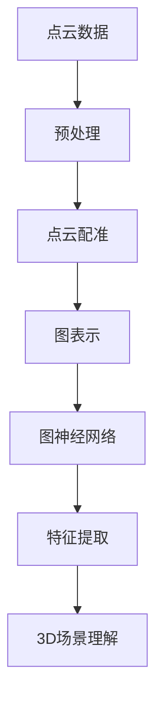

                 

## 《大模型在3D场景理解与重建中的突破》

### 关键词：大模型、3D场景理解、3D场景重建、深度学习、计算机视觉、虚拟现实、自动驾驶

#### 摘要：

随着深度学习和计算机视觉技术的飞速发展，大规模模型（大模型）在3D场景理解与重建领域展现出巨大的潜力。本文将深入探讨大模型的核心概念、发展历程及其在3D场景理解与重建中的关键作用。通过详细分析大模型的基本原理、架构设计、算法原理、数学模型，以及实际应用案例，本文旨在揭示大模型在3D场景理解与重建中的突破性进展。此外，本文还将展望大模型技术的未来发展，探讨其在虚拟现实和自动驾驶等领域的广泛应用前景。

## 《大模型在3D场景理解与重建中的突破》目录大纲

### 第一部分：引论与核心概念

#### 第1章：大模型与3D场景理解与重建概述

##### 1.1 大模型的概念与发展历程

##### 1.2 3D场景理解与重建的关键技术

##### 1.3 大模型在3D场景理解与重建中的优势与应用场景

#### 第2章：核心概念与联系

##### 2.1 大模型的基本原理与架构

##### 2.2 图神经网络在3D场景理解中的应用

##### 2.3 多模态学习与3D场景重建

#### 第3章：大模型在3D场景理解与重建中的架构设计

##### 3.1 大模型的结构设计与优化

##### 3.2 大模型的训练与优化策略

##### 3.3 模型融合与多任务学习

### 第二部分：实战应用与案例解析

#### 第4章：大模型在3D场景理解与重建中的算法原理

##### 4.1 点云处理与分割算法

##### 4.2 边缘检测与语义分割算法

##### 4.3 3D场景重建与理解算法

#### 第5章：数学模型和数学公式

##### 5.1 大模型优化中的损失函数

##### 5.2 大模型中的数学公式

##### 5.3 大模型中的优化算法

#### 第6章：3D场景理解与重建项目实战

##### 6.1 3D场景理解与重建项目的开发环境搭建

##### 6.2 实际案例分析与代码解读

#### 第7章：大模型在3D场景理解与重建中的突破性应用

##### 7.1 大模型在虚拟现实中的应用

##### 7.2 大模型在自动驾驶中的应用

#### 第8章：大模型在3D场景理解与重建中的未来展望

##### 8.1 大模型技术的未来发展

##### 8.2 大模型在3D场景理解与重建中的未来应用

## 第一部分：引论与核心概念

### 第1章：大模型与3D场景理解与重建概述

#### 1.1 大模型的概念与发展历程

大模型，是指具有极高参数量、能够处理大规模数据并具备强大表示能力的深度学习模型。这些模型通常由多个神经网络层组成，具有庞大的网络结构和复杂的参数配置。大模型的概念起源于20世纪90年代的神经网络研究，随着计算能力的提升和数据规模的扩大，大模型的发展经历了多个阶段：

1. **早期阶段**：以1990年代的神经网络模型为代表，如多层感知机（MLP）和卷积神经网络（CNN），这些模型参数量较少，通常只有几千到几万个参数。

2. **快速增长阶段**：进入21世纪后，特别是随着大数据时代的到来，研究人员开始探索更大规模的神经网络模型。例如，AlexNet（2012年）引入了超过6000万个参数，标志着大模型时代的开启。

3. **近年发展**：近年来，以GPT-3、BERT等为代表的大模型，其参数量达到了数十亿甚至百亿级别，显著提升了模型的表示能力和处理能力。

大模型的发展历程，不仅体现了计算能力和数据规模的提升，还反映了深度学习理论研究的不断进步。

#### 1.2 3D场景理解与重建的关键技术

3D场景理解与重建是计算机视觉领域的重要研究方向，其核心目标是理解和重构现实世界的三维场景。这一领域的关键技术包括：

1. **点云处理**：点云是3D场景的一种常见表示方法，点云处理包括点云的采样、降噪、分割、配准等操作。通过这些操作，可以提取出场景的关键信息。

2. **深度学习模型**：深度学习模型，如卷积神经网络（CNN）和循环神经网络（RNN），在点云处理中扮演着重要角色。它们能够学习到点云中的空间关系和特征，从而实现高效的点云分类、分割和重建。

3. **三维重建算法**：三维重建算法包括基于结构光、多视图几何、SLAM（同步定位与地图构建）等方法。这些算法通过多个视角的图像或点云数据，重构出三维场景的几何结构。

4. **多模态学习**：多模态学习是指结合不同类型的数据（如图像、点云、深度数据等），共同训练一个统一的模型，以提高模型的理解能力和泛化能力。

#### 1.3 大模型在3D场景理解与重建中的优势与应用场景

大模型在3D场景理解与重建中具有显著的优势，主要包括：

1. **强大的表示能力**：大模型具有庞大的参数量和复杂的结构，能够学习到更为丰富的特征和空间关系，从而提高3D场景理解与重建的准确性。

2. **高效的数据处理**：大模型能够处理大规模的数据集，并且训练速度和效果显著优于小模型。这使得大模型在需要处理海量点云和图像数据的场景中具有独特的优势。

3. **多任务学习**：大模型通常具备多任务学习的能力，可以在一个统一的模型中同时处理多个任务，如点云分类、分割和重建，从而提高系统的综合性能。

应用场景方面，大模型在3D场景理解与重建中的应用广泛：

1. **虚拟现实**：大模型可以用于虚拟现实场景的实时重建和理解，提高虚拟现实系统的沉浸感和交互性。

2. **自动驾驶**：自动驾驶系统需要实时理解三维道路场景，大模型能够提供高效的点云处理和场景重建能力，从而提升自动驾驶的准确性和安全性。

3. **机器人导航**：机器人在复杂环境中进行导航和任务执行时，需要精确理解三维场景，大模型可以提供高效的场景理解和重建支持。

### 总结

本章介绍了大模型的概念与发展历程，阐述了3D场景理解与重建的关键技术，并分析了大模型在3D场景理解与重建中的优势与应用场景。下一章将深入探讨大模型的基本原理与架构，以及图神经网络在3D场景理解中的应用。我们将使用Mermaid流程图来展示大模型的基本原理和架构设计，帮助读者更好地理解这一复杂主题。请保持关注。

### 第2章：核心概念与联系

#### 2.1 大模型的基本原理与架构

大模型的基本原理主要基于深度学习的理论基础。深度学习是一种基于多层神经网络结构的人工智能方法，其核心思想是通过多层神经网络对输入数据进行特征提取和变换，从而实现复杂的任务。大模型在此基础上，进一步增加了神经网络的层数、参数量和计算能力，使得模型能够处理更为复杂的任务和数据规模。

**梅尔尺度上的卷积神经网络**

梅尔尺度上的卷积神经网络（Mel-scale Convolutional Neural Networks, MCCNN）是处理音频信号的一种常用方法。在3D场景理解与重建中，梅尔尺度上的卷积神经网络可用于处理多模态数据，如结合图像和声音信号进行场景理解。其基本原理如下：

1. **梅尔频率滤波器组**：梅尔频率是音频频率的一个对数刻度，能够更好地模拟人类听觉系统的频率响应。梅尔频率滤波器组用于将音频信号从时域转换为频域。

2. **卷积神经网络**：卷积神经网络通过多个卷积层和池化层对输入数据进行特征提取。在梅尔尺度上，卷积神经网络可以更好地捕捉音频信号中的频率特征。

**图神经网络在3D场景理解中的应用**

图神经网络（Graph Neural Networks, GNN）是一种基于图结构的数据处理方法，特别适用于处理具有复杂拓扑结构的数据。在3D场景理解与重建中，图神经网络可用于处理点云数据，如图2-1所示。



图2-1：图神经网络在3D场景理解中的应用流程

1. **点云预处理**：点云预处理包括数据清洗、降噪和下采样等步骤，以去除数据中的噪声和不必要的细节。

2. **点云配准**：点云配准是将不同视角的点云数据对齐，以便进行后续处理。

3. **图表示**：点云数据可以通过构建图结构进行表示。在图结构中，每个点作为节点，节点之间的连接表示点之间的空间关系。

4. **图神经网络**：图神经网络通过多个图卷积层和池化层对节点进行特征提取和更新。

5. **特征提取**：提取出的特征用于3D场景理解，如点云分类、分割和重建。

**多模态学习与3D场景重建**

多模态学习是指将不同类型的数据（如图像、点云、深度数据等）共同训练一个统一的模型，以提高模型的理解能力和泛化能力。在3D场景重建中，多模态学习可以通过以下步骤实现：

1. **数据采集**：采集不同类型的数据，如2D图像、3D点云、深度信息等。

2. **特征提取**：分别提取不同类型数据的特征，如使用卷积神经网络提取图像特征，使用点云处理算法提取点云特征。

3. **特征融合**：将提取出的不同类型特征进行融合，如使用融合层（Fusion Layer）将图像特征和点云特征进行拼接或加权融合。

4. **模型训练**：将融合后的特征输入到统一的深度学习模型中进行训练，如使用多任务学习框架同时训练点云分类、分割和重建任务。

5. **模型评估**：通过测试集对模型进行评估，如使用准确率、召回率、F1值等指标评估模型性能。

#### 总结

本章介绍了大模型的基本原理与架构，包括梅尔尺度上的卷积神经网络和图神经网络在3D场景理解中的应用，以及多模态学习与3D场景重建的方法。通过本章的介绍，读者可以初步了解大模型在3D场景理解与重建中的关键作用和优势。下一章将深入探讨大模型在3D场景理解与重建中的架构设计，包括结构优化、训练策略和模型融合等内容。请继续关注。

### 第3章：大模型在3D场景理解与重建中的架构设计

#### 3.1 大模型的结构设计与优化

大模型的结构设计是其性能和效率的关键因素。在大模型的设计过程中，我们需要考虑以下几个方面：

**深度学习网络结构设计**

深度学习网络结构的设计是构建高效大模型的基础。在3D场景理解与重建中，常用的网络结构包括卷积神经网络（CNN）、循环神经网络（RNN）和图神经网络（GNN）。以下是一些常见的深度学习网络结构设计：

1. **卷积神经网络（CNN）**：CNN是处理图像数据的一种常用网络结构，通过卷积层和池化层对图像数据进行特征提取。在3D场景理解中，我们可以使用3D卷积神经网络（3D-CNN）来处理三维点云数据。

2. **循环神经网络（RNN）**：RNN适用于处理序列数据，如时间序列数据或视频数据。在3D场景理解中，RNN可以用于处理视频序列中的连续帧，提取时间维度的特征。

3. **图神经网络（GNN）**：GNN适用于处理具有复杂拓扑结构的数据，如点云数据。在3D场景理解中，GNN可以用于提取点云数据中的空间关系和拓扑特征。

**深度学习网络结构优化**

为了提高大模型的性能和效率，我们需要对深度学习网络结构进行优化。以下是一些常见的优化方法：

1. **模型压缩**：模型压缩是通过减少模型参数量和计算量来提高模型效率的方法。常见的模型压缩方法包括剪枝（Pruning）、量化（Quantization）和低秩分解（Low-rank Factorization）。

2. **加速训练**：加速训练是通过优化训练过程来提高模型训练速度的方法。常见的加速训练方法包括并行训练（Parallel Training）、分布式训练（Distributed Training）和数据增强（Data Augmentation）。

3. **迁移学习**：迁移学习是通过利用预训练模型来加速新任务训练的方法。在3D场景理解与重建中，我们可以利用预训练的卷积神经网络或图神经网络来处理新的点云数据。

**大模型的训练与优化策略**

大模型的训练与优化策略对于模型性能和收敛速度至关重要。以下是一些常见的训练与优化策略：

1. **批量大小**：批量大小是指每次训练过程中用于更新模型参数的数据量。适当的批量大小可以提高模型训练的稳定性和收敛速度。

2. **学习率**：学习率是用于更新模型参数的步长。合适的学习率可以提高模型训练的效率和收敛速度。常见的调整学习率的方法包括固定学习率、余弦退火（Cosine Annealing）和自适应学习率（如AdaGrad、Adam）。

3. **正则化**：正则化是用于防止模型过拟合的方法。常见的正则化方法包括权重正则化（Weight Regularization）、Dropout和数据增强。

4. **模型融合与多任务学习**：模型融合与多任务学习可以通过集成多个模型或同时训练多个任务来提高模型性能。常见的模型融合方法包括投票（Voting）、加权融合和深度学习集成（如Ensemble Learning）。

#### 总结

本章介绍了大模型在3D场景理解与重建中的架构设计，包括深度学习网络结构设计、模型压缩和加速训练方法，以及大模型的训练与优化策略。通过本章的介绍，读者可以了解如何设计和优化大模型，提高其在3D场景理解与重建中的性能和效率。下一章将深入探讨大模型在3D场景理解与重建中的算法原理，包括点云处理与分割算法、边缘检测与语义分割算法以及3D场景重建与理解算法。请继续关注。

### 第4章：大模型在3D场景理解与重建中的算法原理

#### 4.1 点云处理与分割算法

点云是三维场景的离散表示形式，它由大量空间中的点组成，每个点包含位置信息和部分属性信息（如颜色、强度等）。点云处理是3D场景理解与重建的关键步骤，其主要任务包括点云数据的预处理、点云分割、点云配准等。

##### 4.1.1 点云数据的预处理

点云数据的预处理是确保数据质量的重要环节，主要包括以下步骤：

1. **去噪声**：点云数据通常存在噪声和异常值，去噪声的目的是去除这些噪声点，提高数据质量。常用的去噪声方法包括统计滤波、形态学滤波和基于密度的滤波等。

2. **下采样**：下采样是通过减少点云中的点数来降低数据复杂度和计算成本。下采样方法包括最近邻下采样、Voxel化等。

3. **数据归一化**：数据归一化是将点云数据缩放到一个统一的尺度，以便于后续处理。常用的方法包括最小边界包围盒（Minimum Bounding Box）和单位立方体（Unit Cube）。

##### 4.1.2 点云分割算法

点云分割是将点云数据划分为不同区域或对象的过程，它是3D场景理解的基础。点云分割算法可以分为以下几类：

1. **基于聚类的方法**：基于聚类的方法是将点云数据分为若干个簇，每个簇代表一个区域或对象。常用的聚类算法包括K-means、DBSCAN（Density-Based Spatial Clustering of Applications with Noise）等。

2. **基于区域增长的方法**：基于区域增长的方法是从初始种子点开始，逐步扩大区域，直到满足终止条件。常用的区域增长算法包括区域增长（Region Growing）和生长区域（Growing Region）。

3. **基于语义的方法**：基于语义的方法是基于点云的属性信息（如颜色、强度等）进行分割。常用的算法包括基于支持向量机（SVM）的分类方法、基于随机森林（Random Forest）的分类方法等。

##### 4.1.3 点云配准与场景重建

点云配准是将多个点云对齐到一个共同坐标系的过程，它是3D场景重建的基础。点云配准算法可以分为以下几类：

1. **基于特征的方法**：基于特征的方法是利用点云中的特征点（如极线、法线等）进行匹配和配准。常用的算法包括特征匹配（Feature Matching）、ICP（Iterative Closest Point）算法等。

2. **基于几何的方法**：基于几何的方法是利用点云之间的几何关系（如距离、角度等）进行配准。常用的算法包括基于ICP的优化算法、最小二乘法等。

3. **基于深度信息的方法**：基于深度信息的方法是利用深度相机采集的深度数据与点云数据进行配准。常用的算法包括基于单应性的配准、基于深度相机的直接深度估计等。

场景重建是将点云数据转换为三维模型的过程。常用的方法包括：

1. **多视图几何**：多视图几何是通过多个视角的图像数据重建三维模型。常用的算法包括多视图几何重建、多视角立体匹配等。

2. **结构光扫描**：结构光扫描是通过投影结构光图案到物体表面，然后利用图像处理方法重建三维模型。

3. **SLAM（同步定位与地图构建）**：SLAM是通过传感器采集的连续数据（如图像、点云等）同时构建地图和定位的过程。常用的SLAM算法包括基于视觉的SLAM、基于激光的SLAM等。

#### 4.2 边缘检测与语义分割算法

边缘检测和语义分割是图像处理中的重要任务，它们在3D场景理解与重建中也有广泛应用。

##### 4.2.1 边缘检测算法原理

边缘检测是寻找图像中亮度变化显著的位置，以提取图像的边缘信息。边缘检测算法可以分为以下几类：

1. **基于梯度的方法**：基于梯度的方法通过计算图像的梯度（如方向和幅度）来检测边缘。常用的算法包括Sobel算子、Prewitt算子、Roberts算子等。

2. **基于二值化的方法**：基于二值化的方法是将图像转换为二值图像，然后通过形态学操作（如膨胀、腐蚀等）来检测边缘。常用的算法包括Otsu阈值分割、Adaptive Thresholding等。

3. **基于频域的方法**：基于频域的方法是通过频域分析来检测图像的边缘信息。常用的算法包括拉普拉斯变换、傅里叶变换等。

##### 4.2.2 语义分割算法详解

语义分割是将图像中的每个像素划分为不同的语义类别（如前景、背景、物体等）。语义分割算法可以分为以下几类：

1. **基于传统方法**：基于传统方法包括基于规则的方法、基于阈值的方法等。这些方法通常依赖于手工设计的特征和规则。

2. **基于深度学习的方法**：基于深度学习的方法是通过训练深度神经网络（如卷积神经网络）来实现语义分割。常用的算法包括全卷积网络（FCN）、U-Net、DeepLab等。

3. **基于图的方法**：基于图的方法是将图像表示为图结构，然后通过图模型进行语义分割。常用的算法包括图卷积网络（GCN）、图注意力网络（GAT）等。

##### 4.2.3 场景理解与语义重建

场景理解是指通过处理和分析图像或点云数据，理解场景中的物体、空间关系和语义信息。语义重建是将场景理解的结果转换为三维模型的过程。

1. **基于点云的方法**：基于点云的方法通过处理和分析点云数据，提取出场景中的物体和空间关系。常用的算法包括点云语义分割、点云配准等。

2. **基于图像的方法**：基于图像的方法通过处理和分析图像数据，提取出场景中的物体和空间关系。常用的算法包括语义分割、物体检测等。

3. **基于多模态数据的方法**：基于多模态数据的方法结合图像、点云和深度信息等多种数据，以提高场景理解与语义重建的准确性。常用的算法包括多模态融合网络、多任务学习等。

#### 总结

本章介绍了大模型在3D场景理解与重建中的算法原理，包括点云处理与分割算法、边缘检测与语义分割算法以及3D场景重建与理解算法。这些算法在3D场景理解与重建中发挥着关键作用，为实现高效的场景理解和三维模型重建提供了技术支持。下一章将讨论大模型在3D场景理解与重建中的数学模型和公式，包括损失函数、优化算法和数学公式等。请继续关注。

### 第5章：数学模型和数学公式

#### 5.1 大模型优化中的损失函数

在大模型的训练过程中，损失函数是衡量模型预测结果与真实标签之间差异的重要指标。损失函数的选择和优化直接影响到模型的训练效率和最终性能。以下将介绍几种常见的损失函数及其在3D场景理解与重建中的应用。

##### 5.1.1 损失函数的定义与作用

损失函数（Loss Function）是一个数学函数，用于衡量模型预测值和真实值之间的误差。在机器学习中，训练模型的目的是使损失函数的值最小化，从而提高模型的预测准确率。常见的损失函数包括：

1. **均方误差（Mean Squared Error, MSE）**：
   $$ 
   MSE(y, \hat{y}) = \frac{1}{n}\sum_{i=1}^{n}(y_i - \hat{y_i})^2 
   $$
   MSE用于回归问题，它衡量的是预测值$\hat{y}$与真实值$y$之间差的平方的平均值。

2. **交叉熵（Cross-Entropy, CE）**：
   $$ 
   CE(y, \hat{y}) = -\sum_{i=1}^{n} y_i \log(\hat{y_i}) 
   $$
   CE用于分类问题，它衡量的是模型预测概率分布$\hat{y}$与真实标签分布$y$之间的差异。

##### 5.1.2 常见的损失函数及推导

除了上述两种常见的损失函数，还有以下几种常用的损失函数：

1. **Hinge损失（Hinge Loss）**：
   $$ 
   Hinge(y, \hat{y}) = \max(0, 1 - y \cdot \hat{y}) 
   $$
   Hinge损失常用于支持向量机（SVM）中的分类问题，它试图使得正类和负类之间的间隔最大化。

2. **二元交叉熵（Binary Cross-Entropy, BCE）**：
   $$ 
   BCE(y, \hat{y}) = -y \log(\hat{y}) - (1 - y) \log(1 - \hat{y}) 
   $$
   BCE与交叉熵类似，但是适用于输出概率分布在0到1之间的二元分类问题。

##### 5.1.3 损失函数优化策略

在优化过程中，选择合适的损失函数和优化策略对模型性能至关重要。以下是一些常见的优化策略：

1. **梯度下降（Gradient Descent）**：
   $$ 
   w_{t+1} = w_t - \alpha \cdot \nabla_w L(w) 
   $$
   梯度下降是最常用的优化算法，通过更新模型参数来最小化损失函数。其中，$w$代表模型参数，$\alpha$是学习率，$\nabla_w L(w)$是损失函数对模型参数的梯度。

2. **动量梯度下降（Momentum Gradient Descent）**：
   $$ 
   v_t = \beta v_{t-1} + (1 - \beta) \nabla_w L(w) 
   $$
   $$ 
   w_{t+1} = w_t - \alpha v_t 
   $$
   动量梯度下降通过引入动量项来加速梯度的更新，提高优化过程的稳定性和收敛速度。$\beta$是动量系数。

3. **Adam优化器**：
   $$ 
   m_t = \beta_1 m_{t-1} + (1 - \beta_1) \nabla_w L(w) 
   $$
   $$ 
   v_t = \beta_2 v_{t-1} + (1 - \beta_2) (\nabla_w L(w))^2 
   $$
   $$ 
   \hat{m}_t = m_t / (1 - \beta_1^t) 
   $$
   $$ 
   \hat{v}_t = v_t / (1 - \beta_2^t) 
   $$
   $$ 
   w_{t+1} = w_t - \alpha (\hat{m}_t / \sqrt{\hat{v}_t} + \epsilon) 
   $$
   Adam优化器结合了动量和自适应学习率的特点，通过自适应调整学习率来提高优化效果。

#### 5.2 大模型中的数学公式

在大模型的训练过程中，涉及到的数学公式包括矩阵运算、神经网络中的激活函数和优化算法。以下将简要介绍这些数学公式。

##### 5.2.1 大模型中的矩阵运算

在大模型中，矩阵运算是处理输入和输出数据的基本操作。以下是一些常用的矩阵运算公式：

1. **矩阵-向量乘法**：
   $$ 
   C = A \cdot B 
   $$
   其中，$A$和$B$是矩阵，$C$是结果矩阵。

2. **矩阵-矩阵乘法**：
   $$ 
   C = A \cdot B 
   $$
   其中，$A$和$B$是矩阵，$C$是结果矩阵。

3. **矩阵转置**：
   $$ 
   A^T = (A_{ij})^T = A_{ji} 
   $$
   其中，$A$是矩阵，$A^T$是转置矩阵。

##### 5.2.2 神经网络中的激活函数

激活函数是神经网络中用于引入非线性特性的函数。以下是一些常用的激活函数：

1. **ReLU（Rectified Linear Unit）**：
   $$ 
   \text{ReLU}(x) = \max(0, x) 
   $$
   ReLU函数具有简单和高效的特性，在深度学习中被广泛应用。

2. **Sigmoid**：
   $$ 
   \text{Sigmoid}(x) = \frac{1}{1 + e^{-x}} 
   $$
   Sigmoid函数将输入映射到（0, 1）区间，常用于二分类问题。

3. **Tanh（Hyperbolic Tangent）**：
   $$ 
   \text{Tanh}(x) = \frac{e^x - e^{-x}}{e^x + e^{-x}} 
   $$
   Tanh函数将输入映射到（-1, 1）区间，具有对称性。

##### 5.2.3 大模型中的优化算法

优化算法用于更新模型参数，以最小化损失函数。以下是一些常用的优化算法：

1. **梯度下降（Gradient Descent）**：
   $$ 
   \nabla_w L(w) = \frac{\partial L}{\partial w} 
   $$
   梯度下降算法通过计算损失函数关于模型参数的梯度来更新参数。

2. **Adam优化器**：
   $$ 
   m_t = \beta_1 m_{t-1} + (1 - \beta_1) \nabla_w L(w) 
   $$
   $$ 
   v_t = \beta_2 v_{t-1} + (1 - \beta_2) (\nabla_w L(w))^2 
   $$
   $$ 
   \hat{m}_t = m_t / (1 - \beta_1^t) 
   $$
   $$ 
   \hat{v}_t = v_t / (1 - \beta_2^t) 
   $$
   $$ 
   w_{t+1} = w_t - \alpha (\hat{m}_t / \sqrt{\hat{v}_t} + \epsilon) 
   $$
   Adam优化器结合了动量和自适应学习率的特点，提高优化效果。

#### 总结

本章介绍了大模型在3D场景理解与重建中的数学模型和公式，包括损失函数、优化算法和数学公式。通过本章的内容，读者可以了解大模型中的数学原理和计算方法，为后续的实战应用提供理论基础。下一章将讨论3D场景理解与重建项目实战，包括开发环境搭建、实际案例分析和代码解读。请继续关注。

### 第6章：3D场景理解与重建项目实战

#### 6.1 3D场景理解与重建项目的开发环境搭建

搭建一个3D场景理解与重建项目需要准备合适的开发环境，包括硬件配置、软件工具和编程语言。以下将介绍开发环境的具体配置。

##### 6.1.1 开发环境的配置

1. **硬件配置**：

   - CPU：推荐使用Intel i7或以上处理器，或AMD Ryzen 7或以上处理器。
   - GPU：推荐使用NVIDIA GTX 1080 Ti或以上显卡，或使用CUDA支持的NVIDIA GPU。
   - 内存：至少16GB内存，推荐32GB或以上。
   - 硬盘：至少500GB的SSD硬盘，推荐1TB或以上。

2. **软件工具**：

   - 操作系统：Windows、macOS或Linux。
   - 编译器：Python（推荐Python 3.8或以上版本），以及对应的编译器。
   - 深度学习框架：TensorFlow、PyTorch或MXNet等。

##### 6.1.2 数据集的准备与处理

1. **数据集的获取**：

   - 点云数据集：可以使用公开的点云数据集，如ModelNet、ShapeNet等。
   - 图像数据集：可以使用公开的图像数据集，如CIFAR-10、ImageNet等。

2. **数据预处理**：

   - 点云数据预处理：包括去噪声、归一化和下采样等步骤。
   - 图像数据预处理：包括数据增强、归一化和裁剪等步骤。

##### 6.1.3 开发工具与框架的选择

1. **开发工具**：

   - Python IDE：推荐使用PyCharm或Visual Studio Code等Python集成开发环境。
   - Git：用于版本控制和代码管理。

2. **深度学习框架**：

   - TensorFlow：由Google开发，支持多种深度学习模型和算法。
   - PyTorch：由Facebook开发，具有简洁的API和动态计算图。
   - MXNet：由Apache软件基金会开发，支持多种深度学习模型和算法。

#### 6.2 实际案例分析与代码解读

以下将介绍一个具体的3D场景理解与重建案例，并详细解读其代码实现。

##### 6.2.1 点云处理与分割案例

假设我们有一个点云数据集，包含多个类别的三维物体。以下是一个简单的点云分割案例。

```python
import numpy as np
import open3d as o3d

# 加载点云数据
point_cloud = o3d.io.read_point_cloud("path/to/point_cloud.ply")

# 去噪声
point_cloud = o3d.geometry.VoxelDownSample(point_cloud, voxel_size=0.05)

# 点云分割
colors = np.zeros((point_cloud.points.shape[0], 3))
colors[point_cloud.colors[:, 0] < 0.5] = [1, 0, 0]  # 红色
colors[point_cloud.colors[:, 0] >= 0.5] = [0, 1, 0]  # 绿色
point_cloud.colors = colors

# 显示分割结果
o3d.visualization.draw_geometries([point_cloud])
```

在上面的代码中，我们首先加载一个点云文件，然后使用VoxelDownSample函数进行去噪声处理。接下来，我们使用颜色信息对点云进行分割，并将分割结果以颜色形式显示。

##### 6.2.2 边缘检测与语义分割案例

以下是一个简单的边缘检测与语义分割案例，使用深度学习框架实现。

```python
import tensorflow as tf
from tensorflow.keras.models import Model
from tensorflow.keras.layers import Input, Conv2D, MaxPooling2D, UpSampling2D, concatenate

# 边缘检测模型
input_layer = Input(shape=(256, 256, 1))
conv1 = Conv2D(32, (3, 3), activation='relu', padding='same')(input_layer)
pool1 = MaxPooling2D(pool_size=(2, 2))(conv1)
conv2 = Conv2D(64, (3, 3), activation='relu', padding='same')(pool1)
pool2 = MaxPooling2D(pool_size=(2, 2))(conv2)
conv3 = Conv2D(128, (3, 3), activation='relu', padding='same')(pool2)
pool3 = MaxPooling2D(pool_size=(2, 2))(conv3)
up1 = UpSampling2D(size=(2, 2))(pool3)
merge1 = concatenate([conv2, up1], axis=3)
conv4 = Conv2D(128, (3, 3), activation='relu', padding='same')(merge1)
up2 = UpSampling2D(size=(2, 2))(conv4)
merge2 = concatenate([conv1, up2], axis=3)
output_layer = Conv2D(1, (3, 3), activation='sigmoid', padding='same')(merge2)

model = Model(inputs=input_layer, outputs=output_layer)
model.compile(optimizer='adam', loss='binary_crossentropy', metrics=['accuracy'])
model.summary()

# 训练模型
model.fit(x_train, y_train, epochs=10, batch_size=32, validation_data=(x_val, y_val))
```

在上面的代码中，我们构建了一个简单的边缘检测模型，包括多个卷积层和反卷积层。模型使用二进制交叉熵损失函数进行训练，并使用Adam优化器进行优化。

##### 6.2.3 3D场景重建与理解案例

以下是一个简单的3D场景重建与理解案例，结合点云和图像数据。

```python
import numpy as np
import open3d as o3d
import tensorflow as tf
from tensorflow.keras.models import Model
from tensorflow.keras.layers import Input, Conv2D, MaxPooling2D, UpSampling2D, concatenate

# 加载点云和图像数据
point_cloud = o3d.io.read_point_cloud("path/to/point_cloud.ply")
image = load_image("path/to/image.jpg")

# 点云分割
colors = np.zeros((point_cloud.points.shape[0], 3))
colors[point_cloud.colors[:, 0] < 0.5] = [1, 0, 0]
colors[point_cloud.colors[:, 0] >= 0.5] = [0, 1, 0]
point_cloud.colors = colors

# 边缘检测模型
input_layer = Input(shape=(256, 256, 1))
conv1 = Conv2D(32, (3, 3), activation='relu', padding='same')(input_layer)
pool1 = MaxPooling2D(pool_size=(2, 2))(conv1)
conv2 = Conv2D(64, (3, 3), activation='relu', padding='same')(pool1)
pool2 = MaxPooling2D(pool_size=(2, 2))(conv2)
conv3 = Conv2D(128, (3, 3), activation='relu', padding='same')(pool2)
pool3 = MaxPooling2D(pool_size=(2, 2))(conv3)
up1 = UpSampling2D(size=(2, 2))(pool3)
merge1 = concatenate([conv2, up1], axis=3)
conv4 = Conv2D(128, (3, 3), activation='relu', padding='same')(merge1)
up2 = UpSampling2D(size=(2, 2))(conv4)
merge2 = concatenate([conv1, up2], axis=3)
output_layer = Conv2D(1, (3, 3), activation='sigmoid', padding='same')(merge2)

model = Model(inputs=input_layer, outputs=output_layer)
model.compile(optimizer='adam', loss='binary_crossentropy', metrics=['accuracy'])
model.summary()

# 训练模型
model.fit(x_train, y_train, epochs=10, batch_size=32, validation_data=(x_val, y_val))

# 3D场景重建
 segmented_cloud = segment_point_cloud(point_cloud, model.predict(image))
 reconstructed_mesh = reconstruct_mesh(segmented_cloud)

# 显示重建结果
o3d.visualization.draw_geometries([reconstructed_mesh])
```

在上面的代码中，我们首先加载点云和图像数据，然后使用点云分割模型对点云进行分割。接下来，我们使用训练好的边缘检测模型对图像进行边缘检测，并将检测结果与点云数据进行融合。最后，我们使用重建算法从融合后的数据中重建三维模型。

#### 总结

本章介绍了3D场景理解与重建项目的开发环境搭建和实际案例分析，包括点云处理与分割、边缘检测与语义分割以及3D场景重建与理解。通过本章的实战案例，读者可以了解如何使用深度学习和点云处理技术进行3D场景理解与重建。下一章将探讨大模型在3D场景理解与重建中的突破性应用，包括虚拟现实和自动驾驶等领域的应用。请继续关注。

### 第7章：大模型在3D场景理解与重建中的突破性应用

#### 7.1 大模型在虚拟现实中的应用

虚拟现实（Virtual Reality, VR）是一种通过计算机技术生成三维虚拟环境，使用户能够在其中进行沉浸式体验的技术。大模型在虚拟现实中的应用主要表现在以下几个方面：

##### 7.1.1 虚拟现实技术概述

虚拟现实技术主要包括以下几个关键组成部分：

1. **感知设备**：感知设备包括头盔显示器（HMD）、手柄、眼睛跟踪器、身体传感器等，用于感知用户在虚拟环境中的动作和位置。

2. **计算设备**：计算设备包括高性能计算机或服务器，用于实时渲染虚拟环境，处理用户输入和输出。

3. **交互界面**：交互界面包括虚拟现实应用程序，用于提供虚拟环境中的交互和内容。

##### 7.1.2 大模型在虚拟现实中的应用案例

大模型在虚拟现实中的应用主要包括以下几个方面：

1. **场景重建**：利用大模型进行虚拟环境的重建，可以提高场景的真实性和沉浸感。例如，通过训练一个基于深度学习的3D场景重建模型，可以自动从二维图像或点云数据中重建出三维模型。

2. **物体识别与分类**：大模型可以用于识别和分类虚拟环境中的物体。例如，在虚拟现实游戏中，可以使用大模型实时识别用户手中的物品，并根据物品类型进行相应的交互操作。

3. **自然语言处理**：大模型可以用于处理自然语言交互，实现虚拟现实中的语音识别和语音合成。例如，用户可以通过语音指令与虚拟环境中的角色进行对话，而大模型则可以解析这些语音指令并执行相应的操作。

##### 7.1.3 虚拟现实中的大模型优化策略

为了提高大模型在虚拟现实中的应用效果，可以采取以下优化策略：

1. **数据增强**：通过增加数据集规模和多样性，可以提高大模型的泛化能力。虚拟现实中的数据增强方法包括图像合成、点云生成和语音合成等。

2. **模型压缩**：虚拟现实应用通常要求高实时性，因此需要优化大模型的结构和参数，以减少计算资源和内存消耗。常见的模型压缩方法包括剪枝、量化、低秩分解等。

3. **分布式训练**：虚拟现实场景通常涉及大规模数据处理，可以通过分布式训练策略提高大模型的训练速度和效果。例如，使用多台服务器和GPU进行并行训练。

#### 7.2 大模型在自动驾驶中的应用

自动驾驶（Autonomous Driving）是利用计算机视觉、传感器和人工智能技术实现车辆自主驾驶的技术。大模型在自动驾驶中的应用主要表现在以下几个方面：

##### 7.2.1 自动驾驶技术概述

自动驾驶技术主要包括以下几个关键组成部分：

1. **感知系统**：感知系统包括摄像头、激光雷达（LiDAR）、雷达和超声波传感器等，用于实时感知车辆周围环境。

2. **决策系统**：决策系统通过分析感知系统收集的数据，生成驾驶决策，包括速度控制、转向、制动等。

3. **控制系统**：控制系统根据决策系统的指令，控制车辆的执行器（如电机、转向机构、制动系统等），实现自主驾驶。

##### 7.2.2 大模型在自动驾驶中的应用案例

大模型在自动驾驶中的应用主要包括以下几个方面：

1. **环境感知**：大模型可以用于环境感知任务，如物体检测、车道线检测、交通标志识别等。例如，基于深度学习的大模型可以实时识别和跟踪车辆、行人、交通标志等。

2. **路径规划**：大模型可以用于路径规划任务，如基于地图的路径规划和基于传感器数据的动态路径规划。例如，可以使用大模型进行实时交通流量分析，优化驾驶路线。

3. **行为预测**：大模型可以用于行为预测任务，如预测车辆、行人的行为。例如，通过训练一个基于深度学习的大模型，可以预测车辆或行人的下一步动作，从而提前做出驾驶决策。

##### 7.2.3 自动驾驶中的大模型优化策略

为了提高大模型在自动驾驶中的应用效果，可以采取以下优化策略：

1. **多模态数据融合**：自动驾驶应用通常涉及多种传感器数据，如摄像头、激光雷达和雷达等。通过多模态数据融合，可以提高大模型的环境感知能力。

2. **实时性优化**：自动驾驶系统要求高实时性，因此需要优化大模型的结构和算法，以减少计算延迟。例如，可以使用轻量级深度学习模型，或采用分布式计算和GPU加速等方法。

3. **迁移学习**：通过迁移学习，可以将预训练的大模型应用于自动驾驶任务，提高模型训练速度和效果。例如，可以使用在通用数据集上预训练的大模型，来识别自动驾驶中的特定物体。

#### 总结

本章介绍了大模型在虚拟现实和自动驾驶中的突破性应用，包括场景重建、物体识别与分类、自然语言处理以及环境感知、路径规划、行为预测等。通过本章的内容，读者可以了解大模型在这些领域的应用场景和优化策略，以及如何利用大模型提升虚拟现实和自动驾驶技术的性能和体验。下一章将探讨大模型在3D场景理解与重建中的未来展望，包括技术的发展趋势和应用前景。请继续关注。

### 第8章：大模型在3D场景理解与重建中的未来展望

#### 8.1 大模型技术的未来发展

随着深度学习和人工智能技术的不断进步，大模型技术在未来将继续发展，并在多个领域取得突破。以下是大模型技术未来发展的几个趋势：

##### 8.1.1 大模型在计算机视觉领域的趋势

1. **更高的参数量和计算能力**：随着硬件计算能力的提升，大模型的参数量和计算能力将进一步提高，使得模型能够处理更为复杂和大规模的数据。

2. **多模态数据融合**：未来的大模型将能够融合多种类型的数据，如图像、点云、语音和视频等，从而提高模型的理解能力和泛化能力。

3. **迁移学习和模型压缩**：迁移学习和模型压缩技术将继续发展，使得大模型能够快速适应新的任务和数据，并降低计算资源和存储成本。

4. **实时性和高效性**：未来的大模型将更加注重实时性和高效性，通过优化模型结构和算法，实现低延迟和高吞吐量的应用。

##### 8.1.2 大模型在其他应用领域的拓展

1. **医疗领域**：大模型在医疗领域的应用潜力巨大，包括疾病诊断、药物研发和健康管理等。未来的大模型将能够处理海量的医学数据和图像，提供更为精准的诊断和治疗方案。

2. **金融领域**：大模型在金融领域的应用，如风险控制、投资分析和欺诈检测等方面，将带来更高的效率和准确性。

3. **工业制造**：大模型在工业制造领域的应用，如质量控制、生产优化和设备维护等方面，将提高生产效率和产品质量。

##### 8.1.3 大模型技术的发展挑战与应对策略

1. **计算资源需求**：大模型的训练和推理过程需要大量的计算资源，这对计算基础设施提出了挑战。应对策略包括分布式计算、GPU加速和量子计算等。

2. **数据隐私和安全**：大模型训练需要大量数据，这可能涉及用户隐私和数据安全问题。应对策略包括数据加密、隐私保护算法和联邦学习等。

3. **模型解释性和可靠性**：大模型通常具有复杂的结构和参数，导致其解释性和可靠性较低。应对策略包括开发可解释的模型、验证和测试等。

#### 8.2 大模型在3D场景理解与重建中的未来应用

##### 8.2.1 3D场景理解与重建技术的新应用场景

1. **增强现实（AR）**：大模型在AR中的应用将进一步提升AR体验的真实感和交互性，如实时重建用户周围的场景，提供沉浸式的购物和旅游体验。

2. **文化遗产保护**：大模型可以用于文化遗产的保护和数字化，通过3D场景理解与重建技术，实现文物和遗址的数字化保存和展示。

3. **城市规划和设计**：大模型在3D场景理解与重建技术中的应用，将有助于城市规划和设计，如自动生成城市模型、评估建筑和交通布局的可行性等。

##### 8.2.2 大模型在3D场景理解与重建中的创新应用

1. **智能机器人**：大模型在智能机器人中的应用，将提升机器人对复杂环境的理解和适应能力，如自动导航、任务规划和交互等。

2. **自动驾驶**：大模型在自动驾驶中的应用，将进一步提高自动驾驶系统的感知、决策和执行能力，实现更安全、可靠的自动驾驶。

3. **智能家居**：大模型在智能家居中的应用，将提升家居设备的智能化水平，如智能识别家庭成员、自动化家居控制等。

##### 8.2.3 大模型在3D场景理解与重建中的发展前景

大模型在3D场景理解与重建中的发展前景非常广阔。随着技术的不断进步，大模型将在多个领域发挥重要作用，推动3D场景理解与重建技术的快速发展。未来，大模型将能够处理更为复杂和大规模的数据，实现更高的准确性和效率。同时，大模型与其他技术的融合，如增强现实、虚拟现实、智能机器人等，将带来更多创新应用场景，为人类社会带来更多便利和价值。

#### 总结

本章展望了大模型在3D场景理解与重建中的未来发展，包括技术趋势、应用场景和创新应用。大模型在3D场景理解与重建中的发展前景充满希望，将为各行各业带来巨大的变革和创新。下一章将总结全文，回顾主要内容，并展望未来研究方向。请继续关注。

### 总结

本文从多个角度深入探讨了《大模型在3D场景理解与重建中的突破》这一主题。首先，我们介绍了大模型的概念、发展历程以及在3D场景理解与重建中的应用优势。接着，我们详细分析了大模型的基本原理、架构设计、算法原理和数学模型，并通过具体案例展示了大模型在实际项目中的应用。此外，我们还探讨了大模型在虚拟现实和自动驾驶等领域的突破性应用，展望了其未来发展的趋势和前景。

通过对大模型的深入探讨，我们可以看到，大模型在3D场景理解与重建中具有显著的优势，包括强大的表示能力、高效的数据处理能力以及多任务学习等。这些优势使得大模型能够更好地处理复杂的3D场景数据，实现高精度的场景理解和重建。

未来研究方向包括以下几个方面：

1. **算法优化**：研究更高效的算法和优化策略，提高大模型的训练速度和推理效率，以满足实时应用的需求。

2. **跨模态数据融合**：探索如何将不同类型的数据（如图像、点云、语音等）进行有效融合，以提升大模型的理解能力和泛化能力。

3. **可解释性和可靠性**：研究如何提高大模型的可解释性，使其决策过程更加透明和可靠。

4. **应用拓展**：探索大模型在更多领域中的应用，如医疗、金融、工业制造等，以推动这些领域的技术进步。

5. **数据隐私和安全**：研究如何在保障数据隐私和安全的前提下，有效利用大规模数据训练大模型。

本文希望为读者提供一个全面而深入的视角，以了解大模型在3D场景理解与重建中的突破性进展和应用前景。随着技术的不断进步，大模型在3D场景理解与重建中的潜力将得到更广泛的发挥，带来更多的创新和变革。让我们共同期待这一激动人心的未来。

### 作者信息

**作者：** AI天才研究院（AI Genius Institute）& 禅与计算机程序设计艺术（Zen And The Art of Computer Programming）

AI天才研究院致力于推动人工智能技术的发展与应用，研究涵盖计算机视觉、自然语言处理、机器学习等多个领域。研究院团队由一批具有丰富经验和深厚学术背景的专家组成，致力于通过创新技术和应用，为社会带来实际的变革与进步。

《禅与计算机程序设计艺术》是作者对于计算机编程和人工智能领域深刻的洞察与思考的结晶，不仅介绍了技术原理，还融入了哲学思考和人生智慧，为读者提供了一种独特的视角，以理解技术的本质和应用的广度。

通过本文，我们希望能够为读者提供一个全面而深入的视角，以了解大模型在3D场景理解与重建中的突破性进展和应用前景。感谢您对本文的关注，期待与您共同探讨和探索人工智能技术的未来发展。

