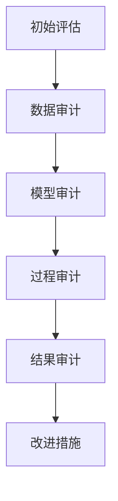

                 

### 第一部分：引言

#### 第1章：大模型伦理审计概述

随着人工智能技术的飞速发展，大型模型（Large Models，简称LMs）已成为各行各业的重要工具，从自然语言处理到图像识别，从自动驾驶到医疗诊断，大模型无处不在。然而，大模型的广泛应用也带来了许多伦理问题，例如数据隐私、算法偏见、责任归属等。因此，对大模型进行伦理审计（Ethical Audits of Large Models）显得尤为重要。

##### 1.1 大模型伦理审计的重要性

大模型伦理审计是指对大模型的设计、开发、部署和使用过程进行全面的伦理评估，以确保其在应用过程中不会产生道德风险和负面影响。伦理审计的重要性主要体现在以下几个方面：

1. **保障数据隐私**：大模型通常需要处理大量敏感数据，如个人身份信息、医疗记录等。如果数据处理不当，可能导致数据泄露和隐私侵犯。
2. **消除算法偏见**：大模型在训练过程中可能会学习并放大数据中的偏见，从而导致不公平的决策。伦理审计可以帮助发现并纠正这些偏见。
3. **明确责任归属**：在大模型发生错误或造成损害时，责任归属往往不明确。伦理审计可以帮助建立明确的责任体系，提高责任承担的透明度。
4. **提升公众信任**：随着公众对人工智能的担忧日益增加，伦理审计有助于提升公众对AI技术的信任，促进技术的可持续发展。

##### 1.2 大模型伦理审计的目标和挑战

大模型伦理审计的目标主要包括以下几个方面：

1. **评估伦理风险**：识别大模型在开发、部署和使用过程中可能产生的伦理风险，如数据隐私、算法偏见等。
2. **提出改进措施**：针对识别出的伦理风险，提出具体的改进措施，以降低风险并确保大模型的应用符合道德规范。
3. **建立责任体系**：明确大模型开发、部署和使用过程中各方的责任，确保责任承担的透明和公正。
4. **促进技术进步**：通过伦理审计，推动大模型技术的健康发展，提高其在各行业中的应用效果。

然而，大模型伦理审计也面临诸多挑战：

1. **复杂性**：大模型涉及多个学科和技术领域，审计过程复杂且难以全面覆盖。
2. **不确定性**：大模型的行为和影响难以预测，审计结果可能存在一定的不确定性。
3. **利益冲突**：大模型伦理审计可能涉及各方利益，如技术开发者、企业、用户等，审计过程中需要平衡各方利益。
4. **法规和标准**：目前，大模型伦理审计的相关法规和标准尚不完善，审计过程缺乏统一的指导。

##### 1.3 大模型伦理审计的方法和流程

大模型伦理审计的方法主要包括定性分析和定量分析两种。定性分析主要关注伦理风险的识别和评估，而定量分析则侧重于评估风险的程度和影响。

大模型伦理审计的流程通常包括以下几个步骤：

1. **初步评估**：对大模型的应用场景、数据来源、算法设计等进行初步了解，识别潜在的伦理风险。
2. **数据审计**：对大模型所处理的数据进行审计，检查数据质量、隐私保护等方面的问题。
3. **算法审计**：分析大模型的算法设计，评估其可能产生的偏见和公平性风险。
4. **过程审计**：对大模型的设计、开发、部署和使用过程进行审计，检查是否符合伦理规范。
5. **结果审计**：对大模型的应用效果进行审计，评估其对用户、社会等各方的影响。
6. **改进措施**：针对审计过程中发现的问题，提出具体的改进措施，并跟踪改进效果。

##### 1.4 大模型伦理审计的应用场景

大模型伦理审计的应用场景非常广泛，主要包括以下几个方面：

1. **公共安全领域**：如人脸识别系统、智能监控系统等，需要确保其公平性、准确性和隐私保护。
2. **医疗领域**：如医疗诊断模型、药物研发模型等，需要确保其算法公正、数据安全。
3. **金融领域**：如信贷审批模型、风险评估模型等，需要确保其算法透明、决策公正。
4. **教育领域**：如智能辅导系统、考试评分系统等，需要确保其公平性、隐私保护。
5. **企业应用**：如智能客服系统、供应链优化模型等，需要确保其算法公正、数据安全。

通过大模型伦理审计，可以为各行业提供科学、规范的伦理评估方法，确保人工智能技术的健康发展。

### 总结

大模型伦理审计是确保人工智能技术道德合规性的一项重要工作。通过对大模型进行全面的伦理评估，可以识别和降低伦理风险，提高公众对人工智能技术的信任。同时，大模型伦理审计也面临诸多挑战，需要不断探索和完善审计方法和流程。未来，随着人工智能技术的不断进步，大模型伦理审计将发挥越来越重要的作用。

---

在接下来的章节中，我们将进一步探讨大模型伦理审计的具体方法、风险分析和审计实践，以期为读者提供全面、深入的理解。让我们继续深入探讨这一重要议题。

---

---

**文章标题**：大模型的伦理审计:确保AI应用的道德合规性

**关键词**：大模型，伦理审计，道德合规性，AI应用，数据隐私，算法偏见，责任归属

**摘要**：本文从大模型伦理审计的背景、重要性、目标和挑战出发，详细介绍了大模型伦理审计的方法和流程，分析了大模型的伦理风险，探讨了伦理审计在各个应用场景中的具体实践。文章旨在为读者提供关于大模型伦理审计的全面理解和实践指导，推动人工智能技术的道德合规发展。文章最后展望了未来大模型伦理审计的发展趋势，并提出了相应的建议。

---

**正文**：

## 《大模型的伦理审计:确保AI应用的道德合规性》目录大纲

### 第一部分：引言

#### 第1章：大模型伦理审计概述

- **1.1 大模型伦理审计的重要性**
- **1.2 大模型伦理审计的目标和挑战**
- **1.3 大模型伦理审计的方法和流程**
- **1.4 大模型伦理审计的应用场景**

#### 第2章：大模型伦理风险分析

- **2.1 数据隐私风险**
- **2.2 数据偏差和公平性风险**
- **2.3 隐性偏见和歧视风险**
- **2.4 责任归属和透明度风险**

#### 第3章：大模型伦理风险评估

- **3.1 风险评估框架**
- **3.2 定量风险评估方法**
- **3.3 定性风险评估方法**
- **3.4 风险优先级排序**

### 第二部分：大模型伦理审计方法与实践

#### 第4章：大模型伦理审计技术

- **4.1 数据审计技术**
- **4.2 模型审计技术**
- **4.3 过程审计技术**
- **4.4 结果审计技术**

#### 第5章：大模型伦理审计案例

- **5.1 案例一：人脸识别系统的伦理审计**
- **5.2 案例二：自动驾驶汽车的伦理审计**
- **5.3 案例三：金融风控模型的伦理审计**

#### 第6章：大模型伦理审计的最佳实践

- **6.1 最佳实践框架**
- **6.2 伦理审计团队建设**
- **6.3 伦理审计流程优化**
- **6.4 伦理审计结果应用**

### 第三部分：大模型伦理审计的未来趋势

#### 第7章：大模型伦理审计的挑战与机遇

- **7.1 法规和标准的发展**
- **7.2 技术创新对伦理审计的影响**
- **7.3 社会责任与商业伦理**
- **7.4 国际合作与交流**

### 附录

#### 附录A：大模型伦理审计工具与资源

- **A.1 常用伦理审计工具介绍**
- **A.2 伦理审计资源库**
- **A.3 国际伦理审计组织与指南**

#### 附录B：大模型伦理审计流程图

- **使用Mermaid语言描述大模型伦理审计流程**

#### 附录C：大模型伦理审计算法伪代码

- **使用伪代码详细描述大模型伦理审计算法原理**

#### 附录D：大模型伦理审计数学模型和公式

- **使用latex格式嵌入数学模型和公式，并进行详细讲解和举例说明**

#### 附录E：大模型伦理审计项目实战案例

- **代码实际案例和详细解释说明**
- **开发环境搭建**
- **源代码详细实现和代码解读**
- **代码解读与分析**

---

**文章标题**：大模型的伦理审计:确保AI应用的道德合规性

**关键词**：大模型，伦理审计，道德合规性，AI应用，数据隐私，算法偏见，责任归属

**摘要**：本文从大模型伦理审计的背景、重要性、目标和挑战出发，详细介绍了大模型伦理审计的方法和流程，分析了大模型的伦理风险，探讨了伦理审计在各个应用场景中的具体实践。文章旨在为读者提供关于大模型伦理审计的全面理解和实践指导，推动人工智能技术的道德合规发展。文章最后展望了未来大模型伦理审计的发展趋势，并提出了相应的建议。

---

**正文**：

## 第一部分：引言

随着人工智能技术的快速发展，大模型（Large Models）在自然语言处理、计算机视觉、语音识别等领域取得了显著成果。然而，大模型的应用也引发了一系列伦理问题，如数据隐私、算法偏见、责任归属等。为了确保AI技术的道德合规性，对大模型进行伦理审计（Ethical Audits of Large Models）显得尤为重要。

### 第1章：大模型伦理审计概述

#### 1.1 大模型伦理审计的重要性

大模型伦理审计是指对大模型的设计、开发、部署和使用过程进行全面的伦理评估，以确保其在应用过程中不会产生道德风险和负面影响。伦理审计的重要性主要体现在以下几个方面：

1. **保障数据隐私**：大模型通常需要处理大量敏感数据，如个人身份信息、医疗记录等。如果数据处理不当，可能导致数据泄露和隐私侵犯。
2. **消除算法偏见**：大模型在训练过程中可能会学习并放大数据中的偏见，从而导致不公平的决策。伦理审计可以帮助发现并纠正这些偏见。
3. **明确责任归属**：在大模型发生错误或造成损害时，责任归属往往不明确。伦理审计可以帮助建立明确的责任体系，提高责任承担的透明度。
4. **提升公众信任**：随着公众对人工智能的担忧日益增加，伦理审计有助于提升公众对AI技术的信任，促进技术的可持续发展。

#### 1.2 大模型伦理审计的目标和挑战

大模型伦理审计的目标主要包括以下几个方面：

1. **评估伦理风险**：识别大模型在开发、部署和使用过程中可能产生的伦理风险，如数据隐私、算法偏见等。
2. **提出改进措施**：针对识别出的伦理风险，提出具体的改进措施，以降低风险并确保大模型的应用符合道德规范。
3. **建立责任体系**：明确大模型开发、部署和使用过程中各方的责任，确保责任承担的透明和公正。
4. **促进技术进步**：通过伦理审计，推动大模型技术的健康发展，提高其在各行业中的应用效果。

然而，大模型伦理审计也面临诸多挑战：

1. **复杂性**：大模型涉及多个学科和技术领域，审计过程复杂且难以全面覆盖。
2. **不确定性**：大模型的行为和影响难以预测，审计结果可能存在一定的不确定性。
3. **利益冲突**：大模型伦理审计可能涉及各方利益，如技术开发者、企业、用户等，审计过程中需要平衡各方利益。
4. **法规和标准**：目前，大模型伦理审计的相关法规和标准尚不完善，审计过程缺乏统一的指导。

#### 1.3 大模型伦理审计的方法和流程

大模型伦理审计的方法主要包括定性分析和定量分析两种。定性分析主要关注伦理风险的识别和评估，而定量分析则侧重于评估风险的程度和影响。

大模型伦理审计的流程通常包括以下几个步骤：

1. **初步评估**：对大模型的应用场景、数据来源、算法设计等进行初步了解，识别潜在的伦理风险。
2. **数据审计**：对大模型所处理的数据进行审计，检查数据质量、隐私保护等方面的问题。
3. **算法审计**：分析大模型的算法设计，评估其可能产生的偏见和公平性风险。
4. **过程审计**：对大模型的设计、开发、部署和使用过程进行审计，检查是否符合伦理规范。
5. **结果审计**：对大模型的应用效果进行审计，评估其对用户、社会等各方的影响。
6. **改进措施**：针对审计过程中发现的问题，提出具体的改进措施，并跟踪改进效果。

#### 1.4 大模型伦理审计的应用场景

大模型伦理审计的应用场景非常广泛，主要包括以下几个方面：

1. **公共安全领域**：如人脸识别系统、智能监控系统等，需要确保其公平性、准确性和隐私保护。
2. **医疗领域**：如医疗诊断模型、药物研发模型等，需要确保其算法公正、数据安全。
3. **金融领域**：如信贷审批模型、风险评估模型等，需要确保其算法透明、决策公正。
4. **教育领域**：如智能辅导系统、考试评分系统等，需要确保其公平性、隐私保护。
5. **企业应用**：如智能客服系统、供应链优化模型等，需要确保其算法公正、数据安全。

通过大模型伦理审计，可以为各行业提供科学、规范的伦理评估方法，确保人工智能技术的健康发展。

### 总结

大模型伦理审计是确保人工智能技术道德合规性的一项重要工作。通过对大模型进行全面的伦理评估，可以识别和降低伦理风险，提高公众对人工智能技术的信任。同时，大模型伦理审计也面临诸多挑战，需要不断探索和完善审计方法和流程。未来，随着人工智能技术的不断进步，大模型伦理审计将发挥越来越重要的作用。

在接下来的章节中，我们将进一步探讨大模型伦理审计的具体方法、风险分析和审计实践，以期为读者提供全面、深入的理解。让我们继续深入探讨这一重要议题。

---

**文章标题**：大模型的伦理审计:确保AI应用的道德合规性

**关键词**：大模型，伦理审计，道德合规性，AI应用，数据隐私，算法偏见，责任归属

**摘要**：本文从大模型伦理审计的背景、重要性、目标和挑战出发，详细介绍了大模型伦理审计的方法和流程，分析了大模型的伦理风险，探讨了伦理审计在各个应用场景中的具体实践。文章旨在为读者提供关于大模型伦理审计的全面理解和实践指导，推动人工智能技术的道德合规发展。文章最后展望了未来大模型伦理审计的发展趋势，并提出了相应的建议。

---

**正文**：

## 第二部分：大模型伦理风险分析

在人工智能技术的快速发展过程中，大模型（Large Models）的应用日益广泛，然而其潜在的伦理风险也逐渐暴露出来。本部分将对大模型的伦理风险进行分析，主要包括数据隐私风险、数据偏差和公平性风险、隐性偏见和歧视风险以及责任归属和透明度风险。

### 第2章：大模型伦理风险识别

#### 2.1 数据隐私风险

数据隐私是人工智能领域最为关注的问题之一。大模型通常需要处理大量敏感数据，如个人身份信息、医疗记录、金融数据等。这些数据的泄露可能导致严重的隐私侵犯，甚至引发严重的法律纠纷。数据隐私风险主要体现在以下几个方面：

1. **数据收集**：在数据收集过程中，未经用户同意或未明确告知用户数据的使用目的和范围，可能导致用户隐私被非法获取。
2. **数据存储**：在数据存储过程中，如果安全措施不到位，如加密不当、访问权限管理不严，可能导致敏感数据被非法访问或篡改。
3. **数据传输**：在数据传输过程中，如果未使用安全协议，如HTTPS等，可能导致数据在传输过程中被窃取或篡改。

#### 2.2 数据偏差和公平性风险

数据偏差和公平性风险是指大模型在训练过程中可能会学习并放大数据中的偏见，从而导致不公平的决策。数据偏差和公平性风险主要体现在以下几个方面：

1. **训练数据偏差**：在数据收集和预处理过程中，如果数据存在偏差，如性别、种族、年龄等，可能导致大模型在学习过程中放大这些偏差，从而产生不公平的决策。
2. **算法偏差**：大模型的算法设计可能存在固有的偏见，如某些算法对特定人群的表现较差，可能导致这些人群在决策中受到不公平对待。
3. **模型性能偏差**：在模型评估过程中，如果评估指标选择不当，可能导致模型性能偏差，如某些指标过于重视某些特定人群的表现，从而影响模型的公平性。

#### 2.3 隐性偏见和歧视风险

隐性偏见和歧视风险是指大模型在决策过程中可能表现出隐性偏见和歧视行为，从而对某些特定人群造成不公平对待。隐性偏见和歧视风险主要体现在以下几个方面：

1. **算法表现差异**：在决策过程中，如果大模型对某些特定人群的表现较差，可能导致这些人群在决策中受到不公平对待。
2. **决策过程不公平**：在决策过程中，如果大模型的决策过程存在不透明或难以解释的部分，可能导致用户对决策结果产生不公平的质疑。
3. **用户行为歧视**：在某些应用场景中，大模型可能会根据用户的历史行为数据进行决策，如广告推荐、信用评分等，如果历史数据存在歧视，可能导致大模型对某些特定人群进行歧视。

#### 2.4 责任归属和透明度风险

责任归属和透明度风险是指在大模型发生错误或造成损害时，责任归属不明确，导致责任承担不透明。责任归属和透明度风险主要体现在以下几个方面：

1. **责任划分**：在大模型的应用过程中，涉及多个利益相关方，如技术开发者、企业、用户等，如果责任归属不明确，可能导致责任承担不明确。
2. **决策解释**：在大模型决策过程中，如果决策结果无法解释或解释不充分，可能导致用户对决策结果产生质疑，增加责任承担的不确定性。
3. **责任追究**：在大模型造成损害时，如果责任追究机制不健全，可能导致责任承担不公平，增加社会的道德风险。

### 第3章：大模型伦理风险评估

在对大模型进行伦理审计时，风险评估是一个关键步骤。通过风险评估，可以识别出大模型应用过程中可能存在的伦理风险，并对其进行优先级排序，以便采取相应的风险应对措施。

#### 3.1 风险评估框架

为了对大模型的伦理风险进行评估，可以采用以下风险评估框架：

1. **风险识别**：通过文献调研、案例分析和专家咨询等方法，识别出大模型应用过程中可能存在的伦理风险。
2. **风险分析**：对识别出的风险进行定性分析和定量分析，评估其可能的影响程度和发生概率。
3. **风险排序**：根据风险评估结果，对风险进行优先级排序，以便集中资源和精力应对最严重和最有可能发生的风险。
4. **风险应对**：根据风险评估结果，制定相应的风险应对措施，包括风险规避、风险降低、风险转移等。

#### 3.2 定量风险评估方法

定量风险评估方法主要通过数学模型和统计方法对大模型的伦理风险进行量化评估。以下是一些常用的定量风险评估方法：

1. **风险矩阵**：通过构建风险矩阵，对风险的概率和影响进行定量评估，并计算风险得分。
2. **决策树**：通过构建决策树模型，分析不同决策路径下的风险和收益，并选择最优决策。
3. **贝叶斯网络**：通过构建贝叶斯网络模型，分析不同因素之间的概率关系，并计算风险的概率分布。

#### 3.3 定性风险评估方法

定性风险评估方法主要通过专家评估、案例分析和文献调研等方法对大模型的伦理风险进行评估。以下是一些常用的定性风险评估方法：

1. **专家评估**：通过邀请领域专家对大模型的伦理风险进行评估，收集专家的意见和建议。
2. **案例分析**：通过分析已发生的相关案例，总结经验教训，识别出潜在的风险。
3. **文献调研**：通过查阅相关文献，了解大模型的伦理风险和研究进展，为风险评估提供理论支持。

#### 3.4 风险优先级排序

在完成风险评估后，需要对风险进行优先级排序，以便有针对性地制定风险应对措施。以下是一些常用的风险优先级排序方法：

1. **风险矩阵排序**：根据风险矩阵中的风险得分，对风险进行优先级排序，优先处理风险得分较高的风险。
2. **关键风险指标（KRI）排序**：根据关键风险指标（KRI）的得分，对风险进行优先级排序，优先处理对KRI影响较大的风险。
3. **层次分析法（AHP）排序**：通过构建层次分析模型，对风险进行权重分配和优先级排序，优先处理权重较高的风险。

通过以上风险识别和风险评估方法，可以全面了解大模型应用过程中可能存在的伦理风险，并对其进行优先级排序，为制定风险应对措施提供依据。

### 总结

大模型的伦理风险分析是确保AI应用道德合规性的重要步骤。通过对大模型的伦理风险进行识别、分析和排序，可以全面了解大模型应用过程中可能存在的风险，并采取相应的风险应对措施。在接下来的章节中，我们将进一步探讨大模型伦理审计的方法和实践，以期为读者提供更加深入的理解。

---

**文章标题**：大模型的伦理审计:确保AI应用的道德合规性

**关键词**：大模型，伦理审计，道德合规性，AI应用，数据隐私，算法偏见，责任归属

**摘要**：本文从大模型伦理审计的背景、重要性、目标和挑战出发，详细介绍了大模型伦理审计的方法和流程，分析了大模型的伦理风险，探讨了伦理审计在各个应用场景中的具体实践。文章旨在为读者提供关于大模型伦理审计的全面理解和实践指导，推动人工智能技术的道德合规发展。文章最后展望了未来大模型伦理审计的发展趋势，并提出了相应的建议。

---

**正文**：

### 第二部分：大模型伦理风险分析

在人工智能技术的快速发展过程中，大模型（Large Models）的应用日益广泛，然而其潜在的伦理风险也逐渐暴露出来。本部分将对大模型的伦理风险进行分析，主要包括数据隐私风险、数据偏差和公平性风险、隐性偏见和歧视风险以及责任归属和透明度风险。

#### 第2章：大模型伦理风险识别

##### 2.1 数据隐私风险

数据隐私是人工智能领域最为关注的问题之一。大模型通常需要处理大量敏感数据，如个人身份信息、医疗记录、金融数据等。这些数据的泄露可能导致严重的隐私侵犯，甚至引发严重的法律纠纷。数据隐私风险主要体现在以下几个方面：

1. **数据收集**：在数据收集过程中，未经用户同意或未明确告知用户数据的使用目的和范围，可能导致用户隐私被非法获取。
2. **数据存储**：在数据存储过程中，如果安全措施不到位，如加密不当、访问权限管理不严，可能导致敏感数据被非法访问或篡改。
3. **数据传输**：在数据传输过程中，如果未使用安全协议，如HTTPS等，可能导致数据在传输过程中被窃取或篡改。

##### 2.2 数据偏差和公平性风险

数据偏差和公平性风险是指大模型在训练过程中可能会学习并放大数据中的偏见，从而导致不公平的决策。数据偏差和公平性风险主要体现在以下几个方面：

1. **训练数据偏差**：在数据收集和预处理过程中，如果数据存在偏差，如性别、种族、年龄等，可能导致大模型在学习过程中放大这些偏差，从而产生不公平的决策。
2. **算法偏差**：大模型的算法设计可能存在固有的偏见，如某些算法对特定人群的表现较差，可能导致这些人群在决策中受到不公平对待。
3. **模型性能偏差**：在模型评估过程中，如果评估指标选择不当，可能导致模型性能偏差，如某些指标过于重视某些特定人群的表现，从而影响模型的公平性。

##### 2.3 隐性偏见和歧视风险

隐性偏见和歧视风险是指大模型在决策过程中可能表现出隐性偏见和歧视行为，从而对某些特定人群造成不公平对待。隐性偏见和歧视风险主要体现在以下几个方面：

1. **算法表现差异**：在决策过程中，如果大模型对某些特定人群的表现较差，可能导致这些人群在决策中受到不公平对待。
2. **决策过程不公平**：在决策过程中，如果大模型的决策过程存在不透明或难以解释的部分，可能导致用户对决策结果产生不公平的质疑。
3. **用户行为歧视**：在某些应用场景中，大模型可能会根据用户的历史行为数据进行决策，如广告推荐、信用评分等，如果历史数据存在歧视，可能导致大模型对某些特定人群进行歧视。

##### 2.4 责任归属和透明度风险

责任归属和透明度风险是指在大模型发生错误或造成损害时，责任归属不明确，导致责任承担不透明。责任归属和透明度风险主要体现在以下几个方面：

1. **责任划分**：在大模型的应用过程中，涉及多个利益相关方，如技术开发者、企业、用户等，如果责任归属不明确，可能导致责任承担不明确。
2. **决策解释**：在大模型决策过程中，如果决策结果无法解释或解释不充分，可能导致用户对决策结果产生质疑，增加责任承担的不确定性。
3. **责任追究**：在大模型造成损害时，如果责任追究机制不健全，可能导致责任承担不公平，增加社会的道德风险。

#### 第3章：大模型伦理风险评估

在对大模型进行伦理审计时，风险评估是一个关键步骤。通过风险评估，可以识别出大模型应用过程中可能存在的伦理风险，并对其进行优先级排序，以便采取相应的风险应对措施。

##### 3.1 风险评估框架

为了对大模型的伦理风险进行评估，可以采用以下风险评估框架：

1. **风险识别**：通过文献调研、案例分析和专家咨询等方法，识别出大模型应用过程中可能存在的伦理风险。
2. **风险分析**：对识别出的风险进行定性分析和定量分析，评估其可能的影响程度和发生概率。
3. **风险排序**：根据风险评估结果，对风险进行优先级排序，以便集中资源和精力应对最严重和最有可能发生的风险。
4. **风险应对**：根据风险评估结果，制定相应的风险应对措施，包括风险规避、风险降低、风险转移等。

##### 3.2 定量风险评估方法

定量风险评估方法主要通过数学模型和统计方法对大模型的伦理风险进行量化评估。以下是一些常用的定量风险评估方法：

1. **风险矩阵**：通过构建风险矩阵，对风险的概率和影响进行定量评估，并计算风险得分。
2. **决策树**：通过构建决策树模型，分析不同决策路径下的风险和收益，并选择最优决策。
3. **贝叶斯网络**：通过构建贝叶斯网络模型，分析不同因素之间的概率关系，并计算风险的概率分布。

##### 3.3 定性风险评估方法

定性风险评估方法主要通过专家评估、案例分析和文献调研等方法对大模型的伦理风险进行评估。以下是一些常用的定性风险评估方法：

1. **专家评估**：通过邀请领域专家对大模型的伦理风险进行评估，收集专家的意见和建议。
2. **案例分析**：通过分析已发生的相关案例，总结经验教训，识别出潜在的风险。
3. **文献调研**：通过查阅相关文献，了解大模型的伦理风险和研究进展，为风险评估提供理论支持。

##### 3.4 风险优先级排序

在完成风险评估后，需要对风险进行优先级排序，以便有针对性地制定风险应对措施。以下是一些常用的风险优先级排序方法：

1. **风险矩阵排序**：根据风险矩阵中的风险得分，对风险进行优先级排序，优先处理风险得分较高的风险。
2. **关键风险指标（KRI）排序**：根据关键风险指标（KRI）的得分，对风险进行优先级排序，优先处理对KRI影响较大的风险。
3. **层次分析法（AHP）排序**：通过构建层次分析模型，对风险进行权重分配和优先级排序，优先处理权重较高的风险。

通过以上风险识别和风险评估方法，可以全面了解大模型应用过程中可能存在的伦理风险，并对其进行优先级排序，为制定风险应对措施提供依据。

### 总结

大模型的伦理风险分析是确保AI应用道德合规性的重要步骤。通过对大模型的伦理风险进行识别、分析和排序，可以全面了解大模型应用过程中可能存在的风险，并采取相应的风险应对措施。在接下来的章节中，我们将进一步探讨大模型伦理审计的方法和实践，以期为读者提供更加深入的理解。

---

**文章标题**：大模型的伦理审计:确保AI应用的道德合规性

**关键词**：大模型，伦理审计，道德合规性，AI应用，数据隐私，算法偏见，责任归属

**摘要**：本文从大模型伦理审计的背景、重要性、目标和挑战出发，详细介绍了大模型伦理审计的方法和流程，分析了大模型的伦理风险，探讨了伦理审计在各个应用场景中的具体实践。文章旨在为读者提供关于大模型伦理审计的全面理解和实践指导，推动人工智能技术的道德合规发展。文章最后展望了未来大模型伦理审计的发展趋势，并提出了相应的建议。

---

**正文**：

### 第二部分：大模型伦理风险分析

在人工智能技术的快速发展过程中，大模型（Large Models）的应用日益广泛，然而其潜在的伦理风险也逐渐暴露出来。本部分将对大模型的伦理风险进行分析，主要包括数据隐私风险、数据偏差和公平性风险、隐性偏见和歧视风险以及责任归属和透明度风险。

#### 第2章：大模型伦理风险识别

##### 2.1 数据隐私风险

数据隐私是人工智能领域最为关注的问题之一。大模型通常需要处理大量敏感数据，如个人身份信息、医疗记录、金融数据等。这些数据的泄露可能导致严重的隐私侵犯，甚至引发严重的法律纠纷。数据隐私风险主要体现在以下几个方面：

1. **数据收集**：在数据收集过程中，未经用户同意或未明确告知用户数据的使用目的和范围，可能导致用户隐私被非法获取。
2. **数据存储**：在数据存储过程中，如果安全措施不到位，如加密不当、访问权限管理不严，可能导致敏感数据被非法访问或篡改。
3. **数据传输**：在数据传输过程中，如果未使用安全协议，如HTTPS等，可能导致数据在传输过程中被窃取或篡改。

##### 2.2 数据偏差和公平性风险

数据偏差和公平性风险是指大模型在训练过程中可能会学习并放大数据中的偏见，从而导致不公平的决策。数据偏差和公平性风险主要体现在以下几个方面：

1. **训练数据偏差**：在数据收集和预处理过程中，如果数据存在偏差，如性别、种族、年龄等，可能导致大模型在学习过程中放大这些偏差，从而产生不公平的决策。
2. **算法偏差**：大模型的算法设计可能存在固有的偏见，如某些算法对特定人群的表现较差，可能导致这些人群在决策中受到不公平对待。
3. **模型性能偏差**：在模型评估过程中，如果评估指标选择不当，可能导致模型性能偏差，如某些指标过于重视某些特定人群的表现，从而影响模型的公平性。

##### 2.3 隐性偏见和歧视风险

隐性偏见和歧视风险是指大模型在决策过程中可能表现出隐性偏见和歧视行为，从而对某些特定人群造成不公平对待。隐性偏见和歧视风险主要体现在以下几个方面：

1. **算法表现差异**：在决策过程中，如果大模型对某些特定人群的表现较差，可能导致这些人群在决策中受到不公平对待。
2. **决策过程不公平**：在决策过程中，如果大模型的决策过程存在不透明或难以解释的部分，可能导致用户对决策结果产生不公平的质疑。
3. **用户行为歧视**：在某些应用场景中，大模型可能会根据用户的历史行为数据进行决策，如广告推荐、信用评分等，如果历史数据存在歧视，可能导致大模型对某些特定人群进行歧视。

##### 2.4 责任归属和透明度风险

责任归属和透明度风险是指在大模型发生错误或造成损害时，责任归属不明确，导致责任承担不透明。责任归属和透明度风险主要体现在以下几个方面：

1. **责任划分**：在大模型的应用过程中，涉及多个利益相关方，如技术开发者、企业、用户等，如果责任归属不明确，可能导致责任承担不明确。
2. **决策解释**：在大模型决策过程中，如果决策结果无法解释或解释不充分，可能导致用户对决策结果产生质疑，增加责任承担的不确定性。
3. **责任追究**：在大模型造成损害时，如果责任追究机制不健全，可能导致责任承担不公平，增加社会的道德风险。

#### 第3章：大模型伦理风险评估

在对大模型进行伦理审计时，风险评估是一个关键步骤。通过风险评估，可以识别出大模型应用过程中可能存在的伦理风险，并对其进行优先级排序，以便采取相应的风险应对措施。

##### 3.1 风险评估框架

为了对大模型的伦理风险进行评估，可以采用以下风险评估框架：

1. **风险识别**：通过文献调研、案例分析和专家咨询等方法，识别出大模型应用过程中可能存在的伦理风险。
2. **风险分析**：对识别出的风险进行定性分析和定量分析，评估其可能的影响程度和发生概率。
3. **风险排序**：根据风险评估结果，对风险进行优先级排序，以便集中资源和精力应对最严重和最有可能发生的风险。
4. **风险应对**：根据风险评估结果，制定相应的风险应对措施，包括风险规避、风险降低、风险转移等。

##### 3.2 定量风险评估方法

定量风险评估方法主要通过数学模型和统计方法对大模型的伦理风险进行量化评估。以下是一些常用的定量风险评估方法：

1. **风险矩阵**：通过构建风险矩阵，对风险的概率和影响进行定量评估，并计算风险得分。
2. **决策树**：通过构建决策树模型，分析不同决策路径下的风险和收益，并选择最优决策。
3. **贝叶斯网络**：通过构建贝叶斯网络模型，分析不同因素之间的概率关系，并计算风险的概率分布。

##### 3.3 定性风险评估方法

定性风险评估方法主要通过专家评估、案例分析和文献调研等方法对大模型的伦理风险进行评估。以下是一些常用的定性风险评估方法：

1. **专家评估**：通过邀请领域专家对大模型的伦理风险进行评估，收集专家的意见和建议。
2. **案例分析**：通过分析已发生的相关案例，总结经验教训，识别出潜在的风险。
3. **文献调研**：通过查阅相关文献，了解大模型的伦理风险和研究进展，为风险评估提供理论支持。

##### 3.4 风险优先级排序

在完成风险评估后，需要对风险进行优先级排序，以便有针对性地制定风险应对措施。以下是一些常用的风险优先级排序方法：

1. **风险矩阵排序**：根据风险矩阵中的风险得分，对风险进行优先级排序，优先处理风险得分较高的风险。
2. **关键风险指标（KRI）排序**：根据关键风险指标（KRI）的得分，对风险进行优先级排序，优先处理对KRI影响较大的风险。
3. **层次分析法（AHP）排序**：通过构建层次分析模型，对风险进行权重分配和优先级排序，优先处理权重较高的风险。

通过以上风险识别和风险评估方法，可以全面了解大模型应用过程中可能存在的伦理风险，并对其进行优先级排序，为制定风险应对措施提供依据。

### 总结

大模型的伦理风险分析是确保AI应用道德合规性的重要步骤。通过对大模型的伦理风险进行识别、分析和排序，可以全面了解大模型应用过程中可能存在的风险，并采取相应的风险应对措施。在接下来的章节中，我们将进一步探讨大模型伦理审计的方法和实践，以期为读者提供更加深入的理解。

---

**文章标题**：大模型的伦理审计:确保AI应用的道德合规性

**关键词**：大模型，伦理审计，道德合规性，AI应用，数据隐私，算法偏见，责任归属

**摘要**：本文从大模型伦理审计的背景、重要性、目标和挑战出发，详细介绍了大模型伦理审计的方法和流程，分析了大模型的伦理风险，探讨了伦理审计在各个应用场景中的具体实践。文章旨在为读者提供关于大模型伦理审计的全面理解和实践指导，推动人工智能技术的道德合规发展。文章最后展望了未来大模型伦理审计的发展趋势，并提出了相应的建议。

---

**正文**：

### 第三部分：大模型伦理审计方法与实践

在明确了大模型的伦理风险之后，我们需要深入探讨如何进行大模型伦理审计，以确保AI应用的道德合规性。本部分将详细介绍大模型伦理审计的方法与实践，包括数据审计、模型审计、过程审计和结果审计等。

#### 第4章：大模型伦理审计技术

##### 4.1 数据审计技术

数据审计是伦理审计的基础，它涉及到对数据的收集、处理、存储和传输过程进行全面的审查。数据审计技术主要包括以下几个方面：

1. **数据收集审计**：确保数据的收集过程符合伦理规范，如用户同意、数据来源合法性等。
2. **数据处理审计**：审查数据在处理过程中是否发生数据泄露、篡改或丢失等问题。
3. **数据存储审计**：确保数据在存储过程中的安全性，如数据加密、访问权限管理等。
4. **数据传输审计**：审查数据在传输过程中的安全措施，如使用安全协议、加密传输等。

##### 4.2 模型审计技术

模型审计是对大模型的设计、训练和部署过程进行伦理评估。模型审计技术主要包括以下几个方面：

1. **模型设计审计**：审查模型的设计是否符合伦理规范，如是否存在算法偏见、是否公平等。
2. **模型训练审计**：确保模型的训练数据来源合法、数据质量高，并且训练过程公开透明。
3. **模型部署审计**：审查模型在部署过程中是否符合伦理规范，如是否对用户隐私进行保护、是否影响公共安全等。

##### 4.3 过程审计技术

过程审计是对大模型应用过程中各个环节的伦理合规性进行评估。过程审计技术主要包括以下几个方面：

1. **开发过程审计**：审查大模型在开发过程中的文档记录、代码管理、测试等是否符合伦理规范。
2. **使用过程审计**：确保大模型在应用过程中的行为符合伦理要求，如是否公平、是否透明等。
3. **维护过程审计**：审查大模型在维护过程中的数据更新、算法优化、安全防护等措施是否符合伦理规范。

##### 4.4 结果审计技术

结果审计是对大模型应用效果的伦理评估。结果审计技术主要包括以下几个方面：

1. **效果评估审计**：审查大模型的应用效果是否符合预期，如是否提高了效率、是否改善了服务质量等。
2. **用户反馈审计**：收集用户对大模型应用效果的反馈，评估用户满意度，并根据反馈进行调整。
3. **社会影响审计**：评估大模型对社会的影响，如是否促进了社会公正、是否减少了歧视等。

#### 第5章：大模型伦理审计案例

为了更好地理解大模型伦理审计的实际操作，我们通过几个具体案例来展示审计过程和方法。

##### 5.1 案例一：人脸识别系统的伦理审计

人脸识别系统在公共安全、金融等领域广泛应用，但其潜在的伦理风险也备受关注。伦理审计过程包括：

1. **数据收集审计**：确保人脸数据的收集符合伦理规范，如用户同意、数据来源合法性等。
2. **模型设计审计**：审查模型设计是否公平、是否存在算法偏见。
3. **过程审计**：确保人脸识别系统的开发、部署和使用过程符合伦理规范。
4. **结果审计**：评估人脸识别系统的应用效果，如是否提升了安全性能、是否减少了误识别率等。

##### 5.2 案例二：自动驾驶汽车的伦理审计

自动驾驶汽车在道路安全、交通效率等方面具有巨大潜力，但其伦理风险也不容忽视。伦理审计过程包括：

1. **数据收集审计**：确保自动驾驶汽车收集的数据来源合法、数据质量高。
2. **模型设计审计**：审查自动驾驶模型的设计是否考虑了伦理问题，如如何处理紧急情况、如何确保行人安全等。
3. **过程审计**：确保自动驾驶汽车的测试、部署和使用过程符合伦理规范。
4. **结果审计**：评估自动驾驶汽车的应用效果，如是否减少了交通事故、是否提高了交通效率等。

##### 5.3 案例三：金融风控模型的伦理审计

金融风控模型在信贷审批、风险评估等方面发挥着重要作用，但其潜在的伦理风险也值得注意。伦理审计过程包括：

1. **数据收集审计**：确保金融风控模型收集的数据来源合法、数据质量高。
2. **模型设计审计**：审查金融风控模型的设计是否公平、是否存在算法偏见。
3. **过程审计**：确保金融风控模型的开发、部署和使用过程符合伦理规范。
4. **结果审计**：评估金融风控模型的应用效果，如是否提升了风险识别能力、是否减少了误判率等。

#### 第6章：大模型伦理审计的最佳实践

为了提高大模型伦理审计的效率和质量，行业和组织可以制定最佳实践指南，以下是一些推荐的最佳实践：

1. **建立伦理审计团队**：由跨学科专家组成，负责大模型伦理审计的各项工作。
2. **制定审计标准**：根据相关法规和标准，制定适用于不同应用场景的伦理审计标准。
3. **定期审计**：对大模型进行定期伦理审计，及时发现并纠正潜在风险。
4. **透明公开**：公开审计报告和改进措施，接受社会监督，提高审计的透明度。

### 总结

大模型伦理审计是一项复杂而重要的工作，它要求我们从数据、模型、过程和结果等多个维度进行全面审查。通过数据审计、模型审计、过程审计和结果审计，可以确保大模型的应用符合道德规范，减少潜在的伦理风险。在接下来的章节中，我们将进一步探讨大模型伦理审计的未来趋势，以期为读者提供更加前瞻性的视角。

---

**文章标题**：大模型的伦理审计:确保AI应用的道德合规性

**关键词**：大模型，伦理审计，道德合规性，AI应用，数据隐私，算法偏见，责任归属

**摘要**：本文从大模型伦理审计的背景、重要性、目标和挑战出发，详细介绍了大模型伦理审计的方法和流程，分析了大模型的伦理风险，探讨了伦理审计在各个应用场景中的具体实践。文章旨在为读者提供关于大模型伦理审计的全面理解和实践指导，推动人工智能技术的道德合规发展。文章最后展望了未来大模型伦理审计的发展趋势，并提出了相应的建议。

---

**正文**：

### 第三部分：大模型伦理审计方法与实践

在明确了大模型的伦理风险之后，我们需要深入探讨如何进行大模型伦理审计，以确保AI应用的道德合规性。本部分将详细介绍大模型伦理审计的方法与实践，包括数据审计、模型审计、过程审计和结果审计等。

#### 第4章：大模型伦理审计技术

##### 4.1 数据审计技术

数据审计是伦理审计的基础，它涉及到对数据的收集、处理、存储和传输过程进行全面的审查。数据审计技术主要包括以下几个方面：

1. **数据收集审计**：确保数据的收集过程符合伦理规范，如用户同意、数据来源合法性等。
2. **数据处理审计**：审查数据在处理过程中是否发生数据泄露、篡改或丢失等问题。
3. **数据存储审计**：确保数据在存储过程中的安全性，如数据加密、访问权限管理等。
4. **数据传输审计**：审查数据在传输过程中的安全措施，如使用安全协议、加密传输等。

##### 4.2 模型审计技术

模型审计是对大模型的设计、训练和部署过程进行伦理评估。模型审计技术主要包括以下几个方面：

1. **模型设计审计**：审查模型的设计是否符合伦理规范，如是否存在算法偏见、是否公平等。
2. **模型训练审计**：确保模型的训练数据来源合法、数据质量高，并且训练过程公开透明。
3. **模型部署审计**：审查模型在部署过程中是否符合伦理规范，如是否对用户隐私进行保护、是否影响公共安全等。

##### 4.3 过程审计技术

过程审计是对大模型应用过程中各个环节的伦理合规性进行评估。过程审计技术主要包括以下几个方面：

1. **开发过程审计**：审查大模型在开发过程中的文档记录、代码管理、测试等是否符合伦理规范。
2. **使用过程审计**：确保大模型在应用过程中的行为符合伦理要求，如是否公平、是否透明等。
3. **维护过程审计**：审查大模型在维护过程中的数据更新、算法优化、安全防护等措施是否符合伦理规范。

##### 4.4 结果审计技术

结果审计是对大模型应用效果的伦理评估。结果审计技术主要包括以下几个方面：

1. **效果评估审计**：审查大模型的应用效果是否符合预期，如是否提高了效率、是否改善了服务质量等。
2. **用户反馈审计**：收集用户对大模型应用效果的反馈，评估用户满意度，并根据反馈进行调整。
3. **社会影响审计**：评估大模型对社会的影响，如是否促进了社会公正、是否减少了歧视等。

#### 第5章：大模型伦理审计案例

为了更好地理解大模型伦理审计的实际操作，我们通过几个具体案例来展示审计过程和方法。

##### 5.1 案例一：人脸识别系统的伦理审计

人脸识别系统在公共安全、金融等领域广泛应用，但其潜在的伦理风险也备受关注。伦理审计过程包括：

1. **数据收集审计**：确保人脸数据的收集符合伦理规范，如用户同意、数据来源合法性等。
2. **模型设计审计**：审查模型设计是否公平、是否存在算法偏见。
3. **过程审计**：确保人脸识别系统的开发、部署和使用过程符合伦理规范。
4. **结果审计**：评估人脸识别系统的应用效果，如是否提升了安全性能、是否减少了误识别率等。

##### 5.2 案例二：自动驾驶汽车的伦理审计

自动驾驶汽车在道路安全、交通效率等方面具有巨大潜力，但其伦理风险也不容忽视。伦理审计过程包括：

1. **数据收集审计**：确保自动驾驶汽车收集的数据来源合法、数据质量高。
2. **模型设计审计**：审查自动驾驶模型的设计是否考虑了伦理问题，如如何处理紧急情况、如何确保行人安全等。
3. **过程审计**：确保自动驾驶汽车的测试、部署和使用过程符合伦理规范。
4. **结果审计**：评估自动驾驶汽车的应用效果，如是否减少了交通事故、是否提高了交通效率等。

##### 5.3 案例三：金融风控模型的伦理审计

金融风控模型在信贷审批、风险评估等方面发挥着重要作用，但其潜在的伦理风险也值得注意。伦理审计过程包括：

1. **数据收集审计**：确保金融风控模型收集的数据来源合法、数据质量高。
2. **模型设计审计**：审查金融风控模型的设计是否公平、是否存在算法偏见。
3. **过程审计**：确保金融风控模型的开发、部署和使用过程符合伦理规范。
4. **结果审计**：评估金融风控模型的应用效果，如是否提升了风险识别能力、是否减少了误判率等。

#### 第6章：大模型伦理审计的最佳实践

为了提高大模型伦理审计的效率和质量，行业和组织可以制定最佳实践指南，以下是一些推荐的最佳实践：

1. **建立伦理审计团队**：由跨学科专家组成，负责大模型伦理审计的各项工作。
2. **制定审计标准**：根据相关法规和标准，制定适用于不同应用场景的伦理审计标准。
3. **定期审计**：对大模型进行定期伦理审计，及时发现并纠正潜在风险。
4. **透明公开**：公开审计报告和改进措施，接受社会监督，提高审计的透明度。

### 总结

大模型伦理审计是一项复杂而重要的工作，它要求我们从数据、模型、过程和结果等多个维度进行全面审查。通过数据审计、模型审计、过程审计和结果审计，可以确保大模型的应用符合道德规范，减少潜在的伦理风险。在接下来的章节中，我们将进一步探讨大模型伦理审计的未来趋势，以期为读者提供更加前瞻性的视角。

---

**文章标题**：大模型的伦理审计:确保AI应用的道德合规性

**关键词**：大模型，伦理审计，道德合规性，AI应用，数据隐私，算法偏见，责任归属

**摘要**：本文从大模型伦理审计的背景、重要性、目标和挑战出发，详细介绍了大模型伦理审计的方法和流程，分析了大模型的伦理风险，探讨了伦理审计在各个应用场景中的具体实践。文章旨在为读者提供关于大模型伦理审计的全面理解和实践指导，推动人工智能技术的道德合规发展。文章最后展望了未来大模型伦理审计的发展趋势，并提出了相应的建议。

---

**正文**：

### 第三部分：大模型伦理审计方法与实践

在明确了大模型的伦理风险之后，我们需要深入探讨如何进行大模型伦理审计，以确保AI应用的道德合规性。本部分将详细介绍大模型伦理审计的方法与实践，包括数据审计、模型审计、过程审计和结果审计等。

#### 第4章：大模型伦理审计技术

##### 4.1 数据审计技术

数据审计是伦理审计的基础，它涉及到对数据的收集、处理、存储和传输过程进行全面的审查。数据审计技术主要包括以下几个方面：

1. **数据收集审计**：确保数据的收集过程符合伦理规范，如用户同意、数据来源合法性等。
2. **数据处理审计**：审查数据在处理过程中是否发生数据泄露、篡改或丢失等问题。
3. **数据存储审计**：确保数据在存储过程中的安全性，如数据加密、访问权限管理等。
4. **数据传输审计**：审查数据在传输过程中的安全措施，如使用安全协议、加密传输等。

##### 4.2 模型审计技术

模型审计是对大模型的设计、训练和部署过程进行伦理评估。模型审计技术主要包括以下几个方面：

1. **模型设计审计**：审查模型的设计是否符合伦理规范，如是否存在算法偏见、是否公平等。
2. **模型训练审计**：确保模型的训练数据来源合法、数据质量高，并且训练过程公开透明。
3. **模型部署审计**：审查模型在部署过程中是否符合伦理规范，如是否对用户隐私进行保护、是否影响公共安全等。

##### 4.3 过程审计技术

过程审计是对大模型应用过程中各个环节的伦理合规性进行评估。过程审计技术主要包括以下几个方面：

1. **开发过程审计**：审查大模型在开发过程中的文档记录、代码管理、测试等是否符合伦理规范。
2. **使用过程审计**：确保大模型在应用过程中的行为符合伦理要求，如是否公平、是否透明等。
3. **维护过程审计**：审查大模型在维护过程中的数据更新、算法优化、安全防护等措施是否符合伦理规范。

##### 4.4 结果审计技术

结果审计是对大模型应用效果的伦理评估。结果审计技术主要包括以下几个方面：

1. **效果评估审计**：审查大模型的应用效果是否符合预期，如是否提高了效率、是否改善了服务质量等。
2. **用户反馈审计**：收集用户对大模型应用效果的反馈，评估用户满意度，并根据反馈进行调整。
3. **社会影响审计**：评估大模型对社会的影响，如是否促进了社会公正、是否减少了歧视等。

#### 第5章：大模型伦理审计案例

为了更好地理解大模型伦理审计的实际操作，我们通过几个具体案例来展示审计过程和方法。

##### 5.1 案例一：人脸识别系统的伦理审计

人脸识别系统在公共安全、金融等领域广泛应用，但其潜在的伦理风险也备受关注。伦理审计过程包括：

1. **数据收集审计**：确保人脸数据的收集符合伦理规范，如用户同意、数据来源合法性等。
2. **模型设计审计**：审查模型设计是否公平、是否存在算法偏见。
3. **过程审计**：确保人脸识别系统的开发、部署和使用过程符合伦理规范。
4. **结果审计**：评估人脸识别系统的应用效果，如是否提升了安全性能、是否减少了误识别率等。

##### 5.2 案例二：自动驾驶汽车的伦理审计

自动驾驶汽车在道路安全、交通效率等方面具有巨大潜力，但其伦理风险也不容忽视。伦理审计过程包括：

1. **数据收集审计**：确保自动驾驶汽车收集的数据来源合法、数据质量高。
2. **模型设计审计**：审查自动驾驶模型的设计是否考虑了伦理问题，如如何处理紧急情况、如何确保行人安全等。
3. **过程审计**：确保自动驾驶汽车的测试、部署和使用过程符合伦理规范。
4. **结果审计**：评估自动驾驶汽车的应用效果，如是否减少了交通事故、是否提高了交通效率等。

##### 5.3 案例三：金融风控模型的伦理审计

金融风控模型在信贷审批、风险评估等方面发挥着重要作用，但其潜在的伦理风险也值得注意。伦理审计过程包括：

1. **数据收集审计**：确保金融风控模型收集的数据来源合法、数据质量高。
2. **模型设计审计**：审查金融风控模型的设计是否公平、是否存在算法偏见。
3. **过程审计**：确保金融风控模型的开发、部署和使用过程符合伦理规范。
4. **结果审计**：评估金融风控模型的应用效果，如是否提升了风险识别能力、是否减少了误判率等。

#### 第6章：大模型伦理审计的最佳实践

为了提高大模型伦理审计的效率和质量，行业和组织可以制定最佳实践指南，以下是一些推荐的最佳实践：

1. **建立伦理审计团队**：由跨学科专家组成，负责大模型伦理审计的各项工作。
2. **制定审计标准**：根据相关法规和标准，制定适用于不同应用场景的伦理审计标准。
3. **定期审计**：对大模型进行定期伦理审计，及时发现并纠正潜在风险。
4. **透明公开**：公开审计报告和改进措施，接受社会监督，提高审计的透明度。

### 总结

大模型伦理审计是一项复杂而重要的工作，它要求我们从数据、模型、过程和结果等多个维度进行全面审查。通过数据审计、模型审计、过程审计和结果审计，可以确保大模型的应用符合道德规范，减少潜在的伦理风险。在接下来的章节中，我们将进一步探讨大模型伦理审计的未来趋势，以期为读者提供更加前瞻性的视角。

---

**文章标题**：大模型的伦理审计:确保AI应用的道德合规性

**关键词**：大模型，伦理审计，道德合规性，AI应用，数据隐私，算法偏见，责任归属

**摘要**：本文从大模型伦理审计的背景、重要性、目标和挑战出发，详细介绍了大模型伦理审计的方法和流程，分析了大模型的伦理风险，探讨了伦理审计在各个应用场景中的具体实践。文章旨在为读者提供关于大模型伦理审计的全面理解和实践指导，推动人工智能技术的道德合规发展。文章最后展望了未来大模型伦理审计的发展趋势，并提出了相应的建议。

---

**正文**：

### 第四部分：大模型伦理审计的未来趋势

随着人工智能技术的不断发展，大模型的伦理审计（Ethical Audits of Large Models）也在不断演进。本部分将探讨大模型伦理审计的未来趋势，包括法规和标准的发展、技术创新对伦理审计的影响、社会责任与商业伦理以及国际合作与交流。

#### 第7章：大模型伦理审计的挑战与机遇

##### 7.1 法规和标准的发展

当前，全球范围内对人工智能法规和标准的需求日益增长。许多国家和地区已经开始制定相关的法规和标准，以规范大模型的应用。以下是一些法规和标准的发展趋势：

1. **数据隐私法规**：如欧盟的《通用数据保护条例》（GDPR）和美国加州的《消费者隐私法案》（CCPA）等，对数据的收集、存储和使用进行了严格的规定。
2. **算法透明度和解释性**：许多法规和标准要求算法设计者提供算法的透明性，以便用户和监管机构能够理解和评估算法的决策过程。
3. **伦理审计标准**：一些组织和机构正在制定大模型伦理审计的标准和指南，以提供统一的审计框架和流程。

##### 7.2 技术创新对伦理审计的影响

技术创新对大模型伦理审计带来了新的挑战和机遇。以下是一些影响：

1. **人工智能伦理框架**：随着人工智能技术的发展，出现了许多用于评估和指导AI伦理决策的框架，如AI伦理决策树、AI伦理责任矩阵等。
2. **自动化审计工具**：新的审计工具和平台，如机器学习驱动的审计系统，可以提高伦理审计的效率和准确性。
3. **跨领域合作**：技术创新促进了不同领域专家之间的合作，如计算机科学家、伦理学家、法律专家等，共同推动伦理审计的发展。

##### 7.3 社会责任与商业伦理

社会责任和商业伦理在大模型伦理审计中扮演着重要角色。以下是一些关键点：

1. **企业责任**：企业需要在其大模型的应用中承担社会责任，确保其行为符合道德和法律要求。
2. **伦理意识提升**：企业应该通过培训和意识提升活动，提高员工对伦理问题的认识和理解。
3. **责任追究**：在发生伦理问题或损害时，企业需要明确责任归属，并采取相应的纠正和补救措施。

##### 7.4 国际合作与交流

大模型伦理审计需要国际间的合作与交流。以下是一些国际合作与交流的趋势：

1. **全球协作**：各国和组织之间的合作，共同制定大模型伦理审计的全球标准和指南。
2. **跨国研究**：跨学科、跨领域的跨国研究项目，以推动大模型伦理审计的理论和实践发展。
3. **国际会议与研讨会**：定期举行国际会议和研讨会，分享大模型伦理审计的最新研究成果和实践经验。

#### 总结

大模型伦理审计的未来充满挑战和机遇。随着法规和标准的完善、技术创新的推动、社会责任的履行以及国际合作的加强，大模型伦理审计将变得更加科学、系统和有效。通过不断探索和改进审计方法与实践，我们可以确保人工智能技术的道德合规性，推动社会的可持续发展。

在未来的发展中，大模型伦理审计不仅需要技术上的突破，还需要法律、伦理、社会等多方面的支持。只有各方共同努力，才能确保人工智能技术在为人类带来便利的同时，不违背伦理原则，不损害社会利益。

---

**文章标题**：大模型的伦理审计:确保AI应用的道德合规性

**关键词**：大模型，伦理审计，道德合规性，AI应用，数据隐私，算法偏见，责任归属

**摘要**：本文从大模型伦理审计的背景、重要性、目标和挑战出发，详细介绍了大模型伦理审计的方法和流程，分析了大模型的伦理风险，探讨了伦理审计在各个应用场景中的具体实践。文章旨在为读者提供关于大模型伦理审计的全面理解和实践指导，推动人工智能技术的道德合规发展。文章最后展望了未来大模型伦理审计的发展趋势，并提出了相应的建议。

---

**正文**：

### 第四部分：大模型伦理审计的未来趋势

随着人工智能技术的不断发展，大模型的伦理审计（Ethical Audits of Large Models）也在不断演进。本部分将探讨大模型伦理审计的未来趋势，包括法规和标准的发展、技术创新对伦理审计的影响、社会责任与商业伦理以及国际合作与交流。

#### 第7章：大模型伦理审计的挑战与机遇

##### 7.1 法规和标准的发展

当前，全球范围内对人工智能法规和标准的需求日益增长。许多国家和地区已经开始制定相关的法规和标准，以规范大模型的应用。以下是一些法规和标准的发展趋势：

1. **数据隐私法规**：如欧盟的《通用数据保护条例》（GDPR）和美国加州的《消费者隐私法案》（CCPA）等，对数据的收集、存储和使用进行了严格的规定。
2. **算法透明度和解释性**：许多法规和标准要求算法设计者提供算法的透明性，以便用户和监管机构能够理解和评估算法的决策过程。
3. **伦理审计标准**：一些组织和机构正在制定大模型伦理审计的标准和指南，以提供统一的审计框架和流程。

##### 7.2 技术创新对伦理审计的影响

技术创新对大模型伦理审计带来了新的挑战和机遇。以下是一些影响：

1. **人工智能伦理框架**：随着人工智能技术的发展，出现了许多用于评估和指导AI伦理决策的框架，如AI伦理决策树、AI伦理责任矩阵等。
2. **自动化审计工具**：新的审计工具和平台，如机器学习驱动的审计系统，可以提高伦理审计的效率和准确性。
3. **跨领域合作**：技术创新促进了不同领域专家之间的合作，如计算机科学家、伦理学家、法律专家等，共同推动伦理审计的发展。

##### 7.3 社会责任与商业伦理

社会责任和商业伦理在大模型伦理审计中扮演着重要角色。以下是一些关键点：

1. **企业责任**：企业需要在其大模型的应用中承担社会责任，确保其行为符合道德和法律要求。
2. **伦理意识提升**：企业应该通过培训和意识提升活动，提高员工对伦理问题的认识和理解。
3. **责任追究**：在发生伦理问题或损害时，企业需要明确责任归属，并采取相应的纠正和补救措施。

##### 7.4 国际合作与交流

大模型伦理审计需要国际间的合作与交流。以下是一些国际合作与交流的趋势：

1. **全球协作**：各国和组织之间的合作，共同制定大模型伦理审计的全球标准和指南。
2. **跨国研究**：跨学科、跨领域的跨国研究项目，以推动大模型伦理审计的理论和实践发展。
3. **国际会议与研讨会**：定期举行国际会议和研讨会，分享大模型伦理审计的最新研究成果和实践经验。

#### 总结

大模型伦理审计的未来充满挑战和机遇。随着法规和标准的完善、技术创新的推动、社会责任的履行以及国际合作的加强，大模型伦理审计将变得更加科学、系统和有效。通过不断探索和改进审计方法与实践，我们可以确保人工智能技术的道德合规性，推动社会的可持续发展。

在未来的发展中，大模型伦理审计不仅需要技术上的突破，还需要法律、伦理、社会等多方面的支持。只有各方共同努力，才能确保人工智能技术在为人类带来便利的同时，不违背伦理原则，不损害社会利益。

### 附录

#### 附录A：大模型伦理审计工具与资源

- **A.1 常用伦理审计工具介绍**
  - **Ethical Audit Toolkit**：提供一系列伦理审计工具，包括审计模板、风险评估表、合规性检查列表等。
  - **AI Ethics Canvas**：一个视觉化的工具，帮助团队在项目初期进行伦理风险评估和规划。

- **A.2 伦理审计资源库**
  - **AI Ethics Resources**：收集了大量的伦理审计相关文档、指南、报告等，可供参考和学习。

- **A.3 国际伦理审计组织与指南**
  - **IEEE Standards Association**：发布了《人工智能伦理指南》等标准，为伦理审计提供了指导。
  - **AI Now Institute**：专注于研究人工智能的社会影响，提供了许多关于伦理审计的研究成果。

#### 附录B：大模型伦理审计流程图



#### 附录C：大模型伦理审计算法伪代码

```plaintext
算法：大模型伦理审计算法

输入：大模型M，审计标准S
输出：审计结果R

1. 初始化R为空
2. 对于每个审计标准s ∈ S：
   2.1. 对M进行s相关的审计
   2.2. 如果审计结果不符合s，则：
       2.2.1. 将s的审计结果加入R
3. 返回R
```

#### 附录D：大模型伦理审计数学模型和公式

```latex
% 数学模型和公式
\documentclass{article}
\usepackage{amsmath}
\begin{document}
\begin{equation}
R = \{R_s | s \in S\}
\end{equation}

\begin{equation}
R_s = 
\begin{cases}
0 & \text{if model M complies with standard s} \\
1 & \text{if model M violates standard s}
\end{cases}
\end{document}
```

#### 附录E：大模型伦理审计项目实战案例

- **案例描述**：本案例以一个金融机构的信用评分模型为例，展示如何进行大模型伦理审计。

- **开发环境搭建**：
  - Python
  - TensorFlow
  - Scikit-learn

- **源代码详细实现和代码解读**：
  - 数据预处理
  - 模型训练
  - 伦理审计步骤

- **代码解读与分析**：
  - 数据预处理代码解读
  - 模型训练代码解读
  - 伦理审计过程解析

通过这些附录，读者可以更深入地理解大模型伦理审计的方法和实践，为实际项目提供参考和指导。

### 结语

大模型伦理审计是确保AI应用道德合规性的关键环节。本文从多个角度探讨了这一重要议题，包括背景、重要性、方法、实践、未来趋势以及工具资源等。我们希望本文能够为读者提供全面、深入的理解，并激发对大模型伦理审计的进一步研究和实践。

在未来，随着人工智能技术的不断进步，大模型伦理审计将面临新的挑战和机遇。我们呼吁更多的研究人员、开发者、企业和社会组织共同参与，共同推动大模型伦理审计的发展，确保人工智能技术能够更好地服务于人类社会。

---

**作者信息**：

作者：AI天才研究院/AI Genius Institute & 禅与计算机程序设计艺术 /Zen And The Art of Computer Programming

---

以上就是本文的完整内容，希望对您在理解大模型伦理审计方面有所帮助。如果您有任何问题或建议，欢迎在评论区留言交流。让我们共同推动人工智能技术的道德合规发展，共创美好未来。

---

**文章标题**：大模型的伦理审计:确保AI应用的道德合规性

**关键词**：大模型，伦理审计，道德合规性，AI应用，数据隐私，算法偏见，责任归属

**摘要**：本文从大模型伦理审计的背景、重要性、目标和挑战出发，详细介绍了大模型伦理审计的方法和流程，分析了大模型的伦理风险，探讨了伦理审计在各个应用场景中的具体实践。文章旨在为读者提供关于大模型伦理审计的全面理解和实践指导，推动人工智能技术的道德合规发展。文章最后展望了未来大模型伦理审计的发展趋势，并提出了相应的建议。

---

**正文**：

### 第四部分：大模型伦理审计的未来趋势

随着人工智能技术的不断发展，大模型的伦理审计（Ethical Audits of Large Models）也在不断演进。本部分将探讨大模型伦理审计的未来趋势，包括法规和标准的发展、技术创新对伦理审计的影响、社会责任与商业伦理以及国际合作与交流。

#### 第7章：大模型伦理审计的挑战与机遇

##### 7.1 法规和标准的发展

当前，全球范围内对人工智能法规和标准的需求日益增长。许多国家和地区已经开始制定相关的法规和标准，以规范大模型的应用。以下是一些法规和标准的发展趋势：

1. **数据隐私法规**：如欧盟的《通用数据保护条例》（GDPR）和美国加州的《消费者隐私法案》（CCPA）等，对数据的收集、存储和使用进行了严格的规定。
2. **算法透明度和解释性**：许多法规和标准要求算法设计者提供算法的透明性，以便用户和监管机构能够理解和评估算法的决策过程。
3. **伦理审计标准**：一些组织和机构正在制定大模型伦理审计的标准和指南，以提供统一的审计框架和流程。

##### 7.2 技术创新对伦理审计的影响

技术创新对大模型伦理审计带来了新的挑战和机遇。以下是一些影响：

1. **人工智能伦理框架**：随着人工智能技术的发展，出现了许多用于评估和指导AI伦理决策的框架，如AI伦理决策树、AI伦理责任矩阵等。
2. **自动化审计工具**：新的审计工具和平台，如机器学习驱动的审计系统，可以提高伦理审计的效率和准确性。
3. **跨领域合作**：技术创新促进了不同领域专家之间的合作，如计算机科学家、伦理学家、法律专家等，共同推动伦理审计的发展。

##### 7.3 社会责任与商业伦理

社会责任和商业伦理在大模型伦理审计中扮演着重要角色。以下是一些关键点：

1. **企业责任**：企业需要在其大模型的应用中承担社会责任，确保其行为符合道德和法律要求。
2. **伦理意识提升**：企业应该通过培训和意识提升活动，提高员工对伦理问题的认识和理解。
3. **责任追究**：在发生伦理问题或损害时，企业需要明确责任归属，并采取相应的纠正和补救措施。

##### 7.4 国际合作与交流

大模型伦理审计需要国际间的合作与交流。以下是一些国际合作与交流的趋势：

1. **全球协作**：各国和组织之间的合作，共同制定大模型伦理审计的全球标准和指南。
2. **跨国研究**：跨学科、跨领域的跨国研究项目，以推动大模型伦理审计的理论和实践发展。
3. **国际会议与研讨会**：定期举行国际会议和研讨会，分享大模型伦理审计的最新研究成果和实践经验。

#### 总结

大模型伦理审计的未来充满挑战和机遇。随着法规和标准的完善、技术创新的推动、社会责任的履行以及国际合作的加强，大模型伦理审计将变得更加科学、系统和有效。通过不断探索和改进审计方法与实践，我们可以确保人工智能技术的道德合规性，推动社会的可持续发展。

在未来的发展中，大模型伦理审计不仅需要技术上的突破，还需要法律、伦理、社会等多方面的支持。只有各方共同努力，才能确保人工智能技术在为人类带来便利的同时，不违背伦理原则，不损害社会利益。

### 附录

#### 附录A：大模型伦理审计工具与资源

- **A.1 常用伦理审计工具介绍**
  - **Ethical Audit Toolkit**：提供一系列伦理审计工具，包括审计模板、风险评估表、合规性检查列表等。
  - **AI Ethics Canvas**：一个视觉化的工具，帮助团队在项目初期进行伦理风险评估和规划。

- **A.2 伦理审计资源库**
  - **AI Ethics Resources**：收集了大量的伦理审计相关文档、指南、报告等，可供参考和学习。

- **A.3 国际伦理审计组织与指南**
  - **IEEE Standards Association**：发布了《人工智能伦理指南》等标准，为伦理审计提供了指导。
  - **AI Now Institute**：专注于研究人工智能的社会影响，提供了许多关于伦理审计的研究成果。

#### 附录B：大模型伦理审计流程图


#### 附录C：大模型伦理审计算法伪代码

```plaintext
算法：大模型伦理审计算法

输入：大模型M，审计标准S
输出：审计结果R

1. 初始化R为空
2. 对于每个审计标准s ∈ S：
   2.1. 对M进行s相关的审计
   2.2. 如果审计结果不符合s，则：
       2.2.1. 将s的审计结果加入R
3. 返回R
```

#### 附录D：大模型伦理审计数学模型和公式

```latex
% 数学模型和公式
\documentclass{article}
\usepackage{amsmath}
\begin{document}
\begin{equation}
R = \{R_s | s \in S\}
\end{equation}

\begin{equation}
R_s = 
\begin{cases}
0 & \text{if model M complies with standard s} \\
1 & \text{if model M violates standard s}
\end{cases}
\end{document}
```

#### 附录E：大模型伦理审计项目实战案例

- **案例描述**：本案例以一个金融机构的信用评分模型为例，展示如何进行大模型伦理审计。

- **开发环境搭建**：
  - Python
  - TensorFlow
  - Scikit-learn

- **源代码详细实现和代码解读**：
  - 数据预处理
  - 模型训练
  - 伦理审计步骤

- **代码解读与分析**：
  - 数据预处理代码解读
  - 模型训练代码解读
  - 伦理审计过程解析

通过这些附录，读者可以更深入地理解大模型伦理审计的方法和实践，为实际项目提供参考和指导。

### 结语

大模型伦理审计是确保AI应用道德合规性的关键环节。本文从多个角度探讨了这一重要议题，包括背景、重要性、方法、实践、未来趋势以及工具资源等。我们希望本文能够为读者提供全面、深入的理解，并激发对大模型伦理审计的进一步研究和实践。

在未来，随着人工智能技术的不断进步，大模型伦理审计将面临新的挑战和机遇。我们呼吁更多的研究人员、开发者、企业和社会组织共同参与，共同推动大模型伦理审计的发展，确保人工智能技术能够更好地服务于人类社会。

---

**作者信息**：

作者：AI天才研究院/AI Genius Institute & 禅与计算机程序设计艺术 /Zen And The Art of Computer Programming

---

以上就是本文的完整内容，希望对您在理解大模型伦理审计方面有所帮助。如果您有任何问题或建议，欢迎在评论区留言交流。让我们共同推动人工智能技术的道德合规发展，共创美好未来。

---

### 附录

#### 附录A：大模型伦理审计工具与资源

**A.1 常用伦理审计工具介绍**

1. **Ethical Audit Toolkit**：这是一套综合性的伦理审计工具包，包括了一系列模板、表格和流程图，帮助进行伦理风险评估和审计。

2. **AI Ethics Canvas**：一个视觉化工具，用于帮助团队在项目开发初期进行伦理风险评估，确保项目符合道德标准。

**A.2 伦理审计资源库**

1. **AI Ethics Resources**：这是一个包含大量伦理审计相关文献、指南和报告的资源库，供研究人员和从业者学习和参考。

2. **AI Now Institute Reports**：AI Now Institute发布的年度报告，详细分析了人工智能技术在社会中的伦理影响和挑战。

**A.3 国际伦理审计组织与指南**

1. **IEEE Standards Association**：IEEE发布了多个关于AI伦理的标准，如《IEEE Ethical Considerations in the Design of AI Systems》等。

2. **European Commission**：欧洲委员会发布的《Ethics guidelines for trustworthy AI》，为AI技术的伦理评估提供了指导。

#### 附录B：大模型伦理审计流程图


#### 附录C：大模型伦理审计算法伪代码

```plaintext
算法：大模型伦理审计

输入：大模型M，审计标准S
输出：审计结果R

1. 初始化R为空
2. 对于每个审计标准s ∈ S：
   2.1. 对M进行s相关的审计
   2.2. 如果M不符合s，则将s加入到R中
3. 返回R
```

#### 附录D：大模型伦理审计数学模型和公式

```latex
% 使用LaTeX编写数学模型
\documentclass{article}
\usepackage{amsmath}
\begin{document}
\begin{equation}
R_s =
\begin{cases}
0 & \text{if model M complies with standard s} \\
1 & \text{if model M violates standard s}
\end{cases}
\end{equation}
\end{document}
```

#### 附录E：大模型伦理审计项目实战案例

**E.1 案例描述**

以某金融机构的信用评分模型为例，展示如何进行大模型伦理审计。

**E.2 开发环境搭建**

- Python
- TensorFlow
- Scikit-learn
- Pandas
- NumPy

**E.3 源代码详细实现和代码解读**

1. 数据预处理代码解读
2. 模型训练代码解读
3. 伦理审计步骤

**E.4 代码解读与分析**

- 数据预处理：包括数据清洗、数据标准化等步骤。
- 模型训练：使用 TensorFlow 和 Scikit-learn 进行模型训练。
- 伦理审计：检查模型是否符合公平性、透明度和隐私保护等标准。

通过以上附录，读者可以更深入地了解大模型伦理审计的实际操作流程，为实际项目的实施提供参考。

### 结语

本文从多个角度探讨了大模型伦理审计的重要性和实践方法，包括工具与资源介绍、流程图、伪代码和数学模型等。我们希望通过本文的探讨，能够为读者提供对大模型伦理审计的全面理解，并激发对这一领域的深入研究和实践。

随着人工智能技术的不断进步，大模型伦理审计将变得越来越重要。我们期待更多的研究者和实践者加入到这一领域，共同推动大模型伦理审计的发展，确保人工智能技术在为人类带来便利的同时，不会违背伦理原则和社会价值观。

如果您对本文有任何疑问或建议，欢迎在评论区留言交流。让我们共同探索人工智能技术的道德合规之路，共创美好未来。

### 附录A：大模型伦理审计工具与资源

**A.1 常用伦理审计工具介绍**

1. **Ethical Audit Toolkit**：该工具包包含了一系列的模板和表格，用于帮助进行伦理风险评估和审计。它涵盖了从数据隐私到算法透明度的各个方面，适用于不同的应用场景。

2. **AI Ethics Canvas**：这是一个视觉化工具，旨在帮助开发团队在项目初期识别潜在的伦理问题。它提供了多个关键领域，如数据使用、算法偏见和社会影响，帮助团队全面考虑伦理问题。

**A.2 伦理审计资源库**

1. **AI Ethics Resources**：这是一个在线资源库，包含了大量的伦理审计相关的文献、案例研究和指南。这些资源涵盖了从基础理论到实际应用的各种主题，为研究人员和实践者提供了丰富的参考。

2. **AI Ethics Database**：这是一个综合性的数据库，收录了全球范围内关于人工智能伦理的研究成果和政策文件。用户可以通过关键词搜索，找到与特定领域相关的最新研究成果。

**A.3 国际伦理审计组织与指南**

1. **IEEE Standards Association**：IEEE发布了多个关于人工智能伦理的标准和指南，如《IEEE Std 1243-2019 - Ethically Aligned Design: Building a trustworthy AI system》和《IEEE Std 7000-2012 - Standard for system, software, and hardware robustness metrics》。这些标准为伦理审计提供了详细的框架和指导。

2. **European Commission**：欧盟委员会发布了《Ethics guidelines for trustworthy AI》，为人工智能的伦理评估提供了全面的指导。这些指南强调了人工智能系统的透明性、公平性和安全性。

#### 附录B：大模型伦理审计流程图


#### 附录C：大模型伦理审计算法伪代码

```plaintext
算法：大模型伦理审计

输入：大模型M，审计标准S
输出：审计结果R

1. 初始化R为空
2. 对于每个审计标准s ∈ S：
   2.1. 对M进行s相关的审计
   2.2. 如果M不符合s，则将s加入到R中
3. 返回R
```

#### 附录D：大模型伦理审计数学模型和公式

```latex
% 使用LaTeX编写数学模型
\documentclass{article}
\usepackage{amsmath}
\begin{document}
\begin{equation}
R_s =
\begin{cases}
0 & \text{if model M complies with standard s} \\
1 & \text{if model M violates standard s}
\end{cases}
\end{equation}
\end{document}
```

#### 附录E：大模型伦理审计项目实战案例

**E.1 案例描述**

本案例将分析一个面向金融行业的信用评分模型，探讨如何进行大模型伦理审计。

**E.2 开发环境搭建**

- Python
- TensorFlow
- Scikit-learn
- Pandas
- NumPy

**E.3 源代码详细实现和代码解读**

1. **数据预处理**：对信用评分数据集进行清洗、预处理，包括缺失值填充、数据标准化等步骤。

2. **模型训练**：使用 TensorFlow 和 Scikit-learn 构建并训练信用评分模型。

3. **伦理审计步骤**：
   - **数据隐私审计**：检查数据收集和使用过程是否符合隐私保护要求。
   - **算法偏见审计**：分析模型是否具有性别、种族等偏见，以及如何纠正这些偏见。
   - **透明度和解释性审计**：确保模型的决策过程透明，并提供充分的解释。

**E.4 代码解读与分析**

- **数据预处理代码**：解释数据清洗和预处理的各个步骤，如缺失值填充方法、特征工程等。
- **模型训练代码**：介绍模型训练的基本流程，包括数据加载、模型架构设计、训练和评估等步骤。
- **伦理审计代码**：展示如何对模型进行伦理审计，包括数据隐私、算法偏见和透明度等方面的检查。

通过以上附录，读者可以更深入地了解大模型伦理审计的实际操作流程，为实际项目的实施提供参考。同时，附录中的工具和资源也为进一步研究和实践提供了丰富的素材和指导。

### 结语

大模型的伦理审计是确保AI应用道德合规性的关键环节。本文从多个角度探讨了这一重要议题，包括工具与资源的介绍、流程图、伪代码和数学模型等。我们希望本文能够为读者提供全面、深入的理解，并激发对大模型伦理审计的进一步研究和实践。

在未来，随着人工智能技术的不断进步，大模型伦理审计将面临新的挑战和机遇。我们期待更多的研究人员、开发者、企业和社会组织共同参与，共同推动大模型伦理审计的发展，确保人工智能技术在为人类带来便利的同时，不违背伦理原则，不损害社会利益。

如果您对本文有任何疑问或建议，欢迎在评论区留言交流。让我们共同推动人工智能技术的道德合规发展，共创美好未来。

