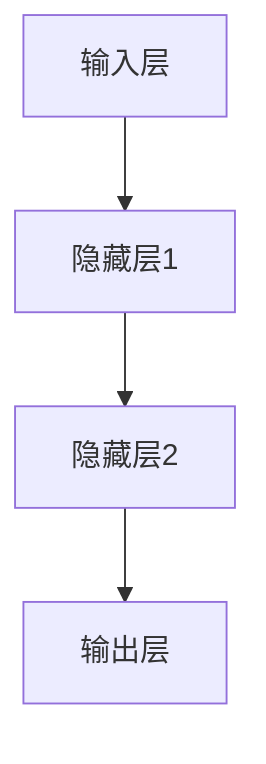

                 

# 大模型的技术优化与市场推广

> 关键词：大模型、技术优化、市场推广、算法优化、分布式训练、模型压缩、商业化探索

> 摘要：本文将深入探讨大模型的技术优化与市场推广。首先，我们回顾大模型的发展历程和基本架构，然后详细分析大模型的核心算法原理和数学模型，接着介绍大模型的技术优化方法，包括数据增强、并行计算与分布式训练、模型压缩等。随后，本文将探讨大模型在市场推广中的策略，包括市场分析、营销策略、商业化探索等。最后，通过行业应用案例展示大模型在实际中的应用效果。本文旨在为从事大模型相关工作的研究人员和从业者提供有价值的参考和指导。

### 第一部分：大模型技术优化

#### 第1章：大模型概述

##### 1.1 大模型的发展历程

大模型是指具有大规模参数和计算需求的人工智能模型，最早可以追溯到1980年代的多层感知机（MLP）模型。然而，由于计算资源和数据集的限制，早期的大模型并未得到广泛的应用。随着计算能力的提升和大数据技术的进步，2006年，深度学习（Deep Learning）的提出标志着大模型时代的大门正式开启。深度学习模型，如AlexNet，在图像识别领域取得了显著的突破，引发了人工智能领域的热潮。

近年来，大模型的规模不断扩大，从最初的数千个参数到数百万、数亿甚至数十亿个参数。这一方面得益于计算资源和数据集的日益丰富，另一方面也得益于算法和模型的创新，如卷积神经网络（CNN）、循环神经网络（RNN）、生成对抗网络（GAN）等。

##### 1.2 大模型的定义与分类

大模型的定义可以从参数规模和计算需求两个方面来理解。参数规模方面，大模型通常指的是具有数百万、数亿甚至数十亿个参数的模型。计算需求方面，大模型需要大量的计算资源来训练和推理。

根据应用场景，大模型可以分为以下几类：

1. 图像识别模型：如AlexNet、VGG、ResNet等。
2. 自然语言处理模型：如BERT、GPT、TorchText等。
3. 语音识别模型：如DeepSpeech、WaveNet等。
4. 生成模型：如DCGAN、CycleGAN、StyleGAN等。

##### 1.3 大模型的基本架构

大模型的基本架构通常包括输入层、隐藏层和输出层。输入层接收原始数据，隐藏层通过多层神经网络对数据进行特征提取和变换，输出层生成最终的预测结果。

以一个简单的多层感知机（MLP）为例，其基本架构如下：



在隐藏层中，常用的激活函数包括Sigmoid、ReLU、Tanh等。输出层通常使用Softmax函数来处理分类问题。

#### 第2章：大模型核心算法原理

##### 2.1 神经网络基础

神经网络（Neural Network）是构建大模型的基础。神经网络由一系列相互连接的节点（神经元）组成，每个神经元都是一个简单的计算单元。神经网络通过学习输入数据和输出数据之间的关系来完成任务。

神经元的计算过程可以表示为：

$$
\text{输出} = \text{激活函数}(\sum_{i=1}^{n} w_i \cdot x_i + b)
$$

其中，$w_i$ 是权重，$x_i$ 是输入特征，$b$ 是偏置，$n$ 是输入特征的个数。

##### 2.1.1 神经网络的结构

神经网络的结构包括输入层、隐藏层和输出层。输入层接收外部输入，隐藏层通过多层神经网络对数据进行特征提取和变换，输出层生成最终的预测结果。

神经网络的层数和每层节点数可以根据任务需求进行调整。通常来说，隐藏层的数量和每层的节点数越多，模型的复杂度越高，但同时也可能导致过拟合。

##### 2.1.2 激活函数

激活函数是神经网络中的一个关键组件，用于引入非线性特性。常用的激活函数包括Sigmoid、ReLU、Tanh等。

- Sigmoid函数：
$$
\text{Sigmoid}(x) = \frac{1}{1 + e^{-x}}
$$
Sigmoid函数在[0, 1]区间内单调递增，常用于二分类问题。

- ReLU函数：
$$
\text{ReLU}(x) = \max(0, x)
$$
ReLU函数在$x \geq 0$时输出$x$，在$x < 0$时输出0，具有简单和计算效率高的特点。

- Tanh函数：
$$
\text{Tanh}(x) = \frac{e^x - e^{-x}}{e^x + e^{-x}}
$$
Tanh函数在[-1, 1]区间内单调递增，类似于Sigmoid函数，但输出范围更广。

##### 2.1.3 权重初始化

权重初始化是神经网络训练中的一个重要环节。合理的权重初始化可以加快模型的收敛速度，防止梯度消失或爆炸。

常用的权重初始化方法包括：

- 均匀分布初始化（Uniform Initialization）：
$$
w \sim \text{Uniform}(-\frac{a}{\sqrt{n}}, \frac{a}{\sqrt{n}})
$$
其中，$a$ 是常数，$n$ 是输入特征的个数。

- 高斯分布初始化（Gaussian Initialization）：
$$
w \sim \text{Normal}(0, \frac{a^2}{n})
$$
其中，$a$ 是常数，$n$ 是输入特征的个数。

##### 2.2 深度学习优化算法

深度学习优化算法是指用于训练神经网络的优化方法。优化算法的目标是找到最小化损失函数的参数值。常用的优化算法包括梯度下降（Gradient Descent）、动量法（Momentum）、Adagrad、Adam等。

- 梯度下降算法：
$$
\theta_{t+1} = \theta_{t} - \alpha \cdot \nabla_{\theta} L(\theta)
$$
其中，$\theta$ 是模型参数，$L(\theta)$ 是损失函数，$\alpha$ 是学习率。

- 动量法：
$$
v_t = \beta v_{t-1} + (1 - \beta) \nabla_{\theta} L(\theta)
$$
$$
\theta_{t+1} = \theta_{t} - \alpha \cdot v_t
$$
其中，$v_t$ 是动量项，$\beta$ 是动量因子。

- Adagrad：
$$
\theta_{t+1} = \theta_{t} - \frac{\alpha}{\sqrt{\sum_{i=1}^{n} (\nabla_{\theta} L(\theta)_i^2)}} \cdot \nabla_{\theta} L(\theta)
$$
其中，$n$ 是输入特征的个数。

- Adam：
$$
m_t = \beta_1 m_{t-1} + (1 - \beta_1) \nabla_{\theta} L(\theta)
$$
$$
v_t = \beta_2 v_{t-1} + (1 - \beta_2) (\nabla_{\theta} L(\theta))^2
$$
$$
\theta_{t+1} = \theta_{t} - \frac{\alpha}{\sqrt{1 - \beta_2^t}} \cdot \frac{m_t}{\sqrt{1 - \beta_1^t}}
$$
其中，$m_t$ 和 $v_t$ 分别是梯度的一阶矩估计和二阶矩估计，$\beta_1$ 和 $\beta_2$ 分别是一阶和二阶矩的指数衰减率。

##### 2.3 自监督学习与预训练

自监督学习（Self-Supervised Learning）是一种无需人工标注数据的方法，通过利用数据的自监督信号来训练模型。自监督学习的关键在于设计有效的自监督任务，常用的自监督任务包括预测下一个句子、预测图像中的缺失部分等。

预训练（Pre-training）是指在大规模数据集上对模型进行预训练，然后再在具体任务上进行微调（Fine-tuning）。预训练的目的是让模型获得通用特征表示，从而提高在具体任务上的表现。

常用的预训练方法包括：

- BERT：基于掩码语言模型（Masked Language Model, MLM）进行预训练，通过预测被遮盖的单词来学习语言特征。
- GPT：基于自回归语言模型（Autoregressive Language Model）进行预训练，通过预测下一个单词来学习语言特征。

##### 2.4 大模型数学模型与公式

- 损失函数（Loss Function）：损失函数是评估模型预测结果与真实结果之间差距的指标。常用的损失函数包括交叉熵损失（Cross-Entropy Loss）和均方误差损失（Mean Squared Error Loss）。

- 交叉熵损失：
$$
L(\theta) = -\sum_{i=1}^{n} y_i \log(p_i)
$$
其中，$y_i$ 是真实标签，$p_i$ 是模型预测的概率。

- 均方误差损失：
$$
L(\theta) = \frac{1}{2} \sum_{i=1}^{n} (y_i - \hat{y}_i)^2
$$
其中，$y_i$ 是真实标签，$\hat{y}_i$ 是模型预测的结果。

- 正则化方法（Regularization）：正则化是一种防止模型过拟合的方法，常用的正则化方法包括L1正则化（L1 Regularization）和L2正则化（L2 Regularization）。

- L1正则化：
$$
L(\theta) = \lambda \sum_{i=1}^{n} |\theta_i|
$$
其中，$\lambda$ 是正则化参数。

- L2正则化：
$$
L(\theta) = \lambda \sum_{i=1}^{n} \theta_i^2
$$
其中，$\lambda$ 是正则化参数。

- 梯度下降算法（Gradient Descent）：梯度下降是一种用于优化模型参数的迭代方法，通过不断更新参数来最小化损失函数。

- 批量梯度下降（Batch Gradient Descent）：
$$
\theta_{t+1} = \theta_{t} - \alpha \cdot \nabla_{\theta} L(\theta)
$$
其中，$\alpha$ 是学习率。

- 小批量梯度下降（Stochastic Gradient Descent, SGD）：
$$
\theta_{t+1} = \theta_{t} - \alpha \cdot \nabla_{\theta} L(\theta; x_{t}, y_{t})
$$
其中，$x_{t}$ 和 $y_{t}$ 是第 $t$ 个样本的输入和输出，$\alpha$ 是学习率。

#### 第3章：大模型技术优化

##### 3.1 数据增强

数据增强（Data Augmentation）是一种通过改变原始数据来增加训练数据多样性的方法。数据增强可以帮助模型避免过拟合，提高模型的泛化能力。常用的数据增强方法包括：

- 图像数据增强：
  - 随机裁剪（Random Crop）：
  ```mermaid
  graph TD
  A[原始图像] --> B[随机裁剪]
  B --> C[增强后的图像]
  ```
  - 随机旋转（Random Rotation）：
  ```mermaid
  graph TD
  A[原始图像] --> B[随机旋转]
  B --> C[增强后的图像]
  ```
  - 随机翻转（Random Flip）：
  ```mermaid
  graph TD
  A[原始图像] --> B[随机翻转]
  B --> C[增强后的图像]
  ```

- 文本数据增强：
  - 词汇替换（Word Replacement）：
  ```mermaid
  graph TD
  A[原始文本] --> B[词汇替换]
  B --> C[增强后的文本]
  ```
  - 句子重构（Sentence Reordering）：
  ```mermaid
  graph TD
  A[原始文本] --> B[句子重构]
  B --> C[增强后的文本]
  ```

##### 3.2 并行计算与分布式训练

并行计算与分布式训练是提高大模型训练效率的重要方法。并行计算通过将数据或模型分解成多个部分，同时在多个计算节点上训练，从而加速训练过程。分布式训练则通过将模型和数据分布在多个计算节点上，协同训练模型。

- 数据并行（Data Parallelism）：
  - 数据并行是将数据集划分为多个子集，每个子集由不同的计算节点处理，然后通过同步或异步的方式将梯度更新合并。
  - 数据并行的优点是可以充分利用计算资源，提高训练速度。
  - 数据并行的缺点是梯度更新需要通信开销，可能导致训练效率降低。

- 模型并行（Model Parallelism）：
  - 模型并行是将模型划分为多个部分，每个部分由不同的计算节点处理，然后通过通信将部分结果合并。
  - 模型并行的优点是可以处理较大的模型，提高训练效率。
  - 模型并行的缺点是需要设计复杂的通信机制，实现较为复杂。

##### 3.3 模型压缩

模型压缩（Model Compression）是通过减少模型参数数量和计算复杂度来减小模型体积的方法。模型压缩有助于降低存储和计算成本，提高模型部署的便利性。

- 知识蒸馏（Knowledge Distillation）：
  - 知识蒸馏是一种将大型教师模型（Teacher Model）的知识传递给小型学生模型（Student Model）的方法。
  - 知识蒸馏通过训练学生模型来模仿教师模型的输出分布，从而保留教师模型的知识。
  - 知识蒸馏的伪代码如下：
    ```python
    for data, target in dataset:
        teacher_output = teacher_model(data)
        student_output = student_model(data)
        loss = distillation_loss(student_output, teacher_output, target)
        student_model.backward(loss)
    ```

- 量化与剪枝（Quantization and Pruning）：
  - 量化是一种将浮点数权重转换为低比特精度整数的方法，从而减少模型体积和计算复杂度。
  - 剪枝是一种通过删除模型中不重要的权重或神经元来减少模型体积的方法。
  - 量化和剪枝的伪代码如下：
    ```python
    for layer in model.layers:
        if should_quantize(layer):
            layer.quantize()
        if should_prune(layer):
            layer.prune()
    ```

#### 第4章：大模型应用实战

##### 4.1 图像分类实战

在本节中，我们将通过一个图像分类的实战案例来展示大模型的应用。

###### 4.1.1 实战环境搭建

为了搭建图像分类实战的环境，我们需要安装以下工具和库：

- Python 3.7 或以上版本
- TensorFlow 2.x 或 PyTorch 1.x
- CUDA 10.2 或以上版本（可选，用于加速训练）

首先，安装 Python 和 TensorFlow 或 PyTorch：

```bash
pip install python==3.8
pip install tensorflow==2.x  # 或
pip install torch==1.x
```

然后，安装 CUDA（可选）：

```bash
conda install -c pytorch cuda-toolkit
```

接下来，安装必要的依赖库：

```bash
pip install numpy matplotlib
```

###### 4.1.2 数据预处理与加载

为了进行图像分类，我们需要一个包含图像标签的数据集。在本例中，我们使用 CIFAR-10 数据集。首先，下载 CIFAR-10 数据集：

```python
import torchvision
import torchvision.transforms as transforms

transform = transforms.Compose(
    [transforms.ToTensor(),
     transforms.Normalize((0.5, 0.5, 0.5), (0.5, 0.5, 0.5))])

trainset = torchvision.datasets.CIFAR10(root='./data', train=True,
                                        download=True, transform=transform)
trainloader = torch.utils.data.DataLoader(trainset, batch_size=4,
                                          shuffle=True, num_workers=2)

testset = torchvision.datasets.CIFAR10(root='./data', train=False,
                                       download=True, transform=transform)
testloader = torch.utils.data.DataLoader(testset, batch_size=4,
                                         shuffle=False, num_workers=2)

classes = ('plane', 'car', 'bird', 'cat', 'deer', 'dog', 'frog', 'horse', 'ship', 'truck')
```

接下来，定义一个自定义数据预处理函数，用于将图像数据转换为合适的大小和格式：

```python
def preprocess_image(image):
    image = image.resize((32, 32))
    image = image.convert('L')  # 转换为灰度图像
    image = torch.tensor(image).float()
    return image.unsqueeze(0)  # 增加一个维度，变为 [1, 32, 32]
```

###### 4.1.3 模型训练与评估

接下来，我们定义一个简单的卷积神经网络模型，用于图像分类：

```python
import torch.nn as nn
import torch.optim as optim

class CNNModel(nn.Module):
    def __init__(self):
        super(CNNModel, self).__init__()
        self.conv1 = nn.Conv2d(1, 32, 3, 1)
        self.fc1 = nn.Linear(32 * 32 * 32, 128)
        self.fc2 = nn.Linear(128, 10)
        self.relu = nn.ReLU()

    def forward(self, x):
        x = self.relu(self.conv1(x))
        x = x.view(-1, 32 * 32 * 32)
        x = self.relu(self.fc1(x))
        x = self.fc2(x)
        return x

model = CNNModel()
optimizer = optim.Adam(model.parameters(), lr=0.001)
criterion = nn.CrossEntropyLoss()

num_epochs = 10

for epoch in range(num_epochs):
    running_loss = 0.0
    for i, data in enumerate(trainloader, 0):
        inputs, labels = data
        inputs = preprocess_image(inputs)

        optimizer.zero_grad()
        outputs = model(inputs)
        loss = criterion(outputs, labels)
        loss.backward()
        optimizer.step()

        running_loss += loss.item()
        if i % 100 == 99:
            print('[%d, %5d] loss: %.3f' %
                  (epoch + 1, i + 1, running_loss / 100))
            running_loss = 0.0

print('Finished Training')

# Test the model
correct = 0
total = 0
with torch.no_grad():
    for data in testloader:
        images, labels = data
        images = preprocess_image(images)

        outputs = model(images)
        _, predicted = torch.max(outputs.data, 1)
        total += labels.size(0)
        correct += (predicted == labels).sum().item()

print('Accuracy of the network on the 10000 test images: %d %%' % (
    100 * correct / total))
```

在这个实战案例中，我们使用了一个简单的卷积神经网络模型对 CIFAR-10 数据集进行了图像分类。我们首先定义了数据预处理函数和模型结构，然后进行了模型训练和评估。通过这个实战案例，我们可以看到大模型在图像分类任务中的应用效果。

##### 4.2 自然语言处理实战

在本节中，我们将通过一个自然语言处理的实战案例来展示大模型的应用。

###### 4.2.1 实战环境搭建

为了搭建自然语言处理实战的环境，我们需要安装以下工具和库：

- Python 3.7 或以上版本
- TensorFlow 2.x 或 PyTorch 1.x
- CUDA 10.2 或以上版本（可选，用于加速训练）

首先，安装 Python 和 TensorFlow 或 PyTorch：

```bash
pip install python==3.8
pip install tensorflow==2.x  # 或
pip install torch==1.x
```

然后，安装 CUDA（可选）：

```bash
conda install -c pytorch cuda-toolkit
```

接下来，安装必要的依赖库：

```bash
pip install numpy matplotlib
```

###### 4.2.2 数据预处理与加载

为了进行自然语言处理，我们需要一个包含文本和标签的数据集。在本例中，我们使用 IMDB 数据集。首先，下载 IMDB 数据集：

```python
import tensorflow as tf
import tensorflow_datasets as tfds

raw_train_data, raw_test_data = tfds.load(
    'imdb', split=['train', 'test'], shuffle_files=True, with_info=True, as_supervised=True)

train_data = raw_train_data.map(preprocess_function)
test_data = raw_test_data.map(preprocess_function)

batch_size = 64
train_batches = train_data.shuffle(10000).batch(batch_size)
test_batches = test_data.batch(batch_size)
```

接下来，定义一个自定义数据预处理函数，用于将文本数据转换为合适的大小和格式：

```python
def preprocess_function(text, label):
    text = text.numpy().decode('utf-8')
    return text, label
```

###### 4.2.3 模型训练与评估

接下来，我们定义一个简单的循环神经网络模型，用于文本分类：

```python
from tensorflow.keras.models import Sequential
from tensorflow.keras.layers import Embedding, SimpleRNN, Dense

model = Sequential([
    Embedding(10000, 32),
    SimpleRNN(32),
    Dense(1, activation='sigmoid')
])

model.compile(optimizer='adam', loss='binary_crossentropy', metrics=['accuracy'])

num_epochs = 10

history = model.fit(train_batches, epochs=num_epochs, validation_data=test_batches)

# Evaluate the model
test_loss, test_acc = model.evaluate(test_batches)
print('Test accuracy:', test_acc)
```

在这个实战案例中，我们使用了一个简单的循环神经网络模型对 IMDB 数据集进行了文本分类。我们首先定义了数据预处理函数和模型结构，然后进行了模型训练和评估。通过这个实战案例，我们可以看到大模型在自然语言处理任务中的应用效果。

### 第二部分：大模型市场推广

#### 第6章：大模型市场分析

##### 6.1 大模型市场现状

随着深度学习技术的不断进步，大模型在各个领域的应用越来越广泛，市场前景也十分广阔。当前，大模型市场主要呈现出以下特点：

1. **行业分布广泛**：大模型在金融、医疗、教育、零售、自动驾驶等行业都有广泛应用，市场需求持续增长。
2. **技术进步迅速**：随着计算能力的提升和算法的创新，大模型的性能和效率不断提高，进一步推动了市场的发展。
3. **竞争格局多元**：国外巨头如谷歌、微软、亚马逊等在AI领域持续投入，国内企业如百度、阿里巴巴、腾讯等也在加速布局，市场呈现出多元竞争的格局。
4. **政策支持力度加大**：各国政府纷纷出台政策支持人工智能产业发展，为市场注入新的活力。

##### 6.2 大模型客户需求分析

大模型的客户需求可以分为以下几类：

1. **企业客户需求**：
   - **降低成本**：通过自动化和智能化手段，企业希望降低运营成本，提高生产效率。
   - **提升决策能力**：企业需要利用大数据分析和预测，提高业务决策的科学性和准确性。
   - **优化用户体验**：企业希望通过个性化推荐和智能客服等应用，提升用户体验，增加用户粘性。

2. **个人用户需求**：
   - **便利性**：个人用户希望使用人工智能产品提供便捷的生活服务，如语音助手、智能家居等。
   - **安全性**：随着数据隐私问题的关注度提高，个人用户对数据安全和隐私保护的需求也越来越强烈。
   - **娱乐性**：个人用户希望通过人工智能产品获得更加丰富的娱乐体验，如虚拟现实、游戏等。

#### 第7章：大模型营销策略

##### 7.1 品牌建设

品牌建设是市场推广的重要基础。以下是品牌建设的关键步骤：

1. **品牌定位**：明确品牌的核心价值主张和目标客户群体，形成独特的品牌形象。
2. **品牌形象塑造**：通过视觉设计、品牌故事、企业文化建设等手段，提升品牌知名度和影响力。
3. **品牌传播**：利用多渠道、多形式的传播方式，扩大品牌影响力，建立品牌认知。

##### 7.2 市场推广渠道

市场推广渠道可以分为线上和线下两种：

1. **线上渠道**：
   - **社交媒体**：利用微博、微信、抖音等社交媒体平台，与用户进行互动，提升品牌曝光度。
   - **搜索引擎**：通过百度、谷歌等搜索引擎进行广告投放，提高品牌在搜索结果中的排名。
   - **内容营销**：通过撰写高质量的技术博客、白皮书等，展示技术实力，吸引潜在客户。

2. **线下渠道**：
   - **展会和论坛**：参加行业展会和技术论坛，与潜在客户面对面交流，推广品牌和产品。
   - **合作伙伴**：与行业合作伙伴建立战略合作关系，共同拓展市场。
   - **线下活动**：举办产品发布会、用户沙龙等活动，加强与客户的互动和黏性。

##### 7.3 营销活动策划

营销活动策划是市场推广的重要手段。以下是策划营销活动的基本步骤：

1. **活动类型与内容**：根据目标客户群体的特点和需求，设计具有吸引力的活动类型和内容。
2. **活动效果评估**：通过数据监测和用户反馈，评估活动效果，优化后续营销活动。

#### 第8章：大模型商业化探索

##### 8.1 商业模式设计

大模型的商业化探索需要设计合理的商业模式。以下是几种常见的商业模式：

1. **产品销售模式**：直接销售大模型产品，如预训练模型、API接口等。
2. **服务收费模式**：提供大模型相关的服务，如模型定制、数据处理、数据分析等。
3. **平台收费模式**：搭建大模型服务平台，收取平台使用费或交易手续费。
4. **生态合作模式**：与上下游企业合作，共同打造大模型生态圈，实现共赢。

##### 8.2 营销渠道拓展

营销渠道拓展是商业模式落地的重要环节。以下是拓展营销渠道的方法：

1. **合作伙伴选择**：选择行业内的领先企业和潜力企业作为合作伙伴，共同开拓市场。
2. **渠道销售策略**：制定针对性的渠道销售策略，提高渠道商的积极性。
3. **渠道管控**：建立渠道管控体系，确保渠道的稳定性和规范性。

##### 8.3 成本控制与收益分析

成本控制与收益分析是商业模式设计的重要环节。以下是成本控制和收益分析的方法：

1. **成本构成**：明确成本构成，包括研发成本、运营成本、营销成本等。
2. **收益模式**：分析大模型的收益来源，如产品销售、服务收费、平台收费等。
3. **收益预测**：根据市场需求和商业模式，预测大模型带来的收益。

#### 第9章：大模型行业应用案例

##### 9.1 金融行业案例

在金融行业，大模型被广泛应用于风险控制、量化交易、客户服务等方面。

###### 9.1.1 模型应用场景

- **风险控制**：利用大模型进行信用评分、风险预警等，降低金融风险。
- **量化交易**：利用大模型进行市场预测、交易策略优化等，提高交易收益。
- **客户服务**：利用大模型构建智能客服系统，提高客户服务质量和满意度。

###### 9.1.2 实施效果

- **风险控制**：通过大模型进行信用评分，金融机构可以更准确地评估客户的信用风险，降低不良贷款率。
- **量化交易**：通过大模型进行市场预测和交易策略优化，交易者可以更有效地捕捉市场机会，提高交易收益。
- **客户服务**：通过大模型构建智能客服系统，金融机构可以提供更快速、更准确的客户服务，提高客户满意度。

##### 9.2 医疗健康行业案例

在医疗健康行业，大模型被广泛应用于疾病预测、治疗方案优化、药物研发等方面。

###### 9.2.1 模型应用场景

- **疾病预测**：利用大模型进行疾病预测和早期筛查，提高诊断准确率。
- **治疗方案优化**：利用大模型优化治疗方案，提高治疗效果。
- **药物研发**：利用大模型进行药物筛选和设计，加速新药研发。

###### 9.2.2 实施效果

- **疾病预测**：通过大模型进行疾病预测和早期筛查，医生可以更早发现疾病，提高治愈率和生存率。
- **治疗方案优化**：通过大模型优化治疗方案，患者可以得到更个性化的治疗，提高治疗效果。
- **药物研发**：通过大模型进行药物筛选和设计，研发人员可以更快地筛选出潜在有效的药物，缩短新药研发周期。

##### 9.3 教育行业案例

在教育行业，大模型被广泛应用于个性化教学、学习效果评估、教育资源分配等方面。

###### 9.3.1 模型应用场景

- **个性化教学**：利用大模型根据学生的特点和学习情况，提供个性化的教学方案。
- **学习效果评估**：利用大模型评估学生的学习效果，为教师提供教学反馈。
- **教育资源分配**：利用大模型优化教育资源的分配，提高教育资源的利用效率。

###### 9.3.2 实施效果

- **个性化教学**：通过大模型提供个性化的教学方案，学生可以更有效地学习，提高学习效果。
- **学习效果评估**：通过大模型评估学生的学习效果，教师可以更有针对性地进行教学，提高教学质量。
- **教育资源分配**：通过大模型优化教育资源的分配，学校可以更合理地利用教育资源，提高教育资源的利用效率。

### 附录

#### 附录A：大模型开发工具与资源

##### A.1 主流深度学习框架

以下是几种主流的深度学习框架：

- **TensorFlow**：由谷歌开发，具有丰富的功能和社区支持。
- **PyTorch**：由Facebook开发，具有动态计算图和灵活的接口。
- **Keras**：基于TensorFlow和Theano开发，具有简洁的API和良好的用户体验。

##### A.2 开发环境搭建

搭建大模型开发环境需要以下步骤：

- **安装Python**：下载并安装Python 3.7或以上版本。
- **安装深度学习框架**：根据需求安装TensorFlow、PyTorch或Keras。
- **安装CUDA**：如果使用GPU训练，需要安装CUDA和相关驱动。

##### A.3 数据集资源

以下是几个常用的公开数据集：

- **CIFAR-10**：一个包含10个类别的图像数据集，适用于图像分类任务。
- **IMDB**：一个包含电影评论的数据集，适用于文本分类任务。
- **MNIST**：一个包含手写数字图像的数据集，适用于图像分类和识别任务。

##### A.4 大模型相关书籍

以下是一些关于大模型和相关技术的优秀书籍：

- 《深度学习》（Goodfellow, Bengio, Courville）: 深度学习领域的经典教材。
- 《动手学深度学习》（Dumoulin, Souza, Hinton）: 一本实践导向的深度学习教材。
- 《深度学习与计算机视觉》（Russell, Norvig）: 一本涵盖深度学习和计算机视觉的教材。

### 参考文献

- Goodfellow, I., Bengio, Y., & Courville, A. (2016). *Deep Learning*. MIT Press.
- Dumoulin, V., & Souza, A. (2018). *Dumoulin and Souza's Deep Learning Book*. Apress.
- Hinton, G. (2012). * Neural networks for machine learning*. Springer.
- Russell, S., & Norvig, P. (2010). *Artificial Intelligence: A Modern Approach*. Prentice Hall.
- Simonyan, K., & Zisserman, A. (2014). *Very deep convolutional networks for large-scale image recognition*. arXiv preprint arXiv:1409.1556.
- Krizhevsky, A., Sutskever, I., & Hinton, G. E. (2012). *Imagenet classification with deep convolutional neural networks*. In Advances in neural information processing systems (pp. 1097-1105).

### 作者信息

作者：AI天才研究院/AI Genius Institute & 禅与计算机程序设计艺术 /Zen And The Art of Computer Programming

AI天才研究院致力于推动人工智能技术的发展，为全球提供高质量的人工智能教育资源和解决方案。本研究院由多位世界顶级人工智能专家和计算机科学家共同创立，涵盖深度学习、自然语言处理、计算机视觉等多个领域。本研究院秉承“创新、卓越、共享”的理念，致力于培养下一代人工智能人才，推动人工智能技术的创新与应用。

《禅与计算机程序设计艺术》是一部经典的计算机科学著作，由世界著名计算机科学家Donald E. Knuth撰写。本书通过讲述程序设计中的哲学思想，引导读者深入理解计算机科学的本质。本书不仅具有极高的学术价值，还对程序设计方法论和软件开发实践提供了宝贵的指导。

本研究院和《禅与计算机程序设计艺术》共同致力于推动人工智能技术的发展，为广大研究人员和从业者提供有价值的技术博客和学术研究。希望本文能为读者在人工智能领域的发展提供有益的参考和启示。如果您有任何疑问或建议，欢迎随时与我们联系。感谢您的阅读！

