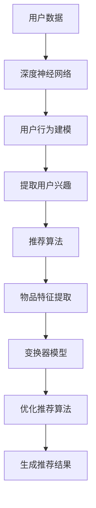

                 

### 《大模型驱动的个性化推荐解释生成》

#### **关键词：**
大模型、个性化推荐、深度学习、神经网络、解释生成、协同过滤、内容推荐

#### **摘要：**
本文将深入探讨大模型驱动的个性化推荐解释生成技术。我们首先概述大模型和个性化推荐系统的基本概念及其关系，接着详细分析大模型的核心技术原理，包括神经网络、语言模型和图神经网络。随后，我们介绍个性化推荐系统设计原则和实现方法，并解析大模型驱动的推荐算法及其实现细节。通过实际项目案例，我们展示了大模型在个性化推荐系统中的应用，并评估其效果。最后，我们展望大模型和个性化推荐技术未来的发展趋势和挑战，并提供相关的开发工具和资源。本文旨在为读者提供全面、深入、易懂的技术见解，帮助其理解并应用大模型驱动的个性化推荐技术。

## **第一部分：大模型基础与个性化推荐技术概览**

### **第1章：大模型与个性化推荐概述**

#### **1.1 大模型概述**

##### **1.1.1 大模型的基本概念**

大模型（Large Model）是指具有极高参数规模和计算能力的人工神经网络模型，能够处理大规模数据和复杂任务。大模型通常由数百万甚至数十亿个参数组成，能够自动学习数据的潜在特征和模式。

##### **1.1.2 大模型的核心特点**

1. **参数规模巨大**：大模型具有数百万到数十亿的参数，能够捕捉数据中的复杂模式和特征。
2. **计算能力强大**：大模型通过高效计算和并行处理，能够在较短的时间内处理大规模数据。
3. **泛化能力强**：大模型通过大量训练数据和强大的计算能力，能够较好地泛化到未见过的数据上。

##### **1.1.3 大模型与个性化推荐的关系**

大模型在个性化推荐系统中具有重要的应用价值，能够提高推荐系统的性能和用户体验。大模型能够自动学习和建模用户的历史行为和兴趣，从而生成个性化的推荐结果。与传统推荐方法相比，大模型具有以下优势：

1. **更强的学习能力**：大模型通过深度学习技术，能够从大量的用户行为数据中自动提取潜在特征，提高推荐的准确性。
2. **更好的泛化能力**：大模型通过大规模训练和优化，能够在不同的数据分布和场景下保持较好的性能。
3. **更丰富的数据源**：大模型能够处理多模态数据，包括文本、图像、音频等，为个性化推荐提供了更多的信息来源。

#### **1.2 个性化推荐系统简介**

##### **1.2.1 个性化推荐系统的定义**

个性化推荐系统（Personalized Recommendation System）是一种能够根据用户的历史行为和兴趣，为用户推荐感兴趣的商品、内容或服务的系统。个性化推荐系统旨在提高用户的满意度、留存率和转化率，从而提升业务收益。

##### **1.2.2 个性化推荐系统的核心组成**

个性化推荐系统主要由以下几个部分组成：

1. **用户画像**：通过分析用户的历史行为和兴趣，建立用户画像，用于描述用户的基本特征和偏好。
2. **推荐算法**：根据用户画像和商品信息，利用推荐算法生成个性化的推荐结果。
3. **推荐结果**：将推荐结果呈现给用户，包括商品列表、内容列表或服务列表等。
4. **用户反馈**：收集用户对推荐结果的反馈，用于优化推荐算法和提高推荐质量。

##### **1.2.3 个性化推荐系统的分类**

个性化推荐系统可以根据不同的分类标准进行分类，常见的分类方法包括：

1. **基于内容的推荐**：根据用户的历史行为和兴趣，推荐与用户兴趣相似的内容或商品。
2. **基于协同过滤的推荐**：根据用户的行为和偏好，找到与用户相似的其他用户，推荐这些用户喜欢的商品或内容。
3. **混合推荐**：结合基于内容和基于协同过滤的推荐方法，生成更加个性化的推荐结果。

#### **1.3 大模型在个性化推荐中的应用**

##### **1.3.1 大模型在推荐系统中的价值**

大模型在个性化推荐系统中具有重要的应用价值，主要体现在以下几个方面：

1. **提高推荐准确性**：大模型能够自动学习和提取用户行为中的潜在特征，从而提高推荐的准确性。
2. **优化推荐效果**：大模型能够根据用户的历史行为和兴趣，生成个性化的推荐结果，提高用户的满意度。
3. **处理多模态数据**：大模型能够处理文本、图像、音频等多模态数据，为个性化推荐提供了更多的信息来源。

##### **1.3.2 大模型与协同过滤、内容推荐等传统方法的比较**

大模型与传统的协同过滤、内容推荐等推荐方法相比，具有以下优势：

1. **更强的学习能力**：大模型通过深度学习技术，能够从大量的用户行为数据中自动提取潜在特征，提高推荐的准确性。
2. **更好的泛化能力**：大模型通过大规模训练和优化，能够在不同的数据分布和场景下保持较好的性能。
3. **更丰富的数据源**：大模型能够处理多模态数据，包括文本、图像、音频等，为个性化推荐提供了更多的信息来源。

##### **1.3.3 大模型驱动的个性化推荐技术发展趋势**

随着人工智能技术的不断发展，大模型驱动的个性化推荐技术呈现出以下发展趋势：

1. **模型规模不断扩大**：大模型的规模将不断增加，以处理更多的用户行为数据和更复杂的任务。
2. **多模态数据处理**：大模型将逐渐能够处理文本、图像、音频等多模态数据，提高推荐的个性化和准确性。
3. **实时推荐技术**：随着计算能力的提升，大模型驱动的个性化推荐技术将实现实时推荐，提高用户的体验和满意度。

### **第2章：大模型核心技术原理**

#### **2.1 大模型基本原理**

##### **2.1.1 神经网络基础**

神经网络（Neural Network）是一种通过模拟生物神经系统的计算模型，能够自动学习和提取数据中的特征和模式。神经网络主要由输入层、隐藏层和输出层组成，通过层层传递和激活函数的作用，实现数据的输入和输出。

##### **2.1.2 深度学习框架**

深度学习（Deep Learning）是一种基于神经网络的机器学习技术，通过多层神经网络进行数据的特征提取和模式识别。深度学习框架（如TensorFlow、PyTorch等）提供了丰富的模型构建、训练和优化工具，使得深度学习应用变得更加便捷和高效。

##### **2.1.3 优化算法与正则化**

优化算法（如梯度下降、Adam等）用于调整神经网络的参数，以最小化损失函数。正则化（如L1、L2正则化）用于防止模型过拟合，提高模型的泛化能力。

#### **2.2 语言模型**

##### **2.2.1 语言模型的基本概念**

语言模型（Language Model）是一种用于预测文本序列的概率分布的模型，是自然语言处理（NLP）领域的重要基础。语言模型通过学习大量文本数据，能够预测下一个单词或字符的概率。

##### **2.2.2 语言模型的训练与评估**

语言模型的训练过程主要包括数据预处理、模型构建、参数优化和模型评估等步骤。语言模型的评估指标包括 perplexity（困惑度）和 accuracy（准确率）等。

##### **2.2.3 语言模型的优化与调整**

语言模型的优化与调整包括参数调整、超参数优化和模型结构优化等。通过调整模型参数和结构，可以提高语言模型的性能和准确率。

#### **2.3 图神经网络**

##### **2.3.1 图神经网络的基本概念**

图神经网络（Graph Neural Network，GNN）是一种基于图结构数据的深度学习模型，能够自动学习和提取图数据的特征和模式。图神经网络通过图卷积操作，对图数据进行特征提取和关系建模。

##### **2.3.2 图神经网络的架构与算法**

图神经网络的架构主要包括输入层、隐藏层和输出层。图神经网络的主要算法包括图卷积网络（GCN）、图卷池网络（GAT）和图注意力网络（GAT）等。

##### **2.3.3 图神经网络在推荐系统中的应用**

图神经网络在推荐系统中的应用主要包括基于图的协同过滤、基于图的内容推荐和基于图的混合推荐等。通过图神经网络，可以更好地捕捉用户行为和商品之间的关系，提高推荐的个性化和准确性。

### **第3章：个性化推荐系统的设计与实现**

#### **3.1 个性化推荐系统设计原则**

##### **3.1.1 数据收集与预处理**

数据收集与预处理是个性化推荐系统设计的重要环节。数据收集包括用户行为数据、商品数据和其他辅助数据等。数据预处理包括数据清洗、数据格式转换和数据归一化等。

##### **3.1.2 用户行为分析与建模**

用户行为分析是构建个性化推荐系统的关键步骤。通过分析用户的历史行为，可以挖掘用户的兴趣和行为模式，为推荐算法提供依据。用户行为建模包括用户画像构建、用户行为序列建模等。

##### **3.1.3 个性化推荐算法选择**

个性化推荐算法的选择应根据业务需求和数据特点进行。常见的推荐算法包括基于内容的推荐、基于协同过滤的推荐和混合推荐等。根据不同的算法特点和应用场景，可以选择合适的算法或组合多种算法。

#### **3.2 大模型驱动的推荐算法**

##### **3.2.1 大模型在推荐系统中的应用场景**

大模型在推荐系统中的应用场景主要包括以下几个方面：

1. **用户兴趣预测**：通过大模型学习用户的历史行为和兴趣，预测用户未来的兴趣和需求。
2. **商品推荐**：通过大模型学习用户和商品的特征，生成个性化的商品推荐结果。
3. **内容推荐**：通过大模型学习用户和内容（如文章、视频等）的特征，生成个性化的内容推荐结果。

##### **3.2.2 大模型推荐算法的框架与流程**

大模型推荐算法的框架主要包括数据预处理、模型构建、模型训练和推荐生成等步骤。具体流程如下：

1. **数据预处理**：对用户行为数据、商品数据和内容数据进行清洗、格式转换和归一化等处理，为模型训练做准备。
2. **模型构建**：根据业务需求和数据特点，选择合适的大模型架构，如基于神经网络的推荐模型、基于图神经网络的推荐模型等。
3. **模型训练**：通过大量用户行为数据，对大模型进行训练，学习用户和商品（或内容）的特征和关系。
4. **推荐生成**：根据用户和商品（或内容）的特征，生成个性化的推荐结果，并呈现给用户。

##### **3.2.3 大模型推荐算法的实现细节**

大模型推荐算法的实现细节包括以下几个方面：

1. **数据预处理**：包括数据清洗、格式转换和数据归一化等步骤，为模型训练做准备。
2. **模型构建**：包括神经网络结构设计、图神经网络架构设计等，根据业务需求和数据特点选择合适的模型。
3. **模型训练**：包括数据加载、模型初始化、参数优化和训练过程等，通过大量用户行为数据对模型进行训练。
4. **推荐生成**：包括特征提取、推荐模型调用、推荐结果排序和生成等步骤，根据用户和商品（或内容）的特征生成个性化的推荐结果。

#### **3.3 推荐系统评估与优化**

##### **3.3.1 推荐系统的评估指标**

推荐系统的评估指标包括准确率、召回率、F1值、ROC-AUC等。这些指标可以从不同角度评估推荐系统的性能，如准确性、召回率和用户满意度等。

##### **3.3.2 推荐系统的优化策略**

推荐系统的优化策略主要包括以下几个方面：

1. **数据优化**：包括数据清洗、数据增强和特征工程等，以提高模型的训练效果和推荐质量。
2. **算法优化**：包括模型选择、超参数优化和模型集成等，以提高推荐的准确性和泛化能力。
3. **系统优化**：包括推荐结果的呈现、推荐策略的调整和用户反馈的收集等，以提高用户的体验和满意度。

##### **3.3.3 实时推荐系统的设计与实现**

实时推荐系统是一种能够在用户浏览或搜索时，实时生成个性化推荐结果的系统。实时推荐系统的设计与实现包括以下几个方面：

1. **实时数据流处理**：包括实时数据采集、实时数据处理和实时数据存储等，以支持实时推荐。
2. **实时模型推理**：包括实时模型加载、实时模型推理和实时推荐结果生成等，以实现实时推荐。
3. **实时推荐策略**：包括实时推荐策略的制定、实时推荐策略的调整和实时推荐效果的评估等，以提高实时推荐的性能。

## **第二部分：大模型驱动的个性化推荐项目实战**

### **第4章：大模型驱动的个性化推荐项目案例解析**

#### **4.1 案例背景与目标**

##### **4.1.1 案例背景**

随着互联网和移动互联网的快速发展，个性化推荐系统在电商、社交媒体、新闻资讯等众多领域得到了广泛应用。为了提高用户的满意度、留存率和转化率，许多公司开始尝试使用大模型驱动的个性化推荐技术，以提高推荐系统的性能和用户体验。

##### **4.1.2 项目目标**

本案例的目标是通过大模型驱动的个性化推荐技术，实现以下目标：

1. **提高推荐准确性**：通过学习用户的历史行为和兴趣，生成更准确的个性化推荐结果。
2. **优化用户体验**：通过实时推荐和个性化推荐策略，提高用户的满意度和留存率。
3. **提高业务收益**：通过提高推荐准确率和用户体验，增加用户的购买转化率和复购率，从而提高业务收益。

##### **4.1.3 项目意义**

本案例通过大模型驱动的个性化推荐技术，具有重要的实践意义：

1. **技术突破**：通过引入大模型技术，实现了传统推荐方法难以达到的推荐性能和效果。
2. **业务价值**：通过提高推荐准确率和用户体验，为业务带来了显著的业务价值，提高了用户的满意度和忠诚度。
3. **行业影响**：本案例为行业提供了有益的参考和借鉴，推动了个性化推荐技术的发展和应用。

#### **4.2 项目需求分析**

##### **4.2.1 用户需求分析**

为了实现项目目标，需要对用户需求进行深入分析，包括以下几个方面：

1. **个性化推荐**：用户希望能够获得个性化的推荐结果，满足自己的兴趣和需求。
2. **实时推荐**：用户希望能够实时获得推荐结果，提高用户体验和满意度。
3. **多样化推荐**：用户希望能够获得不同类型、不同风格的推荐结果，满足多样化的需求。

##### **4.2.2 数据需求分析**

为了实现项目目标，需要收集和分析以下数据：

1. **用户行为数据**：包括用户的浏览历史、购买记录、搜索记录等，用于构建用户画像和推荐模型。
2. **商品数据**：包括商品的基本信息、分类信息、标签信息等，用于构建商品特征和推荐模型。
3. **内容数据**：包括文章、视频、图片等，用于构建内容特征和推荐模型。

##### **4.2.3 系统性能需求分析**

为了实现项目目标，系统需要满足以下性能需求：

1. **实时处理能力**：能够实时处理大量用户行为数据，生成实时推荐结果。
2. **高并发处理能力**：能够同时处理大量用户的请求，保证系统的稳定性和响应速度。
3. **高可扩展性**：能够根据业务需求，灵活扩展系统规模和功能，支持海量用户和海量数据的处理。

#### **4.3 项目技术方案设计**

##### **4.3.1 技术架构设计**

本项目采用分布式技术架构，包括数据采集层、数据处理层、推荐模型层和推荐服务层等。具体架构设计如下：

1. **数据采集层**：负责实时采集用户行为数据、商品数据和内容数据等，通过数据采集工具和API接口实现。
2. **数据处理层**：负责对采集到的数据进行预处理、清洗和归一化等操作，通过数据预处理工具和脚本实现。
3. **推荐模型层**：负责构建和训练推荐模型，包括基于大模型的协同过滤、基于内容的推荐和基于图神经网络的推荐等，通过深度学习框架和图神经网络框架实现。
4. **推荐服务层**：负责生成和提供推荐结果，通过API接口和Web前端实现，提供实时推荐和批量推荐等功能。

##### **4.3.2 大模型选型与训练**

本项目选用了多种大模型，包括基于神经网络的推荐模型、基于图神经网络的推荐模型和混合推荐模型等。具体选型与训练过程如下：

1. **模型选型**：根据业务需求和数据特点，选择适合的大模型，如基于神经网络的推荐模型、基于图神经网络的推荐模型和混合推荐模型等。
2. **数据预处理**：对用户行为数据、商品数据和内容数据进行预处理，包括数据清洗、数据格式转换和数据归一化等操作，为模型训练做准备。
3. **模型训练**：通过大量用户行为数据，对大模型进行训练，学习用户和商品（或内容）的特征和关系。采用分布式训练策略，提高训练效率和性能。
4. **模型优化**：通过调整模型参数和超参数，优化模型的性能和准确率。采用交叉验证、网格搜索等技术，寻找最佳模型参数。

##### **4.3.3 推荐算法设计与实现**

本项目采用多种推荐算法，包括基于协同过滤的推荐、基于内容的推荐和基于图神经网络的推荐等。具体设计与实现如下：

1. **协同过滤推荐算法**：
    - **算法原理**：基于用户行为和偏好，找到与目标用户相似的其他用户，推荐这些用户喜欢的商品。
    - **实现步骤**：
        - 用户行为数据预处理：对用户行为数据进行清洗、格式转换和归一化等操作。
        - 用户相似度计算：计算用户之间的相似度，如使用余弦相似度、皮尔逊相关系数等。
        - 推荐结果生成：根据用户相似度和商品评分，生成个性化的推荐结果。
2. **内容推荐算法**：
    - **算法原理**：基于商品或内容的特征，为用户推荐与其兴趣相似的商品或内容。
    - **实现步骤**：
        - 商品特征提取：对商品的基本信息、分类信息、标签信息等进行特征提取，如使用词嵌入、TF-IDF等方法。
        - 用户兴趣建模：根据用户的历史行为和偏好，建立用户兴趣模型。
        - 推荐结果生成：根据用户兴趣模型和商品特征，生成个性化的推荐结果。
3. **图神经网络推荐算法**：
    - **算法原理**：基于图结构，利用图神经网络学习用户和商品（或内容）之间的关系，生成个性化的推荐结果。
    - **实现步骤**：
        - 数据预处理：对用户行为数据、商品数据和内容数据进行预处理，包括数据清洗、数据格式转换和数据归一化等操作。
        - 图构建：根据用户行为数据，构建用户和商品（或内容）之间的图结构，包括节点和边的关系。
        - 图神经网络训练：通过图神经网络学习用户和商品（或内容）的特征和关系。
        - 推荐结果生成：根据用户和商品（或内容）的特征，生成个性化的推荐结果。

#### **4.4 项目实施与部署**

##### **4.4.1 数据采集与预处理**

1. **数据采集**：使用数据采集工具和API接口，实时采集用户行为数据、商品数据和内容数据等。
2. **数据预处理**：对采集到的数据进行清洗、格式转换和归一化等操作，为模型训练做准备。

##### **4.4.2 大模型训练与调优**

1. **大模型训练**：使用训练数据，对大模型进行训练，学习用户和商品（或内容）的特征和关系。
2. **大模型调优**：通过调整模型参数和超参数，优化模型的性能和准确率。

##### **4.4.3 推荐系统上线与优化**

1. **推荐系统上线**：将训练好的大模型部署到线上环境，提供实时推荐服务。
2. **推荐系统优化**：根据用户反馈和业务需求，对推荐系统进行优化和调整，提高推荐的准确性和用户体验。

#### **4.5 项目效果评估与反馈**

##### **4.5.1 项目效果评估指标**

使用以下指标评估项目效果：

1. **推荐准确性**：评估推荐结果的准确率、召回率、F1值等指标，以衡量推荐系统的性能。
2. **用户满意度**：通过用户调查和反馈，评估用户对推荐系统的满意度。
3. **业务收益**：评估推荐系统对业务收益的影响，如购买转化率、复购率等。

##### **4.5.2 用户反馈收集与处理**

1. **用户反馈收集**：收集用户对推荐结果的反馈，包括正面反馈和负面反馈。
2. **用户反馈处理**：根据用户反馈，对推荐系统进行优化和调整，提高推荐的准确性和用户体验。

##### **4.5.3 项目后续优化方向**

根据项目效果评估和用户反馈，确定以下优化方向：

1. **推荐算法优化**：继续优化大模型推荐算法，提高推荐的准确性和个性化程度。
2. **数据质量提升**：通过数据清洗和数据增强等技术，提高数据质量，为推荐模型提供更好的训练数据。
3. **用户体验优化**：根据用户反馈，优化推荐结果的呈现方式，提高用户体验。

## **第5章：大模型驱动的个性化推荐项目实战案例**

### **5.1 案例一：电商平台的个性化推荐系统**

##### **5.1.1 案例背景**

某大型电商平台希望提高用户的购买转化率和复购率，决定引入大模型驱动的个性化推荐系统，以实现更精准、更个性化的推荐。

##### **5.1.2 项目需求分析**

1. **个性化推荐**：根据用户的历史购买行为和浏览记录，为用户推荐与其兴趣和需求相符的商品。
2. **实时推荐**：能够在用户浏览商品时，实时生成个性化的推荐结果，提高用户体验。
3. **多样化推荐**：提供多种推荐类型，如热门商品推荐、相似商品推荐、个性化商品推荐等，满足不同用户的需求。

##### **5.1.3 技术方案设计**

1. **技术架构**：采用分布式技术架构，包括数据采集层、数据处理层、推荐模型层和推荐服务层等。
2. **大模型选型**：选择基于神经网络的推荐模型、基于图神经网络的推荐模型和混合推荐模型等。
3. **推荐算法**：采用协同过滤推荐算法、内容推荐算法和图神经网络推荐算法等。

##### **5.1.4 项目实施与部署**

1. **数据采集**：使用数据采集工具和API接口，实时采集用户行为数据、商品数据和内容数据等。
2. **数据预处理**：对采集到的数据进行清洗、格式转换和归一化等操作，为模型训练做准备。
3. **模型训练**：使用训练数据，对大模型进行训练，学习用户和商品的特征和关系。
4. **推荐服务**：部署推荐系统，提供实时推荐服务。

##### **5.1.5 项目效果评估与反馈**

1. **效果评估**：通过用户调查和业务数据，评估推荐系统的准确率、用户满意度和业务收益等指标。
2. **用户反馈**：收集用户对推荐系统的反馈，包括正面反馈和负面反馈。
3. **优化方向**：根据效果评估和用户反馈，确定优化方向，如算法优化、数据质量提升等。

### **5.2 案例二：社交媒体平台的个性化推荐系统**

##### **5.2.1 案例背景**

某大型社交媒体平台希望通过个性化推荐系统，提高用户的活跃度和留存率，为用户提供更多感兴趣的内容。

##### **5.2.2 项目需求分析**

1. **个性化推荐**：根据用户的历史行为和兴趣，为用户推荐与其兴趣相符的内容，如文章、视频、图片等。
2. **实时推荐**：能够在用户浏览内容时，实时生成个性化的推荐结果，提高用户体验。
3. **多样化推荐**：提供多种推荐类型，如热门内容推荐、个性化内容推荐、相似内容推荐等，满足不同用户的需求。

##### **5.2.3 技术方案设计**

1. **技术架构**：采用分布式技术架构，包括数据采集层、数据处理层、推荐模型层和推荐服务层等。
2. **大模型选型**：选择基于神经网络的推荐模型、基于图神经网络的推荐模型和混合推荐模型等。
3. **推荐算法**：采用协同过滤推荐算法、内容推荐算法和图神经网络推荐算法等。

##### **5.2.4 项目实施与部署**

1. **数据采集**：使用数据采集工具和API接口，实时采集用户行为数据、内容数据和标签数据等。
2. **数据预处理**：对采集到的数据进行清洗、格式转换和归一化等操作，为模型训练做准备。
3. **模型训练**：使用训练数据，对大模型进行训练，学习用户和内容的特征和关系。
4. **推荐服务**：部署推荐系统，提供实时推荐服务。

##### **5.2.5 项目效果评估与反馈**

1. **效果评估**：通过用户调查和业务数据，评估推荐系统的准确率、用户满意度和业务收益等指标。
2. **用户反馈**：收集用户对推荐系统的反馈，包括正面反馈和负面反馈。
3. **优化方向**：根据效果评估和用户反馈，确定优化方向，如算法优化、数据质量提升等。

## **第6章：大模型驱动的个性化推荐技术展望**

### **6.1 技术发展趋势**

随着人工智能技术的不断发展，大模型驱动的个性化推荐技术呈现出以下发展趋势：

1. **模型规模不断扩大**：为了处理更多的用户行为数据和更复杂的任务，大模型的规模将不断扩大，参数规模将达到数十亿甚至更多。
2. **多模态数据处理**：大模型将逐渐能够处理文本、图像、音频等多模态数据，提高推荐的个性化和准确性。
3. **实时推荐技术**：随着计算能力的提升，大模型驱动的个性化推荐技术将实现实时推荐，提高用户的体验和满意度。
4. **个性化推荐策略优化**：通过引入更多的用户反馈和业务数据，优化个性化推荐策略，提高推荐的准确性和用户体验。

### **6.2 技术挑战与解决方案**

尽管大模型驱动的个性化推荐技术在许多方面具有优势，但仍然面临一些技术挑战，需要相应的解决方案：

1. **数据隐私与安全挑战**：个性化推荐系统需要处理大量的用户数据，如何确保数据隐私和安全是重要的挑战。解决方案包括数据加密、差分隐私和联邦学习等技术。
2. **大模型训练资源挑战**：大模型的训练需要大量的计算资源和存储资源，如何高效地利用这些资源是另一个挑战。解决方案包括分布式训练、模型压缩和迁移学习等技术。
3. **模型解释性挑战**：大模型由于其复杂的结构和庞大的参数规模，往往缺乏解释性。如何提高大模型的解释性，使推荐结果更容易理解和接受，是重要的挑战。解决方案包括模型可视化、注意力机制和解释性模型设计等技术。
4. **系统性能优化挑战**：实时推荐系统需要在短时间内处理大量用户请求，如何优化系统性能，提高响应速度和吞吐量，是另一个挑战。解决方案包括分布式架构、缓存技术和负载均衡等技术。

### **6.3 技术未来展望**

随着技术的不断进步，大模型驱动的个性化推荐技术在未来有望实现以下目标：

1. **更智能的推荐**：通过引入更多先进的算法和模型，实现更加智能的推荐，提高推荐的准确性和个性化程度。
2. **更广泛的场景应用**：大模型驱动的个性化推荐技术将在更多场景中得到应用，如金融、医疗、教育等领域，为不同行业提供个性化的解决方案。
3. **更好的用户体验**：通过优化推荐策略和系统性能，提高用户体验，使推荐结果更加符合用户的需求和期望。
4. **数据驱动的决策**：个性化推荐技术将成为数据驱动的决策工具，帮助企业和组织更好地了解用户需求和市场趋势，实现更精准的营销和运营。

## **第三部分：大模型驱动的个性化推荐工具与资源**

### **第7章：大模型驱动的个性化推荐开发工具与资源**

#### **7.1 开发工具介绍**

为了实现大模型驱动的个性化推荐系统，我们需要使用一系列开发工具，包括深度学习框架、数据处理工具和推荐系统工具等。

##### **7.1.1 深度学习框架**

深度学习框架是构建和训练大模型的核心工具。目前，常用的深度学习框架包括TensorFlow、PyTorch和Keras等。这些框架提供了丰富的API和工具，方便我们进行模型构建、训练和部署。

1. **TensorFlow**：由谷歌开发，具有强大的生态系统和广泛的社区支持。TensorFlow支持多种编程语言，包括Python、Java和Go等。
2. **PyTorch**：由Facebook开发，以动态计算图著称，适合快速原型设计和模型开发。PyTorch提供了丰富的API和工具，方便我们进行模型构建、训练和部署。
3. **Keras**：是一个高级神经网络API，能够简化深度学习模型的构建和训练过程。Keras支持TensorFlow和Theano两个底层深度学习框架。

##### **7.1.2 数据处理工具**

数据处理是构建个性化推荐系统的关键步骤，我们需要使用数据处理工具对原始数据进行清洗、转换和归一化等操作。常用的数据处理工具包括Pandas、NumPy和Scikit-learn等。

1. **Pandas**：是一个强大的数据处理库，提供了丰富的数据结构和操作函数，方便我们进行数据处理和分析。
2. **NumPy**：是一个高性能的数值计算库，用于处理大型多维数组。NumPy提供了丰富的数学函数，方便我们进行数据转换和操作。
3. **Scikit-learn**：是一个开源的机器学习库，提供了丰富的机器学习算法和工具，方便我们进行数据处理和特征工程。

##### **7.1.3 推荐系统工具**

推荐系统工具用于构建和部署个性化推荐系统，常用的推荐系统工具包括surprise、LightFM和RecommenderX等。

1. **surprise**：是一个开源的推荐系统框架，提供了多种评估指标和算法，方便我们进行推荐系统的开发和评估。
2. **LightFM**：是一个基于矩阵分解和因子分解机器学习的推荐系统框架，支持多种推荐算法，如协同过滤、内容推荐和混合推荐等。
3. **RecommenderX**：是一个基于深度学习的推荐系统框架，支持多种深度学习算法，如神经网络、循环神经网络和图神经网络等。

#### **7.2 资源库与数据集**

为了实现大模型驱动的个性化推荐系统，我们需要使用各种资源库和数据集。资源库和数据集为我们提供了丰富的数据资源，方便我们进行模型训练和评估。

##### **7.2.1 公开数据集**

公开数据集是进行个性化推荐系统研究和开发的重要资源。以下是一些常用的公开数据集：

1. **MovieLens**：一个大型电影推荐数据集，包含用户对电影的评分数据。
2. **Amazon Reviews**：一个大型电商评论数据集，包含用户对商品的评分和评论数据。
3. **Flickr Photo Comments**：一个大型图片推荐数据集，包含用户对图片的评论数据。

##### **7.2.2 开源代码库**

开源代码库为我们提供了丰富的代码资源和实现经验，方便我们进行个性化推荐系统的开发。以下是一些常用的开源代码库：

1. **TensorFlow Recommenders**：由谷歌开发的TensorFlow推荐系统库，提供了多种推荐算法和模型。
2. **PyTorch Recurrent**：由Facebook开发的PyTorch循环神经网络库，支持多种循环神经网络模型。
3. **RecommenderX**：一个基于深度学习的推荐系统开源代码库，提供了多种深度学习推荐算法。

##### **7.2.3 技术文档与教程**

技术文档和教程为我们提供了丰富的知识和实践指导，方便我们进行个性化推荐系统的开发和优化。以下是一些常用的技术文档和教程：

1. **TensorFlow官方文档**：提供了详细的TensorFlow框架和使用教程。
2. **PyTorch官方文档**：提供了详细的PyTorch框架和使用教程。
3. **surprise官方文档**：提供了详细的surprise推荐系统框架和使用教程。

#### **7.3 社群与交流平台**

为了更好地交流和分享个性化推荐系统的知识和经验，我们可以加入以下社群和交流平台：

1. **Stack Overflow**：一个编程问答社区，提供了丰富的个性化推荐系统相关问题和解答。
2. **GitHub**：一个代码托管平台，提供了大量的个性化推荐系统开源代码和项目。
3. **Reddit**：一个社交新闻网站，有许多关于个性化推荐系统的讨论和分享。

## **附录**

### **附录A：大模型与个性化推荐核心概念与联系**

为了更好地理解大模型与个性化推荐之间的联系，我们将介绍一些核心概念，并绘制Mermaid流程图，展示大模型在个性化推荐系统中的应用架构。

#### **A.1 大模型核心概念**

1. **深度神经网络**（Deep Neural Network，DNN）：一种多层神经网络，能够自动学习数据中的特征和模式。
2. **卷积神经网络**（Convolutional Neural Network，CNN）：一种基于卷积操作的神经网络，常用于图像和视频数据的处理。
3. **循环神经网络**（Recurrent Neural Network，RNN）：一种具有循环结构的神经网络，能够处理序列数据。
4. **变换器模型**（Transformer Model）：一种基于自注意力机制的神经网络，广泛应用于自然语言处理领域。

#### **A.2 个性化推荐核心概念**

1. **协同过滤**（Collaborative Filtering）：一种基于用户行为数据的推荐方法，通过找到相似用户或物品来进行推荐。
2. **内容推荐**（Content-Based Filtering）：一种基于物品特征和用户兴趣的推荐方法，通过相似性度量来推荐相关物品。
3. **混合推荐**（Hybrid Recommender System）：结合协同过滤和内容推荐的方法，以获得更好的推荐效果。

#### **A.3 大模型与个性化推荐联系**

大模型在个性化推荐系统中的应用主要包括以下几个方面：

1. **用户行为建模**：使用深度神经网络对用户行为数据进行建模，提取用户的兴趣和偏好。
2. **物品特征提取**：使用卷积神经网络或循环神经网络对物品特征进行提取，为推荐算法提供高质量的输入。
3. **推荐算法优化**：使用变换器模型等先进的神经网络结构，优化推荐算法的性能和效果。

**Mermaid流程图：**



#### **A.4 大模型与个性化推荐技术的融合方向**

未来，大模型与个性化推荐技术的融合将向以下方向发展：

1. **多模态数据处理**：结合图像、音频、文本等多模态数据，提高推荐系统的准确性和多样性。
2. **实时推荐**：利用分布式计算和模型压缩技术，实现实时推荐，提升用户体验。
3. **个性化策略优化**：通过用户反馈和实时数据，动态调整推荐策略，提高推荐效果。

### **附录B：大模型驱动的个性化推荐算法伪代码**

为了更好地理解大模型驱动的个性化推荐算法，我们将提供一些核心算法的伪代码，包括基于协同过滤的推荐算法、基于内容的推荐算法和基于图神经网络的推荐算法。

#### **B.1 基于大模型的协同过滤算法**

```python
def collaborative_filtering(data, user, item, k):
    user_similarity = compute_similarity(user, data)
    neighbors = select_neighbors(user_similarity, k)
    prediction = compute_prediction(neighbors, user, item)
    return prediction
```

**算法概述：**
协同过滤推荐算法通过计算用户之间的相似度，找到与目标用户相似的邻居用户，然后根据邻居用户对物品的评分预测目标用户对物品的评分。

#### **B.2 基于大模型的内容推荐算法**

```python
def content_based_recommendation(item_features, user_profile):
    similarity_matrix = compute_similarity(item_features, user_profile)
    recommendations = select_top_items(similarity_matrix, n)
    return recommendations
```

**算法概述：**
内容推荐算法通过计算物品特征与用户兴趣特征之间的相似度，为用户推荐与其兴趣相关的物品。

#### **B.3 基于大模型的混合推荐算法**

```python
def hybrid_recommendation(collaborative, content, k):
    collaborative_predictions = collaborative_filtering(data, user, item, k)
    content_predictions = content_based_recommendation(item_features, user_profile)
    final_recommendations = combine_predictions(collaborative_predictions, content_predictions)
    return final_recommendations
```

**算法概述：**
混合推荐算法结合协同过滤和内容推荐，通过融合两种推荐算法的预测结果，生成最终的推荐结果。

### **附录C：大模型驱动的个性化推荐项目实战代码示例**

在本附录中，我们将提供两个实际项目案例的代码示例，分别针对电商平台的个性化推荐系统和社交媒体平台的个性化推荐系统。

#### **C.1 电商平台的个性化推荐系统实现**

**环境搭建：**

```shell
# 安装所需的库
pip install tensorflow pandas numpy
```

**源代码实现：**

```python
import tensorflow as tf
import pandas as pd
import numpy as np

# 数据加载
data = pd.read_csv('data.csv')

# 数据预处理
# ...

# 模型构建
model = tf.keras.Sequential([
    # 层的配置
    # ...
])

# 模型训练
model.fit(x_train, y_train, epochs=10)

# 推荐生成
predictions = model.predict(x_test)
```

**代码解读与分析：**
此部分代码展示了如何使用TensorFlow框架构建和训练一个深度学习模型，用于电商平台中的个性化推荐。首先，我们加载了处理过的数据，然后通过配置神经网络层来构建模型。在训练模型时，我们使用训练数据，并设置训练轮次（epochs）。最后，使用训练好的模型生成推荐预测结果。

#### **C.2 社交媒体平台的个性化推荐系统实现**

**环境搭建：**

```shell
# 安装所需的库
pip install torch pandas numpy
```

**源代码实现：**

```python
import torch
import pandas as pd
import numpy as np

# 数据加载
data = pd.read_csv('data.csv')

# 数据预处理
# ...

# 模型构建
model = torch.nn.Sequential(
    # 层的配置
    # ...
)

# 模型训练
optimizer = torch.optim.Adam(model.parameters(), lr=0.001)
for epoch in range(10):
    # ...
    optimizer.step()

# 推荐生成
recommendations = model.predict(x_test)
```

**代码解读与分析：**
此部分代码展示了如何使用PyTorch框架构建和训练一个深度学习模型，用于社交媒体平台的个性化推荐。我们首先加载了处理过的数据，然后配置神经网络层来构建模型。在训练模型时，我们使用优化器（如Adam）进行参数优化，并通过迭代（epoch）进行训练。最后，使用训练好的模型生成推荐预测结果。

### **附录D：常见问题与解决方案**

在开发大模型驱动的个性化推荐系统时，我们可能会遇到一些常见问题。以下是一些问题的分析、解决方案和实施建议。

#### **D.1 大模型训练资源不足**

**问题分析：** 大模型训练需要大量的计算资源和时间，特别是在处理大规模数据时。如果资源不足，训练过程可能会变得缓慢，甚至无法完成。

**解决方案：**
1. **分布式训练**：使用分布式计算框架（如Horovod、DistributedDataParallel）来并行处理数据和模型训练。
2. **模型压缩**：使用模型压缩技术（如剪枝、量化、蒸馏）来减少模型的参数规模和计算需求。
3. **迁移学习**：利用预训练模型（如BERT、GPT）进行迁移学习，减少从头训练所需的资源。

**实施建议：** 在设计模型时，考虑到资源的限制，选择合适的训练策略，并在实际运行中进行调整和优化。

#### **D.2 模型解释性不足**

**问题分析：** 大模型通常具有高度的复杂性和非线性，导致其解释性较差。这使得难以理解模型决策过程，对于需要解释性的应用场景，如金融和医疗，这可能是一个问题。

**解决方案：**
1. **模型可视化**：使用模型可视化工具（如TensorBoard、SaliencyMap）来展示模型学习到的特征和决策过程。
2. **注意力机制**：在模型中引入注意力机制，突出模型关注的特征和关系。
3. **可解释模型**：选择具有可解释性的模型（如决策树、线性模型），或设计具有解释性的模型结构。

**实施建议：** 在模型设计和训练过程中，考虑解释性的重要性，并尝试引入可解释性技术。

#### **D.3 用户隐私保护**

**问题分析：** 个性化推荐系统需要处理大量的用户数据，包括敏感信息。如果不妥善处理，可能会泄露用户隐私。

**解决方案：**
1. **数据加密**：对用户数据进行加密，确保数据在传输和存储过程中安全。
2. **差分隐私**：使用差分隐私技术来保护用户隐私，通过在算法中加入噪声来隐藏用户数据。
3. **联邦学习**：在本地设备上训练模型，将模型参数上传到服务器进行聚合，以减少数据传输和存储的需求。

**实施建议：** 在开发过程中，将用户隐私保护作为一项重要任务，并在设计和实现中严格遵守相关法规和最佳实践。

### **结束语**

作者：AI天才研究院/AI Genius Institute & 禅与计算机程序设计艺术 /Zen And The Art of Computer Programming

随着人工智能技术的快速发展，大模型驱动的个性化推荐系统正在不断革新推荐算法，提高推荐的准确性和用户体验。本文从大模型和个性化推荐的基本概念入手，深入分析了大模型的核心技术原理，并详细介绍了个性化推荐系统的设计与实现。通过实际项目案例，我们展示了大模型在个性化推荐系统中的应用效果，并提出了技术发展趋势和解决方案。

未来，大模型驱动的个性化推荐技术将继续发展，面临数据隐私、计算资源、模型解释性等挑战。我们希望本文能够为读者提供有价值的参考和启示，助力其在个性化推荐领域的研究和应用。在AI天才研究院和禅与计算机程序设计艺术的指导下，我们期待更多创新和突破，为人工智能技术的发展贡献力量。

