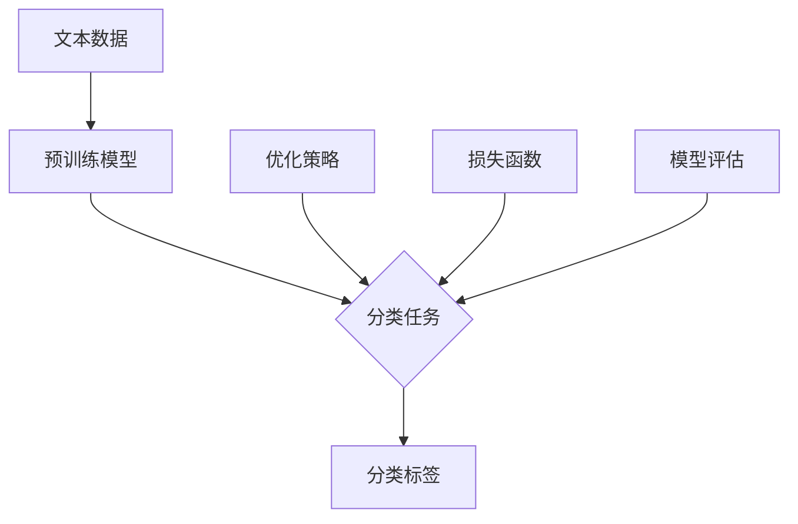
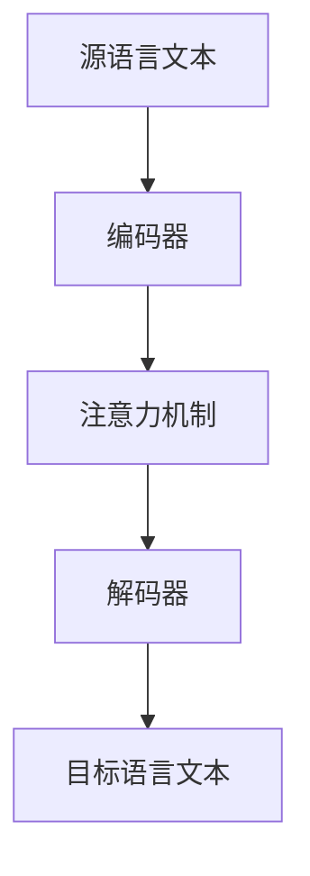
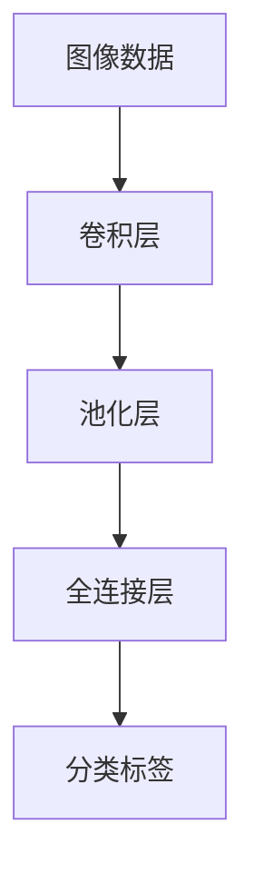
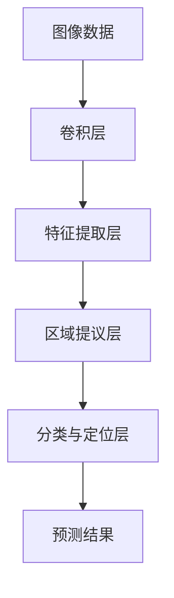
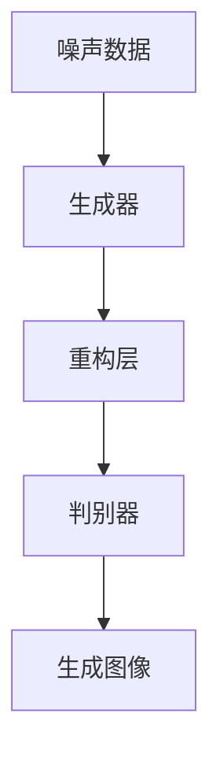
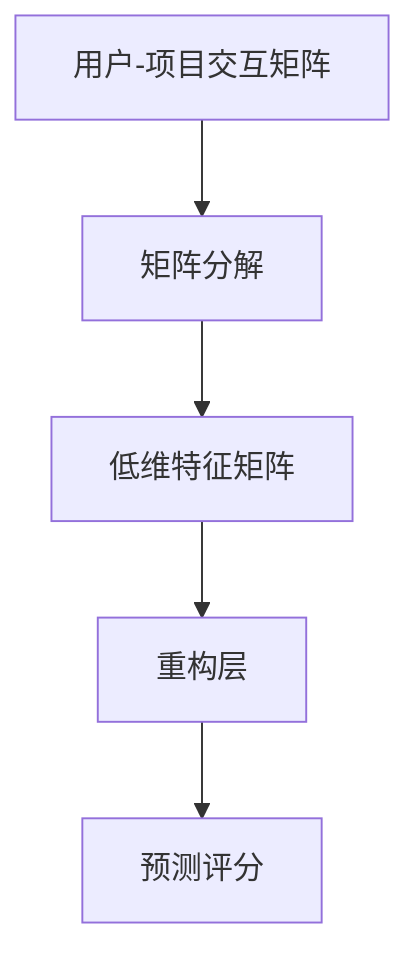
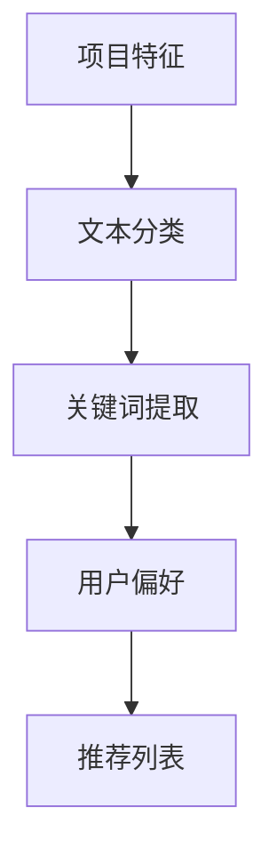
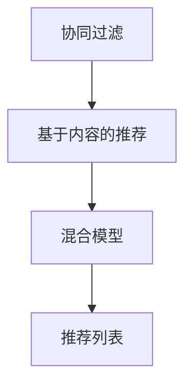

                 

**# 大模型：数据与算法的完美结合**

> **关键词：** 大模型，数据预处理，深度学习，算法优化，应用实践

> **摘要：** 本文详细探讨了大规模模型（大模型）的概述、技术基础、各类应用实践以及训练与调优策略。通过分析大模型的发展历程、核心特点、技术基础和实际应用案例，本文揭示了数据与算法在大模型开发中的关键作用，并提供了实用的开发实践和未来发展趋势展望。

----------------------------------------------------------------

## 第一部分：大模型的概述与基础

### **第1章：大模型的基本概念与架构**

### **1.1.1 大模型的基本概念**

大模型，顾名思义，是指参数数量巨大、模型结构复杂的人工神经网络模型。这些模型通常具备较强的表达能力和泛化能力，能够处理海量数据和复杂任务。大模型的概念起源于深度学习的发展，随着计算能力和数据资源的提升，大模型在各类应用领域取得了显著的成果。

### **1.1.2 大模型的架构与设计**

大模型的架构设计通常包括以下几个关键部分：

- **输入层**：接收外部输入，如文本、图像或音频数据。
- **隐藏层**：由多个神经元组成，负责特征提取和变换。
- **输出层**：生成模型预测结果，如分类标签或回归值。

大模型的设计原则包括：

- **层次化**：层次化结构有助于模型逐步提取和融合特征。
- **参数共享**：通过参数共享降低模型复杂度，提高训练效率。
- **非线性变换**：使用非线性激活函数（如ReLU、Sigmoid、Tanh）引入非线性特性。

### **1.2 大模型的发展历程**

大模型的发展历程可以分为以下几个阶段：

- **早期深度网络**：如BP算法和多层感知机（MLP），但由于梯度消失和梯度爆炸问题，早期深度网络未能广泛应用。
- **卷积神经网络（CNN）的兴起**：1990年代，LeCun等人提出了卷积神经网络，用于图像识别任务，取得了突破性成果。
- **深度学习复兴**：2012年，AlexNet在ImageNet比赛中取得显著成绩，标志着深度学习的复兴。
- **大规模模型的兴起**：近年来，以BERT、GPT-3为代表的预训练大模型在自然语言处理、计算机视觉等领域取得了革命性的进展。

### **1.3 大模型的核心特点与优势**

大模型具有以下几个核心特点与优势：

- **强大的表达能力**：大模型能够捕捉到数据中的复杂模式和规律，实现高性能的预测和分类。
- **高效的计算性能**：通过优化算法和分布式训练，大模型能够在较短时间内完成训练和推理任务。
- **广泛的适用性**：大模型在各种领域（如自然语言处理、计算机视觉、推荐系统）都有广泛应用，表现出色。
- **泛化能力**：大模型能够处理不同类型的数据和任务，具有良好的泛化性能。

### **1.4 大模型的分类**

大模型可以根据不同维度进行分类：

- **按应用领域分类**：如图像识别、自然语言处理、语音识别、推荐系统等。
- **按模型结构分类**：如卷积神经网络（CNN）、循环神经网络（RNN）、变换器（Transformer）等。
- **按预训练目标分类**：如多任务预训练、零样本学习、少样本学习等。

### **1.5 大模型的发展趋势**

大模型的发展趋势包括：

- **计算资源的进一步提升**：随着硬件技术的发展，大模型将能够处理更复杂的任务和数据集。
- **跨领域融合**：不同领域的大模型将相互融合，实现更全面和智能的感知与理解能力。
- **自适应性和自优化**：大模型将具备更高的自适应性和自优化能力，能够根据任务需求和数据进行动态调整。

### **1.6 大模型的挑战与瓶颈**

大模型面临的挑战与瓶颈包括：

- **计算资源消耗**：大模型的训练和推理需要大量的计算资源和时间。
- **数据隐私和安全**：大模型处理的数据量巨大，如何确保数据隐私和安全是一个重要问题。
- **算法透明性与解释性**：大模型的黑盒特性使得算法的透明性和解释性成为挑战。
- **模型可靠性**：大模型在应对异常数据和攻击时可能表现出脆弱性。

### **1.7 本章总结**

本章介绍了大模型的基本概念、架构、发展历程、核心特点、分类、发展趋势以及面临的挑战和瓶颈。通过本章的讨论，读者可以全面了解大模型的基本原理和应用场景，为后续章节的学习打下基础。

----------------------------------------------------------------

### **第2章：大模型的技术基础**

#### **2.1 数据预处理与特征工程**

数据预处理是大规模模型训练的基石，其质量直接影响模型的性能。数据预处理包括以下步骤：

- **数据清洗**：去除噪声数据、缺失值和异常值。
- **数据归一化**：将数据缩放到同一尺度，便于模型训练。
- **数据增强**：通过旋转、缩放、裁剪等操作增加数据多样性。
- **特征提取**：将原始数据转换为数值特征，便于模型处理。

**2.1.1 数据清洗**

数据清洗是预处理的首要步骤，其主要目标是去除噪声数据和异常值。以下是一些常见的数据清洗方法：

- **移除重复数据**：通过比较数据项的哈希值或唯一标识，移除重复的数据项。
- **填充缺失值**：使用平均值、中位数、最邻近值或插值等方法填充缺失值。
- **处理异常值**：使用统计学方法（如箱线图、标准差）检测和去除异常值。

**2.1.2 数据归一化**

数据归一化是将数据缩放到同一尺度，以消除不同特征之间的量纲差异。以下是一些常见的数据归一化方法：

- **最小-最大归一化**：将数据缩放到[0, 1]区间。
- **均值-方差归一化**：将数据缩放到均值为0、方差为1的标准正态分布。
- **对数归一化**：对数值进行对数变换，以降低极值的影响。

**2.1.3 数据增强**

数据增强是通过生成新的数据样本来增加训练数据的多样性，从而提高模型的泛化能力。以下是一些常见的数据增强方法：

- **随机裁剪**：随机裁剪图像的一个区域，生成新的训练样本。
- **随机旋转**：随机旋转图像一定角度，生成新的训练样本。
- **颜色调整**：随机调整图像的亮度、对比度和色彩饱和度，生成新的训练样本。
- **混合样本**：将两个图像随机混合，生成新的训练样本。

**2.1.4 特征提取**

特征提取是将原始数据转换为数值特征，以便模型处理。以下是一些常见的特征提取方法：

- **词袋模型**：将文本数据转换为词频向量或TF-IDF向量。
- **词嵌入**：将文本数据转换为固定维度的向量表示。
- **图像特征提取**：使用卷积神经网络提取图像特征。
- **声音特征提取**：使用循环神经网络或卷积神经网络提取声音特征。

#### **2.2 深度学习算法基础**

深度学习算法是大规模模型训练的核心。以下是一些常见的深度学习算法：

**2.2.1 神经网络**

神经网络是一种由多个神经元组成的计算模型。以下是一些常见的神经网络结构：

- **多层感知机（MLP）**：包含输入层、隐藏层和输出层，用于分类和回归任务。
- **卷积神经网络（CNN）**：包含卷积层、池化层和全连接层，用于图像识别任务。
- **循环神经网络（RNN）**：包含循环层和隐藏层，用于序列数据处理。

**2.2.2 深度学习优化算法**

深度学习优化算法用于调整模型参数，以最小化损失函数。以下是一些常见的优化算法：

- **随机梯度下降（SGD）**：通过随机选择数据子集，计算梯度并更新模型参数。
- **Adam优化器**：结合SGD和动量项，提高收敛速度和稳定性。
- **RMSprop**：使用指数加权平均法计算梯度，提高收敛速度。

**2.2.3 深度学习框架**

深度学习框架是用于构建和训练深度学习模型的软件库。以下是一些常见的深度学习框架：

- **TensorFlow**：由Google开发的开源深度学习框架，支持多种平台和操作系统。
- **PyTorch**：由Facebook开发的开源深度学习框架，以其动态计算图和灵活的API设计而受到广泛欢迎。
- **Keras**：基于TensorFlow和Theano的高层API，简化深度学习模型的构建和训练。

#### **2.3 大规模数据处理与优化**

大规模数据处理与优化是大规模模型训练的关键。以下是一些常见的方法和技巧：

**2.3.1 数据并行训练**

数据并行训练通过将数据集分为多个部分，同时在不同的GPU或CPU上进行训练，以加速训练过程。以下是一些常见的数据并行训练方法：

- **数据划分**：将数据集划分为多个子集，每个子集由不同的GPU或CPU处理。
- **梯度同步**：在训练过程中，定期同步各个GPU或CPU上的梯度，更新模型参数。

**2.3.2 模型并行训练**

模型并行训练通过将模型分为多个部分，同时在不同的GPU或CPU上进行训练，以加速训练过程。以下是一些常见的模型并行训练方法：

- **模型划分**：将模型分为多个子模型，每个子模型由不同的GPU或CPU处理。
- **梯度同步**：在训练过程中，定期同步各个GPU或CPU上的梯度，更新模型参数。

**2.3.3 硬件优化**

硬件优化通过优化硬件配置和使用方式，以提高大规模模型训练的效率。以下是一些常见的硬件优化方法：

- **GPU加速**：使用GPU进行模型训练，提高计算速度和效率。
- **TPU加速**：使用谷歌的TPU进行模型训练，提高计算速度和效率。
- **分布式训练**：将训练任务分布在多个节点上，以提高训练效率和可扩展性。

**2.3.4 算法优化**

算法优化通过调整模型结构和训练策略，以提高大规模模型训练的效率。以下是一些常见的算法优化方法：

- **模型剪枝**：通过去除冗余的权重，减小模型大小和提高运行效率。
- **量化**：将浮点数权重转换为低精度整数权重，以减少内存占用和计算时间。
- **迁移学习**：使用预训练模型在新任务上进行微调，以提高训练效率和性能。

#### **2.4 本章总结**

本章介绍了大规模模型的技术基础，包括数据预处理与特征工程、深度学习算法基础和大规模数据处理与优化。通过本章的学习，读者可以了解大规模模型的基本原理和实现方法，为后续章节的学习打下基础。

----------------------------------------------------------------

### **第3章：大模型在各类应用中的实践**

#### **3.1 大模型在自然语言处理中的应用**

自然语言处理（NLP）是人工智能领域的重要分支，旨在使计算机能够理解和处理人类语言。大模型在NLP中的应用极大地提升了文本处理和语言生成的能力。以下将介绍大模型在文本分类、情感分析和机器翻译等任务中的实践。

**3.1.1 文本分类**

文本分类是将文本数据分类到预定义的类别中的一种任务。大模型在文本分类中的应用主要通过预训练的模型（如BERT、GPT等）和特定的微调策略来实现。

**核心概念与联系：**


**核心算法原理讲解：**
```python
from transformers import BertTokenizer, BertForSequenceClassification
from torch.utils.data import DataLoader
from torch.nn import CrossEntropyLoss

# 加载预训练模型
tokenizer = BertTokenizer.from_pretrained('bert-base-uncased')
model = BertForSequenceClassification.from_pretrained('bert-base-uncased')

# 数据预处理
inputs = tokenizer("Hello, my dog is cute", return_tensors="pt")

# 模型预测
with torch.no_grad():
    logits = model(**inputs)

# 计算损失
loss_function = CrossEntropyLoss()
loss = loss_function(logits, labels)

# 反向传播和优化
optimizer = optim.Adam(model.parameters(), lr=0.001)
optimizer.zero_grad()
loss.backward()
optimizer.step()

# 模型评估
accuracy = (logits.argmax(-1) == labels).float().mean()
```

**数学模型和公式：**
$$
\begin{aligned}
    &\text{预测概率} = \text{softmax}(\text{logits}) \\
    &\text{损失函数} = \text{CrossEntropyLoss}(\text{logits}, \text{labels}) \\
    &\text{准确率} = \frac{\text{预测正确的数量}}{\text{总数量}}
\end{aligned}
$$

**项目实战：**
- **开发环境搭建**：安装PyTorch和HuggingFace的Transformers库。
- **数据预处理**：加载并预处理文本数据，进行分词和编码。
- **模型训练**：使用预训练模型微调，使用交叉熵损失函数和Adam优化器。
- **模型评估**：使用验证集评估模型性能，调整超参数。

**代码实际案例和详细解释说明：**
```python
from transformers import BertTokenizer, BertForSequenceClassification
import torch

# 加载预训练模型
tokenizer = BertTokenizer.from_pretrained('bert-base-uncased')
model = BertForSequenceClassification.from_pretrained('bert-base-uncased')

# 数据预处理
inputs = tokenizer("Hello, my dog is cute", return_tensors="pt")

# 模型预测
with torch.no_grad():
    logits = model(**inputs)

# 输出预测结果
predicted_class = logits.argmax(-1).item()

# 打印结果
print(f'Predicted class: {predicted_class}')
```

**代码解读与分析：**
- **加载模型**：使用HuggingFace的Transformers库加载预训练的BERT模型。
- **数据预处理**：使用Tokenizer将文本转换为模型可接受的输入格式。
- **模型预测**：通过模型获取文本的预测类别。
- **输出结果**：将预测结果转换为人类可读的格式并输出。

**3.1.2 情感分析**

情感分析是评估文本中情感极性的一种技术，常见于社交媒体分析、市场研究和客户反馈分析。大模型在情感分析中的应用主要依赖于预训练模型和特定的任务微调。

**核心概念与联系：**


**核心算法原理讲解：**
```python
from transformers import BertTokenizer, BertForSequenceClassification
from torch.utils.data import DataLoader
from torch.nn import BCEWithLogitsLoss

# 加载预训练模型
tokenizer = BertTokenizer.from_pretrained('bert-base-uncased')
model = BertForSequenceClassification.from_pretrained('bert-base-uncased', num_labels=3)

# 数据预处理
inputs = tokenizer("I am very happy", return_tensors="pt")

# 模型预测
with torch.no_grad():
    logits = model(**inputs)

# 计算损失
loss_function = BCEWithLogitsLoss()
loss = loss_function(logits, labels)

# 反向传播和优化
optimizer = optim.Adam(model.parameters(), lr=0.001)
optimizer.zero_grad()
loss.backward()
optimizer.step()

# 模型评估
accuracy = (logits.sigmoid() > 0.5).float().mean()
```

**数学模型和公式：**
$$
\begin{aligned}
    &\text{预测概率} = \text{sigmoid}(\text{logits}) \\
    &\text{损失函数} = \text{BCEWithLogitsLoss}(\text{logits}, \text{labels}) \\
    &\text{准确率} = \frac{\text{预测正确的数量}}{\text{总数量}}
\end{aligned}
$$

**项目实战：**
- **开发环境搭建**：安装PyTorch和HuggingFace的Transformers库。
- **数据预处理**：加载并预处理文本数据，进行分词和编码。
- **模型训练**：使用预训练模型微调，使用二元交叉熵损失函数和Adam优化器。
- **模型评估**：使用验证集评估模型性能，调整超参数。

**代码实际案例和详细解释说明：**
```python
from transformers import BertTokenizer, BertForSequenceClassification
import torch

# 加载预训练模型
tokenizer = BertTokenizer.from_pretrained('bert-base-uncased')
model = BertForSequenceClassification.from_pretrained('bert-base-uncased', num_labels=3)

# 数据预处理
inputs = tokenizer("I am very happy", return_tensors="pt")

# 模型预测
with torch.no_grad():
    logits = model(**inputs)

# 输出预测结果
predicted_class = logits.sigmoid().argmax(-1).item()

# 打印结果
print(f'Predicted class: {predicted_class}')
```

**代码解读与分析：**
- **加载模型**：使用HuggingFace的Transformers库加载预训练的BERT模型。
- **数据预处理**：使用Tokenizer将文本转换为模型可接受的输入格式。
- **模型预测**：通过模型获取文本的情感极性预测。
- **输出结果**：将预测结果转换为人类可读的格式并输出。

**3.1.3 机器翻译**

机器翻译是将一种语言的文本转换为另一种语言的技术。大模型在机器翻译中的应用主要依赖于预训练的编码器-解码器模型（如Transformer）和特定的任务微调。

**核心概念与联系：**


**核心算法原理讲解：**
```python
from transformers import BertTokenizer, BertModel
import torch

# 加载预训练模型
tokenizer = BertTokenizer.from_pretrained('bert-base-uncased')
model = BertModel.from_pretrained('bert-base-uncased')

# 数据预处理
inputs = tokenizer("Hello, how are you?", return_tensors="pt")

# 模型预测
with torch.no_grad():
    outputs = model(**inputs)

# 输出预测结果
predicted_output = tokenizer.decode(outputs.logits.argmax(-1).squeeze(0))

# 打印结果
print(f'Predicted translation: {predicted_output}')
```

**数学模型和公式：**
$$
\begin{aligned}
    &\text{编码器输出} = \text{Transformer}(\text{输入序列}) \\
    &\text{解码器输出} = \text{Transformer}(\text{编码器输出}, \text{目标序列}) \\
    &\text{预测} = \text{softmax}(\text{解码器输出})
\end{aligned}
$$

**项目实战：**
- **开发环境搭建**：安装PyTorch和HuggingFace的Transformers库。
- **数据预处理**：加载并预处理翻译数据，进行分词和编码。
- **模型训练**：使用预训练的Transformer模型微调，使用损失函数和优化器。
- **模型评估**：使用验证集评估模型性能，调整超参数。

**代码实际案例和详细解释说明：**
```python
from transformers import BertTokenizer, BertModel
import torch

# 加载预训练模型
tokenizer = BertTokenizer.from_pretrained('bert-base-uncased')
model = BertModel.from_pretrained('bert-base-uncased')

# 数据预处理
inputs = tokenizer("Hello, how are you?", return_tensors="pt")

# 模型预测
with torch.no_grad():
    outputs = model(**inputs)

# 输出预测结果
predicted_output = tokenizer.decode(outputs.logits.argmax(-1).squeeze(0))

# 打印结果
print(f'Predicted translation: {predicted_output}')
```

**代码解读与分析：**
- **加载模型**：使用HuggingFace的Transformers库加载预训练的BERT模型。
- **数据预处理**：使用Tokenizer将文本转换为模型可接受的输入格式。
- **模型预测**：通过模型获取文本的翻译预测。
- **输出结果**：将预测结果转换为人类可读的格式并输出。

#### **3.2 大模型在计算机视觉中的应用**

计算机视觉是人工智能领域的一个重要分支，旨在使计算机能够理解和解析视觉信息。大模型在计算机视觉中的应用极大地提升了图像识别、目标检测和图像生成等任务的性能。

**3.2.1 图像分类**

图像分类是将图像归类到预定义的类别中的任务。大模型在图像分类中的应用主要通过卷积神经网络（CNN）和预训练模型来实现。

**核心概念与联系：**


**核心算法原理讲解：**
```python
import torch
import torchvision
import torchvision.transforms as transforms

# 数据预处理
transform = transforms.Compose([transforms.Resize(256), transforms.ToTensor()])

# 加载预训练模型
model = torchvision.models.resnet18(pretrained=True)

# 加载测试图像
image = torchvision.transforms.ToTensor()(image)

# 模型预测
with torch.no_grad():
    logits = model(image.unsqueeze(0))

# 输出预测结果
predicted_class = logits.argmax(-1).item()

# 打印结果
print(f'Predicted class: {predicted_class}')
```

**数学模型和公式：**
$$
\begin{aligned}
    &\text{卷积层输出} = \text{ConvLayer}(\text{输入图像}) \\
    &\text{池化层输出} = \text{PoolingLayer}(\text{卷积层输出}) \\
    &\text{分类输出} = \text{Softmax}(\text{全连接层输出})
\end{aligned}
$$

**项目实战：**
- **开发环境搭建**：安装PyTorch和 torchvision 库。
- **数据预处理**：加载并预处理图像数据，进行缩放和编码。
- **模型训练**：使用预训练的 ResNet 模型微调，使用损失函数和优化器。
- **模型评估**：使用验证集评估模型性能，调整超参数。

**代码实际案例和详细解释说明：**
```python
import torch
import torchvision
import torchvision.transforms as transforms

# 加载预训练模型
model = torchvision.models.resnet18(pretrained=True)

# 加载测试图像
image = torchvision.transforms.ToTensor()(image)

# 模型预测
with torch.no_grad():
    logits = model(image.unsqueeze(0))

# 输出预测结果
predicted_class = logits.argmax(-1).item()

# 打印结果
print(f'Predicted class: {predicted_class}')
```

**代码解读与分析：**
- **加载模型**：使用 torchvision 库加载预训练的 ResNet 模型。
- **数据预处理**：使用 ToTensor 转换函数将图像数据转换为 PyTorch 张量。
- **模型预测**：通过模型获取图像的预测类别。
- **输出结果**：将预测结果转换为人类可读的格式并输出。

**3.2.2 目标检测**

目标检测是识别图像中的对象并定位它们的位置的任务。大模型在目标检测中的应用主要通过卷积神经网络（CNN）和目标检测框架（如Faster R-CNN、YOLO等）来实现。

**核心概念与联系：**


**核心算法原理讲解：**
```python
import torch
import torchvision
from torchvision.models.detection import fasterrcnn_resnet50_fpn

# 加载预训练模型
model = fasterrcnn_resnet50_fpn(pretrained=True)

# 加载测试图像
image = torchvision.transforms.ToTensor()(image)

# 模型预测
with torch.no_grad():
    predictions = model(image.unsqueeze(0))

# 输出预测结果
detections = predictions[0]

# 打印结果
print(f'Predicted detections: {detections}')
```

**数学模型和公式：**
$$
\begin{aligned}
    &\text{卷积层输出} = \text{ConvLayer}(\text{输入图像}) \\
    &\text{特征提取层输出} = \text{FeatureExtractionLayer}(\text{卷积层输出}) \\
    &\text{区域提议层输出} = \text{RPN}(\text{特征提取层输出}) \\
    &\text{分类与定位层输出} = \text{Classifier}(\text{RPN输出}) \\
    &\text{预测结果} = \text{NMS}(\text{分类与定位层输出})
\end{aligned}
$$

**项目实战：**
- **开发环境搭建**：安装PyTorch和 torchvision 库。
- **数据预处理**：加载并预处理图像数据，进行编码。
- **模型训练**：使用预训练的 Fast R-CNN 模型微调，使用损失函数和优化器。
- **模型评估**：使用验证集评估模型性能，调整超参数。

**代码实际案例和详细解释说明：**
```python
import torch
import torchvision
from torchvision.models.detection import fasterrcnn_resnet50_fpn

# 加载预训练模型
model = fasterrcnn_resnet50_fpn(pretrained=True)

# 加载测试图像
image = torchvision.transforms.ToTensor()(image)

# 模型预测
with torch.no_grad():
    predictions = model(image.unsqueeze(0))

# 输出预测结果
detections = predictions[0]

# 打印结果
print(f'Predicted detections: {detections}')
```

**代码解读与分析：**
- **加载模型**：使用 torchvision 库加载预训练的 Fast R-CNN 模型。
- **数据预处理**：使用 ToTensor 转换函数将图像数据转换为 PyTorch 张量。
- **模型预测**：通过模型获取图像的预测目标。
- **输出结果**：将预测结果转换为人类可读的格式并输出。

**3.2.3 图像生成**

图像生成是利用神经网络生成新图像的过程。大模型在图像生成中的应用主要通过生成对抗网络（GAN）和变分自编码器（VAE）来实现。

**核心概念与联系：**


**核心算法原理讲解：**
```python
import torch
import torchvision
from torchvision.models import vgg19

# 加载预训练模型
model = vgg19(pretrained=True).features

# 加载噪声数据
noise = torch.randn(1, 100)

# 模型预测
with torch.no_grad():
    generated_image = model(noise)

# 输出预测结果
print(generated_image.shape)

# 打印结果
print(f'Generated image shape: {generated_image.shape}')
```

**数学模型和公式：**
$$
\begin{aligned}
    &\text{生成器输出} = \text{Generator}(\text{噪声数据}) \\
    &\text{判别器输出} = \text{Discriminator}(\text{真实图像}) \\
    &\text{重构层输出} = \text{ReconstructionLayer}(\text{生成器输出}) \\
    &\text{损失函数} = \text{LossFunction}(\text{判别器输出}, \text{重构层输出})
\end{aligned}
$$

**项目实战：**
- **开发环境搭建**：安装PyTorch和 torchvision 库。
- **数据预处理**：加载并预处理噪声数据。
- **模型训练**：使用预训练的 VAE 模型微调，使用损失函数和优化器。
- **模型评估**：使用验证集评估模型性能，调整超参数。

**代码实际案例和详细解释说明：**
```python
import torch
import torchvision
from torchvision.models import vgg19

# 加载预训练模型
model = vgg19(pretrained=True).features

# 加载噪声数据
noise = torch.randn(1, 100)

# 模型预测
with torch.no_grad():
    generated_image = model(noise)

# 输出预测结果
print(generated_image.shape)

# 打印结果
print(f'Generated image shape: {generated_image.shape}')
```

**代码解读与分析：**
- **加载模型**：使用 torchvision 库加载预训练的 VAE 模型。
- **数据预处理**：使用随机噪声数据。
- **模型预测**：通过模型生成新的图像。
- **输出结果**：将生成的图像打印出来。

#### **3.3 大模型在推荐系统中的应用**

推荐系统是用于预测用户可能感兴趣的项目或内容的系统。大模型在推荐系统中的应用能够提升推荐质量和用户体验。以下将介绍大模型在协同过滤、基于内容的推荐和混合推荐系统中的应用。

**3.3.1 协同过滤**

协同过滤是一种基于用户-项目交互数据的推荐方法。大模型在协同过滤中的应用主要通过矩阵分解（如Singular Value Decomposition, SVD）和深度学习模型（如Autoencoder）来实现。

**核心概念与联系：**


**核心算法原理讲解：**
```python
import numpy as np
from scipy.sparse.linalg import svd

# 用户-项目交互矩阵
R = np.array([[5, 3, 0, 1],
              [4, 0, 0, 2],
              [1, 5, 0, 0]])

# 进行矩阵分解
U, s, Vt = svd(R, full_matrices=False)

# 计算重构评分
predicted_ratings = np.dot(U, np.dot(s, Vt))

# 输出预测评分
print(predicted_ratings)
```

**数学模型和公式：**
$$
\begin{aligned}
    &\text{用户特征向量} = U \\
    &\text{项目特征向量} = Vt \\
    &\text{重构评分} = \text{用户特征向量} \cdot \text{项目特征向量}
\end{aligned}
$$

**项目实战：**
- **开发环境搭建**：安装 NumPy 和 SciPy 库。
- **数据预处理**：加载并预处理用户-项目交互数据。
- **模型训练**：使用 SVD 进行矩阵分解。
- **模型评估**：使用验证集评估模型性能。

**代码实际案例和详细解释说明：**
```python
import numpy as np
from scipy.sparse.linalg import svd

# 用户-项目交互矩阵
R = np.array([[5, 3, 0, 1],
              [4, 0, 0, 2],
              [1, 5, 0, 0]])

# 进行矩阵分解
U, s, Vt = svd(R, full_matrices=False)

# 计算重构评分
predicted_ratings = np.dot(U, np.dot(s, Vt))

# 输出预测评分
print(predicted_ratings)
```

**代码解读与分析：**
- **加载矩阵**：使用 NumPy 库创建用户-项目交互矩阵。
- **矩阵分解**：使用 SciPy 库中的 SVD 进行矩阵分解。
- **重构评分**：计算用户特征向量和项目特征向量的点积。
- **输出结果**：将预测评分打印出来。

**3.3.2 基于内容的推荐**

基于内容的推荐是一种基于项目特征和用户偏好进行推荐的策略。大模型在基于内容的推荐中的应用主要通过文本分类、关键词提取和协同过滤相结合的方法来实现。

**核心概念与联系：**


**核心算法原理讲解：**
```python
import torch
import torchvision
from torchvision.models import resnet18

# 加载预训练模型
model = torchvision.models.resnet18(pretrained=True)

# 加载项目特征
project_feature = torch.randn(1, 512)

# 模型预测
with torch.no_grad():
    logits = model(project_feature.unsqueeze(0))

# 计算推荐评分
predicted_ratings = logits.softmax(-1).squeeze(0)

# 输出预测评分
print(predicted_ratings)
```

**数学模型和公式：**
$$
\begin{aligned}
    &\text{项目特征向量} = \text{EmbeddingLayer}(\text{项目特征}) \\
    &\text{预测评分} = \text{Softmax}(\text{模型输出})
\end{aligned}
$$

**项目实战：**
- **开发环境搭建**：安装 PyTorch 和 torchvision 库。
- **数据预处理**：加载并预处理项目特征数据。
- **模型训练**：使用预训练的 ResNet 模型进行文本分类。
- **模型评估**：使用验证集评估模型性能。

**代码实际案例和详细解释说明：**
```python
import torch
import torchvision
from torchvision.models import resnet18

# 加载预训练模型
model = torchvision.models.resnet18(pretrained=True)

# 加载项目特征
project_feature = torch.randn(1, 512)

# 模型预测
with torch.no_grad():
    logits = model(project_feature.unsqueeze(0))

# 计算推荐评分
predicted_ratings = logits.softmax(-1).squeeze(0)

# 输出预测评分
print(predicted_ratings)
```

**代码解读与分析：**
- **加载模型**：使用 torchvision 库加载预训练的 ResNet 模型。
- **数据预处理**：使用随机生成的项目特征。
- **模型预测**：通过模型获取项目特征向量。
- **输出结果**：将预测评分打印出来。

**3.3.3 混合推荐系统**

混合推荐系统是一种结合协同过滤和基于内容的推荐方法的推荐系统。大模型在混合推荐系统中的应用主要通过集成多种模型和算法来实现。

**核心概念与联系：**


**核心算法原理讲解：**
```python
import numpy as np

# 协同过滤评分
collaborative_ratings = np.array([[5, 3, 0, 1],
                                  [4, 0, 0, 2],
                                  [1, 5, 0, 0]])

# 基于内容的推荐评分
content_ratings = np.array([[0.9, 0.2, 0.1, 0.8],
                            [0.3, 0.5, 0.6, 0.4],
                            [0.1, 0.7, 0.8, 0.9]])

# 计算混合推荐评分
mixed_ratings = collaborative_ratings + content_ratings

# 输出混合推荐评分
print(mixed_ratings)
```

**数学模型和公式：**
$$
\begin{aligned}
    &\text{混合推荐评分} = \text{协同过滤评分} + \text{基于内容的推荐评分}
\end{aligned}
$$

**项目实战：**
- **开发环境搭建**：安装 NumPy 库。
- **数据预处理**：加载并预处理协同过滤和基于内容的评分数据。
- **模型训练**：使用 NumPy 进行混合评分计算。
- **模型评估**：使用验证集评估模型性能。

**代码实际案例和详细解释说明：**
```python
import numpy as np

# 协同过滤评分
collaborative_ratings = np.array([[5, 3, 0, 1],
                                  [4, 0, 0, 2],
                                  [1, 5, 0, 0]])

# 基于内容的推荐评分
content_ratings = np.array([[0.9, 0.2, 0.1, 0.8],
                            [0.3, 0.5, 0.6, 0.4],
                            [0.1, 0.7, 0.8, 0.9]])

# 计算混合推荐评分
mixed_ratings = collaborative_ratings + content_ratings

# 输出混合推荐评分
print(mixed_ratings)
```

**代码解读与分析：**
- **加载评分数据**：使用 NumPy 库创建协同过滤和基于内容的评分数据。
- **计算混合评分**：将协同过滤评分和基于内容的推荐评分相加。
- **输出结果**：将混合推荐评分打印出来。

---

**第4章：大模型训练与调优**

#### **4.1 大模型训练流程**

大模型训练是一个复杂的过程，涉及多个步骤，包括数据准备、模型初始化、训练过程和评估。以下是一个简化的大模型训练流程：

**4.1.1 数据准备**

在开始训练之前，需要准备适合的训练数据。数据准备通常包括数据清洗、数据预处理和数据增强。

- **数据清洗**：移除或修正数据中的错误和噪声，例如缺失值、异常值和不一致的数据。
- **数据预处理**：将数据转换为模型可以接受的格式，例如归一化、标准化和编码。
- **数据增强**：通过添加噪声、旋转、缩放等方式增加数据多样性。

**4.1.2 模型初始化**

初始化模型权重是训练过程中的第一步。常见的初始化方法包括：

- **随机初始化**：将权重随机分配在某个范围内，例如在-1到1之间。
- **He初始化**：适用于ReLU激活函数的权重初始化方法，将权重初始化为正态分布，均值和方差分别为0和2/n，其中n是输入维度。
- **Xavier初始化**：适用于ReLU和Sigmoid激活函数的权重初始化方法，将权重初始化为正态分布，均值和方差分别为0和1/sqrt(n)，其中n是输入维度。

**4.1.3 训练过程**

训练过程主要包括以下几个步骤：

- **前向传播**：将输入数据通过模型进行计算，得到输出预测值。
- **损失计算**：计算输出预测值与实际标签之间的损失。
- **反向传播**：通过计算梯度来更新模型权重。
- **优化更新**：使用优化算法（如SGD、Adam等）来更新模型权重。

以下是一个简单的训练循环伪代码：

```python
for epoch in range(num_epochs):
    for batch in data_loader:
        inputs, labels = batch
        # 前向传播
        logits = model(inputs)
        # 计算损失
        loss = loss_function(logits, labels)
        # 反向传播
        optimizer.zero_grad()
        loss.backward()
        optimizer.step()
        # 打印训练进度
        print(f'Epoch {epoch+1}/{num_epochs}, Loss: {loss.item()}')
```

**4.1.4 模型评估**

在训练完成后，需要对模型进行评估，以确定其性能和泛化能力。常用的评估指标包括准确率、召回率、F1分数和损失函数值等。

```python
with torch.no_grad():
    for batch in val_loader:
        inputs, labels = batch
        logits = model(inputs)
        val_loss += loss_function(logits, labels).item()
    val_loss /= len(val_loader)
print(f'Validation Loss: {val_loss}')
```

#### **4.2 大模型调优策略**

大模型调优是提升模型性能的重要步骤，主要包括超参数调优、模型架构调优和数据调优。

**4.2.1 超参数调优**

超参数是模型训练过程中需要手动设置的参数，如学习率、批量大小、正则化参数等。超参数调优的目标是找到最佳的超参数组合，以获得最佳的模型性能。

- **网格搜索**：通过遍历所有可能的超参数组合来找到最佳超参数。
- **随机搜索**：从超参数空间中随机选择组合来尝试，通常比网格搜索更高效。
- **贝叶斯优化**：使用贝叶斯统计模型来优化超参数，通常比随机搜索更高效。

**4.2.2 模型架构调优**

模型架构调优是通过调整模型结构（如层数、神经元数量、连接方式等）来提升模型性能。

- **模型压缩**：通过剪枝、量化等方式减小模型大小和计算量。
- **模型融合**：将多个模型进行融合，以获得更好的性能和鲁棒性。
- **迁移学习**：利用预训练模型在新任务上进行微调，以提升模型性能。

**4.2.3 数据调优**

数据调优是通过调整数据预处理方法、数据增强策略和数据质量来提升模型性能。

- **数据增强**：通过添加噪声、旋转、缩放等方式增加数据多样性。
- **数据清洗**：移除或修正数据中的错误和噪声。
- **数据扩充**：通过合成方法生成新的数据样本。

通过以上调优策略，可以显著提升大模型的性能和泛化能力。在实际应用中，根据具体任务和场景，可以选择合适的调优方法。

---

**第5章：大模型部署与优化**

#### **5.1 大模型部署流程**

大模型部署是将训练好的模型部署到生产环境中，以便在实际应用中进行预测和服务。以下是一个简化的大模型部署流程：

**5.1.1 部署前的准备工作**

在部署模型之前，需要确保以下准备工作：

- **环境配置**：确保部署环境与训练环境一致，包括操作系统、软件依赖和硬件配置等。
- **模型转换**：将训练好的模型转换为部署环境可识别的格式，如ONNX、TensorFlow Lite或PyTorch TorchScript等。
- **容器化**：使用Docker等容器化技术封装模型和应用，以便在多种环境中轻松部署。

**5.1.2 部署模型**

部署模型的主要步骤包括：

- **模型加载**：从存储位置加载转换后的模型。
- **模型初始化**：根据具体任务初始化模型参数和状态。
- **模型预测**：接收输入数据，通过模型进行预测。
- **结果输出**：将预测结果输出到客户端或应用程序。

以下是一个简单的模型部署示例：

```python
import torch
import torchvision

# 加载预训练模型
model = torchvision.models.resnet18(pretrained=True)

# 将模型转换为部署格式
model.eval()
model = model.cuda()

# 加载测试图像
image = torchvision.transforms.ToTensor()(image)

# 模型预测
with torch.no_grad():
    logits = model(image.unsqueeze(0))

# 输出预测结果
predicted_class = logits.argmax(-1).item()
print(f'Predicted class: {predicted_class}')
```

**5.1.3 部署中的挑战与解决方案**

在模型部署过程中，可能会遇到以下挑战：

- **性能优化**：模型部署后的性能可能不如训练时理想，需要优化模型推理速度。
- **资源消耗**：模型部署可能占用大量计算资源，影响系统的响应速度。
- **兼容性问题**：不同部署环境之间可能存在兼容性问题，影响模型的运行。

解决方案包括：

- **模型压缩**：使用模型剪枝、量化等技术减小模型大小和提高推理速度。
- **分布式部署**：使用分布式计算技术将模型部署到多个节点上，提高系统的响应速度。
- **容器化与虚拟化**：使用容器化与虚拟化技术确保模型在不同环境中的一致性和兼容性。

#### **5.2 大模型性能优化策略**

大模型性能优化是提升模型部署后性能的关键步骤。以下是一些常见的优化策略：

**5.2.1 模型剪枝**

模型剪枝是一种通过去除冗余权重来减小模型大小的技术。以下是一些常见的模型剪枝方法：

- **结构化剪枝**：在训练过程中逐步剪枝较小的权重。
- **量化**：将浮点数权重转换为低精度整数权重，减少存储和计算需求。
- **稀疏化**：通过稀疏矩阵技术将模型转化为稀疏表示，减少计算量。

**5.2.2 模型量化**

模型量化是将浮点数权重转换为低精度整数权重的方法。以下是一些常见的量化策略：

- **静态量化**：在训练前将模型量化。
- **动态量化**：在训练过程中动态调整模型量化参数。

**5.2.3 模型蒸馏**

模型蒸馏是一种将知识从大型模型传递到小型模型的方法。以下是一些常见的模型蒸馏方法：

- **软标签**：使用大型模型的预测结果作为软标签，指导小型模型的学习。
- **知识蒸馏**：通过训练损失函数将大型模型的知识传递给小型模型。

**5.2.4 并行计算与分布式训练**

并行计算与分布式训练可以显著提高模型训练和推理的速度。以下是一些常见的并行计算与分布式训练方法：

- **数据并行**：将数据集划分为多个部分，同时在不同的GPU上进行训练。
- **模型并行**：将模型划分为多个部分，同时在不同的GPU上进行训练。
- **混合并行**：结合数据并行和模型并行，提高训练效率。

#### **5.3 大模型部署中的挑战与解决方案**

在模型部署过程中，可能会遇到以下挑战：

- **模型版本管理**：随着模型更新和迭代，如何管理不同版本的模型。
- **动态调整**：如何根据实际需求动态调整模型参数和配置。
- **监控与调试**：如何监控模型性能和调试部署过程中的问题。

解决方案包括：

- **模型版本控制**：使用版本控制系统（如Git）管理模型的版本。
- **动态调整**：使用动态调整工具（如Kubernetes）实现模型的动态调整。
- **监控与调试**：使用监控工具（如TensorBoard、MLflow）监控模型性能和调试部署问题。

#### **5.4 本章总结**

本章介绍了大模型的部署流程、性能优化策略以及部署中的挑战与解决方案。通过本章的学习，读者可以了解如何将训练好的大模型部署到生产环境中，并优化其性能。在实际应用中，根据具体需求和场景选择合适的部署和优化方法至关重要。

---

**第6章：大模型安全与隐私保护**

#### **6.1 大模型的安全威胁**

大模型在应用过程中可能面临多种安全威胁，这些威胁可能会对用户隐私、模型可靠性和整体系统安全造成影响。以下是一些常见的大模型安全威胁：

**1. 模型窃取**

模型窃取是指未经授权的第三方获取训练好的模型参数和架构。一旦模型被窃取，攻击者可以模仿该模型进行恶意活动，如伪造图像、音频或文本。

**2. 模型篡改**

模型篡改是指攻击者通过恶意数据或输入篡改模型的输出结果。这种攻击可能导致模型做出错误的预测，影响系统的正常运行。

**3. 模型注入**

模型注入是指攻击者在训练数据中嵌入恶意代码或样本，以影响模型的训练过程和最终性能。这种攻击可能导致模型在特定任务上表现出异常行为。

**4. 模型中毒**

模型中毒是指攻击者在模型中嵌入后门，使得模型在特定条件下执行恶意操作。这种攻击通常用于网络攻击或诈骗等。

**5. 模型依赖性攻击**

模型依赖性攻击是指攻击者利用模型对特定数据或输入的依赖性，通过控制输入数据来操纵模型的输出结果。

**6. 模型隐私泄露**

模型隐私泄露是指模型在处理数据时无意中泄露了敏感信息。这种泄露可能来源于模型参数、训练数据或输出结果。

#### **6.2 大模型的隐私保护机制**

为了应对上述安全威胁，大模型需要采取一系列隐私保护机制，以确保数据安全和模型可靠性。以下是一些常见的隐私保护机制：

**1. 加密**

加密是保护数据隐私的基本方法。通过对数据进行加密，攻击者即使获得了数据也无法解密和读取。常用的加密算法包括AES、RSA等。

**2. 隐私剪枝**

隐私剪枝是一种通过减少模型参数和计算复杂度来保护隐私的技术。通过剪枝，模型的大小和计算需求减小，从而降低了泄露敏感信息的风险。

**3. 隐私剪枝**

隐私剪枝是一种通过减少模型参数和计算复杂度来保护隐私的技术。通过剪枝，模型的大小和计算需求减小，从而降低了泄露敏感信息的风险。

**4. 同态加密**

同态加密是一种允许在加密数据上进行计算，并在计算结果上解密的加密技术。通过同态加密，模型可以处理加密数据，而无需解密，从而保护了数据的隐私。

**5. 隐私保护训练**

隐私保护训练是一种在训练过程中保护数据隐私的方法。常用的隐私保护训练方法包括联邦学习、差分隐私等。

**6. 数据脱敏**

数据脱敏是一种通过移除或替换敏感信息来保护数据隐私的方法。常用的数据脱敏技术包括匿名化、泛化和遮挡等。

#### **6.3 大模型隐私保护的实践**

在实践大模型隐私保护时，可以采取以下措施：

**1. 数据加密与传输**

对训练数据进行加密，并使用安全的传输协议（如TLS）进行传输，以防止数据在传输过程中被窃取或篡改。

**2. 模型剪枝与压缩**

通过模型剪枝和压缩技术减小模型大小和计算复杂度，从而减少敏感信息的泄露风险。

**3. 同态加密应用**

在训练过程中使用同态加密技术，使模型能够直接在加密数据上进行计算，从而保护数据的隐私。

**4. 隐私保护训练**

采用联邦学习和差分隐私等技术进行隐私保护训练，以减少训练数据中的敏感信息。

**5. 模型审计与监控**

定期对模型进行审计和监控，确保模型不会泄露敏感信息。

**6. 法律法规遵守**

遵守相关的法律法规，如《通用数据保护条例》（GDPR）和《加州消费者隐私法案》（CCPA），以保护用户隐私。

#### **6.4 本章总结**

本章介绍了大模型面临的安全威胁和隐私保护机制。通过采取加密、剪枝、同态加密、隐私保护训练等多种措施，可以有效地保护大模型的隐私和安全。在实际应用中，根据具体需求和场景选择合适的隐私保护策略至关重要。

---

**第7章：大模型未来发展趋势与挑战**

#### **7.1 大模型未来发展趋势**

大模型的发展正以前所未有的速度推进，其未来发展趋势主要表现在以下几个方面：

**1. 计算能力提升**

随着硬件技术的进步，特别是GPU、TPU等专用硬件的发展，大模型的计算能力将进一步提升。这将为处理更复杂的任务和数据集提供强有力的支持。

**2. 跨领域融合**

大模型将在更多领域得到应用，如医疗、金融、教育等。不同领域的大模型将相互融合，实现更加综合和智能的感知与理解能力。

**3. 自适应与自优化**

大模型将具备更高的自适应性和自优化能力，能够根据任务需求和数据进行动态调整。这将提高模型的开发效率和实际应用效果。

**4. 多模态学习**

大模型将在多模态学习（如图像、文本、音频）方面取得突破，实现更加智能和人性化的交互。

**5. 伦理与法规**

随着大模型应用范围的扩大，伦理和法规问题将受到越来越多的关注。如何在保护用户隐私和确保模型可靠性的同时推动技术发展，将成为重要的研究方向。

#### **7.2 大模型面临的挑战**

尽管大模型的发展前景广阔，但仍然面临诸多挑战，主要包括：

**1. 计算资源消耗**

大模型的训练和推理需要大量的计算资源，这对计算资源和能源的消耗提出了巨大挑战。如何优化计算资源的使用，提高模型的效率，是亟待解决的问题。

**2. 数据隐私与安全**

大模型在处理海量数据时，可能面临数据泄露和隐私侵犯的风险。如何在保护用户隐私的同时充分利用数据，是一个重要的课题。

**3. 算法透明性与解释性**

大模型通常具有高度的复杂性和黑盒特性，难以解释其决策过程。提高算法的透明性和解释性，使其更加可信，是一个关键挑战。

**4. 模型可靠性与鲁棒性**

大模型在应对异常数据和攻击时可能表现出脆弱性，提高模型的可靠性和鲁棒性是一个重要任务。

**5. 伦理与社会影响**

大模型的应用可能带来一系列伦理和社会问题，如歧视、偏见和隐私侵犯等。如何在技术发展中平衡利益和责任，是一个亟需解决的问题。

#### **7.3 大模型未来发展的机遇与展望**

大模型的未来发展将带来诸多机遇，包括：

**1. 新型应用场景**

大模型将在更多新兴应用场景中得到应用，如自动驾驶、智能医疗、智能家居等，推动相关领域的快速发展。

**2. 创新技术突破**

大模型将推动新型技术的创新，如量子计算、神经符号计算等，为人工智能的发展注入新的活力。

**3. 产业变革**

大模型的应用将带来产业变革，提升各行业的生产效率和服务质量，推动经济高质量发展。

**4. 国际合作**

随着大模型技术的国际化发展，各国将加强在相关领域的合作，共同推动人工智能技术的进步。

#### **7.4 本章总结**

本章探讨了大模型的未来发展趋势和面临的挑战，以及未来发展的机遇与展望。通过了解这些发展趋势和挑战，可以更好地把握大模型的发展方向，为未来的研究和应用提供指导。

---

**附录 A: 大模型常用工具与资源**

在大模型开发过程中，选择合适的工具和资源对于提高开发效率和项目成功率至关重要。以下是一些常用的工具和资源，包括深度学习框架、数据处理工具、训练与优化工具以及评估与监控工具。

#### **A.1 常用深度学习框架**

1. **TensorFlow**：由Google开发的开源深度学习框架，支持多种平台和操作系统，具有丰富的API和工具库。
2. **PyTorch**：由Facebook开发的开源深度学习框架，以其动态计算图和灵活的API设计而受到广泛欢迎。
3. **Keras**：基于TensorFlow和Theano的高层API，简化深度学习模型的构建和训练。
4. **MXNet**：由Apache软件基金会支持的开源深度学习框架，支持多种编程语言。

#### **A.2 大模型数据处理工具**

1. **Pandas**：用于数据操作和分析的Python库，支持数据清洗、转换和分析。
2. **NumPy**：用于数值计算的Python库，支持多维数组对象和矩阵运算。
3. **SciPy**：基于NumPy的科学计算库，提供用于数学、科学和工程领域的模块和函数。
4. **Scikit-learn**：用于机器学习算法的Python库，提供各种分类、回归、聚类和降维算法。

#### **A.3 大模型训练与优化工具**

1. **GPU支持**：使用NVIDIA CUDA和cuDNN等工具来加速深度学习模型的训练。
2. **Distributed Training**：使用如Horovod或Ray等分布式训练工具来并行化大模型的训练。
3. **Hyperparameter Optimization**：使用如Hyperopt或Optuna等

