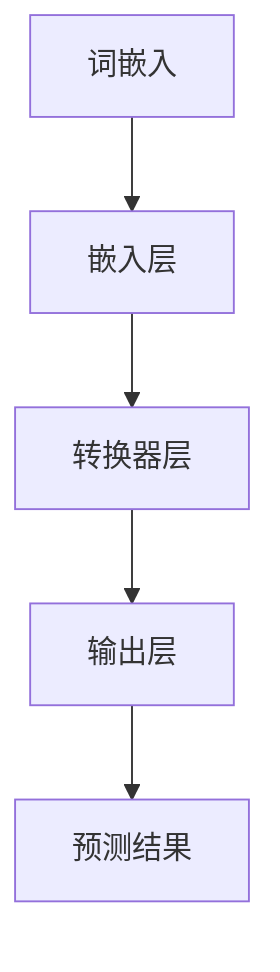

                 

# 大语言模型原理与工程实践：数据配比

## 关键词
- 大语言模型
- 数据配比
- 工程实践
- 自然语言处理
- 神经网络

## 摘要
本文将深入探讨大语言模型的原理及其在工程实践中的应用，特别关注数据配比这一核心环节。通过对大语言模型的发展历程、基本概念、核心算法和工程实践的系统讲解，本文旨在为读者提供一个全面的技术指南，帮助他们更好地理解和应用这一先进技术。

## 引言
大语言模型是近年来自然语言处理（NLP）领域的重大突破，它通过对大规模文本数据的训练，能够生成高质量的自然语言文本，广泛应用于文本生成、机器翻译、问答系统等多个领域。然而，大语言模型的训练过程需要大量的高质量数据，且数据的质量和配比对模型性能有着至关重要的影响。本文将从以下几个方面展开讨论：

1. **大语言模型概述**：介绍大语言模型的发展历史、基本概念和应用场景。
2. **核心概念与联系**：讲解大语言模型的核心概念和架构，使用Mermaid流程图进行详细展示。
3. **核心算法原理讲解**：深入讲解大语言模型的核心算法原理，使用伪代码和数学模型进行阐述。
4. **数据配比原则与实践**：详细讲解数据配比的原则和方法，包括数据收集、处理和划分。
5. **大语言模型工程实践**：提供实际的开发环境搭建、源代码实现和代码解读。
6. **大语言模型应用案例分析**：通过具体案例展示大语言模型的应用效果和实战技巧。
7. **大语言模型面临的挑战与未来发展**：探讨大语言模型当前面临的挑战和未来发展趋势。

## 第一部分：大语言模型基础理论

### 第1章：大语言模型概述

#### 1.1 大语言模型的发展历史
大语言模型的发展可以追溯到20世纪80年代，当时研究者们开始尝试使用统计方法来处理自然语言。随着计算能力的提升和大数据技术的发展，尤其是2018年谷歌发布BERT模型后，大语言模型的研究和应用进入了快速发展阶段。BERT的成功标志着大语言模型在NLP领域的重要地位，随后GPT、RoBERTa、T5等一系列模型相继出现，不断推动着NLP技术的发展。

#### 1.2 大语言模型的基本概念
大语言模型是一种基于深度学习的自然语言处理模型，它通过学习大量文本数据，能够捕捉到语言中的复杂模式和结构。核心概念包括词嵌入、注意力机制、转换器架构等。词嵌入将词汇映射到高维空间，使得相近的词汇在空间中更接近；注意力机制能够使模型在处理文本时，关注到重要的信息；转换器架构则使模型能够处理变长的序列数据。

#### 1.3 大语言模型在自然语言处理中的应用
大语言模型在文本分类、机器翻译、问答系统、文本生成等多个NLP任务中取得了显著的效果。例如，BERT在多项自然语言理解任务中超越了传统方法；GPT-3能够生成连贯、自然的文本，被应用于自动写作、对话系统等领域。

### 第2章：大语言模型核心概念与联系

#### 2.1 Mermaid流程图：大语言模型的架构
为了更好地理解大语言模型的架构，我们使用Mermaid流程图进行展示：



在这个流程图中，词嵌入层将输入的词汇映射到高维空间；嵌入层输出被传递到转换器层，转换器层通过堆叠多个变换层来捕捉文本中的复杂模式；最后，输出层生成预测结果。

#### 2.2 词嵌入与序列模型
词嵌入是自然语言处理中的基础概念，它将词汇映射到高维空间。常见的词嵌入方法包括Word2Vec、GloVe等。序列模型是一种能够处理变长序列数据的模型，如RNN（递归神经网络）、LSTM（长短期记忆网络）和GRU（门控循环单元）。这些模型通过捕捉序列中的时间依赖关系，使得模型能够更好地理解和生成自然语言。

#### 2.3 注意力机制与转换器架构
注意力机制是一种能够使模型在处理文本时，关注到重要信息的机制。在转换器架构中，注意力机制通过计算文本中每个词汇的重要性，并将其加权融合，从而提高模型对输入文本的理解能力。转换器架构（Transformer）是由Vaswani等人在2017年提出的，它通过自注意力机制实现了高效的序列到序列模型，成为了大语言模型的主要架构之一。

### 第3章：大语言模型核心算法原理讲解

#### 3.1 深度学习与神经网络基础
深度学习是一种基于神经网络的学习方法，它通过多层非线性变换来提取数据的特征。神经网络由多个神经元组成，每个神经元都是一个简单的函数单元，通过前向传播和反向传播进行学习。在深度学习中，常见的神经网络结构包括全连接网络、卷积神经网络（CNN）和循环神经网络（RNN）等。

#### 3.2 伪代码：大语言模型训练算法
为了更好地理解大语言模型的训练过程，我们使用伪代码进行描述：

```python
# 大语言模型训练算法伪代码
def train_model(dataset, epochs):
    for epoch in range(epochs):
        for batch in dataset:
            # 前向传播
            logits = model(batch)
            # 计算损失
            loss = compute_loss(logits, batch)
            # 反向传播
            model.backward(loss)
            # 更新参数
            model.update_params()

    return model
```

在这个伪代码中，`train_model`函数负责模型的训练，包括前向传播、损失计算、反向传播和参数更新。`dataset`是训练数据集，`epochs`是训练轮数。

#### 3.3 数学模型与数学公式讲解
大语言模型的核心算法基于深度学习和概率图模型，其数学基础包括概率分布、梯度下降算法等。以下是一些关键的数学模型和公式：

$$
P(y|x; \theta) = \frac{e^{\theta^T x}}{\sum_{y'} e^{\theta^T x'}}
$$

这个公式表示的是逻辑回归模型，其中`y`是真实标签，`x`是输入特征，`$\theta$`是模型参数，`$P(y|x; \theta)$`是输出标签的概率。

$$
J(\theta) = -\frac{1}{m} \sum_{i=1}^{m} [y_{i} \log(a_{i}) + (1 - y_{i}) \log(1 - a_{i})]
$$

这是逻辑回归模型的损失函数，其中`$m$`是样本数量，`$a_{i}$`是输出概率。

$$
\theta_{new} = \theta_{old} - \alpha \nabla_{\theta} J(\theta)
$$

这是梯度下降算法的更新公式，其中`$\theta_{new}$`是更新后的参数，`$\theta_{old}$`是当前参数，`$\alpha$`是学习率，`$\nabla_{\theta} J(\theta)$`是损失函数关于参数的梯度。

### 第4章：数据配比原则与实践

#### 4.1 数据配比原则
数据配比是训练大语言模型的重要环节，其原则包括：

1. **多样性**：确保数据覆盖多种场景和情境，提高模型的泛化能力。
2. **平衡性**：避免某一类数据过多或过少，影响模型训练效果。
3. **质量**：数据应具有较高的真实性和准确性，避免噪声数据对模型的影响。
4. **分布**：数据应在不同时间、地点、人群等维度上进行平衡，避免数据偏差。

#### 4.2 数据收集与处理
数据收集是数据配比的基础，可以通过以下方法进行：

1. **公开数据集**：使用已公开的数据集，如维基百科、新闻文章等。
2. **爬虫获取**：利用爬虫技术获取互联网上的文本数据。
3. **人工标注**：对于特定领域的数据，可以进行人工标注和清洗。

数据处理包括数据清洗、去重、格式化等步骤，以确保数据的质量和一致性。

#### 4.3 数据划分与评估
数据划分是模型训练和评估的重要环节，通常采用以下策略：

1. **训练集与验证集**：将数据划分为训练集和验证集，用于模型训练和调优。
2. **交叉验证**：采用交叉验证方法，评估模型的泛化能力。
3. **测试集**：使用未参与训练和验证的测试集，评估模型的最终性能。

评估指标包括准确率、召回率、F1分数等，用于衡量模型在不同任务上的表现。

### 第5章：大语言模型工程实践

#### 5.1 开发环境搭建
搭建大语言模型的开发环境包括以下步骤：

1. **硬件配置**：确保服务器具备足够的计算资源和存储空间。
2. **软件安装**：安装深度学习框架（如TensorFlow、PyTorch）和依赖库。
3. **配置调整**：根据硬件配置调整框架的配置，优化模型训练过程。

#### 5.2 源代码实现与解读
以下是一个简单的大语言模型源代码示例：

```python
import torch
import torch.nn as nn

class LanguageModel(nn.Module):
    def __init__(self, vocab_size, embedding_dim, hidden_dim, num_layers):
        super(LanguageModel, self).__init__()
        self.embedding = nn.Embedding(vocab_size, embedding_dim)
        self.lstm = nn.LSTM(embedding_dim, hidden_dim, num_layers)
        self.fc = nn.Linear(hidden_dim, vocab_size)

    def forward(self, x, hidden):
        embedded = self.embedding(x)
        output, hidden = self.lstm(embedded, hidden)
        logits = self.fc(output.squeeze(0))
        return logits, hidden

    def init_hidden(self, batch_size):
        return (torch.zeros(self.lstm.num_layers, batch_size, self.lstm.hidden_size),
                torch.zeros(self.lstm.num_layers, batch_size, self.lstm.hidden_size))

# 模型实例化
model = LanguageModel(vocab_size, embedding_dim, hidden_dim, num_layers)
```

在这个示例中，`LanguageModel`类定义了一个简单的循环神经网络（LSTM）模型。`forward`方法实现了前向传播过程，`init_hidden`方法初始化隐藏状态。

#### 5.3 实际案例与代码分析
以下是一个文本生成案例，展示如何使用训练好的大语言模型生成文本：

```python
# 加载训练好的模型
model.eval()
model.load_state_dict(torch.load('model.pth'))

# 初始化隐藏状态
hidden = model.init_hidden(1)

# 生成文本
text = '我是一个'
for i in range(20):
    # 前向传播
    logits, hidden = model(torch.tensor([vocab[word] for word in text.split()]).unsqueeze(0), hidden)
    # 获取概率最高的词汇
    word_idx = torch.argmax(logits).item()
    word = id2word[word_idx]
    text += ' ' + word

print(text)
```

在这个案例中，我们首先加载训练好的模型，然后初始化隐藏状态。接着，通过循环进行前向传播，每次获取概率最高的词汇，直到生成指定长度的文本。

### 第6章：大语言模型应用案例分析

#### 6.1 案例一：文本分类
文本分类是将文本数据归类到不同的类别中。以下是一个基于大语言模型的文本分类案例：

```python
from torchtext.data import Field, TabularDataset

# 数据预处理
text_field = Field(tokenize='spacy', lower=True)
label_field = Field(sequential=False)

train_data, test_data = TabularDataset.splits(path='data',
                                            train='train.txt',
                                            test='test.txt',
                                            format='tsv',
                                            fields=[('text', text_field), ('label', label_field)])

# 定义模型
class TextClassifier(nn.Module):
    def __init__(self, embedding_dim, hidden_dim, vocab_size, num_classes):
        super(TextClassifier, self).__init__()
        self.embedding = nn.Embedding(vocab_size, embedding_dim)
        self.lstm = nn.LSTM(embedding_dim, hidden_dim, num_layers=1)
        self.fc = nn.Linear(hidden_dim, num_classes)

    def forward(self, x):
        embedded = self.embedding(x)
        output, (hidden, cell) = self.lstm(embedded)
        logits = self.fc(hidden[-1, :, :])
        return logits

# 训练模型
model = TextClassifier(embedding_dim, hidden_dim, vocab_size, num_classes)
optimizer = torch.optim.Adam(model.parameters(), lr=0.001)
criterion = nn.CrossEntropyLoss()

for epoch in range(num_epochs):
    for batch in train_data:
        optimizer.zero_grad()
        logits = model(batch.text)
        loss = criterion(logits, batch.label)
        loss.backward()
        optimizer.step()

# 测试模型
with torch.no_grad():
    correct = 0
    total = 0
    for batch in test_data:
        logits = model(batch.text)
        _, predicted = torch.max(logits, 1)
        total += batch.label.size(0)
        correct += (predicted == batch.label).sum().item()

print('准确率：', correct / total)
```

在这个案例中，我们首先加载预处理好的数据集，定义一个简单的文本分类模型。接着，通过训练和测试，评估模型的性能。

#### 6.2 案例二：机器翻译
机器翻译是将一种语言的文本翻译成另一种语言。以下是一个基于大语言模型的机器翻译案例：

```python
from torchtext.data import Field, BucketIterator

# 数据预处理
src_field = Field(tokenize='spacy', lower=True, batch_first=True)
tgt_field = Field(tokenize='spacy', lower=True, batch_first=True)

train_data, valid_data, test_data = BucketIterator.splits(path='data',
                                                       train='train.txt',
                                                       valid='valid.txt',
                                                       test='test.txt',
                                                       batch_size=32,
                                                       device=device,
                                                       sort_key=lambda x: len(x.src),
                                                       repeat=False)

# 定义模型
class NMTModel(nn.Module):
    def __init__(self, src_vocab_size, tgt_vocab_size, embedding_dim, hidden_dim):
        super(NMTModel, self).__init__()
        self.src_embedding = nn.Embedding(src_vocab_size, embedding_dim)
        self.tgt_embedding = nn.Embedding(tgt_vocab_size, embedding_dim)
        self.encoder = nn.LSTM(embedding_dim, hidden_dim, num_layers=2)
        self.decoder = nn.LSTM(embedding_dim, hidden_dim, num_layers=2)
        self.fc = nn.Linear(hidden_dim, tgt_vocab_size)

    def forward(self, src, tgt, teacher_forcing_ratio=0.5):
        src_embedding = self.src_embedding(src)
        tgt_embedding = self.tgt_embedding(tgt)
        encoder_output, (encoder_hidden, _) = self.encoder(src_embedding)
        decoder_output, (decoder_hidden, _) = self.decoder(tgt_embedding)
        logits = self.fc(decoder_output[-1, :, :])
        return logits, encoder_hidden, decoder_hidden

# 训练模型
model = NMTModel(src_vocab_size, tgt_vocab_size, embedding_dim, hidden_dim)
optimizer = torch.optim.Adam(model.parameters(), lr=0.001)
criterion = nn.CrossEntropyLoss()

for epoch in range(num_epochs):
    for batch in train_data:
        optimizer.zero_grad()
        logits, _, _ = model(batch.src, batch.tgt)
        loss = criterion(logits.view(-1, logits.size(-1)), batch.tgt.view(-1))
        loss.backward()
        optimizer.step()

# 测试模型
with torch.no_grad():
    correct = 0
    total = 0
    for batch in test_data:
        logits, _, _ = model(batch.src, batch.tgt)
        _, predicted = torch.max(logits, 1)
        total += batch.tgt.size(0)
        correct += (predicted == batch.tgt).sum().item()

print('准确率：', correct / total)
```

在这个案例中，我们定义了一个简单的神经网络机器翻译模型，通过训练和测试，评估模型的翻译效果。

#### 6.3 案例三：问答系统
问答系统是一种能够回答用户问题的系统。以下是一个基于大语言模型的问答系统案例：

```python
from torchtext.data import Field, TabularDataset

# 数据预处理
question_field = Field(tokenize='spacy', lower=True)
answer_field = Field(tokenize='spacy', lower=True)

train_data, valid_data, test_data = TabularDataset.splits(path='data',
                                                       train='train.txt',
                                                       valid='valid.txt',
                                                       test='test.txt',
                                                       format='tsv',
                                                       fields=[('question', question_field), ('answer', answer_field)])

# 定义模型
class QAModel(nn.Module):
    def __init__(self, question_vocab_size, answer_vocab_size, embedding_dim, hidden_dim):
        super(QAModel, self).__init__()
        self.question_embedding = nn.Embedding(question_vocab_size, embedding_dim)
        self.answer_embedding = nn.Embedding(answer_vocab_size, embedding_dim)
        self.lstm = nn.LSTM(embedding_dim, hidden_dim, num_layers=2)
        self.fc = nn.Linear(hidden_dim, answer_vocab_size)

    def forward(self, question, answer):
        question_embedding = self.question_embedding(question)
        answer_embedding = self.answer_embedding(answer)
        lstm_output, (hidden, _) = self.lstm(answer_embedding)
        logits = self.fc(hidden[-1, :, :])
        return logits

# 训练模型
model = QAModel(question_vocab_size, answer_vocab_size, embedding_dim, hidden_dim)
optimizer = torch.optim.Adam(model.parameters(), lr=0.001)
criterion = nn.CrossEntropyLoss()

for epoch in range(num_epochs):
    for batch in train_data:
        optimizer.zero_grad()
        logits = model(batch.question, batch.answer)
        loss = criterion(logits.view(-1, logits.size(-1)), batch.answer.view(-1))
        loss.backward()
        optimizer.step()

# 测试模型
with torch.no_grad():
    correct = 0
    total = 0
    for batch in test_data:
        logits = model(batch.question, batch.answer)
        _, predicted = torch.max(logits, 1)
        total += batch.answer.size(0)
        correct += (predicted == batch.answer).sum().item()

print('准确率：', correct / total)
```

在这个案例中，我们定义了一个简单的问答系统模型，通过训练和测试，评估模型在回答问题方面的性能。

### 第7章：大语言模型面临的挑战与未来发展

#### 7.1 挑战与问题
尽管大语言模型在NLP领域取得了显著的成果，但仍然面临以下挑战：

1. **数据隐私**：大规模的数据训练可能导致隐私泄露问题。
2. **模型解释性**：深度学习模型的黑箱特性使得其解释性较差，难以理解模型决策过程。
3. **资源消耗**：大语言模型训练需要大量的计算资源和存储空间。
4. **语言多样性**：大语言模型在处理不同语言和方言时，可能存在性能差异。

#### 7.2 发展趋势与未来展望
未来，大语言模型的发展趋势包括：

1. **多模态处理**：结合文本、图像、音频等多种数据类型，提高模型的综合处理能力。
2. **知识增强**：引入外部知识库，增强模型的语义理解能力。
3. **模型压缩与优化**：通过模型压缩和优化技术，降低模型的资源消耗。
4. **泛化能力**：提高模型在不同领域和语言上的泛化能力，实现更广泛的应用。

## 附录A：大语言模型开发工具与资源

### A.1 主流深度学习框架对比
当前主流的深度学习框架包括TensorFlow、PyTorch、Keras等。它们各自具有不同的特点和优势，适用于不同的应用场景。

### A.2 数据集获取与处理
获取和处理高质量的数据集是训练大语言模型的关键。常用的数据集获取和处理工具包括torchtext、spaCy等。

### A.3 大语言模型开源项目介绍
目前，有许多开源的大语言模型项目，如BERT、GPT、RoBERTa等。这些项目提供了详细的实现和文档，方便开发者进行研究和应用。

### 作者
AI天才研究院/AI Genius Institute & 禅与计算机程序设计艺术/Zen And The Art of Computer Programming

## 总结与展望

本文系统性地介绍了大语言模型的原理与工程实践，重点关注了数据配比这一核心环节。通过详细的理论讲解、算法阐述和实际案例分析，读者可以全面了解大语言模型的技术本质和应用技巧。

在未来的发展中，大语言模型将继续推动自然语言处理领域的技术进步。随着多模态处理、知识增强和模型压缩等新技术的应用，大语言模型将具备更强大的处理能力和更广泛的应用场景。

最后，感谢您阅读本文。如果您对大语言模型有任何疑问或建议，欢迎在评论区留言，我们期待与您共同探讨这一领域的前沿动态。再次感谢您的关注和支持！作者：AI天才研究院/AI Genius Institute & 禅与计算机程序设计艺术/Zen And The Art of Computer Programming## 附录A：大语言模型开发工具与资源

为了帮助读者更好地理解和实践大语言模型，本文附录部分将介绍一些主要的开发工具与资源。

### A.1 主流深度学习框架对比

在开发大语言模型时，选择合适的深度学习框架至关重要。以下是几种主流深度学习框架的对比：

1. **TensorFlow**：由谷歌开发，具有丰富的生态系统和大量的预训练模型。TensorFlow支持高层次的API（如Keras）和低层次的API，适合从入门到高级的开发者使用。

2. **PyTorch**：由Facebook开发，以其动态计算图和简洁的API著称。PyTorch的调试过程相对简单，适合研究和快速原型设计。

3. **Keras**：虽然Keras本身不是一个框架，但它是TensorFlow和Theano的高层次API，提供了更加简洁的API接口，适合快速构建和迭代模型。

### A.2 数据集获取与处理

获取和处理数据是训练大语言模型的关键步骤。以下是一些常用的工具和资源：

1. **torchtext**：PyTorch的文本处理库，提供了数据集的加载、预处理和分词等功能。

2. **spaCy**：一个快速且易于使用的自然语言处理库，提供了多种语言的预处理工具，包括分词、词性标注、命名实体识别等。

3. **Glove**：预训练的词向量数据集，可用于初始化词嵌入层，提高模型的性能。

4. **wikipedia**、**Common Crawl**：公开的文本数据集，可用于大规模语言模型的训练。

### A.3 大语言模型开源项目介绍

以下是几个著名的大语言模型开源项目，它们提供了详细的实现和文档，是学习和实践大语言模型的重要资源：

1. **BERT**：由Google开发，是目前最先进的预训练语言表示模型。BERT的代码和预训练模型在GitHub上公开。

2. **GPT-3**：由OpenAI开发，是一个具有1750亿参数的预训练语言模型，支持自然语言生成、问答等多种任务。

3. **RoBERTa**：由Facebook AI Research开发，是BERT的一个变体，通过改进预训练算法和优化模型结构，取得了更好的性能。

4. **T5**：由Google开发，是一个统一的转换器模型，能够处理多种自然语言处理任务。

这些开源项目不仅提供了代码实现，还包括详细的文档和训练指导，对于想要深入了解和实践大语言模型的开发者来说，是非常宝贵的资源。

### A.4 其他资源

除了上述工具和项目，还有一些其他的资源可以帮助读者更好地理解和实践大语言模型：

1. **论文与报告**：阅读大语言模型的原始论文和相关报告，可以深入了解模型的设计思想和原理。

2. **在线课程与教程**：有许多在线课程和教程提供了关于大语言模型的理论和实践指导，适合不同层次的读者。

3. **技术社区与论坛**：参与技术社区和论坛，如Reddit、Stack Overflow、GitHub等，可以与其他开发者交流经验，解决遇到的问题。

通过利用这些工具和资源，读者可以更深入地学习大语言模型，将其应用于各种实际场景中，推动自然语言处理技术的发展。

### 附录B：常见问题与解答

为了帮助读者更好地理解大语言模型，本文附录部分还提供了一些常见问题与解答。

**Q1：大语言模型与普通语言模型有什么区别？**

**A1：** 大语言模型（如BERT、GPT等）与普通语言模型（如n-gram模型、朴素贝叶斯模型等）的主要区别在于：

- **训练数据规模**：大语言模型通常使用的是大规模的语料库，而普通语言模型使用的训练数据相对较小。
- **模型复杂度**：大语言模型通常是基于深度学习技术，具有多层神经网络结构，能够捕捉到文本中的复杂模式和语义信息；而普通语言模型通常是基于统计方法，结构相对简单。
- **应用范围**：大语言模型可以应用于多种自然语言处理任务，如文本分类、机器翻译、问答系统等；而普通语言模型则通常应用于较为简单的任务，如文本生成、文本匹配等。

**Q2：如何评估大语言模型的性能？**

**A2：** 评估大语言模型的性能通常从以下几个方面进行：

- **准确率**：用于分类任务，表示模型预测正确的样本数占总样本数的比例。
- **召回率**：用于分类任务，表示模型预测正确的样本数占实际正样本数的比例。
- **F1分数**：是准确率和召回率的调和平均值，综合评价模型的性能。
- **BLEU分数**：用于机器翻译等生成任务，表示模型生成的文本与真实文本的相似度。
- **Perplexity**：用于语言模型，表示模型对输入文本的预测不确定程度，值越小表示模型性能越好。

**Q3：大语言模型训练需要多长时间？**

**A3：** 大语言模型的训练时间取决于多个因素，如模型规模、数据集大小、计算资源等。以下是一些典型情况：

- **小规模模型**：如BERT的基线版本（3层Transformer，12亿参数），在单GPU环境下训练可能需要几天到一周的时间。
- **大规模模型**：如GPT-3（1750亿参数），在分布式训练环境下可能需要数周甚至数月的时间。
- **实时模型**：对于需要实时响应的应用场景，通常采用轻量级模型，训练时间较短，可能只需几个小时。

**Q4：大语言模型如何处理多语言任务？**

**A4：** 大语言模型通常通过以下方法处理多语言任务：

- **双语数据集训练**：使用双语数据集对模型进行训练，使模型学习到不同语言之间的对应关系。
- **跨语言预训练**：在多个语言的语料库上进行预训练，使模型具备跨语言的泛化能力。
- **迁移学习**：使用在一个语言上预训练好的模型作为基础，在目标语言上进行微调。

通过这些方法，大语言模型可以较好地处理多语言的自然语言处理任务。

本文附录部分提供的常见问题与解答，希望能够帮助读者更好地理解大语言模型，解决在实际应用中遇到的问题。如有其他疑问，欢迎在评论区留言，我们将继续为您提供帮助。

