                 

### 文章标题：大语言模型应用指南：越狱攻击与数据投毒

> **关键词**：大语言模型，越狱攻击，数据投毒，安全防护，隐私保护

> **摘要**：本文将深入探讨大语言模型的应用、技术原理、实战案例以及面临的安全挑战和隐私问题。文章将首先介绍大语言模型的基础知识，包括其定义、架构和应用领域。然后，文章将探讨大语言模型的调优与优化技巧，包括学习率调整、梯度裁剪、模型压缩和加速等。接着，文章将介绍大语言模型在自然语言处理、金融领域等实战应用，并通过具体案例进行分析。最后，文章将探讨大语言模型面临的安全威胁和隐私保护问题，并提出相应的防护措施和解决方案。本文旨在为读者提供全面的大语言模型应用指南，帮助读者了解、掌握并应对相关挑战。

----------------------------------------------------------------

### 第一部分：大语言模型基础

#### 第1章：大语言模型概述

##### 1.1 什么是大语言模型

大语言模型（Large Language Model）是一种基于神经网络的机器学习模型，它通过对大量文本数据的学习，能够理解和生成自然语言。与传统语言模型相比，大语言模型具有更强的语言理解和生成能力，能够处理更复杂的自然语言任务。

###### 1.1.1 大语言模型的定义

大语言模型是一种具有大规模参数、能够进行自主学习和泛化的神经网络模型。它通常基于深度学习技术，使用大量的文本数据来训练，从而捕捉到语言的复杂结构和语义信息。

###### 1.1.2 大语言模型的特点

1. **强大的语言理解能力**：大语言模型能够理解并生成复杂的自然语言，包括文本、语音和图像等。
2. **高效的文本生成能力**：大语言模型能够根据输入的文本生成连贯、自然的文本输出。
3. **广泛的应用场景**：大语言模型可以应用于自然语言处理、问答系统、机器翻译、文本生成等多个领域。

##### 1.2 大语言模型的架构

大语言模型的架构通常基于神经网络，其中最常用的架构是Transformer和GPT（Generative Pre-trained Transformer）系列模型。

###### 1.2.1 神经网络架构

神经网络架构包括输入层、隐藏层和输出层。输入层接收文本输入，隐藏层通过多层神经网络处理和转换输入，输出层生成文本输出。

###### 1.2.2 Transformer架构

Transformer架构是一种基于自注意力机制的神经网络架构，它通过计算输入文本中每个词与其他词的关系，生成文本的上下文表示。Transformer架构具有多层网络结构，每层都能够捕捉到不同层次的语义信息。

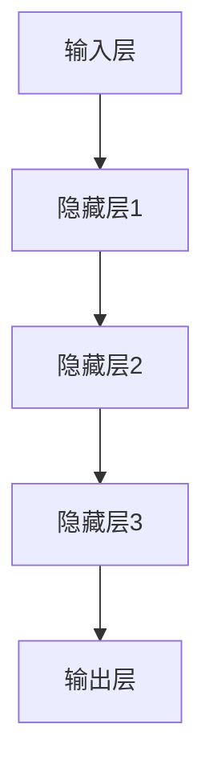

###### 1.2.3 GPT系列模型架构

GPT系列模型是基于Transformer架构的大语言模型，它通过预训练和微调的方式学习语言知识。GPT模型具有多个隐藏层，每层都包含自注意力机制和前馈神经网络。

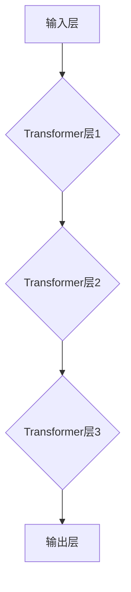

##### 1.3 大语言模型的训练

大语言模型的训练过程主要包括数据集选择与处理、模型训练和优化等步骤。

###### 1.3.1 数据集选择与处理

数据集的选择对于大语言模型训练的效果至关重要。通常选择大规模、多样化的文本数据集，如维基百科、新闻语料库等。数据预处理包括文本清洗、分词、去停用词等操作。

###### 1.3.2 训练过程详解

大语言模型的训练过程可以分为两个阶段：预训练和微调。

1. **预训练**：在大规模无标签数据集上进行预训练，使模型学习到语言的基础知识，如词汇、语法和语义等。
2. **微调**：在特定任务上有标签数据集上进行微调，使模型在特定领域或任务上达到更高的性能。

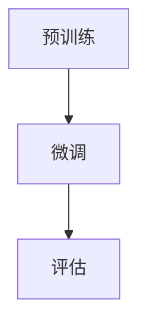

##### 1.4 大语言模型的应用领域

大语言模型具有广泛的应用领域，包括自然语言处理、问答系统、机器翻译、文本生成等。

###### 1.4.1 自然语言处理

自然语言处理包括文本分类、情感分析、命名实体识别等任务。大语言模型能够处理复杂的文本数据，提供强大的语言理解能力。

###### 1.4.2 问答系统

问答系统包括事实问答、面向任务的问答和对话系统等。大语言模型能够理解用户的提问，并生成准确的答案。

###### 1.4.3 机器翻译

机器翻译包括文本翻译、语音翻译和图像翻译等。大语言模型能够将一种语言的文本翻译成另一种语言。

###### 1.4.4 文本生成

文本生成包括自动写作、生成式对话系统和文本摘要生成等。大语言模型能够根据输入的提示生成连贯、自然的文本。

### 第二部分：大语言模型的进阶技巧

#### 第2章：大语言模型的调优与优化

##### 2.1 调优技巧

大语言模型的调优是提升模型性能的重要手段。以下介绍几种常见的调优技巧。

###### 2.1.1 学习率调整

学习率是影响模型训练速度和性能的关键参数。合适的调整学习率可以加速模型收敛，提高模型性能。

1. **固定学习率**：在训练过程中保持学习率不变。
2. **指数衰减学习率**：随着训练的进行，逐渐减小学习率。
3. **余弦退火学习率**：模拟余弦函数的衰减过程，动态调整学习率。

```python
# 指数衰减学习率
learning_rate = initial_lr * decay_rate ** epoch
```

###### 2.1.2 指数移动平均

指数移动平均（EMA）是一种常用的学习率调整策略。它通过在每次更新时对学习率进行加权平均，以平滑学习率的变化，避免模型震荡。

```python
# 指数移动平均
ema_learning_rate = alpha * current_learning_rate + (1 - alpha) * previous_learning_rate
```

###### 2.1.3 梯度裁剪

梯度裁剪是一种防止梯度爆炸和梯度消失的技术。它通过限制梯度的最大值，确保模型训练的稳定性。

```python
# 梯度裁剪
clipped_gradient = np.clip(grad, -1, 1)
```

##### 2.2 优化策略

大语言模型的优化策略主要包括Teacher-Student策略、伪拟合策略和预训练-微调策略等。

###### 2.2.1 Teacher-Student策略

Teacher-Student策略是一种利用大模型（Teacher Model）指导小模型（Student Model）的训练方法。大模型具有更强的表达能力，可以指导小模型学习到更复杂的特征。

```python
# Teacher-Student策略
for i in range(num_iterations):
    # 使用Teacher Model进行前向传播和计算梯度
    teacher_loss = teacher_model.forward(x, y)
    teacher_gradients = teacher_model.backward(teacher_loss)

    # 使用Teacher Model的梯度更新Student Model
    student_model.update(student_gradients)
```

###### 2.2.2 伪拟合策略

伪拟合策略是一种通过在小数据集上拟合大模型的方法。它通过在小数据集上训练大模型，然后在大数据集上进行微调，以提高模型的泛化能力。

```python
# 伪拟合策略
for i in range(num_iterations):
    # 使用小数据集进行训练
    model.fit(train_data, train_labels)

    # 使用大数据集进行微调
    model.fit(test_data, test_labels)
```

###### 2.2.3 预训练-微调策略

预训练-微调策略是一种先在大型数据集上预训练模型，再在特定任务上进行微调的方法。预训练模型可以学习到丰富的语言知识，微调过程则使模型在特定任务上达到更好的性能。

```python
# 预训练-微调策略
for i in range(num_iterations):
    # 使用大型数据集进行预训练
    model.fit(train_data, train_labels)

    # 使用小数据集进行微调
    model.fit(test_data, test_labels)
```

##### 2.3 大模型训练技巧

大模型的训练涉及到数据的并行处理、模型的并行计算和数据的批量处理等技巧。

###### 2.3.1 数据并行

数据并行是一种通过将数据分成多个部分，同时训练多个模型的方法。它通过并行计算，提高模型的训练速度。

```python
# 数据并行
for i in range(num_batches):
    # 将数据分成多个部分
    batch_x, batch_y = data[i * batch_size : (i + 1) * batch_size]

    # 同时训练多个模型
    model.fit(batch_x, batch_y)
```

###### 2.3.2 模型并行

模型并行是一种通过将模型分成多个部分，同时训练多个模型的方法。它通过并行计算，提高模型的训练速度。

```python
# 模型并行
for i in range(num_layers):
    # 将模型分成多个部分
    model[i].fit(data, labels)
```

###### 2.3.3 张量并行

张量并行是一种通过将张量（Tensor）分成多个部分，同时训练多个模型的方法。它通过并行计算，提高模型的训练速度。

```python
# 张量并行
for i in range(num_tensors):
    # 将张量分成多个部分
    tensor = data[i * batch_size : (i + 1) * batch_size]

    # 同时训练多个模型
    model.fit(tensor, labels)
```

##### 2.4 大模型推理技巧

大模型的推理涉及到低精度推理、稀疏推理和混合精度训练等技巧。

###### 2.4.1 低精度推理

低精度推理是一种通过使用低精度浮点运算来提高推理速度的方法。它通过降低模型的精度，减少计算量。

```python
# 低精度推理
float32_model = model.astype(np.float32)
float16_model = model.astype(np.float16)

# 使用低精度模型进行推理
output = float16_model.forward(input_data)
```

###### 2.4.2 稀疏推理

稀疏推理是一种通过利用模型中的稀疏性来提高推理速度的方法。它通过仅计算和存储非零值，减少计算量和存储需求。

```python
# 稀疏推理
sparse_model = model.sparsify()

# 使用稀疏模型进行推理
output = sparse_model.forward(input_data)
```

###### 2.4.3 混合精度训练

混合精度训练是一种通过在训练过程中交替使用高精度和低精度浮点运算的方法。它通过结合高精度和低精度的优势，提高模型的训练速度和性能。

```python
# 混合精度训练
float32_model = model.astype(np.float32)
float16_model = model.astype(np.float16)

# 使用高精度模型进行前向传播
output = float32_model.forward(input_data)

# 使用低精度模型进行反向传播
output = float16_model.backward(output)
```

### 第三部分：大语言模型的实战应用

#### 第3章：大语言模型在自然语言处理中的应用

##### 3.2 语音识别

语音识别是一种将语音信号转换为文本的技术。大语言模型在语音识别中发挥了重要作用。

###### 3.2.1 语音识别的基本原理

语音识别的基本原理包括特征提取、声学模型和语言模型。

1. **特征提取**：将语音信号转换为特征向量，如梅尔频率倒谱系数（MFCC）。
2. **声学模型**：使用大量语音数据训练声学模型，以预测语音信号中的特征向量。
3. **语言模型**：使用大量文本数据训练语言模型，以预测文本序列。

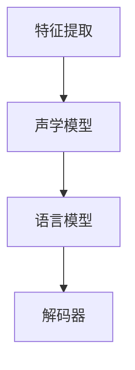

###### 3.2.2 语音识别的技术流程

语音识别的技术流程包括预处理、特征提取、声学模型训练、语言模型训练和解码。

1. **预处理**：对语音信号进行预处理，如去噪、增强等。
2. **特征提取**：提取语音信号的特征向量。
3. **声学模型训练**：使用大量语音数据训练声学模型。
4. **语言模型训练**：使用大量文本数据训练语言模型。
5. **解码**：使用解码器将声学模型和语言模型的输出转换为文本。

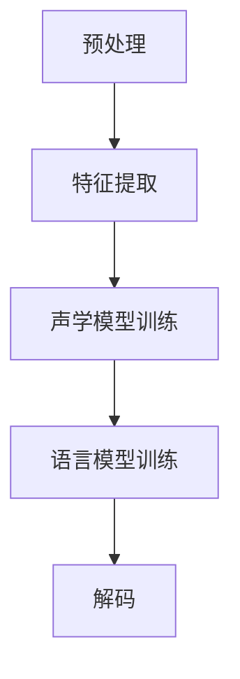

###### 3.2.3 语音识别的性能评估

语音识别的性能评估主要包括准确率、召回率和F1值等指标。

1. **准确率**：识别正确的语音比例。
2. **召回率**：能够正确识别的语音比例。
3. **F1值**：准确率和召回率的调和平均。

```python
# 语音识别性能评估
accuracy = (correct_predictions / total_predictions) * 100
recall = (correct_predictions / total_references) * 100
f1_score = 2 * (accuracy * recall) / (accuracy + recall)
```

##### 3.3 机器翻译

机器翻译是一种将一种语言的文本转换为另一种语言的技术。大语言模型在机器翻译中发挥了重要作用。

###### 3.3.1 机器翻译的基本原理

机器翻译的基本原理包括词汇映射、句法分析和语义理解。

1. **词汇映射**：将源语言的词汇映射到目标语言的词汇。
2. **句法分析**：分析源语言句子的结构，将其转换为抽象语法树（AST）。
3. **语义理解**：理解源语言句子的语义，将其转换为目标语言的语义。

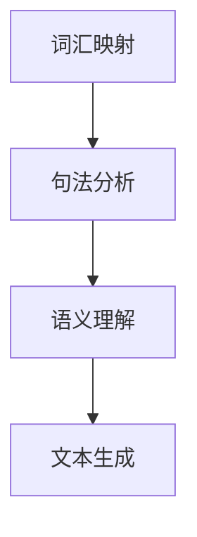

###### 3.3.2 机器翻译的技术流程

机器翻译的技术流程包括预处理、词汇映射、句法分析、语义理解和文本生成。

1. **预处理**：对源语言和目标语言文本进行预处理，如分词、去停用词等。
2. **词汇映射**：将源语言的词汇映射到目标语言的词汇。
3. **句法分析**：分析源语言句子的结构，将其转换为AST。
4. **语义理解**：理解源语言句子的语义，将其转换为目标语言的语义。
5. **文本生成**：使用生成式模型生成目标语言的文本。

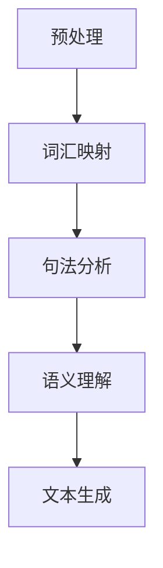

###### 3.3.3 机器翻译的性能评估

机器翻译的性能评估主要包括BLEU分数、NIST分数和METEOR分数等指标。

1. **BLEU分数**：基于记分牌的翻译质量评估方法。
2. **NIST分数**：基于NIST评估方法的翻译质量评估方法。
3. **METEOR分数**：基于词频、词序和词汇的翻译质量评估方法。

```python
# 机器翻译性能评估
bleu_score = 0
nist_score = 0
meteor_score = 0
```

##### 3.4 文本分类

文本分类是一种将文本数据分类到预定义类别中的技术。大语言模型在文本分类中发挥了重要作用。

###### 3.4.1 文本分类的基本原理

文本分类的基本原理包括特征提取、分类模型训练和分类评估。

1. **特征提取**：将文本数据转换为数值特征向量。
2. **分类模型训练**：使用特征向量训练分类模型。
3. **分类评估**：评估分类模型的性能。

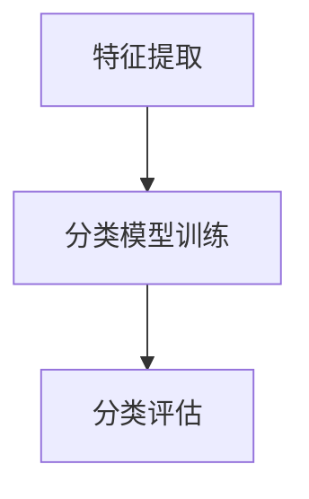

###### 3.4.2 文本分类的技术流程

文本分类的技术流程包括预处理、特征提取、分类模型训练和分类评估。

1. **预处理**：对文本数据进行预处理，如分词、去停用词等。
2. **特征提取**：提取文本数据的特征向量。
3. **分类模型训练**：使用特征向量训练分类模型。
4. **分类评估**：评估分类模型的性能。

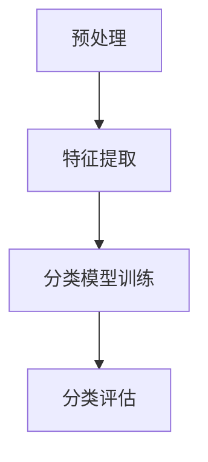

###### 3.4.3 文本分类的性能评估

文本分类的性能评估主要包括准确率、召回率和F1值等指标。

1. **准确率**：分类正确的文本比例。
2. **召回率**：能够正确分类的文本比例。
3. **F1值**：准确率和召回率的调和平均。

```python
# 文本分类性能评估
accuracy = (correct_predictions / total_predictions) * 100
recall = (correct_predictions / total_references) * 100
f1_score = 2 * (accuracy * recall) / (accuracy + recall)
```

##### 3.5 命名实体识别

命名实体识别是一种从文本中识别出具有特定意义的实体（如人名、地名、组织名等）的技术。大语言模型在命名实体识别中发挥了重要作用。

###### 3.5.1 命名实体识别的基本原理

命名实体识别的基本原理包括特征提取、分类模型训练和实体识别。

1. **特征提取**：将文本数据转换为数值特征向量。
2. **分类模型训练**：使用特征向量训练分类模型。
3. **实体识别**：识别文本中的命名实体。

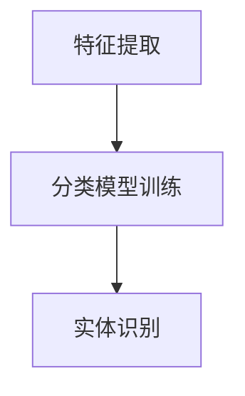

###### 3.5.2 命名实体识别的技术流程

命名实体识别的技术流程包括预处理、特征提取、分类模型训练和实体识别。

1. **预处理**：对文本数据进行预处理，如分词、去停用词等。
2. **特征提取**：提取文本数据的特征向量。
3. **分类模型训练**：使用特征向量训练分类模型。
4. **实体识别**：识别文本中的命名实体。

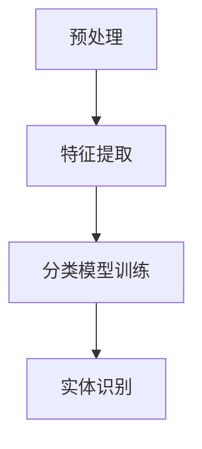

###### 3.5.3 命名实体识别的性能评估

命名实体识别的性能评估主要包括准确率、召回率和F1值等指标。

1. **准确率**：识别正确的命名实体比例。
2. **召回率**：能够正确识别的命名实体比例。
3. **F1值**：准确率和召回率的调和平均。

```python
# 命名实体识别性能评估
accuracy = (correct_predictions / total_predictions) * 100
recall = (correct_predictions / total_references) * 100
f1_score = 2 * (accuracy * recall) / (accuracy + recall)
```

### 第四部分：大语言模型在特定领域的应用

#### 第4章：大语言模型在金融领域的应用

##### 4.3 金融文本分类

金融文本分类是一种将金融领域的文本数据分类到预定义类别中的技术。大语言模型在金融文本分类中发挥了重要作用。

###### 4.3.1 金融文本分类的基本原理

金融文本分类的基本原理包括特征提取、分类模型训练和分类评估。

1. **特征提取**：将文本数据转换为数值特征向量。
2. **分类模型训练**：使用特征向量训练分类模型。
3. **分类评估**：评估分类模型的性能。


###### 4.3.2 金融文本分类的技术流程

金融文本分类的技术流程包括预处理、特征提取、分类模型训练和分类评估。

1. **预处理**：对文本数据进行预处理，如分词、去停用词等。
2. **特征提取**：提取文本数据的特征向量。
3. **分类模型训练**：使用特征向量训练分类模型。
4. **分类评估**：评估分类模型的性能。


###### 4.3.3 金融文本分类的性能评估

金融文本分类的性能评估主要包括准确率、召回率和F1值等指标。

1. **准确率**：分类正确的金融文本比例。
2. **召回率**：能够正确分类的金融文本比例。
3. **F1值**：准确率和召回率的调和平均。

```python
# 金融文本分类性能评估
accuracy = (correct_predictions / total_predictions) * 100
recall = (correct_predictions / total_references) * 100
f1_score = 2 * (accuracy * recall) / (accuracy + recall)
```

##### 4.4 金融趋势预测

金融趋势预测是一种利用历史金融数据和市场信息来预测未来的金融走势的技术。大语言模型在金融趋势预测中发挥了重要作用。

###### 4.4.1 金融趋势预测的基本原理

金融趋势预测的基本原理包括特征提取、模型训练和预测评估。

1. **特征提取**：提取与金融趋势相关的特征。
2. **模型训练**：使用特征向量训练预测模型。
3. **预测评估**：评估预测模型的性能。

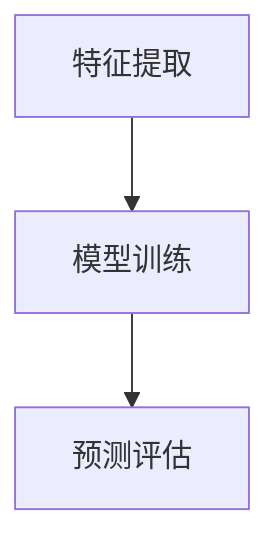

###### 4.4.2 金融趋势预测的技术流程

金融趋势预测的技术流程包括数据预处理、特征提取、模型训练和预测评估。

1. **数据预处理**：对金融数据进行预处理，如清洗、归一化等。
2. **特征提取**：提取与金融趋势相关的特征。
3. **模型训练**：使用特征向量训练预测模型。
4. **预测评估**：评估预测模型的性能。

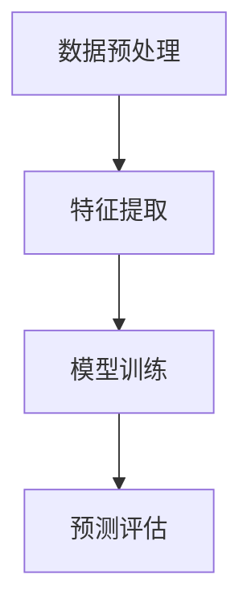

###### 4.4.3 金融趋势预测的性能评估

金融趋势预测的性能评估主要包括预测准确率、预测召回率等指标。

1. **预测准确率**：预测正确的金融趋势比例。
2. **预测召回率**：能够正确预测的金融趋势比例。

```python
# 金融趋势预测性能评估
accuracy = (correct_predictions / total_predictions) * 100
recall = (correct_predictions / total_references) * 100
```

##### 4.5 金融风险控制

金融风险控制是一种利用金融数据和技术来识别和控制金融风险的技术。大语言模型在金融风险控制中发挥了重要作用。

###### 4.5.1 金融风险控制的基本原理

金融风险控制的基本原理包括特征提取、风险评估和风险控制。

1. **特征提取**：提取与金融风险相关的特征。
2. **风险评估**：使用特征向量训练风险评估模型。
3. **风险控制**：根据风险评估结果制定风险控制策略。

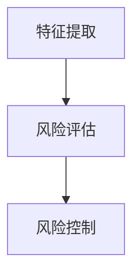

###### 4.5.2 金融风险控制的技术流程

金融风险控制的技术流程包括数据预处理、特征提取、风险评估和风险控制。

1. **数据预处理**：对金融数据进行预处理，如清洗、归一化等。
2. **特征提取**：提取与金融风险相关的特征。
3. **风险评估**：使用特征向量训练风险评估模型。
4. **风险控制**：根据风险评估结果制定风险控制策略。

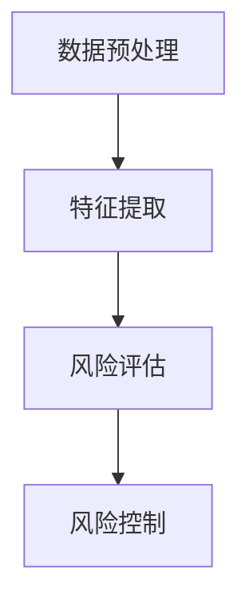

###### 4.5.3 金融风险控制的性能评估

金融风险控制的性能评估主要包括风险识别准确率、风险控制效果等指标。

1. **风险识别准确率**：能够正确识别风险的模型比例。
2. **风险控制效果**：风险控制策略的有效性。

```python
# 金融风险控制性能评估
risk_identification_accuracy = (correct_predictions / total

