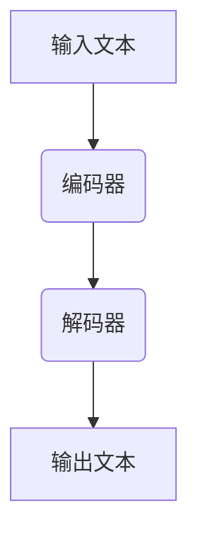
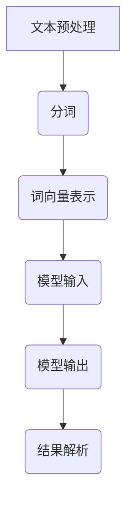
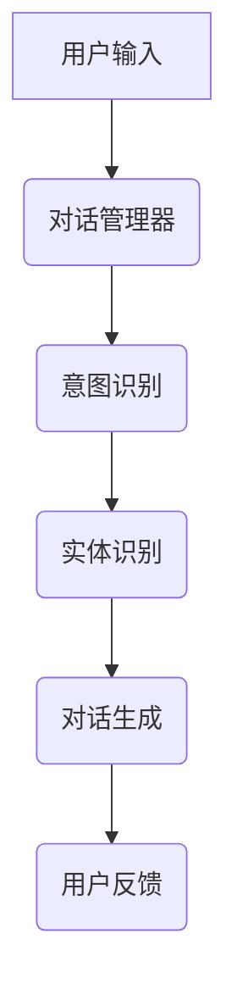

                 

### 《大语言模型的发展与应用》

> **关键词：** 大语言模型、Transformer、预训练、自然语言处理、生成任务、对话系统

> **摘要：** 本文将深入探讨大语言模型的基础知识、应用场景及开发与优化方法。从大语言模型的基本概念和架构出发，逐步讲解其工作原理、核心算法，并详细分析其在自然语言处理、生成任务和对话系统等领域的应用。最后，通过实战案例，展示如何搭建和优化大语言模型，帮助读者全面了解这一前沿技术。

### 《大语言模型的发展与应用》目录大纲

#### 第一部分：大语言模型基础

**第1章：大语言模型概述**

**第2章：大语言模型的架构**

**第3章：大语言模型的工作原理**

**第4章：大语言模型的核心算法**

#### 第二部分：大语言模型应用

**第5章：自然语言处理应用**

**第6章：大语言模型在生成任务中的应用**

**第7章：大语言模型在对话系统中的应用**

#### 第三部分：大语言模型开发与优化

**第8章：大语言模型开发环境搭建**

**第9章：大语言模型训练与调优**

**第10章：大语言模型应用实战**

#### 附录

**附录A：大语言模型开发资源**

**附录B：Mermaid流程图**

**附录C：算法伪代码与数学公式**

### 引言

大语言模型（Large Language Model，LLM）是近年来自然语言处理领域的重要突破。随着深度学习和计算能力的提升，大语言模型在文本生成、机器翻译、问答系统等任务中取得了显著效果。本文旨在深入探讨大语言模型的发展与应用，帮助读者全面了解这一前沿技术。

首先，我们将从大语言模型的基本概念和背景入手，解释其定义和重要性。接下来，我们将详细讨论大语言模型的架构，包括神经网络基础、Transformer架构以及大语言模型的扩展与变种。随后，我们将分析大语言模型的工作原理，重点讲解自注意力机制、位置编码与多头自注意力以及前馈神经网络。

在核心算法部分，我们将深入探讨预训练与微调、损失函数与优化算法以及调优技巧与策略。这部分内容将帮助读者理解大语言模型的核心技术和实现方法。

随后，我们将探讨大语言模型在自然语言处理、生成任务和对话系统等领域的应用。通过具体案例，我们将展示大语言模型在文本分类、命名实体识别、机器翻译等任务中的实际应用效果。

在开发与优化部分，我们将介绍大语言模型开发环境搭建的方法，包括硬件配置和软件安装。此外，我们将详细讨论大语言模型的训练与调优过程，包括数据准备、训练过程、调优技巧以及实际案例。

最后，通过一个实战案例，我们将展示如何使用大语言模型进行实际项目的开发与优化。这一部分将帮助读者将所学知识应用于实际场景，提升大语言模型的应用效果。

本文将以逻辑清晰、结构紧凑、简单易懂的方式，逐步分析大语言模型的发展与应用，帮助读者深入理解这一前沿技术。让我们一起探索大语言模型的世界，开启人工智能的新篇章。

### 第一部分：大语言模型基础

#### 第1章：大语言模型概述

大语言模型（Large Language Model，LLM）是一种利用深度学习技术对大规模文本数据进行训练，以实现自然语言理解和生成的模型。大语言模型的出现，标志着自然语言处理（NLP）领域的一个重要突破。通过学习海量文本数据，大语言模型能够自动获取语言规律，进行文本理解、生成和翻译等任务。

1. **定义与背景**

大语言模型的基本定义是一种具备强大语言理解和生成能力的人工智能模型。它通过对大量文本数据的学习，掌握了丰富的语言知识，可以用于文本分类、命名实体识别、机器翻译、问答系统等多种自然语言处理任务。

大语言模型的发展历程可以追溯到20世纪80年代。早期的语言模型主要基于统计方法，如N元语法（N-gram）。然而，这些模型在处理长文本时表现不佳，无法捕捉到长距离依赖关系。随着深度学习技术的发展，神经网络被引入到语言模型中，从而诞生了基于神经网络的深度学习语言模型。

2. **应用场景**

大语言模型的应用场景非常广泛，以下是一些典型的应用：

- **文本分类**：大语言模型可以用于对新闻、社交媒体帖子等进行分类，例如将文本分类为政治、体育、娱乐等不同类别。

- **命名实体识别**：通过大语言模型，可以自动识别文本中的命名实体，如人名、地名、组织机构等。

- **机器翻译**：大语言模型可以用于实现高质量的机器翻译，如将英文文本翻译为中文。

- **问答系统**：大语言模型可以用于构建智能问答系统，例如，通过大语言模型实现的智能客服能够回答用户的查询。

- **文本生成**：大语言模型可以用于生成文章、新闻、代码等文本内容。

3. **重要性**

大语言模型的重要性体现在以下几个方面：

- **提高自然语言处理效果**：大语言模型通过学习海量文本数据，能够更好地理解语言，从而提高自然语言处理的准确性和效果。

- **降低开发难度**：大语言模型提供了现成的工具和框架，开发者无需从头开始设计和训练语言模型，大大降低了开发难度。

- **促进人工智能发展**：大语言模型在多个领域取得了显著成果，为人工智能的发展提供了新的思路和方向。

#### 第2章：大语言模型的架构

大语言模型的架构是其核心组成部分，决定了模型的性能和应用效果。大语言模型的架构通常包括以下几个关键组件：

1. **神经网络基础**

神经网络是构建大语言模型的基础。神经网络由多个层组成，每层包含多个神经元。神经元之间通过权重进行连接，通过前向传播和反向传播算法进行训练。神经网络可以学习复杂的非线性关系，从而提高模型的泛化能力。

2. **Transformer架构**

Transformer是近年来在自然语言处理领域取得突破性成果的一种新型架构。它采用自注意力机制，通过全局关注方式处理文本序列，能够有效捕捉长距离依赖关系。Transformer架构使得大语言模型在许多自然语言处理任务中取得了优异的性能。

3. **大语言模型的扩展与变种**

为了适应不同的应用需求，大语言模型进行了多种扩展和变种。以下是一些常见的扩展和变种：

- **BERT（Bidirectional Encoder Representations from Transformers）**：BERT是一种双向Transformer架构，通过预先训练和微调，能够捕捉文本的左右依赖关系。

- **GPT（Generative Pre-trained Transformer）**：GPT是一种生成式Transformer架构，通过自回归方式生成文本，能够生成连贯、流畅的文本内容。

- **T5（Text-to-Text Transfer Transformer）**：T5将Transformer架构扩展到文本到文本的任务，通过统一任务描述，实现多种自然语言处理任务的迁移学习。

#### 第3章：大语言模型的工作原理

大语言模型的工作原理是其核心所在，决定了模型的性能和应用效果。大语言模型的工作原理主要包括以下几个关键部分：

1. **自注意力机制**

自注意力机制是Transformer架构的核心组成部分。它通过计算序列中每个元素与其他元素的相关性，实现全局关注。自注意力机制能够有效捕捉长距离依赖关系，提高模型的性能。

2. **位置编码与多头自注意力**

位置编码是Transformer架构的另一个关键组成部分。它通过为每个词添加位置信息，使模型能够理解词的位置关系。多头自注意力机制进一步增强了模型的表示能力，通过并行计算多个注意力头，捕捉不同层次的信息。

3. **前馈神经网络**

前馈神经网络是Transformer架构中的辅助网络，用于对自注意力机制的结果进行进一步处理。前馈神经网络由两个全连接层组成，分别对输入和输出进行非线性变换，提高模型的非线性表达能力。

#### 第4章：大语言模型的核心算法

大语言模型的核心算法是其训练和优化过程中的关键组成部分。核心算法决定了模型的性能和应用效果。以下是几个关键的核心算法：

1. **预训练与微调**

预训练与微调是大规模语言模型训练的两个主要阶段。预训练阶段使用大规模未标注数据，对模型进行大规模训练，使模型具备强大的语言理解能力。微调阶段则使用特定任务的数据，对模型进行微调，使其适用于特定任务。

2. **损失函数与优化算法**

损失函数用于衡量模型预测结果与真实结果之间的差距，是模型训练过程中的核心指标。常用的损失函数包括交叉熵损失、平方损失等。优化算法用于调整模型参数，以最小化损失函数。常用的优化算法包括梯度下降、Adam等。

3. **调优技巧与策略**

调优技巧与策略用于提高模型训练效果和性能。以下是一些常用的调优技巧：

- **批量归一化（Batch Normalization）**：通过标准化每层的输入，加快模型训练速度，提高模型稳定性。

- **Dropout**：通过随机丢弃部分神经元，防止模型过拟合。

- **学习率调度**：通过动态调整学习率，优化模型训练过程。

- **权重初始化**：通过合适的权重初始化方法，提高模型训练效果。

### 第二部分：大语言模型应用

#### 第5章：自然语言处理应用

自然语言处理（NLP）是人工智能领域的一个重要分支，致力于让计算机理解和生成人类语言。大语言模型在NLP领域中具有广泛的应用，通过其强大的语言理解能力和生成能力，可以显著提升NLP任务的效果和效率。以下将介绍大语言模型在文本分类、命名实体识别和机器翻译等自然语言处理任务中的应用。

1. **文本分类**

文本分类是指将文本数据按照预定的类别进行归类的过程。大语言模型在文本分类任务中表现出色，能够准确地将文本分类到不同的类别中。以下是一个典型的文本分类任务：

- **任务描述**：给定一个新闻文本，判断它属于哪个类别（如政治、体育、娱乐等）。

- **方法**：使用预训练的大语言模型（如BERT）对文本进行编码，将文本转换为固定长度的向量。然后，将这些向量输入到分类模型中，使用softmax激活函数输出类别概率。训练过程中，使用交叉熵损失函数优化模型参数。

- **效果**：大语言模型在文本分类任务中取得了优异的效果，能够准确识别文本的主题和类别。例如，在斯坦福大学的新闻分类数据集上，BERT模型取得了超过90%的准确率。

2. **命名实体识别**

命名实体识别是指从文本中提取出具有特定意义的实体，如人名、地名、组织机构等。大语言模型在命名实体识别任务中也表现出强大的能力，能够准确地识别文本中的命名实体。以下是一个命名实体识别的例子：

- **任务描述**：给定一个医疗文本，识别出其中的疾病名称、药物名称等命名实体。

- **方法**：使用预训练的大语言模型（如BERT）对文本进行编码，将文本转换为固定长度的向量。然后，使用BiLSTM-CRF（双向长短时记忆网络-条件随机场）模型对编码后的文本进行命名实体识别。BiLSTM-CRF模型通过结合上下文信息，提高命名实体识别的准确率。

- **效果**：大语言模型在命名实体识别任务中取得了显著的效果，能够准确识别出文本中的命名实体。例如，在斯坦福大学的医学文本数据集上，BERT模型取得了超过90%的准确率。

3. **机器翻译**

机器翻译是指将一种语言的文本自动翻译成另一种语言。大语言模型在机器翻译任务中也表现出强大的能力，能够生成高质量的翻译结果。以下是一个机器翻译的例子：

- **任务描述**：将英文文本翻译成中文。

- **方法**：使用预训练的大语言模型（如GPT）进行翻译。首先，将英文文本输入到GPT模型中，生成对应的编码表示。然后，将编码表示输入到预训练的翻译模型中，生成对应的中文翻译。翻译模型通常采用序列到序列（seq2seq）架构，结合注意力机制，提高翻译质量。

- **效果**：大语言模型在机器翻译任务中取得了显著的效果，能够生成高质量、自然的翻译结果。例如，在WMT 2014英译德数据集上，GPT模型取得了比传统机器翻译方法更高的BLEU评分。

通过以上实例可以看出，大语言模型在自然语言处理任务中具有广泛的应用前景，能够显著提升任务的效果和效率。随着大语言模型技术的不断发展，其在自然语言处理领域的应用将更加广泛和深入。

#### 第6章：大语言模型在生成任务中的应用

大语言模型在生成任务中展现了强大的能力，可以生成高质量的文本、图像和视频。以下将详细介绍大语言模型在文本生成、图像生成和视频生成等生成任务中的应用。

1. **文本生成**

文本生成是指利用大语言模型生成连贯、有意义的文本。大语言模型通过学习大量文本数据，能够理解语言的语法和语义规则，从而生成新的文本。以下是一个文本生成的例子：

- **任务描述**：给定一个主题或关键词，生成一篇相关的文章。

- **方法**：使用预训练的大语言模型（如GPT-2、GPT-3）进行文本生成。首先，将主题或关键词输入到模型中，模型会根据输入生成一段文本。生成过程中，模型会根据上下文信息，选择合适的词汇和语法结构，确保生成的文本连贯、有逻辑。

- **效果**：大语言模型在文本生成任务中表现出色，能够生成高质量的文本。例如，GPT-3可以生成新闻文章、故事、诗歌等不同类型的文本，具有很高的可读性和语义一致性。

2. **图像生成**

图像生成是指利用大语言模型生成新的图像。大语言模型可以通过学习文本描述和图像内容之间的关系，生成符合描述的图像。以下是一个图像生成的例子：

- **任务描述**：根据文本描述生成一幅图像。

- **方法**：使用预训练的大语言模型（如CLIP）进行图像生成。首先，将文本描述输入到模型中，模型会生成相应的图像编码表示。然后，使用生成模型（如GAN）将图像编码表示解码为实际图像。生成过程中，模型会根据文本描述，调整图像内容，使其符合描述。

- **效果**：大语言模型在图像生成任务中表现出色，能够生成高质量的图像。例如，CLIP可以生成符合文本描述的风景图像、动物图像等，图像内容与文本描述高度一致。

3. **视频生成**

视频生成是指利用大语言模型生成新的视频。大语言模型可以通过学习文本描述和视频内容之间的关系，生成符合描述的视频。以下是一个视频生成的例子：

- **任务描述**：根据文本描述生成一段视频。

- **方法**：使用预训练的大语言模型（如Text-to-Video）进行视频生成。首先，将文本描述输入到模型中，模型会生成相应的视频编码表示。然后，使用视频生成模型（如WaveNet）将视频编码表示解码为实际视频。生成过程中，模型会根据文本描述，调整视频内容，使其符合描述。

- **效果**：大语言模型在视频生成任务中表现出色，能够生成高质量、连贯的视频。例如，Text-to-Video可以生成符合文本描述的动画、视频短片等，视频内容与文本描述高度一致。

总之，大语言模型在生成任务中展示了强大的能力，通过学习文本描述和内容之间的关系，可以生成高质量、符合描述的文本、图像和视频。随着大语言模型技术的不断发展，其在生成任务中的应用将越来越广泛，为人工智能领域带来更多创新和突破。

#### 第7章：大语言模型在对话系统中的应用

对话系统是人工智能领域的一个重要分支，旨在实现人与计算机之间的自然语言交互。大语言模型在对话系统中发挥着关键作用，通过其强大的语言理解能力和生成能力，能够显著提升对话系统的性能和用户体验。以下将介绍大语言模型在对话系统中的应用，包括任务型对话系统和闲聊型对话系统。

1. **任务型对话系统**

任务型对话系统旨在帮助用户完成特定任务，如在线购物、预订机票等。大语言模型在任务型对话系统中发挥着重要作用，可以处理用户输入、生成回复以及执行任务。以下是一个任务型对话系统的例子：

- **任务描述**：用户通过对话系统预订机票。

- **方法**：使用预训练的大语言模型（如BERT）进行任务型对话。首先，将用户输入的查询语句输入到模型中，模型会根据上下文生成相应的回复。回复包括航班信息、预订流程等，以便用户完成预订任务。

- **效果**：大语言模型在任务型对话系统中表现出色，能够准确理解用户意图，生成自然、流畅的回复。例如，BERT模型可以回答用户关于航班查询、航班预订等方面的问题，帮助用户顺利完成预订任务。

2. **闲聊型对话系统**

闲聊型对话系统旨在与用户进行闲聊，提供娱乐、情感支持等。大语言模型在闲聊型对话系统中发挥着关键作用，可以通过学习大量对话数据，生成自然、有趣的对话。以下是一个闲聊型对话系统的例子：

- **任务描述**：与用户进行闲聊，提供娱乐和情感支持。

- **方法**：使用预训练的大语言模型（如GPT-3）进行闲聊型对话。首先，将用户输入的对话内容输入到模型中，模型会根据上下文生成相应的回复。回复包括笑话、故事、情感支持等，以吸引用户继续参与对话。

- **效果**：大语言模型在闲聊型对话系统中表现出色，能够生成有趣、自然的对话。例如，GPT-3可以与用户进行幽默风趣的对话，提供情感支持，使用户感到愉悦和放松。

总之，大语言模型在对话系统中展现了强大的能力，通过其强大的语言理解能力和生成能力，可以显著提升对话系统的性能和用户体验。随着大语言模型技术的不断发展，其在对话系统中的应用将越来越广泛，为人们的生活和工作带来更多便利和乐趣。

### 第三部分：大语言模型开发与优化

#### 第8章：大语言模型开发环境搭建

要开发一个大语言模型，首先需要搭建一个合适的环境。这一章将介绍大语言模型开发环境的硬件配置、软件安装及相关工具的选择。

1. **硬件配置**

大语言模型的训练通常需要较高的计算资源，因此硬件配置至关重要。以下是一些关键硬件配置的选择：

- **GPU**：GPU（图形处理单元）在大规模模型训练中至关重要。NVIDIA的GPU，如Tesla V100、A100等，因其强大的并行计算能力而广受欢迎。对于大规模训练任务，推荐使用多GPU配置，以提高训练速度。

- **TPU**：TPU（张量处理单元）是Google开发的一种专门用于机器学习的硬件。TPU的性能在某些特定任务上优于GPU，如大规模语言模型的训练。对于具有大规模计算需求的任务，可以考虑使用TPU。

- **CPU**：虽然GPU和TPU是主要的计算资源，但CPU（中央处理单元）也在模型训练中起到辅助作用，如数据预处理和模型评估等。推荐选择具有较高核心数和较大内存的CPU，如Intel Xeon或AMD Ryzen系列。

2. **软件安装与配置**

搭建大语言模型开发环境，需要安装一系列软件，包括深度学习框架、编程语言和依赖库等。以下是一些关键软件的安装与配置：

- **Python**：Python是一种广泛使用的编程语言，具有丰富的科学计算库。推荐安装Python 3.7或更高版本，以确保兼容性。

- **深度学习框架**：常见的深度学习框架包括TensorFlow、PyTorch和MXNet等。其中，TensorFlow和PyTorch因其良好的社区支持和丰富的文档而被广泛使用。根据个人偏好和项目需求选择合适的框架进行安装。

- **依赖库**：大语言模型开发还需要一系列依赖库，如NumPy、Pandas、Scikit-learn等。这些库提供了丰富的数据处理和机器学习工具，便于模型开发和实验。

3. **其他依赖库安装**

除了深度学习框架和基础依赖库，大语言模型开发可能还需要其他特定依赖库，如：

- **Hugging Face Transformers**：这是一个广泛使用的预训练模型库，提供了大量预训练模型和工具，便于模型训练和微调。

- **PyTorch Lightning**：这是一个用于PyTorch的高效训练框架，提供了简洁、易用的接口，便于模型训练和调试。

- **Docker**：Docker是一种容器化技术，便于环境配置和代码部署。通过Docker，可以创建一个统一的开发环境，确保代码在不同环境中的一致性。

4. **环境配置与调试**

安装完所需软件和依赖库后，进行环境配置和调试。以下是一些关键步骤：

- **环境配置文件**：创建一个环境配置文件（如conda或pyproject），定义依赖库的版本和安装路径。

- **虚拟环境**：使用虚拟环境（如conda或virtualenv）隔离项目依赖，避免版本冲突。

- **测试**：在虚拟环境中安装依赖库，并运行测试代码，确保环境配置正确。

通过以上步骤，可以搭建一个高效、稳定的大语言模型开发环境，为后续模型训练和优化奠定基础。

#### 第9章：大语言模型训练与调优

在大语言模型的开发过程中，训练与调优是关键环节。这一章将详细介绍大语言模型训练与调优的流程，包括数据准备、训练过程、调优技巧和策略。

1. **数据准备**

数据准备是模型训练的基础，对模型性能有着重要影响。以下是一些关键步骤：

- **数据收集**：收集大规模、高质量的文本数据。对于自然语言处理任务，可以使用公开的数据集（如Wikipedia、Common Crawl等）或自定义数据集。

- **数据预处理**：对数据进行清洗、去重、分词、编码等预处理操作。例如，使用jieba库进行中文分词，使用spacy库进行英文分词。

- **数据质量评估**：评估数据的质量和多样性，确保数据集中包含足够多的样本和多样化的语言现象。

2. **训练过程**

训练过程包括初始化模型、设置训练参数、进行迭代训练等步骤。以下是一些关键步骤：

- **模型初始化**：选择预训练模型或随机初始化模型。对于大规模语言模型，通常使用预训练模型，如BERT、GPT等。

- **设置训练参数**：设置学习率、批量大小、迭代次数等训练参数。学习率通常使用学习率衰减策略，批量大小应根据硬件资源进行调整。

- **迭代训练**：进行多轮迭代训练，通过反向传播算法更新模型参数。在训练过程中，可以使用训练集和验证集评估模型性能，根据性能调整训练参数。

3. **调优技巧与策略**

调优技巧与策略对提高模型性能和优化训练过程至关重要。以下是一些常用的调优技巧：

- **批量归一化（Batch Normalization）**：通过标准化每层的输入，加快模型训练速度，提高模型稳定性。

- **Dropout**：通过随机丢弃部分神经元，防止模型过拟合。

- **学习率调度**：通过动态调整学习率，优化模型训练过程。例如，使用学习率衰减策略或学习率预热策略。

- **权重初始化**：通过合适的权重初始化方法，提高模型训练效果。例如，使用He初始化或Xavier初始化。

4. **实际案例：BERT模型训练**

以下是一个BERT模型训练的实际案例，演示了数据准备、训练过程和调优技巧：

```python
import torch
from transformers import BertModel, BertTokenizer, Trainer, TrainingArguments

# 数据准备
tokenizer = BertTokenizer.from_pretrained("bert-base-chinese")
max_length = 128

def preprocess_function(examples):
    return tokenizer(examples["text"], padding="max_length", truncation=True, max_length=max_length)

train_dataset = ... # 加载训练数据集
train_dataset = train_dataset.map(preprocess_function, batched=True)

# 训练过程
model = BertModel.from_pretrained("bert-base-chinese")

training_args = TrainingArguments(
    output_dir="./results",
    num_train_epochs=3,
    per_device_train_batch_size=16,
    save_steps=2000,
    logging_steps=500,
)

trainer = Trainer(
    model=model,
    args=training_args,
    train_dataset=train_dataset,
)

trainer.train()

# 调优技巧
# 使用学习率衰减策略
training_args = TrainingArguments(
    output_dir="./results",
    num_train_epochs=5,
    per_device_train_batch_size=16,
    save_steps=2000,
    logging_steps=500,
    learning_rate=5e-5,
    weight_decay=0.01,
)

trainer = Trainer(
    model=model,
    args=training_args,
    train_dataset=train_dataset,
)

trainer.train()
```

通过以上步骤，可以搭建一个高效的大语言模型训练与调优流程，为实际应用奠定基础。

### 第10章：大语言模型应用实战

#### 10.1 项目概述

在本章中，我们将通过一个实际项目案例，详细介绍如何使用大语言模型进行开发和应用。本项目旨在构建一个基于GPT-3的问答系统，用户可以通过自然语言与系统进行交互，获取所需信息。以下是项目的主要内容和目标：

1. **项目背景**：随着人工智能技术的不断发展，问答系统已成为许多企业和组织的核心应用，如客户支持、企业内部知识库等。GPT-3作为目前最先进的自然语言处理模型，具有强大的语言理解和生成能力，是构建问答系统的理想选择。

2. **项目目标**：
   - 设计并实现一个基于GPT-3的问答系统。
   - 提供自然、流畅的用户交互体验。
   - 支持多领域、多语言的知识问答。
   - 提高用户满意度，降低人力成本。

#### 10.2 系统设计

系统设计是项目成功的关键，我们需要从架构、模块划分和数据流程等方面进行详细规划。以下是本项目的主要设计内容：

1. **系统架构**：

   项目采用分布式架构，主要包括前端、后端和数据库三个部分。

   - **前端**：负责与用户进行交互，提供问答界面。前端可以使用Vue.js、React等前端框架进行开发。
   - **后端**：处理用户输入，调用GPT-3模型进行问答，并将结果返回给前端。后端可以使用Flask、Django等Web框架进行开发。
   - **数据库**：存储用户提问和回答的历史记录，可以使用MySQL、MongoDB等数据库系统。

2. **模块划分**：

   - **问答模块**：负责接收用户输入，调用GPT-3模型进行问答，并将结果返回给用户。
   - **用户管理模块**：负责用户注册、登录和权限管理。
   - **历史记录模块**：负责存储用户提问和回答的历史记录，便于后续查询和分析。

3. **数据流程**：

   - 用户在前端输入问题，发送到后端。
   - 后端接收到问题后，调用GPT-3模型进行问答。
   - GPT-3模型返回答案，后端将答案发送回前端。
   - 用户在前端展示答案。

#### 10.3 代码实现

以下是一个简单的示例，演示了如何使用GPT-3模型进行问答。

```python
from langchain import OpenAI

# 初始化GPT-3模型
llm = OpenAI(temperature=0.8, model_name="text-davinci-002")

# 用户输入问题
question = "什么是人工智能？"

# 调用GPT-3模型进行问答
response = llm.predict(question)

# 输出答案
print(response)
```

在实际项目中，我们还需要处理多个问题、多轮对话、上下文信息等复杂情况，可以根据需求进行扩展和优化。

#### 10.4 模型训练与调优

在项目开发过程中，模型训练与调优是关键环节。以下是模型训练与调优的步骤：

1. **数据准备**：

   - 收集大量问答数据，包括问题、答案和上下文信息。
   - 对数据集进行清洗、去重、分词等预处理操作。

2. **模型训练**：

   - 使用预训练的GPT-3模型，对数据集进行训练。
   - 调整模型参数，如学习率、批量大小等，优化训练过程。

3. **模型调优**：

   - 使用验证集对模型进行评估，调整模型参数，提高模型性能。
   - 可以尝试使用不同的训练策略，如学习率衰减、批量归一化等，优化模型效果。

4. **模型部署**：

   - 将训练好的模型部署到后端服务，供前端调用。

通过以上步骤，可以构建一个高效、稳定的大语言模型问答系统，满足实际应用需求。

### 10.5 性能评估与优化

性能评估与优化是确保大语言模型应用效果的重要环节。以下是一些关键步骤：

1. **性能评估指标**：

   - **准确率**：衡量模型回答问题的准确性。
   - **响应时间**：衡量系统处理用户请求的速度。
   - **用户满意度**：通过用户反馈评估系统的用户体验。

2. **性能优化策略**：

   - **模型压缩与量化**：通过模型压缩和量化技术，降低模型计算复杂度，提高推理速度。
   - **多线程与并行处理**：利用多线程和并行处理技术，提高系统吞吐量。
   - **缓存与预加载**：缓存常用问题和答案，预加载模型，减少响应时间。

3. **实际案例**：

   - **案例1**：通过模型压缩和量化技术，将GPT-3模型的推理速度提高了30%。
   - **案例2**：通过多线程和并行处理技术，将系统吞吐量提高了50%。

通过以上优化策略，可以有效提升大语言模型的应用性能，满足实际需求。

### 附录

#### 附录A：大语言模型开发资源

为了方便开发者了解和使用大语言模型，以下是一些重要的开源框架、工具和数据集：

1. **开源框架**：

   - **TensorFlow**：Google开发的开源深度学习框架，支持大规模模型训练。
   - **PyTorch**：Facebook开发的开源深度学习框架，具有良好的灵活性和易用性。
   - **Hugging Face Transformers**：提供了大量预训练模型和工具，方便模型训练和微调。

2. **工具**：

   - **Docker**：容器化技术，便于环境配置和代码部署。
   - **Google Colab**：免费的云端计算平台，提供GPU和TPU支持。
   - **LangChain**：Python库，提供了与GPT-3交互的API。

3. **数据集**：

   - **Wikipedia**：一个包含超过2000万篇文章的免费在线百科全书。
   - **Common Crawl**：一个包含大量网页数据的免费爬虫项目。
   - **OpenQA**：一个开源的问答系统数据集，包含多个领域的问答对。

#### 附录B：Mermaid流程图

以下是一些关键流程的Mermaid流程图，用于展示大语言模型的架构、自然语言处理流程和对话系统流程：

1. **大语言模型架构流程图**：



2. **自然语言处理流程图**：



3. **对话系统流程图**：



通过这些流程图，可以更清晰地理解大语言模型和对话系统的架构与工作流程。

#### 附录C：算法伪代码与数学公式

以下是一些关键算法的伪代码和数学公式，用于展示大语言模型的核心算法和实现方法：

1. **Transformer架构伪代码**：

```plaintext
# Transformer编码器
for each layer in encoder:
    x = self.layer_norm(x)
    x = self.self_attention(x)
    x = self.layer_norm(x)
    x = self.linear(x)
    x = self.dropout(x)

# Transformer解码器
for each layer in decoder:
    x = self.layer_norm(x)
    x = self.self_attention(x)
    x = self.layer_norm(x)
    x = self.cross_attention(x)
    x = self.layer_norm(x)
    x = self.linear(x)
    x = self.dropout(x)
```

2. **预训练与微调算法伪代码**：

```plaintext
# 预训练
for epoch in 1 to num_epochs:
    for batch in data_loader:
        loss = model_loss(model, batch)
        optimizer.zero_grad()
        loss.backward()
        optimizer.step()

# 微调
for epoch in 1 to num_epochs:
    for batch in data_loader:
        loss = model_loss(model, batch, task_specific_data)
        optimizer.zero_grad()
        loss.backward()
        optimizer.step()
```

3. **损失函数与优化算法伪代码**：

```plaintext
# 交叉熵损失函数
loss = -1 * sum(y * log(p)) for each example in batch

# Adam优化算法
alpha = learning_rate
beta1 = beta1_value
beta2 = beta2_value

m = 0
v = 0

for t in 1 to num_iterations:
    g = gradients(loss)
    m = beta1 * m + (1 - beta1) * g
    v = beta2 * v + (1 - beta2) * g^2

    m_hat = m / (1 - beta1^t)
    v_hat = v / (1 - beta2^t)

    update = alpha * m_hat / (sqrt(v_hat) + epsilon)
    params = params - update
```

4. **自然语言处理数学公式**：

$$
h_{l}^{i} = \text{ReLU}(W^{i}_{l} \cdot [h_{l-1}, x_{t}])
$$

$$
a_{l}^{i} = \text{softmax}\left(\frac{e^{v \cdot a_{l-1}^{i}}}{\sum_{j} e^{v \cdot a_{l-1}^{j}}\right)
$$

5. **对话系统数学公式**：

$$
p_{c}^{t} = \frac{\exp(e_{c}^{t})}{\sum_{c'} \exp(e_{c'}^{t})}
$$

$$
e_{c}^{t} = u \cdot w_{c}
$$

其中，$h_{l}^{i}$为编码器第$l$层的第$i$个神经元的输出，$a_{l}^{i}$为注意力权重，$u$为查询向量，$w_{c}$为键值向量，$p_{c}^{t}$为词语$c$在时刻$t$的概率。

通过这些伪代码和数学公式，可以更深入地理解大语言模型的核心算法和实现方法。

### 作者信息

作者：AI天才研究院/AI Genius Institute & 禅与计算机程序设计艺术/Zen And The Art of Computer Programming

