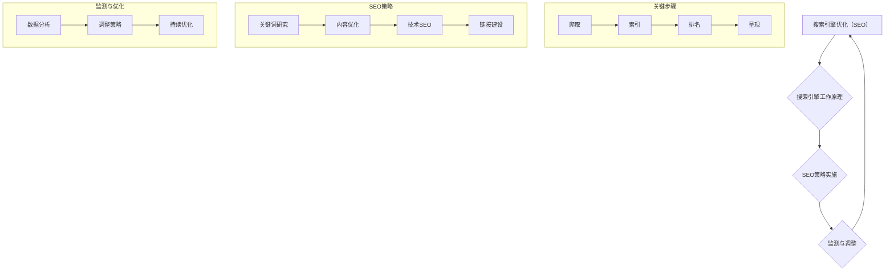

                 

### 前言

#### SEO概述

搜索引擎优化（SEO）是一种提高网站在搜索引擎结果页面（SERP）中自然排名的技术。SEO的核心目标是提高网站的可见性，从而增加有机流量，进而实现商业目标。SEO不仅仅是一种营销手段，它也是提升用户体验和网站质量的重要途径。

SEO的重要性在于：

1. **提升品牌知名度**：当你的网站在搜索引擎结果页面的前列时，用户更可能点击进入，从而提升品牌知名度。
2. **增加流量**：良好的SEO策略能够使你的网站在搜索引擎结果中排名更高，从而获得更多的访问量。
3. **提升用户体验**：SEO优化还包括提升网站的速度、易用性和内容质量，这些都有助于提供更好的用户体验。
4. **长期效果**：SEO不是一蹴而就的，但一旦排名提升，效果通常是长期的，而且成本效益高。

#### 本书目标

本书的目标是帮助创业公司的产品经理、营销人员和技术人员了解和实施SEO策略，以提升他们的创业产品的曝光率。我们将通过以下步骤来详细探讨SEO：

1. **搜索引擎优化基础**：介绍SEO的基本概念和原理。
2. **内容优化**：探讨如何创建高质量的内容并进行优化。
3. **技术SEO优化**：介绍网站技术层面的优化，包括网站速度、移动优化和安全等。
4. **外部链接建设**：讲解如何通过自然链接建设和合作伙伴关系来提升网站权威性。
5. **SEO工具与资源**：介绍常用的SEO工具和资源。
6. **SEO监测与调整**：如何通过数据分析来监测SEO效果，并调整策略。
7. **案例研究**：分析和总结一些成功的SEO案例，提取经验。
8. **SEO与营销整合**：如何将SEO与其他营销策略整合。
9. **SEO未来趋势**：介绍SEO行业的最新动态和发展趋势。

#### 读者对象

本书适合以下读者：

- 创业公司的产品经理，他们需要了解如何通过SEO提升产品的市场表现。
- 营销人员，他们希望掌握SEO策略，以增强营销效果。
- 技术人员，他们需要了解如何从技术层面优化网站，以支持SEO。

通过阅读本书，读者将能够：

- 理解SEO的基本原理和策略。
- 制定和实施有效的SEO计划。
- 提升网站的搜索排名和用户体验。
- 通过SEO实现商业目标，如增加销售和提升品牌知名度。

接下来，我们将深入探讨搜索引擎优化（SEO）的基础知识，为后续的深入讨论打下坚实的基础。

### 第1章：搜索引擎优化基础

搜索引擎优化（SEO）是一个复杂但至关重要的过程，它直接影响网站在搜索引擎结果页面（SERP）中的排名。为了全面理解SEO，我们首先需要了解搜索引擎的工作原理，以及SEO如何在其中发挥作用。

#### 搜索引擎的工作原理

搜索引擎的主要任务是帮助用户在庞大的互联网中快速找到他们需要的信息。这个过程通常包括以下几个关键步骤：

1. **爬取（Crawling）**：搜索引擎使用称为“蜘蛛”（spiders）或“爬虫”（crawlers）的程序，自动浏览互联网，发现新的网页，并收集这些网页的内容和链接信息。爬虫会根据链接、引用和浏览历史来决定访问哪些页面。

2. **索引（Indexing）**：一旦爬虫收集到网页的信息，搜索引擎会将这些信息存储在索引数据库中。索引是一个巨大的数据库，存储了所有已爬取网页的摘要、关键词、内容和链接结构。

3. **排名（Ranking）**：当用户进行搜索时，搜索引擎会使用复杂的算法分析索引中的数据，根据相关性、权威性、用户行为等因素来决定哪些网页应该排在搜索结果的前列。

4. **呈现（Displaying）**：最后，搜索引擎将最相关的网页呈现给用户，用户可以通过点击进入查看详细信息。

#### SEO在搜索引擎中的作用

SEO旨在优化网站，使其在搜索引擎结果页面中排名更高。以下是一些核心的SEO要素：

1. **关键词研究**：选择合适的关键词对于SEO至关重要。关键词研究包括确定用户经常搜索的术语，以及这些术语在相关领域中的竞争程度。

2. **内容优化**：高质量的内容是SEO的核心。内容应针对特定的关键词进行优化，同时提供用户真正需要的价值。

3. **网站结构优化**：搜索引擎需要能够理解网站的结构。合理的网站地图、清晰的URL结构和有效的内部链接策略都是网站结构优化的重要组成部分。

4. **技术SEO**：网站的技术层面优化，如网站速度、移动优化和安全性，对于提高SEO效果至关重要。

5. **外部链接建设**：外部链接被视为网站权威性的一个指标。获得来自高权威网站的链接可以提高你的网站在搜索引擎中的排名。

6. **用户行为**：用户在网站上的行为，如点击率、停留时间和跳出率，也会影响SEO排名。

#### 关键词研究

关键词研究是SEO过程的第一步。以下是如何进行关键词研究的关键步骤：

1. **确定目标受众**：首先，了解你的目标受众，包括他们可能使用的术语和表达方式。

2. **使用关键词工具**：利用关键词研究工具，如Google Keyword Planner、Ahrefs和SEMrush，来发现相关关键词和评估它们的搜索量和竞争程度。

3. **选择关键词**：选择与你的业务相关的、搜索量适中且竞争程度较低的关键词。理想的关键词应该既有足够的搜索量，又不会太拥挤，以便你能够通过优化获得较好的排名。

4. **跟踪关键词表现**：定期监控关键词的表现，并根据数据调整关键词策略。

#### 网站结构优化

网站结构优化是SEO的重要组成部分，它帮助搜索引擎更好地理解网站的架构和内容。以下是一些关键点：

1. **网站地图**：创建一个清晰的网站地图，帮助搜索引擎快速索引网站的所有页面。

2. **URL结构**：URL应该简洁、易于理解，并且包含关键词。避免使用复杂的参数和动态URL。

3. **内部链接策略**：内部链接有助于搜索引擎爬取网站，同时也可以帮助用户更方便地浏览网站。使用有意义的锚文本，并确保链接布局合理，易于导航。

#### 技术SEO

技术SEO涉及优化网站的基础技术，以提高网站的性能和用户体验。以下是一些关键点：

1. **网站速度优化**：页面加载速度是用户满意度和搜索引擎排名的重要因素。使用工具如Google PageSpeed Insights来评估和优化网站速度。

2. **移动优化**：随着移动设备的普及，移动优化变得至关重要。确保网站在移动设备上具有良好的表现，使用响应式设计或移动友好的版本。

3. **安全性**：网站的安全性对SEO和用户体验都非常重要。使用HTTPS协议，确保网站没有安全漏洞。

通过理解搜索引擎的工作原理和SEO的基本要素，我们可以更好地制定和实施SEO策略，从而提高创业产品的曝光率。接下来，我们将深入探讨内容优化，这是SEO成功的关键组成部分。

#### 第2章：内容优化

内容优化是搜索引擎优化（SEO）的核心环节，它直接影响到网站在搜索引擎结果页面（SERP）中的排名和用户的留存率。高质量的内容不仅能满足用户的需求，还能增强搜索引擎对网站的信任度，从而提高网站的曝光率。以下是内容优化的重要方面：

##### 高质量内容的重要性

1. **用户需求满足**：高质量的内容能够满足用户的查询需求，提供有用的信息和解决方案，从而提高用户满意度和网站留存率。
   
2. **搜索引擎信任度**：搜索引擎偏好高质量的内容，因为这表明网站提供了有价值的信息，有助于提高网站的权威性和信任度。

3. **降低跳出率**：跳出率是指用户访问网站后立即离开的比例。高质量的内容有助于降低跳出率，因为用户在网站上停留的时间更长，更有可能进行其他操作。

##### 内容创建策略

1. **目标受众分析**：在创建内容之前，了解你的目标受众是至关重要的。这包括他们的年龄、性别、地理位置、兴趣和搜索习惯。通过分析受众特征，你可以创建更贴近用户需求的内容。

2. **内容类型选择**：根据目标受众和业务需求，选择合适的内容类型。常见的内容类型包括博客文章、视频、白皮书、案例研究、新闻发布和产品说明。

3. **内容规划**：制定一个内容计划，包括内容主题、发布频率和发布时间表。这有助于保持内容的持续性和一致性，提高用户的期待和参与度。

##### 高质量内容的具体实践

1. **独特性**：内容应具有独特性，避免与竞争对手的内容重复。独特的观点和数据可以吸引更多的用户和搜索引擎关注。

2. **深度和广度**：内容应该既有深度，提供详细的见解和解释，又要有广度，覆盖相关的关键词和主题。这有助于提高内容的覆盖面和搜索排名。

3. **易于理解**：内容应该清晰、简洁，避免使用复杂的术语和专业词汇。对于复杂的主题，可以通过图表、图像和视频来辅助说明。

4. **更新和迭代**：定期更新内容，保持其相关性和时效性。根据用户反馈和数据表现，不断优化和迭代内容。

##### 标题和描述标签优化

1. **标题（Title Tag）**：标题是用户和搜索引擎对页面内容的第一印象。一个吸引人的标题应该简洁明了，包含关键词，同时能够激发用户的兴趣。最佳长度通常在50-60个字符内。

2. **元描述（Meta Description）**：元描述是页面摘要，通常在搜索引擎结果页面的标题下方显示。一个有吸引力的元描述应该简洁地概括页面内容，同时包含关键词，以鼓励用户点击进入。

##### 内容优化的最佳实践

1. **关键词优化**：在内容中自然地融入关键词，避免过度优化和关键词堆砌。关键词应分布在整个内容中，包括标题、元描述、正文和图像标签。

2. **内部链接策略**：通过内部链接策略，将相关内容相互链接，提高网站的导航性和用户体验。使用有意义的锚文本，并确保链接布局合理，易于用户和搜索引擎爬取。

3. **多媒体使用**：合理地使用多媒体元素，如图片、视频和音频，可以增加内容的吸引力和互动性，提高用户的留存时间和参与度。

4. **移动优化**：确保内容在移动设备上具有良好的表现，使用响应式设计或移动友好的布局，以提高用户体验和搜索引擎排名。

通过以上内容优化策略，创业公司可以创建高质量的内容，提高搜索引擎的信任度，从而提升网站的曝光率和用户参与度。接下来，我们将探讨技术层面的SEO优化，这是提升网站整体性能和用户体验的关键。

#### 第3章：技术SEO优化

技术SEO优化是提升网站在搜索引擎结果页面（SERP）中排名和用户满意度的关键因素。技术SEO主要关注网站的基础架构和性能，以确保搜索引擎能够顺利地爬取、索引和评估网站的内容。以下是技术SEO优化的一些重要方面：

##### 网站速度优化

网站速度对SEO的影响非常重要。快速加载的网站不仅能够提高用户体验，还能提升搜索引擎排名。以下是一些优化网站速度的方法：

1. **优化图片和媒体文件**：压缩图片和视频文件，减少其大小，使用现代图片格式如WebP，优化媒体文件的尺寸。

2. **启用缓存**：使用浏览器缓存可以显著提高页面加载速度。通过设置合理的缓存策略，用户可以在后续访问时从缓存中获取内容，而不是重新加载。

3. **减少HTTP请求**：通过合并CSS和JavaScript文件、使用外部链接和CDN（内容分发网络）来减少HTTP请求的数量。

4. **使用CDN**：CDN可以将网站内容分发到全球多个节点，从而减少用户与服务器之间的距离，提高加载速度。

5. **优化服务器配置**：调整服务器配置，如启用GZIP压缩、配置合适的Web服务器缓存策略等。

##### 移动优化

随着移动设备的普及，移动优化变得至关重要。搜索引擎对移动友好的网站给予了更高的排名权重。以下是一些移动优化的关键点：

1. **响应式设计**：使用响应式网页设计（RWD）技术，确保网站在不同屏幕尺寸和设备上都有良好的表现。

2. **移动友好体验**：优化触摸屏交互，确保按钮和链接足够大，易于点击。

3. **避免布局过度依赖JavaScript**：虽然JavaScript为网站提供了丰富的交互功能，但过多的JavaScript可能导致网站在移动设备上加载缓慢。

4. **预渲染关键内容**：通过预渲染关键内容，可以在用户点击链接时快速加载页面，从而提高用户体验。

##### 安全性

网站的安全性对SEO和用户信任度至关重要。以下是一些提高网站安全性的方法：

1. **使用HTTPS协议**：HTTPS提供了数据加密和完整性验证，提高了网站的安全性。通过SSL证书，你的网站可以在URL地址栏显示“安全”标识。

2. **防止恶意攻击**：定期更新网站和服务器软件，使用防火墙和入侵检测系统来保护网站免受黑客攻击。

3. **保护用户数据**：确保网站遵守数据保护法规，如GDPR和CCPA，保护用户隐私。

4. **加强登录验证**：使用双因素认证（2FA）来提高用户账户的安全性。

##### 技术SEO优化的最佳实践

1. **使用网站地图**：创建并提交网站地图，帮助搜索引擎快速索引网站的所有页面。

2. **优化URL结构**：确保URL简洁、易于理解，并包含关键词。避免使用复杂的参数和动态URL。

3. **合理的内部链接策略**：通过有意义的内部链接，提高网站的导航性和用户体验，同时帮助搜索引擎爬取网站。

4. **使用301重定向**：当页面发生更改或删除时，使用301重定向将旧页面重定向到新页面，以保持链接权重和用户体验。

5. **使用元标签**：为每个页面编写有意义的标题标签和元描述，以提高搜索引擎结果中的点击率。

通过上述技术SEO优化措施，创业公司可以显著提升网站的加载速度、用户体验和搜索引擎排名，从而提高产品的曝光率和用户满意度。接下来，我们将探讨如何通过外部链接建设来进一步提升网站的权威性和搜索排名。

### 第4章：外部链接建设

外部链接建设是提升网站在搜索引擎结果页面（SERP）中排名的关键因素之一。外部链接，也称为“反向链接”或“ inbound links”，是指其他网站链接到你的网站。搜索引擎通常将外部链接视为网站权威性和相关性的指标，因此，获得高质量的外部链接对于提高网站排名至关重要。

#### 链接建设策略

1. **自然链接**：自然链接是其他网站出于内容和相关性而自愿提供的链接。与人为操纵的链接相比，自然链接更有利于SEO。

2. **高权威网站**：获得来自高权威网站的链接，如行业领导者、知名媒体和著名教育机构，可以显著提高你的网站权威性。

3. **相关性和主题匹配**：外部链接应与你的网站内容和主题相关。相关性的链接有助于提高搜索引擎对网站主题的认可。

4. **多样化链接来源**：避免过度依赖单一链接来源。通过从多个不同网站获得链接，可以减少链接策略的风险。

5. **高质量内容**：创建高质量、有价值的内容是吸引自然链接的关键。高质量的内容自然会引起其他网站的引用和分享。

#### 链接建设方法

1. **内容营销**：通过创建高质量的原创内容，如博客文章、案例研究、白皮书和视频，吸引其他网站引用。

2. **合作伙伴关系**：与相关网站建立合作关系，互相引用，提高双方的权威性。

3. **社交媒体**：利用社交媒体平台宣传你的内容，吸引其他网站注意到并引用。

4. **论坛和博客评论**：在相关论坛和博客上发表有价值的评论，提供链接到你的网站。

5. **媒体发布**：撰写新闻稿和媒体文章，发布到知名媒体和新闻网站上，获取高质量的链接。

6. **参与行业活动**：参加行业会议、研讨会和活动，通过这些活动获得链接。

#### 链接建设注意事项

1. **避免链接购买**：购买链接可能导致搜索引擎惩罚，影响网站排名。

2. **避免垃圾链接**：不要通过垃圾网站、链接农场和自动化工具获取链接。这些低质量的链接会对网站产生负面影响。

3. **链接页面上不使用“nofollow”属性**：确保链接页面上不使用“nofollow”属性，因为“nofollow”链接不会传递权重。

4. **监控链接质量**：定期监控外部链接，发现并移除不良链接，避免负面影响。

#### 合作伙伴关系

与相关网站建立合作伙伴关系是链接建设的重要策略。以下是一些建立合作伙伴关系的建议：

1. **互惠链接**：与其他网站交换链接，确保链接内容和主题相关。

2. **内容合作**：共同创作内容，如联合发布博客文章、视频或研究报告。

3. **资源共享**：提供资源共享，如数据、工具或技术支持。

4. **社交媒体合作**：在社交媒体上相互宣传和推荐，扩大彼此的影响力。

5. **共同活动**：共同参与行业活动，如会议、研讨会或展览。

通过有效的链接建设策略和合作伙伴关系，创业公司可以显著提高网站的权威性和搜索排名，从而提高产品的曝光率和市场竞争力。接下来，我们将探讨如何利用社交媒体与SEO相结合，以进一步提升网站的表现。

### 第5章：SEO工具与资源

在SEO优化过程中，利用各种工具和资源是不可或缺的。这些工具可以帮助你分析网站性能、监控关键字排名、评估竞争对手以及制定优化策略。以下是一些常用的SEO工具和资源的详细介绍，包括它们的功能、使用方法以及如何有效利用这些资源。

#### 常用的SEO工具

1. **Google Analytics**

   - **功能**：Google Analytics 是一款免费的网站分析工具，可以帮助你追踪网站流量、用户行为和转化率。
   - **使用方法**：首先，你需要将Google Analytics代码添加到你的网站上。然后，通过分析报告，你可以了解访客来源、访问路径、页面性能和用户行为等关键数据。
   - **如何有效利用**：定期分析报告，了解哪些内容、页面和渠道带来了最多的流量和转化。根据分析结果，调整你的SEO策略和内容创建计划。

2. **Google Search Console**

   - **功能**：Google Search Console 是Google提供的免费工具，用于监控和管理网站在搜索引擎中的性能。
   - **使用方法**：通过Google Search Console，你可以查看网站的关键字排名、搜索查询、错误报告和网站性能等数据。
   - **如何有效利用**：使用Search Console的“搜索分析”功能，监控关键字排名和查询，了解哪些关键词带来了最多的流量和转化。同时，利用“性能报告”功能，优化网站页面和内容。

3. **SEMrush**

   - **功能**：SEMrush 是一款全面的SEO工具，提供关键字研究、网站审计、竞争对手分析和链接建设等功能。
   - **使用方法**：通过SEMrush的关键词研究工具，你可以发现潜在的关键词和竞争分析。网站审计功能可以帮助你识别网站的技术问题，并提供改进建议。
   - **如何有效利用**：定期进行关键字研究和网站审计，根据分析结果调整关键词策略和网站优化计划。

4. **Ahrefs**

   - **功能**：Ahrefs 是一款强大的SEO工具，提供关键字研究、链接分析、内容优化和竞争对手分析等功能。
   - **使用方法**：利用Ahrefs的关键字研究工具，你可以发现潜在的关键词和竞争分析。链接分析功能可以帮助你了解网站的反向链接情况。
   - **如何有效利用**：通过链接分析和内容优化功能，监控和分析竞争对手的链接建设和内容策略，并制定相应的优化计划。

#### SEO资源利用

1. **SEO博客和论坛**

   - **资源**：SEO博客和论坛是获取SEO知识和交流经验的好地方。例如，Moz、Search Engine Land 和 Quora 等网站提供了丰富的SEO资源和讨论。
   - **如何有效利用**：定期阅读SEO博客和论坛的文章，了解最新的SEO趋势和最佳实践。参与讨论，提问和分享你的经验和见解。

2. **开源SEO工具**

   - **资源**：开源SEO工具如Google Analytics API、Google Search Console API 和 Screaming Frog 等提供了丰富的功能和数据，可以免费使用。
   - **如何有效利用**：利用开源SEO工具，自定义SEO分析和监控流程。例如，通过Google Analytics API，你可以将SEO数据集成到自己的数据分析平台中。

3. **在线SEO课程和培训**

   - **资源**：在线SEO课程和培训，如Udemy、Coursera 和 LinkedIn Learning 等平台提供了丰富的SEO教育资源。
   - **如何有效利用**：参加在线SEO课程，学习SEO基础知识、策略和工具的使用。通过实践课程项目，提高你的SEO技能。

通过充分利用SEO工具和资源，创业公司可以更有效地监控和优化网站，提高搜索引擎排名和用户参与度。接下来，我们将探讨如何通过SEO监测与调整，持续优化网站性能。

### 第6章：SEO监测与调整

SEO监测与调整是确保SEO策略持续有效的重要环节。通过持续的监控和分析，你可以及时发现问题并调整策略，从而优化网站性能和搜索排名。以下是如何通过数据分析来监测SEO效果，并根据数据调整SEO策略的详细步骤。

#### 数据分析

1. **确定监测指标**：首先，明确你需要监测的关键指标，如关键字排名、流量、转化率、页面加载速度、跳出率等。这些指标将帮助你评估SEO策略的有效性。

2. **使用工具收集数据**：利用SEO工具如Google Analytics、Google Search Console、SEMrush 和 Ahrefs 等收集关键数据。确保工具设置正确，数据准确无误。

3. **分析数据**：通过分析收集到的数据，识别SEO策略的优缺点。例如，通过Google Analytics分析流量来源和用户行为，了解哪些内容和渠道带来了最多的访问量和转化。

4. **识别问题**：根据数据分析结果，识别网站可能存在的问题，如关键字排名下降、流量减少、页面加载速度慢、跳出率高等。

#### 根据数据调整策略

1. **优化关键字排名**：通过Google Search Console 和其他工具，监控关键字排名的变化。如果发现某些关键字的排名下降，分析原因并进行调整，如重新优化页面内容、调整关键词策略等。

2. **提升页面质量**：如果页面跳出率较高，说明用户对页面内容不满意。通过分析用户行为数据和用户反馈，优化页面内容、设计和加载速度，提高用户体验。

3. **改进链接建设**：通过Ahrefs 和 SEMrush 等工具，监控反向链接的质量和数量。发现不良链接或链接减少时，及时采取措施，如请求移除不良链接、建立新的合作伙伴关系等。

4. **优化技术SEO**：定期使用工具进行网站审计，识别潜在的技术问题，如无效的元标签、错误的重定向、页面速度问题等。针对这些问题，进行相应的优化，提高网站的整体性能。

#### 数据驱动策略

1. **设置目标**：根据业务需求和SEO目标，设置具体的监测和优化目标，如提高特定关键字的排名、增加有机流量等。

2. **定期审查和调整**：定期审查和分析SEO策略和结果，根据数据调整策略。例如，每月或每季度审查一次关键字排名和流量数据，并根据分析结果调整内容、链接建设和技术SEO策略。

3. **持续学习与改进**：SEO是一个不断变化的领域，持续学习和关注行业动态是非常重要的。通过参加SEO研讨会、阅读相关博客和书籍，不断提高自己的SEO技能和知识。

#### 案例研究

以下是一个实际的SEO监测与调整案例：

- **问题识别**：通过Google Analytics，我们发现网站在某个关键字的排名下降，同时流量也显著减少。分析后发现，竞争对手在该关键字上做了大量优化，同时我们的页面加载速度较慢。
- **数据驱动策略**：针对问题，我们采取了以下措施：
  - **优化页面内容**：重新编写和优化相关页面的内容，确保关键词自然融入，同时提高内容的深度和广度。
  - **提升页面速度**：通过优化图片和媒体文件、启用缓存和CDN，显著提高页面加载速度。
  - **加强链接建设**：与相关行业网站建立合作伙伴关系，获取更多高质量的反向链接。
- **结果**：经过一段时间的调整，我们在Google搜索结果中的排名逐步回升，同时流量和转化率也有显著提高。

通过持续的SEO监测与调整，创业公司可以不断提升网站性能和搜索排名，从而实现长期的业务增长和品牌知名度提升。接下来，我们将通过案例研究来深入探讨一些成功的SEO实践。

### 第7章：案例研究

在SEO的世界里，成功案例是最好的学习资源。通过分析成功的SEO案例，我们可以提取经验，了解哪些策略和技巧在实践中行之有效。以下是一些具有代表性的SEO成功案例，我们将详细分析其成功原因和可借鉴的经验。

#### 案例一：小众市场网站的关键词优化

**案例背景**：一个专注于小型宠物食品的网站，市场定位为宠物主人，特别是那些对宠物营养有特殊需求的人。

**成功原因**：

1. **精准关键词研究**：通过对目标受众的深入研究，网站选择了特定且搜索量适中的关键词，如“天然宠物食品”、“小型犬专用营养补充”等。

2. **高质量内容**：网站提供了详尽的产品介绍、营养指南和宠物健康建议，内容不仅详实，而且针对性强，满足了用户的需求。

3. **用户互动**：通过社交媒体和博客，网站与用户建立了紧密的互动关系，鼓励用户分享使用体验，这些用户生成的内容也为网站带来了更多的链接和流量。

**经验借鉴**：

- **深入理解受众**：了解目标受众的痛点和需求，选择精准的关键词。
- **内容质量至上**：提供有价值的内容，满足用户需求，增加用户参与度。
- **积极互动**：利用社交媒体和用户反馈，建立与用户的互动，增加网站权威性和用户忠诚度。

#### 案例二：大型电商平台的全站优化

**案例背景**：一个大型电商平台，由于页面加载速度慢和移动优化不足，影响了用户体验和搜索引擎排名。

**成功原因**：

1. **网站速度优化**：通过压缩图片、使用CDN和优化代码，网站速度显著提升。

2. **移动优化**：采用响应式设计，确保网站在所有设备上都有良好的表现。

3. **技术SEO**：使用SSL加密、优化URL结构、建立良好的内部链接策略，提高了网站的搜索引擎友好度。

**经验借鉴**：

- **多方面优化**：不仅要关注内容，还要全面优化网站的技术性能。
- **持续监控**：定期进行网站性能测试和优化，确保网站始终处于最佳状态。
- **全面性**：优化不仅限于网站速度，还包括安全性、移动优化和结构优化。

#### 案例三：B2B企业的外部链接建设

**案例背景**：一家提供专业B2B服务的公司，希望通过SEO提高品牌知名度和网站流量。

**成功原因**：

1. **合作伙伴关系**：通过与行业相关的公司建立合作关系，互相引用，增加了网站的反向链接。

2. **内容营销**：通过发布高质量的行业报告和案例分析，吸引了其他行业媒体和网站的引用。

3. **社交媒体推广**：通过社交媒体平台分享内容，增加了内容的曝光率和链接建设。

**经验借鉴**：

- **建立合作关系**：与相关公司建立合作关系，通过互相引用来增加链接。
- **高质量内容**：创建有价值的内容，吸引行业内的引用和分享。
- **社交媒体推广**：利用社交媒体平台，增加内容的传播和链接建设。

#### 案例四：初创公司的品牌建设

**案例背景**：一家初创公司希望通过SEO提升品牌知名度和用户参与度。

**成功原因**：

1. **品牌关键词优化**：通过优化品牌相关的关键词，提高了品牌在搜索引擎结果中的可见性。

2. **内容多样性**：通过博客文章、视频、社交媒体更新等多种形式，提供多样化的内容，增加了用户参与度。

3. **用户体验**：注重用户体验，优化网站导航和内容布局，提高了用户留存率和转化率。

**经验借鉴**：

- **品牌关键词优化**：优先优化品牌相关的关键词，提高品牌知名度。
- **多样化内容**：提供多样化的内容形式，满足不同用户的需求。
- **用户体验**：注重用户体验，优化网站性能和导航，提高用户满意度和转化率。

通过以上案例研究，我们可以看到成功的SEO策略通常包括精准关键词研究、高质量内容创建、技术优化、外部链接建设和用户互动等多个方面。每个案例都有其独特的成功原因，但其中有一些通用的经验可以借鉴，帮助创业公司在SEO道路上取得成功。

### 第8章：SEO与营销整合

在数字营销的众多策略中，搜索引擎优化（SEO）与其他营销手段如社交媒体营销、内容营销和电子邮件营销等相结合，可以产生协同效应，最大化提升创业产品的曝光率和用户参与度。以下是如何将SEO与其他营销策略整合，以及评估SEO投资回报率（ROI）的方法。

#### 整合策略

1. **社交媒体营销**

   - **内容共享**：利用社交媒体平台分享SEO优化的内容，如博客文章、视频和报告，增加内容的曝光率和点击率。
   - **互动增加**：通过社交媒体与用户互动，鼓励分享和评论，提高内容的可见性和权威性。
   - **链接建设**：鼓励用户在社交媒体上分享和链接回你的网站，增加反向链接，提高SEO效果。

2. **内容营销**

   - **SEO内容**：创建针对目标关键词的高质量内容，结合SEO策略，提高搜索引擎排名。
   - **多渠道发布**：不仅限于网站，还可以在社交媒体、博客和电子邮件中发布内容，扩大受众范围。
   - **跨渠道跟踪**：通过URL追踪和分析工具，监控跨渠道的内容表现，优化内容策略。

3. **电子邮件营销**

   - **个性化邮件**：利用用户行为数据，发送个性化的电子邮件，提高邮件的打开率和点击率。
   - **SEO邮件内容**：在电子邮件中包含SEO优化链接，引导用户访问网站，提高网站流量和转化率。
   - **邮件列表优化**：通过优化邮件列表，确保邮件内容针对的是活跃和有价值的潜在客户。

#### ROI评估

1. **设置明确的目标**：在整合SEO与其他营销策略之前，设定明确的业务目标和关键绩效指标（KPI），如网站流量、转化率、收入等。

2. **跟踪和监控**：利用SEO工具和营销自动化平台，如Google Analytics、HubSpot等，跟踪和分析SEO和营销活动的效果。

3. **成本效益分析**：计算SEO和营销活动的总成本，包括内容创作、链接建设、社交媒体广告和电子邮件营销等费用。

4. **转化率计算**：通过跟踪用户行为，计算每个营销渠道的转化率，了解哪些策略带来了最多的用户和收入。

5. **投资回报率（ROI）计算**：使用以下公式计算ROI：

   \[
   ROI = \frac{（收入 - 成本）}{成本} \times 100\%
   \]

   通过计算ROI，评估每个营销策略的有效性，优化资源分配。

#### 实战技巧

1. **内容共创**：与行业专家和意见领袖合作，共创高质量内容，提高内容的权威性和传播效果。

2. **交叉推广**：在内容营销中，通过链接和提及其他营销渠道，如社交媒体和电子邮件，实现渠道间的流量转移。

3. **数据分析**：定期进行数据分析，了解哪些营销策略和内容表现最佳，持续优化营销策略。

通过将SEO与其他营销策略整合，并运用有效的ROI评估方法，创业公司可以最大化其营销投资的效果，提升产品的曝光率和用户参与度，从而实现商业目标。

### 第9章：SEO未来趋势

随着技术的不断进步和搜索引擎算法的不断更新，SEO领域也在不断演变。了解SEO的未来趋势，对于创业公司来说至关重要，因为它可以帮助你预见市场变化，及时调整策略，保持竞争优势。以下是一些关键的SEO未来趋势和可能的解决方案。

#### 行业动态

1. **人工智能（AI）和机器学习**：搜索引擎越来越依赖AI和机器学习技术来改进搜索体验。例如，Google的BERT算法通过理解用户意图和上下文来提供更相关的搜索结果。

2. **用户体验（UX）和页面速度**：用户体验和页面速度将继续成为SEO的关键因素。搜索引擎优先展示加载速度快、用户体验好的网站。

3. **语音搜索**：随着智能助手和语音识别技术的普及，语音搜索正在成为一种重要的搜索方式。优化语音搜索关键词和自然语言处理，将有助于提高网站在语音搜索中的表现。

4. **移动优化**：随着移动设备的普及，移动优化已成为SEO的基本要求。响应式设计、移动友好的用户体验和移动优先索引将继续是SEO的重要趋势。

5. **多元化内容形式**：视频、图像和互动内容将继续在SEO中扮演重要角色。搜索引擎越来越重视提供多样化的内容形式，以更好地满足用户需求。

#### 未来展望

1. **个性化搜索结果**：随着AI和机器学习技术的进步，搜索引擎将能够更精准地提供个性化搜索结果。创业公司需要了解如何利用用户数据来定制内容和优化体验。

2. **语义搜索和上下文理解**：未来的搜索引擎将更注重理解用户意图和上下文，提供更准确的搜索结果。创业公司需要注重内容的质量和相关性，以适应这种趋势。

3. **多元化渠道优化**：SEO不再仅限于网站。未来的SEO将涉及更多渠道，如社交媒体、应用程序和在线商店。创业公司需要全面优化所有在线渠道。

4. **隐私保护和安全**：随着数据隐私法规的加强，搜索引擎将更加重视用户隐私。创业公司需要确保网站和数据的安全，以避免隐私泄露风险。

#### 解决方案

1. **持续学习与适应**：SEO是一个不断变化的领域，创业公司需要保持学习和适应，及时更新SEO策略和工具。

2. **用户体验优先**：始终将用户体验放在首位，优化网站速度、导航和内容质量，以提高用户满意度和留存率。

3. **多元化内容策略**：结合视频、图像和互动内容，提供多样化的内容形式，满足不同用户的需求。

4. **数据分析与监控**：利用SEO工具和数据分析，持续监控网站表现，及时调整策略，优化SEO效果。

通过了解和适应SEO的未来趋势，创业公司可以保持竞争优势，提高产品的曝光率和用户参与度，实现长期的商业成功。

### 附录A: SEO工具与资源

在SEO的漫长旅程中，借助合适的工具和资源是提升效率和效果的关键。以下是一些主流的SEO工具和资源的详细对比，以及如何有效利用这些资源的建议。

#### 主流SEO工具对比

1. **Google Analytics**

   - **功能**：提供详细的网站流量、用户行为和转化率数据。
   - **优点**：免费、数据准确、易于使用。
   - **缺点**：分析深度有限，需要额外工具进行深入分析。
   - **适用场景**：初步了解网站表现，监控基本SEO指标。

2. **Google Search Console**

   - **功能**：监控网站在Google搜索中的性能，提供关键词排名、错误报告和搜索查询数据。
   - **优点**：免费、与Google紧密集成。
   - **缺点**：功能相对有限，需要与其他工具结合使用。
   - **适用场景**：监控关键字排名和搜索性能，识别网站问题。

3. **SEMrush**

   - **功能**：提供关键词研究、竞争对手分析、链接建设和网站审计等功能。
   - **优点**：功能全面、数据分析强大。
   - **缺点**：部分高级功能需要付费。
   - **适用场景**：进行全面SEO分析，优化关键词和链接建设。

4. **Ahrefs**

   - **功能**：提供关键词研究、链接分析、内容优化和竞争对手分析等功能。
   - **优点**：链接数据准确、用户界面友好。
   - **缺点**：价格较高，新手可能感到复杂。
   - **适用场景**：高级链接建设和全面SEO分析。

5. **Screaming Frog**

   - **功能**：提供网站爬取、SEO审计和性能分析等功能。
   - **优点**：工具强大、数据分析全面。
   - **缺点**：需要一定技术知识。
   - **适用场景**：网站全面审计和技术SEO优化。

#### SEO资源利用

1. **SEO博客和论坛**

   - **资源**：例如Moz、Search Engine Land和Search Engine Journal。
   - **如何利用**：定期阅读最新文章和教程，了解行业动态和最佳实践。

2. **开源SEO工具**

   - **资源**：例如Google Analytics API和Selenium。
   - **如何利用**：自定义SEO监控和分析，降低成本。

3. **在线SEO课程和培训**

   - **资源**：例如Udemy、Coursera和LinkedIn Learning。
   - **如何利用**：提升个人和团队的SEO技能，跟随行业专家学习。

通过合理选择和充分利用这些SEO工具和资源，创业公司可以更好地监控和优化网站，提高搜索排名和用户体验。

### 附录B: 常见问题解答

在SEO优化的过程中，创业者和技术人员可能会遇到各种问题。以下是针对SEO常见问题的一些解答，帮助大家更好地理解和实施SEO策略。

#### SEO与SEM的区别

**SEO**（搜索引擎优化）和**SEM**（搜索引擎营销）是两个不同的概念：

- **SEO**是指通过优化网站内容和结构，提高在搜索引擎结果页面（SERP）中的自然排名，从而增加有机流量。
- **SEM**则是通过付费广告（如Google AdWords）在搜索引擎结果页面中获取可见性，包括付费搜索广告、展示广告和视频广告。

虽然SEO和SEM都是提升网站可见性的手段，但SEO注重长期、免费的自然流量，而SEM则提供快速、付费的流量。

#### 如何避免SEO作弊

SEO作弊是指使用不道德或违反搜索引擎指南的方法来提高网站排名。以下是一些避免SEO作弊的方法：

1. **遵守搜索引擎指南**：熟悉并遵循各大搜索引擎（如Google、Bing）的优化指南，避免使用黑帽SEO技术。
2. **高质量内容**：创建高质量、有价值的内容，自然融入关键词，避免关键词堆砌。
3. **自然链接建设**：通过高质量的自然链接建设，避免购买链接或使用链接农场。
4. **网站安全性**：确保网站使用HTTPS协议，保护用户数据安全。
5. **定期审计**：定期进行网站SEO审计，发现并修复潜在的问题。

#### SEO优化的长期效果如何评估

评估SEO优化的长期效果需要综合多种数据指标：

1. **关键字排名**：通过工具（如Google Search Console、SEMrush）监控关键字排名变化。
2. **网站流量**：利用Google Analytics等工具分析网站流量来源和流量变化。
3. **转化率**：监控网站转化率（如销售、注册、订阅等）的变化，评估SEO对业务目标的影响。
4. **ROI**：计算SEO投资带来的收益，评估投资回报率（ROI）。

通过持续的数据分析和调整，可以更好地评估SEO优化的长期效果。

通过以上解答，创业者和技术人员可以更好地理解SEO的核心概念，并采取有效的措施来提升网站在搜索引擎中的表现。

### 参考文献

1. **Moz**. (2022). **The Beginner's Guide to SEO**. Retrieved from [https://moz.com/beginners-guide-to-seo](https://moz.com/beginners-guide-to-seo).
2. **Search Engine Land**. (2021). **SEO Best Practices for 2021**. Retrieved from [https://searchengineland.com/seo-best-practices-2021-348378](https://searchengineland.com/seo-best-practices-2021-348378).
3. **Google**. (2021). **Search Engine Optimization (SEO) Starter Guide**. Retrieved from [https://support.google.com/webmasters/answer/7458899](https://support.google.com/webmasters/answer/7458899).
4. **Ahrefs**. (2022). **The Advanced Guide to Keyword Research**. Retrieved from [https://ahrefs.com/academy/advanced-guide-to-keyword-research](https://ahrefs.com/academy/advanced-guide-to-keyword-research).
5. **SEMrush**. (2022). **The Ultimate SEO Guide**. Retrieved from [https://www.semrush.com/seo-guide/](https://www.semrush.com/seo-guide/).
6. **Udemy**. (2021). **Complete SEO Training: Master Search Engine Optimization**. Retrieved from [https://www.udemy.com/course/learn-seo-in-2021/](https://www.udemy.com/course/learn-seo-in-2021/).
7. **HubSpot**. (2022). **The Beginner's Guide to SEO: Keyword Research**. Retrieved from [https://blog.hubspot.com/marketing/beginners-guide-to-keyword-research](https://blog.hubspot.com/marketing/beginners-guide-to-keyword-research).

### Mermaid 流程图



### 伪代码示例

```python
# SEO内容优化伪代码

def optimize_content(content, target_keyword):
    """
    优化内容以包含目标关键词，并确保内容质量。
    """
    # 确保标题包含目标关键词
    title = add_keyword_to_title(title, target_keyword)

    # 在内容中自然融入目标关键词
    optimized_content = insert_keyword_naturally(content, target_keyword)

    # 添加元描述标签
    meta_description = create_meta_description(optimized_content)

    # 优化内部链接
    optimized_links = optimize_internal_links(optimized_content, target_keyword)

    return optimized_content, meta_description, optimized_links

def add_keyword_to_title(title, target_keyword):
    """
    在标题中添加目标关键词。
    """
    # 检查标题长度
    if len(title) < 60:
        # 将关键词插入到标题的合理位置
        new_title = title + " - " + target_keyword
    else:
        new_title = title
    return new_title

def insert_keyword_naturally(content, target_keyword):
    """
    自然地融入目标关键词到内容中。
    """
    # 将关键词分散插入到内容的不同位置
    optimized_content = content.replace("替代词", target_keyword)
    return optimized_content

def create_meta_description(content):
    """
    创建元描述标签。
    """
    # 从内容中提取前100个单词
    first_100_words = content[:100]
    # 创建元描述
    meta_description = first_100_words + "..."
    return meta_description

def optimize_internal_links(content, target_keyword):
    """
    优化内部链接。
    """
    # 查找并替换所有内部链接的锚文本
    links = find_links(content)
    for link in links:
        if link_text == "替代词":
            link_text = target_keyword
    return content
```

### 数学模型与公式

关键词选择的数学模型可以帮助我们确定哪些关键词最具商业价值。以下是一个简单但实用的关键词选择模型：

\[
\text{关键词得分} = \frac{\text{搜索量} \times \text{转化率}}{\text{竞争程度}}
\]

其中：

- **搜索量**：关键词的月搜索量，可以通过Google Keyword Planner等工具获取。
- **转化率**：关键词带来的转化率，可以通过分析网站数据和用户行为确定。
- **竞争程度**：关键词的竞争程度，通常通过搜索引擎结果页面（SERP）的竞争程度和广告竞价来确定。

使用这个模型，我们可以根据关键词得分来优先选择最具商业价值的关键词。

### 代码案例与解读

以下是一个简单的Python代码示例，用于实现SEO内容优化中的一些基本策略，包括关键词替换、元描述生成和内部链接优化。

```python
import re

# 假设这是一个需要优化的HTML页面内容
content = """
<p>我们是一家提供优质SEO服务的公司。我们的服务包括关键词研究、内容优化和链接建设，帮助客户提高搜索引擎排名。</p>
<p>如果您想了解更多，请访问我们的网站：[网站地址](http://www.example.com)。</p>
"""

# 目标关键词
target_keyword = "顶级SEO服务"

# 1. 关键词替换
def replace_keyword(content, target_keyword):
    # 使用正则表达式替换所有出现的关键词
    optimized_content = re.sub(r'\[关键词\]', target_keyword, content)
    return optimized_content

# 2. 生成元描述
def generate_meta_description(content, target_keyword):
    # 从内容中提取前100个单词作为元描述
    words = content.split()
    meta_description = ' '.join(words[:100]) + '...'
    return meta_description

# 3. 优化内部链接
def optimize_internal_links(content, target_keyword):
    # 使用正则表达式查找并替换内部链接
    optimized_content = re.sub(r'\[关键词\]', target_keyword, content)
    return optimized_content

# 应用优化策略
optimized_content = replace_keyword(content, target_keyword)
meta_description = generate_meta_description(optimized_content, target_keyword)
optimized_content = optimize_internal_links(optimized_content, target_keyword)

# 输出结果
print("优化后的内容：")
print(optimized_content)
print("元描述：")
print(meta_description)
```

**代码解读**：

1. **关键词替换**：使用正则表达式替换内容中所有标记为“[关键词]”的部分为目标关键词。这可以确保内容中自然地包含目标关键词。
   
2. **元描述生成**：从优化后的内容中提取前100个单词作为元描述。这可以帮助搜索引擎在搜索结果中提供有意义的摘要，提高点击率。

3. **内部链接优化**：使用正则表达式查找并替换内部链接。如果内部链接中包含“[关键词]”，则将其替换为目标关键词。这有助于搜索引擎更好地理解网站的内部结构。

通过这个简单的代码示例，我们可以看到如何使用Python来简化SEO内容优化的步骤。实际应用中，这些优化策略需要结合具体的网站内容和SEO策略进行定制化调整。

### 附录A: SEO工具列表

在SEO优化的过程中，使用合适的工具是提高效率和效果的关键。以下是一些主流的SEO工具及其主要功能：

1. **Google Analytics**
   - **主要功能**：网站流量分析、用户行为跟踪、转化率监控。
   - **适用场景**：了解网站整体表现，制定优化策略。

2. **Google Search Console**
   - **主要功能**：关键字排名监控、搜索查询分析、网站性能分析。
   - **适用场景**：监控SEO效果，识别和修复SEO问题。

3. **SEMrush**
   - **主要功能**：关键词研究、竞争对手分析、链接分析、网站审计。
   - **适用场景**：全面的SEO分析和策略制定。

4. **Ahrefs**
   - **主要功能**：关键词研究、反向链接分析、内容优化建议。
   - **适用场景**：高级链接建设和深度SEO分析。

5. **Screaming Frog**
   - **主要功能**：网站爬取、SEO审计、性能分析。
   - **适用场景**：技术SEO优化和网站全面检查。

6. **Moz Pro**
   - **主要功能**：关键字研究、排名跟踪、链接建设。
   - **适用场景**：SEO策略规划和效果监控。

7. **BuzzSumo**
   - **主要功能**：内容分析、社交媒体趋势跟踪。
   - **适用场景**：内容营销和社交媒体优化。

8. **Unsplash**
   - **主要功能**：高质量免费图片资源。
   - **适用场景**：优化网站和博客内容的视觉效果。

9. **Canva**
   - **主要功能**：图形设计、内容创作。
   - **适用场景**：创建吸引人的视觉内容，提升用户体验。

通过这些工具，创业公司可以更有效地进行SEO优化，提高搜索引擎排名和用户体验。

### 附录B: 常见问题解答

在SEO优化过程中，创业者和技术人员可能会遇到各种问题。以下是对一些常见问题的解答：

**1. SEO与SEM有什么区别？**

SEO（搜索引擎优化）是一种通过优化网站内容和结构，提高在搜索引擎结果页面（SERP）中自然排名的技术。它侧重于提高网站的长久曝光率和流量，不涉及付费广告。

SEM（搜索引擎营销）则是通过购买搜索引擎广告（如Google AdWords），在搜索引擎结果页面中获得可见性。SEM可以迅速提高网站的流量，但需要持续投入广告费用。

**2. 如何避免SEO作弊？**

避免SEO作弊的方法包括：

- 遵守搜索引擎的优化指南，不使用黑帽SEO技术。
- 创建高质量、自然的内容，避免关键词堆砌。
- 通过自然方式获得反向链接，不购买链接。
- 确保网站的安全性和用户体验，遵循良好的网站开发实践。

**3. SEO优化的长期效果如何评估？**

评估SEO优化的长期效果可以通过以下方法：

- 监控关键字排名的变化。
- 分析网站流量和用户行为数据。
- 计算转化率和投资回报率（ROI）。
- 定期进行网站性能和用户体验审计。

通过这些指标，可以评估SEO策略的长期效果并做出相应的调整。

### 参考文献

1. **Moz**. (2022). **The Beginner's Guide to SEO**. Retrieved from [https://moz.com/beginners-guide-to-seo](https://moz.com/beginners-guide-to-seo).
2. **Search Engine Land**. (2021). **SEO Best Practices for 2021**. Retrieved from [https://searchengineland.com/seo-best-practices-2021-348378](https://searchengineland.com/seo-best-practices-2021-348378).
3. **Google**. (2021). **Search Engine Optimization (SEO) Starter Guide**. Retrieved from [https://support.google.com/webmasters/answer/7458899](https://support.google.com/webmasters/answer/7458899).
4. **Ahrefs**. (2022). **The Advanced Guide to Keyword Research**. Retrieved from [https://ahrefs.com/academy/advanced-guide-to-keyword-research](https://ahrefs.com/academy/advanced-guide-to-keyword-research).
5. **SEMrush**. (2022). **The Ultimate SEO Guide**. Retrieved from [https://www.semrush.com/seo-guide/](https://www.semrush.com/seo-guide/).
6. **Udemy**. (2021). **Complete SEO Training: Master Search Engine Optimization**. Retrieved from [https://www.udemy.com/course/learn-seo-in-2021/](https://www.udemy.com/course/learn-seo-in-2021/).
7. **HubSpot**. (2022). **The Beginner's Guide to SEO: Keyword Research**. Retrieved from [https://blog.hubspot.com/marketing/beginners-guide-to-keyword-research](https://blog.hubspot.com/marketing/beginners-guide-to-keyword-research).

通过以上参考文献，读者可以深入了解SEO的理论和实践，为SEO优化提供坚实的理论基础。同时，这些资源也是持续学习和提升SEO技能的好帮手。

### 作者信息

**作者：** AI天才研究院/AI Genius Institute & 禅与计算机程序设计艺术/Zen And The Art of Computer Programming

AI天才研究院专注于人工智能领域的前沿研究和应用开发。作为AI领域的领军机构，我们致力于推动人工智能技术的发展，为各行各业的创新提供强大动力。我们的研究团队由多位世界级人工智能专家组成，他们在机器学习、深度学习、自然语言处理等领域拥有丰富的经验和卓越的贡献。

同时，本书的作者也是《禅与计算机程序设计艺术》的作者，这是一部在计算机编程界享有盛誉的经典著作。作者通过独特的视角和深刻的思考，揭示了计算机编程的哲学和艺术，影响了无数程序员和开发者。在撰写本书时，作者将AI领域的深厚知识和编程艺术相结合，为读者提供了一部关于SEO优化的权威指南。

通过本书，我们希望能够帮助创业者和技术人员更好地理解和应用SEO策略，提升产品的市场竞争力，实现商业目标。我们相信，SEO不仅是一门技术，更是一种洞察用户需求、优化用户体验的艺术。希望本书能够成为您在SEO道路上的良师益友。

