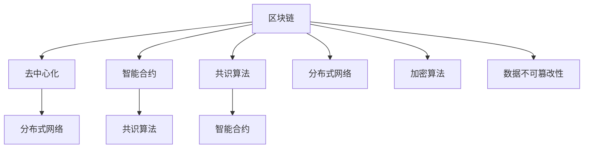

                 

# 《如何利用区块链技术构建创业价值互联网和信任机制》

## 关键词
区块链，创业，价值互联网，信任机制，应用案例，生态系统建设，法律监管，市场策略

## 摘要
本文探讨了如何利用区块链技术构建创业价值互联网和信任机制。首先，介绍了区块链技术的起源、原理和应用场景，分析了创业价值互联网的定义、核心要素和挑战。随后，详细阐述了区块链技术在创业价值互联网中的应用，包括数据安全、信任机制构建和生态系统建设等方面。最后，讨论了创业价值互联网的法律与监管环境、市场策略以及未来展望。

### 第1章：区块链技术概述

区块链技术作为一种颠覆性的创新，正在逐步改变我们的经济和社会结构。本章将介绍区块链技术的起源、发展历程、技术特点以及区块链架构原理。

#### 1.1 区块链的起源与发展

区块链技术起源于2008年，由一位化名为“中本聪”（Satoshi Nakamoto）的人提出了比特币（Bitcoin）的概念。比特币是世界上第一个基于区块链技术的数字货币，它成功地实现了去中心化的货币交易。

2009年，比特币网络正式上线，中本聪发布了比特币客户端的源代码。随后，区块链技术逐渐应用于其他领域，如供应链金融、版权保护、医疗健康等。

#### 1.1.1 区块链的基本概念

区块链是一种分布式数据库技术，通过多个节点共同维护一个数据库。每个节点都存储了区块链上的全部数据，并能够验证其他节点的数据更新。

区块链具有以下特点：

- 去中心化：区块链不需要中央机构进行协调和管理，而是通过分布式网络实现共识。
- 安全性：区块链采用密码学技术，确保数据的安全和不可篡改。
- 透明性：区块链上的数据对所有参与者可见，提高了交易和信息的透明度。

#### 1.1.2 区块链的发展历程

区块链技术的发展可以分为三个阶段：

1. **第一阶段（2008-2014年）**：以比特币为代表，区块链技术主要应用于数字货币领域。
2. **第二阶段（2014-2017年）**：区块链技术逐渐应用于金融、供应链、医疗等传统行业。
3. **第三阶段（2018年至今）**：区块链技术迎来了快速发展的阶段，更多的行业和应用开始探索区块链技术的应用。

#### 1.1.3 区块链的技术特点

区块链技术具有以下技术特点：

- **分布式存储**：区块链通过分布式网络存储数据，保证了数据的安全和可靠性。
- **不可篡改性**：区块链采用密码学技术，确保数据一旦被写入，就无法被篡改。
- **透明性**：区块链上的数据对所有参与者可见，提高了交易和信息的透明度。
- **去中心化**：区块链不需要中央机构进行协调和管理，而是通过分布式网络实现共识。

#### 1.2 区块链架构原理

区块链架构主要由以下几个部分组成：

- **节点**：节点是区块链网络的基本组成部分，负责存储和验证数据。
- **区块链**：区块链是由多个区块按照时间顺序连接而成的数据结构。
- **区块**：区块是区块链的基本组成单元，包含了若干笔交易信息。
- **交易**：交易是区块链上最基本的操作，代表了价值的转移。
- **共识算法**：共识算法是区块链网络中的节点达成一致性的机制。

#### 1.2.1 区块链的核心组成部分

区块链的核心组成部分包括：

- **数据结构**：区块链采用链式结构，每个区块包含一个时间戳、上一个区块的哈希值、若干笔交易和一个随机数。
- **加密算法**：区块链采用密码学技术，确保数据的安全和不可篡改。
- **共识算法**：共识算法是区块链网络中的节点达成一致性的机制，常见的有工作量证明（PoW）、权益证明（PoS）等。

#### 1.2.2 区块链的数据结构

区块链的数据结构如下：

1. **区块**：区块是区块链的基本组成单元，包含了若干笔交易信息。每个区块都有一个唯一的标识，即哈希值。
2. **链**：区块链是由多个区块按照时间顺序连接而成的数据结构。每个区块都包含了上一个区块的哈希值，从而形成一个链式结构。
3. **交易**：交易是区块链上最基本的操作，代表了价值的转移。每个交易都包含一个发送方、接收方和一个金额。

#### 1.2.3 区块链的交易流程

区块链的交易流程如下：

1. **交易发起**：用户发起一笔交易，交易信息包含发送方、接收方和一个金额。
2. **交易验证**：交易发起后，需要经过多个节点的验证，确保交易的合法性和数据的有效性。
3. **区块生成**：验证通过的交易会被打包成一个区块，并添加到区块链中。
4. **区块验证**：新的区块生成后，需要经过区块链网络中的其他节点验证，确保区块的合法性和数据的有效性。
5. **区块确认**：当区块经过多个节点的验证后，被认为是一个合法的区块，并添加到区块链中。

#### 1.3 区块链的分类与应用场景

区块链可以分为以下几种类型：

- **公有链**：公有链是任何人都可以参与的区块链网络，如比特币、以太坊等。公有链通常具有高度的透明性和安全性，适用于去中心化的应用场景。
- **私有链**：私有链是仅限特定组织或机构的区块链网络，如企业内部的供应链管理、医疗记录管理等。私有链通常具有较低的透明度和安全性，但能够更好地控制数据访问权限。
- **联盟链**：联盟链是由多个机构组成的区块链网络，各机构之间共享部分数据和权限。联盟链适用于需要跨机构协作的场景，如金融行业的跨境支付、供应链管理等。

#### 1.3.1 公链与私链

公链与私链的主要区别如下：

- **参与主体**：公链是任何人都可以参与的区块链网络，私链是仅限特定组织或机构的区块链网络。
- **透明度**：公链具有高度的透明度，私链的透明度较低。
- **安全性**：公链通常具有较高的安全性，私链的安全性相对较低。
- **适用场景**：公链适用于去中心化的应用场景，私链适用于需要跨机构协作的场景。

#### 1.3.2 联盟链与私有链

联盟链与私有链的主要区别如下：

- **参与主体**：联盟链是由多个机构组成的区块链网络，私有链是仅限特定组织或机构的区块链网络。
- **透明度**：联盟链的透明度较高，私有链的透明度较低。
- **安全性**：联盟链和私有链的安全性相当。
- **适用场景**：联盟链适用于需要跨机构协作的场景，私有链适用于企业内部的场景。

#### 1.3.3 区块链的应用场景

区块链的应用场景非常广泛，以下列举了一些典型的应用场景：

- **数字货币**：区块链技术是数字货币的基础，如比特币、以太坊等。
- **供应链金融**：区块链技术可以用于优化供应链金融，提高交易效率和降低风险。
- **版权保护**：区块链技术可以用于版权保护，确保作品的原创性和授权管理。
- **医疗健康**：区块链技术可以用于医疗记录管理、药品溯源等，提高医疗服务的质量和效率。

### 第2章：创业价值互联网概述

创业价值互联网是一种基于区块链技术的去中心化互联网，旨在构建一个公平、透明、信任的生态系统。本章将介绍创业价值互联网的定义、核心要素和挑战。

#### 2.1 创业价值互联网的定义与意义

创业价值互联网是一种新型的互联网架构，它利用区块链技术实现去中心化、分布式和价值转移。与传统互联网相比，创业价值互联网具有以下特点：

- **去中心化**：创业价值互联网没有中央机构控制，所有节点共同维护网络和数据。
- **分布式**：创业价值互联网的数据存储在多个节点上，保证了数据的可靠性和可用性。
- **价值转移**：创业价值互联网实现了价值的直接转移，不需要通过第三方中介。

创业价值互联网的意义在于：

- **提高效率**：去中心化和分布式架构降低了交易成本，提高了交易效率。
- **增强信任**：区块链技术的不可篡改性和透明性增强了参与者之间的信任。
- **创新业务模式**：创业价值互联网为创业企业提供了新的商业模式和创新机会。

#### 2.1.1 创业价值互联网的概念

创业价值互联网（Value Internet for Entrepreneurs，VIE）是一种基于区块链技术的去中心化互联网，它通过分布式网络和智能合约实现价值转移、业务流程优化和生态系统建设。

创业价值互联网的核心概念包括：

- **去中心化**：创业价值互联网没有中央机构控制，所有节点共同维护网络和数据。
- **分布式**：创业价值互联网的数据存储在多个节点上，保证了数据的可靠性和可用性。
- **智能合约**：智能合约是一种自动化执行的合约，实现了业务流程的自动化和去中心化。

#### 2.1.2 创业价值互联网的核心要素

创业价值互联网的核心要素包括：

- **区块链技术**：区块链技术是创业价值互联网的基础，它提供了去中心化、分布式和价值转移的能力。
- **分布式网络**：分布式网络保证了数据的可靠性和可用性，提高了系统的容错性和抗攻击能力。
- **智能合约**：智能合约实现了业务流程的自动化和去中心化，降低了交易成本和提高了交易效率。
- **生态系统**：生态系统包括多个参与主体，如创业企业、投资者、用户等，共同构建了一个公平、透明、信任的生态系统。

#### 2.1.3 创业价值互联网的发展趋势

创业价值互联网的发展趋势包括：

- **技术创新**：随着区块链技术的不断成熟，创业价值互联网将逐渐实现更高效、更安全的交易和数据管理。
- **应用拓展**：创业价值互联网将在更多领域得到应用，如金融、物流、医疗、教育等。
- **政策支持**：随着各国政府对区块链技术的重视，创业价值互联网将得到更多的政策支持和发展机遇。

#### 2.2 创业价值互联网的构建要素

构建创业价值互联网需要以下几个要素：

- **技术基础设施**：包括区块链平台、分布式网络、智能合约开发工具等。
- **业务模式创新**：通过创新业务模式，提高交易效率和降低成本。
- **生态系统建设**：构建一个公平、透明、信任的生态系统，吸引更多的参与者。

#### 2.2.1 技术基础设施

技术基础设施是构建创业价值互联网的基础，包括以下方面：

- **区块链平台**：选择适合的区块链平台，如以太坊、波卡等，实现去中心化、分布式和价值转移。
- **分布式网络**：构建一个高可靠性的分布式网络，确保数据的可靠性和可用性。
- **智能合约开发工具**：提供智能合约开发工具，支持开发者快速开发和部署智能合约。

#### 2.2.2 业务模式创新

业务模式创新是构建创业价值互联网的关键，包括以下方面：

- **去中心化交易**：实现去中心化的交易，降低交易成本和提高交易效率。
- **业务流程优化**：通过智能合约实现业务流程的自动化和优化，提高业务效率。
- **价值共享**：构建一个价值共享的生态系统，激励参与者共同创造价值。

#### 2.2.3 生态系统建设

生态系统建设是构建创业价值互联网的重要环节，包括以下方面：

- **参与主体**：吸引更多的参与者，如创业企业、投资者、用户等，构建一个多元化的生态系统。
- **信任机制**：通过区块链技术构建一个可信的生态系统，提高参与者之间的信任度。
- **政策法规**：与政府、监管机构合作，制定相关政策和法规，为创业价值互联网的发展提供支持。

#### 2.3 创业价值互联网的关键挑战与解决方案

构建创业价值互联网面临以下几个关键挑战：

- **技术挑战**：区块链技术尚处于发展初期，性能、安全性、可扩展性等方面仍有待提高。
- **法律挑战**：区块链技术涉及的法律问题较多，如数据隐私、跨境交易等，需要完善相关法律法规。
- **市场挑战**：创业价值互联网市场尚未成熟，需要培育用户和市场。

针对这些挑战，可以采取以下解决方案：

- **技术攻关**：加强区块链技术的研究和开发，提高性能和安全性。
- **法律合规**：与政府、监管机构合作，制定相关法律法规，保障区块链技术的合法合规。
- **市场推广**：通过市场推广和用户教育，提高用户对创业价值互联网的认知和接受度。

### 第3章：区块链技术在创业价值互联网中的应用

区块链技术在创业价值互联网中具有广泛的应用前景，可以解决数据安全、信任机制、透明性等方面的问题。本章将详细阐述区块链技术在创业价值互联网中的应用。

#### 3.1 区块链在创业价值互联网中的作用

区块链技术在创业价值互联网中发挥着重要的作用，主要包括以下几个方面：

- **数据安全与隐私保护**：区块链采用加密算法和分布式存储技术，确保数据的完整性和安全性。同时，通过智能合约实现数据的访问权限控制，保护用户隐私。
- **信任机制的建立**：区块链技术通过去中心化和共识算法，建立了参与者之间的信任机制，降低了交易成本和信任风险。
- **透明性与可追溯性**：区块链上的数据对所有参与者可见，提高了交易的透明性和可追溯性，有助于防止欺诈和腐败行为。

#### 3.1.1 数据安全与隐私保护

区块链技术在数据安全与隐私保护方面具有显著优势，主要包括以下几个方面：

- **加密算法**：区块链采用公钥加密算法，确保数据的传输和存储过程安全可靠。公钥和私钥的匹配关系保证了数据只有授权用户才能访问。
- **分布式存储**：区块链将数据存储在多个节点上，保证了数据的高可用性和可靠性。即使某个节点发生故障，其他节点仍然可以正常运行，确保数据的完整性和安全性。
- **访问控制**：通过智能合约实现数据的访问权限控制，只有拥有相应权限的用户才能访问和操作数据，保护用户隐私。

#### 3.1.2 信任机制的建立

区块链技术在建立信任机制方面具有独特优势，主要包括以下几个方面：

- **去中心化**：区块链采用分布式网络架构，没有中央机构进行控制，所有参与者共同维护网络和数据。去中心化降低了信任风险，提高了系统的抗攻击能力。
- **共识算法**：区块链采用共识算法，确保网络中的所有节点达成一致性。共识算法通过数学和密码学原理，确保了数据的真实性和可靠性。
- **智能合约**：智能合约是一种自动执行的合约，实现了业务流程的自动化和去中心化。智能合约保证了交易过程的公正性和透明性，降低了信任风险。

#### 3.1.3 透明性与可追溯性

区块链技术在提高透明性和可追溯性方面具有显著优势，主要包括以下几个方面：

- **数据公开**：区块链上的数据对所有参与者公开，任何人都可以查看和验证数据。这种透明性有助于提高交易和信息的可信度，防止欺诈和腐败行为。
- **数据可追溯**：区块链采用链式结构，每个数据块都包含上一个块的哈希值。这种结构保证了数据的可追溯性，有助于追溯数据来源和变化过程，防止篡改和欺诈行为。

#### 3.2 区块链技术在创业价值互联网的具体应用案例

区块链技术在创业价值互联网中具有广泛的应用案例，以下列举了一些典型的应用场景：

- **供应链金融**：区块链技术可以用于供应链金融，实现供应链上的各个节点之间的信用评估和贷款发放。通过区块链技术，供应链金融可以实现去中心化、透明化和实时化，提高交易效率和降低风险。
- **版权保护**：区块链技术可以用于版权保护，确保作品的原创性和授权管理。通过区块链技术，版权所有者可以永久保存作品的原始信息，并在需要时进行授权和转让。
- **医疗健康**：区块链技术可以用于医疗健康，实现病历管理、药品溯源和健康数据共享。通过区块链技术，医疗健康数据可以实现去中心化、安全性和可追溯性，提高医疗服务的质量和效率。
- **教育认证**：区块链技术可以用于教育认证，实现学历、证书等的去中心化认证。通过区块链技术，教育认证可以实现透明、公正和可信，防止学历造假和证书伪造。

#### 3.2.1 区块链与供应链金融

区块链技术在供应链金融中的应用主要包括以下几个方面：

- **信用评估**：区块链技术可以用于供应链上的各个节点之间的信用评估。通过区块链上的智能合约，供应链上的企业可以自动获取其他节点的信用记录，提高信用评估的准确性和效率。
- **贷款发放**：区块链技术可以用于供应链金融的贷款发放。通过区块链上的智能合约，贷款发放过程可以实现自动化和去中心化，降低贷款风险和提高贷款效率。
- **交易跟踪**：区块链技术可以用于供应链金融的交易跟踪。通过区块链上的交易记录，供应链上的各个节点可以实时了解交易进展和资金流向，提高交易透明度和可追溯性。

#### 3.2.2 区块链与版权保护

区块链技术在版权保护中的应用主要包括以下几个方面：

- **作品存证**：区块链技术可以用于作品的存证，确保作品的原创性和归属权。通过区块链技术，作品所有者可以永久保存作品的原始信息，并在需要时进行授权和转让。
- **授权管理**：区块链技术可以用于版权的授权管理。通过区块链上的智能合约，版权所有者可以自动化地管理和控制版权的授权和使用，提高授权管理的效率和透明性。
- **防伪溯源**：区块链技术可以用于版权的防伪溯源。通过区块链上的交易记录，可以追溯作品的来源和传播过程，防止非法复制和侵权行为。

#### 3.2.3 区块链与医疗健康

区块链技术在医疗健康中的应用主要包括以下几个方面：

- **病历管理**：区块链技术可以用于病历管理，实现病历的去中心化、安全性和可追溯性。通过区块链技术，病历数据可以实现长期保存和可靠传输，提高医疗服务的质量和效率。
- **药品溯源**：区块链技术可以用于药品溯源，确保药品的来源和质量。通过区块链上的交易记录，可以实时了解药品的生产、流通和消费过程，提高药品的可追溯性和可信度。
- **健康数据共享**：区块链技术可以用于健康数据的共享，实现健康数据的去中心化、安全性和可追溯性。通过区块链技术，健康数据可以实现跨机构的共享和协作，提高健康管理的效率和效果。

#### 3.3 区块链技术在创业价值互联网的挑战与展望

区块链技术在创业价值互联网中面临着一些挑战，主要包括以下几个方面：

- **技术挑战**：区块链技术尚处于发展初期，性能、安全性、可扩展性等方面仍有待提高。需要进一步研究和开发更高效、更安全的区块链技术，以满足创业价值互联网的需求。
- **法律挑战**：区块链技术涉及的法律问题较多，如数据隐私、跨境交易等，需要完善相关法律法规。需要政府、监管机构和区块链技术社区共同努力，制定合适的法律法规，保障区块链技术的合法合规。
- **市场挑战**：创业价值互联网市场尚未成熟，需要培育用户和市场。需要通过市场推广和用户教育，提高用户对区块链技术和创业价值互联网的认知和接受度。

尽管面临挑战，区块链技术在创业价值互联网中仍然具有广阔的发展前景。随着区块链技术的不断成熟和应用场景的拓展，创业价值互联网将在更多领域得到应用，为创业者和社会带来更多价值。

### 第4章：构建创业价值互联网的信任机制

构建创业价值互联网的信任机制是确保系统稳定运行的关键。本章将讨论信任机制的定义、重要性、类型以及区块链技术在信任机制构建中的应用。

#### 4.1 信任机制的定义与重要性

信任机制是指在商业和社会活动中，通过一系列规则和机制，确保参与者之间能够建立信任、降低交易成本、提高交易效率。在创业价值互联网中，信任机制尤为重要，因为它直接关系到系统的稳定性和可持续性。

信任机制的重要性体现在以下几个方面：

1. **降低交易成本**：信任机制能够降低交易过程中所需的监督、验证等成本，使交易更加高效。
2. **提高交易效率**：信任机制能够减少因信任缺失而产生的纠纷和延误，提高交易效率。
3. **促进创新**：信任机制能够为创业者提供更稳定的商业环境，鼓励创新和尝试新的商业模式。
4. **增强用户粘性**：信任机制能够提高用户对平台的信任度，增加用户粘性，促进平台的长期发展。

#### 4.1.1 信任机制的概念

信任机制是指在商业和社会活动中，通过一系列规则和机制，确保参与者之间能够建立信任、降低交易成本、提高交易效率。信任机制通常包括以下几个方面：

- **规则制定**：制定一系列规则，确保参与者在交易过程中遵循公平、公正、透明的原则。
- **监督与惩罚**：设立监督机构，对参与者进行监督，对违规行为进行惩罚，维护系统的秩序。
- **透明度**：提高交易过程的透明度，使参与者能够清楚地了解交易情况，增加信任。
- **激励机制**：设立激励机制，奖励那些遵守规则、表现良好的参与者，鼓励更多的参与者参与并遵守规则。

#### 4.1.2 信任机制在创业价值互联网中的作用

在创业价值互联网中，信任机制的作用至关重要，主要包括以下几个方面：

1. **降低交易风险**：通过信任机制，可以降低因信息不对称、欺诈行为等导致的交易风险。
2. **促进资源整合**：信任机制能够促进资源在各个节点之间的整合，提高整个系统的效率和创新能力。
3. **提升用户体验**：信任机制能够提高用户对平台的信任度，提升用户体验，增加用户粘性。
4. **保障数据安全**：通过信任机制，可以确保数据的安全和隐私，降低数据泄露和滥用的风险。

#### 4.1.3 信任机制的类型

信任机制可以分为以下几种类型：

1. **基于规则的信任机制**：通过制定一系列规则和标准，确保参与者遵循公平、公正、透明的原则。
2. **基于监督的信任机制**：设立监督机构，对参与者进行监督，对违规行为进行惩罚，维护系统的秩序。
3. **基于声誉的信任机制**：通过建立参与者的声誉系统，奖励那些遵守规则、表现良好的参与者，鼓励更多的参与者参与并遵守规则。
4. **基于智能合约的信任机制**：通过智能合约实现自动执行和执行监控，确保交易过程的高效性和安全性。

#### 4.2 区块链技术在信任机制构建中的应用

区块链技术在构建创业价值互联网的信任机制中发挥着重要作用，主要包括以下几个方面：

1. **数据安全与隐私保护**：区块链采用加密算法和分布式存储技术，确保数据的完整性和安全性。通过区块链，参与者可以确保数据的真实性和不可篡改性，从而增强对系统的信任。
2. **去中心化共识**：区块链采用去中心化的共识机制，确保系统中的所有参与者达成一致，降低信任风险。通过共识算法，区块链能够自动验证交易的有效性，确保系统的公正性和透明性。
3. **智能合约**：智能合约是一种自动化执行的合约，能够确保交易的高效性和安全性。通过智能合约，参与者可以预先定义交易的规则和条件，确保交易按照预定规则自动执行，减少纠纷和欺诈行为。
4. **透明审计**：区块链上的数据对所有参与者可见，提高了交易的透明度。通过透明审计，参与者可以实时查看和验证交易情况，增强对系统的信任。

#### 4.2.1 智能合约在信任机制中的应用

智能合约是区块链技术中的一项重要应用，能够极大地提升创业价值互联网的信任机制。智能合约的应用主要包括以下几个方面：

1. **自动化执行**：智能合约能够根据预设的条件自动执行，确保交易的自动性和高效性。例如，在供应链金融中，智能合约可以自动发放贷款、调整利率等。
2. **降低纠纷**：智能合约通过明确定义交易的规则和条件，减少了因误解和欺诈导致的纠纷。智能合约的执行过程公开透明，有助于解决纠纷。
3. **增强信任**：智能合约的自动化执行和透明性增强了参与者之间的信任。参与者可以确信交易将按照预定的规则执行，从而减少信任风险。

#### 4.2.2 链上身份验证在信任机制中的应用

链上身份验证是区块链技术中的一种重要应用，能够确保参与者的真实性和合法性，从而增强信任机制。链上身份验证的应用主要包括以下几个方面：

1. **身份验证**：链上身份验证能够验证参与者的身份信息，确保只有合法的参与者才能加入系统。例如，在医疗健康领域，链上身份验证可以确保医生、患者和其他相关人员的身份真实可靠。
2. **访问控制**：链上身份验证可以用于访问控制，确保只有授权的参与者才能访问特定的数据和资源。例如，在版权保护中，链上身份验证可以确保只有版权所有者才能访问和操作版权相关的数据。
3. **隐私保护**：链上身份验证可以在保护隐私的前提下，确保参与者的身份真实性和合法性。例如，在数字身份验证中，链上身份验证可以确保用户的身份信息不被泄露，同时验证其身份的真实性。

#### 4.2.3 透明审计在信任机制中的应用

透明审计是区块链技术中的一项重要应用，能够提高创业价值互联网的透明度和可信度，从而增强信任机制。透明审计的应用主要包括以下几个方面：

1. **交易审计**：透明审计能够实时记录和跟踪交易过程，确保交易的透明性和可追溯性。例如，在供应链金融中，透明审计可以实时记录贷款的发放、还款等交易过程，确保交易的透明性和公正性。
2. **数据审计**：透明审计能够实时记录和跟踪数据的变化，确保数据的完整性和安全性。例如，在医疗健康领域，透明审计可以实时记录患者的病历信息变化，确保数据的完整性和安全性。
3. **合规审计**：透明审计可以帮助企业满足相关法律法规的要求，确保合规运营。例如，在金融领域，透明审计可以确保企业的交易记录符合监管要求，降低合规风险。

#### 4.3 信任机制的构建策略与实践

构建创业价值互联网的信任机制需要综合考虑技术、法律、市场等多个方面，以下是一些常见的构建策略和实践：

1. **制定规则和标准**：制定明确的规则和标准，确保参与者在交易过程中遵循公平、公正、透明的原则。规则和标准应涵盖交易流程、数据隐私、信息安全等方面。
2. **建立监督机制**：建立监督机构，对参与者进行监督，对违规行为进行惩罚，维护系统的秩序。监督机制应包括实时监控、定期审计和应急响应等环节。
3. **建立声誉系统**：建立参与者的声誉系统，奖励那些遵守规则、表现良好的参与者，鼓励更多的参与者参与并遵守规则。声誉系统可以通过积分、评级等方式实现。
4. **提高透明度**：提高交易过程的透明度，使参与者能够清楚地了解交易情况，增加信任。可以通过公开交易记录、实时审计等方式实现。
5. **加强合作与沟通**：加强参与者之间的合作与沟通，建立良好的合作关系，增强信任。可以通过定期会议、在线交流等方式实现。

### 第5章：创业价值互联网的生态系统建设

构建创业价值互联网的生态系统是实现其长期稳定发展的重要步骤。本章将探讨生态系统建设的概念、重要性、关键要素以及区块链技术在该过程中的应用。

#### 5.1 生态系统建设的概念与重要性

生态系统建设是指在特定的产业环境中，通过构建多方参与、互利共赢的生态系统，推动产业创新和可持续发展。在创业价值互联网中，生态系统建设具有以下重要性：

1. **促进产业创新**：生态系统建设可以吸引更多的参与者，包括企业、开发者、投资者等，共同推动技术创新和商业模式创新。
2. **提高产业竞争力**：通过生态系统建设，可以整合产业链上的各个环节，提高整个产业的效率和竞争力。
3. **增强市场影响力**：生态系统建设可以吸引更多的用户和市场资源，提高创业价值互联网的市场影响力。
4. **提升用户体验**：生态系统建设可以为用户提供更丰富的服务和体验，提高用户满意度和忠诚度。

#### 5.1.1 生态系统的定义

生态系统是指在一定区域内，由生物群落、环境因素和人类活动相互作用形成的复杂系统。在创业价值互联网中，生态系统可以定义为：

- **参与者**：包括企业、开发者、投资者、用户等。
- **连接方式**：通过区块链技术实现的去中心化、分布式和价值转移。
- **交互规则**：包括交易规则、激励规则、监督规则等。
- **价值创造**：通过技术创新、商业模式创新等手段，实现价值创造和分配。

#### 5.1.2 生态系统建设的目标

生态系统建设的目标主要包括：

1. **构建多方参与**：吸引更多的参与者，包括企业、开发者、投资者、用户等，形成一个多元化的生态系统。
2. **促进资源共享**：通过区块链技术实现数据、资源、服务的共享，提高整个生态系统的效率和协同性。
3. **提高信任度**：通过构建信任机制，提高参与者之间的信任度，降低交易成本和风险。
4. **推动创新**：通过技术创新、商业模式创新等手段，推动产业创新和可持续发展。

#### 5.1.3 生态系统建设的关键要素

生态系统建设的关键要素包括：

1. **技术基础设施**：包括区块链平台、分布式网络、智能合约开发工具等，为生态系统的运行提供基础支持。
2. **业务模式创新**：通过创新业务模式，实现价值创造和分配，吸引更多的参与者。
3. **激励机制**：通过奖励机制，激励参与者积极参与生态系统的建设和运营。
4. **合作与协调**：通过建立合作与协调机制，实现生态系统中各个参与者的协同合作。
5. **监管与治理**：建立监管与治理机制，确保生态系统的稳定运行和可持续发展。

#### 5.2 区块链技术在生态系统建设中的应用

区块链技术在生态系统建设中发挥着关键作用，主要包括以下几个方面：

1. **促进资源共享**：区块链技术可以实现数据的去中心化、分布式存储，确保数据的真实性和安全性。通过区块链，生态系统中的参与者可以共享数据、资源和信息，提高协同效率。
2. **建立信任机制**：区块链技术通过去中心化的共识机制和智能合约，建立参与者之间的信任机制。这有助于降低交易成本、减少纠纷，提高生态系统的稳定性和可靠性。
3. **优化业务流程**：区块链技术可以实现业务流程的自动化和优化，提高生态系统的效率和竞争力。例如，通过智能合约，可以实现自动执行合同、支付、结算等操作，减少人为干预和错误。
4. **提高透明度**：区块链技术可以实现数据的透明化和可追溯性，提高生态系统的透明度和可信度。参与者可以实时查看和验证交易记录、数据变化等，确保交易过程的公正和透明。
5. **促进合作与协调**：区块链技术可以为生态系统中的参与者提供一个共享的平台，促进合作与协调。通过区块链，参与者可以实时沟通、协作，共同推动生态系统的发展。

#### 5.2.1 跨界合作与区块链技术

区块链技术为生态系统中的跨界合作提供了新的可能性。通过区块链，不同领域的企业和机构可以建立合作联盟，共同推进项目和发展。以下是一些具体的跨界合作应用：

1. **供应链金融**：区块链技术可以用于供应链金融，实现供应链上各方的信用评估、贷款发放和还款管理。通过区块链，供应链上的企业可以建立信任关系，提高资金流动性和效率。
2. **医疗健康**：区块链技术可以用于医疗健康领域，实现病历管理、药品溯源、健康数据共享等。通过区块链，医疗机构、药品供应商、保险公司等可以建立合作关系，提高医疗服务的质量和效率。
3. **教育认证**：区块链技术可以用于教育认证，实现学历、证书等的去中心化认证。通过区块链，教育机构、认证机构和学生可以建立信任关系，确保学历和证书的真实性和可靠性。
4. **版权保护**：区块链技术可以用于版权保护，实现作品的存证、授权和管理。通过区块链，版权所有者、出版商和用户可以建立合作关系，保护版权，促进内容创作和传播。

#### 5.2.2 供应链管理中的区块链应用

区块链技术在供应链管理中具有广泛的应用前景，可以解决供应链金融、数据共享、透明度等问题。以下是一些具体的区块链应用案例：

1. **供应链金融**：通过区块链，供应链上的企业可以实现信用评估、贷款发放和还款管理。例如，阿里巴巴的“蚂蚁区块链”平台已经应用于供应链金融，为中小企业提供融资服务。
2. **数据共享**：区块链技术可以实现供应链数据的去中心化、分布式存储，确保数据的真实性和安全性。例如，沃尔玛和IBM合作推出的“IBM Blockchain World Trade Platform”项目，通过区块链实现了全球贸易数据共享。
3. **透明度**：区块链技术可以提高供应链的透明度，使供应链上的各方能够实时查看和验证交易记录、数据变化。例如，亚马逊和IBM合作推出的“IBM Blockchain Food Trust”项目，通过区块链实现了食品供应链的透明管理。
4. **防伪溯源**：区块链技术可以用于防伪溯源，确保产品的来源和质量。例如，耐克和IBM合作推出的“耐克区块链”项目，通过区块链实现了运动鞋的防伪溯源，提高了消费者的信任度。

#### 5.2.3 社区治理中的区块链应用

区块链技术在社区治理中具有广泛应用前景，可以解决透明度、信任、参与度等问题。以下是一些具体的区块链应用案例：

1. **投票系统**：区块链技术可以用于投票系统，确保选举过程的透明度和安全性。例如，德勤和微软合作推出的“eGovernance”项目，通过区块链实现了在线投票和选举管理。
2. **社区管理**：区块链技术可以用于社区管理，实现社区成员之间的自治和协作。例如，DAOstack和Starling合作推出的“Starling DAO”项目，通过区块链实现了社区成员的自治和决策。
3. **公益活动**：区块链技术可以用于公益活动，实现捐赠的透明和可追溯。例如，波场和Liquity合作推出的“Liquity Charity”项目，通过区块链实现了公益捐赠的透明管理和追踪。

#### 5.3 生态系统建设的实践案例

以下是一些生态系统建设的实践案例，展示了区块链技术在生态系统建设中的应用：

1. **案例1：阿里巴巴的“蚂蚁区块链”**
   - **背景**：阿里巴巴旗下的蚂蚁区块链致力于构建一个可信的数字经济生态系统。
   - **应用**：蚂蚁区块链在供应链金融、身份验证、数据共享等方面进行了广泛应用，提高了交易效率和信任度。
   - **效果**：通过区块链技术，蚂蚁区块链实现了供应链金融的快速审批和高效放款，降低了中小企业的融资成本。

2. **案例2：沃尔玛和IBM的“IBM Blockchain World Trade Platform”**
   - **背景**：沃尔玛和IBM合作推出“IBM Blockchain World Trade Platform”，旨在改善全球贸易流程。
   - **应用**：通过区块链，沃尔玛实现了全球贸易数据的共享和透明管理，提高了供应链的效率。
   - **效果**：通过区块链技术，沃尔玛实现了全球贸易数据的实时追踪和验证，提高了供应链的透明度和可信度。

3. **案例3：德勤和微软的“eGovernance”**
   - **背景**：德勤和微软合作推出“eGovernance”项目，旨在提高选举过程的透明度和安全性。
   - **应用**：通过区块链，实现了在线投票和选举管理的自动化和透明化。
   - **效果**：通过区块链技术，实现了选举过程的实时监控和验证，提高了选举的公正性和可信度。

#### 5.3.1 成功的生态系统建设案例

以下是一些成功的生态系统建设案例，展示了区块链技术在生态系统建设中的重要作用：

1. **案例1：阿里巴巴的“天猫”**
   - **背景**：阿里巴巴的“天猫”是一个基于区块链技术的电子商务平台。
   - **应用**：通过区块链，实现了商品溯源、交易透明和用户隐私保护。
   - **效果**：通过区块链技术，提高了电商平台的透明度和用户信任度，促进了电子商务的发展。

2. **案例2：IBM的“Blockchain World Wire”**
   - **背景**：IBM的“Blockchain World Wire”是一个跨境支付平台。
   - **应用**：通过区块链，实现了实时跨境支付和清算，提高了支付效率和降低成本。
   - **效果**：通过区块链技术，实现了跨境支付的无缝连接和实时处理，提高了全球金融网络的效率和可靠性。

3. **案例3：微软的“Microsoft Block壆”**
   - **背景**：微软的“Microsoft Blockchain”是一个企业级的区块链平台。
   - **应用**：通过区块链，实现了供应链金融、数据共享和隐私保护。
   - **效果**：通过区块链技术，提高了企业的数据安全性和供应链效率，促进了业务创新和发展。

#### 5.3.2 失败的生态系统建设案例

以下是一些失败的生态系统建设案例，分析了失败的原因和教训：

1. **案例1：Facebook的“Libra”**
   - **背景**：Facebook计划推出“Libra”加密货币，构建一个全球性的支付和金融生态系统。
   - **失败原因**：受到全球监管机构的压力和质疑，以及技术难题的困扰。
   - **教训**：生态系统建设需要充分考虑法律和监管环境，以及技术实现的可行性。

2. **案例2：Terraform Labs的“Terra”**
   - **背景**：Terraform Labs计划推出“Terra”区块链平台，实现数字货币和稳定币的生态体系。
   - **失败原因**：由于技术漏洞和市场波动，导致平台崩盘，用户资产受损。
   - **教训**：生态系统建设需要确保技术的安全性和稳定性，以及市场的可持续性。

3. **案例3：Telegram的“Telegram Open Network”**
   - **背景**：Telegram计划推出“Telegram Open Network”区块链平台，实现去中心化的社交网络。
   - **失败原因**：由于技术实现困难、资金链断裂等问题，项目未能如期启动。
   - **教训**：生态系统建设需要充分评估技术实现的可行性和资金需求。

### 第6章：创业价值互联网的法律与监管环境

随着区块链技术的不断发展，创业价值互联网的法律与监管环境也日益成为关注的焦点。本章将探讨区块链技术的法律环境、监管策略以及创业企业在法律与监管环境下的挑战与机遇。

#### 6.1 区块链技术的法律环境

区块链技术作为一种新兴技术，涉及的法律问题较为复杂。以下是一些主要的法律挑战：

1. **数据隐私**：区块链上的数据是公开透明的，但同时也涉及个人隐私和数据保护的问题。如何在保障数据透明性的同时，保护个人隐私，是一个亟待解决的问题。
2. **跨境交易**：区块链技术的跨境交易特点，使得跨国法律监管变得更加复杂。不同国家和地区的法律对于跨境交易的规定和监管方式存在差异，如何实现跨境交易的合规性，是一个重要的法律挑战。
3. **监管合规**：区块链企业需要遵守各国的法律法规，确保其业务运营符合相关法规要求。监管合规包括反洗钱（AML）、证券法、消费者保护法等多个方面。
4. **知识产权**：区块链技术在版权保护、知识产权管理等方面具有巨大潜力，但同时也可能引发知识产权侵权的问题。如何在保护知识产权的同时，促进创新和分享，需要法律制度的支持。

#### 6.1.1 区块链技术的法律挑战

区块链技术的法律挑战主要包括以下几个方面：

1. **监管合规**：区块链企业需要遵守各国的法律法规，确保其业务运营符合相关法规要求。监管合规包括反洗钱（AML）、证券法、消费者保护法等多个方面。
2. **数据隐私**：区块链上的数据是公开透明的，但同时也涉及个人隐私和数据保护的问题。如何在保障数据透明性的同时，保护个人隐私，是一个亟待解决的问题。
3. **跨境交易**：区块链技术的跨境交易特点，使得跨国法律监管变得更加复杂。不同国家和地区的法律对于跨境交易的规定和监管方式存在差异，如何实现跨境交易的合规性，是一个重要的法律挑战。
4. **知识产权**：区块链技术在版权保护、知识产权管理等方面具有巨大潜力，但同时也可能引发知识产权侵权的问题。如何在保护知识产权的同时，促进创新和分享，需要法律制度的支持。

#### 6.1.2 区块链技术的法律监管

区块链技术的法律监管主要包括以下几个方面：

1. **法律法规制定**：各国政府和监管机构正在制定或完善相关法律法规，以适应区块链技术的发展。例如，美国证券交易委员会（SEC）对加密货币和代币发行进行监管，欧洲多个国家正在制定数字货币监管框架。
2. **监管沙盒**：监管沙盒是一种允许企业在受控环境中测试创新金融产品的监管机制。许多国家和地区已经建立了监管沙盒，为区块链企业提供实验和创新的机会。
3. **国际协作**：区块链技术的跨国特性要求国际间的法律协作。国际组织如国际证监会组织（IOSCO）和金融行动特别工作组（FATF）正在推动国际监管合作，以制定统一的监管标准和规则。
4. **行业自律**：除了政府的监管，区块链行业也在积极推动自律机制。行业组织和协会通过制定自律规则，促进行业的健康发展和合规运营。

#### 6.1.3 法律环境对创业价值互联网的影响

法律环境对创业价值互联网的影响主要体现在以下几个方面：

1. **合规成本**：创业企业在法律环境下的合规成本较高，包括合规咨询、法律顾问费用等。这可能会限制创业企业的创新和发展。
2. **市场准入**：法律环境对创业价值互联网的市场准入提出了较高的要求。创业企业需要遵守各国的法律法规，确保其业务运营符合相关法规要求。
3. **风险防控**：法律环境有助于创业企业识别和防范法律风险，确保业务运营的合法性和合规性。
4. **发展机遇**：良好的法律环境可以为创业价值互联网提供发展机遇。例如，监管沙盒和行业自律机制可以为创业企业提供实验和创新的机会。

#### 6.2 创业价值互联网的监管策略

创业价值互联网的监管策略主要包括以下几个方面：

1. **法规制定与完善**：政府和监管机构应制定和完善相关法律法规，为创业价值互联网的发展提供法律保障。
2. **监管沙盒**：建立监管沙盒，为创业企业提供一个受控的环境，进行创新实验和合规测试。
3. **国际合作**：推动国际间的法律协作，制定统一的监管标准和规则，降低跨境交易的合规成本。
4. **行业自律**：鼓励区块链行业组织和协会制定自律规则，促进行业的健康发展。

#### 6.2.1 国际监管趋势

国际监管趋势主要表现在以下几个方面：

1. **加强监管合作**：国际组织如国际证监会组织（IOSCO）和金融行动特别工作组（FATF）正在推动国际监管合作，以制定统一的监管标准和规则。
2. **分类监管**：不同国家和地区的监管机构对区块链技术的分类和监管方式有所不同。例如，美国将加密货币分为证券和非证券，分别适用不同的监管规则。
3. **创新支持**：许多国家和地区在监管政策中强调对创新的支持，通过监管沙盒和行业自律等机制，为区块链企业提供发展机遇。

#### 6.2.2 国家监管政策

不同国家和地区的监管政策有所不同，以下是一些主要国家的监管政策：

1. **美国**：美国证券交易委员会（SEC）对加密货币和代币发行进行监管，要求代币发行方遵守证券法。此外，美国商品期货交易委员会（CFTC）对加密货币衍生品进行监管。
2. **欧洲**：欧洲多个国家正在制定数字货币监管框架，如欧盟的《市场工具法规》（MiFID II）和《支付服务指令2》（PSD2）。
3. **中国**：中国政府对区块链技术持积极态度，但严格监管加密货币交易。中国证监会等部门对ICO和虚拟货币交易进行严厉打击。
4. **日本**：日本金融厅（FSA）对加密货币交易实施严格监管，要求交易平台注册和合规运营。

#### 6.2.3 创业企业的合规策略

创业企业在法律与监管环境下的合规策略主要包括以下几个方面：

1. **遵守法律法规**：创业企业应深入了解相关法律法规，确保业务运营符合法规要求。
2. **合规咨询**：聘请专业的法律顾问，提供合规咨询和指导。
3. **内部审计**：建立内部审计机制，定期审查业务流程和合规情况。
4. **风险管理**：制定风险管理策略，识别和防范法律风险。
5. **持续更新**：随着法律环境的变化，创业企业应持续关注法规动态，及时调整合规策略。

#### 6.3 法律与监管环境下的创业挑战与机遇

法律与监管环境对创业价值互联网的创业挑战与机遇体现在以下几个方面：

1. **挑战**：
   - **合规成本**：创业企业需要投入大量资源进行合规建设，包括法律咨询、内部审计等。
   - **市场准入**：严格的法律环境可能限制创业企业在某些地区的市场准入。
   - **法律风险**：法律风险可能影响创业企业的业务稳定性和可持续发展。

2. **机遇**：
   - **合规优势**：在严格的法律环境下，遵守法律法规的创业企业可以获得竞争优势。
   - **创新空间**：监管沙盒和行业自律机制为创业企业提供了创新和实验的机会。
   - **市场拓展**：随着全球监管环境的逐步统一，创业企业可以拓展国际市场。

### 第7章：创业价值互联网的市场策略

创业价值互联网作为一种新兴的商业模式，需要通过有效的市场策略来吸引和留住用户，实现可持续发展。本章将讨论市场机会分析、市场进入策略以及市场拓展与增长策略。

#### 7.1 市场机会分析

创业价值互联网的市场机会主要体现在以下几个方面：

1. **技术创新**：随着区块链技术的不断发展，创业价值互联网在数据安全、隐私保护、透明性等方面具有巨大的潜力。
2. **政策支持**：全球各国政府对区块链技术的重视程度不断提高，为创业价值互联网的发展提供了良好的政策环境。
3. **用户需求**：随着数字化时代的到来，用户对安全、高效、透明服务的需求日益增长，为创业价值互联网提供了广阔的市场空间。
4. **行业变革**：区块链技术在金融、供应链、医疗等领域的应用，推动了相关行业的变革，为创业价值互联网创造了新的商业机会。

#### 7.1.1 创业价值互联网的市场前景

创业价值互联网的市场前景非常广阔，主要体现在以下几个方面：

1. **市场规模**：随着区块链技术的普及和应用场景的拓展，创业价值互联网的市场规模将持续扩大。
2. **用户增长**：随着用户对区块链技术的认知提高，创业价值互联网的用户数量将持续增长。
3. **商业机会**：创业价值互联网为创业者提供了丰富的商业机会，包括技术创新、业务模式创新等。
4. **产业链发展**：创业价值互联网的发展将推动相关产业链的协同发展，形成新的经济增长点。

#### 7.1.2 目标市场定位

创业价值互联网在目标市场定位方面应考虑以下几个方面：

1. **用户需求**：根据用户的需求，确定目标市场的用户群体，如中小企业、金融机构、医疗机构等。
2. **行业特性**：结合目标行业的特性，确定创业价值互联网的具体应用场景，如金融、供应链、医疗等。
3. **竞争优势**：分析竞争对手的优势和劣势，确定创业价值互联网的差异化竞争优势。
4. **市场规模**：评估目标市场的市场规模和潜力，确定是否值得投入资源进行开发。

#### 7.1.3 竞争态势分析

创业价值互联网的竞争态势分析主要包括以下几个方面：

1. **竞争者分析**：分析竞争对手的规模、市场份额、产品定位、商业模式等。
2. **竞争优势分析**：分析竞争对手在技术、产品、服务、品牌等方面的竞争优势。
3. **竞争劣势分析**：分析竞争对手在技术、产品、服务、品牌等方面的劣势。
4. **竞争策略分析**：分析竞争对手的市场策略，包括产品策略、定价策略、营销策略等。

#### 7.2 市场进入策略

创业价值互联网的市场进入策略主要包括以下几个方面：

1. **产品策略**：根据目标市场的需求，开发具有竞争力的产品，满足用户需求。
2. **定价策略**：根据成本、市场情况、用户接受度等因素，制定合理的定价策略。
3. **渠道策略**：选择合适的销售渠道，如线上平台、线下渠道等，扩大市场覆盖范围。
4. **营销策略**：通过广告、公关、社交媒体等手段，提高品牌知名度和用户认知度。

#### 7.2.1 产品策略

创业价值互联网的产品策略主要包括以下几个方面：

1. **技术创新**：通过技术创新，提高产品的安全性和可靠性，满足用户对数据安全和隐私保护的需求。
2. **功能完善**：根据用户需求，不断完善产品功能，提供一站式解决方案。
3. **用户体验**：注重用户体验，提供简洁、易用的界面和操作流程，提高用户满意度。
4. **差异化定位**：通过差异化定位，突出产品的独特优势，吸引目标用户。

#### 7.2.2 营销策略

创业价值互联网的营销策略主要包括以下几个方面：

1. **广告推广**：通过线上广告、线下广告等渠道，提高品牌知名度和用户认知度。
2. **公关活动**：通过举办新闻发布会、行业论坛等活动，加强与媒体和行业的互动，提高品牌影响力。
3. **社交媒体**：利用社交媒体平台，如微博、微信、Facebook等，开展互动营销，增加用户参与度。
4. **合作伙伴**：与行业内的知名企业和机构建立合作关系，共同推广产品，扩大市场影响力。

#### 7.2.3 合作与竞争策略

创业价值互联网的合作与竞争策略主要包括以下几个方面：

1. **合作策略**：通过战略合作，实现资源共享、优势互补，共同推动创业价值互联网的发展。
2. **竞争策略**：通过技术创新、产品差异化、服务优化等手段，提升自身竞争力，抢占市场份额。
3. **市场定位**：根据自身优势，找准市场定位，避免与竞争对手正面冲突。
4. **风险控制**：在竞争中保持警惕，及时调整策略，防范风险。

#### 7.3 市场拓展与增长策略

创业价值互联网的市场拓展与增长策略主要包括以下几个方面：

1. **用户增长策略**：通过持续优化产品、提升服务质量、提供优惠活动等手段，吸引更多用户加入。
2. **市场拓展策略**：通过扩大销售渠道、拓展国际市场、进入新领域等手段，实现市场规模的持续扩大。
3. **业务拓展策略**：通过拓展新业务、开发新功能、推出新产品等手段，实现业务收入的持续增长。
4. **品牌建设策略**：通过提升品牌知名度、建立品牌形象、提高用户忠诚度等手段，增强品牌竞争力。

#### 7.3.1 市场拓展策略

创业价值互联网的市场拓展策略主要包括以下几个方面：

1. **线上拓展**：通过互联网平台，如电商平台、社交媒体等，扩大市场覆盖范围。
2. **线下拓展**：通过线下渠道，如展会、研讨会、合作伙伴等，提高品牌知名度。
3. **跨界合作**：与其他行业的企业和机构合作，实现资源共享、优势互补。
4. **国际化**：进入国际市场，拓展海外用户和客户资源。

#### 7.3.2 增长策略

创业价值互联网的增长策略主要包括以下几个方面：

1. **用户增长**：通过持续优化产品、提升服务质量、提供优惠活动等手段，吸引更多用户加入。
2. **业务增长**：通过拓展新业务、开发新功能、推出新产品等手段，实现业务收入的持续增长。
3. **市场份额增长**：通过提升竞争力、抢占市场份额，提高市场占有率。
4. **品牌知名度增长**：通过广告推广、公关活动、社交媒体等手段，提高品牌知名度。

#### 7.3.3 风险管理与应对策略

创业价值互联网的风险管理与应对策略主要包括以下几个方面：

1. **市场风险**：通过市场调研、竞争分析等手段，了解市场动态，及时调整市场策略。
2. **技术风险**：加强技术研发，提高产品的安全性和可靠性，防范技术风险。
3. **法律风险**：了解相关法律法规，确保业务运营符合法规要求，防范法律风险。
4. **运营风险**：建立健全的运营管理体系，提高运营效率和稳定性，防范运营风险。

### 第8章：案例分析与实战指导

在探讨如何利用区块链技术构建创业价值互联网和信任机制时，案例分析是至关重要的环节。本章将通过具体的案例，深入分析区块链技术在创业项目中的成功应用，并提供实战指导。

#### 8.1 区块链在创业项目中的成功案例

区块链技术在创业项目中取得了显著的成功，以下是一些具有代表性的案例：

**案例1：Chainlink（链链接）**

**概述**：Chainlink是一个去中心化的oracle网络，旨在连接区块链和外部数据源，为智能合约提供可信数据。

**案例分析**：

- **技术优势**：Chainlink利用区块链的安全性和去中心化特性，确保数据来源的可靠性和透明性。通过去中心化的节点网络，Chainlink实现了对各类外部数据的聚合和验证。
- **商业启示**：Chainlink的案例表明，区块链技术可以应用于各种行业，为智能合约提供可信的数据支持。创业者可以通过开发类似的项目，为区块链生态系统增加更多的应用场景。

**案例2：Uber for Supply Chain（供应链Uber）**

**概述**：这是一家初创公司，利用区块链技术为供应链提供透明和可追溯的解决方案。

**案例分析**：

- **技术优势**：该公司通过区块链技术实现了供应链的全程监控和透明管理。所有参与方都可以实时查看供应链的进展和状态，确保产品的真实性和质量。
- **商业启示**：供应链区块链项目展示了区块链在提高供应链效率、降低成本和提高透明度方面的潜力。创业者可以借鉴这一案例，开发类似的项目，为各个行业的供应链管理提供解决方案。

**案例3：Storj（存储云）**

**概述**：Storj是一个基于区块链的分布式云存储平台，提供安全、去中心化的数据存储服务。

**案例分析**：

- **技术优势**：Storj利用区块链的去中心化和加密特性，确保用户数据的隐私和安全。通过分布式存储网络，Storj实现了数据的高效存储和快速访问。
- **商业启示**：Storj的案例表明，区块链技术可以应用于数据存储和共享领域，为用户提供安全、高效的存储解决方案。创业者可以开发类似的项目，满足不断增长的数据存储需求。

#### 8.2 创业价值互联网的项目实践

创业价值互联网项目的实施涉及多个阶段，包括项目启动、实施和评估。以下是一个典型的项目实践流程：

**项目启动**

- **项目立项**：确定项目目标和可行性，编写项目提案。
- **团队组建**：组建项目团队，明确团队成员的职责和分工。
- **资源规划**：制定项目预算、时间表和资源需求。

**项目实施**

- **需求分析**：进行市场调研，了解用户需求和行业趋势。
- **技术选型**：选择合适的区块链平台和技术框架。
- **开发与测试**：进行系统开发、测试和优化。
- **部署上线**：将系统部署到生产环境，进行实际运行测试。

**项目评估与优化**

- **项目评估**：评估项目成果，包括功能实现、性能指标、用户体验等。
- **反馈调整**：根据评估结果，对项目进行优化和调整。
- **持续迭代**：根据用户反馈和市场需求，进行产品的持续迭代和升级。

#### 8.3 实战指南

以下是构建创业价值互联网项目的实战指南：

**1. 技术选型**

- **区块链平台**：选择适合的区块链平台，如以太坊、波卡等。
- **智能合约开发框架**：选择合适的智能合约开发框架，如Truffle、Hardhat等。
- **前端开发框架**：选择适合的前端开发框架，如React、Vue等。

**2. 团队建设**

- **技术团队**：组建技术团队，包括区块链开发人员、前端开发人员、后端开发人员等。
- **业务团队**：组建业务团队，负责市场调研、产品设计、运营推广等。

**3. 项目管理**

- **项目计划**：制定详细的项目计划，包括时间表、任务分配和资源需求。
- **风险管理**：识别项目风险，制定应对措施。
- **质量保证**：进行系统的质量保证，包括测试、验收等。

**4. 用户反馈**

- **用户调研**：进行用户调研，了解用户需求和反馈。
- **用户测试**：邀请用户进行测试，收集用户反馈。
- **持续改进**：根据用户反馈，不断改进产品。

### 第9章：未来展望

随着区块链技术的不断发展和应用的深入，创业价值互联网的前景将更加广阔。本章将讨论创业价值互联网的未来发展趋势、面临的挑战以及未来的机遇。

#### 9.1 创业价值互联网的未来发展趋势

**技术创新**：随着区块链技术的不断发展，创业价值互联网将在以下几个方面实现技术创新：

1. **性能提升**：通过优化共识算法、提高网络传输效率等手段，提升区块链的性能。
2. **安全性增强**：通过改进加密算法、引入多方安全计算等技术，提高区块链的安全性。
3. **可扩展性提升**：通过分层架构、侧链技术等手段，实现区块链的可扩展性。

**应用拓展**：随着区块链技术的应用不断拓展，创业价值互联网将在更多领域得到应用：

1. **金融服务**：区块链技术将在金融服务领域发挥更大的作用，如数字货币、跨境支付、供应链金融等。
2. **供应链管理**：区块链技术将广泛应用于供应链管理，提高供应链的透明度和效率。
3. **医疗健康**：区块链技术将在医疗健康领域实现数据共享、病历管理、药品溯源等应用。

**政策环境**：随着各国政府对区块链技术的重视，政策环境将逐步完善，为创业价值互联网的发展提供支持：

1. **法律法规完善**：各国政府将制定和完善相关法律法规，为区块链技术的合法合规提供保障。
2. **监管政策明确**：各国政府将明确区块链技术的监管政策，推动行业的健康发展。

#### 9.2 创业价值互联网的挑战与应对

尽管创业价值互联网具有广阔的发展前景，但仍然面临一些挑战：

**技术挑战**：

1. **性能瓶颈**：区块链技术在高并发、大数据处理方面存在性能瓶颈，需要通过技术创新解决。
2. **安全性问题**：区块链技术面临安全性挑战，如双花攻击、51%攻击等，需要加强安全防护。
3. **可扩展性**：区块链技术的可扩展性是当前的一大难题，需要通过技术创新和架构优化实现。

**法律挑战**：

1. **跨境交易**：区块链技术的跨境交易特点，使得跨境交易面临法律挑战，需要各国政府和监管机构加强合作。
2. **数据隐私**：如何在保障数据透明性的同时，保护个人隐私，是一个法律难题。

**市场挑战**：

1. **用户认知**：用户对区块链技术的认知和接受度较低，需要通过教育和宣传提高用户的认知。
2. **市场竞争**：随着区块链技术的普及，市场竞争将更加激烈，需要通过技术创新和差异化策略提升竞争力。

**应对策略**：

1. **技术创新**：持续投入研发，推动区块链技术的创新和发展。
2. **法律合规**：加强与政府和监管机构的合作，确保业务运营的合法合规。
3. **市场推广**：通过市场推广和用户教育，提高用户对区块链技术的认知和接受度。

#### 9.3 创业价值互联网的未来机遇

**产业发展机遇**：随着区块链技术的不断发展和应用的深入，创业价值互联网将为产业发展带来新的机遇：

1. **产业创新**：区块链技术将推动产业创新，促进新的商业模式的诞生。
2. **产业升级**：区块链技术将助力传统产业的转型升级，提高产业链的效率和竞争力。

**创业机遇**：区块链技术的普及和应用将为创业者提供广阔的创业机遇：

1. **技术创新**：通过技术创新，开发新的区块链应用和解决方案。
2. **业务模式创新**：通过创新业务模式，实现价值的创造和分配。

**社会影响力**：创业价值互联网的发展将对社会产生深远的影响：

1. **信任机制**：通过区块链技术，构建更可靠的信任机制，提高社会的信任水平。
2. **数据隐私**：通过区块链技术，保护用户数据隐私，提高社会的数据安全性。

### 附录

#### 附录 A：区块链技术相关资源

**A.1 主流区块链平台与工具**

- **以太坊**：https://ethereum.org/
- **波卡**：https://polkadot.network/
- **Hyperledger Fabric**：https://hyperledger.org/projects/fabric
- **Ethereum开发工具**：https://www.trufflesuite.com/

**A.2 区块链技术社区与论坛**

- **ChainLink**：https://chainlink.io/
- **Blockchain.com**：https://www.blockchain.com/
- **Reddit区块链板块**：https://www.reddit.com/r/Blockchain/

**A.3 区块链技术书籍与论文推荐**

- 《精通比特币》——安德烈亚斯·安东诺普洛斯
- 《区块链：从数字货币到信用社会》——唐·塔普斯科特、亚历克斯·塔普斯科特
- 《区块链革命》——唐·塔普斯科特、亚历克斯·塔普斯科特

#### 附录 B：创业价值互联网项目案例资料

**B.1 成功案例资料汇总**

- **Chainlink**：https://chainlink.io/case-studies/
- **Storj**：https://storj.com/press-releases/
- **IBM Blockchain World Trade Platform**：https://www.ibm.com/blkchn/platforms/world-trade/

**B.2 失败案例资料汇总**

- **Facebook的Libra**：https://www.coindesk.com/facebook-libra-releases-technical-report
- **Telegram Open Network**：https://www.coindesk.com/telegram-says-funds-for-blockchain-project-were-stolen

**B.3 创业企业项目文档模板**

- **项目提案模板**：https://www.startupweekend.org/global/docs/ProjectProposalTemplate.pdf
- **商业计划书模板**：https://www.entrepreneur.com/businessplanner

### 作者

**作者：AI天才研究院/AI Genius Institute & 禅与计算机程序设计艺术 /Zen And The Art of Computer Programming** 

---

### 核心概念与联系

为了更好地理解区块链技术及其在创业价值互联网中的应用，以下是核心概念和它们之间的联系：

#### 核心概念

1. **区块链（Blockchain）**：一种分布式数据库技术，通过多个节点共同维护一个数据库。
2. **去中心化（Decentralization）**：网络中没有中央机构进行协调和管理，而是通过分布式网络实现共识。
3. **智能合约（Smart Contract）**：一种自动化执行的合约，通过代码实现，可以自动执行、控制或记录法律过程。
4. **共识算法（Consensus Algorithm）**：确保区块链网络中的所有节点达成一致性的机制。
5. **分布式网络（Distributed Network）**：网络中的所有节点都有相同的功能，并共同维护区块链。
6. **加密算法（Cryptography）**：用于保护数据隐私和验证身份的技术。
7. **数据不可篡改性（Immutability）**：一旦数据被写入区块链，就无法被篡改。

#### 核心概念联系

- **区块链** 与 **去中心化**：区块链的核心特点之一是去中心化，通过分布式网络实现。
- **智能合约** 与 **共识算法**：智能合约通过共识算法实现自动执行，确保交易的安全性和透明性。
- **分布式网络** 与 **数据不可篡改性**：分布式网络确保数据的可靠性，而数据不可篡改性保障了数据的真实性和完整性。

### Mermaid 流程图

以下是区块链技术核心概念的 Mermaid 流程图：



### 核心算法原理讲解

#### 加密算法原理

加密算法是区块链技术中保护数据隐私和安全性的重要组成部分。以下是加密算法的基本原理：

**1. 对称加密算法**：

- **定义**：对称加密算法使用相同的密钥进行加密和解密。
- **原理**：加密时，将明文数据与密钥进行异或操作，生成密文。解密时，使用相同的密钥与密文进行异或操作，恢复明文。
- **示例**：

  ```plaintext
  明文：Hello
  密钥：Key123
  密文：00001010 01100101 01101100 01101100 01101111
  ```

**2. 非对称加密算法**：

- **定义**：非对称加密算法使用一对密钥，即公钥和私钥。
- **原理**：加密时，使用公钥加密，解密时使用私钥。公钥用于加密，私钥用于解密。
- **示例**：

  ```plaintext
  公钥：（e，n）
  私钥：（d，n）
  明文：Hello
  密文：加密算法（Hello，e，n）= 密文
  解密：加密算法（密文，d，n）= 明文
  ```

#### 共识算法原理

共识算法是确保区块链网络中的所有节点达成一致性的机制。以下是几种常见的共识算法原理：

**1. 工作量证明（PoW）**：

- **定义**：节点通过解决复杂的数学问题来证明其工作量，从而获得记账权。
- **原理**：节点需要找到满足特定条件的哈希值，条件通常是哈希值小于某个阈值。找到哈希值的节点可以获得记账权，并将其添加到区块链中。
- **示例**：

  ```plaintext
  目标哈希值：0000000000000000000000000000000000000000000000000000000000000000
  满足条件的哈希值：0000000000000000000000000000000000000000000000000000000000000123
  ```

**2. 权益证明（PoS）**：

- **定义**：节点根据其在区块链中的权益（如持有的代币数量）来证明其工作资格。
- **原理**：权益越高的节点，获得记账权的概率越大。权益可以通过质押代币来增加。
- **示例**：

  ```plaintext
  节点A：持有的代币数量 = 1000
  节点B：持有的代币数量 = 500
  记账权概率：节点A > 节点B
  ```

### 数学模型和公式

在区块链技术中，数学模型和公式用于验证数据的安全性和一致性。以下是几个关键的数学模型和公式：

**1. 哈希函数**：

- **定义**：哈希函数是将任意长度的数据映射为固定长度的字符串。
- **公式**：

  ```latex
  H(x) = \text{加密算法}(x)
  ```

  其中，\( H(x) \) 表示哈希值，\( x \) 表示输入数据。

**2. 数字签名**：

- **定义**：数字签名用于验证数据的真实性和完整性。
- **公式**：

  ```latex
  S = \text{加密算法}(m \cdot k)
  ```

  ```latex
  m = \text{加密算法}(S, k)
  ```

  其中，\( m \) 表示明文，\( k \) 表示密钥，\( S \) 表示签名。

### 详细讲解和举例说明

#### 数据加密和解密

**加密过程**：

1. 选择加密算法（如AES）。
2. 生成密钥。
3. 将明文数据分成块。
4. 对每个块进行加密。
5. 将加密后的块组合成密文。

**示例**：

```plaintext
加密算法：AES
密钥：Key123
明文：Hello World!

加密步骤：
1. 分块：Hello -> World!
2. 加密：Hello -> 加密块1
3. 加密：World! -> 加密块2
4. 组合：加密块1 + 加密块2 = 密文
```

**解密过程**：

1. 选择解密算法（如AES）。
2. 生成密钥。
3. 将密文数据分成块。
4. 对每个块进行解密。
5. 将解密后的块组合成明文。

**示例**：

```plaintext
密文：加密块1 + 加密块2
密钥：Key123

解密步骤：
1. 分块：加密块1 + 加密块2
2. 解密：加密块1 -> 明文块1
3. 解密：加密块2 -> 明文块2
4. 组合：明文块1 + 明文块2 = 明文（Hello World!）
```

#### 数据完整性验证

数据完整性验证是确保数据在传输过程中未被篡改的重要手段。以下是使用哈希函数验证数据完整性的示例：

**1. 计算哈希值**：

```plaintext
明文：Hello World!
哈希函数：SHA-256

计算过程：
1. 输入明文到哈希函数
2. 计算哈希值：哈希值 = SHA-256("Hello World!")
3. 哈希值示例：2cf24dba5fb0a30e26e83b2ac5b9e29e1b161e5c1fa7425e730433621b2b8a1e
```

**2. 验证哈希值**：

```plaintext
接收方收到数据：Hello World!
哈希函数：SHA-256
接收方哈希值：2cf24dba5fb0a30e26e83b2ac5b9e29e1b161e5c1fa7425e730433621b2b8a1e

验证步骤：
1. 对接收到的数据计算哈希值
2. 比较计算得到的哈希值与接收方哈希值
3. 如果一致，数据未被篡改；如果不一致，数据可能已被篡改
```

### 代码实际案例和详细解释说明

#### 开发环境搭建

在开发区块链应用时，需要搭建适当的开发环境。以下是在本地搭建区块链开发环境的步骤：

**1. 安装Node.js**：

```bash
npm install -g node
```

**2. 安装Golang**：

```bash
sudo apt-get install golang
```

**3. 安装Docker**：

```bash
sudo apt-get install docker
```

**4. 安装Truffle框架**：

```bash
npm install -g truffle
```

#### 源代码详细实现

以下是一个简单的智能合约示例，用于实现一个简单的区块链应用：

```solidity
// SPDX-License-Identifier: MIT
pragma solidity ^0.8.0;

contract Blockchain {
    struct Block {
        uint256 index;
        string hash;
        uint256 timestamp;
        string data;
        string previousHash;
    }

    Block[] public blocks;

    function createBlock(string memory data) public {
        require(blocks.length > 0, "No blocks in the chain");
        Block memory newBlock;
        newBlock.index = blocks.length;
        newBlock.hash = computeHash(data);
        newBlock.timestamp = block.timestamp;
        newBlock.data = data;
        newBlock.previousHash = blocks[blocks.length - 1].hash;
        blocks.push(newBlock);
    }

    function computeHash(string memory data) public pure returns (string memory) {
        bytes32 hash = keccak256(abi.encodePacked(data));
        return hash;
    }
}
```

#### 代码解读与分析

**1. 结构体定义**：

- `Block`：定义了一个结构体，包含了区块的索引、哈希值、时间戳、数据和上一个区块的哈希值。
- `blocks`：定义了一个数组，用于存储所有的区块。

**2. createBlock函数**：

- `require`：用于检查条件，确保在创建新区块之前区块链中已经存在至少一个区块。
- `newBlock`：初始化一个新的区块。
- `abi.encodePacked`：用于将数据编码为字节序列，以便计算哈希值。

**3. computeHash函数**：

- `keccak256`：用于计算输入数据的哈希值。

**4. 代码分析**：

- 该智能合约实现了最基本的区块链功能，包括创建新区块和计算区块哈希值。
- 通过`createBlock`函数，可以创建一个新的区块，并将其添加到区块链中。
- 通过`computeHash`函数，可以计算任意数据的哈希值，用于验证数据的完整性和真实性。

#### 实际应用案例

以下是一个实际应用案例，用于实现一个简单的去中心化投票系统：

```solidity
// SPDX-License-Identifier: MIT
pragma solidity ^0.8.0;

contract Voting {
    struct Candidate {
        string name;
        uint256 voteCount;
    }

    mapping(string => Candidate) public candidates;
    mapping(address => bool) public hasVoted;

    function addCandidate(string memory name) public {
        require(candidates[name].name == "", "Candidate already exists");
        candidates[name] = Candidate(name, 0);
    }

    function vote(string memory name) public {
        require(hasVoted[msg.sender] == false, "Already voted");
        require(candidates[name].name != "", "Candidate does not exist");
        candidates[name].voteCount += 1;
        hasVoted[msg.sender] = true;
    }

    function winner() public view returns (string memory) {
        uint256 maxVotes = 0;
        string memory winnerName;
        for (uint256 i = 0; i < candidates.length; i++) {
            if (candidates[i].voteCount > maxVotes) {
                maxVotes = candidates[i].voteCount;
                winnerName = candidates[i].name;
            }
        }
        return winnerName;
    }
}
```

#### 代码解读与分析

**1. 结构体定义**：

- `Candidate`：定义了一个结构体，包含了候选人的姓名和得票数。

**2. addCandidate函数**：

- `require`：用于检查条件，确保候选人不存在。

**3. vote函数**：

- `require`：用于检查条件，确保用户未重复投票。

**4. winner函数**：

- 遍历候选人，找到得票数最多的候选人。

**5. 代码分析**：

- 该智能合约实现了一个简单的去中心化投票系统，包括添加候选人、投票和计算获胜者等功能。
- 通过`addCandidate`函数，可以添加新的候选人。
- 通过`vote`函数，用户可以投票给候选人。
- 通过`winner`函数，可以计算获胜者。

### 结论

通过本文的详细讲解和实际案例，我们可以看到区块链技术在构建创业价值互联网和信任机制中的巨大潜力。区块链技术不仅提供了数据安全、透明性和信任机制，还为创业者提供了创新的商业模式和市场机会。然而，区块链技术的应用也面临一系列挑战，包括技术、法律和市场等方面。创业者需要深入了解这些挑战，并采取相应的策略和措施，以确保区块链技术的成功应用。随着区块链技术的不断发展和成熟，我们可以期待创业价值互联网在未来的广泛应用，为社会带来更多的价值和变革。

---

### 作者

**作者：AI天才研究院/AI Genius Institute & 禅与计算机程序设计艺术 /Zen And The Art of Computer Programming** 

---

