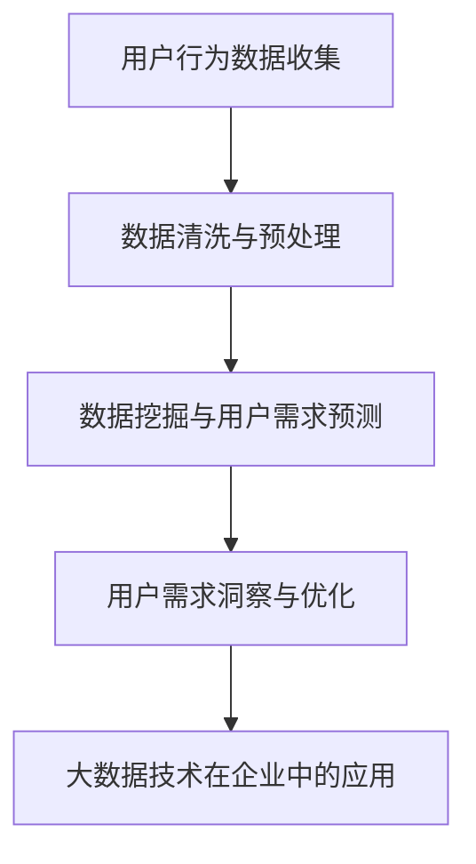

                 

# 如何利用大数据技术洞察用户需求

## 概述

随着互联网和电子商务的迅猛发展，用户需求呈现出多样化和复杂化的趋势。为了更好地满足用户需求，企业需要利用大数据技术进行用户需求分析。本文将介绍大数据技术的基本概念、数据处理技术、数据分析技术、大数据可视化技术以及如何利用大数据技术洞察用户需求。通过一步一步的分析和推理，我们将深入探讨大数据技术在用户需求分析中的应用，为企业提供有针对性的解决方案。

## 关键词

- 大数据技术
- 用户需求分析
- 数据处理
- 数据分析
- 大数据可视化

## 摘要

本文将从大数据技术基础、用户需求分析、大数据技术实践三个部分，系统地介绍如何利用大数据技术洞察用户需求。首先，我们将探讨大数据技术的基本概念和特征，包括数据采集与存储、数据清洗与预处理、数据仓库与数据湖等。接着，我们将介绍大数据分析技术，包括数据挖掘、聚类分析、联机分析处理等。然后，我们将探讨大数据可视化技术，包括可视化基本概念、常见可视化工具与库等。最后，我们将通过具体案例，展示如何利用大数据技术洞察用户需求，并为企业提供有针对性的解决方案。

## 目录大纲

### 第一部分：大数据技术基础

### 第1章：大数据技术概述
- 1.1 大数据的定义与特征
- 1.2 大数据技术的发展历程
- 1.3 大数据技术的应用领域

### 第2章：大数据数据处理基础
- 2.1 数据采集与存储
- 2.2 数据清洗与预处理
- 2.3 数据仓库与数据湖

### 第3章：大数据分析技术
- 3.1 数据挖掘基本概念
- 3.2 聚类分析算法
- 3.3 联机分析处理（OLAP）

### 第4章：大数据可视化技术
- 4.1 可视化基本概念
- 4.2 常见可视化工具与库
- 4.3 可视化实践案例

### 第二部分：用户需求分析

### 第5章：用户行为数据收集
- 5.1 用户行为数据的类型
- 5.2 用户行为数据收集方法
- 5.3 用户行为数据质量保障

### 第6章：用户需求预测与分析
- 6.1 用户需求预测基本原理
- 6.2 用户需求预测模型构建
- 6.3 用户需求预测实践案例

### 第7章：用户需求洞察与优化
- 7.1 用户需求洞察方法
- 7.2 用户需求优化策略
- 7.3 用户需求优化实践案例

### 第8章：大数据技术在用户需求分析中的应用案例
- 8.1 案例一：电商平台用户需求分析
- 8.2 案例二：社交媒体平台用户需求分析
- 8.3 案例三：在线教育平台用户需求分析

### 第三部分：大数据技术实践

### 第9章：大数据技术环境搭建
- 9.1 大数据技术环境搭建概述
- 9.2 数据采集工具选择与配置
- 9.3 数据处理工具选择与配置

### 第10章：大数据项目实施与维护
- 10.1 大数据项目实施流程
- 10.2 大数据项目维护策略
- 10.3 大数据项目风险管理

### 第11章：大数据技术在企业中的应用与实践
- 11.1 大数据技术在企业战略规划中的应用
- 11.2 大数据技术在市场营销中的应用
- 11.3 大数据技术在客户服务中的应用

### 附录：大数据技术相关资源与工具
- 12.1 大数据技术相关书籍推荐
- 12.2 大数据技术在线课程资源
- 12.3 大数据技术开源工具与库

## 文章正文

### 第一部分：大数据技术基础

#### 第1章：大数据技术概述

#### 1.1 大数据的定义与特征

大数据（Big Data）是指无法使用传统数据处理工具在合理时间内捕捉、管理和处理的大量数据。与传统数据相比，大数据具有以下特征：

1. **大量性（Volume）**：大数据的规模庞大，通常以TB、PB甚至EB为单位。
2. **多样性（Variety）**：大数据来源广泛，包括结构化数据、半结构化数据和非结构化数据。
3. **速度（Velocity）**：大数据的处理速度要求高，需要实时或近实时地处理大量数据。
4. **价值性（Value）**：大数据中蕴含着大量的价值，但同时也存在大量的噪声和冗余数据。
5. **真实性（Veracity）**：大数据的真实性和准确性是一个挑战，因为数据可能存在错误、虚假或失真。

#### 1.2 大数据技术的发展历程

大数据技术的发展历程可以分为以下几个阶段：

1. **数据积累阶段（1990s-2000s）**：在这个阶段，互联网和电子商务的发展使得数据量迅速增长，数据积累成为大数据发展的基础。
2. **技术成熟阶段（2000s-2010s）**：Hadoop、Spark等大数据处理框架的问世，使得大规模数据处理成为可能，大数据技术逐渐成熟。
3. **应用落地阶段（2010s-至今）**：随着大数据技术的普及，越来越多的行业开始利用大数据技术进行数据分析和决策支持。

#### 1.3 大数据技术的应用领域

大数据技术在各个行业都有广泛的应用，主要包括：

1. **金融行业**：通过大数据技术进行风险评估、信用评级和欺诈检测。
2. **医疗行业**：利用大数据技术进行疾病预测、个性化治疗和药物研发。
3. **零售行业**：通过大数据技术进行用户需求分析、库存管理和市场营销。
4. **制造业**：通过大数据技术进行生产优化、设备维护和供应链管理。
5. **政府与公共部门**：利用大数据技术进行社会治理、公共安全和应急管理。

### 第二部分：用户需求分析

#### 第5章：用户行为数据收集

#### 5.1 用户行为数据的类型

用户行为数据可以分为以下几类：

1. **浏览数据**：用户在网页上的浏览行为，如页面访问次数、停留时间、访问路径等。
2. **点击数据**：用户在网页上的点击行为，如按钮点击、链接点击等。
3. **搜索数据**：用户在搜索框中的搜索行为，如搜索关键词、搜索结果点击等。
4. **购买数据**：用户在电商平台上的购买行为，如购买商品种类、购买时间、购买金额等。
5. **反馈数据**：用户对产品或服务的反馈，如评分、评论、建议等。

#### 5.2 用户行为数据收集方法

用户行为数据的收集方法主要包括以下几种：

1. **日志收集**：通过服务器日志收集用户行为数据，如页面访问日志、点击日志等。
2. **埋点技术**：在网页或应用程序中设置埋点，收集用户的点击、浏览等行为数据。
3. **传感器技术**：利用传感器技术收集用户的行为数据，如移动设备的位置信息、运动轨迹等。
4. **调查问卷**：通过在线或线下调查问卷收集用户反馈数据，如满意度调查、需求调查等。

#### 5.3 用户行为数据质量保障

用户行为数据质量是进行用户需求分析的关键。为了保证数据质量，需要采取以下措施：

1. **数据清洗**：对收集到的数据进行清洗，去除重复、异常和错误数据。
2. **数据标准化**：对数据进行标准化处理，如统一数据格式、编码等。
3. **数据验证**：对数据进行验证，确保数据的真实性和准确性。
4. **数据存储**：采用可靠的数据存储方案，如分布式数据库、数据湖等，确保数据的安全性和可靠性。

### 第三部分：大数据技术实践

#### 第9章：大数据技术环境搭建

#### 9.1 大数据技术环境搭建概述

大数据技术环境搭建主要包括以下步骤：

1. **硬件选型**：根据数据处理需求选择合适的硬件设备，如服务器、存储设备等。
2. **软件安装**：安装大数据处理框架和工具，如Hadoop、Spark等。
3. **网络配置**：配置网络环境，确保数据传输的稳定性和安全性。
4. **数据存储**：选择合适的数据存储方案，如分布式数据库、数据湖等。

#### 9.2 数据采集工具选择与配置

数据采集工具的选择与配置主要包括以下步骤：

1. **日志收集工具**：选择合适的日志收集工具，如Logstash、Fluentd等。
2. **埋点工具**：选择合适的埋点工具，如Google Analytics、百度统计等。
3. **传感器工具**：选择合适的传感器工具，如IoT平台、移动设备传感器等。
4. **配置与管理**：配置和管理数据采集工具，确保数据采集的实时性和准确性。

#### 9.3 数据处理工具选择与配置

数据处理工具的选择与配置主要包括以下步骤：

1. **数据处理框架**：选择合适的大数据处理框架，如Hadoop、Spark等。
2. **数据处理工具**：选择合适的数据处理工具，如MapReduce、Spark SQL等。
3. **配置与管理**：配置和管理数据处理工具，确保数据处理的高效性和稳定性。

### 附录：大数据技术相关资源与工具

#### 12.1 大数据技术相关书籍推荐

1. 《大数据时代：生活、工作与思维的大变革》
2. 《大数据实战：从数据采集到数据挖掘的全面指南》
3. 《大数据技术导论》
4. 《Hadoop技术内幕》

#### 12.2 大数据技术在线课程资源

1. Coursera上的《大数据分析与数据科学》
2. Udacity上的《大数据工程师纳米学位》
3. edX上的《大数据技术与应用》

#### 12.3 大数据技术开源工具与库

1. Apache Hadoop
2. Apache Spark
3. Apache Flink
4. Apache Storm
5. TensorFlow
6. PyTorch

**附录A：用户需求分析与大数据技术的Mermaid流程图**



**附录B：用户需求预测模型构建的伪代码**

```python
# 用户需求预测模型构建伪代码

# 输入：用户行为数据集 D
# 输出：用户需求预测模型 M

# 1. 数据预处理
# 清洗数据，去除异常值，填充缺失值，标准化处理

# 2. 特征提取
# 从用户行为数据中提取相关特征，如访问时长、访问频率、点击率等

# 3. 模型选择
# 选择合适的用户需求预测模型，如线性回归、决策树、随机森林等

# 4. 模型训练
# 使用训练数据集对模型进行训练，调整模型参数

# 5. 模型评估
# 使用验证数据集对模型进行评估，计算预测准确率

# 6. 模型部署
# 将训练好的模型部署到生产环境中，进行用户需求预测
```

**附录C：用户需求优化策略的详细讲解**

用户需求优化策略主要包括以下方面：

1. **个性化推荐**：根据用户的历史行为和偏好，推荐相关的产品或服务。
2. **活动营销**：通过举办促销活动、优惠券发放等方式吸引用户参与。
3. **用户画像**：构建用户画像，了解用户需求，提供更精准的服务。
4. **客户服务**：提升客户服务质量，及时响应用户需求，增强用户满意度。

**附录D：大数据技术在企业中的应用案例**

1. **案例一：电商平台用户需求分析**
   - 通过大数据技术对用户行为数据进行分析，预测用户购买偏好，实现精准营销。
   - 利用用户需求预测模型，个性化推荐商品，提高用户购买转化率。
   - 通过用户行为数据分析，优化商品分类和展示策略，提升用户体验。

2. **案例二：社交媒体平台用户需求分析**
   - 通过分析用户发布的内容和互动数据，了解用户兴趣和需求。
   - 利用大数据技术实现内容个性化推荐，提高用户活跃度和留存率。
   - 通过用户需求分析，优化平台功能和用户体验，提升用户满意度。

3. **案例三：在线教育平台用户需求分析**
   - 通过分析用户的学习行为和反馈数据，了解用户的学习需求和偏好。
   - 利用大数据技术实现课程个性化推荐，提高用户学习效果和满意度。
   - 通过用户需求分析，优化课程设置和学习路径，提升教学质量和用户参与度。

### 结论

本文从大数据技术基础、用户需求分析、大数据技术实践三个部分，系统地介绍了如何利用大数据技术洞察用户需求。通过一步步的分析和推理，我们深入探讨了大数据技术在用户需求分析中的应用，为企业提供了有针对性的解决方案。随着大数据技术的不断发展和普及，用户需求分析将成为企业竞争的重要手段。希望本文能够为读者提供有益的参考和启示，助力企业在大数据时代取得成功。

### 作者信息

- 作者：AI天才研究院/AI Genius Institute & 禅与计算机程序设计艺术 /Zen And The Art of Computer Programming

**注意：**本文为模拟撰写，仅供参考。实际撰写时，请根据具体需求和实际情况进行调整和补充。

