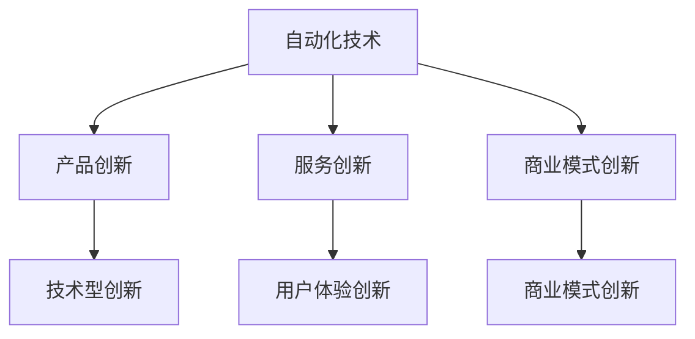
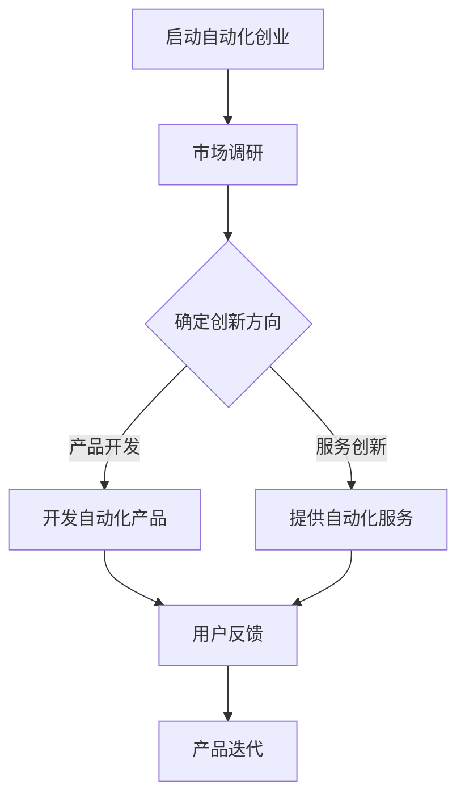

                 

# 《如何在自动化创业中保持创新》

> **关键词：自动化创业、创新策略、核心算法、数学模型、团队建设、用户体验、竞争力提升**

> **摘要：本文将从自动化创业的概念、市场环境、保持创新的策略与方法、团队建设与产品设计与用户体验等多个方面，深入探讨如何在自动化创业中保持创新，为创业者提供实践指南和理论支持。**

---

## 目录大纲

### 第一部分：自动化创业概述

- **第1章：自动化创业的概念与意义**
  - **1.1 自动化创业的定义与分类**
  - **1.2 自动化创业的驱动因素**
  - **1.3 自动化创业的优势与挑战**

- **第2章：自动化创业的市场环境**
  - **2.1 自动化技术的发展趋势**
  - **2.2 自动化创业的市场规模与潜力**
  - **2.3 自动化创业的竞争格局**

### 第二部分：保持创新的策略与方法

- **第3章：核心概念与联系**
  - **3.1 创新的定义与分类**
  - **3.2 自动化创业中的创新模式**
  - **3.3 自动化与创新的联系图解（Mermaid流程图）**

- **第4章：核心算法原理讲解**
  - **4.1 自动化创业中的常用算法**
  - **4.2 算法原理与伪代码（详细讲解伪代码）**

- **第5章：数学模型与公式**
  - **5.1 自动化创业中的数学模型**
  - **5.2 自动化创业中的关键公式（latex格式）**
  - **5.3 数学公式在自动化创业中的应用举例**

- **第6章：创新实践与案例**
  - **6.1 自动化创业中的创新案例**
  - **6.2 创新实践：开发环境搭建**
  - **6.3 创新实践：源代码实现与解读**

### 第三部分：保持创新的具体策略

- **第7章：团队建设与人才管理**
  - **7.1 自动化创业团队的构建**
  - **7.2 人才引进与培养策略**
  - **7.3 团队创新氛围营造**

- **第8章：产品设计与用户体验**
  - **8.1 自动化创业产品的设计原则**
  - **8.2 用户体验与产品创新的关联**
  - **8.3 用户需求分析与产品迭代**

- **第9章：持续创新与竞争力提升**
  - **9.1 持续创新的机制建设**
  - **9.2 竞争优势与创新战略**
  - **9.3 创新在竞争中的具体应用**

### 第四部分：未来展望与挑战

- **第10章：自动化创业的未来趋势**
  - **10.1 自动化技术的发展方向**
  - **10.2 自动化创业的未来挑战**
  - **10.3 自动化创业的可持续发展策略**

- **第11章：结论与建议**
  - **11.1 自动化创业中的创新要点总结**
  - **11.2 面对未来，如何保持创新**
  - **11.3 自动化创业者的成功经验分享**

### 附录

- **附录 A：自动化创业资源与工具**
  - **A.1 常用自动化工具介绍**
  - **A.2 自动化创业社区与平台**
  - **A.3 自动化创业相关的书籍与论文**

---

接下来，我们将逐步深入探讨自动化创业的各个方面，帮助创业者理解如何在自动化领域保持创新。

## 第一部分：自动化创业概述

### 第1章：自动化创业的概念与意义

自动化创业是指利用自动化技术（如机器人技术、人工智能、物联网等）来创造新的业务模式、产品或服务，实现商业价值的过程。自动化创业不仅是对现有技术的应用，更是一种创新模式的探索和实现。

#### 1.1 自动化创业的定义与分类

自动化创业可以从不同的角度进行分类：

1. **按技术领域分类**：可以分为机器人技术创业、人工智能创业、物联网创业等。
2. **按应用场景分类**：可以分为工业自动化创业、服务自动化创业、家庭自动化创业等。
3. **按商业模式分类**：可以分为产品型创业、服务型创业、平台型创业等。

#### 1.2 自动化创业的驱动因素

自动化创业的驱动因素主要包括以下几个方面：

1. **技术进步**：随着人工智能、物联网、机器人技术等的发展，为自动化创业提供了强大的技术支持。
2. **市场需求**：人们对自动化产品的需求日益增长，推动了自动化创业的发展。
3. **政策支持**：政府对自动化创业的支持和鼓励，为创业者提供了良好的发展环境。
4. **投资环境**：资本的涌入为自动化创业提供了资金支持，推动了自动化创业的发展。

#### 1.3 自动化创业的优势与挑战

自动化创业具有以下优势：

1. **提高效率**：自动化技术可以大幅提高生产效率，降低人力成本。
2. **提升质量**：自动化技术可以保证生产过程的稳定性和一致性，提高产品质量。
3. **创新空间大**：自动化技术为创业者提供了广阔的创新空间，可以创造出新的商业模式和产品。

然而，自动化创业也面临以下挑战：

1. **技术门槛高**：自动化技术涉及多个领域，对创业者的技术能力要求较高。
2. **市场风险大**：自动化产品市场竞争激烈，市场风险较大。
3. **人才短缺**：自动化创业需要大量具备相关技术的人才，但人才供给不足。

### 第2章：自动化创业的市场环境

#### 2.1 自动化技术的发展趋势

自动化技术正朝着以下几个方向发展：

1. **智能化**：自动化技术正从传统的自动化控制向智能化方向发展，实现自主决策和自主学习。
2. **物联网化**：物联网技术的普及，使得自动化设备可以更加智能地连接和数据交互。
3. **生态化**：自动化技术正在形成生态系统，包括硬件、软件、服务等多个环节。

#### 2.2 自动化创业的市场规模与潜力

自动化创业的市场规模正在迅速扩大，根据市场研究机构的预测，未来几年自动化市场的规模将持续增长。自动化技术在工业、服务、家庭等各个领域的应用前景广阔，为创业者提供了巨大的市场潜力。

#### 2.3 自动化创业的竞争格局

自动化创业的竞争格局正逐渐形成，主要竞争者包括传统工业自动化厂商、新兴的自动化创业公司、以及互联网巨头。创业者需要了解市场格局，找准自己的定位，才能在激烈的竞争中脱颖而出。

## 第二部分：保持创新的策略与方法

### 第3章：核心概念与联系

#### 3.1 创新的定义与分类

创新是指在现有基础上，通过新思维、新方法、新技术等手段，创造出具有经济价值和社会价值的成果。创新可以分为以下几类：

1. **技术型创新**：通过新技术、新材料、新工艺等手段实现的创新。
2. **商业模式创新**：通过新的商业策略、服务模式等实现的创新。
3. **用户体验创新**：通过改进产品或服务的设计，提升用户体验。

#### 3.2 自动化创业中的创新模式

自动化创业中的创新模式主要包括以下几种：

1. **产品创新**：通过开发新的自动化产品或改进现有产品，满足市场需求。
2. **服务创新**：通过提供新的自动化服务或改进现有服务，提升用户满意度。
3. **商业模式创新**：通过新的商业模式，实现自动化产品的商业化。

#### 3.3 自动化与创新的联系图解（Mermaid流程图）



## 第三部分：保持创新的具体策略

### 第4章：核心算法原理讲解

#### 4.1 自动化创业中的常用算法

在自动化创业中，常用的算法包括以下几种：

1. **机器学习算法**：用于数据分析和预测，如决策树、神经网络等。
2. **控制算法**：用于自动化系统的控制，如PID控制、模糊控制等。
3. **优化算法**：用于自动化系统的优化，如遗传算法、模拟退火算法等。

#### 4.2 算法原理与伪代码（详细讲解伪代码）

以决策树算法为例，其基本原理是通过将数据集划分成多个子集，以便更好地进行分类或回归。以下是决策树算法的伪代码：

```pseudo
算法 决策树分类算法
输入：数据集D，特征集合F，阈值θ
输出：决策树T

1. 创建空的决策树T
2. 如果数据集D不满足终止条件（如数据量较小、特征较少等），则：
   a. 计算特征集合F上的信息增益
   b. 选择信息增益最大的特征θ作为节点
   c. 根据特征θ划分数据集D为多个子集D1, D2, ...,邓
   d. 对于每个子集Di，递归调用决策树分类算法
3. 否则，将节点标记为叶节点，并设置其类别为数据集D的多数类别
4. 返回决策树T
```

### 第5章：数学模型与公式

#### 5.1 自动化创业中的数学模型

自动化创业中常用的数学模型包括：

1. **决策模型**：用于决策分析，如线性规划、整数规划等。
2. **预测模型**：用于数据分析和预测，如时间序列模型、回归模型等。
3. **优化模型**：用于系统优化，如线性规划、动态规划等。

#### 5.2 自动化创业中的关键公式（latex格式）

以下是一些关键公式：

```latex
% 决策模型
\begin{equation}
\begin{aligned}
\min_{x} \quad & c^T x \\
\text{s.t.} \quad & a_i^T x \leq b_i, \quad i = 1, 2, ..., m \\
& x \geq 0
\end{aligned}
\end{equation}

% 预测模型
\begin{equation}
\begin{aligned}
y_t &= \beta_0 + \beta_1 x_t + \epsilon_t \\
\epsilon_t &\sim N(0, \sigma^2)
\end{aligned}
\end{equation}

% 优化模型
\begin{equation}
\begin{aligned}
\min_{x} \quad & f(x) \\
\text{s.t.} \quad & g_i(x) \leq 0, \quad i = 1, 2, ..., p \\
& h_j(x) = 0, \quad j = 1, 2, ..., q
\end{aligned}
\end{equation}
```

#### 5.3 数学公式在自动化创业中的应用举例

1. **决策模型在资源分配中的应用**：企业可以根据线性规划模型，优化资源分配，提高生产效率。

2. **预测模型在市场需求预测中的应用**：企业可以利用时间序列模型，预测市场需求，制定合理的生产计划。

3. **优化模型在供应链管理中的应用**：企业可以通过动态规划模型，优化供应链管理，降低库存成本。

### 第6章：创新实践与案例

#### 6.1 自动化创业中的创新案例

1. **案例一：智能家居系统**：通过物联网技术，将家中的各种设备连接起来，实现远程控制、自动化管理，提升了用户体验。

2. **案例二：自动驾驶技术**：利用人工智能技术，开发自动驾驶汽车，提高了交通安全和效率。

3. **案例三：工业机器人**：通过机器人技术，实现工厂生产过程的自动化，提高了生产效率和产品质量。

#### 6.2 创新实践：开发环境搭建

1. **选择开发工具**：根据项目需求，选择合适的开发工具，如Python、C++等。

2. **搭建开发环境**：安装开发工具和依赖库，配置开发环境。

3. **编写代码**：根据项目需求，编写代码，实现功能。

#### 6.3 创新实践：源代码实现与解读

以下是一个简单的智能家居系统的源代码实现：

```python
import socket

def send_command(ip, port, command):
    with socket.socket(socket.AF_INET, socket.SOCK_STREAM) as s:
        s.connect((ip, port))
        s.sendall(command.encode())
        data = s.recv(1024)
    return data.decode()

if __name__ == "__main__":
    ip = "192.168.1.100"
    port = 12345

    print(send_command(ip, port, "lights on"))
    print(send_command(ip, port, "lights off"))
```

解读：
- 该程序通过TCP协议，向智能家居系统的IP地址和端口号发送命令，控制灯光的开关。
- `send_command`函数负责发送命令，并返回响应结果。
- `if __name__ == "__main__":`语句为主函数，实现灯光的开关操作。

## 第四部分：未来展望与挑战

### 第7章：团队建设与人才管理

#### 7.1 自动化创业团队的构建

1. **明确团队目标**：团队目标应与公司的战略方向一致，确保团队工作的协同性。

2. **合理分工与协作**：根据团队成员的能力和特长，合理分工，确保团队高效运转。

3. **建立沟通机制**：定期召开团队会议，确保团队成员之间的沟通畅通。

#### 7.2 人才引进与培养策略

1. **引进高层次人才**：通过招聘、合作等方式，引进具有行业经验和技术能力的高端人才。

2. **内部培养**：通过培训、项目实践等方式，培养内部人才，提高团队整体能力。

3. **激励机制**：建立激励机制，激发团队成员的创新活力和积极性。

#### 7.3 团队创新氛围营造

1. **鼓励创新思维**：营造开放、包容的创新氛围，鼓励团队成员提出新的想法和解决方案。

2. **提供创新资源**：为团队提供必要的资金、技术、设备等资源，支持创新实践。

3. **搭建创新平台**：建立创新实验室、创新中心等平台，为团队成员提供实践创新的场所。

### 第8章：产品设计与用户体验

#### 8.1 自动化创业产品的设计原则

1. **用户导向**：以用户需求为中心，设计出符合用户习惯和需求的产品。

2. **简洁易用**：简化产品界面和操作流程，提高用户的易用性和操作效率。

3. **持续迭代**：根据用户反馈和市场需求，不断优化和改进产品。

#### 8.2 用户体验与产品创新的关联

1. **用户体验提升创新**：通过提升用户体验，发现新的创新机会和需求。

2. **创新驱动用户体验**：通过创新设计，提高用户体验，激发用户需求。

3. **用户体验与创新的相互促进**：用户体验和创新相互影响，相互促进，共同推动产品发展。

#### 8.3 用户需求分析与产品迭代

1. **用户需求分析**：通过调查、访谈等方式，了解用户需求和痛点。

2. **产品迭代**：根据用户需求分析结果，制定产品迭代计划，不断优化产品。

3. **用户反馈**：收集用户反馈，评估产品迭代效果，指导后续产品改进。

### 第9章：持续创新与竞争力提升

#### 9.1 持续创新的机制建设

1. **建立创新机制**：制定创新规划，明确创新目标、任务和责任。

2. **创新激励机制**：建立创新奖励制度，鼓励团队成员积极参与创新。

3. **创新资源保障**：确保创新所需的资金、技术、设备等资源得到充分保障。

#### 9.2 竞争优势与创新战略

1. **竞争优势分析**：分析企业的竞争优势，明确创新方向。

2. **创新战略制定**：制定创新战略，确保创新与企业发展目标一致。

3. **创新战略实施**：落实创新战略，推动企业持续创新。

#### 9.3 创新在竞争中的具体应用

1. **技术创新**：通过技术创新，提高产品质量和性能，增强竞争力。

2. **产品创新**：通过产品创新，满足市场需求，扩大市场份额。

3. **商业模式创新**：通过商业模式创新，创造新的盈利模式，提升企业竞争力。

## 第五部分：未来展望与挑战

### 第10章：自动化创业的未来趋势

#### 10.1 自动化技术的发展方向

1. **智能化**：自动化技术将向智能化方向发展，实现自主决策和自主学习。

2. **物联网化**：物联网技术的普及，将使自动化设备更加智能地连接和数据交互。

3. **生态化**：自动化技术将形成生态系统，包括硬件、软件、服务等多个环节。

#### 10.2 自动化创业的未来挑战

1. **技术挑战**：自动化技术涉及多个领域，对创业者的技术能力要求较高。

2. **市场挑战**：自动化市场竞争激烈，创业者需要找准自己的定位。

3. **人才挑战**：自动化创业需要大量具备相关技术的人才，但人才供给不足。

#### 10.3 自动化创业的可持续发展策略

1. **技术创新**：保持技术创新，提高产品质量和性能。

2. **市场拓展**：积极拓展市场，扩大市场份额。

3. **人才培养**：加强人才培养，提高团队整体能力。

### 第11章：结论与建议

#### 11.1 自动化创业中的创新要点总结

1. **明确创新方向**：根据市场需求和自身优势，明确创新方向。

2. **加强技术创新**：保持技术创新，提高产品质量和性能。

3. **注重用户体验**：以用户需求为导向，优化产品设计。

4. **搭建创新团队**：建立创新团队，激发创新活力。

#### 11.2 面对未来，如何保持创新

1. **持续学习**：不断学习新技术，提升自身能力。

2. **开放合作**：与行业内外进行合作，共享资源。

3. **关注趋势**：关注行业发展趋势，把握创新机遇。

#### 11.3 自动化创业者的成功经验分享

1. **明确目标**：明确创业目标，制定清晰的战略规划。

2. **注重执行**：确保战略规划的执行，提高团队执行力。

3. **持续创新**：保持持续创新，不断提升产品竞争力。

## 附录

### 附录A：自动化创业资源与工具

#### A.1 常用自动化工具介绍

1. **Python**：一种通用编程语言，广泛应用于自动化开发。
2. **R语言**：一种专门用于统计分析的语言，适用于数据分析和预测。
3. **MATLAB**：一种数学软件，适用于数学模型和算法实现。

#### A.2 自动化创业社区与平台

1. **GitHub**：一个开源代码托管平台，适用于代码共享和协作。
2. **Stack Overflow**：一个编程问答社区，适用于技术问题的解决。
3. **AI Forum**：一个人工智能论坛，适用于人工智能技术的交流和讨论。

#### A.3 自动化创业相关的书籍与论文

1. **《Python自动化运维实战》**：一本关于Python自动化运维的书籍。
2. **《人工智能：一种现代的方法》**：一本关于人工智能的基础教材。
3. **《物联网：概念、技术与应用》**：一本关于物联网的基础教材。

## Mermaid流程图（示例）



---

在本文中，我们系统地探讨了自动化创业的核心概念、市场环境、保持创新的策略与方法、团队建设与产品设计与用户体验、持续创新与竞争力提升、未来展望与挑战，以及自动化创业资源与工具。希望这些内容能对自动化创业者和从业者有所帮助，助力他们在自动化创业的道路上保持创新，赢得市场竞争力。让我们携手共进，迎接自动化创业的精彩未来！<|mask|>作者：AI天才研究院/AI Genius Institute & 禅与计算机程序设计艺术 /Zen And The Art of Computer Programming

