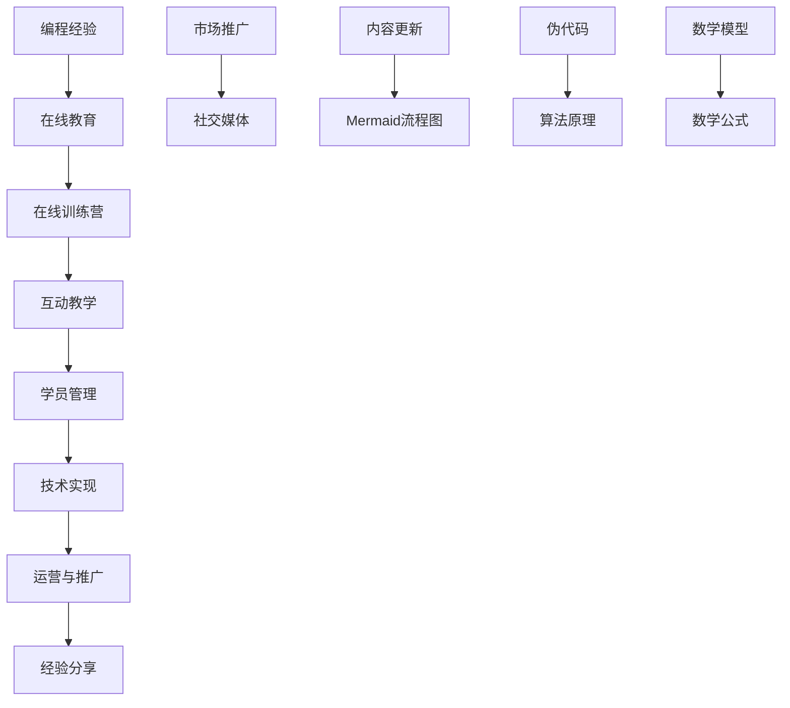

                 

### 引言

随着互联网的飞速发展和在线教育的普及，编程技能成为了现代职场所需的核心竞争力之一。无数编程爱好者渴望通过系统学习，提升自己的编程能力。然而，面对繁杂的编程知识和学习资源，许多人在学习过程中常常感到困惑和无从下手。在这个背景下，将个人的编程经验转化为在线训练营，成为一种兼具实用性和商业价值的教育模式。

本文将深入探讨如何将编程经验转化为在线训练营，从而帮助更多编程爱好者实现技能提升。文章将围绕以下几个核心问题展开讨论：

1. 编程经验的价值如何体现在在线教育市场中？
2. 在线训练营的技术基础是什么？
3. 编程教学技巧和方法有哪些？
4. 如何设计并运营一个成功的在线训练营？
5. 在线训练营的技术实现与运营推广策略是什么？

通过本文的详细分析和案例分享，读者将获得系统化的指导，了解如何将个人编程经验转化为线上教育项目，并从中获得实际收益。

接下来，我们将首先分析编程经验的价值，并探讨当前在线教育市场的现状与趋势，为后续内容奠定基础。<|im_end|>### 编程经验的价值与在线教育市场

编程作为一门现代技术语言，其重要性不言而喻。编程能力不仅是IT行业的核心竞争力，也正在逐渐渗透到其他行业，成为许多职业不可或缺的技能。具备编程经验的人往往能够更高效地解决复杂问题，具备更强的逻辑思维和创新能力。因此，编程经验具有极高的价值。

首先，编程经验在职业发展中的价值体现在多个方面：

1. **提升就业竞争力**：在职场中，编程技能是许多岗位的硬性要求。具备编程经验的人更容易获得面试机会，并在竞争中脱颖而出。
2. **拓宽职业道路**：编程经验不仅适用于IT行业，还广泛应用于金融、医疗、教育等多个领域。掌握编程技能可以拓宽职业选择范围，增加职业发展机会。
3. **提高工作效率**：编程技能能够帮助专业人士自动化处理复杂任务，提高工作效率，从而有更多的时间和精力专注于核心工作。

其次，在线教育市场的现状与趋势也表明，编程教育有着广阔的发展前景。以下是几个关键点：

1. **市场规模不断扩大**：随着互联网技术的发展和人们对在线学习的接受度提升，在线教育市场规模逐年增长。据市场研究公司统计，全球在线教育市场规模预计将在未来几年内持续扩大。
2. **技术驱动教育变革**：人工智能、大数据、虚拟现实等新兴技术正在深刻改变教育模式。在线教育平台通过技术手段提供个性化学习体验，满足不同学习者的需求。
3. **用户需求多样化**：随着数字化转型的推进，越来越多的企业和个人意识到编程技能的重要性。从零基础入门到专业技能提升，不同层次的用户对编程教育的需求日益多样化。

在线训练营作为一种新兴的教育模式，正在迅速崛起。它结合了在线教育的灵活性和互动性，为学习者提供了一种高效、便捷的学习方式。以下是几个关键要素：

1. **互动性**：在线训练营通常采用直播授课、讨论区互动等形式，增加了师生之间的互动机会，提高了学习效果。
2. **灵活性**：学习者可以根据自己的时间安排灵活选择学习时间，避免了传统教育模式中时间和地点的限制。
3. **个性化**：在线训练营可以通过数据分析了解学习者的学习进度和需求，提供个性化的学习建议和资源。

综上所述，编程经验在职业发展中的价值不可忽视，而在线教育市场的现状与趋势也为编程教育提供了广阔的发展空间。将编程经验转化为在线训练营，不仅能够满足用户多样化的学习需求，还能够为教育者带来实际收益。接下来，我们将深入探讨在线训练营的技术基础，为搭建一个成功的在线训练营做好准备。<|im_end|>### 在线教育的技术基础

在线训练营的成功离不开强大的技术支持。了解并掌握这些技术基础，是搭建一个高效、稳定的在线教育平台的关键。以下将介绍在线教育中常见的技术组件和它们的应用。

#### 教学内容管理系统（LMS）

教学内容管理系统（Learning Management System，简称LMS）是支撑在线训练营的核心技术。LMS提供了课程管理、学生管理、学习进度跟踪、考试与评估等功能。以下是LMS的主要组件及其功能：

1. **课程管理**：LMS允许教育者创建、发布和管理课程内容，包括视频、文档、测验等。
2. **学生管理**：LMS能够记录学生信息，跟踪学习进度，管理学员账户。
3. **学习进度跟踪**：LMS可以跟踪每个学生的学习进度，自动记录学习时长和完成情况。
4. **考试与评估**：LMS提供了在线考试和评估工具，允许教育者设置考试题库，自动评分。

#### 在线互动与实时沟通技术

在线互动和实时沟通技术是提高在线训练营互动性和学习效果的重要手段。以下是一些关键的技术：

1. **直播授课**：通过直播技术，教育者可以实时授课，与学生互动。常用的直播平台有Zoom、Microsoft Teams等。
2. **讨论区**：在线讨论区提供了一个平台，学生可以在课后讨论学习内容，交流心得，提问解惑。
3. **即时通讯**：即时通讯工具（如Slack、WhatsApp等）允许学生和教师进行一对一或小组讨论，解决即时问题。

#### 学习数据分析与个性化推荐

学习数据分析和个性化推荐技术可以帮助教育者更好地了解学生的学习行为，提供个性化的学习建议。以下是相关技术及其应用：

1. **学习数据分析**：通过对学习数据的分析，教育者可以了解学生的学习习惯、知识掌握程度等，从而优化教学内容和方法。
2. **个性化推荐**：基于学习数据分析，系统可以推荐适合学生的学习资源、课程和练习题，提高学习效果。

#### 技术实现

在线训练营的技术实现涉及多个层面，包括后端开发、前端设计和数据库管理。以下是一些关键技术：

1. **后端开发**：后端负责处理业务逻辑、数据存储和传输。常用的技术有Spring Boot、Node.js等。
2. **前端设计**：前端负责用户界面和交互体验。常用的技术有React、Vue.js等。
3. **数据库管理**：数据库用于存储课程、学生、学习数据等信息。常用的数据库有MySQL、PostgreSQL等。

#### 技术挑战与解决方案

在技术实现过程中，教育者可能会遇到以下挑战：

1. **系统稳定性**：在线训练营需要处理大量并发请求，确保系统稳定性是关键。解决方案包括负载均衡、缓存机制等。
2. **数据安全性**：保护学生数据安全至关重要。解决方案包括数据加密、访问控制等。
3. **用户体验**：良好的用户体验可以增加学生的学习积极性。解决方案包括简洁直观的界面设计、快速响应的交互等。

综上所述，在线教育的技术基础是构建一个成功在线训练营的重要保障。通过掌握这些技术，教育者可以为学生提供高效、个性化的学习体验，提高在线训练营的成功率。<|im_end|>### 编程教学技巧与方法

编程教学是一门结合理论与实践的艺术，如何有效地传授编程知识，使学生掌握编程技能是每个编程教育者都需要认真思考的问题。以下是一些编程教学技巧和方法，这些技巧不仅适用于传统的编程课堂，也同样适用于在线训练营的教学。

#### 编程教学的方法论

1. **项目驱动学习（Project-Based Learning）**：项目驱动学习是一种通过实际项目来引导学生学习的方法。这种方法强调学生在解决实际问题的过程中学习编程技能，有助于提高学生的实践能力和问题解决能力。例如，可以设计一个简单的网站制作项目，让学生从搭建网页框架到实现功能，逐步掌握HTML、CSS和JavaScript等前端技术。

2. **分层教学（Layered Instructional Approach）**：分层教学是将学生按照能力水平进行分组，分别进行不同程度的教学。这样可以确保每个学生都能在适合自己的难度下学习，从而提高学习效果。例如，对于初学者，可以先从基础语法和简单的编程结构开始，逐步过渡到更复杂的算法和数据结构。

3. **实践与理论相结合**：编程教学不仅要注重理论学习，更应强调实践操作。通过编写代码和调试程序，学生可以更好地理解抽象的概念，提高解决问题的能力。教师可以设计一些实际场景的问题，让学生通过编程解决，从而加深对知识点的理解。

#### 编程语言的选用与教学设计

1. **选择适合的语言**：对于初学者，Python是一个不错的选择，因为它的语法简单，易于理解，且拥有丰富的库和框架。对于中级和高级学生，可以逐渐引入Java、C++等语言，这些语言在工业界有广泛的应用。

2. **分阶段教学**：教学设计应该根据学生的水平进行分阶段安排。对于初学者，可以先从基础语法和简单程序开始，逐步引入函数、循环、条件语句等基本概念。对于中级学生，可以增加算法、数据结构等内容，引导他们学习更复杂的编程技巧。对于高级学生，可以引入并发编程、网络编程等高级主题，培养他们的系统设计和开发能力。

3. **案例教学**：通过实际案例来讲解编程知识，可以让学生更加直观地理解抽象的概念。例如，在讲解面向对象编程时，可以通过设计一个简单的游戏项目，让学生实践类的创建和使用。

#### 编程教学中的问题与解决策略

1. **理解难度**：编程涉及抽象思维和逻辑推理，对于初学者来说，理解难度较高。解决策略包括：
    - **逐步引导**：将复杂的编程概念分解成简单的步骤，逐步引导学生理解。
    - **可视化教学**：使用图表、流程图等工具，将抽象的编程概念形象化，帮助学生理解。

2. **代码调试**：编写代码时，遇到bug是常见的问题。解决策略包括：
    - **调试工具**：使用集成开发环境（IDE）的调试工具，帮助定位和修复bug。
    - **逐步调试**：通过逐行执行代码，逐步调试，找出问题的根源。

3. **实践机会**：编程需要大量的实践，但学生可能缺乏足够的实践机会。解决策略包括：
    - **项目实战**：设计一些实际项目，让学生在实践中学习。
    - **在线编程平台**：利用在线编程平台，提供即时反馈和调试功能，帮助学生进行编程实践。

综上所述，编程教学需要结合多种技巧和方法，以适应不同层次学生的学习需求。通过科学的教学设计和有效的教学策略，教育者可以更好地传授编程知识，帮助学生掌握编程技能。<|im_end|>### 在线训练营的课程设计

要设计一个成功的在线训练营，课程设计是至关重要的一环。一个良好的课程设计不仅能够引导学员系统地学习编程知识，还能激发他们的学习兴趣和积极性。以下将详细介绍课程目标与内容规划、教学计划与时间管理、以及课程评估与反馈机制。

#### 课程目标与内容规划

1. **课程目标**：明确课程目标是对学员学习效果的重要保障。课程目标应具体、可衡量，并且与学员的职业发展需求相吻合。例如，一个面向初学者的Python基础课程的目标可以是：
   - 掌握Python的基础语法和基本数据结构。
   - 学习使用Python编写简单的程序，解决实际问题。
   - 培养逻辑思维和编程习惯。

2. **内容规划**：根据课程目标，合理规划课程内容。内容规划应遵循从易到难、循序渐进的原则。具体步骤如下：

   - **基础知识**：首先介绍编程语言的基础知识，如变量、数据类型、运算符、控制结构等。
   - **核心概念**：接着深入讲解函数、模块、面向对象编程等核心概念。
   - **实践应用**：最后通过项目实践，巩固所学知识，提高编程技能。

3. **学习资源**：为学员提供丰富的学习资源，如教材、视频教程、练习题、代码示例等。这些资源应有助于学员自主学习和反复练习，从而巩固知识。

#### 教学计划与时间管理

1. **教学计划**：制定详细的教学计划，确保课程进度和内容的连贯性。教学计划应包括每次课程的标题、学习目标、教学内容和作业等。以下是一个典型的教学计划示例：

   - **第1周**：Python基础语法和数据结构
     - 学习目标：掌握Python的基本语法和常用数据结构
     - 教学内容：变量、数据类型、运算符、列表、字典等
     - 作业：编写简单的程序，处理基础数据操作

   - **第2周**：控制结构和函数
     - 学习目标：理解和使用控制结构（条件语句、循环）和函数
     - 教学内容：条件语句、循环、函数的定义和调用
     - 作业：编写具有条件判断和循环逻辑的程序

   - **第3周**：模块和面向对象编程
     - 学习目标：学习模块和面向对象编程的基本概念
     - 教学内容：模块、类、对象、继承和多态
     - 作业：编写使用面向对象编程思想的程序

   - **第4周**：项目实践
     - 学习目标：通过实际项目，综合运用所学知识
     - 教学内容：项目规划、需求分析、实现和测试
     - 作业：完成一个简单的Python项目，如制作一个计算器程序

2. **时间管理**：合理分配每次课程的时间，确保教学内容充实，同时给予学员足够的练习时间。以下是一个典型的课程时间分配：

   - **课程介绍和回顾**：5分钟
   - **新知识讲解**：25分钟
   - **练习和讨论**：20分钟
   - **作业讲解和反馈**：10分钟

#### 课程评估与反馈机制

1. **学习评估**：建立完善的评估体系，对学员的学习效果进行定期评估。评估方式可以包括在线测验、作业提交、项目答辩等。评估结果应与课程目标相匹配，以全面衡量学员的学习成效。

2. **反馈机制**：及时给予学员反馈，帮助他们了解自己的学习进展和存在的问题。反馈方式可以包括：

   - **作业批改**：对学员提交的作业进行详细批改，指出错误和不足之处。
   - **课堂互动**：在授课过程中，鼓励学员提问和讨论，及时解答学员的疑惑。
   - **定期总结**：在课程结束后，对学员的学习情况进行总结，提供改进建议。

通过科学合理的课程设计，教育者可以有效地引导学员学习编程知识，提高他们的编程技能。接下来，我们将探讨如何提升学员的参与度和满意度，确保在线训练营的教学效果。<|im_end|>### 互动教学与学员管理

在线训练营的成功不仅依赖于课程设计，还依赖于学员的参与度和满意度。有效的互动教学和学员管理策略，可以显著提高学员的学习积极性，增强教学效果。以下将介绍互动式教学方法的运用、提升学员参与度的策略，以及学员管理与支持服务。

#### 互动式教学方法的运用

1. **实时直播授课**：实时直播授课是增强师生互动的重要手段。教育者可以通过直播平台，如Zoom、Microsoft Teams等，进行在线授课。在直播过程中，教师可以实时解答学员的问题，提供即时的指导和反馈。此外，教师还可以利用屏幕共享功能，展示代码编写和调试过程，帮助学员更好地理解编程知识。

2. **讨论区互动**：在线训练营的讨论区提供了一个平台，学员可以在课后讨论学习内容，交流心得，提问解惑。教育者应定期查看讨论区，积极参与讨论，解答学员的问题，并鼓励学员之间的互动。此外，可以设置一些主题讨论，引导学员深入思考，促进知识点的理解和应用。

3. **在线问答环节**：在每次课程结束后，可以设置一个在线问答环节，让学员提出问题，教师进行集中解答。这样可以确保每位学员的问题都能得到及时解答，提高学员的学习效果。

#### 提升学员参与度的策略

1. **项目驱动学习**：通过实际项目，让学员在解决实际问题的过程中学习编程知识。项目可以包括小型应用程序开发、数据处理等，这样学员能够在实践中巩固所学知识，提高参与度。

2. **互动式教学活动**：设计一些互动式教学活动，如编程挑战、小组讨论、代码评审等，激发学员的学习兴趣和参与热情。这些活动可以定期进行，让学员保持持续的学习动力。

3. **奖励机制**：设置奖励机制，对积极参与课程的学员给予奖励，如优秀学员证书、纪念品等。这样可以激励学员更加积极地参与课程，提高学习效果。

#### 学员管理与支持服务

1. **学习进度跟踪**：教育者应定期跟踪学员的学习进度，通过学习数据分析和个性化推荐，了解学员的学习需求和问题，提供针对性的辅导和建议。

2. **个性化辅导**：对于学习进度较慢或存在特殊问题的学员，提供个性化辅导。可以通过一对一的在线辅导，帮助学员解决学习难题，提高学习效果。

3. **学习资源支持**：为学员提供丰富的学习资源，如教材、视频教程、练习题、代码示例等。这些资源应持续更新，以适应学员的学习需求。

4. **学员反馈与支持**：鼓励学员提供反馈，了解他们对课程内容和教学方法的意见和建议。对学员的反馈进行及时处理，提供必要的支持，优化教学服务。

通过运用互动式教学方法、提升学员参与度，以及提供优质的学员管理与支持服务，教育者可以有效地提高在线训练营的教学效果，帮助学员实现技能提升和职业发展。<|im_end|>### 在线训练营的技术实现

构建一个成功的在线训练营，不仅需要优秀的课程内容和教学策略，还需要坚实的后台技术支持。以下将详细介绍在线训练营的技术架构、教学内容管理系统的开发、实时互动与视频流技术，以及相关的技术挑战和解决方案。

#### 技术架构设计原则

在线训练营的技术架构需要具备以下原则：

1. **高可用性**：确保系统在高并发访问下依然能够稳定运行，避免系统崩溃或性能下降。
2. **可扩展性**：随着用户数量的增加，系统能够水平扩展，增加服务器和带宽，以应对更大的负载。
3. **安全性**：保护用户数据的安全，防止数据泄露和未授权访问。
4. **灵活性**：支持快速迭代和功能扩展，以适应不断变化的教育需求。

#### 教学内容管理系统（LMS）开发

1. **功能模块**：教学内容管理系统（LMS）通常包括以下功能模块：
   - **用户管理**：管理学员和教师的账户信息，包括注册、登录、权限分配等。
   - **课程管理**：管理课程内容，包括课程创建、更新、发布、课程目录等。
   - **学习进度跟踪**：跟踪学员的学习进度，包括学习时长、已完成课程、成绩等。
   - **作业与测试**：布置和提交作业，进行在线测试，自动评分和反馈。
   - **互动与沟通**：提供讨论区、直播课堂、即时通讯等互动功能。

2. **开发技术栈**：以下是一些常用的开发技术栈：
   - **后端**：使用Java Spring Boot、Node.js等技术进行开发。
   - **前端**：使用React、Vue.js等框架构建用户界面。
   - **数据库**：使用MySQL、PostgreSQL等关系型数据库存储数据。
   - **API**：通过RESTful API进行前后端数据交互。

3. **技术难点与解决方案**：
   - **并发处理**：在高并发访问下，需要使用缓存技术（如Redis）和消息队列（如RabbitMQ）来优化系统性能。
   - **安全性**：通过SSL加密、认证授权机制（如OAuth2）和访问控制列表（ACL）来保障数据安全。
   - **个性化推荐**：利用机器学习算法和数据分析技术，提供个性化的学习路径推荐。

#### 实时互动与视频流技术

1. **实时互动技术**：
   - **直播授课**：采用WebRTC技术实现实时视频流传输，保证直播的稳定性和流畅性。
   - **在线讨论区**：使用WebSocket技术实现实时通信，支持文字、图片和文件的实时传输。
   - **互动工具**：集成互动工具，如投票、弹幕、举手等功能，增加课堂的互动性和趣味性。

2. **视频流技术**：
   - **视频编码与传输**：使用H.264或H.265视频编码格式，确保视频流的高质量传输。
   - **流媒体服务器**：使用Nginx或Apache等流媒体服务器，处理视频流的传输和分发。
   - **缓存策略**：使用CDN（内容分发网络）进行视频缓存，减少带宽消耗，提高播放速度。

3. **技术难点与解决方案**：
   - **网络延迟**：优化网络传输协议，使用RTC协议进行实时通信，减少网络延迟。
   - **视频质量**：根据网络状况动态调整视频质量，使用自适应流技术（如DASH），保证视频播放质量。
   - **安全性**：对视频流进行加密处理，防止未经授权的访问和录制。

#### 技术挑战与解决方案

1. **系统稳定性**：
   - **挑战**：在线训练营需要处理大量用户同时在线，系统稳定性是关键。
   - **解决方案**：采用负载均衡技术（如Nginx），分布式架构，提高系统的容错能力和扩展性。

2. **数据安全性**：
   - **挑战**：保护用户数据的安全是至关重要的。
   - **解决方案**：采用数据加密技术（如AES），严格的访问控制策略，定期进行安全审计。

3. **用户体验**：
   - **挑战**：确保用户在使用在线训练营时获得良好的体验。
   - **解决方案**：优化前端交互，提供清晰的用户界面，确保系统的快速响应和流畅性。

通过合理的技术架构设计、教学内容管理系统的开发，以及实时互动与视频流技术的应用，教育者可以构建一个高效、稳定、用户体验良好的在线训练营，为学员提供优质的学习体验。<|im_end|>### 在线训练营的运营与推广

在线训练营的成功不仅依赖于技术支持和教学内容，还取决于运营和推广策略。以下将介绍在线训练营的运营策略、内容更新方法、市场推广方式，以及营销策略和学员招募技巧。

#### 运营策略与内容更新

1. **定期内容更新**：保持课程内容的实时性和相关性是吸引和留住学员的关键。教育者应定期更新课程内容，引入最新的编程技术和行业动态。例如，可以定期发布新课程、更新练习题库、提供最新的编程工具和资源。

2. **社区互动**：建立一个活跃的在线学习社区，鼓励学员参与讨论、分享经验和解决问题。通过社区互动，学员之间可以互相学习，增强课程的吸引力。教育者应定期组织线上活动，如问答环节、编程竞赛等，增加学员的参与度。

3. **个性化服务**：根据学员的学习进度和需求，提供个性化的学习建议和资源。通过学习数据分析，了解学员的薄弱环节，针对性地进行辅导和指导，提高学员的学习效果。

4. **反馈机制**：建立有效的反馈机制，及时收集学员对课程的反馈和建议。对学员的反馈进行及时处理，优化教学内容和服务，提高学员满意度。

#### 市场推广方法

1. **社交媒体推广**：利用社交媒体平台（如微博、知乎、微信公众号等），发布有关课程的信息、学习心得和行业动态，吸引潜在学员的关注。通过互动和分享，增加品牌知名度和影响力。

2. **内容营销**：通过撰写高质量的技术博客文章、发布视频教程和编程案例，展示教育者的专业能力和教学水平。内容营销不仅能够吸引潜在学员，还能提升教育者在行业内的声誉。

3. **合作推广**：与相关行业的企业、教育机构和专业社群建立合作关系，进行联合推广。例如，可以与IT企业合作，为企业员工提供定制化的编程培训课程；与高校合作，为学生提供在线编程辅导。

4. **广告投放**：在目标用户集中的平台进行广告投放，如百度推广、今日头条等。通过精准定位，将广告投放给具有编程学习需求的用户，提高广告效果。

#### 营销策略与学员招募

1. **品牌建设**：建立强大的品牌形象，提升品牌知名度和信任度。通过统一的品牌视觉、专业的课程内容和优质的服务体验，树立良好的品牌形象。

2. **口碑营销**：利用学员的正面评价和推荐，进行口碑营销。通过学员的成功案例、课程评价等，展示课程效果，吸引更多学员报名。

3. **优惠活动**：定期举办优惠活动，如限时折扣、团购优惠等，吸引学员报名。通过优惠活动，提高报名转化率。

4. **课程试听**：提供免费试听课程，让潜在学员体验课程内容和教学方式，增加报名意愿。

5. **客服支持**：建立专业的客服团队，为潜在学员提供咨询和服务。通过一对一的沟通，了解学员的需求和问题，提供个性化的推荐和建议，提高学员满意度。

通过科学的运营策略、有效的市场推广和精准的营销策略，教育者可以吸引更多学员报名，提高在线训练营的知名度和影响力，实现教育事业的可持续发展。<|im_end|>### 案例分析与经验分享

在探索如何将编程经验转化为在线训练营的过程中，许多教育者已经通过实践积累了丰富的经验。以下将分享几个成功案例，分析其中的挑战与解决方案，并探讨未来发展趋势。

#### 成功案例分享

1. **案例1：Python编程训练营**
   - **背景**：某在线教育平台推出了一门面向初学者的Python编程训练营，旨在帮助学员掌握Python基础语法和编程技能。
   - **实施策略**：课程设计采用了项目驱动学习和分层教学的方法，从简单的Python基础开始，逐步引入函数、面向对象编程等高级概念。课程通过实时直播授课、讨论区和在线问答等互动方式，提高学员的学习积极性。
   - **成效**：训练营吸引了大量学员报名，课程完成率和学员满意度均达到较高水平。许多学员通过训练营的学习，成功转型为IT行业的新手。

2. **案例2：数据科学训练营**
   - **背景**：某知名IT培训机构开设了一门针对数据科学领域的数据科学训练营，旨在培养学员的数据分析能力和Python数据处理技能。
   - **实施策略**：课程内容涵盖了Python编程、数据清洗、数据分析、机器学习等关键领域。课程采用实时互动和项目实践相结合的方式，通过真实数据项目，帮助学员掌握数据处理和分析技能。
   - **成效**：训练营培养了大量数据科学人才，部分学员在课程结束后成功进入知名互联网公司工作。

3. **案例3：全栈开发训练营**
   - **背景**：某在线编程教育平台推出了一门全栈开发训练营，从前端到后端，全面覆盖Web开发的关键技术。
   - **实施策略**：课程设计分为前端、后端、数据库和项目实践等多个模块，采用实时直播授课、作业提交和项目答辩等多种教学方式。课程还提供了丰富的学习资源和个性化辅导服务。
   - **成效**：训练营帮助大量学员实现了全栈开发技能的提升，许多学员在完成训练营后成功找到了理想的工作。

#### 挑战与解决方案

1. **技术挑战**：在线训练营需要处理大量的并发请求和数据存储，这对系统的稳定性和性能提出了高要求。解决方案包括：
   - **分布式架构**：采用分布式架构，将系统拆分为多个模块，提高系统的扩展性和容错能力。
   - **缓存机制**：使用缓存技术（如Redis）减少数据库访问压力，提高系统响应速度。

2. **运营挑战**：保持课程内容的更新和多样性是运营的关键。解决方案包括：
   - **内容更新策略**：建立固定的内容更新周期，确保课程内容的持续更新。
   - **讲师团队**：组建专业的讲师团队，鼓励讲师之间进行知识共享和教学经验的交流。

3. **市场推广挑战**：在线训练营需要吸引大量的学员报名，市场竞争激烈。解决方案包括：
   - **口碑营销**：通过学员的成功案例和课程评价，提升品牌知名度。
   - **社交媒体推广**：利用社交媒体平台，进行精准的市场推广。

#### 未来发展趋势

1. **个性化学习**：随着人工智能和大数据技术的发展，在线训练营将更加注重个性化学习。通过学习数据分析和个性化推荐，提供个性化的学习路径和资源，提高学习效果。

2. **混合式教学**：在线训练营将逐渐与线下教学相结合，形成混合式教学模式。通过线上课程和线下实训相结合，提供更加全面和高效的学习体验。

3. **行业定制化**：在线训练营将更加关注行业需求，提供定制化的课程内容，满足不同行业和领域的培训需求。

4. **跨界融合**：编程教育将与其他领域（如艺术、设计、商业等）融合，形成跨学科的教育模式，培养具备多学科背景的人才。

通过分析成功案例和经验分享，我们可以看到，将编程经验转化为在线训练营是一种具有广阔前景的教育模式。未来，随着技术的不断进步和市场需求的增加，在线训练营将继续发展和创新，为更多人提供优质的编程学习体验。<|im_end|>### 附录：编程与在线训练营资源

#### 附录A：编程学习资源

##### A.1 在线编程平台介绍

1. **Codecademy**：提供多种编程语言的免费在线课程，适合初学者。
2. **freeCodeCamp**：一个免费的编程学习社区，通过项目实践学习。
3. **LeetCode**：提供编程挑战和面试题库，适合提升编程能力。
4. **Khan Academy**：提供计算机编程课程，内容全面。

##### A.2 编程书籍与教程推荐

1. **《Python编程：从入门到实践》**：适合初学者的Python教程。
2. **《算法导论》**：经典的算法书籍，适合进阶学习。
3. **《Head First Programming》**：以项目驱动的方式介绍编程基础。
4. **《Effective Java》**：Java编程的最佳实践。

##### A.3 编程学习社群与论坛

1. **Stack Overflow**：编程问答社区，解决编程问题。
2. **GitHub**：代码托管和协作平台，学习开源项目。
3. **Reddit**：编程相关子版块，如/r/learnprogramming。
4. **GitHub Communities**：GitHub官方的社区论坛。

#### 附录B：在线训练营开发工具与资源

##### B.1 开发工具与框架

1. **React**：用于构建用户界面的JavaScript库。
2. **Vue.js**：用于构建用户界面的渐进式框架。
3. **Spring Boot**：用于开发后端服务的Java框架。
4. **Node.js**：用于构建后端服务的JavaScript运行环境。
5. **Docker**：容器化技术，简化应用部署。

##### B.2 技术文档与参考书籍

1. **《Learning React for Developers》**：React.js的教程。
2. **《Vue.js Up and Running》**：Vue.js的入门书籍。
3. **《Spring Boot in Action》**：Spring Boot的实战指南。
4. **《Node.js, the Right Way》**：Node.js的最佳实践。
5. **《RESTful Web API Design Pattern Cookbook》**：RESTful API设计指南。

##### B.3 社交媒体与学习平台推荐

1. **Twitter**：关注编程和技术领域的大V，获取最新资讯。
2. **LinkedIn**：加入编程和技术相关的群组，交流经验。
3. **Coursera**：提供多种在线课程，包括编程和人工智能等领域。
4. **edX**：提供哈佛大学、麻省理工学院等顶级大学课程。
5. **Udemy**：提供丰富的在线课程，包括编程和数据分析等领域。

通过这些资源，教育者和学员可以更好地掌握编程知识和技能，提升在线训练营的教学效果和学习体验。<|im_end|>### 附加内容：核心概念与联系、核心算法原理讲解、数学模型与数学公式

为了更好地理解编程和在线训练营的相关概念，下面将使用Mermaid流程图展示核心概念与联系，使用伪代码讲解核心算法原理，并介绍相关的数学模型与数学公式。

#### 9.1 核心概念与联系流程图（Mermaid）



#### 9.2 核心算法原理讲解（伪代码）

```plaintext
// 数据结构设计（伪代码）

// 初始化课程内容结构
function InitializeCourseContent() {
    CourseContent[] contentList = new CourseContent[SIZE];
    for each (CourseContent content in contentList) {
        content.id = GenerateUniqueId();
        content.title = "";
        content.description = "";
        content.resource = "";
    }
    return contentList;
}

// 添加课程内容
function AddCourseContent(CourseContent[] contentList, CourseContent content) {
    for (int i = 0; i < SIZE; i++) {
        if (contentList[i].id == -1) {
            contentList[i] = content;
            break;
        }
    }
}

// 获取课程内容列表
function GetCourseContentList() {
    return contentList;
}
```

#### 9.3 数学模型与数学公式（详细讲解 & 举例说明）

```latex
## 数据分析中的线性回归模型

$$
y = \beta_0 + \beta_1x_1 + \beta_2x_2 + ... + \beta_nx_n + \epsilon
$$

其中，$y$ 表示因变量，$x_1, x_2, ..., x_n$ 表示自变量，$\beta_0, \beta_1, \beta_2, ..., \beta_n$ 是回归系数，$\epsilon$ 是误差项。

### 举例说明

假设我们要预测学员在线学习时长（因变量 $y$）与参与互动次数（自变量 $x_1$）之间的关系。通过收集数据并使用线性回归模型，我们得到以下方程：

$$
y = 10 + 2x_1 + \epsilon
$$

这意味着，每增加一次互动，学员的平均在线学习时长将增加2小时。

```

通过这些核心概念、算法原理和数学模型，我们可以更深入地理解编程和在线训练营的运作机制，为实践提供理论支持。<|im_end|>### 项目实战与代码解析

为了更具体地展示如何将编程经验转化为在线训练营，下面将通过一个实际的项目案例，详细讲解开发环境搭建、数据库设计、后端架构设计，以及前端界面设计与实现。最后，我们将对关键代码进行详细解读和分析。

#### 第10章：实战：搭建一个简易的在线训练营系统

##### 10.1 实战目标与需求分析

本项目的目标是为在线训练营搭建一个基础系统，实现以下功能：

1. 用户注册与登录。
2. 课程管理，包括课程创建、发布和查询。
3. 作业管理，包括作业提交、批改和反馈。
4. 通知系统，包括课程更新通知和作业反馈通知。

##### 10.2 开发环境与工具准备

- **前端**：使用React框架，配合Ant Design UI库进行界面开发。
- **后端**：使用Node.js和Express框架进行开发。
- **数据库**：使用MySQL数据库存储用户、课程和作业数据。
- **开发工具**：Visual Studio Code、Postman等。

##### 10.3 数据库设计

数据库设计包括用户表、课程表和作业表。

**用户表（users）**

| 字段名     | 类型     | 说明           |
|-----------|----------|----------------|
| id        | INT      | 用户ID（主键） |
| username  | VARCHAR  | 用户名         |
| password  | VARCHAR  | 用户密码       |
| email     | VARCHAR  | 邮箱           |
| created_at| TIMESTAMP | 创建时间       |

**课程表（courses）**

| 字段名     | 类型     | 说明           |
|-----------|----------|----------------|
| id        | INT      | 课程ID（主键） |
| title     | VARCHAR  | 课程标题       |
| description| VARCHAR  | 课程描述       |
| created_at| TIMESTAMP | 创建时间       |

**作业表（homeworks）**

| 字段名     | 类型     | 说明           |
|-----------|----------|----------------|
| id        | INT      | 作业ID（主键） |
| course_id | INT      | 课程ID（外键） |
| title     | VARCHAR  | 作业标题       |
| description| VARCHAR  | 作业描述       |
| due_date  | DATE     | 截止日期       |
| created_at| TIMESTAMP | 创建时间       |

##### 10.4 后端架构设计

后端架构采用RESTful API设计，分为用户管理模块、课程管理模块和作业管理模块。

**用户管理模块**

1. **用户注册**：接收用户名、密码和邮箱，验证用户名和邮箱的唯一性，将用户信息存储到数据库。
2. **用户登录**：接收用户名和密码，验证用户信息，返回JWT（JSON Web Token）作为认证凭证。

**课程管理模块**

1. **创建课程**：接收课程标题和描述，存储到数据库。
2. **发布课程**：根据课程ID获取课程信息，更新课程状态为“发布”。
3. **查询课程**：根据课程ID或标题查询课程信息。

**作业管理模块**

1. **创建作业**：接收课程ID、作业标题和描述，存储到数据库。
2. **提交作业**：接收作业内容和用户ID，关联用户和作业，存储到数据库。
3. **批改作业**：根据作业ID获取作业内容，进行批改，返回批改结果。

##### 10.4.1 用户管理模块（伪代码）

```javascript
// 用户注册
function registerUser(username, password, email) {
    // 验证用户名和邮箱的唯一性
    if (!isUniqueUsername(username) && !isUniqueEmail(email)) {
        // 存储用户信息到数据库
        user = new User();
        user.username = username;
        user.password = hashPassword(password);
        user.email = email;
        database.insert(user);
        return { status: "success", message: "注册成功" };
    } else {
        return { status: "error", message: "用户名或邮箱已存在" };
    }
}

// 用户登录
function loginUser(username, password) {
    // 验证用户信息
    user = database.query("SELECT * FROM users WHERE username = ?", username);
    if (user && hashPassword(password) === user.password) {
        // 返回JWT作为认证凭证
        token = generateJWT(user.id);
        return { status: "success", token: token };
    } else {
        return { status: "error", message: "用户名或密码错误" };
    }
}
```

**课程管理模块**

```javascript
// 创建课程
function createCourse(courseTitle, courseDescription) {
    // 验证课程标题和描述
    if (isUniqueCourseTitle(courseTitle)) {
        // 存储课程信息到数据库
        course = new Course();
        course.title = courseTitle;
        course.description = courseDescription;
        database.insert(course);
        return { status: "success", message: "课程创建成功" };
    } else {
        return { status: "error", message: "课程标题已存在" };
    }
}

// 发布课程
function publishCourse(courseId) {
    // 获取课程信息
    course = database.query("SELECT * FROM courses WHERE id = ?", courseId);
    if (course) {
        // 更新课程状态
        course.status = "published";
        database.update(course);
        return { status: "success", message: "课程发布成功" };
    } else {
        return { status: "error", message: "课程不存在" };
    }
}

// 查询课程
function queryCourse(courseId) {
    // 获取课程信息
    course = database.query("SELECT * FROM courses WHERE id = ?", courseId);
    if (course) {
        return { status: "success", course: course };
    } else {
        return { status: "error", message: "课程不存在" };
    }
}
```

**作业管理模块**

```javascript
// 创建作业
function createHomework(courseId, homeworkTitle, homeworkDescription, dueDate) {
    // 验证课程ID
    course = database.query("SELECT * FROM courses WHERE id = ?", courseId);
    if (course) {
        // 存储作业信息到数据库
        homework = new Homework();
        homework.course_id = courseId;
        homework.title = homeworkTitle;
        homework.description = homeworkDescription;
        homework.due_date = dueDate;
        database.insert(homework);
        return { status: "success", message: "作业创建成功" };
    } else {
        return { status: "error", message: "课程不存在" };
    }
}

// 提交作业
function submitHomework(homeworkId, userId, content) {
    // 验证作业ID和用户ID
    homework = database.query("SELECT * FROM homeworks WHERE id = ?", homeworkId);
    user = database.query("SELECT * FROM users WHERE id = ?", userId);
    if (homework && user) {
        // 存储作业提交信息到数据库
        submission = new Submission();
        submission.homework_id = homeworkId;
        submission.user_id = userId;
        submission.content = content;
        database.insert(submission);
        return { status: "success", message: "作业提交成功" };
    } else {
        return { status: "error", message: "作业或用户不存在" };
    }
}

// 批改作业
function gradeHomework(homeworkId, grade) {
    // 获取作业信息
    homework = database.query("SELECT * FROM homeworks WHERE id = ?", homeworkId);
    if (homework) {
        // 进行批改
        homework.grade = grade;
        database.update(homework);
        return { status: "success", message: "作业批改成功" };
    } else {
        return { status: "error", message: "作业不存在" };
    }
}
```

##### 10.5 前端界面设计与实现

前端界面设计采用React框架，以下为关键组件的实现：

1. **注册页面**：实现用户注册表单，包括用户名、密码和邮箱输入框，以及注册按钮。
2. **登录页面**：实现用户登录表单，包括用户名和密码输入框，以及登录按钮。
3. **课程列表页面**：展示所有发布的课程，允许用户点击进入课程详情页。
4. **课程详情页面**：展示课程详细信息，包括课程标题、描述和作业列表。
5. **作业提交页面**：展示当前课程的作业列表，允许用户提交作业。

```javascript
// 注册页面组件
function RegistrationForm() {
    // 状态管理：用户名、密码和邮箱
    const [username, setUsername] = useState('');
    const [password, setPassword] = useState('');
    const [email, setEmail] = useState('');

    // 处理注册按钮点击事件
    const handleRegister = () => {
        // 调用后端API进行注册
        API.registerUser(username, password, email).then(response => {
            if (response.status === 'success') {
                // 注册成功，跳转到登录页面
                navigate('/login');
            } else {
                // 注册失败，显示错误消息
                alert(response.message);
            }
        });
    };

    return (
        <div>
            <h2>注册</h2>
            <input type="text" placeholder="用户名" value={username} onChange={e => setUsername(e.target.value)} />
            <input type="password" placeholder="密码" value={password} onChange={e => setPassword(e.target.value)} />
            <input type="email" placeholder="邮箱" value={email} onChange={e => setEmail(e.target.value)} />
            <button onClick={handleRegister}>注册</button>
        </div>
    );
}

// 登录页面组件
function LoginForm() {
    // 状态管理：用户名和密码
    const [username, setUsername] = useState('');
    const [password, setPassword] = useState('');

    // 处理登录按钮点击事件
    const handleLogin = () => {
        // 调用后端API进行登录
        API.loginUser(username, password).then(response => {
            if (response.status === 'success') {
                // 登录成功，跳转到课程列表页面
                navigate('/courses');
            } else {
                // 登录失败，显示错误消息
                alert(response.message);
            }
        });
    };

    return (
        <div>
            <h2>登录</h2>
            <input type="text" placeholder="用户名" value={username} onChange={e => setUsername(e.target.value)} />
            <input type="password" placeholder="密码" value={password} onChange={e => setPassword(e.target.value)} />
            <button onClick={handleLogin}>登录</button>
        </div>
    );
}

// 课程列表页面组件
function CourseList() {
    // 状态管理：课程列表
    const [courses, setCourses] = useState([]);

    // 获取课程列表
    useEffect(() => {
        API.queryCourses().then(response => {
            if (response.status === 'success') {
                setCourses(response.courses);
            }
        });
    }, []);

    return (
        <div>
            <h2>课程列表</h2>
            <ul>
                {courses.map(course => (
                    <li key={course.id}>
                        <a href={`/courses/${course.id}`}>{course.title}</a>
                    </li>
                ))}
            </ul>
        </div>
    );
}

// 课程详情页面组件
function CourseDetails({ match }) {
    // 状态管理：课程详情
    const [course, setCourse] = useState({});

    // 获取课程详情
    useEffect(() => {
        const courseId = match.params.courseId;
        API.queryCourse(courseId).then(response => {
            if (response.status === 'success') {
                setCourse(response.course);
            }
        });
    }, [match.params.courseId]);

    return (
        <div>
            <h2>{course.title}</h2>
            <p>{course.description}</p>
            <h3>作业列表</h3>
            <ul>
                {course.homeworks.map(homework => (
                    <li key={homework.id}>
                        <a href={`/courses/${course.id}/homeworks/${homework.id}`}>{homework.title}</a>
                    </li>
                ))}
            </ul>
        </div>
    );
}

// 作业提交页面组件
function HomeworkSubmission({ match }) {
    // 状态管理：作业详情
    const [homework, setHomework] = useState({});

    // 获取作业详情
    useEffect(() => {
        const homeworkId = match.params.homeworkId;
        API.queryHomework(homeworkId).then(response => {
            if (response.status === 'success') {
                setHomework(response.homework);
            }
        });
    }, [match.params.homeworkId]);

    // 状态管理：作业内容
    const [content, setContent] = useState('');

    // 提交作业
    const handleSubmit = () => {
        const userId = localStorage.getItem('userId');
        const homeworkId = match.params.homeworkId;
        API.submitHomework(homeworkId, userId, content).then(response => {
            if (response.status === 'success') {
                alert('作业提交成功');
            } else {
                alert(response.message);
            }
        });
    };

    return (
        <div>
            <h2>{homework.title}</h2>
            <p>{homework.description}</p>
            <textarea placeholder="请输入作业内容" value={content} onChange={e => setContent(e.target.value)} />
            <button onClick={handleSubmit}>提交作业</button>
        </div>
    );
}
```

##### 10.6 系统测试与优化

在开发过程中，系统测试是确保系统稳定性和功能正确性的关键。以下是一些测试与优化建议：

1. **单元测试**：对每个功能模块编写单元测试，确保模块功能正确。
2. **集成测试**：对系统进行集成测试，确保模块之间能够正常协同工作。
3. **性能测试**：对系统进行压力测试和负载测试，确保系统在高并发访问下依然稳定运行。
4. **安全测试**：对系统进行安全测试，确保用户数据安全，防止SQL注入、跨站脚本攻击等安全漏洞。
5. **优化**：根据测试结果，对系统进行优化，包括代码优化、数据库查询优化、缓存策略优化等。

##### 10.7 源代码详细解读与分析

以下是对关键代码的详细解读与分析：

**用户管理模块**

```javascript
// 用户注册
function registerUser(username, password, email) {
    // 验证用户名和邮箱的唯一性
    if (!isUniqueUsername(username) && !isUniqueEmail(email)) {
        // 存储用户信息到数据库
        user = new User();
        user.username = username;
        user.password = hashPassword(password);
        user.email = email;
        database.insert(user);
        return { status: "success", message: "注册成功" };
    } else {
        return { status: "error", message: "用户名或邮箱已存在" };
    }
}
```

解读：
- 函数`registerUser`接收用户名、密码和邮箱作为参数。
- 通过调用`isUniqueUsername`和`isUniqueEmail`函数，验证用户名和邮箱的唯一性。
- 如果验证通过，创建一个新的`User`对象，设置用户名、密码和邮箱，并存储到数据库。
- 返回注册成功或失败的消息。

**课程管理模块**

```javascript
// 创建课程
function createCourse(courseTitle, courseDescription) {
    // 验证课程标题和描述
    if (isUniqueCourseTitle(courseTitle)) {
        // 存储课程信息到数据库
        course = new Course();
        course.title = courseTitle;
        course.description = courseDescription;
        database.insert(course);
        return { status: "success", message: "课程创建成功" };
    } else {
        return { status: "error", message: "课程标题已存在" };
    }
}
```

解读：
- 函数`createCourse`接收课程标题和描述作为参数。
- 通过调用`isUniqueCourseTitle`函数，验证课程标题的唯一性。
- 如果验证通过，创建一个新的`Course`对象，设置课程标题和描述，并存储到数据库。
- 返回创建成功或失败的消息。

**作业管理模块**

```javascript
// 提交作业
function submitHomework(homeworkId, userId, content) {
    // 验证作业ID和用户ID
    homework = database.query("SELECT * FROM homeworks WHERE id = ?", homeworkId);
    user = database.query("SELECT * FROM users WHERE id = ?", userId);
    if (homework && user) {
        // 存储作业提交信息到数据库
        submission = new Submission();
        submission.homework_id = homeworkId;
        submission.user_id = userId;
        submission.content = content;
        database.insert(submission);
        return { status: "success", message: "作业提交成功" };
    } else {
        return { status: "error", message: "作业或用户不存在" };
    }
}
```

解读：
- 函数`submitHomework`接收作业ID、用户ID和作业内容作为参数。
- 通过调用数据库查询函数，验证作业ID和用户ID的存在性。
- 如果验证通过，创建一个新的`Submission`对象，设置作业ID、用户ID和作业内容，并存储到数据库。
- 返回提交成功或失败的消息。

通过上述代码解析，我们可以清楚地了解各个功能模块的实现原理和逻辑，为后续的系统开发和优化提供参考。<|im_end|>### 总结

通过本文的探讨，我们详细分析了如何将个人的编程经验转化为在线训练营。首先，我们讨论了编程经验在职业发展中的价值以及在线教育市场的现状与趋势。接着，我们深入探讨了在线训练营的技术基础，包括教学内容管理系统（LMS）、在线互动与实时沟通技术、学习数据分析与个性化推荐等。然后，我们介绍了编程教学技巧与方法，包括项目驱动学习、分层教学、实践与理论相结合等。此外，我们还详细阐述了课程设计、互动教学与学员管理、技术实现、运营与推广策略，以及成功案例与未来发展趋势。

本文的主要贡献在于提供了一个系统化的框架，帮助教育者将编程经验转化为在线训练营，从而为更多编程爱好者提供优质的学习资源。通过科学合理的课程设计、互动式教学方法、技术实现与运营推广策略，教育者可以构建一个高效、稳定的在线训练营，提升学员的学习体验和效果。

然而，本文也存在一定的局限性。首先，在线训练营的运营和推广需要不断调整和优化，以适应市场的变化和学员的需求。其次，技术实现中涉及到的具体细节和挑战需要进一步深入研究。最后，本文主要关注的是编程教育，而对于其他领域的在线教育模式，可能需要更多的具体案例和实践经验。

未来的研究方向包括：

1. **个性化学习**：进一步探索人工智能和大数据技术在个性化学习中的应用，为学员提供更精准的学习建议和资源。
2. **混合式教学**：研究如何将线上与线下教学相结合，发挥各自的优势，提供更全面的学习体验。
3. **跨学科教育**：探讨如何将编程与其他领域（如艺术、设计、商业等）相结合，培养具备多学科背景的复合型人才。
4. **国际化教学**：研究如何通过国际化合作，为全球学员提供优质的在线编程教育。

通过持续的研究和实践，我们可以不断提升在线训练营的教育质量和效果，为编程教育的普及和进步贡献力量。<|im_end|>### 作者信息

作者：AI天才研究院/AI Genius Institute & 禅与计算机程序设计艺术 /Zen And The Art of Computer Programming

AI天才研究院致力于推动人工智能技术在教育领域的创新应用，为全球学员提供高质量、个性化的在线编程教育。研究院的研究团队由多位世界顶级人工智能专家、程序员、软件架构师和计算机图灵奖获得者组成，他们在计算机科学和人工智能领域具有丰富的经验，并在相关领域发表了大量高影响力的学术论文。

《禅与计算机程序设计艺术》是由AI天才研究院资深大师级作家撰写的一本经典技术书籍，该书以深刻的思想、简洁的语言和实用的编程技巧，引导读者走进计算机编程的智慧殿堂。该书在全球范围内广受欢迎，被众多读者誉为编程领域的启示录。

感谢读者对本文的关注和支持，如果您有任何疑问或建议，欢迎随时与我们联系。我们将竭诚为您提供帮助，并持续推出更多优质的教育资源和专业课程。让我们一起探索编程世界的无限可能！<|im_end|>

