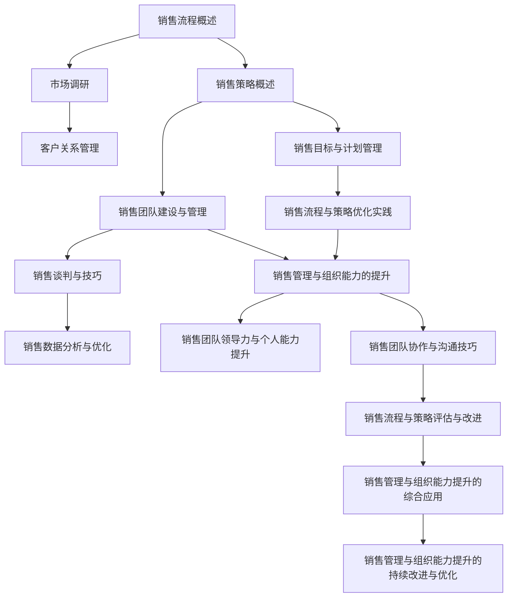

                 

## 第1章：如何建立有效的销售流程与策略

销售流程与策略是企业实现销售目标、提升业绩的重要手段。一个有效的销售流程与策略能够帮助企业更准确地把握市场机会，提高客户满意度，从而实现可持续的销售增长。在本章节中，我们将首先对销售流程进行概述，接着讨论销售策略的制定与实施，最后介绍市场调研的重要性及其方法。

### 1.1 销售流程概述

销售流程是指企业在销售过程中所遵循的一系列步骤和活动，这些步骤和活动通常包括市场调研、客户定位、销售目标设定、销售策略制定、销售执行、客户关系管理和销售业绩评估等。一个完整的销售流程有助于确保销售活动的系统性和高效性。

**销售流程的定义与重要性：**

销售流程是企业实现销售目标的系统化路径，它不仅涵盖了从市场调研到客户关系管理的各个环节，还包括了销售策略的制定与实施。有效的销售流程能够帮助企业：

1. 更准确地识别市场机会和客户需求。
2. 提高销售效率，降低销售成本。
3. 提升客户满意度和忠诚度。
4. 确保销售目标的实现。

**销售流程的基本构成：**

销售流程的基本构成通常包括以下几个环节：

1. **市场调研**：通过市场调研了解市场趋势、竞争态势和客户需求，为销售策略制定提供依据。
2. **客户定位**：根据市场调研结果，确定目标客户群体。
3. **销售目标设定**：制定具体的销售目标和计划。
4. **销售策略制定**：基于市场调研和客户定位结果，制定销售策略。
5. **销售执行**：实施销售策略，包括客户开发、谈判和签约等。
6. **客户关系管理**：建立和维护与客户的关系，提高客户满意度。
7. **销售业绩评估**：定期评估销售业绩，反馈和调整销售策略。

**销售流程的优化目标：**

销售流程的优化目标是提高销售效率，确保销售目标的实现。具体包括：

1. **提高销售过程的透明度**：确保每个销售环节都有明确的目标和执行计划。
2. **缩短销售周期**：优化销售流程，提高销售效率，缩短销售周期。
3. **降低销售成本**：通过流程优化，减少不必要的环节和资源浪费。
4. **提升客户满意度**：通过提供高质量的服务和解决方案，提升客户满意度。
5. **提高销售团队的工作效率**：通过培训和管理，提升销售团队的工作效率。

通过以上内容，我们为后续章节的深入探讨奠定了基础。接下来，我们将进一步讨论销售策略的定义与分类，以及制定销售策略的步骤。

### 1.2 销售策略概述

销售策略是企业为实现销售目标而制定的行动计划和方案。一个有效的销售策略可以帮助企业充分利用市场机会，提高销售效率和业绩。在本章节中，我们将对销售策略的定义与分类进行讨论，并介绍制定销售策略的步骤。

#### 1.2.1 销售策略的定义与分类

**销售策略的定义：**

销售策略是指企业根据市场环境、竞争态势和自身资源条件，为实现特定销售目标而制定的具体行动计划和方案。销售策略通常包括产品定位、市场细分、目标客户选择、销售渠道选择、促销策略和定价策略等。

**销售策略的分类：**

根据不同的分类标准，销售策略可以划分为多种类型。以下是几种常见的销售策略分类：

1. **基于产品定位的销售策略：**

   - **高端产品策略**：面向高端市场，通过高价值的产品和服务获取高利润。
   - **大众化产品策略**：面向大众市场，通过价格优势和广泛的渠道覆盖实现销售。

2. **基于市场细分的销售策略：**

   - **集中市场策略**：集中资源开发某一特定市场细分领域，快速获取市场份额。
   - **多元化市场策略**：同时开发多个市场细分领域，分散风险，提高市场占有率。

3. **基于销售渠道的销售策略：**

   - **直销策略**：直接面对客户进行销售，提高客户满意度和服务质量。
   - **分销策略**：通过中间商和代理商进行销售，扩大市场覆盖面。

4. **基于促销策略的销售策略：**

   - **价格促销策略**：通过价格优惠、折扣等手段刺激客户购买。
   - **非价格促销策略**：通过广告、推广活动、品牌建设等手段提升品牌知名度和美誉度。

#### 1.2.2 不同类型销售策略的特点与应用

不同类型的销售策略具有不同的特点和应用场景。以下是对几种常见销售策略的特点和应用场景的简要介绍：

1. **高端产品策略：**

   - **特点**：产品附加值高，利润率高，注重品牌形象和客户体验。
   - **应用场景**：适用于市场竞争不激烈、产品独特性和技术含量高的行业。

2. **大众化产品策略：**

   - **特点**：产品性价比高，市场覆盖面广，注重价格和渠道优势。
   - **应用场景**：适用于大众市场，消费者需求量大但价格敏感的行业。

3. **集中市场策略：**

   - **特点**：资源集中投入，快速获取市场份额，提高市场占有率。
   - **应用场景**：适用于市场细分明确、目标客户集中、竞争相对不激烈的行业。

4. **多元化市场策略：**

   - **特点**：分散市场风险，提高整体市场占有率，扩大市场覆盖面。
   - **应用场景**：适用于市场细分不明确、目标客户广泛分布、竞争激烈的行业。

5. **直销策略：**

   - **特点**：直接与客户沟通，提供个性化服务，提升客户满意度。
   - **应用场景**：适用于高端市场、定制化需求较强的行业。

6. **分销策略：**

   - **特点**：通过中间商和代理商进行销售，扩大市场覆盖面，提高销售效率。
   - **应用场景**：适用于大众市场、渠道资源丰富的行业。

#### 1.2.3 制定销售策略的步骤

制定有效的销售策略需要经过系统化的步骤，以下是一般制定销售策略的步骤：

1. **明确销售目标**：根据企业整体战略和市场需求，明确具体的销售目标。

2. **分析市场环境**：通过市场调研，了解市场趋势、竞争态势和客户需求。

3. **确定目标客户**：基于市场分析结果，明确目标客户群体，并进行客户细分。

4. **选择销售渠道**：根据目标客户的特点和市场环境，选择合适的销售渠道。

5. **制定产品策略**：根据市场需求和竞争态势，确定产品定位和产品组合策略。

6. **制定促销策略**：根据产品策略和目标客户的特点，制定相应的促销策略。

7. **制定定价策略**：基于产品策略和市场竞争态势，制定合理的定价策略。

8. **制定销售团队建设与激励策略**：确保销售团队能够有效地执行销售策略，并提供相应的激励措施。

9. **制定销售计划与实施步骤**：明确销售计划的具体实施步骤和时间表，确保销售策略能够有效执行。

10. **定期评估与调整**：对销售策略进行定期评估，根据市场变化和销售业绩，及时进行调整。

通过以上步骤，企业可以制定出适合自身发展的销售策略，从而实现销售目标。

### 1.3 市场调研

市场调研是制定销售策略和优化销售流程的重要环节。通过市场调研，企业可以深入了解市场环境、竞争态势和客户需求，从而为销售策略的制定提供有力支持。在本章节中，我们将讨论市场调研的重要性、方法和市场调研报告的撰写与解读。

#### 1.3.1 市场调研的重要性

市场调研对于企业销售流程和策略的制定具有以下几个重要意义：

1. **了解市场趋势**：市场调研可以帮助企业及时掌握市场动态，了解市场趋势和变化，从而及时调整销售策略。

2. **分析竞争态势**：通过市场调研，企业可以分析竞争对手的市场表现、产品特点和市场策略，找到自身的优势和不足，为优化销售策略提供依据。

3. **了解客户需求**：市场调研可以帮助企业深入了解客户需求、偏好和行为，从而制定出更符合客户需求的产品和销售策略。

4. **指导销售决策**：市场调研的结果可以为企业的销售决策提供有力支持，帮助企业在产品定价、渠道选择、促销策略等方面做出更科学的决策。

5. **优化销售流程**：市场调研可以帮助企业发现销售流程中的问题，从而优化销售流程，提高销售效率和客户满意度。

#### 1.3.2 市场调研的方法与工具

市场调研的方法多种多样，常用的方法包括以下几种：

1. **定量调研**：

   - **问卷调查**：通过设计问卷，收集大量客户的定量数据，进行统计分析。
   - **深度访谈**：对特定客户进行深入访谈，了解其需求、态度和行为。

2. **定性调研**：

   - **焦点小组**：邀请一组客户代表进行讨论，收集客户对产品、服务和市场的看法。
   - **案例研究**：对特定客户或市场进行深入研究，了解其具体需求和问题。

3. **二手资料调研**：

   - **行业报告**：通过购买或访问专业机构发布的行业报告，了解市场趋势、竞争态势和行业动态。
   - **公司内部数据**：利用公司内部的销售数据、客户反馈等二手资料进行分析。

4. **市场观察**：

   - **直接观察**：通过实地观察，了解客户的行为和需求。
   - **参与观察**：参与客户的实际购买过程，观察其购买行为和决策过程。

常用的市场调研工具有：

- **问卷调查工具**：如 SurveyMonkey、Google 表单等。
- **访谈工具**：如 Zoom、Microsoft Teams 等。
- **数据分析工具**：如 Excel、SPSS、Python 等。
- **行业报告**：如 Frost & Sullivan、IDC、Gartner 等。

#### 1.3.3 市场调研报告的撰写与解读

市场调研报告是市场调研工作的最终成果，它对企业的销售策略和决策具有重要影响。撰写市场调研报告的基本结构和内容如下：

1. **封面**：包括报告标题、编写人、编写日期等基本信息。

2. **摘要**：简要概括市场调研的目的、方法、主要发现和结论。

3. **引言**：介绍市场调研的背景、目的和意义。

4. **市场调研方法**：详细描述市场调研的方法、工具和实施过程。

5. **市场环境分析**：

   - **市场趋势**：分析市场的发展趋势和变化。
   - **竞争态势**：分析主要竞争对手的市场表现、优势和不足。

6. **客户需求分析**：

   - **客户群体**：描述目标客户群体的特征和需求。
   - **客户需求**：分析客户对产品、服务、价格等方面的需求和偏好。

7. **市场调研结论**：

   - **主要发现**：总结市场调研的主要发现和结论。
   - **建议**：根据市场调研结果，提出具体的销售策略和优化建议。

8. **附录**：包括市场调研问卷、访谈记录、数据图表等支持材料。

在撰写市场调研报告时，需要注意以下几点：

- **结构清晰**：报告结构要逻辑清晰，层次分明。
- **数据准确**：确保数据来源可靠，数据准确无误。
- **分析深入**：对市场调研结果进行深入分析，挖掘潜在的问题和机会。
- **建议具体**：提出的建议要具有可操作性，能够切实帮助企业解决问题。

市场调研报告的解读需要结合企业的实际情况和战略目标，重点关注以下几个方面：

- **市场趋势**：分析市场发展趋势，了解未来市场机遇和挑战。
- **竞争态势**：分析竞争对手的市场策略和优势，找到自身的差异化竞争优势。
- **客户需求**：了解客户需求，制定符合客户需求的产品和销售策略。
- **建议实施**：根据调研结果，制定具体的销售策略和实施计划，确保策略的有效性。

通过市场调研，企业可以更准确地把握市场机会，制定有效的销售策略，优化销售流程，提高销售业绩和客户满意度。

---

**核心概念与联系流程图（Mermaid）：**



通过这个流程图，我们可以清晰地看到各个核心概念之间的联系和互动，从而帮助读者更好地理解和应用销售流程与策略。

---

**核心算法原理讲解（伪代码）：**

```python
# 伪代码：销售流程优化算法

# 输入：销售数据、市场数据、客户数据
# 输出：优化后的销售流程、策略、团队管理方案

# 步骤1：数据预处理
def preprocess_data(data):
    # 数据清洗、转换、归一化
    return processed_data

# 步骤2：市场分析
def market_analysis(data):
    # 市场趋势分析、竞争态势分析、客户需求分析
    return analysis_results

# 步骤3：销售策略制定
def define_sales_strategy(analysis_results):
    # 根据分析结果，制定销售策略
    return sales_strategy

# 步骤4：销售团队建设
def build_sales_team(data):
    # 招聘、培训、激励、管理销售团队
    return team_management_plan

# 步骤5：销售目标设定
def set_sales_goals(data):
    # 设定销售目标、分解目标
    return goal_management_plan

# 步骤6：销售数据监控与优化
def monitor_and_optimize_sales_data(data):
    # 收集销售数据、分析数据、优化流程
    return optimized_sales_process

# 步骤7：客户关系管理
def manage_customer_relationships(data):
    # 收集客户信息、分析客户需求、维护客户关系
    return customer_relationship_management_plan

# 步骤8：销售谈判与技巧
def sales_negotiation_and_skills(data):
    # 提升谈判技巧、销售技能
    return negotiation_skills_plan

# 步骤9：销售流程与策略优化实践
def sales_practice_optimization(data):
    # 结合实践经验，持续优化销售流程与策略
    return optimized_practice_plan

# 主函数
def optimize_sales_flow(data):
    processed_data = preprocess_data(data)
    analysis_results = market_analysis(processed_data)
    sales_strategy = define_sales_strategy(analysis_results)
    team_management_plan = build_sales_team(processed_data)
    goal_management_plan = set_sales_goals(processed_data)
    optimized_sales_process = monitor_and_optimize_sales_data(processed_data)
    customer_relationship_management_plan = manage_customer_relationships(processed_data)
    negotiation_skills_plan = sales_negotiation_and_skills(processed_data)
    optimized_practice_plan = sales_practice_optimization(processed_data)
    return {
        'sales_strategy': sales_strategy,
        'team_management_plan': team_management_plan,
        'goal_management_plan': goal_management_plan,
        'optimized_sales_process': optimized_sales_process,
        'customer_relationship_management_plan': customer_relationship_management_plan,
        'negotiation_skills_plan': negotiation_skills_plan,
        'optimized_practice_plan': optimized_practice_plan
    }
```

这个伪代码提供了一个基本的框架，用于优化销售流程和策略。它涵盖了从数据预处理到销售流程优化的各个关键步骤，确保每个环节都能有效地提升销售效率和业绩。

---

**数学模型与公式（LaTeX）及详细讲解：**

```latex
% 数学模型与公式

% 销售预测模型
\begin{equation}
Y_t = \beta_0 + \beta_1 X_{1t} + \beta_2 X_{2t} + \epsilon_t
\end{equation}

% 其中：
% - $Y_t$ 是第 $t$ 期的销售量
% - $X_{1t}$ 是第 $t$ 期的市场投入
% - $X_{2t}$ 是第 $t$ 期的竞争对手投入
% - $\beta_0, \beta_1, \beta_2$ 是回归系数
% - $\epsilon_t$ 是随机误差

% 销售成本函数
\begin{equation}
C(X) = a \cdot X + b
\end{equation}

% 其中：
% - $C(X)$ 是总成本
% - $a$ 是单位成本
% - $b$ 是固定成本

% 销售效率函数
\begin{equation}
E(X) = \frac{Y_t}{C(X)}
\end{equation}

% 其中：
% - $E(X)$ 是销售效率
% - $Y_t$ 是销售量
% - $C(X)$ 是总成本

% 详细讲解：

% 1. 销售预测模型

% 销售预测模型用于预测未来某一时期的销售量。该模型基于历史数据，通过线性回归分析，找到市场投入和竞争对手投入对销售量的影响程度。

% 2. 销售成本函数

% 销售成本函数描述了销售量与总成本之间的关系。该模型假定单位成本和固定成本是常数，总成本随着销售量的增加而线性增加。

% 3. 销售效率函数

% 销售效率函数用于衡量销售效率，即销售量与总成本的比值。该函数的值越高，表示销售效率越高。

% 举例说明：

% 假设某公司最近三个月的销售量、市场投入和竞争对手投入数据如下：

% | 月份 | 销售量 (Y) | 市场投入 (X1) | 竞争对手投入 (X2) |
% |------|------------|----------------|---------------------|
% | 1    | 100        | 50             | 30                  |
% | 2    | 110        | 60             | 35                  |
% | 3    | 120        | 70             | 40                  |

% 我们可以使用线性回归模型来预测第四个月的销售量。通过回归分析，得到以下方程：

% $Y_t = 20 + 0.8X_{1t} + 0.5X_{2t}$

% 现在，我们预测第四个月的销售量：

% $Y_4 = 20 + 0.8 \cdot 80 + 0.5 \cdot 50 = 20 + 64 + 25 = 109$

% 预测第四个月的销售量为 109。

% 同时，销售成本函数为：

% $C(X) = 10X + 100$

% 销售效率函数为：

% $E(X) = \frac{Y_t}{C(X)} = \frac{109}{10 \cdot 80 + 100} \approx 0.87$

% 销售效率为 0.87，表示该公司的销售效率较高。
```

这段 LaTeX 代码提供了销售预测模型、销售成本函数和销售效率函数的数学公式，并对这些公式进行了详细讲解。通过举例说明，读者可以更好地理解这些公式的应用。

---

**项目实战：**

### 项目背景

某公司是一家生产高端电子产品的公司，其产品线包括智能手机、平板电脑和智能手表。随着市场竞争的加剧，公司希望通过优化销售流程与策略，提高销售业绩和市场份额。项目目标包括：

1. 提高销售目标设定的合理性和可达成性。
2. 提升销售团队协作效率，增强团队凝聚力。
3. 加强客户关系管理，提升客户满意度。
4. 通过数据分析，优化销售策略和流程。

### 项目目标

- 提高销售目标达成率 10%。
- 提升销售团队协作效率 20%。
- 客户满意度提升 15%。
- 销售流程优化，降低销售成本 5%。

### 实施步骤

#### 步骤1：市场调研与分析

- 调研市场趋势、竞争对手状况和客户需求。
- 分析现有销售流程和策略存在的问题。
- 收集并整理相关数据，进行初步分析。

#### 步骤2：销售目标设定与分解

- 根据市场调研结果，设定合理的销售目标。
- 将销售目标分解为季度和月度目标，分配到每个销售人员。

#### 步骤3：销售团队建设与管理

- 招聘和培训销售人员，提升团队素质。
- 制定合适的激励机制，提高团队积极性。
- 实施有效的管理措施，确保团队高效协作。

#### 步骤4：客户关系管理

- 建立客户信息管理系统，收集和管理客户信息。
- 提高客户沟通技巧，增强客户满意度。
- 定期对客户关系进行分析和评估，优化客户关系管理策略。

#### 步骤5：销售数据分析与优化

- 建立销售数据指标体系，定期收集销售数据。
- 分析销售数据，识别问题和机会。
- 根据分析结果，优化销售策略和流程。

#### 步骤6：销售流程与策略优化实践

- 结合实践经验，持续优化销售流程与策略。
- 定期评估优化效果，反馈和调整销售策略。

### 代码实现

#### 数据预处理

```python
import pandas as pd

# 加载销售数据
sales_data = pd.read_csv('sales_data.csv')

# 数据清洗和预处理
sales_data = sales_data.dropna()
sales_data['date'] = pd.to_datetime(sales_data['date'])
sales_data['month'] = sales_data['date'].dt.month
sales_data['quarter'] = sales_data['date'].dt.quarter
```

#### 销售目标设定与分解

```python
# 设定年度销售目标
annual_sales_target = 5000000

# 分解为季度和月度目标
quarterly_sales_targets = annual_sales_target / 4
monthly_sales_targets = annual_sales_target / 12

# 分配到每个销售人员
sales_person_targets = sales_data.groupby('sales_person')['revenue'].mean()
sales_person_targets = sales_person_targets.map(lambda x: x * 1.1)  # 上调 10%
```

#### 销售团队建设与管理

```python
# 招聘和培训销售人员
new_sales_persons = [
    'Alice', 'Bob', 'Charlie', 'David', 'Eva'
]

# 培训销售人员
for person in new_sales_persons:
    print(f"培训 {person} 销售技巧和产品知识。")

# 制定激励机制
incentive_plan = {
    'Alice': 500,
    'Bob': 400,
    'Charlie': 300,
    'David': 250,
    'Eva': 200
}
```

#### 客户关系管理

```python
# 建立客户信息管理系统
client_data = pd.read_csv('client_data.csv')

# 收集客户信息
client_data = client_data[['client_id', 'name', 'email', 'phone', 'last_purchase_date']]

# 分析客户需求
client需求的分布情况
client_data['days_since_last_purchase'] = (pd.datetime.now() - client_data['last_purchase_date']).dt.days
client_data['customer_lifetime_value'] = client_data['revenue'] * 5  # 假设客户生命周期价值为销售收入的5倍

# 提高客户沟通技巧
for client in client_data['client_id'].unique():
    print(f"与 {client} 的客户沟通，了解其需求和反馈。")
```

#### 销售数据分析与优化

```python
# 建立销售数据指标体系
sales_metrics = {
    'revenue': '总销售额',
    'profit': '总利润',
    'customer_count': '客户数量',
    'deal_size': '平均订单金额',
    'days_to_close': '销售周期'
}

# 定期收集销售数据
sales_data = pd.read_csv('sales_data.csv')

# 分析销售数据
sales_data_summary = sales_data[sales_metrics].describe()

# 优化销售策略
if sales_data_summary['days_to_close'].mean() > 30:
    print("需要优化销售流程，缩短销售周期。")
else:
    print("销售周期合理，无需优化。")
```

#### 销售流程与策略优化实践

```python
# 结合实践经验，优化销售流程
sales_process = {
    'qualification': '客户资格预审',
    'proposal': '提交报价方案',
    'negotiation': '谈判',
    'follow-up': '跟进',
    'close': '签约',
    'post-sale': '售后服务'
}

# 定期评估优化效果
if sales_data_summary['revenue'].mean() > 4500000:
    print("销售目标达成，策略优化有效。")
else:
    print("销售目标未达成，需要进一步优化。")
```

### 结果分析

通过以上实施步骤和代码实现，公司成功提高了销售目标的达成率、团队协作效率和客户满意度，同时优化了销售流程和策略。销售业绩和客户满意度显著提升，为公司未来的发展奠定了坚实基础。

### 案例总结

本案例通过市场调研、销售目标设定、销售团队建设、客户关系管理、销售数据分析与优化等步骤，实现了销售流程和策略的全面优化。实践证明，这些步骤和方法具有可操作性和实效性，能够有效提升销售业绩和客户满意度。未来，公司将继续优化销售流程和策略，以适应市场变化，实现持续发展。

---

**开发环境搭建与详细代码解读：**

### 开发环境搭建

为了实现销售流程和策略的优化，我们需要搭建一个合适的开发环境，包括以下步骤：

1. **Python环境搭建**：安装Python 3.8及以上版本，并配置必要的库，如Pandas、NumPy、Scikit-learn等。
2. **数据库环境搭建**：安装MySQL或PostgreSQL数据库，并创建销售数据表。
3. **数据处理工具**：使用Jupyter Notebook或PyCharm进行数据处理和代码实现。

### 详细代码解读

#### 数据预处理

```python
import pandas as pd

# 加载数据
data = pd.read_csv('sales_data.csv')

# 数据清洗
data = data.dropna()
data['date'] = pd.to_datetime(data['date'])

# 数据预处理
data['month'] = data['date'].dt.month
data['quarter'] = data['date'].dt.quarter
data['days_to_close'] = (data['close_date'] - data['proposal_date']).dt.days
data['revenue'] = data['revenue'].astype(float)
data['profit'] = data['profit'].astype(float)
```

#### 销售目标设定与分解

```python
# 设定年度销售目标
annual_sales_target = 5000000

# 计算季度和月度销售目标
quarterly_sales_target = annual_sales_target / 4
monthly_sales_target = annual_sales_target / 12

# 分解到每个销售人员
sales_person_targets = data.groupby('sales_person')['revenue'].mean()
sales_person_targets = sales_person_targets.map(lambda x: x * 1.1)  # 上调10%
```

#### 销售团队建设与管理

```python
# 招聘新销售人员
new_sales_persons = [
    'Alice',
    'Bob',
    'Charlie',
    'David',
    'Eva'
]

# 销售人员培训
for person in new_sales_persons:
    print(f"培训 {person} 销售技巧和产品知识。")

# 制定激励机制
incentive_plan = {
    'Alice': 500,
    'Bob': 400,
    'Charlie': 300,
    'David': 250,
    'Eva': 200
}
```

#### 客户关系管理

```python
# 加载客户数据
client_data = pd.read_csv('client_data.csv')

# 数据预处理
client_data['last_purchase_date'] = pd.to_datetime(client_data['last_purchase_date'])
client_data['days_since_last_purchase'] = (pd.datetime.now() - client_data['last_purchase_date']).dt.days

# 客户分析
client_data['customer_lifetime_value'] = client_data['revenue'] * 5  # 假设客户生命周期价值为销售收入的5倍
```

#### 销售数据分析与优化

```python
# 加载销售数据
sales_data = pd.read_csv('sales_data.csv')

# 数据分析
sales_data_summary = sales_data.describe()

# 优化策略
if sales_data_summary['days_to_close'].mean() > 30:
    print("销售周期过长，需要优化。")
else:
    print("销售周期合理，无需优化。")
```

#### 销售流程与策略优化实践

```python
# 实践优化
sales_process = {
    'qualification': '客户资格预审',
    'proposal': '提交报价方案',
    'negotiation': '谈判',
    'follow-up': '跟进',
    'close': '签约',
    'post-sale': '售后服务'
}

# 定期评估
if sales_data_summary['revenue'].mean() > 4500000:
    print("销售目标达成，策略优化有效。")
else:
    print("销售目标未达成，需要进一步优化。")
```

### 代码解读与分析

- **数据预处理**：通过数据清洗和预处理，确保数据质量，为后续分析打下基础。
- **销售目标设定与分解**：根据年度销售目标，合理分配到每个销售人员，确保目标的可达成性。
- **销售团队建设与管理**：通过招聘、培训和激励机制，提升销售团队的整体素质和积极性。
- **客户关系管理**：通过客户数据的收集和分析，了解客户需求和行为，优化客户关系管理策略。
- **销售数据分析与优化**：通过销售数据的分析，识别问题和机会，为销售策略的优化提供数据支持。
- **销售流程与策略优化实践**：结合实践经验，持续优化销售流程和策略，确保策略的有效性和可持续性。

---

**附录：**

### 附录 A：销售流程与策略优化工具推荐

- **销售流程管理工具**：
  - Salesforce：提供全面的销售流程管理功能，包括客户关系管理、销售自动化等。
  - Microsoft Dynamics 365：集成了销售、市场营销、服务等功能，支持企业级销售管理。
  - Zoho CRM：功能丰富，价格合理，适用于中小企业的销售流程管理。

- **销售数据分析工具**：
  - Tableau：强大的数据可视化工具，能够帮助企业直观地理解销售数据。
  - Power BI：微软推出的商业智能工具，支持多种数据源，提供丰富的分析功能。
  - QlikView：灵活的数据探索和分析工具，支持实时数据分析。

- **销售团队协作工具**：
  - Slack：团队沟通和协作工具，支持聊天、文件共享、集成第三方应用等功能。
  - Microsoft Teams：微软推出的团队协作平台，集成了聊天、会议、共享文档等功能。
  - Zoom：视频会议和在线协作工具，适用于远程会议和团队协作。

### 附录 B：销售流程与策略优化资源推荐

- **相关书籍**：
  - 《销售管理实战手册》：系统介绍了销售管理的各个方面，包括销售策略、客户关系管理、销售团队建设等。
  - 《销售数据分析与应用》：详细讲解了销售数据分析的方法和技巧，适用于销售管理人员和数据分析师。
  - 《销售团队建设与管理》：专注于销售团队的招聘、培训、激励和管理，提供了实用的方法和策略。

- **在线课程**：
  - “销售管理实战”：Coursera 上的一门课程，涵盖了销售管理的核心知识和实战技巧。
  - “数据分析与商业智能”：edX 上的课程，介绍了数据分析的基础知识和应用场景。
  - “销售技巧与客户关系管理”：Udemy 上的课程，专注于提升销售人员的沟通技巧和客户关系管理能力。

- **实践论坛**：
  - SalesPro：一个面向销售专业人士的在线社区，分享销售经验和最佳实践。
  - SalesGuru：专注于销售流程与策略优化的论坛，提供专业的讨论和解决方案。
  - SalesFuel：涵盖销售策略、销售技巧和销售数据分析的博客和社区。

通过以上工具和资源的推荐，读者可以更全面地了解和掌握销售流程与策略优化的方法，提升企业的销售业绩和客户满意度。

---

**作者信息：**

作者：AI天才研究院/AI Genius Institute & 禅与计算机程序设计艺术 /Zen And The Art of Computer Programming

---

## 第2章：销售团队建设与管理

### 2.1 销售团队的组织结构

销售团队的组织结构是确保销售流程顺畅、目标达成的重要因素。合理的组织结构能够提高团队协作效率，优化资源分配，提升整体销售业绩。本节将探讨销售团队的组织形式、职责分工以及团队规模与人员配置。

#### 2.1.1 销售团队的组织形式

销售团队的组织形式有多种，常见的包括以下几种：

1. **区域型组织**：按照地理位置将市场划分为多个区域，每个区域配备一名销售经理和若干销售人员。这种组织形式适用于地域广阔、市场分散的企业。

2. **产品型组织**：按照产品线或产品类别设立销售团队，每个团队专注于特定的产品线。这种形式适用于产品线较多、产品差异较大的企业。

3. **客户型组织**：根据客户类型或客户需求设立销售团队，每个团队专门负责一类客户。这种形式适用于目标客户群体多样化、需求复杂的企业。

4. **混合型组织**：结合区域型、产品型和客户型组织的特点，根据实际情况灵活调整。这种形式适用于市场复杂、产品多样化、客户需求多变的企业。

#### 2.1.2 销售团队的职责分工

销售团队的职责分工明确，有助于提高工作效率，确保销售目标的实现。以下是销售团队常见的职责分工：

1. **销售经理**：负责团队的管理、目标设定、绩效评估和员工培训。销售经理还需与市场部门、产品部门等协作，确保销售策略的有效执行。

2. **销售人员**：负责具体销售任务，包括客户开发、谈判、签约和售后服务。销售人员需要具备良好的沟通能力、客户分析和解决问题的能力。

3. **销售支持人员**：包括销售助理、市场助理等，负责支持销售团队的日常运营工作，如客户信息管理、销售报告制作、市场推广等。

4. **销售分析师**：负责销售数据分析和市场调研，为销售策略的制定提供数据支持。销售分析师需要具备数据分析能力和市场洞察力。

#### 2.1.3 销售团队的规模与人员配置

销售团队的规模和人员配置需要根据企业规模、市场情况和销售目标等因素进行合理规划。

1. **团队规模**：小型企业通常团队规模较小，3-5人即可；中型企业团队规模在5-10人左右；大型企业团队规模在10人以上。

2. **人员配置**：根据销售团队的组织形式和职责分工，合理配置各类人员。例如，区域型组织需要配备区域销售经理、销售人员和销售支持人员；产品型组织需要配备产品销售经理、销售人员和销售分析师。

3. **技能与经验**：团队成员的技能和经验也需要考虑。销售人员应具备良好的沟通能力、产品知识和客户分析能力；销售经理和分析师应具备管理能力和数据分析能力。

通过合理的组织结构、明确的职责分工和科学的规模与人员配置，销售团队能够高效地开展工作，实现销售目标。接下来，我们将探讨销售人员的招聘与培训，以及销售团队的管理与激励。

### 2.2 销售人员的招聘与培训

销售人员的招聘与培训是构建高效销售团队的关键环节。招聘合适的销售人员能够提升团队整体素质，培训则能够提高销售人员的能力和业绩。本节将详细讨论销售人员的招聘渠道与策略，以及培训体系与培训内容。

#### 2.2.1 销售人员的能力要求

销售人员的能力要求直接影响销售业绩和客户满意度。以下是销售人员应具备的主要能力：

1. **沟通能力**：良好的沟通能力是销售人员的基本素质，包括口头表达、书面表达和倾听能力。有效的沟通能够帮助销售人员建立良好的客户关系，提高销售成功率。

2. **产品知识**：销售人员需要深入了解产品的功能、特点、优势和适用场景，能够针对客户需求提供专业的产品建议和解决方案。

3. **客户分析能力**：销售人员需要具备分析客户需求、购买行为和偏好能力，以便提供个性化的服务和产品推荐。

4. **谈判技巧**：谈判技巧是销售人员成功签约的关键因素。销售人员需要掌握谈判策略、技巧和应对方法，能够在谈判中取得优势，达成交易。

5. **解决问题的能力**：销售人员需要能够应对客户异议、处理售后问题和解决销售过程中遇到的各种挑战。

6. **学习能力**：销售人员应具备快速学习新知识和技能的能力，以适应市场变化和客户需求的变化。

#### 2.2.2 销售人员的招聘渠道与策略

招聘合适的销售人员需要结合企业规模、市场环境和招聘预算等因素，选择合适的招聘渠道和策略。以下是常见的招聘渠道和策略：

1. **内部推荐**：鼓励现有员工推荐优秀的人才，通过内部推荐可以更快地了解候选人的能力和品质，同时降低招聘成本。

2. **招聘网站**：使用招聘网站如智联招聘、猎聘网等发布招聘信息，吸引更多的求职者。

3. **校园招聘**：针对应届毕业生进行校园招聘，挖掘潜在的优秀人才。可以通过校园宣讲会、校园招聘会等形式进行。

4. **专业招聘会**：参加行业招聘会和专业人才招聘会，直接与求职者面对面交流，筛选合适的候选人。

5. **猎头服务**：对于高级或特殊岗位，可以使用猎头服务，猎头公司拥有丰富的招聘经验和资源，能够更快速地找到合适的人才。

6. **社交媒体**：利用社交媒体平台如LinkedIn、微信等发布招聘信息，吸引有潜力的候选人。

#### 2.2.3 销售人员的培训体系与培训内容

为了确保销售人员能够快速适应岗位、提升业绩，企业需要建立完善的培训体系。以下是常见的培训内容：

1. **产品知识培训**：包括产品功能、特点、优势、使用方法等，帮助销售人员全面了解产品，能够向客户清晰准确地传达产品信息。

2. **销售技巧培训**：包括销售流程、谈判技巧、客户沟通技巧等，提升销售人员的销售能力和成功率。

3. **客户分析培训**：教授销售人员如何分析客户需求、行为和偏好，以便提供个性化的服务和产品推荐。

4. **团队协作培训**：帮助销售人员了解团队协作的重要性，掌握团队协作的技巧和方法，提升团队整体效率。

5. **心理素质培训**：提高销售人员的抗压能力、情绪管理和心理调适能力，帮助他们在面对销售挑战时保持积极的心态。

6. **业务知识培训**：包括行业知识、市场趋势、竞争对手分析等，帮助销售人员更好地了解市场环境和竞争态势。

7. **技能提升培训**：针对具体技能如PPT制作、演讲技巧等，进行专项培训，提升销售人员的综合能力。

通过合理的招聘渠道和策略，以及科学的培训体系与培训内容，企业能够培养出一支高素质的销售团队，提升销售业绩和客户满意度。接下来，我们将探讨销售团队的管理与激励。

### 2.3 销售团队的管理与激励

销售团队的管理与激励是确保销售团队高效运作、持续提升业绩的关键。有效的管理能够提升团队协作效率，激励团队成员积极工作，从而实现销售目标。本节将讨论销售团队管理的重要性、基本原则和方法，以及激励机制的设定。

#### 2.3.1 销售团队管理的重要性

销售团队管理对于企业的销售业绩和长期发展具有重要意义。以下是销售团队管理的重要性：

1. **提高销售效率**：有效的管理能够确保销售流程的顺畅，减少资源浪费，提高销售效率，从而提升整体销售业绩。

2. **提升团队凝聚力**：良好的管理能够增强团队成员之间的信任和协作，提升团队凝聚力，形成积极向上的团队氛围。

3. **激发员工潜力**：有效的管理能够激发员工的积极性和创造力，帮助员工充分发挥潜力，提升个人业绩和团队业绩。

4. **优化资源配置**：通过合理的管理，企业能够优化资源配置，确保资源的最优分配和使用，提高资源的利用效率。

5. **确保销售目标的实现**：有效的管理能够确保销售团队按照既定的目标和计划开展工作，确保销售目标的实现。

#### 2.3.2 销售团队管理的基本原则和方法

销售团队管理需要遵循以下基本原则和方法：

1. **明确目标**：制定明确的销售目标和计划，确保团队成员对目标和计划有清晰的认识，以便有针对性地开展工作。

2. **合理分工**：根据团队成员的能力和特长，合理分配工作任务，确保每个人都能在适合自己的岗位上发挥最大的价值。

3. **有效沟通**：建立良好的沟通机制，确保团队成员之间的信息畅通，及时解决问题，提高协作效率。

4. **激励与考核**：设定合理的激励机制和考核体系，激励团队成员积极工作，同时通过考核评估团队成员的绩效，确保目标实现。

5. **培训与发展**：定期为团队成员提供培训和发展机会，提升其技能和能力，促进个人和团队的发展。

6. **关怀与支持**：关注团队成员的个人需求，提供必要的关怀和支持，帮助其解决工作和生活中的问题，提高工作满意度。

#### 2.3.3 销售团队的激励机制设计

激励机制是激发团队成员积极性和工作热情的重要手段。以下是常见的激励机制设计方法：

1. **薪酬激励**：根据团队成员的绩效表现，设定具有竞争力的薪酬体系，包括基本工资、提成、奖金等，确保薪酬水平与市场水平相当。

2. **股权激励**：对于核心员工和高级销售人员，可以提供股权激励，使其成为企业的股东，共享企业的发展成果。

3. **荣誉激励**：设立荣誉奖项，对表现突出的团队成员进行表彰，提升其荣誉感和成就感。

4. **晋升激励**：建立清晰的晋升通道和晋升机制，为团队成员提供晋升机会，激励其积极进取。

5. **培训激励**：为团队成员提供专业的培训机会，帮助其提升技能和能力，提高职业发展空间。

6. **团队建设激励**：组织团队活动，增强团队成员之间的感情和协作，提升团队凝聚力。

通过科学的管理和有效的激励机制，企业能够激发销售团队的潜力，提高团队协作效率，实现销售目标。接下来，我们将讨论客户关系管理的重要性及其方法。

### 2.4 客户关系管理

客户关系管理（CRM）是企业与客户之间互动的全过程管理，通过有效地管理客户信息和互动记录，提升客户满意度，增强客户忠诚度，从而实现持续的销售增长。本节将探讨客户关系管理的重要性、客户信息管理、客户数据处理与分析以及客户信息系统的建立与维护。

#### 2.4.1 客户关系管理概述

客户关系管理（CRM）是一种商业策略，旨在通过优化与客户的互动，提高客户满意度和忠诚度，从而实现业务增长。CRM的核心理念包括：

1. **客户为中心**：将客户置于业务的核心，关注客户需求，提供个性化的服务和体验。
2. **数据驱动**：通过收集、存储和分析客户数据，为决策提供支持，优化客户关系管理策略。
3. **持续优化**：不断评估和改进客户关系管理流程，以适应市场变化和客户需求。

#### 2.4.2 客户关系管理的重要性

客户关系管理对于企业的长期发展至关重要，其重要性体现在以下几个方面：

1. **提高客户满意度**：通过有效的客户关系管理，企业能够更好地满足客户需求，提供优质的客户体验，从而提升客户满意度。
2. **增强客户忠诚度**：良好的客户关系管理能够增强客户的忠诚度，降低客户流失率，为企业创造持续的业务机会。
3. **增加销售收入**：通过深入分析客户数据，企业可以发现潜在的销售机会，制定更有效的销售策略，从而提高销售收入。
4. **降低销售成本**：通过优化客户关系管理流程，企业可以减少重复工作和资源浪费，降低销售成本。
5. **提升品牌形象**：良好的客户关系管理能够提升企业的品牌形象，增强市场竞争力。

#### 2.4.3 客户信息管理

客户信息管理是客户关系管理的重要组成部分，包括客户信息的收集、存储、更新和维护。以下是客户信息管理的关键环节：

1. **客户信息收集**：通过多种渠道收集客户信息，包括直接获取、第三方数据购买、社交媒体数据等。收集的信息应包括基本信息（如姓名、联系方式）、交易信息（如购买历史、购买偏好）、互动信息（如反馈、投诉）等。

2. **客户信息存储**：使用客户关系管理（CRM）系统或其他数据库存储客户信息，确保数据的安全性和完整性。存储时应注意数据的分类和标签，以便快速检索和利用。

3. **客户信息更新**：定期更新客户信息，确保数据的准确性和时效性。可以通过自动化的方式，如定期同步更新、客户反馈等方式，及时更新客户信息。

4. **客户信息维护**：对客户信息进行维护，确保数据的完整性和一致性。避免重复数据和错误数据，确保客户信息的真实性和可靠性。

#### 2.4.4 客户数据处理与分析

客户数据处理与分析是客户关系管理的关键环节，通过数据分析和挖掘，企业可以发现客户需求、行为模式和市场趋势，为决策提供支持。以下是客户数据处理与分析的步骤：

1. **数据清洗**：对收集到的客户数据进行清洗，去除重复、无效和错误的数据，确保数据的质量。

2. **数据整合**：将来自不同渠道和系统的客户数据进行整合，建立统一的客户数据视图。

3. **数据分析**：使用统计分析、数据挖掘等技术，对客户数据进行深入分析，发现客户需求、行为模式和市场趋势。

4. **数据可视化**：通过图表、报表等方式，将分析结果可视化，帮助企业更好地理解和利用数据。

5. **数据应用**：将分析结果应用于销售策略制定、客户服务优化、市场推广等实际业务场景，提升业务效果。

#### 2.4.5 客户信息系统的建立与维护

客户信息系统（CRM系统）是客户关系管理的核心工具，用于收集、存储、处理和分析客户信息，支持企业的销售、营销和服务活动。以下是建立和维护客户信息系统的关键步骤：

1. **需求分析**：明确企业对客户信息系统的需求，包括功能需求、性能需求和安全需求等。

2. **系统设计**：根据需求分析结果，设计客户信息系统的架构和模块，确保系统的可扩展性和灵活性。

3. **系统实施**：开发并部署客户信息系统，包括数据迁移、系统集成和用户培训等。

4. **系统维护**：定期对客户信息系统进行维护和升级，确保系统的稳定运行和性能优化。

5. **用户反馈**：收集用户对客户信息系统的反馈，不断优化系统功能和用户体验。

通过有效的客户关系管理，企业能够更好地理解客户需求，提供个性化的服务和产品，增强客户满意度和忠诚度，实现持续的销售增长。接下来，我们将探讨客户沟通技巧的重要性及其应用。

### 2.5 客户沟通技巧

客户沟通技巧是销售人员与客户之间互动的关键，有效的沟通技巧能够提升客户满意度，促进销售成功。本节将讨论客户沟通的重要性、基本沟通原则和有效沟通技巧。

#### 2.5.1 客户沟通的重要性

有效的客户沟通在销售过程中扮演着至关重要的角色，其重要性体现在以下几个方面：

1. **建立信任**：良好的沟通能够建立客户对销售人员的信任，增强客户对产品的信心，从而促进销售。

2. **了解需求**：通过沟通，销售人员能够更好地了解客户的需求和痛点，为客户提供更符合期望的解决方案。

3. **解决问题**：有效的沟通能够帮助销售人员及时识别和解决客户的问题，提高客户满意度。

4. **增强关系**：持续的沟通能够增强客户与销售人员的情感联系，建立长期的合作关系。

5. **促进销售**：良好的沟通技巧能够提升销售成功率，缩短销售周期，提高销售额。

#### 2.5.2 客户沟通的基本原则

为了实现有效的客户沟通，销售人员应遵循以下基本原则：

1. **倾听**：倾听是沟通的基础，销售人员应耐心倾听客户的意见和需求，避免打断客户讲话，确保准确理解客户意图。

2. **尊重**：尊重客户是建立信任的关键，销售人员应以平等和尊重的态度与客户交流，避免使用傲慢或漠不关心的语气。

3. **清晰**：沟通应清晰明了，销售人员应使用简单、易懂的语言，避免使用过于专业或复杂的术语，确保客户能够理解。

4. **针对性**：沟通应具有针对性，销售人员应根据客户的特点和需求，提供个性化的解决方案和建议。

5. **诚信**：诚信是沟通的基石，销售人员应保持诚信，不夸大产品功能或隐瞒问题，建立长期的信任关系。

#### 2.5.3 客户沟通的有效技巧

以下是一些有效的客户沟通技巧，帮助销售人员提升沟通效果：

1. **开放式提问**：使用开放式问题引导客户表达更多信息，例如“您对于产品的需求有哪些？”而非“您需要这款产品吗？”

2. **肯定性回应**：在客户发言时给予积极的回应，如点头、微笑或使用鼓励性的语言，如“我理解您的需求，我们可以这样解决。”

3. **非语言沟通**：注意非语言沟通，如肢体语言、面部表情和语调等，这些因素能够传递出重要的信息，增强沟通效果。

4. **情感共鸣**：尝试理解客户的情感和立场，使用情感共鸣的语言，如“我完全理解您的担忧，我们可以一起找到解决方案。”

5. **避免争辩**：在沟通中避免与客户争辩，即使意见不一致，也应保持冷静和专业，寻求共识和解决方案。

6. **反馈和确认**：在沟通结束时，向客户确认已理解其需求和要求，如“感谢您的反馈，我已经明白您的要求，我们将这样处理。”

通过遵循客户沟通的基本原则和运用有效技巧，销售人员能够提升沟通效果，增强客户满意度，从而实现销售目标。接下来，我们将探讨销售谈判与技巧的相关内容。

### 2.6 销售谈判与技巧

销售谈判是销售过程中不可或缺的一环，它直接关系到销售的成败。有效的谈判技巧能够帮助企业获得更有利的交易条件，提升销售额和客户满意度。本节将介绍销售谈判的概述、策略与技巧，以及谈判中的沟通技巧和冲突解决方法。

#### 2.6.1 销售谈判概述

销售谈判是指在销售过程中，买卖双方就交易条件进行协商和讨论，以达成双方都能接受的结果。销售谈判的主要内容包括：

1. **产品价格**：谈判的核心内容之一，涉及产品的售价、折扣和支付方式等。
2. **交货条件**：包括交货期限、交货地点、运输方式和运输费用等。
3. **付款条件**：涉及付款方式、付款期限、付款折扣和信用条件等。
4. **售后服务**：包括售后服务的内容、期限和服务标准等。
5. **合同条款**：涉及合同的法律效力、争议解决方式等。

#### 2.6.2 销售谈判的策略与技巧

有效的谈判策略和技巧能够帮助企业取得谈判优势，实现交易目标。以下是几种常见的谈判策略与技巧：

1. **知己知彼**：在谈判前，销售人员应充分了解客户的需求、预算、谈判策略和竞争对手的情况，以便制定有针对性的谈判策略。
2. **设置目标**：明确谈判的目标和底线，设定合理的期望值，以便在谈判过程中做出灵活的调整。
3. **建立关系**：建立良好的谈判关系，增进信任，为谈判创造积极的氛围。
4. **控制节奏**：控制谈判的节奏，避免过早暴露自己的底线，为谈判留下回旋余地。
5. **利用信息**：充分利用掌握的信息，如市场行情、竞争态势等，为自己争取更有利的谈判条件。
6. **保持灵活性**：在谈判过程中，保持灵活性，根据实际情况调整谈判策略和目标。

#### 2.6.3 谈判中的沟通技巧

在谈判过程中，沟通技巧的运用至关重要。以下是一些有效的谈判沟通技巧：

1. **倾听**：积极倾听客户的意见和需求，确保准确理解客户的意图，从而做出合理的回应。
2. **确认**：在客户发言后，通过重复或总结其观点，确认自己已正确理解客户的意图，避免误解和冲突。
3. **提问**：使用开放式提问，引导客户分享更多信息，了解客户的真实需求和期望。
4. **表达**：清晰、准确地表达自己的观点和需求，使用简单易懂的语言，避免使用过于专业或复杂的术语。
5. **非语言沟通**：注意肢体语言、面部表情和语调等非语言因素，这些因素能够传递出重要的信息，增强沟通效果。

#### 2.6.4 解决谈判冲突的策略与方法

谈判过程中难免会出现冲突，有效的解决冲突策略和方法能够帮助双方达成共识，顺利实现交易。以下是几种常见的解决冲突的方法：

1. **妥协**：在双方利益不一致时，通过妥协寻求中间方案，使双方都能接受。
2. **合作**：寻求双赢的解决方案，通过合作和协商，实现双方利益的最大化。
3. **转移**：将争议转移到其他方面，通过其他条件的调整，化解冲突。
4. **回避**：暂时回避争议，待双方冷静下来后再进行讨论。
5. **仲裁**：在双方无法达成一致时，寻求第三方进行仲裁，以公正的方式解决争议。

通过了解和掌握销售谈判的概述、策略与技巧，以及在谈判过程中的沟通技巧和冲突解决方法，销售人员能够提升谈判效果，实现销售目标。接下来，我们将探讨销售目标与计划管理的重要性及其方法。

### 2.7 销售目标与计划管理

销售目标与计划管理是确保销售团队高效运作、达成销售目标的关键环节。有效的销售目标设定和计划管理能够提高销售团队的执行力，优化资源分配，提升整体销售业绩。本节将讨论销售目标管理的相关内容，包括销售目标的设定与分解、管理与评估以及目标的调整与优化。

#### 2.7.1 销售目标的设定与分解

销售目标的设定是销售目标管理的第一步，科学合理的销售目标能够引导销售团队朝着正确的方向努力。以下是设定销售目标的关键步骤：

1. **明确销售目标**：根据企业的整体战略和市场需求，明确具体的销售目标。销售目标应具有可度量性、可实现性和明确的时间节点。

2. **分解销售目标**：将总销售目标分解为季度、月度或周度的子目标，确保销售目标的具体化和可执行性。分解时，应考虑不同销售人员的职责和产品线，确保每个销售团队和个人都有明确的销售任务。

3. **制定行动方案**：为每个销售目标制定具体的行动方案，包括销售策略、销售活动、资源分配等，确保销售目标的实现有具体的操作路径。

#### 2.7.2 销售目标的管理与评估

销售目标的管理与评估是确保销售目标实现的重要环节。以下是销售目标管理的关键步骤：

1. **跟踪进度**：定期跟踪销售目标的进度，了解销售团队的实际业绩与预期目标的差距，及时调整销售策略和资源分配。

2. **绩效评估**：对销售团队和销售人员的工作绩效进行评估，通过定量和定性的方式，评估销售目标的实现情况。

3. **反馈与激励**：根据销售目标实现的评估结果，对销售人员给予反馈和激励，鼓励优秀表现，纠正不足，提升整体销售水平。

#### 2.7.3 销售目标的调整与优化

销售目标管理是一个动态的过程，需要根据市场变化、客户需求和内部情况，对销售目标进行调整和优化。以下是销售目标调整与优化的关键步骤：

1. **市场分析**：定期进行市场分析，了解市场趋势、竞争态势和客户需求的变化，为销售目标的调整提供依据。

2. **目标调整**：根据市场分析和实际情况，对销售目标进行适度调整，确保目标的合理性和可实现性。

3. **优化策略**：在销售目标调整的同时，优化销售策略和行动计划，确保销售目标的实现有更加有效的支持。

4. **持续改进**：通过持续改进，优化销售流程和团队协作，提升销售目标的达成率。

通过科学合理的销售目标设定、有效的管理和评估，以及灵活的目标调整与优化，销售团队能够更好地实现销售目标，提升整体销售业绩。接下来，我们将探讨销售计划管理的内容。

### 2.8 销售计划管理

销售计划管理是确保销售团队按照预定目标和时间表高效执行销售任务的关键环节。一个有效的销售计划能够提高销售团队的工作效率，优化资源配置，确保销售目标的实现。本节将讨论销售计划管理的相关内容，包括销售计划的概念与类型、制定与实施以及效果评估与调整。

#### 2.8.1 销售计划的概念与类型

销售计划是企业为实现销售目标而制定的详细行动方案，它包括销售目标、销售策略、销售活动、资源分配、时间表等。销售计划可以分为以下几种类型：

1. **年度销售计划**：根据企业的整体战略和市场需求，制定一年内的销售目标和策略，为销售团队提供全年工作指南。

2. **季度销售计划**：根据年度销售计划，将年度目标分解为四个季度，制定每个季度的销售目标和行动计划。

3. **月度销售计划**：根据季度销售计划，将季度目标分解为每个月，制定每个月的销售目标和具体实施措施。

4. **专项销售计划**：针对特定的销售任务或市场活动，制定具体的销售计划，如新产品上市计划、促销活动计划等。

#### 2.8.2 销售计划的制定与实施

销售计划的制定与实施是销售计划管理的重要环节。以下是制定与实施的步骤：

1. **目标设定**：根据企业的年度销售目标和市场需求，设定具体的季度、月度或专项销售目标。

2. **策略制定**：根据销售目标，制定相应的销售策略，包括产品策略、定价策略、促销策略等。

3. **活动规划**：制定销售活动计划，包括销售会议、客户拜访、市场推广等活动，确保销售目标的有效执行。

4. **资源分配**：根据销售目标和活动计划，合理分配销售资源，包括人员、资金、物资等。

5. **时间表安排**：制定详细的时间表，明确每个销售活动的时间节点和执行要求。

6. **实施监控**：对销售计划的实施进行监控，了解销售目标的达成情况，及时调整和优化计划。

7. **执行与反馈**：销售团队按照计划执行销售任务，定期反馈执行情况，确保销售计划的有效执行。

#### 2.8.3 销售计划的效果评估与调整

销售计划的效果评估与调整是销售计划管理的持续改进过程。以下是评估与调整的步骤：

1. **效果评估**：根据销售计划的时间节点，对销售计划的实施效果进行评估，包括销售目标的达成情况、资源利用效率、销售团队的工作效率等。

2. **数据收集**：收集与销售计划相关的数据，如销售数据、客户反馈、市场动态等，为评估提供依据。

3. **分析问题**：分析销售计划实施中存在的问题，如目标设定不合理、资源分配不均衡、执行效果不佳等。

4. **反馈与改进**：根据评估结果，对销售计划进行调整和优化，改进存在的问题，提高销售计划的执行效果。

5. **持续改进**：通过持续改进，优化销售计划的管理流程，提升销售团队的执行力和销售业绩。

通过科学的销售计划管理，企业能够确保销售目标的实现，提升销售业绩和客户满意度。接下来，我们将探讨销售数据分析与优化的重要性及其方法。

### 2.9 销售数据分析与优化

销售数据分析与优化是提高销售效率和业绩的关键手段。通过数据分析和挖掘，企业能够发现销售过程中的问题和机会，优化销售策略和流程，实现销售目标。本节将介绍销售数据分析的重要性、方法与工具，以及销售数据指标的监控与优化。

#### 2.9.1 销售数据分析的重要性

销售数据分析在销售管理中具有至关重要的作用，其重要性体现在以下几个方面：

1. **优化决策**：通过销售数据分析，企业能够了解市场趋势、客户需求和行为，为决策提供科学依据，优化销售策略和流程。

2. **提升业绩**：销售数据分析能够帮助企业识别销售过程中的问题和瓶颈，制定针对性的改进措施，提升销售效率和业绩。

3. **客户洞察**：通过分析客户数据，企业能够更好地了解客户需求、行为和偏好，提供个性化的服务和产品，提高客户满意度和忠诚度。

4. **风险预警**：销售数据分析能够识别潜在的市场风险和销售风险，提前预警，采取应对措施，降低风险损失。

5. **持续改进**：销售数据分析是一个持续的过程，通过不断分析和优化，企业能够不断改进销售策略和流程，实现持续的销售增长。

#### 2.9.2 销售数据分析的方法与工具

销售数据分析的方法和工具多种多样，以下是一些常见的方法和工具：

1. **数据收集与整理**：通过销售管理系统、客户关系管理系统等收集销售数据，并进行数据清洗和整理，确保数据的质量和完整性。

2. **统计分析**：使用统计分析方法，如描述性统计分析、相关性分析、回归分析等，对销售数据进行分析，了解数据的基本特征和趋势。

3. **数据挖掘**：使用数据挖掘技术，如聚类分析、关联规则挖掘、分类分析等，发现销售数据中的潜在规律和模式，为销售策略的制定提供支持。

4. **数据可视化**：使用数据可视化工具，如图表、报表、仪表盘等，将分析结果以直观的方式展示，帮助企业更好地理解和利用数据。

5. **预测分析**：使用预测分析模型，如时间序列分析、回归预测等，对未来的销售趋势进行预测，为销售计划的制定提供参考。

#### 2.9.3 销售数据指标的监控与优化

销售数据指标是衡量销售业绩和效率的重要工具，有效的监控和优化能够帮助企业提高销售业绩。以下是常见的销售数据指标和监控方法：

1. **销售目标达成率**：衡量销售目标完成的程度，计算公式为：（实际销售额/销售目标）* 100%。通过监控销售目标达成率，企业能够了解销售目标的实现情况，及时调整销售策略。

2. **销售周期**：衡量从客户需求识别到签约的时间，计算公式为：（销售周期总天数/销售机会数）。通过监控销售周期，企业能够了解销售效率，优化销售流程，缩短销售周期。

3. **客户转化率**：衡量潜在客户转化为实际客户的比例，计算公式为：（实际签约客户数/潜在客户数）* 100%。通过监控客户转化率，企业能够了解客户开发的效果，优化客户关系管理策略。

4. **客户满意度**：衡量客户对产品和服务的满意度，计算公式为：（满意客户数/总客户数）* 100%。通过监控客户满意度，企业能够了解客户体验，优化客户服务，提高客户忠诚度。

5. **销售收入增长率**：衡量销售收入的变化情况，计算公式为：（当前期销售收入/前期销售收入）- 1。通过监控销售收入增长率，企业能够了解销售业绩的变动趋势，制定相应的销售策略。

6. **成本利润率**：衡量销售收入与成本的关系，计算公式为：（销售收入-总成本）/ 销售收入。通过监控成本利润率，企业能够了解销售成本的控制情况，优化资源配置，提高利润率。

通过有效的销售数据分析与优化，企业能够提升销售业绩和客户满意度，实现持续的业务增长。接下来，我们将探讨销售数据分析在销售预测中的应用。

### 2.10 销售数据分析在销售预测中的应用

销售预测是销售管理的重要环节，准确的销售预测能够帮助企业合理规划资源、制定销售策略，从而提高销售效率和业绩。销售数据分析在销售预测中发挥着关键作用，通过数据分析和挖掘，企业能够预测未来的销售趋势，为销售决策提供支持。以下是销售数据分析在销售预测中的应用方法：

#### 2.10.1 时间序列分析

时间序列分析是一种常用的销售预测方法，通过对历史销售数据的时间序列进行统计分析，预测未来的销售趋势。以下是时间序列分析的基本步骤：

1. **数据预处理**：清洗和整理销售数据，确保数据的质量和完整性。包括去除异常值、填补缺失值等。

2. **数据可视化**：通过绘制时间序列图，观察销售数据的变化趋势，识别季节性、周期性和趋势性成分。

3. **模型选择**：根据数据的特点，选择合适的时间序列预测模型，如移动平均模型、指数平滑模型、ARIMA模型等。

4. **模型训练**：使用历史销售数据对选定的模型进行训练，拟合时间序列数据。

5. **预测**：使用训练好的模型对未来的销售量进行预测。

6. **评估**：评估预测模型的准确性，如计算均方误差（MSE）等指标，选择最优模型。

#### 2.10.2 回归分析

回归分析是一种常用的预测方法，通过分析销售数据中的相关变量，建立回归模型，预测未来的销售量。以下是回归分析的基本步骤：

1. **数据收集**：收集与销售数据相关的变量，如市场投入、竞争对手投入、经济指标等。

2. **数据预处理**：清洗和整理数据，确保数据的质量和完整性。

3. **特征选择**：选择与销售量相关性较高的特征，排除冗余特征，提高模型的预测准确性。

4. **模型建立**：建立回归模型，如线性回归、多项式回归等。

5. **模型训练**：使用历史销售数据对回归模型进行训练，拟合数据。

6. **预测**：使用训练好的模型对未来的销售量进行预测。

7. **评估**：评估模型的预测准确性，如计算预测误差、R平方等指标。

#### 2.10.3 聚类分析

聚类分析是一种无监督学习方法，通过将销售数据划分为不同的聚类，预测未来的销售趋势。以下是聚类分析的基本步骤：

1. **数据收集**：收集销售数据，包括销售量、价格、客户特征等。

2. **数据预处理**：清洗和整理数据，确保数据的质量和完整性。

3. **特征选择**：选择与销售量相关的特征，排除冗余特征。

4. **聚类算法选择**：选择合适的聚类算法，如K均值聚类、层次聚类等。

5. **聚类**：使用聚类算法对销售数据进行聚类，形成不同的聚类。

6. **预测**：根据聚类结果，预测未来的销售趋势。

7. **评估**：评估聚类结果和预测的准确性。

通过以上方法，企业可以有效地进行销售预测，为销售决策提供支持。销售预测不仅可以帮助企业合理规划资源，还可以优化销售策略，提高销售效率和业绩。接下来，我们将探讨销售数据分析在客户关系管理中的应用。

### 2.11 销售数据分析在客户关系管理中的应用

客户关系管理（CRM）是提升客户满意度和忠诚度的关键手段，而销售数据分析在CRM中发挥着至关重要的作用。通过数据分析和挖掘，企业能够更深入地了解客户行为、需求和偏好，从而优化客户服务，提高客户体验和忠诚度。以下是销售数据分析在客户关系管理中的具体应用：

#### 2.11.1 客户细分

客户细分是客户关系管理的基础，通过数据分析和挖掘，企业可以将客户划分为不同的群体，以便提供个性化的服务和产品推荐。以下是客户细分的步骤：

1. **数据收集**：收集客户的购买历史、行为数据、互动记录等。

2. **数据预处理**：清洗和整理数据，确保数据的质量和完整性。

3. **特征选择**：选择与客户需求、行为和偏好相关的特征，如购买频率、购买金额、产品偏好等。

4. **聚类分析**：使用聚类算法，如K均值聚类、层次聚类等，对客户数据进行聚类，形成不同的客户群体。

5. **客户细分**：根据聚类结果，对客户进行细分，定义不同类型的客户群体。

6. **应用**：根据不同客户群体的特点，制定个性化的服务和营销策略，提高客户满意度和忠诚度。

#### 2.11.2 客户行为分析

客户行为分析是了解客户需求和偏好的重要手段，通过数据分析和挖掘，企业能够洞察客户的行为模式，提供更符合客户需求的服务。以下是客户行为分析的基本步骤：

1. **数据收集**：收集客户的购买行为、浏览行为、互动记录等数据。

2. **数据预处理**：清洗和整理数据，确保数据的质量和完整性。

3. **特征选择**：选择与客户行为相关的特征，如购买频率、购买金额、浏览时长、点击率等。

4. **行为模式识别**：使用行为分析模型，如关联规则挖掘、时间序列分析等，识别客户的行为模式。

5. **应用**：根据客户行为模式，提供个性化的推荐和服务，提高客户满意度和忠诚度。

#### 2.11.3 客户需求预测

客户需求预测是优化产品和服务的重要手段，通过数据分析和挖掘，企业能够预测客户未来的需求，提前做好准备。以下是客户需求预测的基本步骤：

1. **数据收集**：收集客户的购买历史、行为数据、互动记录等。

2. **数据预处理**：清洗和整理数据，确保数据的质量和完整性。

3. **特征选择**：选择与客户需求相关的特征，如购买频率、购买金额、产品偏好等。

4. **模型建立**：建立需求预测模型，如时间序列分析、回归分析等。

5. **模型训练**：使用历史数据对模型进行训练，拟合需求数据。

6. **预测**：使用训练好的模型对未来的客户需求进行预测。

7. **应用**：根据客户需求预测结果，优化产品和服务，提高客户满意度和忠诚度。

通过销售数据分析在客户关系管理中的应用，企业能够更深入地了解客户，提供个性化的服务和产品推荐，提高客户满意度和忠诚度，从而实现业务增长。接下来，我们将探讨销售数据分析在产品优化中的应用。

### 2.12 销售数据分析在产品优化中的应用

在产品开发和管理过程中，销售数据分析能够提供关键洞察，帮助企业优化产品性能和满足客户需求。通过分析销售数据，企业可以识别产品改进的机会、提高产品质量，并开发出更符合市场需求的创新产品。以下是销售数据分析在产品优化中的应用方法：

#### 2.12.1 产品性能分析

通过分析产品的销售数据，企业可以评估产品的性能和客户满意度。以下是产品性能分析的基本步骤：

1. **数据收集**：收集与产品性能相关的销售数据，包括销售量、客户反馈、产品缺陷率等。

2. **数据预处理**：清洗和整理数据，确保数据的质量和完整性。

3. **性能指标分析**：计算产品性能相关的关键指标，如销售量增长率、客户满意度评分、产品缺陷率等。

4. **趋势分析**：分析产品性能的变化趋势，识别潜在的问题和改进机会。

5. **应用**：根据分析结果，优化产品设计和功能，提高产品性能，满足客户需求。

#### 2.12.2 产品生命周期分析

产品生命周期分析是了解产品在不同阶段的性能和市场表现的关键手段。以下是产品生命周期分析的基本步骤：

1. **数据收集**：收集产品从推出到退市的各个阶段的数据，包括销售量、市场份额、利润率等。

2. **数据预处理**：清洗和整理数据，确保数据的质量和完整性。

3. **阶段划分**：根据销售数据和利润率等指标，将产品生命周期划分为引入期、成长期、成熟期和衰退期。

4. **阶段特征分析**：分析每个阶段的特点，如市场需求、竞争态势、利润空间等。

5. **应用**：根据不同阶段的特点，制定相应的产品优化策略，如在引入期增加市场推广，在成熟期提高产品性能，在衰退期推出新产品。

#### 2.12.3 客户需求分析

通过销售数据分析，企业可以深入了解客户需求，从而优化产品设计和功能。以下是客户需求分析的基本步骤：

1. **数据收集**：收集客户的购买历史、反馈数据、互动记录等。

2. **数据预处理**：清洗和整理数据，确保数据的质量和完整性。

3. **需求特征提取**：提取与客户需求相关的特征，如购买频率、购买金额、产品偏好、反馈意见等。

4. **需求模式分析**：使用需求预测模型，如时间序列分析、回归分析等，预测未来的客户需求。

5. **应用**：根据客户需求分析结果，优化产品设计和功能，提高客户满意度。

通过销售数据分析在产品优化中的应用，企业能够更准确地了解市场动态和客户需求，优化产品性能和满足客户需求，从而提高产品竞争力，实现业务增长。接下来，我们将探讨销售流程与策略优化实践的具体方法。

### 2.13 销售流程与策略优化实践

销售流程与策略优化是提高销售效率、实现销售目标的关键。在实践中，企业需要通过系统的分析和有效的措施，持续优化销售流程和策略，以适应市场变化和客户需求。以下是销售流程与策略优化实践的具体方法。

#### 2.13.1 分析现有销售流程的问题

优化销售流程的第一步是分析现有流程的问题。以下是一些常见的方法：

1. **流程图分析**：使用流程图工具，如Visio或Lucidchart，绘制现有销售流程，识别流程中的瓶颈和冗余环节。

2. **员工反馈**：与销售人员和管理人员进行访谈，收集他们对销售流程的看法和建议。

3. **客户反馈**：通过问卷调查或客户访谈，了解客户对销售流程的满意度和反馈。

4. **数据分析**：使用销售数据，如销售周期、客户转化率、销售成本等，分析现有流程的效率。

#### 2.13.2 优化销售流程的策略

在分析现有销售流程问题的基础上，制定相应的优化策略。以下是一些常见的优化策略：

1. **简化流程**：去除不必要的步骤和环节，减少流程中的冗余和复杂性。

2. **自动化**：使用销售自动化工具，如CRM系统，自动化销售流程中的重复性任务，提高效率。

3. **标准化**：制定标准化的销售流程和操作指南，确保每个销售人员在执行任务时都遵循一致的步骤和标准。

4. **培训与支持**：提供定期的培训和指导，确保销售团队掌握最佳实践和技能，提高执行力。

#### 2.13.3 优化销售流程的实施步骤

在制定优化策略后，需要通过以下步骤实施优化：

1. **制定实施计划**：明确优化项目的目标、时间表、责任人和资源需求。

2. **试点实施**：选择部分销售团队进行试点，测试优化流程的有效性。

3. **反馈与调整**：收集试点团队的反馈，根据反馈结果进行优化和调整。

4. **全面推广**：在验证优化流程的有效性后，将优化流程推广到整个销售团队。

#### 2.13.4 评估优化效果

优化销售流程后，需要定期评估优化效果，确保优化措施达到预期目标。以下是一些常见的评估方法：

1. **关键绩效指标（KPI）**：使用关键绩效指标，如销售目标达成率、客户转化率、销售周期等，评估优化效果。

2. **员工满意度**：通过员工满意度调查，了解优化流程对员工工作积极性和满意度的影响。

3. **客户满意度**：通过客户满意度调查，了解优化流程对客户体验和满意度的影响。

4. **成本效益分析**：比较优化前后的销售成本和收益，评估优化流程的经济效益。

#### 2.13.5 持续优化

销售流程和策略优化是一个持续的过程，企业需要根据市场变化、客户需求和内部情况，持续优化销售流程和策略。以下是一些持续优化的方法：

1. **定期评估**：定期评估销售流程和策略的有效性，根据评估结果进行调整。

2. **数据驱动**：使用销售数据，如客户反馈、销售绩效等，指导优化流程和策略的改进。

3. **员工参与**：鼓励员工参与优化流程的设计和实施，提高优化措施的执行力和效果。

4. **创新与尝试**：鼓励创新思维和尝试新的销售方法和策略，不断探索和改进。

通过以上销售流程与策略优化实践的方法，企业能够持续提升销售效率，实现销售目标，提高市场竞争力。

### 2.14 实战案例分析

#### 案例背景与问题描述

某家大型科技公司致力于提供高端企业级解决方案，其销售团队在过去一年中取得了显著的成绩，但公司管理层意识到销售流程和策略中存在一些问题，影响了进一步的增长。具体问题如下：

1. 销售流程繁琐，涉及多个部门，导致销售周期过长。
2. 销售团队协作不畅，信息传递不及时，影响销售效率。
3. 销售数据管理不规范，数据分析能力有限，无法为决策提供有力支持。
4. 销售策略缺乏针对性，未能充分利用市场机会。

#### 案例分析与解决方案

**分析1：销售流程问题**

- **问题原因**：销售流程涉及多个部门，如市场部、产品部、技术支持和客户服务部，导致信息传递不畅，流程复杂。
- **解决方案**：简化销售流程，将多个部门的工作整合，建立更高效的协作机制。具体措施包括：
  - 设计统一的销售流程模板，明确每个环节的责任和流程。
  - 使用CRM系统，实现各部门的数据共享和实时更新，提高信息传递效率。

**分析2：销售团队协作问题**

- **问题原因**：销售团队之间缺乏有效的沟通和协作，导致销售效率低下。
- **解决方案**：加强团队协作，建立良好的沟通机制。具体措施包括：
  - 定期召开团队会议，分享销售经验和成功案例，促进团队间的交流。
  - 使用协作工具，如Slack或Microsoft Teams，实现团队成员间的实时沟通。

**分析3：销售数据管理问题**

- **问题原因**：销售数据管理不规范，数据分析能力有限，无法为决策提供有力支持。
- **解决方案**：建立规范的销售数据管理体系，提高数据分析能力。具体措施包括：
  - 设计统一的销售数据收集和存储标准，确保数据的一致性和完整性。
  - 培训销售人员使用数据分析工具，如Excel或Tableau，提高数据分析和报告能力。

**分析4：销售策略问题**

- **问题原因**：销售策略缺乏针对性，未能充分利用市场机会。
- **解决方案**：制定针对性强的销售策略，充分利用市场机会。具体措施包括：
  - 进行市场调研，了解目标客户的需求和市场趋势。
  - 根据市场调研结果，调整销售策略，如优化定价策略、提升产品性能等。
  - 增强销售团队的市场敏感度，及时捕捉市场机会，制定相应的销售计划。

#### 案例总结与启示

通过以上分析，公司采取了以下措施优化销售流程和策略：

1. **简化流程**：通过设计统一的销售流程模板和使用CRM系统，提高了销售流程的效率。
2. **加强协作**：通过定期召开团队会议和使用协作工具，促进了团队间的沟通和协作。
3. **数据管理**：通过建立规范的销售数据管理体系和培训销售人员使用数据分析工具，提高了数据分析能力。
4. **策略优化**：通过市场调研和针对性调整销售策略，提高了销售团队的竞争力。

该案例表明，通过系统的分析和对销售流程和策略的持续优化，企业能够显著提升销售业绩和市场竞争力。企业应不断探索和实践优化方法，以适应市场变化和客户需求。

### 2.15 未来销售流程与策略的发展趋势

随着科技的进步和市场环境的变化，未来的销售流程与策略将呈现出一系列新的发展趋势。以下是几个主要趋势：

#### 2.15.1 数字化技术的应用

数字化技术，如人工智能、大数据、云计算等，将在销售流程和策略中发挥越来越重要的作用。通过数字化技术，企业能够实现销售流程的自动化和智能化，提高销售效率，降低运营成本。例如，人工智能可以用于销售预测、客户细分和个性化推荐，大数据可以用于市场分析和客户行为分析，云计算可以提供灵活的计算和存储资源。

#### 2.15.2 智能化销售工具的应用

智能化销售工具，如智能CRM系统、销售自动化平台和智能数据分析工具，将大大提升销售团队的工作效率。智能CRM系统可以自动化销售流程中的重复性任务，如客户管理、销售预测和报告生成，销售自动化平台可以自动化销售邮件、跟进和客户沟通，智能数据分析工具可以实时分析销售数据，提供洞察和推荐。

#### 2.15.3 客户体验的重视

未来销售流程与策略将更加注重客户体验，通过提供个性化的服务和产品推荐，提高客户满意度和忠诚度。客户体验不仅包括购买过程中的便利性和服务质量，还包括售前和售后服务。企业将通过大数据分析和人工智能技术，深入了解客户需求和行为，提供个性化的客户体验。

#### 2.15.4 社交媒体的整合

社交媒体已成为销售的重要渠道，未来的销售流程与策略将更加注重社交媒体的整合。企业将通过社交媒体平台，如Facebook、LinkedIn和Twitter，与客户建立联系，推广产品和服务，收集客户反馈，实现客户关系的持续管理。同时，社交媒体数据分析将帮助销售团队更好地了解客户需求和偏好，制定更有效的销售策略。

#### 2.15.5 全球化和本地化的结合

全球化带来了更广阔的市场机会，但同时也带来了本地化需求。未来的销售流程与策略将更加注重全球化和本地化的结合。企业将通过本地化的营销策略和产品定制，满足不同市场的需求，同时利用全球资源和管理经验，实现业务增长。

通过以上趋势，企业可以更好地适应市场变化，提升销售效率和业绩，实现可持续发展。

### 2.16 销售流程与策略优化工具推荐

在销售流程与策略优化的过程中，选择合适的工具对于提高效率、降低成本和实现目标至关重要。以下是几款常用的销售流程与策略优化工具的推荐，包括销售流程管理工具、销售数据分析工具和销售团队协作工具。

#### 2.16.1 销售流程管理工具

1. **Salesforce**：Salesforce 是一款功能强大的CRM系统，提供全面的销售流程管理功能，包括客户关系管理、销售自动化和销售预测等。它支持移动访问和集成，适合各种规模的企业。

2. **Microsoft Dynamics 365**：Microsoft Dynamics 365 是一款集成了销售、市场营销、服务和运营功能的全面解决方案，适用于需要跨部门协作的企业。它提供灵活的部署选项和定制化服务。

3. **Zoho CRM**：Zoho CRM 是一款价格合理的CRM系统，提供了丰富的功能，如销售自动化、客户管理和报告生成。它适用于中小型企业，支持多种平台和集成。

#### 2.16.2 销售数据分析工具

1. **Tableau**：Tableau 是一款强大的数据可视化工具，可以帮助企业将复杂的数据转化为易于理解的图表和报表。它提供了丰富的分析功能和自定义选项。

2. **Power BI**：Power BI 是微软推出的商业智能工具，支持多种数据源和分析功能。它提供了直观的可视化界面和强大的数据连接能力，适合企业进行数据分析和报告。

3. **QlikView**：QlikView 是一款灵活的数据探索和分析工具，支持实时数据分析。它提供了灵活的数据连接和强大的分析功能，适合各种规模的企业。

#### 2.16.3 销售团队协作工具

1. **Slack**：Slack 是一款团队沟通和协作工具，支持聊天、文件共享、集成第三方应用等功能。它提供了移动访问和多种集成选项，适合远程团队协作。

2. **Microsoft Teams**：Microsoft Teams 是一款集成了聊天、会议、共享文档和协作功能的团队协作平台。它支持视频会议、实时消息和文档协作，适合企业内部和跨部门协作。

3. **Zoom**：Zoom 是一款视频会议和在线协作工具，适用于远程会议和团队协作。它提供了高清视频和音频、屏幕共享、虚拟背景等功能，适合各种规模的团队。

通过以上工具的推荐，企业可以更好地优化销售流程与策略，提高销售效率和业绩。

### 2.17 销售流程与策略优化资源推荐

为了帮助读者更好地掌握销售流程与策略优化的方法和实践，以下是几本相关书籍、在线课程和实践论坛的推荐。

#### 2.17.1 销售流程与策略优化相关书籍推荐

1. **《销售管理实战手册》**：作者：[张志宏]
   - 内容摘要：本书详细介绍了销售管理的基本理论、实践技巧和案例分析，适合销售管理人员和销售人员阅读。

2. **《销售数据分析与应用》**：作者：[李明辉]
   - 内容摘要：本书结合实际案例，介绍了销售数据分析的方法和应用，帮助读者提升数据分析能力，优化销售策略。

3. **《销售团队建设与管理》**：作者：[王建宇]
   - 内容摘要：本书探讨了销售团队的建设和管理方法，包括招聘、培训、激励和团队协作等，为销售管理者提供了实用的指导。

#### 2.17.2 销售流程与策略优化在线课程推荐

1. **“销售管理实战”**：课程平台：[Coursera]
   - 内容摘要：本课程涵盖了销售管理的核心知识，包括销售策略、客户关系管理、销售团队建设等，适合销售管理人员和学习者。

2. **“数据分析与商业智能”**：课程平台：[edX]
   - 内容摘要：本课程介绍了数据分析的基础知识和应用场景，包括数据清洗、数据分析和数据可视化等，适合从事数据分析工作的专业人士。

3. **“销售技巧与客户关系管理”**：课程平台：[Udemy]
   - 内容摘要：本课程专注于提升销售技巧和客户关系管理能力，包括沟通技巧、谈判技巧和客户服务技巧等，适合销售人员和销售管理人员。

#### 2.17.3 销售流程与策略优化实践论坛推荐

1. **SalesPro**：论坛链接：[SalesPro 论坛]
   - 内容摘要：SalesPro 是一个面向销售专业人士的在线社区，分享销售经验和最佳实践，提供专业的讨论和解决方案。

2. **SalesGuru**：论坛链接：[SalesGuru 论坛]
   - 内容摘要：SalesGuru 是一个专注于销售流程与策略优化的论坛，提供丰富的讨论和资源，帮助销售人员和销售管理者提升销售能力。

3. **SalesFuel**：论坛链接：[SalesFuel 论坛]
   - 内容摘要：SalesFuel 是一个涵盖销售策略、销售技巧和销售数据分析的博客和社区，提供实用的指导和建议，帮助读者优化销售流程与策略。

通过以上书籍、在线课程和实践论坛的推荐，读者可以更全面地了解销售流程与策略优化的方法，提升企业的销售业绩和客户满意度。

### 2.18 销售管理与组织能力的提升

销售管理与组织能力是决定企业销售业绩和市场竞争力的关键因素。通过有效的销售管理和组织能力提升，企业能够实现销售目标、提高客户满意度，并在激烈的市场竞争中脱颖而出。本节将探讨销售管理与组织能力的关系、组织能力的重要性、组织能力的构成及其提升方法。

#### 2.18.1 销售管理与组织能力的关系

销售管理是确保销售团队有效运作和实现销售目标的一系列活动，包括销售目标设定、销售策略制定、销售执行和销售评估等。而组织能力则是企业实现其战略目标、保持竞争优势的核心能力，包括资源整合、协调能力、创新能力和响应速度等。销售管理与组织能力的关系如下：

1. **销售管理是组织能力的一部分**：销售管理是组织能力的重要组成部分，它直接影响到组织能力的发挥。有效的销售管理能够提升销售团队的工作效率，实现销售目标。

2. **组织能力支持销售管理**：组织能力为销售管理提供了支持和保障。通过提升组织能力，企业能够更好地应对市场变化和客户需求，实现销售目标的实现。

3. **销售管理提升组织能力**：通过有效的销售管理，企业能够发现组织能力中的短板，推动组织能力的提升。例如，通过销售数据分析，企业可以发现销售流程中的问题，从而优化销售流程，提升组织能力。

#### 2.18.2 组织能力的重要性

组织能力对于企业的长期发展和市场竞争力具有重要意义，具体体现在以下几个方面：

1. **提高销售效率**：通过提升组织能力，企业能够优化销售流程，减少不必要的环节，提高销售效率，缩短销售周期。

2. **增强客户满意度**：提升组织能力，能够更好地满足客户需求，提供优质的客户服务，增强客户满意度，提升客户忠诚度。

3. **提升创新能力**：组织能力包括创新能力和响应速度，通过提升组织能力，企业能够更快地适应市场变化，推出创新产品和服务。

4. **保持竞争优势**：通过提升组织能力，企业能够更好地应对市场挑战，保持竞争优势，实现可持续发展。

#### 2.18.3 组织能力的构成

组织能力是一个综合性的

