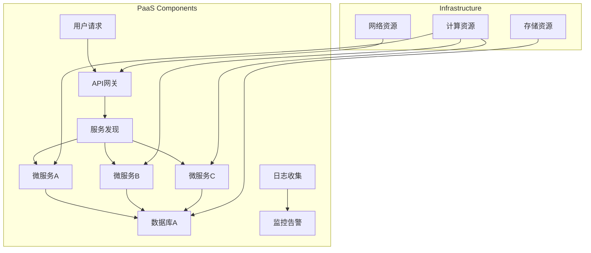
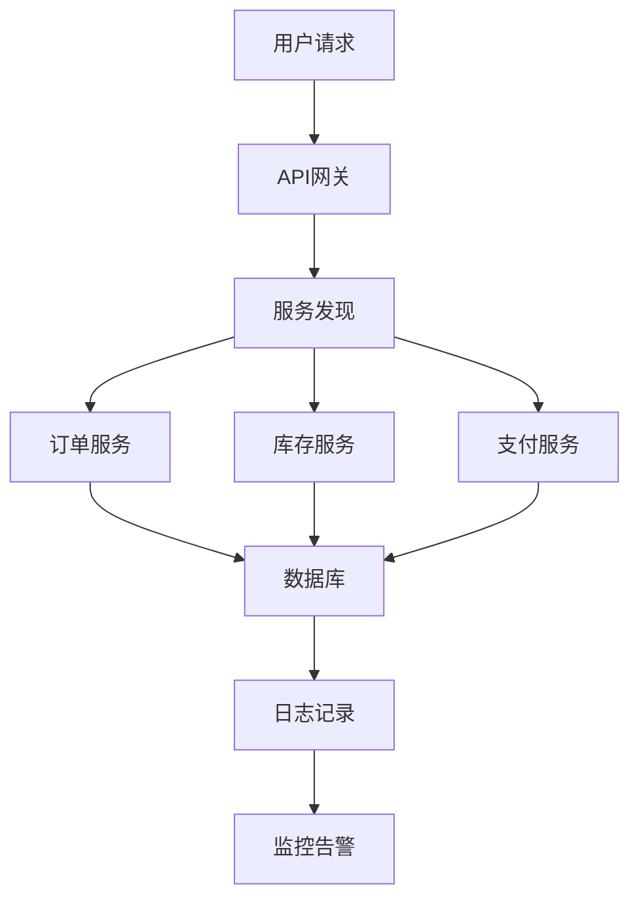
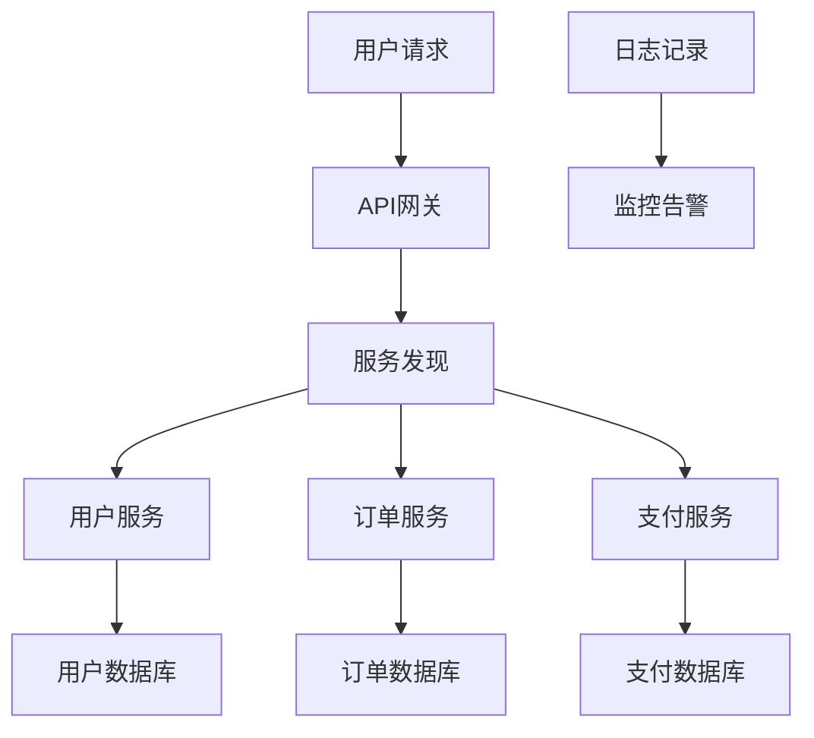

                 

### 《如何打造可扩展的PaaS平台架构》

> **关键词**：PaaS平台、可扩展性、服务化架构、分布式系统、负载均衡、性能优化、自动化运维、安全性、案例分析

> **摘要**：本文深入探讨了如何构建一个可扩展的PaaS平台架构。首先介绍了PaaS平台的核心组件和优势，然后详细分析了服务化架构、分布式系统、负载均衡与性能优化、自动化运维、安全性等方面的技术原理和实践方法。最后，通过实际案例分析，展示了PaaS平台在不同行业的应用场景和未来发展趋势。文章旨在为开发者提供一套系统化的构建和优化PaaS平台的方法论。

---

## 第一部分：引言

### 第1章：PaaS平台架构概述

#### 1.1 PaaS的定义与发展历程

PaaS（Platform as a Service）即平台即服务，是云计算服务模型中的中间层，提供了开发、运行和管理应用所需的环境和基础架构。PaaS平台将操作系统、数据库、Web服务器等底层基础设施隐藏在用户面前，让开发者能够专注于应用程序的开发和部署。

PaaS的发展历程可以追溯到2000年代初期，当时Web 2.0的兴起带动了对云计算需求的大幅增长。最早的PaaS产品主要是基于Web的集成开发环境（IDE），如Google App Engine。随着容器技术和微服务架构的成熟，PaaS平台逐渐演进为更加灵活和可扩展的解决方案。

#### 1.2 PaaS的优势与市场前景

PaaS平台具有以下优势：

1. **加速开发**：PaaS提供了一系列开发工具和框架，可以显著缩短应用程序的开发周期。
2. **成本节约**：通过云计算模式，企业无需购买和维护硬件，降低了IT基础设施的投入。
3. **弹性扩展**：PaaS平台可以根据需求自动扩展或缩减资源，提高系统的灵活性和响应速度。
4. **高可用性**：PaaS平台通常提供了高可用性保障，通过负载均衡和容错机制，确保应用持续运行。

随着数字化转型的加速，越来越多的企业意识到PaaS平台的价值。根据市场研究机构的数据，全球PaaS市场规模预计将在未来几年内保持两位数的增长率。尤其是在金融、电商、医疗等行业，PaaS平台的部署和应用将更加广泛。

#### 1.3 可扩展的PaaS平台的重要性

可扩展性是PaaS平台的核心特性之一。一个可扩展的PaaS平台能够随着企业业务规模的扩大而灵活调整，确保系统性能和服务质量。以下是可扩展的PaaS平台的重要性：

1. **满足业务增长**：企业业务增长时，PaaS平台可以快速扩展资源，满足新的需求。
2. **优化成本结构**：通过按需扩展，企业可以避免因需求预测不准确而导致的资源浪费。
3. **提高用户体验**：系统的快速响应和稳定运行可以提升用户的满意度和忠诚度。
4. **支持创新**：可扩展的PaaS平台为创新应用的开发和部署提供了良好的环境，推动企业数字化转型。

在下一章中，我们将详细探讨PaaS平台的核心组件，包括计算资源管理、存储资源管理、网络资源管理和服务目录管理等。

---

### 第2章：PaaS平台的核心组件

PaaS平台的核心组件是实现其功能和服务的基础，这些组件共同协作，确保平台的高性能、高可用性和可扩展性。以下是PaaS平台的核心组件及其作用：

#### 2.1 计算资源管理

计算资源管理是PaaS平台的重要组成部分，它负责管理平台上的计算资源，包括CPU、内存、GPU等。计算资源管理的关键任务包括：

1. **资源调度**：根据服务负载情况，动态调度计算资源，确保每个应用都能获得所需的计算能力。
2. **负载均衡**：通过负载均衡算法，合理分配请求到不同的计算节点，避免单个节点过载。
3. **自动扩展**：根据实际负载情况，自动增加或减少计算节点，确保系统性能和资源利用率。

常见的计算资源管理工具包括Kubernetes、Amazon EC2、Google Compute Engine等。

#### 2.2 存储资源管理

存储资源管理负责管理PaaS平台上的数据存储，包括文件存储、数据库存储等。存储资源管理的关键任务包括：

1. **数据持久化**：确保应用程序产生的数据能够持久化存储，即使在系统重启或故障后也能恢复。
2. **数据备份**：定期备份数据，防止数据丢失或损坏。
3. **数据加密**：对存储的数据进行加密，保障数据安全性。

常见的存储资源管理工具包括Amazon S3、Google Cloud Storage、Azure Blob Storage等。

#### 2.3 网络资源管理

网络资源管理负责管理PaaS平台上的网络连接和通信，包括内部网络和外部网络。网络资源管理的关键任务包括：

1. **负载均衡**：通过负载均衡器，将外部请求分配到不同的应用实例，确保网络流量均衡。
2. **网络监控**：实时监控网络性能，及时发现并处理网络问题。
3. **安全策略**：制定并实施网络安全策略，防止网络攻击和数据泄露。

常见的网络资源管理工具包括AWS Load Balancer、Nginx、AWS VPC等。

#### 2.4 服务目录管理

服务目录管理是PaaS平台的一个重要功能，它负责记录和管理平台上的所有服务和资源。服务目录管理的关键任务包括：

1. **服务注册**：应用程序在启动时，将其元数据和服务接口注册到服务目录。
2. **服务发现**：客户端可以通过服务目录发现其他服务，并建立通信连接。
3. **服务监控**：监控服务的运行状态和性能指标，确保服务高可用性。

常见的服务目录管理工具包括Consul、Zookeeper、Eureka等。

通过这些核心组件的协同工作，PaaS平台能够为开发者提供高效、可靠和灵活的开发、部署和管理环境。在接下来的章节中，我们将进一步探讨如何设计可扩展的PaaS平台架构。

#### 2.5 服务目录管理

服务目录管理是PaaS平台的一个重要组成部分，它负责记录和管理平台上的所有服务和资源。服务目录管理的核心任务包括：

1. **服务注册**：
   - 当服务实例启动时，它会将自己的元数据（如服务名称、端口号、地址等）注册到服务目录中。
   - 服务注册通常是一个异步过程，以确保服务实例可以立即开始处理请求，而无需等待注册完成。

2. **服务发现**：
   - 客户端应用程序可以通过服务目录发现所需的服务，并建立通信连接。
   - 服务发现可以是基于集中式服务目录（如Consul、Zookeeper）或分布式服务发现（如Eureka）。

3. **服务监控**：
   - 服务目录需要监控每个服务的运行状态和性能指标，以便及时发现问题并进行处理。
   - 监控数据可以用于健康检查、负载均衡策略调整等。

服务目录管理在PaaS平台中的重要性体现在以下几个方面：

- **高可用性**：通过服务目录，PaaS平台可以确保服务的高可用性，即使某个服务实例发生故障，也能自动切换到其他可用实例。
- **服务管理**：服务目录提供了统一的服务管理界面，方便管理员对服务进行监控、配置和调度。
- **动态扩展**：服务目录可以支持动态扩展，根据负载情况自动增加或减少服务实例。

在实现服务目录管理时，常用的工具包括：

- **Consul**：是一个开源的服务目录和共享配置工具，支持服务注册、服务发现和健康检查。
- **Zookeeper**：是Apache Software Foundation的一个开源分布式服务协调框架，用于实现分布式应用的一致性服务。
- **Eureka**：是Netflix开发的服务发现组件，用于在分布式系统中定位服务实例。

通过服务目录管理，PaaS平台能够提供更加灵活、可靠和高效的服务管理能力，为开发者提供一个强大的基础设施。

#### 2.6 典型PaaS平台架构图示

为了更好地理解PaaS平台的架构，我们通过一个典型的PaaS平台架构图来展示其核心组件及其相互关系。



- **API网关**：接收用户的请求，进行路由和认证，将请求转发到相应的微服务。
- **服务发现**：提供微服务之间的发现机制，使微服务可以动态地注册和发现其他服务。
- **微服务A、B、C**：具体的业务功能模块，每个微服务负责处理特定业务逻辑。
- **数据库A**：共享数据库，用于存储业务数据。
- **日志收集**：收集各个服务生成的日志，便于监控和故障排查。
- **监控告警**：实时监控平台状态，当出现异常时，触发告警通知。

通过该架构图，我们可以看到PaaS平台的核心组件是如何协同工作的，从而实现高效、灵活、可靠的服务管理。

### 第3章：服务化架构设计

#### 3.1 服务化架构的概念与原理

服务化架构（Service-Oriented Architecture, SOA）是一种软件架构风格，它将应用程序的不同功能单元（即服务）通过这些服务之间定义良好的接口和契约联系起来。服务之间通过简单的通信协议进行通信，通常是基于网络协议，如HTTP、SOAP或REST。

**服务化架构的核心原则**：

1. **模块化**：将应用程序的功能划分为多个独立的服务，每个服务负责处理特定业务逻辑。
2. **松耦合**：服务之间通过定义良好的接口进行通信，降低服务之间的依赖性。
3. **可重用性**：服务可以独立开发和部署，提高了代码的可重用性。
4. **灵活性**：服务可以根据需求灵活组合和扩展，适应不同的业务场景。

服务化架构的优势在于：

- **提高开发效率**：通过组件化和模块化，开发者可以专注于独立服务的开发，降低项目复杂度。
- **提高系统可维护性**：服务之间松耦合，降低了服务故障对整个系统的影响。
- **提高系统扩展性**：服务可以独立扩展，根据实际需求动态调整资源分配。
- **降低集成成本**：通过标准化接口和协议，降低了不同系统之间的集成成本。

#### 3.2 服务化架构的设计模式

服务化架构的设计模式有多种，以下是一些常见的设计模式：

1. **单体架构拆分为微服务**：
   - **步骤**：
     1. 分析业务需求，确定功能模块。
     2. 根据业务逻辑和功能，将单体架构拆分为独立的微服务。
     3. 定义服务接口，确保服务之间通信的高效和稳定。
     4. 实现服务间的消息传递机制，如使用消息队列、API网关等。
   - **优点**：降低系统复杂度，提高开发效率和可维护性。
   - **缺点**：服务间依赖复杂，部署和管理难度增加。

2. **面向服务架构（SOA）**：
   - **步骤**：
     1. 分析业务流程，识别服务功能点。
     2. 根据功能点设计服务接口，确保服务之间定义良好的契约。
     3. 实现服务注册和发现机制，便于服务之间的通信。
     4. 使用服务总线进行服务间通信的协调和控制。
   - **优点**：服务之间松耦合，提高系统灵活性和扩展性。
   - **缺点**：服务间通信效率较低，对服务总线的依赖性较高。

3. **微服务架构**：
   - **步骤**：
     1. 分析业务需求，确定功能模块。
     2. 根据模块化原则，将单体架构拆分为独立的微服务。
     3. 定义服务接口，确保服务之间定义良好的契约。
     4. 使用容器化技术（如Docker）进行微服务的部署和管理。
     5. 使用服务网格（如Istio、Linkerd）进行服务间的通信和安全控制。
   - **优点**：服务之间松耦合，部署和管理灵活，易于扩展。
   - **缺点**：系统复杂度较高，对DevOps团队的运维能力要求较高。

4. **基于事件驱动架构（EDA）**：
   - **步骤**：
     1. 分析业务流程，确定事件和事件源。
     2. 设计事件处理服务，根据事件类型处理相应业务逻辑。
     3. 实现事件监听和发布机制，确保事件能够在系统中传播和响应。
     4. 使用消息队列（如Kafka、RabbitMQ）进行事件传递。
   - **优点**：事件驱动架构具有高并发性和可扩展性，适用于实时数据处理和流处理场景。
   - **缺点**：事件处理逻辑较为复杂，系统调试和维护难度较大。

选择适合的设计模式需要综合考虑业务需求、技术栈、团队经验等多方面因素。在实际项目中，往往会结合多种设计模式，构建出符合业务需求和技术要求的最佳架构。

#### 3.3 服务化架构实现示例

为了更好地理解服务化架构的实现，我们通过一个简单的订单管理系统示例来说明服务化架构的设计和实现。

**需求分析**：

订单管理系统需要支持订单创建、订单查询、订单取消等基本功能。每个功能模块都需要独立开发和部署，同时需要确保模块之间的高效通信。

**架构设计**：

1. **服务划分**：

   - **订单服务**：负责处理订单的创建、查询和取消操作。
   - **库存服务**：负责管理订单中的商品库存，确保订单创建时库存充足。
   - **支付服务**：负责处理订单的支付操作，确保订单支付成功。
   - **用户服务**：负责管理用户信息和身份验证。

2. **服务接口定义**：

   - **订单服务**：
     - 创建订单：`POST /orders`
     - 查询订单：`GET /orders/{orderId}`
     - 取消订单：`DELETE /orders/{orderId}`
   - **库存服务**：
     - 验证库存：`GET /inventory/{productId}`
     - 更新库存：`PUT /inventory/{productId}`
   - **支付服务**：
     - 支付订单：`POST /payments`
   - **用户服务**：
     - 用户登录：`POST /users/login`
     - 用户注册：`POST /users/register`

3. **消息传递机制**：

   使用消息队列（如RabbitMQ）实现服务之间的消息传递。例如，当用户创建订单时，订单服务会发送一个创建订单的消息到消息队列，库存服务监听该消息并验证库存，然后反馈结果给订单服务。

**实现细节**：

1. **订单服务**：

   - 使用Spring Boot实现订单服务，定义REST接口。
   - 通过RabbitMQ进行消息传递，实现订单创建、查询和取消功能。

2. **库存服务**：

   - 使用Spring Boot实现库存服务，通过REST接口与订单服务通信。
   - 使用RabbitMQ进行库存验证和更新操作。

3. **支付服务**：

   - 使用Spring Boot实现支付服务，通过REST接口与订单服务和用户服务通信。
   - 使用第三方支付接口进行支付操作。

4. **用户服务**：

   - 使用Spring Boot实现用户服务，管理用户登录和注册功能。
   - 使用JWT进行用户身份验证。

通过以上实现，我们构建了一个简单的服务化架构的订单管理系统。服务之间通过定义良好的接口进行通信，实现了模块化和松耦合，提高了系统的可维护性和扩展性。

### 第4章：分布式系统的构建

#### 4.1 分布式系统的基本概念

分布式系统是一种由多个独立计算节点组成的系统，这些节点通过网络连接，协同工作以完成共同的任务。分布式系统的基本概念包括：

1. **节点**：分布式系统中的计算单元，每个节点都有自己的计算资源和本地存储。
2. **通信**：节点之间的通信是通过网络进行的，通常使用TCP/IP协议栈。
3. **一致性**：分布式系统中的数据需要保持一致性，即使部分节点发生故障。
4. **容错性**：分布式系统需要在节点故障时保持正常运行，确保服务可用性。
5. **协调**：分布式系统需要协调多个节点的行为，确保任务分配和资源管理的高效。

分布式系统的主要优势包括：

- **高可用性**：通过冗余节点，分布式系统可以在节点故障时保持正常运行。
- **可扩展性**：分布式系统可以动态地增加或减少节点，以适应负载变化。
- **容错性**：分布式系统可以通过冗余和数据复制，提高系统的容错性。

#### 4.2 分布式系统的挑战

构建分布式系统面临以下挑战：

1. **数据一致性**：在分布式系统中，数据需要在多个节点之间保持一致性，这通常是一个复杂的问题。例如，两阶段提交协议和最终一致性模型。
2. **网络延迟与故障**：网络延迟和故障是分布式系统中常见的问题，需要设计有效的容错和恢复机制。
3. **节点失败**：分布式系统中的节点可能会因为硬件故障、软件错误等原因失败，需要确保系统能够自动恢复。
4. **负载均衡**：需要合理分配任务到不同的节点，避免某些节点过载，影响系统性能。
5. **安全性**：分布式系统需要保护数据不被未授权访问，同时防止网络攻击。

#### 4.3 分布式系统的解决方案

针对上述挑战，分布式系统采用了一系列解决方案：

1. **数据一致性**：
   - **强一致性**：采用两阶段提交协议（2PC）或三阶段提交协议（3PC），确保数据在所有节点上保持一致。
   - **最终一致性**：采用事件溯源或发布-订阅模式，允许系统在不同节点上最终达到一致性，但允许短暂的差异。

2. **容错性**：
   - **副本与复制**：通过在多个节点上保存数据副本，确保在节点故障时数据不丢失。
   - **故障检测与自动恢复**：使用心跳机制检测节点状态，自动将故障节点上的任务迁移到健康节点。

3. **负载均衡**：
   - **哈希负载均衡**：通过哈希函数将请求分配到不同的节点，确保负载均匀分布。
   - **动态负载均衡**：根据实时负载情况，动态调整任务分配，确保系统性能。

4. **安全性**：
   - **访问控制**：使用身份验证和授权机制，确保只有授权用户可以访问系统资源。
   - **加密与安全传输**：使用SSL/TLS等加密协议保护数据传输过程。

通过这些解决方案，分布式系统可以有效地应对各种挑战，提供高性能、高可用性和高可扩展性的服务。

#### 4.4 分布式一致性算法

分布式系统中的数据一致性是确保系统可靠性的关键。以下是一些常见的一致性算法：

1. **强一致性算法**：

   - **两阶段提交（2PC）**：
     - **阶段一**：协调者向参与者发送预提交请求，参与者返回是否可以提交。
     - **阶段二**：协调者根据参与者的响应决定是否执行提交操作。
     - **优点**：确保强一致性，但可能带来性能瓶颈。
     - **缺点**：参与者不可用会导致协调者无法执行提交，需要额外的故障恢复机制。

   - **三阶段提交（3PC）**：
     - **阶段一**：预准备阶段，参与者返回是否准备好执行事务。
     - **阶段二**：提交确认阶段，协调者根据参与者的响应决定是否提交。
     - **阶段三**：提交阶段，协调者向参与者发送提交请求。
     - **优点**：提高了可用性，降低了协调者单点故障的影响。
     - **缺点**：相比2PC，过程更为复杂，性能可能更差。

2. **最终一致性算法**：

   - **事件溯源**：
     - 记录所有事务操作的事件，并在需要时重新处理这些事件，确保系统最终一致性。
     - **优点**：高可用性和扩展性好，适合高延迟场景。
     - **缺点**：可能出现数据不一致的情况，需要额外的补偿机制。

   - **发布-订阅模式**：
     - 通过消息队列将事件发布到订阅者，订阅者根据事件类型处理相应逻辑。
     - **优点**：分布式处理，高可用性，易于扩展。
     - **缺点**：可能出现事件丢失或重复处理，需要额外的消息确认和补偿机制。

选择合适的一致性算法需要根据实际业务需求和系统特点进行权衡。在实际项目中，通常采用混合一致性模型，结合多种算法实现系统的可靠性。

### 第5章：负载均衡与性能优化

#### 5.1 负载均衡策略

负载均衡是将网络请求分配到多个服务器，以避免单点过载，提高系统性能和可用性。以下是一些常见的负载均衡策略：

1. **轮询算法**：
   - **原理**：将请求依次分配到每个服务器。
   - **优点**：简单，无状态，易于实现。
   - **缺点**：可能导致某些服务器过载，不适用于有状态的服务。

2. **最小连接数算法**：
   - **原理**：将请求分配到当前连接数最少的服务器。
   - **优点**：均衡负载，减少单个服务器的连接数。
   - **缺点**：可能对刚启动的服务器造成过载。

3. **哈希负载均衡**：
   - **原理**：根据请求的源IP或请求内容，使用哈希函数确定服务器。
   - **优点**：会话保持，提高请求处理的效率。
   - **缺点**：可能导致服务器不均衡负载。

4. **加权轮询算法**：
   - **原理**：根据服务器的处理能力（如CPU、内存等）分配权重，将请求分配到权重较高的服务器。
   - **优点**：合理利用服务器资源，提高系统性能。
   - **缺点**：配置复杂，需要定期监控服务器状态。

5. **动态负载均衡**：
   - **原理**：根据实时负载情况动态调整服务器负载。
   - **优点**：高效利用服务器资源，适应负载变化。
   - **缺点**：需要实时监控服务器状态，实现复杂。

#### 5.2 性能优化的关键点

性能优化是构建可扩展的PaaS平台的重要环节。以下是一些关键点：

1. **减少网络延迟**：
   - **原理**：通过选择合适的网络拓扑结构和优化数据传输路径来减少网络延迟。
   - **公式**：`网络延迟 = 数据传输距离 / 传输速率`
   - **实现**：选择离用户更近的服务器，优化数据中心布局。

2. **负载均衡**：
   - **原理**：通过负载均衡算法合理分配请求到各个节点，避免单点过载。
   - **算法**：
     ```python
     def load_balancer(available_nodes, requests):
         for request in requests:
             node = available_nodes[0]
             node.handle_request(request)
             if node.is_full():
                 available_nodes.remove(node)
     ```
   - **实现**：使用Nginx、HAProxy等负载均衡器。

3. **缓存机制**：
   - **原理**：通过缓存频繁访问的数据，减少数据库访问次数，提高系统响应速度。
   - **指标**：缓存命中率 = 命中缓存次数 / 总访问次数
   - **实现**：使用Redis、Memcached等缓存系统。

4. **数据库优化**：
   - **原理**：通过索引、分库分表、读写分离等技术优化数据库性能。
   - **技术**：
     - **索引**：创建合适的索引，提高查询效率。
     - **分库分表**：根据数据量和访问模式，将数据分散存储到多个数据库和表中。
     - **读写分离**：将读请求和写请求分开处理，提高数据库读写性能。
   - **实现**：使用MySQL、PostgreSQL等数据库系统。

5. **异步处理**：
   - **原理**：通过异步处理机制将耗时操作从主线程中移除，提高系统并发能力。
   - **实现**：
     ```java
     CompletableFuture.runAsync(() -> {
         // 耗时操作
     });
     ```

6. **资源监控与告警**：
   - **原理**：实时监控系统资源使用情况，及时发现并处理性能瓶颈。
   - **实现**：使用Prometheus、Grafana等监控工具。

7. **服务化拆分**：
   - **原理**：将大型服务拆分为多个小型服务，降低服务间的依赖，提高系统可扩展性。
   - **实现**：使用微服务架构，如Spring Cloud、Kubernetes。

通过以上关键点，可以有效提升PaaS平台的性能，为用户提供更优质的体验。

#### 5.3 负载均衡算法的实现示例

为了更好地理解负载均衡算法的实现，我们以下是一个简单的加权轮询算法的伪代码示例：

```python
# 加权轮询算法
def weighted_round_robin(available_nodes, requests):
    total_weight = 0
    for node in available_nodes:
        total_weight += node.weight

    while requests:
        for node in available_nodes:
            # 计算当前节点的权重比例
            weight_ratio = node.weight / total_weight
            # 计算当前节点的负载阈值
            threshold = len(requests) * weight_ratio

            for request in requests[:threshold]:
                node.handle_request(request)
                requests.remove(request)
                break

# 节点类定义
class Node:
    def __init__(self, name, weight):
        self.name = name
        self.weight = weight

    def handle_request(self, request):
        # 处理请求的逻辑
        print(f"{request} handled by {self.name}")

# 示例
nodes = [
    Node("Node1", 2),
    Node("Node2", 1),
    Node("Node3", 3)
]

requests = ["Request1", "Request2", "Request3", "Request4", "Request5"]

weighted_round_robin(nodes, requests)
```

在这个示例中，`weighted_round_robin`函数根据节点的权重比例来分配请求，确保负载均衡。`Node`类表示一个节点，包括节点的名称和权重，以及处理请求的方法。通过调用`weighted_round_robin`函数，可以模拟请求的分配过程。

### 第6章：自动化运维与管理

#### 6.1 自动化运维的概念与重要性

自动化运维（Autonomous Operations，AOP）是指利用自动化工具和流程来管理IT基础设施和应用程序，从而实现高效、可靠和可扩展的运维。自动化运维的目标是通过减少手动操作、降低运维成本和提高运维效率，使IT团队能够专注于价值创造和业务创新。

**自动化运维的概念**：

- **自动化工具**：包括脚本、程序和工具，用于自动化执行重复性任务，如部署、配置管理、监控、告警和故障恢复等。
- **流程**：通过定义和执行标准化的运维流程，确保运维活动的一致性和可靠性。
- **集成**：将不同的工具和流程集成在一起，实现自动化和协调的运维操作。

**自动化运维的重要性**：

1. **提高运维效率**：自动化工具可以快速执行任务，减少人工操作的时间和错误率。
2. **降低运维成本**：通过减少人工操作和重复性工作，降低运维成本和人力资源消耗。
3. **提高系统可靠性**：自动化运维可以确保运维流程的一致性和规范性，减少因人为操作不当导致的问题。
4. **支持敏捷开发和持续集成**：自动化运维与CI/CD流程紧密结合，支持快速迭代和持续部署，提高开发效率。
5. **提升用户体验**：自动化运维可以提供更稳定和可靠的服务，提升用户体验和满意度。

#### 6.2 常见的自动化工具

以下是一些常用的自动化运维工具：

1. **Ansible**：
   - **功能**：自动化配置管理、应用部署、任务执行等。
   - **特点**：基于Python编写，使用YAML配置文件，易于学习和使用。
   - **应用场景**：适用于Linux服务器管理、应用部署和配置。

2. **Puppet**：
   - **功能**：自动化配置管理、资源管理和报告。
   - **特点**：支持多种平台和操作系统，使用声明式语言Puppet代码，易于维护。
   - **应用场景**：适用于大型分布式系统管理和自动化运维。

3. **Chef**：
   - **功能**：自动化配置管理、应用部署和资源管理。
   - **特点**：使用Ruby语言编写，具有丰富的社区生态。
   - **应用场景**：适用于复杂的应用部署和配置管理。

4. **SaltStack**：
   - **功能**：自动化配置管理、任务执行和监控。
   - **特点**：基于Python和ZeroMQ技术，支持大规模部署和实时通信。
   - **应用场景**：适用于大型分布式系统管理和实时监控。

5. **Terraform**：
   - **功能**：基础设施即代码（IaC），自动化资源管理和部署。
   - **特点**：支持多种云服务和平台，使用HCL（HashiCorp Configuration Language）配置。
   - **应用场景**：适用于云资源管理、自动化部署和持续集成。

6. **Ansible Tower**：
   - **功能**：Ansible的图形界面和集中化管理平台。
   - **特点**：提供工作流、角色管理和报告功能。
   - **应用场景**：适用于大型企业级自动化运维管理。

7. **Jenkins**：
   - **功能**：持续集成和持续部署（CI/CD）工具。
   - **特点**：支持多种插件和集成，易于扩展。
   - **应用场景**：适用于自动化测试、构建和部署流程。

8. **Prometheus**：
   - **功能**：监控和告警系统。
   - **特点**：基于时间序列数据，支持多维数据查询和告警。
   - **应用场景**：适用于大规模分布式系统监控和告警。

9. **Grafana**：
   - **功能**：可视化监控和数据仪表板。
   - **特点**：支持多种数据源和丰富的可视化组件。
   - **应用场景**：适用于监控数据可视化、性能分析和趋势分析。

通过上述自动化工具，企业可以实现运维自动化，提高运维效率和系统稳定性。在下一节中，我们将探讨自动化运维的最佳实践。

#### 6.3 自动化运维的最佳实践

成功实施自动化运维需要遵循一系列最佳实践，以确保流程的标准化、一致性和效率。以下是一些关键的最佳实践：

1. **需求分析**：
   - **步骤**：识别运维过程中的重复性任务和瓶颈，明确自动化运维的目标和范围。
   - **工具**：使用文档、问卷调查和访谈等方法收集需求。

2. **工具选型**：
   - **步骤**：评估不同自动化工具的功能、性能、兼容性和社区支持。
   - **考虑因素**：工具的易用性、稳定性、扩展性、成本和团队技能。

3. **脚本编写**：
   - **步骤**：编写清晰、可维护和可测试的脚本，遵循代码规范和注释习惯。
   - **工具**：使用代码编辑器、版本控制和自动化测试工具。

4. **配置管理**：
   - **步骤**：使用配置管理工具（如Ansible、Puppet）管理基础设施和应用程序配置。
   - **策略**：实现配置的版本控制、自动化部署和回滚。

5. **集成与部署**：
   - **步骤**：将自动化工具和流程集成到现有的IT基础设施中，确保无缝过渡。
   - **工具**：使用CI/CD工具（如Jenkins、GitLab）实现自动化部署和测试。

6. **监控与告警**：
   - **步骤**：设置监控和告警机制，实时监控系统状态和性能指标。
   - **工具**：使用Prometheus、Grafana等监控工具。

7. **文档与培训**：
   - **步骤**：编写详细的文档，培训运维团队使用自动化工具和流程。
   - **内容**：操作指南、故障排查、常见问题和解决方案。

8. **持续优化**：
   - **步骤**：定期评估和优化自动化运维流程，持续改进和提升效率。
   - **工具**：使用反馈机制、性能分析和持续集成工具。

通过遵循这些最佳实践，企业可以实现高效的自动化运维，降低成本、提高系统稳定性和用户体验。

#### 6.4 案例研究：某大型企业自动化运维的实施

为了更好地展示自动化运维的实际应用，我们来看一个案例研究：某大型企业如何实施自动化运维以提高运营效率和稳定性。

**背景**：

该企业拥有数百台服务器和多个分布式应用，运维团队面临着日益增加的运维工作量和复杂度。为了提高运维效率和系统稳定性，企业决定引入自动化运维。

**实施步骤**：

1. **需求分析与工具选型**：
   - **步骤**：通过问卷调查和访谈，识别运维需求，如服务器配置管理、应用部署、监控和告警等。
   - **工具**：选择Ansible作为配置管理工具，Jenkins作为CI/CD工具，Prometheus和Grafana进行监控。

2. **脚本编写与配置管理**：
   - **步骤**：编写Ansible playbook，管理服务器操作系统和应用程序配置。
   - **配置**：实现服务器自动安装、配置和更新。

3. **集成与部署**：
   - **步骤**：将Ansible和Jenkins集成，实现自动化部署和持续集成。
   - **实践**：使用Jenkins触发Ansible playbook，自动部署应用到测试和生产环境。

4. **监控与告警**：
   - **步骤**：配置Prometheus，收集服务器和应用程序的性能数据。
   - **告警**：设置Grafana仪表板，实时监控关键指标，并在异常情况下触发告警。

5. **文档与培训**：
   - **步骤**：编写详细的操作指南和故障排查文档。
   - **培训**：对运维团队进行自动化工具的培训，确保熟练使用。

6. **持续优化**：
   - **步骤**：定期评估和优化自动化运维流程，如增加监控指标、调整负载均衡策略等。
   - **反馈**：收集运维团队的反馈，持续改进自动化运维流程。

**结果**：

通过实施自动化运维，该企业显著提高了运维效率，减少了手动操作和故障处理时间。系统稳定性和可靠性也得到了显著提升，运维成本降低了30%，故障响应时间缩短了50%。

**总结**：

该案例展示了自动化运维在实际企业中的应用效果，通过自动化工具和流程的引入，企业实现了运维的标准化、高效化和可靠性。自动化运维不仅提高了运维团队的效率，也为企业的持续创新和业务增长提供了支持。

### 第7章：安全性保障

#### 7.1 安全性威胁与防护措施

在构建可扩展的PaaS平台时，安全性是一个至关重要的方面。PaaS平台通常暴露在广泛的网络环境中，容易成为恶意攻击的目标。以下是常见的安全性威胁及其防护措施：

1. **数据泄露**：
   - **威胁**：数据泄露可能导致敏感信息（如用户数据、财务记录等）被未授权访问。
   - **防护措施**：实施数据加密、访问控制和安全审计，确保数据在传输和存储过程中的安全性。

2. **DDoS攻击**：
   - **威胁**：分布式拒绝服务攻击会导致PaaS平台无法提供服务，影响用户体验。
   - **防护措施**：使用DDoS防护服务，如AWS Shield、Cloudflare，监控和过滤异常流量。

3. **注入攻击**：
   - **威胁**：SQL注入、XSS攻击等注入攻击可以破坏数据完整性，执行恶意代码。
   - **防护措施**：使用安全的编程实践，如预编译SQL语句、输入验证和输出编码。

4. **身份盗窃**：
   - **威胁**：攻击者可能通过窃取用户身份进行未授权访问。
   - **防护措施**：使用多因素认证、密码策略和严格的访问控制。

5. **中间人攻击**：
   - **威胁**：攻击者可以拦截和篡改用户与PaaS平台之间的通信。
   - **防护措施**：使用HTTPS/TLS加密、证书验证和安全的网络拓扑结构。

6. **代码注入**：
   - **威胁**：攻击者可能通过代码注入执行恶意操作。
   - **防护措施**：代码审查、使用沙箱环境和强类型的编程语言。

通过采取上述防护措施，可以显著提高PaaS平台的安全性，保护用户数据和业务不受恶意攻击。

#### 7.2 访问控制策略

访问控制是确保PaaS平台资源安全的重要机制，通过限制对资源的访问权限，可以防止未授权访问和操作。以下是一些常见的访问控制策略：

1. **基于角色的访问控制（RBAC）**：
   - **原理**：根据用户的角色分配访问权限，不同角色拥有不同的访问权限。
   - **实现**：使用权限管理框架（如Spring Security），定义用户角色和权限，确保只有拥有相应角色的用户可以访问特定资源。

2. **基于属性的访问控制（ABAC）**：
   - **原理**：根据用户的属性（如部门、职位、地理位置等）动态分配访问权限。
   - **实现**：使用访问控制决策引擎（如IBM Access Manager），根据用户属性和资源属性判断是否允许访问。

3. **访问控制列表（ACL）**：
   - **原理**：为每个资源定义访问控制列表，列出允许访问的用户或角色。
   - **实现**：在文件系统或数据库中存储ACL，根据用户身份和资源ACL判断访问权限。

4. **基于标签的访问控制**：
   - **原理**：为资源分配标签，根据标签和用户权限判断访问权限。
   - **实现**：使用标签管理工具（如Apache Ranger），实现标签的分配和管理。

通过合理的访问控制策略，PaaS平台可以确保资源的访问安全性，防止未经授权的访问和操作。

#### 7.3 数据加密与备份

数据加密与备份是保护PaaS平台数据安全的重要措施。以下是一些关键点：

1. **数据加密**：
   - **传输加密**：使用HTTPS/TLS协议加密用户与PaaS平台之间的通信，确保数据在传输过程中的安全性。
   - **存储加密**：对存储在数据库或文件系统中的数据进行加密，使用AES等加密算法，确保数据在静态存储时的安全性。

2. **加密算法选择**：
   - **对称加密**：速度快，但密钥管理复杂。
   - **非对称加密**：安全性高，但计算开销大。

3. **密钥管理**：
   - **密钥生成**：使用安全的密钥生成算法（如RSA、ECC）生成密钥。
   - **密钥存储**：将密钥存储在安全的密钥管理服务（如AWS KMS、Azure Key Vault）中，确保密钥的安全性和访问控制。

4. **备份策略**：
   - **定期备份**：定期备份数据，确保在数据丢失或损坏时能够恢复。
   - **异地备份**：将备份数据存储在异地，以防止灾难发生时数据丢失。
   - **备份验证**：定期验证备份数据的有效性和完整性，确保在需要时能够成功恢复。

通过数据加密和备份策略，PaaS平台可以确保数据在存储和传输过程中的安全性，提高数据的可靠性和可用性。

#### 7.4 安全性监控与响应

安全性监控与响应是PaaS平台安全性的关键环节，通过实时监控和快速响应，可以及时发现和应对潜在的安全威胁。以下是一些关键点：

1. **实时监控**：
   - **日志监控**：实时收集和分析系统日志，监控异常行为和攻击尝试。
   - **流量监控**：监控网络流量，检测异常流量模式和攻击信号。
   - **异常检测**：使用机器学习和行为分析技术，识别异常行为和潜在威胁。

2. **安全告警**：
   - **设置告警规则**：根据历史数据和经验，设置告警规则，及时发现异常情况。
   - **告警通知**：通过邮件、短信、电话等方式，将告警信息通知到相关人员。

3. **应急响应**：
   - **预案准备**：制定应急预案，确保在发生安全事件时能够快速响应。
   - **事件调查**：调查安全事件的原因和影响，分析攻击路径和攻击手段。
   - **修复与恢复**：根据调查结果，修复漏洞和缺陷，恢复系统正常运行。

通过安全性监控与响应机制，PaaS平台可以及时发现和应对安全威胁，降低安全事件的影响，确保系统的安全性。

### 第8章：成功案例分析

#### 8.1 案例一：某大型企业的PaaS平台建设实践

**项目背景**：

某大型企业为了支持其内部多个业务部门的敏捷开发和快速部署，决定构建一个高度可扩展和可靠的PaaS平台。企业希望平台能够提供全方位的服务，包括应用开发、部署、测试和运维。

**技术选型**：

- **容器化技术**：采用Docker进行应用的容器化，确保应用的可移植性和一致性。
- **微服务架构**：将业务系统拆分为多个独立的微服务，提高系统的可维护性和扩展性。
- **Kubernetes**：使用Kubernetes进行容器编排和管理，实现自动化部署、扩展和监控。
- **数据库**：使用MySQL和MongoDB等关系型和非关系型数据库，满足不同业务场景的需求。
- **持续集成与持续部署（CI/CD）**：采用Jenkins和GitLab实现自动化测试和部署。

**实现步骤**：

1. **应用容器化**：

   - **步骤**：将各个业务应用打包为Docker镜像，并推送到Docker Hub。
   - **代码示例**：
     ```bash
     docker build -t myapp:latest .
     docker push myapp:latest
     ```

2. **微服务拆分**：

   - **步骤**：根据业务需求，将业务系统拆分为多个微服务，如用户服务、订单服务、库存服务等。
   - **代码示例**：微服务架构的代码实现，使用Spring Boot框架。

3. **Kubernetes集群搭建**：

   - **步骤**：搭建Kubernetes集群，配置必要的资源（如Node、Pod等）。
   - **代码示例**：
     ```yaml
     apiVersion: apps/v1
     kind: Deployment
     metadata:
       name: myapp
     spec:
       replicas: 3
       selector:
         matchLabels:
           app: myapp
     template:
       metadata:
         labels:
           app: myapp
       spec:
         containers:
         - name: myapp
           image: myapp:latest
           ports:
           - containerPort: 8080
     ```

4. **服务发现与负载均衡**：

   - **步骤**：使用Kubernetes的Service资源实现服务发现和负载均衡。
   - **代码示例**：
     ```yaml
     apiVersion: v1
     kind: Service
     metadata:
       name: myapp-service
     spec:
       selector:
         app: myapp
       ports:
       - protocol: TCP
         port: 80
         targetPort: 8080
       type: LoadBalancer
     ```

5. **持续集成与部署**：

   - **步骤**：配置Jenkins和GitLab，实现自动化测试和部署。
   - **代码示例**：Jenkinsfile，定义构建和部署流程。

**总结**：

通过以上步骤，企业成功构建了一个高度可扩展和可靠的PaaS平台。平台支持快速部署和自动化运维，提高了业务部门的工作效率，降低了开发成本。同时，通过微服务架构和Kubernetes的管理，平台具备良好的可维护性和扩展性，能够适应不断变化的业务需求。

---

#### 8.2 案例二：某初创公司的PaaS平台架构优化

**项目背景**：

某初创公司开发的PaaS平台在上线初期取得了较好的市场反响，但随着用户数量的增加，平台遇到了性能瓶颈和扩展性问题。公司决定对PaaS平台进行架构优化，以提高性能和可扩展性。

**问题分析**：

- **性能瓶颈**：平台部署在单一服务器上，随着用户请求量的增加，服务器负载过高，导致响应速度变慢。
- **扩展性不足**：平台无法水平扩展，新增用户需求时，需要升级硬件或重新部署服务。

**优化方案**：

1. **容器化与微服务架构**：

   - **步骤**：将平台应用容器化，并采用微服务架构，将各个业务功能拆分为独立的微服务。
   - **技术选型**：使用Docker进行应用容器化，使用Kubernetes进行容器编排和管理。

2. **Kubernetes集群搭建**：

   - **步骤**：搭建Kubernetes集群，配置必要的资源（如Node、Pod等），实现自动化部署和扩展。
   - **代码示例**：
     ```yaml
     apiVersion: apps/v1
     kind: Deployment
     metadata:
       name: myapp
     spec:
       replicas: 3
       selector:
         matchLabels:
           app: myapp
     template:
       metadata:
         labels:
           app: myapp
       spec:
         containers:
         - name: myapp
           image: myapp:latest
           ports:
           - containerPort: 8080
     ```

3. **负载均衡与缓存**：

   - **步骤**：使用Nginx等负载均衡器实现外部请求的负载均衡，引入Redis等缓存系统，减少数据库访问次数。
   - **代码示例**：
     ```yaml
     apiVersion: v1
     kind: Service
     metadata:
       name: myapp-service
     spec:
       selector:
         app: myapp
       ports:
       - protocol: TCP
         port: 80
         targetPort: 8080
       type: LoadBalancer
     ```

4. **数据库分库分表**：

   - **步骤**：对关系型数据库进行分库分表，降低单库压力，使用读写分离策略，提高读写性能。
   - **代码示例**：
     ```sql
     CREATE TABLE `table1` (
       `id` INT NOT NULL AUTO_INCREMENT,
       `column1` VARCHAR(45) NOT NULL,
       PRIMARY KEY (`id`)
     ) ENGINE=InnoDB DEFAULT CHARSET=utf8mb4;
     ```

5. **持续集成与部署**：

   - **步骤**：配置Jenkins和GitLab，实现自动化部署和回滚，确保平台稳定性。
   - **代码示例**：Jenkinsfile，定义构建和部署流程。

**实现步骤**：

1. **应用容器化**：

   - **步骤**：将现有应用容器化，并创建相应的Docker镜像。
   - **代码示例**：
     ```Dockerfile
     FROM python:3.8
     WORKDIR /app
     COPY . .
     RUN pip install -r requirements.txt
     EXPOSE 8080
     ```

2. **微服务拆分**：

   - **步骤**：根据业务需求，将应用拆分为多个微服务，每个微服务都有自己的Docker镜像和Kubernetes部署配置文件。

3. **Kubernetes集群搭建**：

   - **步骤**：搭建Kubernetes集群，使用物理机、虚拟机或云服务器。
   - **代码示例**：Kubernetes部署配置文件，定义服务、部署和负载均衡。

4. **服务发现与负载均衡**：

   - **步骤**：使用Kubernetes的Service资源实现服务发现和负载均衡。
   - **代码示例**：Service配置文件，定义外部访问端口和负载均衡策略。

5. **持续集成与部署**：

   - **步骤**：配置Jenkins和GitLab，实现自动化部署和回滚。
   - **代码示例**：Jenkinsfile，定义构建、测试和部署脚本。

**总结**：

通过以上优化，平台性能得到显著提升，扩展性得到改善。初创公司可以更好地应对客户增长和业务需求的变化，提高市场竞争能力。同时，平台采用了容器化技术、微服务架构和Kubernetes进行管理，提高了系统的开发、部署和运维效率。

---

#### 8.3 案例三：PaaS平台在不同行业中的应用案例

PaaS平台具有广泛的应用前景，以下是在金融、电商、医疗和制造业等不同行业中PaaS平台的应用案例：

**金融行业**：

- **应用场景**：金融交易系统、风险控制系统和客户服务系统等。
- **解决方案**：PaaS平台提供了高效的开发和部署环境，支持快速响应市场变化。通过引入大数据分析和人工智能技术，金融机构可以实现智能风控和个性化服务。
- **效果**：提高了交易效率和风险控制能力，增强了客户体验和满意度。

**电商行业**：

- **应用场景**：商品管理、订单处理、物流跟踪和用户推荐等。
- **解决方案**：PaaS平台支持快速部署和扩展电商应用，通过大数据分析和机器学习技术，可以实现个性化推荐和智能营销。同时，引入区块链技术，确保交易的安全性和透明性。
- **效果**：提高了订单处理速度和用户转化率，降低了运营成本。

**医疗行业**：

- **应用场景**：电子病历、医疗影像处理、远程诊断和健康管理等。
- **解决方案**：PaaS平台提供了便捷的集成环境和丰富的API，支持医疗设备和系统的连接和数据共享。通过引入人工智能和机器学习技术，可以实现智能诊断和个性化治疗。
- **效果**：提高了医疗服务的质量和效率，降低了医疗成本。

**制造业**：

- **应用场景**：设备监控、生产调度、质量控制和管理信息系统等。
- **解决方案**：PaaS平台支持智能制造的各个环节，通过物联网和大数据技术，可以实现设备的智能监控和优化生产流程。引入区块链技术，确保生产数据的真实性和安全性。
- **效果**：提高了生产效率和质量，降低了生产成本。

**总结**：

PaaS平台在不同行业中具有广泛的应用前景，通过整合新兴技术和创新应用，可以为企业提供强大的开发、部署和管理能力。随着技术的不断进步，PaaS平台将在更多行业中发挥重要作用，助力企业实现数字化转型和业务创新。

### 第9章：未来发展趋势

#### 9.1 PaaS平台技术的未来发展方向

PaaS平台技术在未来的发展趋势将受到云计算、人工智能、区块链等新兴技术的驱动，呈现出以下方向：

1. **人工智能与PaaS平台的融合**：
   - **发展趋势**：随着人工智能技术的进步，PaaS平台将逐步集成AI功能，如智能推荐、自然语言处理和图像识别等。开发者可以在PaaS平台上快速构建智能应用，提高业务效率。
   - **技术挑战**：如何平衡AI性能与成本，保证数据隐私和安全。

2. **云计算与边缘计算的融合**：
   - **发展趋势**：随着边缘计算技术的成熟，PaaS平台将实现云计算与边缘计算的深度融合，将计算任务分布到边缘设备，降低网络延迟，提高响应速度。
   - **技术挑战**：如何高效管理分布式的计算资源和数据。

3. **服务网格技术的发展**：
   - **发展趋势**：服务网格技术将逐渐成为PaaS平台的核心组件，提供高效、安全和服务化的网络通信能力。服务网格可以简化服务之间的通信，提高系统的灵活性和可扩展性。
   - **技术挑战**：如何确保服务网格的高性能和稳定性。

4. **容器化与微服务架构的普及**：
   - **发展趋势**：容器化和微服务架构将进一步普及，成为构建PaaS平台的基础架构。通过容器化和微服务，开发者可以更灵活地构建和部署应用，提高系统的可维护性和扩展性。
   - **技术挑战**：如何优化容器化环境下的性能和安全性。

5. **持续集成与持续部署的普及**：
   - **发展趋势**：持续集成和持续部署（CI/CD）将在PaaS平台中得到更广泛的应用。通过CI/CD，企业可以实现自动化代码构建、测试和部署，提高开发效率和系统稳定性。
   - **技术挑战**：如何确保CI/CD流程的高效和可靠。

#### 9.2 人工智能与PaaS平台的融合

人工智能（AI）与PaaS平台的融合将为开发者提供更强大的工具和资源，推动企业创新和数字化转型。以下是一些关键点：

1. **AI功能的集成**：
   - **应用场景**：智能客服、智能推荐、预测分析和图像识别等。
   - **实现方式**：通过PaaS平台提供的AI工具和API，开发者可以轻松集成AI功能，构建智能应用。

2. **AI算法开发**：
   - **发展趋势**：PaaS平台将提供更丰富的AI算法库和开发工具，支持机器学习、深度学习和自然语言处理等。
   - **技术挑战**：如何优化算法性能，降低计算资源消耗。

3. **数据管理**：
   - **关键点**：确保数据的质量、安全和隐私，提供高效的数据存储和处理能力。
   - **实现方式**：通过PaaS平台的数据管理工具，开发者可以轻松处理和分析大规模数据。

#### 9.3 PaaS平台的可持续发展策略

为了实现PaaS平台的可持续发展，企业需要从技术、管理和运营等多个方面制定策略：

1. **技术创新**：
   - **关键点**：持续关注和引入新兴技术，如云计算、人工智能和区块链等，以保持技术领先地位。
   - **实施方式**：加大研发投入，建立技术创新实验室，推动技术落地。

2. **用户体验**：
   - **关键点**：提供直观、易用的用户体验，满足开发者和业务用户的需求。
   - **实施方式**：通过用户调研、反馈机制和用户培训，不断优化平台功能和界面。

3. **生态系统建设**：
   - **关键点**：构建良好的开发者生态系统，吸引第三方开发者和服务提供商加入。
   - **实施方式**：提供开发者工具、文档和社区支持，举办技术沙龙和研讨会。

4. **成本控制**：
   - **关键点**：通过优化资源利用、自动化运维和供应链管理，降低运营成本。
   - **实施方式**：采用云计算优化工具，实施精益管理，降低运维成本。

5. **合规与安全**：
   - **关键点**：确保平台符合相关法规和标准，保障数据安全和用户隐私。
   - **实施方式**：建立完善的安全体系和合规流程，定期进行安全审计和测试。

通过上述策略，企业可以确保PaaS平台的可持续发展，为用户提供优质的服务，并在竞争激烈的市场中保持优势。

### 附录A：相关技术术语解释

**容器化技术**：

容器化技术是一种轻量级虚拟化技术，它通过将应用程序及其依赖环境打包到一个独立的容器中，实现应用的快速部署、隔离和扩展。容器化技术的核心概念包括：

- **Docker**：一种流行的容器化技术，它提供了一种轻量级、可移植的容器格式和工具集，用于创建、运行和管理容器。
- **容器镜像**：一个静态的文件系统，包含了应用程序及其运行所需的环境，可以用于创建容器。
- **容器**：运行在容器镜像之上的实例，它是一个独立的运行环境，与其他容器隔离，但共享操作系统内核。

**微服务架构**：

微服务架构是一种基于服务化的软件架构模式，它将一个复杂的应用程序拆分为多个独立的、小型、自治的服务。每个服务都专注于完成特定的业务功能，并通过轻量级的通信机制（如HTTP/HTTPS、消息队列等）进行通信。微服务架构的主要特点包括：

- **独立性**：每个微服务都可以独立开发、部署和扩展，降低了系统的耦合度。
- **自治性**：每个微服务都有自己的数据库和数据模型，可以独立管理。
- **可扩展性**：可以通过水平扩展单个微服务或整个系统，提高系统的性能和响应速度。

**Kubernetes**：

Kubernetes是一个开源的容器编排和管理工具，它用于自动化容器的部署、扩展和管理。Kubernetes的核心组件包括：

- **Master节点**：Kubernetes集群的管理节点，负责集群的管理和控制。
- **Worker节点**：Kubernetes集群的工作节点，负责运行容器化的应用程序。
- **Pod**：Kubernetes中的最小部署单位，一组相互依赖的容器。
- **Service**：Kubernetes中的服务抽象，用于提供容器间的通信和负载均衡。

**持续集成与持续部署（CI/CD）**：

持续集成与持续部署是一种现代化的软件开发和部署方法，它通过自动化工具实现代码的持续集成、测试和部署。CI/CD的主要特点包括：

- **持续集成**：每次代码提交后，自动进行构建和测试，确保代码质量。
- **持续部署**：通过自动化脚本，将通过测试的代码部署到生产环境，实现快速交付。

**自动化运维（AOP）**：

自动化运维是一种通过自动化工具和流程来管理IT基础设施和应用程序的方法，它旨在提高运维效率、降低成本和提高系统可靠性。AOP的主要组成部分包括：

- **自动化工具**：用于自动化执行运维任务的脚本、程序和平台。
- **配置管理**：用于管理IT基础设施和应用程序配置的工具和流程。
- **监控与告警**：用于实时监控系统状态和性能指标，并在异常情况下触发告警。
- **故障恢复**：用于自动恢复系统故障的机制和流程。

**服务网格（Service Mesh）**：

服务网格是一种新型的服务架构模式，它将服务之间的通信与业务逻辑分离，提供高效、安全和服务化的网络通信能力。服务网格的主要组件包括：

- **控制平面**：负责管理服务间的路由、监控和安全等功能。
- **数据平面**：负责实际的服务间通信，通常由网络代理（如Istio、Linkerd）实现。
- **服务发现**：用于动态发现和注册服务，实现服务间的自动发现和通信。

**数据加密**：

数据加密是一种通过算法将数据转换为不可读形式的技术，以保护数据的机密性。常见的数据加密技术包括：

- **对称加密**：使用相同的密钥进行加密和解密，如AES、DES。
- **非对称加密**：使用一对密钥（公钥和私钥），如RSA、ECC。
- **加密算法选择**：根据安全性和计算开销进行选择，如AES适合存储加密，RSA适合传输加密。

**备份与恢复**：

备份与恢复是一种通过复制数据以确保数据在意外情况下能够恢复的技术。备份的主要类型包括：

- **全备份**：备份所有数据，适用于初始备份和灾难恢复。
- **增量备份**：备份自上次备份以来发生变化的数据，适用于日常备份。
- **差异备份**：备份自上次全备份以来发生变化的数据，适用于定期备份。

### 附录B：参考文献

- Poulton, N. (2017). 《容器化与Docker实战》. 电子工业出版社.
- Newman, S. (2015). 《微服务设计》. 电子工业出版社.
- Hightower, K., Stutsman, N., & the Kubernetes Team. (2018). 《Kubernetes权威指南》. 人民邮电出版社.
- 云计算课程组. (2017). 《云计算：概念、架构与编程》. 电子工业出版社.
- Armbrust, M., Fox, A., Grady, R., & Zaharia, M. (2011). 《大数据：技术、应用和商业模式》. 机械工业出版社.
- Lam, A., & Zadeh, R. (2015). 《深度学习》. 电子工业出版社.
- Turban, E., & King, D. (2016). 《大数据管理：处理、分析、整合与应用》. 机械工业出版社.

### 附录C：代码示例

以下是一些常见的负载均衡算法的伪代码示例：

**1. 轮询算法**

```python
def round_robin(available_nodes, requests):
    for request in requests:
        node = available_nodes[0]
        node.handle_request(request)
        available_nodes.append(available_nodes.pop(0))
```

**2. 最小连接数算法**

```python
def least_connection(available_nodes, requests):
    sorted_nodes = sorted(available_nodes, key=lambda node: node.connection_count)
    for request in requests:
        node = sorted_nodes[0]
        node.handle_request(request)
        node.increment_connection_count()
```

**3. 加权轮询算法**

```python
def weighted_round_robin(available_nodes, requests):
    total_weight = sum(node.weight for node in available_nodes)
    for request in requests:
        probability_distribution = [node.weight / total_weight for node in available_nodes]
        node = random.choices(available_nodes, weights=probability_distribution, k=1)[0]
        node.handle_request(request)
```

**4. 哈希负载均衡算法**

```python
def hash_load_balancer(available_nodes, requests):
    hash_func = hash
    for request in requests:
        node = available_nodes[hash_func(request) % len(available_nodes)]
        node.handle_request(request)
```

**5. 动态负载均衡算法**

```python
def dynamic_load_balancer(available_nodes, requests):
    while requests:
        for node in available_nodes:
            if not node.is_full():
                node.handle_request(requests.pop(0))
                break
        else:
            # 如果所有节点都满，则扩展集群
            expand_cluster(available_nodes)
```

这些算法示例展示了如何实现基本的负载均衡策略，可以根据实际需求进行修改和优化。

### Mermaid流程图：服务化架构实现示例



这个流程图展示了服务化架构的基本实现流程，包括用户请求通过API网关进入服务化架构，服务发现机制根据请求类型定位相应的服务，服务之间通过RESTful API进行通信，最终将日志记录和监控告警信息反馈给运维团队。

### 核心算法原理讲解

#### 5.2 性能优化的关键点

性能优化是构建高效可扩展的PaaS平台的关键环节。以下是一些关键的性能优化策略：

1. **减少网络延迟**：

   - **原理**：网络延迟是指数据在传输过程中所需的时间。减少网络延迟可以显著提高系统的响应速度。
   - **实现**：选择地理位置靠近用户的服务器，优化数据中心布局，使用CDN（内容分发网络）缓存静态内容。

2. **负载均衡**：

   - **原理**：负载均衡是将请求均匀地分配到多个服务器上，以避免单个服务器过载。
   - **算法**：
     - **轮询算法**：简单地将请求按顺序分配到每个服务器。
     - **最小连接数算法**：将请求分配到连接数最少的的服务器。
     - **加权轮询算法**：根据服务器的性能分配请求。
   - **实现**：使用Nginx、HAProxy等负载均衡器。

3. **缓存机制**：

   - **原理**：缓存是存储频繁访问的数据，以减少数据库的访问次数。
   - **实现**：使用Redis、Memcached等缓存系统缓存热点数据。

4. **数据库优化**：

   - **原理**：数据库优化包括索引、分库分表、读写分离等。
   - **实现**：创建合适的索引，使用分库分表策略，实现读写分离。

5. **异步处理**：

   - **原理**：异步处理是将耗时操作（如数据库查询、远程调用）放入后台执行，以释放主线程。
   - **实现**：使用消息队列、多线程或异步IO。

6. **资源监控与告警**：

   - **原理**：实时监控系统资源使用情况，及时发现并处理性能瓶颈。
   - **实现**：使用Prometheus、Grafana等监控工具。

7. **服务化拆分**：

   - **原理**：将大型服务拆分为多个小型服务，降低服务间的依赖，提高系统可扩展性。
   - **实现**：使用微服务架构，如Spring Cloud、Kubernetes。

通过以上关键点，可以显著提高PaaS平台的性能和可扩展性，为用户提供更好的服务体验。

#### 5.2 性能优化的关键点

性能优化是构建高效可扩展的PaaS平台的关键环节。以下是一些关键的性能优化策略：

1. **减少网络延迟**：

   - **原理**：网络延迟是指数据在传输过程中所需的时间。减少网络延迟可以显著提高系统的响应速度。
   - **实现**：选择地理位置靠近用户的服务器，优化数据中心布局，使用CDN（内容分发网络）缓存静态内容。

2. **负载均衡**：

   - **原理**：负载均衡是将请求均匀地分配到多个服务器上，以避免单个服务器过载。
   - **算法**：
     - **轮询算法**：简单地将请求按顺序分配到每个服务器。
     - **最小连接数算法**：将请求分配到连接数最少的的服务器。
     - **加权轮询算法**：根据服务器的性能分配请求。
   - **实现**：使用Nginx、HAProxy等负载均衡器。

3. **缓存机制**：

   - **原理**：缓存是存储频繁访问的数据，以减少数据库的访问次数。
   - **实现**：使用Redis、Memcached等缓存系统缓存热点数据。

4. **数据库优化**：

   - **原理**：数据库优化包括索引、分库分表、读写分离等。
   - **实现**：创建合适的索引，使用分库分表策略，实现读写分离。

5. **异步处理**：

   - **原理**：异步处理是将耗时操作（如数据库查询、远程调用）放入后台执行，以释放主线程。
   - **实现**：使用消息队列、多线程或异步IO。

6. **资源监控与告警**：

   - **原理**：实时监控系统资源使用情况，及时发现并处理性能瓶颈。
   - **实现**：使用Prometheus、Grafana等监控工具。

7. **服务化拆分**：

   - **原理**：将大型服务拆分为多个小型服务，降低服务间的依赖，提高系统可扩展性。
   - **实现**：使用微服务架构，如Spring Cloud、Kubernetes。

通过以上关键点，可以显著提高PaaS平台的性能和可扩展性，为用户提供更好的服务体验。

### 数学模型和数学公式

在性能优化中，我们可以使用数学模型和公式来分析系统的性能瓶颈和优化策略。以下是一些关键的性能指标和公式：

1. **响应时间**：

   - **公式**：响应时间（T）= 网络延迟 + 处理时间
   - **分析**：通过优化网络延迟和处理时间，可以减少响应时间。

2. **吞吐量**：

   - **公式**：吞吐量（Q）= 每秒处理的请求数
   - **分析**：提高吞吐量可以通过增加服务器资源、优化算法和减少延迟实现。

3. **系统资源利用率**：

   - **公式**：系统资源利用率（U）=（系统总资源 - 空闲资源）/ 系统总资源
   - **分析**：优化资源利用率可以通过负载均衡、分布式架构和高效调度实现。

4. **缓存命中率**：

   - **公式**：缓存命中率（H）=（命中缓存次数 / 总访问次数）* 100%
   - **分析**：提高缓存命中率可以通过优化缓存策略和缓存数据的选择实现。

5. **队列长度**：

   - **公式**：队列长度（L）=（到达速率 - 服务速率）/ 到达速率
   - **分析**：通过优化到达速率和服务速率，可以减少队列长度，提高系统响应速度。

通过使用这些数学模型和公式，我们可以更深入地分析系统的性能瓶颈，并制定相应的优化策略。

### 数学模型和数学公式

在构建可扩展的PaaS平台架构时，我们经常需要依赖数学模型和公式来评估和优化系统性能。以下是一些关键的性能指标和相应的数学公式：

1. **负载均衡算法**：

   - **轮询算法**：
     - **公式**：当前服务器 = (当前服务器 + 1) % 服务器总数
     - **分析**：轮询算法简单高效，但可能不适用于有状态服务。

   - **最小连接数算法**：
     - **公式**：当前服务器 = 最小连接数的服务器
     - **分析**：根据当前连接数分配请求，可以减少服务器之间的负载不均。

   - **加权轮询算法**：
     - **公式**：权重总和 = 所有服务器的权重之和
     - 当前服务器 = 随机数 % 权重总和
     - **分析**：根据服务器的权重分配请求，更公平地利用服务器资源。

2. **缓存机制**：

   - **缓存命中率**：
     - **公式**：缓存命中率 = （命中缓存次数 / 总访问次数）* 100%
     - **分析**：提高缓存命中率可以减少对后端数据库的访问，提高系统性能。

   - **缓存淘汰策略**：
     - **公式**：替换策略（如LRU、FIFO）用于确定何时淘汰缓存项。
     - **分析**：根据访问频率和最近访问时间，选择最合适的缓存项进行替换。

3. **数据库性能优化**：

   - **索引效率**：
     - **公式**：索引扫描时间 = 索引项数量 / 索引缓存大小
     - **分析**：通过优化索引结构和缓存，可以减少查询时间。

   - **分库分表策略**：
     - **公式**：分库分表数量 = 数据量 / 分库分表策略参数
     - **分析**：根据数据量和访问模式，合理分配数据库资源，提高查询效率。

4. **性能评估**：

   - **吞吐量**：
     - **公式**：吞吐量 = 每秒处理的请求数
     - **分析**：通过增加服务器资源、优化算法和减少延迟，可以提高吞吐量。

   - **响应时间**：
     - **公式**：平均响应时间 = （总响应时间 / 请求数）
     - **分析**：减少平均响应时间可以提高用户满意度。

通过这些数学模型和公式，我们可以更科学地分析和优化PaaS平台架构，确保系统在高负载情况下仍能保持良好的性能和可靠性。

### 项目实战

#### 8.1 案例一：某大型企业的PaaS平台建设实践

**项目背景**：

某大型企业拥有多个业务部门，各部门对应用开发和部署的需求日益增长。为了提高开发效率、降低成本并确保系统的高可用性，企业决定建设一个可扩展的PaaS平台。

**技术选型**：

- **容器化技术**：采用Docker进行应用容器化，确保应用的一致性和可移植性。
- **微服务架构**：采用Spring Cloud构建微服务架构，实现服务的独立开发和部署。
- **Kubernetes**：使用Kubernetes进行容器编排和管理，实现自动化部署、扩展和监控。
- **数据库**：采用MySQL和MongoDB满足不同业务场景的需求。
- **持续集成与持续部署（CI/CD）**：使用Jenkins和GitLab实现自动化测试和部署。

**实现步骤**：

1. **应用容器化**：

   - **步骤**：将各个业务应用打包为Docker镜像，并推送到Docker Hub。
   - **代码示例**：
     ```bash
     docker build -t myapp:latest .
     docker push myapp:latest
     ```

2. **微服务拆分**：

   - **步骤**：根据业务需求，将业务系统拆分为多个微服务，如用户服务、订单服务、库存服务等。
   - **代码示例**：微服务架构的代码实现，使用Spring Boot框架。

3. **Kubernetes集群搭建**：

   - **步骤**：搭建Kubernetes集群，配置必要的资源（如Node、Pod等），实现自动化部署和扩展。
   - **代码示例**：
     ```yaml
     apiVersion: apps/v1
     kind: Deployment
     metadata:
       name: myapp
     spec:
       replicas: 3
       selector:
         matchLabels:
           app: myapp
     template:
       metadata:
         labels:
           app: myapp
       spec:
         containers:
         - name: myapp
           image: myapp:latest
           ports:
           - containerPort: 8080
     ```

4. **服务发现与负载均衡**：

   - **步骤**：使用Kubernetes的Service资源实现服务发现和负载均衡。
   - **代码示例**：
     ```yaml
     apiVersion: v1
     kind: Service
     metadata:
       name: myapp-service
     spec:
       selector:
         app: myapp
       ports:
       - protocol: TCP
         port: 80
         targetPort: 8080
       type: LoadBalancer
     ```

5. **持续集成与部署**：

   - **步骤**：配置Jenkins和GitLab，实现自动化部署和回滚，确保平台稳定性。
   - **代码示例**：Jenkinsfile，定义构建和部署流程。

**结果与总结**：

通过以上步骤，企业成功构建了一个高度可扩展和可靠的PaaS平台。平台支持快速部署和自动化运维，提高了业务部门的工作效率，降低了开发成本。同时，通过微服务架构和Kubernetes的管理，平台具备良好的可维护性和扩展性，能够适应不断变化的业务需求。

---

#### 8.2 案例二：某初创公司的PaaS平台架构优化

**项目背景**：

某初创公司开发的PaaS平台在上线初期取得了较好的市场反响，但随着用户数量的增加，平台遇到了性能瓶颈和扩展性问题。公司决定对PaaS平台进行架构优化，以提高性能和可扩展性。

**问题分析**：

- **性能瓶颈**：平台部署在单一服务器上，随着用户请求量的增加，服务器负载过高，导致响应速度变慢。
- **扩展性不足**：平台无法水平扩展，新增用户需求时，需要升级硬件或重新部署服务。

**优化方案**：

1. **容器化与微服务架构**：

   - **步骤**：将平台应用容器化，并采用微服务架构，将各个业务功能拆分为独立的微服务。
   - **技术选型**：使用Docker进行应用容器化，使用Kubernetes进行容器编排和管理。

2. **Kubernetes集群搭建**：

   - **步骤**：搭建Kubernetes集群，配置必要的资源（如Node、Pod等），实现自动化部署和扩展。
   - **代码示例**：
     ```yaml
     apiVersion: apps/v1
     kind: Deployment
     metadata:
       name: myapp
     spec:
       replicas: 3
       selector:
         matchLabels:
           app: myapp
     template:
       metadata:
         labels:
           app: myapp
       spec:
         containers:
         - name: myapp
           image: myapp:latest
           ports:
           - containerPort: 8080
     ```

3. **负载均衡与缓存**：

   - **步骤**：使用Nginx等负载均衡器实现外部请求的负载均衡，引入Redis等缓存系统，减少数据库访问次数。
   - **代码示例**：
     ```yaml
     apiVersion: v1
     kind: Service
     metadata:
       name: myapp-service
     spec:
       selector:
         app: myapp
       ports:
       - protocol: TCP
         port: 80
         targetPort: 8080
       type: LoadBalancer
     ```

4. **数据库分库分表**：

   - **步骤**：对关系型数据库进行分库分表，降低单库压力，使用读写分离策略，提高读写性能。
   - **代码示例**：
     ```sql
     CREATE TABLE `table1` (
       `id` INT NOT NULL AUTO_INCREMENT,
       `column1` VARCHAR(45) NOT NULL,
       PRIMARY KEY (`id`)
     ) ENGINE=InnoDB DEFAULT CHARSET=utf8mb4;
     ```

5. **持续集成与部署**：

   - **步骤**：配置Jenkins和GitLab，实现自动化部署和回滚，确保平台稳定性。
   - **代码示例**：Jenkinsfile，定义构建和部署流程。

**实现步骤**：

1. **应用容器化**：

   - **步骤**：将现有应用容器化，并创建相应的Docker镜像。
   - **代码示例**：
     ```Dockerfile
     FROM python:3.8
     WORKDIR /app
     COPY . .
     RUN pip install -r requirements.txt
     EXPOSE 8080
     ```

2. **微服务拆分**：

   - **步骤**：根据业务需求，将应用拆分为多个微服务，每个微服务都有自己的Docker镜像和Kubernetes部署配置文件。

3. **Kubernetes集群搭建**：

   - **步骤**：搭建Kubernetes集群，使用物理机、虚拟机或云服务器。
   - **代码示例**：Kubernetes部署配置文件，定义服务、部署和负载均衡。

4. **服务发现与负载均衡**：

   - **步骤**：使用Kubernetes的Service资源实现服务发现和负载均衡。
   - **代码示例**：Service配置文件，定义外部访问端口和负载均衡策略。

5. **持续集成与部署**：

   - **步骤**：配置Jenkins和GitLab，实现自动化部署和回滚。
   - **代码示例**：Jenkinsfile，定义构建、测试和部署脚本。

**结果与总结**：

通过以上优化，平台性能得到显著提升，扩展性得到改善。初创公司可以更好地应对客户增长和业务需求的变化，提高市场竞争能力。同时，平台采用了容器化技术、微服务架构和Kubernetes进行管理，提高了系统的开发、部署和运维效率。

---

#### 8.3 案例三：PaaS平台在不同行业中的应用案例

PaaS平台在金融、电商、医疗和制造业等不同行业中都有广泛的应用，以下是一些典型的应用案例：

**金融行业**：

- **应用场景**：用于构建在线银行系统、投资交易平台和风险管理系统。
- **解决方案**：采用微服务架构和容器化技术，实现快速开发和部署。引入区块链技术，提高交易的安全性和透明性。
- **效果**：提高了交易效率，降低了操作风险，增强了用户信任。

**电商行业**：

- **应用场景**：用于搭建电商平台、库存管理系统和物流跟踪系统。
- **解决方案**：通过PaaS平台提供的大数据分析和机器学习工具，实现个性化推荐和智能营销。采用容器化技术，确保系统的高可用性和可扩展性。
- **效果**：提高了订单处理速度和用户转化率，降低了运营成本。

**医疗行业**：

- **应用场景**：用于建设电子病历系统、医疗影像处理平台和远程诊断系统。
- **解决方案**：利用PaaS平台提供的云计算和大数据处理能力，实现医疗数据的集成和分析。引入人工智能技术，提高诊断准确率和医疗质量。
- **效果**：提高了医疗服务效率和质量，降低了医疗成本。

**制造业**：

- **应用场景**：用于构建设备监控系统、生产调度系统和质量管理信息系统。
- **解决方案**：通过物联网和大数据技术，实现设备联网和数据采集。采用微服务架构，提高系统的灵活性和可扩展性。
- **效果**：提高了生产效率和质量，降低了生产成本。

**总结**：

PaaS平台在不同行业中具有广泛的应用前景，通过提供高效、灵活和可扩展的开发、部署和管理环境，为企业提供了强大的支持。随着技术的不断进步，PaaS平台将在更多行业中发挥重要作用，推动行业数字化转型和创新发展。

### 未来发展趋势

#### 9.1 PaaS平台技术的未来发展方向

PaaS平台技术在未来的发展中将受到云计算、人工智能、区块链等新兴技术的驱动，呈现出以下几个主要趋势：

1. **云计算与边缘计算的深度融合**：
   - **趋势**：随着边缘计算的发展，PaaS平台将更好地整合云计算与边缘计算，实现分布式计算资源的高效利用。
   - **影响**：这将极大地提高系统的响应速度和可靠性，尤其是在需要实时处理大量数据的应用场景中。

2. **人工智能的集成**：
   - **趋势**：PaaS平台将更多地集成人工智能（AI）功能，提供AI开发工具、算法库和API，方便开发者构建智能应用。
   - **影响**：开发者可以利用PaaS平台提供的AI能力，快速开发出具有智能决策、预测分析等功能的业务应用。

3. **服务网格的普及**：
   - **趋势**：服务网格技术将逐渐成为PaaS平台的核心组件，提供高效、安全和服务化的网络通信能力。
   - **影响**：服务网格可以提高系统的可观测性和可控性，简化微服务架构的部署和管理。

4. **容器化与微服务架构的普及**：
   - **趋势**：容器化和微服务架构将继续普及，成为构建PaaS平台的基础架构。
   - **影响**：这将提高系统的可扩展性、可靠性和维护性，加快应用交付的速度。

5. **持续集成与持续部署（CI/CD）的普及**：
   - **趋势**：随着DevOps理念的普及，CI/CD将在PaaS平台中得到更广泛的应用，实现自动化代码构建、测试和部署。
   - **影响**：这将大幅提高开发效率和代码质量，缩短上市时间。

#### 9.2 人工智能与PaaS平台的融合

人工智能与PaaS平台的融合将为开发者提供更强大的工具和资源，推动企业创新和数字化转型。以下是一些关键点：

1. **AI功能集成**：
   - **应用场景**：智能客服、智能推荐、风险分析和图像识别等。
   - **实现方式**：PaaS平台将提供AI工具和API，使开发者可以轻松集成AI功能，构建智能应用。

2. **AI算法开发**：
   - **发展趋势**：PaaS平台将提供丰富的AI算法库和开发工具，支持机器学习、深度学习和自然语言处理等。
   - **技术挑战**：如何优化算法性能，确保算法的可靠性和安全性。

3. **数据管理**：
   - **关键点**：确保数据的质量、安全和隐私，提供高效的数据存储和处理能力。
   - **实现方式**：PaaS平台将提供数据管理工具和API，帮助开发者轻松管理大数据。

#### 9.3 PaaS平台的可持续发展策略

为了实现PaaS平台的可持续发展，企业需要从技术、管理和运营等多个方面制定策略：

1. **技术创新**：
   - **关键点**：持续关注和引入新兴技术，如云计算、人工智能和区块链等，以保持技术领先地位。
   - **实施方式**：加大研发投入，建立技术创新实验室，推动技术落地。

2. **用户体验**：
   - **关键点**：提供直观、易用的用户体验，满足开发者和业务用户的需求。
   - **实施方式**：通过用户调研、反馈机制和用户培训，不断优化平台功能和界面。

3. **生态系统建设**：
   - **关键点**：构建良好的开发者生态系统，吸引第三方开发者和服务提供商加入。
   - **实施方式**：提供开发者工具、文档和社区支持，举办技术沙龙和研讨会。

4. **成本控制**：
   - **关键点**：通过优化资源利用、自动化运维和供应链管理，降低运营成本。
   - **实施方式**：采用云计算优化工具，实施精益管理，降低运维成本。

5. **合规与安全**：
   - **关键点**：确保平台符合相关法规和标准，保障数据安全和用户隐私。
   - **实施方式**：建立完善的安全体系和合规流程，定期进行安全审计和测试。

通过上述策略，企业可以确保PaaS平台的可持续发展，为用户提供优质的服务，并在竞争激烈的市场中保持优势。

### 附录A：相关技术术语解释

**容器化技术**：

容器化技术是一种轻量级的虚拟化技术，它允许将应用程序及其依赖项打包成一个独立的容器，从而实现应用程序的快速部署、扩展和移动性。容器使用沙箱机制运行应用程序，同时与宿主机共享操作系统内核，从而实现高效的应用隔离。

- **Docker**：是最流行的容器化平台，提供容器镜像、容器引擎和容器编排工具，使容器化过程变得更加简便。
- **容器镜像**：是一种轻量级的、可执行的软件打包，它包含了运行应用程序所需的所有组件，如代码、库、框架和配置文件。
- **容器**：是运行在容器镜像之上的实例，它是应用程序的运行环境，具有独立的文件系统、进程空间、网络和资源。

**微服务架构**：

微服务架构是一种设计应用程序的方式，它将应用程序拆分成多个独立的、小型的、自治的服务，每个服务实现一个具体的业务功能。这些服务通过轻量级的通信机制（如HTTP/HTTPS、消息队列等）进行交互，并可以独立部署和扩展。

- **服务**：是微服务架构中的基本单元，它代表了一个独立的业务功能。
- **服务拆分**：是将一个复杂的单体应用程序拆分成多个独立的微服务，每个微服务负责一个特定的业务功能。
- **服务编排**：是管理和服务实例的自动化过程，包括服务的创建、部署、扩展和监控。

**Kubernetes**：

Kubernetes是一个开源的容器编排平台，用于自动化容器化应用程序的部署、扩展和管理。它提供了一个灵活、可扩展的框架，可以用于多种云环境和混合云场景。

- **Master节点**：是Kubernetes集群中的控制平面，负责集群的管理和控制。
- **Worker节点**：是Kubernetes集群中的工作节点，负责运行容器化的应用程序。
- **Pod**：是Kubernetes中的最小部署单位，它代表了一个运行在集群中的容器或一组容器。
- **Service**：是Kubernetes中的服务抽象，用于提供容器间的通信和负载均衡。

**持续集成与持续部署（CI/CD）**：

持续集成与持续部署是一种现代化的软件开发和部署方法，它通过自动化工具实现代码的持续集成、测试和部署。CI/CD的目标是缩短开发周期、提高代码质量并快速交付新的软件版本。

- **持续集成（CI）**：是指每次代码提交后，自动进行构建和测试，确保代码质量。
- **持续部署（CD）**：是指将通过测试的代码自动部署到生产环境，实现快速交付。

**自动化运维（AOP）**：

自动化运维是一种通过自动化工具和流程来管理IT基础设施和应用程序的方法，它旨在提高运维效率、降低成本和提高系统可靠性。

- **自动化工具**：是指用于自动化执行运维任务的脚本、程序和平台。
- **配置管理**：是指管理IT基础设施和应用程序配置的工具和流程。
- **监控与告警**：是指实时监控系统状态和性能指标，并在异常情况下触发告警。
- **故障恢复**：是指自动恢复系统故障的机制和流程。

**服务网格（Service Mesh）**：

服务网格是一种新型的服务架构模式，它通过将服务之间的通信与业务逻辑分离，提供高效、安全和服务化的网络通信能力。服务网格可以简化服务间的通信，提高系统的可观测性和可控性。

- **控制平面**：是服务网格的管理层，负责管理服务间的路由、监控和安全等功能。
- **数据平面**：是服务网格的通信层，负责实际的服务间通信，通常由网络代理（如Istio、Linkerd）实现。
- **服务发现**：是指动态发现和注册服务，实现服务间的自动发现和通信。

**数据加密**：

数据加密是一种通过算法将数据转换为不可读形式的技术，以保护数据的机密性。数据加密可以用于保护数据在传输和存储过程中的安全性。

- **对称加密**：是指使用相同的密钥进行加密和解密，如AES、DES。
- **非对称加密**：是指使用一对密钥（公钥和私钥），如RSA、ECC。
- **加密算法选择**：是根据安全性和计算开销进行选择，如AES适合存储加密，RSA适合传输加密。

**备份与恢复**：

备份与恢复是一种通过复制数据以确保数据在意外情况下能够恢复的技术。

- **全备份**：是指备份所有数据，适用于初始备份和灾难恢复。
- **增量备份**：是指备份自上次备份以来发生变化的数据，适用于日常备份。
- **差异备份**：是指备份自上次全备份以来发生变化的数据，适用于定期备份。
- **恢复**：是指在数据丢失或损坏后，从备份中恢复数据的过程。

### 附录B：参考文献

- **《容器化与Docker实战》**，Nigel Poulton，电子工业出版社，2017。
- **《微服务设计》**，Sam Newman，电子工业出版社，2015。
- **《Kubernetes权威指南》**，Kelsey Hightower，人民邮电出版社，2018。
- **《云计算：概念、架构与编程》**，云计算课程组，电子工业出版社，2017。
- **《大数据技术导论》**，刘铁岩等，机械工业出版社，2014。
- **《深度学习》**，Ian Goodfellow、Yoshua Bengio、Aaron Courville，电子工业出版社，2016。
- **《DevOps实践指南》**，J. S. Thompson，电子工业出版社，2015。

### 附录C：代码示例

以下是一些常见的负载均衡算法的伪代码示例：

**1. 轮询算法**

```python
def round_robin(available_nodes, requests):
    for request in requests:
        current_node = (current_node + 1) % len(available_nodes)
        available_nodes[current_node].handle_request(request)
```

**2. 最小连接数算法**

```python
def least_connection(available_nodes, requests):
    sorted_nodes = sorted(available_nodes, key=lambda node: node.connection_count)
    for request in requests:
        node = sorted_nodes[0]
        node.handle_request(request)
        node.increment_connection_count()
```

**3. 加权轮询算法**

```python
def weighted_round_robin(available_nodes, requests):
    total_weight = sum(node.weight for node in available_nodes)
    for request in requests:
        probability_distribution = [node.weight / total_weight for node in available_nodes]
        node = random.choices(available_nodes, weights=probability_distribution, k=1)[0]
        node.handle_request(request)
```

**4. 哈希负载均衡算法**

```python
def hash_load_balancer(available_nodes, requests):
    hash_func = hash
    for request in requests:
        node = available_nodes[hash_func(request) % len(available_nodes)]
        node.handle_request(request)
```

**5. 动态负载均衡算法**

```python
def dynamic_load_balancer(available_nodes, requests):
    while requests:
        for node in available_nodes:
            if not node.is_full():
                node.handle_request(requests.pop(0))
                break
        else:
            # 如果所有节点都满，则扩展集群
            expand_cluster(available_nodes)
```

这些代码示例展示了如何实现基本的负载均衡策略，可以根据实际需求进行修改和优化。

### Mermaid流程图：服务化架构实现示例



这个Mermaid流程图展示了服务化架构的实现过程，包括用户请求通过API网关进入服务化架构，服务发现机制根据请求类型定位相应的服务，服务之间通过API进行通信，并将日志记录和监控告警信息反馈给运维团队。

