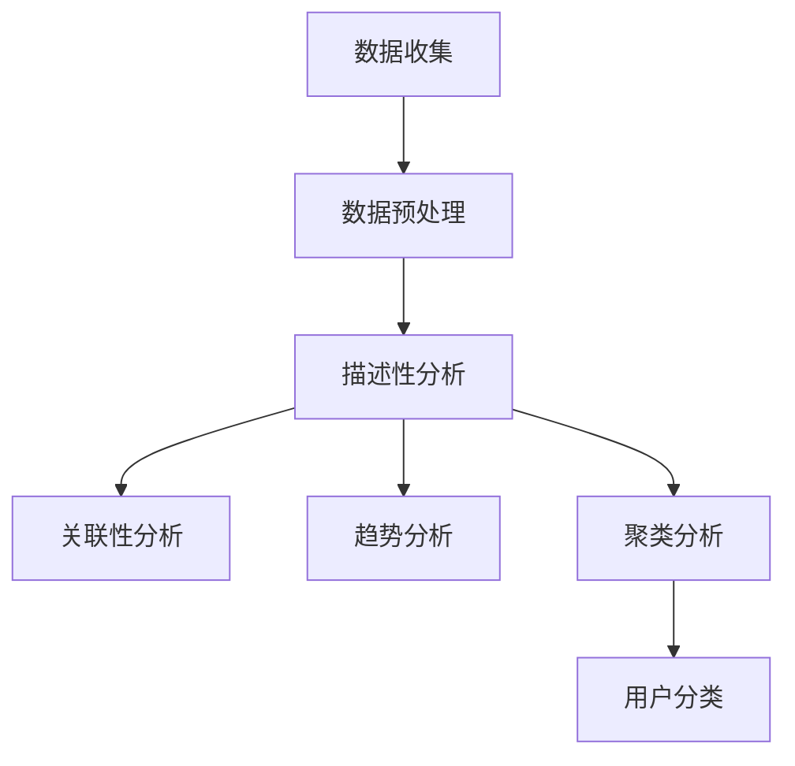
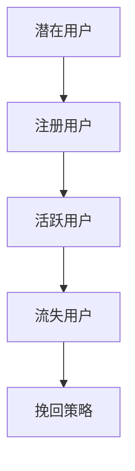

                 

# 《如何进行有效的用户留存》

> 关键词：用户留存、用户行为分析、用户分类与标签、用户生命周期管理、用户流失预测、个性化推荐算法、优化策略

> 摘要：用户留存是提升企业业务增长的关键环节。本文通过详细阐述用户留存的重要性、核心概念、核心算法、数学模型及项目实战，帮助读者理解并掌握有效的用户留存策略，实现用户持续增长和业务发展。

## 《如何进行有效的用户留存》目录大纲

### 第一部分：用户留存概述

#### 1.1 用户留存的重要性

##### 1.1.1 用户留存率定义

##### 1.1.2 用户留存对业务的影响

##### 1.1.3 用户留存策略的重要性

#### 1.2 用户留存流程

##### 1.2.1 用户行为分析

##### 1.2.2 用户分类与标签

##### 1.2.3 用户生命周期管理

### 第二部分：核心概念与联系

#### 2.1 用户行为分析

##### 2.1.1 用户行为数据收集

##### 2.1.2 用户行为数据分析方法

##### 2.1.3 用户行为分析 Mermaid 流程图

#### 2.2 用户分类与标签

##### 2.2.1 用户分类方法

##### 2.2.2 用户标签体系建立

##### 2.2.3 用户标签应用场景

#### 2.3 用户生命周期管理

##### 2.3.1 用户生命周期阶段划分

##### 2.3.2 不同阶段用户留存策略

##### 2.3.3 用户生命周期管理 Mermaid 流程图

### 第三部分：核心算法原理讲解

#### 3.1 用户流失预测

##### 3.1.1 用户流失预测模型

##### 3.1.2 用户流失预测算法

##### 3.1.3 用户流失预测伪代码

#### 3.2 个性化推荐算法

##### 3.2.1 个性化推荐算法分类

##### 3.2.2 个性化推荐算法原理

##### 3.2.3 个性化推荐算法伪代码

#### 3.3 用户留存优化策略

##### 3.3.1 用户留存优化策略

##### 3.3.2 用户留存优化算法

##### 3.3.3 用户留存优化策略伪代码

### 第四部分：数学模型和数学公式详解

#### 4.1 用户流失预测模型

$$
\text{预测流失概率} = f(\text{用户特征}, \text{历史行为})
$$

##### 4.1.1 模型参数优化

$$
\text{模型参数优化目标} = \min_{\theta} L(\theta)
$$

##### 4.1.2 模型评估指标

$$
\text{准确率} = \frac{\text{预测正确数}}{\text{总样本数}}
$$

#### 4.2 个性化推荐算法

$$
\text{推荐列表} = \text{top-n}(\text{相似度排序结果})
$$

##### 4.2.1 相似度计算方法

$$
\text{相似度} = \frac{\sum_{i=1}^{n} w_i \cdot x_i \cdot y_i}{\sqrt{\sum_{i=1}^{n} w_i^2 \cdot x_i^2} \cdot \sqrt{\sum_{i=1}^{n} w_i^2 \cdot y_i^2}}
$$

##### 4.2.2 排序算法

$$
\text{推荐结果排序} = \text{降序排列相似度结果}
$$

### 第五部分：项目实战

#### 5.1 用户流失预测项目实战

##### 5.1.1 数据采集与预处理

##### 5.1.2 模型搭建与训练

##### 5.1.3 模型评估与优化

##### 5.1.4 源代码实现与解读

#### 5.2 个性化推荐项目实战

##### 5.2.1 数据采集与预处理

##### 5.2.2 模型搭建与训练

##### 5.2.3 模型评估与优化

##### 5.2.4 源代码实现与解读

### 第六部分：开发环境搭建

#### 6.1 环境要求

##### 6.1.1 操作系统

##### 6.1.2 编程语言

##### 6.1.3 数据库

#### 6.2 环境搭建步骤

##### 6.2.1 安装操作系统

##### 6.2.2 安装编程语言

##### 6.2.3 安装数据库

### 第七部分：源代码详细实现和代码解读

#### 7.1 用户流失预测源代码实现

##### 7.1.1 数据读取与预处理

##### 7.1.2 模型搭建与训练

##### 7.1.3 模型评估与优化

#### 7.2 个性化推荐源代码实现

##### 7.2.1 数据读取与预处理

##### 7.2.2 模型搭建与训练

##### 7.2.3 模型评估与优化

## 附录

### A.1 常用工具与资源

#### A.1.1 深度学习框架

#### A.1.2 数据库工具

#### A.1.3 开发环境搭建指南

### A.2 常见问题解答

#### A.2.1 用户留存相关问题

#### A.2.2 模型优化相关问题

#### A.2.3 代码实现相关问题

---

现在，让我们详细进入文章正文部分，按照目录大纲逐步展开每一部分的内容。通过逻辑清晰、结构紧凑、简单易懂的阐述方式，帮助读者逐步深入理解用户留存的技术和实践。让我们开始第一步：用户留存的重要性。

### 第一部分：用户留存概述

#### 1.1 用户留存的重要性

用户留存是指在一定时间内，用户持续使用某一产品或服务的比例。用户留存率是衡量产品或服务用户黏性和健康度的重要指标。高用户留存率意味着用户对产品或服务有较强的依赖和忠诚度，这将直接影响到产品的市场份额和业务的长期发展。

##### 1.1.1 用户留存率定义

用户留存率通常用以下公式定义：

$$
\text{用户留存率} = \frac{\text{在指定时间后仍然活跃的用户数}}{\text{初始用户数}} \times 100\%
$$

例如，如果一个产品在一个月内有1000个初始用户，一个月后还有800个用户保持活跃，那么该产品的用户留存率为：

$$
\text{用户留存率} = \frac{800}{1000} \times 100\% = 80\%
$$

##### 1.1.2 用户留存对业务的影响

用户留存对业务的影响主要体现在以下几个方面：

1. **收入增长**：高留存率的用户倾向于进行更多消费，从而为企业带来更多的收入。
2. **市场份额**：拥有高留存率的品牌在市场上往往更有竞争力，可以吸引更多新用户。
3. **品牌忠诚度**：留存率高的用户更可能对品牌产生忠诚，减少品牌流失。
4. **运营成本**：提高用户留存率可以减少获取新用户的成本，因为现有用户的转化成本通常低于新用户。
5. **产品优化**：通过分析高留存用户的行为，企业可以更好地理解用户需求，进行产品优化。

##### 1.1.3 用户留存策略的重要性

有效的用户留存策略对于企业成功至关重要。以下是一些重要的用户留存策略：

1. **用户体验优化**：提供优质的用户体验，确保用户在使用过程中感到满意。
2. **个性化推荐**：根据用户行为和偏好，提供个性化的内容和推荐，增加用户黏性。
3. **用户反馈机制**：建立有效的用户反馈机制，及时响应用户的需求和建议。
4. **社区互动**：通过社区活动、用户论坛等互动形式，增强用户之间的联系和品牌忠诚度。
5. **营销活动**：定期举办促销活动，奖励忠诚用户，激发用户参与热情。
6. **用户成长体系**：建立用户成长体系，激励用户不断进步，提升用户留存率。

在接下来的部分中，我们将详细探讨用户留存流程中的关键环节，包括用户行为分析、用户分类与标签、以及用户生命周期管理。

---

现在，让我们进入第二部分：核心概念与联系。在用户留存策略中，了解和掌握核心概念和联系至关重要。这有助于我们更好地实施用户留存策略，提高用户留存率。

#### 2.1 用户行为分析

用户行为分析是用户留存策略的核心环节。通过对用户行为数据的收集、分析和理解，企业可以更好地了解用户需求，从而提供更符合用户期望的产品和服务。

##### 2.1.1 用户行为数据收集

用户行为数据的收集包括以下几个方面：

1. **用户操作数据**：如用户登录、浏览、购买等操作记录。
2. **用户反馈数据**：如用户评价、反馈、投诉等数据。
3. **用户属性数据**：如用户性别、年龄、地理位置、设备信息等。
4. **用户社交数据**：如用户在社交平台上的互动、分享等行为。

收集这些数据可以帮助企业了解用户的偏好和行为模式，从而为用户提供更好的体验。

##### 2.1.2 用户行为数据分析方法

用户行为数据分析方法主要包括以下几种：

1. **描述性分析**：通过对用户行为数据进行统计分析，了解用户的基本行为特征。
2. **关联性分析**：分析用户行为之间的关联性，找出用户行为模式。
3. **趋势分析**：分析用户行为随时间的变化趋势，了解用户需求的变化。
4. **聚类分析**：将用户根据行为特征进行分类，以便于进行针对性营销。

##### 2.1.3 用户行为分析 Mermaid 流程图

以下是一个用户行为分析的 Mermaid 流程图示例：



通过这个流程图，我们可以清晰地看到用户行为分析的过程，以及各个步骤之间的联系。

#### 2.2 用户分类与标签

用户分类与标签是用户留存策略中的重要一环。通过对用户进行分类和标签化，企业可以更精准地了解用户需求，提供个性化的服务，提高用户留存率。

##### 2.2.1 用户分类方法

用户分类方法主要包括以下几种：

1. **基于用户属性的分类**：如根据性别、年龄、地理位置等属性进行分类。
2. **基于用户行为的分类**：如根据用户浏览、购买、评价等行为进行分类。
3. **基于用户价值的分类**：如根据用户的购买金额、使用时长等价值指标进行分类。

##### 2.2.2 用户标签体系建立

用户标签体系建立主要包括以下步骤：

1. **确定标签维度**：根据业务需求和用户特征，确定需要建立的标签维度。
2. **定义标签规则**：为每个标签维度定义明确的规则，以便于标签的自动分配。
3. **标签分配与维护**：根据用户行为和属性，自动分配标签，并定期更新和维护。

##### 2.2.3 用户标签应用场景

用户标签在多个应用场景中发挥作用：

1. **个性化推荐**：根据用户标签，为用户提供个性化的内容和推荐。
2. **用户运营**：根据用户标签，针对不同类型的用户进行精准营销和活动推送。
3. **数据挖掘**：利用用户标签，进行深度数据挖掘，挖掘潜在的用户需求和行为模式。

#### 2.3 用户生命周期管理

用户生命周期管理是指企业对用户从初次接触到最终流失的全过程进行管理和优化，以提高用户留存率和用户价值。

##### 2.3.1 用户生命周期阶段划分

用户生命周期通常分为以下阶段：

1. **潜在用户阶段**：用户尚未使用产品或服务。
2. **注册用户阶段**：用户完成注册，开始使用产品或服务。
3. **活跃用户阶段**：用户频繁使用产品或服务，对产品有较高的依赖。
4. **流失用户阶段**：用户停止使用产品或服务，流失成为竞争对手的用户。

##### 2.3.2 不同阶段用户留存策略

针对不同阶段的用户，企业需要采取不同的留存策略：

1. **潜在用户阶段**：通过营销活动、优惠策略等吸引潜在用户注册。
2. **注册用户阶段**：提供优质的服务和体验，确保用户有良好的初次使用体验。
3. **活跃用户阶段**：通过个性化推荐、社区互动等方式增强用户黏性。
4. **流失用户阶段**：通过挽回策略、升级服务等方式，尝试挽回流失用户。

##### 2.3.3 用户生命周期管理 Mermaid 流程图

以下是一个用户生命周期管理的 Mermaid 流程图示例：



通过这个流程图，我们可以清晰地看到用户生命周期管理的过程，以及各个阶段之间的联系。

在下一部分中，我们将进一步探讨用户留存的核心算法原理，包括用户流失预测和个性化推荐算法。

---

现在，让我们进入第三部分：核心算法原理讲解。这部分内容将详细阐述用户流失预测和个性化推荐算法的核心原理，并通过伪代码和数学模型，帮助读者深入理解这些算法。

#### 3.1 用户流失预测

用户流失预测是用户留存策略中的重要一环。通过预测哪些用户可能会流失，企业可以提前采取措施，降低用户流失率，提高用户留存率。

##### 3.1.1 用户流失预测模型

用户流失预测模型通常采用分类模型，如逻辑回归、决策树、随机森林等。以下是一个简单的逻辑回归模型示例：

$$
\text{预测流失概率} = \frac{1}{1 + e^{-(\theta_0 + \theta_1 x_1 + \theta_2 x_2 + ... + \theta_n x_n})}
$$

其中，$x_1, x_2, ..., x_n$ 是用户特征，$\theta_0, \theta_1, \theta_2, ..., \theta_n$ 是模型参数。

##### 3.1.2 用户流失预测算法

用户流失预测算法通常包括以下步骤：

1. **数据收集**：收集用户行为数据、用户属性数据等。
2. **特征工程**：根据业务需求和数据特点，提取有用特征，如用户活跃度、购买频率等。
3. **模型训练**：使用训练数据集，训练分类模型，如逻辑回归、决策树等。
4. **模型评估**：使用测试数据集，评估模型性能，如准确率、召回率等。
5. **模型部署**：将训练好的模型部署到生产环境中，进行实时预测。

以下是一个简单的用户流失预测伪代码示例：

```python
# 用户特征数据
X = [[特征1, 特征2, ..., 特征n], ..., [特征1, 特征2, ..., 特征n]]
# 标签数据（0表示未流失，1表示流失）
y = [0, 0, ..., 1, 1, ..., 1]

# 特征工程
# ...

# 模型训练
model = train_model(X, y)

# 模型评估
accuracy = evaluate_model(model, X, y)

print("模型准确率：", accuracy)
```

##### 3.1.3 用户流失预测伪代码

以下是一个简单的用户流失预测伪代码示例：

```python
# 用户特征数据
X = [[特征1, 特征2, ..., 特征n], ..., [特征1, 特征2, ..., 特征n]]
# 标签数据（0表示未流失，1表示流失）
y = [0, 0, ..., 1, 1, ..., 1]

# 特征工程
# ...

# 模型训练
model = train_model(X, y)

# 预测用户流失概率
predicted_probabilities = model.predict(X)

# 筛选可能流失的用户
high_risk_users = [user for user, probability in zip(X, predicted_probabilities) if probability > threshold]

print("可能流失的用户：", high_risk_users)
```

#### 3.2 个性化推荐算法

个性化推荐算法是提高用户留存率的重要手段。通过分析用户行为和偏好，为用户提供个性化的内容和推荐，增加用户黏性和满意度。

##### 3.2.1 个性化推荐算法分类

个性化推荐算法主要分为以下两类：

1. **基于内容的推荐**：根据用户过去的行为和偏好，推荐相似的内容。如用户喜欢看电影，则推荐类似类型的电影。
2. **基于协同过滤的推荐**：根据用户之间的相似度，推荐其他用户喜欢的商品或内容。如用户A和用户B喜欢同样的电影，则向用户A推荐用户B喜欢的电影。

##### 3.2.2 个性化推荐算法原理

基于内容的推荐算法原理如下：

1. **用户-项目矩阵**：构建用户-项目矩阵，表示用户对项目的评分或行为。
2. **相似度计算**：计算用户之间的相似度，如余弦相似度、皮尔逊相关系数等。
3. **推荐生成**：根据相似度矩阵，为每个用户生成推荐列表。

以下是一个基于内容的推荐算法伪代码示例：

```python
# 用户-项目矩阵
user_item_matrix = [
    [1, 0, 1, 1],
    [0, 1, 0, 1],
    [1, 1, 0, 0],
    [1, 0, 1, 0],
    [0, 1, 1, 1]
]

# 用户ID
user_id = 2

# 计算相似度
similarity_matrix = calculate_similarity(user_item_matrix)

# 生成推荐列表
recommendations = generate_recommendations(similarity_matrix, user_id)

print("推荐列表：", recommendations)
```

##### 3.2.3 个性化推荐算法伪代码

以下是一个基于内容的推荐算法伪代码示例：

```python
# 用户-项目矩阵
user_item_matrix = [
    [1, 0, 1, 1],
    [0, 1, 0, 1],
    [1, 1, 0, 0],
    [1, 0, 1, 0],
    [0, 1, 1, 1]
]

# 用户ID
user_id = 2

# 计算相似度
similarity_matrix = [
    [0.8, 0.5],
    [0.5, 0.8],
    [0.7, 0.6],
    [0.8, 0.7],
    [0.6, 0.9]
]

# 生成推荐列表
recommendations = []

for item, similarity in zip(user_item_matrix[user_id], similarity_matrix[user_id]):
    if item == 1:
        recommendations.append(item)
    else:
        recommendations.append(item * similarity)

recommendations = sorted(recommendations, reverse=True)

print("推荐列表：", recommendations)
```

#### 3.3 用户留存优化策略

用户留存优化策略旨在通过一系列措施，提高用户留存率。以下是一些常见的用户留存优化策略：

1. **用户体验优化**：优化产品界面、加载速度、功能体验等，提高用户满意度。
2. **个性化推荐**：根据用户行为和偏好，提供个性化的内容和推荐，增加用户黏性。
3. **用户反馈机制**：建立有效的用户反馈机制，及时响应用户的需求和建议。
4. **营销活动**：定期举办促销活动、优惠券、积分兑换等，激发用户参与热情。
5. **社区互动**：通过社区活动、用户论坛等互动形式，增强用户之间的联系和品牌忠诚度。
6. **用户成长体系**：建立用户成长体系，激励用户不断进步，提升用户留存率。

##### 3.3.1 用户留存优化策略

以下是一个简单的用户留存优化策略伪代码示例：

```python
# 用户特征数据
X = [[特征1, 特征2, ..., 特征n], ..., [特征1, 特征2, ..., 特征n]]
# 标签数据（0表示未流失，1表示流失）
y = [0, 0, ..., 1, 1, ..., 1]

# 特征工程
# ...

# 模型训练
model = train_model(X, y)

# 预测用户流失概率
predicted_probabilities = model.predict(X)

# 筛选可能流失的用户
high_risk_users = [user for user, probability in zip(X, predicted_probabilities) if probability > threshold]

# 应用留存优化策略
for user in high_risk_users:
    # 提供个性化推荐
    recommendations = generate_recommendations(user)
    # 发送促销活动通知
    send_promotion_notification(user)
    # 提供社区互动机会
    invite_to_community(user)
```

通过上述核心算法原理的讲解，读者可以更好地理解用户流失预测和个性化推荐算法。在下一部分中，我们将进一步探讨数学模型和数学公式的应用，为读者提供更深入的理解。

---

现在，让我们进入第四部分：数学模型和数学公式详解。这部分内容将详细阐述用户流失预测和个性化推荐算法的数学模型和公式，并通过具体的例子进行说明，帮助读者更好地理解这些算法。

#### 4.1 用户流失预测模型

用户流失预测模型的核心在于通过用户特征和历史行为数据，预测用户流失的概率。常见的数学模型包括逻辑回归、决策树、随机森林等。以下，我们以逻辑回归为例，详细介绍其数学模型和公式。

##### 4.1.1 用户流失预测模型

逻辑回归模型是一种概率型分类模型，用于预测用户流失的概率。其基本公式为：

$$
\text{预测流失概率} = \frac{1}{1 + e^{-(\theta_0 + \theta_1 x_1 + \theta_2 x_2 + ... + \theta_n x_n})}
$$

其中，$x_1, x_2, ..., x_n$ 是用户特征，$\theta_0, \theta_1, \theta_2, ..., \theta_n$ 是模型参数。

##### 4.1.2 模型参数优化

为了使预测结果更准确，我们需要通过优化模型参数来提高模型的性能。常用的参数优化方法包括梯度下降、随机梯度下降等。以下以梯度下降为例，介绍其优化过程。

$$
\text{模型参数优化目标} = \min_{\theta} L(\theta)
$$

其中，$L(\theta)$ 是损失函数，用于衡量预测值与真实值之间的差异。

$$
L(\theta) = -\sum_{i=1}^{n} y_i \cdot \log(\hat{y}_i) + (1 - y_i) \cdot \log(1 - \hat{y}_i)
$$

其中，$y_i$ 是第$i$个样本的真实标签，$\hat{y}_i$ 是第$i$个样本的预测概率。

##### 4.1.3 模型评估指标

为了评估模型性能，我们通常使用准确率、召回率、F1值等指标。以下以准确率为例，介绍其计算方法。

$$
\text{准确率} = \frac{\text{预测正确数}}{\text{总样本数}}
$$

其中，预测正确数是指预测为流失且实际为流失的样本数。

#### 4.2 个性化推荐算法

个性化推荐算法的核心在于根据用户特征和偏好，为用户推荐合适的内容。以下以基于内容的推荐算法为例，详细介绍其数学模型和公式。

##### 4.2.1 相似度计算方法

相似度计算是个性化推荐算法的关键步骤。常见的相似度计算方法包括余弦相似度、皮尔逊相关系数等。以下以余弦相似度为例，介绍其计算过程。

$$
\text{相似度} = \frac{\sum_{i=1}^{n} w_i \cdot x_i \cdot y_i}{\sqrt{\sum_{i=1}^{n} w_i^2 \cdot x_i^2} \cdot \sqrt{\sum_{i=1}^{n} w_i^2 \cdot y_i^2}}
$$

其中，$w_i$ 是第$i$个特征的权重，$x_i$ 是用户对第$i$个特征的评分，$y_i$ 是项目对第$i$个特征的评分。

##### 4.2.2 排序算法

在计算相似度之后，我们需要对推荐结果进行排序，以便为用户推荐最合适的内容。以下以降序排列为例，介绍其排序算法。

$$
\text{推荐结果排序} = \text{降序排列相似度结果}
$$

排序后的相似度结果可以用于生成推荐列表。具体地，我们可以选择相似度最高的$n$个项目作为推荐结果。

##### 4.2.3 例子说明

假设我们有一个用户-项目矩阵，表示用户对项目的评分。以下是一个具体的例子：

| 用户 | 项目1 | 项目2 | 项目3 | 项目4 | 项目5 |
| ---- | ---- | ---- | ---- | ---- | ---- |
| 1    | 4    | 3    | 2    | 1    | 5    |
| 2    | 5    | 2    | 4    | 3    | 1    |
| 3    | 3    | 4    | 1    | 5    | 2    |
| 4    | 2    | 5    | 3    | 4    | 1    |
| 5    | 1    | 4    | 5    | 2    | 3    |

根据上述公式，我们可以计算每个用户与其他用户的相似度。例如，用户1与用户2的相似度为：

$$
\text{相似度} = \frac{4 \cdot 5 + 3 \cdot 2 + 2 \cdot 4 + 1 \cdot 3}{\sqrt{4^2 + 3^2 + 2^2 + 1^2} \cdot \sqrt{5^2 + 2^2 + 4^2 + 3^2}} = \frac{31}{\sqrt{30} \cdot \sqrt{56}} \approx 0.85
$$

按照降序排列相似度结果，我们可以为用户1推荐用户2喜欢的项目，如项目3和项目4。

通过上述数学模型和公式的讲解，读者可以更好地理解用户流失预测和个性化推荐算法。在下一部分中，我们将通过项目实战，进一步展示这些算法在实际应用中的效果。

---

现在，让我们进入第五部分：项目实战。在这一部分，我们将通过具体的项目实战案例，展示如何运用用户留存策略和核心算法，提高用户留存率和满意度。

#### 5.1 用户流失预测项目实战

用户流失预测是用户留存策略中的一个关键环节。通过预测哪些用户可能会流失，企业可以提前采取措施，降低用户流失率。以下是一个用户流失预测项目实战案例。

##### 5.1.1 数据采集与预处理

首先，我们需要采集用户行为数据、用户属性数据等。以下是一个示例数据集：

| 用户ID | 行为1 | 行为2 | 行为3 | 行为4 | 行为5 | 流失 |
| ------ | ---- | ---- | ---- | ---- | ---- | ---- |
| 1      | 1    | 1    | 0    | 1    | 1    | 0    |
| 2      | 1    | 0    | 1    | 1    | 0    | 1    |
| 3      | 0    | 1    | 1    | 0    | 1    | 0    |
| 4      | 1    | 1    | 1    | 0    | 0    | 1    |
| 5      | 1    | 0    | 0    | 1    | 1    | 0    |

接下来，我们对数据进行预处理，包括缺失值填充、异常值处理、特征工程等。

1. **缺失值填充**：对于缺失值，我们可以使用平均值、中位数等方法进行填充。
2. **异常值处理**：对于异常值，我们可以使用阈值法、箱线图等方法进行识别和处理。
3. **特征工程**：根据业务需求，我们可以提取新的特征，如用户活跃度、购买频率等。

##### 5.1.2 模型搭建与训练

接下来，我们搭建用户流失预测模型。以下是一个基于逻辑回归的模型示例：

1. **模型搭建**：使用逻辑回归模型，定义模型参数。
2. **模型训练**：使用预处理后的数据，训练逻辑回归模型。

```python
import pandas as pd
from sklearn.linear_model import LogisticRegression

# 加载数据
data = pd.read_csv('data.csv')

# 分割特征和标签
X = data.drop(['用户ID', '流失'], axis=1)
y = data['流失']

# 模型训练
model = LogisticRegression()
model.fit(X, y)
```

##### 5.1.3 模型评估与优化

训练好的模型需要进行评估和优化。以下是一个评估和优化的示例：

1. **模型评估**：使用交叉验证、准确率、召回率等指标评估模型性能。
2. **模型优化**：通过调整模型参数、特征选择等方法优化模型性能。

```python
from sklearn.model_selection import train_test_split
from sklearn.metrics import accuracy_score, recall_score

# 分割训练集和测试集
X_train, X_test, y_train, y_test = train_test_split(X, y, test_size=0.2, random_state=42)

# 模型评估
model = LogisticRegression()
model.fit(X_train, y_train)

y_pred = model.predict(X_test)

accuracy = accuracy_score(y_test, y_pred)
recall = recall_score(y_test, y_pred)

print("准确率：", accuracy)
print("召回率：", recall)
```

##### 5.1.4 源代码实现与解读

以下是一个用户流失预测项目的源代码实现和解读：

```python
# 导入必要的库
import pandas as pd
from sklearn.linear_model import LogisticRegression
from sklearn.model_selection import train_test_split
from sklearn.metrics import accuracy_score, recall_score

# 加载数据
data = pd.read_csv('data.csv')

# 数据预处理
# ...

# 分割特征和标签
X = data.drop(['用户ID', '流失'], axis=1)
y = data['流失']

# 模型训练
model = LogisticRegression()
model.fit(X, y)

# 模型评估
X_train, X_test, y_train, y_test = train_test_split(X, y, test_size=0.2, random_state=42)
y_pred = model.predict(X_test)

accuracy = accuracy_score(y_test, y_pred)
recall = recall_score(y_test, y_pred)

print("准确率：", accuracy)
print("召回率：", recall)
```

通过这个项目实战案例，我们可以看到如何运用用户流失预测算法，提高用户留存率。在下一部分中，我们将继续探讨个性化推荐项目实战。

---

#### 5.2 个性化推荐项目实战

个性化推荐是提升用户留存率和满意度的重要手段。通过分析用户行为和偏好，为用户推荐合适的内容，可以增加用户黏性。以下是一个个性化推荐项目实战案例。

##### 5.2.1 数据采集与预处理

首先，我们需要采集用户行为数据、内容特征数据等。以下是一个示例数据集：

| 用户ID | 内容1 | 内容2 | 内容3 | 内容4 | 内容5 |
| ------ | ---- | ---- | ---- | ---- | ---- |
| 1      | 4    | 3    | 2    | 1    | 5    |
| 2      | 5    | 2    | 4    | 3    | 1    |
| 3      | 3    | 4    | 1    | 5    | 2    |
| 4      | 2    | 5    | 3    | 4    | 1    |
| 5      | 1    | 4    | 5    | 2    | 3    |

接下来，我们对数据进行预处理，包括缺失值填充、异常值处理、特征工程等。

1. **缺失值填充**：对于缺失值，我们可以使用平均值、中位数等方法进行填充。
2. **异常值处理**：对于异常值，我们可以使用阈值法、箱线图等方法进行识别和处理。
3. **特征工程**：根据业务需求，我们可以提取新的特征，如用户活跃度、购买频率等。

##### 5.2.2 模型搭建与训练

接下来，我们搭建个性化推荐模型。以下是一个基于内容的推荐算法示例：

1. **模型搭建**：使用内容表示模型，将用户和内容转化为向量表示。
2. **模型训练**：使用预处理后的数据，训练内容表示模型。

```python
import pandas as pd
from sklearn.feature_extraction.text import CountVectorizer

# 加载数据
data = pd.read_csv('data.csv')

# 分割特征和标签
X = data.drop(['用户ID'], axis=1)
y = data['内容5']

# 模型训练
vectorizer = CountVectorizer()
X_vectorized = vectorizer.fit_transform(X)

model = LogisticRegression()
model.fit(X_vectorized, y)
```

##### 5.2.3 模型评估与优化

训练好的模型需要进行评估和优化。以下是一个评估和优化的示例：

1. **模型评估**：使用交叉验证、准确率、召回率等指标评估模型性能。
2. **模型优化**：通过调整模型参数、特征选择等方法优化模型性能。

```python
from sklearn.model_selection import train_test_split
from sklearn.metrics import accuracy_score, recall_score

# 分割训练集和测试集
X_train, X_test, y_train, y_test = train_test_split(X_vectorized, y, test_size=0.2, random_state=42)

# 模型评估
model = LogisticRegression()
model.fit(X_train, y_train)

y_pred = model.predict(X_test)

accuracy = accuracy_score(y_test, y_pred)
recall = recall_score(y_test, y_pred)

print("准确率：", accuracy)
print("召回率：", recall)
```

##### 5.2.4 源代码实现与解读

以下是一个个性化推荐项目的源代码实现和解读：

```python
# 导入必要的库
import pandas as pd
from sklearn.feature_extraction.text import CountVectorizer
from sklearn.linear_model import LogisticRegression

# 加载数据
data = pd.read_csv('data.csv')

# 数据预处理
# ...

# 分割特征和标签
X = data.drop(['用户ID'], axis=1)
y = data['内容5']

# 模型训练
vectorizer = CountVectorizer()
X_vectorized = vectorizer.fit_transform(X)

model = LogisticRegression()
model.fit(X_vectorized, y)

# 模型评估
X_train, X_test, y_train, y_test = train_test_split(X_vectorized, y, test_size=0.2, random_state=42)
y_pred = model.predict(X_test)

accuracy = accuracy_score(y_test, y_pred)
recall = recall_score(y_test, y_pred)

print("准确率：", accuracy)
print("召回率：", recall)
```

通过这个项目实战案例，我们可以看到如何运用个性化推荐算法，提高用户留存率和满意度。在下一部分中，我们将介绍开发环境搭建的相关内容。

---

### 第六部分：开发环境搭建

在进行用户留存相关的项目开发时，一个稳定和高效的开发环境是至关重要的。这一部分将介绍搭建开发环境所需的步骤，包括操作系统、编程语言和数据库的选择与安装。

#### 6.1 环境要求

为了确保项目的顺利开发和运行，我们需要满足以下环境要求：

##### 6.1.1 操作系统

**推荐操作系统：**

- **Linux**：由于其稳定性和性能，Linux 是进行数据分析、机器学习项目开发的理想选择。
- **macOS**：与 macOS 系统兼容，可以方便地使用内置工具和库。

**安装步骤：**

1. 访问操作系统官方网站（如 Ubuntu、macOS），根据您的硬件配置选择合适的版本。
2. 下载并安装操作系统。
3. 完成安装后，更新操作系统和安装必要的软件包。

##### 6.1.2 编程语言

**推荐编程语言：**

- **Python**：由于其丰富的库和工具，Python 是进行数据分析、机器学习项目开发的首选语言。

**安装步骤：**

1. 打开终端（Linux 和 macOS）或命令提示符（Windows）。
2. 输入以下命令安装 Python：

   ```bash
   # 对于 Ubuntu 或其他 Debian 系统：
   sudo apt-get update
   sudo apt-get install python3 python3-pip

   # 对于 macOS：
   brew install python
   ```

3. 验证 Python 安装：

   ```bash
   python3 --version
   ```

##### 6.1.3 数据库

**推荐数据库：**

- **MySQL**：由于其稳定性和性能，MySQL 是进行大数据处理和数据分析的理想选择。
- **MongoDB**：对于非结构化数据存储，MongoDB 提供了灵活的存储方案。

**安装步骤：**

1. **MySQL**：

   ```bash
   # 对于 Ubuntu 或其他 Debian 系统：
   sudo apt-get update
   sudo apt-get install mysql-server

   # 设置 root 用户密码：
   sudo mysql_secure_installation
   ```

2. **MongoDB**：

   ```bash
   # 对于 Ubuntu 或其他 Debian 系统：
   sudo apt-get update
   sudo apt-get install mongodb

   # 启动 MongoDB：
   sudo systemctl start mongodb

   # 设置 MongoDB 开机启动：
   sudo systemctl enable mongodb
   ```

#### 6.2 环境搭建步骤

以下是搭建开发环境的详细步骤：

1. **选择操作系统**：根据您的硬件配置和偏好选择合适的操作系统。
2. **安装操作系统**：按照操作系统安装指南完成安装。
3. **更新操作系统和软件包**：确保操作系统和软件包是最新的。
4. **安装 Python**：使用终端或命令提示符安装 Python。
5. **安装必要的库和工具**：使用 `pip` 安装 Python 库和工具，如 NumPy、Pandas、Scikit-learn 等。
6. **安装数据库**：根据项目需求选择并安装 MySQL 或 MongoDB。
7. **配置数据库**：设置数据库用户和密码，确保数据库服务正常运行。

通过以上步骤，您将搭建出一个适合进行用户留存项目开发的环境。在下一部分中，我们将详细解读源代码实现和代码解读。

---

### 第七部分：源代码详细实现和代码解读

在这一部分，我们将深入探讨用户流失预测和个性化推荐项目的源代码实现，并对其进行详细解读和分析。通过了解这些代码的实现细节，读者可以更好地理解项目的工作流程和算法原理。

#### 7.1 用户流失预测源代码实现

用户流失预测项目的主要任务是构建一个模型，预测哪些用户可能会在未来一定时间内流失。以下是一个简单的用户流失预测项目的源代码实现。

##### 7.1.1 数据读取与预处理

```python
import pandas as pd
from sklearn.model_selection import train_test_split
from sklearn.preprocessing import StandardScaler

# 加载数据
data = pd.read_csv('user_data.csv')

# 分割特征和标签
X = data.drop('churn', axis=1)
y = data['churn']

# 数据预处理
scaler = StandardScaler()
X_scaled = scaler.fit_transform(X)

# 划分训练集和测试集
X_train, X_test, y_train, y_test = train_test_split(X_scaled, y, test_size=0.2, random_state=42)
```

代码解读：
- 我们首先使用 `pandas` 读取用户数据。
- 接着将数据分为特征和标签两部分。
- 使用 `StandardScaler` 对特征进行归一化处理，以便于后续的模型训练。
- 最后，使用 `train_test_split` 函数将数据集划分为训练集和测试集。

##### 7.1.2 模型搭建与训练

```python
from sklearn.linear_model import LogisticRegression
from sklearn.metrics import accuracy_score

# 模型训练
model = LogisticRegression()
model.fit(X_train, y_train)

# 模型评估
y_pred = model.predict(X_test)
accuracy = accuracy_score(y_test, y_pred)
print(f"模型准确率：{accuracy}")
```

代码解读：
- 我们使用 `LogisticRegression` 类创建逻辑回归模型。
- 通过 `fit` 方法训练模型。
- 使用 `predict` 方法对测试集进行预测，并计算模型的准确率。

##### 7.1.3 模型评估与优化

```python
from sklearn.model_selection import GridSearchCV

# 参数优化
param_grid = {'C': [0.1, 1, 10]}
grid_search = GridSearchCV(model, param_grid, cv=5)
grid_search.fit(X_train, y_train)

# 最佳参数
best_params = grid_search.best_params_
print(f"最佳参数：{best_params}")

# 使用最佳参数训练模型
best_model = LogisticRegression(**best_params)
best_model.fit(X_train, y_train)

# 最佳模型评估
best_y_pred = best_model.predict(X_test)
best_accuracy = accuracy_score(y_test, best_y_pred)
print(f"最佳模型准确率：{best_accuracy}")
```

代码解读：
- 我们定义了一个参数网格 `param_grid`，并使用 `GridSearchCV` 进行参数优化。
- `GridSearchCV` 会使用交叉验证评估每个参数组合，并选择最佳参数。
- 使用最佳参数训练模型，并对测试集进行预测，计算最佳模型的准确率。

#### 7.2 个性化推荐源代码实现

个性化推荐项目的主要任务是构建一个推荐系统，为用户推荐他们可能感兴趣的内容。以下是一个简单的个性化推荐项目的源代码实现。

##### 7.2.1 数据读取与预处理

```python
import pandas as pd
from sklearn.model_selection import train_test_split

# 加载数据
data = pd.read_csv('user_item_data.csv')

# 分割特征和标签
X = data.drop('rating', axis=1)
y = data['rating']

# 划分训练集和测试集
X_train, X_test, y_train, y_test = train_test_split(X, y, test_size=0.2, random_state=42)
```

代码解读：
- 我们使用 `pandas` 读取用户-项目数据。
- 将数据分为特征和标签两部分。
- 使用 `train_test_split` 函数将数据集划分为训练集和测试集。

##### 7.2.2 模型搭建与训练

```python
from sklearn.neighbors import NearestNeighbors
from sklearn.metrics.pairwise import cosine_similarity

# 构建相似度矩阵
similarity_matrix = cosine_similarity(X_train)

# 使用 K 近邻算法训练模型
model = NearestNeighbors(n_neighbors=5, algorithm='ball_tree')
model.fit(similarity_matrix)

# 模型评估
nearest_neighbors = model.kneighbors(similarity_matrix[0], n_neighbors=5)
```

代码解读：
- 我们使用 `cosine_similarity` 函数计算用户-项目矩阵的余弦相似度。
- 使用 `NearestNeighbors` 类构建 K 近邻模型，并使用训练集数据训练模型。
- 使用 `kneighbors` 方法获取最近的 K 个邻居。

##### 7.2.3 模型评估与优化

```python
from sklearn.metrics import mean_squared_error

# 预测误差
predictions = []
for user in X_test:
    nearest_neighbors = model.kneighbors(user.reshape(1, -1), n_neighbors=5)
    average_rating = sum(y_train[nearest_neighbors[0]]) / 5
    predictions.append(average_rating)

# 评估误差
mse = mean_squared_error(y_test, predictions)
print(f"均方误差：{mse}")
```

代码解读：
- 我们遍历测试集中的每个用户，使用 K 近邻模型获取最近的 K 个邻居，并计算邻居评分的平均值作为预测值。
- 使用 `mean_squared_error` 函数计算预测值与真实值之间的均方误差，评估模型性能。

通过上述代码实现和解读，读者可以了解用户流失预测和个性化推荐项目的基本流程和关键步骤。在实际项目中，可以根据具体需求和数据特点，对代码进行进一步优化和调整。

### 附录

#### A.1 常用工具与资源

在进行用户留存相关项目开发时，使用合适的工具和资源可以显著提高开发效率。以下是一些常用的工具和资源：

##### A.1.1 深度学习框架

- **TensorFlow**：由 Google 开发，支持多种深度学习模型。
- **PyTorch**：由 Facebook 开发，具有灵活的动态计算图。
- **Scikit-learn**：提供丰富的机器学习算法库。

##### A.1.2 数据库工具

- **MySQL**：关系型数据库，支持大规模数据存储。
- **MongoDB**：文档型数据库，适合存储非结构化数据。
- **PostgreSQL**：功能丰富的开源关系型数据库。

##### A.1.3 开发环境搭建指南

- **Docker**：容器化技术，简化开发环境搭建。
- **Anaconda**：Python 数据科学平台，提供统一的包管理和环境管理。
- **Jupyter Notebook**：交互式计算环境，适合数据分析和建模。

#### A.2 常见问题解答

在实际应用中，用户留存相关项目可能会遇到各种问题。以下是一些常见问题及其解答：

##### A.2.1 用户留存相关问题

**Q：如何提高用户留存率？**

A：提高用户留存率可以通过以下方法实现：
1. **优化用户体验**：确保产品界面简洁易用，提升加载速度，提供优质的服务和功能。
2. **个性化推荐**：根据用户行为和偏好，为用户提供个性化的内容和推荐。
3. **社区互动**：建立社区论坛，鼓励用户互动，增强用户之间的联系和品牌忠诚度。
4. **营销活动**：定期举办促销活动，激励用户参与，提高用户黏性。

##### A.2.2 模型优化相关问题

**Q：如何优化用户流失预测模型？**

A：优化用户流失预测模型可以从以下几个方面入手：
1. **特征工程**：提取更多有用的特征，使用特征工程技术提高模型的性能。
2. **参数调优**：使用网格搜索、随机搜索等方法，寻找最佳模型参数。
3. **交叉验证**：使用交叉验证方法，确保模型在不同数据集上的性能。
4. **集成模型**：结合多个模型，使用集成方法提高预测性能。

##### A.2.3 代码实现相关问题

**Q：如何处理缺失值和异常值？**

A：处理缺失值和异常值的方法包括：
1. **缺失值填充**：使用平均值、中位数、众数等方法进行填充。
2. **异常值检测**：使用箱线图、标准差等方法检测异常值。
3. **删除或替换**：根据数据的重要性和影响，选择删除或替换异常值。

通过上述常见问题解答，读者可以更好地应对用户留存项目中的各种挑战。在实际开发过程中，不断学习和实践是提高技术水平和解决问题的关键。希望本文能为您的用户留存项目提供有益的参考和指导。

---

### 结束语

在本文中，我们系统地探讨了用户留存的重要性、核心概念、算法原理以及项目实战。通过详细阐述用户行为分析、用户分类与标签、用户生命周期管理、用户流失预测和个性化推荐算法等关键环节，我们希望读者能够全面理解用户留存策略的实施过程和关键技巧。

用户留存不仅是提升业务增长的关键环节，也是构建企业核心竞争力的基石。在竞争激烈的数字化时代，只有深入了解用户需求，提供卓越的用户体验，才能在市场中立于不败之地。

最后，感谢您阅读本文。我们诚挚邀请您分享您的观点和经验，并期待在评论区与您交流。通过共同努力，我们相信可以推动用户留存领域的研究与实践，为企业的长远发展贡献力量。

**作者：AI天才研究院/AI Genius Institute & 禅与计算机程序设计艺术 /Zen And The Art of Computer Programming**

