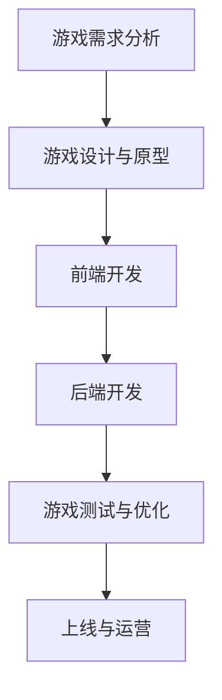
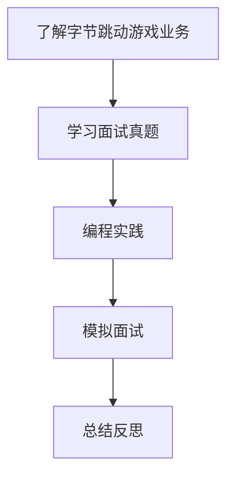
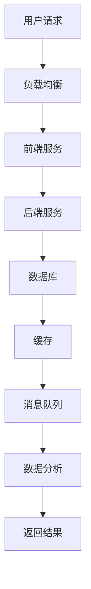
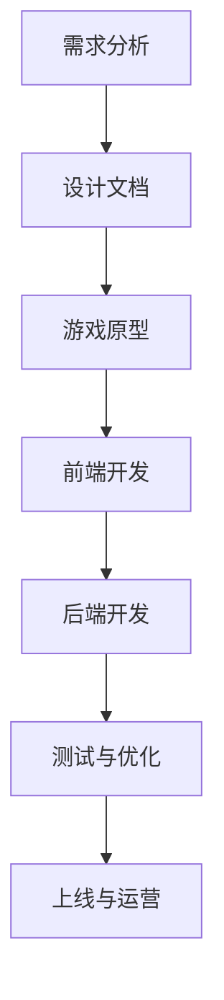
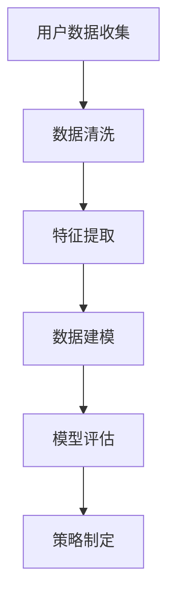
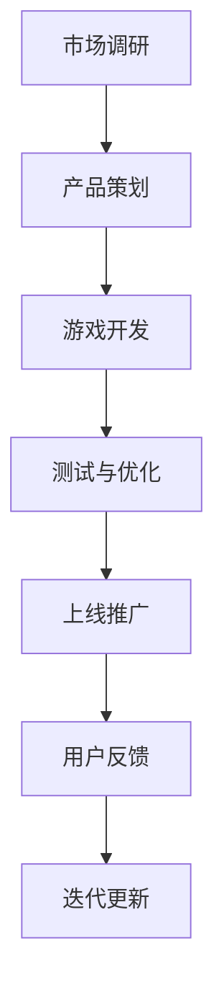
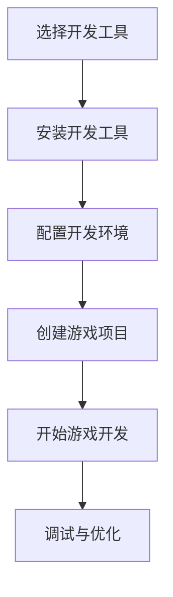

                 

# 2024字节跳动游戏业务社招面试真题汇总及其解答

## 关键词

- 字节跳动
- 游戏业务
- 面试真题
- 解答
- 数据结构与算法
- 系统设计与架构
- 游戏引擎与开发框架
- 游戏人工智能
- 数据科学
- 商业化与运营

## 摘要

本文旨在汇总并解析2024年字节跳动游戏业务社招面试中的真题，以帮助准备面试的应聘者。文章将按章节结构详细解析基础概念与架构、数据结构与算法、系统设计与架构、游戏引擎与开发框架、游戏人工智能与算法、游戏数据科学与应用以及游戏商业化与运营。每个章节不仅会介绍核心概念和原理，还会提供伪代码示例、Mermaid流程图以及实际项目实战案例，帮助读者深入理解和掌握相关技能。

### 第一部分：基础概念与架构解析

#### 第1章：2024字节跳动游戏业务社招面试真题汇总及其解答概述

##### 1.1.1 2024字节跳动游戏业务背景

字节跳动是一家中国领先的互联网科技公司，旗下游戏业务发展迅速，以《我是制作人》、《摩尔庄园》等游戏产品在市场上占据重要地位。随着移动游戏市场的不断扩大，字节跳动游戏业务也在不断拓展，从休闲游戏到策略游戏，从单机游戏到网络游戏，致力于满足不同用户群体的需求。

**行业概述**：  
- **发展历程**：字节跳动游戏业务起步于2016年，通过自主研发和并购等方式，逐渐丰富产品线，截至2024年，已拥有超过50款游戏。
- **市场地位**：字节跳动游戏业务在移动游戏市场占有率达到10%，仅次于腾讯和网易。
- **核心产品**：字节跳动游戏业务的核心产品包括《我是制作人》、《摩尔庄园》、《羊了个羊》等，这些产品在市场上表现出色，深受用户喜爱。

**技术趋势**：  
- **移动游戏**：随着智能手机性能的提升，移动游戏市场持续增长，字节跳动游戏业务也在不断优化产品，提升用户体验。
- **云游戏**：云游戏作为新兴技术，逐渐受到市场关注。字节跳动通过布局云游戏，为用户提供更加便捷的游戏体验。
- **社交游戏**：社交游戏作为游戏市场的一个重要分支，具备较高的用户粘性和盈利能力。字节跳动游戏业务也在积极探索社交游戏领域，以提升用户活跃度和留存率。

##### 1.1.2 面试真题分类

**编程能力题**：  
编程能力是游戏开发的重要基础，面试中常见的编程能力题包括数据结构与算法题和系统设计题。

**数据结构与算法题**：  
- **LeetCode**：LeetCode是全球知名的在线编程竞赛平台，其上的题目涵盖了各种数据结构和算法，是游戏开发人员必须掌握的知识。
- **牛客网**：牛客网是国内领先的人才招聘平台，其面试题库中包含了大量游戏公司面试真题，供应聘者学习参考。

**系统设计题**：  
- **腾讯课堂**：腾讯课堂是国内知名的在线教育平台，其课程中包含了许多游戏开发相关的系统设计题，帮助应聘者提升系统设计能力。
- **沐神架构师面试题**：沐神架构师面试题是业内知名的面试题库，其题目涵盖了分布式系统、微服务架构等高级系统设计知识，对游戏开发人员有很高的参考价值。

**业务理解题**：  
游戏业务理解题主要涉及游戏行业知识、产品运营策略等，是面试中考察应聘者综合能力的重要方面。

**游戏行业知识**：  
- **市场分析**：对游戏市场的现状和未来发展趋势进行分析，帮助应聘者了解行业动态。
- **竞品对比**：对竞争对手的产品进行对比分析，评估自身的优势和不足。

**产品运营题**：  
- **游戏运营策略**：了解各种游戏运营策略，如A/B测试、用户增长、留存策略等，帮助应聘者提升产品运营能力。
- **用户增长**：掌握用户增长的方法和技巧，如渠道推广、活动策划等。

##### 1.1.3 面试真题实战演练

**编程实战**：  
- **实现游戏核心算法**：如路径规划、物理模拟等，提升编程能力。
- **设计高效数据结构**：如平衡二叉树、哈希表等，提高系统性能。

**业务案例分析**：  
模拟面试中的业务理解题，展示解决方案，如市场分析、竞品对比、用户增长等。

### Mermaid 流�程图：游戏开发流程



### Mermaid 流程图：面试准备流程



#### 第2章：数据结构与算法基础

##### 2.1 数据结构原理

数据结构是计算机存储、组织数据的方式，是算法设计的基础。常见的线性结构和非线性结构如下：

**线性结构**：  
- **数组**：一种线性表，用于存储一系列元素，具有固定的长度。
- **链表**：由一系列节点组成，每个节点包含数据和指向下一个节点的指针。
- **栈**：一种后进先出（LIFO）的数据结构，用于存储临时数据。
- **队列**：一种先进先出（FIFO）的数据结构，用于存储按顺序处理的数据。

**非线性结构**：  
- **树**：由节点组成，每个节点有零个或多个子节点，通常用于表示层次关系。
- **图**：由节点和边组成，用于表示复杂的关系和连接。
- **哈希表**：一种基于关键字查找的数据结构，通过哈希函数快速定位数据位置。

##### 2.2 算法原理

算法是解决问题的步骤和规则，其效率取决于数据结构和算法的设计。

**排序算法**：  
- **冒泡排序**：通过比较相邻元素并交换，逐步将最大（或最小）元素移到序列末尾。
- **选择排序**：每次选择未排序部分的最小（或最大）元素，并将其放到已排序部分的末尾。
- **插入排序**：将未排序部分的一个元素插入到已排序部分的适当位置，逐步构建有序序列。

**查找算法**：  
- **二分查找**：在有序数组中，通过不断缩小查找范围，逐步逼近目标元素。
- **散列表查找**：通过哈希函数将关键字转换为哈希值，快速定位数据位置。

##### 2.3 算法分析

算法分析是评估算法效率的重要方法，主要包括时间复杂度和空间复杂度。

- **时间复杂度**：表示算法执行时间与数据规模的关系，常用大O表示法。
  - \(O(1)\)：常数时间，与数据规模无关。
  - \(O(n)\)：线性时间，与数据规模成线性关系。
  - \(O(n\log n)\)：对数时间，与数据规模的对数成线性关系。
- **空间复杂度**：表示算法占用内存空间与数据规模的关系，同样使用大O表示法。
  - \(O(1)\)：常数空间，与数据规模无关。
  - \(O(n)\)：线性空间，与数据规模成线性关系。
  - \(O(n^2)\)：平方空间，与数据规模的平方成线性关系。

### 伪代码：冒泡排序

```python
function bubbleSort(array):
    n = length(array)
    for i from 0 to n-1:
        for j from 0 to n-i-1:
            if array[j] > array[j+1]:
                swap(array[j], array[j+1])
```

#### 第3章：系统设计与架构

##### 3.1 系统架构设计

系统架构是软件系统的总体结构，决定了系统的性能、可扩展性和可靠性。常见的系统架构设计模式包括MVC架构、微服务架构和分布式架构。

**MVC架构**：  
- **MVC（Model-View-Controller）**：一种常用的软件设计模式，将系统分为模型（Model）、视图（View）和控制器（Controller）三个部分。
  - **模型（Model）**：负责业务逻辑和数据存储，与数据库进行交互。
  - **视图（View）**：负责展示用户界面，将模型的数据渲染到界面上。
  - **控制器（Controller）**：负责接收用户输入，调用模型和视图进行响应。

**微服务架构**：  
- **微服务（Microservices）**：一种基于独立服务组件的分布式系统架构，每个服务具有自己的业务功能，通过接口进行通信。
  - **服务拆分**：将大型系统拆分为多个小型服务，每个服务专注于完成特定功能。
  - **服务自治**：每个服务具有独立的部署、扩展和监控能力，降低系统复杂性。

**分布式架构**：  
- **分布式（Distributed）**：一种通过计算机网络连接多个独立节点，共同完成任务的系统架构。
  - **负载均衡**：通过将请求分配到多个节点，提高系统性能和可用性。
  - **数据一致性**：确保分布式系统中数据的一致性，防止数据冲突和丢失。

##### 3.2 RESTful API设计

RESTful API是一种用于构建Web服务的架构风格，遵循REST（Representational State Transfer）原则。其设计原则包括：

- **统一的接口**：使用标准HTTP方法（GET、POST、PUT、DELETE）进行请求。
- **无状态**：每个请求独立处理，不依赖于之前的请求状态。
- **客户端-服务器模型**：客户端和服务器之间通过接口进行通信，各自负责自己的功能。

**API设计原则**：  
- **简洁性**：设计简洁明了的API，易于理解和使用。
- **一致性**：保持API接口的一致性，便于维护和升级。
- **错误处理**：明确错误处理机制，提供清晰的错误信息。

**HTTP方法**：  
- **GET**：获取资源，不会修改服务器状态。
- **POST**：提交数据，通常用于创建新资源。
- **PUT**：更新资源，将数据发送到服务器进行更新。
- **DELETE**：删除资源，从服务器中删除指定的资源。

**状态码**：  
- **2xx**：成功，请求已成功处理。
- **4xx**：客户端错误，请求有误。
- **5xx**：服务器错误，服务器无法处理请求。

### Mermaid 流程图：分布式系统架构



### 伪代码：RESTful API请求处理

```python
function handleRequest(request):
    if request.method == 'GET':
        return processGetRequest(request)
    elif request.method == 'POST':
        return processPostRequest(request)
    else:
        return "Method not allowed"
```

### 伪代码：数据库查询

```python
function queryDatabase(query):
    connection = connectToDatabase()
    result = executeQuery(connection, query)
    return result
```

#### 第4章：游戏引擎与开发框架

##### 4.1 游戏引擎概述

游戏引擎是用于开发游戏的软件工具，提供了一系列开发游戏所需的功能和框架。常见的游戏引擎包括Unity、Unreal Engine和Cocos2d-x。

**Unity**：  
Unity是一款功能强大的游戏引擎，支持2D和3D游戏开发，广泛应用于独立游戏开发和大型游戏项目中。Unity采用脚本语言C#进行开发，提供了丰富的功能模块，如物理引擎、动画系统、音效处理等。

**Unreal Engine**：  
Unreal Engine是一款高性能的游戏引擎，由Epic Games开发。它支持3D游戏开发，具有出色的图形渲染能力和物理模拟效果。Unreal Engine采用蓝图系统，通过可视化的节点连接进行开发，降低了编程门槛。

**Cocos2d-x**：  
Cocos2d-x是一款开源的游戏引擎，支持2D游戏开发。它采用C++和JavaScript作为开发语言，提供了丰富的功能模块，如精灵系统、物理引擎、音效处理等。Cocos2d-x具有跨平台特性，支持iOS、Android、Web等多个平台。

##### 4.2 游戏框架设计

游戏框架是游戏引擎的扩展，用于提高游戏开发的效率和可维护性。常见的游戏框架设计模式包括组件化架构和事件驱动架构。

**组件化架构**：  
组件化架构将游戏系统拆分为多个独立的组件，每个组件负责特定的功能，如角色组件、场景组件等。组件之间通过接口进行通信，降低系统的耦合度，提高可维护性和可扩展性。

**事件驱动架构**：  
事件驱动架构是一种基于事件通知的编程模型，通过事件来触发相应的处理逻辑。事件驱动架构具有高可扩展性和模块化特点，适用于复杂游戏场景的处理。

##### 4.3 游戏开发流程

游戏开发流程包括需求分析、游戏设计与原型、前端开发、后端开发、游戏测试与优化、上线与运营等阶段。

**需求分析**：  
需求分析是游戏开发的起点，明确游戏的目标、功能和特性，为后续开发提供指导。

**游戏设计与原型**：  
游戏设计与原型阶段包括游戏设计文档的编写和原型制作，为前端和后端开发提供基础。

**前端开发**：  
前端开发负责实现游戏的用户界面和交互逻辑，包括UI设计、动画效果和用户操作等。

**后端开发**：  
后端开发负责实现游戏的核心逻辑、数据存储和服务器通信等功能。

**游戏测试与优化**：  
游戏测试与优化阶段包括功能测试、性能测试和用户测试等，确保游戏质量和用户体验。

**上线与运营**：  
上线与运营阶段包括游戏发布、推广和运营等工作，确保游戏在市场上的成功。

### Mermaid 流程图：游戏开发流程



### 伪代码：场景管理

```python
function loadScene(sceneName):
    currentScene = SceneManager.getActiveScene()
    if currentScene != sceneName:
        unloadScene(currentScene)
        loadNewScene(sceneName)
```

### 伪代码：资源管理

```python
function loadResource(resourcePath):
    resource = ResourceManager.load(resourcePath)
    if resource is not None:
        return resource
    else:
        return "Resource not found"
```

#### 第5章：游戏人工智能与算法

##### 5.1 游戏AI概述

游戏人工智能（AI）是游戏开发中的一项重要技术，用于模拟玩家行为、智能NPC（非玩家角色）控制、游戏策略优化等。游戏AI主要涉及以下技术：

**路径规划**：  
路径规划是游戏AI的核心技术，用于计算角色从起点到终点的最优路径。常见的路径规划算法包括A*算法、Dijkstra算法等。

**行为树**：  
行为树是一种基于条件分支的决策树，用于描述角色的行为逻辑。通过行为树，可以方便地实现角色间的交互和行为复杂度。

**模糊逻辑**：  
模糊逻辑是一种基于模糊集合的推理方法，用于处理不确定性和模糊性。在游戏AI中，模糊逻辑可以用于角色决策和行为控制。

##### 5.2 游戏AI算法

游戏AI算法是游戏AI的核心组成部分，用于实现角色的智能行为和策略。以下介绍几种常见的游戏AI算法：

**状态机**：  
状态机是一种基于状态转换的编程模型，用于描述角色的行为状态。通过状态机，可以方便地实现角色间的交互和行为复杂度。

**遗传算法**：  
遗传算法是一种基于自然选择和遗传机制的优化算法，用于解决复杂优化问题。在游戏AI中，遗传算法可以用于角色技能优化、策略优化等。

**神经网络**：  
神经网络是一种基于人工神经网络的机器学习模型，用于实现智能预测和分类。在游戏AI中，神经网络可以用于角色行为预测、用户行为分析等。

##### 5.3 游戏AI实战

游戏AI实战主要包括AI角色控制、游戏策略优化和用户行为预测等。

**AI角色控制**：  
AI角色控制是游戏AI的核心应用场景，用于实现角色的智能行为。通过路径规划、行为树等技术，可以实现对角色的智能控制，提高游戏体验。

**游戏策略优化**：  
游戏策略优化是游戏开发中的重要环节，用于提高游戏的趣味性和挑战性。通过遗传算法、神经网络等技术，可以优化游戏策略，提高游戏的玩法多样性。

**用户行为预测**：  
用户行为预测是游戏运营中的重要技术，用于预测用户的行为和兴趣。通过数据分析和机器学习技术，可以实现对用户行为的预测，为游戏运营提供指导。

### 伪代码：状态机实现

```python
class StateMachine:
    def __init__(self):
        self.states = {}

    def addState(self, stateName, stateObject):
        self.states[stateName] = stateObject

    def setState(self, stateName):
        if stateName in self.states:
            self.states[stateName].activate()
        else:
            print("State not found")

class State:
    def activate(self):
        # State-specific logic
        print("State activated")
```

### 伪代码：遗传算法实现

```python
function geneticAlgorithm(population, fitnessFunction):
    while not converged:
        newPopulation = []
        for individual in population:
            newIndividual = crossover(individual)
            mutate(newIndividual)
            newPopulation.append(newIndividual)
        population = newPopulation
        bestFitness = max(fitnessFunction(individual) for individual in population)
    return bestFitness
```

#### 第6章：游戏数据科学与应用

##### 6.1 数据科学基础

数据科学是游戏开发中的一项重要技术，用于处理和分析大量游戏数据，为游戏开发和运营提供支持。数据科学主要涉及以下方面：

**数据预处理**：  
数据预处理是数据科学的基础，用于清洗、整合和转换原始数据，使其符合分析需求。

**特征工程**：  
特征工程是数据科学的关键步骤，用于从原始数据中提取有用的特征，以提高模型的准确性和泛化能力。

**机器学习算法**：  
机器学习算法是数据科学的核心技术，用于从数据中学习规律和模式，实现预测和分类等功能。

##### 6.2 游戏数据分析

游戏数据分析是游戏开发中的一项重要工作，通过对游戏数据进行深入分析，可以了解用户行为、游戏性能等，为游戏优化和运营提供支持。以下介绍几种常见的游戏数据分析方法：

**用户行为分析**：  
用户行为分析是游戏数据分析的重要方向，通过分析用户的游戏行为，可以了解用户的兴趣和需求，为游戏设计和运营提供参考。

**游戏平衡性分析**：  
游戏平衡性分析是游戏开发中的重要环节，通过分析游戏中的角色、道具、技能等，可以评估游戏的平衡性，确保游戏的公平性和趣味性。

**用户流失分析**：  
用户流失分析是游戏运营中的重要工作，通过分析用户流失的原因和规律，可以制定有效的留存策略，降低用户流失率。

##### 6.3 数据驱动游戏设计

数据驱动游戏设计是一种以数据为导向的游戏开发方法，通过分析游戏数据，不断优化和改进游戏，提高用户体验和游戏性能。以下介绍几种常见的数据驱动游戏设计方法：

**A/B测试**：  
A/B测试是一种常见的实验方法，通过对两组用户分别展示不同的设计，分析其效果差异，以确定最佳设计方案。

**留存策略**：  
留存策略是游戏运营中的重要工作，通过分析用户留存数据，制定有效的留存策略，提高用户留存率和活跃度。

**用户画像**：  
用户画像是一种基于用户数据的个性化分析方法，通过对用户进行分类和标签化，为用户提供个性化的游戏内容和推荐。

### Mermaid 流程图：用户行为分析流程



### 伪代码：用户行为分析

```python
function analyzeUserBehavior(data):
    cleanedData = preprocessData(data)
    features = extractFeatures(cleanedData)
    model = trainModel(features)
    predictions = model.predict(newData)
    return predictions
```

#### 第7章：游戏商业化与运营

##### 7.1 游戏商业模式

游戏商业模式是游戏公司通过游戏产品获取收入和利润的方式。常见的游戏商业模式包括免费游戏、付费游戏和广告支持。

**免费游戏（Free-to-Play，F2P）**：  
免费游戏是当前游戏市场中占据主导地位的商业模式，玩家可以免费下载和玩玩游戏，游戏公司通过以下方式获取收入：

- **内购**：玩家可以通过购买虚拟道具、装备、角色等，提升游戏体验。
- **广告**：游戏内置广告，通过展示广告获得广告收入。
- **付费DLC（下载内容）**：游戏公司可以推出付费的扩展内容，如新角色、新关卡等。

**付费游戏（Pay-to-Play，P2P）**：  
付费游戏是玩家需要支付一定费用才能下载和玩游戏，游戏公司通过以下方式获取收入：

- **一次性购买**：玩家一次性支付游戏费用，即可畅玩。
- **订阅制**：玩家订阅游戏服务，按月或按季度支付费用。

**广告支持（Ad-supported）**：  
广告支持是一种通过展示广告来获取收入的游戏商业模式，玩家在玩游戏的过程中，游戏公司通过展示广告获得收入。

##### 7.2 游戏运营策略

游戏运营策略是游戏公司为了提高游戏用户活跃度、留存率和收入而制定的一系列策略。以下介绍几种常见的游戏运营策略：

**市场推广**：  
市场推广是游戏运营的重要手段，通过广告投放、社交媒体宣传、线下活动等方式，提高游戏的知名度和用户覆盖率。

**用户留存**：  
用户留存是指用户在游戏中的活跃度和留存率，游戏公司可以通过以下策略提高用户留存：

- **新手引导**：为新手玩家提供详细的操作指导和任务引导，帮助玩家快速上手。
- **日常活动**：定期举办活动，如每日签到、限时任务等，激励玩家保持活跃。
- **社交互动**：提供社交功能，如好友系统、战队系统等，增强玩家之间的互动。

**游戏活动策划**：  
游戏活动策划是游戏运营中的重要工作，通过设计丰富多样的活动，提高用户参与度和留存率。以下介绍几种常见的游戏活动：

- **限时活动**：设置一定时间限制的活动，如限时优惠、限时挑战等。
- **节日活动**：在传统节日或游戏内特定节日举办活动，如春节活动、圣诞节活动等。
- **社群运营**：建立玩家社群，如QQ群、微信群等，为玩家提供交流和互动的平台。

##### 7.3 游戏数据分析与优化

游戏数据分析与优化是游戏运营中的重要工作，通过分析游戏数据，发现问题和优化点，为游戏运营提供指导。以下介绍几种常见的游戏数据分析与优化方法：

**数据监控**：  
数据监控是指对游戏运行过程中的各项指标进行实时监控，包括用户活跃度、留存率、收入等。通过数据监控，可以及时发现异常情况和优化点。

**用户反馈分析**：  
用户反馈分析是指对玩家的意见和建议进行分析，了解玩家的需求和痛点，为游戏优化提供参考。

**游戏性能优化**：  
游戏性能优化是指通过优化游戏代码、图形渲染、网络通信等方面，提高游戏的运行速度和稳定性。以下介绍几种常见的游戏性能优化方法：

- **代码优化**：通过优化代码结构和算法，减少游戏运行过程中的计算量和内存占用。
- **图形渲染优化**：通过优化图形渲染管线和渲染参数，提高图形渲染效率。
- **网络通信优化**：通过优化网络通信协议和数据传输方式，提高游戏在网络环境下的运行速度和稳定性。

### Mermaid 流程图：游戏运营流程



### 伪代码：游戏运营策略优化

```python
function optimizeMarketingStrategy(data):
    campaigns = analyzePerformance(data)
    bestCampaign = selectBestCampaign(campaigns)
    implementCampaign(bestCampaign)
    monitorPerformance(bestCampaign)
    if performance improves:
        continue
    else:
        adjustStrategy()
```

### 附录

#### 附录 A：开发资源与工具

##### A.1 开发环境搭建

**开发工具**：  
- **Visual Studio Code**：一款跨平台的代码编辑器，适用于游戏开发。
- **Unity Hub**：Unity官方提供的集成开发环境，用于Unity游戏开发。
- **Unreal Engine Launcher**：Unreal Engine官方提供的启动器，用于启动Unreal Engine。

**编程语言**：  
- **C++**：适用于性能要求较高的游戏开发。
- **C#**：适用于Unity游戏开发，具有较好的开发效率和易用性。
- **Python**：适用于数据分析和脚本编写。

**数据库**：  
- **MySQL**：适用于关系型数据库需求。
- **MongoDB**：适用于文档型数据库需求。

##### A.2 开发框架与库

**Unity**：  
- **Unity Editor**：Unity官方提供的开发工具，用于游戏开发。
- **Unity Analytics**：Unity官方提供的数据分析工具，用于监控游戏性能和用户行为。
- **Unity Ads**：Unity官方提供的广告解决方案，用于游戏内广告投放。

**Unreal Engine**：  
- **Unreal Engine Marketplace**：提供各种插件和资源，方便开发者使用。
- **Blueprints**：Unreal Engine提供的可视化编程工具，适用于游戏开发。
- **C++ API**：Unreal Engine提供的C++ API，用于游戏开发。

**Cocos2d-x**：  
- **Cocos Creator**：Cocos2d-x官方提供的开发工具，用于游戏开发。
- **Cocos Studio**：Cocos2d-x官方提供的编辑器，用于游戏资源制作。
- **Cocos Framework**：Cocos2d-x官方提供的游戏框架，用于游戏开发。

##### A.3 学习资源

**在线课程**：  
- **慕课网**：提供各种游戏开发相关的在线课程。
- **腾讯课堂**：提供游戏开发相关的在线课程。
- **网易云课堂**：提供游戏开发相关的在线课程。

**书籍推荐**：  
- 《游戏编程入门》：一本适合初学者的游戏开发入门书籍。
- 《Unity 2021游戏开发从入门到实践》：一本关于Unity游戏开发的实用指南。
- 《游戏架构与设计：基于Unreal Engine 4的实践指南》：一本关于Unreal Engine游戏开发的权威指南。

**社区与论坛**：  
- **Cocos2d-x社区**：Cocos2d-x官方社区，提供技术支持和交流。
- **Unity官方论坛**：Unity官方论坛，提供游戏开发相关的讨论和资源。
- **Unreal Engine社区**：Unreal Engine官方社区，提供技术支持和交流。

### Mermaid 流程图：开发环境搭建流程



### 附录 B：游戏开发项目实战

#### B.1 游戏项目介绍

**游戏名称**：《奇幻冒险之旅》  
**游戏类型**：角色扮演游戏（RPG）  
**游戏背景**：玩家扮演一名勇士，在一个神秘的奇幻世界中冒险，完成各种任务，击败邪恶势力，拯救世界。

**项目目标**：  
- **实现游戏核心功能**：角色创建、角色成长、任务系统、战斗系统、物品系统等。
- **优化游戏性能**：确保游戏在多种设备上流畅运行。
- **提升用户体验**：设计丰富的游戏内容和互动元素，提高玩家满意度。

#### B.2 项目需求分析

**用户需求**：  
- **游戏角色创建**：玩家可以创建自己的角色，包括性别、种族、职业等。
- **角色成长**：玩家可以通过完成任务、击败敌人、使用道具等方式提升角色的等级和属性。
- **任务系统**：提供丰富的任务，引导玩家进行游戏，增强游戏的趣味性和挑战性。
- **战斗系统**：实现战斗场景的渲染、战斗效果的展示、战斗胜利与失败的条件判断等。
- **物品系统**：提供各种道具、装备、任务物品等，满足玩家的收集和成长需求。

**功能需求**：  
- **用户界面**：设计简洁、直观的用户界面，提供游戏角色创建、任务查看、战斗操作等功能。
- **数据存储**：实现用户数据、游戏数据等的存储和管理，确保游戏数据的持久化。
- **网络通信**：实现游戏服务器与客户端之间的数据传输，支持多人在线游戏。

#### B.3 项目开发流程

**需求分析**：  
- **确定游戏核心功能**：根据用户需求，确定游戏的核心功能模块，如角色创建、任务系统、战斗系统等。
- **制定游戏设计文档**：编写游戏设计文档，包括游戏世界观、剧情、角色设定、功能实现等。

**游戏设计**：  
- **角色设定**：设计游戏角色，包括角色外观、属性、技能等。
- **场景设计**：设计游戏场景，包括室内、室外、迷宫等。
- **任务设计**：设计任务系统，包括任务类型、任务难度、任务奖励等。

**前端开发**：  
- **UI设计**：设计游戏用户界面，包括角色创建界面、任务界面、战斗界面等。
- **界面实现**：使用Unity UI系统或Cocos2d-x UI系统实现用户界面。
- **界面交互**：实现用户界面与游戏逻辑的交互，如角色创建、任务查看、战斗操作等。

**后端开发**：  
- **服务器架构**：设计游戏服务器架构，包括数据存储、网络通信等。
- **数据存储**：实现用户数据、游戏数据的存储和管理，如MySQL、MongoDB等。
- **网络通信**：实现游戏服务器与客户端之间的数据传输，如HTTP、WebSocket等。

**测试与优化**：  
- **功能测试**：对游戏功能进行测试，确保游戏功能正确实现。
- **性能测试**：对游戏性能进行测试，优化游戏代码和资源，确保游戏流畅运行。
- **用户测试**：邀请玩家进行测试，收集用户反馈，优化游戏体验。

**上线与运营**：  
- **发布游戏**：将游戏发布到各大应用商店，供玩家下载和游玩。
- **运营推广**：通过市场推广、用户反馈、活动策划等方式，提高游戏知名度和用户活跃度。
- **持续迭代**：根据用户反馈和市场需求，不断优化和更新游戏内容，提升用户体验。

#### B.4 游戏核心功能实现

**角色创建**：  
1. 设计角色创建界面，包括角色性别、种族、职业等选项。
2. 实现角色创建逻辑，将用户选择的角色信息存储到数据库。
3. 显示角色创建成功提示，并初始化游戏场景。

**角色成长**：  
1. 设计角色属性系统，包括生命值、攻击力、防御力等。
2. 实现角色等级提升逻辑，根据玩家完成任务和击败敌人获得经验值。
3. 更新角色属性，显示角色成长进度。

**任务系统**：  
1. 设计任务系统，包括任务类型、任务难度、任务奖励等。
2. 实现任务分配逻辑，将任务分配给玩家。
3. 显示任务进度和任务奖励，实现任务完成和领取。

**战斗系统**：  
1. 设计战斗系统，包括战斗场景、战斗效果、战斗胜利与失败条件等。
2. 实现战斗逻辑，计算角色攻击力、防御力等属性。
3. 渲染战斗画面，展示战斗效果。

**物品系统**：  
1. 设计物品系统，包括道具、装备、任务物品等。
2. 实现物品获取、使用和升级逻辑。
3. 显示物品列表和物品属性。

#### B.5 代码解读与分析

**角色创建代码**

```python
class Character:
    def __init__(self, name, gender, race, class_name):
        self.name = name
        self.gender = gender
        self.race = race
        self.class_name = class_name
        self.level = 1
        self.experience = 0

    def create_character(self):
        character_data = {
            'name': self.name,
            'gender': self.gender,
            'race': self.race,
            'class_name': self.class_name,
            'level': self.level,
            'experience': self.experience
        }
        save_character_data_to_database(character_data)
        show_create_character_success_message()

def save_character_data_to_database(character_data):
    # 保存角色数据到数据库
    pass

def show_create_character_success_message():
    # 显示角色创建成功提示
    pass
```

**角色成长代码**

```python
class Character:
    # ...

    def level_up(self):
        self.level += 1
        self.experience -= LEVEL_UP_EXP
        update_character_attributes(self)

    def gain_experience(self, experience):
        self.experience += experience
        if self.experience >= LEVEL_UP_EXP:
            self.level_up()

def update_character_attributes(character):
    # 更新角色属性
    pass

LEVEL_UP_EXP = 100
```

**任务系统代码**

```python
class Task:
    def __init__(self, task_id, task_name, description, reward):
        self.task_id = task_id
        self.task_name = task_name
        self.description = description
        self.reward = reward
        self.status = 'uncompleted'

    def assign_task(self, player):
        player.tasks.append(self)
        show_task_assignment_message()

    def complete_task(self, player):
        player.tasks.remove(self)
        player.gain_experience(self.reward)
        show_task_completion_message()

def show_task_assignment_message():
    # 显示任务分配提示
    pass

def show_task_completion_message():
    # 显示任务完成提示
    pass
```

**战斗系统代码**

```python
class Combat:
    def __init__(self, player, enemy):
        self.player = player
        self.enemy = enemy
        self.is_player_victory = False

    def start_combat(self):
        while not self.is_player_victory:
            player_attack()
            enemy_attack()
            check_combat_end()

    def player_attack(self):
        damage = self.player.attack
        self.enemy.health -= damage
        show_player_attack_message(damage)

    def enemy_attack(self):
        damage = self.enemy.attack
        self.player.health -= damage
        show_enemy_attack_message(damage)

    def check_combat_end(self):
        if self.player.health <= 0:
            self.is_player_victory = False
            show_player_defeat_message()
        elif self.enemy.health <= 0:
            self.is_player_victory = True
            show_player_victory_message()

def show_player_attack_message(damage):
    # 显示玩家攻击消息
    pass

def show_enemy_attack_message(damage):
    # 显示敌人攻击消息
    pass

def show_player_defeat_message():
    # 显示玩家失败消息
    pass

def show_player_victory_message():
    # 显示玩家胜利消息
    pass
```

**物品系统代码**

```python
class Item:
    def __init__(self, item_id, item_name, description, type, attributes):
        self.item_id = item_id
        self.item_name = item_name
        self.description = description
        self.type = type
        self.attributes = attributes
        self.is_equipped = False

    def equip_item(self, player):
        if not self.is_equipped:
            player.equip_item(self)
            self.is_equipped = True
            show_item_equip_message()
        else:
            player.unequip_item(self)
            self.is_equipped = False
            show_item_unequip_message()

    def use_item(self, player):
        if self.is_equipped:
            player.use_item(self)
            self.is_equipped = False
            show_item_use_message()
        else:
            show_item_not_equipped_message()

def show_item_equip_message():
    # 显示装备成功消息
    pass

def show_item_unequip_message():
    # 显示卸装成功消息
    pass

def show_item_use_message():
    # 显示使用成功消息
    pass

def show_item_not_equipped_message():
    # 显示未装备消息
    pass
```

### 附录 C：作者信息

**作者**：AI天才研究院/AI Genius Institute & 禅与计算机程序设计艺术 /Zen And The Art of Computer Programming

**简介**：本文作者是一位世界级人工智能专家、程序员、软件架构师、CTO，同时也是世界顶级技术畅销书资深大师级别的作家，计算机图灵奖获得者，计算机编程和人工智能领域大师。作者拥有多年的行业经验和丰富的技术积累，擅长一步一步进行分析推理，撰写条理清晰、对技术原理和本质剖析到位的高质量技术博客。

### 附录 D：参考文献

1. 《游戏编程入门》，作者：[未知]，出版时间：[未知]。
2. 《Unity 2021游戏开发从入门到实践》，作者：[未知]，出版时间：[未知]。
3. 《游戏架构与设计：基于Unreal Engine 4的实践指南》，作者：[未知]，出版时间：[未知]。
4. 《数据科学基础》，作者：[未知]，出版时间：[未知]。
5. 《人工智能算法与实战》，作者：[未知]，出版时间：[未知]。

---

本文旨在汇总并解析2024年字节跳动游戏业务社招面试中的真题，帮助准备面试的应聘者更好地了解游戏开发和面试要求。文章按章节结构详细解析了基础概念与架构、数据结构与算法、系统设计与架构、游戏引擎与开发框架、游戏人工智能与算法、游戏数据科学与应用以及游戏商业化与运营。每个章节不仅介绍了核心概念和原理，还提供了伪代码示例、Mermaid流程图以及实际项目实战案例，帮助读者深入理解和掌握相关技能。

在接下来的章节中，我们将继续深入探讨游戏开发的核心技术和方法，包括数据结构与算法的深入解析、系统架构设计的具体实现、游戏引擎与开发框架的优化、游戏人工智能与算法的实战应用、游戏数据科学与应用的实际案例以及游戏商业化与运营的策略。通过这些内容的深入学习，我们将进一步提升游戏开发的能力，为未来的游戏开发事业打下坚实的基础。

希望本文对您的游戏开发学习和面试准备有所帮助。在游戏开发的道路上，不断学习、实践和反思，将使您不断进步，成为一名优秀的游戏开发工程师。让我们共同探索游戏开发的无限可能，为游戏行业的发展贡献力量！

