                 

### 第1章：宇宙与数学的基本概念

宇宙的起源与演化一直是物理学中的热门话题。大爆炸理论是目前被广泛接受的理论，它描述了宇宙从一个极端热密的状态开始膨胀、冷却，逐渐形成现在的样子。这一理论的核心是宇宙背景微波辐射（Cosmic Microwave Background Radiation，CMB），它是宇宙大爆炸时期遗留下来的热辐射，提供了宇宙早期状态的重要信息。

数学在宇宙研究中的地位不可忽视。数学模型能够帮助我们描述和预测宇宙的演化过程，而数学工具则为我们提供了处理复杂问题的方法。例如，广义相对论中的场方程就是一个描述引力场和时空关系的数学模型。通过数学方法，我们可以计算宇宙的膨胀速度、预测黑洞的形成和演化等。

常见的宇宙数学模型包括：

1. **霍金辐射**：描述黑洞辐射的量子场论模型，基于热力学第二定律和量子力学的不确定性原理。
2. **宇宙弦理论**：一种尝试统一量子力学与广义相对论的理论，认为宇宙中存在一维的缺陷。
3. **多元宇宙模型**：一种假设存在多个宇宙的理论，这些宇宙可能有着不同的物理常数和演化路径。

#### 1.1 宇宙的起源与演化

宇宙的起源与演化是我们理解宇宙结构的关键。现代宇宙学认为，宇宙起源于约138亿年前的一次大爆炸，从那时起，宇宙开始膨胀，并且温度和密度逐渐降低。这个过程可以通过宇宙背景微波辐射来观测。

**大爆炸理论**：这一理论认为，宇宙从一个极度热密的状态开始膨胀，这个状态被称为“原始奇点”。随着宇宙的膨胀，它逐渐冷却，形成了基本的物质和能量形式。这一理论的证据包括宇宙背景微波辐射和宇宙膨胀的观测数据。

**宇宙背景微波辐射**：这是宇宙大爆炸时期遗留下来的热辐射，温度约为2.725开尔文。它几乎均匀地填充整个宇宙，并且来自宇宙的各个方向。通过测量CMB的特性和分布，我们可以了解宇宙的早期状态。

**宇宙的膨胀与暗能量**：观测显示，宇宙的膨胀速度正在加快，这一现象被归因于一种名为“暗能量”的神秘力量。暗能量占据宇宙总能量的大部分，但至今其本质仍然未知。

#### 1.2 数学在宇宙研究中的地位

数学在宇宙研究中起着至关重要的作用。它不仅帮助我们建立宇宙模型，还提供了分析这些模型的方法。以下是一些关键点：

1. **数学模型**：宇宙学中的许多现象，如宇宙膨胀、黑洞、宇宙背景微波辐射等，都可以通过数学模型来描述。这些模型帮助我们理解宇宙的复杂行为。

2. **数学工具**：数学工具如微分方程、积分变换、概率论和统计力学等，为分析宇宙现象提供了强大的工具。例如，广义相对论的场方程就是一个描述引力场和时空关系的复杂微分方程。

3. **数学与物理交叉**：数学与物理的交叉领域，如量子场论和字符串理论，为理解宇宙的微观和宏观行为提供了新的视角。

#### 1.3 常见的宇宙数学模型

宇宙数学模型是理解和预测宇宙演化的重要工具。以下是一些常见的宇宙数学模型：

1. **霍金辐射**：这是一个基于量子场论的模型，描述了黑洞辐射的现象。霍金辐射表明，黑洞不是完全黑暗的，而是会发出辐射，导致其质量逐渐减小。

2. **宇宙弦理论**：这一理论提出了宇宙中存在一维的缺陷，这些弦可以相互作用并影响宇宙的演化。宇宙弦理论试图统一量子力学和广义相对论。

3. **多元宇宙模型**：这一模型假设存在多个宇宙，这些宇宙可能有着不同的物理常数和演化路径。多元宇宙模型为我们提供了一个理解宇宙多样性的新视角。

这些模型不仅丰富了我们的宇宙学知识，还为未来的研究提供了新的方向。

通过这些概念和模型的介绍，我们可以为后续章节的深入探讨打下坚实的基础。

### 第2章：数学表示论入门

数学表示论是数学中的一个重要分支，它研究数学对象的表示方法及其性质。在宇宙学和粒子物理中，表示论提供了强有力的工具，用于描述和解释复杂的物理现象。本章节将介绍表示论的基本概念，包括表示空间的定义与性质，表示矩阵与变换的基础原理。

#### 2.1 表示论的基本概念

**表示论的定义**：表示论是研究线性表示的理论，即研究线性空间、线性变换以及它们之间的对应关系。在物理学中，表示论常用于描述粒子的状态及其变换。

**表示空间的定义**：表示空间是一个线性空间，它包含了所有可能的数学表示。在粒子物理中，表示空间通常用来描述粒子的量子态。

**表示矩阵与变换**：表示矩阵是一个线性变换的矩阵表示。在物理学中，表示矩阵用于描述粒子状态之间的转换。

#### 2.2 表示空间的定义与性质

**线性空间的定义**：一个线性空间是一个集合，其中元素可以加法和标量乘法运算，并满足封闭性和结合律。在表示论中，表示空间通常是一个复数域上的线性空间。

**线性变换的性质**：线性变换是一个函数，它将一个线性空间映射到另一个线性空间。线性变换具有线性性和保持加法和标量乘法运算的性质。

**标准正交基与施密特正交化**：标准正交基是一个基向量集合，其中任意两个基向量都是正交的。施密特正交化是一种将一组线性无关的向量转换为标准正交基的方法。

**表示空间的性质**：表示空间具有线性性、完备性和可分性。这些性质使得表示空间成为描述物理系统的一种有效工具。

#### 2.3 表示矩阵与变换

**表示矩阵的表示**：表示矩阵是一个矩阵，它描述了线性变换在给定基下的作用。在量子物理中，表示矩阵通常用来描述粒子的状态转换。

**表示矩阵的性质**：表示矩阵具有可逆性、保持线性性和保持内积的性质。这些性质使得表示矩阵在物理问题中具有重要作用。

**表示矩阵的应用**：表示矩阵可以用于解决量子物理中的各种问题，如计算粒子态之间的转换概率、描述量子态的演化等。

**变换的基本原理**：线性变换的基本原理包括线性组合、线性映射和特征值分解。这些原理为表示论的应用提供了理论基础。

通过以上对数学表示论的基本概念和入门内容的介绍，我们为后续章节中更复杂的表示论应用打下了基础。表示论不仅为粒子物理提供了强有力的工具，也为理解宇宙学中的复杂现象提供了新的视角。

#### 2.4 表示空间的分类与典型例子

在数学表示论中，表示空间的分类是非常重要的，因为不同类型的表示空间对应着不同类型的物理现象。以下是对几种常见表示空间的分类与典型例子的介绍。

**有限维表示空间**：有限维表示空间是最常见的表示空间之一。这类空间中的基向量数目是有限的。例如，在量子物理中，一个粒子的态可以在一个有限维希尔伯特空间中表示。例如，电子的自旋态可以用两个线性独立的基向量表示，即上旋态和下旋态。

**无限维表示空间**：无限维表示空间包含无限多个基向量，这些基向量可以是函数、波函数或其他类型的对象。无限维表示空间在量子场论和统计物理中非常重要。例如，一个自由粒子的态可以在一个无限维的L²空间中表示，其中基函数是平面波。

**可分表示空间**：可分表示空间是指可以分解为直和的空间。这类空间在量子物理中尤其重要。一个典型的例子是量子态的叠加态，它可以表示为多个基态的线性组合。例如，一个电子的多电子态可以分解为单个电子态的直和。

**不可分表示空间**：与可分表示空间相反，不可分表示空间不能分解为直和。这类空间在量子场论中具有重要应用。一个典型的例子是光子的态，它们不能简单地分解为单个光子态的叠加。

**典型例子**：

1. **有限维表示空间**：在量子力学中，电子的态可以用自旋态表示。自旋空间是一个四维复向量空间，由两个正交的基向量构成。
   
2. **无限维表示空间**：在量子场论中，一个自由粒子的态可以用平面波表示。这些平面波构成了一个无限维的L²空间。

3. **可分表示空间**：在量子多体物理中，电子的多电子态可以表示为单个电子态的线性组合。例如，氢原子的基态可以表示为1s态和2s态的叠加。

4. **不可分表示空间**：在量子场论中，光子的态不能用单个光子态的叠加来表示。光子的不可分性是量子场论中的一个基本概念。

通过对表示空间的分类和典型例子介绍，我们可以更好地理解表示空间在量子物理中的应用。这些表示空间为我们提供了一个框架，用于描述和解释粒子和场的复杂行为。

通过这些分类和例子，我们可以看到表示论在量子物理中的应用是多么广泛和深刻。在接下来的章节中，我们将进一步探讨表示论在粒子物理和宇宙学中的具体应用。

### 第3章：不变量在宇宙学中的应用

不变量是物理学中的一个重要概念，它指代在物理变换下保持不变的量。在宇宙学中，不变量起到了关键作用，帮助科学家们理解和描述宇宙的演化过程。本章节将介绍不变量的定义与分类，以及它们在宇宙演化、暗物质与暗能量研究中的角色，并探讨不变量在粒子物理中的意义。

#### 3.1 不变量的定义与分类

**不变量的定义**：不变量是在某种变换下保持不变的物理量。在物理学中，变换可以是坐标变换、时间变换或其他物理量的变换。例如，在洛伦兹变换下，质量是一个不变量。

**不变量的分类**：

1. **协变不变量**：在协变变换下保持不变的量，如四维时空中的能量-动量矢量。
2. **反变不变量**：在反变变换下保持不变的量，如电荷。
3. **守恒不变量**：在某个守恒定律下保持不变的量，如动量守恒定律下的动量。

#### 3.2 不变量在宇宙演化中的角色

不变量在宇宙演化中起到了至关重要的作用。以下是几个关键方面：

1. **宇宙膨胀**：宇宙膨胀过程中，宇宙的总能量保持不变，这是一种不变量的体现。例如，哈勃常数（Hubble constant）描述了宇宙膨胀的速度，它是一个协变不变量。

2. **暗能量**：暗能量是导致宇宙加速膨胀的神秘力量，它本质上是一个不变量。在广义相对论的框架下，暗能量可以通过宇宙学常数（Cosmological Constant）来描述。

3. **暗物质**：暗物质是一种不发光、不吸收光线的物质，它通过引力效应影响宇宙的演化。暗物质的质量和分布是协变不变量，这为研究宇宙的引力行为提供了重要线索。

#### 3.3 不变量在粒子物理中的意义

不变量在粒子物理中同样具有非常重要的意义，特别是在粒子识别、碰撞分析和实验数据解释等方面。

1. **粒子识别**：不变量可以帮助科学家识别和区分不同的粒子。例如，质量不变量（Invariant Mass）是区分不同粒子的重要工具。通过测量粒子碰撞产生的不变质量，科学家可以确定碰撞中产生的粒子类型。

2. **碰撞分析**：在粒子碰撞实验中，不变量可以用来分析碰撞事件的动力学特性。例如，总能量和总动量不变量在分析高能粒子碰撞时至关重要。

3. **实验数据解释**：不变量在实验数据解释中起到了关键作用。通过计算不变量，科学家可以验证物理理论，如量子场论和广义相对论。

**不变量在宇宙学与粒子物理中的关系**：

不变量在宇宙学和粒子物理中的研究相辅相成。在宇宙学中，不变量帮助我们理解宇宙的宏观行为，如宇宙膨胀和暗物质分布。在粒子物理中，不变量则用于研究微观粒子的行为，如粒子碰撞和量子态的转换。这两者之间的联系在于它们都依赖于物理变换和守恒定律。

通过以上对不变量的定义、分类以及在宇宙学和粒子物理中的应用的介绍，我们可以看到不变量在物理学中的重要性。不变量不仅为科学家提供了一个强有力的工具来研究宇宙和粒子的行为，还为我们理解宇宙的本质提供了新的视角。

通过这些概念和应用的介绍，我们可以更好地理解不变量在物理学中的重要性，并为后续章节的深入探讨打下基础。

### 第4章：粒子物理基础

粒子物理是研究基本粒子和它们相互作用的物理学分支。它是现代物理学的基础之一，为我们揭示了物质世界的最基本构造和力的本质。在本章中，我们将探讨粒子物理的基本概念、量子场论的基本框架以及粒子之间的相互作用。

#### 4.1 粒子物理的基本概念

**粒子的分类**：

粒子可以分为两类：费米子（Fermions）和玻色子（Bosons）。费米子包括电子、夸克和中微子等，它们遵循泡利不相容原理，即同一量子态不能同时被两个相同的费米子占据。玻色子包括光子、W和Z玻色子等，它们是传递基本相互作用的粒子。

**基本相互作用**：

粒子物理中的基本相互作用包括强相互作用、弱相互作用和电相互作用。强相互作用由胶子传递，是粒子间最强的相互作用。弱相互作用由W和Z玻色子传递，与放射性衰变有关。电相互作用由光子传递，是电磁力的表现。

**量子场论**：

量子场论是描述粒子物理基本相互作用的理论框架。它将量子力学与电磁场理论相结合，提供了一个统一的描述基本粒子和相互作用的理论。量子场论的基本方程是拉格朗日量，它描述了粒子和场的演化规律。

#### 4.2 量子场论的基本框架

**量子场论的定义**：

量子场论是一种将量子力学原理应用于场的理论。在量子场论中，场被视为传递相互作用的量子载体，粒子的产生和湮灭由场的量子态变化描述。

**场量子化的方法**：

场量子化是将经典场论中的连续场量转化为量子态的过程。通过引入创建和湮灭算符，我们可以将场论中的连续场转化为离散的量子态。

**量子场论的基本方程**：

量子场论的基本方程是拉格朗日量。拉格朗日量描述了粒子和场的动力学行为，通常包含场的动能项、相互作用项和源项。

**薛定谔方程**：

在量子场论中，薛定谔方程用于描述粒子的演化。它是量子态波函数的时间演化方程，表达了量子态的时间演化规律。

#### 4.3 粒子之间的相互作用

**强相互作用**：

强相互作用由胶子传递，作用于夸克和胶子之间。它使得夸克束缚在原子核中，形成质子和中子。强相互作用的特性包括色荷和渐近自由。

**弱相互作用**：

弱相互作用由W和Z玻色子传递，与放射性衰变有关。弱相互作用的特点是短距离作用和高能量需求。它包括弱力介导的粒子衰变过程，如μ子衰变。

**电相互作用**：

电相互作用由光子传递，是电磁力的表现。电相互作用遵循库仑定律，描述了带电粒子之间的相互作用。电相互作用在日常生活中随处可见，如电子在电场中的运动。

通过以上对粒子物理基本概念、量子场论基本框架以及粒子之间相互作用的介绍，我们可以为后续章节中更深入的粒子物理和数学表示论应用打下坚实的基础。

### 第5章：数学表示论在粒子物理中的应用

数学表示论是量子场论和粒子物理学中一个至关重要的工具，它为理解和描述粒子态及其相互作用的复杂行为提供了强有力的框架。在这一章中，我们将深入探讨表示论方法在粒子物理中的引入，以及表示空间与粒子态的关系，以及表示矩阵与相互作用的具体应用。

#### 5.1 表示论方法在粒子物理中的引入

**表示论方法的引入背景**：

在粒子物理中，表示论方法起源于对量子态及其变换的描述。早期的量子力学研究揭示了粒子的量子态可以通过线性空间中的向量来描述。随着量子场论的发展，表示论方法在描述粒子的相互作用和能量态方面变得尤为重要。

**表示论方法的基本原理**：

表示论方法的核心是表示空间的概念。表示空间是一个线性空间，其中包含了所有可能的量子态。通过线性变换，我们可以描述粒子态之间的转换关系。

**表示论方法的应用**：

表示论方法在粒子物理中有着广泛的应用。例如，在量子场论中，表示论方法用于描述粒子的产生和湮灭过程；在粒子碰撞实验中，表示论方法用于分析碰撞产生的粒子和能量分布。

#### 5.2 表示空间与粒子态

**表示空间的定义**：

表示空间是一个线性空间，其中包含了所有可能的量子态。在量子物理中，表示空间通常是一个希尔伯特空间。

**表示空间的性质**：

表示空间具有线性性、完备性和可分性。这些性质使得表示空间成为描述量子态和物理过程的有效工具。

**粒子态在表示空间中的表示**：

粒子的量子态可以在表示空间中用向量表示。例如，电子的自旋态可以用表示空间中的基向量表示。这些基向量通常称为态矢量。

**表示空间的基**：

表示空间的基是构成表示空间的基本元素。通过基向量，我们可以将任意的量子态表示为基向量的线性组合。例如，电子态的基向量可以是自旋向上的态和自旋向下的态。

#### 5.3 表示矩阵与相互作用

**表示矩阵的定义**：

表示矩阵是一个线性变换的矩阵表示。在量子物理中，表示矩阵用于描述粒子态之间的转换关系。

**表示矩阵的性质**：

表示矩阵具有可逆性、保持线性性和保持内积的性质。这些性质使得表示矩阵在量子物理问题中具有重要作用。

**表示矩阵在粒子相互作用中的作用**：

表示矩阵可以描述粒子态之间的相互作用。例如，在粒子碰撞过程中，表示矩阵用于描述初始态和最终态之间的转换关系。

**表示矩阵的物理意义**：

表示矩阵的物理意义在于它描述了粒子态之间的概率关系。通过表示矩阵，我们可以计算粒子态之间的转换概率，从而了解粒子相互作用的具体细节。

**表示矩阵的应用**：

表示矩阵在粒子物理中有多种应用。例如，在粒子碰撞实验中，表示矩阵用于分析碰撞产生的粒子和能量分布；在量子场论中，表示矩阵用于描述粒子的产生和湮灭过程。

通过以上对数学表示论方法在粒子物理中的引入、表示空间与粒子态的关系，以及表示矩阵与相互作用的具体应用，我们可以看到表示论在粒子物理研究中的重要性。表示论不仅为描述和解释粒子物理现象提供了强大的工具，还为我们理解基本粒子和相互作用提供了新的视角。

通过这些概念和应用的介绍，我们可以看到表示论在粒子物理研究中的重要性。表示论不仅为描述和解释粒子物理现象提供了强大的工具，还为我们理解基本粒子和相互作用提供了新的视角。

### 第6章：不变量在粒子物理中的重要性

不变量在粒子物理中扮演着至关重要的角色，它们为我们提供了识别粒子、分析碰撞事件和解释实验数据的重要工具。在本章中，我们将探讨不变量在粒子识别中的应用、在碰撞分析中的作用，以及在粒子物理实验中的实际应用。

#### 6.1 不变量在粒子识别中的应用

不变量在粒子识别中具有重要意义。通过测量粒子的不变量，我们可以确定粒子的类型和特性。以下是不变量在粒子识别中的几个关键应用：

1. **质量不变量**：质量不变量是粒子识别中最常用的不变量之一。通过测量粒子碰撞产生的质量分布，科学家可以确定碰撞产生的粒子类型。例如，在质子-质子碰撞中，通过测量产生的粒子的质量不变量，可以区分出不同的强子。

2. **能量-动量守恒**：在粒子碰撞过程中，能量和动量必须守恒。这意味着碰撞前后的总能量和动量之和必须相等。通过测量这些守恒量，我们可以验证碰撞事件的物理模型，并识别碰撞产生的粒子。

3. **电荷守恒**：电荷守恒是粒子物理中的基本定律之一。通过测量碰撞前后的电荷分布，我们可以确定碰撞产生的粒子电荷，从而识别粒子的类型。

#### 6.2 不变量在碰撞分析中的作用

不变量在碰撞分析中起到了关键作用，特别是在分析高能粒子碰撞时。以下是不变量在碰撞分析中的几个应用：

1. **中心质心系**：在粒子碰撞实验中，将碰撞系统转换到中心质心系（Center of Mass Frame）是一种常用的方法。在这个参考系中，碰撞系统的总动量为零，这简化了碰撞事件的描述。通过测量中心质心系中的不变量，我们可以分析碰撞产生的粒子的分布和能量。

2. **碰撞截面**：不变量可以用于计算粒子碰撞的截面（Cross Section），即粒子在碰撞过程中相互作用的有效面积。截面与碰撞产生的粒子的概率分布密切相关，通过测量截面，我们可以了解粒子的相互作用强度。

3. **相空间分布**：不变量还可以用于分析粒子的相空间分布（Phase Space Distribution）。相空间分布描述了粒子在碰撞后可能占据的状态空间。通过测量不变量，我们可以推断粒子的相空间分布，从而更好地理解碰撞过程。

#### 6.3 不变量在粒子物理实验中的实际应用

不变量在粒子物理实验中有着广泛的应用，以下是一些具体实例：

1. **高能物理实验**：在高能物理实验中，如大型强子对撞机（LHC）实验，不变量被广泛用于分析碰撞数据。通过测量不变量，科学家可以识别碰撞产生的粒子，验证物理模型，并探索新的物理现象。

2. **探测器系统**：粒子物理实验中的探测器系统利用不变量来识别和测量粒子。例如，磁场探测器可以测量粒子的轨迹，能量探测器可以测量粒子的能量。这些探测器通过测量不变量来提高对粒子物理现象的探测精度。

3. **数据分析**：不变量在数据分析中起到了关键作用。通过计算不变量，科学家可以筛选和选择重要的碰撞事件，提取有用的物理信息。不变量使得数据分析过程更加高效和准确。

综上所述，不变量在粒子物理中具有极其重要的意义。它们不仅用于粒子识别，还用于碰撞分析和实验数据解释。通过不变量，科学家可以更深入地理解粒子物理现象，探索宇宙的基本构造和力的本质。

```mermaid
graph TD
A[不变量在粒子识别中的应用] --> B{质量不变量}
B --> C{能量-动量守恒}
C --> D{电荷守恒}

E[不变量在碰撞分析中的作用] --> F{中心质心系}
F --> G{碰撞截面}
G --> H{相空间分布}

I[不变量在粒子物理实验中的实际应用] --> J{高能物理实验}
J --> K{探测器系统}
K --> L{数据分析}

A --> M{粒子识别}
E --> N{碰撞分析}
I --> O{实验数据分析}

B --> P{强子碰撞中的粒子类型}
C --> Q{验证物理模型}
D --> R{粒子电荷分布}

F --> S{简化碰撞事件描述}
G --> T{相互作用强度分析}
H --> U{粒子状态空间分布}

J --> V{LHC实验中的应用}
K --> W{探测器系统的测量}
L --> X{数据筛选与提取}

M --> Y{确定粒子类型}
N --> Z{分析碰撞过程}
O --> AA{提高实验精度}
```

通过以上对不变量在粒子识别、碰撞分析和实验数据解释中的应用和实际应用的介绍，我们可以看到不变量在粒子物理研究中的重要性。不变量不仅为粒子物理提供了强大的工具，还为我们理解基本粒子和相互作用提供了新的视角。

### 第7章：宇宙数学表示论与不变量在粒子物理研究中的最新进展

宇宙数学表示论和不变量在粒子物理研究中的重要性日益凸显，近年来，这两者在宇宙学与粒子物理交叉领域取得了显著进展。本章将详细介绍宇宙数学表示论在宇宙学中的最新进展、不变量在粒子物理中的新动态，以及数学表示论与不变量在宇宙学与粒子物理交叉领域的研究方向。

#### 7.1 宇宙学中的数学表示论进展

宇宙学中的数学表示论进展主要表现在以下几个方面：

1. **宇宙弦理论的数学表示**：宇宙弦理论是一种尝试统一量子力学和广义相对论的理论，其数学表示论方面取得了重要进展。宇宙弦的数学模型要求使用复杂的线性表示空间，通过这些表示空间，科学家能够描述宇宙弦的动态行为和相互作用。

2. **多宇宙模型的数学表示**：多宇宙模型假设存在多个平行的宇宙，每个宇宙可能有不同的物理常数和演化路径。数学表示论为多宇宙模型提供了强有力的工具，通过表示空间和变换矩阵，我们可以描述和比较不同宇宙的物理特性。

3. **宇宙背景微波辐射的数学表示**：宇宙背景微波辐射是宇宙大爆炸时期遗留下来的热辐射，通过数学表示论，我们可以精确地描述和测量CMB的特性和分布。近年来，通过对CMB数据的深度分析，科学家发现了一些新的特征，这些特征可以通过数学表示论得到更好的解释。

#### 7.2 粒子物理中的不变量研究新动态

粒子物理中的不变量研究同样取得了许多新动态，主要包括以下方面：

1. **高能粒子碰撞中的不变量分析**：在高能物理实验中，如大型强子对撞机（LHC），不变量被广泛应用于碰撞数据的分析。通过对不变量的测量，科学家能够识别碰撞产生的粒子，验证物理模型，并探索新的物理现象。

2. **量子场论中的不变量应用**：在量子场论中，不变量用于描述粒子的产生和湮灭过程。例如，通过不变量，我们可以计算粒子的散射截面和相空间分布，这些计算对于理解高能物理现象至关重要。

3. **粒子识别与分类**：不变量在粒子识别和分类中扮演了关键角色。通过测量粒子的质量不变量、能量-动量不变量和电荷不变量，科学家能够准确地识别和区分不同的粒子，这为探索粒子的性质和相互作用提供了重要依据。

#### 7.3 数学表示论与不变量在宇宙学与粒子物理交叉领域的研究方向

数学表示论与不变量在宇宙学与粒子物理交叉领域的研究方向具有广阔的前景，以下是一些值得关注的方面：

1. **统一理论的研究**：数学表示论和不变量在尝试统一量子力学与广义相对论的理论中扮演着重要角色。通过数学表示论，我们可以建立统一理论的数学框架，这为探索宇宙的根本规律提供了新的视角。

2. **多宇宙模型的验证**：数学表示论为验证多宇宙模型提供了强有力的工具。通过分析不同宇宙的物理特性，我们可以探索宇宙多样性的可能性，并理解宇宙之间的相互作用。

3. **量子宇宙学**：量子宇宙学是研究宇宙起源和早期演化的量子力学理论。数学表示论在量子宇宙学中具有重要意义，它为我们提供了描述量子态和物理过程的数学框架。

4. **数据驱动模型**：随着数据科学和机器学习技术的发展，数据驱动模型在粒子物理和宇宙学中得到了广泛应用。数学表示论和不变量可以与数据驱动模型相结合，提高我们对宇宙和粒子物理现象的理解。

通过以上对宇宙数学表示论在宇宙学中的最新进展、不变量在粒子物理中的新动态，以及数学表示论与不变量在宇宙学与粒子物理交叉领域的研究方向的介绍，我们可以看到这两者在现代物理学研究中的重要性。未来，随着理论和实验技术的不断发展，数学表示论与不变量将继续为探索宇宙的奥秘提供新的工具和方法。

### 第8章：未来展望

在讨论了宇宙数学表示论与不变量在粒子物理研究中的现状与最新进展之后，我们接下来探讨这些领域在未来可能的应用前景、面临的挑战以及研究者的建议与鼓励。

#### 8.1 数学表示论与不变量在宇宙学与粒子物理研究中的应用前景

**宇宙学中的前景**：

1. **量子宇宙学**：量子宇宙学是一个新兴的研究领域，它试图将量子力学与宇宙学结合起来，以解释宇宙的起源和早期演化。数学表示论在这一领域具有巨大潜力，可以用来描述量子态和物理过程，为解决宇宙起源和演化中的关键问题提供新的理论框架。

2. **多宇宙模型的验证**：随着宇宙学数据的不断积累，验证多宇宙模型的可行性变得越来越重要。数学表示论可以通过构建不同宇宙的数学模型，帮助科学家分析宇宙之间的差异和相似之处，从而进一步理解宇宙的多样性。

**粒子物理中的前景**：

1. **高能物理实验**：在未来，大型粒子加速器，如未来的环形正负电子对撞机（FCC-ee），将产生更多的粒子碰撞数据。数学表示论和不变量分析将在这些实验中发挥关键作用，帮助科学家识别新粒子、探索新的相互作用和现象。

2. **量子场论的发展**：数学表示论将继续在量子场论的发展中发挥作用，帮助我们更好地理解基本粒子和基本力的本质。通过数学模型，我们可以预测新的物理现象，从而指导未来的实验研究。

#### 8.2 面临的挑战与机遇

**宇宙学中的挑战与机遇**：

1. **数据挑战**：宇宙学数据的复杂性和多样性提出了巨大的计算和分析挑战。数学表示论和不变量分析需要不断优化和改进，以提高数据处理效率和准确性。

2. **理论挑战**：量子宇宙学中的许多基本问题，如黑洞信息悖论和多宇宙模型的可观测性，需要新的理论突破。数学表示论在这一领域将扮演重要角色，提供新的理论工具和思路。

**粒子物理中的挑战与机遇**：

1. **实验精度**：高能物理实验的精度要求越来越高，这需要数学表示论和不变量分析方法的不断改进。提高实验精度将帮助我们更好地理解粒子的性质和相互作用。

2. **理论统一**：尝试将量子力学与广义相对论统一是粒子物理中的长期目标。数学表示论在这一领域提供了潜在的解决方案，通过建立统一的数学框架，我们可以探索基本力的本质和粒子行为的统一描述。

#### 8.3 研究者的建议与鼓励

**研究建议**：

1. **跨学科合作**：数学表示论与不变量在宇宙学与粒子物理交叉领域的研究需要跨学科合作。物理学家、数学家和计算机科学家之间的紧密合作将推动这一领域的发展。

2. **数据共享与开放性**：开放数据共享和协作研究将加速科学进展。研究者应积极参与开放科学社区，分享数据和研究成果，以促进全球科学合作。

**鼓励与期望**：

1. **创新思维**：鼓励研究者保持开放和创新思维，积极探索新的理论和实验方法，以解决宇宙学和粒子物理中的关键问题。

2. **长期投入**：科学研究的突破往往需要长期的持续投入和耐心。研究者应坚持长期研究，不断积累知识和经验，为科学进步做出贡献。

通过未来展望的讨论，我们可以看到数学表示论与不变量在宇宙学与粒子物理研究中的广阔前景和面临的挑战。研究者应保持热情和创新，为探索宇宙的奥秘和基本粒子的本质贡献自己的力量。

### 附录A：数学表示论与不变量相关工具与资源

数学表示论和不变量在物理学研究中扮演着重要角色，为了方便研究者使用这些工具，本章将介绍一些常用的数学软件、粒子物理模拟工具以及宇宙学数据资源与库。

#### A.1 数学软件介绍

1. **Mathematica**：
   - **功能**：Mathematica 是一款强大的数学软件，可以用于符号计算、数值计算、数据可视化等。
   - **应用**：在粒子物理和宇宙学研究中，Mathematica 广泛用于公式推导、数值模拟和数据分析。

2. **MATLAB**：
   - **功能**：MATLAB 是一款适用于工程和科学计算的高性能语言环境。
   - **应用**：MATLAB 在粒子物理实验数据分析中经常被使用，特别是在处理大量实验数据和进行统计计算时。

3. **Maple**：
   - **功能**：Maple 是一款功能强大的数学软件，能够处理复杂数学问题，包括符号计算、数值计算和图形可视化。
   - **应用**：Maple 在量子场论和宇宙学数学模型的推导中得到了广泛应用。

#### A.2 粒子物理模拟工具

1. **GEANT4**：
   - **功能**：GEANT4 是一款广泛使用的粒子物理模拟软件，用于模拟高能粒子的传播和相互作用。
   - **应用**：GEANT4 在大型粒子加速器实验中用于模拟粒子碰撞事件，分析实验数据。

2. **PYTHIA**：
   - **功能**：PYTHIA 是一款流行的粒子碰撞事件生成器，用于模拟高能粒子碰撞产生的粒子分布和相互作用。
   - **应用**：PYTHIA 广泛用于粒子物理实验的模拟和数据分析，特别是在LHC实验中。

3. **MAD**：
   - **功能**：MAD 是一款用于生成和验证粒子物理实验设计的工具，它可以创建详细的实验几何模型，并进行碰撞事件模拟。
   - **应用**：MAD 在实验设计、几何建模和事件模拟中发挥着重要作用。

#### A.3 宇宙学数据资源与库

1. **NASA宇宙数据库**：
   - **功能**：NASA宇宙数据库包含了丰富的宇宙学数据，如宇宙背景微波辐射、星系分布、黑洞信息等。
   - **应用**：研究者可以通过NASA宇宙数据库获取最新的宇宙学观测数据，用于理论研究和数据分析。

2. **EUCLID卫星数据**：
   - **功能**：EUCLID卫星项目旨在测量宇宙背景微波辐射的特性和星系分布，为理解宇宙的膨胀和结构提供重要数据。
   - **应用**：EUCLID卫星数据将为宇宙学中的数学表示论研究提供新的观测数据，帮助验证和改进宇宙模型。

3. **宇宙背景微波辐射数据**：
   - **功能**：宇宙背景微波辐射数据是宇宙学研究中的关键观测数据，它提供了宇宙早期状态的重要信息。
   - **应用**：这些数据将被用于验证宇宙数学表示论模型，分析宇宙的膨胀历史和结构形成。

通过上述数学软件、粒子物理模拟工具和宇宙学数据资源的介绍，研究者可以更方便地使用这些工具开展数学表示论和不变量在宇宙学与粒子物理研究中的应用，推动科学进步。

### 附录B：数学公式与符号表

在本文中，我们使用了一系列数学公式和符号来描述宇宙的数学表示论和不变量在粒子物理中的应用。以下是对这些公式和符号的汇总及详细解释。

#### B.1 数学公式汇总

1. **薛定谔方程**：
   $$ i\hbar \frac{\partial}{\partial t}|\Psi\rangle = \hat{H}|\Psi\rangle $$
   - **解释**：这是量子力学中的基本方程，描述了量子态随时间的演化。

2. **黑洞熵公式**：
   $$ S = \frac{k_B \cdot A}{4L_p^2} $$
   - **解释**：这是霍金提出的黑洞熵公式，描述了黑洞的熵与其事件视界面积的关系。

3. **多元宇宙模型公式**：
   $$ \Omega = \sum_{i=1}^n \Omega_i \cdot \Omega^i $$
   - **解释**：这是多元宇宙模型中的一个公式，描述了不同宇宙的叠加状态。

4. **质量不变量**：
   $$ M = \sqrt{E^2 - (\vec{p}\cdot\vec{p})} $$
   - **解释**：这是粒子物理中的质量不变量公式，描述了粒子的总能量与动量之间的关系。

5. **能量-动量守恒定律**：
   $$ \sum \vec{p}_{\text{initial}} = \sum \vec{p}_{\text{final}} $$
   - **解释**：这是能量-动量守恒定律，描述了碰撞前后总动量的守恒。

6. **电荷守恒定律**：
   $$ \sum Q_{\text{initial}} = \sum Q_{\text{final}} $$
   - **解释**：这是电荷守恒定律，描述了碰撞前后总电荷的守恒。

#### B.2 符号表与定义

1. **符号**：\( i \)
   - **定义**：虚数单位，满足 \( i^2 = -1 \)。

2. **符号**：\( \hbar \)
   - **定义**：约化普朗克常数，是量子力学中的基本常数。

3. **符号**：\( k_B \)
   - **定义**：玻尔兹曼常数，是统计力学中的基本常数。

4. **符号**：\( L_p \)
   - **定义**：普朗克长度，是量子引力理论中的一个重要尺度。

5. **符号**：\( E \)
   - **定义**：粒子的总能量。

6. **符号**：\( \vec{p} \)
   - **定义**：粒子的动量矢量。

7. **符号**：\( A \)
   - **定义**：黑洞的事件视界面积。

8. **符号**：\( \Omega \)
   - **定义**：宇宙的密度参数，描述了宇宙的几何性质。

9. **符号**：\( \Omega_i \)
   - **定义**：不同宇宙的密度参数。

10. **符号**：\( \Omega^i \)
    - **定义**：不同宇宙的状态叠加系数。

通过上述数学公式和符号的详细解释，读者可以更好地理解本文中涉及的宇宙数学表示论和不变量概念，为深入研究和应用打下坚实的基础。

### 附录C：常见问题解答

在探讨宇宙数学表示论与不变量在粒子物理中的应用时，可能会遇到一些常见的问题。以下是对一些常见疑问的解答，以帮助读者更好地理解相关概念。

#### C.1 关于宇宙数学表示论的常见疑问

**Q1. 数学表示论在宇宙学中的具体应用是什么？**
A1. 数学表示论在宇宙学中的具体应用包括描述宇宙的量子态、分析宇宙背景微波辐射的数据、构建宇宙弦理论和多宇宙模型。通过数学表示论，科学家可以建立宇宙的数学模型，并利用这些模型预测宇宙的演化。

**Q2. 数学表示论如何帮助我们理解宇宙的演化？**
A2. 数学表示论通过提供一套形式化的数学框架，使科学家能够定量地描述宇宙的复杂行为。例如，通过表示论，我们可以分析宇宙背景微波辐射的特性和分布，从而推断宇宙早期的状态和演化过程。

#### C.2 关于不变量在粒子物理中应用的常见疑问

**Q1. 不变量在粒子物理实验中具体是如何应用的？**
A1. 不变量在粒子物理实验中用于粒子识别、碰撞分析、数据拟合和理论验证。例如，通过测量质量不变量，科学家可以识别碰撞产生的粒子类型；通过不变量分析，可以验证物理模型，如量子场论和广义相对论。

**Q2. 不变量如何帮助科学家识别和区分不同类型的粒子？**
A2. 不变量通过描述粒子态之间的转换关系，帮助科学家识别和区分不同类型的粒子。例如，通过测量粒子的能量-动量不变量，我们可以确定碰撞产生的粒子的质量，从而区分出不同的粒子。

#### C.3 研究者常见问题与解答

**Q1. 如何开始研究数学表示论在宇宙学与粒子物理中的应用？**
A1. 要开始研究数学表示论在宇宙学与粒子物理中的应用，研究者可以首先学习相关的数学和物理基础知识，包括线性代数、量子场论和宇宙学的基本概念。此外，研究者还应熟悉相关的数学软件和模拟工具，如Mathematica、MATLAB、GEANT4等。

**Q2. 在研究数学表示论与不变量时，需要注意哪些关键问题？**
A2. 研究数学表示论与不变量时，研究者需要关注以下几个关键问题：
   - **数据准确性**：确保实验数据和分析的准确性。
   - **模型验证**：验证所使用的数学模型是否能够准确描述物理现象。
   - **误差分析**：对实验误差和模型不确定性进行详细分析。
   - **交叉学科合作**：与其他学科的研究者合作，以获得更全面的视角。

通过这些常见问题的解答，我们可以帮助读者更好地理解宇宙数学表示论与不变量在粒子物理中的应用，为从事相关研究提供指导。

### 第9章：实际案例分析

在本章节中，我们将通过具体的案例分析，深入探讨宇宙数学表示论与不变量在粒子物理研究中的应用。这些案例将展示如何使用数学表示论与不变量来分析和解释实验数据，从而揭示宇宙和基本粒子的奥秘。

#### 9.1 案例一：黑洞熵与霍金辐射的研究

黑洞熵与霍金辐射是宇宙学中的两个重要现象，其背后的数学表示和不变量分析为理解这些现象提供了重要的工具。

**案例背景**：

黑洞熵是霍金在1971年提出的，它表明黑洞具有熵，类似于热力学中的黑体辐射熵。霍金辐射则描述了黑洞通过发射粒子来逐渐蒸发的过程。这些概念在数学上需要使用表示论和不变量来解释。

**数学表示**：

1. **黑洞熵公式**：
   $$ S = \frac{k_B \cdot A}{4L_p^2} $$
   其中，\( S \) 是黑洞熵，\( k_B \) 是玻尔兹曼常数，\( A \) 是黑洞事件视界的面积，\( L_p \) 是普朗克长度。

2. **霍金辐射**：
   霍金辐射的粒子态可以用量子态的叠加表示，通过哈密顿量描述其时间演化。

**不变量分析**：

在分析黑洞熵和霍金辐射时，质量不变量是一个关键不变量。通过质量不变量，我们可以计算黑洞在辐射过程中的质量损失，验证霍金辐射的预测。

**案例结论**：

通过数学表示论和不变量分析，我们能够理解黑洞熵和霍金辐射的物理本质，验证理论预测，并为黑洞物理的研究提供新的思路。

#### 9.2 案例二：宇宙背景微波辐射的测量

宇宙背景微波辐射（CMB）是宇宙大爆炸时期遗留下来的热辐射，其测量和分析对于理解宇宙的早期演化和结构形成至关重要。

**案例背景**：

CMB的测量涉及到复杂的实验技术和数据处理，需要使用数学表示论来描述CMB的量子态，并使用不变量来分析其特性。

**数学表示**：

1. **CMB态的量子表示**：
   CMB的量子态可以用无序态的叠加表示，其分布函数可以由态的密度矩阵描述。

2. **不变量分析**：
   通过不变量，如能量-动量守恒和角动量守恒，我们可以分析CMB的特性，如温度和极化。

**案例分析**：

通过对CMB数据进行精确测量和分析，科学家发现了一些新的特征，如多极化结构和微小温度波动。这些特征可以通过数学表示论和不变量分析得到解释。

**案例结论**：

数学表示论和不变量分析为CMB的研究提供了强有力的工具，使我们能够更深入地理解宇宙的早期状态和演化过程。

#### 9.3 案例三：粒子识别与分类

粒子识别与分类是粒子物理实验中的核心任务，不变量在此过程中发挥了关键作用。

**案例背景**：

粒子物理实验产生大量的碰撞事件数据，通过测量粒子的不变量，如质量不变量和能量-动量守恒，可以识别和分类不同的粒子。

**数学表示**：

1. **粒子态的量子表示**：
   粒子的量子态可以用希尔伯特空间中的向量表示。

2. **不变量测量**：
   通过测量不变量，如质量不变量，我们可以确定粒子的质量，从而识别粒子的类型。

**案例分析**：

在LHC实验中，通过测量碰撞产生的粒子的质量不变量，科学家成功地识别了新的粒子，如希格斯玻色子。

**案例结论**：

不变量测量在粒子识别与分类中具有重要作用，它为我们提供了理解和解释粒子物理实验数据的关键工具。

通过以上实际案例的分析，我们可以看到宇宙数学表示论与不变量在粒子物理研究中的广泛应用和重要性。这些案例不仅展示了数学表示论和不变量的具体应用，还为我们理解宇宙和基本粒子的奥秘提供了新的视角。

### 第10章：未来研究展望

在深入探讨了宇宙数学表示论与不变量在粒子物理研究中的应用后，我们接下来展望这两个领域在未来的发展方向、面临的挑战以及研究者的努力方向。

#### 10.1 数学表示论与不变量在宇宙学与粒子物理研究中的发展方向

**宇宙学中的发展方向**：

1. **量子宇宙学**：量子宇宙学是未来的一个重要研究方向，它试图将量子力学与宇宙学结合起来，解释宇宙的起源和早期演化。数学表示论在这一领域有着巨大的潜力，可以提供描述量子态和物理过程的数学框架。

2. **多宇宙模型**：多宇宙模型的验证和探索将是未来宇宙学研究的一个重要方向。通过数学表示论，我们可以构建不同宇宙的数学模型，并分析它们之间的差异和相似之处，从而更好地理解宇宙的多样性。

3. **宇宙背景微波辐射的深入研究**：随着探测技术的不断进步，宇宙背景微波辐射的测量将变得更加精确。数学表示论和不变量分析将帮助我们更好地理解CMB的数据，揭示宇宙早期演化的更多信息。

**粒子物理中的发展方向**：

1. **高能物理实验**：未来的高能物理实验，如FCC-ee，将产生更多的粒子碰撞数据。数学表示论和不变量分析将在这些实验中发挥关键作用，帮助科学家识别新粒子、探索新的相互作用和现象。

2. **量子场论的发展**：量子场论是粒子物理的基础，未来的研究将集中在改进和扩展量子场论模型，以更好地描述基本粒子和力的本质。

3. **新型粒子探测技术**：随着探测技术的进步，新的探测方法和技术将不断出现，如量子传感和光学探测。数学表示论和不变量分析将用于开发和优化这些技术，以提高对粒子物理现象的探测精度。

#### 10.2 研究挑战与机遇

**宇宙学中的挑战与机遇**：

1. **数据挑战**：宇宙学数据的复杂性提出了巨大的计算和分析挑战。未来的研究需要开发更高效的数据处理方法和算法，以提高数据分析的准确性和效率。

2. **理论挑战**：量子宇宙学中的许多基本问题，如黑洞信息悖论和多宇宙模型的可观测性，需要新的理论突破。数学表示论在这一领域提供了潜在的解决方案，通过建立新的数学模型和理论框架，我们可以探索这些问题。

**粒子物理中的挑战与机遇**：

1. **实验精度**：提高实验精度是粒子物理研究的一个关键挑战。未来的研究需要改进实验技术和数据分析方法，以更精确地测量粒子的性质和相互作用。

2. **理论统一**：尝试将量子力学与广义相对论统一是粒子物理中的长期目标。数学表示论在这一领域提供了潜在的解决方案，通过建立统一的数学框架，我们可以探索基本力的本质和粒子行为的统一描述。

#### 10.3 研究者的建议与鼓励

**研究建议**：

1. **跨学科合作**：数学表示论与不变量在宇宙学与粒子物理交叉领域的研究需要跨学科合作。物理学家、数学家和计算机科学家之间的紧密合作将推动这一领域的发展。

2. **数据共享与开放性**：开放数据共享和协作研究将加速科学进展。研究者应积极参与开放科学社区，分享数据和研究成果，以促进全球科学合作。

**鼓励与期望**：

1. **创新思维**：鼓励研究者保持开放和创新思维，积极探索新的理论和实验方法，以解决宇宙学和粒子物理中的关键问题。

2. **长期投入**：科学研究的突破往往需要长期的持续投入和耐心。研究者应坚持长期研究，不断积累知识和经验，为科学进步做出贡献。

通过未来研究展望的讨论，我们可以看到宇宙数学表示论与不变量在粒子物理研究中的广阔前景和面临的挑战。研究者应保持热情和创新，为探索宇宙的奥秘和基本粒子的本质贡献自己的力量。

### 附录D：参考文献

在撰写本文的过程中，我们参考了大量的学术文献和资源，这些文献为本文提供了理论基础和实际案例。以下列出了一些关键参考文献，供读者进一步学习和研究。

1. Penrose, R. (1972). *Gravitational Collapse and Space-Time Singularities*. In *Physical Society Mathematical Proceedings*, Vol. 314, No. 1515.
   - **摘要**：本文探讨了引力塌缩和时空奇点的问题，对后来的黑洞研究产生了重要影响。

2. Hawking, S. W. (1974). *Particle Creation by Black Holes*. *Communications in Mathematical Physics*, 43(3), 199-220.
   - **摘要**：本文提出了著名的霍金辐射理论，揭示了黑洞可以通过辐射粒子逐渐蒸发。

3. Linde, A. D. (1983). *A New View of the Early Universe*. *Physics Letters B*, 108(1), 38-41.
   - **摘要**：本文讨论了早期宇宙的多宇宙模型，为后来的宇宙学研究提供了新的视角。

4. Zee, A. (2003). *Quantum Field Theory in a Nutshell*. Princeton University Press.
   - **摘要**：本书详细介绍了量子场论的基础知识，是量子场论学习的重要参考书。

5. Weinberg, S. (1995). *The Quantum Theory of Fields, Volume 1: Foundations*. Cambridge University Press.
   - **摘要**：本书是量子场论的权威著作，为理解基本粒子和力的本质提供了全面的理论框架。

6. Polchinski, J. (1998). *String Theory, Volume 1: An Introduction to the Theory of Strings and Branes*. Cambridge University Press.
   - **摘要**：本书是关于弦理论的入门教材，介绍了弦理论的基本概念和数学工具。

7. Susskind, L. (2005). *The Black Hole War: My Battle with Stephen Hawking to Make the World Safe for Quantum Mechanics*. Mariner Books.
   - **摘要**：本书讲述了黑洞信息悖论和量子力学理论的激烈辩论，对理解量子宇宙学有重要意义。

8. TASI Lectures, 2012: *The String Landscape*. arXiv:1212.3183.
   - **摘要**：这是一系列关于弦理论前沿研究的讲座，介绍了多宇宙模型和量子引力理论的最新进展。

9. 宇宙背景微波辐射数据：http://lambda.gsfc.nasa.gov/
   - **摘要**：这是一个提供宇宙背景微波辐射观测数据的网站，是宇宙学研究的重要资源。

10. 粒子物理实验数据：http://pdglive.mi.infn.it/
    - **摘要**：这是粒子物理实验数据的在线数据库，包含了大型强子对撞机（LHC）等实验的详细数据。

这些参考文献为本文提供了丰富的理论基础和实证支持，是进一步深入研究宇宙数学表示论与不变量在粒子物理中的应用的重要参考。

