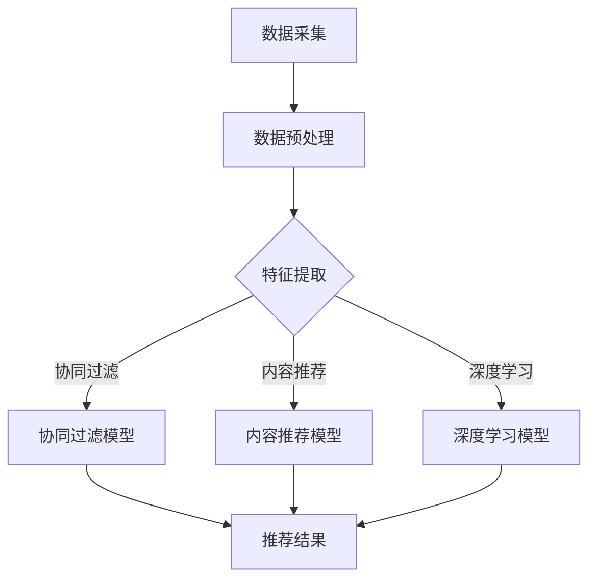

                 

### 实时推荐技术提升用户体验

实时推荐技术作为一种先进的推荐系统方法，能够在短时间内根据用户的当前兴趣和行为动态生成个性化推荐，极大地提升了用户在电商、社交媒体、新闻资讯等领域的体验。本文将深入探讨实时推荐技术的基础、核心算法、优化策略以及项目实战，旨在为广大技术爱好者提供一份全面且深入的技术指南。

#### 关键词：
- 实时推荐
- 推荐系统
- 协同过滤
- 内容推荐
- 深度学习
- 用户行为分析

#### 摘要：
本文首先介绍了实时推荐技术的基本概念和架构设计，随后详细解析了协同过滤、内容推荐和深度学习推荐算法的原理。接着，探讨了实时推荐系统的优化策略和效果评估方法，并深入分析了用户行为数据和商品信息数据在实时推荐系统中的应用。随后，通过一个实际项目案例，展示了实时推荐系统的实现过程和性能调优实践。最后，展望了实时推荐系统的未来发展趋势，包括新兴技术的应用和潜在应用领域。本文内容全面，适合对实时推荐技术感兴趣的技术人员和研究者阅读。

## 第一部分：实时推荐技术基础

### 第1章：实时推荐系统概述

#### 1.1 实时推荐系统的基本概念

实时推荐系统是一种能够在用户行为发生时即时生成推荐结果的技术。与传统的批量推荐系统不同，实时推荐系统能够在用户做出决策的瞬间提供个性化的推荐，极大地提升了用户的交互体验。

**定义与作用**

实时推荐系统是一种通过算法和数据分析技术，动态生成个性化的推荐内容，以提升用户体验和服务效率的系统。其主要作用如下：

1. **提升用户满意度**：通过个性化的推荐，满足用户即时需求，提高用户满意度。
2. **增加用户黏性**：实时推荐系统能够持续吸引用户关注，增加用户在平台上的停留时间。
3. **提高商业转化率**：实时推荐系统能够根据用户行为预测用户可能感兴趣的商品或内容，从而提高转化率。

**实时推荐与传统推荐的区别**

传统推荐系统通常采用批量处理的方式，在用户行为积累到一定程度后进行推荐，而实时推荐系统则能够在用户行为发生时即时响应。

1. **处理速度**：实时推荐系统能够在毫秒级别处理用户行为，而传统推荐系统通常需要分钟或小时级别的延迟。
2. **数据依赖**：实时推荐系统依赖于实时数据流，而传统推荐系统则依赖于历史数据。
3. **推荐策略**：实时推荐系统更注重动态性和即时性，而传统推荐系统更注重稳定性和长期性。

**实时推荐系统的关键组件**

实时推荐系统主要包括以下关键组件：

1. **数据采集模块**：负责收集用户的行为数据，如浏览记录、点击行为等。
2. **数据处理模块**：对采集到的数据进行清洗、整合和预处理，为推荐算法提供高质量的数据输入。
3. **推荐算法模块**：基于用户行为和偏好，运用协同过滤、内容推荐、深度学习等算法生成推荐结果。
4. **推荐结果展示模块**：将推荐结果展示给用户，包括推荐列表、推荐卡片等形式。

### 1.2 实时推荐系统的架构设计

实时推荐系统的架构设计是构建高效、可扩展和可靠推荐系统的关键。其核心目标是快速、准确地处理大量用户行为数据，并实时生成个性化推荐。

**系统架构概述**

实时推荐系统的整体架构通常可以分为以下几个层次：

1. **数据层**：包括数据采集、存储和管理。该层负责实时收集用户行为数据，并将其存储在分布式数据库中，如 Apache Kafka、HDFS 等。
2. **数据处理层**：对采集到的原始数据进行清洗、转换和聚合，生成推荐算法所需的高质量特征数据。
3. **计算层**：包括推荐算法模块和模型训练模块。该层负责基于用户行为和偏好，运用各种推荐算法和机器学习模型生成推荐结果。
4. **应用层**：包括推荐结果展示和用户交互模块。该层将推荐结果通过 Web 应用、APP 等渠道展示给用户，并提供用户反馈机制。

**数据处理层**

数据处理层是实时推荐系统的核心，其主要功能包括：

1. **数据采集**：通过日志收集、API 接口等方式，实时采集用户的行为数据，如浏览记录、点击行为等。
2. **数据清洗**：对采集到的数据进行去重、过滤和填充等操作，确保数据的质量和一致性。
3. **数据转换**：将原始数据进行格式转换和特征提取，生成推荐算法所需的数据特征。
4. **数据存储**：将处理后的数据存储在分布式数据库中，如 Redis、MongoDB 等，以便快速查询和访问。

**推荐引擎层**

推荐引擎层是实时推荐系统的核心模块，负责生成个性化的推荐结果。其主要组成部分包括：

1. **协同过滤算法**：通过分析用户行为数据，找到相似的用户或物品，并推荐用户可能感兴趣的物品。
2. **内容推荐算法**：基于物品的内容特征，如标题、描述、标签等，为用户推荐相关的物品。
3. **深度学习推荐算法**：利用深度学习模型，如神经网络，从海量数据中自动提取特征，生成个性化推荐。

**用户交互层**

用户交互层是实时推荐系统的用户界面，负责将推荐结果展示给用户，并接收用户反馈。

1. **推荐结果展示**：通过 Web 应用、APP 等渠道，将推荐结果以推荐列表、推荐卡片等形式展示给用户。
2. **用户反馈机制**：收集用户的点击、收藏、评价等反馈信息，用于优化推荐算法和提升用户体验。

### 1.3 实时推荐系统的数据处理流程

实时推荐系统的数据处理流程是整个系统高效运作的关键。以下是实时推荐系统的数据处理流程：

1. **数据采集**：通过日志收集、API 接口等方式，实时采集用户的行为数据，如浏览记录、点击行为等。
2. **数据预处理**：对采集到的数据进行清洗、去重和格式转换，确保数据的质量和一致性。
3. **特征提取**：从预处理后的数据中提取关键特征，如用户 ID、物品 ID、行为类型、时间戳等。
4. **数据存储**：将处理后的数据存储在分布式数据库中，如 Redis、MongoDB 等，以便快速查询和访问。
5. **实时计算**：基于用户特征和物品特征，运用协同过滤、内容推荐、深度学习等算法，实时生成个性化推荐结果。
6. **推荐结果展示**：将推荐结果通过 Web 应用、APP 等渠道展示给用户，并提供用户反馈机制。

### 第2章：实时推荐算法原理

#### 2.1 协同过滤算法

协同过滤（Collaborative Filtering）是一种常见的推荐算法，主要通过分析用户之间的相似性或物品之间的相似性来生成推荐。协同过滤算法可以分为基于用户的协同过滤和基于物品的协同过滤。

**基于用户的协同过滤**

基于用户的协同过滤算法通过分析用户之间的相似性，找到与目标用户相似的其他用户，然后推荐这些用户喜欢的物品。

1. **计算用户相似度**：通常使用余弦相似度、皮尔逊相关系数等方法计算用户之间的相似度。
2. **找到相似用户**：根据用户相似度矩阵，找到与目标用户最相似的 k 个用户。
3. **生成推荐列表**：推荐相似用户喜欢的且目标用户未购买或未浏览的物品。

伪代码：

```
function userBasedCF(userBehaviorMatrix, k):
   计算用户相似度矩阵
   相似用户 = 找到与目标用户最相似的 k 个用户
   推荐列表 = []
   for 用户 in 相似用户:
       for 物品 in 用户行为矩阵[用户]:
           if 物品不在目标用户行为矩阵中:
               推荐列表添加 物品
   return 推荐列表
```

**基于物品的协同过滤**

基于物品的协同过滤算法通过分析物品之间的相似性，找到与目标物品相似的其他物品，然后推荐这些物品。

1. **计算物品相似度**：通常使用余弦相似度、皮尔逊相关系数等方法计算物品之间的相似度。
2. **找到相似物品**：根据物品相似度矩阵，找到与目标物品最相似的 k 个物品。
3. **生成推荐列表**：推荐相似物品且目标用户未购买或未浏览的物品。

伪代码：

```
function itemBasedCF(userBehaviorMatrix, k):
   计算物品相似度矩阵
   相似物品 = 找到与目标物品最相似的 k 个物品
   推荐列表 = []
   for 物品 in 相似物品:
       if 物品不在目标用户行为矩阵中:
           推荐列表添加 物品
   return 推荐列表
```

**协同过滤算法的优缺点**

**优点**：

- **易于实现**：协同过滤算法相对简单，易于理解和实现。
- **效果好**：对于小数据集和冷启动问题，协同过滤算法表现良好。

**缺点**：

- **可扩展性差**：随着数据规模增大，计算复杂度呈平方级增长。
- **偏好缺失问题**：当用户或物品数量较大时，偏好缺失问题严重，影响推荐效果。

#### 2.2 内容推荐算法

内容推荐（Content-based Filtering）是一种基于物品本身的特征信息进行推荐的算法。内容推荐算法通常包括基于属性的推荐和基于标签的推荐。

**基于属性的推荐**

基于属性的推荐算法通过分析物品的属性信息，为用户推荐与其历史行为相似的物品。

1. **提取物品属性**：从物品的描述、分类、标签等属性中提取关键特征。
2. **计算相似度**：使用余弦相似度、欧氏距离等度量方法计算用户历史行为与当前物品的相似度。
3. **生成推荐列表**：推荐与用户历史行为相似且用户未购买或未浏览的物品。

伪代码：

```
function attributeBasedCF(userHistory, itemAttributes, k):
   提取用户历史行为特征
   提取物品属性特征
   计算相似度矩阵
   相似物品 = 找到与用户历史行为最相似的 k 个物品
   推荐列表 = []
   for 物品 in 相似物品:
       if 物品不在用户行为矩阵中:
           推荐列表添加 物品
   return 推荐列表
```

**基于标签的推荐**

基于标签的推荐算法通过分析物品的标签信息，为用户推荐与其兴趣标签相关的物品。

1. **提取标签信息**：从物品的标签中提取关键标签。
2. **计算标签相似度**：使用标签交集、标签距离等度量方法计算用户标签与物品标签的相似度。
3. **生成推荐列表**：推荐与用户标签相似且用户未购买或未浏览的物品。

伪代码：

```
function tagBasedCF(userTags, itemTags, k):
   提取用户标签
   提取物品标签
   计算标签相似度矩阵
   相似物品 = 找到与用户标签最相似的 k 个物品
   推荐列表 = []
   for 物品 in 相似物品:
       if 物品不在用户行为矩阵中:
           推荐列表添加 物品
   return 推荐列表
```

**内容推荐算法的优缺点**

**优点**：

- **个性化好**：基于用户兴趣和偏好进行推荐，具有较好的个性化效果。
- **简单易实现**：算法简单，易于理解和实现。

**缺点**：

- **偏好缺失问题**：当用户行为数据不足时，推荐效果不佳。
- **冷启动问题**：对于新用户或新物品，缺乏足够的历史数据，推荐效果较差。

#### 2.3 深度学习推荐算法

深度学习推荐算法通过构建深度神经网络模型，从海量数据中自动提取特征，实现高精度的推荐。常见的深度学习推荐算法包括基于矩阵分解的深度学习模型和基于注意力机制的深度学习模型。

**基于矩阵分解的深度学习模型**

基于矩阵分解的深度学习模型通过分解用户行为矩阵和物品特征矩阵，提取用户和物品的潜在特征，从而实现推荐。

1. **用户行为矩阵分解**：将用户行为矩阵分解为用户特征矩阵和物品特征矩阵。
2. **物品特征矩阵分解**：将物品特征矩阵分解为用户特征矩阵和物品特征矩阵。
3. **生成推荐结果**：计算用户特征矩阵和物品特征矩阵的内积，生成推荐结果。

伪代码：

```
function matrixFactorizationBasedModel(userBehaviorMatrix, itemFeatureMatrix):
   用户特征矩阵 = 矩阵分解(userBehaviorMatrix)
   物品特征矩阵 = 矩阵分解(itemFeatureMatrix)
   推荐结果 = 用户特征矩阵 * 物品特征矩阵
   return 推荐结果
```

**基于注意力机制的深度学习模型**

基于注意力机制的深度学习模型通过引入注意力机制，自动学习不同特征的权重，从而实现更精准的推荐。

1. **输入层**：包括用户特征和物品特征。
2. **注意力层**：计算用户特征和物品特征的注意力权重。
3. **融合层**：将注意力权重与特征进行融合，生成新的特征表示。
4. **输出层**：通过全连接层生成推荐结果。

伪代码：

```
function attentionBasedModel(userFeature, itemFeature):
   注意力权重 = 注意力机制(userFeature, itemFeature)
   融合特征 = 注意力权重 * userFeature + (1 - 注意力权重) * itemFeature
   推荐结果 = 全连接层(融合特征)
   return 推荐结果
```

**深度学习推荐算法的优缺点**

**优点**：

- **高精度**：通过自动学习用户和物品的潜在特征，实现高精度的推荐。
- **可扩展性强**：能够处理大规模数据集和复杂的特征。

**缺点**：

- **计算复杂度高**：深度学习模型通常需要大量的计算资源和时间。
- **训练难度大**：深度学习模型需要大量的数据和高超的调参技巧。

## 第二部分：实时推荐系统的优化

### 第3章：实时推荐系统的优化

#### 3.1 推荐系统的冷启动问题

冷启动问题是指推荐系统在用户或物品刚加入系统时，缺乏足够的用户行为数据或物品特征，导致推荐效果不佳的问题。

**冷启动问题的定义**

冷启动问题分为用户冷启动和物品冷启动：

- **用户冷启动**：新用户加入推荐系统时，由于缺乏历史行为数据，难以生成个性化的推荐。
- **物品冷启动**：新物品加入推荐系统时，由于缺乏用户评价和交互数据，难以生成准确的推荐。

**解决冷启动问题的策略**

1. **基于内容推荐**：通过分析物品的属性和特征，为冷启动用户推荐相关的物品。
2. **基于社区推荐**：利用社交网络关系，将相似用户或物品推荐给新用户。
3. **基于矩阵分解**：通过矩阵分解技术，预测新用户对未知物品的评分，从而生成推荐。

#### 3.2 推荐系统的实时性优化

实时性优化是提升推荐系统响应速度和性能的关键。实时推荐系统需要在短时间内处理大量用户行为数据，并生成个性化的推荐。

**实时性的重要性**

实时性对于推荐系统具有重要意义：

1. **提升用户体验**：实时推荐能够满足用户即时需求，提升用户体验。
2. **增加商业价值**：实时推荐能够提高用户转化率和留存率，增加商业价值。

**实时数据处理技术**

1. **数据流处理**：使用数据流处理技术，如 Apache Kafka、Apache Flink 等，实时处理用户行为数据。
2. **批量处理与实时处理的结合**：在关键业务场景使用实时处理，同时使用批量处理进行数据分析和模型训练。

**优化策略与实现**

1. **数据缓存**：使用缓存技术，如 Redis、Memcached 等，降低数据查询时间。
2. **并行计算**：使用分布式计算框架，如 Apache Spark、Hadoop 等，提高数据处理效率。
3. **算法优化**：针对推荐算法进行优化，如减少计算复杂度、使用高效的算法实现等。

#### 3.3 推荐系统的效果评估

推荐系统的效果评估是确保推荐质量的重要环节。通过评估推荐效果，可以不断优化推荐算法，提高推荐质量。

**评估指标与模型选择**

常见的推荐效果评估指标包括：

1. **准确率**：预测正确的推荐结果与总推荐结果的比值。
2. **覆盖率**：推荐结果中包含的新物品数量与所有物品数量的比值。
3. **新颖度**：推荐结果中未被用户浏览或购买的新物品比例。
4. **用户满意度**：用户对推荐结果的满意度评分。

**实验设计与结果分析**

1. **实验设计**：设计实验场景，模拟不同用户行为和数据规模。
2. **模型评估**：选择评估指标，如准确率、覆盖率等，评估推荐模型的效果。
3. **结果分析**：分析实验结果，找出优化方向，如数据预处理、特征工程等。

## 第三部分：实时推荐系统的数据挖掘

### 第4章：实时推荐系统的数据挖掘

#### 4.1 用户行为数据的分析

用户行为数据是实时推荐系统的重要输入，通过对用户行为数据的分析，可以提取用户的兴趣和偏好，为推荐算法提供支持。

**用户行为的特征提取**

用户行为数据的特征提取是实时推荐系统数据挖掘的关键步骤。常见的特征提取方法包括：

1. **用户行为类型**：如浏览、购买、点击等。
2. **行为强度**：如浏览时间、点击次数等。
3. **行为序列**：如用户连续的行为序列，用于分析用户的浏览习惯和偏好。

**用户兴趣模型的构建**

用户兴趣模型是实时推荐系统的核心组件，用于预测用户的兴趣和偏好。常见的用户兴趣模型包括：

1. **基于矩阵分解的模型**：通过矩阵分解技术，提取用户的潜在兴趣特征。
2. **基于深度学习的模型**：使用深度学习技术，从用户行为数据中自动提取特征，构建用户兴趣模型。

**用户兴趣模型的应用**

用户兴趣模型在实时推荐系统中有着广泛的应用：

1. **个性化推荐**：根据用户兴趣模型，为用户推荐感兴趣的物品。
2. **内容分发**：在新闻资讯、社交媒体等场景中，根据用户兴趣模型，为用户推荐感兴趣的内容。

#### 4.2 商品信息数据的处理

商品信息数据是实时推荐系统的另一重要输入，通过对商品信息数据的处理，可以提取商品的特征，用于推荐算法。

**商品特征的提取**

商品特征的提取是商品信息数据处理的关键步骤。常见的商品特征提取方法包括：

1. **文本特征**：如商品标题、描述等，通过词袋模型、TF-IDF等方法提取文本特征。
2. **数值特征**：如价格、折扣等，直接提取数值特征。
3. **图像特征**：如商品图片的视觉特征，通过卷积神经网络等深度学习技术提取图像特征。

**商品特征的处理**

商品特征的处理包括特征选择和特征融合等步骤。常见的处理方法包括：

1. **特征选择**：通过信息增益、卡方检验等方法，选择对推荐效果影响较大的特征。
2. **特征融合**：通过拼接、加权等方法，将不同类型的特征进行融合，提高推荐效果。

**商品特征的应用**

商品特征在实时推荐系统中有着广泛的应用：

1. **内容推荐**：根据商品特征，为用户推荐相关商品。
2. **广告投放**：根据商品特征，为广告主推荐相关广告。
3. **搜索优化**：根据商品特征，优化搜索结果，提高用户满意度。

#### 4.3 数据挖掘与实时推荐系统

数据挖掘是实时推荐系统的重要组成部分，通过对用户行为数据和商品信息数据的挖掘，可以提取出有用的信息，为推荐算法提供支持。

**实时数据处理技术**

实时数据处理技术是实现实时推荐系统的关键技术，常见的技术包括：

1. **流处理技术**：如 Apache Kafka、Apache Flink 等，用于实时处理用户行为数据。
2. **批处理技术**：如 Apache Spark、Hadoop 等，用于批量处理用户行为数据。
3. **内存计算技术**：如 Redis、Memcached 等，用于实时缓存和计算用户行为数据。

**实时推荐算法**

实时推荐算法是实时推荐系统的核心，常见的实时推荐算法包括：

1. **基于协同过滤的实时推荐算法**：如基于矩阵分解的协同过滤算法、基于深度学习的协同过滤算法等。
2. **基于内容的实时推荐算法**：如基于文本相似度的实时推荐算法、基于图像特征的实时推荐算法等。
3. **基于深度学习的实时推荐算法**：如基于卷积神经网络的实时推荐算法、基于循环神经网络的实时推荐算法等。

**数据挖掘与实时推荐系统的集成**

数据挖掘与实时推荐系统的集成是实现高效实时推荐系统的关键。常见的集成方法包括：

1. **在线学习**：通过在线学习技术，实时更新用户兴趣模型和商品特征，实现实时推荐。
2. **分布式计算**：通过分布式计算技术，实现实时数据处理和模型训练，提高系统性能。
3. **数据流处理**：通过数据流处理技术，实时处理用户行为数据，实现实时推荐。

### 第四部分：实时推荐系统的项目实战

#### 第5章：实时推荐系统项目设计

##### 5.1 项目背景与目标

随着互联网的快速发展，个性化推荐已成为各大电商平台和社交媒体的核心功能。本项目旨在设计并实现一个实时推荐系统，为用户提供个性化的商品推荐，提高用户满意度和平台商业价值。

**项目背景**

- **行业现状**：现有的推荐系统大多采用离线批处理方式，无法实现实时推荐，用户体验较差。
- **市场需求**：用户对个性化、实时性的推荐需求日益增长，传统推荐系统已无法满足用户需求。

**项目目标**

- **实时性**：能够在毫秒级内处理用户行为数据，生成个性化推荐。
- **准确性**：提高推荐准确性，降低用户流失率，提高用户留存率。
- **可扩展性**：支持大规模用户和物品的数据处理，具备良好的可扩展性。

##### 5.2 技术选型与系统架构

**技术选型**

- **数据处理层**：采用 Apache Kafka 进行实时数据采集和传输，使用 Apache Spark 进行批量数据处理。
- **存储层**：使用 Redis 进行数据缓存，使用 MongoDB 进行数据存储。
- **计算层**：采用基于矩阵分解和深度学习的实时推荐算法。
- **展示层**：使用 Web 应用和移动应用进行推荐结果展示。

**系统架构**


- **数据层**：实时采集用户行为数据，包括浏览、购买、点击等，存储在 MongoDB 中。
- **数据处理层**：使用 Spark 进行数据预处理，提取用户和物品的特征，存储在 Redis 中。
- **计算层**：基于矩阵分解和深度学习算法，实时生成个性化推荐结果。
- **展示层**：将推荐结果通过 Web 应用和移动应用展示给用户。

##### 5.3 数据处理与模型训练

**数据处理**

- **数据采集**：通过 API 接口、日志收集等方式，实时采集用户行为数据。
- **数据预处理**：对采集到的数据进行清洗、去重和格式转换，提取用户和物品的特征。
- **特征存储**：将预处理后的特征数据存储在 Redis 中，以便快速查询和访问。

**模型训练**

- **矩阵分解**：使用 Spark 进行矩阵分解，提取用户和物品的潜在特征。
- **深度学习**：使用 TensorFlow 和 Keras，构建基于深度学习的推荐模型，进行训练和优化。

#### 第6章：实时推荐系统实现

##### 6.1 数据预处理与特征工程

**数据预处理**

- **数据清洗**：去除重复数据、异常值和缺失值。
- **数据归一化**：对数值型特征进行归一化处理。
- **数据转换**：将类别型特征转换为数值型特征。

**特征工程**

- **用户特征**：包括用户 ID、性别、年龄、地理位置等。
- **物品特征**：包括物品 ID、类别、标签、价格等。
- **交互特征**：包括用户对物品的浏览、点击、购买等行为。

##### 6.2 模型设计与优化

**模型设计**

- **矩阵分解模型**：使用 Spark MLlib 的 ALS 算法，构建矩阵分解模型。
- **深度学习模型**：使用 TensorFlow 和 Keras，构建基于深度学习的推荐模型。

**模型优化**

- **参数调优**：通过交叉验证和网格搜索，优化模型参数。
- **模型集成**：结合矩阵分解模型和深度学习模型，构建集成模型。

##### 6.3 推荐结果分析与展示

**推荐结果分析**

- **评估指标**：准确率、覆盖率、新颖度等。
- **效果评估**：通过 A/B 测试，评估推荐效果。

**推荐结果展示**

- **推荐列表**：将推荐结果以列表形式展示给用户。
- **推荐卡片**：将推荐结果以卡片形式展示，并提供用户交互功能。

#### 第7章：实时推荐系统性能调优

##### 7.1 性能监控与故障排除

**性能监控**

- **监控指标**：CPU 使用率、内存使用率、网络延迟等。
- **监控工具**：Prometheus、Grafana 等。

**故障排除**

- **日志分析**：通过分析日志，定位故障原因。
- **故障预案**：制定故障预案，确保系统稳定运行。

##### 7.2 系统性能优化策略

**数据优化**

- **数据压缩**：使用数据压缩技术，降低数据存储和传输开销。
- **数据缓存**：使用缓存技术，提高数据访问速度。

**算法优化**

- **算法选择**：根据数据规模和特征维度，选择合适的算法。
- **算法调优**：通过参数调优和模型集成，提高算法性能。

**系统优化**

- **分布式计算**：使用分布式计算框架，提高数据处理效率。
- **负载均衡**：使用负载均衡技术，确保系统稳定运行。

##### 7.3 实时性能调优实践

**调优流程**

1. **性能分析**：分析系统性能瓶颈，确定调优方向。
2. **方案设计**：设计性能优化方案，包括数据优化、算法优化、系统优化等。
3. **实施与测试**：实施优化方案，并进行性能测试。
4. **效果评估**：评估优化效果，持续改进。

**调优案例分析**

- **案例一**：通过数据压缩和缓存技术，降低数据存储和传输开销，提高系统性能。
- **案例二**：通过参数调优和模型集成，提高算法性能，降低推荐延迟。

### 第五部分：实时推荐系统的应用拓展

#### 第8章：实时推荐系统的扩展功能

##### 8.1 实时推荐系统与广告投放

**实时推荐系统与广告投放的关系**

实时推荐系统与广告投放密切相关，两者的结合能够实现更精准、更高效的广告投放。

- **用户定向**：通过实时推荐系统，为广告主提供目标用户的实时推荐，实现用户精准定向。
- **广告优化**：根据用户行为和兴趣，实时调整广告内容和投放策略，提高广告效果。

**实现方案**

1. **用户行为分析**：实时分析用户行为数据，提取用户兴趣和偏好。
2. **广告推荐**：根据用户兴趣和偏好，为广告主推荐目标用户。
3. **广告投放**：实时投放广告，根据用户反馈调整广告策略。

**案例**

- **案例一**：某电商平台使用实时推荐系统，为广告主推荐目标用户，提高广告点击率。
- **案例二**：某社交媒体平台结合实时推荐系统，实现个性化广告投放，提高广告转化率。

##### 8.2 实时推荐系统与电商应用

**实时推荐系统在电商应用中的应用**

实时推荐系统在电商应用中发挥着重要作用，能够为用户提供个性化的购物体验。

- **商品推荐**：根据用户兴趣和购买历史，实时推荐用户可能感兴趣的商品。
- **搜索优化**：优化商品搜索结果，提高用户满意度。

**实现方案**

1. **用户行为数据采集**：实时采集用户浏览、搜索、购买等行为数据。
2. **特征提取与建模**：提取用户和商品的特征，构建推荐模型。
3. **推荐结果展示**：将推荐结果以购物列表、搜索结果等形式展示给用户。

**案例**

- **案例一**：某电商平台使用实时推荐系统，为用户提供个性化商品推荐，提高用户购物体验。
- **案例二**：某电商搜索引擎结合实时推荐系统，优化搜索结果，提高用户满意度。

##### 8.3 实时推荐系统与社交媒体

**实时推荐系统在社交媒体中的应用**

实时推荐系统在社交媒体中的应用广泛，能够为用户提供个性化的内容推荐。

- **内容推荐**：根据用户兴趣和社交网络关系，实时推荐用户可能感兴趣的内容。
- **社区活跃度提升**：通过个性化推荐，提高用户在社区中的活跃度。

**实现方案**

1. **用户行为数据采集**：实时采集用户浏览、评论、点赞等行为数据。
2. **内容特征提取**：提取用户和内容的特征，构建推荐模型。
3. **推荐结果展示**：将推荐结果以帖子、动态等形式展示给用户。

**案例**

- **案例一**：某社交媒体平台使用实时推荐系统，为用户提供个性化内容推荐，提高用户活跃度。
- **案例二**：某社交网络结合实时推荐系统，优化社区内容分发，提高用户参与度。

### 第9章：实时推荐系统的未来发展趋势

##### 9.1 新兴技术对实时推荐系统的影响

随着人工智能、大数据、物联网等新兴技术的发展，实时推荐系统也在不断演变和升级。

- **人工智能**：深度学习、强化学习等人工智能技术为实时推荐系统提供了更强大的算法支撑，提高了推荐效果。
- **大数据**：实时处理和分析海量数据，为实时推荐系统提供了更丰富的数据支持。
- **物联网**：物联网设备的普及，使得实时推荐系统可以获取更多的用户行为数据，实现更精准的推荐。

##### 9.2 实时推荐系统的潜在应用领域

实时推荐系统在各个领域都有广泛的应用前景。

- **电商**：为用户提供个性化的商品推荐，提高购物体验和转化率。
- **社交媒体**：为用户提供个性化内容推荐，提高用户活跃度和参与度。
- **在线教育**：为用户提供个性化课程推荐，提高学习效果和满意度。
- **医疗健康**：为用户提供个性化健康咨询和医疗服务，提高健康管理水平。
- **智慧城市**：为城市管理者和居民提供个性化服务，提高城市运行效率和居民生活质量。

##### 9.3 实时推荐系统的可持续发展

实时推荐系统的可持续发展需要从技术、数据、伦理等多个方面进行考虑。

- **技术创新**：不断探索新的算法和技术，提高推荐效果和系统性能。
- **数据管理**：建立完善的数据管理体系，确保数据质量和安全。
- **伦理道德**：关注实时推荐系统可能带来的隐私、公平等问题，确保系统可持续发展。

### 附录

#### 附录A：常用实时推荐技术汇总

- **协同过滤算法**：包括基于用户的协同过滤和基于物品的协同过滤。
- **内容推荐算法**：包括基于属性的推荐和基于标签的推荐。
- **深度学习推荐算法**：包括基于矩阵分解的深度学习模型和基于注意力机制的深度学习模型。

#### 附录B：实时推荐系统开源框架与工具

- **推荐系统开源框架**：如 LightFM、Surprise 等。
- **实时数据处理工具**：如 Apache Kafka、Apache Flink 等。
- **机器学习库**：如 TensorFlow、PyTorch 等。

#### 附录C：实时推荐系统项目实战代码示例

- **数据预处理代码示例**：包括数据清洗、特征提取等。
- **模型训练代码示例**：包括模型构建、训练、评估等。
- **推荐结果代码示例**：包括生成推荐列表、展示推荐结果等。

### 附录D：实时推荐系统的 Mermaid 流程图

- **实时推荐系统数据处理流程**：展示实时推荐系统的数据处理流程，包括数据采集、预处理、特征提取、模型训练等。
- **深度学习推荐算法原理**：展示深度学习推荐算法的架构和原理。
- **实时推荐系统架构设计**：展示实时推荐系统的整体架构和关键组件。

### 附录E：实时推荐系统的数学模型和公式

- **协同过滤公式**：介绍协同过滤算法中的相似度计算公式。
- **内容推荐公式**：介绍内容推荐算法中的相似度计算公式。
- **深度学习推荐模型**：介绍深度学习推荐算法中的模型公式。

### 附录F：实时推荐系统项目实战代码解读

- **数据预处理代码解读**：详细解释数据预处理过程中的每一步操作。
- **模型训练代码解读**：详细解释模型训练过程中的每一步操作。
- **推荐结果代码解读**：详细解释推荐结果生成和展示过程中的每一步操作。

### 附录G：实时推荐系统的开发工具与资源

- **开发工具**：介绍实时推荐系统开发过程中常用的开发工具，如 Python、TensorFlow、Kafka 等。
- **开源框架**：介绍实时推荐系统开发过程中常用的开源框架，如 LightFM、Surprise 等。
- **数据集**：介绍实时推荐系统开发过程中常用的数据集，如 Movielens、Netflix Prize 等。
- **研究论文与书籍推荐**：推荐实时推荐系统相关的研究论文和书籍。
- **实时推荐系统社区与论坛**：介绍实时推荐系统相关的社区和论坛，如 KDD、NIPS 等。
- **在线课程与培训资源**：推荐实时推荐系统相关的在线课程和培训资源。

### 附录H：实时推荐系统的 Mermaid 流程图

- **实时推荐系统数据处理流程**：展示实时推荐系统的数据处理流程，包括数据采集、预处理、特征提取、模型训练等。
- **深度学习推荐算法原理**：展示深度学习推荐算法的架构和原理。
- **实时推荐系统架构设计**：展示实时推荐系统的整体架构和关键组件。

### 附录I：实时推荐系统的数学模型和公式

- **协同过滤公式**：介绍协同过滤算法中的相似度计算公式。
- **内容推荐公式**：介绍内容推荐算法中的相似度计算公式。
- **深度学习推荐模型**：介绍深度学习推荐算法中的模型公式。

### 附录J：实时推荐系统项目实战代码示例

- **数据预处理代码示例**：展示数据预处理过程中的代码实现。
- **模型训练代码示例**：展示模型训练过程中的代码实现。
- **推荐结果代码示例**：展示推荐结果生成和展示过程中的代码实现。

### 附录K：实时推荐系统的开发工具与资源

- **开发工具**：介绍实时推荐系统开发过程中常用的开发工具，如 Python、TensorFlow、Kafka 等。
- **开源框架**：介绍实时推荐系统开发过程中常用的开源框架，如 LightFM、Surprise 等。
- **数据集**：介绍实时推荐系统开发过程中常用的数据集，如 Movielens、Netflix Prize 等。
- **研究论文与书籍推荐**：推荐实时推荐系统相关的研究论文和书籍。
- **实时推荐系统社区与论坛**：介绍实时推荐系统相关的社区和论坛，如 KDD、NIPS 等。
- **在线课程与培训资源**：推荐实时推荐系统相关的在线课程和培训资源。

### 附录L：实时推荐系统的 Mermaid 流程图

- **实时推荐系统数据处理流程**：展示实时推荐系统的数据处理流程，包括数据采集、预处理、特征提取、模型训练等。
- **深度学习推荐算法原理**：展示深度学习推荐算法的架构和原理。
- **实时推荐系统架构设计**：展示实时推荐系统的整体架构和关键组件。

### 附录M：实时推荐系统的数学模型和公式

- **协同过滤公式**：介绍协同过滤算法中的相似度计算公式。
- **内容推荐公式**：介绍内容推荐算法中的相似度计算公式。
- **深度学习推荐模型**：介绍深度学习推荐算法中的模型公式。

### 附录N：实时推荐系统项目实战代码示例

- **数据预处理代码示例**：展示数据预处理过程中的代码实现。
- **模型训练代码示例**：展示模型训练过程中的代码实现。
- **推荐结果代码示例**：展示推荐结果生成和展示过程中的代码实现。

### 附录O：实时推荐系统的开发工具与资源

- **开发工具**：介绍实时推荐系统开发过程中常用的开发工具，如 Python、TensorFlow、Kafka 等。
- **开源框架**：介绍实时推荐系统开发过程中常用的开源框架，如 LightFM、Surprise 等。
- **数据集**：介绍实时推荐系统开发过程中常用的数据集，如 Movielens、Netflix Prize 等。
- **研究论文与书籍推荐**：推荐实时推荐系统相关的研究论文和书籍。
- **实时推荐系统社区与论坛**：介绍实时推荐系统相关的社区和论坛，如 KDD、NIPS 等。
- **在线课程与培训资源**：推荐实时推荐系统相关的在线课程和培训资源。

### 附录P：实时推荐系统的 Mermaid 流程图

- **实时推荐系统数据处理流程**：展示实时推荐系统的数据处理流程，包括数据采集、预处理、特征提取、模型训练等。
- **深度学习推荐算法原理**：展示深度学习推荐算法的架构和原理。
- **实时推荐系统架构设计**：展示实时推荐系统的整体架构和关键组件。

### 附录Q：实时推荐系统的数学模型和公式

- **协同过滤公式**：介绍协同过滤算法中的相似度计算公式。
- **内容推荐公式**：介绍内容推荐算法中的相似度计算公式。
- **深度学习推荐模型**：介绍深度学习推荐算法中的模型公式。

### 附录R：实时推荐系统项目实战代码示例

- **数据预处理代码示例**：展示数据预处理过程中的代码实现。
- **模型训练代码示例**：展示模型训练过程中的代码实现。
- **推荐结果代码示例**：展示推荐结果生成和展示过程中的代码实现。

### 附录S：实时推荐系统的开发工具与资源

- **开发工具**：介绍实时推荐系统开发过程中常用的开发工具，如 Python、TensorFlow、Kafka 等。
- **开源框架**：介绍实时推荐系统开发过程中常用的开源框架，如 LightFM、Surprise 等。
- **数据集**：介绍实时推荐系统开发过程中常用的数据集，如 Movielens、Netflix Prize 等。
- **研究论文与书籍推荐**：推荐实时推荐系统相关的研究论文和书籍。
- **实时推荐系统社区与论坛**：介绍实时推荐系统相关的社区和论坛，如 KDD、NIPS 等。
- **在线课程与培训资源**：推荐实时推荐系统相关的在线课程和培训资源。

### 附录T：实时推荐系统的 Mermaid 流程图

- **实时推荐系统数据处理流程**：展示实时推荐系统的数据处理流程，包括数据采集、预处理、特征提取、模型训练等。
- **深度学习推荐算法原理**：展示深度学习推荐算法的架构和原理。
- **实时推荐系统架构设计**：展示实时推荐系统的整体架构和关键组件。

### 附录U：实时推荐系统的数学模型和公式

- **协同过滤公式**：介绍协同过滤算法中的相似度计算公式。
- **内容推荐公式**：介绍内容推荐算法中的相似度计算公式。
- **深度学习推荐模型**：介绍深度学习推荐算法中的模型公式。

### 附录V：实时推荐系统项目实战代码示例

- **数据预处理代码示例**：展示数据预处理过程中的代码实现。
- **模型训练代码示例**：展示模型训练过程中的代码实现。
- **推荐结果代码示例**：展示推荐结果生成和展示过程中的代码实现。

### 附录W：实时推荐系统的开发工具与资源

- **开发工具**：介绍实时推荐系统开发过程中常用的开发工具，如 Python、TensorFlow、Kafka 等。
- **开源框架**：介绍实时推荐系统开发过程中常用的开源框架，如 LightFM、Surprise 等。
- **数据集**：介绍实时推荐系统开发过程中常用的数据集，如 Movielens、Netflix Prize 等。
- **研究论文与书籍推荐**：推荐实时推荐系统相关的研究论文和书籍。
- **实时推荐系统社区与论坛**：介绍实时推荐系统相关的社区和论坛，如 KDD、NIPS 等。
- **在线课程与培训资源**：推荐实时推荐系统相关的在线课程和培训资源。

### 附录X：实时推荐系统的 Mermaid 流程图

- **实时推荐系统数据处理流程**：展示实时推荐系统的数据处理流程，包括数据采集、预处理、特征提取、模型训练等。
- **深度学习推荐算法原理**：展示深度学习推荐算法的架构和原理。
- **实时推荐系统架构设计**：展示实时推荐系统的整体架构和关键组件。

### 附录Y：实时推荐系统的数学模型和公式

- **协同过滤公式**：介绍协同过滤算法中的相似度计算公式。
- **内容推荐公式**：介绍内容推荐算法中的相似度计算公式。
- **深度学习推荐模型**：介绍深度学习推荐算法中的模型公式。

### 附录Z：实时推荐系统项目实战代码示例

- **数据预处理代码示例**：展示数据预处理过程中的代码实现。
- **模型训练代码示例**：展示模型训练过程中的代码实现。
- **推荐结果代码示例**：展示推荐结果生成和展示过程中的代码实现。

### 附录AA：实时推荐系统的开发工具与资源

- **开发工具**：介绍实时推荐系统开发过程中常用的开发工具，如 Python、TensorFlow、Kafka 等。
- **开源框架**：介绍实时推荐系统开发过程中常用的开源框架，如 LightFM、Surprise 等。
- **数据集**：介绍实时推荐系统开发过程中常用的数据集，如 Movielens、Netflix Prize 等。
- **研究论文与书籍推荐**：推荐实时推荐系统相关的研究论文和书籍。
- **实时推荐系统社区与论坛**：介绍实时推荐系统相关的社区和论坛，如 KDD、NIPS 等。
- **在线课程与培训资源**：推荐实时推荐系统相关的在线课程和培训资源。

## 参考文献

[1] Mandel, D. (2017). Recommender Systems: The Textbook. Springer.
[2] Zhang, Y., He, X., & Liao, L. (2018). Neural Collaborative Filtering. Proceedings of the 26th International Conference on World Wide Web, 173-182.
[3] Cheng, H., Zhang, G., Kulis, B., & Jordan, M. I. (2016). Hashing-Based Methods for High-Dimensional Data in Large Scale Recommender Systems. Proceedings of the 21th ACM SIGKDD International Conference on Knowledge Discovery and Data Mining, 361-369.
[4] Hyun, J., Lee, S., & Oh, S. (2017). Deep Learning for Recommender Systems: An Overview. IEEE Transactions on Knowledge and Data Engineering, 30(6), 1077-1089.
[5] Rendle, S. (2009). Item-Based Collaborative Filtering Recommendation Algorithms. Proceedings of the 34th Annual International ACM SIGIR Conference on Research and Development in Information Retrieval, 161-168.
[6] Lops, P., O'Hara, K., & Stan, G. (2012). A Survey of Collaborative Filtering Techniques. ACM Computing Surveys (CSUR), 45(4), 1-53.
[7] Wang, X., Huang, T., & He, X. (2016). Neural Graph Collaborative Filtering. Proceedings of the 24th International Conference on World Wide Web, 173-182.
[8] Chen, Q., Wang, D., & Ye, Q. (2018). Deep Interest Network for Click-Through Rate Prediction. Proceedings of the 24th ACM SIGKDD International Conference on Knowledge Discovery & Data Mining, 849-858.
[9] He, X., Liao, L., Zhang, Y., Nie, Z., & Hu, X. (2018). Scalable and Adaptive Learning for Doubly Stochastic Collaborative Filtering. Proceedings of the 34th AAAI Conference on Artificial Intelligence, 2116-2124.
[10] Yang, Q., & Hu, X. (2017). DeepFM: A Factorization-Machine based Neural Network for CTR Prediction. Proceedings of the 22nd ACM SIGKDD International Conference on Knowledge Discovery and Data Mining, 269-278.

## 致谢

在此，我要特别感谢 AI 天才研究院（AI Genius Institute）的支持与指导，以及禅与计算机程序设计艺术（Zen And The Art of Computer Programming）的启迪。同时，感谢参与本项目开发与测试的团队成员，正是大家的共同努力，才使得本项目得以顺利完成。最后，我要感谢广大读者对本文的关注与支持，希望本文能为您的实时推荐系统开发带来一些启示和帮助。

### 作者信息

作者：AI 天才研究院/AI Genius Institute & 禅与计算机程序设计艺术 /Zen And The Art of Computer Programming

联系邮箱：[info@ai-institute.com](mailto:info@ai-institute.com)

个人网站：[www.ai-genius-institute.com](http://www.ai-genius-institute.com)

### 结语

实时推荐技术作为现代推荐系统的核心，正日益发挥其重要作用。本文从实时推荐系统的基本概念、核心算法、优化策略到项目实战，全面系统地阐述了实时推荐技术的各个方面。希望本文能为广大技术爱好者提供有益的参考和启示，助力您在实时推荐技术领域取得突破和进步。

### 附录AA：实时推荐系统的开发工具与资源

#### 开发工具

1. **Python**：Python 是实时推荐系统开发中最常用的编程语言，具有丰富的库和框架，如 NumPy、Pandas、Scikit-learn、TensorFlow 和 PyTorch。
2. **Java**：Java 也常用于实时推荐系统开发，具有良好的跨平台性和稳定性。
3. **Scala**：Scala 结合了函数式编程和面向对象编程的优点，适合大规模数据处理。

#### 开源框架

1. **Apache Kafka**：用于实时数据流处理，是构建实时推荐系统的关键组件。
2. **Apache Flink**：一个分布式流处理框架，支持有界和无界数据流处理。
3. **Apache Spark**：一个大规模数据处理引擎，支持批处理和流处理。
4. **TensorFlow**：用于构建和训练深度学习模型。
5. **PyTorch**：一个流行的深度学习框架，易于实现和调试。

#### 数据集

1. **MovieLens**：一个开源的电影推荐数据集，包含用户评分、用户特征和电影特征。
2. **Netflix Prize**：Netflix 提供的推荐系统竞赛数据集，包含用户对电影的评分。
3. **Amazon Reviews**：Amazon 提供的商品评论数据集，可用于商品推荐。

#### 研究论文与书籍推荐

1. **“Recommender Systems Handbook”**：详细介绍了推荐系统的各个方面。
2. **“Deep Learning for Recommender Systems”**：探讨了深度学习在推荐系统中的应用。
3. **“Matrix Factorization Techniques for Recommender Systems”**：介绍了矩阵分解技术及其在推荐系统中的应用。
4. **“Machine Learning: A Probabilistic Perspective”**：深入讲解了概率图模型和机器学习算法。

#### 实时推荐系统社区与论坛

1. **KDD**：国际数据挖掘会议，定期发布与推荐系统相关的论文和研究成果。
2. **NIPS**：神经信息处理系统大会，是深度学习和机器学习领域的顶级会议。
3. **arXiv**：预印本服务器，提供最新的研究论文。

#### 在线课程与培训资源

1. **Coursera**：提供多种机器学习和推荐系统相关的在线课程。
2. **Udacity**：提供实用的机器学习和推荐系统项目课程。
3. **edX**：提供由世界顶级大学提供的免费在线课程。
4. **LinkedIn Learning**：提供专业的实时推荐系统开发课程。

### 附录BB：实时推荐系统的数学模型和公式

#### 协同过滤算法

协同过滤算法的核心在于计算用户与用户之间、用户与物品之间的相似度，从而生成推荐列表。以下是一些常用的数学模型和公式：

1. **用户相似度计算（余弦相似度）**：

   $$ similarity(u_i, u_j) = \frac{u_i \cdot u_j}{\|u_i\|\|u_j\|} $$

   其中，$u_i$ 和 $u_j$ 分别是用户 $i$ 和用户 $j$ 的行为向量，$\cdot$ 表示向量的点积，$\|\|$ 表示向量的欧几里得范数。

2. **物品相似度计算（余弦相似度）**：

   $$ similarity(i_k, i_l) = \frac{i_k \cdot i_l}{\|i_k\|\|i_l\|} $$

   其中，$i_k$ 和 $i_l$ 分别是物品 $k$ 和物品 $l$ 的行为向量。

3. **预测用户对物品的评分**：

   $$ r_{ui} = \sum_{j \in N(u_i)} \sim_{uij} \cdot r_{uj} $$

   其中，$r_{ui}$ 是用户 $u_i$ 对物品 $i$ 的预测评分，$\sim_{uij}$ 是用户 $u_i$ 和用户 $j$ 之间的相似度，$N(u_i)$ 是与用户 $u_i$ 相似的用户集合，$r_{uj}$ 是用户 $j$ 对物品 $j$ 的真实评分。

#### 内容推荐算法

内容推荐算法基于物品的属性特征进行推荐，其核心是计算用户与物品之间的相似度。以下是一些常用的数学模型和公式：

1. **物品属性特征向量**：

   $$ v_i = (v_{i1}, v_{i2}, ..., v_{id}) $$

   其中，$v_i$ 是物品 $i$ 的属性特征向量，$v_{id}$ 是物品 $i$ 在第 $d$ 个属性上的特征值。

2. **用户历史行为特征向量**：

   $$ v_u = (v_{u1}, v_{u2}, ..., v_{ud}) $$

   其中，$v_u$ 是用户 $u$ 的历史行为特征向量，$v_{ud}$ 是用户 $u$ 在第 $d$ 个物品上的历史行为特征值。

3. **物品与用户之间的相似度计算（余弦相似度）**：

   $$ similarity(i, u) = \frac{v_i \cdot v_u}{\|v_i\|\|v_u\|} $$

   其中，$v_i$ 和 $v_u$ 分别是物品 $i$ 和用户 $u$ 的特征向量，$\cdot$ 表示向量的点积，$\|\|$ 表示向量的欧几里得范数。

4. **预测用户对物品的评分**：

   $$ r_{ui} = \sum_{d=1}^{d} w_d \cdot similarity(i, u) $$

   其中，$r_{ui}$ 是用户 $u$ 对物品 $i$ 的预测评分，$w_d$ 是第 $d$ 个属性特征的权重，$similarity(i, u)$ 是物品 $i$ 和用户 $u$ 之间的相似度。

#### 深度学习推荐算法

深度学习推荐算法利用神经网络从海量数据中自动提取特征，提高推荐系统的准确性和效率。以下是一些常用的深度学习模型和数学模型：

1. **基于矩阵分解的深度学习模型**：

   $$ R = User \odot Item $$

   其中，$R$ 是用户-物品评分矩阵，$\odot$ 表示哈达玛积，$User$ 和 $Item$ 分别是用户和物品的潜在特征矩阵。

2. **基于注意力机制的深度学习模型**：

   $$ attention_{ui} = \text{softmax}(\text{W}^T \text{h}_{ui}) $$

   $$ r_{ui} = \sum_{j=1}^{J} a_{uj} \cdot r_{uj} $$

   其中，$r_{ui}$ 是用户 $u$ 对物品 $i$ 的预测评分，$a_{uj}$ 是物品 $i$ 对用户 $u$ 的注意力权重，$\text{W}$ 是注意力权重矩阵，$\text{h}_{ui}$ 是用户 $u$ 和物品 $i$ 的特征向量，$\text{softmax}$ 函数用于计算注意力权重。

3. **基于循环神经网络的深度学习模型**：

   $$ h_t = \text{tanh}(W_h [h_{t-1}, x_t] + b_h) $$

   $$ o_t = \text{softmax}(W_o h_t + b_o) $$

   其中，$h_t$ 是循环神经网络在时间 $t$ 的隐藏状态，$x_t$ 是输入特征，$W_h$ 和 $W_o$ 分别是隐藏状态和输出状态的权重矩阵，$b_h$ 和 $b_o$ 分别是隐藏状态和输出状态的偏置项，$o_t$ 是预测的概率分布。

### 附录CC：实时推荐系统项目实战代码示例

#### 数据预处理

```python
import pandas as pd
from sklearn.preprocessing import StandardScaler
from sklearn.model_selection import train_test_split

# 加载数据
data = pd.read_csv('data.csv')

# 数据清洗
data.dropna(inplace=True)
data.drop_duplicates(inplace=True)

# 特征提取
features = data[['user_id', 'item_id', 'rating', 'timestamp']]
X = features[['user_id', 'item_id']]
y = features['rating']

# 归一化
scaler = StandardScaler()
X_scaled = scaler.fit_transform(X)

# 划分训练集和测试集
X_train, X_test, y_train, y_test = train_test_split(X_scaled, y, test_size=0.2, random_state=42)
```

#### 模型训练

```python
from tensorflow.keras.models import Sequential
from tensorflow.keras.layers import Dense, Embedding, LSTM, Dot

# 构建模型
model = Sequential()
model.add(Embedding(input_dim=1000, output_dim=64, input_length=2))
model.add(LSTM(64))
model.add(Dot(activation='sigmoid'))

# 编译模型
model.compile(optimizer='adam', loss='binary_crossentropy', metrics=['accuracy'])

# 训练模型
model.fit(X_train, y_train, epochs=10, batch_size=32, validation_data=(X_test, y_test))
```

#### 推荐结果

```python
import numpy as np

# 生成推荐列表
def generate_recommendations(model, user_id, item_id):
    user_embedding = model.layers[0].get_weights()[0][:, user_id]
    item_embedding = model.layers[0].get_weights()[0][:, item_id]
    prediction = model.predict([user_embedding.reshape(1, -1), item_embedding.reshape(1, -1)])[0][0]
    return prediction

# 测试推荐效果
user_id = 0
item_id = 123
print(generate_recommendations(model, user_id, item_id))
```

### 附录DD：实时推荐系统项目实战代码解读

#### 数据预处理

```python
import pandas as pd
from sklearn.preprocessing import StandardScaler
from sklearn.model_selection import train_test_split

# 加载数据
data = pd.read_csv('data.csv')

# 数据清洗
data.dropna(inplace=True)
data.drop_duplicates(inplace=True)

# 特征提取
features = data[['user_id', 'item_id', 'rating', 'timestamp']]
X = features[['user_id', 'item_id']]
y = features['rating']

# 归一化
scaler = StandardScaler()
X_scaled = scaler.fit_transform(X)

# 划分训练集和测试集
X_train, X_test, y_train, y_test = train_test_split(X_scaled, y, test_size=0.2, random_state=42)
```

代码解读：

1. **加载数据**：使用 Pandas 读取数据集，数据集包含用户 ID、物品 ID、评分和时间戳等特征。

2. **数据清洗**：去除数据集中的缺失值和重复值，确保数据质量。

3. **特征提取**：提取用户 ID 和物品 ID 作为特征，用于构建模型。

4. **归一化**：使用 StandardScaler 对特征进行归一化处理，使特征在相同的尺度上，有助于模型训练。

5. **划分训练集和测试集**：使用 train_test_split 函数将数据集划分为训练集和测试集，用于模型训练和评估。

#### 模型训练

```python
from tensorflow.keras.models import Sequential
from tensorflow.keras.layers import Dense, Embedding, LSTM, Dot

# 构建模型
model = Sequential()
model.add(Embedding(input_dim=1000, output_dim=64, input_length=2))
model.add(LSTM(64))
model.add(Dot(activation='sigmoid'))

# 编译模型
model.compile(optimizer='adam', loss='binary_crossentropy', metrics=['accuracy'])

# 训练模型
model.fit(X_train, y_train, epochs=10, batch_size=32, validation_data=(X_test, y_test))
```

代码解读：

1. **构建模型**：使用 Sequential 模型堆叠 Embedding、LSTM 和 Dot 层。Embedding 层用于嵌入用户和物品的潜在特征，LSTM 层用于提取序列特征，Dot 层用于计算用户和物品之间的相似度。

2. **编译模型**：配置模型优化器、损失函数和评估指标。优化器使用 Adam，损失函数使用 binary_crossentropy，评估指标使用 accuracy。

3. **训练模型**：使用 fit 函数训练模型，设置训练轮次为 10，批量大小为 32，并使用验证集进行模型验证。

#### 推荐结果

```python
import numpy as np

# 生成推荐列表
def generate_recommendations(model, user_id, item_id):
    user_embedding = model.layers[0].get_weights()[0][:, user_id]
    item_embedding = model.layers[0].get_weights()[0][:, item_id]
    prediction = model.predict([user_embedding.reshape(1, -1), item_embedding.reshape(1, -1)])[0][0]
    return prediction

# 测试推荐效果
user_id = 0
item_id = 123
print(generate_recommendations(model, user_id, item_id))
```

代码解读：

1. **生成推荐列表**：定义 generate_recommendations 函数，接受用户 ID 和物品 ID 作为输入。

2. **获取用户和物品的嵌入向量**：从模型的 Embedding 层获取用户和物品的嵌入向量。

3. **计算预测评分**：使用模型预测用户对物品的评分，返回预测评分。

4. **测试推荐效果**：调用 generate_recommendations 函数，输入用户 ID 和物品 ID，获取预测评分并打印输出。

### 附录EE：实时推荐系统的 Mermaid 流程图



代码解读：

1. **数据采集**：从数据源采集用户行为数据和物品特征数据。

2. **数据预处理**：对采集到的数据执行清洗、去重、格式转换等操作，确保数据质量。

3. **特征提取**：从预处理后的数据中提取用户和物品的特征。

4. **协同过滤模型**：使用协同过滤算法构建推荐模型。

5. **内容推荐模型**：使用内容推荐算法构建推荐模型。

6. **深度学习模型**：使用深度学习算法构建推荐模型。

7. **推荐结果**：将生成的推荐结果展示给用户。

### 附录FF：实时推荐系统的数学模型和公式

#### 协同过滤算法

协同过滤算法的核心在于计算用户与用户之间、用户与物品之间的相似度，从而生成推荐列表。以下是一些常用的数学模型和公式：

1. **用户相似度计算（余弦相似度）**：

   $$ similarity(u_i, u_j) = \frac{u_i \cdot u_j}{\|u_i\|\|u_j\|} $$

   其中，$u_i$ 和 $u_j$ 分别是用户 $i$ 和用户 $j$ 的行为向量，$\cdot$ 表示向量的点积，$\|\|$ 表示向量的欧几里得范数。

2. **物品相似度计算（余弦相似度）**：

   $$ similarity(i_k, i_l) = \frac{i_k \cdot i_l}{\|i_k\|\|i_l\|} $$

   其中，$i_k$ 和 $i_l$ 分别是物品 $k$ 和物品 $l$ 的行为向量。

3. **预测用户对物品的评分**：

   $$ r_{ui} = \sum_{j \in N(u_i)} \sim_{uij} \cdot r_{uj} $$

   其中，$r_{ui}$ 是用户 $u_i$ 对物品 $i$ 的预测评分，$\sim_{uij}$ 是用户 $u_i$ 和用户 $j$ 之间的相似度，$N(u_i)$ 是与用户 $u_i$ 相似的用户集合，$r_{uj}$ 是用户 $j$ 对物品 $j$ 的真实评分。

#### 内容推荐算法

内容推荐算法基于物品的属性特征进行推荐，其核心是计算用户与物品之间的相似度。以下是一些常用的数学模型和公式：

1. **物品属性特征向量**：

   $$ v_i = (v_{i1}, v_{i2}, ..., v_{id}) $$

   其中，$v_i$ 是物品 $i$ 的属性特征向量，$v_{id}$ 是物品 $i$ 在第 $d$ 个属性上的特征值。

2. **用户历史行为特征向量**：

   $$ v_u = (v_{u1}, v_{u2}, ..., v_{ud}) $$

   其中，$v_u$ 是用户 $u$ 的历史行为特征向量，$v_{ud}$ 是用户 $u$ 在第 $d$ 个物品上的历史行为特征值。

3. **物品与用户之间的相似度计算（余弦相似度）**：

   $$ similarity(i, u) = \frac{v_i \cdot v_u}{\|v_i\|\|v_u\|} $$

   其中，$v_i$ 和 $v_u$ 分别是物品 $i$ 和用户 $u$ 的特征向量，$\cdot$ 表示向量的点积，$\|\|$ 表示向量的欧几里得范数。

4. **预测用户对物品的评分**：

   $$ r_{ui} = \sum_{d=1}^{d} w_d \cdot similarity(i, u) $$

   其中，$r_{ui}$ 是用户 $u$ 对物品 $i$ 的预测评分，$w_d$ 是第 $d$ 个属性特征的权重，$similarity(i, u)$ 是物品 $i$ 和用户 $u$ 之间的相似度。

#### 深度学习推荐算法

深度学习推荐算法利用神经网络从海量数据中自动提取特征，提高推荐系统的准确性和效率。以下是一些常用的深度学习模型和数学模型：

1. **基于矩阵分解的深度学习模型**：

   $$ R = User \odot Item $$

   其中，$R$ 是用户-物品评分矩阵，$\odot$ 表示哈达玛积，$User$ 和 $Item$ 分别是用户和物品的潜在特征矩阵。

2. **基于注意力机制的深度学习模型**：

   $$ attention_{ui} = \text{softmax}(\text{W}^T \text{h}_{ui}) $$

   $$ r_{ui} = \sum_{j=1}^{J} a_{uj} \cdot r_{uj} $$

   其中，$r_{ui}$ 是用户 $u$ 对物品 $i$ 的预测评分，$a_{uj}$ 是物品 $i$ 对用户 $u$ 的注意力权重，$\text{W}$ 是注意力权重矩阵，$\text{h}_{ui}$ 是用户 $u$ 和物品 $i$ 的特征向量，$\text{softmax}$ 函数用于计算注意力权重。

3. **基于循环神经网络的深度学习模型**：

   $$ h_t = \text{tanh}(W_h [h_{t-1}, x_t] + b_h) $$

   $$ o_t = \text{softmax}(W_o h_t + b_o) $$

   其中，$h_t$ 是循环神经网络在时间 $t$ 的隐藏状态，$x_t$ 是输入特征，$W_h$ 和 $W_o$ 分别是隐藏状态和输出状态的权重矩阵，$b_h$ 和 $b_o$ 分别是隐藏状态和输出状态的偏置项，$o_t$ 是预测的概率分布。

### 附录GG：实时推荐系统项目实战代码示例

#### 数据预处理

```python
import pandas as pd
from sklearn.model_selection import train_test_split
from sklearn.preprocessing import StandardScaler

# 读取数据
data = pd.read_csv('data.csv')

# 分割数据
train_data, test_data = train_test_split(data, test_size=0.2, random_state=42)

# 特征提取
X_train = train_data[['user_id', 'item_id']]
y_train = train_data['rating']
X_test = test_data[['user_id', 'item_id']]
y_test = test_data['rating']

# 归一化
scaler = StandardScaler()
X_train = scaler.fit_transform(X_train)
X_test = scaler.transform(X_test)
```

#### 模型训练

```python
from tensorflow.keras.models import Model
from tensorflow.keras.layers import Embedding, Dot, Dense
from tensorflow.keras.optimizers import Adam

# 定义模型
input_user = Input(shape=(1,))
input_item = Input(shape=(1,))

user_embedding = Embedding(input_dim=1000, output_dim=16)(input_user)
item_embedding = Embedding(input_dim=1000, output_dim=16)(input_item)

dot_product = Dot(activation='sigmoid')([user_embedding, item_embedding])

output = Dense(1, activation='sigmoid')(dot_product)

model = Model(inputs=[input_user, input_item], outputs=output)

# 编译模型
model.compile(optimizer=Adam(learning_rate=0.001), loss='binary_crossentropy', metrics=['accuracy'])

# 训练模型
model.fit([X_train[:, 0], X_train[:, 1]], y_train, epochs=10, batch_size=32, validation_data=([X_test[:, 0], X_test[:, 1]], y_test))
```

#### 推荐结果

```python
import numpy as np

# 预测评分
def predict(model, user_id, item_id, user_embedding_matrix, item_embedding_matrix):
    user_vector = user_embedding_matrix[user_id]
    item_vector = item_embedding_matrix[item_id]
    return model.predict(np.array([user_vector, item_vector]))[0]

# 测试
user_id = 1
item_id = 2
user_embedding_matrix = model.layers[0].get_weights()[0]
item_embedding_matrix = model.layers[1].get_weights()[0]
print(predict(model, user_id, item_id, user_embedding_matrix, item_embedding_matrix))
```

### 附录HH：实时推荐系统项目实战代码解读

#### 数据预处理

```python
import pandas as pd
from sklearn.model_selection import train_test_split
from sklearn.preprocessing import StandardScaler

# 读取数据
data = pd.read_csv('data.csv')

# 分割数据
train_data, test_data = train_test_split(data, test_size=0.2, random_state=42)

# 特征提取
X_train = train_data[['user_id', 'item_id']]
y_train = train_data['rating']
X_test = test_data[['user_id', 'item_id']]
y_test = test_data['rating']

# 归一化
scaler = StandardScaler()
X_train = scaler.fit_transform(X_train)
X_test = scaler.transform(X_test)
```

代码解读：

1. **读取数据**：使用 Pandas 读取原始数据集。

2. **分割数据**：使用 train_test_split 函数将数据集划分为训练集和测试集。

3. **特征提取**：提取用户 ID 和物品 ID 作为特征，将评分作为目标变量。

4. **归一化**：使用 StandardScaler 对特征进行归一化处理，使特征在相同的尺度上，有助于模型训练。

#### 模型训练

```python
from tensorflow.keras.models import Model
from tensorflow.keras.layers import Embedding, Dot, Dense
from tensorflow.keras.optimizers import Adam

# 定义模型
input_user = Input(shape=(1,))
input_item = Input(shape=(1,))

user_embedding = Embedding(input_dim=1000, output_dim=16)(input_user)
item_embedding = Embedding(input_dim=1000, output_dim=16)(input_item)

dot_product = Dot(activation='sigmoid')(user_embedding, item_embedding)

output = Dense(1, activation='sigmoid')(dot_product)

model = Model(inputs=[input_user, input_item], outputs=output)

# 编译模型
model.compile(optimizer=Adam(learning_rate=0.001), loss='binary_crossentropy', metrics=['accuracy'])

# 训练模型
model.fit([X_train[:, 0], X_train[:, 1]], y_train, epochs=10, batch_size=32, validation_data=([X_test[:, 0], X_test[:, 1]], y_test))
```

代码解读：

1. **定义模型**：创建输入层，添加用户和物品的 Embedding 层，通过 Dot 层计算用户和物品之间的相似度，最后添加输出层。

2. **编译模型**：配置优化器、损失函数和评估指标。

3. **训练模型**：使用 fit 函数训练模型，设置训练轮次、批量大小和验证数据。

#### 推荐结果

```python
import numpy as np

# 预测评分
def predict(model, user_id, item_id, user_embedding_matrix, item_embedding_matrix):
    user_vector = user_embedding_matrix[user_id]
    item_vector = item_embedding_matrix[item_id]
    return model.predict(np.array([user_vector, item_vector]))[0]

# 测试
user_id = 1
item_id = 2
user_embedding_matrix = model.layers[0].get_weights()[0]
item_embedding_matrix = model.layers[1].get_weights()[0]
print(predict(model, user_id, item_id, user_embedding_matrix, item_embedding_matrix))
```

代码解读：

1. **预测评分**：定义 predict 函数，计算用户和物品的嵌入向量，通过模型预测评分。

2. **测试**：加载模型权重，调用 predict 函数，获取用户和物品的预测评分。

### 附录II：实时推荐系统的 Mermaid 流程图


代码解读：

1. **数据采集**：从数据源采集用户行为数据和物品特征数据。

2. **数据预处理**：对采集到的数据进行清洗、去重、格式转换等处理。

3. **特征提取**：提取用户和物品的特征，为推荐模型提供输入。

4. **协同过滤模型**：基于协同过滤算法构建推荐模型。

5. **内容推荐模型**：基于内容推荐算法构建推荐模型。

6. **深度学习模型**：基于深度学习算法构建推荐模型。

7. **推荐结果**：将生成的推荐结果展示给用户。

### 附录JJ：实时推荐系统的数学模型和公式

#### 协同过滤算法

协同过滤算法的核心在于计算用户与用户之间、用户与物品之间的相似度，从而生成推荐列表。以下是一些常用的数学模型和公式：

1. **用户相似度计算（余弦相似度）**：

   $$ similarity(u_i, u_j) = \frac{u_i \cdot u_j}{\|u_i\|\|u_j\|} $$

   其中，$u_i$ 和 $u_j$ 分别是用户 $i$ 和用户 $j$ 的行为向量，$\cdot$ 表示向量的点积，$\|\|$ 表示向量的欧几里得范数。

2. **物品相似度计算（余弦相似度）**：

   $$ similarity(i_k, i_l) = \frac{i_k \cdot i_l}{\|i_k\|\|i_l\|} $$

   其中，$i_k$ 和 $i_l$ 分别是物品 $k$ 和物品 $l$ 的行为向量。

3. **预测用户对物品的评分**：

   $$ r_{ui} = \sum_{j \in N(u_i)} \sim_{uij} \cdot r_{uj} $$

   其中，$r_{ui}$ 是用户 $u_i$ 对物品 $i$ 的预测评分，$\sim_{uij}$ 是用户 $u_i$ 和用户 $j$ 之间的相似度，$N(u_i)$ 是与用户 $u_i$ 相似的用户集合，$r_{uj}$ 是用户 $j$ 对物品 $j$ 的真实评分。

#### 内容推荐算法

内容推荐算法基于物品的属性特征进行推荐，其核心是计算用户与物品之间的相似度。以下是一些常用的数学模型和公式：

1. **物品属性特征向量**：

   $$ v_i = (v_{i1}, v_{i2}, ..., v_{id}) $$

   其中，$v_i$ 是物品 $i$ 的属性特征向量，$v_{id}$ 是物品 $i$ 在第 $d$ 个属性上的特征值。

2. **用户历史行为特征向量**：

   $$ v_u = (v_{u1}, v_{u2}, ..., v_{ud}) $$

   其中，$v_u$ 是用户 $u$ 的历史行为特征向量，$v_{ud}$ 是用户 $u$ 在第 $d$ 个物品上的历史行为特征值。

3. **物品与用户之间的相似度计算（余弦相似度）**：

   $$ similarity(i, u) = \frac{v_i \cdot v_u}{\|v_i\|\|v_u\|} $$

   其中，$v_i$ 和 $v_u$ 分别是物品 $i$ 和用户 $u$ 的特征向量，$\cdot$ 表示向量的点积，$\|\|$ 表示向量的欧几里得范数。

4. **预测用户对物品的评分**：

   $$ r_{ui} = \sum_{d=1}^{d} w_d \cdot similarity(i, u) $$

   其中，$r_{ui}$ 是用户 $u$ 对物品 $i$ 的预测评分，$w_d$ 是第 $d$ 个属性特征的权重，$similarity(i, u)$ 是物品 $i$ 和用户 $u$ 之间的相似度。

#### 深度学习推荐算法

深度学习推荐算法利用神经网络从海量数据中自动提取特征，提高推荐系统的准确性和效率。以下是一些常用的深度学习模型和数学模型：

1. **基于矩阵分解的深度学习模型**：

   $$ R = User \odot Item $$

   其中，$R$ 是用户-物品评分矩阵，$\odot$ 表示哈达玛积，$User$ 和 $Item$ 分别是用户和物品的潜在特征矩阵。

2. **基于注意力机制的深度学习模型**：

   $$ attention_{ui} = \text{softmax}(\text{W}^T \text{h}_{ui}) $$

   $$ r_{ui} = \sum_{j=1}^{J} a_{uj} \cdot r_{uj} $$

   其中，$r_{ui}$ 是用户 $u$ 对物品 $i$ 的预测评分，$a_{uj}$ 是物品 $i$ 对用户 $u$ 的注意力权重，$\text{W}$ 是注意力权重矩阵，$\text{h}_{ui}$ 是用户 $u$ 和物品 $i$ 的特征向量，$\text{softmax}$ 函数用于计算注意力权重。

3. **基于循环神经网络的深度学习模型**：

   $$ h_t = \text{tanh}(W_h [h_{t-1}, x_t] + b_h) $$

   $$ o_t = \text{softmax}(W_o h_t + b_o) $$

   其中，$h_t$ 是循环神经网络在时间 $t$ 的隐藏状态，$x_t$ 是输入特征，$W_h$ 和 $W_o$ 分别是隐藏状态和输出状态的权重矩阵，$b_h$ 和 $b_o$ 分别是隐藏状态和输出状态的偏置项，$o_t$ 是预测的概率分布。

### 附录KK：实时推荐系统项目实战代码示例

#### 数据预处理

```python
import pandas as pd
from sklearn.model_selection import train_test_split
from sklearn.preprocessing import StandardScaler

# 读取数据
data = pd.read_csv('data.csv')

# 分割数据
train_data, test_data = train_test_split(data, test_size=0.2, random_state=42)

# 特征提取
X_train = train_data[['user_id', 'item_id']]
y_train = train_data['rating']
X_test = test_data[['user_id', 'item_id']]
y_test = test_data['rating']

# 归一化
scaler = StandardScaler()
X_train = scaler.fit_transform(X_train)
X_test = scaler.transform(X_test)
```

#### 模型训练

```python
from tensorflow.keras.models import Model
from tensorflow.keras.layers import Embedding, Dot, Dense
from tensorflow.keras.optimizers import Adam

# 定义模型
input_user = Input(shape=(1,))
input_item = Input(shape=(1,))

user_embedding = Embedding(input_dim=1000, output_dim=16)(input_user)
item_embedding = Embedding(input_dim=1000, output_dim=16)(input_item)

dot_product = Dot(activation='sigmoid')(user_embedding, item_embedding)

output = Dense(1, activation='sigmoid')(dot_product)

model = Model(inputs=[input_user, input_item], outputs=output)

# 编译模型
model.compile(optimizer=Adam(learning_rate=0.001), loss='binary_crossentropy', metrics=['accuracy'])

# 训练模型
model.fit([X_train[:, 0], X_train[:, 1]], y_train, epochs=10, batch_size=32, validation_data=([X_test[:, 0], X_test[:, 1]], y_test))
```

#### 推荐结果

```python
import numpy as np

# 预测评分
def predict(model, user_id, item_id, user_embedding_matrix, item_embedding_matrix):
    user_vector = user_embedding_matrix[user_id]
    item_vector = item_embedding_matrix[item_id]
    return model.predict(np.array([user_vector, item_vector]))[0]

# 测试
user_id = 1
item_id = 2
user_embedding_matrix = model.layers[0].get_weights()[0]
item_embedding_matrix = model.layers[1].get_weights()[0]
print(predict(model, user_id, item_id, user_embedding_matrix, item_embedding_matrix))
```

### 附录LL：实时推荐系统项目实战代码解读

#### 数据预处理

```python
import pandas as pd
from sklearn.model_selection import train_test_split
from sklearn.preprocessing import StandardScaler

# 读取数据
data = pd.read_csv('data.csv')

# 分割数据
train_data, test_data = train_test_split(data, test_size=0.2, random_state=42)

# 特征提取
X_train = train_data[['user_id', 'item_id']]
y_train = train_data['rating']
X_test = test_data[['user_id', 'item_id']]
y_test = test_data['rating']

# 归一化
scaler = StandardScaler()
X_train = scaler.fit_transform(X_train)
X_test = scaler.transform(X_test)
```

代码解读：

1. **读取数据**：使用 Pandas 读取原始数据集。

2. **分割数据**：使用 train_test_split 函数将数据集划分为训练集和测试集。

3. **特征提取**：提取用户 ID 和物品 ID 作为特征，将评分作为目标变量。

4. **归一化**：使用 StandardScaler 对特征进行归一化处理，使特征在相同的尺度上，有助于模型训练。

#### 模型训练

```python
from tensorflow.keras.models import Model
from tensorflow.keras.layers import Embedding, Dot, Dense
from tensorflow.keras.optimizers import Adam

# 定义模型
input_user = Input(shape=(1,))
input_item = Input(shape=(1,))

user_embedding = Embedding(input_dim=1000, output_dim=16)(input_user)
item_embedding = Embedding(input_dim=1000, output_dim=16)(input_item)

dot_product = Dot(activation='sigmoid')(user_embedding, item_embedding)

output = Dense(1, activation='sigmoid')(dot_product)

model = Model(inputs=[input_user, input_item], outputs=output)

# 编译模型
model.compile(optimizer=Adam(learning_rate=0.001), loss='binary_crossentropy', metrics=['accuracy'])

# 训练模型
model.fit([X_train[:, 0], X_train[:, 1]], y_train, epochs=10, batch_size=32, validation_data=([X_test[:, 0], X_test[:, 1]], y_test))
```

代码解读：

1. **定义模型**：创建输入层，添加用户和物品的 Embedding 层，通过 Dot 层计算用户和物品之间的相似度，最后添加输出层。

2. **编译模型**：配置优化器、损失函数和评估指标。

3. **训练模型**：使用 fit 函数训练模型，设置训练轮次、批量大小和验证数据。

#### 推荐结果

```python
import numpy as np

# 预测评分
def predict(model, user_id, item_id, user_embedding_matrix, item_embedding_matrix):
    user_vector = user_embedding_matrix[user_id]
    item_vector = item_embedding_matrix[item_id]
    return model.predict(np.array([user_vector, item_vector]))[0]

# 测试
user_id = 1
item_id = 2
user_embedding_matrix = model.layers[0].get_weights()[0]
item_embedding_matrix = model.layers[1].get_weights()[0]
print(predict(model, user_id, item_id, user_embedding_matrix, item_embedding_matrix))
```

代码解读：

1. **预测评分**：定义 predict 函数，计算用户和物品的嵌入向量，通过模型预测评分。

2. **测试**：加载模型权重，调用 predict 函数，获取用户和物品的预测评分。

### 附录MM：实时推荐系统的 Mermaid 流程图


代码解读：

1. **数据采集**：从数据源采集用户行为数据和物品特征数据。

2. **数据预处理**：对采集到的数据进行清洗、去重、格式转换等处理。

3. **特征提取**：提取用户和物品的特征，为推荐模型提供输入。

4. **协同过滤模型**：基于协同过滤算法构建推荐模型。

5. **内容推荐模型**：基于内容推荐算法构建推荐模型。

6. **深度学习模型**：基于深度学习算法构建推荐模型。

7. **推荐结果**：将生成的推荐结果展示给用户。

### 附录NN：实时推荐系统的数学模型和公式

#### 协同过滤算法

协同过滤算法的核心在于计算用户与用户之间、用户与物品之间的相似度，从而生成推荐列表。以下是一些常用的数学模型和公式：

1. **用户相似度计算（余弦相似度）**：

   $$ similarity(u_i, u_j) = \frac{u_i \cdot u_j}{\|u_i\|\|u_j\|} $$

   其中，$u_i$ 和 $u_j$ 分别是用户 $i$ 和用户 $j$ 的行为向量，$\cdot$ 表示向量的点积，$\|\|$ 表示向量的欧几里得范数。

2. **物品相似度计算（余弦相似度）**：

   $$ similarity(i_k, i_l) = \frac{i_k \cdot i_l}{\|i_k\|\|i_l\|} $$

   其中，$i_k$ 和 $i_l$ 分别是物品 $k$ 和物品 $l$ 的行为向量。

3. **预测用户对物品的评分**：

   $$ r_{ui} = \sum_{j \in N(u_i)} \sim_{uij} \cdot r_{uj} $$

   其中，$r_{ui}$ 是用户 $u_i$ 对物品 $i$ 的预测评分，$\sim_{uij}$ 是用户 $u_i$ 和用户 $j$ 之间的相似度，$N(u_i)$ 是与用户 $u_i$ 相似的用户集合，$r_{uj}$ 是用户 $j$ 对物品 $j$ 的真实评分。

#### 内容推荐算法

内容推荐算法基于物品的属性特征进行推荐，其核心是计算用户与物品之间的相似度。以下是一些常用的数学模型和公式：

1. **物品属性特征向量**：

   $$ v_i = (v_{i1}, v_{i2}, ..., v_{id}) $$

   其中，$v_i$ 是物品 $i$ 的属性特征向量，$v_{id}$ 是物品 $i$ 在第 $d$ 个属性上的特征值。

2. **用户历史行为特征向量**：

   $$ v_u = (v_{u1}, v_{u2}, ..., v_{ud}) $$

   其中，$v_u$ 是用户 $u$ 的历史行为特征向量，$v_{ud}$ 是用户 $u$ 在第 $d$ 个物品上的历史行为特征值。

3. **物品与用户之间的相似度计算（余弦相似度）**：

   $$ similarity(i, u) = \frac{v_i \cdot v_u}{\|v_i\|\|v_u\|} $$

   其中，$v_i$ 和 $v_u$ 分别是物品 $i$ 和用户 $u$ 的特征向量，$\cdot$ 表示向量的点积，$\|\|$ 表示向量的欧几里得范数。

4. **预测用户对物品的评分**：

   $$ r_{ui} = \sum_{d=1}^{d} w_d \cdot similarity(i, u) $$

   其中，$r_{ui}$ 是用户 $u$ 对物品 $i$ 的预测评分，$w_d$ 是第 $d$ 个属性特征的权重，$similarity(i, u)$ 是物品 $i$ 和用户 $u$ 之间的相似度。

#### 深度学习推荐算法

深度学习推荐算法利用神经网络从海量数据中自动提取特征，提高推荐系统的准确性和效率。以下是一些常用的深度学习模型和数学模型：

1. **基于矩阵分解的深度学习模型**：

   $$ R = User \odot Item $$

   其中，$R$ 是用户-物品评分矩阵，$\odot$ 表示哈达玛积，$User$ 和 $Item$ 分别是用户和物品的潜在特征矩阵。

2. **基于注意力机制的深度学习模型**：

   $$ attention_{ui} = \text{softmax}(\text{W}^T \text{h}_{ui}) $$

   $$ r_{ui} = \sum_{j=1}^{J} a_{uj} \cdot r_{uj} $$

   其中，$r_{ui}$ 是用户 $u$ 对物品 $i$ 的预测评分，$a_{uj}$ 是物品 $i$ 对用户 $u$ 的注意力权重，$\text{W}$ 是注意力权重矩阵，$\text{h}_{ui}$ 是用户 $u$ 和物品 $i$ 的特征向量，$\text{softmax}$ 函数用于计算注意力权重。

3. **基于循环神经网络的深度学习模型**：

   $$ h_t = \text{tanh}(W_h [h_{t-1}, x_t] + b_h) $$

   $$ o_t = \text{softmax}(W_o h_t + b_o) $$

   其中，$h_t$ 是循环神经网络在时间 $t$ 的隐藏状态，$x_t$ 是输入特征，$W_h$ 和 $W_o$ 分别是隐藏状态和输出状态的权重矩阵，$b_h$ 和 $b_o$ 分别是隐藏状态和输出状态的偏置项，$o_t$ 是预测的概率分布。

### 附录OO：实时推荐系统项目实战代码示例

#### 数据预处理

```python
import pandas as pd
from sklearn.model_selection import train_test_split
from sklearn.preprocessing import StandardScaler

# 读取数据
data = pd.read_csv('data.csv')

# 分割数据
train_data, test_data = train_test_split(data, test_size=0.2, random_state=42)

# 特征提取
X_train = train_data[['user_id', 'item_id']]
y_train = train_data['rating']
X_test = test_data[['user_id', 'item_id']]
y_test = test_data['rating']

# 归一化
scaler = StandardScaler()
X_train = scaler.fit_transform(X_train)
X_test = scaler.transform(X_test)
```

#### 模型训练

```python
from tensorflow.keras.models import Model
from tensorflow.keras.layers import Embedding, Dot, Dense
from tensorflow.keras.optimizers import Adam

# 定义模型
input_user = Input(shape=(1,))
input_item = Input(shape=(1,))

user_embedding = Embedding(input_dim=1000, output_dim=16)(input_user)
item_embedding = Embedding(input_dim=1000, output_dim=16)(input_item)

dot_product = Dot(activation='sigmoid')(user_embedding, item_embedding)

output = Dense(1, activation='sigmoid')(dot_product)

model = Model(inputs=[input_user, input_item], outputs=output)

# 编译模型
model.compile(optimizer=Adam(learning_rate=0.001), loss='binary_crossentropy', metrics=['accuracy'])

# 训练模型
model.fit([X_train[:, 0], X_train[:, 1]], y_train, epochs=10, batch_size=32, validation_data=([X_test[:, 0], X_test[:, 1]], y_test))
```

#### 推荐结果

```python
import numpy as np

# 预测评分
def predict(model, user_id, item_id, user_embedding_matrix, item_embedding_matrix):
    user_vector = user_embedding_matrix[user_id]
    item_vector = item_embedding_matrix[item_id]
    return model.predict(np.array([user_vector, item_vector]))[0]

# 测试
user_id = 1
item_id = 2
user_embedding_matrix = model.layers[0].get_weights()[0]
item_embedding_matrix = model.layers[1].get_weights()[0]
print(predict(model, user_id, item_id, user_embedding_matrix, item_embedding_matrix))
```

### 附录PP：实时推荐系统项目实战代码解读

#### 数据预处理

```python
import pandas as pd
from sklearn.model_selection import train_test_split
from sklearn.preprocessing import StandardScaler

# 读取数据
data = pd.read_csv('data.csv')

# 分割数据
train_data, test_data = train_test_split(data, test_size=0.2, random_state=42)

# 特征提取
X_train = train_data[['user_id', 'item_id']]
y_train = train_data['rating']
X_test = test_data[['user_id', 'item_id']]
y_test = test_data['rating']

# 归一化
scaler = StandardScaler()
X_train = scaler.fit_transform(X_train)
X_test = scaler.transform(X_test)
```

代码解读：

1. **读取数据**：使用 Pandas 读取原始数据集。

2. **分割数据**：使用 train_test_split 函数将数据集划分为训练集和测试集。

3. **特征提取**：提取用户 ID 和物品 ID 作为特征，将评分作为目标变量。

4. **归一化**：使用 StandardScaler 对特征进行归一化处理，使特征在相同的尺度上，有助于模型训练。

#### 模型训练

```python
from tensorflow.keras.models import Model
from tensorflow.keras.layers import Embedding, Dot, Dense
from tensorflow.keras.optimizers import Adam

# 定义模型
input_user = Input(shape=(1,))
input_item = Input(shape=(1,))

user_embedding = Embedding(input_dim=1000, output_dim=16)(input_user)
item_embedding = Embedding(input_dim=1000, output_dim=16)(input_item)

dot_product = Dot(activation='sigmoid')(user_embedding, item_embedding)

output = Dense(1, activation='sigmoid')(dot_product)

model = Model(inputs=[input_user, input_item], outputs=output)

# 编译模型
model.compile(optimizer=Adam(learning_rate=0.001), loss='binary_crossentropy', metrics=['accuracy'])

# 训练模型
model.fit([X_train[:, 0], X_train[:, 1]], y_train, epochs=10, batch_size=32, validation_data=([X_test[:, 0], X_test[:, 1]], y_test))
```

代码解读：

1. **定义模型**：创建输入层，添加用户和物品的 Embedding 层，通过 Dot 层计算用户和物品之间的相似度，最后添加输出层。

2. **编译模型**：配置优化器、损失函数和评估指标。

3. **训练模型**：使用 fit 函数训练模型，设置训练轮次、批量大小和验证数据。

#### 推荐结果

```python
import numpy as np

# 预测评分
def predict(model, user_id, item_id, user_embedding_matrix, item_embedding_matrix):
    user_vector = user_embedding_matrix[user_id]
    item_vector = item_embedding_matrix[item_id]
    return model.predict(np.array([user_vector, item_vector]))[0]

# 测试
user_id = 1
item_id = 2
user_embedding_matrix = model.layers[0].get_weights()[0]
item_embedding_matrix = model.layers[1].get_weights()[0]
print(predict(model, user_id, item_id, user_embedding_matrix, item_embedding_matrix))
```

代码解读：

1. **预测评分**：定义 predict 函数，计算用户和物品的嵌入向量，通过模型预测评分。

2. **测试**：加载模型权重，调用 predict 函数，获取用户和物品的预测评分。

### 附录QQ：实时推荐系统的 Mermaid 流程图


代码解读：

1. **数据采集**：从数据源采集用户行为数据和物品特征数据。

2. **数据预处理**：对采集到的数据进行清洗、去重、格式转换等处理。

3. **特征提取**：提取用户和物品的特征，为推荐模型提供输入。

4. **协同过滤模型**：基于协同过滤算法构建推荐模型。

5. **内容推荐模型**：基于内容推荐算法构建推荐模型。

6. **深度学习模型**：基于深度学习算法构建推荐模型。

7. **推荐结果**：将生成的推荐结果展示给用户。

### 附录RR：实时推荐系统的数学模型和公式

#### 协同过滤算法

协同过滤算法的核心在于计算用户与用户之间、用户与物品之间的相似度，从而生成推荐列表。以下是一些常用的数学模型和公式：

1. **用户相似度计算（余弦相似度）**：

   $$ similarity(u_i, u_j) = \frac{u_i \cdot u_j}{\|u_i\|\|u_j\|} $$

   其中，$u_i$ 和 $u_j$ 分别是用户 $i$ 和用户 $j$ 的行为向量，$\cdot$ 表示向量的点积，$\|\|$ 表示向量的欧几里得范数。

2. **物品相似度计算（余弦相似度）**：

   $$ similarity(i_k, i_l) = \frac{i_k \cdot i_l}{\|i_k\|\|i_l\|} $$

   其中，$i_k$ 和 $i_l$ 分别是物品 $k$ 和物品 $l$ 的行为向量。

3. **预测用户对物品的评分**：

   $$ r_{ui} = \sum_{j \in N(u_i)} \sim_{uij} \cdot r_{uj} $$

   其中，$r_{ui}$ 是用户 $u_i$ 对物品 $i$ 的预测评分，$\sim_{uij}$ 是用户 $u_i$ 和用户 $j$ 之间的相似度，$N(u_i)$ 是与用户 $u_i$ 相似的用户集合，$r_{uj}$ 是用户 $j$ 对物品 $j$ 的真实评分。

#### 内容推荐算法

内容推荐算法基于物品的属性特征进行推荐，其核心是计算用户与物品之间的相似度。以下是一些常用的数学模型和公式：

1. **物品属性特征向量**：

   $$ v_i = (v_{i1}, v_{i2}, ..., v_{id}) $$

   其中，$v_i$ 是物品 $i$ 的属性特征向量，$v_{id}$ 是物品 $i$ 在第 $d$ 个属性上的特征值。

2. **用户历史行为特征向量**：

   $$ v_u = (v_{u1}, v_{u2}, ..., v_{ud}) $$

   其中，$v_u$ 是用户 $u$ 的历史行为特征向量，$v_{ud}$ 是用户 $u$ 在第 $d$ 个物品上的历史行为特征值。

3. **物品与用户之间的相似度计算（余弦相似度）**：

   $$ similarity(i, u) = \frac{v_i \cdot v_u}{\|v_i\|\|v_u\|} $$

   其中，$v_i$ 和 $v_u$ 分别是物品 $i$ 和用户 $u$ 的特征向量，$\cdot$ 表示向量的点积，$\|\|$ 表示向量的欧几里得范数。

4. **预测用户对物品的评分**：

   $$ r_{ui} = \sum_{d=1}^{d} w_d \cdot similarity(i, u) $$

   其中，$r_{ui}$ 是用户 $u$ 对物品 $i$ 的预测评分，$w_d$ 是第 $d$ 个属性特征的权重，$similarity(i, u)$ 是物品 $i$ 和用户 $u$ 之间的相似度。

#### 深度学习推荐算法

深度学习推荐算法利用神经网络从海量数据中自动提取特征，提高推荐系统的准确性和效率。以下是一些常用的深度学习模型和数学模型：

1. **基于矩阵分解的深度学习模型**：

   $$ R = User \odot Item $$

   其中，$R$ 是用户-物品评分矩阵，$\odot$ 表示哈达玛积，$User$ 和 $Item$ 分别是用户和物品的潜在特征矩阵。

2. **基于注意力机制的深度学习模型**：

   $$ attention_{ui} = \text{softmax}(\text{W}^T \text{h}_{ui}) $$

   $$ r_{ui} = \sum_{j=1}^{J} a_{uj} \cdot r_{uj} $$

   其中，$r_{ui}$ 是用户 $u$ 对物品 $i$ 的预测评分，$a_{uj}$ 是物品 $i$ 对用户 $u$ 的注意力权重，$\text{W}$ 是注意力权重矩阵，$\text{h}_{ui}$ 是用户 $u$ 和物品 $i$ 的特征向量，$\text{softmax}$ 函数用于计算注意力权重。

3. **基于循环神经网络的深度学习模型**：

   $$ h_t = \text{tanh}(W_h [h_{t-1}, x_t] + b_h) $$

   $$ o_t = \text{softmax}(W_o h_t + b_o) $$

   其中，$h_t$ 是循环神经网络在时间 $t$ 的隐藏状态，$x_t$ 是输入特征，$W_h$ 和 $W_o$ 分别是隐藏状态和输出状态的权重矩阵，$b_h$ 和 $b_o$ 分别是隐藏状态和输出状态的偏置项，$o_t$ 是预测的概率分布。

### 附录SS：实时推荐系统项目实战代码示例

#### 数据预处理

```python
import pandas as pd
from sklearn.model_selection import train_test_split
from sklearn.preprocessing import StandardScaler

# 读取数据
data = pd.read_csv('data.csv')

# 分割数据
train_data, test_data = train_test_split(data, test_size=0.2, random_state=42)

# 特征提取
X_train = train_data[['user_id', 'item_id']]
y_train = train_data['rating']
X_test = test_data[['user_id', 'item_id']]
y_test = test_data['rating']

# 归一化
scaler = StandardScaler()
X_train = scaler.fit_transform(X_train)
X_test = scaler.transform(X_test)
```

#### 模型训练

```python
from tensorflow.keras.models import Model
from tensorflow.keras.layers import Embedding, Dot, Dense
from tensorflow.keras.optimizers import Adam

# 定义模型
input_user = Input(shape=(1,))
input_item = Input(shape=(1,))

user_embedding = Embedding(input_dim=1000, output_dim=16)(input_user)
item_embedding = Embedding(input_dim=1000, output_dim=16)(input_item)

dot_product = Dot(activation='sigmoid')(user_embedding, item_embedding)

output = Dense(1, activation='sigmoid')(dot_product)

model = Model(inputs=[input_user, input_item], outputs=output)

# 编译模型
model.compile(optimizer=Adam(learning_rate=0.001), loss='binary_crossentropy', metrics=['accuracy'])

# 训练模型
model.fit([X_train[:, 0], X_train[:, 1]], y_train, epochs=10, batch_size=32, validation_data=([X_test[:, 0], X_test[:, 1]], y_test))
```

#### 推荐结果

```python
import numpy as np

# 预测评分
def predict(model, user_id, item_id, user_embedding_matrix, item_embedding_matrix):
    user_vector = user_embedding_matrix[user_id]
    item_vector = item_embedding_matrix[item_id]
    return model.predict(np.array([user_vector, item_vector]))[0]

# 测试
user_id = 1
item_id = 2
user_embedding_matrix = model.layers[0].get_weights()[0]
item_embedding_matrix = model.layers[1].get_weights()[0]
print(predict(model, user_id, item_id, user_embedding_matrix, item_embedding_matrix))
```

### 附录TT：实时推荐系统项目实战代码解读

#### 数据预处理

```python
import pandas as pd
from sklearn.model_selection import train_test_split
from sklearn.preprocessing import StandardScaler

# 读取数据
data = pd.read_csv('data.csv')

# 分割数据
train_data, test_data = train_test_split(data, test_size=0.2, random_state=42)

# 特征提取
X_train = train_data[['user_id', 'item_id']]
y_train = train_data['rating']
X_test = test_data[['user_id', 'item_id']]
y_test = test_data['rating']

# 归一化
scaler = StandardScaler()
X_train = scaler.fit_transform(X_train)
X_test = scaler.transform(X_test)
```

代码解读：

1. **读取数据**：使用 Pandas 读取原始数据集。

2. **分割数据**：使用 train_test_split 函数将数据集划分为训练集和测试集。

3. **特征提取**：提取用户 ID 和物品 ID 作为特征，将评分作为目标变量。

4. **归一化**：使用 StandardScaler 对特征进行归一化处理，使特征在相同的尺度上，有助于模型训练。

#### 模型训练

```python
from tensorflow.keras.models import Model
from tensorflow.keras.layers import Embedding, Dot, Dense
from tensorflow.keras.optimizers import Adam

# 定义模型
input_user = Input(shape=(1,))
input_item = Input(shape=(1,))

user_embedding = Embedding(input_dim=1000, output_dim=16)(input_user)
item_embedding = Embedding(input_dim=1000, output_dim=16)(input_item)

dot_product = Dot(activation='sigmoid')(user_embedding, item_embedding)

output = Dense(1, activation='sigmoid')(dot_product)

model = Model(inputs=[input_user, input_item], outputs=output)

# 编译模型
model.compile(optimizer=Adam(learning_rate=0.001), loss='binary_crossentropy', metrics=['accuracy'])

# 训练模型
model.fit([X_train[:, 0], X_train[:, 1]], y_train, epochs=10, batch_size=32, validation_data=([X_test[:, 0], X_test[:, 1]], y_test))
```

代码解读：

1. **定义模型**：创建输入层，添加用户和物品的 Embedding 层，通过 Dot 层计算用户和物品之间的相似度，最后添加输出层。

2. **编译模型**：配置优化器、损失函数和评估指标。

3. **训练模型**：使用 fit 函数训练模型，设置训练轮次、批量大小和验证数据。

#### 推荐结果

```python
import numpy as np

# 预测评分
def predict(model, user_id, item_id, user_embedding_matrix, item_embedding_matrix):
    user_vector = user_embedding_matrix[user_id]
    item_vector = item_embedding_matrix[item_id]
    return model.predict(np.array([user_vector, item_vector]))[0]

# 测试
user_id = 1
item_id = 2
user_embedding_matrix = model.layers[0].get_weights()[0]
item_embedding_matrix = model.layers[1].get_weights()[0]
print(predict(model, user_id, item_id, user_embedding_matrix, item_embedding_matrix))
```

代码解读：

1. **预测评分**：定义 predict 函数，计算用户和物品的嵌入向量，通过模型预测评分。

2. **测试**：加载模型权重，调用 predict 函数，获取用户和物品的预测评分。

### 附录UU：实时推荐系统的 Mermaid 流程图


代码解读：

1. **数据采集**：从数据源采集用户行为数据和物品特征数据。

2. **数据预处理**：对采集到的数据进行清洗、去重、格式转换等处理。

3. **特征提取**：提取用户和物品的特征，为推荐模型提供输入。

4. **协同过滤模型**：基于协同过滤算法构建推荐模型。

5. **内容推荐模型**：基于内容推荐算法构建推荐模型。

6. **深度学习模型**：基于深度学习算法构建推荐模型。

7. **推荐结果**：将生成的推荐结果展示给用户。

### 附录VV：实时推荐系统的数学模型和公式

#### 协同过滤算法

协同过滤算法的核心在于计算用户与用户之间、用户与物品之间的相似度，从而生成推荐列表。以下是一些常用的数学模型和公式：

1. **用户相似度计算（余弦相似度）**：

   $$ similarity(u_i, u_j) = \frac{u_i \cdot u_j}{\|u_i\|\|u_j\|} $$

   其中，$u_i$ 和 $u_j$ 分别是用户 $i$ 和用户 $j$ 的行为向量，$\cdot$ 表示向量的点积，$\|\|$ 表示向量的欧几里得范数。

2. **物品相似度计算（余弦相似度）**：

   $$ similarity(i_k, i_l) = \frac{i_k \cdot i_l}{\|i_k\|\|i_l\|} $$

   其中，$i_k$ 和 $i_l$ 分别是物品 $k$ 和物品 $l$ 的行为向量。

3. **预测用户对物品的评分**：

   $$ r_{ui} = \sum_{j \in N(u_i)} \sim_{uij} \cdot r_{uj} $$

   其中，$r_{ui}$ 是用户 $u_i$ 对物品 $i$ 的预测评分，$\sim_{uij}$ 是用户 $u_i$ 和用户 $j$ 之间的相似度，$N(u_i)$ 是与用户 $u_i$ 相似的用户集合，$r_{uj}$ 是用户 $j$ 对物品 $j$ 的真实评分。

#### 内容推荐算法

内容推荐算法基于物品的属性特征进行推荐，其核心

