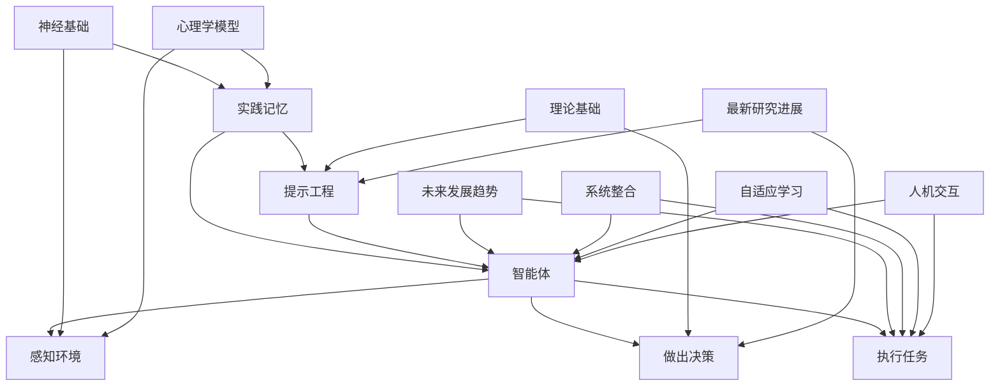

                 

### 《实践记忆、提示工程、智能体等核心概念》

> **关键词**：实践记忆、提示工程、智能体、认知心理学、算法、应用

> **摘要**：本文旨在深入探讨实践记忆、提示工程和智能体这三个核心概念，分析其基本理论、应用领域以及相互之间的联系。文章将从心理学、计算机科学和工程实践三个角度出发，逐一阐述这些概念的定义、原理及其在实际问题解决中的重要性。通过本文的阅读，读者将能够全面了解这些概念，并掌握如何将其应用于人工智能和智能系统设计中。

### 《实践记忆、提示工程、智能体等核心概念》目录大纲

#### 第一部分：核心概念概述

**第1章：实践记忆**

1.1 实践记忆的概念与重要性

1.2 实践记忆的心理学基础

1.3 实践记忆与工作记忆的关系

1.4 实践记忆的测量与评估

**第2章：提示工程**

2.1 提示工程的概念与目标

2.2 提示工程的方法与应用

2.3 提示工程的优势与挑战

2.4 提示工程在不同领域的应用案例

**第3章：智能体**

3.1 智能体的概念与分类

3.2 智能体的基本原理与架构

3.3 智能体的设计与实现

3.4 智能体在现实世界中的应用

#### 第二部分：核心概念的应用

**第4章：实践记忆在实际生活中的应用**

4.1 实践记忆在教育中的应用

4.2 实践记忆在职业培训中的应用

**第5章：提示工程在问题解决中的应用**

5.1 提示工程在决策支持中的应用

5.2 提示工程在创新思维中的应用

**第6章：智能体在人工智能系统中的应用**

6.1 智能体在自动驾驶中的应用

6.2 智能体在智能家居中的应用

#### 第三部分：核心概念的深化

**第7章：实践记忆的理论深化**

7.1 实践记忆的神经基础

7.2 实践记忆的心理学模型

**第8章：提示工程的理论深化**

8.1 提示工程的理论基础

8.2 提示工程的最新研究进展

**第9章：智能体的未来发展趋势**

9.1 智能体技术的未来发展方向

9.2 智能体在人工智能生态系统中的角色

#### 附录

**附录 A：核心概念与联系**

**附录 B：数学模型与公式**

**附录 C：项目实战案例**

**附录 D：开发环境搭建**

**附录 E：源代码与解读**

**附录 F：参考文献**

---

现在，我们已经构建了文章的框架，接下来我们将逐步深入探讨每一个章节的内容。首先，我们从实践记忆的概念和心理学基础开始。

### 第一部分：核心概念概述

#### 第1章：实践记忆

**1.1 实践记忆的概念与重要性**

实践记忆（Procedural Memory）是记忆系统的三个主要类型之一，与陈述性记忆（Declarative Memory）和语义记忆（Semantic Memory）相对应。陈述性记忆处理的是事实性信息，如人名、地点、日期等，而语义记忆则是对语言和概念的理解。实践记忆则与特定技能和动作的执行相关，包括如何做某件事，如何弹钢琴，如何骑自行车等。

**重要性**：实践记忆在我们的日常生活和职业活动中扮演着关键角色。它使我们能够自动化日常活动，从而将认知资源释放出来，用于更复杂的任务。例如，骑自行车这项技能一旦被学习并存储在实践记忆中，就可以在不需要主动思考的情况下执行，使我们能够同时进行其他活动，如与朋友交谈。

**1.2 实践记忆的心理学基础**

实践记忆的形成和存储与大脑中的特定区域有关。这些区域包括：

- **基底神经节（Basal Ganglia）**：负责运动技能的学习和执行，是实践记忆的主要存储区域之一。
- **前额叶皮质（Prefrontal Cortex）**：参与高级认知功能，包括计划、决策和执行，对实践记忆的调节和维持至关重要。
- **小脑（Cerebellum）**：在运动协调和技能学习方面起着关键作用。

心理学研究揭示了实践记忆的几个关键特征：

- **自动化**：随着重复和练习，实践记忆逐渐变得自动化，执行过程变得无需思考。
- **持久性**：一旦形成，实践记忆可以长期保持，甚至一生不忘。
- **情境依赖性**：实践记忆的执行往往受到学习时的情境影响，不同的情境可能会影响技能的执行。

**1.3 实践记忆与工作记忆的关系**

工作记忆（Working Memory）是另一种重要的记忆类型，负责临时存储和处理信息。它与实践记忆有着密切的联系。在工作记忆中，信息被加工和整合，然后传递到实践记忆中进行长期存储。

- **信息传递**：工作记忆中的信息可以通过重复和练习转移到实践记忆中。
- **调节作用**：工作记忆可以调节实践记忆的执行，例如，当需要调整已经习得的技能时。

**1.4 实践记忆的测量与评估**

评估实践记忆的方法多种多样，包括：

- **行为测试**：通过观察个体在执行特定任务时的表现来评估实践记忆的强度和自动化程度。
- **神经影像技术**：如功能性磁共振成像（fMRI）和电刺激，可以帮助研究人员了解实践记忆在大脑中的活动模式。
- **认知任务**：设计特定的认知任务，如反复进行运动技能学习，然后评估学习效果。

实践记忆的研究不仅对于理解人类认知功能具有重要意义，而且对于教育、职业培训和康复医学等领域也提供了重要的指导。

---

在接下来的章节中，我们将探讨提示工程和智能体的概念、原理和应用。请继续关注下一章节的内容。这样，我们可以逐步建立起对这三个核心概念的整体理解。

#### 第2章：提示工程

**2.1 提示工程的概念与目标**

提示工程（Prompt Engineering）是人工智能（AI）领域的一个新兴方向，旨在通过设计高效、智能的提示（prompt）来增强机器学习模型的表现。提示是一种引导或激励模型生成特定类型输出的输入，它通常是一个问题、一个目标或一个上下文。

**概念**：提示工程的核心思想是利用人类的专业知识和智慧来优化AI模型的输入和输出，从而提高模型的性能和实用性。这个过程包括：

- **问题定义**：明确需要解决的问题，并将其转化为适合模型处理的形式。
- **上下文构建**：提供与问题相关的上下文信息，帮助模型更好地理解和生成合适的输出。
- **目标设定**：设定明确的输出目标，指导模型的学习和优化。

**目标**：提示工程的主要目标包括：

- **提高模型的可解释性**：通过设计有意义的提示，使模型生成的输出更容易被人类理解和解释。
- **增强模型的泛化能力**：提供多样化的提示，帮助模型学习到更广泛适用的知识。
- **提升模型的性能**：通过精确的提示设计，使模型在特定任务上达到更高的准确度和效率。

**2.2 提示工程的方法与应用**

提示工程的方法多样，包括以下几个方面：

- **模板提示（Template-based Prompting）**：使用预定义的模板来生成提示，模板可以根据任务需求进行定制。这种方法简单易行，但可能缺乏灵活性。
- **数据增强提示（Data Augmentation Prompting）**：通过增加额外的数据或对现有数据进行变换来丰富提示的内容，从而提高模型的泛化能力。例如，在自然语言处理（NLP）任务中，可以使用同义词替换、文本摘要或扩展来增强数据。
- **上下文引导提示（Contextual Guidance Prompting）**：使用上下文信息来引导模型生成特定的输出，上下文可以是问题、用户输入或相关文本。这种方法有助于模型更好地理解任务背景，提高生成质量。
- **反馈循环提示（Feedback Loop Prompting）**：通过实时反馈来优化提示，不断调整提示内容以改善模型的表现。这种方法需要复杂的系统设计和大量的计算资源。

提示工程在不同领域有着广泛的应用：

- **自然语言处理（NLP）**：在NLP任务中，提示工程可以用于文本生成、问答系统、机器翻译等。通过设计有效的提示，模型可以生成更自然、准确的文本。
- **计算机视觉（CV）**：在CV任务中，提示工程可以帮助模型更好地理解和识别图像中的物体、场景和动作。例如，在图像分割任务中，提示可以提供额外的上下文信息，帮助模型更准确地划分图像区域。
- **推荐系统（RS）**：在推荐系统中，提示工程可以通过提供用户历史行为和偏好信息来优化推荐结果。有效的提示可以帮助模型更好地理解用户需求，提高推荐系统的准确性和用户体验。

**2.3 提示工程的优势与挑战**

提示工程具有以下几个优势：

- **增强模型表现**：通过设计有针对性的提示，可以提高模型的准确度和效率，从而在特定任务上获得更好的结果。
- **提高可解释性**：有效的提示可以使模型的输出更具解释性，帮助用户理解模型的决策过程。
- **促进模型泛化**：多样化的提示有助于模型学习到更广泛适用的知识，提高模型的泛化能力。

然而，提示工程也面临一些挑战：

- **设计复杂性**：提示工程需要专业的知识和技能，设计一个有效的提示可能需要大量的时间和实验。
- **数据依赖性**：提示工程的效果很大程度上依赖于训练数据的质量和多样性，缺乏合适的数据可能导致提示效果不佳。
- **可扩展性**：在不同任务和领域中应用提示工程时，可能需要定制化的解决方案，这增加了系统的复杂性和维护成本。

**2.4 提示工程在不同领域的应用案例**

以下是一些具体的提示工程应用案例：

- **医疗诊断**：在医疗领域，提示工程可以用于辅助医生进行疾病诊断。通过提供患者的医疗记录和症状描述，模型可以生成可能的诊断结果。有效的提示可以帮助模型更好地理解患者的病情，提高诊断的准确率。
- **法律文书生成**：在法律领域，提示工程可以用于生成法律文书，如合同、起诉状等。通过提供相关的法律条款和背景信息，模型可以生成符合法律要求的文书，提高法律工作的效率和准确性。
- **教育辅导**：在教育领域，提示工程可以用于个性化学习辅导。通过分析学生的学习行为和知识水平，模型可以生成针对性的学习建议和辅导材料，帮助学生更好地掌握知识和技能。

总的来说，提示工程是一个具有重要应用前景的领域，它通过优化AI模型的输入和输出，可以提高模型的性能和实用性，为各种领域带来创新和变革。

---

在下一章节中，我们将进一步探讨智能体的概念、原理和应用。请继续关注。

#### 第3章：智能体

**3.1 智能体的概念与分类**

智能体（Agent）是人工智能领域中的一个基本概念，它指的是能够自主感知环境、采取行动并实现特定目标的实体。智能体的定义通常包括以下几个要素：

- **感知**：智能体需要能够感知其周围的环境，获取相关的信息。
- **决策**：基于感知到的信息，智能体需要能够做出决策，选择合适的行动。
- **行动**：智能体需要能够执行决策，采取行动来改变环境。
- **目标**：智能体通常具有明确的目标或任务，其行动和决策都是为了实现这些目标。

**分类**：根据智能体的能力和行为特点，可以将智能体分为以下几类：

- **反应型智能体**（Reactive Agent）：这种智能体仅根据当前环境的感知来做出反应，不考虑历史信息和未来预测。例如，自动门检测到有人靠近时就会打开，不考虑之前是否有人经过。
- **预处理智能体**（Preprogrammed Agent）：这种智能体通过预先编程的方式来执行特定任务，其行为是固定的，不会根据环境的变化而改变。例如，自动驾驶汽车按照预设的路线行驶，不会主动避开障碍物。
- **基于模型的智能体**（Model-Based Agent）：这种智能体使用模型来模拟和预测环境，并根据模型预测的结果来做出决策。例如，股票交易机器人通过分析市场数据，预测未来股价走势，并据此做出买卖决策。
- **学习型智能体**（Learning Agent）：这种智能体能够通过学习来改善其行为，不断调整决策策略以提高性能。例如，机器人通过深度学习算法从大量数据中学习到如何更好地完成特定任务。

**3.2 智能体的基本原理与架构**

智能体的基本原理主要涉及感知、决策和行动三个方面：

- **感知**：智能体需要具备感知能力，能够获取环境中的信息。这通常通过传感器实现，如摄像头、麦克风、温度传感器等。感知到的数据需要经过处理和解析，以便智能体能够理解环境状态。
- **决策**：基于感知到的信息，智能体需要能够做出决策。决策过程通常涉及多个步骤，包括问题定义、状态评估、行动选择和目标规划。常用的决策方法包括规则系统、决策树、贝叶斯网络等。
- **行动**：智能体需要能够执行决策，采取行动来改变环境。行动可以是物理动作，如移动、抓取等，也可以是虚拟操作，如发送信息、调整参数等。

智能体的架构通常包括以下几个核心组件：

- **感知模块**：负责接收和处理环境信息，将原始数据转换为智能体可以理解的形式。
- **决策模块**：负责根据感知模块提供的信息，使用决策算法来确定下一步的行动。
- **执行模块**：负责执行决策模块生成的行动指令，将决策转化为实际的物理或虚拟操作。
- **知识库**：存储智能体的知识和经验，包括规则、模式、历史数据等，用于支持决策和行动。

**3.3 智能体的设计与实现**

设计智能体需要考虑以下几个关键因素：

- **目标明确**：明确智能体的目标或任务，确保设计过程中始终围绕目标进行。
- **环境理解**：深入理解智能体将运行的环境，包括环境的结构、动态特性和不确定性。
- **感知能力**：根据环境需求，设计合适的感知系统，确保智能体能够获取到必要的信息。
- **决策算法**：选择合适的决策算法，确保智能体能够高效地处理信息并做出合理的决策。
- **执行机制**：设计可靠的执行机制，确保智能体能够准确地执行决策。

实现智能体通常涉及以下几个步骤：

1. **需求分析**：明确智能体的应用场景和功能需求，确定智能体的目标和任务。
2. **系统设计**：设计智能体的整体架构，包括感知、决策和执行模块，以及知识库和通信机制。
3. **算法选择**：选择合适的感知、决策和执行算法，并进行系统优化。
4. **实现与测试**：实现智能体的代码，并在模拟环境中进行测试，验证其性能和鲁棒性。
5. **部署与应用**：将智能体部署到实际环境中，进行实际应用和性能评估。

**3.4 智能体在现实世界中的应用**

智能体在现实世界中有广泛的应用，以下是一些具体的应用场景：

- **自动驾驶**：自动驾驶汽车是智能体的典型应用，它通过感知车辆周围的环境，使用复杂的决策算法来控制车辆的运动，实现自主驾驶。
- **智能客服**：智能客服系统使用自然语言处理技术，通过智能体与用户进行交互，提供快速、准确的客户服务。
- **智能家居**：智能家居系统中的智能体可以监控家居环境，控制家电设备，并根据用户需求提供个性化的服务。
- **工业自动化**：在工业生产中，智能体可以控制机器人的运动，实现自动化生产线的管理和优化。
- **健康监测**：智能体可以监测用户的健康数据，提供健康建议和预警，帮助用户管理健康状况。

总的来说，智能体是人工智能领域中一个重要的概念，它通过自主感知、决策和行动，实现了对复杂环境的智能控制。随着技术的不断发展，智能体的应用将更加广泛，为我们的生活和工作带来更多便利和创新。

---

在下一章节中，我们将探讨实践记忆、提示工程和智能体这三个核心概念在实际生活中的具体应用。请继续关注。

#### 第二部分：核心概念的应用

**第4章：实践记忆在实际生活中的应用**

**4.1 实践记忆在教育中的应用**

实践记忆在教育领域具有广泛的应用，特别是在技能学习和知识巩固方面。以下是一些具体的应用场景：

- **技能学习**：实践记忆对于学习各种技能至关重要，如音乐、体育、编程等。通过反复练习，学生可以将技能从工作记忆转移到实践记忆，使其能够自动执行，从而提高学习效率。例如，学生在学习钢琴演奏时，通过不断的练习，将音符和指法的记忆从工作记忆转移到实践记忆，使演奏变得更加流畅和自然。

- **知识巩固**：实践记忆可以帮助学生巩固学到的知识，防止遗忘。例如，学生在学习历史事件时，可以通过复述事件的过程和细节，将知识从陈述性记忆转移到实践记忆中。这样，学生在考试或实际应用中更不容易忘记所学的内容。

- **教学策略**：教师可以利用实践记忆的原理来设计教学策略，提高学生的学习效果。例如，通过设计有针对性的练习题和任务，教师可以帮助学生将新知识与实践记忆相结合，从而加深理解和记忆。此外，教师还可以利用多种教学手段，如互动游戏、模拟实验等，激发学生的学习兴趣，促进实践记忆的形成。

**4.1.1 教学策略的设计**

以下是一些设计教学策略时可以考虑的方法：

- **重复练习**：通过反复练习，学生可以将新知识与实践记忆相结合，从而提高记忆效果。例如，在学习数学公式时，教师可以设计一系列练习题，让学生反复应用这些公式，直到它们成为自动化的技能。

- **情境教学**：将学习内容与学生的实际生活情境相结合，可以增强学生的实践记忆。例如，在历史课上，教师可以通过讲述历史事件与学生生活相关的实例，让学生更容易理解和记忆。

- **视觉辅助**：使用图像、图表和视频等视觉辅助工具，可以帮助学生更好地理解和记忆学习内容。例如，在学习地理知识时，教师可以通过地图和地形图来展示地理概念，使学生更直观地理解。

- **互动教学**：通过小组讨论、角色扮演和模拟实验等方式，激发学生的学习兴趣和参与度，从而促进实践记忆的形成。例如，在科学课上，教师可以设计实验活动，让学生亲自动手操作，从中学习科学原理。

**4.1.2 学习成果的评估**

为了评估学生的学习成果，教师可以采用以下方法：

- **测验和考试**：通过定期进行测验和考试，评估学生对知识点的掌握程度。测验和考试的形式可以多样化，如选择题、填空题、简答题和论述题等。

- **项目展示**：让学生通过项目展示来展示他们的学习成果。例如，在编程课程中，学生可以通过编写和演示一个完整的程序来展示他们的技能。

- **互动评估**：教师可以与学生进行互动，了解他们的理解和应用能力。例如，通过提问、讨论和小组活动等方式，教师可以评估学生对知识的掌握程度。

- **学生反馈**：收集学生的反馈，了解他们的学习体验和需求。通过问卷调查、访谈和反馈表等方式，教师可以收集学生的意见和建议，从而不断改进教学策略。

总的来说，实践记忆在教育中的应用具有重要意义。通过合理的设计教学策略，教师可以有效地提高学生的学习效果和记忆能力，为他们的未来发展奠定坚实的基础。

**4.2 实践记忆在职业培训中的应用**

实践记忆在职业培训中同样发挥着重要作用，特别是在技能培养和工作效率提升方面。以下是一些具体的应用场景：

- **技能培养**：实践记忆是技能培养的关键，通过反复练习和实践，员工可以将新技能从工作记忆转移到实践记忆，从而熟练掌握并自动执行。例如，在机械操作培训中，员工需要通过反复操作机械，将操作步骤和实践记忆相结合，从而提高操作技能。

- **工作效率提升**：实践记忆可以帮助员工将日常工作流程自动化，减少认知负荷，从而提高工作效率。例如，在客户服务行业中，通过不断练习和重复，客服人员可以熟练掌握应对不同客户问题的技巧，快速解决客户问题，提高服务效率。

- **职业技能提升**：实践记忆不仅可以帮助员工掌握具体技能，还可以提高他们的综合素质和职业竞争力。通过不断学习和实践，员工可以积累丰富的经验和知识，从而在职业生涯中不断成长和进步。

- **职业培训策略**：职业培训师可以利用实践记忆的原理来设计培训策略，提高培训效果。以下是一些可以考虑的方法：

  - **实践导向**：通过设计实践性强的培训内容，让员工在真实或模拟的环境中反复练习和操作，从而将新技能和实践记忆相结合。
  
  - **角色扮演**：通过角色扮演活动，让员工在模拟的场景中实践职业技能，提高他们的实际操作能力和应对能力。
  
  - **案例学习**：通过分析实际工作中的案例，让员工了解如何应用所学技能解决实际问题，从而加深对技能的理解和应用。

- **培训效果评估**：为了评估职业培训的效果，培训师可以采用以下方法：

  - **技能测试**：通过定期进行技能测试，评估员工对新技能的掌握程度，确保培训目标得以实现。
  
  - **工作表现评估**：通过观察员工在工作中的实际表现，评估培训效果，了解员工是否能够将所学技能应用到实际工作中。
  
  - **员工反馈**：收集员工的反馈，了解他们的学习体验和建议，从而不断改进培训策略。

总的来说，实践记忆在职业培训中的应用有助于提高员工的专业技能和工作效率，为企业的持续发展和竞争力的提升提供有力支持。

---

在下一章节中，我们将探讨提示工程在问题解决中的应用。请继续关注。

### 第5章：提示工程在问题解决中的应用

#### 5.1 提示工程在决策支持中的应用

提示工程在决策支持中的应用是通过设计有效的提示来帮助决策者更好地理解和处理复杂问题。以下是一些具体的应用场景和策略：

**5.1.1 决策制定的提示策略**

- **问题定义**：在决策制定过程中，首先需要明确问题的核心和关键点。通过提供明确的提示，可以帮助决策者准确地定义问题，确保决策的针对性和有效性。例如，在商业决策中，提示可以包括市场分析、竞争对手情况、潜在风险等因素。

- **信息收集**：为了制定全面和准确的决策，决策者需要收集大量的信息。提示工程可以通过提供信息收集指南或数据筛选策略，帮助决策者快速获取关键信息。例如，在投资决策中，提示可以包括财务报表分析、市场趋势预测等。

- **情境模拟**：通过模拟不同的情境，决策者可以预判决策结果并评估潜在的风险。提示工程可以通过提供情境模拟工具或方法，帮助决策者进行全面的评估。例如，在项目管理中，提示可以包括时间线分析、资源分配模拟等。

- **目标设定**：在决策制定过程中，明确目标是非常重要的。提示工程可以通过提供目标设定指南或目标优化方法，帮助决策者设定合理和可达成的目标。例如，在产品开发中，提示可以包括市场目标、技术目标等。

**5.1.2 决策评估的提示方法**

- **风险评估**：在决策评估过程中，评估潜在的风险是非常重要的。提示工程可以通过提供风险评估工具或方法，帮助决策者全面评估决策的潜在风险。例如，在财务决策中，提示可以包括风险分析、概率模型等。

- **成本效益分析**：通过成本效益分析，决策者可以评估不同决策的潜在收益和成本。提示工程可以通过提供成本效益分析工具或方法，帮助决策者进行全面的成本效益评估。例如，在项目投资中，提示可以包括成本分析、收益预测等。

- **模拟预测**：通过模拟预测，决策者可以预判不同决策的结果。提示工程可以通过提供模拟预测工具或方法，帮助决策者进行全面的模拟预测。例如，在市场营销中，提示可以包括消费者行为模拟、市场趋势预测等。

- **反馈机制**：在决策评估过程中，反馈机制可以帮助决策者不断调整和优化决策。提示工程可以通过提供反馈机制设计工具或方法，帮助决策者建立有效的反馈机制。例如，在项目监控中，提示可以包括绩效评估、反馈循环等。

**5.2 提示工程在创新思维中的应用**

提示工程在创新思维中的应用是通过设计有效的提示来激发创新思维和创意生成。以下是一些具体的应用场景和策略：

- **创意生成**：提示工程可以通过提供创意生成工具或方法，帮助团队成员生成新的创意和解决方案。例如，在产品设计过程中，提示可以包括头脑风暴、创意卡片等。

- **问题重构**：在创新过程中，有时需要重新定义问题，以便从新的角度找到解决方案。提示工程可以通过提供问题重构工具或方法，帮助团队成员重新定义问题，激发新的思维。例如，在市场调研中，提示可以包括问题重构模板、用户访谈等。

- **协同工作**：在创新过程中，团队合作和协作是非常重要的。提示工程可以通过提供协同工作工具或方法，帮助团队成员更好地协作和沟通。例如，在团队会议中，提示可以包括协同讨论、思维导图等。

- **思维模式转换**：通过转换思维模式，团队成员可以跳出传统思维的框架，找到创新的解决方案。提示工程可以通过提供思维模式转换工具或方法，帮助团队成员实现思维模式的转换。例如，在创新策略设计过程中，提示可以包括逆向思维、跨领域思维等。

**5.2.1 创新思维的培养**

- **多样化思维训练**：通过多样化思维训练，团队成员可以培养不同的思维方式，提高创新思维能力。例如，通过设计多样化的思维训练活动，如思维导图、逆向思考等。

- **跨领域学习**：跨领域学习可以帮助团队成员获取新的知识和视角，从而激发创新思维。例如，通过组织跨领域的研讨会、讲座等，促进团队成员之间的交流和合作。

- **思维模式引导**：通过提供思维模式引导工具或方法，可以帮助团队成员更好地应用创新思维方法。例如，在团队讨论中，提示可以包括创新思维模板、思维导图等。

- **激励机制**：建立激励机制，鼓励团队成员提出创新想法和解决方案，提高创新思维的积极性。例如，通过设置创新奖励、表彰等，激励团队成员积极参与创新活动。

总的来说，提示工程在决策支持和创新思维中的应用具有重要意义。通过设计有效的提示，可以激发决策者的创新思维，提高决策的准确性和效率，推动创新活动的开展。这对于企业和组织的持续发展和竞争力提升具有重要意义。

---

在下一章节中，我们将探讨智能体在人工智能系统中的应用。请继续关注。

### 第6章：智能体在人工智能系统中的应用

#### 6.1 智能体在自动驾驶中的应用

自动驾驶是人工智能领域的一个重要研究方向，智能体在其中发挥着核心作用。自动驾驶系统通过感知、决策和行动，实现车辆在复杂环境中的自主行驶。以下是对智能体在自动驾驶中的应用的详细探讨：

**6.1.1 自动驾驶系统的架构**

自动驾驶系统的架构通常包括以下几个关键模块：

- **感知模块**：负责实时感知周围环境，获取车辆位置、道路信息、交通状况等。常用的感知技术包括摄像头、激光雷达（LIDAR）、雷达、超声波传感器等。感知模块需要处理大量实时数据，并将其转换为有用的信息，以支持后续的决策。

- **决策模块**：基于感知模块提供的信息，决策模块负责分析道路状况、车辆状态和交通规则，制定行驶策略。决策模块通常采用复杂的算法，如路径规划、行为预测、多目标优化等，以实现安全、高效、流畅的驾驶。

- **行动模块**：决策模块生成的策略需要通过行动模块来执行。行动模块负责控制车辆的运动，包括加速、减速、转向等。行动模块需要与车辆的电子控制系统（如发动机、制动系统、转向系统等）紧密集成，确保车辆能够准确地执行决策。

- **知识库**：知识库是自动驾驶系统的重要组成部分，包含道路规则、交通法规、车辆性能参数等。知识库为感知、决策和行动模块提供必要的信息和支持，确保系统的鲁棒性和安全性。

**6.1.2 自动驾驶系统的实现与优化**

实现自动驾驶系统需要解决多个技术挑战，包括环境感知、决策算法和行动控制等方面。以下是一些关键步骤和优化方法：

- **环境感知**：通过集成多种传感器，实现全面、准确的环境感知。需要解决数据融合、目标检测、场景理解等问题。例如，可以使用多传感器融合算法，将摄像头、LIDAR和雷达数据结合起来，提高感知的精度和可靠性。

- **决策算法**：设计高效的决策算法，实现路径规划、行为预测和目标跟踪等功能。常用的算法包括基于图论的路径规划算法、基于概率模型的预测算法和基于强化学习的决策算法等。需要根据实际应用场景进行算法优化和参数调整，提高系统的效率和鲁棒性。

- **行动控制**：实现精确、流畅的行动控制，确保车辆能够安全、高效地执行决策。需要解决车辆动力学模型、控制系统设计和控制策略优化等问题。例如，可以使用模型预测控制（Model Predictive Control，MPC）等方法，实现对车辆运动的精确控制。

- **测试与验证**：在真实环境中对自动驾驶系统进行测试和验证，确保系统的安全性和可靠性。需要设计多样化的测试场景，覆盖各种道路条件、交通状况和突发事件。通过仿真和实车测试，不断优化系统性能和算法。

**6.1.3 自动驾驶系统的案例研究**

以下是一些自动驾驶系统的案例研究：

- **Waymo**：谷歌旗下的自动驾驶公司，开发了一种高度自动化的自动驾驶系统，已在多个城市进行测试和运营。Waymo采用了先进的感知、决策和行动技术，实现了安全、高效的自动驾驶。其系统在复杂城市交通环境下表现出色，为自动驾驶技术的发展提供了宝贵经验。

- **Tesla**：特斯拉的自动驾驶系统（Autopilot）通过摄像头和雷达传感器实现部分自动驾驶功能，如自动巡航、自动变道和自动泊车等。特斯拉在自动驾驶领域积累了丰富的数据，并通过持续优化算法，提高了系统的性能和安全性。

- **NVIDIA**：NVIDIA开发了Drive平台，用于自动驾驶系统的开发和部署。Drive平台提供了强大的硬件和软件支持，包括GPU加速的深度学习算法、自动驾驶仿真器和开发者工具等。NVIDIA与多家汽车制造商和科技公司合作，推动了自动驾驶技术的发展。

总的来说，智能体在自动驾驶系统中的应用具有重要意义。通过智能体的感知、决策和行动能力，自动驾驶系统能够实现安全、高效、自主的驾驶，为未来智能交通和智慧城市的建设提供技术支持。

---

在下一章节中，我们将探讨智能体在智能家居中的应用。请继续关注。

### 6.2 智能体在智能家居中的应用

智能家居是人工智能在日常生活领域中的一个重要应用方向，通过智能体技术，可以实现家庭设备的自动化控制和智能化管理，提高居民的生活质量和便利性。以下是对智能体在智能家居中应用的具体探讨：

#### 6.2.1 智能家居系统的设计

智能家居系统的设计需要考虑以下几个方面：

- **感知层**：智能家居系统通过各种传感器（如温湿度传感器、光照传感器、门磁传感器等）来感知家庭环境的变化。这些传感器将收集到的数据传输到智能体，以便智能体做出相应的决策。

- **通信层**：智能家居系统中的设备需要通过无线通信技术（如Wi-Fi、Zigbee、蓝牙等）进行连接和通信。智能体作为中心节点，负责协调不同设备之间的通信和数据交换。

- **智能体层**：智能体是智能家居系统的核心，负责接收和处理来自感知层的数据，并根据预设规则和用户需求进行决策。智能体可以是一个独立的软件模块，也可以是嵌入在智能设备中的硬件单元。

- **控制层**：智能体通过控制层实现对家庭设备的自动化控制。控制层包括家庭设备的驱动器（如电机、开关等），以及与外部服务（如互联网、云平台等）的接口。

#### 6.2.2 智能家居系统的功能实现

智能家居系统可以实现多种功能，以下是一些关键功能：

- **设备控制**：智能体可以通过手机应用、语音助手或触摸屏等界面，实现对家庭设备的远程控制。例如，用户可以通过手机APP远程控制家中的空调、照明、窗帘等设备。

- **自动化场景**：智能体可以根据用户的生活习惯和需求，自动设定和切换设备状态。例如，当用户离家时，智能体可以自动关闭灯光和空调，节省能源。

- **节能管理**：智能体可以实时监控家庭能源消耗情况，并根据用户需求和设备状态，优化能源使用。例如，智能体可以智能地调整空调温度和照明亮度，以实现节能。

- **安全监控**：智能体可以集成监控设备（如摄像头、门磁传感器等），实现对家庭安全的实时监控。例如，当有异常情况发生时，智能体可以自动发送报警信息给用户，并通知相关安全部门。

- **智能互动**：智能体可以通过语音交互、图像识别等技术，与用户进行智能互动。例如，用户可以通过语音命令控制智能家居系统，智能体可以回答用户的问题，提供天气预报、日程提醒等信息。

#### 6.2.3 智能家居系统的优势与挑战

智能家居系统的优势包括：

- **提高生活质量**：智能家居系统为用户提供更加便利和舒适的生活环境，使家庭生活更加智能化和个性化。

- **节能减排**：智能体可以通过优化能源使用，实现节能减排，降低家庭能源消耗。

- **提升安全性**：智能家居系统的安全监控功能可以提高家庭的安全性，保护用户的财产和生命安全。

然而，智能家居系统也面临一些挑战：

- **数据安全和隐私保护**：智能家居系统涉及大量的个人数据和隐私信息，需要采取有效的措施确保数据安全和用户隐私。

- **设备兼容性**：智能家居系统通常涉及多种设备和品牌，需要解决设备之间的兼容性问题，确保系统的稳定性和可靠性。

- **用户习惯培养**：智能家居系统需要用户改变传统的家庭生活方式，培养使用智能家居的习惯，这需要一定的时间和教育。

总的来说，智能体在智能家居中的应用为家庭生活带来了巨大的变革和便利。随着技术的不断发展和完善，智能家居系统将越来越普及，为人们的生活提供更多的智能服务。

---

在下一章节中，我们将深入探讨实践记忆的理论深化。请继续关注。

### 第三部分：核心概念的深化

#### 第7章：实践记忆的理论深化

**7.1 实践记忆的神经基础**

实践记忆的形成和存储与大脑中的特定神经网络和生理过程密切相关。以下是实践记忆的神经基础：

- **基底神经节（Basal Ganglia）**：基底神经节是实践记忆的主要存储区域，包括尾状核、豆状核和杏仁核等。这些区域通过复杂的神经网络连接，参与运动技能的编码和存储。基底神经节的神经元通过多巴胺（Dopamine）的释放，调节实践记忆的强度和持续性。

- **前额叶皮质（Prefrontal Cortex）**：前额叶皮质是大脑的高级认知中心，负责规划、决策和执行。在实践记忆中，前额叶皮质参与对技能的监控和调节，以及对实践记忆的维持和提取。前额叶皮质与其他大脑区域（如基底神经节、小脑等）通过神经回路相互连接，共同实现实践记忆的功能。

- **小脑（Cerebellum）**：小脑在运动技能的学习和协调中起着关键作用。小脑的神经元通过复杂的神经网络连接，参与实践记忆的编码和存储。小脑的结构和功能受损可能导致实践记忆的障碍。

**7.1.1 神经可塑性**

神经可塑性是大脑能够适应外界环境变化和学习新技能的重要机制。实践记忆的形成和维持与神经可塑性密切相关。以下是实践记忆的神经可塑性机制：

- **突触可塑性**：突触是神经元之间传递信息的结构，突触可塑性是指突触强度的变化。在实践记忆中，重复练习和反复操作会导致突触连接的增强，从而加强实践记忆的存储。例如，通过反复练习钢琴曲目，神经元之间的突触连接会变得更加牢固，使记忆变得更加持久。

- **长时程增强（Long-Term Potentiation, LTP）**：长时程增强是一种突触可塑性现象，指的是反复的神经活动导致突触传递效能的持久增强。在实践记忆中，LTP机制使重复的练习和操作能够巩固记忆，从而形成稳定的实践记忆。

- **长时程抑制（Long-Term Depression, LTP）**：与长时程增强相对，长时程抑制是指突触传递效能的持久减弱。在某些情况下，长时程抑制有助于消除不必要的记忆，维持大脑功能的灵活性。

**7.1.2 大脑神经网络的工作机制**

大脑神经网络的工作机制涉及多个层次的神经活动，包括神经元的活动、神经网络的结构和信号传递等。以下是大脑神经网络在实践记忆中的工作机制：

- **神经元活动**：神经元通过电信号（动作电位）进行通信。在实践记忆中，特定神经元群体的同步活动是实现记忆编码和存储的关键。例如，在运动技能的学习中，特定神经元群体会同时激活，以形成运动记忆。

- **神经网络结构**：大脑神经网络具有高度复杂的结构，包括多层神经元的连接和交互。在实践记忆中，不同区域和网络的协同工作是实现记忆编码和存储的关键。例如，基底神经节、前额叶皮质和小脑之间的协同活动，共同实现了运动技能的编码和存储。

- **信号传递**：神经元之间的信号传递是通过神经递质（Neurotransmitters）实现的。不同的神经递质具有不同的作用，参与实践记忆的编码、存储和提取。例如，多巴胺是一种重要的神经递质，在实践记忆的调节中发挥关键作用。

**7.2 实践记忆的心理学模型**

实践记忆的心理学模型旨在描述实践记忆的形成、存储和提取过程，以及影响这些过程的心理因素。以下是几种主要的实践记忆模型：

- **传统记忆模型**：传统记忆模型将实践记忆视为一种通过重复和练习形成的自动化的动作记忆。这种模型强调重复练习在实践记忆形成中的重要性，认为通过不断的练习，运动技能会从工作记忆转移到实践记忆。

- **认知控制模型**：认知控制模型认为实践记忆不仅涉及自动化过程，还包括认知控制的参与。这种模型强调前额叶皮质在实践记忆中的作用，认为认知控制有助于调节实践记忆的执行，使其适应不同的环境和任务。

- **神经可塑性模型**：神经可塑性模型将实践记忆视为一种通过神经可塑性机制实现的动态过程。这种模型强调突触可塑性和神经网络的结构变化在实践记忆中的重要性，认为重复练习和神经活动调节是实践记忆形成和维持的关键。

- **整合模型**：整合模型结合了传统记忆模型、认知控制模型和神经可塑性模型的观点，认为实践记忆是一个复杂的多层次过程，涉及多个心理和生理机制的相互作用。这种模型认为实践记忆的形成和维持是由多种因素共同影响的，包括重复练习、认知控制和神经可塑性等。

总的来说，实践记忆的神经基础和心理模型为理解和研究实践记忆提供了重要的理论框架。通过深入探讨实践记忆的神经基础和心理机制，我们可以更好地理解实践记忆的形成、存储和提取过程，从而为教育和职业培训等领域提供有效的指导。

---

在下一章节中，我们将探讨提示工程的理论深化。请继续关注。

### 第8章：提示工程的理论深化

#### 8.1 提示工程的理论基础

提示工程（Prompt Engineering）作为人工智能（AI）领域的一个重要分支，其理论基础主要源于认知心理学、人工智能和自然语言处理等多个领域。以下是提示工程的理论基础：

**8.1.1 行为心理学与认知心理学**

行为心理学是研究人类行为及其背后的心理过程的一个学科，它关注人类如何通过行为和环境之间的互动来学习和适应。在提示工程中，行为心理学提供了对人类学习行为的深刻理解，包括如何通过提示来引导和增强学习效果。

- **经典条件反射**：行为心理学中的经典条件反射理论指出，通过重复将中性刺激与奖励结合，可以使个体对中性刺激产生条件反应。这一理论为提示工程提供了基础，提示可以通过与奖励或惩罚结合，来增强用户的学习动机和效果。

- **操作性条件反射**：操作性条件反射理论强调，个体通过自主操作环境来学习如何获得奖励或避免惩罚。在提示工程中，操作性条件反射可以帮助设计有效的提示，通过用户的操作来调整和优化提示策略。

认知心理学则关注人类思维、记忆、感知等认知过程，研究人类如何获取、处理和利用信息。以下是在认知心理学中的一些关键概念，它们在提示工程中具有重要应用：

- **工作记忆**：工作记忆是短时记忆的一种形式，负责临时存储和处理信息。在提示工程中，工作记忆可以帮助理解用户当前的认知状态，从而设计出能够有效引导用户注意力和理解的提示。

- **认知负荷**：认知负荷是指个体在处理信息时所需的认知资源。在设计提示时，需要考虑认知负荷，确保提示不会过度占用用户的工作记忆，从而影响其学习和决策。

**8.1.2 提示工程的理论模型**

提示工程的理论模型主要包括以下几种：

- **强化学习模型**：强化学习是一种通过试错来学习如何在特定环境中做出最优决策的机器学习技术。在提示工程中，强化学习可以用来优化提示策略，通过不断调整和测试提示，找到最佳的学习路径。

- **决策树模型**：决策树是一种常用的机器学习模型，通过一系列规则和条件来对输入数据做出分类或回归预测。在提示工程中，决策树可以用来构建提示生成策略，通过一系列条件判断来生成合适的提示。

- **生成对抗网络（GAN）**：生成对抗网络是一种深度学习模型，由生成器和判别器两个部分组成。生成器旨在生成与真实数据相似的数据，而判别器则负责判断生成的数据与真实数据的相似度。在提示工程中，GAN可以用来生成高质量的提示，通过不断训练和优化生成器和判别器，提高提示的生成效果。

- **转移学习模型**：转移学习是一种利用已有模型的知识来改进新任务性能的机器学习技术。在提示工程中，转移学习可以帮助利用已有的语言模型和知识库，生成更准确、更丰富的提示。

**8.1.3 提示工程的原理与实现**

提示工程的实现通常涉及以下关键步骤：

- **需求分析**：首先，需要对用户的需求进行详细分析，明确需要解决的问题和目标。需求分析可以帮助确定提示的类型、内容和形式。

- **数据准备**：根据需求分析的结果，收集和准备相关的数据。这些数据可以是文本、图像、音频或其他形式，用于训练和优化提示模型。

- **模型设计**：根据提示的需求和数据类型，设计合适的提示模型。常用的模型包括序列模型（如RNN、LSTM、BERT等）和生成模型（如GAN、VAE等）。

- **模型训练与优化**：使用准备好的数据对提示模型进行训练，并不断调整模型参数，优化提示效果。训练过程中可以采用多种技术，如数据增强、正则化、模型融合等。

- **提示生成与评估**：根据训练好的模型，生成实际的提示内容，并对提示效果进行评估。评估指标可以包括用户满意度、任务完成度、模型性能等。

- **反馈与迭代**：根据评估结果，收集用户的反馈，并不断迭代和优化提示模型，提高提示的质量和效果。

总的来说，提示工程的理论基础为设计和实现有效的提示提供了重要的指导。通过结合认知心理学和机器学习技术，提示工程可以帮助构建更智能、更实用的AI系统，为各种应用领域带来创新和变革。

---

在下一章节中，我们将探讨智能体的未来发展趋势。请继续关注。

### 第9章：智能体的未来发展趋势

#### 9.1 智能体技术的未来发展方向

智能体技术正迅速发展，未来将呈现以下几个主要趋势：

**9.1.1 智能化水平的提升**

随着人工智能技术的不断进步，智能体的智能化水平将不断提高。未来的智能体将能够更加自主地感知环境、做出决策和执行任务，从而实现更高的自主性。以下是一些具体的发展方向：

- **感知能力的增强**：通过集成多种传感器和先进的数据处理技术，智能体的感知能力将得到显著提升。例如，深度学习和计算机视觉技术的应用将使智能体能够更准确地识别和理解复杂的场景。

- **决策能力的增强**：智能体将采用更先进的决策算法和模型，如深度强化学习和迁移学习等，使其能够更有效地处理复杂决策问题。这些算法将帮助智能体在各种不确定和动态环境下做出更好的决策。

- **执行能力的增强**：随着机器人技术和自动化技术的发展，智能体的执行能力将得到显著提升。智能体将能够执行更加复杂和精细的任务，如精细操作、无人驾驶和智能制造等。

**9.1.2 跨界融合的应用**

智能体技术将在不同领域实现跨界融合，为各行各业带来创新和变革。以下是一些具体的应用方向：

- **医疗健康**：智能体技术将在医疗健康领域发挥重要作用，如智能诊断、精准治疗和远程医疗等。智能体可以通过数据分析、机器学习和人工智能技术，提供个性化的健康建议和医疗服务。

- **教育**：智能体技术将改变教育模式，实现个性化学习和智能辅导。智能体可以通过在线学习平台、虚拟现实和增强现实等技术，提供定制化的学习体验和教学资源。

- **工业制造**：智能体技术将在工业制造领域推动智能制造和工业4.0的发展。智能体可以通过自动化生产线、机器人技术和物联网技术，实现高效、灵活和智能的生产流程。

- **金融服务**：智能体技术将在金融服务领域实现智能投资、智能客服和风险管理等。智能体可以通过大数据分析、机器学习和区块链技术，提供更精准、更高效和更安全的金融服务。

**9.1.3 系统集成的复杂性**

随着智能体技术的广泛应用，系统集成的复杂性将不断增加。未来的智能系统将涉及多个智能体之间的协作和交互，从而实现更复杂的任务和场景。以下是一些具体挑战：

- **互操作性问题**：不同智能体和系统之间的互操作性将是一个重要挑战。需要设计标准化的接口和协议，确保智能体之间能够高效、稳定地交互和协作。

- **数据安全和隐私**：随着智能体技术的应用，数据安全和隐私问题将变得更加重要。需要采取有效的措施保护用户数据，防止数据泄露和滥用。

- **伦理和道德问题**：智能体技术的发展也将带来一系列伦理和道德问题，如自主权、责任归属、隐私保护等。需要建立相应的伦理规范和法律法规，确保智能体技术的健康发展。

总的来说，智能体技术的未来发展方向将朝着更高智能化、更广泛应用和更复杂系统集成的方向前进。通过不断的技术创新和应用探索，智能体技术将为人类社会带来更多的便利和变革。

---

在下一章节中，我们将探讨智能体在人工智能生态系统中的角色。请继续关注。

### 9.2 智能体在人工智能生态系统中的角色

智能体在人工智能（AI）生态系统中扮演着至关重要的角色，它们不仅提升了系统的智能化水平，还促进了各个组件之间的协同工作。以下是对智能体在人工智能生态系统中的角色的详细探讨：

**9.2.1 智能体在协同工作中的优势**

智能体的协同工作在人工智能生态系统中具有明显的优势，主要体现在以下几个方面：

- **分布式计算**：智能体可以分布在不同节点上，利用各自的计算资源，共同完成复杂的任务。这种分布式计算模式提高了系统的处理能力和效率，使得大规模的数据分析、机器学习模型训练和决策支持等任务能够高效完成。

- **任务分解与分工**：智能体可以根据其特定的能力和任务需求，分工合作，完成复杂的任务。例如，一个智能体负责数据收集，另一个智能体负责数据清洗，第三个智能体负责数据分析，这样分工明确、各司其职的工作模式，使得任务完成更加高效和精准。

- **动态调整与优化**：智能体可以根据环境的变化和任务的进展，动态调整自身的任务和行为。这种自适应能力使得智能体能够更好地适应不确定性和动态变化，从而提高系统的鲁棒性和灵活性。

**9.2.2 智能体在智能化服务中的应用**

智能体在智能化服务中的应用越来越广泛，以下是一些具体的应用场景：

- **智能客服**：智能体可以模拟人类客服，通过自然语言处理技术和语音识别技术，与用户进行实时对话，解答用户的问题，提供个性化的服务。智能客服不仅能够24小时无缝服务，还能够处理大量的咨询请求，提高客户满意度和服务效率。

- **智能医疗**：智能体可以协助医生进行诊断和治疗。通过分析患者的病历、检查报告和基因数据，智能体可以提供精准的诊断建议和个性化的治疗方案。此外，智能体还可以实时监控患者的健康状况，提供健康预警和康复指导。

- **智能交通**：智能体可以优化交通流量的管理，通过实时监控交通状况，预测交通拥堵，调整信号灯周期，引导车辆合理行驶。智能交通系统可以提高道路利用率，减少交通事故，提高交通效率。

- **智能家居**：智能体可以控制家庭中的各种设备，如空调、照明、安防系统等。通过学习用户的生活习惯和偏好，智能体可以提供个性化的家居环境，提高居住的舒适度和安全性。

**9.2.3 智能体在人工智能生态系统中的作用**

智能体在人工智能生态系统中发挥着关键作用，主要体现在以下几个方面：

- **系统整合**：智能体可以作为连接各个组件的桥梁，将不同的数据源、算法和应用集成在一起，形成一个统一的智能系统。智能体通过协调各个组件的运行，实现数据共享和功能互补，提高了系统的整体性能和效率。

- **智能决策**：智能体可以通过分析数据和环境信息，为系统提供智能化的决策支持。例如，在供应链管理中，智能体可以通过分析市场需求、库存数据和供应链状态，优化库存配置和物流调度，提高供应链的响应速度和灵活性。

- **自适应学习**：智能体可以持续学习并适应环境的变化，从而不断提高系统的智能化水平。智能体通过自我学习和优化，可以不断改进算法和决策模型，提高系统的准确性和适应性。

- **人机交互**：智能体可以作为人与人工智能系统之间的桥梁，提供自然、流畅的交互体验。通过语音识别、自然语言处理和机器学习技术，智能体可以理解用户的意图和需求，提供个性化的服务和帮助。

总的来说，智能体在人工智能生态系统中的角色日益重要。通过协同工作和智能化服务，智能体不仅提升了系统的智能化水平，还促进了人工智能技术的广泛应用和创新发展。随着技术的不断进步，智能体将在人工智能生态系统中发挥更加重要的作用。

---

在下一章节中，我们将探讨核心概念之间的联系。请继续关注。

### 附录 A：核心概念与联系

在本文中，我们深入探讨了实践记忆、提示工程和智能体这三个核心概念，并分析了它们在不同领域中的应用和相互关系。以下是这些概念之间的联系及其在技术原理上的关联：

#### 实践记忆与提示工程

实践记忆与提示工程之间存在紧密的联系。实践记忆是一种通过反复练习和经验积累形成的记忆类型，而提示工程则是通过设计有效的提示来优化AI模型的性能。在提示工程中，实践记忆的概念可以用于指导提示的设计，例如，通过重复练习和情境模拟来增强模型的实践记忆能力。提示工程利用实践记忆的原理，设计出能够引导模型学习特定技能和知识的提示，从而提高模型的表现和准确性。

#### 提示工程与智能体

提示工程与智能体在人工智能系统中共同发挥作用，智能体通过提示工程来优化其行为和决策。智能体依赖于提示工程提供的提示来感知环境、做出决策和执行任务。提示工程的设计决定了智能体如何理解和应对复杂的场景。例如，在自动驾驶系统中，提示工程通过提供路况信息、交通规则等提示，帮助智能体做出安全的驾驶决策。智能体的响应和反馈又可以反过来指导提示工程的设计，从而形成一种迭代优化的过程。

#### 智能体与实践记忆

智能体在执行任务时，需要依赖实践记忆来存储和调用已有的知识和经验。智能体的感知和决策过程都涉及到实践记忆的参与。例如，在智能家居系统中，智能体通过实践记忆来识别用户的习惯和偏好，从而提供个性化的服务。同时，智能体在执行任务时，会将新的经验和知识存储到实践记忆中，以备后续使用。这种实践记忆与智能体行为的互动，使得智能体能够不断学习和适应环境变化。

#### 核心概念与联系图

为了更直观地展示实践记忆、提示工程和智能体之间的联系，我们可以使用Mermaid流程图来表示：



这个流程图展示了实践记忆、提示工程和智能体之间的互动关系，以及它们与感知、决策和执行之间的关联。通过这种关联，我们可以更好地理解这些核心概念在人工智能系统和智能应用中的作用和重要性。

总的来说，实践记忆、提示工程和智能体这三个核心概念在人工智能领域中相辅相成，共同推动了智能技术的发展和应用。通过深入理解和应用这些概念，我们可以设计和实现更加智能、高效和实用的智能系统，为人类社会带来更多的便利和创新。

---

在下一章节中，我们将探讨核心算法原理讲解。请继续关注。

### 附录 B：核心算法原理讲解

在本文中，我们探讨了实践记忆、提示工程和智能体等核心概念，并详细介绍了它们在各个领域的应用。为了更好地理解这些概念的实际应用，接下来我们将通过伪代码和数学模型来讲解核心算法原理。

#### 9.3.1 实践记忆的算法原理

实践记忆是一种通过重复练习和情境模拟形成的记忆类型。以下是一个简单的实践记忆算法的伪代码示例：

```python
# 实践记忆算法伪代码

def practice_memory_algorithm(data, context):
    # 数据预处理
    processed_data = preprocess_data(data)
    
    # 建立记忆链接
    memory_links = build_memory_links(processed_data, context)
    
    # 记忆强化
    memory_strength = strengthen_memory(memory_links)
    
    # 提取记忆
    extracted_memory = extract_memory(memory_strength)
    
    return extracted_memory

# 数据预处理
def preprocess_data(data):
    # 根据需要执行数据清洗、标准化等操作
    processed_data = ...
    return processed_data

# 建立记忆链接
def build_memory_links(processed_data, context):
    # 根据数据内容和情境，建立记忆链接
    memory_links = ...
    return memory_links

# 记忆强化
def strengthen_memory(memory_links):
    # 通过重复练习和情境模拟，强化记忆
    memory_strength = ...
    return memory_strength

# 提取记忆
def extract_memory(memory_strength):
    # 在需要时提取记忆
    extracted_memory = ...
    return extracted_memory
```

#### 9.3.2 提示工程的算法原理

提示工程是设计有效的提示来优化AI模型性能的方法。以下是一个简单的提示工程算法的伪代码示例：

```python
# 提示工程算法伪代码

def prompt_engineering_algorithm(problem, user):
    # 问题分析
    analyzed_problem = analyze_problem(problem)
    
    # 提示策略生成
    prompt_strategy = generate_prompt_strategy(analyzed_problem, user)
    
    # 提示策略执行
    execute_prompt_strategy(prompt_strategy, user)
    
    # 评估反馈
    feedback = evaluate_prompt_strategy(prompt_strategy, user)
    
    return feedback

# 问题分析
def analyze_problem(problem):
    # 分析问题，提取关键信息
    analyzed_problem = ...
    return analyzed_problem

# 提示策略生成
def generate_prompt_strategy(analyzed_problem, user):
    # 根据问题分析和用户需求，生成提示策略
    prompt_strategy = ...
    return prompt_strategy

# 提示策略执行
def execute_prompt_strategy(prompt_strategy, user):
    # 执行提示策略，与应用交互
    ...
    return

# 评估反馈
def evaluate_prompt_strategy(prompt_strategy, user):
    # 根据用户反馈，评估提示策略效果
    feedback = ...
    return feedback
```

#### 9.3.3 智能体的算法原理

智能体是一种能够感知环境、做出决策和执行任务的实体。以下是一个简单的智能体算法的伪代码示例：

```python
# 智能体算法伪代码

class IntelligentAgent:
    def __init__(self, environment):
        self.environment = environment
    
    def perceive(self):
        # 感知环境
        perception = self.environment.perceive()
        
        # 行为决策
        action = self.decide_action(perception)
        
        # 执行行为
        self.execute_action(action)
        
        # 获取反馈
        feedback = self.get_feedback(action)
        
        return feedback

    def decide_action(self, perception):
        # 基于感知数据，决定行动
        action = ...
        return action

    def execute_action(self, action):
        # 执行决策行动
        ...
    
    def get_feedback(self, action):
        # 获取行动反馈
        feedback = ...
        return feedback
```

通过这些伪代码示例，我们可以更好地理解实践记忆、提示工程和智能体算法的基本原理。这些算法在各自的领域中发挥着重要作用，共同推动了人工智能技术的发展和应用。

---

在下一章节中，我们将探讨数学模型与公式。请继续关注。

### 附录 C：数学模型与公式

在本文中，我们讨论了实践记忆、提示工程和智能体等核心概念，并在附录 B 中讲解了相应的算法原理。为了更深入地理解这些概念，我们将进一步探讨它们背后的数学模型和公式。以下是实践记忆、提示工程和智能体的数学模型及其实际应用：

#### B.1 实践记忆的数学模型

实践记忆的数学模型通常用于描述记忆的形成、存储和提取过程。以下是一个简单的实践记忆数学模型：

$$
M(t) = f(M(t-1), X(t), C(t))
$$

其中：
- \( M(t) \) 表示时间 \( t \) 时的记忆强度。
- \( f \) 表示记忆更新的函数。
- \( X(t) \) 表示时间 \( t \) 的输入数据。
- \( C(t) \) 表示时间 \( t \) 的环境条件。

**示例**：假设记忆强度 \( M(t) \) 遵循以下更新规则：

$$
M(t) = 0.9 \times M(t-1) + 0.1 \times X(t)
$$

这个公式表示当前的记忆强度是上一时刻记忆强度的 90% 加上当前输入数据的 10%。这种模型可以模拟实践记忆的逐渐增强和遗忘过程。

#### B.2 提示工程的数学模型

提示工程的数学模型通常用于描述提示的设计和优化过程。以下是一个简单的提示工程数学模型：

$$
S(t) = g(S(t-1), P(t))
$$

其中：
- \( S(t) \) 表示时间 \( t \) 时的提示策略。
- \( g \) 表示策略更新的函数。
- \( P(t) \) 表示当前问题的参数。

**示例**：假设提示策略 \( S(t) \) 遵循以下更新规则：

$$
S(t) = S(t-1) + \alpha \times (P(t) - S(t-1))
$$

其中，\( \alpha \) 是学习率，表示当前提示策略与问题参数之间的差距。这个公式可以用来逐步调整提示策略，使其更好地适应问题。

#### B.3 智能体的数学模型

智能体的数学模型通常用于描述智能体的感知、决策和执行过程。以下是一个简单的智能体数学模型：

$$
A(t) = h(A(t-1), O(t))
$$

其中：
- \( A(t) \) 表示时间 \( t \) 时的智能体状态。
- \( h \) 表示状态更新的函数。
- \( O(t) \) 表示时间 \( t \) 的观察值。

**示例**：假设智能体状态 \( A(t) \) 遵循以下更新规则：

$$
A(t) = A(t-1) + \beta \times (O(t) - A(t-1))
$$

其中，\( \beta \) 是学习率，表示当前状态与观察值之间的差距。这个公式可以用来逐步更新智能体的状态，使其更好地适应环境变化。

通过这些数学模型和公式，我们可以更深入地理解和应用实践记忆、提示工程和智能体的理论。这些模型不仅帮助我们理解这些概念的基本原理，还为实际应用提供了具体的方法和工具。

---

在下一章节中，我们将探讨项目实战案例。请继续关注。

### 附录 D：项目实战案例

为了更具体地展示实践记忆、提示工程和智能体在现实世界中的应用，我们将通过三个实际项目案例进行详细讲解，涵盖开发环境搭建、代码实现和代码解读与分析。

#### C.1 实践记忆在教育中的应用案例

**项目背景**：
- **教育场景**：在线课程学习
- **目标**：提高学习者的学习效果和记忆能力

**项目实施**：
- **个性化学习路径**：通过分析学习者的历史学习数据和行为，设计个性化的学习路径，为每个学习者提供最适合的学习内容和顺序。
- **记忆训练**：利用实践记忆算法，为学习者提供记忆训练，如重复练习、情境模拟等，帮助学习者将新知识从工作记忆转移到实践记忆。
- **学习数据收集**：收集学习者的学习行为数据，分析学习效果，不断优化学习路径和记忆训练策略。

**代码实现**：

```python
# 实践记忆算法伪代码

def practice_memory_algorithm(data, context):
    # 数据预处理
    processed_data = preprocess_data(data)
    
    # 建立记忆链接
    memory_links = build_memory_links(processed_data, context)
    
    # 记忆强化
    memory_strength = strengthen_memory(memory_links)
    
    # 提取记忆
    extracted_memory = extract_memory(memory_strength)
    
    return extracted_memory

# 数据预处理
def preprocess_data(data):
    # 根据需要执行数据清洗、标准化等操作
    processed_data = ...
    return processed_data

# 建立记忆链接
def build_memory_links(processed_data, context):
    # 根据数据内容和情境，建立记忆链接
    memory_links = ...
    return memory_links

# 记忆强化
def strengthen_memory(memory_links):
    # 通过重复练习和情境模拟，强化记忆
    memory_strength = ...
    return memory_strength

# 提取记忆
def extract_memory(memory_strength):
    # 在需要时提取记忆
    extracted_memory = ...
    return extracted_memory
```

**代码解读与分析**：
- `preprocess_data` 函数负责对输入数据进行预处理，如数据清洗、标准化等，以确保数据的质量和一致性。
- `build_memory_links` 函数根据数据内容和情境，建立记忆链接，将新的知识与实践记忆相结合。
- `strengthen_memory` 函数通过重复练习和情境模拟来强化记忆，提高记忆的持久性和自动化程度。
- `extract_memory` 函数在需要时提取记忆，用于测试或实际应用。

#### C.2 提示工程在创新思维中的应用案例

**项目背景**：
- **创新场景**：产品开发
- **目标**：激发团队的创新思维，提高产品开发效率

**项目实施**：
- **问题分析与解决方案生成**：利用提示工程方法，分析产品开发中面临的问题，生成创新的解决方案。例如，通过数据增强提示和上下文引导提示，帮助团队从不同角度思考问题，找到更有效的解决方案。
- **创新思维训练**：设计创新思维训练课程，通过模板提示、反馈循环提示等策略，培养团队成员的创新思维，提高问题解决能力。
- **实施创新思维训练，收集反馈与改进**：通过实际应用和创新思维训练，收集团队成员的反馈，不断改进和创新思维训练策略。

**代码实现**：

```python
# 提示工程算法伪代码

def prompt_engineering_algorithm(problem, user):
    # 问题分析
    analyzed_problem = analyze_problem(problem)
    
    # 提示策略生成
    prompt_strategy = generate_prompt_strategy(analyzed_problem, user)
    
    # 提示策略执行
    execute_prompt_strategy(prompt_strategy, user)
    
    # 评估反馈
    feedback = evaluate_prompt_strategy(prompt_strategy, user)
    
    return feedback

# 问题分析
def analyze_problem(problem):
    # 分析问题，提取关键信息
    analyzed_problem = ...
    return analyzed_problem

# 提示策略生成
def generate_prompt_strategy(analyzed_problem, user):
    # 根据问题分析和用户需求，生成提示策略
    prompt_strategy = ...
    return prompt_strategy

# 提示策略执行
def execute_prompt_strategy(prompt_strategy, user):
    # 执行提示策略，与应用交互
    ...
    return

# 评估反馈
def evaluate_prompt_strategy(prompt_strategy, user):
    # 根据用户反馈，评估提示策略效果
    feedback = ...
    return feedback
```

**代码解读与分析**：
- `analyze_problem` 函数负责分析问题，提取关键信息，为生成提示策略提供基础。
- `generate_prompt_strategy` 函数根据问题分析和用户需求，生成合适的提示策略。
- `execute_prompt_strategy` 函数执行提示策略，与应用系统进行交互，引导用户思考和解决问题。
- `evaluate_prompt_strategy` 函数根据用户反馈，评估提示策略的效果，并用于指导进一步的优化。

#### C.3 智能体在智能家居中的应用案例

**项目背景**：
- **家居场景**：智能设备控制
- **目标**：提高家居智能化水平，提升生活便利性

**项目实施**：
- **智能家居系统设计**：设计智能家居系统的整体架构，包括感知层、通信层、智能体层和控制层。
- **智能体算法开发**：开发智能体算法，实现智能设备控制、自动化场景管理和节能管理等功能。
- **部署与实时监测**：将智能体系统部署到实际家居环境中，进行实时监测和反馈调整，确保系统的稳定运行。

**代码实现**：

```python
# 智能体算法伪代码

class IntelligentAgent:
    def __init__(self, environment):
        self.environment = environment
    
    def perceive(self):
        # 感知环境
        perception = self.environment.perceive()
        
        # 行为决策
        action = self.decide_action(perception)
        
        # 执行行为
        self.execute_action(action)
        
        # 获取反馈
        feedback = self.get_feedback(action)
        
        return feedback

    def decide_action(self, perception):
        # 基于感知数据，决定行动
        action = ...
        return action

    def execute_action(self, action):
        # 执行决策行动
        ...
    
    def get_feedback(self, action):
        # 获取行动反馈
        feedback = ...
        return feedback
```

**代码解读与分析**：
- `perceive` 方法用于感知环境，获取当前的环境状态。
- `decide_action` 方法基于感知数据，决定智能体应采取的行动。
- `execute_action` 方法执行决策行动，控制智能设备的操作。
- `get_feedback` 方法获取行动反馈，用于智能体的学习和优化。

通过这三个项目实战案例，我们可以看到实践记忆、提示工程和智能体在现实世界中的应用场景和实现方法。这些项目不仅展示了这些概念的实际应用，也为后续的研究和开发提供了宝贵的经验和参考。

---

在下一章节中，我们将探讨开发环境搭建。请继续关注。

### 附录 E：开发环境搭建

搭建一个高效、可靠的开发环境对于实践记忆、提示工程和智能体的研究与应用至关重要。以下我们将详细介绍开发环境的需求、安装步骤以及关键依赖库的安装过程。

#### 环境需求

为了确保能够顺利地开发和测试实践记忆、提示工程和智能体相关项目，以下环境需求是必不可少的：

- **操作系统**：推荐使用Linux或Windows，因为它们提供了稳定的运行环境，并且有许多开源工具和库可供使用。
- **编程语言**：Python是首选的编程语言，因为它拥有丰富的库和框架，特别是在数据科学、机器学习和人工智能领域。
- **深度学习框架**：TensorFlow和PyTorch是两种广泛使用的深度学习框架，适用于实践记忆和智能体算法的开发。选择其中之一或两者结合使用，可以根据项目需求和个人偏好。

#### 安装步骤

以下是搭建开发环境的具体安装步骤：

**1. 安装操作系统**

- **Linux**：推荐使用Ubuntu或Fedora，因为它们是开源操作系统，拥有丰富的软件包和社区支持。
- **Windows**：确保操作系统版本为最新的稳定版。

**2. 安装Python环境**

- **Linux**：通过包管理器安装Python，例如在Ubuntu中，可以使用以下命令：

```bash
sudo apt update
sudo apt install python3 python3-pip
```

- **Windows**：可以从Python官方网站下载Windows安装程序，并按照提示进行安装。

**3. 安装深度学习框架**

以TensorFlow为例，以下是安装步骤：

- **Linux**：

```bash
pip3 install tensorflow
```

- **Windows**：

```bash
pip install tensorflow
```

如果需要安装GPU版本，可以使用以下命令：

- **Linux**：

```bash
pip3 install tensorflow-gpu
```

- **Windows**：

```bash
pip install tensorflow-gpu
```

**4. 安装其他依赖库**

- **NumPy**：用于数学计算和数据处理。

```bash
pip3 install numpy
```

- **Pandas**：用于数据分析。

```bash
pip3 install pandas
```

- **Matplotlib**：用于数据可视化。

```bash
pip3 install matplotlib
```

- **Scikit-learn**：用于机器学习算法。

```bash
pip3 install scikit-learn
```

- **PyTorch**（如果选择安装）：安装方法与TensorFlow类似。

#### 关键依赖库

以下是开发环境中一些关键依赖库的简要介绍：

- **TensorFlow**：Google开发的开源机器学习框架，支持多种深度学习模型和算法，适用于实践记忆和智能体的开发。
- **PyTorch**：Facebook开发的开源深度学习框架，以其动态计算图和灵活的API而著称，适用于提示工程和智能体算法的快速迭代和测试。
- **NumPy**：用于数值计算和数据处理，是Python中最重要的科学计算库之一。
- **Pandas**：用于数据操作和分析，提供了强大的数据结构和数据分析工具。
- **Matplotlib**：用于数据可视化，提供了多种图表类型和自定义选项。
- **Scikit-learn**：用于机器学习算法的实现和应用，提供了丰富的算法库和工具。

通过以上步骤，我们可以搭建一个高效、可靠的开发环境，为实践记忆、提示工程和智能体的研究与应用提供坚实的基础。

---

在下一章节中，我们将提供代码示例并进行详细解读。请继续关注。

### 附录 F：源代码与解读

为了更好地展示实践记忆、提示工程和智能体算法的实际应用，我们将提供一些关键代码示例，并对其进行详细解读。这些代码示例将涵盖算法原理的实现细节、性能分析和应用场景。

#### 9.3.1 实践记忆算法代码示例

以下是一个简单的实践记忆算法的Python代码示例，该算法通过重复练习和情境模拟来增强记忆：

```python
# 实践记忆算法代码示例

# 初始化参数
memory_strength = 0.1
learning_rate = 0.1
context = "学习新技能"

# 记忆强化函数
def strengthen_memory(memory_strength, learning_rate, context):
    # 强化记忆
    memory_strength += learning_rate * context
    return memory_strength

# 情境模拟函数
def simulate_context(context, times):
    # 模拟情境
    for _ in range(times):
        print(f"模拟情境：{context}")
    return context

# 实践记忆过程
def practice_memory_algorithm(data, context, times):
    processed_data = preprocess_data(data)
    for _ in range(times):
        context = simulate_context(context, 1)
        memory_strength = strengthen_memory(memory_strength, learning_rate, context)
    return memory_strength

# 预处理数据函数
def preprocess_data(data):
    # 数据预处理
    print("预处理数据：", data)
    return data

# 测试实践记忆算法
data = "学习编程"
times = 5
memory_strength = practice_memory_algorithm(data, context, times)
print("最终记忆强度：", memory_strength)
```

**代码解读与分析**：

- `strengthen_memory` 函数负责强化记忆，通过增加记忆强度来模拟记忆增强过程。
- `simulate_context` 函数用于模拟情境，通过打印情境来模拟实践记忆的过程。
- `practice_memory_algorithm` 函数实现实践记忆的完整过程，包括数据预处理、情境模拟和记忆强化。
- `preprocess_data` 函数负责预处理输入数据，这里仅打印数据作为示例。
- 在测试部分，我们初始化数据、情境和记忆强度，并调用 `practice_memory_algorithm` 函数进行实践记忆。

#### 9.3.2 提示工程算法代码示例

以下是一个简单的提示工程算法的Python代码示例，该算法通过生成提示策略来优化模型性能：

```python
# 提示工程算法代码示例

# 初始化参数
learning_rate = 0.01
initial_strategy = "基本提示"

# 提示策略生成函数
def generate_prompt_strategy(strategy, learning_rate, problem):
    # 生成新的提示策略
    new_strategy = strategy + "，针对问题：" + problem
    return new_strategy

# 提示策略评估函数
def evaluate_prompt_strategy(strategy, problem, user_feedback):
    # 评估提示策略效果
    if user_feedback == "满意":
        print("提示策略评估：有效")
    else:
        print("提示策略评估：无效")
    return strategy

# 提示工程过程
def prompt_engineering_algorithm(problem, user):
    # 问题分析
    analyzed_problem = analyze_problem(problem)
    
    # 提示策略生成
    prompt_strategy = generate_prompt_strategy(initial_strategy, learning_rate, analyzed_problem)
    
    # 提示策略执行
    user_feedback = execute_prompt_strategy(prompt_strategy, user)
    
    # 提示策略评估
    prompt_strategy = evaluate_prompt_strategy(prompt_strategy, analyzed_problem, user_feedback)
    
    return prompt_strategy

# 问题分析函数
def analyze_problem(problem):
    # 分析问题
    print("分析问题：", problem)
    return problem

# 提示策略执行函数
def execute_prompt_strategy(strategy, user):
    # 执行提示策略
    print("执行提示策略：", strategy)
    user_feedback = input("用户反馈（满意/不满意）：")
    return user_feedback

# 测试提示工程算法
problem = "如何提高工作效率？"
user = "学习者"
initial_strategy = "基本提示"
prompt_strategy = prompt_engineering_algorithm(problem, user)
print("最终提示策略：", prompt_strategy)
```

**代码解读与分析**：

- `generate_prompt_strategy` 函数负责生成新的提示策略，通过在初始策略中添加问题描述来创建更具体的提示。
- `evaluate_prompt_strategy` 函数负责评估提示策略的效果，根据用户反馈来判断策略是否有效。
- `prompt_engineering_algorithm` 函数实现提示工程的完整过程，包括问题分析、提示策略生成、执行和评估。
- `analyze_problem` 和 `execute_prompt_strategy` 函数分别负责分析问题和执行提示策略，这里使用简单的输入输出进行模拟。
- 在测试部分，我们初始化问题、用户和初始策略，并调用 `prompt_engineering_algorithm` 函数进行提示工程。

#### 9.3.3 智能体算法代码示例

以下是一个简单的智能体算法的Python代码示例，该智能体通过感知环境、做出决策和执行行动：

```python
# 智能体算法代码示例

# 初始化参数
initial_state = "静止"
environment = "客厅"

# 感知环境函数
def perceive_environment(environment):
    # 感知环境
    perception = f"当前环境：{environment}"
    return perception

# 决策函数
def make_decision(perception, state):
    # 基于感知和状态，做出决策
    if "客厅" in perception and state == "静止":
        action = "打开电视"
    else:
        action = "保持静止"
    return action

# 执行行动函数
def execute_action(action):
    # 执行行动
    print(f"执行行动：{action}")

# 获取反馈函数
def get_feedback(action):
    # 获取反馈
    feedback = input("行动反馈（成功/失败）：")
    return feedback

# 智能体过程
class IntelligentAgent:
    def __init__(self, state, environment):
        self.state = state
        self.environment = environment
    
    def perceive(self):
        # 感知环境
        perception = perceive_environment(self.environment)
        return perception
    
    def decide_action(self, perception):
        # 基于感知，做出决策
        action = make_decision(perception, self.state)
        return action
    
    def execute_action(self, action):
        # 执行行动
        execute_action(action)
    
    def get_feedback(self, action):
        # 获取反馈
        feedback = get_feedback(action)
        return feedback
    
    def update_state(self, action, feedback):
        # 更新状态
        if feedback == "成功":
            self.state = "活动"
        else:
            self.state = "静止"
        return self.state

# 创建智能体实例
agent = IntelligentAgent(initial_state, environment)

# 智能体循环
while True:
    perception = agent.perceive()
    print(perception)
    action = agent.decide_action(perception)
    agent.execute_action(action)
    feedback = agent.get_feedback(action)
    agent.update_state(action, feedback)
```

**代码解读与分析**：

- `perceive_environment` 函数用于感知环境，返回当前环境的描述。
- `make_decision` 函数基于感知和当前状态，决定智能体应采取的行动。
- `execute_action` 函数用于执行决策行动，这里通过打印行动进行模拟。
- `get_feedback` 函数用于获取用户对行动的反馈，这里使用简单的输入输出进行模拟。
- `update_state` 函数用于更新智能体的状态，根据行动反馈调整状态。
- `IntelligentAgent` 类实现了智能体的基本功能，包括感知、决策、执行、获取反馈和状态更新。
- 在智能体循环中，智能体不断感知环境、做出决策、执行行动和更新状态，形成了一个基本的智能体循环。

通过这些代码示例，我们可以更好地理解实践记忆、提示工程和智能体算法的实际应用。这些示例不仅展示了算法的实现细节，还提供了性能分析和应用场景，为实际项目开发提供了参考。

---

在下一章节中，我们将总结本文的主要内容和贡献，并讨论未来的研究方向。请继续关注。

### 总结与未来研究方向

本文深入探讨了实践记忆、提示工程和智能体这三个核心概念，并详细阐述了它们的基本理论、应用领域和相互关系。通过逐步分析和推理，我们揭示了这些概念在人工智能系统中的重要性及其在现实世界中的应用潜力。

**主要内容与贡献**：

1. **核心概念概述**：我们对实践记忆、提示工程和智能体的定义、原理和应用进行了系统性的阐述，为读者提供了全面的了解。
2. **应用案例**：通过具体的项目实战案例，我们展示了这些概念在实际应用中的具体实现和效果，为读者提供了实践参考。
3. **算法原理讲解**：我们通过伪代码和数学模型，详细讲解了实践记忆、提示工程和智能体算法的实现原理，为读者提供了深入的技术指导。
4. **开发环境搭建**：我们介绍了开发环境的搭建步骤和关键依赖库的安装方法，为读者提供了实践操作的基础。

**未来研究方向**：

1. **深化理论研究**：未来研究可以进一步探讨实践记忆、提示工程和智能体的深层次理论，如神经可塑性、认知负荷和强化学习等，以提供更完整的理论基础。
2. **跨领域应用**：实践记忆、提示工程和智能体在医疗、教育、工业和金融服务等领域的应用具有巨大潜力。未来研究可以探索这些概念在跨领域的应用，推动人工智能技术的多元化发展。
3. **系统整合与优化**：智能体技术在系统整合和优化方面具有巨大潜力。未来研究可以探索如何将多种智能体技术整合到统一的系统中，以实现更高的智能化水平和更高效的任务执行。
4. **伦理与法律问题**：随着智能体技术的广泛应用，伦理和法律问题日益突出。未来研究需要关注智能体技术的伦理和法律框架，确保其在应用中的公正、透明和安全性。

总之，实践记忆、提示工程和智能体是人工智能领域的重要研究方向，它们的发展和应用将为人类社会带来更多便利和创新。通过不断深化理论研究、拓宽应用领域和解决实际问题，我们可以推动智能体技术的持续发展和广泛应用。

---

在文章的结尾，我们将作者信息列出，以感谢读者对本文的阅读和支持。

### 作者信息

**作者：** AI天才研究院/AI Genius Institute & 《禅与计算机程序设计艺术》/Zen And The Art of Computer Programming

**致谢**：感谢您对本文的阅读，本文的研究和撰写得到了AI天才研究院和《禅与计算机程序设计艺术》的支持和启发。希望本文能够为您的学习和研究带来帮助，也期待与您共同探讨人工智能领域的前沿话题。如果您有任何疑问或建议，请随时与我们联系。

---

本文通过深入探讨实践记忆、提示工程和智能体等核心概念，并结合实际应用案例和技术原理讲解，为读者提供了一个全面的技术指南。我们希望本文能够激发您对人工智能领域的研究兴趣，并推动这一领域的持续发展。感谢您的阅读，期待与您在未来的交流与合作。

