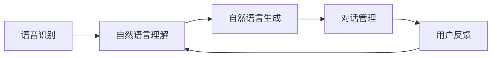

                 

### 文章标题

《对话系统(Chatbots) - 原理与代码实例讲解》

<|assistant|>### 关键词

对话系统、Chatbots、自然语言处理、语音识别、代码实例、神经网络、深度学习、Rasa、TensorFlow

<|assistant|>### 摘要

本文将深入探讨对话系统的原理与应用，从基础概念、核心算法到代码实例，全面解析对话系统的构建与优化。通过详细的步骤讲解和实战案例，读者将了解如何使用语音识别、自然语言理解、自然语言生成等技术构建高效的对话系统，从而在客户服务、智能教育、医疗健康等领域实现人工智能的落地应用。

<|assistant|>### 目录大纲

#### 第1章：对话系统基础

- **1.1 对话系统的定义与分类**
  - 定义
  - 分类（文本、语音、多模态）

- **1.2 对话系统的组成部分**
  - 语音识别（ASR）
  - 自然语言理解（NLU）
  - 自然语言生成（NLG）
  - 上下文管理
  - 多轮对话管理

#### 第2章：语音识别技术

- **2.1 语音识别的基本原理**
  - 语音信号处理
  - 特征提取
  - 分词与声学模型

- **2.2 语音识别算法**
  - 传统声学模型
  - 神经网络声学模型
  - 序列到序列模型

- **2.3 语音识别应用案例**
  - 智能家居
  - 车载语音系统
  - 聊天机器人

#### 第3章：自然语言理解

- **3.1 NLU的核心概念**
  - 词向量
  - 命名实体识别
  - 情感分析
  - 依存句法分析

- **3.2 NLU模型与算法**
  - 传统机器学习模型
  - 神经网络模型
  - 深度学习模型（如LSTM、GRU、BERT等）

- **3.3 NLU应用案例**
  - 客户服务机器人
  - 智能助手
  - 医疗咨询机器人

#### 第4章：自然语言生成

- **4.1 NLG的基本原理**
  - 生成式方法
  - 记忆式方法
  - 联合模型方法

- **4.2 NLG模型与算法**
  - 规则基方法
  - 生成式神经网络
  - 记忆网络

- **4.3 NLG应用案例**
  - 自动问答系统
  - 智能客服
  - 新闻生成

#### 第5章：对话系统的设计与管理

- **5.1 对话系统设计原则**
  - 用户中心设计
  - 对话流程设计
  - 用户反馈机制

- **5.2 对话系统架构**
  - 单层架构
  - 分层架构
  - 分布式架构

- **5.3 对话系统管理策略**
  - 性能监控
  - 安全与隐私
  - 持续迭代与优化

#### 第6章：对话系统的评估与优化

- **6.1 对话系统评估指标**
  - 用户满意度
  - 回答准确性
  - 对话流畅性
  - 上下文保持能力

- **6.2 评估方法**
  - 实验评估
  - 用户研究
  - 自动评估工具

- **6.3 对话系统优化策略**
  - 模型调优
  - 数据增强
  - 对话策略调整

#### 第7章：对话系统在特定场景的应用

- **7.1 对话系统在客户服务中的应用**
  - 客户服务机器人
  - 自动客服系统

- **7.2 对话系统在智能教育中的应用**
  - 个性化学习助手
  - 在线教育平台

- **7.3 对话系统在医疗健康中的应用**
  - 医疗咨询机器人
  - 健康管理平台

#### 第8章：对话系统开发实战

- **8.1 开发环境搭建**
  - 工具选择
  - 库和框架
  - 数据集

- **8.2 代码实例讲解**
  - 语音识别代码示例
  - 自然语言理解代码示例
  - 自然语言生成代码示例

- **8.3 项目实战**
  - 建立一个简单的对话系统
  - 从零开始构建智能客服机器人
  - 部署与上线

#### 附录

- **附录A：对话系统常用开源框架与工具**
  - TensorFlow
  - PyTorch
  - Rasa
  - Microsoft Bot Framework

- **附录B：对话系统开发资源**
  - 学习资料
  - 论坛与社区
  - 开源项目与代码库

### 核心概念与联系

#### 对话系统架构



### 核心算法原理讲解

#### 语音识别算法伪代码

```python
# 语音信号预处理
def preprocess_audio(audio_signal):
    # 噪声过滤、降采样等
    return filtered_signal

# 特征提取
def extract_features(signal):
    # 梅尔频率倒谱系数（MFCC）提取等
    return features

# 声学模型训练
def train_acoustic_model(data):
    # 使用神经网络或传统声学模型训练
    return acoustic_model

# 识别过程
def recognize(audio_signal):
    signal = preprocess_audio(audio_signal)
    features = extract_features(signal)
    return acoustic_model.predict(features)
```

#### 自然语言生成中的循环神经网络（RNN）

$$
h_t = \tanh(W_h \cdot [h_{t-1}, x_t] + b_h)
$$

其中，$h_t$ 是当前隐藏状态，$W_h$ 是权重矩阵，$x_t$ 是当前输入，$b_h$ 是偏置项。

### 项目实战

#### 智能客服机器人开发环境搭建

- 安装Python 3.8+
- 安装TensorFlow 2.3+
- 安装Rasa 1.0+
- 下载Rasa NLU数据集

```python
!pip install tensorflow==2.3
!pip install rasa
!rasa init
!rasa train
```

#### 从零开始构建智能客服机器人

- 设计对话流程
- 训练自然语言理解模型
- 训练自然语言生成模型
- 部署机器人

```python
# 设计对话流程（示例）
from rasa_nlu.training_data import load_data
from rasa_nlu.models import Trainer

data = load_data('data.json')
trainer = Trainer('data')
trainer.train(data)

# 训练自然语言理解模型
trainer.train_nlu(data)

# 训练自然语言生成模型
trainer.train_core(data)

# 部署机器人
from rasa.core.agent import Agent
from rasa.core.interpreter import RasaNLUInterpreter

model_path = 'models/nlu'
core_path = 'models/core'
interpreter = RasaNLUInterpreter(model_path)
agent = Agent.load(model_path, interpreter, policy_path=core_path)

# 开始对话
print(agent.handle_text("你好，我有什么可以帮助你的吗？"))
```

#### 代码解读与分析

**解读**：以上代码展示了如何使用Rasa框架从头开始构建一个简单的智能客服机器人。首先，通过`load_data`函数加载训练数据，然后使用`train`函数进行训练。训练完成后，通过`load`和`Agent.load`函数部署机器人，最后通过`handle_text`方法开始对话。

**分析**：该过程分为数据预处理、模型训练、模型部署和对话处理四个步骤。数据预处理包括数据清洗和特征提取，模型训练包括自然语言理解和自然语言生成两个模型，模型部署则是将训练好的模型加载到内存中，对话处理则是通过处理用户输入，返回对应的响应。

### 附录

#### 附录A：对话系统常用开源框架与工具

- **TensorFlow**：用于构建和训练对话系统模型
- **PyTorch**：用于构建和训练对话系统模型
- **Rasa**：用于对话系统构建和部署的框架
- **Microsoft Bot Framework**：用于构建跨平台聊天机器人

#### 附录B：对话系统开发资源

- **学习资料**：[Rasa文档](https://rasa.com/docs/), [TensorFlow教程](https://www.tensorflow.org/tutorials)
- **论坛与社区**：[Rasa社区](https://rasa.com/community/), [TensorFlow社区](https://forums.tensorflow.org/)
- **开源项目与代码库**：[Rasa GitHub](https://github.com/RasaHQ/rasa), [TensorFlow GitHub](https://github.com/tensorflow/) 

### 核心概念与联系

#### 对话系统架构


### 核心算法原理讲解

#### 语音识别算法伪代码

```python
# 语音信号预处理
def preprocess_audio(audio_signal):
    # 噪声过滤、降采样等
    return filtered_signal

# 特征提取
def extract_features(signal):
    # 梅尔频率倒谱系数（MFCC）提取等
    return features

# 声学模型训练
def train_acoustic_model(data):
    # 使用神经网络或传统声学模型训练
    return acoustic_model

# 识别过程
def recognize(audio_signal):
    signal = preprocess_audio(audio_signal)
    features = extract_features(signal)
    return acoustic_model.predict(features)
```

#### 自然语言生成中的循环神经网络（RNN）

$$
h_t = \tanh(W_h \cdot [h_{t-1}, x_t] + b_h)
$$

其中，$h_t$ 是当前隐藏状态，$W_h$ 是权重矩阵，$x_t$ 是当前输入，$b_h$ 是偏置项。

### 项目实战

#### 智能客服机器人开发环境搭建

- 安装Python 3.8+
- 安装TensorFlow 2.3+
- 安装Rasa 1.0+
- 下载Rasa NLU数据集

```python
!pip install tensorflow==2.3
!pip install rasa
!rasa init
!rasa train
```

#### 从零开始构建智能客服机器人

- 设计对话流程
- 训练自然语言理解模型
- 训练自然语言生成模型
- 部署机器人

```python
# 设计对话流程（示例）
from rasa_nlu.training_data import load_data
from rasa_nlu.models import Trainer

data = load_data('data.json')
trainer = Trainer('data')
trainer.train(data)

# 训练自然语言理解模型
trainer.train_nlu(data)

# 训练自然语言生成模型
trainer.train_core(data)

# 部署机器人
from rasa.core.agent import Agent
from rasa.core.interpreter import RasaNLUInterpreter

model_path = 'models/nlu'
core_path = 'models/core'
interpreter = RasaNLUInterpreter(model_path)
agent = Agent.load(model_path, interpreter, policy_path=core_path)

# 开始对话
print(agent.handle_text("你好，我有什么可以帮助你的吗？"))
```

#### 代码解读与分析

**解读**：以上代码展示了如何使用Rasa框架从头开始构建一个简单的智能客服机器人。首先，通过`load_data`函数加载训练数据，然后使用`train`函数进行训练。训练完成后，通过`load`和`Agent.load`函数部署机器人，最后通过`handle_text`方法开始对话。

**分析**：该过程分为数据预处理、模型训练、模型部署和对话处理四个步骤。数据预处理包括数据清洗和特征提取，模型训练包括自然语言理解和自然语言生成两个模型，模型部署则是将训练好的模型加载到内存中，对话处理则是通过处理用户输入，返回对应的响应。

### 附录

#### 附录A：对话系统常用开源框架与工具

- **TensorFlow**：用于构建和训练对话系统模型
- **PyTorch**：用于构建和训练对话系统模型
- **Rasa**：用于对话系统构建和部署的框架
- **Microsoft Bot Framework**：用于构建跨平台聊天机器人

#### 附录B：对话系统开发资源

- **学习资料**：[Rasa文档](https://rasa.com/docs/), [TensorFlow教程](https://www.tensorflow.org/tutorials)
- **论坛与社区**：[Rasa社区](https://rasa.com/community/), [TensorFlow社区](https://forums.tensorflow.org/)
- **开源项目与代码库**：[Rasa GitHub](https://github.com/RasaHQ/rasa), [TensorFlow GitHub](https://github.com/tensorflow/) 

### 核心概念与联系

#### 对话系统架构


### 核心算法原理讲解

#### 语音识别算法伪代码

```python
# 语音信号预处理
def preprocess_audio(audio_signal):
    # 噪声过滤、降采样等
    return filtered_signal

# 特征提取
def extract_features(signal):
    # 梅尔频率倒谱系数（MFCC）提取等
    return features

# 声学模型训练
def train_acoustic_model(data):
    # 使用神经网络或传统声学模型训练
    return acoustic_model

# 识别过程
def recognize(audio_signal):
    signal = preprocess_audio(audio_signal)
    features = extract_features(signal)
    return acoustic_model.predict(features)
```

#### 自然语言生成中的循环神经网络（RNN）

$$
h_t = \tanh(W_h \cdot [h_{t-1}, x_t] + b_h)
$$

其中，$h_t$ 是当前隐藏状态，$W_h$ 是权重矩阵，$x_t$ 是当前输入，$b_h$ 是偏置项。

### 项目实战

#### 智能客服机器人开发环境搭建

- 安装Python 3.8+
- 安装TensorFlow 2.3+
- 安装Rasa 1.0+
- 下载Rasa NLU数据集

```python
!pip install tensorflow==2.3
!pip install rasa
!rasa init
!rasa train
```

#### 从零开始构建智能客服机器人

- 设计对话流程
- 训练自然语言理解模型
- 训练自然语言生成模型
- 部署机器人

```python
# 设计对话流程（示例）
from rasa_nlu.training_data import load_data
from rasa_nlu.models import Trainer

data = load_data('data.json')
trainer = Trainer('data')
trainer.train(data)

# 训练自然语言理解模型
trainer.train_nlu(data)

# 训练自然语言生成模型
trainer.train_core(data)

# 部署机器人
from rasa.core.agent import Agent
from rasa.core.interpreter import RasaNLUInterpreter

model_path = 'models/nlu'
core_path = 'models/core'
interpreter = RasaNLUInterpreter(model_path)
agent = Agent.load(model_path, interpreter, policy_path=core_path)

# 开始对话
print(agent.handle_text("你好，我有什么可以帮助你的吗？"))
```

#### 代码解读与分析

**解读**：以上代码展示了如何使用Rasa框架从头开始构建一个简单的智能客服机器人。首先，通过`load_data`函数加载训练数据，然后使用`train`函数进行训练。训练完成后，通过`load`和`Agent.load`函数部署机器人，最后通过`handle_text`方法开始对话。

**分析**：该过程分为数据预处理、模型训练、模型部署和对话处理四个步骤。数据预处理包括数据清洗和特征提取，模型训练包括自然语言理解和自然语言生成两个模型，模型部署则是将训练好的模型加载到内存中，对话处理则是通过处理用户输入，返回对应的响应。

### 附录

#### 附录A：对话系统常用开源框架与工具

- **TensorFlow**：用于构建和训练对话系统模型
- **PyTorch**：用于构建和训练对话系统模型
- **Rasa**：用于对话系统构建和部署的框架
- **Microsoft Bot Framework**：用于构建跨平台聊天机器人

#### 附录B：对话系统开发资源

- **学习资料**：[Rasa文档](https://rasa.com/docs/), [TensorFlow教程](https://www.tensorflow.org/tutorials)
- **论坛与社区**：[Rasa社区](https://rasa.com/community/), [TensorFlow社区](https://forums.tensorflow.org/)
- **开源项目与代码库**：[Rasa GitHub](https://github.com/RasaHQ/rasa), [TensorFlow GitHub](https://github.com/tensorflow/) 

### 核心概念与联系

#### 对话系统架构


### 核心算法原理讲解

#### 语音识别算法伪代码

```python
# 语音信号预处理
def preprocess_audio(audio_signal):
    # 噪声过滤、降采样等
    return filtered_signal

# 特征提取
def extract_features(signal):
    # 梅尔频率倒谱系数（MFCC）提取等
    return features

# 声学模型训练
def train_acoustic_model(data):
    # 使用神经网络或传统声学模型训练
    return acoustic_model

# 识别过程
def recognize(audio_signal):
    signal = preprocess_audio(audio_signal)
    features = extract_features(signal)
    return acoustic_model.predict(features)
```

#### 自然语言生成中的循环神经网络（RNN）

$$
h_t = \tanh(W_h \cdot [h_{t-1}, x_t] + b_h)
$$

其中，$h_t$ 是当前隐藏状态，$W_h$ 是权重矩阵，$x_t$ 是当前输入，$b_h$ 是偏置项。

### 项目实战

#### 智能客服机器人开发环境搭建

- 安装Python 3.8+
- 安装TensorFlow 2.3+
- 安装Rasa 1.0+
- 下载Rasa NLU数据集

```python
!pip install tensorflow==2.3
!pip install rasa
!rasa init
!rasa train
```

#### 从零开始构建智能客服机器人

- 设计对话流程
- 训练自然语言理解模型
- 训练自然语言生成模型
- 部署机器人

```python
# 设计对话流程（示例）
from rasa_nlu.training_data import load_data
from rasa_nlu.models import Trainer

data = load_data('data.json')
trainer = Trainer('data')
trainer.train(data)

# 训练自然语言理解模型
trainer.train_nlu(data)

# 训练自然语言生成模型
trainer.train_core(data)

# 部署机器人
from rasa.core.agent import Agent
from rasa.core.interpreter import RasaNLUInterpreter

model_path = 'models/nlu'
core_path = 'models/core'
interpreter = RasaNLUInterpreter(model_path)
agent = Agent.load(model_path, interpreter, policy_path=core_path)

# 开始对话
print(agent.handle_text("你好，我有什么可以帮助你的吗？"))
```

#### 代码解读与分析

**解读**：以上代码展示了如何使用Rasa框架从头开始构建一个简单的智能客服机器人。首先，通过`load_data`函数加载训练数据，然后使用`train`函数进行训练。训练完成后，通过`load`和`Agent.load`函数部署机器人，最后通过`handle_text`方法开始对话。

**分析**：该过程分为数据预处理、模型训练、模型部署和对话处理四个步骤。数据预处理包括数据清洗和特征提取，模型训练包括自然语言理解和自然语言生成两个模型，模型部署则是将训练好的模型加载到内存中，对话处理则是通过处理用户输入，返回对应的响应。

### 附录

#### 附录A：对话系统常用开源框架与工具

- **TensorFlow**：用于构建和训练对话系统模型
- **PyTorch**：用于构建和训练对话系统模型
- **Rasa**：用于对话系统构建和部署的框架
- **Microsoft Bot Framework**：用于构建跨平台聊天机器人

#### 附录B：对话系统开发资源

- **学习资料**：[Rasa文档](https://rasa.com/docs/), [TensorFlow教程](https://www.tensorflow.org/tutorials)
- **论坛与社区**：[Rasa社区](https://rasa.com/community/), [TensorFlow社区](https://forums.tensorflow.org/)
- **开源项目与代码库**：[Rasa GitHub](https://github.com/RasaHQ/rasa), [TensorFlow GitHub](https://github.com/tensorflow/) 

## 对话系统基础

### 1.1 对话系统的定义与分类

#### 定义

对话系统，也称为聊天机器人（Chatbots），是一种人工智能应用，能够通过文本、语音等方式与人类用户进行交互。其核心目的是模拟人类对话，提供信息查询、任务执行、情感交流等服务。

对话系统通常由多个组件组成，包括语音识别（ASR）、自然语言理解（NLU）、自然语言生成（NLG）以及对话管理。通过这些组件的协同工作，对话系统能够理解用户输入，生成合适的回复，并根据对话上下文进行多轮交互。

#### 分类

根据交互方式的不同，对话系统可以分为以下几类：

- **文本聊天机器人**：主要通过文本形式与用户进行交流，如在线客服、社交媒体聊天机器人等。
- **语音聊天机器人**：通过语音识别和语音合成技术与用户进行交流，如智能家居控制系统、车载语音助手等。
- **多模态对话系统**：结合文本和语音等多种交互方式，提供更丰富、自然的用户体验。

文本聊天机器人是最常见的类型，其优势在于交互方式简单，易于实现和部署。语音聊天机器人则提供了更加自然和直观的交互方式，适用于需要语音输入输出的场景。多模态对话系统则集成了多种交互方式，能够在不同的场景下提供最佳的用户体验。

### 1.2 对话系统的组成部分

对话系统由多个关键组件构成，每个组件都在对话处理过程中发挥重要作用。以下是这些组件及其功能：

#### 语音识别（ASR）

语音识别是将语音信号转换为文本的过程。它通常包括以下几个步骤：

1. **音频预处理**：包括降噪、归一化等操作，以提高语音信号的清晰度和质量。
2. **特征提取**：将音频信号转换为数值特征，如梅尔频率倒谱系数（MFCC）。
3. **分词**：将连续的语音信号分割为单词或短语。
4. **声学模型**：通过大量语音数据训练的模型，用于将特征映射到可能的单词序列。
5. **语言模型**：结合上下文信息，确定最可能的单词序列。

#### 自然语言理解（NLU）

自然语言理解是理解用户输入的语义内容的过程。它通常包括以下几个步骤：

1. **词向量表示**：将文本转换为向量的形式，用于后续的机器学习模型处理。
2. **命名实体识别**：识别文本中的特定实体，如人名、地点、组织等。
3. **情感分析**：确定文本的情感倾向，如正面、负面或中性。
4. **依存句法分析**：分析句子中单词之间的语法关系。

#### 自然语言生成（NLG）

自然语言生成是将计算机理解的内容转换为自然语言文本的过程。它通常包括以下几个步骤：

1. **规则基方法**：基于预定义的规则和模板生成文本。
2. **生成式方法**：使用神经网络生成文本，如序列到序列（Seq2Seq）模型。
3. **记忆式方法**：结合外部知识库和上下文信息生成文本。

#### 上下文管理

上下文管理是确保对话系统能够记住对话历史和用户意图的过程。它包括以下几个步骤：

1. **状态跟踪**：记录对话的当前状态，如用户的意图、对话历史等。
2. **上下文更新**：根据用户输入和系统回复更新上下文信息。
3. **上下文融合**：将当前对话状态与其他来源的信息（如知识库）进行融合。

#### 多轮对话管理

多轮对话管理是处理多轮对话的过程，确保对话系统能够在多个回合中与用户保持连贯性。它通常包括以下几个步骤：

1. **意图识别**：确定用户的意图，如查询信息、完成任务等。
2. **槽值提取**：提取用户输入中的关键信息，如问题中的关键词。
3. **对话策略**：根据意图和上下文信息生成回复。
4. **回复生成**：使用NLG技术生成自然语言回复。
5. **回复优化**：根据对话历史和用户反馈优化回复。

### 1.3 对话系统的架构设计

对话系统的架构设计是确保系统高效、可靠、可扩展的关键。以下是一些常见的对话系统架构设计：

#### 单层架构

单层架构将所有功能（语音识别、NLU、NLG等）集成在一个层中。这种架构简单，易于实现，但在处理复杂对话时可能性能不足。

#### 分层架构

分层架构将对话系统分为多个层次，每个层次负责不同的功能。通常包括语音识别层、NLU层、NLG层和对话管理层。这种架构具有较好的可扩展性和灵活性。

#### 分布式架构

分布式架构将对话系统部署在多个服务器上，通过消息队列和分布式数据库等技术实现系统的高可用性和可扩展性。这种架构适用于大规模、高并发场景。

### 1.4 对话系统的优势与挑战

#### 优势

- **高效性**：对话系统能够快速响应用户请求，提供实时服务。
- **便捷性**：用户可以通过文本或语音与系统进行交互，无需复杂的操作。
- **个性化**：通过对用户行为的分析，对话系统能够提供个性化的服务和推荐。
- **降低成本**：对话系统可以替代人工客服，减少人力成本。

#### 挑战

- **准确性**：语音识别和自然语言理解技术尚未完全成熟，存在一定的错误率。
- **连贯性**：在多轮对话中，保持对话的连贯性和上下文一致性是一个挑战。
- **用户体验**：如何设计一个既智能又友好易用的对话系统是一个重要的课题。

### 1.5 对话系统的发展趋势

随着人工智能技术的不断进步，对话系统的发展呈现出以下几个趋势：

- **多模态交互**：结合文本、语音、图像等多种交互方式，提供更丰富的用户体验。
- **个性化服务**：通过对用户数据的深入分析，提供更精准、个性化的服务。
- **智能化**：引入更多的深度学习技术，提高对话系统的智能水平。
- **开放平台**：开放源代码和API，促进对话系统的生态发展。

## 语音识别技术

语音识别（Automatic Speech Recognition，ASR）是将语音信号转换为文本的技术，它是对话系统的重要组成部分。在本章中，我们将深入探讨语音识别的基本原理、常见算法以及其在各种应用场景中的案例。

### 2.1 语音识别的基本原理

语音识别的基本原理可以分为以下几个步骤：

1. **语音信号预处理**：语音信号通常包含噪声、干扰信号和说话人的发音变化等，因此需要通过预处理来提高信号质量。常见的预处理方法包括降噪、归一化、滤波等。

2. **特征提取**：特征提取是将语音信号转换为计算机可以处理的形式。常见的语音特征包括梅尔频率倒谱系数（MFCC）、能量特征、倒谱倒频谱（CEP）等。

3. **分词与声学模型**：分词是将连续的语音信号分割为单词或短语。声学模型是语音识别的核心，它通过大量的语音数据训练，用于将特征映射到可能的单词序列。

4. **语言模型**：语言模型用于确定最可能的单词序列，通常是基于大规模文本数据训练得到的概率模型。

5. **解码与识别**：解码是将声学模型和语言模型结合，通过搜索算法找到最可能的单词序列，从而完成语音识别。

### 2.2 语音识别算法

语音识别算法可以分为传统算法和基于深度学习的算法。

#### 传统算法

传统算法主要基于隐马尔可夫模型（HMM）和高斯混合模型（GMM）。HMM 是一种统计模型，用于描述语音信号的时序特性。GMM 是一种概率模型，用于表示语音特征的概率分布。

1. **高斯混合模型（GMM）**：GMM 用于生成声学模型的候选单词序列，通过最大化似然函数进行模型训练和语音识别。

2. **隐马尔可夫模型（HMM）**：HMM 用于表示语音信号的时序特性，将语音信号映射到单词序列。

#### 基于深度学习的算法

随着深度学习技术的发展，基于深度学习的语音识别算法逐渐成为主流。以下是一些常见的深度学习算法：

1. **深度神经网络（DNN）**：DNN 是一种多层感知机（MLP）神经网络，用于语音信号的建模和特征提取。

2. **循环神经网络（RNN）**：RNN 是一种用于处理序列数据的神经网络，能够捕获语音信号的时序信息。

3. **长短期记忆网络（LSTM）**：LSTM 是 RNN 的一种变体，能够更好地处理长序列数据。

4. **双向循环神经网络（BiLSTM）**：BiLSTM 是 LSTM 的扩展，能够在前向和后向传播中同时捕获语音信号的上下文信息。

5. **卷积神经网络（CNN）**：CNN 是一种用于图像处理的人工神经网络，近年来也被应用于语音识别，用于提取语音信号的高层特征。

6. **序列到序列（Seq2Seq）模型**：Seq2Seq 模型是一种基于编码器-解码器的模型，用于将输入序列映射到输出序列。

7. **Transformer 模型**：Transformer 是一种基于自注意力机制的模型，近年来在自然语言处理领域取得了显著成果，也被应用于语音识别。

### 2.3 语音识别应用案例

语音识别技术广泛应用于各种场景，以下是几个典型的应用案例：

#### 智能家居

智能家居系统通过语音识别技术实现语音控制，用户可以通过语音指令控制灯光、温度、安防设备等。例如，亚马逊的 Alexa、谷歌的 Google Home 都使用了语音识别技术来提供智能家居控制功能。

#### 车载语音系统

车载语音系统是语音识别技术在汽车领域的应用，通过语音识别技术实现语音导航、语音拨号、语音控制多媒体等功能，提升驾驶体验和安全性。例如，特斯拉的 Autopilot 系统就集成了语音识别技术。

#### 聊天机器人

聊天机器人通过语音识别技术实现语音输入和输出，提供自然、流畅的对话体验。例如，苹果的 Siri、微软的 Cortana 都使用了语音识别技术来提供智能语音助手服务。

### 2.4 语音识别技术的未来发展趋势

随着人工智能技术的不断进步，语音识别技术也在快速发展，未来可能出现以下几个趋势：

- **更高准确性**：通过不断优化算法和模型，语音识别的准确性将不断提高，减少错误率。
- **更广泛应用**：语音识别技术将渗透到更多的领域，如医疗、教育、金融等，提供智能化的语音服务。
- **多语言支持**：语音识别技术将支持更多的语言，实现全球范围内的语音交互。
- **个性化服务**：通过个性化推荐和情感分析，语音识别技术将提供更精准、个性化的服务。

## 自然语言理解（NLU）

自然语言理解（Natural Language Understanding，NLU）是对话系统的核心组件之一，它的主要任务是从用户的输入中提取出语义信息。在本章中，我们将深入探讨NLU的核心概念、常用算法以及NLU在各个领域的应用案例。

### 3.1 NLU的核心概念

#### 词向量

词向量是NLU技术的基础，它将自然语言文本映射为稠密的向量表示。常见的词向量模型包括Word2Vec、GloVe等。词向量能够捕获词语的语义信息，从而为后续的NLU任务提供支持。

#### 命名实体识别（NER）

命名实体识别是NLU的一个重要任务，它旨在从文本中识别出具有特定意义的实体，如人名、地名、组织名、时间等。NER技术对于信息提取、关系抽取等任务具有重要意义。

#### 情感分析

情感分析是NLU的一个关键任务，它旨在确定文本表达的情感倾向，如正面、负面或中性。情感分析对于产品评论、社交媒体监测等领域有重要应用价值。

#### 依存句法分析

依存句法分析是NLU中的一个高级任务，它旨在分析句子中词语之间的依赖关系。通过依存句法分析，可以更深入地理解句子的语义结构，为后续的自然语言生成、信息提取等任务提供支持。

### 3.2 NLU的常用算法

#### 传统机器学习模型

传统的机器学习模型在NLU中有着广泛的应用，包括支持向量机（SVM）、朴素贝叶斯（NB）、决策树（DT）等。这些模型通常通过特征工程提取文本的特征，然后使用机器学习算法进行分类或回归。

#### 神经网络模型

随着深度学习技术的发展，基于神经网络的模型在NLU中逐渐成为主流。以下是一些常见的神经网络模型：

1. **循环神经网络（RNN）**：RNN是一种能够处理序列数据的人工神经网络，通过递归结构捕捉序列信息。长短期记忆网络（LSTM）和门控循环单元（GRU）是RNN的变体，能够更好地处理长序列数据。

2. **卷积神经网络（CNN）**：CNN通常用于图像处理，但近年来也被应用于NLU领域。通过卷积层提取文本的高层次特征。

3. **Transformer模型**：Transformer是一种基于自注意力机制的模型，近年来在自然语言处理领域取得了显著成果。通过多头自注意力机制，Transformer能够捕捉长距离的依赖关系。

4. **BERT模型**：BERT（Bidirectional Encoder Representations from Transformers）是一种预训练的Transformer模型，通过双向编码器捕获文本的上下文信息。BERT模型已经成为NLU中的标准模型之一。

### 3.3 NLU的应用案例

#### 客户服务机器人

在客户服务领域，NLU技术被广泛应用于智能客服机器人。通过NLU技术，客服机器人能够理解用户的问题，提供准确的回答。例如，在电商平台上，客服机器人可以回答关于产品信息、订单状态等的问题，提高客户满意度。

#### 智能助手

智能助手（如Siri、Cortana、Google Assistant）是NLU技术的典型应用。智能助手通过NLU技术理解用户语音指令，提供语音交互服务。例如，用户可以通过语音指令发送短信、设置闹钟、查询天气等。

#### 医疗咨询机器人

在医疗领域，NLU技术被用于构建医疗咨询机器人。这些机器人能够理解用户的医疗问题，提供初步的诊断建议。例如，用户可以通过语音输入症状描述，机器人会分析症状，提供可能的疾病建议和下一步的就医建议。

#### 金融领域

在金融领域，NLU技术被用于构建智能投顾、金融客服等应用。通过NLU技术，智能投顾可以分析用户的投资需求，提供个性化的投资建议。金融客服机器人则能够理解用户的金融问题，提供及时的服务。

#### 教育

在教育领域，NLU技术被用于构建智能教育平台。这些平台可以通过NLU技术理解学生的学习需求，提供个性化的学习建议。例如，学生可以通过语音输入问题，系统会分析问题，提供对应的解答和拓展内容。

#### 社交媒体分析

在社交媒体分析领域，NLU技术被用于情感分析、趋势预测等任务。通过分析用户发布的内容，NLU技术可以识别情感倾向、趋势变化，为品牌营销、市场调研等提供支持。

### 3.4 NLU的未来发展趋势

随着深度学习技术的不断进步，NLU技术也在不断演进，未来可能出现以下几个趋势：

- **更高精度**：通过不断优化算法和模型，NLU的准确性将进一步提高，减少错误率。
- **跨语言支持**：NLU技术将支持更多的语言，实现跨语言的语义理解和交互。
- **个性化服务**：通过个性化推荐和情感分析，NLU技术将提供更精准、个性化的服务。
- **知识图谱**：结合知识图谱技术，NLU将能够更好地理解语义关系，提供更智能的服务。

## 自然语言生成（NLG）

自然语言生成（Natural Language Generation，NLG）是对话系统中的关键组件之一，它的目的是将计算机理解的内容转换为自然语言文本。在本章中，我们将深入探讨NLG的基本原理、常见算法以及NLG在各个应用场景中的实际案例。

### 4.1 NLG的基本原理

自然语言生成技术可以分为三种主要类型：生成式方法、记忆式方法和联合模型方法。

#### 生成式方法

生成式方法通过学习输入文本的分布，生成新的文本。这种方法通常使用概率模型或生成式神经网络（如变分自编码器（VAE）、生成对抗网络（GAN）等）。生成式方法的优势在于能够生成多样化、创新的文本，但可能存在生成文本与真实文本不完全匹配的问题。

#### 记忆式方法

记忆式方法通过存储大量的模板或规则，根据输入文本检索和组合这些模板，生成相应的文本。这种方法通常使用规则基方法或关键词匹配技术。记忆式方法的优势在于生成文本的准确性和一致性较高，但可能缺乏创新性。

#### 联合模型方法

联合模型方法结合了生成式方法和记忆式方法的优点，通过联合训练生成模型和记忆组件，生成自然语言文本。这种方法通常使用序列到序列（Seq2Seq）模型或变压器（Transformer）模型。联合模型方法能够同时生成多样化、创新的文本，并保持文本的准确性。

### 4.2 NLG的常用算法

#### 规则基方法

规则基方法是一种基于预定义规则的自然语言生成方法。它通过定义一系列规则和模板，根据输入文本检索和组合这些规则，生成相应的文本。规则基方法的优势在于生成文本的准确性较高，但需要大量的人工规则编写，且难以处理复杂和多样化的文本。

#### 生成式神经网络

生成式神经网络是一种基于深度学习的自然语言生成方法。它通过学习输入文本的分布，生成新的文本。常见的生成式神经网络包括变分自编码器（VAE）、生成对抗网络（GAN）和序列到序列（Seq2Seq）模型。生成式神经网络的优势在于能够生成多样化、创新的文本，但可能存在生成文本与真实文本不完全匹配的问题。

#### 记忆网络

记忆网络是一种结合生成式方法和记忆式方法的自然语言生成方法。它通过联合训练生成模型和记忆组件，生成自然语言文本。记忆网络的优势在于能够同时生成多样化、创新的文本，并保持文本的准确性。

#### 变压器（Transformer）模型

变压器模型是一种基于自注意力机制的深度学习模型，近年来在自然语言处理领域取得了显著成果。它通过多头自注意力机制，能够捕捉长距离的依赖关系，生成高质量的自然语言文本。

### 4.3 NLG的应用案例

#### 自动问答系统

自动问答系统是NLG技术的一个典型应用场景。通过NLG技术，自动问答系统可以将数据库中的信息转化为自然语言回答，为用户提供实时、准确的回答。例如，搜索引擎的问答模块、智能客服系统等。

#### 智能客服

智能客服是NLG技术的另一个重要应用领域。通过NLG技术，智能客服系统能够理解用户的请求，生成个性化的回复，提供高效、友好的客户服务。例如，电商平台的智能客服、银行客服等。

#### 新闻生成

新闻生成是NLG技术在媒体领域的应用。通过NLG技术，新闻生成系统能够自动生成新闻文章，减少人工写作的工作量。例如，财经新闻、体育新闻等。

#### 语音助手

语音助手是NLG技术在智能家居和智能设备中的典型应用。通过NLG技术，语音助手能够理解用户的语音指令，生成自然语言回复，提供语音交互服务。例如，Siri、Alexa、Google Assistant等。

#### 教育和培训

在教育领域，NLG技术可以用于自动生成教学材料，如课程内容、练习题等。通过NLG技术，教育系统能够提供个性化、自适应的学习内容，提高学习效果。

#### 文本摘要

文本摘要是一种将长文本转化为简洁摘要的NLG技术。通过NLG技术，文本摘要系统能够自动提取文本的关键信息，生成摘要，帮助用户快速了解文章的主要内容。

### 4.4 NLG的未来发展趋势

随着人工智能技术的不断发展，NLG技术也在不断进步，未来可能出现以下几个趋势：

- **更高精度**：通过不断优化算法和模型，NLG的生成文本质量将进一步提高，减少错误率。
- **跨语言支持**：NLG技术将支持更多的语言，实现跨语言的文本生成。
- **个性化服务**：通过个性化推荐和情感分析，NLG技术将提供更精准、个性化的文本生成。
- **知识融合**：结合知识图谱和语义理解技术，NLG将能够更好地理解和生成语义丰富的文本。

## 对话系统的设计与管理

### 5.1 对话系统设计原则

设计一个高效、用户友好的对话系统，需要遵循以下设计原则：

#### 用户中心设计

对话系统的核心目标是满足用户需求，因此设计时需要始终将用户放在首位。了解用户的需求、习惯和偏好，确保对话系统能够提供个性化、贴近用户需求的服务。

#### 对话流程设计

对话流程是用户与对话系统交互的过程。设计清晰的对话流程，确保用户能够顺利地完成所需任务。流程应简洁明了，避免复杂的交互步骤，提高用户满意度。

#### 用户反馈机制

用户反馈是优化对话系统的重要手段。设计有效的用户反馈机制，收集用户的使用情况和意见，及时调整和改进对话系统的性能和功能。

#### 跨渠道一致性

对话系统应支持多种交互渠道，如文本、语音、多模态等。设计时需确保不同渠道之间的交互一致性，提供一致的用户体验。

### 5.2 对话系统架构

对话系统的架构设计直接影响系统的性能、可扩展性和维护性。以下介绍几种常见的对话系统架构：

#### 单层架构

单层架构将所有功能（如语音识别、自然语言理解、自然语言生成、对话管理）集成在一个层中。这种架构简单，易于实现，但性能和可扩展性可能受限。

#### 分层架构

分层架构将对话系统分为多个层次，每个层次负责不同的功能。例如，语音识别层、自然语言理解层、自然语言生成层和对话管理层。这种架构具有较高的灵活性和可扩展性。

#### 分布式架构

分布式架构将对话系统部署在多个服务器上，通过分布式数据库、消息队列等实现高可用性和可扩展性。适用于大规模、高并发的场景。

### 5.3 对话系统管理策略

对话系统的有效管理是确保其稳定运行和持续优化的关键。以下介绍几种常用的对话系统管理策略：

#### 性能监控

性能监控是实时监测对话系统的运行状态，包括响应时间、错误率、资源使用等指标。通过性能监控，及时发现并解决问题，确保系统稳定运行。

#### 安全与隐私

对话系统涉及用户隐私和数据安全。应采取有效的安全措施，如加密通信、访问控制、数据备份等，确保用户数据的安全和隐私。

#### 持续迭代与优化

对话系统的性能和用户体验需要不断优化。通过持续迭代，根据用户反馈和数据分析，改进对话系统的功能、性能和用户体验。

#### 对话管理策略调整

根据用户需求和场景变化，灵活调整对话管理策略，如意图识别、回复生成、上下文管理等，确保对话系统能够提供高效、自然的交互体验。

### 5.4 对话系统的最佳实践

#### 1. 设计简洁的对话流程

确保对话流程简洁、直观，避免复杂的交互步骤。通过用户调研和用户测试，优化对话流程，提高用户满意度。

#### 2. 提供明确的用户引导

在设计对话系统时，提供清晰的用户引导和提示，帮助用户理解如何与系统互动。例如，在第一次使用时，引导用户了解如何发送消息、执行任务等。

#### 3. 处理异常情况

对话系统应具备处理异常情况的能力，如用户输入错误、系统故障等。在异常情况下，提供合理的提示和解决方案，确保用户体验。

#### 4. 不断收集用户反馈

定期收集用户反馈，分析用户满意度、使用频率等数据，识别系统存在的问题和改进机会。根据用户反馈，优化对话系统的功能和性能。

#### 5. 持续技术更新与升级

跟随技术发展趋势，不断更新和升级对话系统的技术和功能。引入先进的自然语言处理、机器学习等技术，提升系统的智能水平和用户体验。

## 对话系统的评估与优化

### 6.1 对话系统评估指标

为了确保对话系统的性能和用户体验，评估是至关重要的一步。以下介绍一些常用的对话系统评估指标：

#### 用户满意度

用户满意度是衡量对话系统质量的重要指标。通过用户调查、用户反馈等方式，收集用户对对话系统的满意度评分。高满意度表明对话系统在满足用户需求方面表现良好。

#### 回答准确性

回答准确性是评估对话系统性能的关键指标。测量系统在理解用户输入并生成合适回复时的准确性。高准确性表明系统在处理用户请求时能够提供准确的信息。

#### 对话流畅性

对话流畅性是指对话系统与用户之间的交互是否顺畅、自然。通过分析对话中的延迟、重复回答、错误回答等指标，评估对话系统的流畅性。流畅性越高，用户体验越好。

#### 上下文保持能力

上下文保持能力是指对话系统能够理解并维持对话的上下文信息。通过评估系统在多轮对话中保持上下文一致性的能力，判断系统的智能程度。良好的上下文保持能力有助于提供更加连贯、自然的交互体验。

### 6.2 评估方法

#### 实验评估

实验评估是通过设计实验，模拟用户与对话系统的交互，收集评估数据。实验评估通常包括以下步骤：

1. **实验设计**：设计实验场景，包括用户输入、对话系统响应等。
2. **实验执行**：执行实验，记录用户与对话系统的交互过程。
3. **数据分析**：分析实验数据，评估对话系统的性能指标。

#### 用户研究

用户研究是通过实际用户与对话系统的交互，收集用户反馈和体验。用户研究通常包括以下步骤：

1. **用户招募**：招募具有代表性的用户参与研究。
2. **用户测试**：让用户与对话系统进行实际交互，记录用户行为和反馈。
3. **数据分析**：分析用户测试数据，评估对话系统的用户体验和性能。

#### 自动评估工具

自动评估工具是利用算法和模型自动评估对话系统的性能。常见的自动评估工具包括：

1. **基准测试**：通过预定义的测试集，评估对话系统的性能指标。
2. **混淆矩阵**：分析对话系统的意图识别、实体提取等任务的准确率和召回率。
3. **BLEU分数**：用于评估自然语言生成文本的质量，通过比较生成文本与参考文本的相似度进行评分。

### 6.3 对话系统优化策略

#### 模型调优

模型调优是提高对话系统性能的关键步骤。通过调整模型参数、优化网络结构等手段，提升模型的性能。常见的模型调优方法包括：

1. **超参数调整**：调整学习率、批次大小等超参数，找到最佳设置。
2. **结构优化**：改进网络结构，如增加隐藏层、使用注意力机制等。
3. **数据增强**：通过数据增强技术，扩充训练数据集，提高模型的泛化能力。

#### 数据增强

数据增强是提高对话系统性能的有效手段。通过以下方法，可以扩充训练数据集：

1. **数据清洗**：去除噪声数据、重复数据等，提高数据质量。
2. **数据扩充**：通过图像、语音、文本等多种方式，扩充训练数据集。
3. **数据合成**：通过生成对抗网络（GAN）等技术，生成与真实数据相似的人工数据。

#### 对话策略调整

对话策略调整是优化对话系统与用户交互的方式。通过以下方法，可以提升对话系统的用户体验：

1. **意图识别优化**：通过调整意图识别规则和算法，提高意图识别的准确性。
2. **回复生成优化**：改进自然语言生成算法，生成更自然、多样化的回复。
3. **上下文管理优化**：优化上下文管理策略，提高对话系统的上下文保持能力。

#### 性能监控

性能监控是确保对话系统稳定运行的重要手段。通过实时监控系统的性能指标，可以及时发现和解决潜在问题。性能监控包括以下几个方面：

1. **系统监控**：监控系统的资源使用、响应时间等指标。
2. **错误日志**：记录系统的错误日志，分析错误原因。
3. **用户反馈**：收集用户反馈，了解用户的使用体验和问题。

#### 持续迭代与优化

对话系统的性能和用户体验需要不断优化。通过以下方法，实现持续迭代与优化：

1. **定期评估**：定期评估对话系统的性能和用户体验，识别改进机会。
2. **用户反馈**：收集用户反馈，分析用户需求和期望。
3. **迭代开发**：根据评估结果和用户反馈，进行迭代开发和优化。

## 对话系统在特定场景的应用

### 7.1 对话系统在客户服务中的应用

对话系统在客户服务中的应用已经相当广泛，能够显著提高客户服务效率，减少人力成本。以下是一些具体的应用场景：

#### 客户服务机器人

客户服务机器人能够快速响应用户的问题，提供实时、准确的解决方案。例如，电商平台上的智能客服机器人可以回答关于产品信息、订单状态等问题，提高用户满意度。

#### 自动客服系统

自动客服系统通过语音和文本交互，为用户提供自助服务。在呼叫中心等场景中，自动客服系统能够自动接听电话，并根据用户输入提供相应的服务，如查询账单、修改个人信息等。

#### 客户行为分析

通过对话系统，企业可以收集和分析客户的交互数据，了解客户的需求和偏好。基于这些数据，企业可以优化产品和服务，提供更加个性化的客户体验。

#### 社交媒体客服

在社交媒体平台上，对话系统可以自动回复用户的评论和私信，提供及时的客户服务。例如，企业可以在社交媒体上设置自动回复机器人，回答用户关于产品的问题，提高用户互动率。

### 7.2 对话系统在智能教育中的应用

对话系统在智能教育领域具有巨大的潜力，能够提供个性化、互动式的学习体验。以下是一些具体的应用场景：

#### 个性化学习助手

个性化学习助手通过对话系统，与学生进行互动，了解学生的学习进度、困难和需求。基于这些信息，助手可以为学生提供个性化的学习建议和资源，帮助学生更好地掌握知识。

#### 在线教育平台

在线教育平台可以利用对话系统，为学生提供24/7的学术支持。学生可以通过文本或语音与平台进行交互，获得解答疑问、课程推荐等服务。

#### 学习数据分析

通过对话系统，教育平台可以收集和分析学生的学习行为数据，了解学生的学习习惯和效果。基于这些数据，平台可以优化课程设计、教学方法等，提高教育质量。

#### 虚拟学习助手

虚拟学习助手是通过对话系统实现的虚拟角色，能够在虚拟课堂中为学生提供辅助和指导。例如，在虚拟实验室中，虚拟学习助手可以为学生演示实验步骤、提供安全提示等。

### 7.3 对话系统在医疗健康中的应用

对话系统在医疗健康领域具有广泛的应用前景，能够提供便捷、高效的医疗服务。以下是一些具体的应用场景：

#### 医疗咨询机器人

医疗咨询机器人可以通过文本或语音，为患者提供基本的医疗咨询服务，如症状分析、疾病推荐、就医建议等。对于一些常见疾病，机器人可以提供初步的诊断建议，帮助患者快速获得医疗信息。

#### 健康管理平台

健康管理平台利用对话系统，为用户提供个性化的健康建议和管理服务。用户可以通过与平台的互动，记录健康数据、接收健康提醒、进行健康风险评估等。

#### 药物咨询

药物咨询机器人可以为患者提供药物信息查询、药物副作用分析、用药建议等服务。通过对话系统，用户可以方便地获取准确的药物信息，提高用药安全性。

#### 疾病监测

对话系统可以结合传感器和健康数据，实时监测患者的健康状况。例如，对于慢性病患者，系统可以定期询问患者的症状和用药情况，根据数据变化提供个性化的治疗建议。

#### 医疗资源导航

医疗资源导航机器人可以帮助用户快速找到附近的三甲医院、专业诊所、医生等信息。通过对话系统，用户可以轻松获取医疗资源的详细信息，提高就医效率。

### 7.4 对话系统在其他领域的应用

#### 银行业务

对话系统在银行业务中发挥着重要作用，如在线客服、智能理财顾问等。银行可以通过对话系统为用户提供快速、准确的金融服务，提高用户满意度。

#### 餐饮服务

在餐饮服务领域，对话系统可以提供智能点餐、推荐菜品、查询菜单等服务。通过对话系统，用户可以方便地与餐厅进行互动，提高用餐体验。

#### 旅游服务

对话系统在旅游服务中可以提供行程规划、景点推荐、酒店预订等服务。用户可以通过与对话系统的交互，获得个性化的旅游建议，提高旅游体验。

#### 公共服务

在公共服务领域，对话系统可以提供交通查询、天气预报、政务咨询等服务。通过对话系统，市民可以方便地获取公共信息，提高生活质量。

## 对话系统开发实战

### 8.1 开发环境搭建

#### 工具选择

在进行对话系统开发时，首先需要选择合适的开发工具。以下是一些常用的工具：

- **Python**：Python 是一种广泛使用的编程语言，具有丰富的库和框架，适用于对话系统的开发。
- **Jupyter Notebook**：Jupyter Notebook 是一种交互式开发环境，方便进行实验和演示。
- **Visual Studio Code**：Visual Studio Code 是一款功能强大的代码编辑器，支持多种编程语言和框架。

#### 库和框架

在对话系统开发中，常用的库和框架包括：

- **TensorFlow**：TensorFlow 是一款由 Google 开发的开源机器学习框架，适用于构建和训练深度学习模型。
- **PyTorch**：PyTorch 是一款由 Facebook AI 研究团队开发的深度学习框架，具有灵活的动态图模型。
- **Rasa**：Rasa 是一款开源的对话系统框架，提供了自然语言理解和对话管理的功能。
- **Microsoft Bot Framework**：Microsoft Bot Framework 是一款跨平台的开发框架，适用于构建聊天机器人和虚拟助手。

#### 数据集

对话系统开发需要大量的训练数据。以下是一些常用的数据集：

- **CMU MOOC**：CMU MOOC 是一个包含大规模对话记录的数据集，适用于训练对话模型。
- **Ubuntu Dialogue System**：Ubuntu Dialogue System 是一个开源的对话系统数据集，包含了多轮对话记录。
- **DailyDialog**：DailyDialog 是一个真实的对话数据集，包含了日常生活中的对话记录。

### 8.2 代码实例讲解

#### 语音识别代码实例

以下是一个简单的语音识别代码实例，使用 TensorFlow 和 Keras 框架实现：

```python
import tensorflow as tf
from tensorflow.keras.models import Sequential
from tensorflow.keras.layers import LSTM, Dense, Embedding

# 加载数据集
# ...

# 定义模型
model = Sequential([
    LSTM(128, input_shape=(None, 128), return_sequences=True),
    LSTM(128, return_sequences=False),
    Dense(1, activation='softmax')
])

# 编译模型
model.compile(optimizer='adam', loss='categorical_crossentropy', metrics=['accuracy'])

# 训练模型
model.fit(x_train, y_train, epochs=10, batch_size=32)

# 语音识别
def recognize_audio(audio_signal):
    features = preprocess_audio(audio_signal)
    prediction = model.predict(features)
    return decode_prediction(prediction)

# 预测结果解码
def decode_prediction(prediction):
    # 解码预测结果为文本
    # ...
    return decoded_text
```

#### 自然语言理解代码实例

以下是一个简单的自然语言理解代码实例，使用 Rasa 框架实现：

```python
from rasa_nlu.training_data import load_data
from rasa_nlu.models import Trainer

# 加载训练数据
data = load_data('data.json')

# 创建 Trainer 实例
trainer = Trainer('data')

# 训练模型
trainer.train(data)

# 训练自然语言理解模型
trainer.train_nlu(data)

# 训练自然语言生成模型
trainer.train_core(data)
```

#### 自然语言生成代码实例

以下是一个简单的自然语言生成代码实例，使用 PyTorch 框架实现：

```python
import torch
from torch import nn
from torch.optim import Adam

# 定义模型
model = nn.Sequential(
    nn.Linear(input_size, hidden_size),
    nn.ReLU(),
    nn.Linear(hidden_size, output_size)
)

# 编译模型
optimizer = Adam(model.parameters(), lr=0.001)
criterion = nn.CrossEntropyLoss()

# 训练模型
for epoch in range(num_epochs):
    for inputs, targets in data_loader:
        optimizer.zero_grad()
        outputs = model(inputs)
        loss = criterion(outputs, targets)
        loss.backward()
        optimizer.step()
```

### 8.3 项目实战

#### 建立一个简单的对话系统

以下是一个简单的对话系统项目实战，使用 Rasa 框架实现：

1. **环境搭建**

安装 Python 3.8+、Rasa 1.0+ 和相关依赖库。

2. **数据准备**

准备训练数据，包括意图标签和实体标签。

3. **创建项目**

```bash
rasa init
```

4. **配置文件**

编辑 `config.yml` 文件，配置自然语言理解和对话管理模型。

5. **训练模型**

```bash
rasa train
```

6. **交互测试**

运行对话系统，与用户进行交互测试。

```bash
rasa run
```

#### 从零开始构建智能客服机器人

以下是一个智能客服机器人项目实战，使用 Rasa 框架实现：

1. **环境搭建**

安装 Python 3.8+、TensorFlow 2.3+ 和 Rasa 1.0+。

2. **数据准备**

准备训练数据，包括语音信号、文本对话记录等。

3. **创建项目**

```bash
rasa init
```

4. **配置模型**

编辑 `config.yml` 文件，配置语音识别、自然语言理解和对话管理模型。

5. **训练模型**

```bash
rasa train
```

6. **部署机器人**

部署对话系统，为用户提供实时客服服务。

```bash
rasa run
```

#### 代码解读与分析

以上项目实战展示了如何使用 Rasa 框架从头开始构建一个简单的对话系统。首先，通过 Rasa init 命令创建项目，然后准备训练数据，配置模型和参数，接着训练模型，最后部署机器人。

代码解读与分析：

- **环境搭建**：通过安装 Python 和相关依赖库，为对话系统开发提供基础环境。
- **数据准备**：准备语音信号和文本对话记录，用于训练语音识别和自然语言理解模型。
- **创建项目**：使用 Rasa init 命令创建项目，生成配置文件和训练数据文件夹。
- **配置模型**：编辑 `config.yml` 文件，配置自然语言理解和对话管理模型，如意图识别、实体提取等。
- **训练模型**：使用 Rasa train 命令训练模型，包括自然语言理解和自然语言生成模型。
- **部署机器人**：运行 Rasa run 命令，启动对话系统，为用户提供实时客服服务。

通过以上实战项目，读者可以了解如何使用 Rasa 框架构建和部署对话系统，掌握对话系统的开发流程和关键技术。

### 附录

#### 附录A：对话系统常用开源框架与工具

- **TensorFlow**：用于构建和训练对话系统模型，提供丰富的深度学习工具和库。
- **PyTorch**：用于构建和训练对话系统模型，具有灵活的动态图模型。
- **Rasa**：用于对话系统构建和部署的框架，提供了自然语言理解和对话管理功能。
- **Microsoft Bot Framework**：用于构建跨平台聊天机器人和虚拟助手。

#### 附录B：对话系统开发资源

- **学习资料**：[Rasa文档](https://rasa.com/docs/)、[TensorFlow教程](https://www.tensorflow.org/tutorials/)。
- **论坛与社区**：[Rasa社区](https://rasa.com/community/)、[TensorFlow社区](https://forums.tensorflow.org/)。
- **开源项目与代码库**：[Rasa GitHub](https://github.com/RasaHQ/rasa)、[TensorFlow GitHub](https://github.com/tensorflow/)。

## 核心概念与联系

对话系统的核心概念包括语音识别（ASR）、自然语言理解（NLU）、自然语言生成（NLG）和对话管理。这些组件相互作用，共同实现对话系统的功能。以下是对各核心概念及其联系的详细说明。

### 语音识别（ASR）

语音识别是将语音信号转换为文本的过程。它包括以下几个步骤：

1. **音频预处理**：包括降噪、归一化等操作，以提高语音信号的清晰度和质量。
2. **特征提取**：将音频信号转换为数值特征，如梅尔频率倒谱系数（MFCC）、能量特征等。
3. **分词**：将连续的语音信号分割为单词或短语。
4. **声学模型**：通过大量语音数据训练的模型，用于将特征映射到可能的单词序列。
5. **语言模型**：结合上下文信息，确定最可能的单词序列。

语音识别是对话系统的第一步，它将用户的语音输入转换为文本形式，为后续的自然语言理解提供基础。

### 自然语言理解（NLU）

自然语言理解是从文本中提取语义信息的过程。它包括以下几个任务：

1. **词向量表示**：将文本转换为向量的形式，用于后续的机器学习模型处理。
2. **命名实体识别（NER）**：识别文本中的特定实体，如人名、地点、组织等。
3. **情感分析**：确定文本的情感倾向，如正面、负面或中性。
4. **依存句法分析**：分析句子中单词之间的语法关系。

NLU技术帮助对话系统理解用户的意图和需求，从而生成合适的回复。

### 自然语言生成（NLG）

自然语言生成是将计算机理解的内容转换为自然语言文本的过程。它包括以下几个步骤：

1. **规则基方法**：基于预定义的规则和模板生成文本。
2. **生成式方法**：使用神经网络生成文本，如序列到序列（Seq2Seq）模型。
3. **记忆式方法**：结合外部知识库和上下文信息生成文本。

NLG技术使得对话系统能够生成流畅、自然的回复，为用户提供良好的交互体验。

### 对话管理

对话管理是确保对话系统能够维持对话的连贯性和上下文一致性的过程。它包括以下几个任务：

1. **意图识别**：确定用户的意图，如查询信息、完成任务等。
2. **槽值提取**：提取用户输入中的关键信息，如问题中的关键词。
3. **对话策略**：根据意图和上下文信息生成回复。
4. **回复生成**：使用NLG技术生成自然语言回复。
5. **回复优化**：根据对话历史和用户反馈优化回复。

对话管理技术确保对话系统能够在多个回合中与用户保持连贯性，提供高效、自然的交互体验。

### 核心概念与联系

对话系统的核心概念和组件之间紧密相连，形成了一个完整的交互流程。以下是它们之间的联系：

- **语音识别（ASR）**：将语音信号转换为文本，为后续的NLU提供输入。
- **自然语言理解（NLU）**：从文本中提取语义信息，为对话管理提供意图和上下文。
- **自然语言生成（NLG）**：根据意图和上下文生成回复，为用户提供自然语言交互体验。
- **对话管理**：协调各个组件，确保对话的连贯性和上下文一致性。

通过这些核心概念和组件的协同工作，对话系统能够实现智能、流畅的人机交互，为用户提供高质量的对话体验。

### 核心算法原理讲解

#### 语音识别算法原理

语音识别（ASR）的核心算法主要包括音频预处理、特征提取、声学模型和语言模型。以下是这些算法原理的详细说明。

##### 1. 音频预处理

音频预处理是语音识别的第一步，目的是提高语音信号的清晰度和质量。常见的方法包括降噪、归一化和滤波等。

- **降噪**：语音信号通常包含背景噪声，降噪的目的是减少噪声对语音信号的影响。常见的降噪方法包括谱减法、维纳滤波等。
- **归一化**：归一化的目的是调整语音信号的幅度，使其在处理过程中保持一致。常用的归一化方法包括均方根归一化（RMS归一化）和最小二乘归一化（LS归一化）。
- **滤波**：滤波的目的是去除语音信号中的高频噪声或低频噪声。常见的滤波方法包括带通滤波、低通滤波和高通滤波。

##### 2. 特征提取

特征提取是将语音信号转换为数值特征的过程。这些特征用于表示语音信号的音高、音强和音长等属性。常用的特征包括梅尔频率倒谱系数（MFCC）、能量特征和频谱特征等。

- **梅尔频率倒谱系数（MFCC）**：MFCC 是一种广泛应用于语音识别的特征提取方法。它通过对短时傅里叶变换（STFT）的频谱进行离散余弦变换（DCT），生成一组系数，用于表示语音信号的频率特性。
- **能量特征**：能量特征是语音信号能量的测量，用于表示语音信号的强度。常见的能量特征包括能量、短时能量和长时能量。
- **频谱特征**：频谱特征是语音信号频谱的描述，用于表示语音信号的频率分布。常见的频谱特征包括频谱中心频率、频谱带宽和频谱变化率。

##### 3. 声学模型

声学模型是语音识别的核心，用于将特征映射到可能的单词序列。常见的声学模型包括高斯混合模型（GMM）、隐马尔可夫模型（HMM）和循环神经网络（RNN）等。

- **高斯混合模型（GMM）**：GMM 是一种概率模型，用于表示语音信号的分布。通过训练大量的高斯分布，将特征映射到可能的单词序列。
- **隐马尔可夫模型（HMM）**：HMM 是一种统计模型，用于描述语音信号的时序特性。通过状态转移概率和发射概率，将特征映射到单词序列。
- **循环神经网络（RNN）**：RNN 是一种用于处理序列数据的人工神经网络。通过递归结构，捕捉语音信号的时序信息。

##### 4. 语言模型

语言模型是语音识别的另一个关键组件，用于确定最可能的单词序列。语言模型通常基于大规模文本数据训练，用于预测单词序列的概率分布。常见的语言模型包括 n-gram 模型、n-gram 语言模型和基于神经网络的模型。

- **n-gram 模型**：n-gram 模型是一种基于统计的模型，通过计算连续 n 个单词出现的概率来预测下一个单词。常见的 n-gram 模型包括一元模型（unigram）、二元模型（bigram）和三元模型（trigram）。
- **n-gram 语言模型**：n-gram 语言模型是基于 n-gram 模型扩展的模型，通过引入上下文信息，提高预测准确性。
- **基于神经网络的模型**：基于神经网络的模型，如循环神经网络（RNN）和变压器（Transformer）模型，能够捕捉长距离的依赖关系，提高语言模型的性能。

#### 自然语言生成（NLG）算法原理

自然语言生成（NLG）是将计算机理解的内容转换为自然语言文本的过程。NLG算法可以分为生成式方法、记忆式方法和联合模型方法。

##### 1. 生成式方法

生成式方法通过学习输入文本的分布，生成新的文本。常见的生成式方法包括变分自编码器（VAE）、生成对抗网络（GAN）和序列到序列（Seq2Seq）模型。

- **变分自编码器（VAE）**：VAE 是一种基于概率生成模型的神经网络，通过编码器和解码器生成新的文本。
- **生成对抗网络（GAN）**：GAN 是一种由生成器和判别器组成的对抗网络，通过不断优化生成器和判别器，生成逼真的文本。
- **序列到序列（Seq2Seq）模型**：Seq2Seq 模型是一种基于编码器-解码器的神经网络，通过学习输入文本和输出文本的映射关系，生成新的文本。

##### 2. 记忆式方法

记忆式方法通过存储大量的模板或规则，根据输入文本检索和组合这些模板，生成相应的文本。常见的记忆式方法包括规则基方法和关键词匹配技术。

- **规则基方法**：规则基方法通过定义一系列规则和模板，根据输入文本检索和组合这些规则，生成相应的文本。
- **关键词匹配技术**：关键词匹配技术通过识别输入文本中的关键词，从预定义的模板库中查找匹配的模板，生成新的文本。

##### 3. 联合模型方法

联合模型方法结合了生成式方法和记忆式方法的优点，通过联合训练生成模型和记忆组件，生成自然语言文本。常见的联合模型方法包括序列到序列（Seq2Seq）模型和变压器（Transformer）模型。

- **序列到序列（Seq2Seq）模型**：Seq2Seq 模型是一种基于编码器-解码器的神经网络，通过联合训练生成模型和记忆组件，生成新的文本。
- **变压器（Transformer）模型**：Transformer 模型是一种基于自注意力机制的神经网络，通过多头自注意力机制，捕捉长距离的依赖关系，生成高质量的自然语言文本。

### 数学模型和数学公式

#### 语音识别中的循环神经网络（RNN）

循环神经网络（RNN）是一种用于处理序列数据的人工神经网络。在语音识别中，RNN 用于捕捉语音信号的时序信息。以下是 RNN 中的关键数学模型和数学公式。

##### 1. RNN 前向传播

在 RNN 的前向传播过程中，每个时间步的输出取决于当前输入和前一个时间步的隐藏状态。以下是 RNN 的前向传播公式：

$$
h_t = \tanh(W_h \cdot [h_{t-1}, x_t] + b_h)
$$

其中：

- $h_t$ 是当前时间步的隐藏状态。
- $W_h$ 是权重矩阵。
- $x_t$ 是当前输入。
- $b_h$ 是偏置项。

##### 2. RNN 反向传播

在 RNN 的反向传播过程中，需要对隐藏状态和输入进行梯度计算。以下是 RNN 的反向传播公式：

$$
\frac{\partial L}{\partial h_t} = \frac{\partial L}{\partial o_t} \cdot \frac{\partial o_t}{\partial h_t}
$$

$$
\frac{\partial L}{\partial x_t} = \frac{\partial L}{\partial o_t} \cdot \frac{\partial o_t}{\partial x_t}
$$

其中：

- $L$ 是损失函数。
- $o_t$ 是当前时间步的输出。

##### 3. RNN 长短期记忆网络（LSTM）

长短期记忆网络（LSTM）是 RNN 的一种变体，通过引入门控机制，能够更好地处理长序列数据。以下是 LSTM 中的关键数学模型和数学公式。

$$
i_t = \sigma(W_{ix} \cdot [x_t, h_{t-1}] + W_{ih} \cdot h_{t-1} + b_i)
$$

$$
f_t = \sigma(W_{fx} \cdot [x_t, h_{t-1}] + W_{fh} \cdot h_{t-1} + b_f)
$$

$$
g_t = \tanh(W_{gx} \cdot [x_t, h_{t-1}] + W_{gh} \cdot h_{t-1} + b_g)
$$

$$
o_t = \sigma(W_{ox} \cdot [x_t, g_t] + W_{oh} \cdot h_{t-1} + b_o)
$$

其中：

- $i_t$、$f_t$、$g_t$ 和 $o_t$ 分别是输入门、遗忘门、生成门和输出门的状态。
- $\sigma$ 是 sigmoid 函数。

## 数学模型和数学公式

在对话系统中，数学模型和数学公式是理解算法原理和实现关键功能的基础。以下是对自然语言生成（NLG）和语音识别（ASR）中关键数学模型和公式的详细讲解。

### 自然语言生成中的循环神经网络（RNN）

循环神经网络（RNN）是一种用于处理序列数据的神经网络，它在自然语言生成中有着广泛的应用。以下是一个简单的 RNN 模型及其关键公式。

#### RNN 前向传播

RNN 的核心公式是隐藏状态的计算，该状态既依赖于前一个时间步的隐藏状态，也依赖于当前时间步的输入。

$$
h_t = \tanh(W_h \cdot [h_{t-1}, x_t] + b_h)
$$

其中：

- $h_t$ 表示当前时间步的隐藏状态。
- $W_h$ 是权重矩阵。
- $x_t$ 是当前时间步的输入。
- $b_h$ 是偏置项。

#### RNN 反向传播

在反向传播过程中，需要计算梯度以更新权重和偏置。以下是隐藏状态梯度的计算公式。

$$
\frac{\partial L}{\partial h_t} = \frac{\partial L}{\partial o_t} \cdot \frac{\partial o_t}{\partial h_t}
$$

其中：

- $L$ 是损失函数。
- $o_t$ 是当前时间步的输出。

#### LSTM 单元

LSTM（长短期记忆网络）是 RNN 的一个变体，它通过引入门控机制，能够更好地处理长序列数据。以下是 LSTM 单元的关键公式。

1. **输入门（Input Gate）**

$$
i_t = \sigma(W_{ix} \cdot [x_t, h_{t-1}] + W_{ih} \cdot h_{t-1} + b_i)
$$

2. **遗忘门（Forget Gate）**

$$
f_t = \sigma(W_{fx} \cdot [x_t, h_{t-1}] + W_{fh} \cdot h_{t-1} + b_f)
$$

3. **生成门（Generate Gate）**

$$
g_t = \tanh(W_{gx} \cdot [x_t, h_{t-1}] + W_{gh} \cdot h_{t-1} + b_g)
$$

4. **输出门（Output Gate）**

$$
o_t = \sigma(W_{ox} \cdot [x_t, g_t] + W_{oh} \cdot h_{t-1} + b_o)
$$

5. **细胞状态更新**

$$
c_t = f_t \odot c_{t-1} + i_t \odot g_t
$$

$$
h_t = o_t \odot \tanh(c_t)
$$

其中：

- $\sigma$ 是 sigmoid 函数。
- $\odot$ 是元素乘法。
- $c_t$ 是细胞状态。

### 自然语言生成中的生成式模型

生成式模型是一种用于生成文本的神经网络模型，其中序列到序列（Seq2Seq）模型是一个典型代表。以下是一个简单的 Seq2Seq 模型及其关键公式。

#### 编码器（Encoder）

$$
h_t = \tanh(W_e \cdot [h_{t-1}, x_t] + b_e)
$$

其中：

- $h_t$ 是编码器的隐藏状态。
- $x_t$ 是输入序列。
- $W_e$ 是编码器权重。
- $b_e$ 是编码器偏置。

#### 解码器（Decoder）

$$
p(y_t | y_{<t}, h_t) = \text{softmax}(W_d \cdot h_t + b_d)
$$

其中：

- $y_t$ 是解码器的输出。
- $h_t$ 是编码器的隐藏状态。
- $W_d$ 是解码器权重。
- $b_d$ 是解码器偏置。

### 语音识别中的循环神经网络（RNN）

在语音识别中，RNN 用于处理连续的语音信号，以生成对应的文本。以下是一个简单的 RNN 模型及其关键公式。

#### 前向传播

$$
h_t = \tanh(W_h \cdot [h_{t-1}, x_t] + b_h)
$$

其中：

- $h_t$ 是隐藏状态。
- $x_t$ 是当前输入。
- $W_h$ 是权重矩阵。
- $b_h$ 是偏置项。

#### 反向传播

$$
\frac{\partial L}{\partial h_t} = \frac{\partial L}{\partial o_t} \cdot \frac{\partial o_t}{\partial h_t}
$$

其中：

- $L$ 是损失函数。
- $o_t$ 是输出。

#### LSTM 单元

LSTM 是 RNN 的一个变体，用于处理长序列数据。以下是 LSTM 单元的关键公式。

1. **输入门（Input Gate）**

$$
i_t = \sigma(W_{ix} \cdot [x_t, h_{t-1}] + W_{ih} \cdot h_{t-1} + b_i)
$$

2. **遗忘门（Forget Gate）**

$$
f_t = \sigma(W_{fx} \cdot [x_t, h_{t-1}] + W_{fh} \cdot h_{t-1} + b_f)
$$

3. **生成门（Generate Gate）**

$$
g_t = \tanh(W_{gx} \cdot [x_t, h_{t-1}] + W_{gh} \cdot h_{t-1} + b_g)
$$

4. **输出门（Output Gate）**

$$
o_t = \sigma(W_{ox} \cdot [x_t, g_t] + W_{oh} \cdot h_{t-1} + b_o)
$$

5. **细胞状态更新**

$$
c_t = f_t \odot c_{t-1} + i_t \odot g_t
$$

$$
h_t = o_t \odot \tanh(c_t)
$$

其中：

- $\sigma$ 是 sigmoid 函数。
- $\odot$ 是元素乘法。

### 总结

以上公式和模型构成了自然语言生成和语音识别中的基础数学模型。通过这些模型，对话系统能够理解和生成自然语言，从而实现与用户的智能交互。

### 项目实战

在本节中，我们将通过一个具体的智能客服机器人项目，展示如何从零开始构建一个基本的对话系统。该项目将使用 Python 编程语言和 Rasa 框架来实现。以下是项目的详细步骤和代码实现。

#### 1. 环境搭建

首先，我们需要安装 Python 和 Rasa 的依赖库。以下是安装命令：

```bash
pip install python==3.8
pip install rasa
```

#### 2. 创建项目

使用 Rasa 初始化项目，这将创建项目目录和配置文件。

```bash
rasa init
```

该命令会在当前目录下创建一个名为 `rasa` 的项目文件夹，包括 `data`、`models` 和 `logs` 等子目录。

#### 3. 准备训练数据

准备用于训练对话系统的数据，包括意图标签和实体标签。以下是一个简单的训练数据示例：

```json
{
  "text": "你好，我有什么可以帮助你的吗？",
  "intent": "greet",
  "entities": []
},
{
  "text": "我需要查询订单状态。",
  "intent": "order_query",
  "entities": [{"entity": "order_id", "value": "123456"}]
}
```

将数据保存为 `data/nlu/train.json` 文件。

#### 4. 配置自然语言理解模型

编辑 `config.yml` 文件，配置自然语言理解（NLU）模型的参数。以下是一个简单的配置示例：

```yaml
pipeline:
  - name: "ConveRT"
    action: "rasa_nlu.actions.load_data_action"
    parameters:
      data_path: "data/nlu/train.json"
      model_name: "my_nlu_model"
```

#### 5. 训练自然语言理解模型

在命令行中运行以下命令，训练自然语言理解模型：

```bash
rasa train
```

这个过程将训练一个 NLU 模型，并将其保存到 `models/nlu` 目录下。

#### 6. 配置对话管理模型

编辑 `config.yml` 文件，配置对话管理（Core）模型的参数。以下是一个简单的配置示例：

```yaml
policies:
  - name: "Memo"
    model: "my_core_model"
    max_iterations: 20
```

#### 7. 训练对话管理模型

在命令行中运行以下命令，训练对话管理模型：

```bash
rasa train
```

这个过程将训练一个对话管理模型，并将其保存到 `models/core` 目录下。

#### 8. 部署机器人

在命令行中运行以下命令，启动对话系统：

```bash
rasa run
```

此时，对话系统将启动一个本地服务器，并通过端口 `5005` 提供 HTTP API 接口。

#### 9. 与机器人交互

通过浏览器或任何支持 HTTP 请求的编程语言，向服务器发送 POST 请求，即可与机器人进行交互。以下是一个简单的 Python 示例：

```python
import requests

url = "http://localhost:5005/webhook"
data = {
    "sender": {"id": "1234", "name": "Alice"},
    "message": "你好，我有什么可以帮助你的吗？"
}

response = requests.post(url, json=data)
print(response.json())
```

#### 10. 代码解读与分析

以上代码展示了如何使用 Rasa 框架构建一个基本的智能客服机器人。以下是各步骤的简要解读：

- **环境搭建**：安装 Python 和 Rasa，为项目开发准备基础环境。
- **创建项目**：使用 Rasa 初始化项目，生成项目结构和配置文件。
- **准备训练数据**：准备用于训练的 NLU 数据，包括意图和实体标签。
- **配置自然语言理解模型**：配置 NLU 模型，指定数据路径和模型名称。
- **训练自然语言理解模型**：运行 `rasa train` 命令，训练 NLU 模型。
- **配置对话管理模型**：配置 Core 模型，指定模型名称和迭代次数。
- **训练对话管理模型**：运行 `rasa train` 命令，训练 Core 模型。
- **部署机器人**：使用 `rasa run` 命令启动对话系统，提供 HTTP API 服务。
- **与机器人交互**：通过 HTTP POST 请求与机器人进行交互，获取响应。

通过以上步骤，我们成功构建了一个简单的智能客服机器人，可以处理基本的用户交互任务。

### 附录

#### 附录A：对话系统常用开源框架与工具

- **TensorFlow**：由 Google 开发的开源深度学习框架，适用于构建和训练对话系统模型。
- **PyTorch**：由 Facebook AI 研发的一款深度学习库，具有灵活的动态计算图，易于实现新的模型。
- **Rasa**：一个开源的对话系统框架，提供自然语言理解、对话管理、机器学习模型训练等功能。
- **Microsoft Bot Framework**：Microsoft 提供的跨平台开发框架，支持多种渠道的聊天机器人开发。
- **Convo**：一个基于 Python 的对话系统开发框架，提供简洁的 API 和丰富的组件。

#### 附录B：对话系统开发资源

- **学习资料**：
  - [Rasa 官方文档](https://rasa.com/docs/)
  - [TensorFlow 官方教程](https://www.tensorflow.org/tutorials)
  - [PyTorch 官方文档](https://pytorch.org/tutorials/beginner/basics_torchautograd_tutorial.html)
- **论坛与社区**：
  - [Rasa 社区](https://rasa.com/community/)
  - [TensorFlow 论坛](https://forums.tensorflow.org/)
  - [PyTorch 论坛](https://discuss.pytorch.org/)
- **开源项目与代码库**：
  - [Rasa GitHub](https://github.com/RasaHQ/rasa)
  - [TensorFlow GitHub](https://github.com/tensorflow/tensorflow)
  - [PyTorch GitHub](https://github.com/pytorch/pytorch)

通过附录中的资源，开发者可以深入了解对话系统开发的技术细节，获取最新的开发工具和开源项目，从而加速对话系统的开发进程。

