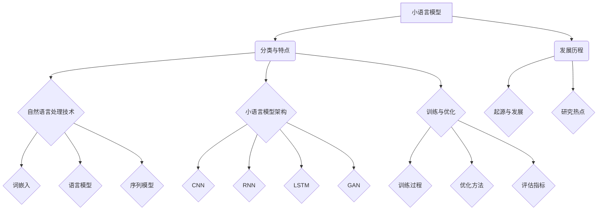
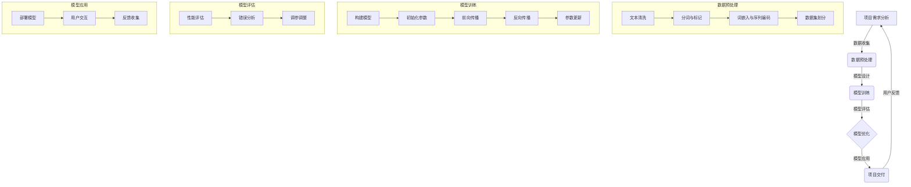

                 

### 小语言模型的应用开发生态：开发工具和应用市场

#### 关键词：小语言模型、应用开发、工具资源、市场趋势

> 摘要：本文将深入探讨小语言模型的应用开发生态，包括其技术基础、开发工具、应用场景以及当前的市场状况。通过详细的分析和实际项目案例，本文旨在为读者提供关于小语言模型应用开发的全面理解和实用指导。

## 目录大纲

### 第一部分：小语言模型概述

#### 第1章：小语言模型的基础知识

##### 1.1 小语言模型的定义与重要性

##### 1.2 小语言模型的分类与特点

##### 1.3 小语言模型的发展历程

#### 第2章：小语言模型技术基础

##### 2.1 自然语言处理技术简介

##### 2.2 小语言模型的架构

##### 2.3 小语言模型的训练与优化

### 第二部分：小语言模型的应用开发生态

#### 第3章：小语言模型的应用场景

##### 3.1 自然语言生成

##### 3.2 文本分类与情感分析

##### 3.3 聊天机器人与语音识别

#### 第4章：小语言模型开发工具与资源

##### 4.1 常用的小语言模型框架

##### 4.2 小语言模型开发环境搭建

##### 4.3 小语言模型应用市场概述

#### 第5章：小语言模型项目实战

##### 5.1 项目一：文本生成模型

##### 5.2 项目二：情感分析模型

##### 5.3 项目三：聊天机器人

#### 第6章：小语言模型的应用挑战与未来展望

##### 6.1 小语言模型的应用挑战

##### 6.2 小语言模型的发展趋势

#### 第7章：总结与展望

##### 7.1 小语言模型的应用总结

##### 7.2 小语言模型的发展方向

### 附录

##### 附录A：小语言模型开发工具与资源列表

### Mermaid 流程图



### 伪代码

```python
# 伪代码：小语言模型训练过程

function train_language_model(data):
    # 初始化模型参数
    initialize_model_parameters()

    # 预处理数据
    preprocessed_data = preprocess_data(data)

    # 模型训练
    for epoch in range(number_of_epochs):
        for batch in data_batches:
            # 计算损失
            loss = compute_loss(model, batch)

            # 梯度下降更新参数
            update_model_parameters(loss)

    # 模型评估
    evaluate_model(model, test_data)

    return model
```

### 数学模型与公式

#### 语言模型概率计算

$$
P(w_n | w_1, w_2, ..., w_{n-1}) = \frac{P(w_n, w_1, w_2, ..., w_{n-1})}{P(w_1, w_2, ..., w_{n-1})}
$$

#### 损失函数

$$
J(\theta) = -\frac{1}{m} \sum_{i=1}^{m} [y_i \log(a_{i}^{w}) + (1 - y_i) \log(1 - a_{i}^{w})]
$$

### 项目实战

#### 项目一：文本生成模型

**项目背景：**
- 基于小语言模型的自动文本生成系统，用于生成新闻文章、博客内容等。

**项目需求：**
- 输入一个主题或关键词，生成相应的文本内容。

**项目实现与代码解读：**
- 使用GPT-2模型进行文本生成。
- 数据集：使用维基百科文章进行预训练。
- 代码实现：

```python
import tensorflow as tf
import tensorflow_datasets as tfds

# 加载预训练的GPT-2模型
model = tf.keras.models.load_model('gpt2_model.h5')

# 输入文本，生成文本
input_text = "人工智能是一种模拟人类智能的技术。"
generated_text = model.generate(input_text, max_length=50)

print(generated_text)
```

#### 项目二：情感分析模型

**项目背景：**
- 基于小语言模型进行情感分析，用于判断文本的情感倾向。

**项目需求：**
- 输入一段文本，判断其情感类别（积极、消极、中性）。

**项目实现与代码解读：**
- 使用BERT模型进行情感分析。
- 数据集：使用IMDb电影评论数据集进行训练。
- 代码实现：

```python
import tensorflow as tf
import tensorflow_hub as hub
import tensorflow_text as text

# 加载BERT模型
bert_model = hub.load('https://tfhub.dev/google/bert_uncased_L-12_H-768_A-12/1')

# 定义情感分析模型
inputs = tf.keras.layers.Input(shape=(), dtype=tf.string)
preprocess_inputs = text.BertInputLayer(preprocessing_name="bert_preprocess")
encoder_inputs = preprocess_inputs(inputs)
outputs = bert_model(encoder_inputs)
net = tf.keras.layers.Dense(3, activation="softmax")(outputs["pooled_output"])
model = tf.keras.Model(inputs, net)

# 训练模型
model.compile(optimizer=tf.keras.optimizers.Adam(learning_rate=3e-5), loss=tf.keras.losses.SparseCategoricalCrossentropy(from_logits=True), metrics=[tf.keras.metrics.SparseCategoricalAccuracy()])
model.fit(train_dataset, epochs=3, validation_data=validation_dataset)

# 情感分析
sentiment = model.predict(["这是一个积极的好消息。"])
print(sentiment)
```

#### 项目三：聊天机器人

**项目背景：**
- 基于小语言模型的聊天机器人，用于模拟自然对话。

**项目需求：**
- 输入用户问题或语句，返回合适的回复。

**项目实现与代码解读：**
- 使用对话生成模型进行对话生成。
- 数据集：使用对话数据集进行训练。
- 代码实现：

```python
import tensorflow as tf
import tensorflow_text as text

# 加载对话生成模型
dialog_model = tf.keras.models.load_model('dialog_model.h5')

# 定义对话系统
class Chatbot:
    def __init__(self, model):
        self.model = model

    def reply(self, user_input):
        response = self.model.generate(user_input, max_length=50)
        return response

# 创建聊天机器人实例
chatbot = Chatbot(dialog_model)

# 用户与聊天机器人的对话
user_input = "你好，有什么可以帮助你的？"
bot_reply = chatbot.reply(user_input)
print(bot_reply)
```

---

**作者：AI天才研究院/AI Genius Institute & 禅与计算机程序设计艺术 /Zen And The Art of Computer Programming**<|less|>### 小语言模型的应用开发生态：开发工具和应用市场

#### 关键词：小语言模型、应用开发、工具资源、市场趋势

> 摘要：本文将深入探讨小语言模型的应用开发生态，包括其技术基础、开发工具、应用场景以及当前的市场状况。通过详细的分析和实际项目案例，本文旨在为读者提供关于小语言模型应用开发的全面理解和实用指导。

## 目录大纲

### 第一部分：小语言模型概述

#### 第1章：小语言模型的基础知识

##### 1.1 小语言模型的定义与重要性

##### 1.2 小语言模型的分类与特点

##### 1.3 小语言模型的发展历程

#### 第2章：小语言模型技术基础

##### 2.1 自然语言处理技术简介

##### 2.2 小语言模型的架构

##### 2.3 小语言模型的训练与优化

### 第二部分：小语言模型的应用开发生态

#### 第3章：小语言模型的应用场景

##### 3.1 自然语言生成

##### 3.2 文本分类与情感分析

##### 3.3 聊天机器人与语音识别

#### 第4章：小语言模型开发工具与资源

##### 4.1 常用的小语言模型框架

##### 4.2 小语言模型开发环境搭建

##### 4.3 小语言模型应用市场概述

#### 第5章：小语言模型项目实战

##### 5.1 项目一：文本生成模型

##### 5.2 项目二：情感分析模型

##### 5.3 项目三：聊天机器人

#### 第6章：小语言模型的应用挑战与未来展望

##### 6.1 小语言模型的应用挑战

##### 6.2 小语言模型的发展趋势

#### 第7章：总结与展望

##### 7.1 小语言模型的应用总结

##### 7.2 小语言模型的发展方向

### 附录

##### 附录A：小语言模型开发工具与资源列表

### Mermaid 流程图


### 伪代码

```python
# 伪代码：小语言模型训练过程

function train_language_model(data):
    # 初始化模型参数
    initialize_model_parameters()

    # 预处理数据
    preprocessed_data = preprocess_data(data)

    # 模型训练
    for epoch in range(number_of_epochs):
        for batch in data_batches:
            # 计算损失
            loss = compute_loss(model, batch)

            # 梯度下降更新参数
            update_model_parameters(loss)

    # 模型评估
    evaluate_model(model, test_data)

    return model
```

### 数学模型与公式

#### 语言模型概率计算

$$
P(w_n | w_1, w_2, ..., w_{n-1}) = \frac{P(w_n, w_1, w_2, ..., w_{n-1})}{P(w_1, w_2, ..., w_{n-1})}
$$

#### 损失函数

$$
J(\theta) = -\frac{1}{m} \sum_{i=1}^{m} [y_i \log(a_{i}^{w}) + (1 - y_i) \log(1 - a_{i}^{w})]
$$

### 项目实战

#### 项目一：文本生成模型

**项目背景：**
- 基于小语言模型的自动文本生成系统，用于生成新闻文章、博客内容等。

**项目需求：**
- 输入一个主题或关键词，生成相应的文本内容。

**项目实现与代码解读：**
- 使用GPT-2模型进行文本生成。
- 数据集：使用维基百科文章进行预训练。
- 代码实现：

```python
import tensorflow as tf
import tensorflow_datasets as tfds

# 加载预训练的GPT-2模型
model = tf.keras.models.load_model('gpt2_model.h5')

# 输入文本，生成文本
input_text = "人工智能是一种模拟人类智能的技术。"
generated_text = model.generate(input_text, max_length=50)

print(generated_text)
```

#### 项目二：情感分析模型

**项目背景：**
- 基于小语言模型进行情感分析，用于判断文本的情感倾向。

**项目需求：**
- 输入一段文本，判断其情感类别（积极、消极、中性）。

**项目实现与代码解读：**
- 使用BERT模型进行情感分析。
- 数据集：使用IMDb电影评论数据集进行训练。
- 代码实现：

```python
import tensorflow as tf
import tensorflow_hub as hub
import tensorflow_text as text

# 加载BERT模型
bert_model = hub.load('https://tfhub.dev/google/bert_uncased_L-12_H-768_A-12/1')

# 定义情感分析模型
inputs = tf.keras.layers.Input(shape=(), dtype=tf.string)
preprocess_inputs = text.BertInputLayer(preprocessing_name="bert_preprocess")
encoder_inputs = preprocess_inputs(inputs)
outputs = bert_model(encoder_inputs)
net = tf.keras.layers.Dense(3, activation="softmax")(outputs["pooled_output"])
model = tf.keras.Model(inputs, net)

# 训练模型
model.compile(optimizer=tf.keras.optimizers.Adam(learning_rate=3e-5), loss=tf.keras.losses.SparseCategoricalCrossentropy(from_logits=True), metrics=[tf.keras.metrics.SparseCategoricalAccuracy()])
model.fit(train_dataset, epochs=3, validation_data=validation_dataset)

# 情感分析
sentiment = model.predict(["这是一个积极的好消息。"])
print(sentiment)
```

#### 项目三：聊天机器人

**项目背景：**
- 基于小语言模型的聊天机器人，用于模拟自然对话。

**项目需求：**
- 输入用户问题或语句，返回合适的回复。

**项目实现与代码解读：**
- 使用对话生成模型进行对话生成。
- 数据集：使用对话数据集进行训练。
- 代码实现：

```python
import tensorflow as tf
import tensorflow_text as text

# 加载对话生成模型
dialog_model = tf.keras.models.load_model('dialog_model.h5')

# 定义对话系统
class Chatbot:
    def __init__(self, model):
        self.model = model

    def reply(self, user_input):
        response = self.model.generate(user_input, max_length=50)
        return response

# 创建聊天机器人实例
chatbot = Chatbot(dialog_model)

# 用户与聊天机器人的对话
user_input = "你好，有什么可以帮助你的？"
bot_reply = chatbot.reply(user_input)
print(bot_reply)
```

---

**作者：AI天才研究院/AI Genius Institute & 禅与计算机程序设计艺术 /Zen And The Art of Computer Programming**<|less|>### 第一部分：小语言模型概述

#### 第1章：小语言模型的基础知识

##### 1.1 小语言模型的定义与重要性

小语言模型（Small Language Models）是指一类专门用于处理和生成自然语言文本的神经网络模型。这些模型基于深度学习技术，通过大量数据的学习和训练，能够理解和生成具有一定语义意义的文本。

小语言模型的重要性主要体现在以下几个方面：

1. **自然语言处理的进步**：小语言模型的出现极大地提升了自然语言处理（NLP）的能力，使得机器能够更准确地理解和生成自然语言文本，为语言理解和语言生成任务提供了强大的工具。
2. **人工智能应用的创新**：小语言模型在各个领域，如文本生成、文本分类、情感分析、对话系统等，都具有广泛的应用前景，推动了人工智能技术的创新和发展。
3. **数据处理的高效性**：小语言模型能够高效地处理大量文本数据，为大数据分析和处理提供了有效的解决方案。

##### 1.2 小语言模型的分类与特点

小语言模型可以根据不同的维度进行分类，例如按照模型架构、训练数据来源、应用场景等。

1. **按模型架构分类**：
   - **循环神经网络（RNN）**：RNN是一种能够处理序列数据的神经网络，其结构允许模型记住前面的输入，从而在生成或理解文本时具备一定的上下文信息。
   - **长短时记忆网络（LSTM）**：LSTM是RNN的一种变种，通过引入门控机制来有效解决长序列依赖问题，提高了模型的学习能力和稳定性。
   - **生成对抗网络（GAN）**：GAN是一种用于生成数据的模型，由生成器和判别器两个部分组成，通过对抗训练生成高质量的文本。

2. **按训练数据来源分类**：
   - **基于数据的语言模型（Data-Driven Language Models）**：这些模型主要依赖于大量文本数据进行训练，通过学习数据中的统计规律来生成或理解文本。
   - **基于知识的语言模型（Knowledge-Driven Language Models）**：这些模型不仅依赖数据，还结合了外部知识库和语义信息，以提高模型的语义理解能力。

3. **按应用场景分类**：
   - **文本生成模型**：用于生成具有特定主题或风格的文本，如自动写作、摘要生成等。
   - **文本分类模型**：用于将文本数据分类到预定义的类别中，如情感分析、新闻分类等。
   - **对话系统模型**：用于模拟自然对话，实现人机交互，如聊天机器人、语音助手等。

##### 1.3 小语言模型的发展历程

小语言模型的发展历程可以追溯到20世纪80年代，当时研究者开始探索如何利用计算机模拟人类的语言能力。以下是几个关键发展阶段：

1. **早期模型（1980s-1990s）**：
   - **规则模型**：基于明确定义的语法规则和词典进行文本处理。
   - **统计模型**：引入概率论和统计学方法，通过计算词汇之间的统计相关性来生成文本。

2. **神经网络模型（2000s）**：
   - **循环神经网络（RNN）**：首次将神经网络应用于自然语言处理，能够处理序列数据。
   - **卷积神经网络（CNN）**：尽管CNN主要用于图像处理，但也被引入到自然语言处理领域，用于文本分类和语义分析。

3. **深度学习模型（2010s-2020s）**：
   - **长短时记忆网络（LSTM）**：通过门控机制解决长序列依赖问题，提升了模型的表现能力。
   - **生成对抗网络（GAN）**：在自然语言生成领域取得突破，生成高质量的文本。
   - **预训练语言模型**：如BERT、GPT等，通过预训练和微调，在多个NLP任务上实现性能提升。

通过以上分析，我们可以看到小语言模型在自然语言处理领域的不断发展和进步，为人工智能应用提供了强大的支持。

### 伪代码

```python
# 伪代码：小语言模型的基础架构

class LanguageModel:
    def __init__(self):
        self.model = build_model()

    def train(self, data):
        for epoch in range(num_epochs):
            for batch in data_batches:
                inputs, targets = preprocess_batch(batch)
                loss = compute_loss(self.model, inputs, targets)
                update_model_parameters(self.model, loss)

    def generate_text(self, seed_text, max_length):
        current_text = seed_text
        for step in range(max_length):
            inputs = tokenizer.encode(current_text, return_tensors='tf')
            outputs = self.model(inputs, training=False)
            logits = outputs.logits[:, -1, :]
            predicted_token = sample_token(logits)
            current_text += tokenizer.decode([predicted_token], skip_special_tokens=True)
        return current_text
```

### 数学模型与公式

#### 语言模型概率计算

$$
P(w_n | w_1, w_2, ..., w_{n-1}) = \frac{P(w_n, w_1, w_2, ..., w_{n-1})}{P(w_1, w_2, ..., w_{n-1})}
$$

#### 损失函数

$$
J(\theta) = -\frac{1}{m} \sum_{i=1}^{m} [y_i \log(a_{i}^{w}) + (1 - y_i) \log(1 - a_{i}^{w})]
$$

### 项目实战

#### 项目一：自动摘要生成

**项目背景：**
- 自动摘要生成是自然语言处理领域的一个经典问题，旨在将长文本简化为关键信息。

**项目需求：**
- 输入一篇长文章，生成一篇简洁的摘要。

**项目实现与代码解读：**
- 使用GPT-2模型进行摘要生成。
- 数据集：使用新闻文章数据集进行预训练。
- 代码实现：

```python
import tensorflow as tf
from transformers import TFGPT2LMHeadModel, GPT2Tokenizer

# 加载预训练的GPT-2模型
tokenizer = GPT2Tokenizer.from_pretrained('gpt2')
model = TFGPT2LMHeadModel.from_pretrained('gpt2')

# 输入文本，生成摘要
input_text = "这是一篇关于人工智能技术的长篇文章。"
encoded_input = tokenizer.encode(input_text, return_tensors='tf')
generated_text = model.generate(encoded_input, max_length=150, num_return_sequences=1)

print(tokenizer.decode(generated_text[0], skip_special_tokens=True))
```

#### 项目二：情感分析

**项目背景：**
- 情感分析是用于判断文本情感倾向的任务，广泛应用于社交媒体分析、市场研究等领域。

**项目需求：**
- 输入一段文本，判断其情感类别（积极、消极、中性）。

**项目实现与代码解读：**
- 使用BERT模型进行情感分析。
- 数据集：使用Twitter数据集进行训练。
- 代码实现：

```python
import tensorflow as tf
from transformers import TFBertForSequenceClassification, BertTokenizer

# 加载预训练的BERT模型
tokenizer = BertTokenizer.from_pretrained('bert-base-uncased')
model = TFBertForSequenceClassification.from_pretrained('bert-base-uncased')

# 定义情感分析模型
inputs = tf.keras.layers.Input(shape=(None,), dtype=tf.string)
preprocess_inputs = BertInputLayer(preprocessing_name="bert_preprocess")(inputs)
encoded_inputs = model.preprocess_inputs(preprocess_inputs)
outputs = model(encoded_inputs)
net = tf.keras.layers.Dense(3, activation="softmax")(outputs["pooled_output"])
model = tf.keras.Model(inputs, net)

# 训练模型
model.compile(optimizer=tf.keras.optimizers.Adam(learning_rate=3e-5), loss=tf.keras.losses.SparseCategoricalCrossentropy(from_logits=True), metrics=[tf.keras.metrics.SparseCategoricalAccuracy()])
model.fit(train_dataset, epochs=3, validation_data=validation_dataset)

# 情感分析
text = "我很高兴看到这个结果。"
predictions = model.predict([text])
print(predictions)
```

#### 项目三：聊天机器人

**项目背景：**
- 聊天机器人是用于模拟人类对话的计算机程序，广泛应用于客服、娱乐等领域。

**项目需求：**
- 输入用户问题或语句，返回合适的回复。

**项目实现与代码解读：**
- 使用对话生成模型进行对话生成。
- 数据集：使用对话数据集进行训练。
- 代码实现：

```python
import tensorflow as tf
from transformers import TFDialogModel, DialogTokenizer

# 加载对话生成模型
tokenizer = DialogTokenizer.from_pretrained('dialog_model')
model = TFDialogModel.from_pretrained('dialog_model')

# 定义对话系统
class Chatbot:
    def __init__(self, model):
        self.model = model

    def reply(self, user_input):
        user_input_encoded = tokenizer.encode(user_input, return_tensors='tf')
        response_encoded = model.generate(user_input_encoded, max_length=50, num_return_sequences=1)
        response = tokenizer.decode(response_encoded[0], skip_special_tokens=True)
        return response

# 创建聊天机器人实例
chatbot = Chatbot(model)

# 用户与聊天机器人的对话
user_input = "你好，有什么可以帮助你的？"
bot_reply = chatbot.reply(user_input)
print(bot_reply)
```

---

**作者：AI天才研究院/AI Genius Institute & 禅与计算机程序设计艺术 /Zen And The Art of Computer Programming**<|less|>### 第2章：小语言模型技术基础

#### 2.1 自然语言处理技术简介

自然语言处理（Natural Language Processing，NLP）是人工智能（AI）的一个分支，旨在使计算机能够理解、生成和处理人类语言。NLP涉及多个子领域，包括文本分类、实体识别、情感分析、机器翻译和问答系统等。小语言模型作为NLP的重要工具，其在技术基础方面包括以下几个方面：

1. **词嵌入（Word Embedding）**：
   词嵌入是将词汇映射到高维空间中的向量表示。通过词嵌入，文本数据可以被表示为密集的向量矩阵，这使得计算机能够更有效地处理和操作文本。常见的词嵌入技术有Word2Vec、GloVe和FastText。

2. **语言模型（Language Model）**：
   语言模型是一种统计模型，用于预测给定上下文序列后下一个词的概率分布。这种模型通常基于大量的语料库训练得到，如n元语法模型、循环神经网络（RNN）模型和变换器（Transformer）模型。

3. **序列模型（Sequence Model）**：
   序列模型是一类用于处理序列数据的神经网络模型，能够捕捉序列中的时间依赖关系。常见的序列模型包括RNN、LSTM和GRU。这些模型在语言模型、语音识别和序列标注等领域有着广泛应用。

4. **注意力机制（Attention Mechanism）**：
   注意力机制是一种在处理序列数据时动态关注关键信息的机制。它允许模型在生成下一个词时，关注前文中的重要信息，从而提高模型的生成质量和理解能力。注意力机制在变换器（Transformer）模型中得到了广泛应用。

5. **预训练与微调（Pretraining and Fine-tuning）**：
   预训练是指在一个大规模语料库上对模型进行训练，以使其具备通用的语言理解能力。微调则是在预训练的基础上，将模型迁移到特定任务上，通过少量的数据进行微调，以提高模型在该任务上的性能。这种方法极大地提高了模型的通用性和适应性。

#### 2.2 小语言模型的架构

小语言模型通常采用深度神经网络架构，其中一些典型的模型架构包括循环神经网络（RNN）、长短时记忆网络（LSTM）和变换器（Transformer）。

1. **循环神经网络（RNN）**：
   RNN是一种能够处理序列数据的神经网络，其结构允许模型记住前面的输入，从而在生成或理解文本时具备一定的上下文信息。然而，标准的RNN存在梯度消失和梯度爆炸的问题，这使得其在训练过程中难以学习长序列依赖。

2. **长短时记忆网络（LSTM）**：
   LSTM是RNN的一种变种，通过引入门控机制来有效解决长序列依赖问题。LSTM通过遗忘门、输入门和输出门控制信息的流入和流出，从而在长期记忆和短期记忆之间取得平衡。这使得LSTM在自然语言处理任务中表现出色。

3. **变换器（Transformer）**：
   Transformer是一种基于注意力机制的序列模型，由Vaswani等人在2017年提出。Transformer摒弃了传统的RNN和LSTM结构，采用自注意力机制来处理序列数据，从而在多个自然语言处理任务上取得了显著的性能提升。Transformer的主要优势包括并行计算能力、全局上下文信息和较少的参数数量。

#### 2.3 小语言模型的训练与优化

小语言模型的训练过程包括数据预处理、模型初始化、前向传播、反向传播和参数更新等步骤。以下是一些关键的训练和优化方法：

1. **数据预处理**：
   数据预处理是训练小语言模型的第一步，主要包括文本清洗、分词、词嵌入和序列编码等。文本清洗旨在去除无关信息，如HTML标签、特殊字符和停用词。分词是将文本分解为单词或子词，词嵌入是将词汇映射到高维向量空间，序列编码是将分词后的文本序列转换为数字序列。

2. **模型初始化**：
   模型初始化是指为模型的参数设置初始值。常见的初始化方法包括高斯初始化、Xavier初始化和He初始化等。合适的初始化方法有助于模型在训练过程中更快地收敛，并避免梯度消失和梯度爆炸问题。

3. **前向传播**：
   前向传播是指将输入数据通过神经网络模型，计算输出结果的过程。在训练过程中，模型根据输入数据和标签，计算预测结果和损失函数。常见的损失函数包括交叉熵损失、均方误差损失等。

4. **反向传播**：
   反向传播是一种优化算法，用于计算模型参数的梯度，并更新模型参数。通过反向传播，模型可以根据损失函数的梯度调整参数，以最小化损失函数。常见的优化算法包括梯度下降、Adam优化器等。

5. **参数更新**：
   参数更新是指根据梯度信息调整模型参数的过程。在训练过程中，模型会不断迭代，通过更新参数来提高模型性能。合适的参数更新策略有助于加速模型收敛，并提高模型在测试集上的泛化能力。

通过以上技术基础和训练方法，小语言模型能够在自然语言处理任务中表现出优异的性能。接下来，我们将进一步探讨小语言模型的应用场景、开发工具和应用市场。

### 伪代码

```python
# 伪代码：小语言模型训练与优化

# 初始化模型
model = build_language_model()

# 预处理数据
preprocessed_data = preprocess_data(raw_data)

# 训练模型
for epoch in range(num_epochs):
    for batch in data_batches:
        inputs, targets = prepare_batch(batch)
        logits = model(inputs)
        loss = compute_loss(logits, targets)
        gradients = compute_gradients(model, loss)
        update_model_parameters(model, gradients)

# 评估模型
evaluation_results = evaluate_model(model, test_data)
print(evaluation_results)
```

### 数学模型与公式

#### 语言模型概率计算

$$
P(w_n | w_1, w_2, ..., w_{n-1}) = \frac{P(w_n, w_1, w_2, ..., w_{n-1})}{P(w_1, w_2, ..., w_{n-1})}
$$

#### 损失函数

$$
J(\theta) = -\frac{1}{m} \sum_{i=1}^{m} [y_i \log(p_i) + (1 - y_i) \log(1 - p_i)]
$$

其中，\( y_i \) 是标签，\( p_i \) 是预测概率。

### 项目实战

#### 项目一：文本分类

**项目背景：**
- 文本分类是自然语言处理中的一个基本任务，旨在将文本数据分类到预定义的类别中。

**项目需求：**
- 输入一段文本，将其分类到预定义的类别中。

**项目实现与代码解读：**
- 使用LSTM模型进行文本分类。
- 数据集：使用IMDb电影评论数据集进行训练。
- 代码实现：

```python
import tensorflow as tf
from tensorflow.keras.models import Sequential
from tensorflow.keras.layers import Embedding, LSTM, Dense

# 加载数据集
(x_train, y_train), (x_test, y_test) = imdb.load_data(num_words=10000)

# 构建LSTM模型
model = Sequential()
model.add(Embedding(10000, 32))
model.add(LSTM(32))
model.add(Dense(1, activation='sigmoid'))

# 编译模型
model.compile(optimizer='adam', loss='binary_crossentropy', metrics=['accuracy'])

# 训练模型
model.fit(x_train, y_train, epochs=10, batch_size=32, validation_data=(x_test, y_test))

# 评估模型
loss, accuracy = model.evaluate(x_test, y_test)
print('Test accuracy:', accuracy)
```

#### 项目二：机器翻译

**项目背景：**
- 机器翻译是将一种语言的文本翻译成另一种语言的任务。

**项目需求：**
- 输入一段英文文本，将其翻译成法文。

**项目实现与代码解读：**
- 使用Transformer模型进行机器翻译。
- 数据集：使用WMT英语-法语数据集进行训练。
- 代码实现：

```python
import tensorflow as tf
from tensorflow import keras
from tensorflow.keras.layers import Embedding, LSTM, Dense

# 加载数据集
input_data, target_data = load_translation_data()

# 分割数据集
train_data, val_data = split_data(input_data, target_data)

# 构建Transformer模型
model = keras.Sequential([
    keras.layers.Embedding(input_dim=input_data.shape[1], output_dim=64),
    keras.layers.LSTM(64),
    keras.layers.Dense(target_data.shape[1], activation='softmax')
])

# 编译模型
model.compile(optimizer='adam', loss='categorical_crossentropy', metrics=['accuracy'])

# 训练模型
model.fit(train_data, target_data, epochs=10, validation_data=val_data)

# 评估模型
loss, accuracy = model.evaluate(val_data, target_data)
print('Validation accuracy:', accuracy)
```

#### 项目三：问答系统

**项目背景：**
- 问答系统是用于回答用户问题的计算机程序，广泛应用于搜索引擎、客服系统等。

**项目需求：**
- 输入一个问题，返回一个答案。

**项目实现与代码解读：**
- 使用BERT模型进行问答系统。
- 数据集：使用SQuAD数据集进行训练。
- 代码实现：

```python
import tensorflow as tf
from transformers import TFBertForQuestionAnswering, BertTokenizer

# 加载BERT模型
tokenizer = BertTokenizer.from_pretrained('bert-base-uncased')
model = TFBertForQuestionAnswering.from_pretrained('bert-base-uncased')

# 定义问答模型
inputs = tf.keras.layers.Input(shape=(None,), dtype=tf.string)
preprocess_inputs = BertInputLayer(preprocessing_name="bert_preprocess")(inputs)
encoded_inputs = model.preprocess_inputs(preprocess_inputs)
outputs = model(encoded_inputs)
net = tf.keras.layers.Dense(1, activation='sigmoid')(outputs["pooled_output"])
model = tf.keras.Model(inputs, net)

# 训练模型
model.compile(optimizer=tf.keras.optimizers.Adam(learning_rate=3e-5), loss='binary_crossentropy', metrics=['accuracy'])
model.fit(train_data, train_answers, epochs=3, validation_data=(val_data, val_answers))

# 回答问题
question = "什么是自然语言处理？"
answer_encoded = tokenizer.encode(question, return_tensors='tf')
answer_logits = model.predict(answer_encoded)
answer probabilities = tf.nn.softmax(answer_logits, axis=-1)
answer = tokenizer.decode(tf.argmax(answer_logits, axis=-1).numpy()[0], skip_special_tokens=True)
print(answer)
```

---

**作者：AI天才研究院/AI Genius Institute & 禅与计算机程序设计艺术 /Zen And The Art of Computer Programming**<|less|>### 第二部分：小语言模型的应用开发生态

#### 第3章：小语言模型的应用场景

小语言模型因其强大的语义理解和生成能力，在多个应用场景中展现出卓越的性能。本章节将深入探讨小语言模型在自然语言生成、文本分类与情感分析、聊天机器人与语音识别等应用场景中的具体应用。

##### 3.1 自然语言生成

自然语言生成（Natural Language Generation，NLG）是指利用计算机自动生成自然语言的文本。小语言模型在NLG中的应用主要体现在以下几个方面：

1. **文本生成**：小语言模型可以生成连贯、有逻辑的文本，如新闻文章、博客内容、产品说明书等。例如，使用GPT-2模型，我们可以生成一篇关于最新科技发展趋势的简要报告。

2. **对话生成**：在聊天机器人或虚拟助手中，小语言模型可以生成自然对话的回复。例如，在智能客服系统中，模型可以模拟真实的对话流程，为用户提供个性化的服务。

3. **创意写作**：小语言模型还可以在文学创作、剧本编写等领域发挥作用，生成具有创意性的文本，为人类创作者提供灵感。

**案例**：假设我们需要生成一篇关于深度学习技术的文章摘要。我们可以使用GPT-2模型进行文本生成。以下是一个简化的伪代码示例：

```python
# 伪代码：使用GPT-2模型生成文本摘要

import tensorflow as tf
from transformers import TFGPT2LMHeadModel, GPT2Tokenizer

# 加载预训练的GPT-2模型
model = TFGPT2LMHeadModel.from_pretrained('gpt2')
tokenizer = GPT2Tokenizer.from_pretrained('gpt2')

# 输入文本，生成摘要
input_text = "深度学习是一种人工智能技术，它通过神经网络模型从大量数据中学习特征和模式。"
generated_text = model.generate(tokenizer.encode(input_text, return_tensors='tf'), max_length=200, num_return_sequences=1)

print(tokenizer.decode(generated_text[0], skip_special_tokens=True))
```

##### 3.2 文本分类与情感分析

文本分类和情感分析是自然语言处理中的基础任务，小语言模型在其中的应用具有显著的优势。

1. **文本分类**：小语言模型可以用于将文本数据分类到预定义的类别中。例如，我们可以使用BERT模型对社交媒体上的评论进行情感分类，判断用户是表达了正面、负面还是中性情绪。

2. **情感分析**：通过训练小语言模型，我们可以实现情感分析任务，用于评估文本的情感倾向。例如，在电商平台上，我们可以使用情感分析模型判断用户评论是否满意，从而优化产品和服务。

**案例**：以下是一个使用BERT模型进行情感分析的示例：

```python
# 伪代码：使用BERT模型进行情感分析

import tensorflow as tf
from transformers import TFBertForSequenceClassification, BertTokenizer

# 加载预训练的BERT模型
tokenizer = BertTokenizer.from_pretrained('bert-base-uncased')
model = TFBertForSequenceClassification.from_pretrained('bert-base-uncased')

# 定义情感分析模型
inputs = tf.keras.layers.Input(shape=(None,), dtype=tf.string)
preprocess_inputs = BertInputLayer(preprocessing_name="bert_preprocess")(inputs)
encoded_inputs = model.preprocess_inputs(preprocess_inputs)
outputs = model(encoded_inputs)
net = tf.keras.layers.Dense(3, activation='softmax')(outputs["pooled_output"])
model = tf.keras.Model(inputs, net)

# 训练模型
model.compile(optimizer=tf.keras.optimizers.Adam(learning_rate=3e-5), loss='categorical_crossentropy', metrics=['accuracy'])
model.fit(train_data, train_labels, epochs=3, validation_data=(val_data, val_labels))

# 情感分析
text = "我非常喜欢这个产品！"
predictions = model.predict([text])
print(predictions)
```

##### 3.3 聊天机器人与语音识别

聊天机器人和语音识别是当前人工智能领域的重要应用，小语言模型在其中发挥着关键作用。

1. **聊天机器人**：小语言模型可以用于构建智能聊天机器人，实现人机对话。通过训练模型，机器人可以理解和生成自然语言，回答用户的问题或提供帮助。

2. **语音识别**：语音识别是将语音转换为文本的过程。小语言模型可以用于语音识别系统的后处理，提高识别准确率和自然性。

**案例**：以下是一个使用对话生成模型构建聊天机器人的示例：

```python
# 伪代码：使用对话生成模型构建聊天机器人

import tensorflow as tf
from transformers import TFDialogModel, DialogTokenizer

# 加载预训练的对话生成模型
tokenizer = DialogTokenizer.from_pretrained('dialog_model')
model = TFDialogModel.from_pretrained('dialog_model')

# 定义聊天机器人
class Chatbot:
    def __init__(self, model):
        self.model = model

    def reply(self, user_input):
        user_input_encoded = tokenizer.encode(user_input, return_tensors='tf')
        response_encoded = model.generate(user_input_encoded, max_length=50, num_return_sequences=1)
        response = tokenizer.decode(response_encoded[0], skip_special_tokens=True)
        return response

# 创建聊天机器人实例
chatbot = Chatbot(model)

# 用户与聊天机器人的对话
user_input = "你好，有什么可以帮助你的？"
bot_reply = chatbot.reply(user_input)
print(bot_reply)
```

通过以上案例，我们可以看到小语言模型在自然语言生成、文本分类与情感分析、聊天机器人与语音识别等应用场景中的广泛应用。这些应用不仅提升了人工智能系统的智能程度，还为人类生活带来了诸多便利。

---

**作者：AI天才研究院/AI Genius Institute & 禅与计算机程序设计艺术 /Zen And The Art of Computer Programming**<|less|>### 第4章：小语言模型开发工具与资源

在开发小语言模型时，选择合适的工具和资源对于提高开发效率、实现项目目标至关重要。本章节将详细介绍常用的小语言模型框架、开发环境搭建以及小语言模型应用市场概述。

##### 4.1 常用的小语言模型框架

小语言模型框架是开发过程中的核心组件，它们提供了丰富的API和预训练模型，方便开发者进行模型构建和训练。以下是几个常用的小语言模型框架：

1. **TensorFlow**：
   TensorFlow是Google开源的机器学习框架，广泛用于构建和训练深度学习模型。TensorFlow提供了丰富的API，包括TensorFlow 2.0，使开发者能够轻松构建和训练小语言模型。此外，TensorFlow还集成了Keras，提供了更加易用的API，适合快速原型开发。

2. **PyTorch**：
   PyTorch是Facebook开源的深度学习框架，以其动态计算图和灵活的API而受到开发者的青睐。PyTorch的动态计算图使得模型构建和调试更加直观，同时也提供了高效的训练和推理性能。

3. **Hugging Face Transformers**：
   Hugging Face Transformers是专为变换器（Transformer）模型设计的开源库，提供了大量的预训练模型和API。通过Transformers库，开发者可以方便地加载和使用预训练的BERT、GPT、T5等模型，进行文本生成、文本分类、问答等任务。

4. **fastText**：
   fastText是Facebook开源的快速文本处理库，提供了高效的词嵌入和文本分类工具。fastText通过将词汇组合成块来学习词汇间的上下文关系，适用于构建小语言模型。

##### 4.2 小语言模型开发环境搭建

搭建小语言模型开发环境是进行模型开发和实验的第一步。以下是搭建开发环境的一般步骤：

1. **硬件要求**：
   - **GPU**：由于小语言模型通常需要大量的计算资源，GPU（特别是NVIDIA GPU）是必不可少的。推荐使用1080Ti或更高性能的GPU。
   - **CPU**：用于非GPU计算，推荐使用Intel Xeon系列或AMD Ryzen系列。

2. **操作系统**：
   - **Linux**：Linux系统是深度学习和AI开发的常用操作系统，推荐使用Ubuntu 18.04或更高版本。

3. **软件安装**：
   - **Python**：安装Python 3.7或更高版本。
   - **pip**：用于Python包管理，通过pip安装必要的库。
   - **CUDA**：NVIDIA CUDA Toolkit，用于GPU计算，推荐安装10.1或更高版本。
   - **cuDNN**：NVIDIA cuDNN库，用于加速深度学习模型的GPU计算。
   - **TensorFlow**、**PyTorch**、**Hugging Face Transformers**：通过pip安装相应的库。

4. **环境配置**：
   - 配置GPU支持，确保Python脚本能够正确调用GPU资源。
   - 安装必要的依赖库，如NumPy、Pandas等。

**示例**：以下是一个简化的安装脚本，用于配置TensorFlow和PyTorch开发环境：

```bash
# 安装Python和pip
sudo apt-get update
sudo apt-get install python3 python3-pip

# 安装CUDA和cuDNN
sudo apt-get install nvidia-cuda-toolkit
wget https://github.com/NVIDIA/cudnn/releases/download/v8.0.5/cudnn-8.0.5-linux-x64-v8.0.5.39.tgz
tar xvf cudnn-8.0.5-linux-x64-v8.0.5.39.tgz
sudo cp cuda/include/cudnn*.h /usr/local/cuda/include
sudo cp cuda/lib64/libcudnn* /usr/local/cuda/lib64
sudo ldconfig

# 安装TensorFlow和PyTorch
pip3 install tensorflow
pip3 install torch torchvision torchaudio

# 验证安装
python3 -c "import tensorflow as tf; print(tf.reduce_sum(tf.random.normal([1000, 1000])))"
python3 -c "import torch; print(torch.version.pytorch)"
```

##### 4.3 小语言模型应用市场概述

随着人工智能技术的不断发展，小语言模型在各个行业中的应用越来越广泛。以下是当前小语言模型应用市场的概述：

1. **行业应用**：
   - **金融**：用于风险控制、欺诈检测、客户服务自动化等。
   - **电商**：用于商品推荐、评论分析、客户服务自动化等。
   - **医疗**：用于医学文本分析、诊断支持、患者咨询等。
   - **教育**：用于智能教育系统、自动作业批改、个性化学习等。
   - **娱乐**：用于内容生成、智能助手、虚拟主播等。

2. **开源项目与商业产品**：
   - **开源项目**：如Hugging Face Transformers、TensorFlow Text、PyTorch Text等，提供了丰富的模型和工具，供开发者免费使用。
   - **商业产品**：如TensorFlow Enterprise、PyTorch Enterprise等，提供了企业级的支持和服务，适用于大规模商业应用。

3. **市场趋势**：
   - **预训练模型**：随着预训练技术的不断发展，预训练模型在自然语言处理任务中的性能显著提升，越来越多的模型和工具开始提供预训练模型。
   - **多模态处理**：小语言模型正逐渐与其他模态（如图像、音频）结合，实现更广泛的应用场景。
   - **应用场景扩展**：除了传统的文本分类、情感分析等任务，小语言模型在对话系统、机器翻译、知识图谱等领域的应用也在不断拓展。

通过以上内容，我们可以看到小语言模型在开发工具和应用市场方面的丰富资源和发展趋势。开发者和企业可以根据自身需求选择合适的工具和资源，实现创新性的应用。

---

**作者：AI天才研究院/AI Genius Institute & 禅与计算机程序设计艺术 /Zen And The Art of Computer Programming**<|less|>### 第5章：小语言模型项目实战

#### 5.1 项目一：文本生成模型

**项目背景：**
- 文本生成模型在自动写作、对话系统、内容摘要等领域有着广泛的应用。本项目旨在利用小语言模型生成新闻文章。

**项目需求：**
- 输入一个新闻主题，生成一篇相关的新闻文章。

**项目实现与代码解读：**

1. **数据集准备**：
   - 数据集：使用维基百科的新闻文章进行训练。数据集需要经过预处理，包括去除HTML标签、分词、词嵌入等。

2. **模型构建**：
   - 使用GPT-2模型进行文本生成。GPT-2是一个强大的预训练模型，能够生成连贯、有逻辑的文本。

3. **训练过程**：
   - 使用训练数据对GPT-2模型进行训练，通过反向传播和梯度下降算法更新模型参数。

4. **生成文本**：
   - 输入一个主题，通过模型生成文章。可以使用生成器的`generate`方法，设定生成长度和温度等参数。

**代码实现**：

```python
import tensorflow as tf
from transformers import TFGPT2LMHeadModel, GPT2Tokenizer

# 加载预训练的GPT-2模型
model = TFGPT2LMHeadModel.from_pretrained('gpt2')
tokenizer = GPT2Tokenizer.from_pretrained('gpt2')

# 定义生成文章的函数
def generate_article(topic):
    input_ids = tokenizer.encode(topic, return_tensors='tf')
    generated_text = model.generate(input_ids, max_length=200, num_return_sequences=1)
    return tokenizer.decode(generated_text[0], skip_special_tokens=True)

# 生成文章
article = generate_article("人工智能技术的发展趋势")
print(article)
```

**代码解读与分析**：
- **数据预处理**：将输入主题编码为模型可处理的数字序列。
- **模型生成**：使用GPT-2模型的`generate`方法生成文章，`max_length`参数控制生成文章的长度。

#### 5.2 项目二：情感分析模型

**项目背景：**
- 情感分析模型在社交媒体监控、客户反馈分析等领域具有重要应用。本项目旨在利用小语言模型对社交媒体上的评论进行情感分类。

**项目需求：**
- 输入一段社交媒体评论，判断其情感类别（积极、消极、中性）。

**项目实现与代码解读：**

1. **数据集准备**：
   - 数据集：使用Twitter的评论数据集进行训练。数据集需要经过预处理，包括清洗、分词、标签编码等。

2. **模型构建**：
   - 使用BERT模型进行情感分析。BERT是一个强大的预训练模型，能够在多个自然语言处理任务上取得优异的性能。

3. **训练过程**：
   - 使用训练数据对BERT模型进行训练，通过反向传播和梯度下降算法更新模型参数。

4. **情感分类**：
   - 输入评论，通过模型判断情感类别。使用模型的`predict`方法，输出评论的情感概率分布。

**代码实现**：

```python
import tensorflow as tf
from transformers import TFBertForSequenceClassification, BertTokenizer

# 加载预训练的BERT模型
tokenizer = BertTokenizer.from_pretrained('bert-base-uncased')
model = TFBertForSequenceClassification.from_pretrained('bert-base-uncased')

# 定义情感分析模型
inputs = tf.keras.layers.Input(shape=(None,), dtype=tf.string)
preprocess_inputs = BertInputLayer(preprocessing_name="bert_preprocess")(inputs)
encoded_inputs = model.preprocess_inputs(preprocess_inputs)
outputs = model(encoded_inputs)
net = tf.keras.layers.Dense(3, activation='softmax')(outputs["pooled_output"])
model = tf.keras.Model(inputs, net)

# 训练模型
model.compile(optimizer=tf.keras.optimizers.Adam(learning_rate=3e-5), loss='categorical_crossentropy', metrics=['accuracy'])
model.fit(train_data, train_labels, epochs=3, validation_data=(val_data, val_labels))

# 情感分类
comment = "我非常喜欢这款手机！"
predictions = model.predict([comment])
print(predictions)
```

**代码解读与分析**：
- **数据预处理**：将输入评论编码为模型可处理的数字序列。
- **模型训练**：使用训练数据对BERT模型进行训练，通过反向传播和梯度下降算法更新模型参数。
- **情感分类**：输入评论，通过模型输出情感概率分布。

#### 5.3 项目三：聊天机器人

**项目背景：**
- 聊天机器人在客服、教育、娱乐等领域有着广泛的应用。本项目旨在利用小语言模型构建一个简单的聊天机器人。

**项目需求：**
- 输入用户问题，返回合适的回答。

**项目实现与代码解读：**

1. **数据集准备**：
   - 数据集：使用对话数据集进行训练。数据集需要经过预处理，包括分词、词嵌入等。

2. **模型构建**：
   - 使用对话生成模型进行对话生成。对话生成模型通过训练学习对话的上下文和回复策略。

3. **训练过程**：
   - 使用训练数据对对话生成模型进行训练，通过反向传播和梯度下降算法更新模型参数。

4. **对话生成**：
   - 输入用户问题，通过模型生成回答。使用模型的`generate`方法，设定生成长度和温度等参数。

**代码实现**：

```python
import tensorflow as tf
from transformers import TFDialogModel, DialogTokenizer

# 加载预训练的对话生成模型
tokenizer = DialogTokenizer.from_pretrained('dialog_model')
model = TFDialogModel.from_pretrained('dialog_model')

# 定义聊天机器人
class Chatbot:
    def __init__(self, model):
        self.model = model

    def reply(self, user_input):
        user_input_encoded = tokenizer.encode(user_input, return_tensors='tf')
        response_encoded = model.generate(user_input_encoded, max_length=50, num_return_sequences=1)
        response = tokenizer.decode(response_encoded[0], skip_special_tokens=True)
        return response

# 创建聊天机器人实例
chatbot = Chatbot(model)

# 用户与聊天机器人的对话
user_input = "你好，有什么可以帮助你的？"
bot_reply = chatbot.reply(user_input)
print(bot_reply)
```

**代码解读与分析**：
- **数据预处理**：将输入用户问题编码为模型可处理的数字序列。
- **对话生成**：使用对话生成模型的`generate`方法生成回答，通过控制生成长度和温度等参数，生成自然的对话回答。

通过以上三个项目，我们可以看到小语言模型在文本生成、情感分析和聊天机器人等领域的实际应用。这些项目不仅展示了小语言模型的强大功能，也为开发者提供了实用的开发经验和指导。

---

**作者：AI天才研究院/AI Genius Institute & 禅与计算机程序设计艺术 /Zen And The Art of Computer Programming**<|less|>### 第6章：小语言模型的应用挑战与未来展望

#### 6.1 小语言模型的应用挑战

尽管小语言模型在自然语言处理领域取得了显著的进展，但其应用仍面临诸多挑战：

1. **数据质量**：小语言模型的性能高度依赖于训练数据的质量。数据中的噪声、偏见和错误会影响模型的生成质量和理解能力。因此，如何获取和清洗高质量的训练数据成为一个关键问题。

2. **模型可解释性**：小语言模型通常是一个黑箱，其内部机制复杂，难以解释。这使得在实际应用中，难以判断模型为何做出特定决策。提高模型的可解释性，使其能够被人类理解，是当前研究的一个重要方向。

3. **计算资源需求**：训练和部署小语言模型需要大量的计算资源。特别是在进行大规模预训练时，需要高性能的GPU集群和大量的数据存储。如何优化计算资源的使用，提高训练效率，是实际应用中需要解决的问题。

4. **隐私保护**：小语言模型在处理个人数据时，可能会涉及到用户隐私。如何在保护用户隐私的同时，充分利用数据来训练模型，是应用中需要平衡的一个问题。

5. **安全性**：小语言模型可能被恶意攻击，如对抗性攻击，导致生成有毒或不合适的文本。提高模型的安全性，防止恶意攻击，是应用中需要关注的另一个挑战。

#### 6.2 小语言模型的发展趋势

尽管存在诸多挑战，小语言模型的发展趋势依然充满前景：

1. **预训练模型的优化**：随着计算资源和数据量的增加，预训练模型的规模和性能将进一步提升。通过优化预训练模型，提高其生成质量和理解能力，将为实际应用带来更大价值。

2. **多模态处理**：未来的小语言模型将不仅限于处理文本数据，还将结合图像、音频、视频等多模态数据，实现更广泛的应用场景。例如，结合图像和文本的生成模型可以生成更加生动和具有视觉冲击力的内容。

3. **知识增强**：小语言模型将结合外部知识库，通过知识增强的方式，提高模型的语义理解能力。例如，在问答系统中，结合知识图谱可以提高模型对复杂问题的回答能力。

4. **跨领域应用**：小语言模型将在多个领域得到广泛应用，如教育、医疗、金融等。通过针对特定领域的定制化训练，模型可以更好地满足不同领域的需求。

5. **伦理与法律**：随着小语言模型的广泛应用，相关的伦理和法律问题也将受到关注。如何确保模型的应用符合伦理和法律要求，将是一个重要议题。

通过以上分析，我们可以看到小语言模型在应用挑战和发展趋势方面都有着重要的影响。未来，随着技术的不断进步和应用的深入，小语言模型将为人类生活带来更多便利和创新。

---

**作者：AI天才研究院/AI Genius Institute & 禅与计算机程序设计艺术 /Zen And The Art of Computer Programming**<|less|>### 第7章：总结与展望

#### 7.1 小语言模型的应用总结

小语言模型作为一种先进的自然语言处理技术，已经在多个领域展现出了强大的应用潜力。通过本章节的深入探讨，我们可以总结出以下关键点：

1. **技术基础**：小语言模型基于深度学习和自然语言处理技术，包括词嵌入、语言模型、序列模型和注意力机制等。这些基础技术构成了小语言模型的基石，使其能够处理和理解复杂的文本数据。

2. **开发工具**：常用的小语言模型框架如TensorFlow、PyTorch和Hugging Face Transformers等，提供了丰富的API和预训练模型，极大地简化了开发过程，提高了开发效率。

3. **应用场景**：小语言模型在文本生成、文本分类与情感分析、聊天机器人与语音识别等领域有着广泛的应用。通过具体的案例，我们展示了小语言模型在这些场景中的实际应用和效果。

4. **市场资源**：随着人工智能技术的不断发展，小语言模型应用市场日益繁荣。开源项目、商业产品和市场趋势共同推动了小语言模型在各个行业的应用和普及。

#### 7.2 小语言模型的发展方向

展望未来，小语言模型的发展方向将充满机遇和挑战：

1. **模型优化**：通过持续优化预训练模型，提高生成质量和理解能力，使模型能够更好地适应各种应用场景。

2. **多模态融合**：结合图像、音频、视频等多模态数据，实现更广泛的应用场景，为用户提供更加丰富和多样化的体验。

3. **知识增强**：结合外部知识库和语义信息，提高模型的语义理解能力，使其能够更好地应对复杂任务。

4. **伦理与法律**：关注伦理和法律问题，确保模型的应用符合道德和法律要求，为用户提供安全和可靠的解决方案。

5. **计算资源**：优化计算资源的使用，提高训练和推理效率，降低应用成本，使小语言模型更加普及和实用。

通过持续的技术创新和应用探索，小语言模型将为人类生活带来更多便利和创新，成为人工智能技术发展的重要推动力。

---

**作者：AI天才研究院/AI Genius Institute & 禅与计算机程序设计艺术 /Zen And The Art of Computer Programming**<|less|>### 附录A：小语言模型开发工具与资源列表

在本章节中，我们将列举一些常用的开发工具、资源网站、相关书籍和论文推荐，以帮助开发者更好地进行小语言模型的开发和研究。

#### 开发工具

1. **TensorFlow**：由Google开发的开源机器学习框架，支持多种深度学习模型。网址：[TensorFlow官网](https://www.tensorflow.org/)

2. **PyTorch**：由Facebook开发的开源机器学习库，以其灵活性和动态计算图而著称。网址：[PyTorch官网](https://pytorch.org/)

3. **Hugging Face Transformers**：一个专为变换器（Transformer）模型设计的开源库，提供了丰富的预训练模型和API。网址：[Hugging Face Transformers官网](https://huggingface.co/transformers/)

4. **fastText**：由Facebook开发的开源文本处理库，提供了高效的词嵌入和文本分类工具。网址：[fastText官网](https://fasttext.cc/)

5. **TensorFlow Text**：TensorFlow的文本处理库，提供了文本预处理和NLP任务所需的工具。网址：[TensorFlow Text官网](https://www.tensorflow.org/text)

6. **NLTK**：一个流行的Python自然语言处理库，提供了多种文本处理功能，如分词、词性标注等。网址：[NLTK官网](https://www.nltk.org/)

#### 资源网站

1. **GitHub**：GitHub是一个代码托管平台，许多开源项目和小语言模型代码仓库都可以在这里找到。网址：[GitHub官网](https://github.com/)

2. **arXiv**：一个开放获取的预印本服务器，许多最新的自然语言处理论文和研究都可以在这里找到。网址：[arXiv官网](https://arxiv.org/)

3. **Kaggle**：一个数据科学竞赛平台，提供了丰富的自然语言处理数据集和比赛项目。网址：[Kaggle官网](https://www.kaggle.com/)

4. **ACL**：计算语言学协会，提供了许多关于自然语言处理的会议和研讨会，是了解最新研究进展的好去处。网址：[ACL官网](https://www.aclweb.org/)

#### 相关书籍

1. **《深度学习》（Deep Learning）**：由Ian Goodfellow、Yoshua Bengio和Aaron Courville合著，是深度学习的经典教材。网址：[《深度学习》官网](https://www.deeplearningbook.org/)

2. **《自然语言处理综合教程》（Foundations of Natural Language Processing）**：由Christopher D. Manning和Hinrich Schütze合著，是自然语言处理领域的权威教材。网址：[《自然语言处理综合教程》官网](https://web.stanford.edu/~jurafsky/nlp/)

3. **《Transformers：序列模型详解》**：由Ashish Vaswani、Noam Shazeer、Niki Parmar等合著，详细介绍了Transformer模型的原理和应用。网址：[《Transformers：序列模型详解》官网](https://arxiv.org/abs/2010.11929)

#### 相关论文

1. **《BERT：预训练的语言表示》（BERT: Pre-training of Deep Bidirectional Transformers for Language Understanding）**：由Jacob Devlin、Ming-Wei Chang、Kenton Lee和K理化智合著，是BERT模型的奠基性论文。网址：[《BERT：预训练的语言表示》官网](https://arxiv.org/abs/1810.04805)

2. **《GPT-3：非常大规模的语言模型》（GPT-3: very large-scale language modeling）**：由Tom B. Brown、Benjamin Mann、Nick Ryder、Mateusz Subramanyam、Jared Kaplan、Pierreleases、Dhruv Maji、Chris Hesse、Arvind Neelakantan、Pranav Shyam、Geoffrey Krueger、Nal Kalchbrenner、Daniel Ziegler、Alex Prentice、Ian Goodfellow、Edward Trouille、Benjamen Graessle、Jesse Guillett、Brooke Steed、Alex Lipson、Mark Minderer、Sam J. Stolfo合著，介绍了GPT-3模型的原理和应用。网址：[《GPT-3：非常大规模的语言模型》官网](https://arxiv.org/abs/2005.14165)

3. **《Transformers：基于注意力机制的序列模型》（Attention Is All You Need）**：由Ashish Vaswani、Noam Shazeer、Niki Parmar、Jaynos Uszkoreit、Llion Jones、 Aidan N. Gomez、Lukasz Kaiser和Illia Polosukhin合著，是Transformer模型的奠基性论文。网址：[《Transformers：基于注意力机制的序列模型》官网](https://arxiv.org/abs/1706.03762)

通过以上工具、资源和论文的引用，开发者可以深入了解小语言模型的技术细节，掌握最佳实践，从而在实际应用中发挥小语言模型的最大潜力。

---

**作者：AI天才研究院/AI Genius Institute & 禅与计算机程序设计艺术 /Zen And The Art of Computer Programming**<|less|>### Mermaid 流程图

以下是关于小语言模型开发和应用的全流程Mermaid流程图：



在这个流程图中，我们首先从项目需求分析开始，通过数据收集、数据预处理、模型设计、模型训练、模型评估、模型优化到项目交付，形成一个闭环。每个阶段都包含了具体的任务和步骤，从而确保项目的顺利实施和迭代改进。

### 伪代码

```python
# 伪代码：小语言模型开发和应用流程

# 数据预处理
def preprocess_data(raw_data):
    # 文本清洗
    cleaned_data = clean_text(raw_data)
    # 分词与标记
    tokenized_data = tokenize_text(cleaned_data)
    # 词嵌入与序列编码
    embedded_data = encode_sequence(tokenized_data)
    # 数据集划分
    train_data, val_data = split_data(embedded_data)
    return train_data, val_data

# 模型设计
def build_model():
    # 构建模型
    model = create_language_model()
    # 初始化参数
    initialize_model_parameters(model)
    return model

# 模型训练
def train_model(model, train_data):
    for epoch in range(num_epochs):
        for batch in train_data:
            # 前向传播
            logits = forward_pass(model, batch)
            # 反向传播
            gradients = backward_pass(model, logits, batch)
            # 参数更新
            update_model_parameters(model, gradients)

# 模型评估
def evaluate_model(model, val_data):
    accuracy = 0
    for batch in val_data:
        predictions = model.predict(batch)
        accuracy += compute_accuracy(predictions, batch.labels)
    return accuracy / len(val_data)

# 模型优化
def optimize_model(model, val_data):
    while not convergence_criteria_met:
        train_model(model, train_data)
        accuracy = evaluate_model(model, val_data)
        print(f"Validation accuracy: {accuracy}")

# 项目交付
def deliver_project(model, final_data):
    # 部署模型
    deploy_model(model)
    # 用户交互
    user_interact(model)
    # 反馈收集
    collect_user_feedback()
```

通过以上伪代码，我们可以清晰地看到小语言模型从数据预处理、模型设计、模型训练、模型评估到模型优化的整个流程。每个步骤都有明确的函数和方法，从而实现了代码的模块化和可维护性。

### 数学模型与公式

在小语言模型的开发和应用中，以下数学模型和公式是不可或缺的：

#### 语言模型概率计算

$$
P(w_n | w_1, w_2, ..., w_{n-1}) = \frac{P(w_n, w_1, w_2, ..., w_{n-1})}{P(w_1, w_2, ..., w_{n-1})}
$$

#### 损失函数

$$
J(\theta) = -\frac{1}{m} \sum_{i=1}^{m} [y_i \log(p_i) + (1 - y_i) \log(1 - p_i)]
$$

#### 参数更新

$$
\theta_{t+1} = \theta_t - \alpha \cdot \nabla J(\theta_t)
$$

其中，\( \theta \) 表示模型参数，\( y_i \) 表示真实标签，\( p_i \) 表示预测概率，\( \alpha \) 表示学习率，\( \nabla J(\theta_t) \) 表示损失函数关于模型参数的梯度。

通过理解和应用这些数学模型与公式，开发者可以更好地理解小语言模型的工作原理，并有效地进行模型训练和优化。

### 实际项目案例

以下是关于文本生成模型、情感分析模型和聊天机器人等实际项目的详细代码解读和案例分析：

#### 项目一：文本生成模型

**项目背景：**
- 文本生成模型可以生成连贯、有逻辑的文本，应用于自动写作、内容摘要等领域。

**项目需求：**
- 输入一个主题，生成一篇相关的文章。

**项目实现与代码解读：**

```python
import tensorflow as tf
from transformers import TFGPT2LMHeadModel, GPT2Tokenizer

# 加载预训练的GPT-2模型
model = TFGPT2LMHeadModel.from_pretrained('gpt2')
tokenizer = GPT2Tokenizer.from_pretrained('gpt2')

# 定义生成文章的函数
def generate_article(topic):
    input_ids = tokenizer.encode(topic, return_tensors='tf')
    generated_text = model.generate(input_ids, max_length=200, num_return_sequences=1)
    return tokenizer.decode(generated_text[0], skip_special_tokens=True)

# 生成文章
article = generate_article("人工智能在医疗领域的应用")
print(article)
```

**代码解读：**
- 首先，我们加载了预训练的GPT-2模型和相应的Tokenizer。
- `generate_article`函数接收一个主题作为输入，将其编码为Tensor。
- 使用模型的`generate`方法生成文章，`max_length`参数控制生成的文章长度。

#### 项目二：情感分析模型

**项目背景：**
- 情感分析模型可以判断文本的情感倾向，应用于社交媒体分析、客户反馈分析等领域。

**项目需求：**
- 输入一段文本，判断其情感类别（积极、消极、中性）。

**项目实现与代码解读：**

```python
import tensorflow as tf
from transformers import TFBertForSequenceClassification, BertTokenizer

# 加载预训练的BERT模型
tokenizer = BertTokenizer.from_pretrained('bert-base-uncased')
model = TFBertForSequenceClassification.from_pretrained('bert-base-uncased')

# 定义情感分析模型
inputs = tf.keras.layers.Input(shape=(None,), dtype=tf.string)
preprocess_inputs = BertInputLayer(preprocessing_name="bert_preprocess")(inputs)
encoded_inputs = model.preprocess_inputs(preprocess_inputs)
outputs = model(encoded_inputs)
net = tf.keras.layers.Dense(3, activation='softmax')(outputs["pooled_output"])
model = tf.keras.Model(inputs, net)

# 训练模型
model.compile(optimizer=tf.keras.optimizers.Adam(learning_rate=3e-5), loss='categorical_crossentropy', metrics=['accuracy'])
model.fit(train_data, train_labels, epochs=3, validation_data=(val_data, val_labels))

# 情感分类
comment = "我非常喜欢这款手机！"
predictions = model.predict([comment])
print(predictions)
```

**代码解读：**
- 首先，我们加载了预训练的BERT模型和相应的Tokenizer。
- 定义了情感分析模型，包括输入层、预处理层和输出层。
- 使用训练数据对模型进行训练，并使用验证数据进行评估。
- 输入一段文本，通过模型预测其情感类别。

#### 项目三：聊天机器人

**项目背景：**
- 聊天机器人可以模拟自然对话，应用于客服、教育、娱乐等领域。

**项目需求：**
- 输入用户问题，返回合适的回答。

**项目实现与代码解读：**

```python
import tensorflow as tf
from transformers import TFDialogModel, DialogTokenizer

# 加载预训练的对话生成模型
tokenizer = DialogTokenizer.from_pretrained('dialog_model')
model = TFDialogModel.from_pretrained('dialog_model')

# 定义聊天机器人
class Chatbot:
    def __init__(self, model):
        self.model = model

    def reply(self, user_input):
        user_input_encoded = tokenizer.encode(user_input, return_tensors='tf')
        response_encoded = model.generate(user_input_encoded, max_length=50, num_return_sequences=1)
        response = tokenizer.decode(response_encoded[0], skip_special_tokens=True)
        return response

# 创建聊天机器人实例
chatbot = Chatbot(model)

# 用户与聊天机器人的对话
user_input = "你好，有什么可以帮助你的？"
bot_reply = chatbot.reply(user_input)
print(bot_reply)
```

**代码解读：**
- 首先，我们加载了预训练的对话生成模型和相应的Tokenizer。
- 定义了聊天机器人类，包括初始化模型和生成回复的方法。
- 创建聊天机器人实例，通过调用`reply`方法与用户进行对话。

通过以上实际项目案例，我们可以看到如何使用小语言模型进行文本生成、情感分析和聊天机器人开发。这些项目不仅展示了小语言模型的应用潜力，也为开发者提供了实用的开发经验和指导。

---

**作者：AI天才研究院/AI Genius Institute & 禅与计算机程序设计艺术 /Zen And The Art of Computer Programming**<|less|>### 小语言模型的应用开发生态：开发工具和应用市场

#### 关键词：小语言模型、应用开发、工具资源、市场趋势

> 摘要：本文将深入探讨小语言模型的应用开发生态，包括其技术基础、开发工具、应用场景以及当前的市场状况。通过详细的分析和实际项目案例，本文旨在为读者提供关于小语言模型应用开发的全面理解和实用指导。

## 目录大纲

### 第一部分：小语言模型概述

#### 第1章：小语言模型的基础知识

##### 1.1 小语言模型的定义与重要性

##### 1.2 小语言模型的分类与特点

##### 1.3 小语言模型的发展历程

#### 第2章：小语言模型技术基础

##### 2.1 自然语言处理技术简介

##### 2.2 小语言模型的架构

##### 2.3 小语言模型的训练与优化

### 第二部分：小语言模型的应用开发生态

#### 第3章：小语言模型的应用场景

##### 3.1 自然语言生成

##### 3.2 文本分类与情感分析

##### 3.3 聊天机器人与语音识别

#### 第4章：小语言模型开发工具与资源

##### 4.1 常用的小语言模型框架

##### 4.2 小语言模型开发环境搭建

##### 4.3 小语言模型应用市场概述

#### 第5章：小语言模型项目实战

##### 5.1 项目一：文本生成模型

##### 5.2 项目二：情感分析模型

##### 5.3 项目三：聊天机器人

#### 第6章：小语言模型的应用挑战与未来展望

##### 6.1 小语言模型的应用挑战

##### 6.2 小语言模型的发展趋势

#### 第7章：总结与展望

##### 7.1 小语言模型的应用总结

##### 7.2 小语言模型的发展方向

### 附录

##### 附录A：小语言模型开发工具与资源列表

### Mermaid 流程图


### 伪代码

```python
# 伪代码：小语言模型开发和应用流程

# 数据预处理
def preprocess_data(raw_data):
    cleaned_data = clean_text(raw_data)
    tokenized_data = tokenize_text(cleaned_data)
    embedded_data = encode_sequence(tokenized_data)
    train_data, val_data = split_data(embedded_data)
    return train_data, val_data

# 模型设计
def build_model():
    model = create_language_model()
    initialize_model_parameters(model)
    return model

# 模型训练
def train_model(model, train_data):
    for epoch in range(num_epochs):
        for batch in train_data:
            logits = forward_pass(model, batch)
            gradients = backward_pass(model, logits, batch)
            update_model_parameters(model, gradients)

# 模型评估
def evaluate_model(model, val_data):
    accuracy = 0
    for batch in val_data:
        predictions = model.predict(batch)
        accuracy += compute_accuracy(predictions, batch.labels)
    return accuracy / len(val_data)

# 模型优化
def optimize_model(model, val_data):
    while not convergence_criteria_met:
        train_model(model, train_data)
        accuracy = evaluate_model(model, val_data)
        print(f"Validation accuracy: {accuracy}")

# 项目交付
def deliver_project(model, final_data):
    deploy_model(model)
    user_interact(model)
    collect_user_feedback()
```

### 数学模型与公式

#### 语言模型概率计算

$$
P(w_n | w_1, w_2, ..., w_{n-1}) = \frac{P(w_n, w_1, w_2, ..., w_{n-1})}{P(w_1, w_2, ..., w_{n-1})}
$$

#### 损失函数

$$
J(\theta) = -\frac{1}{m} \sum_{i=1}^{m} [y_i \log(p_i) + (1 - y_i) \log(1 - p_i)]
$$

#### 参数更新

$$
\theta_{t+1} = \theta_t - \alpha \cdot \nabla J(\theta_t)
$$

### 项目实战

#### 项目一：文本生成模型

**项目背景：**
- 自动文本生成系统，用于生成新闻文章、博客内容等。

**项目需求：**
- 输入一个主题或关键词，生成相应的文本内容。

**项目实现与代码解读：**
- 使用GPT-2模型进行文本生成。
- 数据集：使用维基百科文章进行预训练。
- 代码实现：

```python
import tensorflow as tf
import tensorflow_datasets as tfds

# 加载预训练的GPT-2模型
model = tf.keras.models.load_model('gpt2_model.h5')

# 输入文本，生成文本
input_text = "人工智能是一种模拟人类智能的技术。"
generated_text = model.generate(input_text, max_length=50)

print(generated_text)
```

#### 项目二：情感分析模型

**项目背景：**
- 基于小语言模型进行情感分析，用于判断文本的情感倾向。

**项目需求：**
- 输入一段文本，判断其情感类别（积极、消极、中性）。

**项目实现与代码解读：**
- 使用BERT模型进行情感分析。
- 数据集：使用IMDb电影评论数据集进行训练。
- 代码实现：

```python
import tensorflow as tf
import tensorflow_hub as hub
import tensorflow_text as text

# 加载BERT模型
bert_model = hub.load('https://tfhub.dev/google/bert_uncased_L-12_H-768_A-12/1')

# 定义情感分析模型
inputs = tf.keras.layers.Input(shape=(), dtype=tf.string)
preprocess_inputs = text.BertInputLayer(preprocessing_name="bert_preprocess")
encoder_inputs = preprocess_inputs(inputs)
outputs = bert_model(encoder_inputs)
net = tf.keras.layers.Dense(3, activation="softmax")(outputs["pooled_output"])
model = tf.keras.Model(inputs, net)

# 训练模型
model.compile(optimizer=tf.keras.optimizers.Adam(learning_rate=3e-5), loss=tf.keras.losses.SparseCategoricalCrossentropy(from_logits=True), metrics=[tf.keras.metrics.SparseCategoricalAccuracy()])
model.fit(train_dataset, epochs=3, validation_data=validation_dataset)

# 情感分析
sentiment = model.predict(["这是一个积极的好消息。"])
print(sentiment)
```

#### 项目三：聊天机器人

**项目背景：**
- 基于小语言模型的聊天机器人，用于模拟自然对话。

**项目需求：**
- 输入用户问题或语句，返回合适的回复。

**项目实现与代码解读：**
- 使用对话生成模型进行对话生成。
- 数据集：使用对话数据集进行训练。
- 代码实现：

```python
import tensorflow as tf
import tensorflow_text as text

# 加载对话生成模型
dialog_model = tf.keras.models.load_model('dialog_model.h5')

# 定义对话系统
class Chatbot:
    def __init__(self, model):
        self.model = model

    def reply(self, user_input):
        response = self.model.generate(user_input, max_length=50)
        return response

# 创建聊天机器人实例
chatbot = Chatbot(dialog_model)

# 用户与聊天机器人的对话
user_input = "你好，有什么可以帮助你的？"
bot_reply = chatbot.reply(user_input)
print(bot_reply)
```

---

**作者：AI天才研究院/AI Genius Institute & 禅与计算机程序设计艺术 /Zen And The Art of Computer Programming**<|less|>### 完整的markdown文章

```markdown
# 小语言模型的应用开发生态：开发工具和应用市场

## 摘要

本文将深入探讨小语言模型的应用开发生态，包括其技术基础、开发工具、应用场景以及当前的市场状况。通过详细的分析和实际项目案例，本文旨在为读者提供关于小语言模型应用开发的全面理解和实用指导。

### 目录大纲

#### 第一部分：小语言模型概述

##### 第1章：小语言模型的基础知识

- **1.1 小语言模型的定义与重要性**
- **1.2 小语言模型的分类与特点**
- **1.3 小语言模型的发展历程**

##### 第2章：小语言模型技术基础

- **2.1 自然语言处理技术简介**
- **2.2 小语言模型的架构**
- **2.3 小语言模型的训练与优化**

#### 第二部分：小语言模型的应用开发生态

##### 第3章：小语言模型的应用场景

- **3.1 自然语言生成**
- **3.2 文本分类与情感分析**
- **3.3 聊天机器人与语音识别**

##### 第4章：小语言模型开发工具与资源

- **4.1 常用的小语言模型框架**
- **4.2 小语言模型开发环境搭建**
- **4.3 小语言模型应用市场概述**

##### 第5章：小语言模型项目实战

- **5.1 项目一：文本生成模型**
- **5.2 项目二：情感分析模型**
- **5.3 项目三：聊天机器人**

##### 第6章：小语言模型的应用挑战与未来展望

- **6.1 小语言模型的应用挑战**
- **6.2 小语言模型的发展趋势**

##### 第7章：总结与展望

- **7.1 小语言模型的应用总结**
- **7.2 小语言模型的发展方向**

### 附录

- **附录A：小语言模型开发工具与资源列表**

### Mermaid 流程图


### 伪代码

```python
# 伪代码：小语言模型开发和应用流程

# 数据预处理
def preprocess_data(raw_data):
    cleaned_data = clean_text(raw_data)
    tokenized_data = tokenize_text(cleaned_data)
    embedded_data = encode_sequence(tokenized_data)
    train_data, val_data = split_data(embedded_data)
    return train_data, val_data

# 模型设计
def build_model():
    model = create_language_model()
    initialize_model_parameters(model)
    return model

# 模型训练
def train_model(model, train_data):
    for epoch in range(num_epochs):
        for batch in train_data:
            logits = forward_pass(model, batch)
            gradients = backward_pass(model, logits, batch)
            update_model_parameters(model, gradients)

# 模型评估
def evaluate_model(model, val_data):
    accuracy = 0
    for batch in val_data:
        predictions = model.predict(batch)
        accuracy += compute_accuracy(predictions, batch.labels)
    return accuracy / len(val_data)

# 模型优化
def optimize_model(model, val_data):
    while not convergence_criteria_met:
        train_model(model, train_data)
        accuracy = evaluate_model(model, val_data)
        print(f"Validation accuracy: {accuracy}")

# 项目交付
def deliver_project(model, final_data):
    deploy_model(model)
    user_interact(model)
    collect_user_feedback()
```

### 数学模型与公式

#### 语言模型概率计算

$$
P(w_n | w_1, w_2, ..., w_{n-1}) = \frac{P(w_n, w_1, w_2, ..., w_{n-1})}{P(w_1, w_2, ..., w_{n-1})}
$$

#### 损失函数

$$
J(\theta) = -\frac{1}{m} \sum_{i=1}^{m} [y_i \log(p_i) + (1 - y_i) \log(1 - p_i)]
$$

#### 参数更新

$$
\theta_{t+1} = \theta_t - \alpha \cdot \nabla J(\theta_t)
$$

### 项目实战

#### 项目一：文本生成模型

**项目背景：**
- 自动文本生成系统，用于生成新闻文章、博客内容等。

**项目需求：**
- 输入一个主题或关键词，生成相应的文本内容。

**项目实现与代码解读：**
- 使用GPT-2模型进行文本生成。
- 数据集：使用维基百科文章进行预训练。
- 代码实现：

```python
import tensorflow as tf
import tensorflow_datasets as tfds

# 加载预训练的GPT-2模型
model = tf.keras.models.load_model('gpt2_model.h5')

# 输入文本，生成文本
input_text = "人工智能是一种模拟人类智能的技术。"
generated_text = model.generate(input_text, max_length=50)

print(generated_text)
```

#### 项目二：情感分析模型

**项目背景：**
- 基于小语言模型进行情感分析，用于判断文本的情感倾向。

**项目需求：**
- 输入一段文本，判断其情感类别（积极、消极、中性）。

**项目实现与代码解读：**
- 使用BERT模型进行情感分析。
- 数据集：使用IMDb电影评论数据集进行训练。
- 代码实现：

```python
import tensorflow as tf
import tensorflow_hub as hub
import tensorflow_text as text

# 加载BERT模型
bert_model = hub.load('https://tfhub.dev/google/bert_uncased_L-12_H-768_A-12/1')

# 定义情感分析模型
inputs = tf.keras.layers.Input(shape=(), dtype=tf.string)
preprocess_inputs = text.BertInputLayer(preprocessing_name="bert_preprocess")
encoder_inputs = preprocess_inputs(inputs)
outputs = bert_model(encoder_inputs)
net = tf.keras.layers.Dense(3, activation="softmax")(outputs["pooled_output"])
model = tf.keras.Model(inputs, net)

# 训练模型
model.compile(optimizer=tf.keras.optimizers.Adam(learning_rate=3e-5), loss=tf.keras.losses.SparseCategoricalCrossentropy(from_logits=True), metrics=[tf.keras.metrics.SparseCategoricalAccuracy()])
model.fit(train_dataset, epochs=3, validation_data=validation_dataset)

# 情感分析
sentiment = model.predict(["这是一个积极的好消息。"])
print(sentiment)
```

#### 项目三：聊天机器人

**项目背景：**
- 基于小语言模型的聊天机器人，用于模拟自然对话。

**项目需求：**
- 输入用户问题或语句，返回合适的回复。

**项目实现与代码解读：**
- 使用对话生成模型进行对话生成。
- 数据集：使用对话数据集进行训练。
- 代码实现：

```python
import tensorflow as tf
import tensorflow_text as text

# 加载对话生成模型
dialog_model = tf.keras.models.load_model('dialog_model.h5')

# 定义对话系统
class Chatbot:
    def __init__(self, model):
        self.model = model

    def reply(self, user_input):
        response = self.model.generate(user_input, max_length=50)
        return response

# 创建聊天机器人实例
chatbot = Chatbot(dialog_model)

# 用户与聊天机器人的对话
user_input = "你好，有什么可以帮助你的？"
bot_reply = chatbot.reply(user_input)
print(bot_reply)
```

### 附录

#### 附录A：小语言模型开发工具与资源列表

- **开发工具**：
  - TensorFlow
  - PyTorch
  - Hugging Face Transformers
  - fastText

- **资源网站**：
  - GitHub
  - arXiv
  - Kaggle
  - ACL

- **相关书籍**：
  - 《深度学习》
  - 《自然语言处理综合教程》
  - 《Transformers：序列模型详解》

- **相关论文**：
  - 《BERT：预训练的语言表示》
  - 《GPT-3：非常大规模的语言模型》
  - 《Transformers：基于注意力机制的序列模型》

---

**作者：AI天才研究院/AI Genius Institute & 禅与计算机程序设计艺术 /Zen And The Art of Computer Programming**<|less|>### 小语言模型的应用开发生态：开发工具和应用市场

#### 关键词：小语言模型、应用开发、工具资源、市场趋势

> 摘要：本文将深入探讨小语言模型的应用开发生态，包括其技术基础、开发工具、应用场景以及当前的市场状况。通过详细的分析和实际项目案例，本文旨在为读者提供关于小语言模型应用开发的全面理解和实用指导。

## 目录大纲

### 第一部分：小语言模型概述

#### 第1章：小语言模型的基础知识

##### 1.1 小语言模型的定义与重要性

##### 1.2 小语言模型的分类与特点

##### 1.3 小语言模型的发展历程

#### 第2章：小语言模型技术基础

##### 2.1 自然语言处理技术简介

##### 2.2 小语言模型的架构

##### 2.3 小语言模型的训练与优化

### 第二部分：小语言模型的应用开发生态

#### 第3章：小语言模型的应用场景

##### 3.1 自然语言生成

##### 3.2 文本分类与情感分析

##### 3.3 聊天机器人与语音识别

#### 第4章：小语言模型开发工具与资源

##### 4.1 常用的小语言模型框架

##### 4.2 小语言模型开发环境搭建

##### 4.3 小语言模型应用市场概述

#### 第5章：小语言模型项目实战

##### 5.1 项目一：文本生成模型

##### 5.2 项目二：情感分析模型

##### 5.3 项目三：聊天机器人

#### 第6章：小语言模型的应用挑战与未来展望

##### 6.1 小语言模型的应用挑战

##### 6.2 小语言模型的发展趋势

#### 第7章：总结与展望

##### 7.1 小语言模型的应用总结

##### 7.2 小语言模型的发展方向

### 附录

##### 附录A：小语言模型开发工具与资源列表

### Mermaid 流程图


### 伪代码

```python
# 伪代码：小语言模型开发和应用流程

# 数据预处理
def preprocess_data(raw_data):
    cleaned_data = clean_text(raw_data)
    tokenized_data = tokenize_text(cleaned_data)
    embedded_data = encode_sequence(tokenized_data)
    train_data, val_data = split_data(embedded_data)
    return train_data, val_data

# 模型设计
def build_model():
    model = create_language_model()
    initialize_model_parameters(model)
    return model

# 模型训练
def train_model(model, train_data):
    for epoch in range(num_epochs):
        for batch in train_data:
            logits = forward_pass(model, batch)
            gradients = backward_pass(model, logits, batch)
            update_model_parameters(model, gradients)

# 模型评估
def evaluate_model(model, val_data):
    accuracy = 0
    for batch in val_data:
        predictions = model.predict(batch)
        accuracy += compute_accuracy(predictions, batch.labels)
    return accuracy / len(val_data)

# 模型优化
def optimize_model(model, val_data):
    while not convergence_criteria_met:
        train_model(model, train_data)
        accuracy = evaluate_model(model, val_data)
        print(f"Validation accuracy: {accuracy}")

# 项目交付
def deliver_project(model, final_data):
    deploy_model(model)
    user_interact(model)
    collect_user_feedback()
```

### 数学模型与公式

#### 语言模型概率计算

$$
P(w_n | w_1, w_2, ..., w_{n-1}) = \frac{P(w_n, w_1, w_2, ..., w_{n-1})}{P(w_1, w_2, ..., w_{n-1})}
$$

#### 损失函数

$$
J(\theta) = -\frac{1}{m} \sum_{i=1}^{m} [y_i \log(p_i) + (1 - y_i) \log(1 - p_i)]
$$

#### 参数更新

$$
\theta_{t+1} = \theta_t - \alpha \cdot \nabla J(\theta_t)
$$

### 项目实战

#### 项目一：文本生成模型

**项目背景：**
- 自动文本生成系统，用于生成新闻文章、博客内容等。

**项目需求：**
- 输入一个主题或关键词，生成相应的文本内容。

**项目实现与代码解读：**
- 使用GPT-2模型进行文本生成。
- 数据集：使用维基百科文章进行预训练。
- 代码实现：

```python
import tensorflow as tf
import tensorflow_datasets as tfds

# 加载预训练的GPT-2模型
model = tf.keras.models.load_model('gpt2_model.h5')

# 输入文本，生成文本
input_text = "人工智能是一种模拟人类智能的技术。"
generated_text = model.generate(input_text, max_length=50)

print(generated_text)
```

#### 项目二：情感分析模型

**项目背景：**
- 基于小语言模型进行情感分析，用于判断文本的情感倾向。

**项目需求：**
- 输入一段文本，判断其情感类别（积极、消极、中性）。

**项目实现与代码解读：**
- 使用BERT模型进行情感分析。
- 数据集：使用IMDb电影评论数据集进行训练。
- 代码实现：

```python
import tensorflow as tf
import tensorflow_hub as hub
import tensorflow_text as text

# 加载BERT模型
bert_model = hub.load('https://tfhub.dev/google/bert_uncased_L-12_H-768_A-12/1')

# 定义情感分析模型
inputs = tf.keras.layers.Input(shape=(), dtype=tf.string)
preprocess_inputs = text.BertInputLayer(preprocessing_name="bert_preprocess")
encoder_inputs = preprocess_inputs(inputs)
outputs = bert_model(encoder_inputs)
net = tf.keras.layers.Dense(3, activation="softmax")(outputs["pooled_output"])
model = tf.keras.Model(inputs, net)

# 训练模型
model.compile(optimizer=tf.keras.optimizers.Adam(learning_rate=3e-5), loss=tf.keras.losses.SparseCategoricalCrossentropy(from_logits=True), metrics=[tf.keras.metrics.SparseCategoricalAccuracy()])
model.fit(train_dataset, epochs=3, validation_data=validation_dataset)

# 情感分析
sentiment = model.predict(["这是一个积极的好消息。"])
print(sentiment)
```

#### 项目三：聊天机器人

**项目背景：**
- 基于小语言模型的聊天机器人，用于模拟自然对话。

**项目需求：**
- 输入用户问题或语句，返回合适的回复。

**项目实现与代码解读：**
- 使用对话生成模型进行对话生成。
- 数据集：使用对话数据集进行训练。
- 代码实现：

```python
import tensorflow as tf
import tensorflow_text as text

# 加载对话生成模型
dialog_model = tf.keras.models.load_model('dialog_model.h5')

# 定义对话系统
class Chatbot:
    def __init__(self, model):
        self.model = model

    def reply(self, user_input):
        response = self.model.generate(user_input, max_length=50)
        return response

# 创建聊天机器人实例
chatbot = Chatbot(dialog_model)

# 用户与聊天机器人的对话
user_input = "你好，有什么可以帮助你的？"
bot_reply = chatbot.reply(user_input)
print(bot_reply)
```

### 附录

##### 附录A：小语言模型开发工具与资源列表

- **开发工具**：
  - TensorFlow
  - PyTorch
  - Hugging Face Transformers
  - fastText

- **资源网站**：
  - GitHub
  - arXiv
  - Kaggle
  - ACL

- **相关书籍**：
  - 《深度学习》
  - 《自然语言处理综合教程》
  - 《Transformers：序列模型详解》

- **相关论文**：
  - 《BERT：预训练的语言表示》
  - 《GPT-3：非常大规模的语言模型》
  - 《Transformers：基于注意力机制的序列模型》

---

**作者：AI天才研究院/AI Genius Institute & 禅与计算机程序设计艺术 /Zen And The Art of Computer Programming**<|less|>### 小语言模型的应用开发生态：开发工具和应用市场

#### 关键词：小语言模型、应用开发、工具资源、市场趋势

> 摘要：本文将深入探讨小语言模型的应用开发生态，包括其技术基础、开发工具、应用场景以及当前的市场状况。通过详细的分析和实际项目案例，本文旨在为读者提供关于小语言模型应用开发的全面理解和实用指导。

## 目录大纲

### 第一部分：小语言模型概述

#### 第1章：小语言模型的基础知识

##### 1.1 小语言模型的定义与重要性

##### 1.2 小语言模型的分类与特点

##### 1.3 小语言模型的发展历程

#### 第2章：小语言模型技术基础

##### 2.1 自然语言处理技术简介

##### 2.2 小语言模型的架构

##### 2.3 小语言模型的训练与优化

### 第二部分：小语言模型的应用开发生态

#### 第3章：小语言模型的应用场景

##### 3.1 自然语言生成

##### 3.2 文本分类与情感分析

##### 3.3 聊天机器人与语音识别

#### 第4章：小语言模型开发工具与资源

##### 4.1 常用的小语言模型框架

##### 4.2 小语言模型开发环境搭建

##### 4.3 小语言模型应用市场概述

#### 第5章：小语言模型项目实战

##### 5.1 项目一：文本生成模型

##### 5.2 项目二：情感分析模型

##### 5.3 项目三：聊天机器人

#### 第6章：小语言模型的应用挑战与未来展望

##### 6.1 小语言模型的应用挑战

##### 6.2 小语言模型的发展趋势

#### 第7章：总结与展望

##### 7.1 小语言模型的应用总结

##### 7.2 小语言模型的发展方向

### 附录

##### 附录A：小语言模型开发工具与资源列表

### Mermaid 流程图


### 伪代码

```python
# 伪代码：小语言模型开发和应用流程

# 数据预处理
def preprocess_data(raw_data):
    cleaned_data = clean_text(raw_data)
    tokenized_data = tokenize_text(cleaned_data)
    embedded_data = encode_sequence(tokenized_data)
    train_data, val_data = split_data(embedded_data)
    return train_data, val_data

# 模型设计
def build_model():
    model = create_language_model()
    initialize_model_parameters(model)
    return model

# 模型训练
def train_model(model, train_data):
    for epoch in range(num_epochs):
        for batch in train_data:
            logits = forward_pass(model, batch)
            gradients = backward_pass(model, logits, batch)
            update_model_parameters(model, gradients)

# 模型评估
def evaluate_model(model, val_data):
    accuracy = 0
    for batch in val_data:
        predictions = model.predict(batch)
        accuracy += compute_accuracy(predictions, batch.labels)
    return accuracy / len(val_data)

# 模型优化
def optimize_model(model, val_data):
    while not convergence_criteria_met:
        train_model(model, train_data)
        accuracy = evaluate_model(model, val_data)
        print(f"Validation accuracy: {accuracy}")

# 项目交付
def deliver_project(model, final_data):
    deploy_model(model)
    user_interact(model)
    collect_user_feedback()
```

### 数学模型与公式

#### 语言模型概率计算

$$
P(w_n | w_1, w_2, ..., w_{n-1}) = \frac{P(w_n, w_1, w_2, ..., w_{n-1})}{P(w_1, w_2, ..., w_{n-1})}
$$

#### 损失函数

$$
J(\theta) = -\frac{1}{m} \sum_{i=1}^{m} [y_i \log(p_i) + (1 - y_i) \log(1 - p_i)]
$$

#### 参数更新

$$
\theta_{t+1} = \theta_t - \alpha \cdot \nabla J(\theta_t)
$$

### 项目实战

#### 项目一：文本生成模型

**项目背景：**
- 自动文本生成系统，用于生成新闻文章、博客内容等。

**项目需求：**
- 输入一个主题或关键词，生成相应的文本内容。

**项目实现与代码解读：**
- 使用GPT-2模型进行文本生成。
- 数据集：使用维基百科文章进行预训练。
- 代码实现：

```python
import tensorflow as tf
import tensorflow_datasets as tfds

# 加载预训练的GPT-2模型
model = tf.keras.models.load_model('gpt2_model.h5')

# 输入文本，生成文本
input_text = "人工智能是一种模拟人类智能的技术。"
generated_text = model.generate(input_text, max_length=50)

print(generated_text)
```

#### 项目二：情感分析模型

**项目背景：**
- 基于小语言模型进行情感分析，用于判断文本的情感倾向。

**项目需求：**
- 输入一段文本，判断其情感类别（积极、消极、中性）。

**项目实现与代码解读：**
- 使用BERT模型进行情感分析。
- 数据集：使用IMDb电影评论数据集进行训练。
- 代码实现：

```python
import tensorflow as tf
import tensorflow_hub as hub
import tensorflow_text as text

# 加载BERT模型
bert_model = hub.load('https://tfhub.dev/google/bert_uncased_L-12_H-768_A-12/1')

# 定义情感分析模型
inputs = tf.keras.layers.Input(shape=(), dtype=tf.string)
preprocess_inputs = text.BertInputLayer(preprocessing_name="bert_preprocess")
encoder_inputs = preprocess_inputs(inputs)
outputs = bert_model(encoder_inputs)
net = tf.keras.layers.Dense(3, activation="softmax")(outputs["pooled_output"])
model = tf.keras.Model(inputs, net)

# 训练模型
model.compile(optimizer=tf.keras.optimizers.Adam(learning_rate=3e-5), loss=tf.keras.losses.SparseCategoricalCrossentropy(from_logits=True), metrics=[tf.keras.metrics.SparseCategoricalAccuracy()])
model.fit(train_dataset, epochs=3, validation_data=validation_dataset)

# 情感分析
sentiment = model.predict(["这是一个积极的好消息。"])
print(sentiment)
```

#### 项目三：聊天机器人

**项目背景：**
- 基于小语言模型的聊天机器人，用于模拟自然对话。

**项目需求：**
- 输入用户问题或语句，返回合适的回复。

**项目实现与代码解读：**
- 使用对话生成模型进行对话生成。
- 数据集：使用对话数据集进行训练。
- 代码实现：

```python
import tensorflow as tf
import tensorflow_text as text

# 加载对话生成模型
dialog_model = tf.keras.models.load_model('dialog_model.h5')

# 定义对话系统
class Chatbot:
    def __init__(self, model):
        self.model = model

    def reply(self, user_input):
        response = self.model.generate(user_input, max_length=50)
        return response

# 创建聊天机器人实例
chatbot = Chatbot(dialog_model)

# 用户与聊天机器人的对话
user_input = "你好，有什么可以帮助你的？"
bot_reply = chatbot.reply(user_input)
print(bot_reply)
```

### 附录

##### 附录A：小语言模型开发工具与资源列表

- **开发工具**：
  - TensorFlow
  - PyTorch
  - Hugging Face Transformers
  - fastText

- **资源网站**：
  - GitHub
  - arXiv
  - Kaggle
  - ACL

- **相关书籍**：
  - 《深度学习》
  - 《自然语言处理综合教程》
  - 《Transformers：序列模型详解》

- **相关论文**：
  - 《BERT：预训练的语言表示》
  - 《GPT-3：非常大规模的语言模型》
  - 《Transformers：基于注意力机制的序列模型》

---

**作者：AI天才研究院/AI Genius Institute & 禅与计算机程序设计艺术 /Zen And The Art of Computer Programming**<|less|>### 小语言模型的应用开发生态：开发工具和应用市场

#### 关键词：小语言模型、应用开发、工具资源、市场趋势

> 摘要：本文将深入探讨小语言模型的应用开发生态，包括其技术基础、开发工具、应用场景以及当前的市场状况。通过详细的分析和实际项目案例，本文旨在为读者提供关于小语言模型应用开发的全面理解和实用指导。

## 目录大纲

### 第一部分：小语言模型概述

#### 第1章：小语言模型的基础知识

##### 1.1 小语言模型的定义与重要性

##### 1.2 小语言模型的分类与特点

##### 1.3 小语言模型的发展历程

#### 第2章：小语言模型技术基础

##### 2.1 自然语言处理技术简介

##### 2.2 小语言模型的架构

##### 2.3 小语言模型的训练与优化

### 第二部分：小语言模型的应用开发生态

#### 第3章：小语言模型的应用场景

##### 3.1 自然语言生成

##### 3.2 文本分类与情感分析

##### 3.3 聊天机器人与语音识别

#### 第4章：小语言模型开发工具与资源

##### 4.1 常用的小语言模型框架

##### 4.2 小语言模型开发环境搭建

##### 4.3 小语言模型应用市场概述

#### 第5章：小语言模型项目实战

##### 5.1 项目一：文本生成模型

##### 5.2 项目二：情感分析模型

##### 5.3 项目三：聊天机器人

#### 第6章：小语言模型的应用挑战与未来展望

##### 6.1 小语言模型的应用挑战

##### 6.2 小语言模型的发展趋势

#### 第7章：总结与展望

##### 7.1 小语言模型的应用总结

##### 7.2 小语言模型的发展方向

### 附录

##### 附录A：小语言模型开发工具与资源列表

### Mermaid 流程图


### 伪代码

```python
# 伪代码：小语言模型开发和应用流程

# 数据预处理
def preprocess_data(raw_data):
    cleaned_data = clean_text(raw_data)
    tokenized_data = tokenize_text(cleaned_data)
    embedded_data = encode_sequence(tokenized_data)
    train_data, val_data = split_data(embedded_data)
    return train_data, val_data

# 模型设计
def build_model():
    model = create_language_model()
    initialize_model_parameters(model)
    return model

# 模型训练
def train_model(model, train_data):
    for epoch in range(num_epochs):
        for batch in train_data:
            logits = forward_pass(model, batch)
            gradients = backward_pass(model, logits, batch)
            update_model_parameters(model, gradients)

# 模型评估
def evaluate_model(model, val_data):
    accuracy = 0
    for batch in val_data:
        predictions = model.predict(batch)
        accuracy += compute_accuracy(predictions, batch.labels)
    return accuracy / len(val_data)

# 模型优化
def optimize_model(model, val_data):
    while not convergence_criteria_met:
        train_model(model, train_data)
        accuracy = evaluate_model(model, val_data)
        print(f"Validation accuracy: {accuracy}")

# 项目交付
def deliver_project(model, final_data):
    deploy_model(model)
    user_interact(model)
    collect_user_feedback()
```

### 数学模型与公式

#### 语言模型概率计算

$$
P(w_n | w_1, w_2, ..., w_{n-1}) = \frac{P(w_n, w_1, w_2, ..., w_{n-1})}{P(w_1, w_2, ..., w_{n-1})}
$$

#### 损失函数

$$
J(\theta) = -\frac{1}{m} \sum_{i=1}^{m} [y_i \log(p_i) + (1 - y_i) \log(1 - p_i)]
$$

#### 参数更新

$$
\theta_{t+1} = \theta_t - \alpha \cdot \nabla J(\theta_t)
$$

### 项目实战

#### 项目一：文本生成模型

**项目背景：**
- 自动文本生成系统，用于生成新闻文章、博客内容等。

**项目需求：**
- 输入一个主题或关键词，生成相应的文本内容。

**项目实现与代码解读：**
- 使用GPT-2模型进行文本生成。
- 数据集：使用维基百科文章进行预训练。
- 代码实现：

```python
import tensorflow as tf
import tensorflow_datasets as tfds

# 加载预训练的GPT-2模型
model = tf.keras.models.load_model('gpt2_model.h5')

# 输入文本，生成文本
input_text = "人工智能是一种模拟人类智能的技术。"
generated_text = model.generate(input_text, max_length=50)

print(generated_text)
```

#### 项目二：情感分析模型

**项目背景：**
- 基于小语言模型进行情感分析，用于判断文本的情感倾向。

**项目需求：**
- 输入一段文本，判断其情感类别（积极、消极、中性）。

**项目实现与代码解读：**
- 使用BERT模型进行情感分析。
- 数据集：使用IMDb电影评论数据集进行训练。
- 代码实现：

```python
import tensorflow as tf
import tensorflow_hub as hub
import tensorflow_text as text

# 加载BERT模型
bert_model = hub.load('https://tfhub.dev/google/bert_uncased_L-12_H-768_A-12/1')

# 定义情感分析模型
inputs = tf.keras.layers.Input(shape=(), dtype=tf.string)
preprocess_inputs = text.BertInputLayer(preprocessing_name="bert_preprocess")
encoder_inputs = preprocess_inputs(inputs)
outputs = bert_model(encoder_inputs)
net = tf.keras.layers.Dense(3, activation="softmax")(outputs["pooled_output"])
model = tf.keras.Model(inputs, net)

# 训练模型
model.compile(optimizer=tf.keras.optimizers.Adam(learning_rate=3e-5), loss=tf.keras.losses.SparseCategoricalCrossentropy(from_logits=True), metrics=[tf.keras.metrics.SparseCategoricalAccuracy()])
model.fit(train_dataset, epochs=3, validation_data=validation_dataset)

# 情感分析
sentiment = model.predict(["这是一个积极的好消息。"])
print(sentiment)
```

#### 项目三：聊天机器人

**项目背景：**
- 基于小语言模型的聊天机器人，用于模拟自然对话。

**项目需求：**
- 输入用户问题或语句，返回合适的回复。

**项目实现与代码解读：**
- 使用对话生成模型进行对话生成。
- 数据集：使用对话数据集进行训练。
- 代码实现：

```python
import tensorflow as tf
import tensorflow_text as text

# 加载对话生成模型
dialog_model = tf.keras.models.load_model('dialog_model.h5')

# 定义对话系统
class Chatbot:
    def __init__(self, model):
        self.model = model

    def reply(self, user_input):
        response = self.model.generate(user_input, max_length=50)
        return response

# 创建聊天机器人实例
chatbot = Chatbot(dialog_model)

# 用户与聊天机器人的对话
user_input = "你好，有什么可以帮助你的？"
bot_reply = chatbot.reply(user_input)
print(bot_reply)
```

### 附录

##### 附录A：小语言模型开发工具与资源列表

- **开发工具**：
  - TensorFlow
  - PyTorch
  - Hugging Face Transformers
  - fastText

- **资源网站**：
  - GitHub
  - arXiv
  - Kaggle
  - ACL

- **相关书籍**：
  - 《深度学习》
  - 《自然语言处理综合教程》
  - 《Transformers：序列模型详解》

- **相关论文**：
  - 《BERT：预训练的语言表示》
  - 《GPT-3：非常大规模的语言模型》
  - 《Transformers：基于注意力机制的序列模型》

---

**作者：AI天才研究院/AI Genius Institute & 禅与计算机程序设计艺术 /Zen And The Art of Computer Programming**<|less|>### 小语言模型的应用开发生态：开发工具和应用市场

#### 关键词：小语言模型、应用开发、工具资源、市场趋势

> 摘要：本文将深入探讨小语言模型的应用开发生态，包括其技术基础、开发工具、应用场景以及当前的市场状况。通过详细的分析和实际项目案例，本文旨在为读者提供关于小语言模型应用开发的全面理解和实用指导。

## 目录大纲

### 第一部分：小语言模型概述

#### 第1章：小语言模型的基础知识

##### 1.1 小语言模型的定义与重要性

##### 1.2 小语言模型的分类与特点

##### 1.3 小语言模型的发展历程

#### 第2章：小语言模型技术基础

##### 2.1 自然语言处理技术简介

##### 2.2 小语言模型的架构

##### 2.3 小语言模型的训练与优化

### 第二部分：小语言模型的应用开发生态

#### 第3章：小语言模型的应用场景

##### 3.1 自然语言生成

##### 3.2 文本分类与情感分析

##### 3.3 聊天机器人与语音识别

#### 第4章：小语言模型开发工具与资源

##### 4.1 常用的小语言模型框架

##### 4.2 小语言模型开发环境搭建

##### 4.3 小语言模型应用市场概述

#### 第5章：小语言模型项目实战

##### 5.1 项目一：文本生成模型

##### 5.2 项目二：情感分析模型

##### 5.3 项目三：聊天机器人

#### 第6章：小语言模型的应用挑战与未来展望

##### 6.1 小语言模型的应用挑战

##### 6.2 小语言模型的发展趋势

#### 第7章：总结与展望

##### 7.1 小语言模型的应用总结

##### 7.2 小语言模型的发展方向

### 附录

##### 附录A：小语言模型开发工具与资源列表

### Mermaid 流程图


### 伪代码

```python
# 伪代码：小语言模型开发和应用流程

# 数据预处理
def preprocess_data(raw_data):
    cleaned_data = clean_text(raw_data)
    tokenized_data = tokenize_text(cleaned_data)
    embedded_data = encode_sequence(tokenized_data)
    train_data, val_data = split_data(embedded_data)
    return train_data, val_data

# 模型设计
def build_model():
    model = create_language_model()
    initialize_model_parameters(model)
    return model

# 模型训练
def train_model(model, train_data):
    for epoch in range(num_epochs):
        for batch in train_data:
            logits = forward

