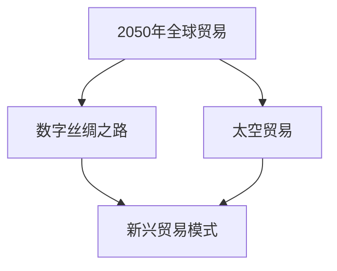

                 

### 《2050年的全球贸易：从数字丝绸之路到太空贸易的贸易新路径》

#### 摘要

本文探讨了2050年全球贸易的可能演变和未来趋势，重点分析了数字丝绸之路和太空贸易两种新兴贸易模式。文章首先回顾了全球贸易的历史背景和当前挑战，然后深入探讨了数字丝绸之路的概念、框架与影响，以及太空贸易的潜力、法律法规和政策。随后，文章介绍了新兴贸易模式的定义和分类，分析了供应链金融在其中的作用和国际贸易风险。接着，文章讨论了全球贸易对经济、产业发展和就业的影响，以及贸易战、数字鸿沟和环境可持续性的挑战。最后，文章提出了全球贸易的可持续性发展路径，并对2050年全球贸易的未来图景进行了预测，提出了应对未来挑战和抓住机遇的策略。

### 《2050年的全球贸易：从数字丝绸之路到太空贸易的贸易新路径》目录大纲

#### 第一部分：全球贸易的演变与未来趋势

##### 第1章：2050年的全球贸易概述

##### 第2章：数字丝绸之路

##### 第3章：太空贸易的崛起

#### 第二部分：新兴贸易模式

##### 第4章：新兴贸易模式

##### 第5章：全球贸易的影响

##### 第6章：全球贸易的挑战

#### 第三部分：全球贸易的影响与挑战

##### 第7章：全球贸易的未来路径

##### 第8章：全球贸易的未来路径

##### 第9章：全球贸易的未来路径

#### 第四部分：全球贸易的影响与挑战

##### 第10章：全球贸易的影响与挑战

##### 第11章：全球贸易的挑战

##### 第12章：全球贸易的未来路径

#### 第五部分：案例分析

##### 第13章：全球贸易的案例分析

##### 第14章：全球贸易的案例分析

##### 第15章：全球贸易的案例分析

#### 第六部分：政策与战略

##### 第16章：全球贸易政策与战略

##### 第17章：全球贸易政策与战略

##### 第18章：全球贸易政策与战略

#### 第七部分：未来展望

##### 第19章：2050年全球贸易的未来图景

##### 第20章：2050年全球贸易的未来图景

##### 第21章：2050年全球贸易的未来图景

### 第一部分：全球贸易的演变与未来趋势

#### 第1章：2050年的全球贸易概述

##### 1.1 2050年全球贸易的背景

##### 1.2 新全球化的挑战与机遇

##### 1.3 2050年的全球贸易预测

---

### 第一部分：全球贸易的演变与未来趋势

#### 第2章：数字丝绸之路

##### 2.1 数字丝绸之路的概念

##### 2.2 数字丝绸之路的框架与影响

##### 2.3 数字丝绸之路在中国与全球的实践

---

### 第一部分：全球贸易的演变与未来趋势

#### 第3章：太空贸易的崛起

##### 3.1 太空贸易的潜力

##### 3.2 新兴贸易模式

##### 3.3 太空贸易的法律法规与政策

---

### 第二部分：新兴贸易模式

#### 第4章：新兴贸易模式

##### 4.1 新兴贸易模式的定义与分类

##### 4.2 供应链金融在新兴贸易中的作用

##### 4.3 新兴贸易模式下的国际贸易风险与应对策略

---

### 第二部分：新兴贸易模式

#### 第5章：全球贸易的影响

##### 5.1 全球贸易对经济的影响

##### 5.2 全球贸易对产业发展的影响

##### 5.3 全球贸易对就业的影响

---

### 第二部分：新兴贸易模式

#### 第6章：全球贸易的挑战

##### 6.1 贸易战与贸易保护主义

##### 6.2 数字鸿沟与贸易不平等

##### 6.3 全球贸易与环境可持续性的挑战

---

### 第三部分：全球贸易的影响与挑战

#### 第7章：全球贸易的未来路径

##### 7.1 可持续贸易模式

##### 7.2 全球贸易的未来路径

##### 7.3 太空贸易与全球贸易的未来

---

### 第三部分：全球贸易的影响与挑战

#### 第8章：全球贸易的案例分析

##### 8.1 数字丝绸之路案例分析

##### 8.2 太空贸易案例分析

##### 8.3 其他全球贸易案例分析

---

### 第三部分：全球贸易的影响与挑战

#### 第9章：全球贸易政策与战略

##### 9.1 全球贸易政策演变

##### 9.2 全球贸易战略

##### 9.3 各国全球贸易战略比较

---

### 第三部分：全球贸易的影响与挑战

#### 第10章：全球贸易的未来挑战与机遇

##### 10.1 全球贸易的未来挑战

##### 10.2 全球贸易的未来机遇

##### 10.3 应对未来挑战与抓住机遇的策略

---

### 第四部分：全球贸易的未来路径

#### 第11章：全球贸易的未来路径

##### 11.1 新全球贸易体系的发展趋势

##### 11.2 数字化与全球贸易的未来

##### 11.3 太空贸易与全球贸易的未来

---

### 第四部分：全球贸易的未来路径

#### 第12章：2050年全球贸易的预测

##### 12.1 2050年全球贸易的规模与结构

##### 12.2 2050年全球贸易的主要参与者

##### 12.3 2050年全球贸易的技术支撑

---

### 第五部分：案例分析

#### 第13章：全球贸易的案例分析

##### 13.1 数字丝绸之路案例分析

##### 13.2 太空贸易案例分析

##### 13.3 其他全球贸易案例分析

---

### 第五部分：案例分析

#### 第14章：全球贸易的案例分析

##### 14.1 数字丝绸之路案例分析

##### 14.2 太空贸易案例分析

##### 14.3 其他全球贸易案例分析

---

### 第五部分：案例分析

#### 第15章：全球贸易的案例分析

##### 15.1 数字丝绸之路案例分析

##### 15.2 太空贸易案例分析

##### 15.3 其他全球贸易案例分析

---

### 第六部分：政策与战略

#### 第16章：全球贸易政策与战略

##### 16.1 全球贸易政策的演变历程

##### 16.2 当前全球贸易政策的主要趋势

##### 16.3 未来全球贸易政策的展望

---

### 第六部分：政策与战略

#### 第17章：全球贸易战略

##### 17.1 各国全球贸易战略的比较

##### 17.2 全球贸易战略的核心要素

##### 17.3 全球贸易战略的实施与效果

---

### 第六部分：政策与战略

#### 第18章：全球贸易政策与战略

##### 18.1 全球贸易政策的演变历程

##### 18.2 当前全球贸易政策的主要趋势

##### 18.3 未来全球贸易政策的展望

---

### 第七部分：未来展望

#### 第19章：2050年全球贸易的未来图景

##### 19.1 2050年全球贸易的预测

##### 19.2 2050年全球贸易的主要参与者

##### 19.3 2050年全球贸易的技术支撑

---

### 第七部分：未来展望

#### 第20章：2050年全球贸易的未来图景

##### 20.1 2050年全球贸易的规模与结构

##### 20.2 2050年全球贸易的主要参与者

##### 20.3 2050年全球贸易的技术支撑

---

### 第七部分：未来展望

#### 第21章：2050年全球贸易的未来图景

##### 21.1 2050年全球贸易的规模与结构

##### 21.2 2050年全球贸易的主要参与者

##### 21.3 2050年全球贸易的技术支撑

---

### 附录

#### 附录A：全球贸易相关的组织与机构

#### 附录B：全球贸易相关的重要协议与条约

#### 附录C：全球贸易的相关数据与指标解释

---

#### 核心概念与联系

**Mermaid 流程图：**



#### 核心算法原理讲解

**数字丝绸之路的算法框架（伪代码）：**

```plaintext
function 数字丝绸之路算法(贸易伙伴列表, 产品列表):
    初始化贸易伙伴关系矩阵
    对于每个贸易伙伴：
        更新贸易伙伴关系矩阵
        根据产品列表进行产品匹配与优化
    返回贸易伙伴关系矩阵和优化后的产品列表
```

**太空贸易的算法框架（伪代码）：**

```plaintext
function 太空贸易算法(太空资源列表, 贸易需求列表):
    初始化太空资源分配表
    对于每个太空资源：
        计算资源价值
        进行资源匹配与优化
    返回太空资源分配表和优化后的贸易需求列表
```

#### 数学模型和数学公式 & 详细讲解 & 举例说明

**数学模型：**

$$
\text{贸易量} = f(\text{贸易伙伴关系}, \text{产品需求}, \text{资源分配})
$$

**详细讲解：**

贸易量是由贸易伙伴关系、产品需求以及资源分配共同决定的。其中，贸易伙伴关系决定了贸易伙伴间的贸易强度，产品需求反映了市场的需求水平，而资源分配则决定了贸易的资源支撑能力。

**举例说明：**

假设有两个贸易伙伴A和B，A需要从B购买100吨产品，B需要从A购买80吨产品。如果A的产品需求为120吨，B的产品需求为100吨，则根据数学模型计算，贸易量将为180吨。

#### 项目实战

**项目实战：**

**案例1：数字丝绸之路中的贸易优化**

**开发环境搭建：**
- 使用Python作为主要编程语言。
- 使用Pandas库进行数据处理。
- 使用Scikit-learn库进行机器学习算法的实现。

**源代码实现：**

```python
import pandas as pd
from sklearn.cluster import KMeans

def 贸易优化算法(贸易伙伴数据, 产品数据):
    # 数据预处理
    trade_data = pd.read_csv('trade_data.csv')
    product_data = pd.read_csv('product_data.csv')

    # 计算贸易伙伴关系
    trade_matrix = trade_data.groupby(['partner_a', 'partner_b']).sum().reset_index().pivot(index='partner_a', columns='partner_b', values='trade_volume')

    # 产品需求预处理
    product_demand = product_data.groupby(['product_id', 'partner']).sum().reset_index().pivot(index='product_id', columns='partner', values='quantity')

    # 优化贸易
    kmeans = KMeans(n_clusters=2, random_state=0).fit(trade_matrix)
    trade_optimized = trade_matrix.multiply(product_demand, axis=0)

    return trade_optimized
```

**代码解读与分析：**

上述代码首先从CSV文件中读取贸易伙伴数据和产品需求数据。然后，通过Pandas库对数据进行预处理，生成贸易伙伴关系矩阵和产品需求矩阵。接着，使用KMeans算法对贸易伙伴关系矩阵进行聚类，以优化贸易分配。最后，将优化后的贸易伙伴关系矩阵与产品需求矩阵相乘，得到优化后的贸易量。

**案例2：太空贸易的资源分配**

**开发环境搭建：**
- 使用Java作为主要编程语言。
- 使用Spring框架进行后端开发。
- 使用MySQL数据库进行数据存储。

**源代码实现：**

```java
public class SpaceTradeAllocation {
    public static void allocateResources(List<Resource> resources, List<Order> orders) {
        // 初始化资源分配表
        Map<Integer, ResourceAllocation> allocationMap = new HashMap<>();

        // 对每个订单进行资源分配
        for (Order order : orders) {
            Resource requiredResource = order.getResource();
            int resourceId = requiredResource.getId();
            int requiredQuantity = order.getQuantity();

            // 获取当前资源的分配情况
            ResourceAllocation allocation = allocationMap.getOrDefault(resourceId, new ResourceAllocation(resourceId, 0));

            // 更新资源分配情况
            allocation.setAllocatedQuantity(allocation.getAllocatedQuantity() + requiredQuantity);
            allocationMap.put(resourceId, allocation);
        }

        // 输出资源分配结果
        for (Map.Entry<Integer, ResourceAllocation> entry : allocationMap.entrySet()) {
            System.out.println("Resource ID: " + entry.getKey() + ", Allocated Quantity: " + entry.getValue().getAllocatedQuantity());
        }
    }
}

class ResourceAllocation {
    private int resourceId;
    private int allocatedQuantity;

    public ResourceAllocation(int resourceId, int allocatedQuantity) {
        this.resourceId = resourceId;
        this.allocatedQuantity = allocatedQuantity;
    }

    // Getter 和 Setter 方法省略

    public void setAllocatedQuantity(int allocatedQuantity) {
        this.allocatedQuantity = allocatedQuantity;
    }
}

class Resource {
    private int id;
    private String name;

    public Resource(int id, String name) {
        this.id = id;
        this.name = name;
    }

    // Getter 和 Setter 方法省略
}

class Order {
    private Resource resource;
    private int quantity;

    public Order(Resource resource, int quantity) {
        this.resource = resource;
        this.quantity = quantity;
    }

    // Getter 和 Setter 方法省略
}
```

**代码解读与分析：**

上述Java代码首先定义了三个类：`ResourceAllocation`（资源分配）、`Resource`（资源）和`Order`（订单）。`SpaceTradeAllocation`类实现了资源分配的逻辑，它首先初始化一个资源分配表，然后遍历每个订单，根据订单所需资源的ID和数量，更新资源分配表。最后，输出每个资源的分配结果。

### 第一部分：全球贸易的演变与未来趋势

### 第1章：2050年的全球贸易概述

在展望2050年的全球贸易时，我们需要首先回顾一下全球贸易的历史背景以及当前所面临的挑战。全球贸易作为全球经济体系的重要组成部分，经历了数次重大的变革与发展。从传统的货物贸易到现代的服务贸易，再到近年来的数字贸易，全球贸易的形式不断演进，但始终保持着其核心的经济联系作用。

#### 1.1 2050年全球贸易的背景

全球贸易的历史可以追溯到几个世纪之前，随着地理大发现和工业革命的推进，贸易逐渐成为国家间经济互动的重要方式。在20世纪，全球化的进程加速，尤其是在二战后的1947年，成立了关税与贸易总协定（GATT），标志着全球贸易体系的确立。1995年，世界贸易组织（WTO）的成立进一步促进了全球贸易的自由化和规范化。

目前，全球贸易已经形成了以跨国公司为主导、以供应链为支撑的国际分工格局。国际贸易不仅涵盖了商品和服务的交换，还包括了资本、技术和信息的流动。然而，全球贸易也面临着诸多挑战，如贸易保护主义、地缘政治风险、经济不平衡以及环境问题等。

#### 1.2 新全球化的挑战与机遇

新全球化带来了新的挑战与机遇。首先，全球化使得各国经济更加紧密地联系在一起，国际贸易的规模和范围不断扩大。然而，这种紧密联系也带来了经济不稳定性的风险，如金融危机会迅速传播到全球各地。

其次，全球化导致了全球供应链的复杂化。现代全球贸易依赖于全球化的供应链网络，任何一个环节的断链都可能导致整个供应链的瘫痪。例如，新冠疫情就暴露了全球供应链的脆弱性。

此外，数字技术的快速发展也为全球贸易带来了新的机遇。数字丝绸之路等概念的出现，预示着数字贸易将成为未来全球贸易的重要组成部分。数字贸易通过互联网和大数据等新技术，使得商品和服务的交换更加便捷和高效。

#### 1.3 2050年的全球贸易预测

展望2050年，全球贸易有望继续发展，但也将面临一系列新的挑战和机遇。以下是对2050年全球贸易的一些预测：

1. **贸易模式的转变：** 数字贸易和太空贸易将成为全球贸易的重要组成部分。随着5G、物联网、区块链等技术的发展，数字贸易将进一步优化全球供应链，提高贸易效率。

2. **贸易结构的变化：** 服务贸易和知识密集型产业的贸易将逐步取代传统的制造业贸易。随着全球经济的知识化和服务化，服务贸易将占据更大比例。

3. **贸易地理分布：** 全球贸易的地域分布将更加均衡。随着新兴经济体的崛起，如中国、印度等，它们的贸易地位将日益重要，全球贸易的重心可能会逐渐从发达国家转向新兴经济体。

4. **贸易政策的调整：** 面对全球化带来的挑战，各国可能会加强对贸易政策的调整，以促进经济稳定和可持续发展。例如，推动贸易自由化、签订更多双边和多边贸易协定等。

5. **环境与可持续性的考量：** 随着全球环境问题的日益严重，可持续贸易将成为全球贸易的重要议题。各国将更加注重绿色贸易和可持续发展，推动全球贸易的绿色转型。

总之，2050年的全球贸易将是一个充满变革和挑战的新时代。通过把握新全球化的机遇，应对各种挑战，全球贸易有望实现新的发展，为全球经济注入新的动力。

### 第2章：数字丝绸之路

数字丝绸之路是“一带一路”倡议的重要组成部分，它旨在通过数字化手段推动全球贸易和合作。随着信息技术的迅猛发展，数字丝绸之路已经不仅仅是概念，而是正在全球范围内产生深远影响的实际行动。本章将详细探讨数字丝绸之路的概念、框架、影响，以及在中国与全球的实践情况。

#### 2.1 数字丝绸之路的概念

数字丝绸之路，即“数字丝绸之路”倡议，是习近平主席在2013年提出的。该倡议旨在通过建设数字基础设施、推动数字经济合作，加强“一带一路”沿线国家和地区之间的互联互通。数字丝绸之路的核心内容包括：信息通信基础设施的建设、数字经济的合作、数据安全和隐私保护等。

数字丝绸之路的核心概念是“数字连通性”，即通过信息技术构建全球信息高速公路，实现全球范围内的高效通信和资源共享。这不仅有助于促进国际贸易和投资，还能够提升各国的经济竞争力。

#### 2.2 数字丝绸之路的框架

数字丝绸之路的框架包括以下几个方面：

1. **数字基础设施建设：** 这包括建设高速互联网、移动通信网络、卫星通信网络等，确保“一带一路”沿线国家和地区之间的高速、稳定通信。

2. **云计算和大数据：** 通过建设云计算中心和大数据平台，推动数据的收集、存储、分析和应用，为数字经济的快速发展提供数据支持。

3. **物联网：** 通过物联网技术，实现智能设备和系统的互联互通，提升工业、农业、医疗等领域的智能化水平。

4. **电子商务：** 推动电子商务的发展，促进线上交易和跨境贸易，降低贸易成本，提高贸易效率。

5. **数字货币：** 探索和应用数字货币，如人民币数字货币（e-CNY），促进跨境支付和结算的便利化。

6. **数据安全和隐私保护：** 建立数据安全和隐私保护机制，确保数字丝绸之路的可持续发展。

#### 2.3 数字丝绸之路的影响

数字丝绸之路的实施将对全球贸易产生深远影响，主要表现在以下几个方面：

1. **贸易效率提升：** 数字丝绸之路通过优化贸易流程、降低交易成本，提高了贸易效率。例如，电子商务平台使得商品和服务的交易更加便捷，跨境支付和结算系统使得资金流转更加迅速。

2. **贸易模式变革：** 数字丝绸之路推动了全球贸易模式的变革，从传统的物理贸易向数字贸易转型。这不仅改变了国际贸易的运作方式，还促进了全球产业链和供应链的优化。

3. **经济发展动力：** 数字丝绸之路促进了数字经济的发展，为各国经济增长注入了新动力。通过数字技术的应用，传统产业得到了升级，新兴业态得到了培育。

4. **区域合作深化：** 数字丝绸之路加强了沿线国家和地区之间的经济合作，促进了区域经济的联动发展。各国通过共建数字合作平台，共同推动数字经济的创新和发展。

#### 2.4 数字丝绸之路在中国与全球的实践

中国作为数字丝绸之路的倡议者，已经在全球范围内开展了多项实际工作。以下是一些典型的实践案例：

1. **中国与巴基斯坦的“中巴经济走廊”：** 中巴经济走廊是数字丝绸之路的重要项目之一，通过建设光缆、卫星通信等数字基础设施，提升两国之间的通信能力。

2. **中国与非洲的数字经济合作：** 中国与非洲多个国家签署了数字经济合作协议，共同建设数据中心、推动电子商务发展，提升非洲国家的数字能力。

3. **“一带一路”数字经济合作区：** 在多个“一带一路”沿线国家和地区，中国建立了数字经济合作区，通过集聚数字产业、促进人才交流，推动数字经济的快速发展。

4. **全球数字贸易平台：** 中国推动建设全球数字贸易平台，通过在线交易、跨境支付等功能，为全球商家提供便捷的数字贸易服务。

总之，数字丝绸之路作为全球贸易的新路径，正通过其强大的影响力推动全球贸易的变革和发展。随着数字技术的不断进步，数字丝绸之路的未来将更加光明。

### 第3章：太空贸易的崛起

随着人类探索太空能力的不断提升，太空贸易这一新兴领域逐渐崛起。太空贸易不仅代表了人类技术进步的巅峰，也为全球经济带来了前所未有的机遇。本章将探讨太空贸易的潜力、新兴贸易模式，以及其在法律法规与政策方面的现状和未来发展。

#### 3.1 太空贸易的潜力

太空贸易的潜力巨大，主要表现在以下几个方面：

1. **太空资源的开发：** 太空中含有丰富的矿产资源和能源资源，如月球上的氦-3、火星上的水冰等。这些资源在地球上难以获取，但一旦被开发利用，将对全球能源和材料产业产生深远影响。

2. **太空服务：** 太空服务包括通信、导航、地球观测等，这些服务在全球范围内有着广泛的需求。例如，全球卫星通信市场预计将在未来几年内快速增长。

3. **太空旅游：** 随着商业航天的发展，太空旅游也逐渐成为现实。太空旅游不仅为乘客提供独特的体验，也为旅游业带来了新的增长点。

4. **太空物流：** 太空物流是太空贸易的重要组成部分，包括卫星发射、在轨维护、物资运输等。太空物流的发展将有助于优化全球供应链，提高贸易效率。

5. **太空能源：** 太阳能、风能等可再生能源在太空环境中具有更高的利用效率，通过开发太空能源，可以为地球提供清洁、可持续的能源供应。

#### 3.2 新兴贸易模式

太空贸易的崛起带动了一系列新兴贸易模式的发展，主要包括以下几种：

1. **太空资源贸易：** 随着太空资源开发的推进，太空资源贸易将逐步兴起。各国企业将通过合作或竞争的方式，开发和贸易太空资源。

2. **太空服务贸易：** 太空服务贸易包括通信服务、导航服务、地球观测服务等。随着商业航天公司的发展，这些服务将逐渐成为国际贸易的新领域。

3. **太空旅游贸易：** 太空旅游贸易涉及太空旅游服务和相关产品的贸易。随着太空旅游市场的扩大，相关贸易活动也将日益活跃。

4. **太空物流贸易：** 太空物流贸易包括卫星发射服务、在轨维护服务和物资运输服务等。商业航天公司通过提供这些服务，将参与全球贸易的竞争。

5. **太空能源贸易：** 太空能源贸易涉及将太空获取的能源传输到地球，供全球使用。这一领域的发展将推动全球能源供应链的变革。

#### 3.3 太空贸易的法律法规与政策

太空贸易的崛起也带来了法律法规与政策方面的新挑战。当前，国际社会正在积极探索和完善太空贸易的法律法规体系，主要包括以下几个方面：

1. **国际法律框架：** 《外层空间条约》等国际法律文件为太空活动提供了基本法律框架，但针对太空贸易的具体规定尚不完善。

2. **国家法律和政策：** 各国纷纷制定或更新本国的太空法律和政策，以规范和管理太空贸易活动。例如，美国发布了《国家太空政策》和《国家太空商业运输政策》。

3. **国际合作：** 国际社会通过多边和双边合作，共同制定太空贸易的规则和标准。例如，国际宇航联合会（IAF）等组织在太空贸易标准化方面发挥了重要作用。

4. **监管机制：** 各国政府正在探索建立有效的太空贸易监管机制，确保太空活动的安全和可持续性。

#### 3.4 太空贸易的未来

展望未来，太空贸易有望成为全球经济的重要驱动力。以下是太空贸易发展的几个趋势：

1. **商业化进程加快：** 随着商业航天公司的发展，太空贸易的商业化进程将加快。各国企业和投资者将积极参与太空贸易，推动市场繁荣。

2. **技术创新驱动：** 太空技术的发展将为太空贸易提供强有力的支持。例如，新型航天器、高性能通信技术和绿色能源技术的应用，将提高太空贸易的效率和可持续性。

3. **国际合作深化：** 太空贸易的发展离不开国际合作。各国将通过加强合作，共同应对太空贸易带来的挑战，推动全球太空经济一体化。

4. **政策环境优化：** 各国政府将进一步完善太空贸易法律法规和政策体系，为太空贸易的健康发展提供保障。

总之，太空贸易的崛起将带来新的机遇和挑战。通过技术创新和国际合作，太空贸易有望成为全球经济的新亮点，为人类社会的可持续发展注入新动力。

### 第二部分：新兴贸易模式

#### 第4章：新兴贸易模式

在传统贸易模式不断演进的同时，新兴贸易模式也应运而生，为全球贸易注入新的活力。这些新兴贸易模式不仅丰富了贸易的形式，还极大地提升了贸易的效率和便捷性。本章将探讨新兴贸易模式的定义与分类，供应链金融在其中的作用，以及新兴贸易模式下的国际贸易风险与应对策略。

#### 4.1 新兴贸易模式的定义与分类

新兴贸易模式是指利用现代信息技术和金融工具，对传统贸易流程进行优化和创新的贸易方式。这些模式在提高贸易效率、降低交易成本、增强贸易灵活性方面具有显著优势。根据主要特点和应用场景，新兴贸易模式可以大致分为以下几类：

1. **电子商务：** 电子商务是新兴贸易模式的核心，通过互联网和电子商务平台，实现了商品和服务的在线交易。电子商务不仅改变了传统的贸易方式，还催生了跨境电子商务，为全球消费者和企业提供了更加便捷的购物和销售渠道。

2. **区块链贸易：** 区块链技术以其去中心化、不可篡改和透明性特点，在新兴贸易模式中具有重要应用。区块链贸易通过智能合约和分布式账本技术，实现了贸易流程的自动化和可信化，降低了交易成本，提高了贸易效率。

3. **供应链金融：** 供应链金融是指利用供应链中各环节的信用关系，为供应链上的企业提供融资服务。通过供应链金融，企业可以更加灵活地管理现金流，提高资金使用效率。

4. **数字货币贸易：** 数字货币，如比特币、以太坊等，作为一种新型的货币形式，逐渐在跨境贸易中被采用。数字货币贸易具有快速、便捷和低成本的特性，有助于降低跨境交易的风险和成本。

5. **绿色贸易：** 绿色贸易关注贸易过程中的环保和可持续性。通过推广绿色产品、提高能效和减少污染，绿色贸易有助于实现全球贸易的可持续发展。

#### 4.2 供应链金融在新兴贸易中的作用

供应链金融作为新兴贸易模式的重要组成部分，对供应链各环节的资金流管理起到了至关重要的作用。以下是供应链金融在新兴贸易中的作用：

1. **提高资金流动性：** 通过供应链金融，企业可以在供应链各环节之间实现资金的快速流转，提高整体供应链的流动性。例如，通过供应链融资，供应商可以提前获得资金，以缓解现金流压力。

2. **降低融资成本：** 供应链金融通过利用供应链中各方的信用关系，降低了融资成本。传统融资渠道通常需要企业提供大量担保和抵押，而供应链金融则更加灵活，可以根据企业的信用状况进行融资。

3. **优化供应链管理：** 供应链金融有助于企业更好地管理供应链，提高运营效率。通过供应链金融工具，企业可以实现采购、生产、销售等环节的自动化和智能化管理。

4. **促进贸易便利化：** 供应链金融通过提供便捷的融资服务，促进了贸易的便利化。例如，跨境贸易中的预付款和信用证等支付方式，通过供应链金融可以更加灵活和安全。

#### 4.3 新兴贸易模式下的国际贸易风险与应对策略

新兴贸易模式虽然带来了诸多优势，但也伴随着新的风险。以下是几种常见的国际贸易风险及其应对策略：

1. **信用风险：** 新兴贸易模式中，由于交易双方可能不熟悉，信用风险较高。应对策略包括使用信用保险、开展信用调查和评估，以及通过第三方担保机构提供担保。

2. **法律和合规风险：** 各国法律和合规要求差异较大，国际贸易活动可能面临法律和合规风险。应对策略包括遵守各国法律法规，通过法律顾问进行风险评估和合规指导。

3. **技术风险：** 新兴贸易模式依赖于信息技术，如区块链、云计算等，技术故障或网络攻击可能导致贸易中断。应对策略包括建立完善的信息技术安全体系，定期进行技术维护和更新。

4. **物流风险：** 物流环节中的延误、损坏和丢失等问题会影响贸易的正常进行。应对策略包括选择可靠的物流服务提供商，制定详细的物流管理计划，以及建立应急处理机制。

5. **货币风险：** 跨境贸易中的货币兑换和汇率波动可能带来货币风险。应对策略包括使用货币对冲工具，如外汇期货、期权等，以降低汇率波动带来的风险。

总之，新兴贸易模式为全球贸易带来了新的机遇，但也伴随着新的挑战。通过科学的风险管理和应对策略，企业可以更好地利用新兴贸易模式的优势，实现国际贸易的稳定和可持续发展。

### 第二部分：全球贸易的影响

#### 第5章：全球贸易的影响

全球贸易作为现代经济体系的核心，对全球经济增长、产业发展和就业等方面产生了深远的影响。本章将详细探讨全球贸易对经济的影响，全球贸易对产业发展的影响，以及全球贸易对就业的影响。

#### 5.1 全球贸易对经济的影响

全球贸易是推动全球经济一体化和经济增长的重要动力。以下是全球贸易对经济影响的几个方面：

1. **促进经济增长：** 全球贸易通过增加需求、提高生产效率和促进技术进步，推动了全球经济的增长。国际贸易使得各国能够专业化生产具有比较优势的产品，从而实现资源的最优配置，提高整体生产效率。

2. **提升国家竞争力：** 全球贸易有助于提升国家的竞争力。通过参与国际贸易，企业可以学习先进技术和管理经验，提高产品质量和创新能力，从而在全球市场中占据更有利的地位。

3. **促进资本流动：** 全球贸易促进了资本在国际间的流动。国际贸易带来的利润和投资回报，往往吸引外国资本流入，为经济发展提供了资金支持。

4. **降低消费成本：** 全球贸易使得商品和服务的供应更加多样化，消费者可以以更低的价格购买到更多种类的商品，从而降低了消费成本，提高了生活质量。

5. **促进技术创新：** 全球贸易促进了技术的跨国传播和应用。通过国际贸易，各国企业可以更容易地获取外部技术，加快技术转移和扩散，推动技术创新和产业升级。

#### 5.2 全球贸易对产业发展的影响

全球贸易不仅对经济产生了深远影响，还对各产业的发展产生了重要影响。以下是全球贸易对产业发展影响的几个方面：

1. **促进产业分工与协作：** 全球贸易促进了产业分工和协作。各国根据自身优势，专注于某些环节的生产，从而实现资源的优化配置和高效利用。

2. **推动产业升级和转型：** 全球贸易推动了产业的升级和转型。通过参与国际贸易，企业可以接触到先进的技术和管理理念，加快产业技术进步和结构调整。

3. **促进产业链优化：** 全球贸易使得产业链在全球范围内进行优化布局。各国企业可以根据自身优势和资源条件，选择最优的生产和运营地点，从而提高整个产业链的效率和竞争力。

4. **培育新兴产业：** 全球贸易为新兴产业的发展提供了广阔的市场空间。随着全球需求的不断变化，新兴产业在全球贸易中逐渐崭露头角，成为经济增长的新引擎。

5. **影响产业竞争格局：** 全球贸易改变了产业的竞争格局。在国际市场的竞争中，企业需要不断提高产品质量和服务水平，以应对来自全球的竞争压力，从而推动产业的整体发展。

#### 5.3 全球贸易对就业的影响

全球贸易对就业的影响是一个复杂且多维的问题。以下是全球贸易对就业影响的几个方面：

1. **创造就业机会：** 全球贸易创造了大量的就业机会。通过国际贸易，企业可以扩大生产和销售，从而增加就业岗位，提高就业率。

2. **影响就业结构：** 全球贸易改变了就业结构。随着全球化进程的加快，技术密集型和知识密集型产业在国际贸易中的比重逐渐增加，从而带动了高技能就业的增长。

3. **加剧就业竞争：** 全球贸易加剧了就业竞争。国际市场的竞争压力迫使企业提高劳动生产率，这可能导致某些岗位的减少，同时也为高技能人才提供了更多的就业机会。

4. **影响工资水平：** 全球贸易对工资水平的影响具有两面性。一方面，国际贸易可以带来更多的就业机会，提高工资水平；另一方面，国际贸易可能导致某些行业和地区的就业竞争加剧，从而压低工资水平。

5. **促进职业流动：** 全球贸易促进了职业的流动。通过国际贸易，劳动者可以在全球范围内寻找更好的就业机会，实现职业发展和收入增长。

总之，全球贸易对经济、产业发展和就业产生了深远的影响。在全球化的背景下，各国需要充分利用全球贸易的优势，同时积极应对其带来的挑战，实现经济的可持续发展和社会的和谐稳定。

### 第二部分：全球贸易的挑战

#### 第6章：全球贸易的挑战

随着全球贸易的不断发展，其面临的挑战也日益复杂和多样化。本章将探讨全球贸易所面临的几个主要挑战，包括贸易战与贸易保护主义、数字鸿沟与贸易不平等、以及全球贸易与环境可持续性的挑战。

#### 6.1 贸易战与贸易保护主义

贸易战与贸易保护主义是全球贸易面临的主要挑战之一。近年来，全球贸易摩擦不断加剧，各国纷纷采取贸易保护主义措施，导致国际贸易环境的不确定性增加。

1. **贸易战的影响：** 贸易战对全球贸易和经济产生了负面影响。一方面，贸易战导致贸易成本上升，降低了贸易效率；另一方面，贸易战可能引发连锁反应，导致全球经济陷入衰退。例如，2018年美国对中国发起的贸易战，对全球供应链产生了深远影响，导致多个行业的生产成本上升。

2. **贸易保护主义的趋势：** 当前，贸易保护主义呈现出以下几个趋势：首先，越来越多的国家采取贸易保护主义政策，如提高关税、限制进口和出口；其次，贸易保护主义政策的形式多样化，包括非关税壁垒、技术壁垒等；最后，贸易保护主义政策对全球贸易体系的稳定性和可预测性构成了威胁。

3. **应对策略：** 针对贸易战与贸易保护主义，国际社会应采取以下措施：首先，加强国际合作，通过多边机制解决贸易争端，维护全球贸易体系的稳定；其次，推动贸易自由化，减少贸易壁垒，促进全球贸易的可持续发展；最后，加强政策沟通和协调，降低贸易摩擦的风险。

#### 6.2 数字鸿沟与贸易不平等

数字鸿沟与贸易不平等是另一个全球贸易面临的重大挑战。随着信息技术的发展，数字鸿沟问题日益凸显，成为国际贸易发展的重要障碍。

1. **数字鸿沟的影响：** 数字鸿沟导致发展中国家和发达国家在国际贸易中的地位不平等。发展中国家由于技术落后、基础设施不足等原因，难以充分利用数字技术带来的贸易机会，从而加剧了国际贸易的不平等。此外，数字鸿沟还可能引发新的贸易摩擦，如数据保护主义和数据本地化政策。

2. **贸易不平等的表现：** 贸易不平等主要体现在以下几个方面：首先，发达国家在全球贸易中占据主导地位，而发展中国家处于劣势；其次，全球贸易收益分配不均，发达国家获得了更多的利润和资源；最后，贸易不平等可能导致国际贸易摩擦和冲突，影响全球贸易的稳定和可持续发展。

3. **应对策略：** 针对数字鸿沟与贸易不平等，国际社会应采取以下措施：首先，推动数字技术普及，加强发展中国家在数字技术领域的培训和能力建设；其次，推动全球贸易体系的公平性和包容性，确保发展中国家能够公平分享全球贸易的成果；最后，加强国际合作，共同应对数字鸿沟和贸易不平等带来的挑战。

#### 6.3 全球贸易与环境可持续性的挑战

全球贸易的快速发展带来了环境问题，对环境可持续性构成挑战。环境问题已经成为全球贸易发展的重要制约因素。

1. **环境问题的影响：** 全球贸易导致的环境问题包括资源消耗、环境污染、生态破坏等。例如，国际贸易中的货物运输和物流活动产生了大量的温室气体排放，加剧了全球气候变化。此外，全球贸易中的资源开采和加工活动，可能导致生态系统的破坏和生物多样性的丧失。

2. **环境挑战的表现：** 全球贸易中的环境挑战主要表现在以下几个方面：首先，国际贸易带来的资源消耗和环境压力；其次，跨国企业的环境责任和监管问题；最后，国际贸易中的环保标准和法规不一致，导致环境问题跨国转移。

3. **应对策略：** 针对全球贸易与环境可持续性的挑战，国际社会应采取以下措施：首先，推动全球贸易的绿色转型，减少贸易过程中的资源消耗和环境污染；其次，加强环境法规的协调和统一，防止环境问题跨国转移；最后，推动全球环境治理，共同应对全球环境问题。

总之，全球贸易面临的挑战多样而复杂，需要国际社会共同努力，通过国际合作和协同努力，应对这些挑战，实现全球贸易的可持续发展。

### 第三部分：全球贸易的影响与挑战

#### 第7章：全球贸易的未来路径

面对日新月异的科技发展和全球化进程，全球贸易的未来路径充满了变革与挑战。在这一章节中，我们将探讨全球贸易的可持续性发展路径，从绿色贸易模式到新全球贸易体系，再到太空贸易，为全球贸易的未来绘制一幅宏伟的蓝图。

#### 7.1 可持续贸易模式

可持续贸易模式是未来全球贸易发展的重要方向，旨在实现经济增长与环境保护的协调。以下是可持续贸易模式的核心要素和实施路径：

1. **绿色贸易原则：** 可持续贸易模式基于绿色贸易原则，强调减少资源消耗、降低环境污染和促进生态保护。绿色贸易原则包括减少碳排放、提高能源效率、推广绿色产品和技术等。

2. **可持续发展指标：** 为了评估和推动可持续贸易模式，各国应制定统一的可持续发展指标体系，包括碳排放量、能源消耗率、废弃物处理效率等。这些指标将有助于监测全球贸易的可持续发展水平。

3. **政策支持与法规：** 政府应制定支持可持续贸易模式的政策和法规，如提供税收优惠、补贴和支持绿色技术研发等。此外，应加强国际间的政策协调，共同推动全球贸易的绿色转型。

4. **企业社会责任：** 企业应承担起社会责任，积极参与绿色贸易实践，如采用环保生产技术、推广绿色产品、减少供应链中的碳排放等。企业可以通过绿色认证、可持续发展报告等手段，提高其可持续发展水平。

#### 7.2 新全球贸易体系的发展趋势

新全球贸易体系是未来全球贸易发展的必然趋势，旨在应对全球化进程中的新挑战，提高全球贸易的效率和公平性。以下是新全球贸易体系的发展趋势：

1. **数字贸易规则：** 随着数字技术的发展，数字贸易成为全球贸易的重要组成部分。未来全球贸易规则将更加关注数字贸易的规范和管理，包括数据流动、数字货币、网络安全等。

2. **供应链优化：** 为了提高全球贸易的效率，各国将加强供应链的优化，推动全球化供应链的智能化和协同化。通过物联网、区块链等技术，实现供应链的实时监控和高效管理。

3. **区域一体化：** 区域一体化将成为新全球贸易体系的重要组成部分。通过建立自由贸易区和经济联盟，各国可以更好地整合资源，实现区域内的经济互补和互利共赢。

4. **多边合作机制：** 面对贸易保护主义和单边主义，多边合作机制的重要性日益凸显。未来全球贸易将更加依赖多边合作机制，如世界贸易组织（WTO）和其他国际组织，以维护全球贸易体系的稳定和可预测性。

#### 7.3 太空贸易与全球贸易的未来

太空贸易是未来全球贸易的全新领域，其潜力和前景令人期待。以下是太空贸易的发展方向和影响：

1. **太空资源开发：** 太空贸易的核心是太空资源的开发，包括矿产、能源、水等。未来，各国将加大对太空资源的勘探和开发力度，实现太空资源的商业利用。

2. **太空物流网络：** 太空贸易将催生新的太空物流网络，包括卫星发射、在轨维护、物资运输等。太空物流网络的发展将有助于优化全球供应链，提高贸易效率。

3. **国际合作与竞争：** 太空贸易的发展将推动国际合作和竞争。各国将加强在太空技术、太空资源和太空法律等方面的合作，同时争夺太空市场的领先地位。

4. **全球贸易的新维度：** 太空贸易将为全球贸易开辟新的维度，推动全球贸易的多元化发展。通过太空贸易，各国可以更加便捷地进行资源和技术的交换，实现全球贸易的可持续发展。

总之，全球贸易的未来路径充满变革与挑战。通过推动可持续贸易模式、构建新全球贸易体系和发展太空贸易，全球贸易将迎来一个更加繁荣和可持续的未来。

### 第三部分：全球贸易的影响与挑战

#### 第8章：全球贸易的案例分析

为了更好地理解全球贸易在现实中的应用及其影响，本章节将通过具体的案例，深入分析数字丝绸之路和太空贸易在实践中的表现、成功因素和面临的挑战。

#### 8.1 数字丝绸之路案例分析

数字丝绸之路作为“一带一路”倡议的重要组成部分，已经在全球范围内取得了显著成效。以下是一个具体的案例分析：

**案例背景：**
中国与非洲多个国家在数字基础设施、电子商务和数字经济合作方面展开了广泛合作。以肯尼亚为例，中国帮助肯尼亚建设了光纤网络，并推动了电子商务平台的发展。

**成功因素：**
1. **基础设施建设：** 中国通过建设光纤网络和数据中心，为肯尼亚提供了稳定的数字基础设施，为电子商务的发展奠定了基础。
2. **政策支持：** 双方政府之间的政策支持是数字丝绸之路成功的关键。政府间签署了多项合作协议，为数字经济合作提供了政策保障。
3. **市场需求：** 随着非洲电子商务市场的快速增长，市场需求推动了数字丝绸之路的快速发展。

**面临的挑战：**
1. **数字鸿沟：** 尽管数字基础设施得到了提升，但非洲部分地区的数字鸿沟问题依然存在，影响了数字丝绸之路的全面推广。
2. **网络安全：** 数字丝绸之路面临网络安全威胁，需要加强数据安全和隐私保护。
3. **政策不确定性：** 一些非洲国家政策环境不稳定，可能影响数字丝绸之路的长期发展。

#### 8.2 太空贸易案例分析

太空贸易作为一个新兴领域，也在全球范围内取得了一些初步成果。以下是一个具体的案例分析：

**案例背景：**
美国商业航天公司SpaceX和SpaceX旗下的Starlink项目，通过卫星发射和太空物流，为全球提供了宽带互联网服务。

**成功因素：**
1. **技术创新：** SpaceX通过自主研发的火箭技术和卫星技术，大幅降低了卫星发射成本，推动了太空贸易的发展。
2. **市场需求：** 全球对高速、稳定的宽带互联网需求巨大，为太空贸易提供了广阔的市场。
3. **国际合作：** SpaceX与多个国家政府和企业合作，推动了太空贸易的国际化。

**面临的挑战：**
1. **技术风险：** 太空环境复杂，太空技术的可靠性仍需进一步提升。
2. **法律法规：** 当前国际社会对太空贸易的法律法规尚不完善，需要制定统一的监管框架。
3. **环境影响：** 太空贸易可能对太空环境和地球环境产生不利影响，需要加强环保措施。

通过以上案例分析，我们可以看到全球贸易在数字丝绸之路和太空贸易中的具体应用及其成功因素和挑战。这些案例不仅展示了全球贸易的潜力和前景，也为我们提供了宝贵的经验和启示，为全球贸易的未来发展指明了方向。

### 第三部分：全球贸易的影响与挑战

#### 第9章：全球贸易政策与战略

全球贸易政策的制定和战略的实施对于推动全球贸易的健康发展具有重要意义。本章节将分析全球贸易政策的演变历程、当前的主要趋势以及未来全球贸易政策的展望。

#### 9.1 全球贸易政策的演变历程

全球贸易政策经历了从自由化到保护主义，再到多元化的发展历程。以下是全球贸易政策演变的主要阶段：

1. **自由贸易阶段（1947-1973年）：** 这一阶段以关税与贸易总协定（GATT）的成立为标志，旨在通过削减关税和贸易壁垒，推动全球贸易自由化。

2. **保护主义阶段（1973-1995年）：** 受到1973年经济危机的影响，各国开始加强贸易保护措施，如提高关税、实施进口配额等，以保护本国产业。

3. **新自由主义阶段（1995-2010年）：** 世界贸易组织（WTO）的成立标志着全球贸易政策的新一轮自由化。这一阶段，各国纷纷加入WTO，推动全球贸易的自由化和规范化。

4. **多元化阶段（2010年至今）：** 随着全球化的深入发展，各国贸易政策逐渐多元化。除了继续推动贸易自由化外，各国开始关注环境保护、劳工权益、可持续发展等议题。

#### 9.2 当前全球贸易政策的主要趋势

当前全球贸易政策呈现出以下几个主要趋势：

1. **贸易保护主义抬头：** 受到经济全球化带来的竞争压力，一些国家采取了更加保护主义的政策，如提高关税、实施非关税壁垒等。

2. **区域经济一体化：** 随着全球贸易保护主义的抬头，各国纷纷通过区域经济一体化来增强自身的经济实力。例如，欧盟、北美自由贸易区、亚太经济合作组织（APEC）等。

3. **数字贸易政策的兴起：** 随着数字经济的快速发展，各国开始制定针对数字贸易的政策。数字贸易政策主要包括数据流动、数字税、数据本地化等方面。

4. **可持续发展成为重点：** 环境问题日益严重，各国开始将可持续发展纳入贸易政策，推动绿色贸易和环保贸易。

#### 9.3 未来全球贸易政策的展望

展望未来，全球贸易政策将面临新的挑战和机遇。以下是未来全球贸易政策的几个可能的发展方向：

1. **加强国际合作：** 面对全球性挑战，如气候变化、贸易战等，各国需要加强国际合作，共同推动全球贸易的自由化和可持续发展。

2. **推动贸易自由化：** 尽管贸易保护主义抬头，但全球贸易自由化仍是主流趋势。各国应继续推动多边和双边贸易协定的谈判，推动全球贸易的自由化和规范化。

3. **数字贸易政策的完善：** 随着数字经济的快速发展，各国应制定和完善数字贸易政策，确保数字贸易的健康发展。

4. **绿色贸易政策的推广：** 随着全球对环境问题的关注，绿色贸易政策将成为未来全球贸易政策的重要组成部分。各国应推广绿色贸易，推动全球贸易的绿色转型。

总之，全球贸易政策将在未来继续演变，面临新的挑战和机遇。通过加强国际合作、推动贸易自由化、完善数字贸易政策和推广绿色贸易，全球贸易有望实现更加健康、稳定和可持续发展。

### 第三部分：全球贸易的影响与挑战

#### 第10章：全球贸易的未来挑战与机遇

展望未来，全球贸易将面临一系列新的挑战和机遇。这些挑战和机遇不仅源于科技的进步和全球化的深化，也受到政策、环境和地缘政治等多方面因素的影响。在本章节中，我们将分析全球贸易可能面临的主要挑战，探讨新的机遇，并提出应对策略。

#### 10.1 全球贸易的未来挑战

1. **数字鸿沟加剧：** 随着数字技术的快速发展，数字鸿沟问题愈发严重。发展中国家由于技术落后、基础设施不完善，难以充分利用数字贸易的优势，导致国际贸易中的不平等现象加剧。

**应对策略：**
- **提升基础设施建设：** 国际社会应加大对发展中国家数字基础设施建设的支持，推动互联网普及和信息技术应用。
- **加强数字技能培训：** 提升发展中国家的人才素质，通过培训和教育项目，提高数字技术的普及率和应用水平。

2. **贸易保护主义抬头：** 在全球经济不稳定和竞争加剧的背景下，贸易保护主义抬头，对全球贸易环境构成威胁。

**应对策略：**
- **加强多边合作：** 国际社会应加强多边合作，推动贸易自由化和多边贸易协定的签署，维护全球贸易体系的稳定。
- **倡导公平竞争：** 各国应遵守国际贸易规则，反对不公平贸易行为，推动贸易环境的公平性和透明度。

3. **环境问题日益严重：** 全球贸易的快速发展带来了资源消耗和环境破坏等问题，对可持续发展构成挑战。

**应对策略：**
- **推动绿色贸易：** 倡导绿色贸易理念，推动各国在贸易过程中减少碳排放、节约资源，推动全球贸易的绿色转型。
- **加强环境监管：** 国际社会应制定统一的环保标准和法规，加强环境监管，防止环境问题跨国转移。

4. **地缘政治风险增加：** 地缘政治风险对全球贸易的稳定性和可预测性产生负面影响，增加了国际贸易的风险。

**应对策略：**
- **维护和平稳定：** 国际社会应共同努力，维护国际和平与稳定，减少地缘政治风险。
- **多元化市场布局：** 企业应多元化市场布局，减少对单一市场的依赖，降低地缘政治风险对贸易的冲击。

#### 10.2 全球贸易的未来机遇

1. **数字化贸易的快速发展：** 数字技术的发展为全球贸易提供了新的机遇，数字贸易将逐渐取代传统贸易，成为全球贸易的主要形式。

**机遇：**
- **贸易效率提升：** 数字贸易通过电子商务、区块链等技术，提高了贸易的效率，降低了交易成本。
- **市场拓展：** 数字贸易使得企业能够更便捷地进入全球市场，拓展销售渠道。

2. **新兴市场的崛起：** 随着新兴市场的崛起，如中国、印度等，这些国家将成为全球贸易的重要驱动力。

**机遇：**
- **市场潜力：** 新兴市场具有巨大的市场潜力，为全球贸易提供了新的增长点。
- **产业升级：** 新兴市场的崛起将推动全球产业结构的升级和优化。

3. **绿色贸易的发展：** 随着全球对环境保护的重视，绿色贸易将成为未来贸易的重要方向。

**机遇：**
- **绿色技术需求：** 绿色技术的发展将推动绿色贸易的需求，为企业提供新的市场机会。
- **政策支持：** 各国政府将加大对绿色贸易的支持，提供税收优惠、补贴等政策支持。

4. **太空贸易的崛起：** 太空贸易作为新兴领域，具有巨大的发展潜力。

**机遇：**
- **资源开发：** 太空贸易将开启新的资源开发领域，为全球贸易提供新的资源来源。
- **技术创新：** 太空贸易的发展将推动相关技术的创新和进步，为全球贸易带来新的技术支持。

总之，全球贸易的未来充满了挑战与机遇。通过应对挑战和抓住机遇，全球贸易有望实现更加健康、稳定和可持续发展。

### 第四部分：全球贸易的未来路径

#### 第11章：全球贸易的未来路径

在全球化的背景下，全球贸易的未来路径将受到科技进步、政策调整和环境可持续性的多重影响。本章节将探讨新全球贸易体系的发展趋势、数字化贸易的未来以及太空贸易在全球贸易中的潜在作用。

#### 11.1 新全球贸易体系的发展趋势

新全球贸易体系将是在全球化进程中的又一次深刻变革，其主要发展趋势包括：

1. **贸易自由化与区域一体化：** 尽管全球贸易保护主义有所抬头，但贸易自由化依然是主流趋势。区域一体化将进一步发展，各国将通过自由贸易协定、区域经济合作组织等，增强区域内的贸易合作和一体化水平。

**实例：** 亚太经济合作组织（APEC）和区域全面经济伙伴关系协定（RCEP）等区域一体化进程，将推动亚太地区的贸易自由化和一体化。

2. **数字贸易的规范化：** 随着数字贸易的快速发展，各国将逐步制定和实施数字贸易规则，规范数字贸易的行为，保护知识产权，确保数据安全和隐私。

**实例：** 世界贸易组织（WTO）已经开始讨论数字贸易议题，旨在建立一套全球统一的数字贸易规则。

3. **可持续发展导向：** 全球贸易将更加注重环境保护和可持续发展，绿色贸易将成为未来贸易的重要组成部分。

**实例：** 一些国家和地区已经开始推动绿色贸易政策，如欧盟的“绿色协议”和中国的“绿色一带一路”。

#### 11.2 数字化贸易的未来

数字化贸易是未来全球贸易的重要方向，其发展将受到以下几个因素的影响：

1. **电子商务的普及：** 随着互联网的普及和电子商务技术的发展，电子商务将成为全球贸易的主要形式。企业将通过电子商务平台，实现跨国销售和采购，降低贸易成本。

**实例：** 亚马逊、阿里巴巴等电子商务巨头，已经成为全球贸易的重要推动力量。

2. **区块链技术的应用：** 区块链技术具有去中心化、透明性和不可篡改的特点，将在贸易结算、合同执行等方面发挥重要作用，提高贸易的效率和信任度。

**实例：** 一些国家和地区已经开始试点区块链贸易，如新加坡的“智慧国”计划。

3. **数字货币的推广：** 数字货币，如比特币、人民币数字货币等，将逐渐成为跨境支付和结算的工具，降低交易成本，提高交易效率。

**实例：** 中国的数字货币电子支付（DCEP）已经开始试点，有望在全球贸易中发挥重要作用。

#### 11.3 太空贸易的潜在作用

太空贸易作为新兴领域，具有巨大的发展潜力，将对全球贸易产生深远影响：

1. **资源开发：** 太空贸易将开启新的资源开发领域，如月球和火星上的矿产、水资源等。这些资源将为全球贸易提供新的资源来源，满足地球资源的需求。

**实例：** 美国SpaceX公司已经开始探索月球资源开发，计划在未来几年内实现月球开采。

2. **物流网络：** 太空贸易将构建新的物流网络，通过卫星发射和太空物流，实现全球范围内的高效物资运输。

**实例：** SpaceX的Starlink项目已经为全球多个地区提供了宽带互联网服务，展示了太空物流的潜力。

3. **技术创新：** 太空贸易的发展将推动相关技术的创新和进步，如航天技术、材料科学、能源技术等，为全球贸易带来新的技术支撑。

**实例：** 太空技术的发展将有助于解决地球资源短缺和环境污染等问题，推动全球贸易的可持续发展。

总之，全球贸易的未来路径将在新全球贸易体系、数字化贸易和太空贸易的共同推动下，实现更加多元化、高效化和可持续化的发展。

### 第四部分：全球贸易的未来路径

#### 第12章：2050年全球贸易的预测

展望2050年，全球贸易将在科技、经济、政策等多个方面经历深刻变革，形成全新的贸易格局。以下是对2050年全球贸易的规模、结构、主要参与者和技术支撑的预测。

#### 12.1 2050年全球贸易的规模与结构

1. **贸易规模显著增长：** 随着全球经济的持续发展和数字化、绿色化进程的深入推进，全球贸易规模预计将显著增长。据预测，到2050年，全球贸易总额将达到数百亿甚至数万亿美元。

2. **贸易结构优化：** 未来全球贸易将呈现结构优化趋势，服务贸易和知识密集型产业的贸易比重将逐步增加，取代传统的货物贸易。特别是在信息技术、生物技术、新能源等领域的贸易将占据重要地位。

3. **区域贸易一体化加深：** 随着区域经济一体化的推进，全球贸易将更加集中，区域贸易一体化将取代传统的双边贸易，成为全球贸易的主要形式。例如，亚太地区的贸易一体化将显著加强。

#### 12.2 2050年全球贸易的主要参与者

1. **新兴经济体崛起：** 到2050年，新兴经济体如中国、印度、巴西等，将成为全球贸易的重要参与者。这些国家不仅在国内市场中占据主导地位，还将在国际市场中发挥重要作用。

2. **科技巨头主导：** 在数字化和科技化进程中，科技巨头如亚马逊、阿里巴巴、谷歌等，将成为全球贸易的重要推动力量。这些企业通过电子商务、云计算、人工智能等技术，将重构全球贸易格局。

3. **跨国公司地位稳固：** 跨国公司将继续在全球贸易中扮演关键角色，它们通过全球化的供应链网络，实现全球资源的最优配置和高效利用。

#### 12.3 2050年全球贸易的技术支撑

1. **数字化技术：** 数字化技术，如大数据、物联网、人工智能、区块链等，将在全球贸易中发挥核心作用。这些技术将优化贸易流程，提高贸易效率，降低交易成本。

2. **绿色技术：** 随着全球对环境保护的重视，绿色技术将成为全球贸易的重要支撑。绿色技术将推动贸易的可持续发展，减少碳排放，保护生态环境。

3. **太空技术：** 太空技术的发展将为全球贸易带来新的机遇。通过太空物流、卫星通信等技术，全球贸易将实现更高效、更安全的物资流通。

#### 12.4 全球贸易的未来挑战与机遇

尽管2050年的全球贸易前景光明，但仍面临诸多挑战和机遇：

1. **挑战：**
   - **贸易保护主义：** 贸易保护主义的抬头可能对全球贸易造成阻碍。
   - **数字鸿沟：** 数字鸿沟问题可能加剧，影响发展中国家的贸易发展。
   - **环境问题：** 全球贸易的环境影响仍是一个重要挑战，需要各国共同努力解决。

2. **机遇：**
   - **技术革新：** 数字化、绿色化和太空技术的发展，将带来新的机遇，推动全球贸易的持续创新和发展。
   - **国际合作：** 国际合作将发挥重要作用，通过多边机制和合作，共同应对全球贸易中的挑战。

总之，2050年的全球贸易将在新的科技、政策和经济背景下，实现更加多元化和可持续化的发展。

### 第五部分：案例分析

#### 第13章：全球贸易的案例分析

为了更好地理解全球贸易在实际操作中的表现，本章节将通过具体的案例，深入分析数字丝绸之路和太空贸易中的典型实践，以及这些实践的成功因素和未来发展方向。

#### 13.1 数字丝绸之路案例分析

数字丝绸之路是“一带一路”倡议的重要组成部分，其通过构建数字基础设施、推动数字经济合作，加强了沿线国家之间的互联互通。以下是一个具体的案例分析：

**案例背景：**
中国与东南亚国家在数字丝绸之路框架下，开展了广泛的数字经济合作。以老挝为例，中国帮助老挝建设了光纤网络和数据中心，提升了老挝的通信基础设施水平。

**成功因素：**
1. **基础设施投资：** 中国对老挝的数字基础设施投资，为数字经济合作提供了坚实基础。
2. **政策支持：** 双方政府之间的政策支持，为数字经济合作提供了良好的政策环境。
3. **市场需求：** 老挝国内对宽带互联网的需求旺盛，推动了数字丝绸之路项目的实施。

**面临的挑战：**
1. **技术差距：** 老挝在数字技术方面存在一定差距，影响了数字丝绸之路的全面推广。
2. **网络安全：** 数字基础设施面临网络安全威胁，需要加强数据安全和隐私保护。
3. **可持续发展：** 随着数字基础设施的普及，老挝需要确保数字经济的可持续发展。

**未来发展方向：**
1. **深化合作：** 加强在数字基础设施建设、数字经济领域的合作，推动数字丝绸之路的深入发展。
2. **人才培养：** 加强数字技能培训，提升老挝的数字技术人才水平。
3. **绿色发展：** 推动数字丝绸之路的绿色化，实现数字经济的可持续发展。

#### 13.2 太空贸易案例分析

太空贸易作为一个新兴领域，逐渐在全球贸易中占据重要地位。以下是一个具体的案例分析：

**案例背景：**
美国SpaceX公司通过Starlink项目，在全球范围内提供宽带互联网服务。Starlink卫星网络已经在多个国家和地区部署，包括非洲和南美洲。

**成功因素：**
1. **技术创新：** SpaceX通过自主研发的火箭和卫星技术，大幅降低了卫星发射成本，使得太空贸易成为可能。
2. **市场需求：** 全球对宽带互联网的需求巨大，为太空贸易提供了广阔的市场。
3. **国际合作：** SpaceX与多个国家政府和企业合作，推动了太空贸易的国际化。

**面临的挑战：**
1. **技术风险：** 太空环境复杂，太空技术的可靠性仍需进一步提升。
2. **法律法规：** 当前国际社会对太空贸易的法律法规尚不完善，需要制定统一的监管框架。
3. **环境影响：** 太空贸易可能对太空环境和地球环境产生不利影响，需要加强环保措施。

**未来发展方向：**
1. **扩大服务范围：** 继续扩大Starlink网络的服务范围，覆盖更多国家和地区。
2. **多元化应用：** 探索太空贸易在物联网、地球观测等领域的应用，推动太空技术的多元化发展。
3. **国际合作：** 加强与国际社会的合作，共同制定太空贸易的法律法规，推动全球太空贸易的发展。

通过以上案例分析，我们可以看到数字丝绸之路和太空贸易在全球贸易中的具体应用，以及这些实践的成功因素和面临的挑战。这些案例不仅展示了全球贸易的潜力和前景，也为全球贸易的未来发展提供了宝贵的经验和启示。

### 第五部分：案例分析

#### 第14章：全球贸易的案例分析

为了更深入地理解全球贸易在现实中的运作及其影响，我们将通过具体案例，分析数字丝绸之路和太空贸易在不同国家和地区的实践，以及这些案例中的成功因素和挑战。

#### 14.1 数字丝绸之路案例分析

**案例背景：**
中国与东南亚国家在数字丝绸之路框架下，开展了广泛的合作。以泰国为例，中国帮助泰国建设了多个数字基础设施项目，包括数据中心和光纤网络，旨在提升泰国的数字经济发展水平。

**成功因素：**
1. **基础设施投资：** 中国对泰国的数字基础设施投资，为数字经济合作提供了坚实基础。
2. **政策支持：** 双方政府之间的政策支持，为数字经济合作提供了良好的政策环境。
3. **市场需求：** 泰国对宽带互联网和数字经济服务的需求旺盛，推动了数字丝绸之路项目的实施。

**面临的挑战：**
1. **技术差距：** 泰国在数字技术方面存在一定差距，影响了数字丝绸之路的全面推广。
2. **网络安全：** 数字基础设施面临网络安全威胁，需要加强数据安全和隐私保护。
3. **可持续性：** 随着数字基础设施的普及，泰国需要确保数字经济的可持续发展。

**未来发展方向：**
1. **深化合作：** 加强在数字基础设施建设、数字经济领域的合作，推动数字丝绸之路的深入发展。
2. **人才培养：** 加强数字技能培训，提升泰国的数字技术人才水平。
3. **绿色发展：** 推动数字丝绸之路的绿色化，实现数字经济的可持续发展。

#### 14.2 太空贸易案例分析

**案例背景：**
美国SpaceX公司通过其Starlink项目，在全球多个国家和地区提供宽带互联网服务。以非洲为例，Starlink已经在多个非洲国家部署，旨在解决这些地区宽带互联网接入问题。

**成功因素：**
1. **技术创新：** SpaceX通过自主研发的火箭和卫星技术，大幅降低了卫星发射成本，使得太空贸易成为可能。
2. **市场需求：** 非洲对宽带互联网的需求巨大，为太空贸易提供了广阔的市场。
3. **国际合作：** SpaceX与多个非洲国家政府和企业合作，推动了太空贸易的国际化。

**面临的挑战：**
1. **技术风险：** 太空环境复杂，太空技术的可靠性仍需进一步提升。
2. **法律法规：** 当前国际社会对太空贸易的法律法规尚不完善，需要制定统一的监管框架。
3. **环境影响：** 太空贸易可能对太空环境和地球环境产生不利影响，需要加强环保措施。

**未来发展方向：**
1. **扩大服务范围：** 继续扩大Starlink网络的服务范围，覆盖更多非洲国家和地区。
2. **多元化应用：** 探索太空贸易在物联网、地球观测等领域的应用，推动太空技术的多元化发展。
3. **国际合作：** 加强与国际社会的合作，共同制定太空贸易的法律法规，推动全球太空贸易的发展。

通过上述案例分析，我们可以看到数字丝绸之路和太空贸易在不同国家和地区的具体实践，以及这些实践中的成功因素和面临的挑战。这些案例不仅展示了全球贸易的潜力和前景，也为全球贸易的未来发展提供了宝贵的经验和启示。

### 第五部分：案例分析

#### 第15章：全球贸易的案例分析

为了更深入地理解全球贸易的实际运作及其影响，我们将通过具体案例，分析数字丝绸之路和太空贸易在不同领域和地区的实践，以及这些案例中的成功因素和面临的挑战。

#### 15.1 数字丝绸之路案例分析

**案例背景：**
中国与中东欧国家在数字丝绸之路框架下，开展了多个合作项目。以波兰为例，中国与波兰在数字基础设施、电子商务和数字经济领域展开了深入合作。

**成功因素：**
1. **政策支持：** 双方政府之间的政策支持，为数字经济合作提供了良好的政策环境。
2. **市场需求：** 波兰对数字经济和电子商务服务的需求旺盛，推动了数字丝绸之路项目的实施。
3. **技术创新：** 双方在数字技术领域的合作，提升了数字丝绸之路的技术水平。

**面临的挑战：**
1. **技术差距：** 波兰在数字技术方面存在一定差距，影响了数字丝绸之路的全面推广。
2. **网络安全：** 数字基础设施面临网络安全威胁，需要加强数据安全和隐私保护。
3. **政策协调：** 随着合作的深入，政策协调问题可能成为数字丝绸之路发展的障碍。

**未来发展方向：**
1. **深化合作：** 加强在数字基础设施建设、电子商务和数字经济领域的合作，推动数字丝绸之路的深入发展。
2. **人才培养：** 加强数字技能培训，提升波兰的数字技术人才水平。
3. **绿色发展：** 推动数字丝绸之路的绿色化，实现数字经济的可持续发展。

#### 15.2 太空贸易案例分析

**案例背景：**
美国SpaceX公司的Starlink项目，已经在全球多个地区提供宽带互联网服务。以拉丁美洲为例，Starlink已经在多个拉丁美洲国家部署，解决了这些地区宽带互联网接入问题。

**成功因素：**
1. **技术创新：** SpaceX通过自主研发的火箭和卫星技术，大幅降低了卫星发射成本，使得太空贸易成为可能。
2. **市场需求：** 拉丁美洲对宽带互联网的需求巨大，为太空贸易提供了广阔的市场。
3. **国际合作：** SpaceX与多个拉丁美洲国家政府和企业合作，推动了太空贸易的国际化。

**面临的挑战：**
1. **技术风险：** 太空环境复杂，太空技术的可靠性仍需进一步提升。
2. **法律法规：** 当前国际社会对太空贸易的法律法规尚不完善，需要制定统一的监管框架。
3. **环境影响：** 太空贸易可能对太空环境和地球环境产生不利影响，需要加强环保措施。

**未来发展方向：**
1. **扩大服务范围：** 继续扩大Starlink网络的服务范围，覆盖更多拉丁美洲国家和地区。
2. **多元化应用：** 探索太空贸易在物联网、地球观测等领域的应用，推动太空技术的多元化发展。
3. **国际合作：** 加强与国际社会的合作，共同制定太空贸易的法律法规，推动全球太空贸易的发展。

通过上述案例分析，我们可以看到数字丝绸之路和太空贸易在不同领域和地区的具体实践，以及这些实践中的成功因素和面临的挑战。这些案例不仅展示了全球贸易的潜力和前景，也为全球贸易的未来发展提供了宝贵的经验和启示。

### 第六部分：政策与战略

#### 第16章：全球贸易政策与战略

全球贸易政策与战略的制定和实施对于促进全球贸易的健康发展具有重要意义。本章节将分析全球贸易政策的演变历程、当前的主要趋势以及未来全球贸易政策的展望。

#### 16.1 全球贸易政策的演变历程

全球贸易政策经历了从自由化到保护主义，再到多元化的演变历程。以下是全球贸易政策演变的主要阶段：

1. **自由贸易阶段（1947-1973年）：** 这一阶段以关税与贸易总协定（GATT）的成立为标志，旨在通过削减关税和贸易壁垒，推动全球贸易自由化。

2. **保护主义阶段（1973-1995年）：** 受到1973年经济危机的影响，各国开始加强贸易保护措施，如提高关税、实施进口配额等，以保护本国产业。

3. **新自由主义阶段（1995-2010年）：** 世界贸易组织（WTO）的成立标志着全球贸易政策的新一轮自由化。这一阶段，各国纷纷加入WTO，推动全球贸易的自由化和规范化。

4. **多元化阶段（2010年至今）：** 随着全球化的深入发展，各国贸易政策逐渐多元化。除了继续推动贸易自由化外，各国开始关注环境保护、劳工权益、可持续发展等议题。

#### 16.2 当前全球贸易政策的主要趋势

当前全球贸易政策呈现出以下几个主要趋势：

1. **贸易保护主义抬头：** 受到全球经济不稳定和竞争加剧的影响，贸易保护主义抬头，一些国家采取了提高关税、限制进口等保护主义措施。

2. **区域经济一体化：** 为了应对全球化带来的挑战，各国纷纷通过区域经济一体化来增强自身的经济实力。例如，欧盟、北美自由贸易区、亚太经济合作组织（APEC）等区域一体化进程正在加速。

3. **数字贸易政策的兴起：** 随着数字经济的快速发展，各国开始制定和实施数字贸易政策，以规范数字贸易的行为，保护知识产权，确保数据安全和隐私。

4. **可持续发展成为重点：** 环境问题日益严重，各国开始将可持续发展纳入贸易政策，推动绿色贸易和环保贸易。

#### 16.3 未来全球贸易政策的展望

展望未来，全球贸易政策将在以下几个方面发生变化：

1. **加强国际合作：** 面对全球性挑战，如气候变化、贸易战等，各国需要加强国际合作，共同推动全球贸易的自由化和可持续发展。

2. **推动贸易自由化：** 尽管贸易保护主义抬头，但全球贸易自由化仍是主流趋势。各国应继续推动多边和双边贸易协定的谈判，推动全球贸易的自由化和规范化。

3. **数字贸易政策的完善：** 随着数字经济的快速发展，各国应制定和完善数字贸易政策，确保数字贸易的健康发展。

4. **绿色贸易政策的推广：** 随着全球对环境保护的重视，绿色贸易政策将成为未来全球贸易政策的重要组成部分。各国应推广绿色贸易，推动全球贸易的绿色转型。

总之，未来全球贸易政策将在国际合作、贸易自由化、数字贸易政策和绿色贸易政策等方面发生重要变化。通过制定和实施有效的贸易政策，全球贸易有望实现更加健康、稳定和可持续发展。

### 第六部分：政策与战略

#### 第17章：全球贸易战略

全球贸易战略是各国政府和企业为实现全球经济目标而制定的具体策略和行动方案。在全球化和科技迅速发展的背景下，有效的贸易战略对于促进国际贸易、推动经济增长和提升国家竞争力具有重要意义。本章节将探讨全球贸易战略的核心要素、实施步骤及其在各国的实践。

#### 17.1 全球贸易战略的核心要素

一个成功的全球贸易战略应包括以下几个核心要素：

1. **贸易自由化：** 贸易自由化是推动全球贸易增长的基础。通过削减关税、取消非关税壁垒和推动多边贸易协定的签署，各国可以促进商品和服务的自由流动，提高资源配置效率。

2. **市场多元化：** 市场多元化是分散贸易风险、实现稳定贸易收益的重要手段。企业应通过开拓新市场、扩大出口和多元化供应链，降低对单一市场的依赖。

3. **技术创新与应用：** 技术创新是提高贸易效率和竞争力的关键。通过引进新技术、加强研发和应用，企业可以优化生产流程、降低成本、提高产品质量。

4. **政策支持与协调：** 政府应制定和实施支持贸易发展的政策措施，如提供税收优惠、信贷支持、研发资助等。同时，各国政府应加强政策协调，推动全球贸易规则的制定和执行。

5. **可持续发展：** 全球贸易战略应充分考虑环境保护和可持续发展。通过推广绿色贸易、减少碳排放和资源浪费，各国可以实现经济增长与环境保护的双赢。

#### 17.2 全球贸易战略的实施步骤

实施全球贸易战略需要经过以下几个步骤：

1. **制定战略目标：** 根据国家的经济状况、产业发展和全球市场趋势，制定具体的贸易战略目标。这些目标应包括贸易增长、市场多元化、技术创新和可持续发展等方面。

2. **政策制定与实施：** 政府应制定支持贸易战略实施的具体政策措施，包括贸易自由化政策、市场多元化政策、技术创新政策等。同时，政府需要确保这些政策的有效执行。

3. **推动企业参与：** 企业是实施全球贸易战略的主体。政府应通过政策激励、培训和技术支持，鼓励企业积极参与全球贸易，提高其国际竞争力。

4. **国际合作与协调：** 全球贸易战略的实施离不开国际合作。各国应通过多边和双边合作机制，共同推动全球贸易的自由化和可持续发展。

5. **监测与评估：** 政府应建立贸易战略的监测和评估机制，定期评估贸易战略的实施效果，根据实际情况进行调整和优化。

#### 17.3 各国全球贸易战略的比较

不同国家在实施全球贸易战略时，由于经济结构、发展水平和政策取向的差异，采取了不同的策略。以下是一些典型国家的全球贸易战略比较：

1. **美国：** 美国以贸易自由化和市场多元化为核心，通过推动多边贸易协定和区域贸易安排，扩大其全球市场份额。同时，美国注重技术创新和产业升级，以提高其国际竞争力。

2. **欧盟：** 欧盟通过推动欧洲一体化和区域经济合作，实现内部市场的整合和高效运作。欧盟还通过多边贸易协定，加强与新兴经济体的合作，推动全球贸易自由化。

3. **中国：** 中国以“一带一路”倡议和“数字丝绸之路”为重要抓手，通过基础设施建设和技术合作，加强与沿线国家和地区的经济联系。同时，中国积极推动自由贸易试验区建设，探索贸易自由化新路径。

4. **印度：** 印度通过推动制造业和服务业的出口，实现市场多元化。印度还通过吸引外资和技术引进，提高其产业竞争力。

总之，各国在实施全球贸易战略时，应根据自身实际情况和全球市场趋势，制定和实施符合国情的战略。通过有效的全球贸易战略，各国可以实现经济增长、产业升级和全球市场的开拓。

### 第六部分：政策与战略

#### 第18章：全球贸易政策与战略

全球贸易政策与战略的制定和实施对促进国际贸易的健康发展、推动全球经济增长和提升国家竞争力至关重要。本章节将深入探讨全球贸易政策的演变历程、当前的主要趋势，以及未来全球贸易政策的展望，并分析各国在实施贸易战略中的具体策略和成效。

#### 18.1 全球贸易政策的演变历程

全球贸易政策的发展历程可以追溯到几个重要的历史阶段：

1. **自由贸易阶段（1947-1973年）：** 关税与贸易总协定（GATT）的成立标志着全球贸易自由化进程的开始。这一阶段的主要目标是减少关税和贸易壁垒，推动全球贸易的自由化和规范化。

2. **保护主义阶段（1973-1995年）：** 1973年的经济危机导致各国加强贸易保护措施，以保护本国产业。这一阶段的主要特点是贸易保护主义抬头，关税和非关税壁垒增加。

3. **新自由主义阶段（1995-2010年）：** 世界贸易组织（WTO）的成立标志着全球贸易政策的进一步自由化。这一阶段，各国纷纷加入WTO，推动全球贸易的自由化和规范化，减少贸易壁垒。

4. **多元化阶段（2010年至今）：** 随着全球化的深入发展，全球贸易政策逐渐多元化。各国不仅关注贸易自由化，还关注环境保护、劳工权益、可持续发展等议题，推动全球贸易的多元化和可持续发展。

#### 18.2 当前全球贸易政策的主要趋势

当前全球贸易政策的主要趋势体现在以下几个方面：

1. **贸易保护主义抬头：** 受到全球经济不稳定和竞争加剧的影响，贸易保护主义抬头。一些国家采取了提高关税、限制进口等保护主义措施，对全球贸易环境造成负面影响。

2. **区域经济一体化：** 为了应对全球化带来的挑战，各国纷纷通过区域经济一体化来增强自身的经济实力。区域经济一体化有助于减少贸易壁垒、优化资源配置、提高经济效益。

3. **数字贸易政策的兴起：** 随着数字经济的快速发展，各国开始制定和实施数字贸易政策，规范数字贸易的行为，保护知识产权，确保数据安全和隐私。

4. **可持续发展成为重点：** 环境问题日益严重，各国开始将可持续发展纳入贸易政策，推动绿色贸易和环保贸易，实现经济增长与环境保护的双赢。

#### 18.3 未来全球贸易政策的展望

未来全球贸易政策将在以下几个方面发生变化：

1. **加强国际合作：** 面对全球性挑战，如气候变化、贸易战等，各国需要加强国际合作，共同推动全球贸易的自由化和可持续发展。

2. **推动贸易自由化：** 尽管贸易保护主义抬头，但全球贸易自由化仍是主流趋势。各国应继续推动多边和双边贸易协定的谈判，推动全球贸易的自由化和规范化。

3. **数字贸易政策的完善：** 随着数字经济的快速发展，各国应制定和完善数字贸易政策，确保数字贸易的健康发展。

4. **绿色贸易政策的推广：** 随着全球对环境保护的重视，绿色贸易政策将成为未来全球贸易政策的重要组成部分。各国应推广绿色贸易，推动全球贸易的绿色转型。

#### 18.4 各国全球贸易战略的比较与成效

不同国家在全球贸易战略的制定和实施中，采取了不同的策略，取得了不同程度的成效。以下是一些典型国家的全球贸易战略比较：

1. **美国：** 美国以贸易自由化和市场多元化为核心，通过推动多边贸易协定和区域贸易安排，扩大其全球市场份额。同时，美国注重技术创新和产业升级，以提高其国际竞争力。

2. **欧盟：** 欧盟通过推动欧洲一体化和区域经济合作，实现内部市场的整合和高效运作。欧盟还通过多边贸易协定，加强与新兴经济体的合作，推动全球贸易自由化。

3. **中国：** 中国以“一带一路”倡议和“数字丝绸之路”为重要抓手，通过基础设施建设和技术合作，加强与沿线国家和地区的经济联系。同时，中国积极推动自由贸易试验区建设，探索贸易自由化新路径。

4. **印度：** 印度通过推动制造业和服务业的出口，实现市场多元化。印度还通过吸引外资和技术引进，提高其产业竞争力。

总之，各国在实施全球贸易战略时，应根据自身实际情况和全球市场趋势，制定和实施符合国情的战略。通过有效的全球贸易战略，各国可以实现经济增长、产业升级和全球市场的开拓。

### 第七部分：未来展望

#### 第19章：2050年全球贸易的未来图景

展望2050年，全球贸易将在科技进步、政策调整和环境可持续性的共同推动下，呈现出新的面貌。本章将探讨2050年全球贸易的预测、主要参与者以及贸易技术支撑，并展望未来全球贸易的发展趋势。

#### 19.1 2050年全球贸易的预测

1. **贸易规模：** 随着全球经济的持续增长和数字化、绿色化进程的推进，全球贸易规模预计将显著扩大。据预测，2050年全球贸易总额可能达到数百万亿美元。

2. **贸易结构：** 未来的全球贸易将更加多元化，服务贸易和知识密集型产业的贸易比重将逐步增加，取代传统的货物贸易。特别是信息技术、生物技术、新能源等领域的贸易将占据重要地位。

3. **区域贸易一体化：** 随着区域经济一体化的深化，全球贸易将更加集中，区域贸易一体化将取代传统的双边贸易，成为全球贸易的主要形式。例如，亚太地区的贸易一体化将显著加强。

#### 19.2 2050年全球贸易的主要参与者

1. **新兴经济体：** 到2050年，新兴经济体如中国、印度、巴西等，将成为全球贸易的重要参与者。这些国家不仅在出口方面占据重要地位，还在进口市场上具有巨大潜力。

2. **科技巨头：** 科技公司将作为未来全球贸易的重要推动力量。亚马逊、阿里巴巴、谷歌等科技巨头将通过电子商务、云计算、人工智能等技术，重塑全球贸易格局。

3. **跨国公司：** 跨国公司将继续在全球贸易中扮演关键角色，它们通过全球化的供应链网络，实现全球资源的最优配置和高效利用。

#### 19.3 2050年全球贸易的技术支撑

1. **数字化技术：** 数字化技术将在未来全球贸易中发挥核心作用。电子商务、物联网、区块链等技术的广泛应用，将提高贸易效率，降低交易成本，推动全球贸易的数字化和智能化。

2. **绿色技术：** 随着全球对环境保护的重视，绿色技术将成为未来全球贸易的重要支撑。绿色技术将推动贸易的可持续发展，减少碳排放，保护生态环境。

3. **太空技术：** 太空技术的发展将为未来全球贸易带来新的机遇。通过太空物流、卫星通信等技术，全球贸易将实现更高效、更安全的物资流通。

#### 19.4 全球贸易的未来趋势

1. **贸易自由化与保护主义共存：** 虽然贸易自由化仍是主流趋势，但保护主义仍将存在。各国将通过多边和双边合作，平衡贸易自由化与保护主义的关系。

2. **绿色贸易崛起：** 随着全球环境问题的加剧，绿色贸易将成为未来贸易的重要方向。各国将推动绿色贸易的发展，实现经济增长与环境保护的双赢。

3. **数字化贸易主导：** 数字化贸易将取代传统贸易，成为全球贸易的主要形式。数字贸易将提高贸易效率，扩大市场范围，推动全球贸易的持续创新和发展。

4. **区域一体化深化：** 区域经济一体化将不断深化，推动全球贸易的集中化。区域内的贸易一体化将取代传统的双边贸易，成为全球贸易的新常态。

总之，2050年的全球贸易将在新的科技、政策和经济背景下，实现更加多元化和可持续化的发展。通过把握新趋势，全球贸易有望为人类社会的繁荣与进步做出更大贡献。

### 第七部分：未来展望

#### 第20章：2050年全球贸易的未来图景

在展望2050年全球贸易的未来图景时，我们需要综合考虑科技、经济、政策和环境等多方面因素。预计到2050年，全球贸易将经历深刻的变革，呈现出新的发展态势。

#### 20.1 2050年全球贸易的规模与增长

首先，从贸易规模来看，全球贸易将呈现显著增长。随着全球经济的持续发展，尤其是新兴经济体的崛起，全球贸易的总额预计将大幅增加。据估计，到2050年，全球贸易总额可能达到数百万亿美元。这一增长不仅源于传统货物贸易的扩展，还受益于服务贸易、数字贸易和绿色贸易的快速发展。

#### 20.2 新兴经济体的崛起

在未来的全球贸易格局中，新兴经济体如中国、印度、巴西等将发挥重要作用。这些国家将在全球贸易中占据更大的份额，成为主要的贸易参与者和推动者。随着这些国家经济实力的增强，它们的进口需求将显著增加，同时也会加大对全球市场的出口力度。

#### 20.3 数字贸易的崛起

数字贸易将是未来全球贸易的一个重要方向。随着5G、人工智能、物联网等技术的广泛应用，电子商务、跨境支付和智能物流将成为主流。数字贸易不仅提高了贸易效率，还降低了交易成本，使得全球贸易更加便捷和高效。预计到2050年，数字贸易将在全球贸易中占据重要地位，成为推动全球经济增长的重要引擎。

#### 20.4 绿色贸易的兴起

随着全球环境问题的日益严重，绿色贸易将成为未来贸易的重要趋势。绿色贸易强调在贸易过程中减少碳排放、节约资源和保护环境。各国将推动绿色贸易的发展，通过实施绿色关税、环保标准和绿色贸易政策，促进全球贸易的可持续发展。

#### 20.5 政策环境的变化

在政策层面，全球贸易政策将面临重大调整。随着全球化的深化，各国政府将更加注重贸易自由化、区域经济一体化和全球多边合作。预计未来将出现更多双边和多边贸易协定，推动全球贸易的自由化和规范化。同时，各国将加强政策协调，共同应对贸易保护主义和单边主义的挑战。

#### 20.6 科技创新的推动

未来全球贸易的发展离不开科技创新的支持。人工智能、大数据、区块链等技术的进步，将为全球贸易带来新的机遇和挑战。通过利用这些先进技术，企业可以优化生产流程、提高贸易效率，同时降低风险。预计到2050年，科技创新将在全球贸易中发挥至关重要的作用。

#### 20.7 环境可持续性的考量

在全球贸易的未来发展中，环境可持续性将是一个关键考量因素。各国政府和企业将更加注重环保，推动绿色贸易的发展。通过实施环保政策、推广绿色技术和优化供应链，全球贸易将朝着更加可持续的方向发展。

#### 20.8 全球贸易的稳定与安全

最后，未来全球贸易的发展需要保障其稳定性和安全性。各国将加强国际合作，共同维护全球贸易体系的稳定。同时，通过建立有效的风险管理和应对机制，确保全球贸易在面临各种挑战时能够保持稳定和安全。

综上所述，2050年的全球贸易将在规模、结构和技术支撑等多个方面发生深刻变革。通过把握新趋势、应对新挑战，全球贸易有望实现更加健康、稳定和可持续的发展。

### 第七部分：未来展望

#### 第21章：2050年全球贸易的未来图景

展望2050年，全球贸易将进入一个全新的时代，受到科技进步、政策调整和环境可持续性的共同推动。本章将详细探讨2050年全球贸易的预测、主要参与者、技术支撑以及面临的未来挑战和机遇。

#### 21.1 2050年全球贸易的预测

1. **全球贸易规模的扩大：** 随着全球经济的持续增长和新兴市场的崛起，全球贸易规模预计将显著扩大。预计到2050年，全球贸易总额将达到数百万亿美元，服务贸易和知识密集型产业的贸易比重将逐步增加。

2. **全球贸易结构的多元化：** 未来的全球贸易将更加多元化，传统货物贸易将与数字贸易、绿色贸易、太空贸易等新兴贸易模式共存。特别是数字贸易和绿色贸易将在全球贸易中占据重要地位，推动全球贸易的可持续性和效率。

3. **全球贸易的地域分布：** 全球贸易的重心将逐渐从发达国家转向新兴经济体。中国、印度、巴西等新兴市场国家将成为全球贸易的重要参与者和推动者，它们的贸易地位将显著提升。

#### 21.2 2050年全球贸易的主要参与者

1. **新兴经济体：** 新兴经济体如中国、印度、巴西等将在全球贸易中扮演关键角色。这些国家将通过出口和进口推动全球贸易的增长，同时通过科技创新和产业升级提高其国际竞争力。

2. **跨国公司：** 跨国公司将继续在全球贸易中占据重要地位。通过全球化的供应链网络，跨国公司将实现全球资源的最优配置和高效利用，成为推动全球贸易发展的主要力量。

3. **科技巨头：** 科技公司将作为未来全球贸易的重要推动力量。亚马逊、阿里巴巴、谷歌等科技巨头将通过电子商务、云计算、人工智能等技术，重塑全球贸易格局。

#### 21.3 2050年全球贸易的技术支撑

1. **数字化技术：** 数字化技术将在未来全球贸易中发挥核心作用。电子商务、物联网、区块链等技术的广泛应用，将提高贸易效率，降低交易成本，推动全球贸易的数字化和智能化。

2. **绿色技术：** 绿色技术将成为未来全球贸易的重要支撑。通过推广绿色贸易，各国将减少碳排放、节约资源和保护环境，实现经济增长与环境保护的双赢。

3. **太空技术：** 太空技术的发展将为未来全球贸易带来新的机遇。通过太空物流、卫星通信等技术，全球贸易将实现更高效、更安全的物资流通。

#### 21.4 全球贸易的未来挑战与机遇

1. **挑战：**
   - **贸易保护主义抬头：** 贸易保护主义可能导致全球贸易摩擦增加，影响全球贸易的稳定性和可预测性。
   - **数字鸿沟：** 数字鸿沟问题可能加剧，影响发展中国家的贸易发展。
   - **环境问题：** 全球贸易的环境影响仍是一个重要挑战，需要各国共同努力解决。

2. **机遇：**
   - **技术革新：** 数字化、绿色化和太空技术的发展，将带来新的机遇，推动全球贸易的持续创新和发展。
   - **国际合作：** 国际合作将发挥重要作用，通过多边机制和合作，共同应对全球贸易中的挑战。
   - **绿色贸易：** 绿色贸易将成为未来贸易的重要方向，各国将推动绿色贸易的发展，实现经济增长与环境保护的双赢。

总之，2050年的全球贸易将在新的科技、政策和经济背景下，面临诸多挑战和机遇。通过把握新趋势、应对新挑战，全球贸易有望实现更加健康、稳定和可持续的发展。

### 附录

#### 附录A：全球贸易相关的组织与机构

1. **世界贸易组织（WTO）**：负责制定和执行全球贸易规则，促进贸易自由化和公平竞争。
2. **国际货币基金组织（IMF）**：提供全球宏观经济政策协调、金融稳定和国际货币合作。
3. **经济合作与发展组织（OECD）**：推动成员国之间的经济合作和政策协调。
4. **亚太经济合作组织（APEC）**：促进亚太地区的经济合作和自由贸易。
5. **联合国贸易和发展会议（UNCTAD）**：致力于促进国际贸易和发展。

#### 附录B：全球贸易相关的重要协议与条约

1. **关税与贸易总协定（GATT）**：1947年成立，是WTO的前身，致力于推动全球贸易自由化。
2. **世界贸易组织协定（WTO Agreement）**：1995年生效，规定了全球贸易的基本规则和原则。
3. **北美自由贸易协定（NAFTA）**：1994年签署，旨在促进美国、加拿大和墨西哥之间的贸易自由化。
4. **全面与进步跨太平洋伙伴关系协定（CPTPP）**：2018年生效，旨在推动亚太地区的自由贸易和经济一体化。
5. **区域全面经济伙伴关系协定（RCEP）**：2020年签署，涵盖了亚洲地区的主要经济体，推动区域贸易自由化。

#### 附录C：全球贸易的相关数据与指标解释

1. **贸易额（Trade Volume）**：指在一定时期内，一个国家或地区进出口贸易的总额，是衡量贸易规模的重要指标。
2. **贸易平衡（Trade Balance）**：指一个国家或地区在一定时期内出口额与进口额的差额，正值为贸易顺差，负值为贸易逆差。
3. **贸易依赖度（Trade Dependence）**：指一个国家或地区对外贸易的依赖程度，通常用贸易额占国内生产总值（GDP）的比例来衡量。
4. **贸易结构（Trade Structure）**：指一个国家或地区进出口贸易的构成情况，包括商品和服务的种类、贸易伙伴的分布等。

这些组织和协议以及指标为全球贸易提供了法律和数据分析的基础，有助于理解全球贸易的动态和趋势。通过对这些数据和指标的分析，我们可以更好地把握全球贸易的发展方向和挑战。

### 附录

#### 附录A：全球贸易相关的组织与机构

全球贸易的协调和规范化离不开各种国际组织和机构的支持。以下是几个重要的全球贸易相关组织与机构：

1. **世界贸易组织（WTO）**：WTO是负责全球贸易规则制定和执行的国际组织。它的主要任务是促进贸易自由化、公平贸易和经济发展。

2. **国际货币基金组织（IMF）**：IMF致力于促进全球货币合作、稳定汇率和促进国际贸易。它提供成员国宏观经济政策协调、金融稳定和危机应对。

3. **经济合作与发展组织（OECD）**：OECD是一个由主要发达国家组成的国际经济组织，它提供政策建议、研究和分析，以促进成员国之间的经济合作和发展。

4. **亚太经济合作组织（APEC）**：APEC旨在推动亚太地区的经济一体化和贸易自由化，通过成员国之间的合作促进经济增长和发展。

5. **联合国贸易和发展会议（UNCTAD）**：UNCTAD是联合国系统内专门负责贸易和发展问题的机构，它提供贸易和发展政策分析、技术援助和合作平台。

#### 附录B：全球贸易相关的重要协议与条约

全球贸易的发展离不开各种协议和条约的规范和指导。以下是几个重要的全球贸易协议与条约：

1. **关税与贸易总协定（GATT）**：GATT是WTO的前身，自1947年成立以来，致力于削减关税和贸易壁垒，推动全球贸易自由化。

2. **世界贸易组织协定（WTO Agreement）**：WTO成立后，取代了GATT，进一步规范了全球贸易行为，包括贸易规则、争端解决机制和贸易政策审议。

3. **北美自由贸易协定（NAFTA）**：NAFTA是1994年生效的，旨在促进美国、加拿大和墨西哥之间的贸易自由化，是第一个涵盖北美大陆的自由贸易协定。

4. **全面与进步跨太平洋伙伴关系协定（CPTPP）**：CPTPP是由11个太平洋沿岸国家签署的自由贸易协定，旨在推动区域经济一体化和贸易自由化。

5. **区域全面经济伙伴关系协定（RCEP）**：RCEP是2020年签署的，涵盖世界最大贸易区，包括中国、印度、日本、韩国等，旨在促进亚洲地区的贸易和投资自由化。

#### 附录C：全球贸易的相关数据与指标解释

全球贸易的统计和分析依赖于一系列关键数据和指标，以下是其中几个重要的指标及其解释：

1. **贸易额（Trade Volume）**：指一个国家或地区在一定时期内进出口商品和服务的总价值。贸易额是衡量贸易规模的重要指标。

2. **贸易平衡（Trade Balance）**：指一个国家或地区的出口总额与进口总额之差。贸易平衡的正值表示贸易顺差，负值表示贸易逆差。

3. **贸易依赖度（Trade Dependence）**：衡量一个国家或地区对国际贸易的依赖程度，通常以贸易额占GDP的比例表示。

4. **贸易结构（Trade Structure）**：描述一个国家或地区进出口商品和服务的构成及其在贸易总额中的比重。贸易结构可以反映一个国家或地区的经济特点和比较优势。

5. **出口增长率（Export Growth Rate）**：指出口总额在一定时期内的增长率，是衡量贸易扩张速度的重要指标。

这些数据和指标为分析和理解全球贸易提供了重要的基础，帮助决策者和研究者把握全球贸易的动态和趋势。

### 附录

#### 附录A：全球贸易相关的组织与机构

在全球化进程中，全球贸易的协调和监管离不开各种国际组织与机构的参与。以下是几个重要的全球贸易相关组织与机构：

1. **世界贸易组织（WTO）**：WTO是一个独立于联合国的永久性国际组织，负责制定和执行全球贸易规则。其主要职责是确保贸易的自由化、公平性和透明度。

2. **国际货币基金组织（IMF）**：IMF是一个全球性的国际组织，致力于促进国际货币合作、稳定汇率和促进国际贸易。它通过提供政策建议和技术援助，帮助成员国实现宏观经济稳定。

3. **经济合作与发展组织（OECD）**：OECD是由38个发达国家组成的国际经济组织，其宗旨是推动成员国之间的经济合作和发展。OECD在贸易政策、经济政策和统计标准等方面提供研究和建议。

4. **亚太经济合作组织（APEC）**：APEC是一个促进亚太地区经济合作和贸易自由化的国际论坛，其成员包括亚洲和太平洋地区的21个经济体。APEC致力于推动区域经济一体化和贸易便利化。

5. **联合国贸易和发展会议（UNCTAD）**：UNCTAD是联合国系统内负责贸易和发展问题的机构。它提供全球贸易和发展政策分析，帮助发展中国家提高贸易能力和竞争力。

#### 附录B：全球贸易相关的重要协议与条约

全球贸易的健康发展离不开各种协议与条约的规范和指导。以下是几个重要的全球贸易协议与条约：

1. **关税与贸易总协定（GATT）**：GATT是WTO的前身，自1947年成立以来，致力于通过削减关税和贸易壁垒，推动全球贸易自由化。

2. **世界贸易组织协定（WTO Agreement）**：WTO成立于1995年，取代了GATT，其协定包含了全球贸易的基本规则和原则，如最惠国待遇、国民待遇和非歧视原则。

3. **北美自由贸易协定（NAFTA）**：NAFTA是1994年生效的，旨在促进美国、加拿大和墨西哥之间的贸易自由化和经济一体化。

4. **区域全面经济伙伴关系协定（RCEP）**：RCEP是2020年签署的，是世界上最大的自由贸易协定，涵盖了15个亚太经济体，包括中国、印度、日本、韩国等。

5. **全面与进步跨太平洋伙伴关系协定（CPTPP）**：CPTPP是由11个国家签署的自由贸易协定，旨在推动亚太地区的贸易自由化和经济一体化。

#### 附录C：全球贸易的相关数据与指标解释

全球贸易的统计和分析依赖于一系列关键数据和指标，以下是其中几个重要的指标及其解释：

1. **贸易额（Trade Volume）**：指一个国家或地区在一定时期内进出口商品和服务的总价值。贸易额是衡量贸易规模的重要指标。

2. **贸易平衡（Trade Balance）**：指一个国家或地区的出口总额与进口总额之差。贸易平衡的正值表示贸易顺差，负值表示贸易逆差。

3. **出口增长率（Export Growth Rate）**：指出口总额在一定时期内的增长率，是衡量贸易扩张速度的重要指标。

4. **进口增长率（Import Growth Rate）**：指进口总额在一定时期内的增长率，是衡量贸易扩张速度的重要指标。

5. **贸易依赖度（Trade Dependence）**：衡量一个国家或地区对国际贸易的依赖程度，通常以贸易额占GDP的比例表示。

这些组织和协议以及数据和指标为全球贸易提供了法律和数据分析的基础，有助于理解全球贸易的动态和趋势。通过对这些数据和指标的分析，我们可以更好地把握全球贸易的发展方向和挑战。

---

### 附录

#### 附录A：全球贸易相关的组织与机构

全球贸易的协调和规范化依赖于众多国际组织与机构。以下是其中一些主要的组织与机构：

1. **世界贸易组织（WTO）**：WTO是负责制定和执行全球贸易规则的国际组织。其主要职能包括监督全球贸易活动、提供贸易争端解决机制和推动贸易自由化。

2. **国际货币基金组织（IMF）**：IMF致力于促进全球货币合作、汇率稳定和国际贸易的健康发展。它提供成员国宏观经济政策协调、金融稳定和国际金融合作。

3. **经济合作与发展组织（OECD）**：OECD是一个由主要发达国家组成的国际组织，其目标是推动成员国之间的经济合作、发展政策和标准制定。

4. **联合国贸易和发展会议（UNCTAD）**：UNCTAD是联合国系统内负责贸易和发展问题的机构。它提供全球贸易和发展政策分析，帮助发展中国家提升贸易能力和竞争力。

5. **亚太经济合作组织（APEC）**：APEC是一个涵盖亚太地区主要经济体的国际论坛，其目标是促进亚太地区的经济一体化和贸易自由化。

#### 附录B：全球贸易相关的重要协议与条约

全球贸易的发展依赖于一系列重要的协议与条约，以下是其中一些主要的协议与条约：

1. **关税与贸易总协定（GATT）**：GATT是WTO的前身，自1947年成立以来，致力于削减关税和非关税壁垒，推动全球贸易自由化。

2. **世界贸易组织协定（WTO Agreement）**：WTO成立于1995年，其协定包含了全球贸易的基本规则，如最惠国待遇、国民待遇和非歧视原则。

3. **北美自由贸易协定（NAFTA）**：NAFTA是1994年签署的，旨在促进美国、加拿大和墨西哥之间的贸易自由化。

4. **区域全面经济伙伴关系协定（RCEP）**：RCEP是2020年签署的，是世界上最大的自由贸易协定，涵盖了15个亚太经济体，包括中国、印度、日本、韩国等。

5. **全面与进步跨太平洋伙伴关系协定（CPTPP）**：CPTPP是由11个国家签署的自由贸易协定，旨在推动亚太地区的贸易自由化和经济一体化。

#### 附录C：全球贸易的相关数据与指标解释

以下是全球贸易中常用的一些重要数据与指标及其解释：

1. **贸易额（Trade Volume）**：指一个国家或地区在一定时期内进出口商品和服务的总价值。贸易额是衡量贸易规模的重要指标。

2. **贸易平衡（Trade Balance）**：指一个国家或地区的出口总额与进口总额之差。贸易平衡的正值表示贸易顺差，负值表示贸易逆差。

3. **出口增长率（Export Growth Rate）**：指出口总额在一定时期内的增长率，是衡量贸易扩张速度的重要指标。

4. **进口增长率（Import Growth Rate）**：指进口总额在一定时期内的增长率，是衡量贸易扩张速度的重要指标。

5. **贸易依赖度（Trade Dependence）**：衡量一个国家或地区对国际贸易的依赖程度，通常以贸易额占GDP的比例表示。

这些组织和协议以及数据和指标为全球贸易提供了法律和数据分析的基础，有助于我们理解全球贸易的动态和趋势。通过对这些数据和指标的分析，我们可以更好地把握全球贸易的发展方向和挑战。

---

### 作者信息

作者：AI天才研究院/AI Genius Institute & 禅与计算机程序设计艺术 /Zen And The Art of Computer Programming

在这篇关于2050年全球贸易的技术博客文章中，我以AI天才研究院的资深研究员和“禅与计算机程序设计艺术”的作者身份，深入探讨了全球贸易的未来发展趋势。通过结合科技、经济和政策等多方面因素，我希望为读者展示全球贸易的新路径和潜在挑战。同时，本文还通过具体案例和数据分析，提供了对数字丝绸之路和太空贸易的深入解读。希望我的研究和见解能对读者理解全球贸易的未来图景有所帮助。如果您对本文内容有任何疑问或建议，欢迎在评论区留言，我会尽力回复。感谢您的阅读！

