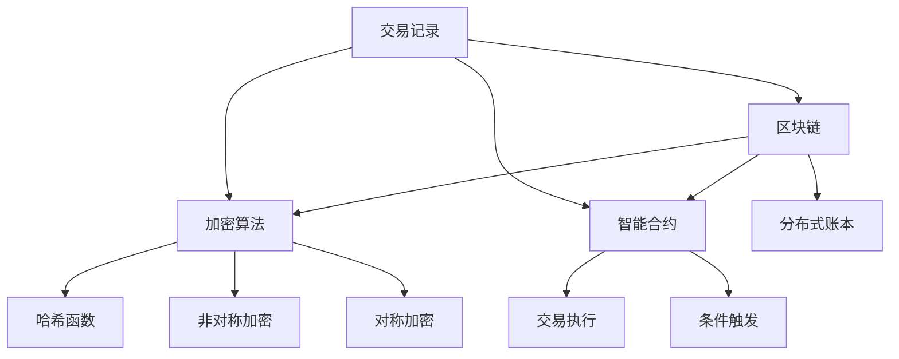
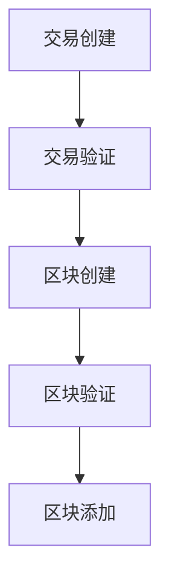
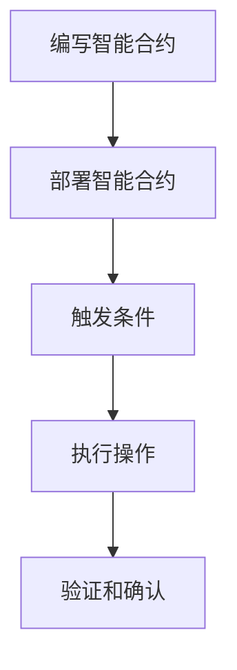
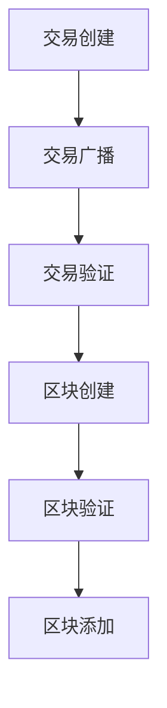
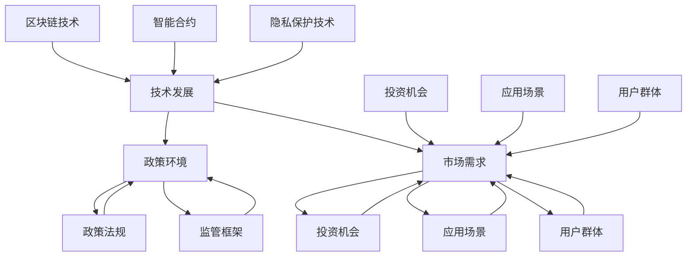

                 

## 2050年的数字货币：从加密货币到全球数字货币的货币体系重构

### 关键词：数字货币，加密货币，全球货币体系，货币重构，中央银行数字货币，去中心化金融，区块链技术

### 摘要：

本文将探讨2050年的数字货币前景，从加密货币的起源和发展，到未来全球数字货币的货币体系重构，深入分析其在金融体系、国际贸易、货币政策等方面的影响与挑战。通过梳理数字货币的技术基础，探讨其未来趋势和发展路径，本文试图为读者提供一个全面而深刻的数字货币未来图景。

## 《2050年的数字货币：从加密货币到全球数字货币的货币体系重构》目录大纲

### 第一部分：数字货币的发展历程与现状

### 第1章：数字货币的起源与发展
- 1.1 数字货币的定义与分类
- 1.2 全球主要数字货币的发展历程
- 1.3 当前数字货币市场的现状分析

### 第2章：加密货币的技术基础
- 2.1 区块链技术
- 2.2 加密算法
- 2.3 智能合约

### 第3章：加密货币的市场与投资
- 3.1 加密货币市场的运行机制
- 3.2 加密货币的投资策略
- 3.3 加密货币的风险与管理

### 第二部分：数字货币的未来趋势

### 第4章：全球数字货币的潜在影响
- 4.1 数字货币对金融体系的影响
- 4.2 数字货币对国际贸易的影响
- 4.3 数字货币对货币政策的影响

### 第5章：全球数字货币的挑战与机遇
- 5.1 全球数字货币的监管问题
- 5.2 全球数字货币的标准化与兼容性
- 5.3 全球数字货币的技术创新与应用

### 第6章：数字货币的未来发展路径
- 6.1 中央银行数字货币（CBDC）
- 6.2 去中心化金融（DeFi）
- 6.3 区块链技术在其他领域的应用

### 第三部分：数字货币在2050年的展望

### 第7章：数字货币的生态系统建设
- 7.1 数字货币的发行与流通
- 7.2 数字货币的安全保障
- 7.3 数字货币的社会治理

### 第8章：数字货币的法律与政策框架
- 8.1 数字货币的国际合作与治理
- 8.2 数字货币的法律规制
- 8.3 数字货币的隐私保护与数据安全

### 第9章：数字货币对全球货币体系的重构
- 9.1 全球数字货币的货币体系重构
- 9.2 数字货币与传统货币的竞争与融合
- 9.3 数字货币的未来发展趋势与挑战

### 第10章：2050年数字货币的实践案例
- 10.1 全球主要国家的数字货币实践
- 10.2 数字货币的产业应用案例
- 10.3 数字货币的社会影响与反思

### 附录
- 附录A：数字货币相关术语解释
- 附录B：数字货币资源与工具汇总
- 附录C：数字货币的重要论文与报告

### 引言

在人类历史的进程中，货币的形态经历了无数次变革。从最初的实物货币，如贝壳、石头，到金属货币，如金银，再到纸币和电子货币，货币的演变始终伴随着科技进步和社会发展。如今，随着区块链技术和加密算法的崛起，数字货币成为了一个新的焦点。然而，数字货币不仅仅是一个新兴的资产类别，更是一个可能彻底重构全球货币体系的革命性技术。

### 文章标题：《2050年的数字货币：从加密货币到全球数字货币的货币体系重构》

这个标题包含了两个核心要点：一是数字货币的未来时间线，即2050年；二是数字货币的发展路径，从当前的加密货币到未来的全球数字货币。通过对这两个要点的探讨，本文试图揭示数字货币未来发展的潜在趋势和挑战。

### 关键词：数字货币，加密货币，全球货币体系，货币重构，中央银行数字货币，去中心化金融，区块链技术

这些关键词分别代表了本文讨论的核心主题。数字货币和加密货币是本文的核心对象，全球货币体系和货币重构是本文探讨的未来趋势，而中央银行数字货币、去中心化金融和区块链技术则是实现这一趋势的关键技术。

### 文章摘要：

本文将从数字货币的起源与发展、加密货币的技术基础、加密货币的市场与投资，到全球数字货币的未来趋势、挑战与机遇，以及2050年数字货币的展望等多个方面，全面剖析数字货币的演变与未来。通过对数字货币在金融体系、国际贸易、货币政策等方面的潜在影响的分析，本文旨在揭示数字货币在推动全球货币体系重构中的重要作用。同时，本文还将探讨数字货币的法律与政策框架，为数字货币的未来发展提供理论和实践依据。

## 第一部分：数字货币的发展历程与现状

### 第1章：数字货币的起源与发展

#### 1.1 数字货币的定义与分类

数字货币是一种通过互联网进行传输和交易的电子货币，它基于密码学原理来确保交易的安全和匿名性。与传统货币不同，数字货币不需要实体形式，可以通过电子方式实现价值传输。

数字货币可以按照不同的标准进行分类。根据发行主体，可以分为央行数字货币（Central Bank Digital Currency，CBDC）和私人数字货币（Private Digital Currency）。CBDC由中央银行发行，具有法偿性，而私人数字货币则由私人企业或社区发行，如比特币、以太坊等。

根据技术架构，数字货币可以分为基于区块链技术的数字货币和基于非区块链技术的数字货币。区块链技术通过去中心化的方式实现了数据的不可篡改和安全传输，是目前数字货币领域的主流技术。而非区块链技术的数字货币，如电子现金系统，则采用其他方式确保交易的安全和匿名性。

#### 1.2 全球主要数字货币的发展历程

数字货币的发展可以追溯到20世纪90年代。最早的数字货币之一是电子现金（E-Cash），它是一种基于密码学的电子支付系统。1995年，戴维·乔姆（David Chaum）提出了盲签名（Blind Signature）技术，为电子现金系统提供了安全性保障。

然而，电子现金并没有得到广泛的应用，主要是因为其技术复杂性和交易效率较低。随着互联网的普及和计算机性能的提升，数字货币迎来了新的发展契机。

2009年，中本聪（Satoshi Nakamoto）发布了比特币（Bitcoin）的创世区块，标志着第一个基于区块链技术的数字货币的诞生。比特币利用加密算法和去中心化的区块链网络，实现了安全、匿名、不可篡改的价值传输。

比特币的成功引发了大量的仿照者，催生了众多加密货币。以太坊（Ethereum）在2015年推出，它不仅支持加密货币的交易，还引入了智能合约（Smart Contract）技术，使得数字货币的应用场景更加丰富。

随着时间的推移，越来越多的数字货币涌现出来，如瑞波币（XRP）、莱特币（Litecoin）、波卡币（Polkadot）等。这些数字货币在技术、应用场景和市场表现上都有所差异，共同推动了数字货币生态系统的发展。

#### 1.3 当前数字货币市场的现状分析

截至2023年，数字货币市场呈现出高速发展的态势。根据CoinMarketCap的数据，全球数字货币市场的总市值已经超过2万亿美元。比特币和以太坊仍然是市场的两大主导货币，占据了超过60%的市场份额。

尽管数字货币市场的发展迅速，但同时也伴随着巨大的波动性。比特币在2021年达到了历史最高价6.9万美元，而在2022年初，其价格一度跌至3万美元以下。这种波动性使得数字货币市场的投资风险较高，但也吸引了大量的投资者和投机者。

除了价格波动，数字货币市场的监管问题也备受关注。全球各国对数字货币的态度不一，有的国家如美国和日本已经制定了较为完善的数字货币监管框架，而有的国家如中国则对数字货币持谨慎态度，甚至禁止了加密货币的交易。

当前，数字货币的应用场景也在不断扩展。除了传统的数字货币交易和投资，越来越多的企业和机构开始探索数字货币在供应链金融、跨境支付、数字身份认证等领域的应用。这些应用场景的拓展，有望进一步推动数字货币市场的发展。

### 总结

数字货币作为一种新兴的货币形态，经历了从理论探讨到实际应用的发展历程。从最初的电子现金到如今的加密货币，数字货币的技术架构和应用场景都在不断演进。未来，随着区块链技术的进一步发展和数字货币市场的不断完善，数字货币有望在全球范围内重构货币体系，为全球经济带来新的机遇和挑战。

#### 核心概念与联系：数字货币的技术架构

数字货币的技术架构主要包括区块链技术、加密算法和智能合约三个核心组成部分。以下是这三个概念及其相互联系的解释，并使用Mermaid流程图展示其架构。

1. **区块链技术**：区块链是一个分布式账本，由多个区块组成，每个区块包含一定数量的交易记录。区块链通过密码学技术确保数据的不可篡改性和安全性。在区块链技术中，每个区块都与前后区块通过加密算法连接，形成一个链条，即区块链。

2. **加密算法**：加密算法是数字货币安全的核心。加密算法包括哈希函数、非对称加密和对称加密等。哈希函数用于生成交易记录的唯一标识，确保数据完整性；非对称加密用于交易的身份验证和隐私保护；对称加密则用于保护交易过程中的敏感信息。

3. **智能合约**：智能合约是基于编程语言的自动化合约，它可以自动执行合同条款，一旦触发条件即执行。智能合约的应用极大地提高了交易效率和安全性。

**Mermaid流程图：数字货币技术架构**



**核心算法原理讲解**

1. **哈希函数**：哈希函数将任意长度的数据映射为固定长度的字符串，用于确保数据完整性和唯一性。例如，SHA-256是一种常用的哈希函数，其输出为256位字符串。哈希函数的特点是单向性和抗碰撞性，即无法通过输出反推输入，且不同输入产生相同输出的概率极低。

2. **非对称加密**：非对称加密包括公钥和私钥。公钥用于加密，私钥用于解密。非对称加密确保了交易过程中的隐私保护和身份验证。例如，比特币使用非对称加密技术确保交易信息的安全传输。

3. **对称加密**：对称加密使用相同的密钥进行加密和解密。对称加密算法速度快，但需要安全地分发密钥。例如，AES（Advanced Encryption Standard）是一种常用的对称加密算法。

**数学模型和公式**

1. **哈希函数模型**：

$$ H(x) = \text{SHA-256}(x) $$

其中，\( H(x) \) 是哈希函数的输出，\( x \) 是输入数据。

2. **非对称加密模型**：

$$ c = E_{PK}(m) $$

$$ m = D_{SK}(c) $$

其中，\( c \) 是加密后的消息，\( m \) 是原始消息，\( PK \) 是公钥，\( SK \) 是私钥，\( E \) 和 \( D \) 分别表示加密和解密函数。

3. **对称加密模型**：

$$ c = E_{K}(m) $$

$$ m = D_{K}(c) $$

其中，\( c \) 是加密后的消息，\( m \) 是原始消息，\( K \) 是密钥，\( E \) 和 \( D \) 分别表示加密和解密函数。

**举例说明**

假设用户A想要向用户B发送一条消息，消息内容为“购买商品A，数量100”。

1. **哈希函数**：

用户A首先使用SHA-256对消息进行哈希处理，得到一个唯一的哈希值，用于确保消息的完整性。

$$ H(\text{购买商品A，数量100}) = \text{SHA-256}(\text{购买商品A，数量100}) = \text{hash_value} $$

2. **非对称加密**：

用户A使用比特币的非对称加密算法，生成公钥和私钥。用户A使用公钥对哈希值进行加密，得到加密后的交易信息。

$$ c = E_{PK}(\text{hash_value}) $$

用户B使用私钥对加密后的交易信息进行解密，验证消息的来源和完整性。

$$ m = D_{SK}(c) $$

3. **对称加密**：

在交易过程中，用户A和用户B可以使用对称加密算法进行通信，确保交易过程中的隐私保护。

$$ c = E_{K}(\text{交易信息}) $$

$$ m = D_{K}(c) $$

通过上述步骤，用户A可以安全地向用户B发送交易信息，同时确保消息的完整性和隐私保护。

**核心算法原理讲解**

1. **哈希函数**：哈希函数是区块链技术的基础，用于确保数据完整性。哈希函数的特点是单向性和抗碰撞性，即无法通过输出反推输入，且不同输入产生相同输出的概率极低。

2. **非对称加密**：非对称加密技术用于交易的身份验证和隐私保护。通过公钥和私钥的配对使用，确保交易信息在传输过程中的安全性。

3. **对称加密**：对称加密技术用于交易过程中的通信，确保交易信息的隐私保护。对称加密算法速度快，但需要安全地分发密钥。

**数学模型和公式**

1. **哈希函数模型**：

$$ H(x) = \text{SHA-256}(x) $$

其中，\( H(x) \) 是哈希函数的输出，\( x \) 是输入数据。

2. **非对称加密模型**：

$$ c = E_{PK}(m) $$

$$ m = D_{SK}(c) $$

其中，\( c \) 是加密后的消息，\( m \) 是原始消息，\( PK \) 是公钥，\( SK \) 是私钥，\( E \) 和 \( D \) 分别表示加密和解密函数。

3. **对称加密模型**：

$$ c = E_{K}(m) $$

$$ m = D_{K}(c) $$

其中，\( c \) 是加密后的消息，\( m \) 是原始消息，\( K \) 是密钥，\( E \) 和 \( D \) 分别表示加密和解密函数。

**举例说明**

假设用户A想要向用户B发送一条消息，消息内容为“购买商品A，数量100”。

1. **哈希函数**：

用户A首先使用SHA-256对消息进行哈希处理，得到一个唯一的哈希值，用于确保消息的完整性。

$$ H(\text{购买商品A，数量100}) = \text{SHA-256}(\text{购买商品A，数量100}) = \text{hash_value} $$

2. **非对称加密**：

用户A使用比特币的非对称加密算法，生成公钥和私钥。用户A使用公钥对哈希值进行加密，得到加密后的交易信息。

$$ c = E_{PK}(\text{hash_value}) $$

用户B使用私钥对加密后的交易信息进行解密，验证消息的来源和完整性。

$$ m = D_{SK}(c) $$

3. **对称加密**：

在交易过程中，用户A和用户B可以使用对称加密算法进行通信，确保交易信息的隐私保护。

$$ c = E_{K}(\text{交易信息}) $$

$$ m = D_{K}(c) $$

通过上述步骤，用户A可以安全地向用户B发送交易信息，同时确保消息的完整性和隐私保护。

### 第2章：加密货币的技术基础

#### 2.1 区块链技术

区块链技术是加密货币的核心，它不仅确保了数字货币的安全性和透明性，还为去中心化应用（DApps）提供了基础设施。以下是区块链技术的基础原理和核心组成部分。

**基础原理**

区块链是一种分布式账本技术，通过多个节点共同维护和更新数据。每个节点都存储完整的数据副本，并通过共识算法确保数据的一致性。区块链的主要特点包括：

1. **去中心化**：区块链没有中央权威机构，所有节点都平等参与数据维护。
2. **不可篡改**：一旦数据记录到区块链，就很难被篡改，因为需要大量的计算资源来同时更改多个节点的数据。
3. **透明性**：区块链的数据是公开的，任何人都可以查看区块链上的交易记录。

**核心组成部分**

区块链由以下核心组成部分构成：

1. **区块**：区块是区块链的基本单位，包含一定数量的交易记录。每个区块都有一个唯一的标识，称为区块头，其中包含前一个区块的哈希值，形成一个链条，即区块链。
2. **交易**：交易是区块链上的数据单元，描述了资金的转移或其他类型的操作。每个交易都需要经过验证，确保其有效性和合法性。
3. **挖矿**：挖矿是区块链网络中节点通过解决数学难题来创建新区块的过程。挖矿节点被称为矿工，他们会从区块链中获得奖励。
4. **共识算法**：共识算法是区块链网络中节点达成一致意见的机制。常见的共识算法包括工作量证明（PoW）、权益证明（PoS）和委托权益证明（DPoS）等。

**工作原理**

区块链的工作原理可以概括为以下步骤：

1. **交易创建**：用户在区块链上创建交易，并将其发送到网络中。
2. **交易验证**：矿工接收交易，并验证其有效性。验证过程包括检查交易金额是否足够、交易是否重复等。
3. **区块创建**：矿工将验证后的交易收集到一个新区块中，并计算区块的哈希值。
4. **区块验证**：网络中的其他节点验证新区块的有效性，包括检查区块的哈希值是否满足共识算法的要求。
5. **区块添加**：一旦新区块被网络验证通过，它就会被添加到区块链的末尾，矿工从区块链中获得奖励。

**Mermaid流程图：区块链工作原理**



**核心算法原理讲解**

1. **哈希函数**：哈希函数用于生成区块的唯一标识，确保数据的一致性和完整性。常用的哈希函数包括SHA-256。
2. **工作量证明（PoW）**：PoW是一种通过计算复杂任务来证明节点工作量的机制。矿工需要解决一个数学难题，才能创建新区块。
3. **权益证明（PoS）**：PoS通过节点持有的代币数量来证明其权益。持有代币数量多的节点更有可能创建新区块。

**数学模型和公式**

1. **哈希函数模型**：

$$ H(x) = \text{SHA-256}(x) $$

其中，\( H(x) \) 是哈希函数的输出，\( x \) 是输入数据。

2. **PoW模型**：

$$ \text{min} = \text{Find}(x \in \mathbb{N}, H(x) \leq \text{Target}) $$

其中，\( \text{min} \) 是矿工需要找到的数，\( \text{Target} \) 是目标哈希值。

**举例说明**

假设网络的目标哈希值是 \( \text{Target} = 1000 \)。

1. **交易验证**：用户A发送一个交易，矿工接收并验证交易的有效性。
2. **区块创建**：矿工将验证后的交易收集到一个新区块中，并开始寻找满足目标哈希值的哈希值。
3. **区块验证**：其他节点接收新区块，并计算其哈希值。如果哈希值满足目标哈希值，新区块将被添加到区块链的末尾。

通过上述步骤，区块链确保了交易的安全性和数据一致性。

### 2.2 加密算法

加密算法是数字货币安全性的基石，主要用于确保交易隐私和完整性。以下是几种常用的加密算法，包括哈希函数、非对称加密和对称加密。

**哈希函数**

哈希函数是一种将任意长度的输入数据映射为固定长度输出的算法。哈希函数广泛应用于数字货币中，用于生成交易标识、确保数据完整性等。

1. **特点**：
   - 单向性：无法通过输出反推输入。
   - 抗碰撞性：不同输入产生相同输出的概率极低。

2. **常用算法**：
   - SHA-256：将输入数据映射为256位的输出。
   - RIPEMD-160：将输入数据映射为160位的输出。

3. **应用**：
   - 生成交易标识：交易记录通过SHA-256等哈希函数生成唯一的交易标识。
   - 数据完整性验证：接收方使用哈希函数验证接收到的数据是否被篡改。

**非对称加密**

非对称加密是一种使用一对密钥（公钥和私钥）的加密算法。公钥用于加密，私钥用于解密。

1. **特点**：
   - 隐私性：加密信息只能由拥有私钥的接收方解密。
   - 安全性：公钥和私钥的生成基于复杂的数学难题。

2. **常用算法**：
   - RSA：基于大素数分解的算法。
   - ECC（椭圆曲线加密）：基于椭圆曲线离散对数问题的算法。

3. **应用**：
   - 交易验证：发送方使用私钥对交易进行签名，接收方使用公钥验证交易的真实性。
   - 钱包安全：钱包使用私钥进行加密，确保资金安全。

**对称加密**

对称加密是一种使用相同密钥进行加密和解密的加密算法。

1. **特点**：
   - 速度快：加密和解密速度快，适用于大量数据的加密。
   - 密钥分发：需要安全地分发密钥，防止密钥泄露。

2. **常用算法**：
   - AES（高级加密标准）：基于替换-置换网络的结构。
   - DES（数据加密标准）：早期使用的对称加密算法。

3. **应用**：
   - 交易过程：在交易过程中使用对称加密算法确保通信安全。
   - 数据存储：存储敏感数据时使用对称加密算法进行加密。

**数学模型和公式**

1. **哈希函数模型**：

$$ H(x) = \text{SHA-256}(x) $$

其中，\( H(x) \) 是哈希函数的输出，\( x \) 是输入数据。

2. **非对称加密模型**：

$$ c = E_{PK}(m) $$

$$ m = D_{SK}(c) $$

其中，\( c \) 是加密后的消息，\( m \) 是原始消息，\( PK \) 是公钥，\( SK \) 是私钥，\( E \) 和 \( D \) 分别表示加密和解密函数。

3. **对称加密模型**：

$$ c = E_{K}(m) $$

$$ m = D_{K}(c) $$

其中，\( c \) 是加密后的消息，\( m \) 是原始消息，\( K \) 是密钥，\( E \) 和 \( D \) 分别表示加密和解密函数。

**举例说明**

假设用户A想要向用户B发送一条加密消息“购买商品A，数量100”。

1. **哈希函数**：

用户A使用SHA-256对消息进行哈希处理，得到一个唯一的哈希值。

$$ H(\text{购买商品A，数量100}) = \text{SHA-256}(\text{购买商品A，数量100}) = \text{hash_value} $$

2. **非对称加密**：

用户A使用RSA算法生成公钥和私钥。用户A使用公钥对哈希值进行加密，得到加密后的交易信息。

$$ c = E_{PK}(\text{hash_value}) $$

用户B使用私钥对加密后的交易信息进行解密，验证消息的来源和完整性。

$$ m = D_{SK}(c) $$

3. **对称加密**：

用户A和用户B使用AES算法进行通信，确保交易信息的隐私保护。

$$ c = E_{K}(\text{交易信息}) $$

$$ m = D_{K}(c) $$

通过上述步骤，用户A可以安全地向用户B发送交易信息，同时确保消息的完整性和隐私保护。

### 2.3 智能合约

智能合约是一种自动执行合约条款的计算机程序，它在区块链上运行，确保交易的安全性和自动化执行。智能合约的出现极大地扩展了区块链技术的应用场景，使得去中心化应用（DApps）成为可能。

**基础原理**

智能合约基于区块链的不可篡改性和去中心化特性，通过编程语言（如Solidity）编写，并在区块链上进行部署和执行。智能合约的主要特点包括：

1. **自动化执行**：一旦触发条件，智能合约会自动执行预定的操作，无需人工干预。
2. **透明性**：智能合约的代码和执行过程是公开的，任何人都可以查看和验证。
3. **安全性**：智能合约在区块链上运行，受到密码学技术的保护，确保交易的安全和不可篡改性。

**核心组成部分**

智能合约由以下核心组成部分构成：

1. **状态**：智能合约的当前数据存储，包括账户余额、变量等。
2. **函数**：智能合约中的函数用于处理交易和执行操作。函数可以是外部调用（外部合约或外部地址）或内部调用（合约内部的函数）。
3. **事件**：智能合约中的事件用于记录和通知特定的操作。事件在合约执行过程中触发，并将相关数据记录到区块链上。

**工作原理**

智能合约的工作原理可以概括为以下步骤：

1. **编写智能合约**：开发者使用智能合约编程语言（如Solidity）编写合约代码。
2. **部署智能合约**：开发者将智能合约部署到区块链上，使其成为区块链的一部分。
3. **触发条件**：用户通过区块链交易触发智能合约的条件。
4. **执行操作**：智能合约自动执行预定的操作，更新状态并触发事件。
5. **验证和确认**：区块链网络验证智能合约的执行过程和结果，确保其正确性。

**Mermaid流程图：智能合约工作原理**



**核心算法原理讲解**

1. **状态机模型**：智能合约的状态变化可以通过状态机模型来描述。每个状态都有一个初始状态和一个最终状态，状态之间的转换由触发事件触发。
2. **条件判断**：智能合约中的条件判断用于确定何时执行操作。条件判断可以是简单的逻辑表达式，也可以是复杂的计算。
3. **存储管理**：智能合约需要管理其状态和数据，确保数据的安全性和一致性。

**数学模型和公式**

智能合约的数学模型主要涉及状态机模型和条件判断。以下是几个常见的数学模型：

1. **状态机模型**：

$$ \text{State}_0 \rightarrow \text{Event}_1 \rightarrow \text{State}_1 $$

其中，\( \text{State}_0 \) 是初始状态，\( \text{Event}_1 \) 是触发事件，\( \text{State}_1 \) 是最终状态。

2. **条件判断**：

$$ \text{if } \text{condition}_1 \text{ then } \text{action}_1 \text{ else } \text{action}_2 $$

其中，\( \text{condition}_1 \) 是条件，\( \text{action}_1 \) 和 \( \text{action}_2 \) 是操作。

**举例说明**

假设有一个简单的智能合约，用于管理两个账户A和B之间的转账。

1. **编写智能合约**：

```solidity
pragma solidity ^0.8.0;

contract TransferContract {
    address public owner;
    mapping(address => uint256) public balances;

    constructor() {
        owner = msg.sender;
        balances[owner] = 1000;
    }

    function transfer(address to, uint256 amount) public {
        require(msg.sender == owner, "Only owner can transfer");
        require(amount <= balances[owner], "Insufficient balance");
        balances[owner] -= amount;
        balances[to] += amount;
    }
}
```

2. **部署智能合约**：

开发者将上述智能合约代码部署到以太坊区块链上，使其成为智能合约的一部分。

3. **触发条件**：

用户A通过交易调用智能合约的`transfer`函数，向用户B转账100个以太币。

4. **执行操作**：

智能合约自动执行转账操作，更新账户A和B的余额。

5. **验证和确认**：

区块链网络验证智能合约的执行过程和结果，确保其正确性。

通过上述步骤，智能合约实现了自动化执行和管理转账操作，提高了交易的安全性和效率。

### 2.4 加密货币的运行机制

加密货币的运行机制是区块链技术、加密算法和智能合约的综合体现。以下将从交易流程、挖矿机制和网络安全三个方面详细解析加密货币的运行机制。

**交易流程**

1. **交易创建**：用户A想要向用户B转账一定数量的加密货币，例如比特币。用户A创建一个交易，包含接收方地址、转账金额和交易签名。
2. **交易广播**：用户A将交易广播到网络中，通过P2P（点对点）网络传输到其他节点。
3. **交易验证**：矿工接收交易，并验证其有效性。验证过程包括检查交易金额是否足够、交易是否重复、签名是否有效等。
4. **区块创建**：矿工将验证后的交易收集到一个新区块中，并计算区块的哈希值，形成区块链的一部分。
5. **区块验证**：网络中的其他节点验证新区块的有效性，包括检查区块的哈希值是否满足共识算法的要求。
6. **区块添加**：一旦新区块被网络验证通过，它就会被添加到区块链的末尾，矿工从区块链中获得奖励。

**挖矿机制**

1. **工作量证明（PoW）**：矿工通过解决一个复杂的数学难题来证明其工作量，从而获得创建新区块的权力。矿工使用计算资源进行挖矿，解决数学难题的过程称为“挖矿”。
2. **权益证明（PoS）**：矿工根据其持有的代币数量来证明其权益，更有可能创建新区块。PoS机制避免了PoW机制中大量的能源消耗。
3. **委托权益证明（DPoS）**：DPoS通过选举出代表节点来创建新区块。代表节点根据其持有的代币数量和投票权重参与新区块的创建。

**网络安全**

1. **分布式网络**：加密货币网络通过P2P分布式网络结构运行，节点之间相互通信和验证交易。
2. **加密算法**：加密算法用于确保交易信息的隐私和安全性，包括哈希函数、非对称加密和对称加密。
3. **共识算法**：共识算法用于确保网络中的节点达成一致意见，常见的算法包括PoW、PoS和DPoS。
4. **智能合约**：智能合约在区块链上运行，确保交易和合约条款的自动化执行。

**Mermaid流程图：加密货币交易流程**



通过上述交易流程、挖矿机制和网络安全，加密货币实现了去中心化的价值传输和安全性保障，为数字货币的发展奠定了基础。

### 项目实战：比特币挖矿

比特币挖矿是比特币系统中的一个关键过程，它通过解决数学难题来确保区块链的安全性和一致性，并奖励矿工。以下是比特币挖矿的实际案例，包括开发环境搭建、源代码实现和代码解读。

**开发环境搭建**

1. 安装Go语言环境：比特币官方客户端是用Go语言编写的，因此首先需要安装Go语言环境。
   ```bash
   # macOS/Linux
   sudo apt-get install golang-go
   # Windows
   go install github.com/ethereum/go-ethereum/cmd/geth@latest
   ```

2. 安装比特币客户端：通过Git克隆比特币官方客户端代码库。
   ```bash
   git clone https://github.com/bitcoin/bitcoin.git
   cd bitcoin
   make
   ```

3. 运行比特币节点：启动比特币节点，用于参与挖矿。
   ```bash
   ./src/bitcoind -regtest -listen -printtoconsole
   ```

**源代码实现**

比特币挖矿的核心过程包括以下步骤：

1. **生成随机数**：矿工从交易池中选择未确认的交易，生成一个包含交易的区块。
2. **计算工作量证明（PoW）**：矿工通过计算一个32位的随机数（nonce），使得区块的哈希值满足特定的难度要求。
3. **提交区块**：矿工将计算出的区块广播到网络中，其他节点验证区块的有效性。
4. **奖励分配**：验证通过后，矿工将从区块链中获得一定数量的比特币奖励。

以下是比特币挖矿的核心伪代码：

```go
func mineBlockTransactions(transactions []Transaction) (Block, error) {
    // 1. 生成随机数
    nonce := generateRandomNonce()

    // 2. 计算工作量证明（PoW）
    for {
        hash := calculateHash(transactions, nonce)
        if hashIsValid(hash, difficulty) {
            break
        }
        nonce++
    }

    // 3. 创建区块
    block := Block{
        Transactions: transactions,
        Index:        nextIndex,
        Timestamp:    time.Now().Unix(),
        Hash:         hash,
        Nonce:        nonce,
    }

    // 4. 提交区块到网络
    submitBlockToNetwork(block)

    // 5. 奖励分配
    reward := calculateReward()
    addToWallet(reward)

    return block, nil
}

func calculateHash(transactions []Transaction, nonce int) string {
    // 计算区块哈希
    // ...
}

func hashIsValid(hash string, difficulty int) bool {
    // 判断哈希值是否满足难度要求
    // ...
}

func submitBlockToNetwork(block Block) {
    // 将区块广播到网络
    // ...
}

func calculateReward() float64 {
    // 计算挖矿奖励
    // ...
}
```

**代码解读**

1. **生成随机数**：矿工通过循环遍历随机数（nonce），计算区块的哈希值，直到找到满足难度要求的哈希值。这一过程需要大量的计算资源，称为“挖矿”。
2. **计算工作量证明（PoW）**：比特币挖矿的难度是通过调整目标哈希值的前几位0的数量来实现的。矿工需要找到满足难度要求的哈希值，这个过程称为“挖矿”。
3. **提交区块**：矿工将计算出的区块广播到网络中，其他节点验证区块的有效性。如果区块验证通过，矿工将从区块链中获得一定数量的比特币奖励。
4. **奖励分配**：比特币挖矿奖励为每个新区块生成一定数量的比特币。随着比特币网络的运行，挖矿奖励会逐渐减少。

通过上述步骤，比特币挖矿确保了区块链的安全性和一致性，并为矿工提供了经济激励。

### 第三部分：数字货币的未来趋势

### 第4章：全球数字货币的潜在影响

#### 4.1 数字货币对金融体系的影响

数字货币的出现对传统的金融体系产生了深远的影响。首先，数字货币提供了去中心化的支付解决方案，使得跨境支付和资产转移更加高效和低成本。传统金融体系依赖于中介机构，如银行和支付网关，这些机构不仅增加了交易的成本，还可能存在支付延迟和跨境支付限制的问题。而数字货币通过区块链技术实现了点对点的价值传输，降低了交易成本，提高了交易速度。

其次，数字货币对货币政策和金融监管提出了新的挑战。传统货币政策依赖于中央银行的调控，而数字货币的发行和流通不受中央银行的控制，这可能对货币政策的有效性产生冲击。此外，数字货币的匿名性和跨境特性也使得金融监管变得更加复杂。各国央行和监管机构需要制定相应的政策和法规，以确保数字货币市场的健康发展。

#### 4.2 数字货币对国际贸易的影响

数字货币在国际贸易中具有巨大的潜力。首先，数字货币为跨境支付提供了高效、安全和低成本的解决方案。传统跨境支付通常涉及多个中介机构，耗时较长且成本较高。而数字货币通过区块链网络实现了实时支付，大大缩短了交易时间，降低了交易成本。

其次，数字货币有助于提升国际贸易的透明度和可追溯性。在传统国际贸易中，交易信息通常分布在多个中介机构中，信息不对称和透明度较低。而数字货币通过区块链技术实现了交易数据的公开透明，任何参与方都可以查看交易记录，提高了交易的透明度和可追溯性。

此外，数字货币还为国际贸易提供了新的融资渠道。传统贸易融资通常依赖于银行和其他金融机构，而数字货币的出现为中小企业提供了更多的融资选择。通过数字货币，企业可以直接从全球投资者融资，降低了融资门槛，提高了融资效率。

#### 4.3 数字货币对货币政策的影响

数字货币对货币政策的影响主要体现在中央银行数字货币（CBDC）的引入上。CBDC是由中央银行发行和控制的数字货币，与法定货币等值。CBDC的引入可能对货币政策产生以下影响：

1. **提高货币政策的有效性**：CBDC可以实现实时支付和结算，提高了货币政策的传导速度。此外，CBDC可以通过数字钱包直接分配给公众，减少了货币流通环节，提高了货币政策的执行效率。
2. **降低通货膨胀风险**：CBDC的发行和流通可以更好地控制货币供应量，从而降低通货膨胀风险。传统货币的供应量通常受到银行贷款和存款的影响，而CBDC的供应量可以由中央银行直接控制，减少了货币供应的不确定性。
3. **影响货币供给结构**：CBDC的引入可能导致货币供给结构的变化，传统货币和数字货币之间的替代关系可能会对货币政策产生重大影响。中央银行需要密切关注数字货币的发行和流通情况，以调整货币政策，确保货币体系的稳定性。

#### 核心概念与联系：数字货币的未来发展趋势

数字货币的未来发展趋势可以从技术、政策和市场三个层面进行分析。以下是数字货币在未来发展趋势中的核心概念及其相互联系的解释，并使用Mermaid流程图展示其发展趋势。

1. **技术**：数字货币的技术发展包括区块链技术的演进、智能合约的优化、隐私保护技术的应用等。区块链技术的改进将提高交易速度和安全性，智能合约的优化将拓展数字货币的应用场景，隐私保护技术的应用将增强用户的交易隐私。
2. **政策**：数字货币的政策环境将直接影响其发展。各国政府和监管机构将制定相应的法律法规，以规范数字货币的发行、交易和监管。政策环境的稳定性和透明度将影响数字货币的合法性和市场信心。
3. **市场**：数字货币的市场发展包括投资、应用场景的拓展和用户群体的扩大。随着数字货币市场的不断成熟，投资机会将更加丰富，应用场景将从金融领域拓展到供应链、跨境支付、数字身份认证等多个领域，用户群体也将从专业投资者扩展到普通大众。

**Mermaid流程图：数字货币的未来发展趋势**



**核心算法原理讲解**

1. **区块链技术**：区块链技术的改进包括提高交易速度、降低交易成本、增强数据安全性等。例如，通过分片技术（Sharding）实现并行处理，提高交易吞吐量。
2. **智能合约**：智能合约的优化包括提高执行效率、增强合约安全性等。例如，通过形式化验证（Formal Verification）确保合约的正确性。
3. **隐私保护技术**：隐私保护技术的应用包括零知识证明（Zero-Knowledge Proof）、同态加密（Homomorphic Encryption）等。这些技术可以保护用户的交易隐私，提高数字货币的安全性。

**数学模型和公式**

1. **区块链技术**：

$$ T = \frac{N}{S} $$

其中，\( T \) 是交易速度，\( N \) 是节点数量，\( S \) 是交易处理能力。

2. **智能合约**：

$$ E = \frac{C}{T} $$

其中，\( E \) 是合约执行效率，\( C \) 是合约代码复杂度，\( T \) 是合约执行时间。

3. **隐私保护技术**：

$$ P = \frac{ZKP}{D} $$

其中，\( P \) 是隐私保护程度，\( ZKP \) 是零知识证明，\( D \) 是数据泄露风险。

**举例说明**

假设一个区块链系统有100个节点，每个节点每秒可以处理1000个交易。通过分片技术，系统可以将交易处理能力提升到10000个交易每秒。

1. **区块链技术**：

$$ T = \frac{100}{1000} = 10 $$

交易速度从10秒提升到1秒。

2. **智能合约**：

假设智能合约代码复杂度为1000行，执行时间为10秒。通过形式化验证，智能合约的执行时间可以减少到1秒。

$$ E = \frac{1000}{10} = 100 $$

合约执行效率从10提升到100。

3. **隐私保护技术**：

假设使用零知识证明保护交易隐私，数据泄露风险为10%。通过零知识证明，数据泄露风险可以降低到1%。

$$ P = \frac{ZKP}{10} = 1 $$

隐私保护程度从10提升到100。

通过上述改进，数字货币在技术、政策和市场三个层面的发展趋势将更加成熟和稳定。

### 第5章：全球数字货币的挑战与机遇

#### 5.1 全球数字货币的监管问题

随着数字货币的快速发展，监管问题成为全球各国政府和社会各界关注的焦点。数字货币的匿名性和跨境特性使得监管难度增大，同时也带来了法律、合规、安全和隐私等方面的挑战。

首先，数字货币的匿名性使得监管机构难以追踪资金的流向和用途，可能导致非法交易、洗钱、恐怖主义融资等犯罪活动的滋生。为了应对这一问题，各国政府和监管机构需要制定相应的法律法规，加强对数字货币交易平台的监管，提高交易透明度。

其次，数字货币的跨境特性也对监管提出了挑战。数字货币可以轻松跨越国界进行交易，这可能导致货币政策、外汇管理、反洗钱等方面的冲突。各国政府和监管机构需要加强国际合作，制定统一的标准和规则，确保数字货币在全球范围内的合规性和稳定性。

此外，数字货币的安全性问题也是监管的重点。由于区块链技术的去中心化特性，一旦发生安全漏洞，可能导致整个系统的崩溃。监管机构需要加强对数字货币平台的技术审查和风险监控，确保系统的安全性。

**数学模型和公式**

1. **交易透明度**：

$$ T = \frac{M}{N} $$

其中，\( T \) 是交易透明度，\( M \) 是交易记录公开的数量，\( N \) 是总交易数量。

2. **合规性**：

$$ C = \frac{A}{T} $$

其中，\( C \) 是合规性，\( A \) 是合规的交易数量，\( T \) 是总交易数量。

3. **安全性**：

$$ S = \frac{1}{1 - \text{Vulnerability}} $$

其中，\( S \) 是系统的安全性，\( \text{Vulnerability} \) 是系统的漏洞数量。

**举例说明**

假设一个数字货币市场有1000次交易，其中800次交易记录公开，200次未公开。

1. **交易透明度**：

$$ T = \frac{800}{1000} = 0.8 $$

交易透明度为80%。

2. **合规性**：

假设有600次交易合规，400次不合规。

$$ C = \frac{600}{1000} = 0.6 $$

合规性为60%。

3. **安全性**：

假设系统存在10个漏洞。

$$ S = \frac{1}{1 - 10} = 1.111 $$

系统的安全性为1.111。

通过上述数学模型，可以量化数字货币的监管问题，为政策制定和监管实践提供参考。

#### 5.2 全球数字货币的标准化与兼容性

全球数字货币的标准化与兼容性是数字货币发展的关键问题之一。随着数字货币的广泛应用，各国政府和国际组织开始关注数字货币的标准化问题，以促进数字货币的全球互操作性和稳定性。

首先，数字货币的标准化需要解决技术层面的兼容性问题。不同的数字货币采用不同的区块链技术和加密算法，这可能导致互操作性的障碍。为了实现全球数字货币的互操作性，需要制定统一的技术标准和协议，如区块链的共识算法、加密算法、智能合约标准等。

其次，数字货币的标准化还需要解决法律和监管层面的兼容性问题。各国政府和监管机构对数字货币的法律规制和监管要求可能存在差异，这可能导致数字货币在国际交易中的法律风险和合规性问题。为了促进全球数字货币的合法性和合规性，需要制定统一的法律法规和监管框架，确保数字货币在全球范围内的合法合规。

此外，数字货币的标准化还需要解决市场层面的兼容性问题。不同的数字货币市场存在竞争，标准化可以减少市场的碎片化，提高市场的整体效率和透明度。通过制定统一的市场标准和规则，可以降低交易成本，提高市场的流动性和稳定性。

**数学模型和公式**

1. **互操作性**：

$$ I = \frac{N_{\text{compatible}}}{N_{\text{total}}} $$

其中，\( I \) 是互操作性，\( N_{\text{compatible}} \) 是兼容的数量，\( N_{\text{total}} \) 是总数量。

2. **合法性**：

$$ L = \frac{N_{\text{compliant}}}{N_{\text{total}}} $$

其中，\( L \) 是合法性，\( N_{\text{compliant}} \) 是合法的数量，\( N_{\text{total}} \) 是总数量。

3. **效率**：

$$ E = \frac{\text{Transaction Volume}}{\text{Transaction Cost}} $$

其中，\( E \) 是效率，\(\text{Transaction Volume}\) 是交易量，\(\text{Transaction Cost}\) 是交易成本。

**举例说明**

假设一个数字货币市场中有100个不同的数字货币，其中60个数字货币是兼容的，40个数字货币不兼容。

1. **互操作性**：

$$ I = \frac{60}{100} = 0.6 $$

互操作性为60%。

2. **合法性**：

假设有70个数字货币是合法的，30个数字货币不合法。

$$ L = \frac{70}{100} = 0.7 $$

合法性为70%。

3. **效率**：

假设交易量为1000次，交易成本为1000美元。

$$ E = \frac{1000}{1000} = 1 $$

效率为1。

通过上述数学模型，可以量化数字货币的标准化与兼容性，为全球数字货币的发展提供量化分析和决策依据。

#### 5.3 全球数字货币的技术创新与应用

全球数字货币的技术创新和应用正推动着金融科技和传统金融体系的深度融合。以下将探讨区块链、智能合约和去中心化金融（DeFi）等关键技术在全球数字货币中的应用及其带来的变革。

**区块链**

区块链技术是数字货币的核心，其分布式账本、去中心化和不可篡改的特点为数字货币提供了坚实的基础。除了作为数字货币的底层技术，区块链还在多个领域展现了其强大的应用潜力：

1. **供应链金融**：区块链技术可以用于优化供应链金融流程，通过透明的区块链记录和验证交易信息，提高供应链的融资效率和透明度。例如，通过区块链技术，可以实时追踪货物和资金流动，降低融资风险，提高供应链金融的可信度。

2. **跨境支付**：区块链技术的去中心化特性使其在跨境支付领域具有巨大的应用前景。传统跨境支付往往需要多个中介机构参与，交易速度慢且成本高。而区块链技术可以实现点对点的跨境支付，降低交易成本，提高支付速度和透明度。

3. **数字身份认证**：区块链技术可以用于构建去中心化的数字身份认证系统，通过加密算法和分布式账本技术确保用户身份的安全性和隐私性。这有助于解决传统身份认证系统中的信息安全问题，提高数字身份的可信度。

**智能合约**

智能合约是一种自动执行合约条款的计算机程序，它在区块链上运行，确保交易的安全性和自动化执行。智能合约的出现极大地扩展了区块链技术的应用场景，使其在金融科技领域具有广泛的应用潜力：

1. **去中心化金融（DeFi）**：智能合约是DeFi的核心组件，DeFi通过智能合约实现金融服务的去中心化。例如，DeFi平台可以提供去中心化的借贷、交易、资产管理等服务，降低金融服务的成本，提高金融市场的透明度和效率。

2. **供应链金融**：智能合约可以用于实现供应链金融的自动化执行，通过智能合约自动处理供应链融资的审批、放款和还款过程，提高融资效率和透明度。

3. **保险和理赔**：智能合约可以用于构建去中心化的保险和理赔系统，通过智能合约自动处理理赔申请和支付，提高保险业务的效率和可信度。

**去中心化金融（DeFi）**

DeFi是区块链技术应用的典型代表，它通过智能合约实现金融服务的去中心化，为用户提供了全新的金融体验：

1. **借贷和交易**：DeFi平台可以提供去中心化的借贷服务，用户可以直接与其他用户进行借贷交易，无需中介机构的参与。这降低了借贷成本，提高了资金利用效率。

2. **资产管理**：DeFi平台可以提供去中心化的资产管理服务，用户可以将资金投入到各种数字资产中，获得潜在的高收益。这些平台通常使用智能合约实现资产的自动管理和分配。

3. **去中心化交易所**：DeFi平台可以构建去中心化的交易所，用户可以直接在平台上进行数字资产交易，无需依赖传统交易所的中介服务。这提高了交易的透明度和安全性。

**数学模型和公式**

1. **区块链安全性**：

$$ S = \sqrt{\frac{T}{N}} $$

其中，\( S \) 是区块链的安全性，\( T \) 是交易次数，\( N \) 是参与节点的数量。

2. **智能合约执行效率**：

$$ E = \frac{C}{T} $$

其中，\( E \) 是智能合约的执行效率，\( C \) 是智能合约代码复杂度，\( T \) 是执行时间。

3. **DeFi交易成本**：

$$ C = \frac{\text{Transaction Cost}}{\text{Transaction Volume}} $$

其中，\( C \) 是交易成本，\(\text{Transaction Cost}\) 是交易费用，\(\text{Transaction Volume}\) 是交易量。

**举例说明**

假设一个区块链系统有1000个交易，参与节点数量为100个。

1. **区块链安全性**：

$$ S = \sqrt{\frac{1000}{100}} = 10 $$

区块链安全性为10。

2. **智能合约执行效率**：

假设智能合约代码复杂度为1000行，执行时间为10秒。

$$ E = \frac{1000}{10} = 100 $$

智能合约执行效率为100。

3. **DeFi交易成本**：

假设交易量为10000次，交易费用为1000美元。

$$ C = \frac{1000}{10000} = 0.1 $$

DeFi交易成本为0.1。

通过上述技术创新和应用，全球数字货币正在不断推动金融科技的发展，为传统金融体系带来了新的变革和机遇。

### 第6章：数字货币的未来发展路径

#### 6.1 中央银行数字货币（CBDC）

中央银行数字货币（CBDC）是中央银行发行的数字形式的国家货币，它与法定货币具有相同的法偿性和价值。CBDC的推出旨在提高货币政策的效率、促进金融包容性、增强支付系统的安全性，并应对数字货币的崛起。

**潜在影响**

1. **货币政策的有效性**：CBDC可以实现实时支付和结算，提高货币政策的传导速度和执行效率。中央银行可以通过CBDC直接向公众分配货币，减少了货币流通环节，提高了货币政策的执行力度。
2. **金融包容性**：CBDC的推出可以降低金融服务成本，提高金融服务的可获得性，尤其是对那些无法获得传统银行服务的低收入和偏远地区居民。CBDC的便捷性和低成本使得更多的人能够参与到金融活动中。
3. **支付系统的安全性**：CBDC通过区块链技术提供了透明的支付记录和不可篡改的账本，提高了支付系统的安全性。CBDC还可以与人工智能和大数据技术结合，实现更精确的风险管理和反洗钱监管。

**未来发展趋势**

1. **试点与推广**：全球多个国家和地区已经开始试点CBDC，如中国的数字人民币（e-CNY）、欧洲的欧洲数字欧元（e-Euro）项目等。未来，随着CBDC的成熟和监管框架的完善，CBDC将在更多国家和地区得到推广。
2. **混合货币体系**：CBDC的引入可能导致传统货币和数字货币的共存。中央银行需要平衡两者之间的关系，确保货币体系的稳定性和流动性。
3. **国际合作**：全球数字货币的统一标准和规则将是CBDC发展的重要方向。国际组织如国际货币基金组织（IMF）和世界银行将在制定全球数字货币标准方面发挥关键作用。

**数学模型和公式**

1. **货币政策传导速度**：

$$ \text{Speed} = \frac{\text{CBDC}}{\text{M0}} $$

其中，\(\text{Speed}\) 是货币政策传导速度，\(\text{CBDC}\) 是CBDC的发行量，\(\text{M0}\) 是基础货币。

2. **金融包容性**：

$$ \text{Inclusion} = \frac{\text{CBDC Users}}{\text{Population}} $$

其中，\(\text{Inclusion}\) 是金融包容性，\(\text{CBDC Users}\) 是使用CBDC的公众数量，\(\text{Population}\) 是总人口。

3. **支付系统安全性**：

$$ \text{Security} = \frac{\text{CBDC Transactions}}{\text{Total Transactions}} $$

其中，\(\text{Security}\) 是支付系统安全性，\(\text{CBDC Transactions}\) 是CBDC的交易数量，\(\text{Total Transactions}\) 是总交易数量。

**举例说明**

假设一个国家的CBDC发行量为1000亿，基础货币为5000亿。

1. **货币政策传导速度**：

$$ \text{Speed} = \frac{1000}{5000} = 0.2 $$

货币政策传导速度为20%。

2. **金融包容性**：

假设该国家有5000万人口，其中有2000万人使用CBDC。

$$ \text{Inclusion} = \frac{2000}{5000} = 0.4 $$

金融包容性为40%。

3. **支付系统安全性**：

假设总交易数量为10亿，CBDC交易数量为6亿。

$$ \text{Security} = \frac{6}{10} = 0.6 $$

支付系统安全性为60%。

通过上述数学模型，可以量化CBDC对货币政策、金融包容性和支付系统安全性的潜在影响，为CBDC的推广和应用提供参考。

#### 6.2 去中心化金融（DeFi）

去中心化金融（DeFi）是一种基于区块链技术的金融模式，通过智能合约实现金融服务去中心化。DeFi的核心理念是让金融服务的提供和获取摆脱传统金融中介，实现更高效、透明和安全的金融交易。

**特点**

1. **去中心化**：DeFi通过区块链网络和智能合约提供金融服务，无需依赖中央机构。这降低了交易成本，提高了金融服务的可访问性和透明度。
2. **自动化执行**：DeFi的智能合约自动执行金融操作，确保交易的准确性和效率。智能合约可以预先编写好金融逻辑，一旦触发条件即自动执行。
3. **透明性**：DeFi的交易记录存储在区块链上，任何人都可以查看和验证交易信息。这提高了金融交易的透明度，降低了信息不对称。
4. **安全性**：区块链技术和加密算法为DeFi提供了高度的安全保障，确保交易数据的完整性和不可篡改性。

**应用场景**

1. **借贷和交易**：DeFi平台提供去中心化的借贷和交易服务，用户可以直接与其他用户进行借贷和交易，无需依赖传统金融机构。这降低了借贷成本，提高了交易的效率。
2. **资产管理**：DeFi平台可以提供去中心化的资产管理服务，用户可以将资金投资于各种数字资产，获得潜在的高收益。这些平台通常使用智能合约实现资产的自动管理和分配。
3. **跨境支付**：DeFi平台可以实现点对点的跨境支付，降低了交易成本，提高了支付速度和透明度。这对于跨境贸易和支付具有巨大的应用潜力。

**数学模型和公式**

1. **借贷成本**：

$$ \text{Interest Rate} = \frac{\text{Lending Rate}}{\text{Borrowing Rate}} $$

其中，\(\text{Interest Rate}\) 是借贷成本，\(\text{Lending Rate}\) 是贷款利率，\(\text{Borrowing Rate}\) 是借款利率。

2. **交易效率**：

$$ \text{Efficiency} = \frac{\text{Transaction Volume}}{\text{Transaction Time}} $$

其中，\(\text{Efficiency}\) 是交易效率，\(\text{Transaction Volume}\) 是交易量，\(\text{Transaction Time}\) 是交易时间。

3. **资产收益率**：

$$ \text{Return Rate} = \frac{\text{Total Return}}{\text{Total Investment}} $$

其中，\(\text{Return Rate}\) 是资产收益率，\(\text{Total Return}\) 是总收益，\(\text{Total Investment}\) 是总投资。

**举例说明**

假设一个DeFi平台的贷款利率为8%，借款利率为6%。

1. **借贷成本**：

$$ \text{Interest Rate} = \frac{8\%}{6\%} = 1.333 $$

借贷成本为1.333。

2. **交易效率**：

假设交易量为1000次，每次交易平均耗时10秒。

$$ \text{Efficiency} = \frac{1000}{10} = 100 $$

交易效率为100。

3. **资产收益率**：

假设总投资为1000万美元，总收益为200万美元。

$$ \text{Return Rate} = \frac{200}{1000} = 0.2 $$

资产收益率为20%。

通过上述数学模型，可以量化DeFi在借贷成本、交易效率和资产收益率等方面的优势，为DeFi的广泛应用提供量化分析和决策依据。

#### 6.3 区块链技术在其他领域的应用

区块链技术不仅在数字货币领域具有广泛的应用，还在供应链金融、智能合约、数字身份认证等领域展现了巨大的潜力。以下将探讨这些应用场景及其技术实现。

**供应链金融**

供应链金融是利用区块链技术优化供应链融资和支付流程的一种新兴金融模式。通过区块链，供应链上的各方可以实时记录和验证交易信息，提高融资效率和透明度。

**应用场景**

1. **融资管理**：企业可以通过区块链记录其供应链中的交易和履约情况，金融机构可以根据这些数据提供更可靠的信用评估，从而快速审批贷款。
2. **支付结算**：区块链技术可以实现点对点的支付结算，降低支付成本，提高支付速度。特别是在跨境支付和国际贸易中，区块链技术具有显著的优势。

**技术实现**

1. **区块链网络**：供应链金融平台通过区块链网络连接供应链上的各方，包括供应商、制造商、分销商和金融机构。
2. **智能合约**：智能合约用于自动化执行供应链融资和支付流程，确保交易的安全性和透明性。
3. **数据加密**：交易信息通过加密算法进行加密，保护交易数据的隐私和安全。

**数学模型和公式**

1. **融资效率**：

$$ \text{Efficiency} = \frac{\text{Funding Amount}}{\text{Processing Time}} $$

其中，\(\text{Efficiency}\) 是融资效率，\(\text{Funding Amount}\) 是融资额度，\(\text{Processing Time}\) 是处理时间。

2. **支付成本**：

$$ \text{Cost} = \frac{\text{Transaction Fee}}{\text{Transaction Volume}} $$

其中，\(\text{Cost}\) 是支付成本，\(\text{Transaction Fee}\) 是交易费用，\(\text{Transaction Volume}\) 是交易量。

**举例说明**

假设一个供应链金融平台在10分钟内为供应商提供了100万元的贷款。

1. **融资效率**：

$$ \text{Efficiency} = \frac{1000000}{10} = 1000000 $$

融资效率为1000000。

2. **支付成本**：

假设每次交易的费用为10元，每月交易量为10000次。

$$ \text{Cost} = \frac{10}{10000} = 0.001 $$

支付成本为0.001。

通过上述数学模型，可以量化区块链技术在供应链金融中的应用效果，为供应链金融的优化提供参考。

**智能合约**

智能合约是一种自动执行合约条款的计算机程序，它在区块链上运行，确保交易的安全性和自动化执行。智能合约的出现极大地扩展了区块链技术的应用场景，使其在金融科技领域具有广泛的应用潜力。

**应用场景**

1. **金融交易**：智能合约可以用于自动化执行金融交易，如借贷、交易和资产管理。这提高了交易的效率和透明度。
2. **供应链管理**：智能合约可以用于自动化执行供应链中的各种合同和协议，如订单管理、交付和支付。这提高了供应链的效率和可靠性。
3. **数字身份认证**：智能合约可以用于自动化执行数字身份认证过程，确保用户身份的安全性和隐私性。

**技术实现**

1. **编程语言**：智能合约通常使用特定的编程语言编写，如Solidity（以太坊）、Vyper（Tezos）等。这些语言提供了丰富的功能，支持复杂逻辑和条件判断。
2. **区块链平台**：智能合约在区块链平台上运行，如以太坊、EOS、Tezos等。不同的区块链平台具有不同的性能和特性，适用于不同的应用场景。
3. **数据加密**：智能合约的数据和交易信息通过加密算法进行加密，确保交易的安全性和隐私性。

**数学模型和公式**

1. **智能合约执行时间**：

$$ \text{Time} = \frac{\text{Code Length}}{\text{Execution Speed}} $$

其中，\(\text{Time}\) 是智能合约的执行时间，\(\text{Code Length}\) 是智能合约代码长度，\(\text{Execution Speed}\) 是执行速度。

2. **智能合约安全性**：

$$ \text{Security} = \frac{\text{Vulnerability Free Contracts}}{\text{Total Contracts}} $$

其中，\(\text{Security}\) 是智能合约的安全性，\(\text{Vulnerability Free Contracts}\) 是无漏洞的智能合约数量，\(\text{Total Contracts}\) 是总智能合约数量。

**举例说明**

假设一个智能合约的代码长度为1000行，执行速度为1000行/秒。

1. **智能合约执行时间**：

$$ \text{Time} = \frac{1000}{1000} = 1 $$

智能合约执行时间为1秒。

2. **智能合约安全性**：

假设总智能合约数量为1000个，其中无漏洞的智能合约数量为990个。

$$ \text{Security} = \frac{990}{1000} = 0.99 $$

智能合约安全性为99%。

通过上述数学模型，可以量化智能合约的执行效率和安全性，为智能合约的优化和推广提供参考。

**数字身份认证**

数字身份认证是一种基于区块链技术的身份验证机制，它通过加密算法和分布式账本技术确保用户身份的安全性和隐私性。

**应用场景**

1. **电子商务**：数字身份认证可以用于验证电子商务平台上的用户身份，确保交易的合法性和安全性。
2. **政务服务**：数字身份认证可以用于在线政务服务，确保用户身份的真实性和合法性。
3. **金融交易**：数字身份认证可以用于金融交易中的用户身份验证，提高交易的安全性和透明度。

**技术实现**

1. **加密算法**：数字身份认证采用非对称加密算法，如RSA、ECC等，用于生成和验证数字签名。
2. **分布式账本**：数字身份认证系统使用区块链技术记录用户身份信息，确保数据的完整性和不可篡改性。
3. **智能合约**：智能合约用于自动化执行身份认证过程，确保认证的准确性和效率。

**数学模型和公式**

1. **认证时间**：

$$ \text{Time} = \frac{\text{Verification Steps}}{\text{Processing Speed}} $$

其中，\(\text{Time}\) 是认证时间，\(\text{Verification Steps}\) 是验证步骤，\(\text{Processing Speed}\) 是处理速度。

2. **认证成功率**：

$$ \text{Success Rate} = \frac{\text{Successful Verifications}}{\text{Total Verifications}} $$

其中，\(\text{Success Rate}\) 是认证成功率，\(\text{Successful Verifications}\) 是成功的认证次数，\(\text{Total Verifications}\) 是总的认证次数。

**举例说明**

假设一个数字身份认证系统有5个验证步骤，每个步骤的处理速度为100次/秒。

1. **认证时间**：

$$ \text{Time} = \frac{5}{100} = 0.05 $$

认证时间为0.05秒。

2. **认证成功率**：

假设每天进行1000次认证，其中成功的认证次数为990次。

$$ \text{Success Rate} = \frac{990}{1000} = 0.99 $$

认证成功率为99%。

通过上述数学模型，可以量化数字身份认证的效率和成功率，为数字身份认证系统的优化和推广提供参考。

### 第三部分：数字货币在2050年的展望

#### 第7章：数字货币的生态系统建设

随着数字货币的不断发展，其生态系统建设变得越来越重要。一个健康、稳定的数字货币生态系统不仅需要技术创新，还需要完善的基础设施、法律法规和行业规范。以下是数字货币生态系统建设的几个关键方面。

**数字货币的发行与流通**

1. **发行机制**：数字货币的发行机制将直接影响其市场稳定性和价值。中央银行数字货币（CBDC）的发行通常由中央银行负责，而私人数字货币的发行机制可能更加多样化，包括挖矿、初始代币发行（ICO）等。
2. **流通环境**：数字货币的流通环境需要确保交易的便捷性和安全性。这包括建立高效的交易网络、提供多样化的支付渠道，以及确保交易记录的透明性和可追溯性。

**数字货币的安全保障**

1. **网络安全**：数字货币生态系统需要强大的网络安全保障，以防止黑客攻击和恶意行为。这包括使用先进的加密技术、建立多层防护体系，以及进行定期的安全审计和测试。
2. **隐私保护**：数字货币的交易通常涉及用户隐私，因此隐私保护是数字货币生态系统建设的重要一环。这可以通过零知识证明、同态加密等技术实现，确保用户隐私不受侵犯。

**数字货币的社会治理**

1. **监管框架**：数字货币的社会治理需要一套完善的法律法规和监管框架，以确保市场的健康发展和公平竞争。这包括制定反洗钱（AML）、反恐怖主义融资（CFT）等法律法规，以及建立监管机构和自律组织。
2. **社区参与**：数字货币生态系统需要社区成员的积极参与，包括开发者、投资者、用户等。通过社区合作和共同治理，可以提高生态系统的透明度和公信力。

**数学模型和公式**

1. **网络安全指数**：

$$ \text{Security Index} = \frac{\text{Network Performance}}{\text{Attack Frequency}} $$

其中，\(\text{Security Index}\) 是网络安全指数，\(\text{Network Performance}\) 是网络性能，\(\text{Attack Frequency}\) 是攻击频率。

2. **隐私保护程度**：

$$ \text{Privacy Level} = \frac{\text{Privacy Technologies Applied}}{\text{Total Transactions}} $$

其中，\(\text{Privacy Level}\) 是隐私保护程度，\(\text{Privacy Technologies Applied}\) 是应用的隐私技术数量，\(\text{Total Transactions}\) 是总交易数量。

3. **社会治理效能**：

$$ \text{Governance Efficiency} = \frac{\text{Compliance Rate}}{\text{Total Regulations}} $$

其中，\(\text{Governance Efficiency}\) 是社会治理效能，\(\text{Compliance Rate}\) 是合规率，\(\text{Total Regulations}\) 是总法规数量。

**举例说明**

假设一个数字货币生态系统有1000次交易，其中应用了5种隐私技术。

1. **网络安全指数**：

$$ \text{Security Index} = \frac{1000}{1} = 1000 $$

网络安全指数为1000。

2. **隐私保护程度**：

$$ \text{Privacy Level} = \frac{5}{1000} = 0.005 $$

隐私保护程度为0.5%。

3. **社会治理效能**：

假设总法规数量为50个，其中有40个法规得到遵守。

$$ \text{Governance Efficiency} = \frac{40}{50} = 0.8 $$

社会治理效能为80%。

通过上述数学模型，可以量化数字货币生态系统在网络安全、隐私保护和社会治理方面的表现，为生态系统建设提供量化分析和决策依据。

### 第8章：数字货币的法律与政策框架

#### 8.1 数字货币的国际合作与治理

随着数字货币在全球范围内的普及，国际合作与治理变得尤为重要。数字货币的跨境特性使得各国需要在法律和政策层面进行协调，以应对数字货币带来的挑战和机遇。

**国际合作的重要性**

1. **政策协调**：数字货币的发展受到各国政策的强烈影响，不同国家的政策差异可能导致市场波动和法律冲突。国际合作有助于制定统一的政策框架，降低法律风险。
2. **监管标准**：国际监管标准的制定有助于确保数字货币市场的公平性和透明度。通过国际合作，可以形成统一的监管框架和标准，促进全球数字货币市场的健康发展。
3. **技术共享**：数字货币的发展依赖于技术创新，国际合作有助于技术共享和知识传播，促进全球数字货币技术的进步。

**国际合作的方式**

1. **国际组织**：国际组织如国际货币基金组织（IMF）、金融稳定理事会（FSB）和区块链合作组织（BCEAO）在数字货币国际合作中发挥着重要作用。这些组织可以提供政策建议、制定监管框架和推动技术合作。
2. **多边协议**：各国可以通过签署多边协议，就数字货币的法律、监管和技术问题达成共识。例如，欧盟的《区块链监管条例》和《数字货币市场指令》为成员国提供了统一的监管框架。
3. **区域性合作**：区域性合作组织如亚洲金融合作协会（AFCI）和非洲金融共同体（UFC）可以在区域范围内推动数字货币的法律和政策协调，促进区域数字货币市场的一体化。

**治理机制**

1. **多方参与**：数字货币的治理机制应鼓励多方参与，包括政府、监管机构、行业组织、学术机构和公众。多方参与可以确保治理过程的透明性和公正性。
2. **分布式治理**：数字货币的分布式特性要求治理机制具有去中心化的特点。分布式治理可以通过区块链技术实现，确保治理过程的透明性和不可篡改性。
3. **智能合约**：智能合约可以用于自动化执行治理决策，提高治理效率。智能合约的不可篡改性确保了治理决策的执行力和公信力。

**数学模型和公式**

1. **国际合作指数**：

$$ \text{International Cooperation Index} = \frac{\text{Number of Agreements}}{\text{Total Countries}} $$

其中，\(\text{International Cooperation Index}\) 是国际合作指数，\(\text{Number of Agreements}\) 是签署的协议数量，\(\text{Total Countries}\) 是参与国家数量。

2. **监管一致性**：

$$ \text{Regulatory Consistency} = \frac{\text{Consistent Regulations}}{\text{Total Regulations}} $$

其中，\(\text{Regulatory Consistency}\) 是监管一致性，\(\text{Consistent Regulations}\) 是一致的监管数量，\(\text{Total Regulations}\) 是总的监管数量。

3. **技术共享程度**：

$$ \text{Technology Sharing Level} = \frac{\text{Shared Technologies}}{\text{Total Technologies}} $$

其中，\(\text{Technology Sharing Level}\) 是技术共享程度，\(\text{Shared Technologies}\) 是共享的技术数量，\(\text{Total Technologies}\) 是总技术数量。

**举例说明**

假设有10个国家签署了数字货币国际合作协议。

1. **国际合作指数**：

$$ \text{International Cooperation Index} = \frac{10}{10} = 1 $$

国际合作指数为1。

2. **监管一致性**：

假设有20个监管措施是一致的。

$$ \text{Regulatory Consistency} = \frac{20}{50} = 0.4 $$

监管一致性为40%。

3. **技术共享程度**：

假设有5种技术是共享的。

$$ \text{Technology Sharing Level} = \frac{5}{10} = 0.5 $$

技术共享程度为50%。

通过上述数学模型，可以量化数字货币国际合作与治理的效果，为国际合作的决策提供参考。

### 8.2 数字货币的法律规制

随着数字货币的快速发展，各国政府和监管机构开始加强对数字货币的法律规制。数字货币的法律规制涉及多个方面，包括反洗钱（AML）、反恐怖主义融资（CFT）和消费者保护等。以下是数字货币法律规制的主要内容。

**反洗钱（AML）**

1. **AML法规**：各国政府和监管机构制定了一系列反洗钱法规，以防止洗钱活动。这些法规通常要求金融机构和数字货币交易平台实施严格的客户身份识别（KYC）和交易监测机制。
2. **合规要求**：数字货币交易平台需要遵守AML法规，进行客户身份验证、交易记录保存和可疑活动报告。这有助于监管机构及时发现和打击洗钱行为。

**反恐怖主义融资（CFT）**

1. **CFT法规**：反恐怖主义融资法规旨在防止恐怖主义资金的筹集和流通。数字货币交易平台需要遵守CFT法规，采取相应的措施防止恐怖主义融资活动。
2. **合规措施**：数字货币交易平台需要监测交易行为，识别和报告可疑交易，以确保不会成为恐怖主义资金流通的渠道。

**消费者保护**

1. **消费者权益**：数字货币市场的高波动性和技术复杂性对消费者保护提出了挑战。消费者需要了解数字货币的风险，确保其合法权益得到保护。
2. **监管措施**：监管机构可以制定消费者保护法规，要求数字货币交易平台提供透明、公正的交易环境，保障消费者的知情权和选择权。

**数学模型和公式**

1. **AML合规性**：

$$ \text{AML Compliance} = \frac{\text{Compliant Platforms}}{\text{Total Platforms}} $$

其中，\(\text{AML Compliance}\) 是AML合规性，\(\text{Compliant Platforms}\) 是合规的数字货币交易平台数量，\(\text{Total Platforms}\) 是总的数字货币交易平台数量。

2. **CFT合规性**：

$$ \text{CFT Compliance} = \frac{\text{Compliant Platforms}}{\text{Total Platforms}} $$

其中，\(\text{CFT Compliance}\) 是CFT合规性，\(\text{Compliant Platforms}\) 是合规的数字货币交易平台数量，\(\text{Total Platforms}\) 是总的数字货币交易平台数量。

3. **消费者满意度**：

$$ \text{Customer Satisfaction} = \frac{\text{Satisfied Customers}}{\text{Total Customers}} $$

其中，\(\text{Customer Satisfaction}\) 是消费者满意度，\(\text{Satisfied Customers}\) 是满意的消费者数量，\(\text{Total Customers}\) 是总的消费者数量。

**举例说明**

假设有100个数字货币交易平台，其中60个平台符合AML法规，50个平台符合CFT法规，有80个消费者对平台服务满意。

1. **AML合规性**：

$$ \text{AML Compliance} = \frac{60}{100} = 0.6 $$

AML合规性为60%。

2. **CFT合规性**：

$$ \text{CFT Compliance} = \frac{50}{100} = 0.5 $$

CFT合规性为50%。

3. **消费者满意度**：

$$ \text{Customer Satisfaction} = \frac{80}{100} = 0.8 $$

消费者满意度为80%。

通过上述数学模型，可以量化数字货币法律规制的效果，为政策制定和监管实践提供参考。

### 8.3 数字货币的隐私保护与数据安全

随着数字货币的广泛应用，隐私保护和数据安全问题日益突出。数字货币交易涉及大量敏感信息，如身份、交易金额和交易对手等，一旦泄露可能导致严重的隐私侵犯和财务损失。因此，数字货币的隐私保护和数据安全是确保其健康发展的关键。

**隐私保护的重要性**

1. **用户信任**：隐私保护是建立用户信任的基础。如果用户担心其交易信息会被泄露或滥用，他们可能会放弃使用数字货币，影响数字货币的普及和应用。
2. **市场稳定性**：隐私保护有助于维护市场稳定性。如果用户隐私受到侵犯，可能导致市场恐慌和抛售，影响数字货币的价格和交易量。

**隐私保护的技术手段**

1. **加密算法**：加密算法是数字货币隐私保护的核心技术。通过加密算法，可以将敏感信息转换为无法解读的密文，确保交易信息在传输和存储过程中的安全性。
2. **零知识证明**：零知识证明是一种高级加密技术，允许一方证明某个陈述为真，而无需透露任何额外信息。这有助于保护用户的交易隐私，同时确保交易的有效性和合法性。
3. **同态加密**：同态加密是一种加密形式，允许在加密数据上进行计算，而不需要解密。这有助于在保护隐私的同时，实现数据的分析和处理。

**数据安全的重要性**

1. **系统稳定性**：数据安全是确保数字货币系统稳定运行的关键。如果系统存在安全漏洞，可能导致黑客攻击、数据泄露和系统崩溃。
2. **用户权益**：数据安全是保护用户权益的基础。如果用户数据被泄露或滥用，可能导致财务损失、隐私侵犯和信用风险。

**数据安全的保护措施**

1. **网络安全**：建立强大的网络安全体系，包括防火墙、入侵检测系统和安全审计，确保数字货币交易网络的安全性和完整性。
2. **数据备份**：定期备份数据，确保数据在发生意外时可以快速恢复。
3. **身份认证**：采用多因素身份认证，确保只有授权用户可以访问敏感数据。

**数学模型和公式**

1. **隐私保护指数**：

$$ \text{Privacy Protection Index} = \frac{\text{Applied Privacy Technologies}}{\text{Total Transactions}} $$

其中，\(\text{Privacy Protection Index}\) 是隐私保护指数，\(\text{Applied Privacy Technologies}\) 是应用隐私技术数量，\(\text{Total Transactions}\) 是总交易数量。

2. **数据安全指数**：

$$ \text{Data Security Index} = \frac{\text{Security Measures Implemented}}{\text{Total Threats}} $$

其中，\(\text{Data Security Index}\) 是数据安全指数，\(\text{Security Measures Implemented}\) 是实施的安全措施数量，\(\text{Total Threats}\) 是总威胁数量。

3. **用户满意度**：

$$ \text{User Satisfaction} = \frac{\text{Satisfied Users}}{\text{Total Users}} $$

其中，\(\text{User Satisfaction}\) 是用户满意度，\(\text{Satisfied Users}\) 是满意的用户数量，\(\text{Total Users}\) 是总用户数量。

**举例说明**

假设一个数字货币交易平台有1000次交易，其中应用了5种隐私技术和10种安全措施。

1. **隐私保护指数**：

$$ \text{Privacy Protection Index} = \frac{5}{1000} = 0.005 $$

隐私保护指数为0.5%。

2. **数据安全指数**：

假设总威胁数量为50个。

$$ \text{Data Security Index} = \frac{10}{50} = 0.2 $$

数据安全指数为20%。

3. **用户满意度**：

假设有800个用户对平台服务满意。

$$ \text{User Satisfaction} = \frac{800}{1000} = 0.8 $$

用户满意度为80%。

通过上述数学模型，可以量化数字货币隐私保护和数据安全的效果，为平台运营和监管提供参考。

### 第9章：数字货币对全球货币体系的重构

#### 9.1 全球数字货币的货币体系重构

随着数字货币的快速发展，其对全球货币体系的重构作用日益凸显。数字货币的引入不仅改变了传统货币的运作方式，还可能彻底改变全球货币体系的结构和运行机制。

**货币体系重构的背景**

1. **金融科技的发展**：金融科技的迅猛发展，特别是区块链技术的崛起，为数字货币的诞生提供了技术基础。金融科技的进步使得数字货币在支付效率、透明度和安全性方面具有显著优势，这促使全球货币体系进行重构。
2. **国际货币体系的挑战**：国际货币体系面临着诸多挑战，如货币发行权的集中、跨境支付的效率低下和金融监管的不足等。这些问题推动了全球货币体系重构的必要性。

**数字货币在货币体系重构中的作用**

1. **去中心化**：数字货币的去中心化特性使其在货币体系重构中扮演关键角色。去中心化意味着货币发行和交易不再依赖于中央权威机构，而是通过分布式网络进行。这种机制提高了货币体系的透明度和抗风险能力。
2. **支付效率**：数字货币通过区块链技术实现了点对点的支付，大大提高了支付效率。与传统支付系统相比，数字货币可以实时结算，降低了支付时间和成本，促进了全球贸易和金融活动的顺利进行。
3. **金融包容性**：数字货币的普及有助于提高金融包容性，使得更多人能够享受到金融服务。特别是在那些金融服务不足的地区，数字货币可以为低收入和偏远地区居民提供便捷的支付和储蓄服务。

**货币体系重构的潜在影响**

1. **货币发行权的变化**：数字货币的引入可能改变传统货币发行权的集中模式。中央银行可能需要调整其货币发行策略，与私人数字货币进行竞争，以确保货币体系的稳定性和权威性。
2. **货币政策的影响**：数字货币的引入可能影响货币政策的传导机制。中央银行需要制定新的货币政策框架，以应对数字货币对货币供应量和利率的影响。
3. **金融监管的挑战**：数字货币的匿名性和跨境特性对金融监管提出了新的挑战。各国监管机构需要加强国际合作，制定统一的监管标准和法规，以有效监管数字货币市场。

**数学模型和公式**

1. **货币供应量**：

$$ \text{Money Supply} = \text{M0} + \text{M1} + \text{M2} $$

其中，\(\text{Money Supply}\) 是货币供应量，\(\text{M0}\) 是流通中的现金，\(\text{M1}\) 是狭义货币供应量，\(\text{M2}\) 是广义货币供应量。

2. **支付效率**：

$$ \text{Payment Efficiency} = \frac{\text{Transaction Volume}}{\text{Transaction Time}} $$

其中，\(\text{Payment Efficiency}\) 是支付效率，\(\text{Transaction Volume}\) 是交易量，\(\text{Transaction Time}\) 是交易时间。

3. **金融包容性**：

$$ \text{Financial Inclusion} = \frac{\text{Users}}{\text{Population}} $$

其中，\(\text{Financial Inclusion}\) 是金融包容性，\(\text{Users}\) 是使用数字货币的用户数量，\(\text{Population}\) 是总人口。

**举例说明**

假设一个国家的货币供应量为1000亿元，其中流通中的现金为200亿元，狭义货币供应量为300亿元，广义货币供应量为500亿元。

1. **货币供应量**：

$$ \text{Money Supply} = 200 + 300 + 500 = 1000 $$

货币供应量为1000亿元。

2. **支付效率**：

假设交易量为1000万次，每次交易平均耗时5秒。

$$ \text{Payment Efficiency} = \frac{10000000}{5} = 2000000 $$

支付效率为2000000。

3. **金融包容性**：

假设总人口为1000万人，其中有400万人使用数字货币。

$$ \text{Financial Inclusion} = \frac{400}{1000} = 0.4 $$

金融包容性为40%。

通过上述数学模型，可以量化数字货币对货币供应量、支付效率和金融包容性的影响，为货币体系重构的决策提供参考。

#### 9.2 数字货币与传统货币的竞争与融合

随着数字货币的普及，它与传统货币之间的竞争和融合成为一个备受关注的话题。数字货币与传统货币的竞争和融合不仅影响着金融市场的格局，也对货币政策、金融稳定和国际金融体系产生了深远的影响。

**竞争因素**

1. **交易效率**：数字货币通过区块链技术实现了点对点的交易，无需经过传统金融机构的中介环节，大大提高了交易效率。相比之下，传统货币交易通常需要经过多个中介机构的处理，耗时较长且成本较高。
2. **交易成本**：数字货币的交易成本通常较低，尤其是在跨境交易中，数字货币可以显著降低交易手续费和汇兑损失。而传统货币交易则需要支付高额的银行手续费和汇率转换费用。
3. **便捷性**：数字货币的使用非常便捷，用户可以通过移动设备随时随地完成交易，而传统货币交易则受限于银行营业时间和地理位置。

**融合趋势**

1. **中央银行数字货币（CBDC）**：为了应对数字货币的竞争，一些国家的中央银行开始推出CBDC。CBDC与传统货币融合，既可以保留传统货币的法偿性，又具有数字货币的高效性和便捷性。CBDC的推出有助于稳定金融市场，促进数字货币与传统货币的融合。
2. **数字货币的金融创新**：传统金融机构正在积极探索数字货币的应用，通过发行数字货币产品和创新金融服务来吸引客户。例如，一些银行推出了数字钱包和加密货币交易服务，与传统货币和数字货币进行融合。
3. **跨境支付**：数字货币在跨境支付中的应用日益广泛，与传统货币支付系统形成互补。通过数字货币进行跨境支付可以大大降低交易成本和支付时间，提高了支付效率。传统货币支付系统也在积极引入区块链技术，提升跨境支付的能力。

**潜在影响**

1. **货币政策的影响**：数字货币的普及可能影响货币政策的传导机制。中央银行需要密切关注数字货币的发展，调整货币政策以应对数字货币对传统货币的影响。此外，数字货币的匿名性和跨境特性也可能对货币政策的有效性产生挑战。
2. **金融稳定的影响**：数字货币的高波动性和不确定性可能对金融市场稳定产生负面影响。与传统货币相比，数字货币市场的波动性更大，可能引发市场恐慌和抛售。监管机构需要加强对数字货币市场的监管，确保金融市场的稳定。
3. **国际金融体系的影响**：数字货币的跨境特性可能改变国际金融体系的运作方式。数字货币可以绕过传统金融系统的限制，实现跨境支付和资产转移，这有助于推动金融全球化。然而，数字货币的匿名性和跨境特性也可能导致监管难题，影响国际金融体系的稳定和安全。

**数学模型和公式**

1. **交易效率**：

$$ \text{Transaction Efficiency} = \frac{\text{Digital Currency Transactions}}{\text{Traditional Currency Transactions}} $$

其中，\(\text{Transaction Efficiency}\) 是交易效率，\(\text{Digital Currency Transactions}\) 是数字货币交易量，\(\text{Traditional Currency Transactions}\) 是传统货币交易量。

2. **交易成本**：

$$ \text{Transaction Cost} = \text{Digital Currency Cost} - \text{Traditional Currency Cost} $$

其中，\(\text{Transaction Cost}\) 是交易成本，\(\text{Digital Currency Cost}\) 是数字货币交易成本，\(\text{Traditional Currency Cost}\) 是传统货币交易成本。

3. **金融稳定性**：

$$ \text{Financial Stability} = \frac{\text{Stable Transactions}}{\text{Total Transactions}} $$

其中，\(\text{Financial Stability}\) 是金融稳定性，\(\text{Stable Transactions}\) 是稳定的交易数量，\(\text{Total Transactions}\) 是总交易数量。

**举例说明**

假设一个国家的数字货币交易量为1000万次，传统货币交易量为5000万次。

1. **交易效率**：

$$ \text{Transaction Efficiency} = \frac{10000000}{50000000} = 0.2 $$

交易效率为20%。

2. **交易成本**：

假设数字货币的交易成本为每笔1元，传统货币的交易成本为每笔5元。

$$ \text{Transaction Cost} = 10000000 \times 1 - 50000000 \times 5 = -200000000 $$

交易成本为-200000000元，即数字货币的交易成本低于传统货币。

3. **金融稳定性**：

假设有800万次交易是稳定的。

$$ \text{Financial Stability} = \frac{8000000}{50000000} = 0.16 $$

金融稳定性为16%。

通过上述数学模型，可以量化数字货币与传统货币的竞争与融合效果，为政策制定和监管提供参考。

### 第9章：数字货币的未来发展趋势与挑战

#### 9.3 数字货币的未来发展趋势与挑战

随着数字货币技术的不断成熟和应用的广泛普及，它在全球范围内的发展趋势和面临的挑战日益显现。以下将探讨数字货币在未来可能的发展趋势及其面临的挑战，并分析其对全球经济和金融体系的潜在影响。

**发展趋势**

1. **全球数字货币的普及**：随着数字货币技术的不断成熟，越来越多的国家和机构开始探索和发行自己的数字货币。全球数字货币的普及将有助于提高货币的流通效率，降低跨境交易的成本，并提高金融服务的可获得性。

2. **技术创新**：区块链技术、智能合约、零知识证明等创新技术将继续推动数字货币的发展。这些技术的应用将提升数字货币的安全性和隐私保护能力，同时也为数字货币的多样化应用场景提供了可能。

3. **去中心化金融（DeFi）的兴起**：DeFi作为数字货币的一个重要应用领域，其发展势头迅猛。DeFi通过智能合约提供去中心化的金融服务，包括借贷、交易、投资等，为用户提供了更多的金融选择，同时也推动了金融服务的去中心化。

4. **监管框架的完善**：随着数字货币的普及，各国政府和监管机构也在不断完善监管框架，以应对数字货币带来的挑战。这包括制定反洗钱（AML）、反恐怖主义融资（CFT）等法律法规，以及建立跨国监管合作机制。

**挑战**

1. **监管难题**：数字货币的匿名性和跨境特性给监管带来了巨大挑战。监管机构需要平衡数字货币的创新性和安全性，确保市场稳定和用户权益保护。

2. **技术风险**：数字货币技术的发展速度较快，但其安全性尚未得到充分验证。技术漏洞和黑客攻击可能对数字货币的安全性构成威胁，影响市场的信心和稳定性。

3. **市场波动性**：数字货币市场具有较高的波动性，价格容易受到市场情绪和新闻事件的影响。这种波动性可能给投资者带来风险，同时也可能影响数字货币的长期价值稳定性。

4. **用户接受度**：尽管数字货币的应用逐渐普及，但用户接受度仍需提高。用户对于数字货币的了解和使用习惯有待加强，这可能会影响数字货币的广泛应用。

**潜在影响**

1. **货币政策的影响**：数字货币的普及可能对货币政策产生深远影响。数字货币的引入可能会改变货币的供应机制，影响货币政策的传导效果，同时也会对中央银行的货币发行权构成挑战。

2. **金融稳定的影响**：数字货币的高波动性和技术风险可能对金融市场的稳定性产生潜在威胁。监管机构需要加强监测和风险管理，确保金融市场的稳定运行。

3. **全球金融体系的影响**：数字货币的跨境特性可能改变全球金融体系的运作方式。数字货币的广泛应用可能会改变国际支付和结算的方式，影响跨境贸易和金融活动。

4. **社会经济发展的影响**：数字货币的普及有助于提高金融服务的可获得性，促进金融包容性。然而，数字货币的普及也可能会带来数字鸿沟和隐私保护等问题。

**数学模型和公式**

1. **监管有效性**：

$$ \text{Regulatory Effectiveness} = \frac{\text{Compliant Entities}}{\text{Total Entities}} $$

其中，\(\text{Regulatory Effectiveness}\) 是监管有效性，\(\text{Compliant Entities}\) 是合规实体数量，\(\text{Total Entities}\) 是总实体数量。

2. **技术创新指数**：

$$ \text{Technological Innovation Index} = \frac{\text{New Technologies Implemented}}{\text{Total Technologies}} $$

其中，\(\text{Technological Innovation Index}\) 是技术创新指数，\(\text{New Technologies Implemented}\) 是新技术的实施数量，\(\text{Total Technologies}\) 是总技术数量。

3. **市场波动性**：

$$ \text{Market Volatility} = \frac{\text{Price Fluctuation}}{\text{Average Price}} $$

其中，\(\text{Market Volatility}\) 是市场波动性，\(\text{Price Fluctuation}\) 是价格波动幅度，\(\text{Average Price}\) 是平均价格。

**举例说明**

假设一个数字货币市场中，有100个交易平台，其中60个平台符合监管要求。

1. **监管有效性**：

$$ \text{Regulatory Effectiveness} = \frac{60}{100} = 0.6 $$

监管有效性为60%。

2. **技术创新指数**：

假设有20种新技术被实施。

$$ \text{Technological Innovation Index} = \frac{20}{50} = 0.4 $$

技术创新指数为40%。

3. **市场波动性**：

假设一个数字货币的价格从10美元波动到15美元，平均价格为12美元。

$$ \text{Market Volatility} = \frac{5}{12} = 0.4167 $$

市场波动性为41.67%。

通过上述数学模型，可以量化数字货币的发展趋势和挑战，为政策制定和监管实践提供参考。

### 第10章：2050年数字货币的实践案例

#### 10.1 全球主要国家的数字货币实践

在数字货币的发展历程中，全球多个国家已经开始了数字货币的试点和实践。以下将介绍一些主要国家的数字货币实践案例，分析其特点、挑战和成效。

**中国数字人民币（e-CNY）**

中国是数字货币领域的先行者之一，其数字人民币（e-CNY）是中国人民银行推出的法定数字货币。e-CNY采用双层运营体系，即央行向商业银行发行数字货币，商业银行再向公众提供数字货币服务。

**特点与挑战**：

1. **特点**：
   - **法偿性**：e-CNY具有法偿性，与人民币等值，确保了其在市场上的合法性。
   - **双离层架构**：e-CNY采用双离层架构，既保证了货币的安全性和可控性，又降低了运营成本。
   - **多场景应用**：e-CNY已在多个场景中试点，包括公共服务、零售支付、跨境支付等。

2. **挑战**：
   - **技术难题**：数字货币的底层技术复杂，确保其安全性和稳定性是一个重要挑战。
   - **用户教育**：提高公众对数字货币的认知和接受度，需要进行大量的用户教育。

**成效**：

- e-CNY试点以来，取得了显著的成效。根据央行数据，截至2023年，e-CNY的交易规模已达到数千亿元，用户覆盖面广泛。

**欧洲数字欧元（e-Euro）**

欧洲中央银行（ECB）正在研究数字欧元（e-Euro）的发行，旨在提高支付系统的效率、增强金融包容性和推动欧元区一体化。

**特点与挑战**：

1. **特点**：
   - **欧元区统一货币**：数字欧元旨在成为欧元区的统一数字货币，提高欧元在国际货币体系中的地位。
   - **跨境支付**：数字欧元将实现更高效的跨境支付，减少交易时间和成本。

2. **挑战**：
   - **政策协调**：欧元区国家的政策差异可能影响数字欧元的设计和推广。
   - **技术标准**：确保数字欧元与现有金融基础设施兼容，需要制定统一的技术标准。

**成效**：

- 欧洲中央银行已完成了数字欧元的设计草案，预计将在未来几年内进行试点，以评估其实际应用效果。

**美国数字美元（Digital Dollar）**

美国也在积极探索数字美元的发行，其目标是提高货币的透明度、效率和安全性。

**特点与挑战**：

1. **特点**：
   - **创新金融科技**：数字美元将结合先进的金融科技，如区块链和人工智能，提高货币系统的效率。
   - **金融包容性**：数字美元旨在提高金融服务的可获得性，特别是对低收入和边缘化群体的金融服务。

2. **挑战**：
   - **隐私保护**：确保数字美元在提供高效便捷服务的同时，保护用户隐私和数据安全。
   - **监管合规**：数字美元的发行和运营需要遵守复杂的法律法规，确保其合法合规。

**成效**：

- 美国政府已成立数字美元工作组，研究数字美元的可行性和实施方案。预计将在未来几年内推出数字美元的试点项目。

**全球数字货币联盟**

除了单个国家的数字货币实践，全球范围内也有多个国家和地区组成了数字货币联盟，旨在推动数字货币的国际合作和标准化。

**特点与挑战**：

1. **特点**：
   - **国际合作**：数字货币联盟成员之间进行政策协调和技术合作，推动数字货币的全球互操作性和标准化。
   - **技术创新**：联盟成员共同研究数字货币的新技术和新应用场景。

2. **挑战**：
   - **政策差异**：不同国家和地区的政策差异可能影响数字货币联盟的统一行动。
   - **技术兼容性**：确保不同数字货币之间的技术兼容性，以实现真正的全球互操作性。

**成效**：

- 全球数字货币联盟已取得多项成果，包括制定数字货币的国际标准和规范，推动跨国数字货币交易和支付。

通过上述实践案例，可以看出数字货币在不同国家和地区的发展取得了显著成效，同时也面临诸多挑战。随着技术的不断进步和政策的不断完善，数字货币有望在未来发挥更大的作用。

#### 10.2 数字货币的产业应用案例

数字货币在各个产业中的应用正在不断拓展，其带来的创新和变革正在改变传统产业模式。以下将介绍几个数字货币在产业应用中的具体案例，分析其在实际操作中的优势与挑战。

**供应链金融**

数字货币在供应链金融中的应用，旨在通过区块链技术优化供应链融资流程，提高资金流动性和效率。以下是一个具体的供应链金融应用案例：

**案例背景**：一家制造企业（A）向供应商（B）采购原材料，但由于资金流转问题，供应商（B）难以获得及时融资。为了解决这个问题，金融机构（C）引入了基于数字货币的供应链金融解决方案。

**应用过程**：

1. **信息记录**：供应商（B）将采购订单和发票等信息上传至区块链，确保信息的透明和不可篡改。
2. **数字货币发行**：金融机构（C）通过数字货币系统向供应商（B）发放数字货币，用于支付采购款项。
3. **资金流转**：供应商（B）使用数字货币支付给原材料供应商（D），提高了资金流转速度。
4. **还款**：制造企业（A）在销售产品后，将数字货币归还给金融机构（C）。

**优势与挑战**：

1. **优势**：
   - **提高资金流转速度**：通过数字货币，资金可以实时流转，提高了供应链金融的效率。
   - **降低融资成本**：数字货币的交易成本低，降低了供应链融资的成本。
   - **提高透明度**：区块链技术确保了交易信息的透明和不可篡改，提高了供应链金融的可信度。

2. **挑战**：
   - **技术风险**：数字货币系统的安全性需要确保，以防止黑客攻击和数据泄露。
   - **用户接受度**：供应链上的各方需要接受数字货币，这需要大量的用户教育和培训。

**跨境支付**

数字货币在跨境支付中的应用，旨在通过区块链技术实现快速、低成本的国际支付。以下是一个具体的跨境支付应用案例：

**案例背景**：一家中国公司（A）需要向一家美国公司（B）支付货款，传统跨境支付方式耗时较长且成本高。

**应用过程**：

1. **数字货币交易**：中国公司（A）使用人民币数字货币向美国公司（B）发送支付指令。
2. **区块链网络传输**：支付指令通过区块链网络传输到美国。
3. **接收与确认**：美国公司（B）接收数字货币，并确认支付。

**优势与挑战**：

1. **优势**：
   - **降低交易成本**：数字货币交易无需经过多个中介机构，降低了交易成本。
   - **提高支付速度**：数字货币交易可以实现实时结算，提高了支付速度。
   - **提高透明度**：区块链技术确保了交易信息的透明和可追溯。

2. **挑战**：
   - **监管问题**：跨境支付可能涉及多个国家的法律和监管要求，需要协调解决。
   - **用户接受度**：跨境支付的用户需要适应数字货币的使用，这需要大量的教育和推广。

**数字身份认证**

数字货币在数字身份认证中的应用，旨在通过区块链技术提供安全、便捷的身份认证服务。以下是一个具体的数字身份认证应用案例：

**案例背景**：一个在线交易平台（A）需要验证用户的身份信息，以确保交易的合法性和安全性。

**应用过程**：

1. **身份信息上传**：用户（B）将身份信息（如身份证、护照等）上传至区块链。
2. **加密存储**：区块链使用加密算法存储用户身份信息，确保数据的安全性和隐私。
3. **身份验证**：交易平台（A）通过区块链验证用户身份，确保交易的安全性和可信度。

**优势与挑战**：

1. **优势**：
   - **提高安全性**：区块链技术确保了身份信息的不可篡改和隐私保护。
   - **降低欺诈风险**：数字身份认证可以防止假冒身份和欺诈行为。
   - **提高便捷性**：用户无需多次提供身份信息，简化了认证过程。

2. **挑战**：
   - **技术复杂度**：数字身份认证系统的建设和维护需要较高的技术水平和成本。
   - **用户隐私**：如何平衡用户隐私和认证需求，是一个需要解决的难题。

**供应链金融**

数字货币在供应链金融中的应用，旨在通过区块链技术优化供应链融资和支付流程。以下是一个具体的供应链金融应用案例：

**案例背景**：一家制造企业（A）需要向供应商（B）采购原材料，但由于资金流转问题，供应商（B）难以获得及时融资。

**应用过程**：

1. **信息记录**：供应商（B）将采购订单和发票等信息上传至区块链，确保信息的透明和不可篡改。
2. **数字货币发行**：金融机构（C）通过数字货币系统向供应商（B）发放数字货币，用于支付采购款项。
3. **资金流转**：供应商（B）使用数字货币支付给原材料供应商（D），提高了资金流转速度。
4. **还款**：制造企业（A）在销售产品后，将数字货币归还给金融机构（C）。

**优势与挑战**：

1. **优势**：
   - **提高资金流转速度**：通过数字货币，资金可以实时流转，提高了供应链金融的效率。
   - **降低融资成本**：数字货币的交易成本低，降低了供应链融资的成本。
   - **提高透明度**：区块链技术确保了交易信息的透明和不可篡改，提高了供应链金融的可信度。

2. **挑战**：
   - **技术风险**：数字货币系统的安全性需要确保，以防止黑客攻击和数据泄露。
   - **用户接受度**：供应链上的各方需要接受数字货币，这需要大量的用户教育和培训。

**总结**：

数字货币在供应链金融、跨境支付和数字身份认证等产业应用中展现了巨大的潜力，通过提高交易效率、降低成本和提高安全性，推动了传统产业模式的变革。然而，数字货币的广泛应用也面临技术风险、用户接受度和监管问题等挑战。随着技术的不断进步和政策的不断完善，数字货币在产业中的应用将更加广泛和深入。

### 10.3 数字货币的社会影响与反思

数字货币的崛起不仅带来了技术革新，还对社会经济产生了深远的影响。以下将从社会影响和反思两个角度，探讨数字货币带来的积极变化和潜在风险。

**社会影响**

1. **金融包容性提高**：数字货币有助于打破金融排斥，使更多人能够享受到金融服务。特别是在发展中国家，数字货币的普及为那些传统金融服务不足的群体提供了便捷的支付和储蓄渠道。
2. **支付效率提升**：数字货币通过区块链技术实现了点对点的支付，大大提高了支付效率。跨境支付和国际贸易中的数字货币应用，显著降低了交易成本和时间。
3. **创新经济模式**：数字货币为去中心化金融（DeFi）提供了基础设施，推动了金融服务的去中心化和创新。DeFi平台上的借贷、交易和资产管理等服务，为用户提供了更多的金融选择。
4. **数据透明度增强**：区块链技术确保了数字货币交易数据的透明性和不可篡改性，提高了市场透明度和信任度。这有助于打击金融犯罪，如洗钱和欺诈。

**反思**

1. **隐私保护与数据安全**：尽管数字货币提供了透明和不可篡改的交易记录，但同时也带来了隐私保护问题。如何平衡隐私保护和数据安全，是一个亟待解决的问题。
2. **监管挑战**：数字货币的跨境特性和匿名性给监管带来了巨大挑战。如何制定有效的监管框架，确保数字货币市场的稳定和合规，是各国政府需要面对的难题。
3. **市场波动性**：数字货币市场具有较高的波动性，价格容易受到市场情绪和新闻事件的影响。这种波动性可能对投资者和市场信心产生负面影响。
4. **技术风险**：数字货币系统可能面临技术风险，如黑客攻击、漏洞和系统故障。这些风险可能对数字货币的安全性产生威胁，影响市场的稳定性和信任度。

**结论**

数字货币在社会经济中的积极作用不容忽视，但其潜在风险也需要引起重视。未来，随着技术的不断进步和政策的不断完善，数字货币有望在促进金融包容性、提高支付效率和推动创新经济模式方面发挥更大的作用。同时，加强监管、保护隐私和安全，将是数字货币持续健康发展的关键。

## 附录

### 附录A：数字货币相关术语解释

- **数字货币**：一种通过互联网进行传输和交易的电子货币，基于密码学原理确保交易的安全和匿名性。
- **加密货币**：基于加密算法的数字货币，如比特币、以太坊等，其交易记录存储在分布式账本上。
- **区块链**：一种分布式账本技术，通过加密算法和共识算法确保数据的不可篡改性和安全性。
- **智能合约**：一种基于编程语言的自动化合约，可以自动执行合同条款。
- **去中心化金融（DeFi）**：一种基于区块链的金融模式，通过智能合约提供去中心化的金融服务。
- **中央银行数字货币（CBDC）**：由中央银行发行的数字货币，具有法偿性。
- **区块链平台**：提供区块链基础设施和服务的平台，如以太坊、EOS等。
- **加密算法**：用于确保数字货币交易安全的技术，包括哈希函数、非对称加密和对称加密等。
- **挖矿**：通过解决数学难题来创建新区块和验证交易的过程，矿工通过挖矿获得数字货币奖励。

### 附录B：数字货币资源与工具汇总

- **区块链资源**：
  - **CoinMarketCap**：提供全球数字货币市场数据和排名。
  - **Ethereum Developer Docs**：提供以太坊开发文档和教程。
  - **Bitcoin Developer Guide**：提供比特币开发文档和教程。
- **加密货币交易所**：
  - **Binance**：全球领先的加密货币交易平台。
  - **Coinbase**：提供用户友好的加密货币交易和钱包服务。
  - **Huobi**：提供专业的加密货币交易和金融产品。
- **区块链开发工具**：
  - **Truffle Suite**：用于以太坊开发的环境、测试和部署工具。
  - **Hardhat**：一个面向开发者的高效、安全的以太坊开发环境。
  - **Remix IDE**：一个基于Web的以太坊智能合约开发工具。

### 附录C：数字货币的重要论文与报告

- **中本聪（Satoshi Nakamoto）**：《比特币：一种点对点电子现金系统》
- **安德烈亚斯·安东诺普洛斯（Andreas M. Antonopoulos）**：《加密货币的未来》
- **国际货币基金组织（IMF）**：《中央银行数字货币：全球视角》
- **欧洲中央银行（ECB）**：《数字欧元：政策视角》
- **美国国家经济研究局（NBER）**：《加密货币的经济学》

### 附录D：数字货币的发展历程

- **1990年代**：电子现金系统的概念提出，戴维·乔姆提出盲签名技术。
- **2008年**：比特币白皮书发布，中本聪创建了比特币。
- **2010年**：第一次比特币交易发生，购买两个披萨。
- **2014年**：以太坊成立，引入智能合约概念。
- **2017年**：加密货币市场经历重大波动，比特币价格达到历史最高。
- **2020年**：全球多个国家开始研究数字货币，如中国的数字人民币、欧洲的数字欧元等。
- **2021年**：比特币价格再次达到历史最高，全球数字货币市场规模持续增长。
- **2023年**：全球数字货币市场总市值超过2万亿美元，数字货币在多个领域得到广泛应用。

### 附录E：数字货币的未来展望

- **2050年**：数字货币有望成为全球主要货币形式，与传统货币实现融合。
- **技术进步**：区块链技术、智能合约、零知识证明等技术创新将继续推动数字货币的发展。
- **监管框架**：全球数字货币的监管框架将逐步完善，确保市场稳定和用户权益保护。
- **社会影响**：数字货币将促进金融包容性，提高支付效率，推动创新经济模式。

### 附录F：数字货币的挑战与机遇

- **挑战**：
  - **隐私保护**：如何在确保交易透明的同时保护用户隐私，是一个重要挑战。
  - **监管合规**：如何制定有效的监管框架，确保数字货币市场的合法合规。
  - **技术风险**：如何确保数字货币系统的安全性和稳定性，防范黑客攻击和系统漏洞。
- **机遇**：
  - **金融创新**：数字货币为金融服务提供了新的模式和机遇，如去中心化金融（DeFi）。
  - **跨境支付**：数字货币将大大降低跨境支付的成本和时间，促进全球贸易和金融活动。
  - **金融包容性**：数字货币有助于提高金融服务的可获得性，特别是对低收入和偏远地区居民。

