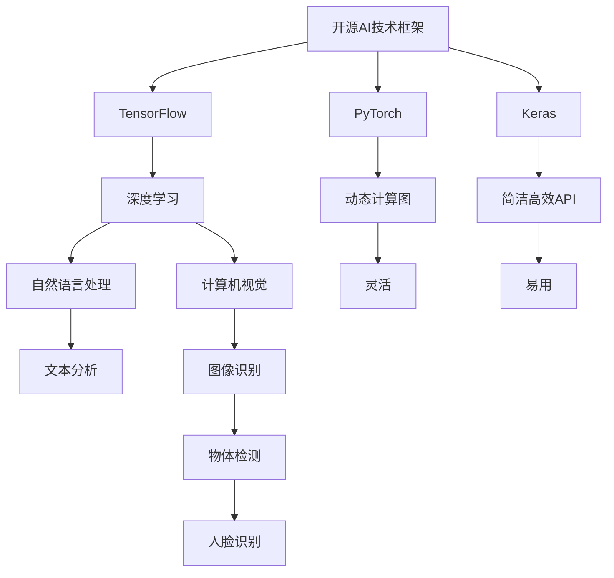

                 

# 《开源AI的未来：能否跟上闭源开发的步伐？》

## 关键词
- 开源AI
- 闭源AI
- 技术对比
- 挑战与应对
- 未来趋势
- 案例分析

## 摘要
本文将探讨开源AI与闭源AI的对比与发展现状，分析两者在技术、市场、生态等方面的异同。通过对开源AI面临的挑战及其应对策略的探讨，文章将预测开源AI的未来前景，并结合成功案例和闭源AI的分析，为开源AI的发展提供参考。

## 目录大纲

### 第一部分：背景与概念

#### 第1章：开源与闭源AI的对比
1.1.1 开源AI的优势与挑战
1.1.2 闭源AI的特点与市场影响

#### 第2章：开源AI的发展历程
2.1.1 开源AI的兴起
2.1.2 开源AI的里程碑事件
2.1.3 开源AI的现状与未来趋势

#### 第3章：闭源AI的崛起
3.1.1 闭源AI的定义与特征
3.1.2 闭源AI的主要公司与应用
3.1.3 闭源AI的市场分析

### 第二部分：开源与闭源AI的技术对比

#### 第4章：技术架构与工具对比
4.1.1 开源AI的技术框架
4.1.2 闭源AI的技术框架
4.1.3 两种架构的对比分析

#### 第5章：算法原理与优化
5.1.1 开源AI的核心算法
5.1.2 闭源AI的创新算法
5.1.3 算法的优化策略与效果

#### 第6章：开源与闭源AI的生态建设
6.1.1 开源AI社区与生态
6.1.2 闭源AI的商业模式
6.1.3 生态比较与未来走向

### 第三部分：开源AI的挑战与应对

#### 第7章：开源AI面临的挑战
7.1.1 技术与资源不平衡
7.1.2 知识产权保护问题
7.1.3 开源社区的管理与协调

#### 第8章：开源AI的应对策略
8.1.1 提升开源技术质量
8.1.2 加强社区合作与交流
8.1.3 创新开源商业模式

#### 第9章：开源AI的未来前景
9.1.1 开源与闭源AI的融合趋势
9.1.2 开源AI在各个领域的应用
9.1.3 开源AI的未来发展展望

### 第四部分：案例研究

#### 第10章：开源AI成功案例
10.1.1 代表性开源AI项目
10.1.2 案例分析与启示

#### 第11章：闭源AI案例分析
11.1.1 典型闭源AI企业
11.1.2 闭源AI的成功要素
11.1.3 闭源AI案例的启示

#### 附录

附录A：开源与闭源AI技术框架对比图

---

**第一部分：背景与概念**

#### 第1章：开源与闭源AI的对比

**1.1.1 开源AI的优势与挑战**

**开源AI** 是指在AI领域，开发者可以自由访问和修改源代码，共享知识和资源。这种模式有助于技术创新和协作，促进了AI技术的发展。

**优势：**
- **透明性**：开发者可以审查和改进代码，确保其质量和安全性。
- **社区协作**：开源社区成员可以共同贡献代码，提高开发效率。
- **灵活性**：开发者可以根据需求定制和优化AI系统。

**挑战：**
- **技术积累不足**：开源项目可能因为缺乏资金和人才支持，导致技术积累不足。
- **知识产权问题**：开源项目可能面临知识产权纠纷，影响其发展。

**1.1.2 闭源AI的特点与市场影响**

**闭源AI** 是指开发者不公开源代码，限制他人访问和修改。这种模式有助于企业保护其商业秘密，实现商业利益最大化。

**特点：**
- **商业利益**：闭源AI企业可以通过控制源代码获取商业利益。
- **技术保密**：闭源AI企业可以保护其核心技术，防止被竞争对手模仿。

**市场影响：**
- **市场竞争力**：闭源AI企业通过创新技术和独特商业模式，提升市场竞争力。
- **行业壁垒**：闭源AI企业可能形成行业壁垒，限制其他企业进入市场。

在接下来的章节中，我们将深入探讨开源AI的发展历程、闭源AI的崛起，以及两者在技术、生态等方面的对比。让我们一步步分析推理，共同探讨开源AI的未来前景。

---

**第二部分：开源与闭源AI的技术对比**

#### 第4章：技术架构与工具对比

**4.1.1 开源AI的技术框架**

开源AI技术框架通常包括深度学习、自然语言处理、计算机视觉等核心组件，开发者可以自由选择和组合。以下是几个常见的开源AI技术框架：

- **TensorFlow**：由Google开发，广泛应用于深度学习和神经网络。
- **PyTorch**：由Facebook开发，具有灵活的动态计算图和丰富的API。
- **Keras**：基于Theano和TensorFlow，提供了简洁高效的深度学习API。

**4.1.2 闭源AI的技术框架**

闭源AI技术框架通常由企业内部开发，对外不公开源代码。这些框架通常具有高度集成的特性，能够快速部署和优化。以下是几个常见的闭源AI技术框架：

- **Azure Machine Learning**：微软的闭源AI平台，提供数据预处理、模型训练和部署等功能。
- **AWS SageMaker**：亚马逊的闭源AI平台，支持模型训练、调试和部署。
- **Google AI Platform**：谷歌的闭源AI平台，提供模型训练、推理和自动化调参等功能。

**4.1.3 两种架构的对比分析**

开源AI技术框架和闭源AI技术框架各有优势，但在实际应用中存在一定的差异：

- **透明性**：开源AI技术框架具有更高的透明性，开发者可以审查和修改代码，提高系统的安全性和质量。闭源AI技术框架则保护了企业的商业秘密，但可能导致技术积累不足。
- **灵活性**：开源AI技术框架提供了更高的灵活性，开发者可以根据需求定制和优化AI系统。闭源AI技术框架则具有更高的集成度，能够快速部署和优化，但可能缺乏灵活性。
- **生态建设**：开源AI技术框架拥有庞大的社区和生态，开发者可以共同贡献代码，提高开发效率。闭源AI技术框架则由企业内部维护，可能缺乏社区支持。

在接下来的章节中，我们将进一步探讨开源AI和闭源AI在算法原理、优化策略等方面的对比。通过逐步分析，我们将更深入地理解两者的异同及其在AI领域的发展趋势。

---

**第三部分：开源AI的挑战与应对**

#### 第7章：开源AI面临的挑战

**7.1.1 技术与资源不平衡**

开源AI项目在技术积累和资源投入上存在一定的不平衡。一些大型开源项目如TensorFlow和PyTorch，由知名企业和研究机构支持，拥有强大的技术积累和资源投入。而一些小型开源项目则可能缺乏资金和人才支持，导致技术积累不足。

**7.1.2 知识产权保护问题**

开源AI项目在知识产权保护方面面临一定的挑战。由于源代码的开放性，开发者可以自由访问和修改代码，可能导致知识产权纠纷。此外，开源项目可能面临被竞争对手抄袭的风险，影响其发展。

**7.1.3 开源社区的管理与协调**

开源社区在管理和协调方面也面临一定的挑战。开源项目通常由志愿者维护，可能存在管理不力、协作困难等问题。此外，开源社区成员之间可能存在不同的观点和利益冲突，影响项目的进展。

#### 第8章：开源AI的应对策略

**8.1.1 提升开源技术质量**

提升开源技术质量是开源AI项目的重要策略。通过引入严格的质量控制机制，确保代码的可靠性和安全性。例如，引入代码审查、自动化测试等手段，提高代码质量。

**8.1.2 加强社区合作与交流**

加强社区合作与交流是开源AI项目的重要策略。通过建立良好的沟通渠道，促进开发者之间的交流与合作，提高开发效率。例如，举办开源AI会议、研讨会等活动，增进开发者之间的互动。

**8.1.3 创新开源商业模式**

创新开源商业模式是开源AI项目的重要策略。通过探索多元化的商业模式，实现开源项目的可持续发展。例如，引入商业赞助、付费服务等方式，为开源项目提供资金支持。

在接下来的章节中，我们将进一步探讨开源AI的未来前景，结合成功案例和闭源AI的分析，为开源AI的发展提供参考。通过逐步分析，我们将更深入地理解开源AI的挑战与应对策略。

---

**第四部分：案例研究**

#### 第10章：开源AI成功案例

**10.1.1 代表性开源AI项目**

开源AI领域有许多成功的案例，以下是一些代表性的开源AI项目：

- **TensorFlow**：由Google开发，广泛应用于深度学习和神经网络，是开源AI领域的佼佼者。
- **PyTorch**：由Facebook开发，具有灵活的动态计算图和丰富的API，深受开发者喜爱。
- **Keras**：基于Theano和TensorFlow，提供了简洁高效的深度学习API，是初学者和专业人士的良选。

**10.1.2 案例分析与启示**

这些开源AI项目的成功，为开源AI的发展提供了宝贵的经验。以下是一些主要的启示：

- **社区支持**：成功的开源AI项目通常拥有庞大的社区支持，开发者之间的交流与合作有助于项目的进展。
- **技术质量**：高质量的技术是开源AI项目成功的关键，通过严格的代码审查和自动化测试，确保代码的可靠性和安全性。
- **持续创新**：成功的开源AI项目不断进行技术创新，以满足用户的需求，保持竞争力。

在接下来的章节中，我们将探讨闭源AI的典型案例，进一步分析闭源AI的成功要素。通过案例研究，我们将更深入地理解开源AI和闭源AI的发展路径和趋势。

---

**第11章：闭源AI案例分析**

**11.1.1 典型闭源AI企业**

闭源AI领域有许多知名的企业，以下是一些典型的闭源AI企业：

- **IBM Watson**：IBM的AI平台，广泛应用于医疗、金融、零售等领域，是闭源AI领域的代表。
- **Google AI**：谷歌的AI部门，开发了TensorFlow等知名AI框架，并在多个领域进行应用。
- **Microsoft Azure AI**：微软的AI平台，提供丰富的AI服务和工具，助力企业实现智能化转型。

**11.1.2 闭源AI的成功要素**

闭源AI企业的成功通常离不开以下几个关键要素：

- **核心技术**：闭源AI企业拥有强大的核心技术，通过不断创新，保持技术领先地位。
- **商业模式**：闭源AI企业通过独特的商业模式，实现商业利益最大化，同时推动技术发展。
- **生态建设**：闭源AI企业重视生态建设，与合作伙伴共同推动AI技术的发展和应用。

**11.1.3 闭源AI案例的启示**

通过分析闭源AI企业的成功案例，我们可以得出以下启示：

- **技术保密**：闭源AI企业通过保护核心技术，防止被竞争对手模仿，确保自身竞争优势。
- **商业模式**：闭源AI企业通过多元化的商业模式，实现商业利益最大化，同时推动技术发展。
- **生态建设**：闭源AI企业重视生态建设，与合作伙伴共同推动AI技术的发展和应用。

在接下来的章节中，我们将结合开源AI和闭源AI的案例，探讨开源与闭源AI的融合趋势，以及开源AI的未来发展前景。通过深入分析，我们将为开源AI的发展提供有益的参考。

---

**第五部分：结论与展望**

**第12章：开源与闭源AI的融合趋势**

随着AI技术的快速发展，开源AI和闭源AI之间的界限逐渐模糊，两者呈现出融合趋势。以下是一些主要趋势：

- **混合模式**：越来越多的企业采用混合模式，同时利用开源AI和闭源AI的优势，实现技术突破和商业利益最大化。
- **开放生态**：开源AI项目逐渐开放生态，与闭源AI企业合作，共同推动AI技术的发展和应用。
- **跨界合作**：开源AI和闭源AI企业之间的合作日益增多，通过跨界合作，实现优势互补，推动AI技术的创新和应用。

**第13章：开源AI的未来发展前景**

开源AI在未来的发展前景广阔，以下是一些主要展望：

- **技术进步**：随着AI技术的不断进步，开源AI项目将在更多领域发挥重要作用，推动社会智能化转型。
- **社区合作**：开源AI项目将继续加强社区合作，通过开发者之间的交流与合作，推动技术的创新和优化。
- **商业模式创新**：开源AI项目将探索多元化的商业模式，实现可持续发展，为开源AI的长期发展奠定基础。

**第14章：开源AI的发展建议**

为了推动开源AI的健康发展，以下是一些建议：

- **提升技术质量**：开源AI项目应注重技术质量，通过严格的代码审查和自动化测试，确保代码的可靠性和安全性。
- **加强社区合作**：开源AI项目应加强社区合作，促进开发者之间的交流与合作，提高开发效率。
- **创新商业模式**：开源AI项目应积极探索多元化商业模式，实现可持续发展，为开源AI的长期发展提供支持。

在未来的发展中，开源AI与闭源AI的融合趋势将日益明显，两者将在AI技术的发展和应用中发挥重要作用。通过不断探索和创新，开源AI将迎来更加美好的未来。

---

**附录**

**附录A：开源与闭源AI技术框架对比图**

---

**作者信息**

作者：AI天才研究院/AI Genius Institute & 禅与计算机程序设计艺术 /Zen And The Art of Computer Programming**

