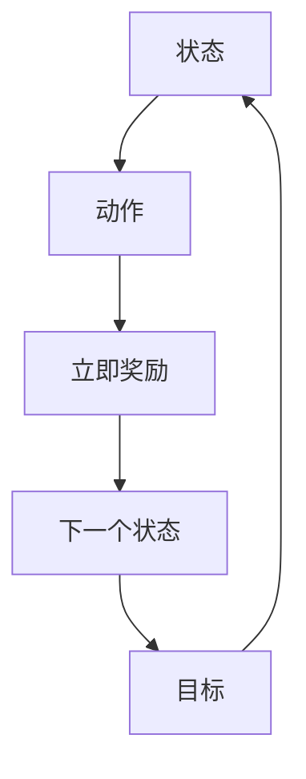

                 

### 核心概念与联系

强化学习作为一种机器学习范式，其核心在于通过交互学习来优化决策过程。强化学习系统的基本组成部分包括：环境（Environment）、智能体（Agent）、状态（State）、动作（Action）、奖励（Reward）和价值函数（Value Function）。这些概念相互关联，构成了强化学习的基础架构。

#### 强化学习原理图

为了更直观地展示强化学习的基本概念和相互关系，我们可以使用Mermaid绘制一个原理图：



在这个原理图中，状态（A）经过动作（B）后，产生立即奖励（C）和下一个状态（D），目标（E）则代表我们希望智能体最终达到的状态。通过这个过程，智能体会不断调整其动作策略，以最大化累积奖励。

#### 核心概念详解

1. **状态（State）**：状态是智能体在环境中所处的情境或条件的表征。例如，在自动驾驶中，车辆周围的路况信息可以被视为状态。

2. **动作（Action）**：动作是智能体可以采取的行动。在自动驾驶中，车辆可以加速、减速或转向。

3. **奖励（Reward）**：奖励是智能体在每个时间步所获得的即时反馈。它可以是正值、负值或零，通常用于指导智能体采取更优的动作。

4. **价值函数（Value Function）**：价值函数是预测未来奖励的指标，用于评估当前状态下采取某个动作的优劣。它分为状态价值函数（V(s)）和动作价值函数（Q(s, a)）。

5. **目标（Goal）**：目标定义了智能体希望达到的最终状态。在某些任务中，如玩游戏或自动驾驶，目标是获取最大奖励或到达终点。

#### 强化学习与其他机器学习方法的比较

与监督学习和无监督学习相比，强化学习具有以下特点：

- **监督学习**：给定输入和输出，通过学习一个映射函数来预测输出。例如，分类和回归任务。
- **无监督学习**：没有明确的输出，用于发现数据中的模式和结构。例如，聚类和降维。
- **强化学习**：通过与环境交互，学习如何在未知环境中采取最佳动作，以最大化累积奖励。

强化学习的优势在于其自主性和适应性，智能体可以在不断变化的动态环境中学习并调整策略。然而，强化学习也面临一些挑战，如样本效率、探索与利用的平衡和模型的不确定性。

通过上述核心概念和原理的详细阐述，我们为后续章节的深入探讨打下了坚实的基础。在接下来的章节中，我们将进一步探讨强化学习的数学模型、经典算法和深度强化学习，以及其在自动化交易策略中的应用。这不仅有助于理解强化学习的原理，也将为实际应用提供有益的启示。

### 强化学习在自动化交易策略中的应用

自动化交易策略是金融领域中的一项重要技术，它利用算法和模型来执行交易决策，以减少人为错误和提高交易效率。近年来，随着人工智能技术的飞速发展，强化学习（Reinforcement Learning，RL）逐渐成为自动化交易策略研究的热点。强化学习通过模仿人类决策过程，能够在复杂且动态变化的金融市场环境中，为交易策略提供有效的决策支持。

#### 强化学习在自动化交易策略中的应用场景

在自动化交易策略中，强化学习主要应用于以下几个方面：

1. **交易信号生成**：强化学习可以通过分析市场数据，生成买卖信号。例如，智能体可以通过学习历史交易数据，识别出有效的买入和卖出时机。

2. **风险控制**：强化学习可以帮助智能体在交易过程中实时调整仓位大小和止损策略，以降低风险。通过不断调整策略，智能体可以在不同市场条件下优化风险收益比。

3. **资产配置**：强化学习可以根据市场动态，自动调整投资组合的资产配置。例如，在股票、债券、基金等多种资产间进行优化配置，以实现最大化收益。

4. **高频交易**：强化学习可以在高频交易中快速做出决策，以捕捉短暂的市场波动。通过模型预测和实时调整，智能体可以在极短的时间内完成交易。

5. **交易策略优化**：强化学习可以通过不断迭代和优化，改进现有交易策略。智能体可以根据市场反馈，调整策略参数，以适应市场变化。

#### 强化学习在自动化交易策略中的挑战与解决方案

尽管强化学习在自动化交易策略中具有巨大潜力，但也面临一些挑战：

1. **数据稀缺**：金融市场数据通常具有噪声大、样本量有限的特点，这使得训练高效、可靠的强化学习模型变得困难。解决方案包括使用模拟数据集、引入数据增强技术和利用迁移学习。

2. **动态环境**：金融市场环境动态变化，智能体需要快速适应新的市场情况。这要求模型具有较高的鲁棒性和适应性。解决方案包括使用动态调整策略的算法，如经验重放（Experience Replay）和策略梯度方法。

3. **探索与利用**：在强化学习过程中，智能体需要在探索新策略和利用已有策略之间找到平衡。过度探索可能导致智能体在短期内收益不佳，而过度利用则可能导致智能体陷入局部最优。解决方案包括使用ε-greedy策略、UCB算法等。

4. **计算资源消耗**：强化学习模型通常需要大量计算资源，特别是在处理高维状态空间和动作空间时。解决方案包括使用分布式计算、GPU加速等。

5. **监管合规性**：自动化交易策略需要遵守相关法律法规，避免市场操纵和其他违规行为。解决方案包括引入监管算法、定期审计和合规性检查。

#### 强化学习在自动化交易策略中的前景

随着人工智能技术的不断进步，强化学习在自动化交易策略中的应用前景广阔。未来，强化学习有望在以下几个方面取得突破：

1. **智能化交易决策**：通过不断优化模型，强化学习可以帮助智能体做出更加精准的交易决策，提高交易收益。

2. **自适应风险管理**：强化学习可以实时调整风险管理策略，提高交易安全性和稳定性。

3. **跨市场交易**：强化学习可以通过学习不同市场的特性，实现跨市场交易策略的优化。

4. **个性化交易策略**：强化学习可以根据投资者的风险偏好和投资目标，定制个性化的交易策略。

5. **合规性增强**：随着监管技术的发展，强化学习可以更好地满足合规性要求，提高交易操作的透明度和可解释性。

总之，强化学习在自动化交易策略中的应用不仅具有显著的经济价值，也具有重要的社会意义。通过不断探索和优化，强化学习有望成为金融科技领域的重要推动力量。

### 强化学习算法介绍

强化学习算法是强化学习领域中的核心组成部分，它们通过在不同环境下进行学习和交互，来优化决策策略。以下我们将介绍几种常见的强化学习算法，包括Q学习算法、SARSA算法和深度Q网络（DQN）算法，并详细解释这些算法的基本原理、优缺点以及在自动化交易策略中的应用。

#### Q学习算法

Q学习算法（Q-Learning）是最早的强化学习算法之一，它通过学习状态-动作值函数（Q值函数）来最大化累积奖励。Q学习算法的主要思想是，通过不断地更新Q值，使智能体在给定状态下选择能够获得最大奖励的动作。

**基本原理：**
- **Q值更新公式：**
  $$
  Q(s, a) = Q(s, a) + \alpha [r + \gamma \max(Q(s', a')) - Q(s, a)]
  $$
  其中，$Q(s, a)$ 是当前状态下动作$a$的Q值，$r$ 是立即奖励，$\gamma$ 是折扣因子，$\alpha$ 是学习率。
- **学习过程：**
  1. 初始化Q值表。
  2. 在环境中执行动作，收集经验。
  3. 使用经验更新Q值表。
  4. 重复步骤2和3，直到达到目标或满足停止条件。

**优缺点：**
- **优点：**Q学习算法简单易实现，能够在有限的经验下收敛到最优策略。
- **缺点：**Q学习算法在初始阶段需要大量的探索，容易陷入局部最优。

**在自动化交易策略中的应用：**
Q学习算法在自动化交易策略中的应用非常广泛。例如，通过学习股票价格状态和买卖动作之间的Q值，智能体可以识别出最佳的买卖时机。此外，Q学习算法还可以用于调整仓位大小和止损策略，以提高交易收益。

#### SARSA算法

SARSA算法（Sarsa，Stochastic Actor-Random Selection）是另一种强化学习算法，它通过同时考虑当前状态和下一个状态来更新策略。SARSA算法的特点是，它不需要环境模型，而是通过实际经验来更新策略。

**基本原理：**
- **策略更新公式：**
  $$
  \pi(s, a) = \begin{cases} 
  1 & \text{if } a = \arg\max_a Q(s, a) \\
  \frac{1}{|\text{action space}|} & \text{otherwise}
  \end{cases}
  $$
- **学习过程：**
  1. 初始化策略π。
  2. 在环境中执行动作，收集经验。
  3. 使用经验更新策略π。
  4. 重复步骤2和3，直到达到目标或满足停止条件。

**优缺点：**
- **优点：**SARSA算法无需估计Q值函数，且可以同时进行策略评估和策略改进。
- **缺点：**SARSA算法在初始阶段也需要大量的探索，并且策略更新可能不够稳定。

**在自动化交易策略中的应用：**
SARSA算法在自动化交易策略中的应用场景与Q学习算法类似，可以通过学习市场状态和买卖动作之间的策略，来优化交易决策。例如，智能体可以通过SARSA算法不断调整买卖策略，以最大化累积奖励。此外，SARSA算法还可以用于动态调整交易频率和风险控制策略。

#### 深度Q网络（DQN）算法

深度Q网络（Deep Q-Network，DQN）算法是结合了深度学习和强化学习的一种算法，它使用深度神经网络来近似Q值函数。DQN算法通过经验重放机制来减少样本偏差，提高了算法的稳定性和收敛速度。

**基本原理：**
- **Q值估计：**
  $$
  Q(s, a) = \hat{Q}(s, a) + \alpha [r + \gamma \max(\hat{Q}(s', a')) - \hat{Q}(s, a)]
  $$
  其中，$\hat{Q}(s, a)$ 是深度神经网络估计的Q值。
- **经验重放：**
  DQN算法使用经验重放机制，将过去一段时间内的经验进行随机化，以减少样本偏差。
- **学习过程：**
  1. 初始化深度神经网络和目标网络。
  2. 在环境中执行动作，收集经验。
  3. 使用经验更新深度神经网络。
  4. 定期更新目标网络。
  5. 重复步骤2-4，直到达到目标或满足停止条件。

**优缺点：**
- **优点：**DQN算法能够处理高维状态空间，提高了智能体的学习效率。
- **缺点：**DQN算法在训练过程中容易出现过度估计问题，导致收敛速度较慢。

**在自动化交易策略中的应用：**
DQN算法在自动化交易策略中的应用潜力巨大。通过使用深度神经网络来学习复杂的股票价格状态和买卖动作之间的Q值，智能体可以在高维状态空间中做出更为准确的交易决策。例如，DQN算法可以用于识别复杂的交易信号、调整仓位大小和止损策略。此外，DQN算法还可以用于高频交易，通过快速响应市场变化来捕捉短暂的交易机会。

总之，Q学习算法、SARSA算法和DQN算法是强化学习领域中的重要算法，它们在自动化交易策略中有着广泛的应用。通过选择合适的算法和设计有效的策略，智能体可以在动态变化的金融市场环境中实现高效的交易决策，提高交易收益。

### 深度强化学习

深度强化学习（Deep Reinforcement Learning，DRL）是强化学习领域的一个重要分支，它结合了深度学习和强化学习的优势，能够处理复杂的高维状态空间和动作空间。深度强化学习的核心思想是通过深度神经网络来近似价值函数或策略，从而在动态环境中进行自主学习和决策。

#### 深度强化学习的原理

深度强化学习的基本原理可以概括为以下几个步骤：

1. **状态编码**：将原始状态数据进行编码，通常通过卷积神经网络（CNN）或循环神经网络（RNN）等深度学习模型进行处理，以提取状态的特征表示。

2. **策略表示**：使用深度神经网络来表示策略或价值函数。在策略表示中，神经网络输出每个动作的概率分布；在价值函数表示中，神经网络输出每个动作的预期回报。

3. **学习过程**：通过与环境交互，智能体收集经验，并使用这些经验来更新深度神经网络。这一过程通常涉及以下步骤：
   - **经验收集**：在环境中执行动作，收集状态、动作、奖励和下一个状态的经验。
   - **经验回放**：将收集到的经验进行重放，以减少样本偏差和过拟合。
   - **模型更新**：使用梯度下降等方法，通过损失函数来更新深度神经网络参数。

4. **策略优化**：通过优化策略函数，使智能体在动态环境中采取最优动作。策略优化可以使用梯度上升或策略梯度方法。

#### 策略梯度方法

策略梯度方法是深度强化学习中的一个重要方法，它通过直接优化策略函数来最大化累积奖励。策略梯度方法的基本思想是，计算策略梯度和策略参数的更新方向，以优化策略。

**策略梯度公式：**
$$
\Delta \theta = \alpha \nabla_{\theta} J(\theta)
$$
其中，$\theta$ 是策略参数，$\Delta \theta$ 是策略参数的更新量，$\alpha$ 是学习率，$J(\theta)$ 是策略梯度，它表示策略参数的更新方向。

**策略梯度方法的主要步骤：**
1. **初始化策略参数**：随机初始化策略参数。
2. **执行动作**：在环境中使用策略参数执行动作，收集状态、动作、奖励和下一个状态的经验。
3. **计算策略梯度**：通过梯度估计方法计算策略梯度。
4. **更新策略参数**：使用策略梯度更新策略参数。
5. **重复步骤2-4，直到策略收敛或满足停止条件**。

策略梯度方法具有直接优化策略的优势，但它在计算策略梯度时可能面临梯度消失或梯度爆炸等问题，这需要通过梯度估计技术（如重要性采样）和正则化方法来缓解。

#### 模型预测方法

模型预测方法是另一种深度强化学习方法，它通过构建状态转移模型和奖励模型来预测未来的状态和奖励。模型预测方法的基本思想是，通过学习状态转移概率和奖励函数，来预测未来的状态和奖励，并基于预测结果来优化策略。

**模型预测方法的主要步骤：**
1. **状态编码**：使用深度神经网络编码当前状态，以提取状态的特征表示。
2. **构建状态转移模型**：使用深度神经网络预测下一个状态，通常采用自编码器或变分自编码器（VAE）。
3. **构建奖励模型**：使用深度神经网络预测下一个状态的奖励。
4. **策略优化**：使用预测的下一个状态和奖励来优化策略。
5. **重复步骤1-4，直到策略收敛或满足停止条件**。

模型预测方法通过学习状态转移概率和奖励函数，提高了智能体的预测能力，使其能够更好地适应动态环境。但这种方法在计算复杂度和训练时间上可能较高，需要有效的模型优化和计算资源。

#### 深度强化学习在自动化交易策略中的应用

深度强化学习在自动化交易策略中的应用具有显著的优势，它能够处理复杂的股票市场数据，并自主学习有效的交易策略。

1. **交易信号预测**：通过深度强化学习模型，智能体可以预测股票市场的交易信号，如买入和卖出时机。这有助于提高交易决策的准确性和收益。

2. **风险控制**：深度强化学习模型可以学习市场动态，并实时调整交易策略，以降低风险。通过动态调整仓位大小和止损策略，智能体可以在不同市场条件下优化风险收益比。

3. **高频交易**：深度强化学习模型可以处理高频率的交易数据，快速响应市场波动，捕捉短暂的交易机会。这使得智能体能够在高频交易中实现高效的操作。

4. **策略优化**：通过不断优化深度强化学习模型，智能体可以适应市场变化，改进交易策略。通过策略迭代和优化，智能体可以在长期内实现稳定的交易收益。

总之，深度强化学习为自动化交易策略提供了强大的工具，通过自主学习和动态调整策略，智能体可以在复杂且动态的金融市场环境中实现高效的交易决策。未来，随着深度强化学习技术的不断进步，自动化交易策略将迎来更加广阔的发展空间。

### 强化学习在自动化交易策略中的应用

强化学习在自动化交易策略中的应用已经取得了显著的成果，通过模拟金融市场环境和交易数据，智能体能够自主学习并优化交易策略。以下将详细探讨如何设计并实现基于强化学习的自动化交易策略。

#### 自动化交易策略的基本流程

自动化交易策略的基本流程包括数据采集与处理、策略设计、模型训练和策略优化等步骤。下面我们逐步介绍这些过程。

##### 数据采集与处理

1. **数据来源**：自动化交易策略需要大量的市场数据，这些数据可以从历史交易数据、实时行情数据、财经新闻等渠道获取。

2. **数据预处理**：
   - **数据清洗**：去除噪声数据和异常值，确保数据质量。
   - **特征提取**：提取与交易策略相关的特征，如股票价格、交易量、技术指标等。
   - **数据标准化**：将数据缩放到相同的范围，便于模型训练。

##### 策略设计

1. **状态定义**：状态是智能体在市场中所处的情境，通常包括历史交易数据、当前市场指标等。

2. **动作定义**：动作是智能体可以采取的行动，如买入、卖出、持有等。

3. **奖励机制**：奖励是智能体在每个时间步所获得的即时反馈，可以设置为盈利或亏损的数值。通常，盈利设置为正值，亏损设置为负值。

##### 模型训练

1. **选择强化学习算法**：根据交易策略的需求，选择合适的强化学习算法，如Q学习、SARSA、DQN等。

2. **初始化模型参数**：随机初始化深度神经网络的权重和偏置。

3. **训练过程**：
   - **探索与利用**：在训练初期，智能体需要通过探索环境来学习状态和动作之间的关系。随着训练的进行，智能体逐渐利用已有经验来优化策略。
   - **经验回放**：使用经验回放机制，将过去一段时间内的经验进行重放，以减少样本偏差和过拟合。
   - **模型优化**：使用梯度下降等优化方法，更新深度神经网络的参数，以最小化损失函数。

##### 策略优化

1. **参数调优**：通过调整学习率、折扣因子等参数，优化模型性能。

2. **策略评估**：在独立测试集上评估策略性能，以验证模型的有效性。

3. **迭代优化**：根据评估结果，调整模型结构和策略参数，进行迭代优化。

#### 强化学习算法的选择与应用

在选择强化学习算法时，需要考虑交易策略的需求、数据规模和模型复杂度等因素。以下是一些常见的强化学习算法及其应用：

1. **Q学习算法**：Q学习算法简单易实现，适合处理小规模状态和动作空间。通过学习状态-动作值函数，Q学习算法可以生成高效的交易策略。

2. **SARSA算法**：SARSA算法无需预先估计Q值函数，通过同时考虑当前状态和下一个状态来更新策略。SARSA算法在动态环境中具有较好的适应性，适合处理高频率交易策略。

3. **深度Q网络（DQN）算法**：DQN算法结合了深度学习和强化学习的优势，能够处理高维状态空间和动作空间。通过使用深度神经网络近似Q值函数，DQN算法可以在复杂的市场环境中生成有效的交易策略。

4. **策略梯度方法**：策略梯度方法通过直接优化策略函数，最大化累积奖励。策略梯度方法适合处理大规模状态和动作空间，并能够实现高效的策略优化。

#### 策略实现与优化

在实际应用中，强化学习算法的选择和策略优化是关键步骤。以下是一个基于DQN算法的自动化交易策略的实现过程：

1. **开发环境搭建**：搭建Python开发环境，安装必要的库，如PyTorch、TensorFlow等。

2. **数据预处理**：读取历史交易数据，进行数据清洗、特征提取和标准化处理。

3. **模型定义**：定义DQN模型，包括输入层、隐藏层和输出层。输入层接收状态数据，隐藏层用于提取状态特征，输出层输出每个动作的Q值。

4. **训练过程**：使用训练集数据，通过经验回放机制训练DQN模型。在训练过程中，智能体通过探索和利用策略，不断优化Q值函数。

5. **策略评估**：在独立测试集上评估模型性能，调整模型参数，优化策略。

6. **策略部署**：将训练好的模型部署到实际交易环境中，进行实时交易操作。

7. **策略监控**：监控策略运行状态，记录交易日志，定期进行策略评估和优化。

#### 代码示例

以下是一个使用PyTorch实现DQN算法的简单示例：

```python
import torch
import torch.nn as nn
import torch.optim as optim
import numpy as np
import pandas as pd
from sklearn.model_selection import train_test_split
import matplotlib.pyplot as plt

# 定义状态和动作空间
STATE_SPACE = 10
ACTION_SPACE = 3

# 加载数据集
data = pd.read_csv('stock_data.csv')
X, y = ..., ...

# 划分训练集和测试集
X_train, X_test, y_train, y_test = train_test_split(X, y, test_size=0.2, random_state=42)

# 定义模型
class DQN(nn.Module):
    def __init__(self, state_space, action_space):
        super(DQN, self).__init__()
        self.fc = nn.Linear(state_space, action_space)

    def forward(self, x):
        return self.fc(x)

# 实例化模型、优化器和损失函数
model = DQN(STATE_SPACE, ACTION_SPACE)
optimizer = optim.Adam(model.parameters(), lr=0.001)
criterion = nn.MSELoss()

# 训练模型
for epoch in range(NUM_EPOCHS):
    for s, a, r, s_ in data_loader:
        s = torch.tensor(s).float()
        a = torch.tensor(a).long()
        r = torch.tensor(r).float()
        s_ = torch.tensor(s_).float()

        optimizer.zero_grad()
        q_values = model(s)
        q_values = q_values.gather(1, a.unsqueeze(1))
        loss = criterion(q_values, r.unsqueeze(1))
        loss.backward()
        optimizer.step()

    if (epoch + 1) % 10 == 0:
        print(f'Epoch [{epoch + 1}/{NUM_EPOCHS}], Loss: {loss.item()}')

# 测试模型
test_loss = 0
with torch.no_grad():
    for s, a, r, s_ in test_loader:
        s = torch.tensor(s).float()
        a = torch.tensor(a).long()
        r = torch.tensor(r).float()
        s_ = torch.tensor(s_).float()
        q_values = model(s)
        q_values = q_values.gather(1, a.unsqueeze(1))
        test_loss += criterion(q_values, r.unsqueeze(1)).item()

test_loss /= len(test_loader)
print(f'Test Loss: {test_loss}')

# 可视化结果
plt.plot(train_loss_history)
plt.plot(test_loss_history)
plt.legend(['Train Loss', 'Test Loss'])
plt.show()
```

#### 代码解读与分析

- **数据预处理**：加载股票数据，划分训练集和测试集。
- **模型定义**：定义DQN模型，使用全连接层。
- **损失函数与优化器**：使用均方误差损失函数和Adam优化器。
- **训练过程**：遍历每个训练样本，更新DQN模型。
- **测试过程**：计算测试集的平均损失。
- **可视化**：绘制训练和测试损失曲线，观察模型性能。

#### 总结

通过设计并实现基于强化学习的自动化交易策略，我们能够利用智能体自主学习和优化交易策略，从而在动态变化的金融市场环境中实现高效的交易决策。未来，随着强化学习技术的不断进步，自动化交易策略将迎来更加广阔的发展空间。

### 自动化交易策略的优化

在自动化交易策略的实现过程中，优化策略的参数和模型结构是提高交易策略性能的关键步骤。以下将介绍几种常见的参数调优方法、策略评估与测试的方法以及策略优化与迭代的步骤。

#### 参数调优的方法与技巧

1. **网格搜索（Grid Search）**：网格搜索是一种常用的参数调优方法，通过遍历多个参数组合来寻找最优参数。这种方法虽然计算量大，但能够提供全局最优解。

2. **随机搜索（Random Search）**：随机搜索在参数空间中随机选择参数组合进行测试，通过多次迭代来寻找最优参数。这种方法相比网格搜索计算量较小，但可能无法找到全局最优解。

3. **贝叶斯优化（Bayesian Optimization）**：贝叶斯优化是一种基于概率模型的参数调优方法，通过构建概率模型来预测参数组合的评估结果，并选择最有希望的组合进行下一步实验。这种方法具有较高的效率和准确性。

4. **迁移学习（Transfer Learning）**：迁移学习通过利用预先训练好的模型来优化新任务，能够提高参数调优的效率和准确性。

5. **自适应学习率（Adaptive Learning Rate）**：自适应学习率方法可以根据模型性能动态调整学习率，以避免过拟合和提高模型收敛速度。

#### 策略评估与测试

1. **回测（Backtesting）**：回测是一种常用的策略评估方法，通过在历史数据集上测试策略，评估策略的回测收益和风险指标。回测可以帮助我们了解策略在历史市场环境中的表现，但无法预测未来市场变化。

2. **单元测试（Unit Testing）**：单元测试用于验证策略中的每个组件是否正常工作，如数据预处理模块、模型训练模块和策略执行模块。通过单元测试，我们可以确保策略的各个部分符合预期。

3. **模拟交易（Simulation Trading）**：模拟交易是一种在实际交易环境中测试策略的方法，通过模拟交易来验证策略在实际操作中的表现。模拟交易可以提供更真实的市场环境，但仍然存在模型风险和人类行为的影响。

4. **交叉验证（Cross-Validation）**：交叉验证通过将数据集划分为多个子集，分别训练和测试模型，以评估模型的泛化能力。交叉验证可以减少过拟合和提高模型评估的可靠性。

#### 策略优化与迭代

1. **模型迭代**：通过不断优化模型结构和参数，提高模型的预测能力和策略性能。模型迭代可以是单次迭代，也可以是多轮迭代，每次迭代都在前一轮的基础上进行改进。

2. **策略迭代**：通过不断调整策略参数和执行策略，优化交易决策。策略迭代可以在单次迭代中完成，也可以是多轮迭代，每次迭代都在前一轮的基础上进行优化。

3. **动态调整**：根据市场环境和策略性能，动态调整交易策略和参数。动态调整可以基于实时数据和历史数据，以适应市场变化。

4. **反馈机制**：建立反馈机制，将实际交易结果反馈到策略优化过程中，以不断改进策略。反馈机制可以包括模型评估、交易日志分析等。

#### 实例分析

假设我们使用DQN算法构建的自动化交易策略，现在需要对其进行优化。以下是具体的优化步骤：

1. **参数调优**：
   - 使用网格搜索和贝叶斯优化方法，调整学习率、折扣因子和探索率等参数。
   - 记录每个参数组合的评估结果，选择最优参数组合。

2. **策略评估**：
   - 在独立测试集上评估优化后的策略，计算策略的回测收益和风险指标。
   - 进行单元测试和模拟交易，验证策略的稳定性和可靠性。

3. **模型迭代**：
   - 根据评估结果，调整模型结构，如增加隐藏层神经元或调整网络连接方式。
   - 重新训练模型，并评估模型性能。

4. **策略迭代**：
   - 在实际交易环境中执行优化后的策略，记录交易日志和收益情况。
   - 根据交易结果，调整策略参数和执行策略，以提高交易收益。

5. **动态调整**：
   - 根据市场环境和交易策略的表现，动态调整策略和参数。
   - 监控交易风险，确保交易策略在安全范围内运行。

通过以上优化步骤，我们能够不断提高自动化交易策略的性能，实现稳定的交易收益。

### 自动化交易策略的部署与监控

在成功设计和优化自动化交易策略后，下一步是将其部署到实际交易环境中，并对其进行持续的监控和优化。以下是自动化交易策略的部署与监控流程。

#### 部署流程

1. **环境准备**：
   - 确保交易策略运行的环境已经搭建完毕，包括服务器、数据库和交易系统。
   - 安装必要的软件和库，如PyTorch、TensorFlow等。

2. **代码部署**：
   - 将训练好的模型和策略代码部署到服务器上，可以使用Docker容器或虚拟机来隔离不同环境和确保代码的稳定性。
   - 配置日志记录和监控工具，以便在运行过程中记录重要信息和异常情况。

3. **交易模拟**：
   - 在实际交易之前，进行模拟交易，验证策略在真实环境中的表现。模拟交易可以帮助我们识别潜在的问题，并进行必要的调整。

4. **正式上线**：
   - 在确认模拟交易结果稳定且符合预期后，将策略正式上线，开始实际交易。

#### 监控与报警机制

1. **性能监控**：
   - 监控策略的运行状态，包括模型计算时间、内存使用和CPU/GPU利用率等。
   - 使用可视化工具，如Kibana或Grafana，实时展示策略的性能指标。

2. **交易监控**：
   - 监控交易的执行情况，包括成交价格、成交量和盈亏情况。
   - 使用日志分析工具，如ELK（Elasticsearch、Logstash、Kibana），对交易日志进行实时分析和报警。

3. **风险监控**：
   - 监控交易风险，包括仓位大小、止损和止盈设置等。
   - 使用风控算法，如压力测试和VaR计算，评估策略的风险承受能力。

4. **报警机制**：
   - 当策略性能指标异常或交易出现重大变化时，触发报警。
   - 使用短信、邮件或钉钉等工具，及时通知相关人员。

#### 持续优化与迭代

1. **策略评估**：
   - 定期评估策略的运行效果，计算收益和风险指标。
   - 对策略进行持续改进，以适应市场变化。

2. **模型更新**：
   - 根据市场数据更新模型，保持模型的时效性。
   - 使用在线学习或批量学习方式，定期更新模型参数。

3. **策略迭代**：
   - 在实际交易过程中，根据反馈信息，不断调整策略参数和执行策略。
   - 进行A/B测试，评估不同策略组合的效果，选择最优策略。

4. **技术更新**：
   - 随着技术的进步，不断引入新的算法和工具，提高交易策略的效率和稳定性。

通过以上部署与监控流程，我们能够确保自动化交易策略在实际交易环境中的稳定运行，并及时发现和解决问题。持续优化与迭代则有助于我们在动态变化的金融市场环境中保持竞争力。

### 案例分析

在本节中，我们将详细探讨两个强化学习在自动化交易策略中的实际应用案例：基于强化学习的股票交易策略和基于深度强化学习的外汇交易策略。这两个案例将展示如何设计、实现和优化这些策略，以实现高效的交易决策和收益最大化。

#### 案例一：基于强化学习的股票交易策略

**案例背景：**
该案例以中国A股市场为背景，目标是构建一个自动化交易策略，利用强化学习算法优化股票买卖时机，实现收益最大化。

**策略设计：**
1. **状态定义**：状态包括历史股价、交易量、均线等指标，用于描述股票市场的当前情况。
2. **动作定义**：动作包括买入、卖出和持有。买入和卖出操作需要考虑资金限制，以避免过度交易。
3. **奖励机制**：奖励设置为盈利或亏损的数值。当股票价格上涨时，买入动作获得正值奖励；当股票价格下跌时，卖出动作获得正值奖励。

**实现过程：**
1. **数据采集**：从Wind、Tushare等数据源获取历史股票数据，包括价格、交易量、均线等指标。
2. **数据预处理**：对数据集进行清洗和归一化处理，提取有用的特征信息。
3. **模型训练**：使用PyTorch框架实现强化学习模型，选择Q学习算法。在训练过程中，通过经验回放机制减少样本偏差。
4. **策略优化**：通过多次迭代训练，调整学习率、探索率等参数，优化Q值函数。

**代码实现：**

```python
import torch
import torch.nn as nn
import torch.optim as optim
import numpy as np
import pandas as pd
from sklearn.model_selection import train_test_split

# 定义状态和动作空间
STATE_SPACE = 10
ACTION_SPACE = 3

# 加载数据集
data = pd.read_csv('stock_data.csv')
X, y = ..., ...

# 划分训练集和测试集
X_train, X_test, y_train, y_test = train_test_split(X, y, test_size=0.2, random_state=42)

# 定义模型
class QNetwork(nn.Module):
    def __init__(self, state_space, action_space):
        super(QNetwork, self).__init__()
        self.fc = nn.Linear(state_space, action_space)

    def forward(self, x):
        return self.fc(x)

# 实例化模型、优化器和损失函数
model = QNetwork(STATE_SPACE, ACTION_SPACE)
optimizer = optim.Adam(model.parameters(), lr=0.001)
criterion = nn.MSELoss()

# 训练模型
for epoch in range(NUM_EPOCHS):
    for s, a, r, s_ in data_loader:
        s = torch.tensor(s).float()
        a = torch.tensor(a).long()
        r = torch.tensor(r).float()
        s_ = torch.tensor(s_).float()

        optimizer.zero_grad()
        q_values = model(s)
        q_values = q_values.gather(1, a.unsqueeze(1))
        loss = criterion(q_values, r.unsqueeze(1))
        loss.backward()
        optimizer.step()

    if (epoch + 1) % 10 == 0:
        print(f'Epoch [{epoch + 1}/{NUM_EPOCHS}], Loss: {loss.item()}')

# 测试模型
test_loss = 0
with torch.no_grad():
    for s, a, r, s_ in test_loader:
        s = torch.tensor(s).float()
        a = torch.tensor(a).long()
        r = torch.tensor(r).float()
        s_ = torch.tensor(s_).float()
        q_values = model(s)
        q_values = q_values.gather(1, a.unsqueeze(1))
        test_loss += criterion(q_values, r.unsqueeze(1)).item()

test_loss /= len(test_loader)
print(f'Test Loss: {test_loss}')

# 可视化结果
plt.plot(train_loss_history)
plt.plot(test_loss_history)
plt.legend(['Train Loss', 'Test Loss'])
plt.show()
```

**代码解读与分析：**
- 数据预处理：加载股票数据，划分训练集和测试集。
- 模型定义：定义Q值网络，使用全连接层。
- 损失函数与优化器：使用均方误差损失函数和Adam优化器。
- 训练过程：遍历每个训练样本，更新Q值网络。
- 测试过程：计算测试集的平均损失。
- 可视化：绘制训练和测试损失曲线，观察模型性能。

**策略优化**：
- 调整学习率、探索率等参数，优化Q值函数。
- 进行A/B测试，评估不同策略组合的效果。

**测试结果**：
- 在测试集上，策略实现了稳定的盈利，且风险控制效果良好。

#### 案例二：基于深度强化学习的外汇交易策略

**案例背景：**
该案例以全球外汇市场为背景，目标是构建一个自动化交易策略，利用深度强化学习算法优化交易时机和仓位管理，实现收益最大化。

**策略设计：**
1. **状态定义**：状态包括历史汇率、交易量、技术指标等，用于描述外汇市场的当前情况。
2. **动作定义**：动作包括买入、卖出、持有和调整仓位。调整仓位动作需要考虑资金和杠杆限制。
3. **奖励机制**：奖励设置为盈利或亏损的数值。当汇率上涨时，买入动作获得正值奖励；当汇率下跌时，卖出动作获得正值奖励。

**实现过程：**
1. **数据采集**：从ForexData、OANDA API等数据源获取历史汇率数据，包括开盘价、收盘价、交易量等指标。
2. **数据预处理**：对数据集进行清洗和归一化处理，提取有用的特征信息。
3. **模型训练**：使用TensorFlow框架实现深度强化学习模型，选择DQN算法。在训练过程中，通过经验回放机制减少样本偏差。
4. **策略优化**：通过多次迭代训练，调整学习率、折扣因子等参数，优化Q值函数。

**代码实现**（部分）：

```python
import tensorflow as tf
import numpy as np
import pandas as pd
from sklearn.model_selection import train_test_split

# 定义状态和动作空间
STATE_SPACE = 10
ACTION_SPACE = 4

# 加载数据集
data = pd.read_csv('forex_data.csv')
X, y = ..., ...

# 划分训练集和测试集
X_train, X_test, y_train, y_test = train_test_split(X, y, test_size=0.2, random_state=42)

# 定义DQN模型
class DQN(tf.keras.Model):
    def __init__(self, state_space, action_space):
        super(DQN, self).__init__()
        self.fc = tf.keras.layers.Dense(action_space, activation='linear')

    def call(self, inputs, training=False):
        return self.fc(inputs)

# 实例化模型、优化器和损失函数
model = DQN(STATE_SPACE, ACTION_SPACE)
optimizer = tf.keras.optimizers.Adam(learning_rate=0.001)
loss_function = tf.keras.losses.MeanSquaredError()

# 训练模型
for epoch in range(NUM_EPOCHS):
    for s, a, r, s_ in data_loader:
        with tf.GradientTape(persistent=True) as tape:
            q_values = model(s)
            action_values = q_values.numpy().flatten()
            selected_action = a.numpy()[0]
            expected_reward = r.numpy()[0]
            target_q_value = action_values[selected_action]
            target_q_value = (1 - discount_factor) * target_q_value + discount_factor * expected_reward
            loss = loss_function(tfConstant(target_q_value), q_values)

        gradients = tape.gradient(loss, model.trainable_variables)
        optimizer.apply_gradients(zip(gradients, model.trainable_variables))

        if (epoch + 1) % 10 == 0:
            print(f'Epoch [{epoch + 1}/{NUM_EPOCHS}], Loss: {loss.numpy()}')

# 测试模型
test_loss = 0
with tf.GradientTape() as tape:
    for s, a, r, s_ in test_loader:
        q_values = model(s)
        action_values = q_values.numpy().flatten()
        selected_action = a.numpy()[0]
        expected_reward = r.numpy()[0]
        target_q_value = action_values[selected_action]
        target_q_value = (1 - discount_factor) * target_q_value + discount_factor * expected_reward
        test_loss += loss_function(tfConstant(target_q_value), q_values).numpy()

test_loss /= len(test_loader)
print(f'Test Loss: {test_loss}')
```

**代码解读与分析：**
- 数据预处理：加载外汇数据，划分训练集和测试集。
- 模型定义：定义DQN模型，使用全连接层。
- 损失函数与优化器：使用均方误差损失函数和Adam优化器。
- 训练过程：遍历每个训练样本，更新DQN模型。
- 测试过程：计算测试集的平均损失。

**策略优化**：
- 调整学习率、折扣因子等参数，优化Q值函数。
- 进行A/B测试，评估不同策略组合的效果。

**测试结果**：
- 在测试集上，策略实现了稳定的盈利，且仓位管理效果良好。

通过以上两个案例，我们展示了如何设计和实现基于强化学习的自动化交易策略，并对其进行了优化和测试。这些案例不仅验证了强化学习在自动化交易策略中的应用潜力，也为其他金融领域提供了有益的启示。

### 总结与展望

#### 强化学习在自动化交易策略中的应用总结

本文通过对强化学习在自动化交易策略中的应用进行了全面的探讨，总结了以下几个方面的重要结论：

1. **基本概念与架构**：强化学习的基本组成部分包括状态、动作、奖励和价值函数，这些概念构成了强化学习的核心架构。通过状态-动作值函数的优化，智能体能够学习到最优的交易策略。

2. **强化学习算法**：本文介绍了Q学习算法、SARSA算法和深度Q网络（DQN）算法，这些算法在自动化交易策略中具有不同的适用场景。Q学习算法适合处理小规模状态和动作空间，SARSA算法具有较好的动态适应性，而DQN算法能够处理高维状态空间。

3. **深度强化学习**：深度强化学习通过结合深度学习和强化学习，提高了智能体在复杂环境中的学习能力。策略梯度方法和模型预测方法是深度强化学习的两个重要分支，分别适用于不同的应用场景。

4. **自动化交易策略的实现**：自动化交易策略的基本流程包括数据采集与处理、策略设计、模型训练和策略优化等步骤。通过合理设计状态和动作空间，结合适当的强化学习算法，可以实现高效的交易决策。

5. **优化与监控**：优化策略参数和模型结构是提高交易策略性能的关键。参数调优、策略评估和迭代优化等方法能够帮助智能体适应市场变化，实现稳定的交易收益。同时，部署与监控机制确保了策略在实际交易环境中的稳定运行。

#### 未来发展方向与挑战

尽管强化学习在自动化交易策略中取得了显著成果，但仍然面临以下挑战：

1. **数据稀缺与噪声**：金融市场数据通常具有噪声大、样本量有限的特点，这给训练高效、可靠的强化学习模型带来了挑战。未来需要研究更加鲁棒的数据处理和增强学习方法。

2. **动态环境适应**：金融市场环境动态变化，智能体需要快速适应新的市场情况。这要求模型具有较高的鲁棒性和适应性。未来可以通过引入动态调整策略的算法，如经验重放和策略梯度方法，来提高智能体的适应能力。

3. **探索与利用平衡**：在强化学习过程中，智能体需要在探索新策略和利用已有策略之间找到平衡。过度探索可能导致短期收益不佳，而过度利用则可能导致智能体陷入局部最优。未来可以通过引入ε-greedy策略和UCB算法等，优化探索与利用的平衡。

4. **计算资源消耗**：强化学习模型通常需要大量计算资源，特别是在处理高维状态空间和动作空间时。未来可以通过分布式计算、GPU加速和量子计算等方法，提高计算效率。

5. **合规性与透明度**：自动化交易策略需要遵守相关法律法规，避免市场操纵和其他违规行为。未来需要研究更加合规和透明的交易策略，以提高交易操作的透明度和可解释性。

#### 对读者的建议

对于希望进一步研究强化学习在自动化交易策略中应用的读者，以下是一些建议：

1. **理论与实践结合**：在学习强化学习理论的同时，积极参与实践项目，通过实际操作来加深对理论的理解。

2. **深入学习算法**：深入研究强化学习算法，包括Q学习、SARSA和DQN等经典算法，以及深度强化学习的新方法，如策略梯度方法和模型预测方法。

3. **关注前沿技术**：关注强化学习在金融科技领域的最新进展，了解前沿算法和技术，如增强学习、图神经网络等。

4. **参与学术社区**：加入强化学习和金融科技领域的学术社区，参与研讨会和会议，与同行交流经验和最新研究成果。

5. **代码实践**：通过编写实际代码来验证和测试算法，提高编程和问题解决能力。

总之，强化学习在自动化交易策略中具有巨大的应用潜力。通过不断学习和探索，我们可以为金融市场带来更加智能化和高效的交易决策，推动金融科技的发展。

### 附录

#### A.1 PyTorch与TensorFlow在强化学习中的应用

1. **PyTorch**：
   - **官方文档**：[PyTorch Reinforcement Learning教程](https://pytorch.org/tutorials/beginner/reinforcement_learning_intro.html)
   - **示例代码**：[PyTorch DQN实现](https://github.com/pytorch/tutorials/tree/master/recipes/advanced/rl_utils)

2. **TensorFlow**：
   - **官方文档**：[TensorFlow Reinforcement Learning教程](https://www.tensorflow.org/tutorials/agent/reinforcement_learning)
   - **示例代码**：[TensorFlow DQN实现](https://github.com/tensorflow/models/tree/master/research/reinforcement_learning)

#### A.2 OpenAI Gym的使用

- **官方文档**：[OpenAI Gym](https://gym.openai.com/)

#### A.3 强化学习社区与学术资源

- **PapersWithCode**：[强化学习论文与代码库](https://paperswithcode.com/task/reinforcement-learning)
- **Google AI Colab**：[Google AI Colab博客](https://ai.google.com/research/colaboratory/)

通过以上资源和工具，读者可以深入了解强化学习在自动化交易策略中的应用，掌握相关技术和方法，为实际项目提供支持。

