                 

# 第1章：产品开发流程概述

在技术型创业者的世界里，产品开发流程是一个至关重要的环节。它不仅决定了产品能否顺利问世，还直接影响着产品的质量、市场接受度和企业的发展速度。本章将深入探讨技术型创业者在产品开发过程中面临的挑战，以及如何通过敏捷开发方法论构建高效的产品开发流程。

## 1.1 技术型创业者的产品开发挑战

### 1.1.1 创业初期资源有限

在创业初期，资源往往是最稀缺的。无论是资金、人力还是时间，都受到极大的限制。这种情况下，如何高效地利用有限的资源进行产品开发，成为了技术型创业者需要解决的首要问题。

**核心概念与联系**：
- 资源有限性：资源有限性是创业初期普遍存在的问题。
- 高效利用资源：在资源有限的情况下，如何实现资源的高效利用。

**Mermaid 流程图**：
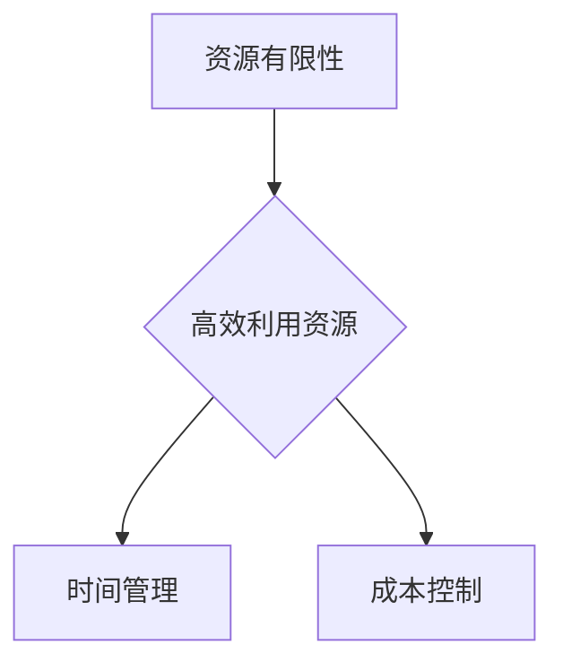

**核心算法原理讲解**：
在资源有限的情况下，可以使用最小化最大遗憾法（Minimax Regret）来优化资源分配。该方法通过比较不同决策下的最大遗憾值，选择遗憾值最小的方案。

**伪代码**：
```python
def minimax_regret(resources, projects):
    regret_values = []
    for project in projects:
        max_regret = 0
        for other_project in projects:
            if other_project != project:
                max_regret = max(max_regret, resources[project] - resources[other_project])
        regret_values.append(max_regret)
    return regret_values
```

### 1.1.2 技术与市场的平衡

在产品开发过程中，技术实现与市场需求往往存在一定的冲突。技术型创业者需要在追求技术创新的同时，确保产品能够满足市场需求，从而实现技术与市场的平衡。

**核心概念与联系**：
- 技术创新：技术创新是推动产品进步的动力。
- 市场需求：市场需求是产品成功的决定因素。

**Mermaid 流程图**：
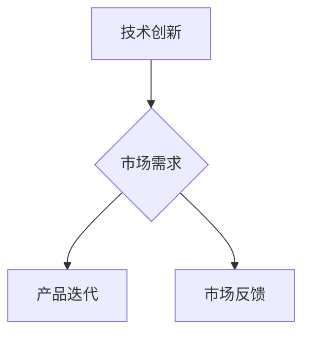

**核心算法原理讲解**：
为了平衡技术创新与市场需求，可以使用平衡评分法（Balance Scorecard）来评估产品开发的各个阶段。该方法通过设置不同的权重，对技术创新和市场需求进行量化评估。

**伪代码**：
```python
def balance_scorecard(technology_score, market_score, weights):
    total_score = weights['technology'] * technology_score + weights['market'] * market_score
    return total_score
```

### 1.1.3 团队协作与沟通

在产品开发过程中，团队协作与沟通的重要性不言而喻。技术型创业者需要构建一个高效的团队，确保团队成员之间能够顺畅地沟通与协作，从而提高产品开发效率。

**核心概念与联系**：
- 团队协作：团队协作是提高工作效率的关键。
- 沟通：有效的沟通是团队协作的基础。

**Mermaid 流程图**：
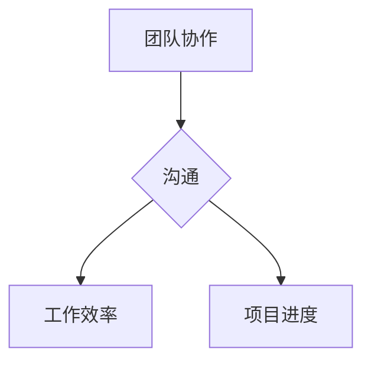

**核心算法原理讲解**：
团队协作与沟通的效率可以通过协作效率模型（Collaboration Efficiency Model）来评估。该模型考虑了沟通频率、团队成员协作能力以及团队氛围三个因素。

**伪代码**：
```python
def collaboration_efficiency(comunication_frequency, collaboration_ability, team_atmosphere):
    efficiency = comunication_frequency * collaboration_ability * team_atmosphere
    return efficiency
```

### 1.1.4 风险管理

在产品开发过程中，风险管理是确保项目顺利进行的重要环节。技术型创业者需要识别潜在风险，并制定相应的应对策略，以降低风险对项目的影响。

**核心概念与联系**：
- 风险识别：识别项目中的潜在风险。
- 风险应对：制定应对策略，降低风险影响。

**Mermaid 流程图**：
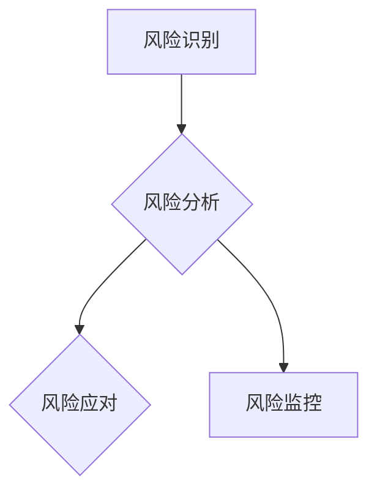

**核心算法原理讲解**：
风险管理可以通过风险矩阵（Risk Matrix）进行量化评估。风险矩阵考虑了风险的概率和影响两个因素，通过计算得分，对风险进行优先级排序。

**伪代码**：
```python
def risk_matrix(probability, impact):
    score = probability * impact
    return score
```

## 1.2 敏捷开发方法论

### 1.2.1 敏捷开发的起源与发展

敏捷开发（Agile Development）起源于20世纪90年代，最初是针对传统瀑布开发模式（Waterfall Model）的不足而提出的。敏捷开发强调快速响应变化、持续交付和团队合作。

**核心概念与联系**：
- 敏捷开发：一种以人为核心、迭代、增量的软件开发方法。
- 传统开发模式：如瀑布开发、V模型等。

**Mermaid 流程图**：
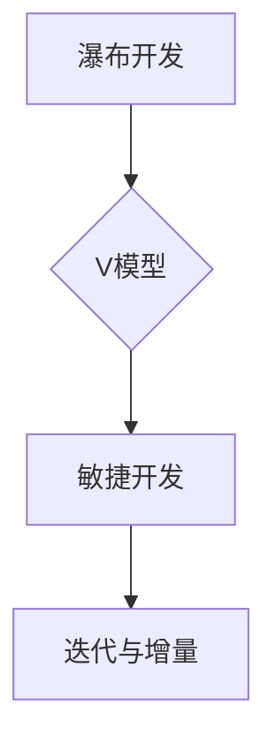

### 1.2.2 敏捷开发的核心理念

敏捷开发的核心理念包括：
- 倡导个体和互动重于过程和工具
- 可工作的软件重于详尽的文档
- 客户合作重于合同谈判
- 响应变化重于遵循计划

**核心概念与联系**：
- 个体和互动：强调团队成员的协作和沟通。
- 可工作的软件：以实际可用的产品为导向。
- 客户合作：与客户保持紧密合作，确保产品符合市场需求。
- 响应变化：灵活应对市场变化，快速迭代。

**Mermaid 流程图**：
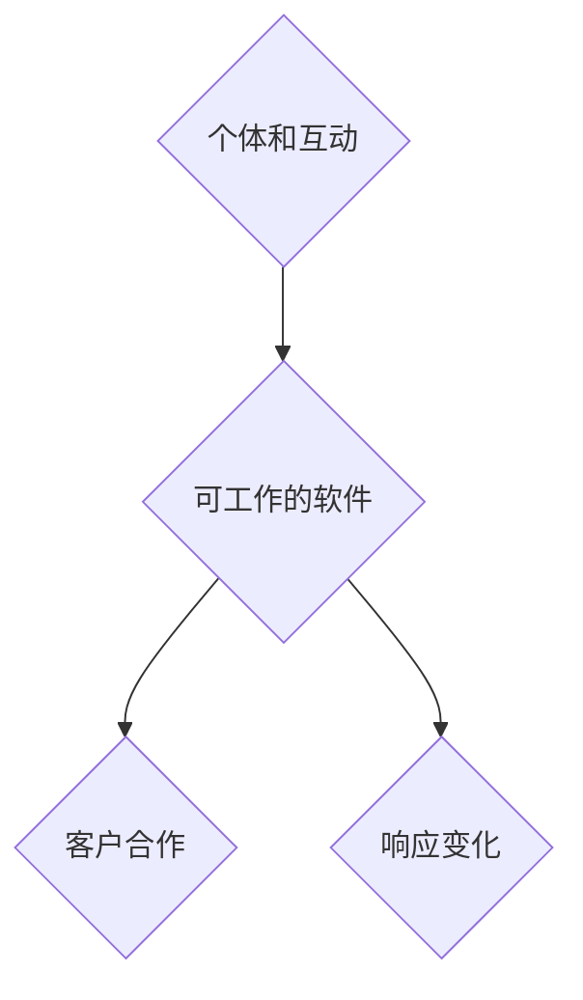

### 1.2.3 敏捷开发与传统开发模式对比

敏捷开发与传统开发模式（如瀑布开发）在以下几个方面存在显著差异：

- **开发流程**：传统开发模式通常采用线性顺序，而敏捷开发采用迭代和增量的方式。
- **团队协作**：敏捷开发强调团队合作，传统开发模式则更侧重于分工和阶段完成。
- **文档管理**：敏捷开发文档简洁，注重实际可用性，传统开发模式则文档详尽。
- **响应变化**：敏捷开发能够快速响应市场变化，传统开发模式则相对僵化。

**核心概念与联系**：
- 开发流程：敏捷开发采用迭代和增量，传统开发模式采用线性顺序。
- 团队协作：敏捷开发强调团队合作，传统开发模式强调分工和阶段完成。
- 文档管理：敏捷开发文档简洁，传统开发模式文档详尽。
- 响应变化：敏捷开发快速响应，传统开发模式相对僵化。

**Mermaid 流程图**：
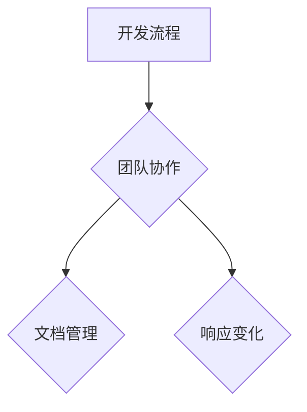

## 1.3 高效产品开发流程的框架

为了构建一个高效的产品开发流程，技术型创业者需要从以下几个方面入手：

- **产品愿景与目标设定**：明确产品愿景和目标，确保团队一致行动。
- **用户需求分析**：深入了解用户需求，设计出符合用户期望的产品。
- **产品规划与优先级排序**：根据用户需求和市场情况，制定产品规划和优先级排序。
- **迭代与持续交付**：采用迭代开发方式，持续交付可工作的软件。
- **持续反馈与改进**：通过用户反馈和数据分析，不断优化产品。

**核心概念与联系**：
- 产品愿景与目标设定：明确产品方向，确保团队目标一致。
- 用户需求分析：了解用户需求，设计出符合用户期望的产品。
- 产品规划与优先级排序：根据需求和市场情况，制定合理的开发计划。
- 迭代与持续交付：快速迭代，持续交付高质量产品。
- 持续反馈与改进：根据用户反馈和数据分析，优化产品。

**Mermaid 流�程图**：
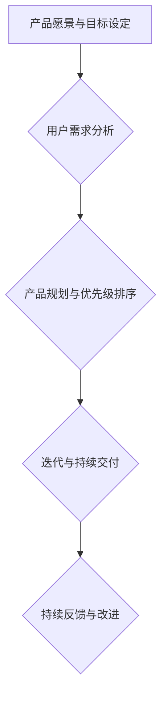

通过以上步骤，技术型创业者可以构建一个高效、灵活、用户导向的产品开发流程，从而确保产品顺利问世，并得到市场的认可。

### 1.3.1 产品愿景与目标设定

在产品开发过程中，明确产品愿景和目标是至关重要的。这不仅是团队共同奋斗的方向，也是决策和行动的依据。产品愿景通常是对产品未来状态的一种描述，而产品目标则是实现愿景的具体步骤和衡量标准。

**核心概念与联系**：
- 产品愿景：对产品未来的期望和展望。
- 产品目标：实现产品愿景的具体步骤和衡量标准。

**Mermaid 流程图**：
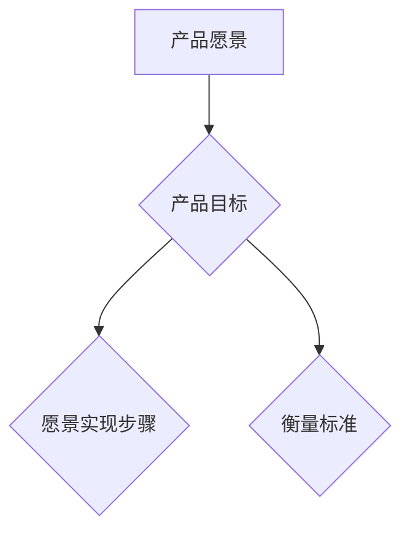

**核心算法原理讲解**：
为了确保产品愿景和目标的明确性，可以使用SMART原则（Specific, Measurable, Achievable, Relevant, Time-bound）来制定目标。SMART原则提供了一个框架，帮助团队将目标具体化，使其更易于实现和衡量。

**伪代码**：
```python
def set_smart_goals(goal):
    if is_specific(goal) and is_measurable(goal) and is_achievable(goal) and is_relevant(goal) and is_time_bound(goal):
        return "SMART Goal"
    else:
        return "Incomplete Goal"
```

**举例说明**：
假设一个产品目标是“开发一款功能完善的智能语音助手”，根据SMART原则，可以将其细化如下：
- Specific：具体明确的，例如“开发一款具有语音识别、自然语言处理和智能回话功能的智能语音助手”。
- Measurable：可衡量的，例如“在2023年12月前完成所有核心功能，并在用户测试中达到90%的准确率”。
- Achievable：可实现的，例如“团队成员具备相关技术能力和资源”。
- Relevant：相关的，例如“智能语音助手符合市场需求，能够提高用户的生活质量”。
- Time-bound：时间明确的，例如“在接下来的六个月内完成”。

通过这种方式，产品目标变得更加具体、可衡量，便于团队跟踪进度和评估成果。

### 1.3.2 用户需求分析

用户需求分析是产品开发流程中至关重要的一环。深入了解用户需求不仅能够帮助团队设计出符合用户期望的产品，还能够为后续的产品规划和优先级排序提供有力支持。

**核心概念与联系**：
- 用户需求：用户在使用产品时希望得到的功能、服务或解决方案。
- 需求分析：通过调查、研究、访谈等方法，收集和分析用户需求。

**Mermaid 流程图**：
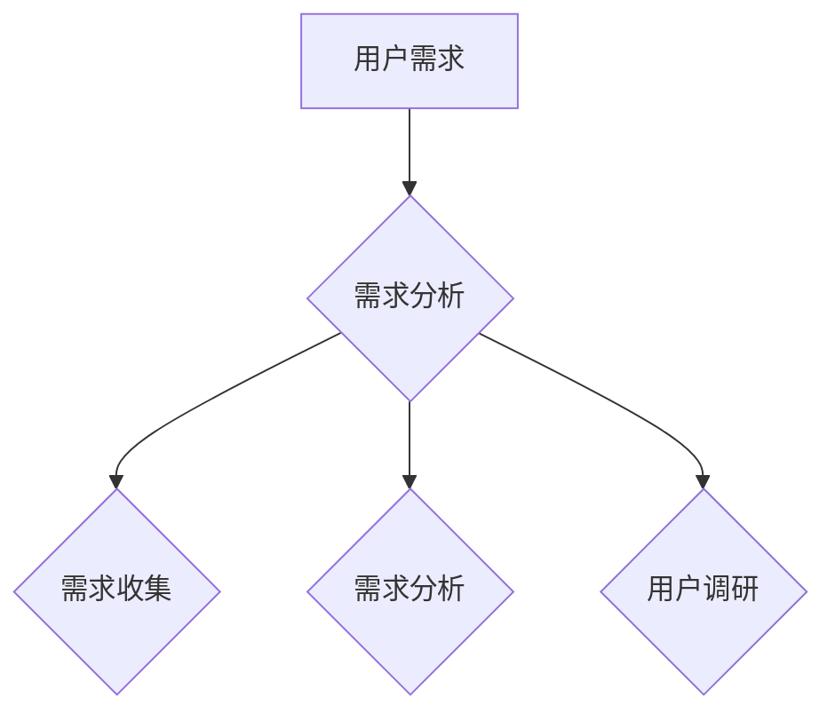

**核心算法原理讲解**：
用户需求分析通常包括以下步骤：
1. **需求收集**：通过用户调研、问卷调查、用户访谈等方式，收集用户需求。
2. **需求筛选**：根据业务目标和资源限制，筛选出最关键的需求。
3. **需求分类**：将需求分为功能性需求和非功能性需求，功能性需求关注产品功能，非功能性需求关注产品性能、安全、可用性等。
4. **需求优先级排序**：根据需求的重要性和紧急性，对需求进行优先级排序。

**伪代码**：
```python
def analyze_user需求的(debug, requirements):
    if debug:
        print("Starting user需求分析...")
    collected_requirements = collect_requirements()
    filtered_requirements = filter_requirements(collected_requirements)
    categorized_requirements = categorize_requirements(filtered_requirements)
    sorted_requirements = prioritize_requirements(categorized_requirements)
    return sorted_requirements
```

**举例说明**：
假设团队通过用户调研和访谈，收集到以下需求：
- 用户希望智能语音助手能够实现语音识别和智能回话功能。
- 用户希望智能语音助手能够理解自然语言，提供准确的回答。
- 用户希望智能语音助手能够支持多种语言。

根据需求分类，可以将其分为功能性需求和非功能性需求：
- 功能性需求：
  - 语音识别
  - 智能回话
  - 自然语言处理
- 非功能性需求：
  - 多语言支持
  - 高准确性

根据需求的重要性和紧急性，可以对其进行优先级排序：
1. 语音识别（核心功能）
2. 智能回话（核心功能）
3. 自然语言处理（核心功能）
4. 多语言支持（非核心功能）
5. 高准确性（非核心功能）

通过这种方式，团队可以明确用户需求，并将其转化为具体的功能点，为后续的产品规划和开发提供指导。

### 1.3.3 产品规划与优先级排序

在明确了产品愿景和用户需求之后，产品规划和优先级排序成为下一步的关键步骤。这一过程旨在将需求转化为具体的开发任务，并确定这些任务的优先级，以确保团队能够高效地实施开发计划。

**核心概念与联系**：
- 产品规划：制定产品开发的大纲和路线图，明确开发任务和里程碑。
- 优先级排序：根据需求的重要性和紧急性，对开发任务进行排序。

**Mermaid 流程图**：
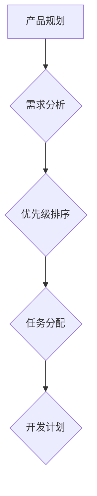

**核心算法原理讲解**：
产品规划与优先级排序通常涉及以下方法：

1. **MoSCoW 方法**：将需求分为四个优先级类别：M（必须要有），S（应该要有），C（可以要有），W（无关紧要）。该方法帮助团队快速识别和排序关键需求。

2. **RICE 评估模型**：RICE（Reach, Impact, Confidence, Effort）模型通过考虑需求的用户覆盖范围、对产品的整体影响、实现难度和开发工作量，来评估需求的优先级。

**伪代码**：
```python
def moscow_method(requirements):
    must_have = []
    should_have = []
    could_have = []
    won't_have = []
    for requirement in requirements:
        if "M" in requirement:
            must_have.append(requirement)
        elif "S" in requirement:
            should_have.append(requirement)
        elif "C" in requirement:
            could_have.append(requirement)
        else:
            won't_have.append(requirement)
    return must_have, should_have, could_have, won't_have

def rice_evaluation(requirement):
    reach = calculate_reach(requirement)
    impact = calculate_impact(requirement)
    confidence = calculate_confidence(requirement)
    effort = calculate_effort(requirement)
    score = reach * impact * confidence * effort
    return score
```

**举例说明**：
假设团队收集到以下需求：
- 语音识别（必须要有）
- 智能回话（应该要有）
- 自然语言处理（可以要有）
- 多语言支持（无关紧要）

使用MoSCoW方法进行优先级排序：
- Must-have（必须要有）：语音识别，智能回话
- Should-have（应该要有）：自然语言处理
- Could-have（可以要有）：多语言支持
- Won't-have（无关紧要）：无

假设团队使用RICE模型对需求进行评估：
- 语音识别：reach = 100%, impact = 90%, confidence = 80%, effort = 60%
- 智能回话：reach = 90%, impact = 80%, confidence = 70%, effort = 50%
- 自然语言处理：reach = 80%, impact = 70%, confidence = 60%, effort = 40%
- 多语言支持：reach = 50%, impact = 40%, confidence = 50%, effort = 30%

计算每个需求的RICE得分：
- 语音识别：100% * 90% * 80% * 60% = 43.2%
- 智能回话：90% * 80% * 70% * 50% = 25.2%
- 自然语言处理：80% * 70% * 60% * 40% = 16.8%
- 多语言支持：50% * 40% * 50% * 30% = 3%

根据得分，可以对需求进行优先级排序：
1. 语音识别
2. 智能回话
3. 自然语言处理
4. 多语言支持

通过这种方法，团队可以确保在资源有限的情况下，优先完成对产品成功至关重要的功能，从而提高开发效率和产品质量。

### 1.3.4 迭代与持续交付

在产品开发过程中，迭代与持续交付是确保产品质量和满足市场需求的关键策略。迭代开发通过分阶段逐步完善产品，持续交付则确保产品能够在每个阶段都达到可用状态。

**核心概念与联系**：
- 迭代：分阶段逐步完善产品，每个阶段都进行评估和改进。
- 持续交付：通过自动化测试和部署，确保产品在每个迭代阶段都是可用的。

**Mermaid 流程图**：
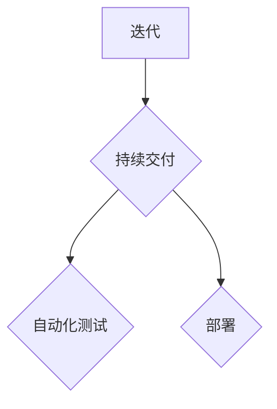

**核心算法原理讲解**：
迭代与持续交付通常遵循以下步骤：

1. **需求分析**：明确每个迭代的目标和需求。
2. **设计**：设计实现方案，制定详细的技术方案。
3. **开发**：实现设计，编写代码，并进行单元测试。
4. **集成**：将各个模块集成，进行集成测试。
5. **测试**：进行系统测试和用户验收测试。
6. **部署**：将产品部署到生产环境，进行实际使用。
7. **反馈**：收集用户反馈，进行评估和改进。

**伪代码**：
```python
def iterative_development(iterations):
    for iteration in iterations:
        analyze_requirements(iteration)
        design_solution(iteration)
        develop_code(iteration)
        integrate_modules(iteration)
        test_product(iteration)
        deploy_to_production(iteration)
        collect_feedback(iteration)
```

**举例说明**：
假设团队计划进行四个迭代，每个迭代的目标如下：

1. 迭代1：实现基本的语音识别功能。
2. 迭代2：添加智能回话功能。
3. 迭代3：实现自然语言处理。
4. 迭代4：添加多语言支持。

在每个迭代中，团队将按照以下步骤进行：
1. 分析需求：明确每个迭代的具体功能需求。
2. 设计：制定实现方案，确保满足需求。
3. 开发：编写代码，并进行单元测试。
4. 集成：将各个模块集成，进行集成测试。
5. 测试：进行系统测试和用户验收测试。
6. 部署：将产品部署到生产环境，确保实际可用。
7. 反馈：收集用户反馈，评估产品性能，进行改进。

通过这种方式，团队可以确保产品在每个迭代阶段都是高质量的，同时能够快速响应市场需求和用户反馈。

### 1.3.5 持续反馈与改进

在产品开发过程中，持续反馈与改进是确保产品持续优化和提升用户体验的关键。通过用户反馈和数据分析，团队可以识别产品中的问题和不足，并及时进行改进。

**核心概念与联系**：
- 持续反馈：通过用户反馈和数据分析，不断优化产品。
- 改进策略：根据反馈调整开发方向，提高产品质量。

**Mermaid 流程图**：
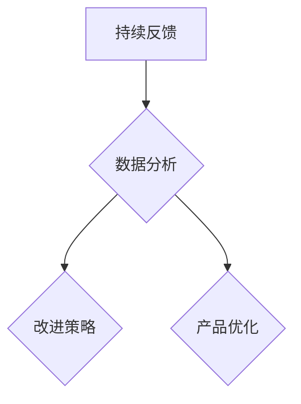

**核心算法原理讲解**：
持续反馈与改进通常包括以下步骤：

1. **用户反馈收集**：通过问卷调查、用户访谈、用户行为分析等方式，收集用户对产品的反馈。
2. **数据分析**：对收集到的反馈进行分析，识别产品中的问题和不足。
3. **改进策略**：根据分析结果，制定改进策略，调整开发方向。
4. **实施改进**：对产品进行改进，确保解决用户提出的问题。
5. **验证效果**：对改进后的产品进行验证，确保问题得到解决，用户体验得到提升。

**伪代码**：
```python
def continuous_feedback_and_improvement(feedback):
    analyzed_feedback = analyze_feedback(feedback)
    improvement_strategies = generate_improvement_strategies(analyzed_feedback)
    apply_improvements(improvement_strategies)
    verify_effects()
```

**举例说明**：
假设团队通过用户反馈和数据分析，发现产品存在以下问题：

- 语音识别准确性不足。
- 智能回话功能不够丰富。
- 用户界面设计不够友好。

根据这些问题，团队可以制定以下改进策略：

1. 提高语音识别准确性：增加语音数据集，优化算法模型。
2. 丰富智能回话功能：引入更多的自然语言处理技术，增加对话场景。
3. 优化用户界面设计：根据用户反馈，调整界面布局，提升用户体验。

通过实施这些改进策略，团队可以不断提高产品的质量和用户满意度。

### 1.4 敏捷开发的优势与挑战

敏捷开发作为一种以人为核心、迭代、增量的软件开发方法，具有许多优势，但也面临一些挑战。本节将探讨敏捷开发的优势和挑战，以及如何应对这些挑战。

#### 1.4.1 敏捷开发的优势

**提高团队协作效率**：敏捷开发强调团队合作和沟通，通过日常站立会议、迭代回顾等方式，确保团队成员之间的信息共享和协同工作。

**快速响应变化**：敏捷开发采用迭代和增量开发方式，能够快速适应市场需求和技术变化，提高产品的灵活性和适应性。

**提高产品品质**：通过持续测试、用户反馈和改进，敏捷开发确保每个迭代阶段的产品都是高质量、可用的，从而减少缺陷和返工。

**增加客户满意度**：与客户保持紧密合作，及时交付可工作的软件，确保产品符合客户需求，从而提高客户满意度。

**增强团队自主性**：敏捷开发鼓励团队自主决策和自我管理，提高团队的工作积极性和创造力。

**核心概念与联系**：
- 团队协作：提高工作效率。
- 快速响应变化：适应市场需求。
- 提高产品品质：确保高质量交付。
- 增加客户满意度：满足客户需求。
- 增强团队自主性：提高工作积极性。

**Mermaid 流程图**：
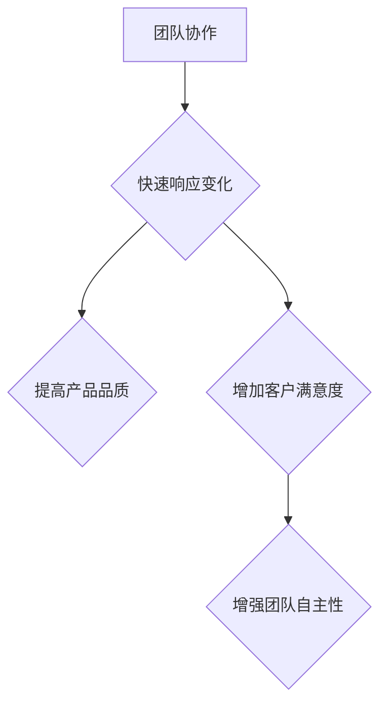

#### 1.4.2 敏捷开发的挑战

**团队沟通障碍**：敏捷开发要求团队成员之间频繁沟通，但不同角色、背景的成员可能存在沟通障碍，影响团队协作效率。

**项目管理难度**：敏捷开发中的迭代和增量开发方式，使得项目管理变得更加复杂，需要团队具备良好的规划和协调能力。

**质量保证**：在快速迭代和持续交付的过程中，如何确保产品质量成为一大挑战，需要引入自动化测试和质量控制方法。

**核心概念与联系**：
- 团队沟通障碍：影响协作效率。
- 项目管理难度：复杂的项目规划。
- 质量保证：确保产品质量。

**Mermaid 流程图**：
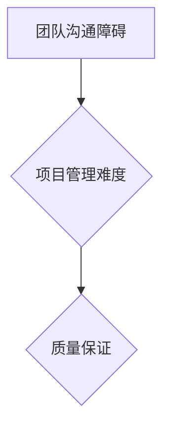

#### 1.4.3 应对敏捷开发的挑战

**加强团队沟通**：通过定期的团队建设活动、沟通培训等方式，提高团队成员之间的沟通能力，建立良好的沟通机制。

**项目规划与监控**：采用敏捷项目管理工具，如Jira、Trello等，确保项目进度和任务分配的透明性，提高团队协作效率。

**引入质量保障措施**：引入自动化测试、持续集成和持续交付等质量保障措施，确保每个迭代阶段的产品都是高质量的。

**持续学习和改进**：鼓励团队持续学习和实践，提高团队的整体素质和应对挑战的能力。

**核心概念与联系**：
- 加强团队沟通：提高协作效率。
- 项目规划与监控：确保项目进度。
- 引入质量保障措施：确保产品质量。
- 持续学习和改进：提高团队素质。

**Mermaid 流程图**：
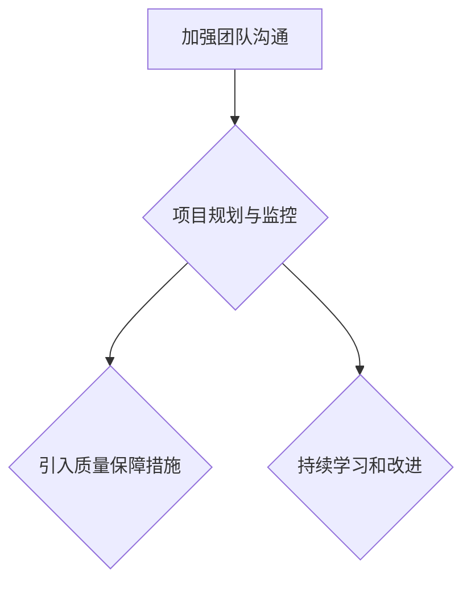

通过上述措施，技术型创业者可以充分发挥敏捷开发的优势，同时应对敏捷开发中的挑战，构建高效、灵活、用户导向的产品开发流程。


## 第2章：需求分析与用户研究

需求分析与用户研究是产品开发流程中的关键环节，直接影响到产品的最终质量和市场接受度。本章将详细探讨用户研究的重要性、需求收集与分析方法、用户旅程与体验设计，以及设计思维在需求分析中的应用。

### 2.1 用户研究的重要性

用户研究是产品开发的基础，它可以帮助团队深入了解目标用户的需求、行为和痛点，从而设计出真正符合用户期望的产品。用户研究的重要性体现在以下几个方面：

1. **识别用户需求**：通过用户研究，团队可以收集到真实的用户需求，为产品功能设计和优先级排序提供依据。
2. **提高产品满意度**：了解用户需求和期望，能够帮助团队设计出更符合用户期望的产品，从而提高产品满意度。
3. **优化用户体验**：用户研究可以帮助团队识别用户体验中的问题，提供改进方向，优化产品的交互设计和用户界面。
4. **减少风险**：通过用户研究，团队可以在产品开发的早期阶段识别潜在的风险和问题，从而减少项目失败的风险。

**核心概念与联系**：
- 用户需求：产品设计的起点。
- 产品满意度：用户对产品的整体感受。
- 用户体验：用户在使用产品过程中的感受和体验。
- 风险识别：在产品开发过程中识别潜在的问题。

**Mermaid 流程图**：
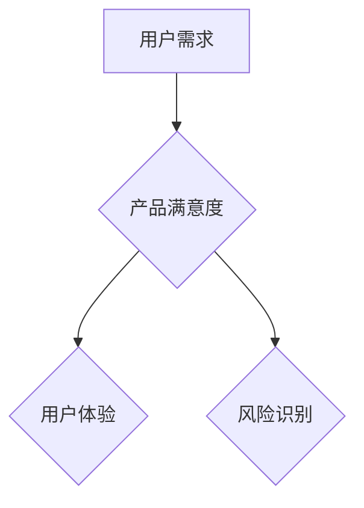

### 2.1.1 用户研究的意义

用户研究不仅仅是为了收集数据，更重要的是通过这些数据来理解用户的行为、需求和期望。具体来说，用户研究的意义包括：

- **了解用户行为模式**：通过用户研究，团队可以了解用户在使用产品时的行为模式，发现用户偏好的功能和使用场景。
- **发现用户痛点**：通过用户反馈和观察，团队可以识别用户在使用产品过程中遇到的痛点，为产品改进提供方向。
- **验证产品假设**：在产品开发的早期阶段，团队可以通过用户研究来验证产品假设，确保产品设计方向正确。
- **提高产品成功率**：通过深入了解用户需求和市场情况，团队可以设计出更符合市场需求的的产品，提高产品成功的机会。

**核心概念与联系**：
- 用户行为模式：用户使用产品的方式。
- 用户痛点：用户在使用产品过程中遇到的问题。
- 产品假设验证：验证产品设计是否合理。
- 产品成功率：产品在市场上的表现。

**Mermaid 流程图**：
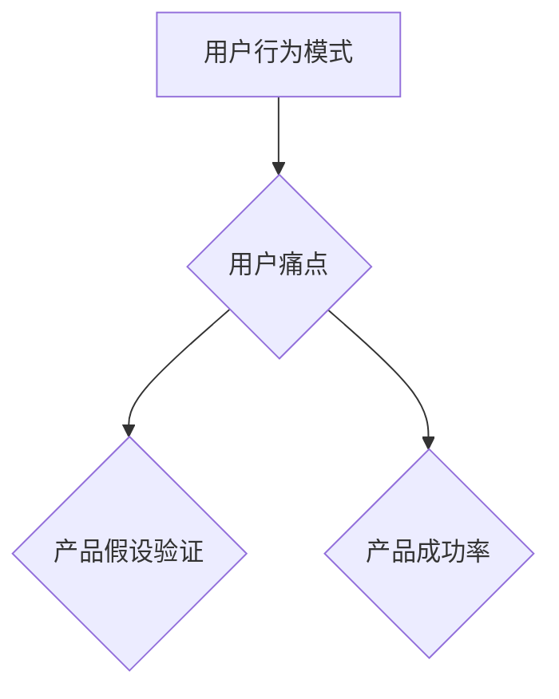

### 2.1.2 用户研究的方法

用户研究的方法多种多样，常见的包括用户访谈、问卷调查、用户观察、可用性测试等。每种方法都有其独特的优势和适用场景。

- **用户访谈**：通过与用户进行深入对话，了解用户的需求、偏好和行为。适用于深入了解用户需求和收集详细反馈。
- **问卷调查**：通过设计问卷，收集大量用户数据。适用于快速收集用户意见和统计信息。
- **用户观察**：在用户实际使用产品的过程中进行观察，记录用户行为和反应。适用于发现用户在使用产品时的问题和痛点。
- **可用性测试**：邀请用户对产品进行实际操作，评估产品的可用性和用户体验。适用于评估产品的交互设计和用户界面。

**核心概念与联系**：
- 用户访谈：深入了解用户需求。
- 问卷调查：收集大量用户数据。
- 用户观察：发现用户问题。
- 可用性测试：评估用户体验。

**Mermaid 流程图**：
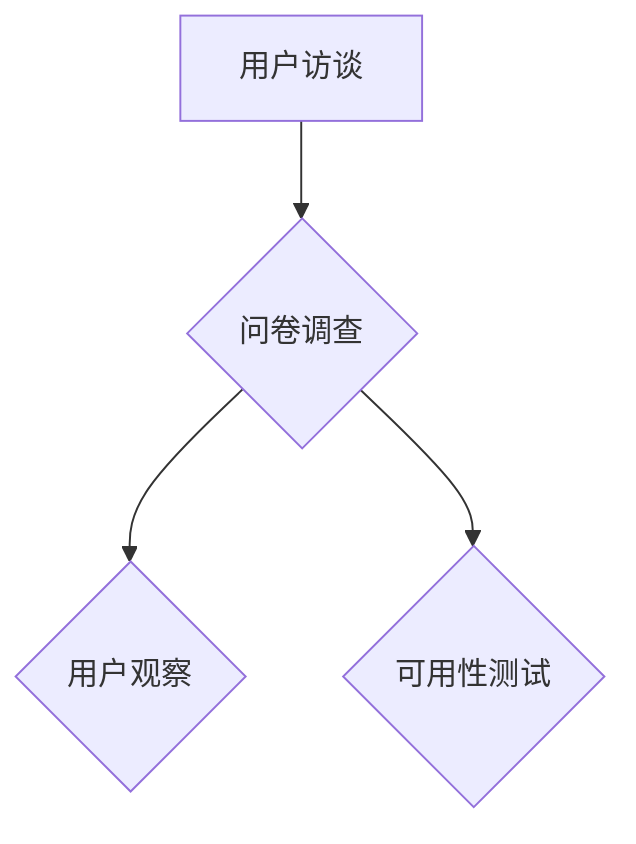

### 2.1.3 用户画像与用户细分

用户画像是一种将用户信息进行抽象和概括的方法，通过对用户特征、行为、需求的描述，帮助团队更好地理解用户群体。用户细分则是将用户按照特定的标准进行分类，以便针对不同用户群体设计产品功能。

- **用户画像**：包括用户的基本信息（如年龄、性别、职业等）、行为特征（如使用习惯、偏好等）和需求特征（如购买意向、痛点等）。
- **用户细分**：根据用户的共同特征，将用户分为不同的群体，如年龄细分、行为细分、需求细分等。

**核心概念与联系**：
- 用户画像：了解用户特征和需求。
- 用户细分：针对不同用户设计产品。

**Mermaid 流程图**：
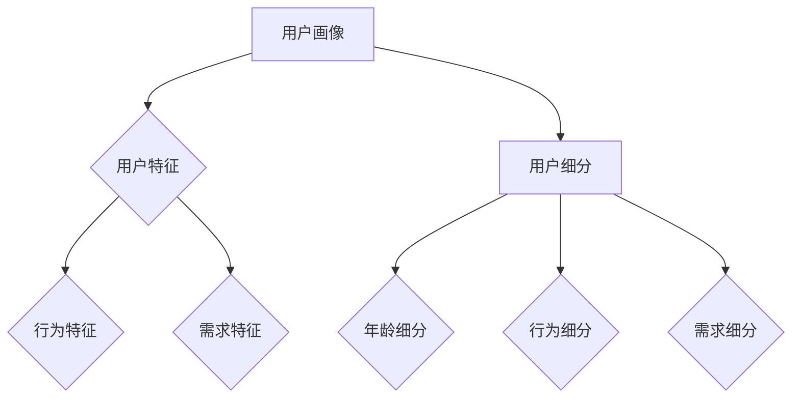

### 2.1.4 用户旅程与体验设计

用户旅程（User Journey）是指用户在使用产品过程中的体验和感受。通过绘制用户旅程图，团队可以全面了解用户在不同使用场景下的体验，从而设计出更加流畅和用户友好的产品。

- **用户旅程图**：用图表的形式展示用户在使用产品过程中的步骤、行为和反馈。
- **体验设计**：根据用户旅程图，优化产品的交互设计、用户界面和用户体验。

**核心概念与联系**：
- 用户旅程图：展示用户使用产品的过程。
- 体验设计：优化产品交互和用户体验。

**Mermaid 流程图**：
```mermaid
graph TD
    A[用户旅程图] --> B{交互设计}
    B --> C{用户界面设计}
    B --> D{用户体验}
```

### 2.2 需求收集与分析

需求收集与分析是产品开发的关键环节，通过系统地收集、整理和分析用户需求，团队可以明确产品的功能、性能和用户体验要求。

**核心概念与联系**：
- 需求收集：收集用户的需求信息。
- 需求分析：分析需求的合理性、重要性和可行性。

**Mermaid 流程图**：
```mermaid
graph TD
    A[需求收集] --> B{需求分析}
    B --> C{需求整理}
    B --> D{需求评估}
```

#### 2.2.1 需求的分类

在需求收集与分析过程中，对需求进行合理的分类可以帮助团队更好地理解和优先处理需求。

- **功能性需求**：直接关系到产品的功能实现，如语音识别、自然语言处理等。
- **非功能性需求**：与产品的性能、安全性、可用性等相关的需求，如响应速度、系统稳定性等。
- **用户故事**：用用户的语言描述需求，便于团队理解和实现。

**核心概念与联系**：
- 功能性需求：产品的核心功能。
- 非功能性需求：产品的性能和安全性。
- 用户故事：用用户的角度描述需求。

**Mermaid 流程图**：
```mermaid
graph TD
    A[功能性需求] --> B{非功能性需求}
    B --> C{用户故事}
```

#### 2.2.2 需求的收集方法

需求收集的方法多种多样，选择合适的方法可以帮助团队高效地收集到高质量的需求。

- **用户访谈**：通过深入访谈，了解用户的需求和痛点。
- **问卷调查**：通过设计问卷，收集大量用户反馈。
- **用户观察**：在用户实际使用产品时进行观察，记录用户行为。
- **市场调研**：通过市场数据和分析，了解用户需求和市场趋势。

**核心概念与联系**：
- 用户访谈：深入了解用户需求。
- 问卷调查：收集大量用户反馈。
- 用户观察：发现用户行为。
- 市场调研：了解市场需求。

**Mermaid 流程图**：
```mermaid
graph TD
    A[用户访谈] --> B{问卷调查}
    B --> C{用户观察}
    B --> D{市场调研}
```

#### 2.2.3 需求分析与筛选

在收集到大量需求后，团队需要对需求进行筛选和分析，确保只有真正有价值的需求被纳入产品开发计划。

- **需求分析**：对需求进行详细分析，评估需求的合理性、重要性和可行性。
- **需求筛选**：根据分析结果，筛选出最关键的需求，剔除不必要的需求。

**核心概念与联系**：
- 需求分析：评估需求的质量。
- 需求筛选：选择关键需求。

**Mermaid 流程图**：
```mermaid
graph TD
    A[需求分析] --> B{需求筛选}
    B --> C{需求优先级排序}
```

#### 2.2.4 用户故事地图

用户故事地图（User Story Map）是一种帮助团队理解用户需求、梳理产品功能的方法。通过用户故事地图，团队可以可视化地展示用户需求、功能模块和优先级。

- **用户故事地图**：将用户故事按照用户旅程和功能模块进行组织和排列。
- **用户故事**：用用户的语言描述需求，如“作为用户，我希望能够……”。

**核心概念与联系**：
- 用户故事地图：展示用户需求。
- 用户故事：描述用户需求。

**Mermaid 流程图**：
```mermaid
graph TD
    A[用户故事地图] --> B{用户故事}
    B --> C{功能模块}
    B --> D{优先级排序}
```

### 2.3 用户旅程与体验设计

用户旅程与体验设计是产品开发的重要环节，通过深入分析用户在不同使用场景下的体验，团队可以优化产品的交互设计、用户界面和用户体验。

**核心概念与联系**：
- 用户旅程：展示用户使用产品的过程。
- 体验设计：优化产品的交互和用户体验。

**Mermaid 流程图**：
```mermaid
graph TD
    A[用户旅程] --> B{交互设计}
    B --> C{用户界面设计}
    B --> D{用户体验}
```

#### 2.3.1 用户旅程的概念

用户旅程（User Journey）是指用户在使用产品过程中的所有步骤、行为和感受。通过绘制用户旅程图，团队可以全面了解用户在使用产品时的体验，从而优化产品设计。

- **用户旅程图**：用图表的形式展示用户在不同场景下的行为和反馈。
- **用户场景**：用户在使用产品时的具体情境。

**核心概念与联系**：
- 用户旅程图：展示用户使用产品的过程。
- 用户场景：用户使用产品的具体情境。

**Mermaid 流程图**：
```mermaid
graph TD
    A[用户旅程图] --> B{用户场景}
    B --> C{用户行为}
    B --> D{用户反馈}
```

#### 2.3.2 设计用户体验

设计用户体验（UX Design）是产品开发中的重要环节，通过优化产品的交互设计和用户界面，团队可以提升用户的使用体验和满意度。

- **交互设计**：设计用户与产品交互的方式，如按钮、菜单、表单等。
- **用户界面设计**：设计产品的视觉效果，如颜色、布局、图标等。
- **用户体验**：用户在使用产品过程中的整体感受。

**核心概念与联系**：
- 交互设计：设计用户与产品的交互方式。
- 用户界面设计：设计产品的视觉效果。
- 用户体验：用户使用产品过程中的感受。

**Mermaid 流程图**：
```mermaid
graph TD
    A[交互设计] --> B{用户界面设计}
    B --> C{用户体验}
    C --> D{用户满意度}
```

#### 2.3.3 用户体验评估与优化

用户体验评估（UX Evaluation）是确保产品设计符合用户期望的重要手段。通过评估用户体验，团队可以识别产品中的问题，并进行优化。

- **用户体验评估**：通过用户测试、数据分析等方法，评估产品的用户体验。
- **优化策略**：根据评估结果，制定优化策略，提升用户体验。

**核心概念与联系**：
- 用户体验评估：评估产品的用户体验。
- 优化策略：提升用户体验。

**Mermaid 流程图**：
```mermaid
graph TD
    A[用户体验评估] --> B{问题识别}
    B --> C{优化策略}
    B --> D{用户体验提升}
```

#### 2.3.4 设计思维在需求分析中的应用

设计思维（Design Thinking）是一种以人为本的创新方法，强调从用户需求出发，通过迭代和实验，创造出满足用户需求的产品和服务。在需求分析中，设计思维可以帮助团队更好地理解用户需求，从而设计出更符合用户期望的产品。

- **设计思维**：一种以人为本的创新方法。
- **用户需求分析**：通过设计思维，深入了解用户需求。

**核心概念与联系**：
- 设计思维：以人为本的创新方法。
- 用户需求分析：理解用户需求。

**Mermaid 流程图**：
```mermaid
graph TD
    A[设计思维] --> B{用户需求分析}
    B --> C{用户调研}
    B --> D{用户反馈}
```

通过以上步骤，团队可以系统地收集、分析和理解用户需求，设计出满足用户期望的产品。同时，通过用户体验评估和设计思维的运用，团队可以不断提升产品的用户体验，确保产品在市场上的成功。

### 2.4 产品规划与优先级排序

产品规划与优先级排序是确保产品开发顺利进行的重要步骤。通过合理的规划和优先级排序，团队可以明确产品发展方向，高效地分配资源，确保产品能够在有限的时间内实现。

#### 3.1.1 产品愿景的明确

产品愿景是产品开发的起点，它为团队提供了明确的目标和方向。产品愿景应该简洁、具有启发性，能够激励团队成员为实现产品目标而努力。

- **产品愿景**：对产品未来状态的期望和展望。
- **目标设定**：为实现产品愿景，制定具体的目标和里程碑。

**核心概念与联系**：
- 产品愿景：指导产品开发的方向。
- 目标设定：明确开发目标。

**Mermaid 流程图**：
```mermaid
graph TD
    A[产品愿景] --> B{目标设定}
    B --> C{里程碑规划}
```

#### 3.1.2 产品战略与路线图

产品战略与路线图是产品规划的核心，它定义了产品的长期目标和阶段性目标，以及实现这些目标的具体路径和资源分配。

- **产品战略**：确定产品的市场定位、目标用户和竞争优势。
- **产品路线图**：展示产品的长期目标和阶段性目标，以及实现这些目标的步骤和时间表。

**核心概念与联系**：
- 产品战略：确定产品方向。
- 产品路线图：规划实现目标的步骤。

**Mermaid 流程图**：
```mermaid
graph TD
    A[产品战略] --> B{产品路线图}
    B --> C{长期目标}
    B --> D{阶段性目标}
```

#### 3.1.3 产品目标与关键成果

产品目标是实现产品愿景的具体步骤，它需要明确、可衡量、可实现。关键成果是衡量产品目标实现程度的重要指标。

- **产品目标**：具体、可衡量、可实现的目标。
- **关键成果**：衡量产品目标实现程度的关键指标。

**核心概念与联系**：
- 产品目标：实现产品愿景的具体步骤。
- 关键成果：衡量产品目标实现程度。

**Mermaid 流程图**：
```mermaid
graph TD
    A[产品目标] --> B{关键成果}
    B --> C{里程碑评估}
    B --> D{目标调整}
```

#### 3.1.4 优先级排序的方法

优先级排序是确保产品开发高效进行的关键步骤，它帮助团队明确哪些功能需求是最重要的，并按照优先级进行资源分配。

- **MoSCoW 方法**：将需求分为必须、应该、可以、无关紧要四个类别，根据优先级进行排序。
- **RICE 评估模型**：通过考虑需求的影响范围、影响力、实现难度和资源投入，对需求进行量化评估。

**核心概念与联系**：
- MoSCoW 方法：分类排序需求。
- RICE 评估模型：量化评估需求。

**Mermaid 流程图**：
```mermaid
graph TD
    A[MoSCoW 方法] --> B{RICE 评估模型}
    B --> C{需求分类}
    B --> D{需求评估}
```

#### 3.1.5 最大化产品价值

最大化产品价值是产品规划的核心目标，通过合理的优先级排序和资源分配，团队可以确保产品开发能够实现最大的商业价值。

- **价值最大化策略**：通过权衡需求的重要性和实现难度，确保关键需求优先得到满足。
- **资源优化**：合理分配资源，确保每个阶段的产品开发都能取得最大的成果。

**核心概念与联系**：
- 价值最大化策略：确保关键需求优先满足。
- 资源优化：合理分配资源。

**Mermaid 流程图**：
```mermaid
graph TD
    A[价值最大化策略] --> B{资源优化}
    B --> C{需求优先级排序}
    B --> D{资源分配}
```

通过以上步骤，团队可以系统地规划产品开发，确保产品在有限的时间内实现最大价值。同时，通过合理的优先级排序和资源分配，团队能够高效地完成产品开发，提高产品的市场竞争力。

### 3.2 优先级排序的方法

在产品规划过程中，优先级排序是一个关键步骤，它帮助团队确定哪些功能需求最紧急、最关键，从而指导资源的合理分配和项目的顺利进行。以下将介绍几种常见的优先级排序方法，并比较它们的特点。

#### 3.2.1 MoSCoW 方法

MoSCoW 方法是最常用的优先级排序方法之一，它将需求分为四个类别：必须（Mandatory）、应该（Should）、可以（Could）和无关紧要（Won't Have）。

- **必须（Mandatory）**：这些需求是产品不可或缺的部分，没有它们产品就无法正常运作。
- **应该（Should）**：这些需求对于产品的成功很重要，但在某些情况下可以暂时推迟。
- **可以（Could）**：这些需求是可选的，但有助于增强产品的竞争力或用户体验。
- **无关紧要（Won't Have）**：这些需求不会对产品的主要功能或目标产生重大影响，可以暂时不考虑。

**优点**：MoSCoW 方法简单直观，易于理解和实施，适合快速迭代的项目。

**缺点**：该方法主要依赖于团队成员的主观判断，可能导致不一致的优先级排序。

**适用场景**：适用于需求明确的短期项目。

**Mermaid 流程图**：
```mermaid
graph TD
    A[必须] --> B[应该]
    B --> C[可以]
    C --> D[无关紧要]
```

#### 3.2.2 RICE 评估模型

RICE 评估模型是一种基于量化评估的方法，通过考虑需求的影响范围（Reach）、影响力（Impact）、实现难度（Confidence）和资源投入（Effort），对需求进行优先级排序。

- **影响范围（Reach）**：需求影响的用户数量。
- **影响力（Impact）**：需求对产品整体价值的影响。
- **实现难度（Confidence）**：实现需求的信心水平。
- **资源投入（Effort）**：实现需求所需的时间和资源。

**计算方法**：
\[ \text{RICE 分数} = \text{Reach} \times \text{Impact} \times \text{Confidence} \times \text{Effort} \]

**优点**：RICE 方法提供了量化的评估标准，更客观和可重复。

**缺点**：该方法需要详细的数据支持和复杂的计算过程。

**适用场景**：适用于复杂项目和多团队协作。

**Mermaid 流程图**：
```mermaid
graph TD
    A[影响范围] --> B[影响力]
    B --> C[实现难度]
    C --> D[资源投入]
```

#### 3.2.3 优先级矩阵

优先级矩阵是一种将需求和优先级进行可视化和量化分析的方法。它通常使用两个维度来评估需求：重要性和紧急性。

- **重要性**：需求对产品成功和用户价值的贡献程度。
- **紧急性**：需求需要在多长时间内实现。

通过在矩阵中标记需求，团队可以直观地看到每个需求的优先级，并据此进行资源分配。

**优点**：优先级矩阵直观、易于理解，有助于团队共识。

**缺点**：该方法主要依赖于主观判断，可能不够精确。

**适用场景**：适用于需求和优先级相对明确的团队。

**Mermaid 流程图**：
```mermaid
graph TD
    A[重要性] --> B[紧急性]
    B --> C[优先级]
```

#### 比较

**MoSCoW 方法**、**RICE 评估模型**和**优先级矩阵**各有优缺点，适用于不同的场景。

- **MoSCoW 方法**适合快速迭代的小型项目，易于理解和实施。
- **RICE 评估模型**适用于复杂项目和多团队协作，提供了量化的评估标准。
- **优先级矩阵**适合需求和优先级相对明确的团队，有助于团队共识。

在实际应用中，团队可以根据项目特点和需求情况，选择合适的优先级排序方法，或结合多种方法进行综合评估。

### 3.3 最大化产品价值

在产品开发过程中，最大化产品价值是团队的核心目标。通过合理的优先级排序和资源分配，团队能够确保关键需求得到满足，从而提高产品的市场竞争力。以下将介绍如何通过优先级排序最大化产品价值。

#### 3.3.1 产品价值的定义

产品价值是指产品对用户和企业的价值贡献。它可以从以下几个方面进行衡量：

- **用户价值**：产品满足用户需求的能力，提高用户效率和幸福感。
- **商业价值**：产品为企业带来的收益，包括销售额、市场份额和品牌价值。
- **社会价值**：产品对社会和环境的影响，如可持续发展、社会责任等。

**核心概念与联系**：
- 用户价值：满足用户需求。
- 商业价值：企业收益。
- 社会价值：社会影响。

**Mermaid 流程图**：
```mermaid
graph TD
    A[用户价值] --> B[商业价值]
    B --> C[社会价值]
```

#### 3.3.2 产品价值的衡量方法

为了最大化产品价值，团队需要建立一套有效的衡量方法，用于评估和比较不同需求的潜在价值。以下是一些常用的衡量方法：

1. **成本效益分析（CBA）**：通过计算产品开发的总成本和预期收益，评估产品价值的成本效益。
2. **用户研究**：通过用户调研和反馈，了解用户对产品的需求和满意度，评估产品的用户价值。
3. **市场分析**：通过市场调研和竞争分析，评估产品的市场前景和商业价值。
4. **关键绩效指标（KPI）**：设定关键绩效指标，如用户留存率、转化率、销售额等，用于衡量产品的价值贡献。

**核心概念与联系**：
- 成本效益分析：评估成本和收益。
- 用户研究：了解用户需求。
- 市场分析：评估市场前景。
- KPI：衡量价值贡献。

**Mermaid 流程图**：
```mermaid
graph TD
    A[成本效益分析] --> B[用户研究]
    B --> C[市场分析]
    B --> D[KPI]
```

#### 3.3.3 产品开发中的价值最大化策略

为了最大化产品价值，团队需要采用一系列策略，确保关键需求得到满足，同时优化资源分配。以下是一些常见的价值最大化策略：

1. **优先级排序**：根据产品价值和需求重要性，对需求进行优先级排序，确保关键需求优先得到满足。
2. **资源优化**：合理分配资源，确保每个阶段的产品开发都能取得最大的成果。
3. **敏捷开发**：采用敏捷开发方法，快速响应市场变化和用户反馈，确保产品能够持续迭代和优化。
4. **持续改进**：通过不断评估和优化产品，提高产品的质量和用户满意度，从而增加产品价值。

**核心概念与联系**：
- 优先级排序：确保关键需求优先满足。
- 资源优化：合理分配资源。
- 敏捷开发：快速响应变化。
- 持续改进：优化产品质量。

**Mermaid 流程图**：
```mermaid
graph TD
    A[优先级排序] --> B[资源优化]
    B --> C[敏捷开发]
    B --> D[持续改进]
```

#### 3.3.4 实践案例

以下是一个实践案例，说明如何通过优先级排序和资源优化来最大化产品价值。

**案例背景**：
某科技公司开发一款智能家居设备，用户主要需求包括：智能控制、环境监测、安全防护等。

**需求分析**：
- **智能控制**：用户希望设备可以通过手机远程控制，提高生活便利性。
- **环境监测**：用户希望设备可以监测室内空气质量、温度等，提供健康建议。
- **安全防护**：用户希望设备能够提供家居安全监控，如防盗报警、火灾预警等。

**优先级排序**：
- **必须（Mandatory）**：安全防护（用户安全最重要）。
- **应该（Should）**：智能控制、环境监测。
- **可以（Could）**：其他辅助功能。

**资源优化**：
- **研发资源**：根据优先级，优先分配研发资源，确保关键需求得到满足。
- **测试资源**：重点测试安全防护功能，确保产品质量。

**实施效果**：
- 通过优先级排序和资源优化，团队成功开发了智能控制、环境监测和安全防护功能，产品上市后受到了用户的欢迎，市场反响良好。

通过以上案例，可以看出，通过合理的优先级排序和资源优化，团队可以最大化产品价值，提高产品的市场竞争力。

### 3.4 产品规划工具与技术

在产品规划过程中，使用合适的工具和技术可以提高效率和准确性。以下将介绍几种常用的产品规划工具和技术，并比较它们的优缺点。

#### 3.4.1 产品地图

产品地图（Product Map）是一种直观展示产品结构和功能的方法，它通过图表的形式，将产品的各个部分和功能模块连接起来，帮助团队理解产品的整体架构。

- **优点**：产品地图直观、易于理解，有助于团队建立共同的产品愿景。
- **缺点**：产品地图无法详细描述每个模块的具体功能和实现细节。

**适用场景**：适用于产品规划和需求分析阶段。

**Mermaid 流程图**：
```mermaid
graph TD
    A[产品地图] --> B{需求分析}
```

#### 3.4.2 优先级排序列表

优先级排序列表（Priority List）是一种列出所有需求，并根据优先级进行排序的方法。它通常使用MoSCoW方法、RICE模型或其他优先级排序方法来评估需求的重要性。

- **优点**：优先级排序列表清晰、易于管理，有助于团队明确开发任务。
- **缺点**：优先级排列表无法直观展示需求之间的关联和依赖关系。

**适用场景**：适用于需求分析和资源分配阶段。

**Mermaid 流程图**：
```mermaid
graph TD
    A[优先级排序列表] --> B{需求分析}
    B --> C{资源分配}
```

#### 3.4.3 产品路线图

产品路线图（Product Roadmap）是一种展示产品长期目标和阶段性目标的方法，它通常包括产品的愿景、目标、里程碑和时间表。

- **优点**：产品路线图提供了清晰的愿景和目标，有助于团队统一行动。
- **缺点**：产品路线图无法实时反映项目进展和变更。

**适用场景**：适用于产品规划和项目监控阶段。

**Mermaid 流程图**：
```mermaid
graph TD
    A[产品路线图] --> B{产品规划}
    B --> C{项目监控}
```

#### 3.4.4 用户故事地图

用户故事地图（User Story Map）是一种将用户故事按照用户旅程和功能模块进行组织和排列的方法。它通过展示用户的整个使用过程，帮助团队理解用户需求和使用场景。

- **优点**：用户故事地图直观地展示了用户需求和使用流程，有助于团队进行用户体验设计。
- **缺点**：用户故事地图无法详细描述每个用户故事的实现细节。

**适用场景**：适用于用户体验设计和需求分析阶段。

**Mermaid 流程图**：
```mermaid
graph TD
    A[用户故事地图] --> B{用户体验设计}
    B --> C{需求分析}
```

#### 比较

**产品地图**、**优先级排序列表**、**产品路线图**和**用户故事地图**各有优缺点，适用于不同的阶段和目的。

- **产品地图**：直观展示产品架构，适用于需求分析和规划阶段。
- **优先级排序列表**：清晰列出需求，适用于需求分析和资源分配阶段。
- **产品路线图**：展示长期目标和里程碑，适用于产品规划和项目监控阶段。
- **用户故事地图**：展示用户需求和使用场景，适用于用户体验设计和需求分析阶段。

在实际应用中，团队可以根据项目特点和需求，选择合适的工具和技术，或结合多种方法进行综合评估和规划。

### 4.1 敏捷开发的核心原则

敏捷开发是一种以人为核心、迭代、增量的软件开发方法，它强调灵活性和适应性，旨在应对快速变化的市场需求。敏捷开发的核心原则包括以下几个方面：

#### 4.1.1 敏捷宣言

敏捷宣言（The Agile Manifesto）是敏捷开发的基础，它提出了四项核心价值：

1. **个体和互动重于过程和工具**：强调团队合作和人际沟通的重要性，认为个体和互动是软件开发的核心。
2. **可工作的软件重于详尽的文档**：认为可工作的软件是衡量项目成功的关键，而文档只是辅助工具。
3. **客户合作重于合同谈判**：强调与客户的紧密合作，认为客户的需求和反馈对产品的成功至关重要。
4. **响应变化重于遵循计划**：认为在软件开发过程中，市场和技术环境不断变化，能够快速响应变化是成功的关键。

**核心概念与联系**：
- 敏捷宣言：敏捷开发的基石。
- 个体和互动：团队合作的重要性。
- 可工作的软件：产品导向。
- 客户合作：客户参与。
- 响应变化：灵活性。

**Mermaid 流程图**：
```mermaid
graph TD
    A[敏捷宣言] --> B{个体和互动}
    B --> C{可工作的软件}
    B --> D{客户合作}
    B --> E{响应变化}
```

#### 4.1.2 敏捷开发的核心原则

敏捷开发的核心原则包括：

1. **透明性**：敏捷开发强调团队和工作过程的透明性，所有成员都可以随时了解项目进展和任务状态。
2. **反馈循环**：敏捷开发通过短周期的迭代和反馈循环，确保团队能够快速适应变化，持续改进产品。
3. **迭代开发**：敏捷开发采用迭代和增量方式，每个迭代都产出可工作的软件，确保项目逐步完善。
4. **适应性**：敏捷开发强调团队在面对不确定性和变化时，能够灵活调整计划和策略。
5. **协作**：敏捷开发倡导团队成员之间的紧密协作和沟通，通过共同工作实现项目目标。

**核心概念与联系**：
- 透明性：团队工作过程的可见性。
- 反馈循环：快速适应变化。
- 迭代开发：逐步完善产品。
- 适应性：灵活应对变化。
- 协作：团队成员共同工作。

**Mermaid 流程图**：
```mermaid
graph TD
    A[透明性] --> B{反馈循环}
    B --> C{迭代开发}
    B --> D{适应性}
    B --> E{协作}
```

#### 4.1.3 敏捷开发与传统开发模式的不同

敏捷开发与传统开发模式（如瀑布开发）在多个方面存在显著差异：

1. **开发流程**：传统开发模式通常采用线性顺序，而敏捷开发采用迭代和增量的方式。
2. **团队协作**：传统开发模式强调分工和阶段完成，而敏捷开发强调团队合作和持续沟通。
3. **文档管理**：传统开发模式文档详尽，而敏捷开发文档简洁，注重实际可用性。
4. **响应变化**：传统开发模式相对僵化，敏捷开发能够快速响应市场变化。

**核心概念与联系**：
- 开发流程：敏捷迭代，传统线性。
- 团队协作：敏捷合作，传统分工。
- 文档管理：敏捷简洁，传统详尽。
- 响应变化：敏捷灵活，传统僵化。

**Mermaid 流程图**：
```mermaid
graph TD
    A[开发流程] --> B{团队协作}
    B --> C{文档管理}
    B --> D{响应变化}
```

通过以上核心原则，敏捷开发能够更好地应对快速变化的市场需求，提高团队协作效率，确保产品的质量和市场竞争力。

### 4.2 敏捷开发团队的组织结构

在敏捷开发中，团队的组织结构对于项目成功至关重要。敏捷团队通常由以下角色组成：

#### 4.2.1 Scrum 团队角色

1. **产品负责人（Product Owner）**：
   - **职责**：定义产品愿景、目标和要求，管理产品待办事项，确保团队按照优先级进行开发。
   - **核心技能**：产品管理能力、用户需求分析、沟通能力。
   - **角色特点**：产品负责人是团队和客户的桥梁，需要具备高度的责任感和决策能力。

2. **Scrum Master**：
   - **职责**：确保团队遵循敏捷原则和流程，提供敏捷实践的支持，解决团队遇到的障碍。
   - **核心技能**：敏捷实践知识、沟通协调、问题解决能力。
   - **角色特点**：Scrum Master 是团队的教练和导师，帮助团队实现自我管理。

3. **开发团队（Development Team）**：
   - **职责**：负责实际开发工作，包括设计、编码、测试等。
   - **核心技能**：软件开发技能、团队合作能力、持续学习态度。
   - **角色特点**：开发团队是敏捷开发的核心，成员通常拥有不同技能，通过协作完成项目。

#### 4.2.2 敏捷团队的组织结构

敏捷团队的组织结构通常具有以下特点：

1. **自组织**：敏捷团队是自组织的，成员根据项目需求自我分配任务，并自我评估和调整工作计划。
2. **跨功能**：敏捷团队通常由不同技能背景的成员组成，以确保团队能够完成项目中的各种任务。
3. **扁平化**：敏捷团队的层级结构相对简单，减少了沟通障碍和决策延迟。

**核心概念与联系**：
- 自组织：团队自我管理。
- 跨功能：多样化技能。
- 扁平化：简单层级。

**Mermaid 流程图**：
```mermaid
graph TD
    A[产品负责人] --> B[Scrum Master]
    B --> C[开发团队]
    C --> D{自组织}
    C --> E{跨功能}
    C --> F{扁平化}
```

通过合理的组织结构，敏捷团队能够高效地协同工作，快速响应变化，实现项目的成功。

### 4.3 敏捷开发的方法与工具

敏捷开发采用一系列方法和工具，以确保团队能够高效地协作、快速响应变化并持续改进产品。以下将介绍几种常见的敏捷开发方法和工具。

#### 4.3.1 Sprint 计划会议

Sprint 计划会议是敏捷开发的核心活动之一，它通常在Sprint（迭代）开始时进行，由开发团队和产品负责人共同参与。

**主要步骤**：
1. **回顾上一个Sprint**：团队讨论上一个Sprint的工作成果和遇到的问题，为当前Sprint提供反馈。
2. **确定当前Sprint目标**：产品负责人和团队讨论当前Sprint的目标和待办事项。
3. **任务分配**：团队根据Sprint目标和资源情况，分配任务和角色。

**核心概念与联系**：
- Sprint 计划会议：确保团队对目标和任务有共同理解。
- 回顾：持续改进。
- 目标确定：明确当前工作方向。
- 任务分配：确保资源合理利用。

**Mermaid 流程图**：
```mermaid
graph TD
    A[Sprint 计划会议] --> B{回顾}
    B --> C{目标确定}
    B --> D{任务分配}
```

#### 4.3.2 看板（Kanban）管理

看板（Kanban）是一种可视化工作流程的工具，它通过展示任务的状态和流动情况，帮助团队实时了解项目进展和资源分配。

**主要特点**：
- **可视化**：看板通过卡片和看板板面展示任务的状态，使得整个工作流程清晰可见。
- **限制工作项数量**：看板通过限制在流程中的工作项数量，避免过度工作负载。
- **持续改进**：团队可以通过看板识别瓶颈和改进机会，持续优化工作流程。

**核心概念与联系**：
- 可视化：实时了解项目进展。
- 限制工作项数量：避免过度工作。
- 持续改进：优化工作流程。

**Mermaid 流程图**：
```mermaid
graph TD
    A[看板管理] --> B{可视化}
    B --> C{限制工作项数量}
    B --> D{持续改进}
```

#### 4.3.3 敏捷冲刺回顾

敏捷冲刺回顾是Sprint结束时的一项活动，团队通过回顾和讨论，评估当前Sprint的工作成果和团队协作情况。

**主要步骤**：
1. **回顾Sprint成果**：团队讨论Sprint期间完成的工作和达成的目标。
2. **识别成功和改进点**：讨论成功经验和需要改进的方面。
3. **行动计划**：确定下一步改进的计划和行动。

**核心概念与联系**：
- 冲刺回顾：持续改进。
- 成功经验：分享经验和教训。
- 改进点：识别改进机会。
- 行动计划：制定改进措施。

**Mermaid 流程图**：
```mermaid
graph TD
    A[敏捷冲刺回顾] --> B{Sprint成果回顾}
    B --> C{成功经验}
    B --> D{改进点}
    B --> E{行动计划}
```

#### 4.3.4 敏捷项目管理工具

敏捷项目管理工具（如Jira、Trello、Asana等）帮助团队高效地管理项目任务和进度。以下是一些常见工具的特点：

1. **Jira**：
   - **特点**：功能强大，支持敏捷开发过程中的各种需求，包括任务管理、看板、报告等。
   - **核心功能**：任务跟踪、看板、敏捷板、报告。

2. **Trello**：
   - **特点**：界面简洁，易于使用，适合小型团队和简单项目。
   - **核心功能**：任务卡片、看板、标签、评论。

3. **Asana**：
   - **特点**：功能全面，支持多种协作方式，适合中型和大型团队。
   - **核心功能**：任务管理、项目规划、协作工具、报告。

**核心概念与联系**：
- 敏捷项目管理工具：提高团队协作效率。
- 功能特点：满足敏捷开发需求。
- 常见工具：Jira、Trello、Asana。

**Mermaid 流程图**：
```mermaid
graph TD
    A[Jira] --> B{Trello}
    B --> C{Asana}
```

通过使用这些方法和工具，敏捷团队能够更好地管理项目进度、提高协作效率，并持续改进产品。

### 4.4 敏捷开发中的风险管理

在敏捷开发中，风险管理是确保项目顺利进行的重要环节。敏捷方法通过其迭代和增量的特性，提供了灵活性和适应性，有助于在开发过程中识别和应对潜在风险。以下将探讨敏捷开发中的风险管理方法、策略和实际应用。

#### 4.4.1 敏捷开发中的风险识别

风险识别是风险管理的第一步，旨在识别项目中的潜在风险。敏捷开发中的风险识别方法通常包括以下几种：

1. **专家评审**：邀请领域专家对项目进行评审，识别潜在的技术和管理风险。
2. **历史数据**：分析过去项目中的风险，借鉴经验教训，识别类似的风险。
3. **用户故事地图**：通过用户故事地图，识别用户需求中的潜在风险。
4. **回顾会议**：在项目回顾会议中，团队讨论遇到的问题和潜在风险。

**核心概念与联系**：
- 专家评审：借助外部专家的经验。
- 历史数据：借鉴过去项目的经验。
- 用户故事地图：识别需求风险。
- 回顾会议：总结和讨论风险。

**Mermaid 流程图**：
```mermaid
graph TD
    A[专家评审] --> B[历史数据]
    B --> C[用户故事地图]
    B --> D[回顾会议]
```

#### 4.4.2 敏捷开发中的风险应对策略

在识别风险后，敏捷团队需要制定相应的应对策略，以降低风险对项目的影响。以下是一些常见的风险应对策略：

1. **风险缓解**：通过提前规划，降低风险发生的概率或影响。
2. **风险转移**：通过合同或保险等方式，将风险转移给其他方。
3. **风险接受**：在某些情况下，团队可能选择接受风险，并制定应对计划。
4. **风险监控**：持续监控风险状态，及时调整应对策略。

**核心概念与联系**：
- 风险缓解：降低风险概率或影响。
- 风险转移：将风险转移给其他方。
- 风险接受：制定应对计划。
- 风险监控：持续监控风险状态。

**Mermaid 流程图**：
```mermaid
graph TD
    A[风险缓解] --> B[风险转移]
    B --> C[风险接受]
    B --> D[风险监控]
```

#### 4.4.3 风险管理在敏捷开发中的应用

在敏捷开发中，风险管理是贯穿整个开发过程的一项持续活动。以下是一些风险管理在实际敏捷开发中的应用：

1. **迭代风险管理**：在每个迭代结束时，团队回顾和评估风险，并根据实际情况调整风险应对策略。
2. **看板管理**：通过看板（Kanban）管理工具，实时监控任务状态和潜在风险。
3. **Scrum Master 支持**：Scrum Master 在风险管理中起到关键作用，提供支持和指导，帮助团队识别和应对风险。
4. **持续反馈与改进**：通过用户反馈和数据分析，识别新的风险，并持续改进风险管理过程。

**核心概念与联系**：
- 迭代风险管理：持续识别和评估风险。
- 看板管理：实时监控任务状态。
- Scrum Master 支持：提供风险管理指导。
- 持续反馈与改进：改进风险管理过程。

**Mermaid 流程图**：
```mermaid
graph TD
    A[迭代风险管理] --> B[看板管理]
    B --> C[Scrum Master 支持]
    B --> D[持续反馈与改进]
```

通过上述方法，敏捷团队可以有效地识别和应对风险，确保项目在快速变化的环境中顺利进行。

### 5.1 迭代开发的概念

迭代开发（Iterative Development）是一种分阶段逐步完善产品的软件开发方法。它强调通过重复的迭代过程，逐步实现产品的功能，并在每个迭代中持续改进和优化。以下将详细解释迭代开发的基本概念、与传统瀑布开发模式的区别，以及迭代开发的优点。

#### 5.1.1 迭代的定义

在软件开发中，迭代是指在一个固定的时间框架内，完成产品设计、开发、测试和交付的一系列工作。每个迭代都是独立的，产生一个可工作的软件版本，并且每个迭代都为最终产品的完善做出贡献。

**核心概念与联系**：
- 迭代：分阶段完成软件开发。
- 可工作的软件：每个迭代产出有价值的软件。

**Mermaid 流程图**：
```mermaid
graph TD
    A[迭代] --> B{软件开发}
    B --> C{可工作的软件}
```

#### 5.1.2 迭代与瀑布开发模式的区别

瀑布开发模式（Waterfall Model）是一种线性顺序的开发方法，每个开发阶段（如需求分析、设计、编码、测试等）依次进行，并且前一个阶段完成后，才能开始下一个阶段。而迭代开发则采用分阶段、循环迭代的方式，每个迭代都是前一个迭代的延续和改进。

**核心概念与联系**：
- 瀑布开发：线性顺序，阶段依赖。
- 迭代开发：循环迭代，持续改进。

**Mermaid 流程图**：
```mermaid
graph TD
    A[瀑布开发] --> B{迭代开发}
    B --> C{线性顺序}
    B --> D{循环迭代}
```

#### 5.1.3 迭代的优点

迭代开发相对于瀑布开发模式具有以下优点：

1. **快速响应变化**：迭代开发允许在开发过程中快速调整计划，以应对需求变化和新的要求。
2. **持续交付价值**：通过每个迭代交付可工作的软件，团队能够持续向客户展示进展和价值。
3. **早期问题识别**：每个迭代都包括测试和反馈环节，有助于早期发现和解决问题。
4. **团队协作**：迭代开发鼓励团队成员之间的协作和沟通，提高整体工作效率。
5. **灵活性**：迭代开发方法提供了更高的灵活性，使团队能够根据实际情况调整开发计划和优先级。

**核心概念与联系**：
- 快速响应变化：适应需求变化。
- 持续交付价值：持续向客户展示进展。
- 早期问题识别：及时发现问题。
- 团队协作：提高工作效率。
- 灵活性：适应实际情况。

**Mermaid 流程图**：
```mermaid
graph TD
    A[快速响应变化] --> B{持续交付价值}
    B --> C{早期问题识别}
    B --> D{团队协作}
    B --> E{灵活性}
```

通过迭代开发，团队可以更有效地管理项目风险，提高产品质量，并在快速变化的市场环境中保持竞争力。

### 5.2 持续交付实践

持续交付（Continuous Delivery，简称CD）是一种软件开发和部署实践，旨在确保代码的每个版本都可以在生产环境中安全、可靠地运行，并能够快速交付给用户。持续交付通过自动化测试和部署流水线，提高了软件交付的频率和可靠性。以下将介绍持续交付的定义、核心原则、实现流程以及其在敏捷开发中的应用。

#### 5.2.1 持续交付的定义

持续交付是一种软件开发实践，它通过自动化测试和部署流水线，确保每个版本的代码都是可部署的，并且在任何时间点都可以安全地交付给用户。持续交付的目标是减少软件发布的风险，缩短发布周期，并提高开发团队的响应速度。

**核心概念与联系**：
- 持续交付：自动化测试和部署流水线。
- 可部署性：每个版本都准备好部署。
- 快速发布：缩短发布周期。

**Mermaid 流程图**：
```mermaid
graph TD
    A[持续交付] --> B{自动化测试}
    B --> C{部署流水线}
    B --> D{快速发布}
```

#### 5.2.2 持续交付的核心原则

持续交付的核心原则包括以下几点：

1. **自动化测试**：通过自动化测试，确保每个代码版本都是可靠的，并能够在不同的环境中运行。
2. **持续集成**：将代码合并到主干分支之前，进行自动化测试和构建，确保代码的集成是顺利的。
3. **快速反馈**：通过快速反馈机制，及时发现和解决代码中的问题，确保代码质量。
4. **可靠性**：持续交付强调软件的可靠性，确保每个版本都是稳定和可用的。
5. **部署流水线**：建立高效的部署流水线，确保代码可以快速、安全地部署到生产环境。

**核心概念与联系**：
- 自动化测试：确保代码质量。
- 持续集成：确保代码集成。
- 快速反馈：及时解决问题。
- 可靠性：确保软件稳定。
- 部署流水线：快速部署代码。

**Mermaid 流程图**：
```mermaid
graph TD
    A[自动化测试] --> B{持续集成}
    B --> C{快速反馈}
    B --> D{可靠性}
    B --> E{部署流水线}
```

#### 5.2.3 持续交付的实现流程

持续交付的实现通常包括以下几个关键步骤：

1. **代码仓库管理**：使用版本控制系统（如Git），确保代码的版本管理和协作开发。
2. **自动化测试**：编写自动化测试脚本，包括单元测试、集成测试和端到端测试，确保代码的质量和功能。
3. **持续集成**：建立持续集成服务器（如Jenkins），将代码合并到主干分支之前，自动执行构建和测试，确保代码的集成是成功的。
4. **部署流水线**：建立部署流水线，通过自动化脚本，将通过测试的代码部署到测试环境或生产环境。
5. **监控和反馈**：通过监控工具（如Prometheus、Grafana），监控应用程序的性能和健康状况，收集用户反馈，及时响应和解决问题。

**核心概念与联系**：
- 代码仓库管理：版本控制和协作开发。
- 自动化测试：确保代码质量。
- 持续集成：确保代码集成。
- 部署流水线：自动化部署代码。
- 监控和反馈：确保系统稳定。

**Mermaid 流程图**：
```mermaid
graph TD
    A[代码仓库管理] --> B{自动化测试}
    B --> C{持续集成}
    B --> D{部署流水线}
    D --> E{监控和反馈}
```

#### 5.2.4 持续交付在敏捷开发中的应用

持续交付是敏捷开发的重要组成部分，它能够提高敏捷团队的响应速度和交付质量。以下是持续交付在敏捷开发中的应用：

1. **迭代交付**：敏捷团队在每个迭代结束时，通过持续交付，将可工作的软件交付给用户，确保每个迭代都有实际成果。
2. **快速反馈**：通过持续交付，用户可以更快地获取新功能，提供反馈，团队可以根据反馈调整开发方向，提高产品的用户满意度。
3. **风险管理**：持续交付通过自动化测试和部署流水线，降低了软件发布的风险，确保每个版本都是可靠和稳定的。
4. **团队协作**：持续交付需要团队成员之间的紧密协作，从代码编写、测试到部署，每个成员都在同一个目标下工作，提高了团队协作效率。

**核心概念与联系**：
- 迭代交付：确保每个迭代有实际成果。
- 快速反馈：根据用户反馈调整开发方向。
- 风险管理：降低软件发布风险。
- 团队协作：提高工作效率。

**Mermaid 流程图**：
```mermaid
graph TD
    A[迭代交付] --> B{快速反馈}
    B --> C{风险管理}
    B --> D{团队协作}
```

通过持续交付，敏捷团队能够更有效地管理软件开发过程，提高产品质量和交付速度，满足市场和用户的需求。

### 5.3 自动化测试与质量保证

自动化测试和质量保证是确保软件产品可靠性和稳定性的关键环节。在敏捷开发环境中，自动化测试不仅是提高开发效率的重要手段，也是持续交付和持续集成的基础。以下将详细探讨自动化测试的重要性、工具与方法，以及质量保证在持续交付中的作用。

#### 5.3.1 自动化测试的重要性

自动化测试在软件开发中扮演着至关重要的角色，其重要性体现在以下几个方面：

1. **提高测试效率**：自动化测试可以快速执行大量的测试用例，比手动测试更加高效，减少了测试时间和人力成本。
2. **保证测试覆盖**：通过编写自动化测试脚本，可以确保测试覆盖到代码的各个部分，避免疏漏。
3. **提高代码质量**：自动化测试可以发现代码中的缺陷和错误，促使开发团队在早期阶段进行修复，从而提高代码质量。
4. **加速迭代速度**：自动化测试可以与持续集成和持续交付相结合，确保每个版本都是可部署的，从而加速迭代速度。
5. **降低风险**：通过自动化测试，可以及时发现和解决潜在的问题，降低软件发布的风险。

**核心概念与联系**：
- 测试效率：自动化测试快速执行大量测试用例。
- 测试覆盖：确保代码的各个部分都被测试到。
- 代码质量：早期发现并修复缺陷。
- 迭代速度：加速软件开发过程。
- 风险降低：减少软件发布风险。

**Mermaid 流程图**：
```mermaid
graph TD
    A[测试效率] --> B{测试覆盖}
    B --> C{代码质量}
    B --> D{迭代速度}
    B --> E{风险降低}
```

#### 5.3.2 自动化测试的工具与方法

在敏捷开发中，自动化测试的工具和方法多种多样，以下是一些常用的工具和方法：

1. **Selenium**：
   - **工具简介**：Selenium是一个开源的自动化测试工具，支持多种浏览器和操作系统，适用于Web应用的自动化测试。
   - **核心功能**：支持多种编程语言（如Java、Python、C#等），可以模拟用户的操作，如点击、输入等，并验证页面元素的显示和行为。
   - **适用场景**：适用于测试Web应用的用户界面和行为。

2. **JUnit**：
   - **工具简介**：JUnit是一个流行的Java测试框架，用于编写和执行单元测试。
   - **核心功能**：支持测试用例的编写、执行和报告，可以与Mock框架（如Mockito）结合使用，模拟依赖关系，提高测试的独立性。
   - **适用场景**：适用于测试Java应用程序的单元测试。

3. **JUnit 5**：
   - **工具简介**：JUnit 5是JUnit的下一代版本，提供了更多的功能和支持。
   - **核心功能**：支持并行测试、HTML报告和更加灵活的测试用例编写。
   - **适用场景**：适用于现代Java项目，特别是需要并行测试和高级功能的项目。

4. **Jenkins**：
   - **工具简介**：Jenkins是一个开源的持续集成服务器，支持自动化构建、测试和部署。
   - **核心功能**：可以与多种自动化测试工具集成，如Selenium、JUnit，自动化执行测试并生成报告。
   - **适用场景**：适用于构建和自动化测试流程的管理，特别是在持续集成和持续交付环境中。

**核心概念与联系**：
- Selenium：Web应用的自动化测试。
- JUnit：Java应用的单元测试。
- JUnit 5：现代Java项目的测试。
- Jenkins：持续集成和自动化测试管理。

**Mermaid 流程图**：
```mermaid
graph TD
    A[Selenium] --> B{JUnit}
    B --> C{JUnit 5}
    B --> D{Jenkins}
```

#### 5.3.3 质量保证在持续交付中的作用

质量保证（Quality Assurance，简称QA）是确保软件产品质量的一系列活动和过程。在持续交付中，质量保证起着至关重要的作用，其作用主要体现在以下几个方面：

1. **确保软件质量**：通过自动化测试和质量检查，确保每个版本的软件都符合预定的质量标准，减少缺陷和错误的数量。
2. **减少发布风险**：通过严格的测试和质量控制，减少软件发布过程中出现问题的风险，确保软件的稳定性和可靠性。
3. **提高用户满意度**：高质量的软件能够提供更好的用户体验，提高用户满意度和忠诚度。
4. **持续改进**：通过质量保证活动，识别问题和不足，推动团队的持续改进，提高产品质量和开发效率。

**核心概念与联系**：
- 确保软件质量：减少缺陷和错误。
- 减少发布风险：确保软件的稳定性和可靠性。
- 提高用户满意度：提供更好的用户体验。
- 持续改进：推动团队改进。

**Mermaid 流程图**：
```mermaid
graph TD
    A[确保软件质量] --> B{减少发布风险}
    B --> C{提高用户满意度}
    B --> D{持续改进}
```

通过自动化测试和质量保证，敏捷团队能够确保软件产品的质量，提高开发效率，并在持续交付过程中保持高质量的交付。

### 5.4 持续反馈与改进

持续反馈与改进是敏捷开发的核心原则之一，它强调通过不断的用户反馈和数据分析，优化产品的设计和功能，提高用户满意度和产品质量。以下将探讨持续反馈的重要性、用户反馈的收集与分析方法、改进策略及其实施。

#### 5.4.1 反馈机制的重要性

反馈机制在产品开发中起着至关重要的作用，它是产品改进和优化的基础。以下是反馈机制的重要性：

1. **快速识别问题**：通过用户反馈，团队能够及时发现产品中的问题和不足，从而快速采取措施进行改进。
2. **提高用户满意度**：用户反馈可以帮助团队了解用户的需求和期望，从而设计出更符合用户期望的产品，提高用户满意度。
3. **持续优化产品**：通过持续的反馈和改进，团队能够不断优化产品的设计和功能，提升产品的竞争力。
4. **增强团队协作**：反馈机制鼓励团队成员之间的沟通和合作，共同解决产品问题，提高团队的工作效率和凝聚力。

**核心概念与联系**：
- 快速识别问题：及时发现问题。
- 提高用户满意度：设计符合用户期望的产品。
- 持续优化产品：不断改进产品。
- 增强团队协作：提高团队工作效率。

**Mermaid 流程图**：
```mermaid
graph TD
    A[快速识别问题] --> B{提高用户满意度}
    B --> C{持续优化产品}
    B --> D{增强团队协作}
```

#### 5.4.2 用户反馈的收集与分析

收集和分析用户反馈是持续反馈机制的关键步骤，以下是一些常用的方法：

1. **用户调研**：通过在线问卷、用户访谈等方式，收集用户对产品的看法和意见。
2. **数据分析**：分析用户行为数据，如用户点击路径、页面停留时间等，识别用户行为模式。
3. **反馈渠道**：建立多种反馈渠道，如在线反馈表、用户论坛、社交媒体等，方便用户提出意见和建议。
4. **反馈分类**：根据反馈的内容和性质，对用户反馈进行分类，如功能建议、界面优化、性能问题等。

**核心概念与联系**：
- 用户调研：收集用户意见。
- 数据分析：分析用户行为。
- 反馈渠道：方便用户反馈。
- 反馈分类：分类处理反馈。

**Mermaid 流程图**：
```mermaid
graph TD
    A[用户调研] --> B{数据分析}
    B --> C{反馈渠道}
    B --> D{反馈分类}
```

#### 5.4.3 改进策略与实施

在收集和分析用户反馈后，团队需要制定改进策略，并实施具体的改进措施。以下是改进策略与实施的方法：

1. **优先级排序**：根据用户反馈的重要性和影响，对改进项进行优先级排序，确保关键问题优先解决。
2. **问题定位**：通过分析反馈，确定问题的具体原因和影响范围，制定具体的解决方案。
3. **改进措施**：根据问题定位，制定改进措施，如代码修复、界面优化、功能增强等。
4. **测试验证**：在实施改进措施后，进行测试验证，确保改进措施的有效性和安全性。
5. **用户反馈**：在改进措施实施后，收集用户的反馈，验证改进效果，并根据用户反馈进行进一步的优化。

**核心概念与联系**：
- 优先级排序：确保关键问题优先解决。
- 问题定位：确定问题原因和影响。
- 改进措施：实施具体的改进。
- 测试验证：确保改进措施的有效性。
- 用户反馈：验证改进效果。

**Mermaid 流程图**：
```mermaid
graph TD
    A[优先级排序] --> B{问题定位}
    B --> C{改进措施}
    B --> D{测试验证}
    B --> E{用户反馈}
```

通过持续反馈与改进，敏捷团队能够不断提高产品的质量和用户满意度，确保产品在市场上的成功。

### 6.1 团队协作的重要性

团队协作是产品开发过程中不可或缺的环节，它对于项目的成功和质量至关重要。在敏捷开发环境中，高效的团队协作能够显著提高开发效率，确保项目按时交付。以下将探讨团队协作的重要性、高效团队的特征，以及团队协作中的障碍与解决策略。

#### 6.1.1 团队协作对产品开发的影响

团队协作对产品开发的影响主要体现在以下几个方面：

1. **提高开发效率**：通过团队成员之间的紧密合作，可以快速解决问题，提高开发效率，缩短项目周期。
2. **确保质量**：团队成员之间的协作和沟通有助于及早发现和解决潜在的问题，确保产品开发的质量。
3. **促进创新**：团队成员的协作和知识共享能够激发创新思维，促进新功能和新技术的引入。
4. **提升团队凝聚力**：良好的团队协作能够增强团队成员之间的信任和尊重，提升团队的凝聚力。
5. **降低风险**：通过团队协作，可以更好地管理项目风险，降低项目失败的可能性。

**核心概念与联系**：
- 提高开发效率：团队成员紧密合作。
- 确保质量：及早发现和解决问题。
- 促进创新：知识共享激发创新。
- 提升团队凝聚力：增强信任和尊重。
- 降低风险：更好地管理项目风险。

**Mermaid 流程图**：
```mermaid
graph TD
    A[提高开发效率] --> B{确保质量}
    B --> C{促进创新}
    B --> D{提升团队凝聚力}
    B --> E{降低风险}
```

#### 6.1.2 高效团队的特征

高效团队具备以下特征，这些特征有助于团队协作的顺利进行：

1. **共同目标**：团队成员有共同的目标，理解项目的重要性和价值，为实现项目目标而努力。
2. **明确的角色和责任**：每个团队成员都清楚自己的角色和责任，知道自己需要做什么，以及如何与其他人协作。
3. **透明的沟通**：团队成员之间保持透明的沟通，信息共享，确保每个人都能了解项目的进展和问题。
4. **协作文化**：团队鼓励成员之间的协作和互助，共同解决问题，共同承担项目责任。
5. **灵活性和适应性**：团队能够快速适应变化，灵活调整计划和策略，确保项目能够顺利进行。
6. **持续学习和改进**：团队成员不断学习新的知识和技能，持续改进工作方法和流程，提高团队效率。

**核心概念与联系**：
- 共同目标：团队成员有共同目标。
- 明确的角色和责任：清楚角色和责任。
- 透明的沟通：信息共享。
- 协作文化：鼓励协作和互助。
- 灵活性和适应性：快速适应变化。
- 持续学习和改进：不断学习改进。

**Mermaid 流程图**：
```mermaid
graph TD
    A[共同目标] --> B{明确的角色和责任}
    B --> C{透明的沟通}
    B --> D{协作文化}
    B --> E{灵活性和适应性}
    B --> F{持续学习和改进}
```

#### 6.1.3 团队协作中的障碍与解决策略

尽管团队协作的重要性显而易见，但在实际操作中，团队协作可能会遇到各种障碍。以下是一些常见的障碍以及相应的解决策略：

1. **沟通障碍**：团队成员之间的沟通不畅可能导致信息误解和矛盾。解决策略包括：
   - **建立沟通渠道**：设立定期沟通会议，确保团队成员能够及时交流。
   - **明确沟通规则**：制定沟通规范，确保每个人都清楚如何有效地沟通。
   - **使用协作工具**：利用协作工具（如Slack、Trello、Jira等），提高沟通效率。

2. **角色冲突**：团队成员之间可能因为角色职责不明或利益冲突而产生矛盾。解决策略包括：
   - **明确角色和责任**：确保每个团队成员都清楚自己的角色和责任。
   - **建立共识**：通过讨论和协商，建立团队成员之间的共识，减少冲突。
   - **建立调解机制**：设立调解委员会或调解人，帮助解决团队内部的冲突。

3. **资源分配不均**：团队内部资源分配不均可能导致某些成员工作负荷过重，影响协作效率。解决策略包括：
   - **合理分配资源**：根据团队成员的能力和项目需求，合理分配资源。
   - **定期评估**：定期评估项目进展和资源使用情况，及时调整资源分配。
   - **激励机制**：建立激励机制，鼓励团队成员合理利用资源，提高协作效率。

4. **工作方式和文化差异**：团队成员可能来自不同的背景和文化，导致工作方式和沟通风格不同。解决策略包括：
   - **文化敏感性培训**：进行文化敏感性培训，提高团队成员对不同文化的理解。
   - **建立共同价值观**：通过共同目标和价值观的建立，促进团队成员之间的文化融合。
   - **鼓励多元化**：鼓励团队成员分享不同的观点和经验，促进团队创新。

**核心概念与联系**：
- 沟通障碍：建立沟通渠道和规则。
- 角色冲突：明确角色和责任。
- 资源分配不均：合理分配资源和定期评估。
- 工作方式和文化差异：进行文化培训和建立共同价值观。

**Mermaid 流程图**：
```mermaid
graph TD
    A[沟通障碍] --> B{角色冲突}
    B --> C{资源分配不均}
    B --> D{工作方式和文化差异}
```

通过识别和解决团队协作中的障碍，团队可以建立高效的协作机制，提高整体工作效率，确保项目的顺利推进和成功交付。

### 6.2 沟通技巧在团队协作中的应用

在敏捷开发环境中，沟通技巧是团队协作的基石。有效的沟通能够确保团队成员之间信息的准确传递，提高工作效率，减少误解和冲突。以下将探讨有效沟通的重要性、沟通技巧的提升方法以及团队沟通工具的应用。

#### 6.2.1 有效沟通的重要性

有效沟通在团队协作中的重要性体现在以下几个方面：

1. **确保信息准确传递**：通过有效沟通，团队成员能够准确理解任务要求和项目目标，避免因信息误解而导致的错误和返工。
2. **提高团队协作效率**：良好的沟通能够确保团队成员之间的信息共享和协同工作，提高整体工作效率。
3. **减少误解和冲突**：通过开放和诚实的沟通，团队成员能够更好地理解彼此的观点和需求，减少误解和冲突，增强团队凝聚力。
4. **促进创新思维**：有效的沟通鼓励团队成员分享想法和建议，促进创新思维的产生和实施。
5. **提高用户满意度**：与客户的密切沟通能够确保产品开发符合用户需求，提高用户满意度。

**核心概念与联系**：
- 信息准确传递：确保任务理解。
- 提高协作效率：共享和协同工作。
- 减少误解和冲突：理解彼此观点。
- 促进创新思维：分享想法。
- 提高用户满意度：满足用户需求。

**Mermaid 流程图**：
```mermaid
graph TD
    A[信息准确传递] --> B{提高协作效率}
    B --> C{减少误解和冲突}
    B --> D{促进创新思维}
    B --> E{提高用户满意度}
```

#### 6.2.2 沟通技巧的提升

提升沟通技巧是有效团队协作的关键。以下是一些提升沟通技巧的方法：

1. **倾听技巧**：倾听是沟通的重要组成部分。通过倾听，团队成员能够更好地理解对方的观点和需求。提升倾听技巧的方法包括：
   - **积极倾听**：不要打断对方，全身心投入聆听。
   - **提问和确认**：通过提问和确认，确保理解对方的意图和需求。
   - **避免假设**：避免基于自己的假设进行沟通，确保信息的准确性。

2. **清晰表达**：清晰的表达能够减少误解，提高沟通效率。提升表达技巧的方法包括：
   - **简洁明了**：使用简单、易懂的语言表达观点。
   - **使用例子**：通过具体的例子来解释复杂的概念。
   - **使用图表和图形**：使用图表和图形来辅助表达，使信息更加直观。

3. **非言语沟通**：非言语沟通（如肢体语言、面部表情、语调等）在沟通中扮演着重要角色。提升非言语沟通技巧的方法包括：
   - **观察和模仿**：观察他人的沟通方式，并尝试模仿。
   - **保持眼神交流**：保持眼神交流，表示对对方的尊重和关注。
   - **使用肢体语言**：适当使用肢体语言，增强表达的力度和效果。

4. **反馈和确认**：通过及时反馈和确认，确保沟通的有效性。提升反馈技巧的方法包括：
   - **及时反馈**：在沟通过程中，及时给予反馈，确认理解对方的意图。
   - **正面反馈**：给予积极的反馈，鼓励团队成员的表达和沟通。
   - **建设性反馈**：在反馈中提出具体的建议

