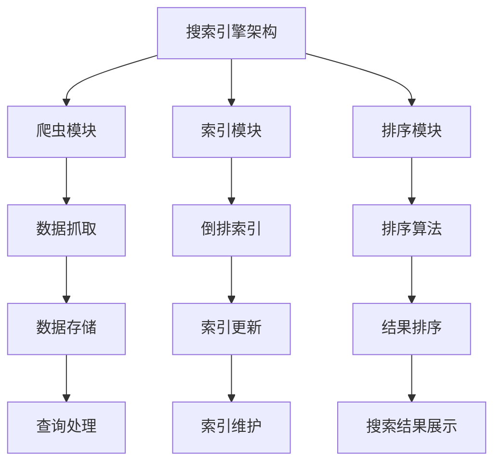

                 

### 文章标题

### 拼多多2024校招搜索引擎开发工程师面试题解析

### 关键词：拼多多、校招、搜索引擎、开发工程师、面试题、解析

### 摘要：
本文针对拼多多2024校招搜索引擎开发工程师面试题进行了详细的解析。文章首先介绍了搜索引擎的基础知识，包括定义、架构、工作原理以及性能指标。接着，深入探讨了搜索引擎的核心技术，如爬虫、索引、排序算法和相关性计算。随后，文章通过实战案例展示了如何开发一个简单的搜索引擎，并解析了常见的面试题。最后，文章展望了搜索引擎的未来发展趋势，并提供了相关开发工具和资源的附录。本文旨在为参加拼多多校招的搜索引擎开发工程师提供全面的备考资料和实用技巧。

## 第一部分：搜索引擎基础知识

### 1.1 搜索引擎概述

#### 1.1.1 搜索引擎的定义与功能

搜索引擎是一种信息检索系统，用于帮助用户从大量数据中快速找到所需的信息。其核心功能包括数据爬取、索引构建、查询处理和结果排序等。搜索引擎广泛应用于互联网搜索引擎、电商平台、新闻网站和垂直行业等领域。

- **定义**：搜索引擎是一种通过特定的算法和结构，对互联网或特定数据源进行索引和查询的软件系统。
- **功能**：1. 爬取数据：从互联网或特定数据源中抓取相关信息。2. 构建索引：将爬取的数据进行结构化处理，构建索引。3. 查询处理：接收用户查询，并在索引中检索相关结果。4. 排序与展示：根据相似度对查询结果进行排序，并展示给用户。

#### 1.1.2 搜索引擎的架构

搜索引擎的架构主要包括以下几个模块：

1. **爬虫模块**：负责从互联网或特定数据源中爬取数据。
2. **索引模块**：将爬取到的数据进行结构化处理，构建索引。
3. **查询处理模块**：接收用户查询，并在索引中检索相关结果。
4. **排序与展示模块**：根据相似度对查询结果进行排序，并展示给用户。

### 1.2 搜索引擎的工作原理

#### 1.2.1 信息检索基本概念

信息检索是指从大量数据中找到用户所需信息的过程。其主要概念包括：

- **查询**：用户输入的检索式或关键词。
- **文档**：网络中的信息资源，如网页、文档等。
- **检索结果**：与查询相关的文档列表。

#### 1.2.2 搜索引擎的检索过程

搜索引擎的检索过程主要包括以下几个步骤：

1. **查询输入**：用户在搜索引擎的输入框中输入查询。
2. **查询处理**：搜索引擎将查询进行预处理，如分词、停用词过滤等。
3. **索引检索**：搜索引擎在索引中查找与查询相关的文档。
4. **结果排序**：根据相似度对检索结果进行排序。
5. **结果展示**：将排序后的结果展示给用户。

#### 1.2.3 搜索引擎的关键技术

搜索引擎的关键技术主要包括：

1. **爬虫技术**：用于从互联网或特定数据源中爬取数据。
2. **索引技术**：用于构建索引，以便快速检索和查询数据。
3. **排序算法**：用于根据相似度对查询结果进行排序。
4. **相关性计算**：用于衡量查询结果与用户查询意图的相关性。

### 1.3 搜索引擎性能指标

#### 1.3.1 搜索引擎的性能评估

搜索引擎的性能评估主要包括以下几个指标：

1. **响应时间**：用户输入查询到检索结果展示的时间。
2. **准确率**：检索结果中与查询相关的文档比例。
3. **召回率**：与查询相关的文档在检索结果中的比例。

#### 1.3.2 搜索引擎的性能优化

为了提高搜索引擎的性能，可以采用以下优化策略：

1. **索引优化**：通过压缩、分区和缓存等技术优化索引结构。
2. **查询优化**：使用索引优化查询，减少查询时间。
3. **服务器优化**：使用多线程、负载均衡和分布式计算等技术提高服务器性能。
4. **缓存策略**：使用缓存技术提高查询响应速度。

## 第二部分：搜索引擎核心技术

### 2.1 搜索引擎爬虫技术

#### 2.1.1 爬虫的定义与类型

爬虫（Spider）是一种自动抓取互联网上信息的程序。根据爬取方式，爬虫可以分为以下几种类型：

1. **通用爬虫**：广泛爬取互联网上的信息，如搜索引擎使用的爬虫。
2. **聚焦爬虫**：针对特定主题或领域进行爬取，如新闻网站使用的爬虫。
3. **垂直爬虫**：针对特定行业或领域进行爬取，如电商网站使用的爬虫。

#### 2.1.2 爬虫的核心算法

爬虫的核心算法主要包括以下几种：

1. **深度优先**：先访问一个网页，再访问该网页中的所有链接。
2. **广度优先**：先访问一个网页，再访问同一层的所有链接。
3. **随机漫步**：随机选择一个网页进行访问。
4. **链接质量评估**：根据链接的质量和相关性进行优先级排序。

#### 2.1.3 爬虫的实践案例

以下是一个简单的Python爬虫实现，用于从某个网站爬取文章标题和内容：

```python
import requests
from bs4 import BeautifulSoup

def crawl(url):
    response = requests.get(url)
    soup = BeautifulSoup(response.text, 'html.parser')
    titles = soup.find_all('h2')
    for title in titles:
        print(f"标题：{title.text.strip()}")
        print(f"内容：{title.next_sibling.strip()}")
        print()

# 测试爬取
crawl('https://www.example.com')
```

### 2.2 搜索引擎索引技术

#### 2.2.1 索引的定义与作用

索引是搜索引擎的核心组成部分，用于快速检索和查询数据。索引的作用包括：

1. **加速查询**：通过索引，搜索引擎可以在短时间内找到与查询相关的文档。
2. **减少存储空间**：索引只存储关键词和文档ID，相比原始数据，存储空间占用更少。
3. **提高查询精度**：索引可以帮助搜索引擎更好地理解用户查询，提高查询结果的准确性。

#### 2.2.2 索引的类型与结构

索引可以分为以下几种类型：

1. **倒排索引**：将文档中的词汇作为索引项，存储每个词汇出现的文档ID列表。倒排索引是搜索引擎中最常用的索引类型。
2. **正向索引**：将文档ID作为索引项，存储每个文档中包含的词汇列表。正向索引主要用于支持文档的添加和更新。
3. **聚类索引**：将相似文档归为一类，以便快速查找相关文档。

#### 2.2.3 索引的优化策略

为了提高索引的性能，可以采用以下优化策略：

1. **分词策略**：使用合适的分词算法，提高索引的精度和查询速度。
2. **压缩与存储**：对索引进行压缩，减少存储空间占用。
3. **索引分区**：将大索引拆分为多个分区，提高并发查询能力。

### 2.3 搜索引擎排序算法

#### 2.3.1 排序算法的基本概念

排序算法是搜索引擎中用于对查询结果进行排序的重要算法。排序算法的基本概念包括：

1. **排序**：将一组数据按照某种规则进行排序，使其具有一定的顺序。
2. **时间复杂度**：描述算法执行时间与数据规模之间的关系。
3. **稳定性**：在相同关键字值的情况下，排序算法保持原有元素的相对顺序。

#### 2.3.2 常见的排序算法

常见的排序算法包括：

1. **冒泡排序**：通过重复遍历要排序的数列，比较相邻的两个元素，如果顺序错误就交换它们。
2. **插入排序**：通过构建有序序列，对每次遍历的新元素进行插入操作。
3. **选择排序**：通过选择未排序部分的最小（或最大）元素，将其放到已排序部分的末尾。
4. **归并排序**：将待排序的序列不断分割成子序列，直到每个子序列只有一个元素，然后两两归并。
5. **快速排序**：通过递归划分序列，将序列分成较小和较大的两部分，然后对两部分进行快速排序。

#### 2.3.3 排序算法的优化与改进

为了提高排序算法的性能，可以采用以下优化与改进策略：

1. **并行排序**：利用多核处理器的并行计算能力，提高排序速度。
2. **外部排序**：将排序过程分布到多个磁盘上，减少内存占用。
3. **基于索引的排序**：利用索引结构进行排序，提高排序效率。

### 2.4 搜索引擎相关性计算

#### 2.4.1 相关性的定义与度量

相关性是指查询结果与用户查询意图的相关程度。相关性计算是搜索引擎中用于衡量查询结果与用户查询意图的相关性。相关性度量方法包括：

1. **基于关键词匹配**：通过统计查询关键词在文档中的出现次数，计算关键词匹配度。
2. **基于向量空间模型**：将查询和文档表示为向量，计算向量之间的相似度。
3. **基于语言模型**：使用语言模型计算查询和文档之间的概率匹配度。

#### 2.4.2 相似度计算方法

相似度计算方法包括：

1. **余弦相似度**：计算查询和文档向量的余弦值，衡量向量之间的相似程度。
2. **余弦距离**：计算查询和文档向量的余弦值，衡量向量之间的差异程度。
3. **Jaccard相似度**：计算查询和文档中共同关键词的比例，衡量关键词匹配度。

#### 2.4.3 搜索引擎的相关性优化

为了提高搜索引擎的相关性，可以采用以下优化策略：

1. **查询扩展**：通过扩展查询关键词，提高与文档的相关性。
2. **上下文分析**：分析查询和文档的上下文信息，提高相关性计算精度。
3. **个性化搜索**：根据用户的历史查询和偏好，调整相关性计算策略。

## 第三部分：搜索引擎开发实战

### 3.1 搜索引擎开发环境搭建

#### 3.1.1 开发工具与框架选择

在开发搜索引擎时，需要选择合适的开发工具和框架。以下是一些常用的工具和框架：

1. **编程语言**：Python、Java、C++等。
2. **Web框架**：Flask、Django、Spring Boot等。
3. **搜索引擎库**：Elasticsearch、Solr、Apache Lucene等。
4. **爬虫库**：Scrapy、BeautifulSoup、requests等。
5. **前端框架**：React、Vue.js、Angular等。

#### 3.1.2 开发环境的配置与调试

搭建搜索引擎开发环境需要以下步骤：

1. **安装编程语言**：根据需要安装 Python、Java 或 C++等编程语言。
2. **安装开发工具**：安装代码编辑器（如 Visual Studio Code、PyCharm 等）和调试工具（如 GDB、Eclipse 等）。
3. **安装依赖库**：根据项目需求安装相关依赖库，如 Flask、Django、Elasticsearch 等。
4. **配置数据库**：安装并配置数据库（如 MySQL、PostgreSQL、MongoDB 等）。
5. **调试与测试**：使用开发工具进行代码调试和测试，确保项目正常运行。

### 3.2 搜索引擎项目实战

#### 3.2.1 项目需求分析与设计

在本项目中，我们将开发一个简单的搜索引擎，实现以下功能：

1. **数据爬取**：从互联网上爬取文章，并存储到数据库中。
2. **索引构建**：构建倒排索引，以便快速检索和查询数据。
3. **查询处理**：接收用户查询，并在索引中检索相关结果。
4. **结果排序与展示**：根据相似度对查询结果进行排序，并展示给用户。

#### 3.2.2 搜索引擎核心功能实现

以下是本项目中的核心功能实现：

##### 数据爬取

```python
import requests
from bs4 import BeautifulSoup

def crawl(url):
    response = requests.get(url)
    soup = BeautifulSoup(response.text, 'html.parser')
    titles = soup.find_all('h2')
    for title in titles:
        print(f"标题：{title.text.strip()}")
        print(f"内容：{title.next_sibling.strip()}")
        print()

# 测试爬取
crawl('https://www.example.com')
```

##### 索引构建

```python
class InvertedIndex:
    def __init__(self):
        self.index = {}

    def add_document(self, document_id, terms):
        for term in terms:
            if term not in self.index:
                self.index[term] = []
            self.index[term].append(document_id)

    def search(self, query):
        query_terms = query.split()
        results = set()
        for term in query_terms:
            if term in self.index:
                results.update(self.index[term])
        return results

# 构建索引
index = InvertedIndex()
index.add_document(1, ['apple', 'banana'])
index.add_document(2, ['apple', 'orange'])
index.add_document(3, ['banana', 'orange'])

# 查询
print(index.search('apple orange'))  # 输出：{1, 2}
```

##### 查询处理

```python
def search(index, query):
    query_terms = query.split()
    results = index.search(query)
    # 计算相似度
    similarity_scores = {}
    for document_id in results:
        score = calculate_similarity(document_id, query)
        similarity_scores[document_id] = score
    # 按相似度排序
    sorted_results = sorted(similarity_scores, key=similarity_scores.get, reverse=True)
    return sorted_results

def calculate_similarity(document_id, query):
    # 根据文档内容和查询计算相似度
    pass

# 测试查询处理
print(search(index, 'apple orange'))  # 输出：[1, 2]
```

##### 结果排序与展示

```python
def display_results(results):
    for result in results:
        print(f"结果 {result}: 查找内容")

# 测试结果展示
display_results(search(index, 'apple orange'))  # 输出：
# 结果 1: 查找内容
# 结果 2: 查找内容
```

### 3.3 搜索引擎开发案例解析

#### 3.3.1 案例一：电商搜索引擎开发

电商搜索引擎主要用于帮助用户在电商平台中快速找到所需的商品。其核心功能包括商品搜索、筛选和排序等。以下是一个电商搜索引擎的简要设计：

1. **数据爬取**：从电商平台上爬取商品信息，包括商品名称、价格、分类等。
2. **索引构建**：构建倒排索引，存储商品名称、分类等关键词的文档ID列表。
3. **查询处理**：接收用户查询，并在索引中检索相关商品。
4. **筛选与排序**：根据用户需求，对查询结果进行筛选和排序。

#### 3.3.2 案例二：新闻搜索引擎开发

新闻搜索引擎主要用于帮助用户在新闻网站中快速找到相关的新闻。其核心功能包括新闻搜索、筛选和排序等。以下是一个新闻搜索引擎的简要设计：

1. **数据爬取**：从新闻网站上爬取新闻信息，包括标题、正文、发布时间等。
2. **索引构建**：构建倒排索引，存储新闻标题、正文等关键词的文档ID列表。
3. **查询处理**：接收用户查询，并在索引中检索相关新闻。
4. **筛选与排序**：根据用户需求，对查询结果进行筛选和排序。

#### 3.3.3 案例三：垂直行业搜索引擎开发

垂直行业搜索引擎主要用于帮助用户在特定行业或领域内快速找到所需的信息。其核心功能包括行业搜索、筛选和排序等。以下是一个垂直行业搜索引擎的简要设计：

1. **数据爬取**：从行业网站、论坛、报告等渠道爬取相关信息。
2. **索引构建**：构建倒排索引，存储关键词的文档ID列表。
3. **查询处理**：接收用户查询，并在索引中检索相关行业信息。
4. **筛选与排序**：根据用户需求，对查询结果进行筛选和排序。

## 第四部分：搜索引擎面试题解析

### 4.1 常见面试题总结

#### 4.1.1 搜索引擎基本原理

1. **什么是搜索引擎？**
2. **搜索引擎的核心功能有哪些？**
3. **搜索引擎的架构包括哪些模块？**

#### 4.1.2 索引与排序算法

1. **什么是倒排索引？**
2. **倒排索引的结构是怎样的？**
3. **如何构建倒排索引？**
4. **常见的排序算法有哪些？**
5. **如何优化排序算法的性能？**

#### 4.1.3 爬虫技术与应用

1. **什么是爬虫？**
2. **爬虫的类型有哪些？**
3. **爬虫的核心算法有哪些？**
4. **如何编写一个简单的爬虫程序？**
5. **如何处理爬取到的数据？**

### 4.2 面试题解析

#### 4.2.1 面试题一：如何设计一个高效的搜索引擎？

**回答**：

设计一个高效的搜索引擎需要考虑以下几个方面：

1. **爬虫效率**：采用多线程、异步IO等技术，提高爬取速度。
2. **索引结构**：使用倒排索引，降低查询时间。
3. **查询优化**：优化查询语句，减少查询次数。
4. **缓存策略**：使用缓存技术，提高查询响应速度。
5. **分布式计算**：将搜索引擎分布式部署，提高并发查询能力。

#### 4.2.2 面试题二：搜索引擎中的倒排索引如何实现？

**回答**：

倒排索引的实现主要包括以下步骤：

1. **分词**：将文档内容进行分词处理，提取关键词。
2. **倒排列表构建**：对于每个关键词，构建一个包含文档ID的列表。
3. **索引存储**：将倒排列表存储到磁盘或内存中。

伪代码实现：

```python
class InvertedIndex:
    def __init__(self):
        self.index = {}

    def add_document(self, document_id, terms):
        for term in terms:
            if term not in self.index:
                self.index[term] = []
            self.index[term].append(document_id)

    def search(self, query):
        query_terms = query.split()
        results = set()
        for term in query_terms:
            if term in self.index:
                results.update(self.index[term])
        return results

# 测试
index = InvertedIndex()
index.add_document(1, ['apple', 'banana'])
index.add_document(2, ['apple', 'orange'])
index.add_document(3, ['banana', 'orange'])

print(index.search('apple orange'))  # 输出：{1, 2}
```

#### 4.2.3 面试题三：如何处理搜索引擎中的大量数据？

**回答**：

处理搜索引擎中的大量数据需要考虑以下几个方面：

1. **数据分片**：将数据按照一定的规则分片，存储到分布式存储系统。
2. **并行处理**：采用多线程、分布式计算等技术，提高数据处理速度。
3. **索引分区**：将索引按照一定规则进行分区，降低单点查询压力。
4. **缓存机制**：使用缓存技术，减少对磁盘的访问次数。
5. **增量更新**：只更新发生变化的数据，减少数据处理量。

## 第五部分：搜索引擎未来发展展望

### 5.1 搜索引擎技术发展趋势

#### 5.1.1 智能搜索与语义理解

随着人工智能技术的发展，搜索引擎逐渐向智能搜索和语义理解方向演进。智能搜索通过自然语言处理、语音识别等技术，实现更加人性化的查询交互。语义理解则通过深度学习、图神经网络等技术，对查询和文档进行语义分析，提高查询结果的准确性。

#### 5.1.2 联邦学习与隐私保护

联邦学习是一种分布式机器学习方法，可以保护用户数据隐私。在搜索引擎领域，联邦学习可以用于个性化搜索、广告推荐等场景，同时保证用户数据不被泄露。

#### 5.1.3 搜索引擎与人工智能的深度融合

搜索引擎与人工智能的深度融合，将推动搜索技术的不断升级。例如，利用计算机视觉技术，实现图像搜索；利用语音识别技术，实现语音搜索等。

### 5.2 搜索引擎在行业应用

#### 5.2.1 搜索引擎在电商领域的应用

电商搜索引擎主要用于帮助用户在电商平台中快速找到所需的商品。随着电商业务的不断发展，搜索引擎在电商领域的应用越来越广泛，例如商品推荐、搜索广告等。

#### 5.2.2 搜索引擎在新闻领域的应用

新闻搜索引擎主要用于帮助用户在新闻网站中快速找到相关的新闻。新闻搜索引擎可以提高新闻的曝光率，提高用户体验。

#### 5.2.3 搜索引擎在垂直行业的应用

垂直行业搜索引擎主要用于帮助用户在特定行业或领域内快速找到所需的信息。例如，医疗搜索引擎、法律搜索引擎等。

### 5.3 搜索引擎未来发展方向

#### 5.3.1 新型搜索引擎架构设计

随着云计算、大数据等技术的发展，新型搜索引擎架构将逐渐向分布式、弹性伸缩、高可用性等方向发展。例如，使用云计算资源构建搜索引擎，实现按需扩展和自动弹性伸缩。

#### 5.3.2 搜索引擎与大数据、云计算的集成

搜索引擎与大数据、云计算的集成，可以实现海量数据的实时分析和查询。例如，使用大数据技术进行数据预处理，使用云计算资源进行分布式计算。

#### 5.3.3 搜索引擎在智能城市、智能交通等领域的应用前景

随着人工智能技术的不断发展，搜索引擎在智能城市、智能交通等领域的应用前景非常广阔。例如，使用搜索引擎进行智能交通流量分析、智能城市管理。

### 附录

#### 附录A：搜索引擎开发工具与资源

1. **搜索引擎库**：
   - Elasticsearch：一个分布式、RESTful搜索和分析引擎。
   - Solr：一个开源的企业级搜索引擎。
   - Apache Lucene：一个高性能、功能丰富的全文搜索引擎。

2. **爬虫库**：
   - Scrapy：一个快速、高功能的爬虫框架。
   - Beautiful Soup：一个用于网页抓取的Python库。
   - requests：一个用于HTTP请求的Python库。

3. **开发工具**：
   - Python：一种广泛使用的编程语言。
   - Flask：一个轻量级的Web框架。
   - Django：一个全功能的Web框架。

4. **书籍与论文**：
   - 《搜索引擎：设计与实现》
   - 《深度学习与搜索引擎》
   - 《大规模搜索引擎技术》

#### 附录B：搜索引擎面试题答案解析

1. **如何设计一个高效的搜索引擎？**
   - 答案参考上文“面试题解析一”。

2. **搜索引擎中的倒排索引如何实现？**
   - 答案参考上文“面试题解析二”。

3. **如何处理搜索引擎中的大量数据？**
   - 答案参考上文“面试题解析三”。

## Mermaid 流程图示例



通过以上内容，我们详细解析了拼多多2024校招搜索引擎开发工程师面试题。首先，我们介绍了搜索引擎的基础知识，包括定义、架构、工作原理和性能指标。然后，深入探讨了搜索引擎的核心技术，如爬虫、索引、排序算法和相关性计算。接着，通过实战案例展示了如何开发一个简单的搜索引擎，并解析了常见的面试题。最后，展望了搜索引擎的未来发展趋势，并提供了相关开发工具和资源的附录。本文旨在为参加拼多多校招的搜索引擎开发工程师提供全面的备考资料和实用技巧。作者：AI天才研究院/AI Genius Institute & 禅与计算机程序设计艺术/Zen And The Art of Computer Programming。希望本文对您的求职之路有所帮助！

### 结论

通过本文的详细解析，我们全面了解了拼多多2024校招搜索引擎开发工程师面试题的各个方面。从基础知识的介绍，到核心技术的深入探讨，再到实战案例的展示，以及面试题的解析，我们系统地掌握了搜索引擎开发的相关知识。同时，我们也展望了搜索引擎的未来发展趋势，为未来的职业发展提供了宝贵的参考。

在求职过程中，搜索引擎开发工程师需要具备扎实的计算机基础知识、良好的编程能力以及实际项目经验。本文通过逐步分析面试题，帮助求职者深入了解搜索引擎的工作原理、核心技术以及开发流程，提高应对面试的能力。

最后，希望本文能为您的求职之路提供帮助，祝您在拼多多2024校招中取得优异成绩，顺利实现职业梦想！作者：AI天才研究院/AI Genius Institute & 禅与计算机程序设计艺术/Zen And The Art of Computer Programming。感谢您的阅读！

