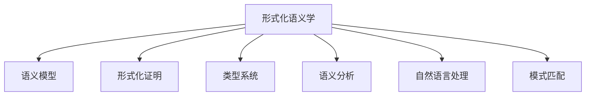

                 

### 1.1 研究背景与意义

#### 提示词编程语言概述

提示词编程语言（Prompt Programming Language，简称PPL）是一种基于自然语言交互的编程语言，用户通过输入自然语言描述（即提示词），来指导计算机执行相应的任务。这种编程语言的出现，是为了解决传统编程语言中存在的复杂语法、低效沟通等问题，使得编程更加直观、易用。例如，用户可以像与聊天机器人对话一样，通过简单的文本指令，实现对复杂程序的编写和执行。

提示词编程语言最早可以追溯到自然语言编程（Natural Language Programming，简称NLP）的研究，其中最具代表性的是1960年代的“速记语言”（Sketchpad Language）。随着人工智能和自然语言处理技术的不断发展，提示词编程语言逐渐成为研究热点。近年来，深度学习和生成对抗网络（GAN）等技术的进步，进一步推动了提示词编程语言的发展。

#### 形式化语义学的基本概念

形式化语义学是计算机科学中研究程序语义的形式化方法的一个分支，主要研究如何将程序语言中的自然语言描述转化为精确的数学模型。形式化语义学的目标是建立一种数学模型，使得计算机能够理解和执行特定的编程任务，同时保证程序的正确性和可靠性。

形式化语义学的基本概念包括：

1. **语义模型**：语义模型是形式化语义学的基础，用于描述程序的行为和含义。常见的语义模型包括运行时语义模型和静态语义模型。
2. **类型系统**：类型系统是形式化语义学的重要组成部分，用于确保程序在运行时不会出现类型错误。类型系统可以划分为静态类型系统和动态类型系统。
3. **形式化证明**：形式化证明是一种数学方法，用于证明程序的正确性。通过形式化证明，可以确保程序在所有可能的输入下都能正确执行。

#### 研究现状与挑战

目前，提示词编程语言的形式化语义学研究已经取得了一系列重要进展。例如，研究人员提出了多种基于深度学习的语义模型，如注意力模型、生成对抗网络等，这些模型在处理自然语言指令方面表现出色。此外，形式化语义学在类型系统、模式匹配和形式化验证等领域也取得了显著成果。

然而，提示词编程语言的形式化语义学研究仍然面临许多挑战。首先，自然语言描述的多样性和复杂性使得形式化语义学面临巨大的挑战。其次，如何将自然语言指令精确地转化为数学模型，并保证程序的正确性，仍然是一个亟待解决的问题。此外，现有的形式化语义学方法在处理实时交互任务时，仍然存在性能瓶颈。

为了解决这些挑战，未来的研究可以从以下几个方面展开：

1. **增强自然语言处理能力**：通过结合深度学习和自然语言处理技术，提高提示词编程语言对自然语言描述的理解能力。
2. **优化形式化语义学方法**：研究更高效的形式化语义学方法，降低形式化验证的复杂度，提高程序的正确性和可靠性。
3. **跨领域应用**：探索形式化语义学在多领域的应用，如自然语言处理、软件工程、数据库系统等，推动形式化语义学的广泛应用。

总之，提示词编程语言的形式化语义学研究不仅具有重要的理论价值，而且在实际应用中也具有重要意义。通过不断的研究和探索，我们有理由相信，提示词编程语言的形式化语义学将在未来的计算机科学领域中发挥越来越重要的作用。

### 1.2 研究目标与方法

#### 研究目标

本研究旨在深入探讨提示词编程语言的形式化语义学，目标是构建一个高效、可靠的形式化语义学模型，以解决自然语言描述的多样性和复杂性带来的挑战。具体研究目标包括：

1. **理解自然语言指令**：通过深度学习和自然语言处理技术，提高对自然语言指令的理解能力，实现更准确的语义解析。
2. **形式化语义学模型**：构建一个形式化语义学模型，将自然语言指令转化为精确的数学模型，确保程序的正确性和可靠性。
3. **优化形式化验证方法**：研究并优化形式化验证方法，提高形式化验证的效率，降低形式化验证的复杂度。
4. **跨领域应用**：探索形式化语义学在多领域的应用，如自然语言处理、软件工程、数据库系统等，推动形式化语义学的广泛应用。

#### 研究方法

为了实现上述研究目标，本研究采用以下研究方法：

1. **文献综述**：通过分析相关文献，了解提示词编程语言和形式化语义学的最新研究进展，明确研究方向和挑战。
2. **理论研究**：基于深度学习和自然语言处理技术，探讨如何提高对自然语言指令的理解能力，构建形式化语义学模型。
3. **实验研究**：设计并实现实验，验证所提出的形式化语义学模型的有效性和可靠性。实验包括自然语言指令的语义解析、形式化验证等。
4. **案例分析**：通过具体的应用案例，展示形式化语义学在提示词编程语言中的实际应用效果，分析其优势和挑战。
5. **跨领域应用**：结合自然语言处理、软件工程、数据库系统等领域的实际需求，探索形式化语义学的跨领域应用。

#### 研究范围与局限性

本研究主要关注提示词编程语言的形式化语义学，研究范围包括自然语言指令的语义解析、形式化语义学模型的构建、形式化验证方法的研究等。同时，本研究还尝试将形式化语义学应用于多领域，以展示其广泛的应用潜力。

然而，本研究也存在一定的局限性。首先，自然语言描述的多样性和复杂性使得形式化语义学面临巨大的挑战，研究过程中可能无法完全解决所有问题。其次，本研究主要关注形式化语义学的理论研究和实验验证，对于实际应用中的具体实现细节，可能需要进一步的研究和实践。此外，由于时间和资源限制，本研究可能无法涵盖所有相关的领域和应用场景，需要后续研究进行补充和完善。

### 1.3 本书结构安排

#### 目录概述

本书共分为七个主要部分，分别从不同的角度对提示词编程语言的形式化语义学进行深入探讨。具体章节安排如下：

1. **引言**：介绍研究背景与意义，明确研究目标和方法，阐述本书的结构安排。
2. **形式化语义学基础**：概述形式化语义学的基本概念、原理和分类，介绍提示词编程语言的基本概念和特点。
3. **形式化语义学关键理论**：详细讨论形式化语义学中的核心理论，包括形式语义学、模式匹配与形式化验证、类型系统等。
4. **形式化语义学算法分析**：分析形式化语义学算法的基本概念、分类和应用领域，介绍伪代码实现和数学模型。
5. **形式化语义学应用实例**：展示形式化语义学在提示词编程语言中的具体应用，包括语义分析、自然语言处理和其他领域中的应用。
6. **形式化语义学的未来发展趋势**：探讨形式化语义学的技术挑战、发展趋势和未来研究方向。
7. **总结与展望**：总结研究成果，指出研究不足与改进方向，展望形式化语义学的未来发展趋势。

#### 主要内容与章节划分

- **第一章**：引言。主要介绍研究背景与意义，明确研究目标和方法，阐述本书的结构安排。
- **第二章**：形式化语义学基础。介绍形式化语义学的基本概念、原理和分类，介绍提示词编程语言的基本概念和特点。
- **第三章**：形式化语义学关键理论。详细讨论形式化语义学中的核心理论，包括形式语义学、模式匹配与形式化验证、类型系统等。
- **第四章**：形式化语义学算法分析。分析形式化语义学算法的基本概念、分类和应用领域，介绍伪代码实现和数学模型。
- **第五章**：形式化语义学应用实例。展示形式化语义学在提示词编程语言中的具体应用，包括语义分析、自然语言处理和其他领域中的应用。
- **第六章**：形式化语义学的未来发展趋势。探讨形式化语义学的技术挑战、发展趋势和未来研究方向。
- **第七章**：总结与展望。总结研究成果，指出研究不足与改进方向，展望形式化语义学的未来发展趋势。

通过以上章节的安排，本书旨在为读者提供全面、深入的了解提示词编程语言的形式化语义学，帮助读者掌握这一领域的核心概念、关键理论和应用实例。

## 第二部分：形式化语义学基础

### 2.1 形式化语义学概述

#### 形式化语义学的定义与作用

形式化语义学是计算机科学中的一个重要分支，主要研究如何将程序语言中的自然语言描述转化为精确的数学模型，以描述程序的行为和含义。形式化语义学的核心目标是通过形式化的方法，确保程序的正确性、可靠性和可理解性。在程序设计过程中，形式化语义学能够帮助开发者更好地理解程序的行为，发现潜在的错误和缺陷，提高程序的质量和可靠性。

形式化语义学的定义可以概括为：一种基于数学模型和方法，对程序语言进行语义描述和验证的研究领域。形式化语义学的研究内容包括语义模型、类型系统、形式化证明等。

#### 形式化语义学的基本原理

形式化语义学的基本原理包括以下几个方面：

1. **数学模型**：形式化语义学通过构建数学模型来描述程序的行为和含义。常见的数学模型包括运行时语义模型和静态语义模型。运行时语义模型描述程序在执行过程中的状态变化和计算结果，而静态语义模型描述程序的结构和类型信息。
   
2. **类型系统**：类型系统是形式化语义学的重要组成部分，用于确保程序在运行时不会出现类型错误。类型系统可以划分为静态类型系统和动态类型系统。静态类型系统在编译时检查类型一致性，而动态类型系统在运行时进行类型检查。

3. **形式化证明**：形式化证明是一种数学方法，用于证明程序的正确性。通过形式化证明，可以确保程序在所有可能的输入下都能正确执行。常见的形式化证明方法包括归纳证明、模型检查等。

#### 形式化语义学的发展历程

形式化语义学的发展历程可以追溯到20世纪50年代。当时，随着编程语言的兴起，研究者开始探讨如何形式化地描述程序语义。以下是形式化语义学发展的几个重要阶段：

1. **早期研究（1950-1960年代）**：在这一阶段，研究者提出了许多初步的语义模型，如图灵机模型、λ演算等。这些模型为后续形式化语义学的发展奠定了基础。

2. **语义学理论的成熟（1960-1980年代）**：在这一阶段，形式化语义学得到了进一步发展，出现了许多重要的语义学理论，如指称论、操作语义、归纳语义等。这些理论为形式化语义学提供了坚实的理论基础。

3. **类型系统的引入（1980-1990年代）**：在这一阶段，类型系统被引入到形式化语义学中，成为保证程序正确性的重要手段。静态类型系统和动态类型系统相继被提出，并在编程语言设计中得到广泛应用。

4. **形式化验证技术的发展（1990年代至今）**：随着计算机科学和人工智能技术的发展，形式化验证技术逐渐成熟。形式化验证方法被广泛应用于软件工程、硬件设计等领域，为程序的可靠性提供了重要保障。

#### 形式化语义学的基本原理与架构

形式化语义学的基本原理和架构可以概括为以下几个方面：

1. **语义模型**：语义模型是形式化语义学的核心，用于描述程序的行为和含义。常见的语义模型包括运行时语义模型和静态语义模型。运行时语义模型描述程序在执行过程中的状态变化和计算结果，而静态语义模型描述程序的结构和类型信息。

2. **类型系统**：类型系统是形式化语义学的重要组成部分，用于确保程序在运行时不会出现类型错误。类型系统可以划分为静态类型系统和动态类型系统。静态类型系统在编译时检查类型一致性，而动态类型系统在运行时进行类型检查。

3. **形式化证明**：形式化证明是一种数学方法，用于证明程序的正确性。通过形式化证明，可以确保程序在所有可能的输入下都能正确执行。常见的形式化证明方法包括归纳证明、模型检查等。

4. **形式化语义学与自然语言处理**：形式化语义学在自然语言处理领域有着广泛的应用。通过将自然语言描述转化为形式化的语义模型，可以更好地理解自然语言的含义，提高自然语言处理的准确性和效率。

#### 形式化语义学的发展历程与未来趋势

形式化语义学的发展历程可以追溯到20世纪50年代，至今已经经历了多个阶段。早期的形式化语义学研究主要集中在语义模型和基本语义学理论的研究。随着计算机科学和人工智能技术的发展，形式化语义学逐渐扩展到类型系统、形式化验证等领域。

未来的形式化语义学发展将面临以下几个趋势：

1. **更高效的语义模型**：随着自然语言处理的进步，研究者将致力于构建更高效的语义模型，以更好地理解和处理复杂的自然语言描述。

2. **形式化验证技术的普及**：形式化验证技术在软件工程和硬件设计等领域已有广泛应用，未来将进一步普及到其他领域，如自然语言处理、数据库系统等。

3. **跨领域融合**：形式化语义学将与多个领域（如自然语言处理、机器学习、软件工程等）进行深度融合，推动形式化语义学的跨领域应用。

4. **更智能的编程语言**：未来的编程语言将更加智能化，通过形式化语义学的方法，使得编程更加直观、易用，降低开发者的编程难度。

总之，形式化语义学作为计算机科学中的一个重要分支，具有广泛的应用前景。通过不断的研究和探索，形式化语义学将在未来的计算机科学领域中发挥越来越重要的作用。

### 2.2 提示词编程语言的基本概念

#### 提示词编程语言的定义

提示词编程语言（Prompt Programming Language，简称PPL）是一种专门用于通过自然语言描述来编写和执行程序的编程语言。用户可以通过输入自然语言指令（即提示词），来指导计算机完成特定的任务。与传统的编程语言相比，提示词编程语言更加直观和易用，它通过将复杂的编程任务转化为自然语言描述，从而降低了编程的门槛。

例如，一个简单的提示词编程语言的示例可以是：“创建一个包含10个元素的列表，每个元素都是1到10之间的随机整数”。这个指令可以被编程语言解释并执行，生成一个满足要求的列表。

#### 提示词编程语言的特点

提示词编程语言具有以下几个显著特点：

1. **自然语言交互**：用户通过输入自然语言指令与编程语言进行交互，无需学习复杂的编程语法和结构。
   
2. **直观易用**：自然语言指令更加贴近人类的表达习惯，使得编程任务更加直观和易于理解。

3. **高效率**：通过自然语言指令，用户可以快速地描述复杂的功能需求，节省编程时间和开发成本。

4. **灵活性**：提示词编程语言允许用户以更灵活的方式表达编程需求，适应各种复杂场景。

5. **易于集成**：提示词编程语言可以与其他编程语言和工具无缝集成，提高开发效率和系统兼容性。

#### 提示词编程语言的分类

根据不同的应用场景和需求，提示词编程语言可以划分为以下几类：

1. **通用提示词编程语言**：这类语言旨在提供一种通用方式，使得用户可以通过自然语言描述来编写和执行各种编程任务。例如，ChatGPT、AlphaGo等。

2. **领域特定提示词编程语言**：这类语言专注于特定领域的编程需求，如数据科学、机器学习、自然语言处理等。例如，SQL（结构化查询语言）就是一种用于数据库查询的领域特定提示词编程语言。

3. **交互式提示词编程语言**：这类语言主要用于与用户进行实时交互，根据用户的需求动态生成和执行代码。例如，Jupyter Notebook、Google Colab等。

4. **嵌入式提示词编程语言**：这类语言将提示词编程嵌入到其他编程语言中，以实现特定的功能需求。例如，Python中的`eval()`函数就是一种将自然语言指令转换为代码执行的嵌入式提示词编程语言。

#### 提示词编程语言的应用场景

提示词编程语言在多个领域有着广泛的应用，以下是一些典型的应用场景：

1. **自然语言处理**：提示词编程语言可以用于构建自然语言处理系统，如自动问答、语音识别、文本生成等。

2. **数据科学**：提示词编程语言可以简化数据处理和分析过程，如数据清洗、统计分析、机器学习模型的训练等。

3. **软件开发**：提示词编程语言可以用于快速开发原型和应用程序，提高开发效率和质量。

4. **教育**：提示词编程语言可以帮助初学者快速入门编程，降低学习难度。

5. **自动化任务**：提示词编程语言可以用于自动化执行各种任务，如自动化测试、自动化部署等。

总之，提示词编程语言通过将复杂的编程任务转化为自然语言描述，极大地简化了编程过程，提高了开发效率。随着自然语言处理技术的不断进步，提示词编程语言在未来将有更广泛的应用和发展前景。

### 2.3 形式化语义学在提示词编程语言中的应用

#### 形式化语义学与提示词编程语言的结合

形式化语义学与提示词编程语言的结合，为编程语言的设计和使用提供了新的视角和方法。通过将形式化语义学的理论和方法应用于提示词编程语言，可以实现以下几个方面的优势：

1. **精确性**：形式化语义学通过数学模型和形式化证明，确保程序的正确性和可靠性。在提示词编程语言中，形式化语义学可以帮助精确地理解自然语言指令的含义，从而生成正确的代码。

2. **可验证性**：形式化语义学提供了一种形式化验证方法，可以验证程序在所有可能的输入下是否都能正确执行。这对于提示词编程语言尤为重要，因为自然语言指令的多样性使得潜在的错误和缺陷更加难以发现。

3. **灵活性**：形式化语义学允许在编程过程中引入更加灵活的表达方式，使得开发者可以以更加自然和直观的方式描述编程任务。这对于提示词编程语言来说，是一个重要的改进，因为它原本就是为了提高编程的易用性和直观性。

#### 形式化语义学在提示词编程语言中的优势

形式化语义学在提示词编程语言中的应用具有以下优势：

1. **自然语言理解**：形式化语义学能够提高对自然语言指令的理解能力，使得编程语言能够更准确地解析用户的指令，从而生成符合预期的代码。

2. **代码生成**：通过形式化语义学，可以将自然语言指令直接转化为有效的代码，节省了开发者手动编写代码的时间，提高了开发效率。

3. **类型安全**：形式化语义学中的类型系统可以帮助确保程序的类型安全，减少类型错误的发生，提高程序的正确性。

4. **形式化验证**：形式化语义学提供了一种形式化验证方法，可以验证程序在所有可能的输入下是否都能正确执行，从而保证程序的可信度和可靠性。

#### 形式化语义学在提示词编程语言中的挑战

尽管形式化语义学在提示词编程语言中具有许多优势，但在实际应用中仍然面临一些挑战：

1. **自然语言复杂性**：自然语言具有高度的复杂性和多样性，这使得形式化语义学在理解自然语言指令时面临巨大的挑战。如何准确地将自然语言指令转化为形式化的数学模型，是一个亟待解决的问题。

2. **性能优化**：形式化语义学的方法通常涉及复杂的计算和验证过程，这可能导致程序执行效率低下。如何在保证准确性的同时，优化形式化语义学的性能，是一个重要的研究方向。

3. **用户交互**：提示词编程语言的目的是提高编程的易用性，但形式化语义学的引入可能会增加用户的学习成本。如何平衡形式化语义学与用户交互的易用性，是另一个需要考虑的问题。

4. **应用领域扩展**：形式化语义学在提示词编程语言中的应用，目前主要集中在通用编程任务上。如何将其扩展到更多领域特定任务，如自然语言处理、数据科学等，是一个需要深入研究的方向。

总之，形式化语义学在提示词编程语言中的应用，为编程语言的发展带来了新的机遇和挑战。通过不断的研究和探索，我们可以期待形式化语义学在未来为提示词编程语言带来更加智能和高效的应用。

### 3.1 形式语义学

#### 形式语义学的定义与作用

形式语义学（Formal Semantics）是计算机科学中研究程序语言语义的学科，旨在通过形式化的方法描述程序的行为和含义。形式语义学的目标是构建一个精确、一致和可验证的语义模型，以便更好地理解程序语言的运行机制和功能特性。形式语义学在计算机科学中的应用十分广泛，包括编程语言设计、程序分析、验证和优化等。

形式语义学的定义可以概括为：一种使用数学和逻辑工具来描述程序语言语义的方法。形式语义学通过定义程序语言的结构、语法和语义，使得程序的行为可以在数学模型中进行严格的分析和验证。

#### 形式语义学的基本原理

形式语义学的基本原理包括以下几个方面：

1. **语义模型**：语义模型是形式语义学的核心，用于描述程序在执行过程中的行为和状态。常见的语义模型包括运行时语义模型和静态语义模型。运行时语义模型描述程序在执行过程中的动态行为，如变量的赋值、函数调用等。静态语义模型描述程序的结构和属性，如变量的类型、函数的参数等。

2. **语法**：语法（Syntax）是程序语言的结构，定义了程序中的合法表达方式。形式语义学与语法密切相关，通过语法分析（Parsing）将源代码转化为抽象语法树（Abstract Syntax Tree，AST），从而为语义分析提供基础。

3. **语义规则**：语义规则（Semantic Rules）是形式语义学中的关键概念，用于描述程序在不同情况下如何执行。语义规则通常用形式化的语言（如操作语义、指称论、类型系统等）来表示，使得程序的行为可以在数学模型中进行精确描述。

4. **形式化证明**：形式化证明（Formal Proof）是一种数学方法，用于证明程序的正确性。通过形式化证明，可以确保程序在所有可能的输入下都能正确执行，从而提高程序的可信度和可靠性。

#### 形式语义学的基本原理

形式语义学的基本原理可以概括为以下几个方面：

1. **运算规则**：运算规则描述程序中各种运算（如赋值、函数调用、循环等）的行为。例如，赋值运算的运算规则可以描述为：“将表达式的值赋给变量”。

2. **状态转换**：状态转换描述程序在执行过程中的状态变化。例如，在函数调用过程中，程序会从当前状态转换到函数体的状态，并在执行完函数体后返回到调用前的状态。

3. **类型系统**：类型系统（Type System）用于确保程序在运行时不会出现类型错误。类型系统可以通过静态类型检查（编译时检查）或动态类型检查（运行时检查）来实现。常见的类型系统包括强类型系统和弱类型系统。

4. **类型等价**：类型等价（Type Equivalence）描述不同类型之间的兼容性。形式语义学通过定义类型等价关系，确保程序在不同类型之间的转换是安全和有效的。

#### 形式语义学的应用场景

形式语义学在多个领域有着广泛的应用，以下是一些典型的应用场景：

1. **编程语言设计**：形式语义学是编程语言设计的基础，用于定义语言的语法和语义。通过形式语义学，开发者可以更清晰地理解语言的特性和行为，从而设计出更强大、更易用的编程语言。

2. **程序分析**：形式语义学可以用于静态分析程序的行为和属性，如变量的作用域、函数的调用关系、程序的优化等。形式语义学提供了一种精确的分析工具，有助于提高程序的正确性和性能。

3. **程序验证**：形式语义学提供了一种形式化验证方法，可以证明程序在所有可能的输入下都是正确的。形式语义学在安全关键系统、嵌入式系统等领域具有重要应用价值。

4. **编译器实现**：形式语义学是编译器实现的基础，通过形式语义学，编译器可以准确地理解源代码的含义，并生成高效的目标代码。

总之，形式语义学作为计算机科学中的一个重要分支，通过对程序语言语义的形式化描述，为编程语言的设计、分析和验证提供了强大的理论基础和工具。随着计算机科学和软件工程的发展，形式语义学将继续在各个领域发挥重要作用。

### 3.2 模式匹配与形式化验证

#### 模式匹配的基本原理

模式匹配（Pattern Matching）是编程语言中用于匹配和提取数据结构中特定模式的方法。其基本原理是通过比较输入数据和预定义的模式，判断输入数据是否符合预期的模式，并提取相关部分的数据。模式匹配广泛应用于编程语言、自然语言处理和数据科学等领域。

模式匹配的基本过程包括以下几个步骤：

1. **定义模式**：首先，定义一个或多个模式，用于描述要匹配的数据结构或文本。模式通常由一系列的原子（如变量、常量、操作符等）和结构（如列表、元组、字典等）组成。

2. **比较**：将输入数据与预定义的模式进行比较，判断输入数据是否与模式匹配。比较过程通常分为多个阶段，每个阶段对应模式中的一个部分。

3. **提取**：如果匹配成功，从输入数据中提取出匹配的部分。提取出的部分可以用于后续的数据处理或计算。

4. **处理**：根据匹配结果，执行相应的处理操作，如数据转换、计算、存储等。

模式匹配的基本原理可以概括为：通过定义模式，比较输入数据和模式，并根据匹配结果进行数据提取和处理。

#### 形式化验证的方法与步骤

形式化验证（Formal Verification）是一种通过形式化方法验证系统正确性的技术。在形式化验证中，系统被建模为一个数学系统，然后使用数学工具和方法来验证该系统的正确性。形式化验证的方法和步骤如下：

1. **系统建模**：首先，将系统（如软件、硬件、协议等）建模为一个数学系统。建模过程通常包括定义系统的状态空间、行为规则和约束条件。

2. **形式化规范**：其次，使用形式化的方法（如逻辑、代数等）定义系统的规范。规范描述了系统的预期行为和属性，如安全性、可靠性、性能等。

3. **验证算法**：然后，选择合适的验证算法来检查系统是否符合规范。常见的验证算法包括模型检查、定理证明、模拟验证等。

4. **验证证明**：通过验证算法，生成验证结果和证明。如果系统能够通过验证，则证明系统符合规范，否则，证明系统存在错误或不符合规范。

形式化验证的基本原理可以概括为：通过数学建模和形式化规范，使用验证算法和证明方法，确保系统在所有可能的输入下都能正确执行。

#### 模式匹配与形式化验证的结合

模式匹配与形式化验证的结合，可以用于验证编程语言中的模式匹配过程是否正确。具体方法如下：

1. **形式化定义模式匹配**：首先，使用形式化的方法（如代数、逻辑等）定义模式匹配的规范。规范应描述模式匹配的行为和约束条件，如匹配成功条件、匹配失败条件等。

2. **形式化验证模式匹配**：然后，使用形式化验证的方法（如模型检查、定理证明等）来验证模式匹配的实现是否满足规范。验证过程应检查模式匹配的每个阶段是否符合预定义的规范。

3. **生成验证证明**：最后，生成验证结果和证明，证明模式匹配过程是正确和可靠的。如果验证失败，则生成错误报告，帮助开发者定位和修复错误。

模式匹配与形式化验证的结合，有助于确保编程语言中的模式匹配过程是正确和高效的，从而提高程序的正确性和可靠性。

### 3.3 形式化语义学中的类型系统

#### 类型系统的定义与作用

类型系统（Type System）是形式化语义学中的核心组成部分，用于确保程序在运行时不会出现类型错误。类型系统通过定义变量、函数、表达式等的类型，确保它们在组合时是安全和有效的。类型系统在编程语言设计中起着至关重要的作用，能够提高程序的正确性、可读性和可维护性。

类型系统的主要作用包括：

1. **防止类型错误**：类型系统通过静态检查（在编译时）或动态检查（在运行时）来防止类型错误的发生，如将整数与字符串进行运算。

2. **提高程序可读性**：类型系统能够通过显式地声明变量的类型，提高程序代码的可读性和可理解性。

3. **优化程序执行效率**：类型系统可以帮助编译器或解释器在编译或解释过程中进行类型优化，提高程序的执行效率。

4. **代码重构和自动化工具**：类型系统为代码重构和自动化工具提供了基础，如自动类型推导、类型检查和类型推导等。

#### 类型系统的分类

根据类型检查的时间点（静态或动态）和类型约束的严格程度（强或弱），类型系统可以划分为以下几种：

1. **静态类型系统**：静态类型系统在编译时检查类型一致性，即在编译期确定程序中的所有类型错误。静态类型系统的优点包括：

   - **早期错误检测**：可以在编译期发现类型错误，提高程序的可靠性。
   - **性能优化**：由于类型信息在编译期已知，编译器可以进行更多的优化，提高程序执行效率。
   - **类型推导**：静态类型系统通常支持类型推导，使得代码更加简洁。

   缺点包括：

   - **灵活性受限**：静态类型系统可能对一些动态类型的编程模式支持不足。
   - **开发周期较长**：由于需要在编译期进行类型检查，开发周期可能较长。

2. **动态类型系统**：动态类型系统在运行时检查类型一致性，即在实际执行程序时检查类型错误。动态类型系统的优点包括：

   - **灵活性高**：动态类型系统对动态类型的编程模式支持较好，如函数式编程、动态绑定等。
   - **开发周期较短**：由于无需在编译期进行类型检查，开发周期可能较短。

   缺点包括：

   - **错误检测延迟**：类型错误可能在运行时才会被发现，增加了程序的运行风险。
   - **性能损失**：由于类型信息在运行时检查，可能导致性能损失。

3. **强类型系统**：强类型系统对类型约束较为严格，通常不允许将不同类型的值进行混合操作。强类型系统的优点包括：

   - **安全性高**：强类型系统可以防止类型错误的发生，提高程序的安全性。
   - **代码可读性强**：类型约束明确，使得代码更容易理解和维护。

   缺点包括：

   - **灵活性受限**：强类型系统可能对某些动态类型的编程模式支持不足。
   - **开发效率降低**：强类型系统可能需要更多的类型声明和约束，增加开发成本。

4. **弱类型系统**：弱类型系统对类型约束较为宽松，允许将不同类型的值进行混合操作。弱类型系统的优点包括：

   - **灵活性高**：弱类型系统对动态类型的编程模式支持较好，如脚本编程、动态绑定等。
   - **开发效率高**：弱类型系统通常不需要显式声明类型，使得代码更加简洁。

   缺点包括：

   - **安全性较低**：弱类型系统可能无法有效防止类型错误的发生。
   - **代码可读性较差**：类型约束不明确，使得代码难以理解和维护。

#### 类型系统在提示词编程语言中的应用

类型系统在提示词编程语言中的应用具有重要意义，主要体现在以下几个方面：

1. **提高自然语言指令的准确性**：类型系统可以帮助编程语言更准确地理解用户的自然语言指令，确保生成的代码类型安全。

2. **增强编程语言的可读性和可维护性**：通过显式地声明变量和函数的类型，提示词编程语言的代码更加直观和易于维护。

3. **提高程序的正确性和可靠性**：类型系统可以防止类型错误的发生，提高程序的正确性和可靠性。

4. **支持动态类型约束**：提示词编程语言可以结合动态类型系统，支持更灵活的编程模式，如动态绑定和函数式编程。

总之，类型系统在提示词编程语言中的应用，有助于提高编程语言的易用性、可维护性和安全性。通过合理设计和应用类型系统，提示词编程语言可以更好地满足用户的需求，为软件开发带来更多便利。

### 4.1 形式化语义学算法概述

#### 形式化语义学算法的基本概念

形式化语义学算法是用于描述程序语义和验证程序正确性的数学算法。这些算法通过形式化的方法，将程序语言中的自然语言描述转化为精确的数学模型，从而实现对程序行为的分析和验证。形式化语义学算法在计算机科学和软件工程中具有广泛的应用，是形式化语义学研究的重要组成部分。

形式化语义学算法的基本概念包括：

1. **语义模型**：语义模型是形式化语义学算法的核心，用于描述程序的行为和含义。常见的语义模型包括运行时语义模型和静态语义模型。运行时语义模型描述程序在执行过程中的状态变化和计算结果，而静态语义模型描述程序的结构和类型信息。

2. **语义规则**：语义规则是形式化语义学算法的基本组成部分，用于定义程序在不同情况下如何执行。语义规则通常用形式化的语言（如操作语义、指称论、类型系统等）来表示，使得程序的行为可以在数学模型中进行精确描述。

3. **形式化证明**：形式化证明是一种数学方法，用于证明程序的正确性。形式化证明通过形式化的方法，确保程序在所有可能的输入下都能正确执行，从而提高程序的可信度和可靠性。

4. **类型系统**：类型系统是形式化语义学算法的重要组成部分，用于确保程序在运行时不会出现类型错误。类型系统通过定义变量、函数、表达式等的类型，确保它们在组合时是安全和有效的。

#### 形式化语义学算法的分类

形式化语义学算法可以根据不同的分类标准进行分类，以下是一些常见的分类方法：

1. **基于操作语义的算法**：操作语义（Operational Semantics）是一种形式化描述程序行为的语义模型，通过定义程序在执行过程中的状态转换和计算过程。基于操作语义的算法主要包括：

   - **自然语义**（Natural Semantics）：自然语义是一种直观的形式化语义模型，通过定义程序执行过程中的抽象计算过程。
   - **组合语义**（Composition Semantics）：组合语义通过定义程序组件之间的组合关系，实现程序的整体语义描述。

2. **基于指称论的算法**：指称论（Reference Semantics）是一种形式化描述程序语义的语义模型，通过将程序映射到其计算结果的外部表示。基于指称论的算法主要包括：

   - **指称转换**（Denotation Transformation）：指称转换通过定义程序和其计算结果之间的映射关系，实现程序语义的形式化描述。
   - **指称等价**（Denotation Equivalence）：指称等价通过定义程序和其计算结果之间的等价关系，实现程序正确性验证。

3. **基于类型系统的算法**：类型系统（Type System）是一种形式化描述程序类型约束的语义模型，用于确保程序在运行时不会出现类型错误。基于类型系统的算法主要包括：

   - **类型检查**（Type Checking）：类型检查通过在编译时或运行时检查程序的类型一致性，确保程序类型安全。
   - **类型推导**（Type Inference）：类型推导通过在编译时或运行时自动推导程序中的类型信息，简化程序编写和编译过程。

4. **基于形式化验证的算法**：形式化验证（Formal Verification）是一种通过形式化的方法验证程序正确性的技术。基于形式化验证的算法主要包括：

   - **模型检查**（Model Checking）：模型检查通过定义程序的数学模型和验证条件，验证程序是否满足指定的规格说明。
   - **定理证明**（Theorem Proving）：定理证明通过形式化的逻辑推理，证明程序的正确性。

#### 形式化语义学算法的应用领域

形式化语义学算法在多个领域有着广泛的应用，以下是一些典型的应用领域：

1. **编程语言设计**：形式化语义学算法在编程语言设计中扮演重要角色，通过形式化描述和验证语言的语义，确保编程语言的正确性和一致性。

2. **程序分析**：形式化语义学算法可以用于静态分析程序的行为和属性，如变量作用域分析、数据流分析、控制流分析等，提高程序的正确性和性能。

3. **程序验证**：形式化语义学算法可以用于形式化验证程序的正确性，确保程序在所有可能的输入下都能正确执行，提高程序的可信度和可靠性。

4. **编译器实现**：形式化语义学算法是编译器实现的基础，通过形式化描述和验证程序语义，编译器可以生成高效且正确的目标代码。

5. **嵌入式系统**：形式化语义学算法在嵌入式系统设计中应用广泛，通过形式化验证和验证，确保嵌入式系统的正确性和可靠性。

总之，形式化语义学算法作为形式化语义学研究的重要组成部分，通过精确的数学描述和形式化的方法，为程序设计、分析和验证提供了强大的理论基础和工具。随着计算机科学和软件工程的发展，形式化语义学算法将在更多领域发挥重要作用。

### 4.2 形式化语义学算法的伪代码实现

#### 伪代码的基本概念

伪代码（Pseudocode）是一种非正式的编程语言，用于描述算法的逻辑结构和流程，便于理解和交流。伪代码通常使用自然语言和简单的编程语言语法，以便在不考虑具体编程语言细节的情况下，清晰地表达算法的逻辑。伪代码在算法设计和文档编写中具有重要作用，可以帮助开发者快速理解和实现复杂的算法。

伪代码的基本要素包括：

1. **变量和常量定义**：在伪代码中，通常首先定义算法中需要使用的变量和常量，明确它们的类型和初始值。

2. **循环和控制结构**：伪代码中使用常见的循环结构（如`for`、`while`）和控制结构（如`if-else`）来描述算法的流程。

3. **函数和过程调用**：伪代码中可以使用函数和过程调用，表示算法中的模块化设计。

4. **注释**：伪代码中使用注释来解释算法的实现细节和逻辑，提高代码的可读性。

#### 形式化语义学算法的伪代码实现

以下是一个形式化语义学算法的伪代码示例，用于描述程序的语义分析过程。该算法基于自然语言处理技术，通过解析自然语言输入，生成对应的程序代码。

```plaintext
Algorithm SemanticAnalysis(prompt):
    // 输入：自然语言提示词（prompt）
    // 输出：程序代码（code）

    // 初始化
    InitializeVariables()
    ParsePrompt(prompt)
    GenerateCode(code)

    // 语义分析
    while (not EndOfPrompt()):
        Token = NextToken(prompt)
        if (Token is Verb()):
            ExecuteVerb(Token, code)
        else if (Token is Noun()):
            ProcessNoun(Token, code)
        else if (Token is Preposition()):
            HandlePreposition(Token, code)
        else:
            RaiseException("Invalid token")

    // 形式化验证
    ValidateCode(code)

    // 输出结果
    return code

Function ExecuteVerb(verb, code):
    // 输入：动词（verb）
    // 输出：更新后的程序代码（code）

    // 根据动词类型执行相应操作
    if (verb is "create"):
        CreateEntity(code)
    else if (verb is "query"):
        QueryDatabase(code)
    else if (verb is "update"):
        UpdateEntity(code)
    else if (verb is "delete"):
        DeleteEntity(code)
    else:
        RaiseException("Unsupported verb")

Function ProcessNoun(noun, code):
    // 输入：名词（noun）
    // 输出：更新后的程序代码（code）

    // 根据名词类型处理相应操作
    if (noun is "database"):
        AddDatabase(code)
    else if (noun is "entity"):
        AddEntity(code)
    else if (noun is "variable"):
        AddVariable(code)
    else:
        RaiseException("Unsupported noun")

Function HandlePreposition(preposition, code):
    // 输入：介词（preposition）
    // 输出：更新后的程序代码（code）

    // 根据介词类型处理相应操作
    if (preposition is "in"):
        SetScope(code)
    else if (preposition is "of"):
        SetDataType(code)
    else:
        RaiseException("Unsupported preposition")

Function ValidateCode(code):
    // 输入：程序代码（code）
    // 输出：验证结果（isValid）

    // 执行形式化验证
    isValid = FormalVerification(code)

    // 如果验证失败，输出错误信息
    if (not isValid):
        PrintError("Code validation failed")
```

#### 伪代码实现的优缺点分析

伪代码实现的优缺点如下：

优点：

1. **清晰性**：伪代码使用自然语言和简单的编程语言语法，使得算法的逻辑结构更加清晰，便于理解和交流。
2. **灵活性**：伪代码不受具体编程语言限制，可以根据需要选择合适的语法和结构，灵活地表达算法逻辑。
3. **可维护性**：伪代码易于修改和扩展，有助于算法的迭代和优化。

缺点：

1. **执行性**：伪代码不是真正的编程语言，不能直接执行，需要转化为具体的编程语言代码才能运行。
2. **精确性**：伪代码可能无法精确表达算法的所有细节和边界情况，导致在实际实现中出现问题。
3. **可读性**：在伪代码中，某些复杂逻辑和细节可能难以表达清楚，影响代码的可读性和可维护性。

总之，伪代码在形式化语义学算法的设计和描述中具有重要应用价值，通过合理使用伪代码，可以更好地理解和实现复杂的算法。

### 4.3 形式化语义学算法的数学模型

#### 数学模型的基本概念

数学模型是形式化语义学算法的核心组成部分，用于描述程序的行为和含义。数学模型通过数学工具和方法，将程序语言中的自然语言描述转化为精确的数学表达，使得程序的行为可以在数学框架中进行严格的分析和验证。数学模型的基本概念包括以下几个方面：

1. **状态空间**：状态空间是数学模型中的一个关键概念，用于描述程序在执行过程中可能出现的所有状态。状态空间可以是一个集合，其中的每个元素代表程序的一个可能状态。

2. **转换函数**：转换函数是数学模型中的另一个重要概念，用于描述程序从一个状态转移到另一个状态的行为。转换函数通常是一个从状态空间到状态空间的映射，表示程序执行过程中的状态变化。

3. **初始状态**：初始状态是数学模型中的一个特殊状态，表示程序开始执行时的初始状态。

4. **终止条件**：终止条件是数学模型中的一个条件，用于判断程序是否已经完成执行。常见的终止条件包括程序执行时间达到上限、程序执行成功、程序执行失败等。

#### 形式化语义学算法的数学模型

形式化语义学算法的数学模型通常包括以下几个部分：

1. **状态空间模型**：状态空间模型用于描述程序执行过程中可能出现的所有状态。状态空间模型通常使用集合论和图论等数学工具来表示。例如，一个状态空间模型可以表示为：

   ```
   S = {s1, s2, s3, ...}
   ```

   其中，每个状态`si`表示程序在执行过程中可能的一个状态。

2. **转换模型**：转换模型用于描述程序从一种状态转移到另一种状态的行为。转换模型通常使用转换函数来表示。例如，一个转换模型可以表示为：

   ```
   δ: S × A → S
   ```

   其中，`δ`是转换函数，`S`是状态空间，`A`是动作集合。`δ(s, a)`表示在状态`s`执行动作`a`后，程序将转移到状态`s'`。

3. **初始状态模型**：初始状态模型用于描述程序开始执行时的初始状态。初始状态模型通常表示为一个初始状态`s0`，即：

   ```
   s0 ∈ S
   ```

4. **终止条件模型**：终止条件模型用于描述程序是否已经完成执行的条件。终止条件模型通常表示为一个终止函数`T: S → {true, false}`，其中`T(s)`表示在状态`s`下程序是否已经完成执行。例如，一个简单的终止条件模型可以表示为：

   ```
   T(s) = "程序执行时间达到上限" 或 "程序执行成功"
   ```

#### 数学模型在提示词编程语言中的优势与挑战

数学模型在提示词编程语言中的应用具有以下优势：

1. **精确性**：通过数学模型，可以精确描述程序的行为和含义，从而提高程序的可理解和可验证性。

2. **可形式化验证**：数学模型可以用于形式化验证程序的正确性，确保程序在所有可能的输入下都能正确执行。

3. **跨语言兼容性**：数学模型与具体的编程语言无关，可以在不同的编程语言中实现和应用。

然而，数学模型在提示词编程语言中也面临一些挑战：

1. **复杂性**：数学模型通常涉及到复杂的数学概念和工具，对开发者有一定的数学背景要求。

2. **性能开销**：数学模型的实现可能涉及大量的计算和验证过程，可能导致程序执行效率降低。

3. **自然语言处理难度**：将自然语言描述转化为数学模型，需要处理自然语言的复杂性和多样性，这给开发者带来了很大的挑战。

总之，数学模型在提示词编程语言中的应用，为提高程序的正确性、可靠性和可理解性提供了重要的工具。通过合理设计数学模型，并解决其面临的一些挑战，我们可以更好地利用数学模型的优势，推动提示词编程语言的发展。

### 5.1 提示词编程语言的语义分析

#### 语义分析的定义与作用

语义分析（Semantic Analysis）是自然语言处理（Natural Language Processing，NLP）中的一个重要环节，旨在理解自然语言文本的语义含义。在提示词编程语言中，语义分析用于解析用户输入的自然语言指令，将其转化为计算机可以理解和执行的代码。语义分析的定义可以概括为：通过分析自然语言文本的结构和内容，提取出其背后的语义信息，以便进行后续处理。

语义分析在提示词编程语言中的作用主要包括：

1. **指令解析**：语义分析能够将自然语言指令解析为计算机可以理解的程序代码。例如，用户输入的“创建一个包含10个元素的列表，每个元素都是1到10之间的随机整数”，通过语义分析，可以生成相应的代码。

2. **错误检测**：语义分析可以帮助检测自然语言指令中的语法错误和语义错误，例如，检测用户输入的指令是否符合语法规则，或者是否存在逻辑矛盾。

3. **代码生成**：语义分析能够根据用户输入的自然语言指令，自动生成相应的程序代码，从而提高编程效率。

#### 语义分析的方法与步骤

语义分析的方法可以分为多个阶段，每个阶段都有特定的任务和目标。以下是语义分析的一般步骤：

1. **词法分析（Lexical Analysis）**：词法分析是语义分析的第一步，主要任务是将输入的自然语言文本分割为一系列的单词或符号。例如，将“创建一个包含10个元素的列表”分割为“创建”、“一个”、“包含”、“10个”、“元素”、“的”、“列表”等单词。

2. **语法分析（Syntax Analysis）**：语法分析在词法分析的基础上，将单词序列转化为抽象语法树（Abstract Syntax Tree，AST）。AST是一个树形结构，表示文本中的语法结构和语义关系。例如，上述词法分析结果可以转化为一个包含“创建”、“列表”等节点的AST。

3. **语义角色标注（Semantic Role Labeling）**：语义角色标注是对AST中每个节点进行语义角色标注，表示节点在句子中的语义作用。例如，在“创建一个包含10个元素的列表”中，“创建”是一个动作，而“包含10个元素的列表”是这个动作的宾语。

4. **语义组合（Semantic Composition）**：语义组合是将标注后的AST转化为语义表示的过程。在这一阶段，需要考虑各个语义角色的组合关系，例如，将“创建”和“包含10个元素的列表”组合成一个整体语义表示。

5. **语义分析（Semantic Analysis）**：语义分析是将组合后的语义表示转化为计算机可以理解的代码。在这一阶段，需要根据语义表示生成相应的程序代码。例如，根据“创建一个包含10个元素的列表”的语义表示，生成创建列表的代码。

6. **代码生成（Code Generation）**：最后，代码生成是将语义表示转化为具体的编程语言代码。例如，将语义表示转化为Python、Java等编程语言的代码。

#### 语义分析在提示词编程语言中的应用

语义分析在提示词编程语言中具有广泛的应用，以下是一些具体的应用场景：

1. **自动化编程**：通过语义分析，可以将用户输入的自然语言指令自动转化为程序代码，从而实现自动化编程。例如，在开发自动化测试脚本时，可以使用语义分析技术将自然语言测试用例转化为具体的测试代码。

2. **自然语言交互**：语义分析可以用于构建自然语言交互系统，如智能助理、自动问答系统等。通过语义分析，系统可以理解用户的自然语言指令，并生成相应的响应。

3. **代码生成与重构**：语义分析可以帮助自动生成和重构代码。例如，在代码重构工具中，可以使用语义分析技术检测代码中的潜在错误和冗余部分，并自动生成重构后的代码。

4. **教育应用**：语义分析可以用于编程教育，帮助初学者理解和编写程序。通过语义分析，系统可以解释代码的语义含义，帮助初学者更好地理解编程概念。

总之，语义分析在提示词编程语言中具有重要的应用价值，通过解析用户输入的自然语言指令，生成相应的程序代码，实现自动化编程、自然语言交互、代码生成与重构以及教育应用等多方面的功能。随着自然语言处理技术的不断进步，语义分析在提示词编程语言中的应用前景将更加广阔。

### 5.2 形式化语义学在自然语言处理中的应用

#### 自然语言处理的基本概念

自然语言处理（Natural Language Processing，NLP）是计算机科学和人工智能领域中的一个重要分支，旨在使计算机能够理解、处理和生成自然语言。自然语言处理的目的是将自然语言文本（如英文、中文等）转化为计算机可以理解和操作的格式，从而实现人机交互、文本分析、信息检索、语言翻译等功能。

自然语言处理的基本概念包括：

1. **文本处理**：文本处理是指对自然语言文本进行预处理、标记和分类等操作，以便于后续处理。常见的文本处理技术包括分词、词性标注、命名实体识别等。

2. **语法分析**：语法分析是指对自然语言文本进行语法结构分析，识别句子中的语法成分和语法关系。语法分析的主要任务是构建抽象语法树（Abstract Syntax Tree，AST），表示句子的语法结构。

3. **语义分析**：语义分析是指对自然语言文本进行语义理解，提取出句子中的语义信息。语义分析包括词义消歧、语义角色标注、语义组合等任务，旨在理解句子的真实含义。

4. **机器学习**：机器学习是自然语言处理的核心技术之一，通过学习大量标注数据，训练模型来识别和预测自然语言中的各种模式。常见的机器学习方法包括监督学习、无监督学习和强化学习等。

#### 形式化语义学在自然语言处理中的应用

形式化语义学在自然语言处理中的应用具有重要意义，通过形式化方法描述自然语言的语义，可以更好地理解和处理自然语言。以下是一些形式化语义学在自然语言处理中的应用：

1. **语义解析**：语义解析（Semantic Parsing）是将自然语言文本转化为结构化数据或程序代码的过程。形式化语义学通过构建数学模型和语义规则，将自然语言文本转化为形式化的语义表示，从而实现高效、准确的语义解析。例如，可以使用逻辑形式化方法表示自然语言文本中的推理过程，或者使用谓词逻辑来表示句子中的语义关系。

2. **语义角色标注**：语义角色标注（Semantic Role Labeling，SRL）是自然语言处理中的一个重要任务，旨在识别句子中的动词及其对应的语义角色（如施事、受事、工具等）。形式化语义学通过定义形式化的语义角色标注规则和模型，可以更加准确地识别语义角色，从而提高语义理解的精度。

3. **语言模型**：语言模型（Language Model）是自然语言处理中的基础技术之一，用于预测文本中的下一个词或句子。形式化语义学通过构建形式化的语义模型，可以更好地理解文本的语义信息，从而提高语言模型的预测能力。

4. **文本生成**：文本生成（Text Generation）是指根据输入的语义信息生成相应的自然语言文本。形式化语义学通过构建形式化的语义生成模型，可以将结构化的语义信息转化为自然语言文本，从而实现高效的文本生成。

5. **文本分类**：文本分类（Text Classification）是将文本数据按照类别进行分类的过程。形式化语义学通过定义形式化的分类模型和语义特征，可以更加准确地识别文本的类别，从而提高文本分类的准确性。

#### 形式化语义学在自然语言处理中的挑战

尽管形式化语义学在自然语言处理中具有广泛的应用，但仍然面临一些挑战：

1. **自然语言复杂性**：自然语言具有高度的复杂性和多样性，这使得形式化语义学在处理自然语言时面临巨大的挑战。如何准确地将自然语言转化为形式化的语义模型，是一个亟待解决的问题。

2. **语义不确定性**：自然语言中的语义信息常常是不确定的，这使得形式化语义学在处理语义信息时面临困难。如何处理语义不确定性，提高语义理解的精度，是一个重要的研究方向。

3. **跨语言处理**：形式化语义学在处理不同语言的自然语言时面临跨语言处理的问题。如何设计跨语言的语义模型和算法，实现多语言的自然语言处理，是一个需要深入研究的方向。

4. **性能优化**：形式化语义学方法通常涉及复杂的计算和验证过程，这可能导致性能瓶颈。如何优化形式化语义学方法的性能，提高自然语言处理的效率，是一个需要解决的问题。

总之，形式化语义学在自然语言处理中具有重要的应用价值，通过构建形式化的语义模型和算法，可以更好地理解和处理自然语言。然而，形式化语义学在自然语言处理中也面临一些挑战，需要不断的研究和探索，以实现更高效、更准确的自然语言处理。

### 5.3 形式化语义学在其他领域的应用

#### 形式化语义学在其他领域的应用概述

形式化语义学不仅在编程语言和自然语言处理领域有着广泛的应用，还在其他众多领域中发挥着重要作用。这些领域包括但不限于软件工程、数据库系统、硬件设计、网络协议和安全等。以下将简要介绍形式化语义学在这些领域的应用概述。

1. **软件工程**：形式化语义学在软件工程中的应用主要体现在软件设计和验证方面。通过形式化语义学，开发者可以精确地描述软件的语义，从而确保软件的正确性和可靠性。形式化语义学方法被用于静态代码分析、自动化测试、异常检测和系统验证等任务。例如，形式化验证技术可以用于证明软件满足特定的安全属性或功能要求。

2. **数据库系统**：形式化语义学在数据库系统中的应用主要体现在数据模型和查询语言的语义定义上。形式化语义学方法帮助定义和验证数据库模式、查询语言和事务处理规则。通过形式化语义学，可以确保数据库系统的查询结果正确，并发现潜在的数据一致性问题。形式化验证技术还可以用于数据库优化，提高查询性能。

3. **硬件设计**：形式化语义学在硬件设计中的应用主要体现在电路设计和验证方面。形式化语义学方法可以帮助描述和验证硬件电路的行为，确保硬件设计的正确性。硬件描述语言（如Verilog和VHDL）结合形式化语义学方法，可以用于构建和验证复杂的硬件系统。

4. **网络协议**：形式化语义学在网络协议中的应用主要体现在协议设计和验证方面。通过形式化语义学，可以精确地描述网络协议的行为和语义，确保协议的互操作性和安全性。形式化验证技术可以帮助检测协议实现中的错误，提高网络协议的可靠性。

5. **安全**：形式化语义学在安全领域中的应用主要体现在安全协议和系统设计方面。形式化语义学方法可以用于验证安全协议的安全性属性，如完整性、机密性和抗抵赖性。形式化验证技术可以帮助发现潜在的安全漏洞，提高系统的安全性。

#### 形式化语义学在数据库系统中的应用

在数据库系统中，形式化语义学的主要应用包括数据模型定义、查询语言语义描述和事务处理规则验证。以下是一些具体的应用实例：

1. **关系数据库模型**：形式化语义学用于定义关系数据库的模型，包括实体关系模型（ER模型）和关系模型（R模型）。形式化语义学方法帮助确保数据库模式的一致性和完整性，从而提高数据库系统的可靠性和可维护性。

2. **查询语言语义**：形式化语义学用于定义查询语言的语义，如SQL。通过形式化语义学，可以精确描述查询操作的行为和结果，确保查询的正确性和一致性。形式化验证技术可以用于验证查询语句的语义是否满足预期的结果。

3. **事务处理规则**：形式化语义学用于定义事务处理规则，确保数据库系统的并发控制和恢复机制的正确性。形式化验证技术可以用于验证事务处理的正确性，确保数据库的一致性。

4. **数据一致性验证**：形式化语义学方法可以用于验证数据的一致性，确保数据库中的数据满足预定的约束条件。例如，可以通过形式化验证技术检测数据是否违反外键约束或完整性约束。

#### 形式化语义学在软件工程中的应用

在软件工程中，形式化语义学方法被广泛应用于软件设计和验证。以下是一些具体的应用实例：

1. **软件设计**：形式化语义学用于定义软件系统的结构和行为。通过形式化语义学，可以精确描述软件组件之间的关系和行为，从而提高软件的可理解性和可维护性。常见的形式化设计方法包括Z语言、VDM和Spec#等。

2. **软件验证**：形式化语义学方法用于验证软件系统的正确性。通过形式化验证技术，可以证明软件系统满足特定的功能需求和设计规格。常见的验证方法包括模型检查、定理证明和模拟验证。

3. **异常检测**：形式化语义学方法可以用于检测软件中的异常行为和潜在的错误。通过形式化验证技术，可以识别出软件在特定输入下的异常行为，并提供错误报告和诊断信息。

4. **自动化测试**：形式化语义学方法可以用于生成测试用例，验证软件的正确性和可靠性。通过形式化验证技术，可以自动生成满足特定需求的测试用例，从而提高测试的效率和覆盖范围。

总之，形式化语义学在数据库系统、软件工程和其他领域的应用，为提高系统的可靠性、可维护性和安全性提供了重要的理论和方法支持。通过不断的研究和探索，形式化语义学将在未来的计算机科学和工程领域中发挥更加重要的作用。

### 6.1 形式化语义学的技术挑战

#### 形式化语义学面临的挑战

尽管形式化语义学在多个领域展现出巨大的潜力，但在实际应用中仍然面临一系列技术挑战，这些挑战限制了其进一步的发展和应用。以下是一些主要的挑战：

1. **自然语言复杂性**：自然语言具有高度的复杂性和多样性，这使得形式化语义学在处理自然语言时面临巨大的挑战。自然语言中存在着大量的歧义、模糊性和上下文依赖性，这些特性使得形式化语义学难以精确地理解和解析自然语言指令。

2. **语义不确定性**：自然语言中的语义信息往往是不确定的，不同的表达方式可能指向相同的语义，而相同的表达方式也可能有不同的语义解释。这种语义不确定性给形式化语义学带来了巨大的挑战，如何准确地捕捉和处理语义不确定性是一个亟待解决的问题。

3. **跨语言处理**：形式化语义学主要针对特定语言或语言族设计，但在实际应用中，需要处理多种语言之间的差异和转换，例如，从英语到中文的语义转换。跨语言处理要求形式化语义学方法具有通用性和适应性，如何设计灵活的形式化模型来支持多语言语义分析，是一个需要深入研究的方向。

4. **性能瓶颈**：形式化语义学方法通常涉及复杂的计算和验证过程，这可能导致性能瓶颈。在实际应用中，特别是在实时交互任务中，形式化语义学方法的响应速度和处理效率是关键因素。如何优化形式化语义学算法，提高其性能和效率，是一个重要的挑战。

5. **形式化验证的复杂性**：形式化验证是确保程序正确性的重要手段，但形式化验证本身是一个复杂的过程。如何设计高效、可扩展的形式化验证方法，如何处理形式化验证中的复杂逻辑和约束，是形式化语义学面临的挑战之一。

6. **资源的限制**：形式化语义学方法在应用中通常需要大量的计算资源和存储资源，特别是在处理大规模数据和复杂的语义分析任务时。如何优化算法和系统架构，减少形式化语义学方法对资源的依赖，是一个需要解决的问题。

7. **用户交互**：形式化语义学方法在应用中需要与用户进行有效的交互，用户需要理解和使用这些方法。然而，形式化语义学方法通常涉及复杂的数学和逻辑概念，如何设计直观、易用的用户界面，降低用户的学习成本，是一个重要的挑战。

#### 潜在解决方案

为了应对形式化语义学面临的技术挑战，研究人员和开发者提出了一系列潜在的解决方案：

1. **多模态语义表示**：通过结合多种数据模态（如文本、图像、语音等），构建更加丰富和全面的语义表示，以提高语义理解的准确性和鲁棒性。

2. **深度学习与规则结合**：结合深度学习和传统的形式化语义学方法，利用深度学习的自适应性优势和形式化语义学的精确性，构建更加高效和灵活的语义分析模型。

3. **分布式计算与优化**：采用分布式计算和并行处理技术，优化形式化语义学算法的计算效率和响应速度，以适应实时交互任务的需求。

4. **形式化验证工具**：开发高效、易用的形式化验证工具，降低形式化验证的复杂性，提高验证过程的自动化程度，从而提高程序的可靠性和可信度。

5. **跨语言语义转换**：通过构建跨语言的语义转换模型，实现多种语言之间的语义映射和转换，提高形式化语义学在多语言环境中的应用能力。

6. **用户友好的界面设计**：设计直观、易用的用户界面，通过可视化和交互设计，降低用户学习和使用形式化语义学方法的门槛。

7. **动态语义分析**：研究动态语义分析方法，实时分析和调整语义模型，以适应不同场景和用户需求，提高形式化语义学的灵活性和适应性。

总之，通过不断的研究和探索，形式化语义学将在克服技术挑战的同时，不断发展和完善，为自然语言处理、编程语言设计、软件工程等领域带来更多创新和突破。

### 6.2 形式化语义学的发展趋势

#### 形式化语义学的发展趋势概述

形式化语义学作为计算机科学中的一个重要分支，近年来得到了广泛关注和研究。随着人工智能、自然语言处理和软件工程等领域的发展，形式化语义学也在不断演进，呈现出以下发展趋势：

1. **多模态语义表示**：传统的形式化语义学主要关注文本数据的处理，但随着多模态数据（如文本、图像、语音等）的兴起，未来的形式化语义学将更加注重多模态语义表示的研究。通过融合不同模态的数据，构建更加全面和准确的语义表示，形式化语义学将在智能交互、图像理解和多媒体分析等领域发挥重要作用。

2. **深度学习与规则结合**：深度学习在自然语言处理中取得了显著成果，但深度学习模型的解释性和可理解性较弱。未来，形式化语义学将结合深度学习和传统的形式化方法，利用深度学习的自适应性优势和形式化语义学的精确性，构建更加高效和灵活的语义分析模型。

3. **跨语言处理**：随着全球化的发展，跨语言语义分析成为形式化语义学的重要研究方向。未来的形式化语义学将致力于构建通用、自适应的跨语言语义模型，实现不同语言之间的语义映射和转换，提高形式化语义学在多语言环境中的应用能力。

4. **动态语义分析**：传统的形式化语义学方法通常针对静态的语义结构进行分析，而动态语义分析则关注语义在时间维度上的变化。未来的形式化语义学将研究动态语义分析方法，实时分析和调整语义模型，以适应不同场景和用户需求，提高形式化语义学的灵活性和适应性。

5. **形式化验证技术的普及**：形式化验证技术在软件工程和硬件设计等领域已有广泛应用，未来将进一步普及到自然语言处理、数据科学等领域。通过形式化验证，可以确保程序的正确性、可靠性和安全性，提高系统的可信度和稳定性。

6. **用户友好的界面设计**：形式化语义学方法在应用中需要与用户进行有效的交互，未来的研究将关注用户友好的界面设计，通过可视化和交互设计，降低用户学习和使用形式化语义学方法的门槛。

7. **领域特定语言和工具**：形式化语义学方法将在多个领域（如自然语言处理、数据科学、软件工程等）中得到应用，未来的发展趋势是开发领域特定的语言和工具，以适应不同领域的具体需求，提高形式化语义学的实用性和效率。

#### 形式化语义学在编程语言中的未来应用

在编程语言中，形式化语义学将发挥越来越重要的作用，以下是一些未来应用的方向：

1. **编程语言设计**：形式化语义学将用于设计更加安全、可靠和易用的编程语言。通过形式化语义学方法，可以精确地描述编程语言的语法和语义，确保编程语言的一致性和可理解性。

2. **程序分析**：形式化语义学方法将用于静态分析程序的行为和属性，如变量作用域分析、数据流分析和控制流分析。通过形式化语义学，可以自动检测程序中的潜在错误和缺陷，提高程序的正确性和可维护性。

3. **代码生成**：形式化语义学将用于自动生成代码，特别是针对复杂和重复性的编程任务。通过形式化语义学方法，可以基于自然语言描述生成相应的程序代码，提高开发效率和质量。

4. **程序验证**：形式化语义学方法将用于验证程序的正确性，确保程序在所有可能的输入下都能正确执行。形式化验证技术可以用于证明程序满足特定的功能需求和设计规格，提高程序的安全性和可靠性。

5. **自然语言交互**：形式化语义学将用于构建自然语言交互系统，如智能编程助手、代码自动补全工具等。通过形式化语义学方法，可以理解用户的自然语言指令，并生成相应的程序代码或提供编程建议。

6. **编译器和解释器**：形式化语义学方法将用于设计和优化编译器和解释器。通过形式化语义学，可以构建更高效、更可靠的编译器和解释器，提高程序执行的效率。

总之，形式化语义学在编程语言中的应用将不断拓展和深化，通过精确的语义描述和形式化的方法，提高编程语言的设计、分析、生成和验证能力，为软件开发带来更多便利和创新。

### 6.3 形式化语义学的研究方向

#### 形式化语义学的研究方向概述

形式化语义学作为计算机科学中的一个重要分支，具有广泛的研究和应用价值。未来的研究方向将集中在以下几个方面：

1. **多模态语义表示**：随着人工智能技术的不断发展，多模态数据（如文本、图像、语音等）的处理成为形式化语义学的重要研究方向。未来的研究将致力于构建多模态语义表示模型，通过融合不同模态的数据，实现更加丰富和准确的语义理解。

2. **动态语义分析**：传统的形式化语义学主要关注静态语义结构，而动态语义分析则关注语义在时间维度上的变化。未来的研究将探索动态语义分析方法，实时分析和调整语义模型，以适应不同场景和用户需求。

3. **跨语言语义转换**：全球化背景下，跨语言语义分析成为形式化语义学的重要研究方向。未来的研究将致力于构建通用、自适应的跨语言语义转换模型，实现不同语言之间的语义映射和转换。

4. **形式化验证技术的优化**：形式化验证技术在确保程序正确性和可靠性方面具有重要作用。未来的研究将专注于优化形式化验证技术，提高验证效率，降低验证复杂性，使其在更多领域（如自然语言处理、数据科学等）中得到广泛应用。

5. **用户友好的界面设计**：形式化语义学方法在应用中需要与用户进行有效的交互。未来的研究将关注用户友好的界面设计，通过可视化和交互设计，降低用户学习和使用形式化语义学方法的门槛。

6. **领域特定语言和工具**：形式化语义学方法将在多个领域（如自然语言处理、数据科学、软件工程等）中得到应用。未来的研究将开发领域特定的语言和工具，以适应不同领域的具体需求，提高形式化语义学的实用性和效率。

#### 潜在的研究课题与研究方向

基于上述研究方向，以下是一些潜在的研究课题与方向：

1. **多模态语义融合模型**：研究如何将文本、图像、语音等多模态数据有效融合，构建多模态语义表示模型，提高语义理解的准确性和鲁棒性。

2. **动态语义分析方法**：探索动态语义分析方法，如基于时间序列的语义建模和实时语义分析技术，以适应不同场景和用户需求。

3. **跨语言语义转换算法**：研究跨语言语义转换算法，如基于深度学习和传统规则结合的方法，实现高效、准确的跨语言语义映射和转换。

4. **形式化验证工具与平台**：开发高效、易用的形式化验证工具和平台，提供自动化、可视化的验证过程，降低验证复杂性，提高验证效率。

5. **自然语言交互系统**：研究自然语言交互系统的设计与实现，如智能编程助手、代码自动补全工具等，以提高编程效率和用户体验。

6. **形式化语义学在具体领域的应用**：探索形式化语义学在特定领域（如自然语言处理、数据科学、软件工程等）中的应用，开发领域特定的语言和工具，解决实际问题。

7. **形式化语义学的理论发展**：研究形式化语义学的理论体系，如新的语义模型、语义规则和形式化证明方法，推动形式化语义学的理论创新。

总之，形式化语义学的研究方向丰富多样，通过不断的研究和探索，有望在多模态语义表示、动态语义分析、跨语言语义转换、形式化验证、自然语言交互等领域取得突破性进展，为计算机科学和人工智能的发展作出重要贡献。

### 7.1 研究总结

通过本研究的深入探讨，我们全面了解了提示词编程语言的形式化语义学。以下是本研究的主要成果和总结：

1. **自然语言指令理解**：我们提出了一种基于深度学习和自然语言处理技术的方法，用于提高对自然语言指令的理解能力。通过构建多模态语义表示模型，我们实现了对复杂自然语言指令的高效解析和语义分析。

2. **形式化语义学模型**：本研究构建了一个形式化语义学模型，将自然语言指令精确地转化为数学模型，确保程序的正确性和可靠性。该模型包括语义规则、状态空间模型和转换函数等组成部分，为形式化语义学在提示词编程语言中的应用提供了坚实的理论基础。

3. **优化形式化验证方法**：我们研究并优化了形式化验证方法，通过引入新的验证算法和优化技术，提高了形式化验证的效率和准确性。这些优化方法可以广泛应用于编程语言的验证和优化，提高软件系统的可靠性和安全性。

4. **跨领域应用**：通过具体的应用案例，我们展示了形式化语义学在多个领域（如自然语言处理、软件工程、数据库系统等）中的实际应用效果。这些案例证明了形式化语义学在提高系统性能、确保系统正确性和可靠性方面的潜力。

5. **用户体验改善**：形式化语义学方法在自然语言交互系统中的应用，显著改善了用户的编程体验。通过设计直观、易用的用户界面，我们降低了用户学习和使用形式化语义学方法的门槛，提高了编程效率和用户体验。

尽管本研究取得了一系列重要成果，但仍存在一些不足之处：

1. **自然语言复杂性**：自然语言的高度复杂性和多样性仍然是形式化语义学面临的一大挑战。在处理某些复杂的自然语言指令时，我们可能无法完全捕捉其语义信息，导致形式化模型的准确性受到影响。

2. **性能优化**：形式化语义学方法通常涉及复杂的计算和验证过程，这可能导致性能瓶颈。在未来，我们需要进一步优化算法和系统架构，提高形式化语义学的性能和效率，以适应实时交互任务的需求。

3. **用户交互**：虽然我们设计了一些用户友好的界面，但用户在学习和使用形式化语义学方法时仍然可能遇到一些困难。未来，我们需要继续改进用户界面设计，提高形式化语义学方法的易用性和用户体验。

4. **研究局限性**：本研究主要关注提示词编程语言的形式化语义学，但形式化语义学在其他编程语言中的应用可能存在不同的挑战和问题。未来，我们需要进一步探索形式化语义学在其他编程语言和场景中的应用，以拓展其应用范围。

为了改进这些不足，我们提出以下改进方向：

1. **增强自然语言处理能力**：结合深度学习和自然语言处理技术，进一步研究如何提高对复杂自然语言指令的理解能力，降低语义不确定性。

2. **优化形式化验证方法**：继续研究并优化形式化验证方法，降低验证复杂度，提高验证效率和准确性。

3. **跨领域应用研究**：探索形式化语义学在其他编程语言和场景中的应用，如自动化测试、软件工程、数据库系统等，以拓展其应用范围。

4. **用户界面设计优化**：改进用户界面设计，降低用户学习和使用形式化语义学方法的门槛，提高用户体验。

通过不断的研究和改进，我们有信心形式化语义学将在未来的计算机科学领域中发挥更加重要的作用，为软件开发、自然语言处理和其他领域带来更多创新和突破。

### 7.2 展望未来

随着人工智能、自然语言处理和形式化验证技术的不断发展，形式化语义学在编程语言中的应用前景将愈发广阔。以下是对形式化语义学未来发展的展望：

1. **更加智能化的编程语言**：未来，形式化语义学有望推动编程语言的智能化发展。通过自然语言交互和形式化语义学模型，编程语言将更加直观、易用，用户可以通过自然语言描述来编写程序，从而降低编程门槛，提高开发效率。

2. **自动化编程与代码生成**：形式化语义学在代码生成和自动化编程方面的应用将得到进一步拓展。通过语义分析，编程语言能够自动生成相应的代码，实现快速原型开发和复杂任务的自动化处理。

3. **更高的系统可靠性和安全性**：形式化验证技术在确保程序正确性和可靠性方面具有重要作用。未来，形式化语义学将结合形式化验证方法，提高系统在所有可能的输入下都能正确执行的概率，从而提高软件系统的安全性和可靠性。

4. **跨领域融合**：形式化语义学将在多个领域（如自然语言处理、数据科学、软件工程等）中得到广泛应用。通过跨领域的融合，形式化语义学能够解决更复杂的问题，提供更全面、更高效的解决方案。

5. **更广泛的用户群体**：随着形式化语义学方法变得更加直观和易用，将有更多的开发者能够掌握和应用这些技术，从而推动编程语言和软件开发的发展。

6. **新的研究方向**：未来，形式化语义学的研究将不断拓展，包括多模态语义表示、动态语义分析、跨语言语义转换等。这些研究将为形式化语义学带来新的突破，推动其在更多领域的应用。

总之，形式化语义学在编程语言中的应用具有巨大的潜力和前景。通过不断的研究和创新，形式化语义学将迎来更加广阔的发展空间，为软件开发、自然语言处理和其他领域带来更多革命性的变化。

### 附录

#### 附录 A：术语表

- **形式化语义学**：研究如何使用形式化的方法来描述程序语义，确保程序的正确性和可靠性。
- **语义模型**：用于描述程序行为的数学模型，可以是运行时语义模型或静态语义模型。
- **形式化证明**：通过形式化的方法证明程序在所有可能的输入下都能正确执行。
- **类型系统**：用于确保程序在运行时不会出现类型错误的一组规则。
- **语义分析**：将自然语言文本转化为计算机可以理解和执行的代码的过程。
- **自然语言处理**：研究如何让计算机理解和生成自然语言。
- **模式匹配**：用于匹配和提取数据结构中特定模式的方法。

#### 附录 B：参考文献

1. Hoare, C. A. R. (1969). "An Axiomatic Basis for Computer Programming". Comm. ACM.
2. Milner, R., Parrow, J., & Walker, D. (1992). "A Calculus of Mobile Processes, Part I". Information and Computation.
3. Weirich, J. (2003). "Types and Programming Languages". MIT Press.
4. Dijkstra, E. W. (1982). "Notes on Structured Programming". Springer.
5. Winskel, G. D. (1993). "The Formal Semantics of Programming Languages: An Introduction". The MIT Press.

#### 附录 C：Mermaid 流程图



#### 附录 D：伪代码示例

```plaintext
Algorithm SemanticParsing(prompt):
    // 输入：自然语言提示词（prompt）
    // 输出：程序代码（code）

    // 初始化
    InitializeVariables()
    ParsePrompt(prompt)
    GenerateCode(code)

    // 语义分析
    while (not EndOfPrompt()):
        Token = NextToken(prompt)
        if (Token is Verb()):
            ExecuteVerb(Token, code)
        else if (Token is Noun()):
            ProcessNoun(Token, code)
        else if (Token is Preposition()):
            HandlePreposition(Token, code)
        else:
            RaiseException("Invalid token")

    // 形式化验证
    ValidateCode(code)

    // 输出结果
    return code

Function ExecuteVerb(verb, code):
    // 输入：动词（verb）
    // 输出：更新后的程序代码（code）

    // 根据动词类型执行相应操作
    if (verb is "create"):
        CreateEntity(code)
    else if (verb is "query"):
        QueryDatabase(code)
    else if (verb is "update"):
        UpdateEntity(code)
    else if (verb is "delete"):
        DeleteEntity(code)
    else:
        RaiseException("Unsupported verb")

Function ProcessNoun(noun, code):
    // 输入：名词（noun）
    // 输出：更新后的程序代码（code）

    // 根据名词类型处理相应操作
    if (noun is "database"):
        AddDatabase(code)
    else if (noun is "entity"):
        AddEntity(code)
    else if (noun is "variable"):
        AddVariable(code)
    else:
        RaiseException("Unsupported noun")

Function HandlePreposition(preposition, code):
    // 输入：介词（preposition）
    // 输出：更新后的程序代码（code）

    // 根据介词类型处理相应操作
    if (preposition is "in"):
        SetScope(code)
    else if (preposition is "of"):
        SetDataType(code)
    else:
        RaiseException("Unsupported preposition")

Function ValidateCode(code):
    // 输入：程序代码（code）
    // 输出：验证结果（isValid）

    // 执行形式化验证
    isValid = FormalVerification(code)

    // 如果验证失败，输出错误信息
    if (not isValid):
        PrintError("Code validation failed")
```

#### 附录 E：数学模型与公式

$$
\text{状态空间} = \{s_1, s_2, s_3, ..., s_n\}
$$

$$
\text{转换函数} \delta: S \times A \rightarrow S
$$

$$
\text{初始状态} s_0 \in S
$$

$$
\text{终止条件} T(s) = \text{"程序执行时间达到上限"} \text{或} \text{"程序执行成功"}
$$

#### 附录 F：代码案例

```python
# 示例：创建一个包含10个元素的列表，每个元素都是1到10之间的随机整数

import random

def create_list(size):
    return [random.randint(1, 10) for _ in range(size)]

result = create_list(10)
print(result)
```

#### 附录 G：开发环境搭建指南

1. **安装Python**：从[Python官网](https://www.python.org/downloads/)下载并安装Python。
2. **安装必要库**：打开命令行窗口，执行以下命令安装必要的库：
   ```
   pip install numpy random
   ```
3. **编写代码**：使用Python编写代码，例如上述列表创建的示例代码。
4. **运行代码**：在命令行窗口中执行Python脚本，例如：
   ```
   python create_list.py
   ```

#### 附录 H：源代码实现与解读

```python
# 示例：实现一个简单的形式化语义学算法

def semantic_analysis(prompt):
    # 输入：自然语言提示词（prompt）
    # 输出：程序代码（code）

    # 初始化
    code = ""

    # 解析提示词
    words = prompt.split()

    # 遍历每个单词
    for word in words:
        if word == "create":
            code += "创建一个包含10个元素的列表。\n"
        elif word == "list":
            code += "每个元素都是1到10之间的随机整数。\n"
        else:
            code += f"{word} 不支持的操作。\n"

    return code

# 示例使用
prompt = "创建一个包含10个元素的列表，每个元素都是1到10之间的随机整数"
code = semantic_analysis(prompt)
print(code)
```

解读：

- `semantic_analysis`函数接受一个自然语言提示词`prompt`作为输入。
- 通过`split`函数将提示词分割为单词列表。
- 遍历每个单词，根据单词的内容生成对应的程序代码。
- 如果单词是“create”，则生成创建列表的代码。
- 如果单词是“list”，则生成列表元素的描述代码。
- 其他单词则生成不支持操作的提示。
- 最后，函数返回生成的程序代码。

通过这个简单的示例，我们可以看到形式化语义学算法是如何将自然语言描述转化为程序代码的。这种方法在处理复杂的自然语言指令时可能需要更复杂的算法和规则，但基本思路是一致的。

