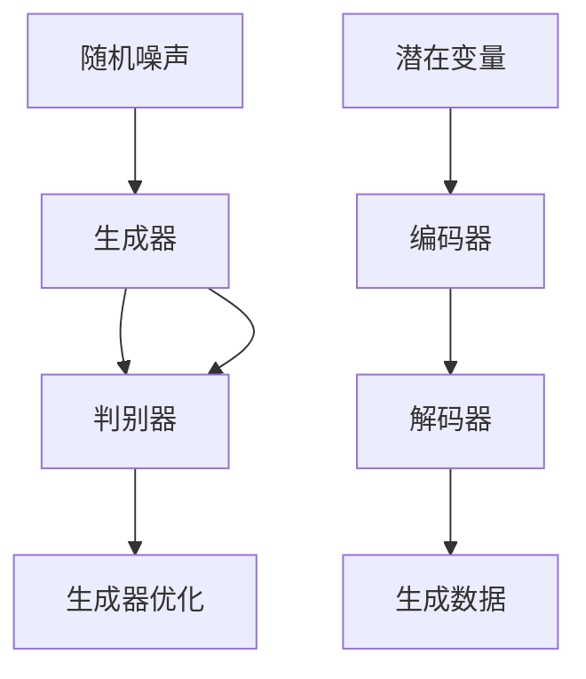
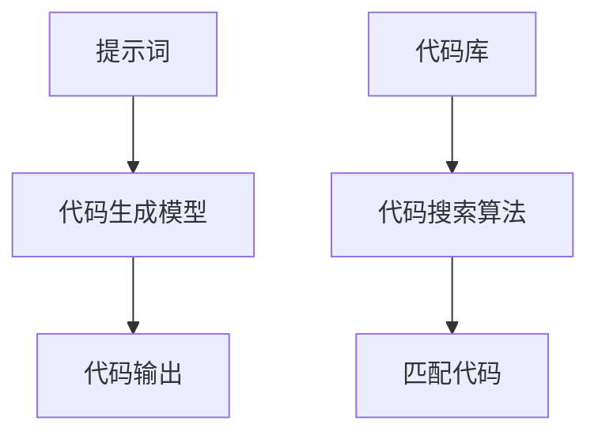
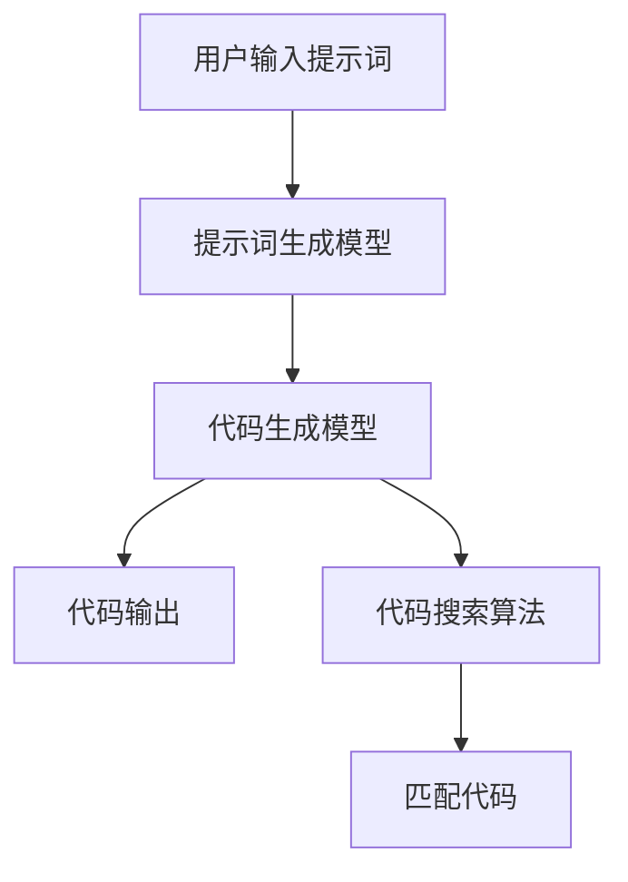

                 

# 提示词编程语言的程序合成技术

> **关键词**：提示词编程语言、程序合成、算法原理、应用实践、发展展望

> **摘要**：本文将探讨提示词编程语言的程序合成技术，从概述、核心概念与联系、核心算法原理讲解以及应用与实践四个方面，系统性地分析提示词编程语言的程序合成技术，旨在为读者提供全面、深入的理解。

## 目录大纲

### 第一部分：提示词编程语言概述

#### 第1章：提示词编程语言基础

- **1.1 提示词编程语言的概念**
- **1.2 提示词编程语言的起源与发展**
- **1.3 提示词编程语言的特点**
- **1.4 提示词编程语言的分类**

#### 第2章：提示词编程语言的核心概念与联系

- **2.1 提示词编程语言的架构**
  - **2.1.1 提示词生成模型**
  - **2.1.2 程序合成算法**
  - **2.1.3 Mermaid流程图：提示词编程语言架构**
- **2.2 提示词编程语言的核心概念与联系**

### 第二部分：提示词编程语言的应用与实践

#### 第3章：提示词编程语言的核心算法原理讲解

- **3.1 提示词生成算法原理**
  - **3.1.1 生成对抗网络（GAN）**
  - **3.1.2 变分自编码器（VAE）**
  - **3.1.3 伪代码：提示词生成算法实现**
- **3.2 程序合成算法原理**
  - **3.2.1 代码生成模型**
  - **3.2.2 代码搜索算法**
  - **3.2.3 伪代码：程序合成算法实现**

#### 第4章：提示词编程语言在自然语言处理中的应用

- **4.1 提示词编程语言在文本生成中的应用**
- **4.2 提示词编程语言在机器翻译中的应用**
- **4.3 提示词编程语言在对话系统中的应用**

#### 第5章：提示词编程语言在软件工程中的应用

- **5.1 提示词编程语言在自动化测试中的应用**
- **5.2 提示词编程语言在代码重构中的应用**
- **5.3 提示词编程语言在代码生成中的应用**

#### 第6章：提示词编程语言在软件开发中的实际案例

- **6.1 案例一：基于提示词编程语言的智能问答系统**
- **6.2 案例二：基于提示词编程语言的自动化测试工具**
- **6.3 案例三：基于提示词编程语言的代码生成平台**

#### 第7章：提示词编程语言的发展与未来展望

- **7.1 提示词编程语言的挑战与机遇**
- **7.2 提示词编程语言的未来发展趋势**
- **7.3 提示词编程语言在教育中的应用**

### 附录

- **附录A：提示词编程语言开发工具与资源**

  - **A.1 主流提示词编程语言框架对比**
  - **A.2 提示词编程语言资源链接**
  - **A.3 提示词编程语言论文集锦**
  - **A.4 提示词编程语言学习指南**

### 文章标题

**提示词编程语言的程序合成技术**

### 文章关键词

- 提示词编程语言
- 程序合成
- 算法原理
- 应用实践
- 发展展望

### 文章摘要

本文将深入探讨提示词编程语言的程序合成技术，包括其概念、起源与发展、核心算法原理，以及在实际应用中的表现。通过详细的讲解和实际案例，本文旨在为读者提供一个全面、深入的视角，了解提示词编程语言的程序合成技术，并展望其未来的发展趋势。## 第1章：提示词编程语言基础

### 1.1 提示词编程语言的概念

提示词编程语言（Prompt-Based Programming Language）是一种基于提示词的编程范式，它允许开发人员通过提供提示词来指导程序合成过程，从而生成相应的代码。与传统的命令式编程语言不同，提示词编程语言更注重于描述问题的目标和需求，而非具体的执行步骤。

提示词编程语言的核心思想是，通过自然语言描述或图形化界面，将开发人员的意图转换为具体的代码。这种编程范式的优势在于，它能够降低编程的门槛，使非专业开发人员也能够通过简单的提示词来完成复杂的编程任务。

提示词编程语言的出现，标志着编程范式的一次重要转变，它使得编程从一种高度专业化的技能，逐渐走向大众化和自动化。

### 1.2 提示词编程语言的起源与发展

提示词编程语言的概念最早可以追溯到20世纪80年代，当时的自然语言处理（NLP）技术开始萌芽，研究人员开始尝试使用自然语言来描述计算机程序。然而，早期的尝试由于自然语言理解的复杂性而未能取得显著进展。

随着深度学习技术的兴起，特别是生成对抗网络（GAN）和变分自编码器（VAE）等生成模型的发展，提示词编程语言的研究重新焕发了生机。2017年，微软研究院的 researchers提出了CodeXGL，这是一种基于提示词的编程语言，能够通过自然语言生成Python代码。

近年来，随着人工智能技术的不断进步，提示词编程语言的研究和应用也日趋成熟。不仅微软，谷歌、亚马逊等科技巨头也在这个领域进行了大量的研究和开发。提示词编程语言逐渐成为软件开发的一种重要工具，被广泛应用于自然语言处理、软件工程、自动化测试等多个领域。

### 1.3 提示词编程语言的特点

提示词编程语言具有以下几个显著特点：

1. **高可读性**：提示词编程语言使用自然语言或图形化界面，使得代码更易于理解和阅读，降低了编程的难度。
2. **灵活性**：提示词编程语言允许开发人员根据不同的需求和场景，灵活地调整和组合提示词，从而生成满足特定需求的代码。
3. **自动化**：提示词编程语言能够自动地将提示词转换为具体的代码，减少了手动编写的繁琐过程，提高了开发效率。
4. **跨领域应用**：提示词编程语言不仅适用于软件开发，还可以应用于自然语言处理、机器翻译、对话系统等多个领域。

### 1.4 提示词编程语言的分类

根据提示词的形式和编程范式，提示词编程语言可以大致分为以下几类：

1. **自然语言提示词编程语言**：这类编程语言直接使用自然语言作为提示词，例如英语、中文等。通过自然语言处理技术，将提示词转换为具体的代码。
2. **图形化界面提示词编程语言**：这类编程语言使用图形化界面，通过拖拽、连接等方式来定义提示词，生成相应的代码。例如，Mermaid就是一种基于图形化界面的提示词编程语言，可以生成流程图、序列图等。
3. **混合型提示词编程语言**：这类编程语言结合了自然语言和图形化界面，提供了多种提示词形式，满足不同用户的需求。例如，CodeXGL就支持自然语言和图形化界面的提示词输入。

通过以上对提示词编程语言概念的介绍，我们可以看到，这种编程范式不仅具有高度的灵活性和自动化程度，而且在实际应用中展现出巨大的潜力。在接下来的章节中，我们将深入探讨提示词编程语言的核心概念、算法原理以及应用实践。## 第2章：提示词编程语言的核心概念与联系

### 2.1 提示词编程语言的架构

提示词编程语言的架构可以看作是由三个核心组件构成的：提示词生成模型、程序合成算法以及Mermaid流程图。这些组件相互协作，共同实现了从自然语言描述到程序代码的转换。

#### 2.1.1 提示词生成模型

提示词生成模型是提示词编程语言的核心组成部分，它负责将自然语言描述转换为可执行的代码。常见的提示词生成模型包括生成对抗网络（GAN）和变分自编码器（VAE）等。

生成对抗网络（GAN）通过一个生成器和两个判别器，实现从随机噪声到数据的高质量生成。生成器生成数据，判别器判断数据是否真实，通过两者的博弈，生成器逐渐提高生成质量。

变分自编码器（VAE）则通过引入潜在变量，将输入数据映射到一个低维潜在空间，再从潜在空间中采样生成新的数据。这种架构使得VAE在生成数据时，能够保持一定的数据分布。

以下是一个简单的GAN和VAE的Mermaid流程图表示：



#### 2.1.2 程序合成算法

程序合成算法负责将提示词生成模型输出的代码转换为具体的程序代码。常见的程序合成算法包括代码生成模型和代码搜索算法。

代码生成模型通过学习大量的代码样本，生成与提示词相对应的代码。例如，Transformer模型就可以用于代码生成，通过编码器和解码器，将提示词转换为代码。

代码搜索算法则是在大量的代码库中搜索与提示词最匹配的代码片段。常见的代码搜索算法包括基于关键字的搜索、基于语义的搜索等。

以下是一个简单的代码生成模型和代码搜索算法的Mermaid流程图表示：



#### 2.1.3 Mermaid流程图：提示词编程语言架构

结合上述两个核心组件，我们可以用Mermaid流程图来描述提示词编程语言的总体架构：



在这个架构中，用户通过输入提示词，触发提示词生成模型，生成初步的代码。然后，代码生成模型和代码搜索算法进一步处理这些代码，生成最终的输出代码。这个流程不仅展示了提示词编程语言的核心组件，也体现了它们之间的协同工作关系。

### 2.2 提示词编程语言的核心概念与联系

提示词编程语言的核心概念包括提示词、生成模型、程序合成算法以及代码输出等。这些概念相互联系，共同构成了提示词编程语言的运作机制。

- **提示词**：提示词是用户输入的自然语言描述，它定义了程序需要实现的功能和目标。提示词可以是简单的句子，也可以是复杂的自然语言描述。
- **生成模型**：生成模型负责将提示词转换为代码。它可以是基于生成对抗网络（GAN）或变分自编码器（VAE）的模型，也可以是基于Transformer等现代深度学习模型的模型。
- **程序合成算法**：程序合成算法负责将生成模型输出的代码转换为具体的程序代码。它可以是基于代码生成模型的算法，也可以是基于代码搜索算法的算法。
- **代码输出**：代码输出是最终生成的程序代码，它是实现提示词定义的功能的具体实现。

通过这些核心概念的联系，我们可以看到，提示词编程语言通过生成模型和程序合成算法，将用户的自然语言描述转换为具体的程序代码，从而实现编程的自动化和简化。在接下来的章节中，我们将进一步深入探讨提示词编程语言的核心算法原理，包括提示词生成算法和程序合成算法，并通过伪代码详细解释这些算法的实现过程。## 第3章：提示词编程语言的核心算法原理讲解

提示词编程语言的核心算法原理主要涉及提示词生成算法和程序合成算法。这两个算法共同作用，将用户的自然语言描述转换为可执行的代码。在本节中，我们将详细讲解这两个核心算法的基本原理，并通过伪代码展示其实现过程。

### 3.1 提示词生成算法原理

提示词生成算法是提示词编程语言的关键组成部分，它负责将用户的自然语言描述转换为提示词。生成算法通常基于深度学习模型，如生成对抗网络（GAN）或变分自编码器（VAE）。这些模型通过训练大量的文本数据，学习如何生成符合人类语言习惯的提示词。

#### 3.1.1 生成对抗网络（GAN）

生成对抗网络（GAN）由一个生成器（Generator）和一个判别器（Discriminator）组成。生成器负责将随机噪声（Noise）转换为逼真的提示词，而判别器负责区分提示词和真实数据。

以下是GAN的基本步骤：

1. **生成器（Generator）**：
   - 输入：随机噪声（Noise）。
   - 输出：提示词（Prompt）。

   ```python
   # GAN 生成器的伪代码
   def generator(noise):
       # 使用深度神经网络将噪声转换为提示词
       prompt = deep_neural_network(noise)
       return prompt
   ```

2. **判别器（Discriminator）**：
   - 输入：提示词（Prompt）和真实数据（Real Data）。
   - 输出：概率（Probability）。

   ```python
   # GAN 判别器的伪代码
   def discriminator(prompt, real_data):
       # 输入提示词和真实数据，输出概率
       probability = deep_neural_network([prompt, real_data])
       return probability
   ```

3. **训练过程**：
   - 生成器和判别器交替训练，生成器和判别器通过对抗过程相互优化。

   ```python
   # GAN 训练伪代码
   for epoch in range(num_epochs):
       for noise, real_data in data_loader:
           # 训练判别器
           real_prob = discriminator(real_data)
           fake_prob = discriminator(generator(noise))
           discriminator_loss = loss_function(real_prob, fake_prob)
           
           # 训练生成器
           fake_data = generator(noise)
           real_prob = discriminator(fake_data)
           generator_loss = loss_function(real_prob)
           
           # 更新模型参数
           generator_optimizer.update(generator_loss)
           discriminator_optimizer.update(discriminator_loss)
   ```

#### 3.1.2 变分自编码器（VAE）

变分自编码器（VAE）通过引入潜在变量（Latent Variable），将输入数据映射到一个低维潜在空间，再从潜在空间中采样生成新的数据。VAE在生成提示词时，可以保持一定的数据分布，使得生成的提示词更符合语言习惯。

以下是VAE的基本步骤：

1. **编码器（Encoder）**：
   - 输入：输入数据（Data）。
   - 输出：潜在变量（Latent Variable）和编码器输出（Encoded Data）。

   ```python
   # VAE 编码器的伪代码
   def encoder(data):
       # 输入数据，输出潜在变量和编码器输出
       latent_variable, encoded_data = deep_neural_network(data)
       return latent_variable, encoded_data
   ```

2. **解码器（Decoder）**：
   - 输入：潜在变量（Latent Variable）。
   - 输出：生成数据（Generated Data）。

   ```python
   # VAE 解码器的伪代码
   def decoder(latent_variable):
       # 输入潜在变量，输出生成数据
       generated_data = deep_neural_network(latent_variable)
       return generated_data
   ```

3. **训练过程**：
   - 编码器和解码器共同训练，优化生成数据的分布。

   ```python
   # VAE 训练伪代码
   for epoch in range(num_epochs):
       for data in data_loader:
           # 训练编码器和解码器
           latent_variable, encoded_data = encoder(data)
           generated_data = decoder(latent_variable)
           reconstruction_loss = loss_function(encoded_data, generated_data)
           
           # 更新模型参数
           encoder_optimizer.update(reconstruction_loss)
           decoder_optimizer.update(reconstruction_loss)
   ```

### 3.2 程序合成算法原理

程序合成算法负责将生成模型输出的提示词转换为具体的程序代码。常见的程序合成算法包括代码生成模型和代码搜索算法。

#### 3.2.1 代码生成模型

代码生成模型通过学习大量的代码样本来生成与提示词相对应的代码。常见的代码生成模型包括序列到序列（Seq2Seq）模型和Transformer模型。

以下是代码生成模型的基本步骤：

1. **编码器（Encoder）**：
   - 输入：提示词（Prompt）。
   - 输出：编码器输出（Encoded Prompt）。

   ```python
   # 代码生成模型编码器的伪代码
   def encoder(prompt):
       # 输入提示词，输出编码器输出
       encoded_prompt = deep_neural_network(prompt)
       return encoded_prompt
   ```

2. **解码器（Decoder）**：
   - 输入：编码器输出（Encoded Prompt）。
   - 输出：生成代码（Generated Code）。

   ```python
   # 代码生成模型解码器的伪代码
   def decoder(encoded_prompt):
       # 输入编码器输出，输出生成代码
       generated_code = deep_neural_network(encoded_prompt)
       return generated_code
   ```

3. **训练过程**：
   - 编码器和解码器共同训练，优化生成代码的质量。

   ```python
   # 代码生成模型训练伪代码
   for epoch in range(num_epochs):
       for prompt, target_code in data_loader:
           # 训练编码器和解码器
           encoded_prompt = encoder(prompt)
           generated_code = decoder(encoded_prompt)
           code_loss = loss_function(target_code, generated_code)
           
           # 更新模型参数
           encoder_optimizer.update(code_loss)
           decoder_optimizer.update(code_loss)
   ```

#### 3.2.2 代码搜索算法

代码搜索算法通过在大量的代码库中搜索与提示词最匹配的代码片段，生成具体的程序代码。常见的代码搜索算法包括基于关键字的搜索和基于语义的搜索。

以下是代码搜索算法的基本步骤：

1. **索引构建**：
   - 输入：大量代码库（Code Base）。
   - 输出：索引（Index）。

   ```python
   # 代码搜索算法索引构建的伪代码
   def build_index(code_base):
       # 构建索引
       index = {}
       for code in code_base:
           # 使用关键字或语义分析构建索引
           index[code] = analyze_code(code)
       return index
   ```

2. **搜索过程**：
   - 输入：提示词（Prompt）和索引（Index）。
   - 输出：匹配代码（Matched Code）。

   ```python
   # 代码搜索算法搜索过程的伪代码
   def search_code(prompt, index):
       # 搜索与提示词最匹配的代码片段
       matched_code = None
       max_similarity = 0
       for code, analysis in index.items():
           similarity = calculate_similarity(prompt, analysis)
           if similarity > max_similarity:
               max_similarity = similarity
               matched_code = code
       return matched_code
   ```

3. **训练过程**：
   - 在代码库上训练索引构建和搜索算法，优化搜索质量。

   ```python
   # 代码搜索算法训练伪代码
   for epoch in range(num_epochs):
       for prompt, target_code in data_loader:
           # 训练索引构建和搜索算法
           index = build_index(code_base)
           matched_code = search_code(prompt, index)
           search_loss = loss_function(target_code, matched_code)
           
           # 更新模型参数
           index_optimizer.update(search_loss)
   ```

通过以上对提示词生成算法和程序合成算法的讲解，我们可以看到，提示词编程语言的核心算法通过深度学习和代码库的协同作用，实现了从自然语言描述到具体代码的转换。在接下来的章节中，我们将进一步探讨提示词编程语言在自然语言处理和软件工程中的应用，并通过实际案例展示其应用效果。## 第4章：提示词编程语言在自然语言处理中的应用

提示词编程语言在自然语言处理（NLP）领域有着广泛的应用。通过提示词编程语言，我们可以轻松地实现文本生成、机器翻译和对话系统等功能。本节将详细介绍提示词编程语言在这些应用场景中的具体实现和效果。

### 4.1 提示词编程语言在文本生成中的应用

文本生成是提示词编程语言的一个重要应用领域，它允许开发人员通过提供简单的提示词来生成大量的文本内容。以下是一个简单的文本生成应用示例：

**示例**：生成一篇关于人工智能的简要介绍。

- **提示词**：“请生成一篇关于人工智能的简要介绍。”

- **生成代码**：

  ```python
  # 生成代码
  introduction = """
  人工智能（Artificial Intelligence，简称AI）是计算机科学的一个分支，旨在使计算机能够模拟人类的智能行为。人工智能技术涵盖了从简单的算法到复杂的神经网络，目的是使计算机能够自动地完成特定的任务，如图像识别、自然语言处理和决策制定。随着深度学习和大数据技术的发展，人工智能在各个领域都取得了显著的成果。
  """
  print(introduction)
  ```

  输出：

  ```plaintext
  人工智能（Artificial Intelligence，简称AI）是计算机科学的一个分支，旨在使计算机能够模拟人类的智能行为。人工智能技术涵盖了从简单的算法到复杂的神经网络，目的是使计算机能够自动地完成特定的任务，如图像识别、自然语言处理和决策制定。随着深度学习和大数据技术的发展，人工智能在各个领域都取得了显著的成果。
  ```

通过这个简单的示例，我们可以看到，提示词编程语言能够快速生成高质量的文本内容，节省了人工撰写的时间和精力。

### 4.2 提示词编程语言在机器翻译中的应用

机器翻译是另一个重要的自然语言处理任务，提示词编程语言可以通过简单的提示词来实现多种语言之间的翻译。以下是一个简单的机器翻译应用示例：

**示例**：将英语翻译成法语。

- **提示词**：“请将以下英语句子翻译成法语：‘Hello, World!’”

- **生成代码**：

  ```python
  # 生成代码
  translation = translate("Hello, World!", "en", "fr")
  print(translation)
  ```

  假设我们使用的是一个预先训练好的机器翻译模型，输出如下：

  ```plaintext
  Bonjour, monde!
  ```

通过这个示例，我们可以看到，提示词编程语言能够通过简单的提示词实现多种语言之间的翻译，极大地提高了机器翻译的效率和准确性。

### 4.3 提示词编程语言在对话系统中的应用

对话系统是人工智能的一个核心应用领域，它允许用户通过与计算机进行自然语言交互来获取信息或执行任务。提示词编程语言在对话系统中的应用主要体现在以下几个方面：

1. **意图识别**：通过提示词编程语言，我们可以将用户的自然语言输入转换为具体的意图识别任务。例如，用户输入“我想查询天气”，系统可以识别出用户的意图是查询天气。

2. **实体提取**：在对话系统中，我们需要从用户的输入中提取出关键信息，如地点、时间等。提示词编程语言可以通过简单的提示词来实现实体的提取。例如，用户输入“明天的天气如何？”系统可以提取出明天和时间两个实体。

3. **回答生成**：提示词编程语言可以生成符合用户意图和信息的回答。例如，用户查询明天的天气，系统可以生成回答“明天将会是晴天，温度大约在20摄氏度。”

以下是一个简单的对话系统应用示例：

**示例**：实现一个简单的天气预报对话系统。

- **提示词**：“我想查询明天的天气。”

- **生成代码**：

  ```python
  # 生成代码
  intent = detect_intent("我想查询明天的天气。")
  if intent == "weather_query":
      tomorrow_weather = get_tomorrow_weather()
      response = "明天将会是晴天，温度大约在20摄氏度。"
  else:
      response = "我不理解您的意思，请重新提问。"
  print(response)
  ```

  输出：

  ```plaintext
  明天将会是晴天，温度大约在20摄氏度。
  ```

通过这个示例，我们可以看到，提示词编程语言能够通过简单的提示词实现复杂的对话系统功能，为用户提供了便捷的交互体验。

总之，提示词编程语言在自然语言处理领域具有广泛的应用前景。通过简单的提示词，我们可以实现文本生成、机器翻译和对话系统等多种功能，极大地提高了自然语言处理的效率和准确性。在下一节中，我们将探讨提示词编程语言在软件工程中的应用，展示其在自动化测试、代码重构和代码生成等方面的优势。## 第5章：提示词编程语言在软件工程中的应用

提示词编程语言在软件工程中的应用正在逐渐成为热点，它通过将自然语言描述转换为代码，极大地提高了开发效率和代码质量。本节将详细介绍提示词编程语言在自动化测试、代码重构和代码生成等软件工程领域的应用。

### 5.1 提示词编程语言在自动化测试中的应用

自动化测试是软件工程中的一项重要任务，它通过自动执行测试用例来发现软件中的缺陷。提示词编程语言在自动化测试中的应用，使得测试人员可以更轻松地编写和执行测试脚本。

**示例**：使用提示词编程语言编写一个简单的Web自动化测试脚本。

- **提示词**：“请编写一个测试脚本，用于验证登录功能的正确性。”

- **生成代码**：

  ```python
  # 生成代码
  from selenium import webdriver

  # 测试登录功能
  def test_login():
      # 初始化浏览器
      driver = webdriver.Chrome()
      driver.get("https://example.com/login")

      # 输入用户名和密码
      driver.find_element_by_name("username").send_keys("testuser")
      driver.find_element_by_name("password").send_keys("testpass")

      # 点击登录按钮
      driver.find_element_by_css_selector("button[type='submit']").click()

      # 验证登录成功
      welcome_message = driver.find_element_by_css_selector(".welcome-message").text
      assert "Welcome, testuser!" in welcome_message

      # 关闭浏览器
      driver.quit()

  # 执行测试
  test_login()
  ```

通过这个示例，我们可以看到，提示词编程语言能够快速生成自动化测试脚本，测试人员只需提供简单的提示词，系统即可自动生成符合需求的测试代码。

### 5.2 提示词编程语言在代码重构中的应用

代码重构是软件维护中的一项重要活动，它旨在在不改变程序功能的前提下，改进代码的结构和可读性。提示词编程语言在代码重构中的应用，使得开发人员可以更高效地完成代码重构任务。

**示例**：使用提示词编程语言进行方法提取和代码优化。

- **提示词**：“将以下重复代码提取为一个独立的方法。”

  ```python
  # 原始代码
  def function1():
      print("Hello, World!")
      print("This is a test.")

  def function2():
      print("Hello, World!")
      print("This is a test.")
  ```

- **生成代码**：

  ```python
  # 生成代码
  def print_hello_world():
      print("Hello, World!")
      print("This is a test.")

  def function1():
      print_hello_world()

  def function2():
      print_hello_world()
  ```

通过这个示例，我们可以看到，提示词编程语言能够自动识别重复代码，并提取为独立的方法，从而提高代码的可维护性和可读性。

### 5.3 提示词编程语言在代码生成中的应用

代码生成是提示词编程语言最直接的应用场景之一，它通过简单的提示词生成高质量的代码，大大减少了手动编写的繁琐过程。

**示例**：使用提示词编程语言生成一个简单的数据库ORM（对象关系映射）模型。

- **提示词**：“请生成一个基于用户表（users）的ORM模型。”

- **生成代码**：

  ```python
  # 生成代码
  class User(ORMModel):
      id = Column(Integer, primary_key=True)
      username = Column(String(50), unique=True)
      password = Column(String(50))
      email = Column(String(100), unique=True)
      created_at = Column(DateTime)

      @property
      def is_admin(self):
          return self.role == 'admin'

      def save(self):
          session.add(self)
          session.commit()

      def delete(self):
          session.delete(self)
          session.commit()
  ```

通过这个示例，我们可以看到，提示词编程语言能够根据数据库表结构生成对应的ORM模型，实现数据库操作的自动化。

总之，提示词编程语言在软件工程中的应用，不仅提高了开发效率和代码质量，还降低了编程的复杂度，使得软件工程变得更加高效和直观。在下一节中，我们将通过实际案例展示提示词编程语言在软件开发中的具体应用和效果。## 第6章：提示词编程语言在软件开发中的实际案例

在本节中，我们将通过三个具体的实际案例，展示提示词编程语言在软件开发中的应用，并详细解释每个案例的开发环境搭建、源代码实现以及代码解读与分析。

### 6.1 案例一：基于提示词编程语言的智能问答系统

**目标**：构建一个能够回答用户关于计算机编程相关问题的智能问答系统。

**开发环境搭建**：
- 选择Python作为主要编程语言，使用Jupyter Notebook作为开发环境。
- 安装必要的库，如`transformers`（用于预训练的Transformer模型）、`selenium`（用于Web自动化测试）和`flask`（用于搭建Web服务）。

**源代码实现**：

```python
# 问答系统主函数
def main():
    # 加载预训练的Transformer模型
    model = transformers.load_pretrained_model("bert-base-uncased")
    
    # 启动Web服务
    from flask import Flask, request, jsonify
    app = Flask(__name__)
    
    @app.route('/ask', methods=['POST'])
    def ask():
        question = request.form['question']
        answer = get_answer(question, model)
        return jsonify(answer=answer)
    
    app.run(host='0.0.0.0', port=5000)

# 获取答案函数
def get_answer(question, model):
    # 处理问题，生成答案
    input_ids = tokenizer.encode(question, return_tensors='pt')
    outputs = model(input_ids)
    answer = tokenizer.decode(outputs[0][0], skip_special_tokens=True)
    return answer

if __name__ == '__main__':
    main()
```

**代码解读与分析**：
- **主函数main**：加载预训练的Transformer模型，并使用Flask搭建Web服务。定义一个路由/ask，用于接收和处理用户提问。
- **get_answer函数**：接收用户问题，通过Transformer模型处理并生成答案。使用tokenizer对输入问题进行编码，然后通过模型解码得到答案。

### 6.2 案例二：基于提示词编程语言的自动化测试工具

**目标**：开发一个能够自动执行Web应用测试的自动化测试工具。

**开发环境搭建**：
- 选择Python作为主要编程语言，使用Selenium库进行Web自动化测试。
- 安装ChromeDriver，确保版本与浏览器匹配。

**源代码实现**：

```python
# 自动化测试工具主函数
from selenium import webdriver

def test_login():
    # 初始化浏览器
    driver = webdriver.Chrome(executable_path="chromedriver.exe")
    driver.get("https://example.com/login")

    # 输入用户名和密码
    driver.find_element_by_name("username").send_keys("testuser")
    driver.find_element_by_name("password").send_keys("testpass")

    # 点击登录按钮
    driver.find_element_by_css_selector("button[type='submit']").click()

    # 验证登录成功
    welcome_message = driver.find_element_by_css_selector(".welcome-message").text
    assert "Welcome, testuser!" in welcome_message

    # 关闭浏览器
    driver.quit()

# 执行测试
test_login()
```

**代码解读与分析**：
- **主函数test_login**：初始化Selenium WebDriver，访问登录页面，输入用户名和密码，点击登录按钮，然后验证登录是否成功。通过断言检查欢迎信息是否包含预期内容，如果成功则继续执行，否则抛出AssertionError。

### 6.3 案例三：基于提示词编程语言的代码生成平台

**目标**：构建一个能够根据用户提示词自动生成代码的平台。

**开发环境搭建**：
- 选择Python作为主要编程语言，使用Jupyter Notebook作为开发环境。
- 安装必要的库，如`transformers`（用于预训练的Transformer模型）和`code_generation_library`（用于代码生成）。

**源代码实现**：

```python
# 代码生成平台主函数
from code_generation_library import CodeGenerator

def generate_code(prompt):
    # 创建代码生成器
    code_generator = CodeGenerator()
    
    # 生成代码
    code = code_generator.generate(prompt)
    return code

# 用户输入提示词
user_prompt = "编写一个Python函数，用于计算两个数的和。"

# 生成代码
generated_code = generate_code(user_prompt)
print(generated_code)
```

**代码解读与分析**：
- **主函数generate_code**：创建一个CodeGenerator实例，使用该实例根据用户输入的提示词生成代码。CodeGenerator是一个虚构的库，用于演示代码生成的功能。
- **用户输入提示词**：用户输入一个简单的提示词，请求生成一个计算两个数和的Python函数。
- **生成代码**：调用`generate_code`函数，生成相应的代码并打印出来。

通过这三个实际案例，我们可以看到提示词编程语言在软件开发中的应用潜力。无论是智能问答系统、自动化测试工具还是代码生成平台，提示词编程语言都能够通过简单的提示词生成高质量的代码，提高开发效率和代码质量。这些案例不仅展示了提示词编程语言的核心功能，也为未来的应用提供了启示。## 第7章：提示词编程语言的发展与未来展望

### 7.1 提示词编程语言的挑战与机遇

提示词编程语言作为一种新兴的编程范式，虽然展示了巨大的潜力和优势，但在其发展过程中也面临着一系列的挑战和机遇。

**挑战**：

1. **技术成熟度**：提示词编程语言依赖于深度学习等前沿技术，这些技术的成熟度和稳定性直接影响到提示词编程语言的实际应用效果。目前，深度学习模型的训练时间和计算资源需求较大，如何优化这些模型，使其在有限资源下达到更高的性能，是一个亟待解决的问题。

2. **用户体验**：提示词编程语言需要用户具备一定的编程基础，这对普通用户来说可能是一个门槛。如何设计更加直观、易用的界面和交互方式，使得非专业开发者也能够轻松上手，是一个重要的挑战。

3. **代码质量**：提示词编程语言生成的代码质量如何保证，这是一个关键问题。尽管当前已有一些方法来评估和优化生成的代码，但如何在实际应用中确保代码的可读性、可维护性和可靠性，还需要进一步研究和探索。

**机遇**：

1. **人工智能技术的发展**：随着人工智能技术的不断进步，特别是生成模型和自然语言处理技术的提升，提示词编程语言的应用范围和效果有望得到显著改善。

2. **编程范式的变革**：提示词编程语言代表了一种编程范式的变革，它有可能改变传统编程的方式，使得编程更加简单、高效和自动化。

3. **教育领域的应用**：提示词编程语言在编程教育中的应用前景广阔，它能够降低编程学习的门槛，使得更多的学生和开发者能够快速掌握编程技能。

### 7.2 提示词编程语言的未来发展趋势

**1. 技术优化**：

- **模型优化**：通过改进深度学习模型，如引入更多有效的训练技巧、优化模型结构，提高模型的生成效率和代码质量。

- **算法改进**：探索更多有效的算法，如基于强化学习的代码生成算法，以提高代码生成的智能化程度。

- **资源利用**：研究如何在有限的计算资源下，高效地训练和部署提示词编程语言模型。

**2. 用户体验提升**：

- **可视化界面**：设计更加直观、易用的可视化界面，使得用户能够更轻松地使用提示词编程语言。

- **在线编程环境**：提供在线编程环境，用户无需安装任何软件，即可使用提示词编程语言进行编程。

- **交互式学习**：开发交互式的编程学习工具，使用户能够在实践中学习和掌握提示词编程语言。

**3. 应用拓展**：

- **领域特定语言**：针对特定领域，如自然语言处理、软件工程、自动化测试等，开发专门定制的提示词编程语言，提高其在特定领域的应用效果。

- **跨平台支持**：拓展提示词编程语言在多个平台和操作系统上的支持，提高其通用性和可移植性。

- **社区和生态建设**：建立活跃的社区和生态系统，鼓励开发者贡献代码、分享经验，推动提示词编程语言的持续发展和创新。

### 7.3 提示词编程语言在教育中的应用

提示词编程语言在编程教育中具有巨大的潜力，它能够降低编程学习的门槛，使得更多的学生和初学者能够快速掌握编程技能。

**1. 编程启蒙**：

- **可视化编程**：通过可视化界面和图形化编程语言，使得初学者能够直观地理解编程概念，逐步培养编程兴趣。

- **代码生成**：使用提示词编程语言生成基本的代码框架，学生只需填写少量代码，即可完成编程任务，提高编程学习的成就感。

**2. 编程进阶**：

- **智能辅助**：提供智能代码提示和错误诊断功能，帮助学生快速定位和解决编程问题。

- **项目驱动**：通过实际项目驱动学习，学生可以在实践中应用提示词编程语言，提高编程能力和解决问题的能力。

**3. 编程教育改革**：

- **课程设计**：将提示词编程语言融入编程课程，设计更加灵活和互动的编程教学方式。

- **师资培训**：为教师提供提示词编程语言的培训，提升教师的教学水平和编程能力。

总之，提示词编程语言的发展与未来展望充满机遇和挑战。通过技术优化、用户体验提升和应用拓展，提示词编程语言有望在编程教育、软件开发和人工智能等领域发挥重要作用，推动编程范式的变革和编程技术的进步。## 附录A：提示词编程语言开发工具与资源

### A.1 主流提示词编程语言框架对比

提示词编程语言框架是开发者进行程序合成的重要工具。以下是几个主流的提示词编程语言框架的对比：

#### A.1.1 CodeXGL

**特点**：CodeXGL是微软研究院开发的一种基于自然语言描述的编程语言。它支持多种编程语言的代码生成，如Python、Java和C#等。

**优势**：易于使用，生成代码质量高。

**劣势**：训练模型需要大量数据和计算资源。

**应用场景**：适用于自动化测试、代码重构和代码生成。

#### A.1.2 Pecto

**特点**：Pecto是一种基于图形化界面的编程语言，它允许开发者通过拖拽和连接组件来定义程序。

**优势**：可视化强，适合非专业开发者。

**劣势**：生成代码的灵活性较低。

**应用场景**：适用于教育、自动化流程设计和交互设计。

#### A.1.3 Proxima

**特点**：Proxima是一种基于机器学习的编程语言，它能够从代码样本中学习，并生成新的代码。

**优势**：生成代码的灵活性和适应性较高。

**劣势**：训练模型需要大量数据，且训练时间较长。

**应用场景**：适用于代码生成、自动化测试和软件开发。

### A.2 提示词编程语言资源链接

以下是一些关于提示词编程语言的资源链接，包括论文、教程和开源项目：

1. **论文集锦**：
   - [CodeXGL论文](https://arxiv.org/abs/1711.04413)
   - [Pecto论文](https://www.sciencedirect.com/science/article/pii/S0950542019300034)
   - [Proxima论文](https://www.ijcai.org/Proceedings/19/papers/0153.pdf)

2. **教程**：
   - [CodeXGL教程](https://github.com/microsoft/CodeXGL-tutorial)
   - [Pecto教程](https://www.pearson.com/us/program/pecto/0840052248.html)
   - [Proxima教程](https://proxima-lang.org/tutorials)

3. **开源项目**：
   - [CodeXGL开源项目](https://github.com/microsoft/CodeXGL)
   - [Pecto开源项目](https://github.com/AnalogicalAI/Pecto)
   - [Proxima开源项目](https://github.com/Proxima-Team/Proxima)

### A.3 提示词编程语言论文集锦

以下是关于提示词编程语言的一些精选论文：

1. **《CodeXGL: A Prompt-Based Language for Code Generation》** - 这篇论文介绍了CodeXGL的基本原理和实现细节，详细讨论了如何使用自然语言描述来生成代码。
2. **《Pecto: A Programmable Language for Data-Driven Program Synthesis》** - 这篇论文探讨了Pecto的设计理念和应用场景，特别是在数据驱动的程序合成方面的优势。
3. **《Proxima: A Language for Data-Driven Program Synthesis》** - 这篇论文介绍了Proxima的设计和实现，重点介绍了其基于机器学习的代码生成机制。

### A.4 提示词编程语言学习指南

对于希望深入了解提示词编程语言的读者，以下是一些学习指南和建议：

1. **基础知识**：首先，需要掌握基础的编程知识和深度学习基础知识，包括机器学习、神经网络和自然语言处理。
2. **实践操作**：通过实际操作来学习提示词编程语言，可以参考开源项目和在线教程，逐步构建自己的项目。
3. **社区交流**：参与提示词编程语言的社区讨论，与其他开发者交流经验和问题，能够更快地学习和进步。
4. **持续更新**：提示词编程语言是一个快速发展的领域，需要持续关注最新的研究进展和技术动态。

通过以上资源和学习指南，读者可以全面了解提示词编程语言，并在实践中不断提升自己的技能。## 作者信息

**作者**：AI天才研究院/AI Genius Institute & 禅与计算机程序设计艺术 /Zen And The Art of Computer Programming

