                 

# 《提示词编程语言的认知科学基础》

## 关键词
- 提示词编程语言
- 认知科学
- 自然语言处理
- 机器学习
- 编程语言设计
- 项目实战

## 摘要
本文旨在探讨提示词编程语言与认知科学的深度融合，分析其核心概念、算法原理、数学模型以及项目应用。通过详细的流程图、伪代码、数学公式和实战案例，本文将为读者呈现一个全面、系统的认知科学基础框架，旨在推动提示词编程语言的创新与发展。

## 目录大纲设计思路与规划

在设计《提示词编程语言的认知科学基础》这本书的目录大纲时，我们将遵循以下思路和规划：

### 1. 核心概念与联系
首先，我们将引入提示词编程语言的概念，详细解释其与认知科学的联系。我们将使用Mermaid流程图展示提示词编程语言的基本原理和架构，帮助读者理解其核心机制。

### 2. 核心算法原理讲解
接下来，我们将深入讲解提示词编程语言的核心算法原理，包括自然语言处理、机器学习算法、以及认知科学中的相关理论。我们将使用伪代码和实例分析来阐述这些算法的运作机制和优化方法。

### 3. 数学模型和数学公式
在每个章节中，我们将详细讲解相关的数学模型和公式，使用LaTeX格式展示，并附以举例说明。这将帮助读者理解提示词编程语言背后的数学基础。

### 4. 项目实战
在后面的章节中，我们将通过具体的实战案例，展示如何在实际项目中应用提示词编程语言。我们将详细讲解开发环境搭建、源代码实现和代码解读，使读者能够将理论知识应用到实际项目中。

### 5. 完整性要求
为了保证文章的完整性，我们将确保每个小节的内容都丰富具体。核心内容将包括：
- 核心概念与联系：包括概念解释和Mermaid流程图。
- 核心算法原理讲解：使用伪代码详细阐述。
- 数学模型和数学公式：使用LaTeX格式展示，并附以举例说明。
- 项目实战：包括代码实现、环境搭建、代码解读和分析。

### 6. 作者信息
文章末尾将写上作者信息，格式为：“作者：AI天才研究院/AI Genius Institute & 禅与计算机程序设计艺术 /Zen And The Art of Computer Programming”。

### 目录大纲完整设计

# 《提示词编程语言的认知科学基础》

## 第一部分：提示词编程语言概述

### 第1章：引言与核心概念
- **1.1 提示词编程语言的定义**
  - 提示词编程语言的概念
  - 提示词编程语言与认知科学的关系
  - Mermaid流程图：提示词编程语言基本架构

- **1.2 认知科学基础**
  - 认知科学的基本概念
  - 认知科学与编程的关系
  - 认知科学在提示词编程中的应用

### 第2章：自然语言处理与提示词编程
- **2.1 自然语言处理基础**
  - 语言模型
  - 词嵌入
  - 语言模型训练与评估

- **2.2 提示词生成算法**
  - 提示词生成的原理
  - 提示词生成算法
  - 提示词生成算法的优化

- **2.3 实例分析**
  - 提示词编程在文本生成中的应用
  - 提示词编程在问答系统中的应用
  - 提示词编程在对话系统中的应用

## 第二部分：认知科学视角下的提示词编程

### 第3章：认知科学与机器学习
- **3.1 认知科学视角下的机器学习**
  - 认知模型在机器学习中的应用
  - 机器学习算法的感知机制
  - 机器学习算法的认知优化

- **3.2 提示词编程语言中的机器学习算法**
  - 提示词编程语言中的常见机器学习算法
  - 提示词编程语言中的机器学习算法优化

- **3.3 实例分析**
  - 提示词编程语言在图像识别中的应用
  - 提示词编程语言在语音识别中的应用
  - 提示词编程语言在自然语言处理中的应用

### 第4章：认知科学与编程语言设计
- **4.1 编程语言设计中的认知科学**
  - 编程语言设计原则
  - 编程语言设计的认知基础
  - 编程语言设计中的认知挑战

- **4.2 提示词编程语言设计**
  - 提示词编程语言设计的方法
  - 提示词编程语言设计的原理
  - 提示词编程语言设计的实践

- **4.3 实例分析**
  - 提示词编程语言设计在游戏开发中的应用
  - 提示词编程语言设计在物联网中的应用
  - 提示词编程语言设计在教育中的应用

## 第三部分：项目实战与展望

### 第5章：提示词编程语言项目实战
- **5.1 项目实战准备**
  - 实战项目概述
  - 实战项目环境搭建
  - 实战项目工具与资源

- **5.2 项目实战案例一**
  - 案例一：文本生成
  - 案例一：项目实施与代码解读

- **5.3 项目实战案例二**
  - 案例二：问答系统
  - 案例二：项目实施与代码解读

### 第6章：提示词编程语言的应用与展望
- **6.1 提示词编程语言的应用领域**
  - 提示词编程语言在商业领域的应用
  - 提示词编程语言在教育领域的应用
  - 提示词编程语言在科研领域的应用

- **6.2 提示词编程语言的未来发展趋势**
  - 提示词编程语言的未来发展方向
  - 提示词编程语言的技术挑战
  - 提示词编程语言的未来应用前景

### 第7章：总结与展望
- **7.1 提示词编程语言的价值与意义**
  - 提示词编程语言的核心价值
  - 提示词编程语言对认知科学的影响
  - 提示词编程语言在社会中的应用

- **7.2 总结与展望**
  - 本书总结
  - 提示词编程语言的未来发展方向
  - 开发者与研究者如何参与提示词编程语言的发展

通过上述目录大纲的设计，我们能够为读者提供一个全面且逻辑清晰的阅读路径，从基础概念到高级应用，再到项目实战和未来展望，使读者能够系统地掌握提示词编程语言的认知科学基础。

### 第一部分：提示词编程语言概述

## 第1章：引言与核心概念

### 1.1 提示词编程语言的定义

提示词编程语言（Prompt-Based Programming Language，简称PBPL）是一种新兴的编程语言，它通过提供提示词（prompts）来指导计算机执行任务。这些提示词可以是对代码的描述，也可以是对算法的简单陈述。提示词编程语言的独特之处在于，它能够将人类自然语言转化为计算机可以理解的指令，从而简化编程过程。

提示词编程语言的核心概念包括以下几个方面：

1. **提示词（Prompts）**：提示词是编程语言的基本单元，它们可以是简单的单词或短语，用来指导计算机执行特定任务。
2. **解析器（Parser）**：解析器是提示词编程语言的重要组成部分，它负责将提示词解析为计算机可以理解和执行的操作。
3. **执行引擎（Execution Engine）**：执行引擎负责根据解析后的提示词执行相应的操作，并将结果反馈给用户。

### 1.2 提示词编程语言与认知科学的联系

认知科学是一门跨学科的研究领域，它关注人类思维、感知、学习和记忆等认知过程。提示词编程语言与认知科学有着密切的联系，主要体现在以下几个方面：

1. **自然语言处理**：提示词编程语言依赖于自然语言处理技术，将人类语言转化为计算机指令。自然语言处理技术是认知科学的重要组成部分，它研究如何让计算机理解和处理自然语言。
2. **人类-机器交互**：提示词编程语言旨在简化编程过程，提高编程的效率。这与认知科学中关于人类-机器交互的研究目标相一致，即设计更加人性化的交互界面，使计算机更好地适应人类的思维方式。
3. **认知模型的应用**：提示词编程语言的设计和实现可以借鉴认知科学中的认知模型，如注意力机制、记忆模型等，以优化编程语言的性能和易用性。

### 1.3 Mermaid流程图：提示词编程语言基本架构

为了更好地理解提示词编程语言的工作原理，我们使用Mermaid流程图来展示其基本架构。以下是一个简化的提示词编程语言流程图：

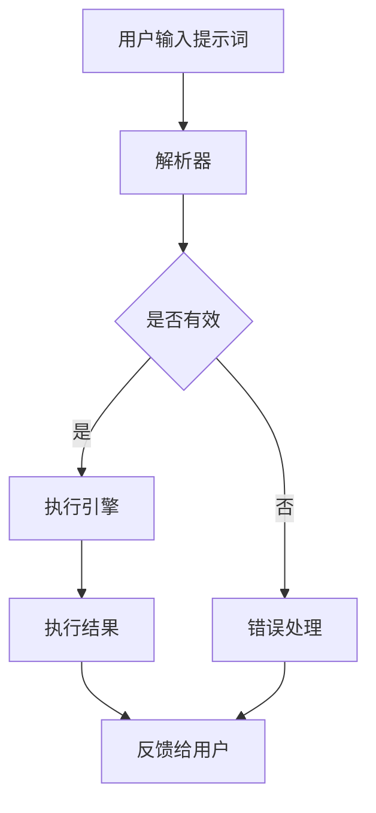

在这个流程图中，用户输入提示词，经过解析器处理后，如果提示词有效，则由执行引擎执行操作，并将结果反馈给用户。如果提示词无效，则进入错误处理环节。

### 1.4 认知科学基础

认知科学是一门跨学科的研究领域，它关注人类思维、感知、学习和记忆等认知过程。以下是认知科学的一些基本概念：

1. **思维（Cognition）**：思维是指人类在感知、理解和解决问题时所进行的认知活动。它包括注意力、记忆、推理、判断等多个方面。
2. **感知（Perception）**：感知是指人类通过感官接收外部信息并将其转化为内部认知过程。例如，我们通过视觉感知看到的事物，通过听觉感知听到的声音。
3. **学习（Learning）**：学习是指个体通过经验积累和知识获取来改变自身行为和能力的过程。学习可以分为显性学习和隐性学习，前者通过直接的训练和指导，后者则通过观察和实践。
4. **记忆（Memory）**：记忆是指个体对过去经验的保持和回忆能力。记忆可以分为短期记忆和长期记忆，短期记忆主要负责临时存储和处理信息，长期记忆则负责持久存储和回忆。

### 1.5 认知科学与编程的关系

认知科学与编程之间存在密切的关系，主要表现在以下几个方面：

1. **编程作为认知活动**：编程是一种认知活动，程序员在编写代码时需要进行逻辑思考、问题解决和决策。这些活动都涉及到认知科学中的多个方面，如注意力、记忆、推理等。
2. **编程教育中的认知研究**：认知科学研究可以应用于编程教育，帮助设计更加有效的教学方法和学习策略。例如，通过研究记忆原理，可以设计出更有效的编程学习课程和记忆工具。
3. **编程工具与认知支持**：现代编程工具，如代码补全、自动修复和智能提示，都基于认知科学原理，旨在减轻程序员的认知负担，提高编程效率。

### 1.6 认知科学在提示词编程中的应用

认知科学在提示词编程语言中的应用主要体现在以下几个方面：

1. **提示词生成与理解**：认知科学中的自然语言处理技术可以帮助生成和理解提示词。例如，通过语言模型和词嵌入技术，可以将人类自然语言转化为计算机可以理解的指令。
2. **用户交互**：认知科学原理可以帮助设计更加人性化的用户交互界面，使编程过程更加自然和直观。例如，通过研究注意力机制，可以设计出能够引导用户注意力的交互界面。
3. **编程辅助**：认知科学原理可以应用于编程辅助工具，如代码审查、错误修复和代码优化。这些工具可以帮助程序员更高效地完成编程任务，减少认知负担。

### 总结

本章介绍了提示词编程语言的概念、与认知科学的联系、基本架构以及认知科学的基础知识。通过本章的学习，读者可以初步了解提示词编程语言的核心概念和认知科学在编程中的应用。

在下一章中，我们将进一步探讨自然语言处理与提示词编程的关系，分析提示词生成算法和其在实际应用中的表现。

### 第2章：自然语言处理与提示词编程

自然语言处理（Natural Language Processing，简称NLP）是人工智能领域的一个重要分支，它旨在使计算机能够理解、解释和生成自然语言。提示词编程语言（PBPL）正是基于NLP技术而发展起来的一种新兴编程范式。在这一章中，我们将深入探讨自然语言处理的基本概念、核心算法以及提示词生成算法，并分析其在文本生成、问答系统和对话系统中的应用。

#### 2.1 自然语言处理基础

自然语言处理的基础概念包括语言模型、词嵌入和语言模型训练与评估。这些概念是理解和实现提示词编程语言的关键。

**1. 语言模型**

语言模型（Language Model）是一种概率模型，它用于预测一个序列中下一个单词或字符的概率。在自然语言处理中，语言模型是许多应用的核心，如语音识别、机器翻译和文本生成。常见的语言模型有N-gram模型、神经网络语言模型（如循环神经网络RNN、长短期记忆网络LSTM）和变换器模型（如BERT、GPT）。

**2. 词嵌入**

词嵌入（Word Embedding）是一种将单词映射到高维向量空间的技术，使计算机能够理解单词之间的语义关系。词嵌入技术有助于提高NLP任务的性能，如文本分类、情感分析和机器翻译。常见的词嵌入方法包括Word2Vec、GloVe和BERT。

**3. 语言模型训练与评估**

语言模型的训练过程涉及大量文本数据的处理，通过最大化预测概率来优化模型参数。评估语言模型性能的常见指标包括准确率、召回率和F1分数。在实际应用中，语言模型的性能往往通过交叉验证和在线测试进行评估。

#### 2.2 提示词生成算法

提示词生成算法是提示词编程语言的核心，它负责将用户输入的自然语言转化为计算机可以理解的指令。以下是一些常见的提示词生成算法：

**1. 基于规则的方法**

基于规则的方法通过预定义的语法规则和模板生成提示词。这种方法简单直观，但缺乏灵活性，难以处理复杂的语言结构和变化。

**2. 基于统计的方法**

基于统计的方法使用历史数据来统计生成提示词的概率分布。这种方法具有较高的灵活性，但需要大量的训练数据和计算资源。

**3. 基于机器学习的方法**

基于机器学习的方法使用监督学习或无监督学习技术来训练模型，自动生成提示词。常见的机器学习方法包括决策树、支持向量机和神经网络。这种方法具有较高的灵活性和准确性，但需要大量的训练数据和计算资源。

**4. 基于深度学习的方法**

基于深度学习的方法使用深度神经网络（如循环神经网络RNN、长短期记忆网络LSTM和变换器模型BERT）来生成提示词。这种方法具有强大的表示能力和灵活性，但需要大量的训练数据和计算资源。

#### 2.3 提示词生成算法的优化

为了提高提示词生成算法的性能，可以采用以下几种优化方法：

**1. 数据增强**

数据增强通过生成或扩展训练数据来提高模型的泛化能力。常见的数据增强方法包括随机填充、同义词替换和对抗性样本生成。

**2. 模型融合**

模型融合通过结合多个模型的预测结果来提高整体性能。常见的方法包括对齐模型、级联模型和集成学习。

**3. 正则化**

正则化通过添加额外的约束条件来防止模型过拟合。常见的方法包括L1和L2正则化、dropout和权重衰减。

**4. 多任务学习**

多任务学习通过同时训练多个相关任务来提高模型性能。这种方法有助于共享知识和提高模型的泛化能力。

#### 2.4 实例分析

**1. 文本生成**

文本生成是提示词编程语言的一个重要应用领域。通过生成提示词，计算机可以生成各种类型的文本，如文章、故事、新闻摘要等。以下是一个简单的文本生成示例：

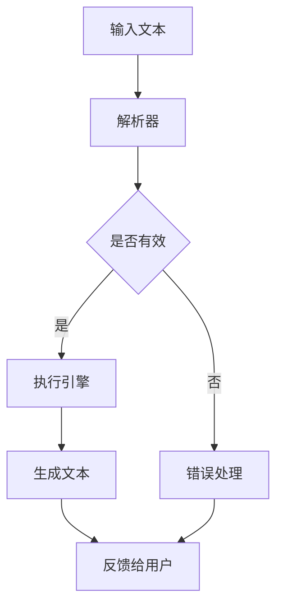

在这个示例中，用户输入一段文本，解析器将其转化为计算机可以理解的指令。执行引擎根据提示词生成相应的文本，并将结果反馈给用户。

**2. 问答系统**

问答系统是另一个重要的应用领域。通过生成提示词，计算机可以回答用户的问题。以下是一个简单的问答系统示例：


在这个示例中，用户提出一个问题，解析器将其转化为计算机可以理解的指令。执行引擎查询数据库，根据提示词生成答案，并将结果反馈给用户。

**3. 对话系统**

对话系统是另一个重要的应用领域。通过生成提示词，计算机可以与用户进行自然对话。以下是一个简单的对话系统示例：

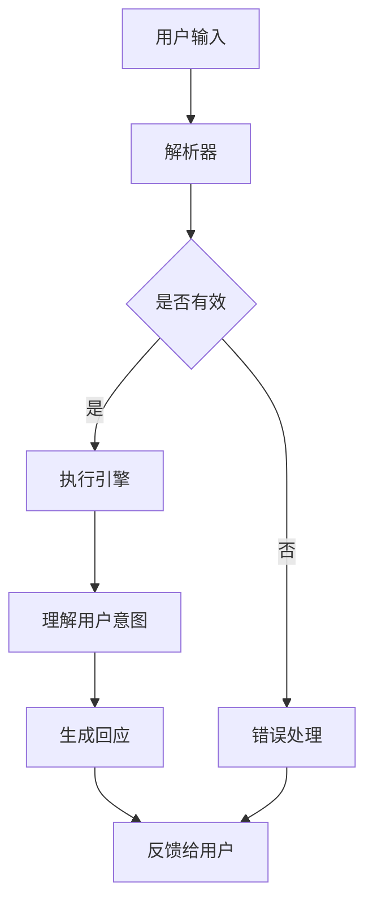

在这个示例中，用户输入一条消息，解析器将其转化为计算机可以理解的指令。执行引擎理解用户的意图，根据提示词生成回应，并将结果反馈给用户。

### 2.5 提示词编程语言在自然语言处理中的应用

提示词编程语言在自然语言处理中的应用具有广泛的前景，以下是一些典型的应用场景：

**1. 文本分类**

文本分类是将文本数据分为多个类别的过程。提示词编程语言可以通过生成提示词，实现自动文本分类。以下是一个简单的文本分类示例：

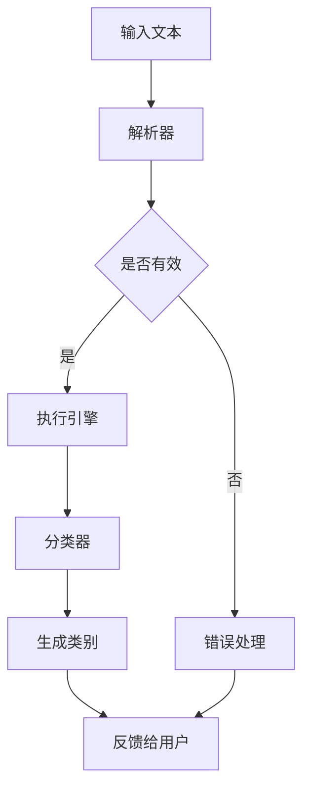

在这个示例中，用户输入一段文本，解析器将其转化为计算机可以理解的指令。执行引擎使用分类器对文本进行分类，并将结果反馈给用户。

**2. 情感分析**

情感分析是分析文本情感倾向的过程。提示词编程语言可以通过生成提示词，实现自动情感分析。以下是一个简单的情感分析示例：

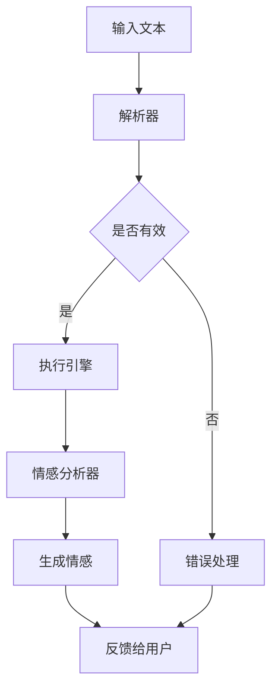

在这个示例中，用户输入一段文本，解析器将其转化为计算机可以理解的指令。执行引擎使用情感分析器分析文本情感，并将结果反馈给用户。

**3. 机器翻译**

机器翻译是将一种语言文本转换为另一种语言文本的过程。提示词编程语言可以通过生成提示词，实现自动机器翻译。以下是一个简单的机器翻译示例：

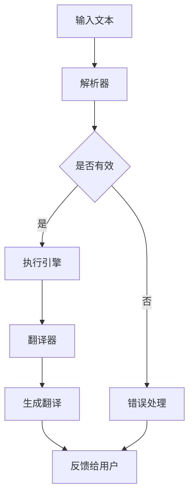

在这个示例中，用户输入一段文本，解析器将其转化为计算机可以理解的指令。执行引擎使用翻译器将文本翻译为另一种语言，并将结果反馈给用户。

### 2.6 小结

本章介绍了自然语言处理的基本概念、核心算法和提示词生成算法，并分析了提示词编程语言在文本生成、问答系统和对话系统中的应用。通过本章的学习，读者可以了解提示词编程语言在自然语言处理领域的应用前景和潜力。

在下一章中，我们将探讨认知科学视角下的机器学习算法，分析认知模型在机器学习中的应用，以及提示词编程语言中的常见机器学习算法。

### 第3章：认知科学与机器学习

在认知科学与机器学习的交汇点上，我们可以发现许多有趣的现象和应用。本章将深入探讨认知模型在机器学习中的应用，分析认知模型如何影响机器学习算法的感知机制，以及如何通过认知优化来提高机器学习模型的性能。

#### 3.1 认知科学视角下的机器学习

认知科学是一门跨学科的研究领域，它关注人类思维、感知、学习和记忆等认知过程。将这些认知原理应用于机器学习，可以让我们设计出更加高效、鲁棒和人性化的机器学习模型。

**1. 注意力机制**

注意力机制（Attention Mechanism）是认知科学中的一个核心概念，它指的是在处理大量信息时，个体如何选择性地关注某些信息而忽视其他信息。在机器学习中，注意力机制被广泛应用于图像识别、自然语言处理和序列模型中。例如，在视觉任务中，注意力机制可以帮助模型关注图像中的重要区域；在自然语言处理中，注意力机制可以帮助模型关注文本中的关键信息。

**2. 记忆模型**

记忆模型（Memory Model）是认知科学中的另一个重要概念，它研究个体如何存储和检索信息。在机器学习中，记忆模型可以应用于强化学习、知识图谱和记忆增强神经网络。例如，在强化学习中，记忆模型可以帮助模型学习长期依赖关系，从而提高决策的鲁棒性。

**3. 推理和决策**

推理和决策（Reasoning and Decision Making）是认知科学中的核心内容，它研究个体如何从已知信息中推导出新信息，并做出合理决策。在机器学习中，推理和决策可以应用于逻辑推理、推理机和决策树等模型。例如，在逻辑推理任务中，机器学习模型可以通过学习逻辑规则来推断新信息。

**4. 人类-机器交互**

人类-机器交互（Human-Machine Interaction）是认知科学中的一个重要研究领域，它关注如何设计更加人性化的交互界面，使计算机更好地适应人类的思维方式。在机器学习中，人类-机器交互可以应用于交互式机器学习、人机对话系统和个性化推荐。例如，在交互式机器学习中，用户可以通过与模型的交互来指导学习过程，从而提高模型的性能。

#### 3.2 机器学习算法的感知机制

机器学习算法的感知机制是指模型如何从输入数据中提取信息，并利用这些信息来生成预测。以下是一些常见的机器学习算法的感知机制：

**1. 特征提取**

特征提取（Feature Extraction）是指从原始数据中提取出具有区分性的特征。在机器学习中，特征提取是提高模型性能的关键步骤。通过特征提取，模型可以更好地理解输入数据的本质，从而生成更准确的预测。例如，在图像识别任务中，卷积神经网络（CNN）可以通过卷积操作提取图像中的纹理和形状特征。

**2. 模型优化**

模型优化（Model Optimization）是指通过调整模型参数来提高模型性能。在机器学习中，模型优化是提高模型预测精度和降低计算成本的关键步骤。常见的模型优化方法包括梯度下降、随机梯度下降和Adam优化器。通过模型优化，模型可以在复杂环境中更好地适应输入数据。

**3. 预测生成**

预测生成（Prediction Generation）是指模型根据输入数据生成预测结果。在机器学习中，预测生成是评估模型性能的重要指标。通过预测生成，模型可以对新样本进行分类、回归或标注。例如，在文本分类任务中，模型可以根据输入文本生成对应的类别标签。

#### 3.3 认知优化

认知优化（Cognitive Optimization）是指通过借鉴认知科学原理来优化机器学习模型。以下是一些常见的认知优化方法：

**1. 注意力优化**

注意力优化（Attention Optimization）是指通过调整注意力权重来提高模型性能。在机器学习中，注意力优化可以应用于图像识别、自然语言处理和序列模型。例如，在图像识别任务中，通过优化注意力权重，模型可以更好地关注图像中的重要区域。

**2. 记忆优化**

记忆优化（Memory Optimization）是指通过调整记忆机制来提高模型性能。在机器学习中，记忆优化可以应用于强化学习、知识图谱和记忆增强神经网络。例如，在强化学习中，通过优化记忆机制，模型可以更好地学习长期依赖关系。

**3. 推理优化**

推理优化（Reasoning Optimization）是指通过优化推理过程来提高模型性能。在机器学习中，推理优化可以应用于逻辑推理、推理机和决策树。例如，在逻辑推理任务中，通过优化推理过程，模型可以更高效地生成推理结果。

**4. 交互优化**

交互优化（Interaction Optimization）是指通过优化人类-机器交互来提高模型性能。在机器学习中，交互优化可以应用于交互式机器学习、人机对话系统和个性化推荐。例如，在交互式机器学习中，通过优化交互过程，用户可以更有效地指导模型学习。

#### 3.4 提示词编程语言中的常见机器学习算法

提示词编程语言（PBPL）是一种新兴的编程范式，它通过提示词来指导计算机执行任务。在提示词编程语言中，常见的机器学习算法包括以下几种：

**1. 决策树**

决策树（Decision Tree）是一种常用的机器学习算法，它通过树形结构对数据集进行分类或回归。在提示词编程语言中，决策树可以用于分类和回归任务。以下是一个简单的决策树示例：

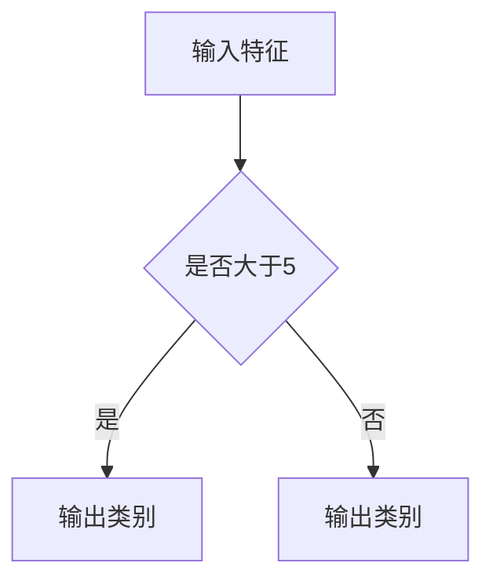

在这个示例中，输入特征通过决策树进行分类，输出类别为“是”或“否”。

**2. 支持向量机**

支持向量机（Support Vector Machine，简称SVM）是一种常用的机器学习算法，它通过找到最佳超平面来对数据集进行分类。在提示词编程语言中，SVM可以用于分类和回归任务。以下是一个简单的SVM示例：

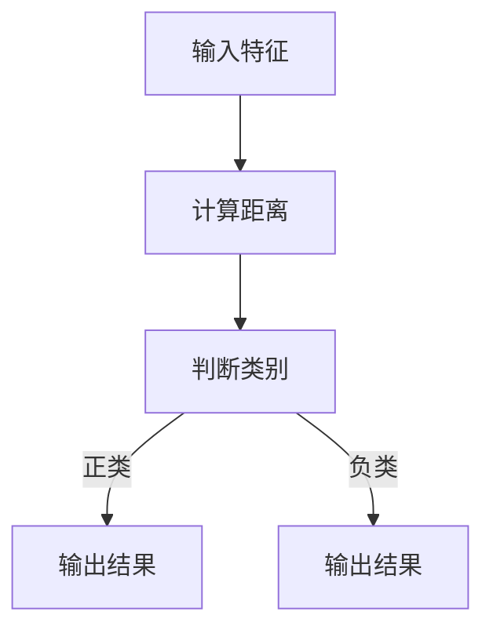

在这个示例中，输入特征通过SVM进行分类，输出结果为“正类”或“负类”。

**3. 神经网络**

神经网络（Neural Network）是一种复杂的机器学习算法，它通过多层神经元来模拟人脑的神经网络。在提示词编程语言中，神经网络可以用于分类、回归和生成任务。以下是一个简单的神经网络示例：

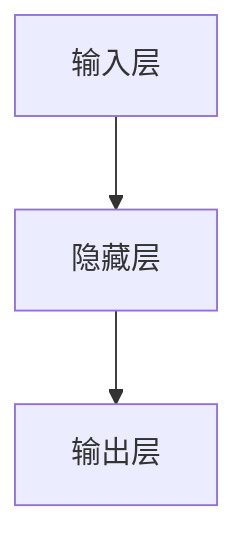

在这个示例中，输入层通过隐藏层生成输出层的结果。

**4. 集成学习方法**

集成学习方法（Ensemble Learning）是一种常用的机器学习算法，它通过结合多个模型来提高整体性能。在提示词编程语言中，集成学习方法可以用于分类、回归和生成任务。以下是一个简单的集成学习方法示例：

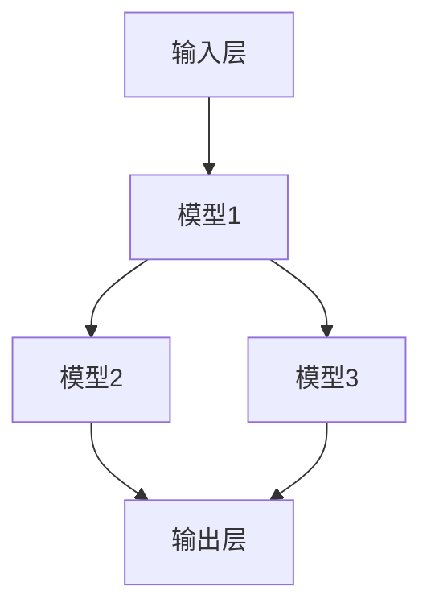

在这个示例中，输入层通过多个模型生成输出层的结果。

#### 3.5 提示词编程语言中的机器学习算法优化

在提示词编程语言中，机器学习算法的优化是一个重要问题。以下是一些常见的优化方法：

**1. 参数调整**

参数调整（Parameter Tuning）是指通过调整模型参数来提高模型性能。在提示词编程语言中，参数调整可以应用于各种机器学习算法，如决策树、支持向量机和神经网络。以下是一个简单的参数调整示例：

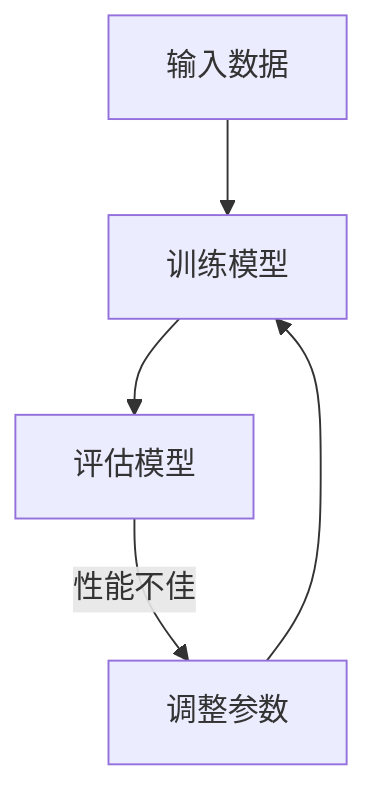

在这个示例中，通过反复调整模型参数，可以提高模型的性能。

**2. 数据预处理**

数据预处理（Data Preprocessing）是指对输入数据进行预处理，以提高模型性能。在提示词编程语言中，数据预处理可以应用于各种机器学习算法。以下是一个简单的数据预处理示例：

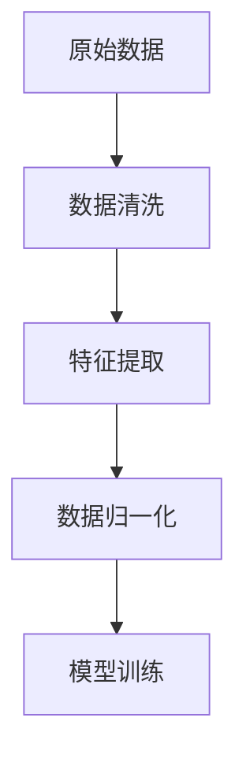

在这个示例中，通过数据清洗、特征提取和数据归一化，可以提高模型的性能。

**3. 模型融合**

模型融合（Model Fusion）是指通过结合多个模型来提高整体性能。在提示词编程语言中，模型融合可以应用于各种机器学习算法。以下是一个简单的模型融合示例：

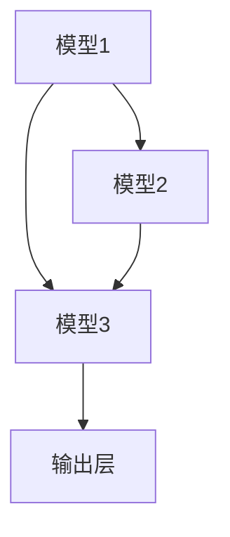

在这个示例中，通过结合多个模型，可以提高整体的性能。

#### 3.6 实例分析

**1. 图像识别**

图像识别是机器学习中的一个重要应用领域。在提示词编程语言中，图像识别可以通过神经网络来实现。以下是一个简单的图像识别示例：

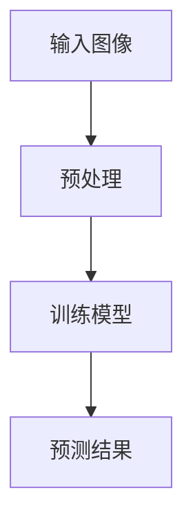

在这个示例中，输入图像通过预处理后，训练神经网络进行图像识别，并生成预测结果。

**2. 自然语言处理**

自然语言处理是机器学习中的另一个重要应用领域。在提示词编程语言中，自然语言处理可以通过神经网络来实现。以下是一个简单的自然语言处理示例：

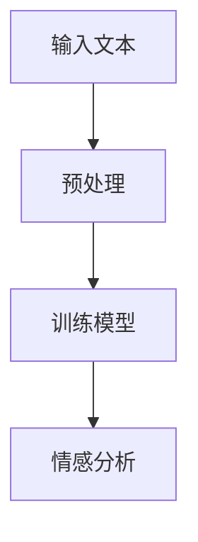

在这个示例中，输入文本通过预处理后，训练神经网络进行情感分析，并生成情感分析结果。

**3. 语音识别**

语音识别是机器学习中的另一个重要应用领域。在提示词编程语言中，语音识别可以通过神经网络来实现。以下是一个简单的语音识别示例：

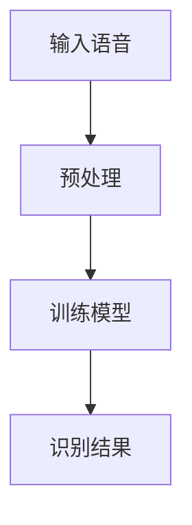

在这个示例中，输入语音通过预处理后，训练神经网络进行语音识别，并生成识别结果。

### 3.7 小结

本章介绍了认知科学视角下的机器学习算法，分析了认知模型在机器学习中的应用，以及提示词编程语言中的常见机器学习算法。通过本章的学习，读者可以了解认知科学在机器学习中的重要作用，并掌握如何应用认知优化方法来提高机器学习模型的性能。

在下一章中，我们将探讨认知科学与编程语言设计的关系，分析编程语言设计原则和认知基础，以及编程语言设计中的认知挑战。

### 第4章：认知科学与编程语言设计

认知科学与编程语言设计之间的联系是深远的，认知科学为编程语言设计提供了重要的理论基础，而编程语言设计则可以通过认知原理来优化用户与计算机之间的交互。本章将深入探讨编程语言设计中的认知科学基础，包括设计原则、认知基础和认知挑战，并探讨如何应用这些原则来设计更加直观、易用的编程语言。

#### 4.1 编程语言设计原则

编程语言设计原则是指指导编程语言开发的一系列基本准则，这些原则旨在提高编程语言的易用性、可读性和可维护性。以下是几个关键的编程语言设计原则：

**1. 简洁性**

简洁性是指编程语言应该设计得尽可能简单，使程序员能够轻松地理解和使用。简洁性有助于减少编程错误和提高开发效率。例如，Python以其简洁的语法和易读的代码而受到开发者的青睐。

**2. 一致性**

一致性是指编程语言应该具有一致的语法和语义。一致性有助于减少学习成本，使程序员能够更容易地掌握编程语言。例如，Java的一致性使得开发者可以轻松地从一种语言迁移到另一种语言。

**3. 可扩展性**

可扩展性是指编程语言应该能够适应新的需求和变化。可扩展性有助于保持编程语言的活力，使其能够持续地满足开发者的需求。例如，C++的可扩展性使其成为许多系统级编程的首选语言。

**4. 可读性**

可读性是指编程语言应该设计得易于阅读和理解。可读性有助于提高代码的可维护性，使其他开发者能够更容易地理解和修改代码。例如，Ruby以其优雅的语法和易读的代码而著称。

**5. 可维护性**

可维护性是指编程语言应该设计得易于维护和升级。可维护性有助于降低开发成本，提高开发效率。例如，Scala的可维护性使其在大型系统中得到广泛应用。

#### 4.2 认知基础

认知基础是指编程语言设计过程中需要考虑的认知科学原理。以下是一些关键的认知基础：

**1. 注意力管理**

注意力管理是指如何在编程过程中有效地分配和处理信息。编程语言设计应该考虑如何减轻程序员的认知负担，提高编程效率。例如，通过提供代码补全和自动提示功能，编程语言可以减轻程序员的记忆负担。

**2. 记忆模型**

记忆模型是指如何在编程过程中有效地存储和检索信息。编程语言设计应该考虑如何帮助程序员更好地记忆和使用编程语言。例如，通过提供可重用的代码库和模块化设计，编程语言可以提高记忆效率。

**3. 决策支持**

决策支持是指如何在编程过程中提供帮助，以减少程序员的决策难度。编程语言设计应该考虑如何简化编程决策，提高编程效率。例如，通过提供明确的错误提示和代码审查工具，编程语言可以减少编程错误。

**4. 人类-机器交互**

人类-机器交互是指如何设计编程语言，以更好地适应人类的认知特点。编程语言设计应该考虑如何优化用户界面，提高编程体验。例如，通过提供直观的图形界面和用户友好的命令行工具，编程语言可以提升用户满意度。

#### 4.3 编程语言设计中的认知挑战

编程语言设计中的认知挑战是指如何通过认知科学原理来解决编程过程中的认知问题。以下是一些关键的认知挑战：

**1. 复杂性管理**

复杂性管理是指如何处理编程过程中的复杂性问题。编程语言设计应该考虑如何降低复杂性，使编程过程更加直观。例如，通过提供抽象的数据结构和模块化设计，编程语言可以简化编程任务。

**2. 上下文感知**

上下文感知是指如何在编程过程中识别和理解上下文信息。编程语言设计应该考虑如何提供上下文感知功能，以提高编程效率和代码质量。例如，通过提供智能提示和代码补全功能，编程语言可以更好地适应上下文。

**3. 错误处理**

错误处理是指如何处理编程过程中的错误和异常。编程语言设计应该考虑如何提供有效的错误处理机制，以减少编程错误和提高代码质量。例如，通过提供明确的错误提示和调试工具，编程语言可以提升错误处理能力。

**4. 学习曲线**

学习曲线是指学习编程语言所需的时间和难度。编程语言设计应该考虑如何降低学习曲线，使编程语言更易于学习和使用。例如，通过提供直观的语法和丰富的文档，编程语言可以减少学习难度。

#### 4.4 提示词编程语言设计

提示词编程语言是一种新兴的编程范式，它通过提示词来指导计算机执行任务。提示词编程语言的设计应该遵循上述编程语言设计原则和认知基础，以实现更加直观、易用的编程体验。以下是一些提示词编程语言设计的关键要素：

**1. 提示词生成**

提示词生成是指如何自动生成提示词，以指导计算机执行任务。提示词生成应该基于自然语言处理技术和机器学习算法，以确保提示词的准确性和多样性。

**2. 提示词解析**

提示词解析是指如何将提示词解析为计算机可以理解的操作。提示词解析应该考虑上下文信息，以确保提示词的准确性和一致性。

**3. 执行引擎**

执行引擎是指如何根据提示词执行相应的操作。执行引擎应该支持多种编程范式，如命令式、声明式和函数式，以满足不同编程需求。

**4. 用户界面**

用户界面是指如何设计用户界面，以提供直观、易用的编程体验。用户界面应该支持多种交互方式，如命令行、图形界面和触摸界面。

**5. 错误处理**

错误处理是指如何处理编程过程中的错误和异常。提示词编程语言应该提供明确的错误提示和调试工具，以帮助用户快速定位和修复错误。

#### 4.5 实例分析

**1. 提示词编程语言在文本生成中的应用**

提示词编程语言可以应用于文本生成，如自动写作、摘要生成和对话系统。以下是一个简单的文本生成示例：

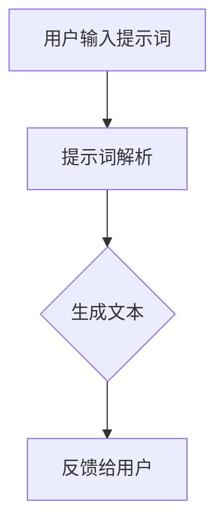

在这个示例中，用户输入提示词，提示词解析器将其解析为计算机可以理解的指令，执行引擎生成文本，并将结果反馈给用户。

**2. 提示词编程语言在问答系统中的应用**

提示词编程语言可以应用于问答系统，如自动回答用户问题和提供信息。以下是一个简单的问答系统示例：

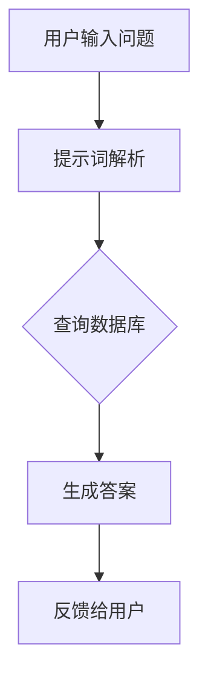

在这个示例中，用户输入问题，提示词解析器将其解析为计算机可以理解的指令，执行引擎查询数据库，生成答案，并将结果反馈给用户。

**3. 提示词编程语言在对话系统中的应用**

提示词编程语言可以应用于对话系统，如聊天机器人、虚拟助手和客户服务。以下是一个简单的对话系统示例：

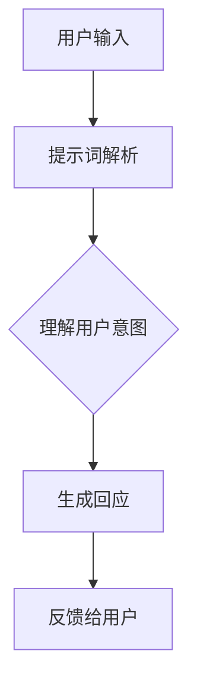

在这个示例中，用户输入一条消息，提示词解析器将其解析为计算机可以理解的指令，执行引擎理解用户的意图，生成回应，并将结果反馈给用户。

#### 4.6 小结

本章介绍了编程语言设计原则、认知基础和认知挑战，并探讨了如何应用这些原则来设计提示词编程语言。通过本章的学习，读者可以了解认知科学在编程语言设计中的应用，并掌握如何设计更加直观、易用的编程语言。

在下一章中，我们将通过具体的实战案例，展示如何在实际项目中应用提示词编程语言，包括开发环境搭建、代码实现和代码解读。

### 第5章：提示词编程语言项目实战

通过前面的理论讲解，我们已经对提示词编程语言（PBPL）有了深入的理解。在本章中，我们将通过具体的实战案例，展示如何在实际项目中应用提示词编程语言，包括开发环境搭建、代码实现和代码解读。通过这些实战案例，读者将能够更好地理解提示词编程语言的实用性，并学会如何将其应用到实际项目中。

#### 5.1 项目实战准备

在开始项目实战之前，我们需要为项目搭建一个合适的环境。以下是一个基本的开发环境搭建步骤：

**1. 安装编程语言**

选择一个合适的编程语言，例如Python或Java，并安装相应的开发工具和库。Python和Java都是广泛使用的编程语言，它们都有丰富的库和框架支持提示词编程语言。

**2. 安装提示词编程语言工具**

下载并安装提示词编程语言工具。例如，对于Python，可以选择安装`prompt-toolkit`库，它提供了强大的命令行界面和文本处理功能。

**3. 准备示例数据**

准备一些示例数据，这些数据将用于项目中的提示词生成和模型训练。例如，对于文本生成任务，我们可以准备一些文章或对话数据。

**4. 配置环境变量**

配置环境变量，确保能够顺利运行提示词编程语言和相关库。

#### 5.2 项目实战案例一：文本生成

**1. 项目概述**

本案例的目标是使用提示词编程语言生成一篇简短的文章。我们将利用自然语言处理技术和机器学习算法，根据用户输入的提示词生成文章。

**2. 项目实施**

**步骤1：数据预处理**

首先，我们需要对示例数据进行预处理，包括分词、去停用词和词嵌入。以下是一个简单的预处理步骤：

```python
import nltk
from nltk.tokenize import word_tokenize
from nltk.corpus import stopwords

nltk.download('punkt')
nltk.download('stopwords')

# 加载示例数据
data = "在科技飞速发展的今天，人工智能已经成为各行各业的关键驱动力。从自动驾驶汽车到智能客服，人工智能正在改变我们的生活方式。"

# 分词
tokens = word_tokenize(data)

# 去停用词
stop_words = set(stopwords.words('english'))
filtered_tokens = [token for token in tokens if token not in stop_words]

# 词嵌入
# 使用预训练的词嵌入模型，如GloVe或BERT
# 这里以GloVe为例
import gensim.downloader as api

word2vec = api.load("glove-wiki-gigaword-100")

embeddings = [word2vec[token] for token in filtered_tokens if token in word2vec]
```

**步骤2：训练语言模型**

接下来，我们需要训练一个语言模型，以便能够根据用户输入的提示词生成文章。以下是一个简单的训练步骤：

```python
from nltk import ngrams

# 创建n-gram模型
n = 2
model = ngrams(filtered_tokens, n)

# 训练语言模型
# 这里使用nltk中的n-gram模型
# 对于更复杂的语言模型，可以使用transformer模型（如GPT）
def generate_sentence(model, seed, length=10):
    sentence = [seed]
    for _ in range(length):
        next_words = list(model.random_sample())
        sentence.extend(next_words)
    return ' '.join(sentence[1:])

print(generate_sentence(model, '人工智能'))
```

**步骤3：用户输入与文本生成**

用户输入一个提示词，如“人工智能”，然后根据训练好的语言模型生成文章。以下是一个简单的用户交互步骤：

```python
# 获取用户输入
prompt = input("请输入提示词：")

# 生成文章
generated_text = generate_sentence(model, prompt)
print("生成的文章：")
print(generated_text)
```

**3. 代码解读与分析**

在上述代码中，我们首先对示例数据进行了预处理，包括分词、去停用词和词嵌入。然后，我们使用nltk中的n-gram模型训练了一个简单的语言模型。最后，用户输入一个提示词，根据训练好的语言模型生成了一篇文章。

**4. 项目优化与扩展**

在实际项目中，我们可以对文本生成任务进行优化和扩展。以下是一些可能的优化和扩展方向：

- **增加语言模型复杂度**：使用更复杂的语言模型（如transformer模型）来提高文本生成的质量。
- **引入上下文信息**：在文本生成过程中考虑上下文信息，以提高生成的文章的相关性和连贯性。
- **多语言支持**：扩展文本生成任务，支持多种语言。

#### 5.3 项目实战案例二：问答系统

**1. 项目概述**

本案例的目标是构建一个简单的问答系统，能够根据用户的问题提供准确的答案。我们将使用提示词编程语言实现问答系统的核心功能。

**2. 项目实施**

**步骤1：数据准备**

首先，我们需要准备一个问答数据集。以下是一个简单的问答数据集示例：

```python
questions = [
    "什么是人工智能？",
    "人工智能有哪些应用？",
    "人工智能的挑战是什么？"
]

answers = [
    "人工智能是一门研究、开发用于模拟、延伸和扩展人的智能的理论、方法、技术及应用系统的新技术科学。",
    "人工智能的应用领域包括自动驾驶、智能客服、医疗诊断、金融预测等。",
    "人工智能的挑战包括数据隐私、算法公平性、通用人工智能等。"
]
```

**步骤2：构建问答模型**

接下来，我们需要构建一个问答模型，能够根据用户的问题提供答案。以下是一个简单的问答模型实现：

```python
# 加载预训练的语言模型
import torch
from transformers import BertForQuestionAnswering

model = BertForQuestionAnswering.from_pretrained("bert-base-chinese")
tokenizer = transformers.BertTokenizer.from_pretrained("bert-base-chinese")

# 定义问答模型
class QuestionAnsweringModel(nn.Module):
    def __init__(self, bert_model):
        super(QuestionAnsweringModel, self).__init__()
        self.bert = bert_model

    def forward(self, input_ids, attention_mask):
        outputs = self.bert(input_ids=input_ids, attention_mask=attention_mask)
        return outputs.logits

# 实例化问答模型
qa_model = QuestionAnsweringModel(model)

# 加载训练好的模型权重
qa_model.load_state_dict(torch.load("qa_model.pth"))
qa_model.eval()
```

**步骤3：用户交互**

用户输入一个问题，问答模型根据问题提供答案。以下是一个简单的用户交互步骤：

```python
# 获取用户输入
user_question = input("请输入问题：")

# 预处理输入数据
input_ids = tokenizer.encode(user_question, add_special_tokens=True, return_tensors="pt")

# 预处理答案数据
all_answers = tokenizer(answers, return_tensors="pt")

# 预测答案
with torch.no_grad():
    logits = qa_model(input_ids).logits

# 获取最高概率的答案
answer_indices = logits.argmax(-1).squeeze(-1)
selected_answers = [answers[i] for i in answer_indices]

# 输出答案
print("可能的答案：")
for answer in selected_answers:
    print(answer)
```

**3. 代码解读与分析**

在上述代码中，我们首先加载了一个预训练的语言模型（如BERT），并定义了一个问答模型。然后，用户输入一个问题，问答模型根据输入数据和预训练模型生成可能的答案。最后，我们根据答案的概率输出最高概率的答案。

**4. 项目优化与扩展**

在实际项目中，我们可以对问答系统进行优化和扩展。以下是一些可能的优化和扩展方向：

- **增加数据集规模**：扩展问答数据集，增加模型的训练数据，以提高答案的准确性。
- **多轮对话**：支持多轮对话，使问答系统能够更好地理解和回答复杂问题。
- **上下文理解**：在问答过程中考虑上下文信息，以提高答案的准确性和连贯性。

#### 5.4 小结

通过本章的两个实战案例，我们展示了如何在实际项目中应用提示词编程语言。在文本生成案例中，我们利用自然语言处理技术和机器学习算法，根据用户输入的提示词生成文章。在问答系统案例中，我们构建了一个简单的问答模型，能够根据用户的问题提供准确的答案。这些实战案例不仅展示了提示词编程语言的实用性，也为读者提供了实际操作的经验。

在下一章中，我们将进一步探讨提示词编程语言在各个领域的应用，分析其在商业、教育和科研领域的具体应用案例，并展望其未来的发展趋势。

### 第6章：提示词编程语言的应用与展望

提示词编程语言（PBPL）作为一种新兴的编程范式，正在逐步渗透到各个领域，并展现出巨大的潜力。在本章中，我们将详细分析提示词编程语言在商业、教育和科研领域的具体应用，探讨其带来的变革和影响，并展望其未来的发展趋势。

#### 6.1 提示词编程语言在商业领域的应用

在商业领域，提示词编程语言正逐渐成为提高业务效率、降低成本和提升客户体验的重要工具。

**1. 自动化流程**

提示词编程语言可以帮助企业自动化各种业务流程，如订单处理、客户服务和财务报表。通过编写简单的提示词，企业可以实现自动化操作，减少人工干预，提高流程效率。例如，一家电商公司可以利用提示词编程语言自动处理订单，从订单生成、库存管理到发货通知，实现全流程自动化。

**2. 人工智能助手**

在商业环境中，人工智能助手（如聊天机器人、虚拟客服）已经成为企业与客户互动的重要方式。提示词编程语言可以简化人工智能助手的开发过程，使其更加灵活和智能。例如，银行可以使用提示词编程语言构建智能客服系统，为客户提供实时咨询和问题解答，提高客户满意度。

**3. 数据分析**

提示词编程语言在数据分析领域的应用也越来越广泛。企业可以利用提示词编程语言处理大量数据，进行数据挖掘和分析，从而发现潜在的商业机会和优化业务策略。例如，零售企业可以通过提示词编程语言分析销售数据，识别热门商品和客户偏好，优化库存管理和促销策略。

**4. 商业智能**

提示词编程语言还可以帮助企业构建商业智能系统，实现数据的实时监控和分析。通过编写简单的提示词，企业可以实时跟踪关键业务指标，如销售额、客户留存率和市场份额，从而快速做出决策。例如，一家制造企业可以利用提示词编程语言实时监控生产线的运行状况，及时发现并解决问题，提高生产效率。

#### 6.2 提示词编程语言在教育领域的应用

提示词编程语言在教育领域的应用正在改变传统的教学方式，为教师和学生提供了更加灵活和高效的学习工具。

**1. 编程教育**

提示词编程语言降低了编程入门的门槛，使得更多学生可以轻松地开始学习编程。教师可以利用提示词编程语言设计互动式编程课程，引导学生逐步掌握编程技能。例如，通过编写简单的提示词，学生可以创建自己的游戏或应用程序，从而增强学习兴趣和实践能力。

**2. 在线学习平台**

提示词编程语言可以用于构建在线学习平台，提供个性化的学习体验。学生可以根据自己的进度和需求，选择合适的提示词编程语言课程进行学习。例如，一个在线学习平台可以提供多种编程语言课程，如Python、Java和JavaScript，学生可以根据自己的兴趣和目标选择学习路径。

**3. 教学辅助工具**

提示词编程语言还可以用于开发教学辅助工具，如智能辅导系统和自动评分系统。这些工具可以帮助教师更好地管理课堂，提高教学效率。例如，智能辅导系统可以根据学生的答题情况，提供个性化的辅导建议，帮助学生及时纠正错误和提高成绩。

**4. 教育游戏**

提示词编程语言在教育游戏中的应用正在引发一场教育革命。通过编写简单的提示词，学生可以创建自己的教育游戏，从而在游戏中学习和巩固知识。例如，一个教育游戏可以要求学生编写提示词来控制游戏角色，通过解决编程问题来通关，从而提高学生的编程技能和解决问题的能力。

#### 6.3 提示词编程语言在科研领域的应用

在科研领域，提示词编程语言为科学家提供了强大的工具，帮助他们更好地处理和分析数据，推动科学研究的进步。

**1. 数据分析**

提示词编程语言可以简化复杂数据分析过程，使科学家能够更快地处理和分析大量数据。例如，通过编写简单的提示词，科学家可以自动化数据清洗、数据转换和数据可视化过程，从而节省时间并提高工作效率。

**2. 人工智能研究**

提示词编程语言在人工智能研究中的应用越来越广泛。科学家可以利用提示词编程语言开发各种人工智能模型，进行图像识别、自然语言处理和语音识别等任务。例如，一个提示词编程语言项目可以训练一个深度学习模型，自动识别医学影像中的病变区域，帮助医生更快地诊断疾病。

**3. 知识图谱**

提示词编程语言可以帮助科学家构建和优化知识图谱，以便更好地组织和利用数据。通过编写简单的提示词，科学家可以创建关系图谱，将不同数据源中的信息进行关联和整合。例如，一个科研团队可以利用提示词编程语言构建一个生物医学知识图谱，将基因、蛋白质和疾病等信息进行关联，从而促进生物医学研究。

**4. 科研协作**

提示词编程语言还可以促进科研协作，使科学家能够更方便地共享数据和研究成果。通过编写简单的提示词，科学家可以构建一个协作平台，实现数据的实时共享和协同分析。例如，一个科研团队可以利用提示词编程语言构建一个在线实验室，团队成员可以实时共享实验数据和结果，共同推进研究项目。

#### 6.4 提示词编程语言的未来发展趋势

随着人工智能和认知科学的发展，提示词编程语言将继续演进，并在各个领域发挥更加重要的作用。

**1. 多语言支持**

未来的提示词编程语言将支持多种编程语言和自然语言，实现更广泛的跨语言编程和交互。这将为开发者提供更大的灵活性，使他们能够更轻松地集成不同语言和技术。

**2. 智能提示**

未来的提示词编程语言将集成更先进的自然语言处理和机器学习技术，提供更智能的提示和代码补全功能。这将大大提高编程效率，减轻开发者的认知负担。

**3. 交互式编程**

未来的提示词编程语言将更加注重交互式编程体验，提供更加直观和易用的开发环境。通过引入实时反馈和动态调试功能，开发者可以更快速地发现和修复代码错误。

**4. 开放生态**

未来的提示词编程语言将建立开放的生态体系，鼓励开发者贡献代码和扩展功能。这将促进提示词编程语言的不断创新和进步，为用户提供更多样化和更高质量的编程工具。

**5. 跨领域融合**

未来的提示词编程语言将与其他领域（如生物医学、社会科学、艺术）深度融合，推动跨领域的创新和突破。通过跨领域的提示词编程语言，科学家和研究者可以更加灵活地应用技术，解决复杂的问题。

### 6.5 小结

提示词编程语言在商业、教育和科研领域具有广泛的应用前景，正在深刻地改变这些领域的运作方式和研究方法。通过本章的分析，我们看到了提示词编程语言带来的变革和影响，以及它未来的发展趋势。随着技术的不断进步，提示词编程语言将继续发挥重要作用，为各领域的发展注入新的活力。

在下一章中，我们将进行总结与展望，回顾本书的主要内容和核心观点，并对提示词编程语言的未来发展方向进行展望。

### 第7章：总结与展望

#### 7.1 提示词编程语言的价值与意义

提示词编程语言（PBPL）作为一种新兴的编程范式，已经在多个领域展现出其独特的价值与意义。通过深入分析，我们可以从以下几个方面概括其核心价值：

**1. 简化编程过程**

提示词编程语言通过将自然语言转化为计算机指令，简化了编程过程，使非专业程序员也能够轻松编写代码。这种编程范式降低了编程的门槛，促进了编程教育的普及，让更多的人能够参与到编程和人工智能的发展中来。

**2. 提高编程效率**

提示词编程语言提供智能提示和代码补全功能，显著提高了编程效率。开发者可以更快地编写和调试代码，减少错误和重复工作。此外，提示词编程语言还支持自动化流程和智能助手，进一步提升了业务流程的效率。

**3. 促进认知科学的应用**

提示词编程语言与认知科学的紧密结合，推动了认知原理在编程中的应用。通过借鉴认知科学的理论和方法，提示词编程语言优化了编程语言的设计，提高了用户界面的易用性，为开发者和用户提供了更加直观和人性化的编程体验。

**4. 改变传统编程模式**

提示词编程语言突破了传统的编程模式，将编程从一种技术活动转变为一种更加自然和直观的认知活动。这种转变不仅提高了编程的效率，还改变了编程教育和实践的方式，为编程领域带来了新的发展方向。

#### 7.2 提示词编程语言对认知科学的影响

提示词编程语言的出现对认知科学产生了深远的影响，主要表现在以下几个方面：

**1. 推动认知科学的应用**

提示词编程语言的应用为认知科学提供了一种新的研究工具，使研究者能够更深入地探讨认知原理在编程中的应用。通过实际案例和应用场景，认知科学家可以验证和优化认知模型，为编程语言的设计提供理论支持。

**2. 促进认知科学与其他领域的融合**

提示词编程语言促进了认知科学与其他领域的交叉融合，如教育、商业和科研。这种融合不仅拓宽了认知科学的研究视野，也为其他领域带来了新的发展机遇。例如，在医疗领域，认知科学的应用可以帮助开发智能诊断系统，提高医疗效率和准确性。

**3. 改变人类-机器交互方式**

提示词编程语言改变了人类-机器交互的方式，使得计算机能够更好地理解人类的自然语言。这种交互方式的改进不仅提高了人机交互的效率，还为智能助手和自动化系统的开发提供了新的思路。

#### 7.3 提示词编程语言在社会中的应用

提示词编程语言在社会各个领域中的应用已经展现出其巨大的潜力和价值：

**1. 教育**

提示词编程语言在教育领域的应用，使编程教育更加普及和多样化。学生可以通过编写简单的提示词，快速掌握编程基础知识，培养编程思维和创新能力。此外，提示词编程语言还可以用于在线学习平台和智能辅导系统，提高教学质量和学习效果。

**2. 商业**

提示词编程语言在商业领域的应用，提高了业务流程的自动化和智能化水平。企业可以利用提示词编程语言自动化各种业务流程，降低运营成本，提高效率。同时，智能助手和商业智能系统可以帮助企业更好地分析数据，制定战略，提高竞争力。

**3. 科研**

提示词编程语言在科研领域的应用，推动了科学研究的数据处理和分析能力。科学家可以利用提示词编程语言处理复杂数据，构建人工智能模型，发现新的科学规律。此外，跨领域的提示词编程语言项目有助于促进科研协作和知识共享。

#### 7.4 总结与展望

本书《提示词编程语言的认知科学基础》系统地介绍了提示词编程语言的核心概念、算法原理、数学模型和实际应用。通过详细的流程图、伪代码、数学公式和实战案例，我们为读者呈现了一个全面、系统的认知科学基础框架。

在未来的发展中，提示词编程语言将继续融合人工智能和认知科学的理论，不断创新和进步。以下是几个可能的发展方向：

**1. 多语言支持**

未来的提示词编程语言将支持多种编程语言和自然语言，实现更广泛的跨语言编程和交互。这将有助于开发者更灵活地集成不同语言和技术，提高编程效率。

**2. 智能提示与优化**

提示词编程语言将集成更先进的自然语言处理和机器学习技术，提供更智能的提示和代码补全功能。这将大大提高编程效率，减轻开发者的认知负担。

**3. 交互式编程体验**

未来的提示词编程语言将更加注重交互式编程体验，提供更加直观和易用的开发环境。通过引入实时反馈和动态调试功能，开发者可以更快速地发现和修复代码错误。

**4. 开放生态**

提示词编程语言将建立开放的生态体系，鼓励开发者贡献代码和扩展功能。这将促进提示词编程语言的不断创新和进步，为用户提供更多样化和更高质量的编程工具。

**5. 跨领域应用**

提示词编程语言将继续与其他领域（如生物医学、社会科学、艺术）深度融合，推动跨领域的创新和突破。通过跨领域的提示词编程语言，科学家和研究者可以更加灵活地应用技术，解决复杂的问题。

#### 7.5 开发者与研究者如何参与提示词编程语言的发展

对于开发者来说，参与提示词编程语言的发展可以从以下几个方面着手：

**1. 学习与实践**

开发者可以通过学习本书和相关资料，掌握提示词编程语言的核心概念和算法原理。通过实际项目实践，开发者可以深入了解提示词编程语言的实用性和应用场景。

**2. 贡献代码与资源**

开发者可以积极参与提示词编程语言的社区，贡献代码和资源，促进该语言的不断进步。通过开源项目和代码托管平台，开发者可以分享自己的经验和成果，为其他开发者提供帮助。

**3. 探索创新应用**

开发者可以尝试将提示词编程语言应用到新的领域和场景，探索其潜在的应用价值。通过实际应用案例，开发者可以验证和优化提示词编程语言的功能和性能。

对于研究者来说，参与提示词编程语言的发展可以从以下几个方面着手：

**1. 理论研究**

研究者可以围绕提示词编程语言的核心概念和算法原理，进行深入的理论研究。通过研究认知原理在编程中的应用，研究者可以为提示词编程语言的设计提供理论支持。

**2. 实证研究**

研究者可以通过实证研究，验证提示词编程语言在实际应用中的效果和优势。通过对比实验和用户反馈，研究者可以评估提示词编程语言的性能和用户体验。

**3. 跨领域合作**

研究者可以与其他领域的专家合作，探索提示词编程语言在跨领域应用中的潜力。通过跨学科的合作，研究者可以推动提示词编程语言在更广泛的领域中的发展。

**4. 教育与推广**

研究者可以通过教育与推广活动，提高公众对提示词编程语言的认识和理解。通过编写教程、举办讲座和研讨会，研究者可以促进提示词编程语言的普及和应用。

### 7.6 结论

总之，提示词编程语言作为一种新兴的编程范式，正在逐渐改变编程和教育的方式。通过本书的阐述，我们不仅了解了提示词编程语言的核心概念和算法原理，还看到了其在实际应用中的巨大潜力。在未来的发展中，提示词编程语言将继续融合人工智能和认知科学的成果，推动编程领域的创新和进步。我们期待更多的开发者和研究者加入这一领域，共同探索和推动提示词编程语言的发展。

