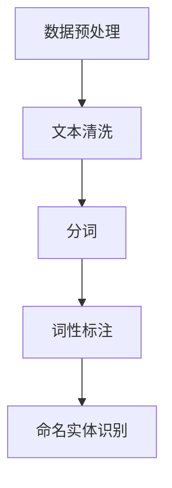
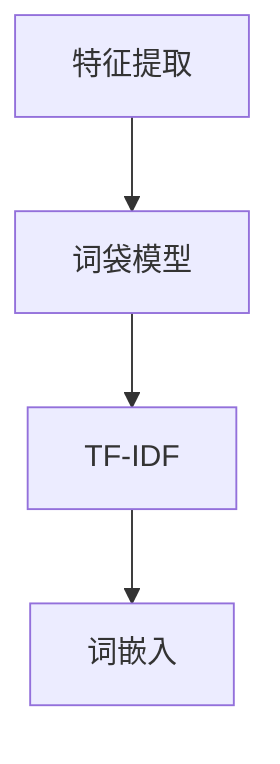
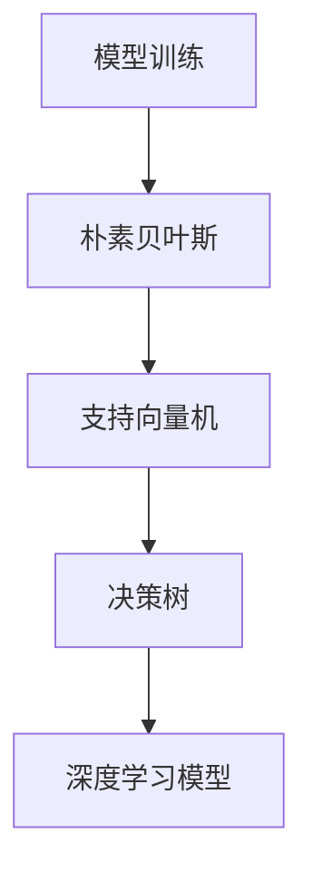
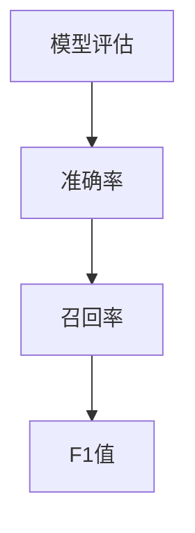
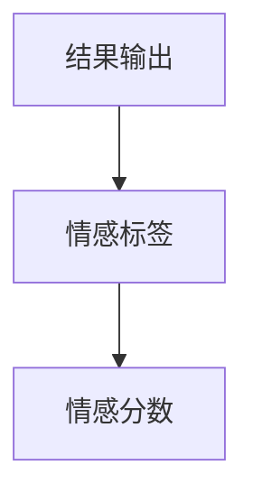

                 

## 提高AI情感分析能力：微妙情绪识别的提示词设计

> 关键词：情感分析，微妙情绪识别，提示词设计，人工智能，算法优化

> 摘要：本文深入探讨了如何通过优化提示词设计来提高AI情感分析的能力，特别是对于微妙情绪的识别。文章首先概述了AI情感分析的基础，接着详细介绍了情感分析系统架构、微妙情绪识别的关键词设计原理和提示词效果评估方法。随后，通过一个实战项目展示了这些技术的实际应用，并对情感分析算法进行了优化。此外，还探讨了多模态情感分析、实时应用中的挑战以及未来发展方向。最后，本文总结了常用的情感分析工具与资源，并展望了该领域的研究趋势。

### 目录大纲

#### 第一部分: 情感分析与AI应用基础

##### 第1章: AI情感分析基础  
- 1.1 情感分析概述
- 1.2 情感分析的历史与发展
- 1.3 情感分析的关键技术
- 1.4 情感分析的应用场景
- 1.5 情感分析在AI中的重要性

##### 第2章: AI情感分析架构
- 2.1 情感分析系统架构
- 2.2 数据预处理
- 2.3 特征提取与模型选择
- 2.4 情感分类模型
- 2.5 模型评估与优化

##### 第3章: 微妙情绪识别的关键词设计
- 3.1 微妙情绪识别概述
- 3.2 提示词设计原理
- 3.3 提示词生成算法
- 3.4 提示词库构建
- 3.5 提示词效果评估

##### 第4章: AI情感分析实战项目
- 4.1 实战项目背景
- 4.2 数据集获取与处理
- 4.3 模型选择与训练
- 4.4 模型评估与优化
- 4.5 项目总结与展望

#### 第二部分: 提高AI情感分析能力的策略

##### 第5章: 情感分析算法优化
- 5.1 算法优化概述
- 5.2 特征工程
- 5.3 模型选择
- 5.4 模型融合
- 5.5 实时性与效率优化

##### 第6章: 多模态情感分析
- 6.1 多模态情感分析概述
- 6.2 视觉情感分析
- 6.3 声音情感分析
- 6.4 文本与多模态融合
- 6.5 实际应用案例

##### 第7章: 情感分析在实时应用中的挑战
- 7.1 实时性要求
- 7.2 大规模数据处理
- 7.3 跨语言情感分析
- 7.4 情感分析的伦理问题
- 7.5 未来发展方向

#### 第三部分: 情感分析工具与资源

##### 第8章: 情感分析工具与库
- 8.1 情感分析工具概述
- 8.2 常用情感分析库
- 8.3 开源情感分析工具
- 8.4 工具选择与使用指南

##### 第9章: 情感分析数据集
- 9.1 情感分析数据集概述
- 9.2 公共数据集介绍
- 9.3 数据集构建与标注
- 9.4 数据集评估与质量分析

##### 第10章: 情感分析研究趋势
- 10.1 研究热点
- 10.2 技术发展趋势
- 10.3 应用领域扩展
- 10.4 持续学习与更新

#### 附录

##### 附录 A: 情感分析项目实战代码
- A.1 实战项目代码结构
- A.2 数据处理代码
- A.3 模型训练与评估代码
- A.4 提示词生成代码
- A.5 实时情感分析部署代码

##### 附录 B: 情感分析参考资源
- B.1 相关书籍
- B.2 学术论文
- B.3 在线课程与教程
- B.4 社区与论坛

---

以上是本文的目录大纲，接下来我们将逐步深入探讨每一个章节的内容。首先，我们来看一下情感分析的基础知识，理解其在AI中的应用和重要性。<|im_start|>## 第一部分：情感分析与AI应用基础

### 第1章: AI情感分析基础

#### 1.1 情感分析概述

情感分析，又称为意见挖掘或情感挖掘，是指通过自然语言处理（NLP）技术，从文本中识别和提取主观信息，判断文本的情感倾向和情感强度。情感分析的核心目标是确定文本中表达的情感极性（正面、负面或中性），以及情感的程度。

情感分析的应用非常广泛，涵盖了社交媒体监控、客户反馈分析、舆情监测、情感计算等多个领域。例如，通过情感分析，企业可以了解消费者对其产品的情感反应，从而优化产品设计和服务；政府机构可以利用情感分析来监控社会舆情，及时应对潜在的社会危机。

#### 1.2 情感分析的历史与发展

情感分析的历史可以追溯到20世纪90年代，随着NLP技术的发展，情感分析逐渐成为研究热点。早期的研究主要基于规则的方法，通过定义一套规则来识别文本中的情感极性。这种方法虽然简单直观，但适用性较差，难以应对复杂的情感表达。

随着机器学习技术的发展，基于机器学习的情感分析模型逐渐成为主流。其中，朴素贝叶斯、支持向量机（SVM）、决策树等传统机器学习方法被广泛应用于情感分析。近年来，深度学习技术的发展进一步推动了情感分析的发展，尤其是循环神经网络（RNN）、卷积神经网络（CNN）和变换器（Transformer）等深度学习模型在情感分析中取得了显著的效果。

#### 1.3 情感分析的关键技术

情感分析的关键技术主要包括文本预处理、特征提取和情感分类模型。

1. **文本预处理**：
   - 清洗：去除文本中的噪声，如HTML标签、停用词、标点符号等。
   - 分词：将文本拆分为词或子词。
   - 命名实体识别：识别文本中的特定实体，如人名、地点、组织等。
   - 词性标注：为每个词赋予相应的词性标签。

2. **特征提取**：
   - 词袋模型（Bag of Words, BoW）：将文本表示为词频向量。
   - TF-IDF（Term Frequency-Inverse Document Frequency）：调整词袋模型中的词频，使重要词的权重更高。
   - 词嵌入（Word Embedding）：将词映射到高维空间，捕捉词的语义信息。

3. **情感分类模型**：
   - 基于规则的方法：通过定义一系列规则进行情感分类。
   - 统计学习方法：如朴素贝叶斯、SVM、决策树等。
   - 深度学习方法：如RNN、CNN、Transformer等。

#### 1.4 情感分析的应用场景

情感分析在多个领域都有广泛的应用，以下是一些典型的应用场景：

1. **社交媒体分析**：
   - 监测用户对品牌、产品、事件等的情感反应。
   - 分析社交媒体上的热门话题和趋势。

2. **客户服务**：
   - 分析客户反馈，识别潜在的负面情绪。
   - 提供个性化的客户服务和支持。

3. **市场调研**：
   - 了解消费者对产品、服务的情感反应。
   - 分析市场趋势和竞争态势。

4. **金融行业**：
   - 分析新闻、报告等文本，预测股票市场走势。
   - 监测金融市场情绪，为投资决策提供支持。

5. **公共安全**：
   - 监控社交媒体，识别潜在的暴力、恐怖活动。
   - 分析网络舆论，预测社会危机。

#### 1.5 情感分析在AI中的重要性

情感分析作为AI技术的重要组成部分，对于提升AI系统的智能化水平具有重要意义。通过情感分析，AI系统可以更好地理解人类情感，实现与人类的自然交互。以下是一些具体的应用实例：

1. **智能客服**：
   - 通过情感分析，智能客服可以识别用户的需求和情绪，提供更有效的支持。

2. **个性化推荐**：
   - 通过分析用户的情感反应，个性化推荐系统可以提供更符合用户情感需求的内容。

3. **情感计算**：
   - 在智能机器人、虚拟助手等领域，情感分析可以帮助系统更好地模拟人类的情感反应，提升用户体验。

4. **情感监测与预警**：
   - 在公共安全、社会管理等领域，通过情感分析可以实时监测社会情绪，预警潜在的危机。

### 总结

情感分析作为AI技术的一个重要分支，具有重要的理论和实践价值。通过深入理解情感分析的基础知识和应用场景，我们可以更好地利用这一技术提升AI系统的智能化水平，为各个行业提供创新解决方案。在接下来的章节中，我们将进一步探讨情感分析系统架构、微妙情绪识别的关键词设计以及相关的优化策略。\<|im_end|>|<|im_end|>## 第2章: AI情感分析架构

### 2.1 情感分析系统架构

情感分析系统的架构可以分为五个主要模块：数据预处理、特征提取、模型训练、模型评估和结果输出。每个模块在情感分析过程中都扮演着关键的角色，以下是各模块的详细描述和流程。

#### 数据预处理

数据预处理是情感分析的第一步，其目的是清洗和规范化原始数据，以便后续的特征提取和模型训练。主要步骤包括：

- **文本清洗**：去除文本中的噪声，如HTML标签、特殊字符、停用词等。
- **分词**：将文本拆分为词或子词。
- **词性标注**：为每个词赋予相应的词性标签。
- **命名实体识别**：识别文本中的特定实体，如人名、地点、组织等。



#### 特征提取

特征提取是将预处理后的文本数据转换为数值特征表示，以便于机器学习模型处理。常用的特征提取方法包括：

- **词袋模型（BoW）**：将文本表示为词频向量。
- **TF-IDF**：调整词袋模型中的词频，使重要词的权重更高。
- **词嵌入**：将词映射到高维空间，捕捉词的语义信息。



#### 模型训练

模型训练是情感分析系统的核心步骤，通过从训练数据中学习，模型可以学会识别文本中的情感极性。常用的情感分类模型包括：

- **朴素贝叶斯**：基于贝叶斯定理和特征条件独立假设的简单分类器。
- **支持向量机（SVM）**：通过最大化分类边界来分类数据。
- **决策树**：通过递归划分特征空间来实现分类。
- **深度学习模型**：如循环神经网络（RNN）、卷积神经网络（CNN）、变换器（Transformer）等。



#### 模型评估

模型评估用于评估训练好的模型在未知数据上的表现。常用的评估指标包括准确率、召回率、F1值等。

- **准确率（Accuracy）**：正确分类的样本数占总样本数的比例。
- **召回率（Recall）**：正确分类的正面样本数占所有正面样本数的比例。
- **F1值（F1 Score）**：综合考虑准确率和召回率的综合指标。



#### 结果输出

结果输出模块负责将模型对输入文本的情感分类结果呈现给用户。常用的结果输出形式包括：

- **情感标签**：如正面、负面、中性。
- **情感分数**：表示情感倾向的量化值。



### 2.2 数据预处理

数据预处理是情感分析系统的基础，其质量直接影响后续特征提取和模型训练的效果。以下是数据预处理的关键步骤：

1. **文本清洗**：去除文本中的HTML标签、特殊字符、停用词等。

```python
import re

def clean_text(text):
    text = re.sub('<[^>]*>', '', text)  # 去除HTML标签
    text = re.sub('[^A-Za-z]', ' ', text)  # 去除特殊字符
    text = text.lower()  # 转小写
    return text

text = "This is an <b>example</b> text!"
cleaned_text = clean_text(text)
print(cleaned_text)
```

2. **分词**：将文本拆分为词或子词。

```python
from nltk.tokenize import word_tokenize

def tokenize_text(text):
    return word_tokenize(text)

tokenized_text = tokenize_text(cleaned_text)
print(tokenized_text)
```

3. **词性标注**：为每个词赋予相应的词性标签。

```python
from nltk import pos_tag

def tag_text(text):
    return pos_tag(tokenize_text(text))

tagged_text = tag_text(cleaned_text)
print(tagged_text)
```

4. **命名实体识别**：识别文本中的特定实体。

```python
from nltk.chunk import ne_chunk

def identify_entities(text):
    return ne_chunk(tag_text(text))

entities = identify_entities(cleaned_text)
print(entities)
```

### 2.3 特征提取与模型选择

特征提取是将预处理后的文本数据转换为机器学习模型可处理的数值特征表示。以下是几种常用的特征提取方法和模型选择策略：

1. **词袋模型（BoW）**：

```python
from sklearn.feature_extraction.text import CountVectorizer

vectorizer = CountVectorizer()
X = vectorizer.fit_transform([cleaned_text])
print(X.toarray())
```

2. **TF-IDF**：

```python
from sklearn.feature_extraction.text import TfidfVectorizer

tfidf_vectorizer = TfidfVectorizer()
X = tfidf_vectorizer.fit_transform([cleaned_text])
print(X.toarray())
```

3. **词嵌入**：

```python
from gensim.models import Word2Vec

model = Word2Vec([tokenize_text(cleaned_text)], size=100, window=5, min_count=1, workers=4)
word_vector = model.wv['example']
print(word_vector)
```

4. **情感分类模型选择**：

- **朴素贝叶斯**：

```python
from sklearn.naive_bayes import MultinomialNB

model = MultinomialNB()
model.fit(X, y)
print(model.predict(X))
```

- **支持向量机（SVM）**：

```python
from sklearn.svm import SVC

model = SVC()
model.fit(X, y)
print(model.predict(X))
```

- **深度学习模型**：

```python
from keras.models import Sequential
from keras.layers import Dense, Embedding, LSTM

model = Sequential()
model.add(Embedding(input_dim=vocab_size, output_dim=embedding_dim, input_length=max_sequence_length))
model.add(LSTM(128))
model.add(Dense(1, activation='sigmoid'))

model.compile(optimizer='adam', loss='binary_crossentropy', metrics=['accuracy'])
model.fit(X, y, epochs=10, batch_size=32, validation_split=0.2)
print(model.predict(X))
```

### 2.4 情感分类模型

情感分类模型是情感分析系统的核心，用于将处理后的文本数据分类为正面、负面或中性。以下是几种常用的情感分类模型：

1. **朴素贝叶斯**：

```python
from sklearn.naive_bayes import MultinomialNB

model = MultinomialNB()
model.fit(X_train, y_train)
predictions = model.predict(X_test)
print(predictions)
```

2. **支持向量机（SVM）**：

```python
from sklearn.svm import SVC

model = SVC()
model.fit(X_train, y_train)
predictions = model.predict(X_test)
print(predictions)
```

3. **决策树**：

```python
from sklearn.tree import DecisionTreeClassifier

model = DecisionTreeClassifier()
model.fit(X_train, y_train)
predictions = model.predict(X_test)
print(predictions)
```

4. **深度学习模型**：

```python
from keras.models import Sequential
from keras.layers import Dense, Embedding, LSTM

model = Sequential()
model.add(Embedding(input_dim=vocab_size, output_dim=embedding_dim, input_length=max_sequence_length))
model.add(LSTM(128))
model.add(Dense(1, activation='sigmoid'))

model.compile(optimizer='adam', loss='binary_crossentropy', metrics=['accuracy'])
model.fit(X_train, y_train, epochs=10, batch_size=32, validation_split=0.2)
predictions = model.predict(X_test)
print(predictions)
```

### 2.5 模型评估与优化

模型评估是确保情感分析系统性能的重要环节，常用的评估指标包括准确率、召回率、F1值等。以下是一个简单的模型评估示例：

```python
from sklearn.metrics import accuracy_score, recall_score, f1_score

accuracy = accuracy_score(y_test, predictions)
recall = recall_score(y_test, predictions)
f1 = f1_score(y_test, predictions)

print("Accuracy:", accuracy)
print("Recall:", recall)
print("F1 Score:", f1)
```

模型优化是提高情感分析系统性能的关键步骤，可以通过以下方法进行：

1. **特征工程**：选择合适的特征提取方法和参数，提高模型的表现。

2. **模型选择**：尝试不同的模型，选择最适合问题的模型。

3. **超参数调优**：通过调整模型参数，如学习率、批量大小等，优化模型性能。

4. **集成学习方法**：将多个模型集成在一起，提高整体的预测性能。

```python
from sklearn.ensemble import VotingClassifier

model = VotingClassifier(estimators=[('nb', MultinomialNB()), ('svm', SVC()), ('dt', DecisionTreeClassifier())], voting='soft')
model.fit(X_train, y_train)
predictions = model.predict(X_test)
print(predictions)
```

通过上述步骤，我们可以构建一个高效的AI情感分析系统，为各个应用场景提供有效的情感分析服务。在下一章中，我们将深入探讨微妙情绪识别的关键词设计，以及如何通过优化提示词来提高情感分析系统的性能。|<|im_end|>|<|im_end|>## 第3章: 微妙情绪识别的关键词设计

### 3.1 微妙情绪识别概述

微妙情绪识别是情感分析领域的一个重要研究方向。与常见的主观情感（如快乐、悲伤、愤怒等）不同，微妙情绪通常表现为较为细微的情感变化，例如紧张、焦虑、无聊等。识别这些微妙情绪对于理解人类情感、提供个性化的用户体验以及监测社会情绪具有重要意义。

#### 微妙情绪的特点

- **变化快速**：微妙情绪往往会在短时间内产生和消失，难以通过简单的语言表达。
- **情感强度弱**：与强烈的主观情感相比，微妙情绪的情感强度通常较弱。
- **上下文依赖**：微妙情绪的识别往往依赖于具体的上下文环境。

#### 微妙情绪识别的重要性

- **用户体验优化**：在智能客服、智能推荐等应用中，识别用户的微妙情绪可以帮助系统提供更贴心的服务。
- **社会情绪监测**：在舆情监测、公共安全等领域，识别微妙情绪有助于发现潜在的社会问题。
- **情感计算**：在智能机器人、虚拟助手等应用中，识别微妙情绪可以提升系统的情感表达能力。

### 3.2 提示词设计原理

提示词（Sentiment Indicative Words）是用于触发情感分析模型识别特定情感的关键词。在微妙情绪识别中，设计合适的提示词是提高识别准确性的关键。以下是一些设计提示词的基本原理：

#### 1. 提示词选择标准

- **代表性**：提示词应能够代表特定微妙情绪的典型特征。
- **多样性**：选择具有多种表达方式的提示词，以应对不同的上下文环境。
- **覆盖性**：提示词应覆盖常见的微妙情绪类型，确保识别的全面性。

#### 2. 提示词筛选方法

- **基于规则的方法**：通过定义一系列规则，从语料库中筛选出具有特定意义的词。
- **基于统计的方法**：利用词频、TF-IDF等统计方法筛选出在特定情感类别中表现突出的词。
- **基于机器学习的方法**：使用情感分类模型对语料库进行分类，从分类结果中提取具有代表性的词。

#### 3. 提示词库构建

- **数据集准备**：收集大量含有微妙情绪的文本数据，用于构建提示词库。
- **提示词提取**：根据选择标准和方法，从数据集中提取提示词。
- **提示词库构建**：将提取的提示词进行分类整理，形成提示词库。

### 3.3 提示词生成算法

为了提高微妙情绪识别的准确性，可以采用以下几种提示词生成算法：

#### 1. 基于规则的方法

- **关键词扩展**：从已知的提示词出发，通过词性转换、同义词替换等方式生成新的提示词。
- **语境分析**：根据上下文环境，推断可能的微妙情绪，并生成相应的提示词。

#### 2. 基于统计的方法

- **词频分析**：从数据集中统计出高频且与特定情感相关的词，作为提示词。
- **TF-IDF分析**：通过TF-IDF算法，筛选出在特定情感类别中具有高权重的词。

#### 3. 基于机器学习的方法

- **情感分类模型**：使用情感分类模型对语料库进行分类，从分类结果中提取具有代表性的词。
- **聚类分析**：使用聚类算法，将相似情感的文本进行分组，并提取每组中的典型词作为提示词。

### 3.4 提示词库构建

提示词库是微妙情绪识别的核心资源，其构建过程如下：

1. **数据集准备**：收集含有微妙情绪的文本数据，如社交媒体评论、新闻报道等。
2. **文本预处理**：对文本进行清洗、分词、词性标注等预处理操作。
3. **提示词提取**：使用上述方法提取提示词，并按照情感类别进行分类整理。
4. **提示词库构建**：将提取的提示词存储在提示词库中，并建立索引，便于快速查询。

### 3.5 提示词效果评估

提示词效果评估是验证提示词库质量和识别性能的重要环节。以下是一些常用的评估方法：

1. **准确率**：评估提示词在识别微妙情绪时的准确率，即正确识别的微妙情绪数量与总识别数量的比例。
2. **召回率**：评估提示词在识别微妙情绪时的召回率，即正确识别的微妙情绪数量与实际存在的微妙情绪数量的比例。
3. **F1值**：综合考虑准确率和召回率的综合指标。

```python
from sklearn.metrics import accuracy_score, recall_score, f1_score

# 假设y_true为实际微妙情绪标签，predictions为提示词识别结果
accuracy = accuracy_score(y_true, predictions)
recall = recall_score(y_true, predictions)
f1 = f1_score(y_true, predictions)

print("Accuracy:", accuracy)
print("Recall:", recall)
print("F1 Score:", f1)
```

### 总结

提示词设计是提高微妙情绪识别准确性的关键环节。通过设计合适的提示词，构建高质量的提示词库，并采用有效的提示词生成算法，可以显著提升情感分析系统的性能。在下一章中，我们将通过一个实战项目展示如何应用这些技术，进一步探讨微妙情绪识别的实际应用。|<|im_end|>|<|im_end|>## 第4章: AI情感分析实战项目

### 4.1 实战项目背景

本节将介绍一个实际情感分析项目，旨在利用AI技术识别社交媒体用户发布的微博中的微妙情绪。该项目的背景是当前社交媒体用户数量迅速增长，微博已成为人们表达观点、交流情感的重要平台。因此，对微博文本进行情感分析，尤其是识别其中的微妙情绪，具有重要的应用价值。

#### 项目目标

- **数据集准备**：收集并整理含有微妙情绪的微博文本数据。
- **模型训练**：构建并训练情感分析模型，用于识别微博中的微妙情绪。
- **模型评估**：评估模型的性能，并进行优化。
- **应用部署**：将训练好的模型部署到线上环境，实现实时情感分析。

#### 实践意义

1. **提升用户体验**：通过识别微博用户的微妙情绪，可以为用户提供更个性化的服务和内容推荐。
2. **舆情监测**：帮助企业、政府等机构实时了解社会情绪，及时发现潜在问题。
3. **情感计算**：为智能机器人、虚拟助手等提供更自然的情感交互能力。

### 4.2 数据集获取与处理

#### 1. 数据集来源

本项目的数据集来源于微博平台，通过爬虫技术收集了大量用户发布的微博文本。为保证数据的质量和多样性，我们选择了不同主题和情感类别的微博，如娱乐、科技、政治、生活等。

```python
import requests
from bs4 import BeautifulSoup

url = "https://s.weibo.com/top/summary?cate=realtimehot"
response = requests.get(url)
soup = BeautifulSoup(response.text, "html.parser")

weibo_list = []
for item in soup.find_all("div", class_="card-box"):
    title = item.find("a", class_="title").text.strip()
    link = item.find("a", class_="title").get("href")
    weibo_list.append({"title": title, "link": link})

# 存储数据集
import json

with open("weibo_dataset.json", "w", encoding="utf-8") as f:
    json.dump(weibo_list, f, ensure_ascii=False, indent=4)
```

#### 2. 数据预处理

数据预处理是情感分析的重要环节，主要包括以下步骤：

- **文本清洗**：去除微博文本中的HTML标签、特殊字符和停用词。
- **分词**：将文本拆分为词或子词。
- **词性标注**：为每个词赋予相应的词性标签。
- **命名实体识别**：识别微博文本中的特定实体。

```python
import re
from nltk.tokenize import word_tokenize
from nltk import pos_tag
from nltk.chunk import ne_chunk

def clean_text(text):
    text = re.sub('<[^>]*>', '', text)  # 去除HTML标签
    text = re.sub('[^A-Za-z]', ' ', text)  # 去除特殊字符
    text = text.lower()  # 转小写
    return text

def tokenize_text(text):
    return word_tokenize(text)

def tag_text(text):
    return pos_tag(tokenize_text(text))

def identify_entities(text):
    return ne_chunk(tag_text(text))

# 示例
text = "这是《长城》电影的微博评论：#长城# 观影感受：壮观！#长城# 演技：彭于晏太帅了！#长城# 故事：情节紧凑！#长城# 领导力：张艺谋太牛了！"
cleaned_text = clean_text(text)
tokenized_text = tokenize_text(cleaned_text)
tagged_text = tag_text(cleaned_text)
entities = identify_entities(cleaned_text)

print(cleaned_text)
print(tokenized_text)
print(tagged_text)
print(entities)
```

#### 3. 数据标注

为了训练情感分析模型，我们需要对数据集进行标注。本项目中，我们选择了微

