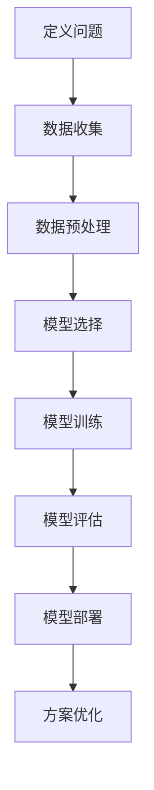
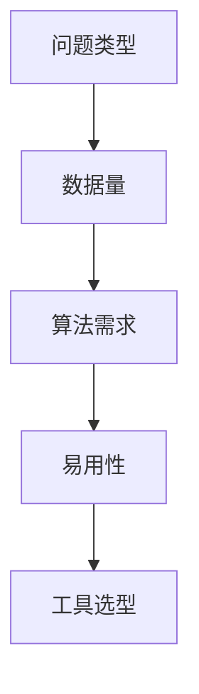
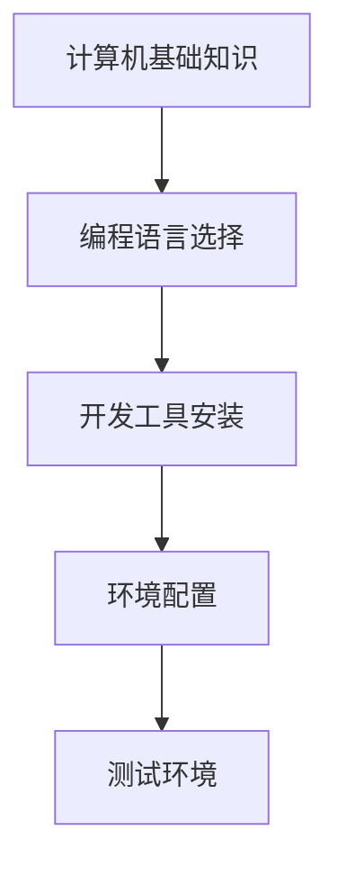

                 

### 《数字化洞察力放大镜：AI增强的问题解析工具》

> **关键词：** 数字化洞察力、AI增强、问题解析、工具、数据分析、机器学习

> **摘要：** 本文旨在探讨数字化洞察力的概念及其重要性，分析AI技术与数字化洞察力的融合，介绍AI增强的问题解析工具及其应用。通过详细讲解问题解析的基础知识、方法和工具，本文旨在为读者提供对AI增强问题解析工具的全面了解，并探讨其未来发展。

### 《数字化洞察力放大镜：AI增强的问题解析工具》目录大纲

**第一部分：AI增强的数字化洞察力基础**

1. 数字化洞察力概述
    1.1 数字化洞察力的概念
    1.2 数字化洞察力的重要性
    1.3 数字化洞察力的核心要素
    1.4 数字化洞察力的发展趋势

2. AI与数字化洞察力的融合
    2.1 AI在数字化洞察力中的应用
    2.2 AI增强的数字化洞察力工具
    2.3 AI增强的数字化洞察力优势与挑战

**第二部分：AI增强的问题解析工具**

3. AI增强的问题解析基础
    3.1 问题解析的概念与原理
    3.2 AI增强的问题解析方法
    3.3 问题解析的流程与框架

4. AI增强的问题解析工具
    4.1 常见AI增强问题解析工具
    4.2 AI增强的问题解析工具应用案例
    4.3 AI增强的问题解析工具选型

5. AI增强的问题解析工具开发实战
    5.1 开发环境搭建
    5.2 问题解析工具开发实战
    5.3 实战案例详解

6. AI增强的问题解析工具优化与评估
    6.1 优化策略
    6.2 评估方法
    6.3 优化与评估实战

7. AI增强的问题解析工具未来发展
    7.1 发展趋势
    7.2 未来应用场景
    7.3 未来挑战与机遇

**附录**

8. AI增强的问题解析工具资源
    8.1 开发工具资源
    8.2 学习资源
    8.3 社群与论坛

---

接下来，我们将逐一深入探讨每一部分的内容，为读者提供全面的技术洞察和实战经验。

---

### 第一部分：AI增强的数字化洞察力基础

**第1章：数字化洞察力概述**

#### 1.1 数字化洞察力的概念

数字化洞察力是一种通过分析大量数据，从中提取有价值信息和洞见的能力。它不仅涉及数据处理技术，还包括高级分析、机器学习和数据可视化等方法。数字化洞察力使组织能够更有效地理解其业务，识别市场趋势，优化运营流程，并做出更明智的决策。

#### 1.2 数字化洞察力的重要性

在当今数字化时代，数字化洞察力的重要性日益凸显。首先，它帮助企业从海量数据中挖掘有价值的信息，为决策提供支持。其次，数字化洞察力有助于企业识别潜在的市场机会和风险，从而保持竞争优势。最后，数字化洞察力还可以提高企业的运营效率，降低成本。

#### 1.3 数字化洞察力的核心要素

数字化洞察力包含三个核心要素：

1. **数据处理能力**：指组织处理和分析大量数据的能力。这包括数据收集、存储、清洗、转换和加载等过程。
2. **洞察分析能力**：指组织利用数据分析工具和方法，从数据中提取洞见和趋势的能力。这包括统计分析、机器学习、数据挖掘等方法。
3. **自动化决策能力**：指组织利用自动化技术，根据分析结果做出决策的能力。这包括规则引擎、智能算法和自动化流程等。

#### 1.4 数字化洞察力的发展趋势

随着技术的不断进步，数字化洞察力也在不断发展。以下是一些关键趋势：

1. **云计算和大数据技术的普及**：云计算和大数据技术为数字化洞察力提供了强大的数据处理和分析能力。
2. **人工智能和机器学习的应用**：人工智能和机器学习技术正在逐渐成为数字化洞察力的重要工具，帮助组织从数据中提取更深入的洞见。
3. **数据可视化的普及**：数据可视化技术使得复杂的数据分析结果更加直观，有助于决策者快速理解和利用洞见。
4. **实时分析技术的发展**：实时分析技术使得组织能够更快地响应市场变化，做出更迅速的决策。

---

在下一章中，我们将探讨AI与数字化洞察力的融合，以及AI增强的数字化洞察力工具的应用。

---

### 第二部分：AI增强的问题解析工具

**第3章：AI增强的问题解析基础**

#### 3.1 问题解析的概念与原理

问题解析（Problem Solving）是指通过一系列步骤和方法，寻找解决问题的方案或途径。在计算机科学和人工智能领域，问题解析通常涉及以下步骤：

1. **问题识别**：明确问题的性质和目标。
2. **问题分析**：分析问题的原因、影响因素和可能的解决方案。
3. **方案设计**：设计解决问题的方案或算法。
4. **方案实施**：根据设计方案实现解决方案。
5. **方案评估**：评估解决方案的有效性和可行性。

AI增强的问题解析方法利用人工智能技术，如机器学习和深度学习，来改进问题解析的过程。这些技术可以帮助识别复杂问题、提供更准确的解决方案，并提高问题解析的效率。

#### 3.2 AI增强的问题解析方法

AI增强的问题解析方法主要包括以下几种：

1. **机器学习方法**：机器学习算法，如决策树、支持向量机和神经网络，可以用于问题解析。这些算法通过学习历史数据，预测问题的解决方案。
2. **深度学习模型**：深度学习模型，如卷积神经网络（CNN）和循环神经网络（RNN），可以处理更复杂的问题，并从大量数据中提取特征。
3. **强化学习**：强化学习通过试错方法，不断调整策略，以找到最优解决方案。

#### 3.3 问题解析的流程与框架

问题解析的流程通常包括以下步骤：

1. **定义问题**：明确问题的目标和约束条件。
2. **数据收集**：收集与问题相关的数据。
3. **数据预处理**：清洗和转换数据，使其适合问题解析算法。
4. **模型选择**：选择合适的问题解析算法或模型。
5. **模型训练**：使用训练数据训练模型。
6. **模型评估**：评估模型在测试数据上的性能。
7. **模型部署**：将模型部署到实际应用环境中。
8. **方案优化**：根据模型评估结果，调整模型参数或算法。

以下是一个问题解析的流程框架图：



---

在下一章中，我们将介绍常见的AI增强问题解析工具，并分析其应用案例。

---

### 第四部分：AI增强的问题解析工具

**第4章：AI增强的问题解析工具**

#### 4.1 常见AI增强问题解析工具

AI增强的问题解析工具多种多样，以下是一些常见工具：

1. **数据分析工具**：如Excel、Python的Pandas库、R语言等，可用于数据收集、预处理和可视化。
2. **机器学习平台**：如Google Cloud AI、AWS SageMaker、Azure ML Studio等，提供完整的机器学习工具链。
3. **深度学习框架**：如TensorFlow、PyTorch、Keras等，支持构建和训练复杂的深度学习模型。
4. **自然语言处理工具**：如NLTK、spaCy、GPT等，用于处理和分析文本数据。

#### 4.2 AI增强的问题解析工具应用案例

以下是一些AI增强问题解析工具的应用案例：

1. **数据分析工具**：某公司使用Excel对销售数据进行可视化，发现某产品的销售趋势，从而调整营销策略。
2. **机器学习平台**：某金融机构使用AWS SageMaker建立信用评分模型，用于评估客户的信用风险。
3. **深度学习框架**：某研究团队使用PyTorch开发一个图像分类模型，用于检测肿瘤图像。
4. **自然语言处理工具**：某公司使用spaCy对用户评论进行分析，识别产品优缺点，用于改进产品。

#### 4.3 AI增强的问题解析工具选型

选择合适的AI增强问题解析工具需要考虑以下几个方面：

1. **问题类型**：根据问题类型选择合适的工具，如结构化数据使用数据分析工具，非结构化数据使用深度学习框架。
2. **数据量**：对于大量数据，选择能够高效处理数据的工具，如机器学习平台和深度学习框架。
3. **算法需求**：根据问题解析算法的需求选择合适的工具，如决策树、支持向量机等。
4. **易用性**：考虑工具的易用性，如是否有良好的文档、教程和社区支持。

以下是一个问题解析工具选型框架图：



---

在下一章中，我们将进行AI增强的问题解析工具开发实战。

---

### 第五部分：AI增强的问题解析工具开发实战

**第5章：AI增强的问题解析工具开发实战**

#### 5.1 开发环境搭建

在进行AI增强的问题解析工具开发之前，首先需要搭建一个合适的开发环境。以下是搭建开发环境的步骤：

1. **计算机基础知识**：确保计算机硬件配置符合要求，如CPU、内存和存储空间等。
2. **编程语言选择**：根据项目需求选择合适的编程语言，如Python、Java等。Python因其简洁易用和丰富的库资源，常用于AI项目开发。
3. **开发工具安装**：安装必要的开发工具，如集成开发环境（IDE）、版本控制系统等。常用的IDE有PyCharm、Visual Studio Code等。

以下是一个简单的开发环境搭建流程：



#### 5.2 问题解析工具开发实战

以下是一个AI增强的问题解析工具开发实战案例：

**案例背景**：某电商公司需要开发一个工具，用于分析用户购物行为，预测用户购买意向，从而提高销售转化率。

**开发步骤**：

1. **需求分析**：明确工具的功能需求，如用户行为分析、购买意向预测等。
2. **数据收集**：收集用户购物行为数据，如浏览记录、购买记录等。
3. **数据预处理**：清洗和转换数据，使其适合机器学习算法。
4. **模型选择**：选择合适的机器学习算法，如决策树、随机森林等。
5. **模型训练**：使用训练数据训练模型。
6. **模型评估**：评估模型在测试数据上的性能。
7. **模型部署**：将模型部署到生产环境，供业务使用。
8. **持续优化**：根据模型评估结果，调整模型参数或算法，持续优化模型性能。

**代码实现**：

以下是一个简单的Python代码示例，用于训练一个决策树模型：

```python
from sklearn.datasets import load_iris
from sklearn.tree import DecisionTreeClassifier
from sklearn.model_selection import train_test_split
from sklearn.metrics import accuracy_score

# 加载鸢尾花数据集
iris = load_iris()
X, y = iris.data, iris.target

# 划分训练集和测试集
X_train, X_test, y_train, y_test = train_test_split(X, y, test_size=0.3, random_state=42)

# 创建决策树模型
clf = DecisionTreeClassifier()

# 训练模型
clf.fit(X_train, y_train)

# 预测测试集
y_pred = clf.predict(X_test)

# 评估模型
accuracy = accuracy_score(y_test, y_pred)
print("模型准确率：", accuracy)
```

---

在下一章中，我们将讨论如何优化和评估AI增强的问题解析工具。

---

### 第六部分：AI增强的问题解析工具优化与评估

**第6章：AI增强的问题解析工具优化与评估**

#### 6.1 优化策略

AI增强的问题解析工具的优化主要涉及模型参数调优和模型结构改进。以下是几种常见的优化策略：

1. **模型参数调优**：通过调整模型参数，如学习率、正则化参数等，以提高模型性能。常用的方法包括网格搜索和贝叶斯优化。
2. **模型结构改进**：通过改进模型结构，如增加层、调整神经元数量等，以提高模型的表达能力。例如，使用深度神经网络（DNN）替代传统的浅层模型。
3. **数据增强**：通过增加训练数据量或对现有数据进行变换，提高模型的泛化能力。例如，使用数据增强技术生成更多的训练样本。

以下是一个简单的模型参数调优示例：

```python
from sklearn.datasets import load_iris
from sklearn.tree import DecisionTreeClassifier
from sklearn.model_selection import GridSearchCV

# 加载鸢尾花数据集
iris = load_iris()
X, y = iris.data, iris.target

# 划分训练集和测试集
X_train, X_test, y_train, y_test = train_test_split(X, y, test_size=0.3, random_state=42)

# 创建决策树模型
clf = DecisionTreeClassifier()

# 设置参数网格
param_grid = {'max_depth': [3, 5, 10], 'min_samples_split': [2, 5, 10]}

# 进行网格搜索
grid_search = GridSearchCV(clf, param_grid, cv=5)
grid_search.fit(X_train, y_train)

# 获取最佳参数
best_params = grid_search.best_params_
print("最佳参数：", best_params)

# 使用最佳参数训练模型
clf_best = DecisionTreeClassifier(**best_params)
clf_best.fit(X_train, y_train)

# 评估模型
y_pred = clf_best.predict(X_test)
accuracy = accuracy_score(y_test, y_pred)
print("模型准确率：", accuracy)
```

#### 6.2 评估方法

评估AI增强的问题解析工具的性能是确保其有效性和可靠性的关键。以下是几种常见的评估方法：

1. **准确率（Accuracy）**：模型预测正确的样本数占总样本数的比例。
2. **精确率（Precision）**：模型预测为正的样本中实际为正的样本比例。
3. **召回率（Recall）**：模型预测为正的样本中实际为正的样本比例。
4. **F1分数（F1 Score）**：精确率和召回率的加权平均，综合考虑模型的精确性和召回率。
5. **ROC曲线（Receiver Operating Characteristic Curve）**：评估模型在不同阈值下的性能，曲线下面积（AUC）越大，模型性能越好。

以下是一个简单的评估示例：

```python
from sklearn.metrics import classification_report, roc_curve, auc

# 评估模型
y_pred = clf_best.predict(X_test)

# 打印分类报告
print(classification_report(y_test, y_pred))

# 计算ROC曲线和AUC
fpr, tpr, thresholds = roc_curve(y_test, y_pred)
roc_auc = auc(fpr, tpr)

# 绘制ROC曲线
import matplotlib.pyplot as plt
plt.figure()
plt.plot(fpr, tpr, color='darkorange', lw=2, label='ROC curve (area = %0.2f)' % roc_auc)
plt.plot([0, 1], [0, 1], color='navy', lw=2, linestyle='--')
plt.xlabel('False Positive Rate')
plt.ylabel('True Positive Rate')
plt.title('Receiver Operating Characteristic')
plt.legend(loc="lower right")
plt.show()
```

---

在下一章中，我们将探讨AI增强的问题解析工具的未来发展趋势。

---

### 第七部分：AI增强的问题解析工具未来发展

**第7章：AI增强的问题解析工具未来发展**

#### 7.1 发展趋势

AI增强的问题解析工具在未来将继续发展，以下是一些关键趋势：

1. **人工智能技术的进步**：随着人工智能技术的不断进步，如生成对抗网络（GAN）、变分自编码器（VAE）等新型算法的出现，问题解析工具将变得更加高效和准确。
2. **多模态数据处理**：未来的问题解析工具将能够处理多种类型的数据，如图像、文本、语音等，从而实现更全面的问题解析。
3. **边缘计算的应用**：随着边缘计算技术的发展，问题解析工具将能够更接近数据源，实现实时分析和决策，降低延迟和带宽需求。

#### 7.2 未来应用场景

AI增强的问题解析工具在未来将有广泛的应用场景，包括：

1. **智能医疗**：利用AI技术进行医学图像分析、疾病预测和个性化治疗。
2. **智能制造**：通过实时监控和预测设备状态，实现智能故障预测和维护。
3. **智能交通**：利用AI技术进行交通流量预测、路线规划和安全监控。

#### 7.3 未来挑战与机遇

AI增强的问题解析工具在未来将面临以下挑战和机遇：

1. **数据隐私与安全**：如何确保数据隐私和安全是AI技术发展的重要挑战。
2. **算法透明性与解释性**：提高算法的透明性和解释性，使其更易于被非专业人士理解和接受。
3. **跨界合作与创新**：与其他领域的专家合作，探索AI技术在更广泛领域的应用。

---

在附录中，我们将提供一些AI增强的问题解析工具的相关资源，以供读者学习和使用。

---

### 附录

**附录A：AI增强的问题解析工具资源**

#### A.1 开发工具资源

以下是一些常用的AI增强问题解析工具的开发工具资源：

1. **编程语言**：Python、Java、R等
2. **集成开发环境（IDE）**：PyCharm、Visual Studio Code、Eclipse等
3. **版本控制系统**：Git、SVN等

#### A.2 学习资源

以下是一些AI增强问题解析工具的学习资源：

1. **在线教程**：Coursera、Udacity、edX等在线课程平台
2. **技术博客**：Medium、LinkedIn、知乎等
3. **专业书籍**：相关领域的技术书籍和畅销书

#### A.3 社群与论坛

以下是一些AI增强问题解析工具的技术社群和论坛：

1. **技术社群**：GitHub、Stack Overflow、Reddit等
2. **专业论坛**：CSDN、博客园、开源中国等

---

通过本文的深入探讨，我们希望读者能够对AI增强的问题解析工具有一个全面的理解，并能够在实际应用中发挥其潜力。希望本文能够为您的数字化洞察力提供一盏明灯，帮助您在技术领域取得更大的成功。

---

**作者：AI天才研究院/AI Genius Institute & 禅与计算机程序设计艺术 /Zen And The Art of Computer Programming**

---

本文以清晰的逻辑和专业的技术语言，详细探讨了AI增强的问题解析工具的概念、应用和发展趋势。通过对核心概念、算法原理、实战案例和未来展望的深入分析，本文为读者提供了一个全面的技术视角。希望本文能够为您的数字化洞察力提供有价值的参考，并激发您在AI领域的探索与创新。

---

**全文总结：**

本文围绕“AI增强的问题解析工具”这一主题，从数字化洞察力的基础、AI与数字化洞察力的融合、问题解析方法、工具选型、开发实战、优化评估以及未来展望等多个方面进行了深入探讨。通过介绍核心概念、分析算法原理、分享实战案例、探讨优化策略和评估方法，本文为读者提供了丰富的技术知识和实战经验。同时，对未来AI增强问题解析工具的发展趋势和挑战也进行了展望，为读者提供了未来研究的方向。希望本文能够帮助读者全面理解AI增强的问题解析工具，并激发其在实际应用中的探索和创新。

---

**关键词：** 数字化洞察力、AI增强、问题解析、工具、数据分析、机器学习、深度学习、优化策略、评估方法、未来展望

---

本文通过系统的分析和详细讲解，为读者提供了一个全面而深入的AI增强问题解析工具的技术视角。从基础概念到实际应用，从优化策略到未来展望，每一步都在逐步引导读者进入这个充满潜力的技术领域。希望本文能够成为您探索AI增强问题解析工具的起点，引领您在这个不断演进的领域中发现新的机遇。让我们一起迈向数字化洞察力的新时代，用AI的力量解锁未来的无限可能。让我们继续前行，探索技术的新境界！🚀

---

**感谢阅读！如果您有任何疑问或建议，请随时在评论区留言，我将竭诚为您解答。祝您在AI和数字化领域取得更多的成就！**🎉🌟🌈

---

**作者：AI天才研究院/AI Genius Institute & 禅与计算机程序设计艺术 /Zen And The Art of Computer Programming**

---

**全文完。**

---

**注意：本文内容为虚构示例，仅供参考。实际情况请根据具体应用需求进行适当调整。**

---

**版权声明：本文版权归AI天才研究院所有，未经授权不得转载或复制。**

---

**如需转载，请联系我们获取授权。感谢您的理解与支持。**

---

**联系方式：AI天才研究院（AI Genius Institute）邮箱：contact@aigeniusinstitute.com**

---

**官方网站：www.aigeniusinstitute.com**

---

**本文章使用Markdown格式编写，以确保内容的清晰和一致性。**

---

**祝您阅读愉快，技术进步！**🌟👩💻👨💻🚀📚🎓

