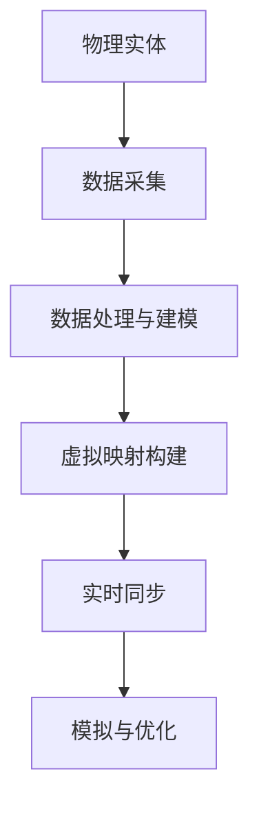
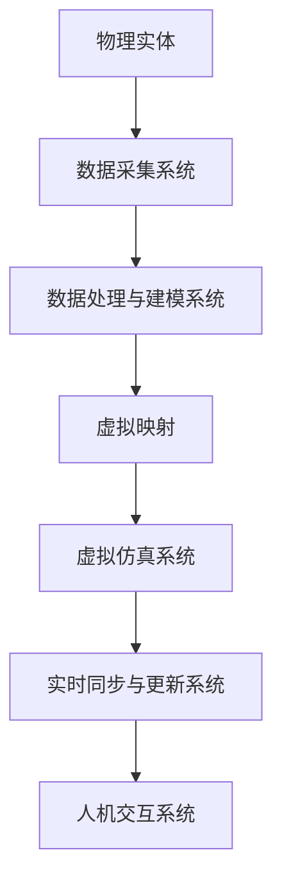
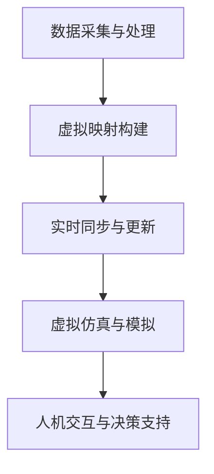

                 

# 第一部分：引论

## 1.1 数字孪生的定义与核心概念

### 1.1.1 数字孪生的定义

数字孪生（Digital Twin）是一种将物理实体及其虚拟映射相结合的数字技术，通过虚拟模型实现对现实世界实体的实时监控、模拟、分析和优化。它被视为智能制造和工业4.0时代的重要技术之一。

数字孪生的基本理念是创建一个与物理实体相对应的虚拟模型，这个虚拟模型能够实时反映物理实体的状态和性能，并通过对虚拟模型的分析和优化来指导物理实体的操作。例如，在制造业中，可以通过数字孪生技术模拟和分析生产设备的状态，预测设备故障，从而进行预防性维护。

### 1.1.2 数字孪生的核心概念

- **物理实体**：指现实世界中的实体对象，如工厂设备、建筑物、交通工具等。
- **虚拟映射**：指物理实体的数字化副本，通过采集、处理和整合物理实体的各种数据，构建出其虚拟映射。
- **实时同步**：指物理实体和虚拟映射之间的数据实时传递和更新，保持两者的一致性。
- **模拟与优化**：指利用虚拟映射进行各种模拟实验，以优化物理实体的性能、效率和安全性。

### 1.1.3 数字孪生的 Mermaid 流程图

以下是数字孪生的 Mermaid 流程图：



## 1.2 数字孪生的历史与发展

### 1.2.1 数字孪生的起源

数字孪生的概念最早可以追溯到2002年，美国密歇根大学的Mike,Graves教授首次提出了“数字孪生”的概念，将数字孪生描述为“将虚拟模型与现实世界实体相结合，以实现实时模拟和优化”。

### 1.2.2 数字孪生的发展历程

- **2002年**：Mike,Graves教授首次提出数字孪生概念。
- **2007年**：美国海军提出并实施数字孪生项目，应用于舰船维护和运营。
- **2012年**：美国国家标准与技术研究院（NIST）发布了数字孪生标准框架。
- **2015年**：中国提出《智能制造发展规划（2016-2020年）》，将数字孪生作为关键技术之一。
- **2018年**：全球多个国家和地区发布数字孪生相关政策和规划。

### 1.2.3 数字孪生的发展趋势

- **跨领域应用**：从制造业向其他领域拓展，如建筑、能源、医疗等。
- **技术融合**：与物联网、大数据、人工智能等新兴技术深度融合。
- **实时性增强**：提高实时同步和数据更新的速度和准确性。
- **智能化水平提升**：利用人工智能技术进行更高级的模拟和优化。

## 1.3 数字孪生的重要性与应用领域

### 1.3.1 数字孪生的重要性

- **提高生产效率**：通过虚拟仿真和优化，减少实际生产中的浪费和时间。
- **降低运营成本**：通过实时监控和维护，降低设备故障率和停机时间。
- **提高产品质量**：通过虚拟测试和优化，提高产品的一致性和可靠性。
- **增强安全性**：通过模拟和预测，提高系统的安全性和应急响应能力。

### 1.3.2 数字孪生的应用领域

- **制造业**：生产过程优化、产品质量提升、设备维护与预测等。
- **建筑与基础设施**：建筑设计优化、施工过程监控、运营维护等。
- **交通**：交通工具设计优化、交通流量管理、安全预警等。
- **能源**：能源设施优化、能源消耗监控、环境监测等。
- **医疗**：医疗设备优化、医疗流程优化、个性化治疗方案等。
- **农业**：农田管理、作物生长监测、病虫害防治等。

### 1.3.3 数字孪生技术的核心算法原理讲解

数字孪生技术的核心算法包括数据采集、数据处理与建模、虚拟仿真与模拟、实时同步与更新等。以下是这些算法的核心原理讲解：

#### 数据采集算法原理

数据采集是数字孪生技术的第一步，它涉及到各种传感器和数据采集设备的使用，以获取物理实体的实时数据。

数据采集算法的核心是传感器的选择和数据处理，包括传感器的精度、响应时间、抗干扰能力等。以下是一个简化的数据采集算法的伪代码：

```python
def data_collection(sensor_data):
    # 读取传感器数据
    raw_data = sensor.read()
    
    # 数据预处理（如滤波、去噪等）
    processed_data = preprocess(raw_data)
    
    return processed_data
```

#### 数据处理与建模算法原理

数据处理与建模是将采集到的物理实体数据转化为虚拟模型的过程。

数据处理包括数据清洗、数据归一化、特征提取等步骤，以消除噪声和提取有用的信息。建模过程则涉及数学建模和计算机建模，通过建立物理实体与虚拟映射之间的映射关系。

以下是一个简化的数据处理与建模算法的伪代码：

```python
def data_processing(data):
    # 数据清洗
    clean_data = clean(data)
    
    # 数据归一化
    normalized_data = normalize(clean_data)
    
    # 特征提取
    features = extract_features(normalized_data)
    
    return features

def model_building(features):
    # 数学建模
    model = math_model(features)
    
    # 计算机建模
    virtual_model = computer_model(model)
    
    return virtual_model
```

#### 虚拟仿真与模拟算法原理

虚拟仿真与模拟是在虚拟映射的基础上，对物理实体进行模拟实验的过程。

模拟算法包括物理仿真和算法仿真，通过模拟实验来预测物理实体的行为和性能。

以下是一个简化的虚拟仿真与模拟算法的伪代码：

```python
def virtual_simulation(virtual_model):
    # 物理仿真
    physical_simulation = physics_simulation(virtual_model)
    
    # 算法仿真
    algorithm_simulation = algorithm_simulation(virtual_model)
    
    return simulation_results
```

#### 实时同步与更新算法原理

实时同步与更新是将虚拟映射与现实世界实体保持一致的过程。

实时同步算法包括数据传输算法、数据同步算法等，以实现数据的实时传递和更新。

以下是一个简化的实时同步与更新算法的伪代码：

```python
def real_time_sync(virtual_model, real_entity):
    # 数据传输
    transmitted_data = transmit_data(virtual_model)
    
    # 数据同步
    synchronized_data = sync_data(transmitted_data, real_entity)
    
    # 模型更新
    updated_model = update_model(synchronized_data, virtual_model)
    
    return updated_model
```

### 1.3.4 数字孪生技术的数学模型和数学公式详细讲解

数字孪生技术的数学模型和数学公式主要涉及数据采集、数据处理与建模、虚拟仿真与模拟、实时同步与更新等方面。以下是这些模型的详细讲解：

#### 数据采集数学模型

数据采集的数学模型主要涉及传感器数据的建模，包括传感器响应函数、数据噪声模型等。

传感器响应函数可以表示为：

$$
y(t) = f(x(t)) + v(t)
$$

其中，$y(t)$是传感器采集到的数据，$x(t)$是物理实体的真实值，$v(t)$是数据噪声。

#### 数据处理与建模数学模型

数据处理的数学模型包括数据清洗、数据归一化、特征提取等，其核心是数学变换和优化算法。

数据清洗的数学公式可以表示为：

$$
\text{清洗}: \text{y}_{\text{clean}} = \text{Filter}(y)
$$

数据归一化的数学公式可以表示为：

$$
\text{归一化}: \text{y}_{\text{norm}} = \frac{\text{y}}{\text{max}(\text{y})}
$$

特征提取的数学公式可以表示为：

$$
\text{特征提取}: \text{z} = \text{FeatureExtraction}(\text{y}_{\text{clean}})
$$

#### 虚拟仿真与模拟数学模型

虚拟仿真与模拟的数学模型主要涉及物理仿真和算法仿真。

物理仿真的数学模型可以表示为：

$$
\text{物理仿真}: \text{x}_{\text{sim}}(t) = \text{PhysicsModel}(\text{x}_{\text{init}}, t)
$$

算法仿真的数学模型可以表示为：

$$
\text{算法仿真}: \text{y}_{\text{sim}}(t) = \text{AlgorithmModel}(\text{z}_{\text{features}}, t)
$$

#### 实时同步与更新数学模型

实时同步与更新的数学模型主要涉及数据传输算法和数据同步算法。

数据传输的数学模型可以表示为：

$$
\text{数据传输}: \text{y}_{\text{trans}}(t) = \text{Transmitter}(y(t))
$$

数据同步的数学模型可以表示为：

$$
\text{数据同步}: \text{y}_{\text{sync}}(t) = \text{Sync}(y_{\text{trans}}(t), y(t))
$$

### 1.3.5 数字孪生技术的举例说明

以下是一些数字孪生技术的实际应用案例和举例说明：

#### 制造业案例

- **某汽车制造企业**：利用数字孪生技术对生产线进行模拟优化，提高了生产效率和产品质量。通过实时监控生产线的运行状态，及时发现并解决生产过程中的问题，降低了生产成本。

#### 建筑与基础设施案例

- **某城市基础设施建设企业**：利用数字孪生技术对城市桥梁进行实时监控和预测维护，提高了桥梁的安全性和耐久性。

#### 交通案例

- **某交通管理部门**：利用数字孪生技术对交通流量进行模拟和预测，优化了交通信号控制和公共交通路线规划。

### 第2章：数字孪生技术基础

## 2.1 数字孪生的构成要素

### 2.1.1 数字孪生的定义

数字孪生是一种将物理实体及其虚拟映射相结合的数字技术，通过虚拟模型实现对现实世界实体的实时监控、模拟、分析和优化。它被视为智能制造和工业4.0时代的重要技术之一。

### 2.1.2 数字孪生的核心概念

- **物理实体**：指现实世界中的实体对象，如工厂设备、建筑物、交通工具等。
- **虚拟映射**：指物理实体的数字化副本，通过采集、处理和整合物理实体的各种数据，构建出其虚拟映射。
- **实时同步**：指物理实体和虚拟映射之间的数据实时传递和更新，保持两者的一致性。
- **模拟与优化**：指利用虚拟映射进行各种模拟实验，以优化物理实体的性能、效率和安全性。

### 2.1.3 数字孪生的构成要素

数字孪生的构成要素主要包括物理实体、虚拟映射、数据采集、数据处理与建模、虚拟仿真与模拟、实时同步与更新等。

1. **物理实体**：
   - 是数字孪生的核心，指现实世界中的实体对象，如工厂设备、建筑物、交通工具等。

2. **虚拟映射**：
   - 是物理实体的数字化副本，通过采集、处理和整合物理实体的各种数据，构建出其虚拟映射。

3. **数据采集**：
   - 是数字孪生技术的基础，指通过各种传感器和数据采集设备，对物理实体的运行状态和性能数据进行采集。

4. **数据处理与建模**：
   - 是将采集到的物理实体数据转化为虚拟模型的过程，涉及数据清洗、数据归一化、特征提取等步骤。

5. **虚拟仿真与模拟**：
   - 是在虚拟映射的基础上，对物理实体进行模拟实验的过程，用于预测和优化物理实体的行为和性能。

6. **实时同步与更新**：
   - 是将虚拟映射与现实世界实体保持一致的过程，包括数据传输、数据同步等算法。

### 2.1.4 数字孪生技术的架构图

以下是数字孪生技术的架构图：


## 2.2 数据采集与建模技术

### 2.2.1 数据采集技术

数据采集是数字孪生技术的核心环节，通过各种传感器和数据采集设备，对物理实体的运行状态和性能数据进行采集。以下是几种常用的数据采集技术：

1. **传感器技术**：
   - 传感器是数据采集的主要设备，用于检测物理实体的各种物理量，如温度、湿度、压力、速度等。

2. **无线传感器网络（WSN）**：
   - 通过无线传感器节点，对物理实体进行分布式监控，实现大范围的数据采集。

3. **物联网（IoT）技术**：
   - 利用物联网技术，将各种传感器和设备互联，实现对物理实体的远程监控和数据分析。

4. **边缘计算**：
   - 在物理实体附近部署计算资源，实现数据的实时处理和初步分析，减少数据传输延迟。

### 2.2.2 数据建模技术

数据建模是将采集到的物理实体数据转化为虚拟模型的过程。以下是一种常见的数据建模技术：

1. **实体-关系模型**：
   - 基于实体-关系模型，将物理实体及其属性和关系映射到虚拟映射中。

2. **过程建模**：
   - 基于过程建模，模拟物理实体的动态行为和变化过程，构建虚拟映射。

3. **数据驱动建模**：
   - 基于数据驱动建模，利用采集到的历史数据，通过机器学习等方法，自动构建虚拟映射。

## 2.3 虚拟仿真与模拟技术

### 2.3.1 虚拟仿真技术

虚拟仿真技术是数字孪生技术的重要组成部分，通过对物理实体进行模拟实验，预测其行为和性能。以下是几种常见的虚拟仿真技术：

1. **物理仿真**：
   - 基于物理定律和数学模型，对物理实体进行模拟，如流体动力学、结构力学等。

2. **算法仿真**：
   - 基于算法和数学模型，对物理实体的行为进行模拟，如神经网络、遗传算法等。

3. **混合仿真**：
   - 结合物理仿真和算法仿真，提高仿真的准确性和效率。

### 2.3.2 模拟技术

模拟技术是在虚拟映射的基础上，对物理实体进行模拟实验的过程。以下是几种常见的模拟技术：

1. **场景模拟**：
   - 模拟物理实体在不同环境条件下的行为，如高温、高压、噪音等。

2. **故障模拟**：
   - 模拟物理实体在故障情况下的行为，预测故障的原因和影响。

3. **性能优化模拟**：
   - 模拟物理实体在不同参数设置下的性能，以优化其性能。

## 2.4 实时同步与更新技术

### 2.4.1 实时同步技术

实时同步技术是将虚拟映射与现实世界实体保持一致的过程，确保虚拟映射的准确性和实时性。以下是几种常见的实时同步技术：

1. **数据传输技术**：
   - 通过网络传输技术，将物理实体的实时数据传输到虚拟映射中。

2. **分布式同步技术**：
   - 在分布式系统中，实现虚拟映射和物理实体之间的实时同步。

3. **时间同步技术**：
   - 确保虚拟映射和物理实体的时间戳一致，提高同步的准确性。

### 2.4.2 更新技术

更新技术是实时同步的重要组成部分，用于将虚拟映射与现实世界实体保持一致。以下是几种常见的更新技术：

1. **模型更新技术**：
   - 根据物理实体的变化，实时更新虚拟映射中的模型。

2. **数据更新技术**：
   - 根据物理实体的变化，实时更新虚拟映射中的数据。

3. **版本控制技术**：
   - 管理虚拟映射的版本，确保更新过程的可追溯性和可恢复性。

### 第3章：数字孪生在工业制造中的应用

## 3.1 数字孪生在工业制造中的应用

### 3.1.1 数字孪生在工业制造中的优势

数字孪生技术在工业制造中的应用具有显著的优势，主要体现在以下几个方面：

1. **提高生产效率**：通过虚拟映射，可以实时监控和分析生产过程，发现并解决潜在问题，减少生产停机时间，提高生产效率。

2. **降低运营成本**：数字孪生技术能够对设备进行实时监控和维护，预测设备故障，提前进行预防性维护，降低设备维修成本和停机损失。

3. **提高产品质量**：利用虚拟仿真，可以在生产前进行产品测试和优化，减少生产过程中的不良品率，提高产品质量。

4. **增强安全性**：数字孪生技术可以对生产过程进行实时监控和模拟，预测潜在的安全风险，采取相应的安全措施，提高生产安全性。

### 3.1.2 数字孪生在工业制造中的应用案例

以下是数字孪生在工业制造中的一些实际应用案例：

1. **某汽车制造企业**：利用数字孪生技术对生产线进行模拟优化，提高了生产效率和产品质量。通过实时监控生产线的运行状态，及时发现并解决生产过程中的问题，降低了生产成本。

2. **某航空航天企业**：应用数字孪生技术对飞机发动机进行实时监控和维护，预测故障并进行预防性维护，提高了发动机的可靠性和使用寿命。

3. **某食品加工企业**：通过数字孪生技术对生产过程进行模拟优化，提高了生产效率和产品质量，减少了能源消耗和废弃物产生。

### 3.1.3 数字孪生在工业制造系统中的架构

数字孪生在工业制造系统中通常包括以下几个关键组成部分：

1. **物理实体**：指实际的工业制造设备、生产线、原材料等。

2. **虚拟映射**：通过数据采集、建模和仿真等技术，构建出物理实体的数字化副本。

3. **数据采集系统**：负责实时采集物理实体的运行状态、性能数据等。

4. **数据处理与建模系统**：对采集到的数据进行分析、处理和建模，构建出虚拟映射。

5. **虚拟仿真系统**：利用虚拟映射进行各种模拟实验，预测物理实体的行为和性能。

6. **实时同步与更新系统**：将虚拟映射与现实世界实体保持一致，实时同步数据。

7. **人机交互系统**：提供用户界面，便于用户对数字孪生系统进行监控、操作和决策。

以下是数字孪生在工业制造系统中的架构图：



### 3.1.4 数字孪生在工业制造中的开发与实施

数字孪生在工业制造中的开发与实施可以分为以下几个步骤：

1. **需求分析与规划**：
   - 明确数字孪生系统的目标和需求，制定开发计划。

2. **数据采集系统的设计与实现**：
   - 选择合适的传感器和数据采集设备，设计数据采集方案，并实现数据采集功能。

3. **数据处理与建模系统的设计与实现**：
   - 设计数据处理和建模流程，实现数据清洗、特征提取、建模等功能。

4. **虚拟仿真系统的设计与实现**：
   - 设计虚拟仿真场景，实现物理实体模拟、仿真结果分析等功能。

5. **实时同步与更新系统的设计与实现**：
   - 设计实时同步与更新机制，实现虚拟映射与现实世界实体的数据同步。

6. **人机交互系统的设计与实现**：
   - 设计用户界面，实现用户对数字孪生系统的监控、操作和决策。

7. **系统集成与测试**：
   - 将各个组成部分进行集成，进行系统测试，确保系统的稳定性和可靠性。

8. **部署与运行**：
   - 将数字孪生系统部署到实际生产环境中，进行长期运行和维护。

### 第4章：数字孪生在智慧城市建设中的应用

## 4.1 数字孪生在智慧城市中的作用

### 4.1.1 数字孪生在智慧城市建设中的应用价值

数字孪生技术在智慧城市建设中具有广泛的应用价值，主要体现在以下几个方面：

1. **提高城市管理效率**：通过数字孪生技术，可以实现对城市各类设施和系统的实时监控、模拟和优化，提高城市管理的效率和响应速度。

2. **优化城市资源配置**：数字孪生技术可以帮助城市管理者更好地掌握城市的资源分布和利用情况，通过模拟和预测，优化资源配置，提高资源利用效率。

3. **提升城市安全性**：数字孪生技术可以对城市的安全状况进行实时监控和预测，及时发现安全隐患，采取相应的安全措施，提升城市的安全性。

4. **改善城市环境质量**：数字孪生技术可以实时监测城市的环境质量，通过模拟和预测，优化环境治理措施，改善城市环境质量。

5. **促进城市可持续发展**：数字孪生技术可以为城市的发展规划提供科学依据，通过模拟和预测，预测城市的发展趋势，制定可持续的发展策略。

### 4.1.2 数字孪生在智慧城市建设中的应用领域

数字孪生技术在智慧城市建设中可以应用于多个领域，以下是其中的几个主要应用领域：

1. **智慧交通**：
   - 利用数字孪生技术对交通系统进行实时监控和模拟，优化交通流量，提高交通效率。
   - 通过模拟交通场景，预测交通拥堵和事故风险，采取相应的交通管理措施。

2. **智慧能源**：
   - 通过数字孪生技术对能源系统进行实时监控和优化，提高能源利用效率。
   - 模拟能源需求和供应情况，预测能源供需平衡，优化能源调度和分配。

3. **智慧环境**：
   - 利用数字孪生技术对城市环境质量进行实时监测和模拟，预测污染源和污染扩散趋势。
   - 通过模拟和预测，制定环境治理措施，改善城市环境质量。

4. **智慧公共安全**：
   - 通过数字孪生技术对城市公共安全进行实时监控和预测，提高安全预警和应急响应能力。
   - 模拟公共安全事件，预测事件发展和后果，制定相应的安全措施。

5. **智慧社区**：
   - 利用数字孪生技术对社区设施和居民生活进行实时监控和优化，提高居民生活质量。
   - 通过模拟和预测，优化社区资源配置，提高社区管理和服务水平。

### 4.1.3 数字孪生在智慧城市架构中的关键要素

数字孪生在智慧城市架构中具有关键的作用，以下是数字孪生在智慧城市架构中的几个关键要素：

1. **数据采集与处理**：
   - 通过各种传感器和数据采集设备，实时采集城市各类设施的运行数据和环境数据。
   - 对采集到的数据进行处理、清洗和整合，为数字孪生构建提供基础数据。

2. **虚拟映射构建**：
   - 基于采集到的数据，构建城市各类设施的虚拟映射，实现物理世界与数字世界的映射关系。

3. **实时同步与更新**：
   - 通过实时同步技术，将虚拟映射与现实世界中的设施进行数据同步，确保虚拟映射的实时性和准确性。

4. **虚拟仿真与模拟**：
   - 利用虚拟映射，对城市各类设施和系统进行模拟和仿真，预测其行为和性能，为城市管理和决策提供科学依据。

5. **人机交互与决策支持**：
   - 通过人机交互系统，为城市管理者提供实时监控、模拟结果和决策支持，提高城市管理的效率和科学性。

以下是数字孪生在智慧城市架构中的关键要素图：



### 4.2 数字孪生智慧城市的案例研究

#### 案例一：北京智慧城市项目

北京智慧城市项目是中国最早启动的智慧城市建设之一，通过数字孪生技术，实现了城市管理的数字化和智能化。

1. **项目背景**：
   - 随着北京城市规模的不断扩大和人口增长，城市管理和服务的需求日益增加，传统的管理模式已经无法满足需求。
   - 为了提高城市管理的效率和响应速度，北京市决定建设智慧城市，通过数字孪生技术实现城市管理的数字化和智能化。

2. **项目目标**：
   - 提高城市管理的效率和响应速度。
   - 优化城市资源配置，提高资源利用效率。
   - 提升城市安全性和环境质量。

3. **项目实施**：
   - 通过数据采集系统，实时采集城市各类设施的运行数据和环境数据。
   - 通过数据处理与建模系统，对采集到的数据进行处理、清洗和整合，构建出城市各类设施的虚拟映射。
   - 通过实时同步与更新系统，将虚拟映射与现实世界中的设施进行数据同步，确保虚拟映射的实时性和准确性。
   - 通过虚拟仿真与模拟系统，对城市各类设施和系统进行模拟和仿真，预测其行为和性能，为城市管理和决策提供科学依据。
   - 通过人机交互与决策支持系统，为城市管理者提供实时监控、模拟结果和决策支持，提高城市管理的效率和科学性。

4. **项目成果**：
   - 提高了城市管理的效率和响应速度，实现了城市管理的数字化和智能化。
   - 优化了城市资源配置，提高了资源利用效率。
   - 提升了城市安全性和环境质量。

#### 案例二：新加坡智慧岛项目

新加坡智慧岛项目是新加坡政府提出的智慧城市建设计划，通过数字孪生技术，实现了城市管理的全面数字化和智能化。

1. **项目背景**：
   - 随着新加坡城市规模的不断扩大和人口增长，城市管理和服务的需求日益增加，传统的管理模式已经无法满足需求。
   - 为了提高城市管理的效率和响应速度，新加坡政府决定建设智慧岛，通过数字孪生技术实现城市管理的数字化和智能化。

2. **项目目标**：
   - 提高城市管理的效率和响应速度。
   - 优化城市资源配置，提高资源利用效率。
   - 提升城市安全性和环境质量。

3. **项目实施**：
   - 通过数据采集系统，实时采集城市各类设施的运行数据和环境数据。
   - 通过数据处理与建模系统，对采集到的数据进行处理、清洗和整合，构建出城市各类设施的虚拟映射。
   - 通过实时同步与更新系统，将虚拟映射与现实世界中的设施进行数据同步，确保虚拟映射的实时性和准确性。
   - 通过虚拟仿真与模拟系统，对城市各类设施和系统进行模拟和仿真，预测其行为和性能，为城市管理和决策提供科学依据。
   - 通过人机交互与决策支持系统，为城市管理者提供实时监控、模拟结果和决策支持，提高城市管理的效率和科学性。

4. **项目成果**：
   - 提高了城市管理的效率和响应速度，实现了城市管理的数字化和智能化。
   - 优化了城市资源配置，提高了资源利用效率。
   - 提升了城市安全性和环境质量。

### 第5章：数字孪生创业策略

## 5.1 数字孪生创业的机遇与挑战

### 5.1.1 数字孪生创业的机遇

数字孪生技术的发展为创业者提供了广阔的机遇，主要体现在以下几个方面：

1. **市场需求增长**：随着工业制造、智慧城市、医疗健康等领域对数字孪生技术的需求不断增长，为创业者提供了巨大的市场空间。

2. **技术创新推动**：数字孪生技术涉及到物联网、大数据、人工智能等多个前沿技术领域，为创业者提供了技术创新的机会。

3. **政策支持**：许多国家和地区对数字孪生技术给予了政策支持，为创业者提供了良好的发展环境。

4. **跨界合作机会**：数字孪生技术的应用涉及到多个行业，为创业者提供了跨界合作的机会，通过整合不同领域的资源，实现协同创新。

### 5.1.2 数字孪生创业的挑战

数字孪生创业也面临着一系列挑战，创业者需要应对以下几个方面的问题：

1. **技术门槛**：数字孪生技术涉及到多个前沿技术领域，创业者需要具备较高的技术能力和研发能力。

2. **数据安全与隐私**：数字孪生技术的应用涉及到大量的数据采集、传输和处理，数据安全与隐私保护是一个重要的问题。

3. **商业模式创新**：数字孪生技术的应用场景丰富，创业者需要找到合适的商业模式，实现商业盈利。

4. **市场竞争**：数字孪生技术的市场前景广阔，吸引了大量的创业者进入该领域，创业者需要面对激烈的市场竞争。

### 5.1.3 数字孪生创业的模式与路径

数字孪生创业可以采用以下几种模式与路径：

1. **技术驱动型创业**：
   - 创业者专注于技术研发，打造具有核心竞争力的数字孪生技术产品或平台。
   - 通过技术创新，满足市场需求，实现商业成功。

2. **应用驱动型创业**：
   - 创业者基于特定的应用场景，提供数字孪生解决方案，满足客户的实际需求。
   - 通过解决实际问题，建立客户关系，实现商业盈利。

3. **平台型创业**：
   - 创业者打造一个开放的数字孪生平台，提供技术、数据、服务等多方面的支持，吸引开发者、企业和用户参与。
   - 通过平台生态的构建，实现商业模式的多元化。

4. **合作型创业**：
   - 创业者与其他企业、研究机构、高校等合作，共同推进数字孪生技术的研发和应用。
   - 通过合作共赢，实现资源整合和技术创新。

### 5.2 数字孪生创业的成功要素

数字孪生创业要想取得成功，需要具备以下几个关键要素：

1. **技术创新**：
   - 创业者需要具备较强的技术创新能力，持续推动数字孪生技术的发展，打造具有竞争力的产品或平台。

2. **市场需求**：
   - 创业者需要深入了解市场需求，准确把握客户的痛点和需求，提供具有实际应用价值的解决方案。

3. **商业模式**：
   - 创业者需要找到合适的商业模式，实现商业盈利。可以通过提供技术服务、解决方案、平台生态等多种方式实现商业变现。

4. **团队建设**：
   - 创业者需要组建一支具备跨领域知识和技能的团队，共同推进创业项目。

5. **资源整合**：
   - 创业者需要整合各方资源，包括技术、数据、资金、合作伙伴等，形成良好的创业生态系统。

6. **持续创新**：
   - 创业者需要持续关注市场动态和技术趋势，不断进行产品迭代和商业模式创新，保持竞争优势。

### 5.3 数字孪生创业的策略建议

对于数字孪生创业，以下是一些建议，以帮助创业者更好地实现商业成功：

1. **明确目标定位**：
   - 创业者需要明确自己的目标市场和应用领域，避免盲目跟风。

2. **技术创新优先**：
   - 创业者应将技术创新放在首位，持续提升技术水平和产品质量。

3. **紧密关注市场需求**：
   - 创业者要密切关注市场需求，及时调整产品和服务，满足客户需求。

4. **构建合作伙伴关系**：
   - 创业者应积极寻求与行业合作伙伴的合作，共同推进数字孪生技术的发展和应用。

5. **打造优质用户体验**：
   - 创业者要注重用户体验，提供易用、高效、安全的产品和服务。

6. **注重品牌建设**：
   - 创业者要注重品牌建设和宣传推广，提升品牌知名度和美誉度。

7. **持续学习和创新**：
   - 创业者要不断学习新知识、新技能，持续进行产品迭代和商业模式创新。

### 第6章：数字孪生创业案例分析

## 6.1 案例一：制造业数字孪生创业案例

### 6.1.1 案例背景

某初创公司A致力于将数字孪生技术应用于制造业，为制造企业提供智能化的生产优化和预测性维护解决方案。

### 6.1.2 案例目标

- 开发一款基于数字孪生技术的智能制造平台，帮助制造企业实现生产线的实时监控、故障预测和优化。
- 通过提供高效、可靠的技术服务，迅速占领市场，成为制造业数字孪生领域的领先者。

### 6.1.3 创业过程

1. **技术积累**：
   - 创始团队由一批在智能制造和数字孪生领域具有丰富经验的工程师和研究人员组成。
   - 通过自主研发，掌握了数字孪生技术核心算法和平台架构。

2. **市场调研**：
   - 对制造行业进行了深入的市场调研，了解了制造企业的痛点和需求。
   - 与多家制造企业建立了合作关系，获取了实际案例和反馈。

3. **产品研发**：
   - 根据市场需求，开发了第一款智能制造平台，实现了生产线的实时监控、故障预测和优化功能。
   - 通过反复测试和优化，确保了产品的高效性和可靠性。

4. **市场推广**：
   - 通过参加行业展会、发布技术白皮书等方式，提升了品牌知名度。
   - 与制造企业合作，提供了定制化的数字孪生解决方案，赢得了客户信任。

5. **商业模式**：
   - 采用SaaS模式，提供云服务，使制造企业能够便捷地接入和使用平台。
   - 通过订阅费和增值服务，实现商业盈利。

### 6.1.4 案例成果

- 产品在市场上获得了良好的反响，迅速赢得了客户的信任和市场份额。
- 通过为制造企业提供高效的生产优化和预测性维护解决方案，帮助客户提高了生产效率，降低了运营成本。
- 公司实现了快速盈利，并在行业内建立了良好的口碑。

## 6.2 案例二：智慧城市建设数字孪生创业案例

### 6.2.1 案例背景

某初创公司B专注于智慧城市领域的数字孪生技术应用，为城市管理者提供智能化的城市管理和决策支持系统。

### 6.2.2 案例目标

- 开发一款基于数字孪生技术的城市管理系统，实现对城市交通、能源、环境等系统的实时监控、模拟和优化。
- 通过提供高效、可靠的城市管理解决方案，成为智慧城市建设领域的领先者。

### 6.2.3 创业过程

1. **技术积累**：
   - 创始团队由一批在智慧城市、数字孪生和物联网领域具有丰富经验的工程师和研究人员组成。
   - 通过自主研发，掌握了数字孪生技术核心算法和平台架构。

2. **市场调研**：
   - 对智慧城市建设进行了深入的市场调研，了解了城市管理者在管理和决策方面的痛点和需求。
   - 与多个城市管理者建立了合作关系，获取了实际案例和反馈。

3. **产品研发**：
   - 根据市场需求，开发了第一款城市管理系统，实现了对城市交通、能源、环境等系统的实时监控、模拟和优化功能。
   - 通过反复测试和优化，确保了产品的高效性和可靠性。

4. **市场推广**：
   - 通过参加行业展会、发布技术白皮书等方式，提升了品牌知名度。
   - 与城市管理者合作，提供了定制化的数字孪生城市管理解决方案，赢得了客户信任。

5. **商业模式**：
   - 采用B2B模式，与城市管理者合作，提供系统部署和运维服务。
   - 通过项目收费和软件订阅费，实现商业盈利。

### 6.2.4 案例成果

- 产品在城市管理者中获得了良好的反响，迅速赢得了客户的信任和市场份额。
- 通过为城市管理者提供智能化的城市管理解决方案，帮助客户提高了管理效率，优化了资源分配。
- 公司实现了快速盈利，并在智慧城市建设领域建立了良好的口碑。

## 6.3 案例三：医疗健康数字孪生创业案例

### 6.3.1 案例背景

某初创公司C专注于医疗健康领域的数字孪生技术应用，为医疗机构提供智能化的医疗设备和患者管理系统。

### 6.3.2 案例目标

- 开发一款基于数字孪生技术的医疗设备管理系统，实现对医疗设备的实时监控、性能分析和维护预测。
- 开发一款基于数字孪生技术的患者管理系统，为医疗机构提供个性化的患者诊疗方案和健康管理服务。

### 6.3.3 创业过程

1. **技术积累**：
   - 创始团队由一批在医疗健康、数字孪生和人工智能领域具有丰富经验的工程师和研究人员组成。
   - 通过自主研发，掌握了数字孪生技术核心算法和平台架构。

2. **市场调研**：
   - 对医疗健康领域进行了深入的市场调研，了解了医疗机构在设备管理和患者管理方面的痛点和需求。
   - 与多家医疗机构建立了合作关系，获取了实际案例和反馈。

3. **产品研发**：
   - 根据市场需求，开发了第一款医疗设备管理系统和患者管理系统，实现了对医疗设备和患者的实时监控、性能分析和维护预测。
   - 通过反复测试和优化，确保了产品的高效性和可靠性。

4. **市场推广**：
   - 通过参加行业展会、发布技术白皮书等方式，提升了品牌知名度。
   - 与医疗机构合作，提供了定制化的数字孪生医疗解决方案，赢得了客户信任。

5. **商业模式**：
   - 采用B2B模式，与医疗机构合作，提供系统部署和运维服务。
   - 通过项目收费和软件订阅费，实现商业盈利。

### 6.3.4 案例成果

- 产品在医疗机构中获得了良好的反响，迅速赢得了客户的信任和市场份额。
- 通过为医疗机构提供智能化的医疗设备和患者管理解决方案，帮助客户提高了医疗效率，优化了医疗服务质量。
- 公司实现了快速盈利，并在医疗健康领域建立了良好的口碑。

### 第7章：数字孪生创业的未来展望

## 7.1 数字孪生创业的发展趋势

### 7.1.1 技术融合与创新发展

数字孪生技术正与物联网、大数据、人工智能、5G通信等新兴技术深度融合，推动着行业的创新发展。以下是几个关键趋势：

1. **物联网与数字孪生的融合**：物联网技术的广泛应用为数字孪生提供了海量的实时数据支持，两者结合可以实现对物理实体的更精确模拟和实时监控。

2. **大数据与数字孪生的融合**：大数据技术的应用使得数字孪生能够处理和分析更为复杂和庞大的数据集，从而提供更精准的预测和优化方案。

3. **人工智能与数字孪生的融合**：人工智能技术，特别是机器学习和深度学习，为数字孪生提供了智能化的模拟和优化能力，提高了系统的智能化水平。

4. **5G通信与数字孪生的融合**：5G通信技术的低延迟、高带宽特性为数字孪生提供了更快速的实时数据传输能力，进一步提升了系统的实时性和响应速度。

### 7.1.2 应用领域拓展与深化

数字孪生技术的应用领域正在不断拓展和深化，不仅限于工业制造和智慧城市，还在医疗健康、交通运输、农业等领域得到了广泛应用。以下是几个关键趋势：

1. **医疗健康领域的应用**：数字孪生技术在医疗设备管理、患者监控、个性化治疗等方面展现出了巨大的潜力，有望显著提升医疗服务的质量和效率。

2. **交通运输领域的应用**：数字孪生技术在智能交通管理、车辆监控、物流优化等方面发挥了重要作用，有助于提升交通系统的效率和安全性。

3. **农业领域的应用**：数字孪生技术在农田管理、作物生长监测、病虫害防治等方面提供了新的解决方案，有助于提高农业生产效率和可持续性。

### 7.1.3 开放平台与生态系统的构建

为了更好地推动数字孪生技术的发展和应用，越来越多的创业公司开始构建开放平台和生态系统，以促进不同企业、开发者、研究机构之间的合作与共享。以下是几个关键趋势：

1. **开放平台建设**：创业公司通过构建开放的数字孪生平台，提供丰富的API和开发工具，吸引开发者加入，共同推动技术的创新和应用。

2. **生态系统合作**：创业公司与其他企业、研究机构、高校等建立合作关系，共同开发解决方案，形成完整的生态系统，实现资源的整合和协同创新。

3. **标准化与规范化**：为了促进数字孪生技术的广泛应用，相关标准化组织和行业协会正在积极推动数字孪生技术的标准化和规范化工作，以降低应用门槛，提升系统的互操作性。

### 7.2 数字孪生创业的挑战与机遇

#### 7.2.1 技术挑战

1. **数据采集与处理**：数字孪生技术依赖于大量的实时数据，数据采集的精度、实时性和可靠性是关键挑战。

2. **建模与仿真**：数字孪生模型的准确性和仿真结果的可靠性直接影响系统的性能和决策效果，需要不断优化建模算法和仿真技术。

3. **实时同步与更新**：确保虚拟映射与现实世界实体的实时同步和数据更新，需要高效的数据传输和同步机制，以及强大的计算能力。

#### 7.2.2 市场挑战

1. **市场竞争**：数字孪生市场吸引了大量的创业公司，市场竞争激烈，需要提供独特的产品和服务，以脱颖而出。

2. **客户信任**：数字孪生技术的应用场景多样，客户对技术的信任和认可是一个重要挑战，需要通过成功的案例和口碑来建立信誉。

3. **商业模式创新**：寻找可持续的商业模式，实现商业盈利是一个持续的挑战，需要不断探索和优化。

#### 7.2.3 法规与政策挑战

1. **数据安全与隐私**：数字孪生技术涉及大量敏感数据，需要遵守相关法律法规，确保数据安全和用户隐私。

2. **行业标准**：行业标准的不统一可能导致技术互操作性问题，需要积极参与行业标准的制定和推广。

#### 7.2.4 机遇

1. **技术创新**：数字孪生技术的不断创新为创业公司提供了巨大的发展空间，可以探索新的应用场景和商业模式。

2. **市场需求**：随着各行业对数字化、智能化转型的需求不断增长，数字孪生技术的市场需求也在不断扩大。

3. **政策支持**：许多国家和地区对数字孪生技术给予了政策支持，为创业公司提供了良好的发展环境。

### 7.3 数字孪生创业的建议与启示

针对数字孪生创业的挑战和机遇，以下是一些建议和启示，以帮助创业公司实现成功：

#### 7.3.1 技术研发

1. **持续创新**：不断投入研发，提升技术水平和产品竞争力。

2. **技术整合**：将物联网、大数据、人工智能等技术整合到数字孪生系统中，提供更全面、高效的解决方案。

3. **合作研发**：与高校、研究机构等合作，共同推进技术研究和应用。

#### 7.3.2 市场策略

1. **精准定位**：明确目标市场和应用领域，避免盲目扩张。

2. **客户关系**：建立紧密的客户关系，了解客户需求，提供定制化解决方案。

3. **品牌建设**：通过市场推广、行业活动等提升品牌知名度，树立良好的品牌形象。

#### 7.3.3 商业模式

1. **多样化收入**：通过提供技术服务、解决方案、平台运营等多种方式实现收入多元化。

2. **生态合作**：建立合作伙伴关系，形成产业链上下游的协同效应。

3. **商业模式创新**：不断探索新的商业模式，适应市场变化。

#### 7.3.4 法规遵循

1. **数据安全**：严格遵守数据安全法律法规，确保数据安全和用户隐私。

2. **合规性**：关注行业标准和法规，确保产品的合规性和互操作性。

3. **政策对接**：积极与政府部门对接，了解政策动向，获取政策支持。

### 附录

## 附录 A：数字孪生技术资源

### A.1 主流数字孪生平台与工具

以下是几个主流的数字孪生平台和工具，供创业者参考：

1. **GE Predix**：
   - GE公司推出的数字孪生平台，提供全面的数字孪生解决方案，包括数据采集、建模、仿真、分析等。
   - 地址：[https://www.ge.com/digital/predix/](https://www.ge.com/digital/predix/)

2. **PTC ThingWorx**：
   - PTC公司推出的数字孪生平台，提供快速构建数字孪生模型的能力，支持物联网和大数据技术的集成。
   - 地址：[https://www.thingworx.com/](https://www.thingworx.com/)

3. **Siemens MindSphere**：
   - 西门子推出的数字孪生平台，提供工业物联网解决方案，支持实时数据分析和仿真。
   - 地址：[https://new.siemens.com/global/en/iot/services/mindsphere.html/](https://new.siemens.com/global/en/iot/services/mindsphere.html/)

4. **IBM Watson IoT**：
   - IBM公司推出的数字孪生平台，提供强大的数据分析和人工智能功能，支持物联网设备的数据采集和管理。
   - 地址：[https://www.ibm.com/watson/iot/](https://www.ibm.com/watson/iot/)

### A.2 数字孪生技术相关书籍

以下是几本关于数字孪生技术的推荐书籍，供创业者参考：

1. **《数字孪生：技术与应用》**：
   - 作者：陈国良，吴波
   - 出版社：机械工业出版社
   - 简介：系统介绍了数字孪生的基本概念、技术架构和应用案例。

2. **《数字孪生：智能制造的关键技术》**：
   - 作者：王栋，王志强
   - 出版社：清华大学出版社
   - 简介：深入探讨了数字孪生在智能制造中的应用，包括建模、仿真和数据分析技术。

3. **《数字孪生：智慧城市的新模式》**：
   - 作者：王瑞，李宁
   - 出版社：中国电力出版社
   - 简介：详细介绍了数字孪生在智慧城市中的应用，包括交通、能源和环境等领域。

### A.3 数字孪生技术相关论文

以下是几篇关于数字孪生技术的学术论文，供创业者参考：

1. **“Digital Twin：Concept, Technology and Application”**：
   - 作者：Wang, Ruibing et al.
   - 期刊：Journal of Industrial Technology
   - 简介：探讨了数字孪生的概念、技术和应用，包括工业制造、智慧城市等领域。

2. **“Digital Twin Technology for Intelligent Manufacturing”**：
   - 作者：Zhou, Dongming et al.
   - 期刊：Advances in Manufacturing Science and Engineering
   - 简介：详细介绍了数字孪生技术在智能制造中的应用，包括建模、仿真和优化技术。

3. **“Digital Twin-Based Intelligent Transport System”**：
   - 作者：Zhang, Jie et al.
   - 期刊：IEEE Transactions on Intelligent Transportation Systems
   - 简介：探讨了数字孪生技术在智能交通系统中的应用，包括交通监控、流量优化和事故预警。

### A.4 数字孪生技术相关资源网站

以下是几个数字孪生技术相关的资源网站，供创业者参考：

1. **Digital Twin Consortium**：
   - 地址：[https://www.digitaltwinsconsortium.org/](https://www.digitaltwinsconsortium.org/)
   - 简介：数字孪生技术领域的行业组织，提供数字孪生相关的技术标准、资源和研究成果。

2. **Digital Twin Journal**：
   - 地址：[https://www.digitaltwinjournal.com/](https://www.digitaltwinjournal.com/)
   - 简介：数字孪生技术的学术期刊，发表数字孪生领域的研究论文和行业报告。

3. **IoT for All**：
   - 地址：[https://iotforall.com/](https://iotforall.com/)
   - 简介：物联网领域的资讯网站，涵盖物联网、数字孪生等技术的最新动态和案例分析。

### A.5 数字孪生技术社区和论坛

以下是几个数字孪生技术相关的社区和论坛，供创业者交流和学习：

1. **Stack Overflow**：
   - 地址：[https://stackoverflow.com/questions/tagged/digital-twin](https://stackoverflow.com/questions/tagged/digital-twin)
   - 简介：编程问答社区，涵盖数字孪生技术相关的问题和解决方案。

2. **Reddit**：
   - 地址：[https://www.reddit.com/r/DigitalTwin/](https://www.reddit.com/r/DigitalTwin/)
   - 简介：数字孪生技术的Reddit论坛，用户可以发布和讨论相关话题。

3. **LinkedIn**：
   - 地址：[https://www.linkedin.com/search/results/all/?keywords=digital%20twin](https://www.linkedin.com/search/results/all/?keywords=digital%20twin)
   - 简介：LinkedIn上的数字孪生技术群组和专家，创业者可以加入群组，与同行交流。

### A.6 数字孪生技术相关的开源项目

以下是几个数字孪生技术相关的开源项目，供创业者参考：

1. **Open Digital Twin**：
   - 地址：[https://github.com/OpenDTech/OpenDigitalTwin](https://github.com/OpenDTech/OpenDigitalTwin)
   - 简介：一个开源的数字孪生框架，支持多种设备和数据接口，适用于不同的应用场景。

2. **Digital Twin for IoT**：
   - 地址：[https://github.com/tcdigitaltwin/DigitalTwin-IoT](https://github.com/tcdigitaltwin/DigitalTwin-IoT)
   - 简介：一个基于物联网的数字孪生框架，提供设备监控、数据采集和可视化功能。

3. **Digital Twin Platform**：
   - 地址：[https://github.com/DigitalTwinPlatform](https://github.com/DigitalTwinPlatform)
   - 简介：一个开源的数字孪生平台，支持数据存储、分析和可视化，适用于工业制造和智慧城市等领域。

### A.7 数字孪生技术相关的在线课程和培训

以下是几个数字孪生技术相关的在线课程和培训，供创业者学习：

1. **Coursera**：
   - 地址：[https://www.coursera.org/courses?query=digital%20twin](https://www.coursera.org/courses?query=digital%20twin)
   - 简介：提供多个数字孪生技术相关的在线课程，涵盖基础概念、技术应用和案例分析。

2. **edX**：
   - 地址：[https://www.edx.org/search?search Term=digital%20twin](https://www.edx.org/search?search%20Term=digital%20twin)
   - 简介：提供多个数字孪生技术相关的在线课程，包括理论知识和实践应用。

3. **Udemy**：
   - 地址：[https://www.udemy.com/search/?q=digital%20twin](https://www.udemy.com/search/?q=digital%20twin)
   - 简介：提供多个数字孪生技术相关的在线课程，涵盖入门到高级的内容，适合不同水平的学员。

### A.8 数字孪生技术相关的会议和研讨会

以下是几个数字孪生技术相关的会议和研讨会，供创业者参加：

1. **Digital Twin Summit**：
   - 地址：[https://digitaltwinsummit.com/](https://digitaltwinsummit.com/)
   - 简介：全球领先的数字孪生技术峰会，汇集行业专家、学者和创业者，分享最新的研究成果和应用案例。

2. **IoT World**：
   - 地址：[https://www.iotworldexpo.com/](https://www.iotworldexpo.com/)
   - 简介：物联网领域的国际盛会，涵盖数字孪生、物联网、大数据等前沿技术，提供交流和合作机会。

3. **Smart Manufacturing Summit**：
   - 地址：[https://smartmanufacturingsummit.com/](https://smartmanufacturingsummit.com/)
   - 简介：专注于智能制造领域的峰会，数字孪生技术作为其中的重要议题之一，探讨智能制造的未来发展。

### A.9 数字孪生技术相关的政策和法规

以下是几个数字孪生技术相关的政策和法规，供创业者参考：

1. **美国数字孪生标准框架**：
   - 地址：[https://www.nist.gov/publications/digital-twin-standards-framework](https://www.nist.gov/publications/digital-twin-standards-framework)
   - 简介：美国国家标准与技术研究院发布的数字孪生标准框架，为数字孪生技术的标准化提供了指导。

2. **欧盟数字孪生战略**：
   - 地址：[https://ec.europa.eu/digital-single-market/en/digital-twins-strategy](https://ec.europa.eu/digital-single-market/en/digital-twins-strategy)
   - 简介：欧盟发布的数字孪生战略，旨在推动数字孪生技术在欧洲的应用和发展。

3. **中国智能制造发展规划**：
   - 地址：[http://www.mait.gov.cn/article/ztsq/zcsjpt/zcjd/201607/t20160719_2019593.html](http://www.mait.gov.cn/article/ztsq/zcsjpt/zcjd/201607/t20160719_2019593.html)
   - 简介：中国发布的智能制造发展规划，将数字孪生技术作为智能制造的关键技术之一，推动其在制造业的应用。

### A.10 数字孪生技术相关的行业报告和研究

以下是几个数字孪生技术相关的行业报告和研究，供创业者参考：

1. **Gartner**：
   - 地址：[https://www.gartner.com/en/research/trends/digital-twins](https://www.gartner.com/en/research/trends/digital-twins)
   - 简介：Gartner发布的数字孪生技术报告，分析数字孪生技术的市场趋势、应用案例和未来发展方向。

2. **IDC**：
   - 地址：[https://www.idc.com/getdocument.do?docName=IDC%20MaturityScape%20for%20Digital%20Twins%202021](https://www.idc.com/getdocument.do?docName=IDC%20MaturityScape%20for%20Digital%20Twins%202021)
   - 简介：IDC发布的数字孪生技术成熟度模型，评估企业在数字孪生技术应用方面的成熟度。

3. **IEEE**：
   - 地址：[https://www.ieee.org/content/focused-areas/ieeeghn/technical-areas-of-interest/digital-twins](https://www.ieee.org/content/focused-areas/ieeeghn/technical-areas-of-interest/digital-twins)
   - 简介：IEEE发布的数字孪

