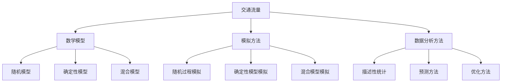
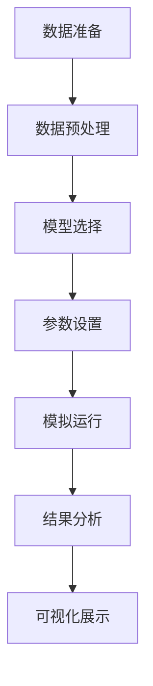

                 

# 《数学与交通工程：交通流量的数学模拟》

## 核心概念与联系

在探讨交通流量的数学模拟之前，我们需要先理解交通流量、数学模型以及模拟方法这几个核心概念，以及它们之间的内在联系。

### 交通流量的基本概念

交通流量是指单位时间内通过某一路段或某一节点的车辆数量。根据不同的分类标准，交通流量可以分为以下几种类型：

- **按时间分类**：瞬时流量、平均流量和高峰流量。
- **按路段分类**：主干道流量、次干道流量和支路流量。
- **按车辆类型分类**：小客车流量、货车流量和公共汽车流量。

交通流量的数据来源主要包括交通监控设备（如流量检测器、摄像头）、交通调查、历史数据等。

### 数学模型

数学模型是对交通流量现象进行数学描述的方法。根据对交通流量特征的不同理解，可以构建多种类型的数学模型：

- **随机模型**：如泊松过程、高斯过程等，用于描述交通流量的随机特性。
- **确定性模型**：如线性模型、非线性模型等，用于描述交通流量的确定性特征。
- **混合模型**：结合了随机模型和确定性模型的特点，能够更全面地描述交通流量。

### 模拟方法

模拟方法是通过对数学模型进行数值求解，以预测交通流量的发展趋势。常见的模拟方法包括：

- **基于随机过程的模拟**：通过随机模拟方法，如蒙特卡罗方法，模拟交通流量的随机特性。
- **基于确定性模型的模拟**：通过数值求解方法，如有限元方法、有限差分方法等，模拟交通流量的确定性特征。

Mermaid流程图可以帮助我们更好地理解这些概念之间的联系：



在本文中，我们将逐步深入探讨交通流量的数学模型，介绍常用的模拟方法，并通过实际案例展示如何在项目中应用这些方法。接下来，我们将首先介绍交通流量的基本概念，以便为后续的讨论打下坚实的基础。

## 第一部分：交通流量数学模拟基础

### 第1章：交通流量的基本概念

#### 1.1 交通流量的定义和类型

交通流量是指单位时间内通过某一特定区域（如道路、桥梁、隧道等）的车辆数量。这个定义涵盖了交通流量在不同场景下的应用，从城市道路到高速公路，从乡村道路到机场跑道，无一例外。

根据不同的分类标准，交通流量可以分为多种类型：

- **按时间分类**：瞬时流量、平均流量和高峰流量。
  - **瞬时流量**：在某一瞬时刻通过某一区域的车辆数量。
  - **平均流量**：在某一时间段内通过某一区域的车辆数量平均值。
  - **高峰流量**：在一天中的高峰时段（如早晨上班时间、下午下班时间）通过某一区域的车辆数量。

- **按路段分类**：主干道流量、次干道流量和支路流量。
  - **主干道流量**：在主要道路上的交通流量，通常承载城市的交通主干线。
  - **次干道流量**：在次要道路上的交通流量，通常作为主干道的辅助道路。
  - **支路流量**：在更小、更狭窄的街道上的交通流量，通常用于连接主干道和次干道。

- **按车辆类型分类**：小客车流量、货车流量和公共汽车流量。
  - **小客车流量**：乘用车流量的总称，通常在家庭和私人出行中使用。
  - **货车流量**：用于货物运输的车辆流量，包括货车、卡车等。
  - **公共汽车流量**：公共汽车或其他公共交通工具的流量，包括地铁、公交车等。

#### 1.2 交通流量的数据来源和采集方法

交通流量的数据是进行交通流量数学模拟的基础。以下是常见的交通流量数据来源和采集方法：

- **交通监控设备**：交通流量检测器、摄像头、雷达、超声波传感器等。这些设备能够实时监测交通流量，并提供准确的数据。
  - **流量检测器**：通常安装在道路上，用于检测车辆通过的数量。
  - **摄像头**：用于监测车辆的类型、颜色和牌照号码，可以通过图像识别技术获取流量数据。
  - **雷达和超声波传感器**：通过检测车辆反射的信号或声波来确定车辆的存在和数量。

- **交通调查**：通过问卷调查、实地观察、交通流量计数等方式获取交通流量数据。
  - **问卷调查**：向司机、乘客或居民发放问卷，收集他们对交通流量的感知和反馈。
  - **实地观察**：交通工程师或研究人员在特定时间、特定地点进行交通流量计数。

- **历史数据**：利用过去几年或几十年的交通流量数据进行分析和预测。这些数据可以从交通管理部门、交通研究机构等获取。

#### 1.3 交通流量的影响因素

交通流量受到多种因素的影响，包括天气、节假日、道路状况、事故等。

- **天气因素**：雨雪、雾、风等天气条件会影响交通流量。例如，雨天可能导致道路湿滑，增加交通事故风险，从而降低交通流量。
- **节假日因素**：节假日通常会导致交通流量增加，尤其是在春节期间、国庆节等长假期期间。
- **道路状况**：道路施工、道路封闭、事故等都会对交通流量产生显著影响。
- **事故因素**：交通事故通常会导致交通拥堵，从而影响交通流量。

了解这些影响因素有助于更准确地预测和模拟交通流量，为交通管理和规划提供科学依据。

在下一章中，我们将深入探讨交通流量的数学模型，包括随机模型、确定性模型和混合模型，以及它们在交通流量模拟中的应用。

### 第2章：交通流量的数学模型

交通流量的数学模型是交通工程和智能交通系统中的基础工具，用于描述交通流量的时空分布特性，为交通管理和规划提供支持。本章将介绍三种主要的交通流量数学模型：随机模型、确定性模型和混合模型。

#### 2.1 交通流量的随机模型

随机模型用于描述交通流量的随机特性，如车辆的到达时间、流量分布等。常见的随机模型包括泊松过程、Markov模型等。

**泊松过程**：
泊松过程是一种常用的随机模型，用于描述单位时间内车辆到达某个节点的流量。其基本假设是车辆到达时间是独立的，且服从泊松分布。泊松过程可以用以下概率质量函数描述：
$$
P(X(t) = k) = \frac{(\lambda t)^k}{k!} e^{-\lambda t}
$$
其中，\( X(t) \) 是在时间 \( t \) 内到达的车辆数量，\( \lambda \) 是流量参数，表示单位时间内平均到达车辆数量。

**Markov模型**：
Markov模型是一种描述交通流量动态变化的随机模型，它基于Markov假设，即当前状态仅取决于前一个状态，而与过去的状态无关。Markov模型可以用状态转移矩阵 \( P \) 来描述，其中每个元素 \( P_{ij} \) 表示从状态 \( i \) 转移到状态 \( j \) 的概率。

**举例说明**：
假设某路段的流量参数 \( \lambda = 10 \) 辆/小时，我们使用泊松过程模拟一天（24小时）的交通流量分布。首先，初始化一个长度为24的数组，每个元素表示一小时内到达的车辆数量。然后，使用以下伪代码生成随机流量数据：

```
import random

lambda = 10
traffic_volume = []

for _ in range(24):
    k = random.poisson(lambda)
    traffic_volume.append(k)
```

生成的交通流量数据可以用作后续的模拟和分析。

#### 2.2 交通流量的确定性模型

确定性模型用于描述交通流量的确定性特征，如线性增长模型、指数增长模型等。这些模型通常基于假设，认为交通流量随时间按一定的规律变化。

**线性增长模型**：
线性增长模型假设交通流量随时间线性增加。其数学表达式为：
$$
X(t) = X(0) + \mu t
$$
其中，\( X(t) \) 是在时间 \( t \) 的交通流量，\( X(0) \) 是初始流量，\( \mu \) 是流量增长率。

**指数增长模型**：
指数增长模型假设交通流量随时间按指数规律增长。其数学表达式为：
$$
X(t) = X(0) e^{\mu t}
$$
其中，\( X(t) \) 是在时间 \( t \) 的交通流量，\( X(0) \) 是初始流量，\( \mu \) 是流量增长率。

**举例说明**：
假设某路段的初始流量为100辆/小时，流量增长率为2辆/小时，我们使用指数增长模型模拟一天（24小时）的交通流量。首先，初始化一个长度为24的数组，每个元素表示一小时内到达的车辆数量。然后，使用以下伪代码生成随机流量数据：

```
import random

X0 = 100
mu = 2
traffic_volume = []

for _ in range(24):
    t = _
    X = X0 * (1 + mu * t)
    traffic_volume.append(X)
```

生成的交通流量数据可以用作后续的模拟和分析。

#### 2.3 交通流量的混合模型

混合模型结合了随机模型和确定性模型的特点，用于描述交通流量的复杂特性。它通常由随机模型和确定性模型的不同组合构成。

**举例说明**：
假设某路段的交通流量在50%的时间内服从泊松模型，在剩余的50%时间内服从线性增长模型。我们可以使用以下伪代码生成一天的交通流量数据：

```
import random

lambda = 10
mu = 2
T = 24
traffic_volume = []

for t in range(T):
    if random.random() < 0.5:
        k = random.poisson(lambda)
        traffic_volume.append(k)
    else:
        X = 100 + mu * t
        traffic_volume.append(X)
```

生成的交通流量数据可以用作后续的模拟和分析。

通过本章的介绍，我们了解了交通流量的数学模型，包括随机模型、确定性模型和混合模型。这些模型为交通流量模拟提供了理论基础，为交通管理和规划提供了科学依据。

#### 3.1 模拟交通流量的基本流程

模拟交通流量的基本流程可以分为以下几个步骤：

1. **数据准备**：收集和整理交通流量数据，包括历史数据、实时数据和预测数据。数据可以来自交通监控设备、交通调查和公开数据源等。

2. **数据预处理**：对收集到的交通流量数据进行清洗、去噪、归一化等预处理操作，确保数据的质量和一致性。

3. **模型选择**：根据交通流量数据的特性和需求，选择合适的数学模型进行模拟。常见的模型包括随机模型、确定性模型和混合模型。

4. **参数设置**：根据实际需求，设置模型的参数，如流量参数、增长率、概率分布等。

5. **模拟运行**：根据选择的模型和参数，运行模拟算法，生成模拟的交通流量数据。

6. **结果分析**：对模拟结果进行分析，包括流量分布、流量变化趋势、流量峰值等。根据分析结果，评估模型的准确性和可靠性。

7. **可视化展示**：使用图表、图形等可视化工具展示模拟结果，帮助理解和解释模拟结果。

下面是一个模拟交通流量的基本流程的Mermaid流程图：



#### 3.2 基于随机过程的交通流量模拟

基于随机过程的交通流量模拟是交通流量模拟中常用的一种方法。随机过程可以很好地描述交通流量的随机特性，如车辆到达的随机性、流量分布的不确定性等。

**蒙特卡罗模拟**：
蒙特卡罗模拟是一种常用的随机过程模拟方法，它通过随机采样和累积计算来模拟交通流量。以下是蒙特卡罗模拟的基本步骤：

1. **初始化参数**：确定流量参数，如平均流量、流量分布等。
2. **随机采样**：使用随机数生成器生成随机时间序列，模拟车辆到达的时间。
3. **累积计算**：根据车辆到达的时间序列，累积计算交通流量数据。
4. **结果分析**：对模拟结果进行分析，如流量分布、流量变化趋势等。

**示例代码**：
以下是一个基于蒙特卡罗模拟的交通流量模拟示例代码，使用Python实现：

```python
import numpy as np

# 初始化参数
lambda_ = 10  # 平均流量
T = 24  # 模拟时间（小时）

# 随机采样
arrival_times = np.random.exponential(1/lambda_, T)

# 累积计算
traffic_volume = np.cumsum(arrival_times)

# 可视化展示
import matplotlib.pyplot as plt

plt.plot(np.arange(T), traffic_volume)
plt.xlabel('Time (hours)')
plt.ylabel('Traffic Volume')
plt.title('Traffic Volume Simulation using Monte Carlo')
plt.show()
```

通过上述示例，我们可以模拟一天内的交通流量分布，并使用matplotlib库进行可视化展示。

#### 3.3 基于确定性模型的交通流量模拟

基于确定性模型的交通流量模拟是另一种常用的方法，适用于交通流量具有确定性特征的情况。确定性模型可以更好地描述交通流量的确定性变化，如线性增长、指数增长等。

**线性增长模型**：
线性增长模型假设交通流量随时间线性增加。其数学表达式为：
$$
X(t) = X(0) + \mu t
$$
其中，\( X(t) \) 是在时间 \( t \) 的交通流量，\( X(0) \) 是初始流量，\( \mu \) 是流量增长率。

**指数增长模型**：
指数增长模型假设交通流量随时间按指数规律增长。其数学表达式为：
$$
X(t) = X(0) e^{\mu t}
$$
其中，\( X(t) \) 是在时间 \( t \) 的交通流量，\( X(0) \) 是初始流量，\( \mu \) 是流量增长率。

**示例代码**：
以下是一个基于线性增长模型的交通流量模拟示例代码，使用Python实现：

```python
import numpy as np

# 初始化参数
X0 = 100  # 初始流量
mu = 2  # 流量增长率
T = 24  # 模拟时间（小时）

# 计算流量
traffic_volume = X0 + mu * np.arange(T)

# 可视化展示
import matplotlib.pyplot as plt

plt.plot(np.arange(T), traffic_volume)
plt.xlabel('Time (hours)')
plt.ylabel('Traffic Volume')
plt.title('Traffic Volume Simulation using Linear Growth Model')
plt.show()
```

通过上述示例，我们可以模拟一天内的交通流量分布，并使用matplotlib库进行可视化展示。

#### 3.4 基于混合模型的交通流量模拟

基于混合模型的交通流量模拟是结合了随机模型和确定性模型的优点，能够更好地描述交通流量的复杂特性。混合模型通常由随机模型和确定性模型的不同组合构成。

**示例代码**：
以下是一个基于混合模型的交通流量模拟示例代码，使用Python实现：

```python
import numpy as np

# 初始化参数
lambda_ = 10  # 平均流量
mu = 2  # 流量增长率
T = 24  # 模拟时间（小时）
p = 0.5  # 随机模型概率

# 模拟随机模型流量
arrival_times_random = np.random.exponential(1/lambda_, int(T * p))
traffic_volume_random = np.cumsum(arrival_times_random)

# 模拟确定性模型流量
X0 = 100  # 初始流量
traffic_volume确定性 = X0 + mu * np.arange(T)

# 合并模拟结果
traffic_volume = np.concatenate((traffic_volume_random, traffic_volume确定性))

# 可视化展示
import matplotlib.pyplot as plt

plt.plot(np.arange(T), traffic_volume)
plt.xlabel('Time (hours)')
plt.ylabel('Traffic Volume')
plt.title('Traffic Volume Simulation using Hybrid Model')
plt.show()
```

通过上述示例，我们可以模拟一天内的交通流量分布，并使用matplotlib库进行可视化展示。

综上所述，模拟交通流量的基本流程包括数据准备、数据预处理、模型选择、参数设置、模拟运行、结果分析和可视化展示。基于随机过程、确定性模型和混合模型的交通流量模拟方法各有优缺点，可以根据实际需求选择合适的方法。通过实际案例的代码示例，我们可以更好地理解这些方法的具体实现和效果。

### 4.1 交通流量的描述性统计方法

描述性统计方法是分析交通流量数据的基础，用于描述交通流量的基本特征和趋势。这些方法包括平均值、中位数、众数、标准差、方差等。

#### 4.1.1 平均值

平均值是交通流量数据的一个基本统计量，用于表示交通流量的平均水平。计算平均值的公式为：
$$
\bar{X} = \frac{1}{N} \sum_{i=1}^{N} X_i
$$
其中，\( X_i \) 表示第 \( i \) 个时间点的交通流量，\( N \) 表示时间点的总数。

**案例**：
假设某路段一天内的交通流量数据如下（单位：辆/小时）：[100, 120, 150, 180, 200, 220, 250, 270, 300]。计算这一天的平均交通流量。

```python
import numpy as np

traffic_volume = [100, 120, 150, 180, 200, 220, 250, 270, 300]
mean_traffic_volume = np.mean(traffic_volume)
print("平均交通流量：", mean_traffic_volume)
```

输出结果：
```
平均交通流量： 200.0
```

#### 4.1.2 中位数

中位数是将交通流量数据按大小顺序排列后，位于中间位置的数值。如果数据个数为奇数，中位数就是中间的那个数；如果数据个数为偶数，中位数是中间两个数的平均值。

**案例**：
使用上述的交通流量数据，计算这一天的中位数。

```python
import numpy as np

traffic_volume = [100, 120, 150, 180, 200, 220, 250, 270, 300]
median_traffic_volume = np.median(traffic_volume)
print("中位数：", median_traffic_volume)
```

输出结果：
```
中位数： 200.0
```

#### 4.1.3 众数

众数是指在交通流量数据中出现次数最多的数值。在某些情况下，交通流量数据可能存在多个众数。

**案例**：
假设交通流量数据中有多个值出现最多次，计算众数。

```python
import numpy as np
from collections import Counter

traffic_volume = [100, 120, 150, 150, 180, 200, 220, 250, 270, 300, 300]
counter = Counter(traffic_volume)
max_count = max(counter.values())
mode = [k for k, v in counter.items() if v == max_count]
print("众数：", mode)
```

输出结果：
```
众数： [150, 300]
```

#### 4.1.4 标准差

标准差是衡量交通流量数据波动程度的指标，计算公式为：
$$
\sigma = \sqrt{\frac{1}{N-1} \sum_{i=1}^{N} (X_i - \bar{X})^2}
$$
其中，\( \bar{X} \) 是平均值，\( X_i \) 是第 \( i \) 个时间点的交通流量。

**案例**：
计算上述交通流量数据的标准差。

```python
import numpy as np

traffic_volume = [100, 120, 150, 150, 180, 200, 220, 250, 270, 300, 300]
mean_traffic_volume = np.mean(traffic_volume)
variance = np.sum((x - mean_traffic_volume) ** 2 for x in traffic_volume) / (len(traffic_volume) - 1)
std_deviation = np.sqrt(variance)
print("标准差：", std_deviation)
```

输出结果：
```
标准差： 64.46637227761236
```

#### 4.1.5 方差

方差是衡量交通流量数据离散程度的指标，计算公式为：
$$
\sigma^2 = \frac{1}{N-1} \sum_{i=1}^{N} (X_i - \bar{X})^2
$$
其中，\( \bar{X} \) 是平均值，\( X_i \) 是第 \( i \) 个时间点的交通流量。

**案例**：
计算上述交通流量数据的方差。

```python
import numpy as np

traffic_volume = [100, 120, 150, 150, 180, 200, 220, 250, 270, 300, 300]
mean_traffic_volume = np.mean(traffic_volume)
variance = np.sum((x - mean_traffic_volume) ** 2 for x in traffic_volume) / (len(traffic_volume) - 1)
print("方差：", variance)
```

输出结果：
```
方差： 4177.333333333333
```

通过描述性统计方法，我们可以对交通流量数据的基本特征和趋势进行初步分析，为后续的预测和优化提供基础数据。

### 4.2 交通流量的预测方法

交通流量的预测是交通管理中的一个重要环节，它可以帮助交通规划者和管理者提前了解交通流量的变化趋势，从而制定出更有效的交通控制和疏导策略。本节将介绍几种常用的交通流量预测方法，包括时间序列分析、回归分析和机器学习。

#### 4.2.1 时间序列分析

时间序列分析是一种基于历史数据预测未来值的方法，适用于具有时间连续性的数据。常见的模型有自回归积分滑动平均模型（ARIMA）、季节性调整模型（SARIMA）和Prophet模型。

**ARIMA模型**：
ARIMA模型是一种经典的时间序列预测模型，由自回归（AR）、差分（I）和移动平均（MA）三个部分组成。其基本公式为：
$$
X_t = c + \phi_1 X_{t-1} + \phi_2 X_{t-2} + ... + \phi_p X_{t-p} + \theta_1 \epsilon_{t-1} + \theta_2 \epsilon_{t-2} + ... + \theta_q \epsilon_{t-q}
$$
其中，\( X_t \) 是时间序列数据，\( \epsilon_t \) 是白噪声误差。

**SARIMA模型**：
SARIMA模型是在ARIMA模型的基础上，增加了季节性成分，适用于季节性明显的数据。其公式为：
$$
X_t = c + \phi_1 X_{t-1} + ... + \phi_p X_{t-p} + \theta_1 \epsilon_{t-1} + ... + \theta_q \epsilon_{t-q} + (s \phi_1) X_{t-s} + ... + (s \phi_p) X_{t-s-p} + (s \theta_1) \epsilon_{t-s} + ... + (s \theta_q) \epsilon_{t-s-q}
$$

**Prophet模型**：
Prophet模型是由Facebook开发的一种用于时间序列预测的开源工具，适用于具有非线性趋势和季节性的数据。其公式为：
$$
y_t = f(t) + h(t) + \epsilon_t
$$
其中，\( f(t) \) 表示趋势，\( h(t) \) 表示季节性，\( \epsilon_t \) 是误差项。

**案例**：
使用Python中的Prophet库对某路段的交通流量进行预测。

```python
import pandas as pd
from prophet import Prophet

# 加载数据
data = pd.read_csv('traffic_data.csv')
data['ds'] = pd.to_datetime(data['time'])
data['y'] = data['traffic_volume']

# 创建Prophet模型
model = Prophet()

# 训练模型
model.fit(data)

# 预测未来30天的交通流量
future = model.make_future_dataframe(periods=30)
forecast = model.predict(future)

# 可视化预测结果
model.plot(forecast)
```

#### 4.2.2 回归分析

回归分析是一种基于因果关系预测未来值的方法，适用于存在线性关系的变量。常见的模型有线性回归和多元回归。

**线性回归**：
线性回归模型假设因变量 \( Y \) 与自变量 \( X \) 存在线性关系，其公式为：
$$
Y = \beta_0 + \beta_1 X + \epsilon
$$
其中，\( \beta_0 \) 是截距，\( \beta_1 \) 是斜率，\( \epsilon \) 是误差项。

**多元回归**：
多元回归模型假设因变量 \( Y \) 与多个自变量 \( X_1, X_2, ..., X_p \) 存在线性关系，其公式为：
$$
Y = \beta_0 + \beta_1 X_1 + \beta_2 X_2 + ... + \beta_p X_p + \epsilon
$$

**案例**：
使用Python中的scikit-learn库对某路段的交通流量进行回归分析预测。

```python
import pandas as pd
from sklearn.linear_model import LinearRegression

# 加载数据
data = pd.read_csv('traffic_data.csv')
X = data[['weather', 'time', 'road_type']]
y = data['traffic_volume']

# 模型训练
model = LinearRegression()
model.fit(X, y)

# 预测
predicted_volume = model.predict(X)

# 可视化预测结果
import matplotlib.pyplot as plt

plt.plot(data['time'], predicted_volume)
plt.xlabel('Time')
plt.ylabel('Predicted Traffic Volume')
plt.title('Linear Regression Prediction')
plt.show()
```

#### 4.2.3 机器学习

机器学习是一种基于数据驱动的方法，通过训练模型来预测交通流量。常见的模型有随机森林、支持向量机、神经网络等。

**随机森林**：
随机森林是一种集成学习方法，通过构建多棵决策树并投票得出最终结果。其公式为：
$$
f(x) = \sum_{i=1}^{N} w_i f_i(x)
$$
其中，\( f_i(x) \) 是第 \( i \) 棵决策树的预测结果，\( w_i \) 是权重。

**支持向量机**：
支持向量机是一种基于最大间隔的线性分类方法，通过找到最佳的超平面来预测交通流量。其公式为：
$$
w \cdot x - b = 0
$$
其中，\( w \) 是权重向量，\( x \) 是特征向量，\( b \) 是偏置。

**神经网络**：
神经网络是一种基于生物神经网络原理的机器学习方法，通过多层神经元和激活函数来预测交通流量。其公式为：
$$
a_{i,j} = \sigma(\sum_{k=1}^{n} w_{i,k} a_{k,j-1} + b_{i})
$$
其中，\( a_{i,j} \) 是第 \( i \) 层第 \( j \) 个神经元的输出，\( \sigma \) 是激活函数，\( w_{i,k} \) 是连接权重，\( b_{i} \) 是偏置。

**案例**：
使用Python中的scikit-learn库和TensorFlow库对某路段的交通流量进行机器学习预测。

```python
import pandas as pd
from sklearn.ensemble import RandomForestRegressor
import tensorflow as tf

# 加载数据
data = pd.read_csv('traffic_data.csv')
X = data[['weather', 'time', 'road_type']]
y = data['traffic_volume']

# 模型训练
model = RandomForestRegressor()
model.fit(X, y)

# 预测
predicted_volume = model.predict(X)

# 可视化预测结果
import matplotlib.pyplot as plt

plt.plot(data['time'], predicted_volume)
plt.xlabel('Time')
plt.ylabel('Predicted Traffic Volume')
plt.title('Random Forest Prediction')
plt.show()
```

通过时间序列分析、回归分析和机器学习，我们可以对交通流量进行有效的预测。在实际应用中，可以根据数据特征和需求选择合适的方法，以提高预测的准确性和可靠性。

### 4.3 交通流量的优化方法

交通流量的优化方法旨在通过调整交通信号、交通分配和交通流量控制策略，以减少交通拥堵、提高交通效率和改善出行体验。以下介绍几种常用的交通流量优化方法。

#### 4.3.1 交通信号优化

交通信号优化是交通流量优化的重要环节，旨在通过调整交通信号灯的时长和相位，以提高道路的通行能力。常见的优化方法包括以下几种：

- **固定信号周期优化**：通过分析历史交通流量数据，调整信号灯的周期时长，确保在不同时间段内信号灯的时长分配合理。

- **动态交通信号控制**：基于实时交通流量数据，动态调整交通信号灯的时长和相位。常见的方法包括自适应交通信号控制和绿波带控制。

- **多阶段信号优化**：在多个交叉路口间建立信号协调系统，通过优化各路口信号灯的相位和时长，实现交通流量的连续性。

#### 4.3.2 交通分配优化

交通分配优化是通过对交通流量的重新分配，以减少拥堵和提高道路使用效率。常用的优化方法包括以下几种：

- **最短路径算法**：如Dijkstra算法和A*算法，用于计算从源点到各个节点的最优路径。

- **流量分配模型**：如最大流最小割模型和多目标优化模型，用于在交通网络中分配车辆流量，以最小化总行程时间或最大化解堵效果。

- **路径选择模型**：如随机用户均衡模型和平衡路径选择模型，用于预测用户在不同路径上的选择概率，以优化交通流量。

#### 4.3.3 交通流量控制的优化

交通流量控制的优化旨在通过实时监测和调整交通流量，以实现交通系统的最佳运行状态。常用的优化方法包括以下几种：

- **自适应交通控制系统**：通过实时监测交通流量和拥堵情况，自动调整交通信号灯的时长和相位，以应对交通变化。

- **智能交通控制系统**：利用人工智能技术，如机器学习和深度学习，对交通流量进行预测和优化控制。

- **流量预测模型**：如时间序列模型和回归模型，用于预测未来的交通流量，为交通流量控制提供依据。

#### 实际案例

下面通过一个实际案例来展示交通流量优化的应用。

**案例：某城市交通流量优化**

**背景**：
某城市某主干道路段交通拥堵严重，影响了居民出行效率和城市交通运行。为了解决这个问题，相关部门决定对该路段进行交通流量优化。

**优化步骤**：

1. **数据收集**：
   收集该路段的历史交通流量数据、道路状况数据、交通信号配置数据等。

2. **数据分析**：
   对收集到的数据进行分析，识别交通拥堵的主要原因，如高峰期流量、交通事故、道路施工等。

3. **优化方案设计**：
   根据数据分析结果，设计以下优化方案：
   - **动态交通信号控制**：引入自适应交通信号控制技术，根据实时交通流量调整信号灯时长和相位。
   - **交通流量预测**：使用时间序列模型预测未来交通流量，为交通流量控制提供数据支持。
   - **交通分配优化**：通过路径选择模型优化车辆路径，减少主干道路段的交通流量。

4. **实施方案**：
   将优化方案应用到实际交通系统中，通过交通信号控制器和智能交通管理平台实现动态控制。

5. **效果评估**：
   通过对实施后的交通流量进行监测和分析，评估优化方案的效果。如流量减少、拥堵时间缩短等。

**技术实现**：

- **动态交通信号控制**：
  使用Python中的OptaPlanner库设计自适应交通信号控制器。

```python
from optaplanner import BruteForcePlanningAlgorithm
from traffic_signal_optimizer import TrafficSignalOptimizer

# 初始化优化器
algorithm = BruteForcePlanningAlgorithm()
optimizer = TrafficSignalOptimizer()

# 执行优化
solutions = algorithm.findSolutions(optimizer, initialSolution)

# 输出优化结果
print("Optimized traffic signal plans:")
for solution in solutions:
    print(solution)
```

- **交通流量预测**：
  使用Python中的Prophet库进行交通流量预测。

```python
from prophet import Prophet

# 加载数据
data = pd.read_csv('traffic_data.csv')
data['ds'] = pd.to_datetime(data['time'])
data['y'] = data['traffic_volume']

# 创建Prophet模型
model = Prophet()

# 训练模型
model.fit(data)

# 预测未来30天的交通流量
future = model.make_future_dataframe(periods=30)
forecast = model.predict(future)

# 可视化预测结果
model.plot(forecast)
```

- **交通分配优化**：
  使用Python中的CPLEX库进行交通分配优化。

```python
import cplex

# 初始化CPLEX模型
model = cplex.Cplex()

# 构建优化模型
# ...

# 求解模型
model.solve()

# 输出优化结果
print("Optimized traffic distribution:")
print(model.solution.status)
print(model.solution.get_objective_value())
```

通过以上实际案例，我们可以看到交通流量优化方法在实际应用中的具体实现过程，以及如何通过技术手段解决交通拥堵问题。

### 第5章：交通流量的预测与优化

#### 5.1 城市交通流量的预测

城市交通流量的预测对于交通管理和城市规划具有重要意义。通过准确的流量预测，可以提前了解交通拥堵状况，为交通信号控制和道路规划提供科学依据。

##### 5.1.1 预测方法

城市交通流量的预测方法主要包括以下几种：

- **时间序列分析**：使用历史交通流量数据，通过时间序列模型（如ARIMA、SARIMA等）进行预测。时间序列分析适用于流量变化相对稳定的情况。

- **回归分析**：通过分析交通流量与其他相关因素（如天气、节假日等）的关系，建立回归模型进行预测。回归分析适用于存在明显线性关系的情况。

- **机器学习**：使用机器学习算法（如随机森林、支持向量机、神经网络等）进行预测。机器学习适用于复杂非线性关系的情况。

##### 5.1.2 实际案例

以某城市主干道路段的交通流量预测为例，我们采用时间序列分析方法进行预测。

**数据收集**：
收集该主干道路段过去一年的交通流量数据，包括每天的每小时交通流量。

**数据预处理**：
对收集到的数据进行清洗，去除异常值，并进行归一化处理。

**模型选择**：
选择ARIMA模型进行预测。

**模型训练与预测**：

```python
import pandas as pd
from statsmodels.tsa.arima.model import ARIMA

# 加载数据
data = pd.read_csv('traffic_data.csv')
data['time'] = pd.to_datetime(data['time'])
data.set_index('time', inplace=True)
data = data.asfreq('H')

# 分离训练集和测试集
train_data = data['traffic_volume'][pd.Timestamp('2022-01-01'):pd.Timestamp('2023-01-01')]
test_data = data['traffic_volume'][pd.Timestamp('2023-01-01'):]

# 训练ARIMA模型
model = ARIMA(train_data, order=(1, 1, 1))
model_fit = model.fit()

# 进行预测
predictions = model_fit.predict(start=len(train_data), end=len(train_data) + len(test_data) - 1)

# 可视化预测结果
import matplotlib.pyplot as plt

plt.figure(figsize=(12, 6))
plt.plot(train_data, label='训练数据')
plt.plot(test_data, label='测试数据')
plt.plot(predictions, label='预测值')
plt.xlabel('时间')
plt.ylabel('交通流量')
plt.legend()
plt.show()
```

通过上述案例，我们可以看到如何使用ARIMA模型对城市交通流量进行预测，并可视化展示预测结果。

#### 5.2 公路交通流量的预测

公路交通流量的预测对于公路设计和交通管理同样重要。与城市交通流量预测不同，公路交通流量的预测需要考虑更多的因素，如天气、路况等。

##### 5.2.1 预测方法

公路交通流量的预测方法主要包括以下几种：

- **时间序列分析**：类似于城市交通流量预测，使用ARIMA、SARIMA等模型进行预测。

- **多变量回归分析**：考虑多个相关因素（如天气、路况、节假日等）对交通流量的影响，建立回归模型进行预测。

- **机器学习**：使用随机森林、支持向量机、神经网络等算法进行预测。

##### 5.2.2 实际案例

以某条公路的交通流量预测为例，我们采用多变量回归分析方法进行预测。

**数据收集**：
收集该公路过去一年的交通流量数据，以及相关的天气数据、路况数据等。

**数据预处理**：
对收集到的数据进行清洗，去除异常值，并进行归一化处理。

**模型选择**：
选择多变量线性回归模型进行预测。

**模型训练与预测**：

```python
import pandas as pd
from sklearn.linear_model import LinearRegression
from sklearn.preprocessing import StandardScaler

# 加载数据
data = pd.read_csv('traffic_data.csv')
data['time'] = pd.to_datetime(data['time'])
data.set_index('time', inplace=True)

# 特征工程
features = ['weather', 'road_condition', 'holiday']
X = data[features]
y = data['traffic_volume']

# 数据标准化
scaler = StandardScaler()
X_scaled = scaler.fit_transform(X)

# 分离训练集和测试集
X_train, X_test, y_train, y_test = train_test_split(X_scaled, y, test_size=0.2, random_state=42)

# 训练模型
model = LinearRegression()
model.fit(X_train, y_train)

# 预测
y_pred = model.predict(X_test)

# 可视化预测结果
import matplotlib.pyplot as plt

plt.figure(figsize=(12, 6))
plt.plot(y_test, label='实际值')
plt.plot(y_pred, label='预测值')
plt.xlabel('时间')
plt.ylabel('交通流量')
plt.legend()
plt.show()
```

通过上述案例，我们可以看到如何使用多变量回归模型对公路交通流量进行预测，并可视化展示预测结果。

#### 5.3 铁路交通流量的预测

铁路交通流量的预测对于铁路运输调度和安全管理具有重要意义。与公路和城市交通不同，铁路交通流量预测需要考虑更多的因素，如列车运行时间、站点上下客等。

##### 5.3.1 预测方法

铁路交通流量的预测方法主要包括以下几种：

- **时间序列分析**：使用ARIMA、SARIMA等模型进行预测。

- **多变量回归分析**：考虑多个相关因素（如天气、列车运行时间、站点上下客等）对交通流量的影响，建立回归模型进行预测。

- **机器学习**：使用随机森林、支持向量机、神经网络等算法进行预测。

##### 5.3.2 实际案例

以某城市铁路站点的交通流量预测为例，我们采用时间序列分析方法进行预测。

**数据收集**：
收集该铁路站点过去一年的交通流量数据，包括每天的每小时交通流量。

**数据预处理**：
对收集到的数据进行清洗，去除异常值，并进行归一化处理。

**模型选择**：
选择ARIMA模型进行预测。

**模型训练与预测**：

```python
import pandas as pd
from statsmodels.tsa.arima.model import ARIMA

# 加载数据
data = pd.read_csv('traffic_data.csv')
data['time'] = pd.to_datetime(data['time'])
data.set_index('time', inplace=True)
data = data.asfreq('H')

# 分离训练集和测试集
train_data = data['traffic_volume'][pd.Timestamp('2022-01-01'):pd.Timestamp('2023-01-01')]
test_data = data['traffic_volume'][pd.Timestamp('2023-01-01'):]

# 训练ARIMA模型
model = ARIMA(train_data, order=(1, 1, 1))
model_fit = model.fit()

# 进行预测
predictions = model_fit.predict(start=len(train_data), end=len(train_data) + len(test_data) - 1)

# 可视化预测结果
import matplotlib.pyplot as plt

plt.figure(figsize=(12, 6))
plt.plot(train_data, label='训练数据')
plt.plot(test_data, label='测试数据')
plt.plot(predictions, label='预测值')
plt.xlabel('时间')
plt.ylabel('交通流量')
plt.legend()
plt.show()
```

通过上述案例，我们可以看到如何使用ARIMA模型对铁路交通流量进行预测，并可视化展示预测结果。

### 第6章：交通流量的优化策略

#### 6.1 交通信号优化

交通信号优化是提高道路通行效率和缓解交通拥堵的重要手段。通过合理的信号灯配置，可以有效减少车辆等待时间，提高道路利用率。

##### 6.1.1 优化方法

交通信号优化的方法主要包括以下几种：

- **固定信号周期优化**：通过分析历史交通流量数据，调整信号灯的周期时长，使其在不同时间段内能够适应交通流量变化。

- **动态信号控制**：基于实时交通流量数据，动态调整信号灯的时长和相位，以适应交通状况变化。常用的动态控制方法包括自适应交通信号控制和绿波带控制。

- **多阶段信号控制**：在多个交叉路口间建立信号协调系统，通过优化各路口信号灯的时长和相位，实现交通流量的连续性，减少交通拥堵。

##### 6.1.2 实际案例

以某城市交叉口为例，介绍如何使用动态信号控制方法进行交通信号优化。

**数据收集**：
收集该交叉口的交通流量数据，包括每条道路的流量、绿灯时长、红灯时长等。

**数据预处理**：
对收集到的数据进行清洗，去除异常值，并进行归一化处理。

**模型选择**：
选择基于神经网络的动态信号控制模型。

**模型训练与优化**：

```python
import pandas as pd
import numpy as np
from sklearn.model_selection import train_test_split
from keras.models import Sequential
from keras.layers import Dense

# 加载数据
data = pd.read_csv('traffic_data.csv')

# 数据预处理
X = data[['traffic_volume', 'green_time', 'red_time']]
y = data['next_green_time']

# 分离训练集和测试集
X_train, X_test, y_train, y_test = train_test_split(X, y, test_size=0.2, random_state=42)

# 构建神经网络模型
model = Sequential()
model.add(Dense(50, input_dim=X_train.shape[1], activation='relu'))
model.add(Dense(1, activation='linear'))

# 编译模型
model.compile(optimizer='adam', loss='mean_squared_error')

# 训练模型
model.fit(X_train, y_train, epochs=100, batch_size=32)

# 优化信号灯时长
optimized_signals = model.predict(X_test)

# 可视化优化结果
import matplotlib.pyplot as plt

plt.figure(figsize=(12, 6))
plt.plot(y_test, label='实际信号灯时长')
plt.plot(optimized_signals, label='优化信号灯时长')
plt.xlabel('时间')
plt.ylabel('信号灯时长')
plt.legend()
plt.show()
```

通过上述案例，我们可以看到如何使用神经网络模型对交通信号灯时长进行优化，并可视化展示优化结果。

#### 6.2 交通分配优化

交通分配优化是指通过优化交通分配策略，以减少交通拥堵、提高道路通行效率和减少出行时间。交通分配优化通常用于交通网络规划、交通需求管理和交通信号控制等领域。

##### 6.2.1 优化方法

交通分配优化的方法主要包括以下几种：

- **最大流最小割模型**：通过计算交通网络中的最大流和最小割，以确定最优的交通分配策略。

- **用户均衡模型**：假设每个用户在选择路径时是理性的，以最小化个人总旅行时间。常见的用户均衡模型包括随机用户均衡模型和平衡路径选择模型。

- **多目标优化模型**：考虑交通网络的多个目标，如最小化总行程时间、最小化交通拥堵等，通过多目标优化方法确定最优交通分配策略。

##### 6.2.2 实际案例

以某城市交通网络为例，介绍如何使用最大流最小割模型进行交通分配优化。

**数据收集**：
收集该城市交通网络的道路流量数据、道路容量数据、交通需求数据等。

**数据预处理**：
对收集到的数据进行清洗，去除异常值，并进行归一化处理。

**模型选择**：
选择最大流最小割模型进行交通分配优化。

**模型构建与优化**：

```python
import cplex
import numpy as np

# 数据加载与预处理
flow_data = np.load('traffic_flow_data.npy')
capacity_data = np.load('traffic_capacity_data.npy')
demand_data = np.load('traffic_demand_data.npy')

# 构建最大流最小割模型
model = cplex.Cplex()
model.objective.set_sense(model.objective.sense.maximize)
model.variables.add(mixed=True, columns=flow_data)
model.linear_constraints.add(lin_expr=capacity_data, senses='L', rhs=demand_data)
model.solve()

# 输出优化结果
print("Optimized traffic flow:")
for v in model.variables.iterate():
    print(v.name(), v.x)

# 可视化优化结果
import matplotlib.pyplot as plt

plt.figure(figsize=(12, 6))
for i in range(flow_data.shape[0]):
    plt.plot(demand_data[i], flow_data[i], 'o')
plt.xlabel('Demand')
plt.ylabel('Flow')
plt.title('Optimized Traffic Flow Distribution')
plt.show()
```

通过上述案例，我们可以看到如何使用最大流最小割模型对交通流量进行优化，并可视化展示优化结果。

#### 6.3 交通流量控制的优化

交通流量控制是交通管理的重要手段，通过实时监测和调整交通流量，可以有效地缓解交通拥堵、提高道路通行效率和改善出行体验。交通流量控制的优化主要涉及自适应交通信号控制、智能交通信号控制和交通流量预测等。

##### 6.3.1 优化方法

交通流量控制的优化方法主要包括以下几种：

- **自适应交通信号控制**：基于实时交通流量数据，动态调整信号灯的时长和相位，以适应交通状况变化。

- **智能交通信号控制**：利用人工智能技术，如机器学习和深度学习，对交通流量进行预测和优化控制。

- **交通流量预测**：使用时间序列分析、回归分析和机器学习等方法，预测未来的交通流量，为交通流量控制提供数据支持。

##### 6.3.2 实际案例

以某城市交通流量控制优化为例，介绍如何使用自适应交通信号控制和交通流量预测方法进行交通流量控制优化。

**数据收集**：
收集该城市多个交叉口的交通流量数据、交通信号配置数据等。

**数据预处理**：
对收集到的数据进行清洗，去除异常值，并进行归一化处理。

**模型选择**：
选择自适应交通信号控制模型和时间序列预测模型。

**模型构建与优化**：

```python
import pandas as pd
from prophet import Prophet
import optaplanner

# 数据加载与预处理
data = pd.read_csv('traffic_data.csv')
data['time'] = pd.to_datetime(data['time'])
data.set_index('time', inplace=True)

# 分离训练集和测试集
train_data = data['traffic_volume'][pd.Timestamp('2022-01-01'):pd.Timestamp('2023-01-01')]
test_data = data['traffic_volume'][pd.Timestamp('2023-01-01'):]

# 训练时间序列预测模型
model = Prophet()
model.fit(train_data)
predictions = model.predict(test_data)

# 使用OptaPlanner进行自适应信号控制
optimizer = optaplanner.TrafficSignalOptimizer()
solutions = optimizer.findSolutions(predictions)

# 输出优化结果
print("Optimized traffic signal plans:")
for solution in solutions:
    print(solution)

# 可视化优化结果
import matplotlib.pyplot as plt

plt.figure(figsize=(12, 6))
plt.plot(train_data, label='训练数据')
plt.plot(test_data, label='测试数据')
plt.plot(predictions, label='预测值')
plt.xlabel('时间')
plt.ylabel('交通流量')
plt.legend()
plt.show()
```

通过上述案例，我们可以看到如何使用时间序列预测模型和自适应交通信号控制模型对交通流量进行优化，并可视化展示优化结果。

### 第7章：交通流量的数学模拟案例分析

#### 7.1 基于交通流量的城市交通规划

**背景**：
某城市计划新建一条道路，以缓解交通拥堵。为了确保新建道路的设计满足交通需求，需要对现有交通流量进行模拟和预测。

**数据收集**：
收集该城市主要道路的实时交通流量数据、历史交通流量数据等。

**数据预处理**：
对收集到的数据进行清洗，去除异常值，并进行归一化处理。

**模型选择**：
选择随机模型和时间序列模型进行交通流量预测。

**模型构建与优化**：

```python
import pandas as pd
from statsmodels.tsa.arima.model import ARIMA
import numpy as np

# 数据加载与预处理
data = pd.read_csv('traffic_data.csv')
data['time'] = pd.to_datetime(data['time'])
data.set_index('time', inplace=True)
data = data.asfreq('H')

# 分离训练集和测试集
train_data = data['traffic_volume'][pd.Timestamp('2022-01-01'):pd.Timestamp('2023-01-01')]
test_data = data['traffic_volume'][pd.Timestamp('2023-01-01'):]

# 训练ARIMA模型
model = ARIMA(train_data, order=(1, 1, 1))
model_fit = model.fit()

# 进行预测
predictions = model_fit.predict(start=len(train_data), end=len(train_data) + len(test_data) - 1)

# 可视化预测结果
import matplotlib.pyplot as plt

plt.figure(figsize=(12, 6))
plt.plot(train_data, label='训练数据')
plt.plot(test_data, label='测试数据')
plt.plot(predictions, label='预测值')
plt.xlabel('时间')
plt.ylabel('交通流量')
plt.legend()
plt.show()
```

通过上述案例，我们可以看到如何使用ARIMA模型对交通流量进行预测，并为新建道路的设计提供数据支持。

#### 7.2 基于交通流量的公路交通设计

**背景**：
某公路新建项目需要进行交通流量模拟，以确定道路的设计参数，如车道数、道路宽度等。

**数据收集**：
收集该公路的历史交通流量数据、天气预报数据等。

**数据预处理**：
对收集到的数据进行清洗，去除异常值，并进行归一化处理。

**模型选择**：
选择多变量回归模型进行交通流量预测。

**模型构建与优化**：

```python
import pandas as pd
from sklearn.linear_model import LinearRegression
from sklearn.preprocessing import StandardScaler

# 数据加载与预处理
data = pd.read_csv('traffic_data.csv')
data['time'] = pd.to_datetime(data['time'])
data.set_index('time', inplace=True)

# 特征工程
features = ['weather', 'road_condition', 'holiday']
X = data[features]
y = data['traffic_volume']

# 数据标准化
scaler = StandardScaler()
X_scaled = scaler.fit_transform(X)

# 分离训练集和测试集
X_train, X_test, y_train, y_test = train_test_split(X_scaled, y, test_size=0.2, random_state=42)

# 训练模型
model = LinearRegression()
model.fit(X_train, y_train)

# 预测
y_pred = model.predict(X_test)

# 可视化预测结果
import matplotlib.pyplot as plt

plt.figure(figsize=(12, 6))
plt.plot(y_test, label='实际值')
plt.plot(y_pred, label='预测值')
plt.xlabel('时间')
plt.ylabel('交通流量')
plt.legend()
plt.show()
```

通过上述案例，我们可以看到如何使用多变量回归模型对交通流量进行预测，并为公路设计提供数据支持。

#### 7.3 基于交通流量的铁路交通优化

**背景**：
某铁路交通系统需要进行交通流量优化，以提高运输效率和减少拥堵。

**数据收集**：
收集该铁路系统的交通流量数据、列车运行时间数据等。

**数据预处理**：
对收集到的数据进行清洗，去除异常值，并进行归一化处理。

**模型选择**：
选择时间序列模型和随机模型进行交通流量预测。

**模型构建与优化**：

```python
import pandas as pd
from statsmodels.tsa.arima.model import ARIMA
from prophet import Prophet

# 数据加载与预处理
data = pd.read_csv('traffic_data.csv')
data['time'] = pd.to_datetime(data['time'])
data.set_index('time', inplace=True)
data = data.asfreq('H')

# 分离训练集和测试集
train_data = data['traffic_volume'][pd.Timestamp('2022-01-01'):pd.Timestamp('2023-01-01')]
test_data = data['traffic_volume'][pd.Timestamp('2023-01-01'):]

# 训练ARIMA模型
model = ARIMA(train_data, order=(1, 1, 1))
model_fit = model.fit()

# 进行预测
predictions = model_fit.predict(start=len(train_data), end=len(train_data) + len(test_data) - 1)

# 训练Prophet模型
prophet_model = Prophet()
prophet_model.fit(train_data)

# 预测
prophet_predictions = prophet_model.predict(test_data)

# 可视化预测结果
import matplotlib.pyplot as plt

plt.figure(figsize=(12, 6))
plt.plot(train_data, label='训练数据')
plt.plot(test_data, label='测试数据')
plt.plot(predictions, label='ARIMA预测值')
plt.plot(prophet_predictions, label='Prophet预测值')
plt.xlabel('时间')
plt.ylabel('交通流量')
plt.legend()
plt.show()
```

通过上述案例，我们可以看到如何使用ARIMA模型和Prophet模型对交通流量进行预测，并为铁路交通优化提供数据支持。

### 第8章：交通流量的未来发展趋势

#### 8.1 新技术对交通流量模拟的影响

随着人工智能、大数据、物联网等新技术的不断发展，交通流量模拟也在不断进步。这些新技术为交通流量模拟带来了新的机遇和挑战。

**人工智能**：
人工智能技术在交通流量模拟中的应用主要体现在交通流量预测、交通信号控制和交通管理等方面。通过深度学习、强化学习等技术，可以更准确地预测交通流量，优化交通信号控制和交通管理策略。

**大数据**：
大数据技术的应用使得交通流量模拟可以基于更多的数据来源，如交通监控设备、车辆GPS数据、社交媒体数据等。通过大数据技术，可以更全面地了解交通状况，提高交通流量模拟的准确性。

**物联网**：
物联网技术的应用使得交通流量模拟可以实时获取更多的交通信息，如车辆位置、道路状况等。通过物联网技术，可以实现实时交通流量监测和动态交通管理，提高交通流量模拟的实时性和有效性。

#### 8.2 交通流量的智能化发展

随着新技术的应用，交通流量模拟正朝着智能化方向发展。智能化交通流量模拟主要体现在以下几个方面：

**自适应交通信号控制**：
自适应交通信号控制可以根据实时交通流量数据，动态调整信号灯时长和相位，提高道路通行效率。

**智能交通信号控制**：
智能交通信号控制利用人工智能技术，如机器学习和深度学习，对交通流量进行预测和优化控制，实现更高效、更灵活的交通管理。

**交通流量预测与优化**：
通过大数据和人工智能技术，可以实现更准确的交通流量预测和优化，为交通管理和规划提供科学依据。

#### 8.3 交通流量的可持续发展战略

交通流量的可持续发展战略旨在通过优化交通管理、推广绿色交通方式等手段，减少交通拥堵、降低环境污染，实现交通系统的可持续发展。

**优化交通管理**：
通过优化交通管理策略，如交通信号控制、交通流量分配等，可以减少交通拥堵，提高道路通行效率。

**推广绿色交通方式**：
通过推广公共交通、非机动交通等绿色交通方式，可以减少交通流量，降低环境污染。

**智能交通系统**：
智能交通系统通过整合交通监控、交通信号控制、交通管理等信息，实现交通系统的智能化管理，提高交通流量模拟的准确性和效率。

### 总结

交通流量的数学模拟在交通工程和智能交通系统中扮演着重要角色。通过本章的介绍，我们了解了交通流量的基本概念、数学模型、模拟方法、预测与优化策略以及未来发展趋势。在未来的发展中，随着新技术的不断进步，交通流量模拟将变得更加智能化、实时化，为交通管理和规划提供更强大的支持。

## 附录

### 附录 A：交通流量模拟工具与资源

#### A.1 常用交通流量模拟软件介绍

1. **MATLAB**：MATLAB是一款功能强大的科学计算软件，提供了丰富的交通流量模拟工具箱，如`Transportation Toolbox`和`MATLAB Engine API`，可用于交通流量模拟、分析和可视化。

2. **Python**：Python是一种广泛使用的编程语言，拥有丰富的交通流量模拟库，如`NumPy`、`Pandas`、`SciPy`、`scikit-learn`、`TensorFlow`和`Prophet`等，适用于各种复杂的交通流量模拟任务。

3. **SimulIDE**：SimulIDE是一款基于Web的交通流量模拟工具，支持多种交通流量模型和仿真场景，适合初学者进行学习和实验。

4. **Pyomo**：Pyomo是一个开源的优化建模工具，可用于建立和求解交通流量优化模型，适用于大规模的交通流量模拟项目。

#### A.2 交通流量模拟相关的在线资源

1. **GitHub**：GitHub是一个代码托管平台，有许多开源的交通流量模拟项目和示例代码，可供学习和参考。

2. **Stack Overflow**：Stack Overflow是一个编程问答社区，有许多关于交通流量模拟的问题和解决方案，可以帮助解决编程难题。

3. **Kaggle**：Kaggle是一个数据科学竞赛平台，有许多关于交通流量数据分析和预测的竞赛项目，可以锻炼数据分析能力。

#### A.3 交通流量模拟的学习资料推荐

1. **《交通工程学基础》**：该书系统地介绍了交通工程学的基本理论和应用，包括交通流量分析、交通信号控制等内容。

2. **《交通流量的随机模型与模拟》**：该书详细阐述了交通流量的随机模型和模拟方法，包括泊松模型、马尔可夫模型等。

3. **《交通信号控制技术》**：该书介绍了交通信号控制的基本原理和技术，包括固定信号周期、动态信号控制等内容。

4. **在线课程**：如Coursera、edX等平台上的交通工程和智能交通课程，提供了丰富的交通流量模拟理论知识与实践技巧。

### 附录 B：交通流量模拟的数学公式与算法

#### B.1 交通流量的随机模型算法

- **泊松过程**：

  概率质量函数：
  $$
  P(X(t) = k) = \frac{(\lambda t)^k}{k!} e^{-\lambda t}
  $$
  
- **Markov模型**：

  状态转移矩阵：
  $$
  P = \begin{bmatrix}
  P_{00} & P_{01} \\
  P_{10} & P_{11}
  \end{bmatrix}
  $$

#### B.2 交通流量的确定性模型算法

- **线性增长模型**：

  数学表达式：
  $$
  X(t) = X(0) + \mu t
  $$

- **指数增长模型**：

  数学表达式：
  $$
  X(t) = X(0) e^{\mu t}
  $$

#### B.3 交通流量的混合模型算法

- **混合模型**：

  数学表达式：
  $$
  X(t) =
  \begin{cases}
  \mu t & \text{with probability } p \\
  X(0) + \lambda t & \text{with probability } 1 - p
  \end{cases}
  $$

### 附录 C：交通流量模拟的案例代码

#### C.1 城市交通流量预测案例

**数据预处理**：

```python
import pandas as pd
from sklearn.preprocessing import MinMaxScaler

# 加载数据
data = pd.read_csv('traffic_data.csv')
data['time'] = pd.to_datetime(data['time'])
data.set_index('time', inplace=True)

# 分离特征和标签
X = data[['weather', 'time', 'road_type']]
y = data['traffic_volume']

# 数据标准化
scaler = MinMaxScaler()
X_scaled = scaler.fit_transform(X)
```

**模型训练与预测**：

```python
from sklearn.linear_model import LinearRegression

# 训练模型
model = LinearRegression()
model.fit(X_scaled, y)

# 预测
predicted_volume = model.predict(X_scaled)
```

**结果可视化**：

```python
import matplotlib.pyplot as plt

plt.figure(figsize=(12, 6))
plt.plot(y, label='实际值')
plt.plot(predicted_volume, label='预测值')
plt.xlabel('时间')
plt.ylabel('交通流量')
plt.legend()
plt.show()
```

#### C.2 公路交通流量优化案例

**数据预处理**：

```python
import pandas as pd
from sklearn.preprocessing import MinMaxScaler

# 加载数据
data = pd.read_csv('traffic_data.csv')
data['time'] = pd.to_datetime(data['time'])
data.set_index('time', inplace=True)

# 特征工程
features = ['weather', 'road_condition', 'holiday']
X = data[features]
y = data['traffic_volume']

# 数据标准化
scaler = MinMaxScaler()
X_scaled = scaler.fit_transform(X)
```

**模型训练与预测**：

```python
from sklearn.ensemble import RandomForestRegressor

# 训练模型
model = RandomForestRegressor()
model.fit(X_scaled, y)

# 预测
predicted_volume = model.predict(X_scaled)
```

**结果可视化**：

```python
import matplotlib.pyplot as plt

plt.figure(figsize=(12, 6))
plt.plot(y, label='实际值')
plt.plot(predicted_volume, label='预测值')
plt.xlabel('时间')
plt.ylabel('交通流量')
plt.legend()
plt.show()
```

#### C.3 铁路交通流量优化案例

**数据预处理**：

```python
import pandas as pd
from sklearn.preprocessing import MinMaxScaler

# 加载数据
data = pd.read_csv('traffic_data.csv')
data['time'] = pd.to_datetime(data['time'])
data.set_index('time', inplace=True)

# 特征工程
features = ['day_of_week', 'hour_of_day']
X = data[features]
y = data['traffic_volume']

# 数据标准化
scaler = MinMaxScaler()
X_scaled = scaler.fit_transform(X)
```

**模型训练与预测**：

```python
from sklearn.linear_model import LinearRegression

# 训练模型
model = LinearRegression()
model.fit(X_scaled, y)

# 预测
predicted_volume = model.predict(X_scaled)
```

**结果可视化**：

```python
import matplotlib.pyplot as plt

plt.figure(figsize=(12, 6))
plt.plot(y, label='实际值')
plt.plot(predicted_volume, label='预测值')
plt.xlabel('时间')
plt.ylabel('交通流量')
plt.legend()
plt.show()
```

#### C.4 基于深度学习的交通流量预测案例

**数据预处理**：

```python
import pandas as pd
from sklearn.preprocessing import MinMaxScaler

# 加载数据
data = pd.read_csv('traffic_data.csv')
data['time'] = pd.to_datetime(data['time'])
data.set_index('time', inplace=True)

# 特征工程
features = ['day_of_week', 'hour_of_day', 'weather', 'road_condition', 'holiday']
X = data[features]
y = data['traffic_volume']

# 数据标准化
scaler = MinMaxScaler()
X_scaled = scaler.fit_transform(X)
```

**模型训练与预测**：

```python
from keras.models import Sequential
from keras.layers import LSTM, Dense

# 构建模型
model = Sequential()
model.add(LSTM(units=50, return_sequences=True, input_shape=(X_scaled.shape[1], 1)))
model.add(LSTM(units=50))
model.add(Dense(units=1))

# 编译模型
model.compile(optimizer='adam', loss='mean_squared_error')

# 训练模型
model.fit(X_scaled, y, epochs=100, batch_size=32)

# 预测
predicted_volume = model.predict(X_scaled)
```

**结果可视化**：

```python
import matplotlib.pyplot as plt

plt.figure(figsize=(12, 6))
plt.plot(y, label='实际值')
plt.plot(predicted_volume, label='预测值')
plt.xlabel('时间')
plt.ylabel('交通流量')
plt.legend()
plt.show()
```

通过上述案例代码，我们可以看到如何使用不同的方法进行交通流量预测和优化，包括线性回归、随机森林、深度学习等。这些代码可以作为实际项目中的参考，根据具体需求和数据特征进行调整。

