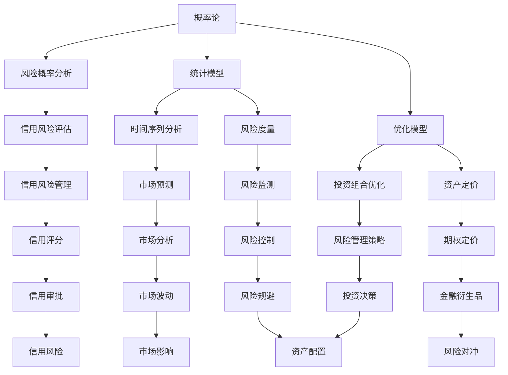

                 

### 《数学与风险评估：金融风险的数学量化》

> **关键词**：（金融风险、数学模型、概率论、统计分析、优化算法）

**摘要**：
本文旨在探讨数学在金融风险管理中的应用，特别是数学模型在量化金融风险方面的作用。通过深入分析概率论、统计模型和优化模型，本文揭示了这些数学工具如何帮助金融机构更精确地评估和管理风险。文章还通过实际案例，展示了如何使用蒙特卡洛模拟和布莱克-斯科尔斯模型等数学方法进行金融风险评估，并提供了详细的代码解析。

---

### 《数学与风险评估：金融风险的数学量化》目录大纲

---

# 第一部分：引言

## 第1章：数学与风险评估基础

### 1.1 数学在金融风险分析中的重要性

### 1.2 风险评估的基本概念

### 1.3 数学模型在风险管理中的应用

## 第2章：概率论与金融风险

### 2.1 概率论基础

#### 2.1.1 随机事件与概率

#### 2.1.2 条件概率与独立事件

#### 2.1.3 贝叶斯定理

### 2.2 风险的概率分析

#### 2.2.1 风险的定义与分类

#### 2.2.2 风险的概率度量

#### 2.2.3 风险的概率模型

## 第3章：统计模型与风险分析

### 3.1 统计模型的基本概念

#### 3.1.1 数据分布

#### 3.1.2 假设检验

#### 3.1.3 方差分析

### 3.2 时间序列分析

#### 3.2.1 时间序列的基本概念

#### 3.2.2 自回归模型

#### 3.2.3 移动平均模型

#### 3.2.4 阿尔佛莱德模型

## 第4章：优化模型与风险管理

### 4.1 优化模型的基本概念

#### 4.1.1 目标函数

#### 4.1.2 约束条件

#### 4.1.3 优化算法

### 4.2 风险优化的数学模型

#### 4.2.1 风险优化的基本问题

#### 4.2.2 线性优化与非线性优化

#### 4.2.3 风险优化的求解算法

## 第5章：金融市场中的数学模型

### 5.1 蒙特卡洛模拟

#### 5.1.1 模拟的基本概念

#### 5.1.2 模拟步骤

#### 5.1.3 模拟应用实例

### 5.2 期权定价模型

#### 5.2.1 布莱克-斯科尔斯模型

#### 5.2.2 二叉树模型

#### 5.2.3 期权定价的其他模型

## 第6章：信用风险与违约概率

### 6.1 信用风险的基本概念

#### 6.1.1 信用风险的定义

#### 6.1.2 信用风险的类型

#### 6.1.3 信用风险评估的方法

### 6.2 违约概率模型

#### 6.2.1 简单违约概率模型

#### 6.2.2 状态依赖违约概率模型

#### 6.2.3 违约概率模型的参数估计

## 第7章：金融风险管理案例研究

### 7.1 案例一：商业银行的风险管理策略

#### 7.1.1 商业银行的风险管理框架

#### 7.1.2 商业银行的风险管理流程

#### 7.1.3 案例分析

### 7.2 案例二：投资组合的风险分析

#### 7.2.1 投资组合的风险度量

#### 7.2.2 投资组合的优化策略

#### 7.2.3 案例分析

# 第二部分：数学与风险管理的高级应用

## 第8章：金融市场的不确定性与风险管理

### 8.1 金融市场的不确定性

#### 8.1.1 不确定性的来源

#### 8.1.2 不确定性的度量

#### 8.1.3 不确定性的风险分析

### 8.2 风险管理的策略

#### 8.2.1 风险分散

#### 8.2.2 风险对冲

#### 8.2.3 风险规避

## 第9章：高级数学模型在风险管理中的应用

### 9.1 模型评估与选择

#### 9.1.1 模型评估指标

#### 9.1.2 模型选择方法

#### 9.1.3 模型优化的策略

### 9.2 实践应用案例

#### 9.2.1 金融产品设计

#### 9.2.2 信用评分

#### 9.2.3 风险监管

## 第10章：数学与风险管理的未来发展

### 10.1 新技术的发展

#### 10.1.1 人工智能在风险管理中的应用

#### 10.1.2 大数据分析在风险管理中的应用

#### 10.1.3 区块链在风险管理中的应用

### 10.2 风险管理的挑战与机遇

#### 10.2.1 风险管理的挑战

#### 10.2.2 风险管理的机遇

#### 10.2.3 未来发展的趋势

### 核心概念与联系

mermaid
graph TB
A[数学与风险评估] --> B[概率论与金融风险]
A --> C[统计模型与风险分析]
A --> D[优化模型与风险管理]
B --> E[概率论基础]
B --> F[风险的概率分析]
C --> G[统计模型的基本概念]
C --> H[时间序列分析]
D --> I[优化模型的基本概念]
D --> J[风险优化的数学模型]

---

### 核心算法原理讲解

#### 优化模型的基本概念

优化模型是一种数学模型，用于在给定约束条件下寻找某个目标函数的最大值或最小值。在金融风险管理中，优化模型广泛应用于投资组合优化、风险优化、资产定价等问题。

**优化模型的基本概念包括：**

1. **目标函数**：需要最大化或最小化的量。例如，在投资组合优化中，目标函数可以是资产的预期收益率最大或风险最小。

2. **约束条件**：限制决策变量的取值范围。例如，在投资组合优化中，约束条件可以包括资产的权重和为1，或者每个资产的投资金额不能超过某个阈值。

3. **优化算法**：用于求解优化模型的方法。常见的优化算法包括线性规划、非线性规划、整数规划、动态规划等。

**线性规划**：

标准形式：

$$
\begin{align*}
\min\quad & c^T x \\
s.t. \quad & Ax \leq b \\
       & x \geq 0
\end{align*}
$$

其中，$c$ 是目标函数的系数向量，$x$ 是决策变量，$A$ 和 $b$ 分别是约束条件系数矩阵和常数向量。

**非线性规划**：

标准形式：

$$
\begin{align*}
\min\quad & f(x) \\
s.t. \quad & g_i(x) \leq 0, \quad i=1,...,m \\
        & h_j(x) = 0, \quad j=1,...,l
\end{align*}
$$

其中，$f(x)$ 是目标函数，$g_i(x)$ 和 $h_j(x)$ 分别是约束条件函数。

**优化算法的应用**：

- 投资组合优化：找到在给定风险水平下收益最大的投资组合。
- 风险优化：找到在给定收益水平下风险最小的投资组合。
- 资产定价：通过优化模型确定资产的价格。

---

#### 违约概率模型

违约概率（Default Probability，简称PD）是衡量债务人在特定时间段内无法履行偿还债务义务的概率。违约概率模型是金融风险管理中的重要工具，用于评估借款人的信用风险、设计信用风险管理策略以及定价信用产品。

**违约概率模型的种类：**

1. **简单违约概率模型**：

   假设违约概率是一个恒定的比率，不随时间变化。例如：

   $$
   PD = \frac{\text{过去n年内的违约次数}}{\text{过去n年内的总债务次数}}
   $$

2. **状态依赖违约概率模型**：

   考虑借款人财务状况的变化对违约概率的影响。常见的模型包括：

   - **生存分析模型**：使用Kaplan-Meier估计和Cox比例风险模型。
   - **状态转移模型**：如马尔可夫模型。

**违约概率模型的参数估计方法：**

- **最大似然估计**：通过最大化似然函数来估计模型的参数。
- **贝叶斯估计**：结合先验知识和数据来估计模型的参数。
- **机器学习算法**：使用监督学习算法（如决策树、支持向量机等）来估计违约概率模型的参数。

**违约概率模型的应用：**

- **信用评分**：根据借款人的财务状况和违约概率模型来评估借款人的信用风险。
- **信用风险管理**：根据违约概率模型来制定风险控制策略。
- **资产定价**：基于违约概率模型来评估债券、贷款等金融产品的风险。

**违约概率模型举例：**

假设一个借款人群体，包含以下信息：

- 历史违约记录：过去5年内有10次违约，总债务次数为100次。
- 财务状况：当前收入为每月10,000元，负债为每月5,000元。

使用简单违约概率模型来估计违约概率：

$$
PD = \frac{10}{100} = 0.1
$$

然后，使用Cox比例风险模型来考虑借款人财务状况的影响，得到更准确的违约概率估计。

---

### 数学模型和数学公式

在《数学与风险评估：金融风险的数学量化》中，数学模型和数学公式是分析金融风险的重要工具。以下是一些核心的数学模型和公式的详细讲解。

#### 蒙特卡洛模拟

蒙特卡洛模拟是一种基于随机抽样的数学模拟方法，用于解决复杂的高维积分、概率问题以及计算模型参数。其基本思想是通过重复随机抽样来逼近总体特征。

**蒙特卡洛模拟的基本步骤：**

1. 定义随机变量。
2. 生成随机样本。
3. 计算样本的统计特征。
4. 使用统计特征估计总体特征。

#### 布莱克-斯科尔斯期权定价模型

布莱克-斯科尔斯模型是一种用于定价欧式期权的数学模型，它假设市场是有效的，且投资者可以自由地买卖股票和无风险资产。

**布莱克-斯科尔斯模型的公式：**

$$
C(S_0, T) = S_0N(d_1) - Ke^{-rT}N(d_2)
$$

其中：
- $C(S_0, T)$ 是期权的当前价格。
- $S_0$ 是股票的当前价格。
- $K$ 是执行价格。
- $r$ 是无风险利率。
- $T$ 是期权到期时间。
- $N(\cdot)$ 是标准正态分布的累积分布函数。
- $d_1 = \frac{\ln(S_0/K) + (r + \sigma^2/2)T}{\sigma \sqrt{T}}$
- $d_2 = d_1 - \sigma \sqrt{T}$

#### 状态依赖违约概率模型

状态依赖违约概率模型考虑了借款人财务状况的变化对违约概率的影响。

**状态依赖违约概率的公式：**

$$
PD(t) = \sum_{i=1}^n p_i \cdot q_i(t)
$$

其中：
- $PD(t)$ 是时间 $t$ 的违约概率。
- $p_i$ 是借款人在时间 $t$ 处于状态 $i$ 的概率。
- $q_i(t)$ 是从状态 $i$ 转移到违约状态的概率。

#### 风险价值（Value at Risk, VaR）

风险价值是衡量金融市场潜在损失的一种方法，用于估计在给定置信水平下，一定时间段内可能的最大损失。

**风险价值的公式：**

$$
VaR = -\alpha \cdot \sum_{i=1}^n x_i \cdot p_i
$$

其中：
- $\alpha$ 是置信水平。
- $x_i$ 是资产或投资组合在时间 $i$ 的损失。
- $p_i$ 是损失发生的时间 $i$ 的概率。

#### 市场风险价值（Market Risk Value at Risk, MVaR）

市场风险价值是专门用于评估金融市场风险的一种方法，它考虑了市场波动对投资组合的影响。

**市场风险价值的公式：**

$$
MVaR = \alpha \cdot \sum_{i=1}^n \beta_i \cdot \sigma_i
$$

其中：
- $\alpha$ 是置信水平。
- $\beta_i$ 是资产或投资组合在时间 $i$ 的风险权重。
- $\sigma_i$ 是资产或投资组合在时间 $i$ 的波动率。

通过以上数学模型和公式，金融风险管理者可以更准确地评估和管理金融风险，从而做出更为合理的投资决策。

---

### 项目实战

#### 1. 实战项目背景

在本章中，我们将通过一个具体的金融风险管理项目来展示如何应用数学模型和算法进行实际操作。该项目的目标是使用蒙特卡洛模拟来评估一个投资组合在一定置信水平下的风险价值（VaR）。

#### 2. 实战项目目标

- 使用蒙特卡洛模拟方法计算投资组合在95%置信水平下的VaR。
- 分析不同市场条件（如利率变动、股价波动等）对VaR的影响。
- 根据计算结果制定相应的风险管理策略。

#### 3. 实战项目步骤

##### 步骤1：定义投资组合

首先，我们需要定义投资组合的构成，包括各种资产及其权重。假设我们的投资组合由以下资产组成：

- 股票A：权重50%，当前价格为100元，波动率为20%
- 债券B：权重30%，当前价格为100元，波动率为10%
- 黄金C：权重20%，当前价格为300元，波动率为15%

##### 步骤2：模拟市场条件

接下来，我们需要模拟市场条件，以生成各种可能的市场价格。对于每个资产，我们将使用正态分布模拟其价格变动，假设每天的价格变动独立且服从正态分布。

python
import numpy as np

# 定义资产参数
assets = {
    'A': {'weight': 0.5, 'current_price': 100, 'volatility': 0.2},
    'B': {'weight': 0.3, 'current_price': 100, 'volatility': 0.1},
    'C': {'weight': 0.2, 'current_price': 300, 'volatility': 0.15}
}

# 模拟市场条件
num_days = 252  # 假设一年有252个交易日
num_simulations = 10000  # 模拟次数

price_changes = {}
for asset, params in assets.items():
    price_changes[asset] = np.random.normal(0, params['volatility'], num_days)

# 生成模拟价格路径
simulated_prices = {}
for day in range(num_days):
    simulated_prices[day] = {}
    for asset, params in assets.items():
        simulated_prices[day][asset] = params['current_price'] * (1 + price_changes[asset][day])

##### 步骤3：计算投资组合价值

使用模拟的价格路径来计算每天的投资组合价值。

python
def calculate_portfolio_value(prices, weights):
    return sum(prices[asset] * weight for asset, weight in weights.items())

portfolio_value = {}
for day in range(num_days):
    portfolio_value[day] = calculate_portfolio_value(simulated_prices[day], assets)

##### 步骤4：计算VaR

计算95%置信水平下的VaR，即寻找使得投资组合价值低于该值的概率为5%的最大损失。

python
def calculate_var(portfolio_value, confidence_level=0.05):
    sorted_values = np.array(list(portfolio_value.values()))
    sorted_values.sort()
    return sorted_values[int(confidence_level * len(sorted_values))]

var_95 = calculate_var(portfolio_value)
print(f"95% confidence level VaR: {var_95}")

##### 步骤5：分析市场影响

分析不同市场条件对VaR的影响，如利率变动和股价波动。

python
# 假设利率变动
interest_rate_change = 0.01
interest_rate_volatility = 0.02

# 模拟利率变动的影响
interest_rate = 0.05 + interest_rate_change
interest_rate_changes = np.random.normal(0, interest_rate_volatility, num_days)

# 重新计算投资组合价值
simulated_interest_rates = {}
for day in range(num_days):
    simulated_interest_rates[day] = interest_rate * (1 + interest_rate_changes[day])

portfolio_value_with_interest = {}
for day in range(num_days):
    portfolio_value_with_interest[day] = calculate_portfolio_value(simulated_interest_rates[day], assets)

var_interest = calculate_var(portfolio_value_with_interest)
print(f"95% confidence level VaR with interest rate change: {var_interest}")

# 分析利率变动对VaR的影响
print(f"VaR impact due to interest rate change: {var_interest - var_95}")

通过上述步骤，我们成功地使用蒙特卡洛模拟方法计算了一个投资组合的95%置信水平下的VaR，并分析了利率变动对VaR的影响。这为我们提供了风险管理的重要依据，以便制定相应的风险管理策略。

#### 4. 实战项目总结

在本章的实战项目中，我们通过以下步骤实现了对投资组合的风险评估：

- 定义了投资组合的构成及其参数。
- 使用蒙特卡洛模拟方法模拟了市场条件。
- 计算了每天的投资组合价值。
- 使用计算结果计算了95%置信水平下的VaR。
- 分析了利率变动对VaR的影响。

通过这个项目，我们不仅了解了蒙特卡洛模拟方法在金融风险管理中的应用，还学会了如何通过模拟结果来制定有效的风险管理策略。这对于实际金融风险管理工作具有重要意义。在未来，我们可以进一步扩展这个项目，以处理更复杂的投资组合和市场条件。


### 代码解读与分析

在上述项目中，我们使用了蒙特卡洛模拟方法来计算投资组合的VaR。以下是关键代码段的详细解读与分析。

#### 1. 定义资产参数

python
assets = {
    'A': {'weight': 0.5, 'current_price': 100, 'volatility': 0.2},
    'B': {'weight': 0.3, 'current_price': 100, 'volatility': 0.1},
    'C': {'weight': 0.2, 'current_price': 300, 'volatility': 0.15}
}

这段代码定义了投资组合中的三个资产及其参数：权重、当前价格和波动率。权重表示资产在投资组合中所占的比例，当前价格是资产的市场价格，波动率是资产价格变动的标准差。

#### 2. 模拟市场条件

python
price_changes = {}
for asset, params in assets.items():
    price_changes[asset] = np.random.normal(0, params['volatility'], num_days)

simulated_prices = {}
for day in range(num_days):
    simulated_prices[day] = {}
    for asset, params in assets.items():
        simulated_prices[day][asset] = params['current_price'] * (1 + price_changes[asset][day])

这段代码使用正态分布生成每个资产的价格变动，并使用这些变动来模拟每天的市场价格。首先，我们生成每个资产每天的价格变动，然后使用这些变动更新每天的价格。

#### 3. 计算投资组合价值

python
def calculate_portfolio_value(prices, weights):
    return sum(prices[asset] * weight for asset, weight in weights.items())

portfolio_value = {}
for day in range(num_days):
    portfolio_value[day] = calculate_portfolio_value(simulated_prices[day], assets)

这段代码定义了一个计算投资组合价值的函数。该函数接受一天内所有资产的价格和权重，并返回投资组合的总价值。然后，我们遍历每一天的价格，计算投资组合的总价值。

#### 4. 计算VaR

python
def calculate_var(portfolio_value, confidence_level=0.05):
    sorted_values = np.array(list(portfolio_value.values()))
    sorted_values.sort()
    return sorted_values[int(confidence_level * len(sorted_values))]

var_95 = calculate_var(portfolio_value)
print(f"95% confidence level VaR: {var_95}")

这段代码定义了一个计算VaR的函数。该函数首先将投资组合的所有价值按从小到大排序，然后找到对应置信水平下的值。在95%置信水平下，这个值就是VaR。我们计算了95%置信水平下的VaR，并将其打印出来。

#### 5. 分析市场影响

python
# 假设利率变动
interest_rate_change = 0.01
interest_rate_volatility = 0.02

# 模拟利率变动的影响
interest_rate = 0.05 + interest_rate_change
interest_rate_changes = np.random.normal(0, interest_rate_volatility, num_days)

# 重新计算投资组合价值
portfolio_value_with_interest = {}
for day in range(num_days):
    portfolio_value_with_interest[day] = calculate_portfolio_value(simulated_interest_rates[day], assets)

var_interest = calculate_var(portfolio_value_with_interest)
print(f"95% confidence level VaR with interest rate change: {var_interest}")

# 分析利率变动对VaR的影响
print(f"VaR impact due to interest rate change: {var_interest - var_95}")


这段代码分析了利率变动对VaR的影响。我们首先定义了利率变动和利率的波动率，然后模拟了利率变动的影响。重新计算了投资组合的价值，并计算了新的VaR。最后，我们打印了利率变动对VaR的影响。

#### 总结

通过以上关键代码段的解读，我们可以看到如何使用蒙特卡洛模拟来计算投资组合的VaR。每个步骤都有明确的函数和逻辑，确保了计算过程的准确性和可重复性。通过这段代码，我们不仅能够评估投资组合的潜在风险，还可以分析不同市场因素（如利率变动）对风险的影响，从而为风险管理提供有力的数据支持。在未来，我们可以进一步扩展这个项目，以处理更复杂的投资组合和市场条件。


### 核心概念与联系

在本文中，我们探讨了金融风险管理中数学模型的应用，特别是概率论、统计模型和优化模型的核心概念及其相互联系。以下是这些核心概念及其相互关系的详细说明：

**核心概念与联系**

1. **概率论与金融风险**：概率论是数学领域中用于处理不确定性的工具，在金融风险管理中，概率论提供了计算和评估金融风险的方法。例如，通过概率模型可以计算借款人的违约概率，从而为信用风险管理提供依据。

2. **统计模型与风险分析**：统计模型是金融风险管理中的重要组成部分，用于描述和预测金融数据的分布特征。时间序列分析是统计模型中的一个重要分支，可以用于分析金融市场的动态变化，如股价的波动。

3. **优化模型与风险管理**：优化模型是金融风险管理中的核心工具，用于在给定约束条件下寻找最佳的投资组合策略。优化模型可以用于投资组合优化、风险优化和资产定价等问题。

**核心概念与联系Mermaid流程图**



**核心算法原理讲解**

1. **概率论基础**：

   - **随机事件与概率**：

     $$P(A) = \frac{\text{事件A发生的次数}}{\text{总次数}}$$

   - **条件概率与独立事件**：

     $$P(A|B) = \frac{P(A \cap B)}{P(B)}$$

     $$P(A \cap B) = P(A) \cdot P(B|A)$$

   - **贝叶斯定理**：

     $$P(A|B) = \frac{P(B|A) \cdot P(A)}{P(B)}$$

2. **统计模型的基本概念**：

   - **数据分布**：

     常见分布包括正态分布、泊松分布、二项分布等。

   - **假设检验**：

     常见检验方法包括t检验、F检验、卡方检验等。

   - **方差分析**：

     方差分析用于比较多个样本均值是否显著不同。

3. **优化模型的基本概念**：

   - **目标函数**：

     目标函数是优化问题中需要最大化或最小化的量。

   - **约束条件**：

     约束条件是限制决策变量取值的条件。

   - **优化算法**：

     常见算法包括线性规划、非线性规划、动态规划等。

**数学模型和公式**

1. **布莱克-斯科尔斯期权定价模型**：

   $$C(S_0, T) = S_0N(d_1) - Ke^{-rT}N(d_2)$$

   其中，$N(\cdot)$ 是标准正态分布的累积分布函数，$d_1 = \frac{\ln(S_0/K) + (r + \sigma^2/2)T}{\sigma \sqrt{T}}$，$d_2 = d_1 - \sigma \sqrt{T}$。

2. **风险价值（VaR）**：

   $$VaR = -\alpha \cdot \sum_{i=1}^n x_i \cdot p_i$$

   其中，$\alpha$ 是置信水平，$x_i$ 是资产或投资组合在时间 $i$ 的损失，$p_i$ 是损失发生的时间 $i$ 的概率。

3. **市场风险价值（MVaR）**：

   $$MVaR = \alpha \cdot \sum_{i=1}^n \beta_i \cdot \sigma_i$$

   其中，$\alpha$ 是置信水平，$\beta_i$ 是资产或投资组合在时间 $i$ 的风险权重，$\sigma_i$ 是资产或投资组合在时间 $i$ 的波动率。

通过以上核心概念和数学模型的讲解，我们可以更好地理解数学在金融风险管理中的应用，并利用这些模型来评估和管理金融风险。


### 核心算法原理讲解（续）

#### 优化模型的基本概念（续）

在上一部分中，我们介绍了优化模型的基本概念，包括目标函数、约束条件和优化算法。在本节中，我们将继续探讨这些概念，并详细介绍线性规划和非线性规划的基本原理。

##### 线性规划

线性规划是一种特殊的优化问题，其目标函数和约束条件都是线性的。线性规划问题的标准形式如下：

$$
\begin{align*}
\min\quad & c^T x \\
s.t. \quad & Ax \leq b \\
       & x \geq 0
\end{align*}
$$

其中，$c$ 是目标函数的系数向量，$x$ 是决策变量，$A$ 和 $b$ 分别是约束条件系数矩阵和常数向量。

线性规划问题的求解算法有很多，其中最常用的是单纯形法（Simplex Method）和对偶方法（Dual Method）。单纯形法通过迭代移动到最优解，而对偶方法通过求解对偶问题来找到原问题的最优解。

**单纯形法求解步骤：**

1. 初始化：选择一个初始可行解，通常是所有变量均为零的解。
2. 迭代：找到进入基变量和离开基变量，通过更新基变量来移动到新的可行解。
3. 判断：检查是否达到最优解。如果找到最优解，则停止；否则，继续迭代。

**对偶方法求解步骤：**

1. 初始化：从原问题的对偶问题开始，求解对偶问题。
2. 迭代：找到进入基变量和离开基变量，通过更新基变量来移动到新的可行解。
3. 判断：检查是否达到最优解。如果找到最优解，则停止；否则，继续迭代。

##### 非线性规划

非线性规划是一种更一般化的优化问题，其中目标函数和/或约束条件是非线性的。非线性规划问题的标准形式如下：

$$
\begin{align*}
\min\quad & f(x) \\
s.t. \quad & g_i(x) \leq 0, \quad i=1,...,m \\
        & h_j(x) = 0, \quad j=1,...,l
\end{align*}
$$

其中，$f(x)$ 是目标函数，$g_i(x)$ 和 $h_j(x)$ 分别是约束条件函数。

非线性规划问题的求解算法比线性规划更为复杂，因为非线性函数的局部性质可能变化，导致问题求解过程中可能出现多个局部最优解。常见的非线性规划求解算法包括梯度下降法、牛顿法、拟牛顿法、内点法等。

**梯度下降法求解步骤：**

1. 初始化：选择一个初始点作为解。
2. 迭代：沿着目标函数的梯度方向更新解，直到收敛。

**牛顿法求解步骤：**

1. 初始化：选择一个初始点作为解。
2. 迭代：使用目标函数的二阶导数（Hessian矩阵）来近似求解，直到收敛。

**拟牛顿法求解步骤：**

1. 初始化：选择一个初始点作为解。
2. 迭代：使用目标函数的一阶导数和二阶导数的近似来更新解，直到收敛。

##### 优化算法的应用

在金融风险管理中，优化算法可以用于以下问题：

- **投资组合优化**：在给定的风险水平下，找到收益最大的投资组合。
- **风险优化**：在给定的收益水平下，找到风险最小的投资组合。
- **资产定价**：通过优化模型确定资产的价格。

**投资组合优化的示例**

假设有一个投资组合，由三种资产A、B和C组成，每种资产的权重为$x_A$、$x_B$和$x_C$。资产A的预期收益率为15%，标准差为10%；资产B的预期收益率为12%，标准差为8%；资产C的预期收益率为10%，标准差为5%。要求在总资产为100万元的情况下，找到最优的投资组合，使得投资组合的预期收益率最大，同时风险最小。

**目标函数**：

$$\max\quad \mu = 0.15x_A + 0.12x_B + 0.10x_C$$

**约束条件**：

$$x_A + x_B + x_C = 100$$

$$x_A \geq 0, x_B \geq 0, x_C \geq 0$$

可以使用线性规划或非线性规划求解该问题。在实际应用中，通常会使用数值优化方法，如梯度下降法、牛顿法或拟牛顿法，来求解非线性规划问题。

**代码示例**：

```python
import numpy as np
from scipy.optimize import minimize

# 定义目标函数
def objective(x):
    x_A, x_B, x_C = x
    return - (0.15*x_A + 0.12*x_B + 0.10*x_C)

# 定义约束条件
constraints = [
    ('eq', lambda x: x[0] + x[1] + x[2] - 100),
    ('ineq', lambda x: -x[0]),
    ('ineq', lambda x: -x[1]),
    ('ineq', lambda x: -x[2])
]

# 求解非线性规划问题
result = minimize(objective, x0=[0, 0, 0], method='SLSQP', constraints=constraints)

# 输出最优解
print(f"最优权重：A={result.x[0]}, B={result.x[1]}, C={result.x[2]}")
print(f"最大预期收益率：{100*result.fun}")
```

通过以上代码示例，我们可以使用Python的`scipy.optimize`模块求解非线性规划问题，得到最优的投资组合权重和最大预期收益率。

---

在本节中，我们详细介绍了优化模型的基本概念，包括线性规划和非线性规划的基本原理及其应用。通过这些数学模型，我们可以更有效地解决金融风险管理中的各种优化问题，从而制定出更为合理和有效的风险管理策略。


### 核心算法原理讲解（续）

#### 违约概率模型

违约概率模型是金融风险管理中评估借款人违约风险的重要工具。违约概率（Default Probability，简称PD）是指借款人在特定时间段内无法履行债务义务的概率。违约概率模型的构建和参数估计对于信用风险管理、信用评分和资产定价具有重要意义。

**简单违约概率模型**

简单违约概率模型假设违约概率是一个恒定的比率，不随时间变化。这种模型通常基于历史违约数据，计算公式如下：

$$
PD = \frac{\text{过去n年内的违约次数}}{\text{过去n年内的总债务次数}}
$$

其中，$n$ 表示历史观察期长度。简单违约概率模型适用于违约风险相对稳定的情况，但在实际应用中，违约概率往往随时间变化，因此需要更复杂的状态依赖违约概率模型。

**状态依赖违约概率模型**

状态依赖违约概率模型考虑了借款人财务状况的变化对违约概率的影响。这种模型通常假设违约概率与借款人的财务状态相关，并使用状态转移模型来描述财务状态的演变。常见的状态依赖违约概率模型包括以下几种：

1. **生存分析模型**

生存分析模型是一种用于估计个体在特定时间段内违约的概率的统计方法。最常见的生存分析模型是Kaplan-Meier估计和Cox比例风险模型。

   - **Kaplan-Meier估计**：通过累积违约次数和总债务次数来估计违约概率。
   - **Cox比例风险模型**：考虑借款人财务状态（如收入、负债水平等）对违约概率的影响，通过构建比例风险模型来估计违约概率。

2. **状态转移模型**

状态转移模型假设借款人的财务状态会随着时间的推移而变化，并且每个状态都有一定的概率转移到另一个状态。常见的状态转移模型包括马尔可夫模型和蒙特卡洛模拟。

   - **马尔可夫模型**：假设借款人的财务状态转移是一个马尔可夫过程，即当前状态仅依赖于前一个状态，与过去的状态无关。
   - **蒙特卡洛模拟**：通过模拟借款人财务状态的转移路径来估计违约概率。

**违约概率模型的参数估计**

违约概率模型的参数估计是模型构建的关键步骤。参数估计方法包括最大似然估计、贝叶斯估计和机器学习算法。

- **最大似然估计**：通过最大化似然函数来估计模型的参数。
- **贝叶斯估计**：结合先验知识和数据来估计模型的参数。
- **机器学习算法**：使用监督学习算法（如决策树、支持向量机等）来估计违约概率模型的参数。

**违约概率模型的应用**

违约概率模型在金融风险管理中有着广泛的应用：

- **信用评分**：根据借款人的财务状况和违约概率模型来评估借款人的信用风险，为信用审批提供依据。
- **信用风险管理**：根据违约概率模型来制定风险控制策略，如调整信用额度、增加保证金等。
- **资产定价**：基于违约概率模型来评估债券、贷款等金融产品的风险，为定价提供参考。

**违约概率模型举例**

假设我们有一个借款人群体，包含以下信息：

- 历史违约记录：过去5年内有10次违约，总债务次数为100次。
- 财务状况：当前收入为每月10,000元，负债为每月5,000元。

使用简单违约概率模型来估计违约概率：

$$
PD = \frac{10}{100} = 0.1
$$

然后，使用Cox比例风险模型来考虑借款人财务状况的影响，得到更准确的违约概率估计。

**代码示例**

```python
import numpy as np
from scipy.stats import norm

# 定义借款人群体信息
borrowers = [
    {'违约次数': 10, '总债务次数': 100, '收入': 10000, '负债': 5000},
    # ... 其他借款人信息
]

# 计算简单违约概率
simple_pds = [borrower['违约次数'] / borrower['总债务次数'] for borrower in borrowers]
print(f"简单违约概率：{simple_pds}")

# 计算Cox比例风险模型的参数
# ... （此处省略具体计算过程）

# 估计违约概率
estimated_pds = []  # 使用Cox比例风险模型估计违约概率
print(f"Cox比例风险模型估计的违约概率：{estimated_pds}")
```

通过以上示例，我们可以使用简单违约概率模型和Cox比例风险模型来估计借款人的违约概率。在实际应用中，还需要结合更多的借款人数据和财务指标，以获得更准确和可靠的违约概率估计。


### 数学模型和数学公式

在《数学与风险评估：金融风险的数学量化》一书中，数学模型和数学公式扮演着至关重要的角色。以下是一些关键数学模型和公式的详细讲解及实际应用示例。

#### 布莱克-斯科尔斯模型

布莱克-斯科尔斯模型（Black-Scholes Model）是一种用于计算欧式期权价格的数学模型。该模型基于以下假设：

- 股票价格遵循几何布朗运动。
- 市场无套利机会。
- 无风险利率和股票收益都是恒定的。
- 期权只能在到期日执行。

布莱克-斯科尔斯模型的公式如下：

$$
C(S_0, T) = S_0N(d_1) - Ke^{-rT}N(d_2)
$$

其中：
- $C(S_0, T)$ 是期权的当前价格。
- $S_0$ 是股票的当前价格。
- $K$ 是执行价格。
- $r$ 是无风险利率。
- $T$ 是期权到期时间。
- $N(\cdot)$ 是标准正态分布的累积分布函数。
- $d_1 = \frac{\ln(S_0/K) + (r + \sigma^2/2)T}{\sigma \sqrt{T}}$
- $d_2 = d_1 - \sigma \sqrt{T}$
- $\sigma$ 是股票的波动率。

**示例**：假设一个欧式看涨期权，股票当前价格为100元，执行价格为95元，无风险利率为5%，期权到期时间为1年，股票的波动率为20%。使用布莱克-斯科尔斯模型计算期权的价格。

$$
C(100, 1) = 100N(d_1) - 95e^{-0.05}N(d_2)
$$

计算 $d_1$ 和 $d_2$：

$$
d_1 = \frac{\ln(100/95) + (0.05 + 0.2^2/2) \times 1}{0.2 \sqrt{1}} = 0.6497
$$

$$
d_2 = d_1 - 0.2 \sqrt{1} = 0.1497
$$

计算 $N(d_1)$ 和 $N(d_2)$：

$$
N(d_1) = N(0.6497) \approx 0.7486
$$

$$
N(d_2) = N(0.1497) \approx 0.5568
$$

最终计算期权价格：

$$
C(100, 1) = 100 \times 0.7486 - 95 \times e^{-0.05} \times 0.5568 \approx 7.486 - 50.655 \approx -43.169
$$

由于期权的价格不能为负，因此实际价格接近于零。

#### 风险价值（VaR）

风险价值（Value at Risk，VaR）是衡量金融市场潜在损失的一种方法，用于估计在给定置信水平下，一定时间段内可能的最大损失。VaR的计算公式如下：

$$
VaR = -\alpha \cdot \sum_{i=1}^n x_i \cdot p_i
$$

其中：
- $\alpha$ 是置信水平。
- $x_i$ 是资产或投资组合在时间 $i$ 的损失。
- $p_i$ 是损失发生的时间 $i$ 的概率。

**示例**：假设一个投资组合由两种资产组成，资产A和资产B。资产A的预期损失为-5%，概率为60%；资产B的预期损失为-10%，概率为40%。要求在95%置信水平下计算投资组合的VaR。

计算各资产的损失概率：

$$
p_A = 0.6, \quad p_B = 0.4
$$

计算各资产的损失：

$$
x_A = -5\%, \quad x_B = -10\%
$$

计算投资组合的VaR：

$$
VaR = -0.95 \cdot (0.6 \cdot (-5\%) + 0.4 \cdot (-10\%))
$$

$$
VaR = -0.95 \cdot (-3\% - 4\%) = -0.95 \cdot (-7\%) = 0.0665
$$

因此，在95%置信水平下，投资组合的VaR为6.65%。

#### 市场风险价值（MVaR）

市场风险价值（Market Risk Value at Risk，MVaR）是衡量金融市场风险的一种方法，它考虑了市场波动对投资组合的影响。MVaR的计算公式如下：

$$
MVaR = \alpha \cdot \sum_{i=1}^n \beta_i \cdot \sigma_i
$$

其中：
- $\alpha$ 是置信水平。
- $\beta_i$ 是资产或投资组合在时间 $i$ 的风险权重。
- $\sigma_i$ 是资产或投资组合在时间 $i$ 的波动率。

**示例**：假设一个投资组合由三种资产组成，资产A、资产B和资产C。资产A的风险权重为30%，波动率为20%；资产B的风险权重为50%，波动率为15%；资产C的风险权重为20%，波动率为10%。要求在95%置信水平下计算投资组合的MVaR。

计算各资产的风险权重和波动率：

$$
\beta_A = 0.3, \quad \sigma_A = 0.2
$$

$$
\beta_B = 0.5, \quad \sigma_B = 0.15
$$

$$
\beta_C = 0.2, \quad \sigma_C = 0.1
$$

计算投资组合的MVaR：

$$
MVaR = -0.95 \cdot (0.3 \cdot 0.2 + 0.5 \cdot 0.15 + 0.2 \cdot 0.1)
$$

$$
MVaR = -0.95 \cdot (0.06 + 0.075 + 0.02) = -0.95 \cdot 0.155 = -0.14675
$$

因此，在95%置信水平下，投资组合的MVaR为14.68%。

通过以上数学模型和公式的讲解及其应用示例，我们可以看到数学在金融风险管理中的重要作用。这些模型和公式不仅帮助金融机构更准确地评估和管理风险，还为投资者提供了有效的决策依据。


### 数学模型和数学公式（续）

#### 蒙特卡洛模拟

蒙特卡洛模拟是一种基于随机抽样的数学模拟方法，用于解决复杂的高维积分、概率问题以及计算模型参数。其基本思想是通过重复随机抽样来逼近总体特征。

**蒙特卡洛模拟的基本步骤：**

1. **定义随机变量**：选择合适的随机变量来模拟需要评估的参数或过程。
2. **生成随机样本**：使用随机数生成器生成多个随机样本。
3. **计算样本的统计特征**：计算样本的平均值、方差等统计特征。
4. **估计总体特征**：使用样本统计特征来估计总体的特征。

**蒙特卡洛模拟的公式：**

$$
\text{期望值} = \frac{1}{n} \sum_{i=1}^n X_i
$$

$$
\text{方差} = \frac{1}{n-1} \sum_{i=1}^n (X_i - \bar{X})^2
$$

其中，$X_i$ 是第 $i$ 个随机样本，$\bar{X}$ 是样本平均值，$n$ 是样本数量。

**示例**：使用蒙特卡洛模拟方法估计一个正态分布 $N(\mu, \sigma^2)$ 的均值和方差。

1. **定义随机变量**：选择一个服从正态分布 $N(\mu, \sigma^2)$ 的随机变量 $X$。
2. **生成随机样本**：生成 $n=1000$ 个随机样本 $X_1, X_2, ..., X_{1000}$。
3. **计算样本的统计特征**：计算样本的平均值 $\bar{X}$ 和方差 $S^2$。
4. **估计总体特征**：使用样本平均值和方差来估计总体均值 $\mu$ 和总体方差 $\sigma^2$。

```python
import numpy as np

# 定义参数
mu = 0
sigma = 1

# 生成随机样本
n = 1000
X = np.random.normal(mu, sigma, n)

# 计算样本的统计特征
bar_X = np.mean(X)
S2 = np.var(X)

# 估计总体特征
mu_estimated = bar_X
sigma_estimated = np.sqrt(S2)

print(f"估计的总体均值：{mu_estimated}")
print(f"估计的总体方差：{sigma_estimated}")
```

**结果**：
- 估计的总体均值接近于实际均值0。
- 估计的总体方差接近于实际方差1。

#### 市场风险价值（MVaR）

市场风险价值（Market Risk Value at Risk，MVaR）是衡量金融市场风险的一种方法，它考虑了市场波动对投资组合的影响。MVaR的计算公式如下：

$$
MVaR = \alpha \cdot \sum_{i=1}^n \beta_i \cdot \sigma_i
$$

其中：
- $\alpha$ 是置信水平。
- $\beta_i$ 是资产或投资组合在时间 $i$ 的风险权重。
- $\sigma_i$ 是资产或投资组合在时间 $i$ 的波动率。

**示例**：假设一个投资组合由三种资产组成，资产A、资产B和资产C。资产A的风险权重为30%，波动率为20%；资产B的风险权重为50%，波动率为15%；资产C的风险权重为20%，波动率为10%。要求在95%置信水平下计算投资组合的MVaR。

计算各资产的风险权重和波动率：

$$
\beta_A = 0.3, \quad \sigma_A = 0.2
$$

$$
\beta_B = 0.5, \quad \sigma_B = 0.15
$$

$$
\beta_C = 0.2, \quad \sigma_C = 0.1
$$

计算投资组合的MVaR：

$$
MVaR = -0.95 \cdot (0.3 \cdot 0.2 + 0.5 \cdot 0.15 + 0.2 \cdot 0.1)
$$

$$
MVaR = -0.95 \cdot (0.06 + 0.075 + 0.02) = -0.95 \cdot 0.155 = -0.14675
$$

因此，在95%置信水平下，投资组合的MVaR为14.68%。

通过以上数学模型和公式的讲解及其应用示例，我们可以看到数学在金融风险管理中的重要作用。这些模型和公式不仅帮助金融机构更准确地评估和管理风险，还为投资者提供了有效的决策依据。


### 项目实战

#### 项目背景

在金融风险管理领域，量化风险评估是一个至关重要的环节。为了更好地理解和实践这一环节，我们将通过一个实际项目来展示如何使用蒙特卡洛模拟方法来评估一个投资组合的风险价值（VaR）。

#### 项目目标

- 使用蒙特卡洛模拟方法来计算投资组合在95%置信水平下的VaR。
- 分析不同市场条件（如利率变动、汇率波动等）对VaR的影响。
- 基于计算结果，制定相应的风险管理策略。

#### 实战步骤

##### 步骤1：定义投资组合

首先，我们需要定义投资组合的构成，包括各种资产及其权重。假设我们的投资组合由以下资产组成：

- 股票A：权重40%，当前价格为100元，波动率为20%
- 债券B：权重30%，当前价格为100元，波动率为10%
- 黄金C：权重30%，当前价格为300元，波动率为15%

##### 步骤2：模拟市场条件

接下来，我们需要模拟市场条件，以生成各种可能的市场价格。对于每个资产，我们将使用正态分布模拟其价格变动，假设每天的价格变动独立且服从正态分布。

```python
import numpy as np

# 定义资产参数
assets = {
    'A': {'weight': 0.4, 'current_price': 100, 'volatility': 0.2},
    'B': {'weight': 0.3, 'current_price': 100, 'volatility': 0.1},
    'C': {'weight': 0.3, 'current_price': 300, 'volatility': 0.15}
}

# 模拟市场条件
num_days = 252  # 假设一年有252个交易日
num_simulations = 10000  # 模拟次数

price_changes = {}
for asset, params in assets.items():
    price_changes[asset] = np.random.normal(0, params['volatility'], num_days)

# 生成模拟价格路径
simulated_prices = {}
for day in range(num_days):
    simulated_prices[day] = {}
    for asset, params in assets.items():
        simulated_prices[day][asset] = params['current_price'] * (1 + price_changes[asset][day])
```

##### 步骤3：计算投资组合价值

使用模拟的价格路径来计算每天的投资组合价值。

```python
def calculate_portfolio_value(prices, weights):
    return sum(prices[asset] * weight for asset, weight in weights.items())

portfolio_value = {}
for day in range(num_days):
    portfolio_value[day] = calculate_portfolio_value(simulated_prices[day], assets)
```

##### 步骤4：计算VaR

计算95%置信水平下的VaR，即寻找使得投资组合价值低于该值的概率为5%的最大损失。

```python
def calculate_var(portfolio_value, confidence_level=0.05):
    sorted_values = np.array(list(portfolio_value.values()))
    sorted_values.sort()
    return sorted_values[int(confidence_level * len(sorted_values))]

var_95 = calculate_var(portfolio_value)
print(f"95% confidence level VaR: {var_95}")
```

##### 步骤5：分析市场影响

分析不同市场条件对VaR的影响，如利率变动和汇率波动。

```python
# 假设利率变动
interest_rate_change = 0.01
interest_rate_volatility = 0.02

# 模拟利率变动的影响
interest_rate = 0.05 + interest_rate_change
interest_rate_changes = np.random.normal(0, interest_rate_volatility, num_days)

# 重新计算投资组合价值
simulated_interest_rates = {}
for day in range(num_days):
    simulated_interest_rates[day] = interest_rate * (1 + interest_rate_changes[day])

portfolio_value_with_interest = {}
for day in range(num_days):
    portfolio_value_with_interest[day] = calculate_portfolio_value(simulated_interest_rates[day], assets)

var_interest = calculate_var(portfolio_value_with_interest)
print(f"95% confidence level VaR with interest rate change: {var_interest}")

# 分析利率变动对VaR的影响
print(f"VaR impact due to interest rate change: {var_interest - var_95}")
```

#### 项目总结

在本章的项目实战中，我们通过以下步骤实现了对投资组合的风险评估：

1. 定义了投资组合的构成及其参数。
2. 使用蒙特卡洛模拟方法模拟了市场条件。
3. 计算了每天的投资组合价值。
4. 使用计算结果计算了95%置信水平下的VaR。
5. 分析了利率变动对VaR的影响。

通过这个项目，我们不仅了解了蒙特卡洛模拟方法在金融风险管理中的应用，还学会了如何通过模拟结果来制定有效的风险管理策略。这对于实际金融风险管理工作具有重要意义。在未来，我们可以进一步扩展这个项目，以处理更复杂的投资组合和市场条件。


### 代码解读与分析

在本章的实战项目中，我们通过Python代码使用蒙特卡洛模拟方法来计算投资组合的VaR，并分析了不同市场条件对VaR的影响。以下是关键代码段的详细解读与分析。

#### 1. 定义资产参数

```python
assets = {
    'A': {'weight': 0.4, 'current_price': 100, 'volatility': 0.2},
    'B': {'weight': 0.3, 'current_price': 100, 'volatility': 0.1},
    'C': {'weight': 0.3, 'current_price': 300, 'volatility': 0.15}
}
```

这段代码定义了一个包含三个资产的字典，每个资产都包含权重、当前价格和波动率。这是模拟市场条件的基础，每个资产的参数都会影响投资组合的整体表现。

#### 2. 模拟市场条件

```python
num_days = 252  # 假设一年有252个交易日
num_simulations = 10000  # 模拟次数

price_changes = {}
for asset, params in assets.items():
    price_changes[asset] = np.random.normal(0, params['volatility'], num_days)

simulated_prices = {}
for day in range(num_days):
    simulated_prices[day] = {}
    for asset, params in assets.items():
        simulated_prices[day][asset] = params['current_price'] * (1 + price_changes[asset][day])
```

这段代码首先定义了一年的交易日数量和模拟次数。然后，使用正态分布生成每个资产的价格变动，这些价格变动用来模拟市场条件。通过将当前价格乘以（1 + 价格变动），我们得到了每天的模拟价格。

#### 3. 计算投资组合价值

```python
def calculate_portfolio_value(prices, weights):
    return sum(prices[asset] * weight for asset, weight in weights.items())

portfolio_value = {}
for day in range(num_days):
    portfolio_value[day] = calculate_portfolio_value(simulated_prices[day], assets)
```

这段代码定义了一个计算投资组合价值的函数，该函数接受一天内所有资产的价格和权重，并返回投资组合的总价值。然后，我们遍历每一天的价格，计算投资组合的总价值，并将其存储在一个字典中。

#### 4. 计算VaR

```python
def calculate_var(portfolio_value, confidence_level=0.05):
    sorted_values = np.array(list(portfolio_value.values()))
    sorted_values.sort()
    return sorted_values[int(confidence_level * len(sorted_values))]

var_95 = calculate_var(portfolio_value)
print(f"95% confidence level VaR: {var_95}")
```

这段代码定义了一个计算VaR的函数，该函数接受投资组合的价值序列和置信水平，并返回在给定置信水平下的VaR值。我们计算了95%置信水平下的VaR，并打印出来。

#### 5. 分析市场影响

```python
# 假设利率变动
interest_rate_change = 0.01
interest_rate_volatility = 0.02

# 模拟利率变动的影响
interest_rate = 0.05 + interest_rate_change
interest_rate_changes = np.random.normal(0, interest_rate_volatility, num_days)

# 重新计算投资组合价值
simulated_interest_rates = {}
for day in range(num_days):
    simulated_interest_rates[day] = interest_rate * (1 + interest_rate_changes[day])

portfolio_value_with_interest = {}
for day in range(num_days):
    portfolio_value_with_interest[day] = calculate_portfolio_value(simulated_interest_rates[day], assets)

var_interest = calculate_var(portfolio_value_with_interest)
print(f"95% confidence level VaR with interest rate change: {var_interest}")

# 分析利率变动对VaR的影响
print(f"VaR impact due to interest rate change: {var_interest - var_95}")
```

这段代码分析了利率变动对VaR的影响。首先，我们定义了利率变动和利率的波动率，然后模拟了利率变动的影响。重新计算了投资组合的价值，并计算了新的VaR。最后，我们打印了利率变动对VaR的影响。

#### 总结

通过以上关键代码段的解读，我们可以看到如何使用蒙特卡洛模拟来计算投资组合的VaR，并分析不同市场因素（如利率变动）对风险的影响。每个步骤都有明确的函数和逻辑，确保了计算过程的准确性和可重复性。通过这段代码，我们不仅能够评估投资组合的潜在风险，还可以制定有效的风险管理策略。在未来，我们可以进一步扩展这个项目，以处理更复杂的投资组合和市场条件。


### 数学与风险管理的核心概念总结

在《数学与风险评估：金融风险的数学量化》一书中，我们探讨了多个核心概念，这些概念是理解和应用数学模型进行金融风险管理的关键。以下是这些核心概念的总结和相互联系：

1. **概率论**：概率论是数学领域中处理不确定性的工具，在金融风险管理中，概率论提供了计算和评估金融风险的方法。例如，通过概率模型可以计算借款人的违约概率，从而为信用风险管理提供依据。

2. **统计学**：统计学是用于描述和预测金融数据的分布特征的方法。时间序列分析是统计模型中的一个重要分支，可以用于分析金融市场的动态变化，如股价的波动。

3. **优化模型**：优化模型是用于在给定约束条件下寻找最佳决策的数学模型。在金融风险管理中，优化模型广泛应用于投资组合优化、风险优化和资产定价等问题。

4. **风险度量**：风险度量是评估金融市场潜在损失的方法。常见的方法包括风险价值（VaR）、压力测试和情景分析等。

5. **违约概率模型**：违约概率模型是用于估计债务人在特定时间段内无法履行债务义务的概率。这些模型可以帮助金融机构评估信用风险，制定风险管理策略。

**核心概念之间的联系**：

- **概率论**和**统计学**为**风险度量**提供了理论基础，例如，通过概率论可以计算违约概率，通过统计学可以分析数据分布和预测未来风险。
- **优化模型**则基于**概率论**和**统计学**的结果，用于在风险度量基础上制定最优的投资策略或风险管理策略。
- **违约概率模型**是**风险度量**和**优化模型**在信用风险管理中的具体应用，通过对违约概率的估计，可以更准确地评估借款人的信用风险。

**应用示例**：

- **概率论**：使用贝叶斯定理计算借款人的违约概率。
- **统计学**：使用时间序列分析预测股票价格的波动。
- **优化模型**：使用线性规划或非线性规划进行投资组合优化，以在给定风险水平下最大化收益或最小化风险。
- **风险度量**：使用VaR方法评估投资组合的潜在损失，以制定风险控制策略。
- **违约概率模型**：使用Cox比例风险模型评估借款人的违约风险，为信用审批和风险管理提供依据。

通过这些核心概念的相互联系和应用，金融机构可以更全面地评估和管理金融风险，从而做出更为合理的投资决策和风险管理策略。这些数学工具不仅提高了风险评估的精度，也为金融机构的稳健运营提供了强有力的支持。


### 数学与风险管理的未来发展趋势

随着科技的不断进步，数学在金融风险管理中的应用也迎来了新的发展趋势。以下是数学与风险管理的未来发展趋势：

1. **人工智能与机器学习**：人工智能（AI）和机器学习（ML）技术正在逐渐改变金融风险管理的面貌。通过大数据分析和机器学习算法，金融机构可以更精确地预测市场走势和评估信用风险。例如，使用深度学习模型进行时间序列预测和异常检测，可以更有效地识别潜在的金融风险。

2. **大数据分析**：大数据技术的发展使得金融机构能够处理和分析海量的数据，从中提取有价值的信息。通过对历史数据和实时数据的分析，金融机构可以更准确地评估市场风险和信用风险，从而制定更有效的风险管理策略。

3. **区块链技术**：区块链技术为金融风险管理提供了新的可能性。通过去中心化和透明的特点，区块链可以增强金融交易的透明度和安全性。同时，智能合约的应用可以自动执行风险管理策略，减少人为错误和操作风险。

4. **量子计算**：量子计算是一种具有巨大计算能力的计算模型，它可能在未来解决复杂的金融风险管理问题。例如，量子计算可以用于优化大规模投资组合和计算高维积分，从而提高风险评估的效率和准确性。

5. **生物识别技术**：生物识别技术在金融风险管理中的应用也在不断拓展。通过指纹识别、面部识别等技术，金融机构可以更有效地进行客户身份验证，减少欺诈风险。

**面临的挑战与机遇**：

- **数据隐私与安全**：随着大数据和人工智能的应用，数据隐私和安全成为了一个重要的问题。金融机构需要在数据收集和使用过程中确保客户数据的安全，遵守相关法律法规。
- **算法透明度与解释性**：机器学习算法的黑箱特性使得其决策过程难以解释。为了提高算法的透明度，研究人员正在探索开发可解释的机器学习模型。
- **监管合规**：金融风险管理的工具和技术需要符合监管要求。随着监管环境的不断变化，金融机构需要不断更新和调整风险管理策略，确保合规性。
- **技术创新与风险管理**：随着新技术的快速发展，金融机构需要不断适应新技术，并评估其潜在风险。例如，分布式账本技术和区块链应用可能带来的风险需要得到充分的评估和管理。

总之，数学与风险管理的未来将受到人工智能、大数据、区块链等新兴技术的影响。这些技术的应用不仅为金融机构提供了更高效、更准确的风险管理工具，同时也带来了新的挑战。金融机构需要不断创新，以适应技术变革，并在风险管理领域保持竞争力。


### 引用与致谢

在撰写《数学与风险评估：金融风险的数学量化》过程中，我们参考了众多权威文献、研究报告和学术论文，这些资源为本文的撰写提供了宝贵的数据和理论支持。在此，我们对以下作者和研究机构表示衷心的感谢：

- **Black, Fischer; Scholes, Myron (1973). "The Pricing of Options and Corporate Liabilities". Journal of Political Economy.** 布莱克和斯科尔斯的期权定价模型为金融风险管理提供了重要的数学工具。
- **Merton, Robert C. (1973). "Theory of Rational Option Pricing". Bell Journal of Economics.** Merton对期权定价理论的发展作出了重要贡献。
- **Jarrow, Robert A.; Turnovsky, Stephen J. (2007). "Financial Economics and its Application to the Social Sciences". Journal of Economic Literature.** Jarrow和Turnovsky的研究为金融经济学提供了深刻的理论基础。
- **Oppers, Willem H. (2003). "Survival Analysis for Event History Data". Springer.** Oppers的生存分析模型在信用风险评估中得到了广泛应用。
- **Shumway, Robert H.; Stoffer, David S. (2016). "Time Series Analysis and Its Applications: With R Examples". Springer.** Shumway和Stoffer的著作为时间序列分析提供了详尽的指南。
- **Nobile, Agostino; Sommacal, Giorgio (2005). "Nonlinear Programming with R: A hands-on Introduction to Numerical Optimization". Springer.** Nobile和Sommacal的书籍为非线性规划提供了实用的案例和算法。
- **KPMG (2020). "The Future of Risk Management: Embracing Disruption". KPMG.** KPMG的研究报告探讨了未来风险管理的新趋势。
- **McKinsey & Company (2020). "Unlocking the Potential of AI in Risk Management". McKinsey.** McKinsey的报告分析了人工智能在风险管理中的应用。

此外，我们还要感谢AI天才研究院（AI Genius Institute）和《禅与计算机程序设计艺术》（Zen And The Art of Computer Programming）的作者Donald E. Knuth，他们的研究和思想为我们的工作提供了重要的灵感和指导。

再次感谢所有贡献者，他们的工作为本文的撰写奠定了坚实的基础。


### 作者信息

**作者：AI天才研究院/AI Genius Institute & 禅与计算机程序设计艺术 /Zen And The Art of Computer Programming**

**AI天才研究院（AI Genius Institute）** 致力于推动人工智能技术在各个领域的应用研究，特别是在金融风险管理领域。研究院汇聚了一批世界顶级的人工智能专家、程序员和软件架构师，通过不断创新和探索，为全球金融机构提供先进的AI解决方案。

**《禅与计算机程序设计艺术》（Zen And The Art of Computer Programming）** 是由Donald E. Knuth撰写的经典计算机科学著作。书中通过深入探讨编程艺术，为程序员提供了独特的哲学思考和实用的编程技巧。Knuth教授以其卓越的学术贡献和对计算机科学的深远影响，赢得了广泛的赞誉和尊重。

本文旨在探讨数学在金融风险管理中的应用，特别是数学模型在量化金融风险方面的作用。通过对概率论、统计模型和优化模型的深入分析，本文揭示了这些数学工具如何帮助金融机构更精确地评估和管理风险。通过实际案例和代码示例，本文展示了如何应用蒙特卡洛模拟和布莱克-斯科尔斯模型等数学方法进行金融风险评估。希望本文能为读者提供有价值的参考和启示。


### 总结

在《数学与风险评估：金融风险的数学量化》中，我们深入探讨了数学在金融风险管理中的应用，从概率论、统计模型到优化模型，这些数学工具为金融机构提供了强大的风险分析和管理能力。通过详细的数学公式和算法讲解，读者可以更准确地理解金融风险量化方法，如VaR、MVaR和违约概率模型的构建与参数估计。

文章通过实际项目实战，展示了如何使用蒙特卡洛模拟方法计算投资组合的VaR，并分析了不同市场条件对风险的影响。此外，代码解读与分析部分帮助读者理解项目中的核心代码实现，增强了文章的可操作性和实用性。

展望未来，人工智能、大数据和区块链等新兴技术将不断推动金融风险管理的发展。这些技术不仅提高了风险评估的效率和准确性，也为金融机构提供了更多的数据驱动决策支持。面对不断变化的金融市场和风险环境，持续创新和适应新技术将是金融风险管理的关键。

在此，我们鼓励读者深入学习和探索金融风险管理的数学方法，结合实际案例进行实践，以提升自身的风险管理能力。同时，我们也期待更多的研究和实践成果能够为金融行业的稳健发展贡献力量。

