                 

# 《数学史上的范式转换与科学革命》

> **关键词：** 数学史、范式转换、科学革命、数学发展、数学家

> **摘要：** 本文将探讨数学史上的范式转换与科学革命，从古代数学到现代数学的发展历程，分析范式转换对数学和科学的深远影响，并展望未来数学的发展方向。

## 目录

### 第1章 引言

#### 1.1 什么是范式转换

#### 1.2 科学革命的历史背景

#### 1.3 范式转换的重要性

### 第2章 古代数学的发展

#### 2.1 古埃及和巴比伦的数学

#### 2.2 希腊数学的兴起

#### 2.3 印度数学的贡献

### 第3章 中世纪与文艺复兴时期的数学

#### 3.1 阿拉伯数学的传播

#### 3.2 文艺复兴时期的数学成就

#### 3.3 数学的分散发展

### 第4章 数学史上的第一次科学革命

#### 4.1 第一个范式转换：微积分的诞生

#### 4.2 牛顿与莱布尼茨的争论

#### 4.3 微积分对科学的影响

### 第5章 数学史上的第二次科学革命

#### 5.1 拉普拉斯与概率论的发展

#### 5.2 伽利略与力学体系

#### 5.3 19世纪的数学进展

### 第6章 近代数学的发展

#### 6.1 康托尔的集合论

#### 6.2 胡尔维茨与复变函数

#### 6.3 庞加莱与拓扑学

### 第7章 当代数学的发展

#### 7.1 数学模型在物理学中的应用

#### 7.2 计算机科学对数学的影响

#### 7.3 数学在社会科学中的应用

### 第8章 未来数学的展望

#### 8.1 新数学范式的前景

#### 8.2 数学与人工智能的结合

#### 8.3 数学教育的未来趋势

### 第9章 数学史上的范式转换与科学革命案例分析

#### 9.1 范式转换对科学进步的推动作用

#### 9.2 科学革命中的关键人物

#### 9.3 范式转换与现代社会的关系

### 第10章 结论

#### 10.1 数学史上的范式转换总结

#### 10.2 科学革命的意义

#### 10.3 对未来的展望

### 附录

#### A.1 数学史上的重要事件年表

#### A.2 数学史上的经典著作推荐

#### A.3 数学史上的名言集锦

---

### 第1章 引言

**核心概念与联系：** 数学史上的范式转换指的是在数学发展过程中，由于新理论、新方法的引入，导致旧有理论体系的根本性变革。这种变革不仅影响了数学本身，也对整个科学领域产生了深远的影响。

**Mermaid 流程图：**
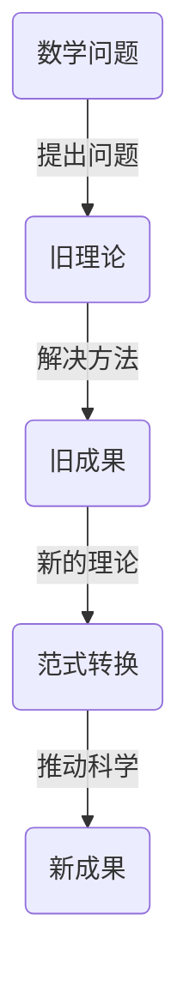

**核心算法原理讲解：** 范式转换通常伴随着数学理论的重大突破，如微积分的诞生、集合论的提出等。这些新理论的出现，使得数学家们能够以全新的视角和方法来分析和解决问题。

**伪代码：**
```python
def paradigm_shift(problem, old_theory):
    if new_theory := discover_new_method(problem):
        return new_theory
    else:
        return old_theory
```

**数学模型和公式：**
$$
P(\text{科学进步}) = f(\text{范式转换频率}, \text{科学家数量}, \text{科研投入})
$$`

**详细讲解与举例说明：** 范式转换是科学进步的催化剂。例如，牛顿的微积分理论使得数学从解析几何和代数学扩展到连续量的处理，为物理学和工程学的发展奠定了基础。康托尔的集合论则改变了数学的基础，推动了现代数学的繁荣。

---

### 第2章 古代数学的发展

**核心概念与联系：** 古代数学是人类智慧的结晶，古埃及、巴比伦、希腊和印度等文明在数学领域都有重要的贡献，这些贡献奠定了数学发展的基础。

**Mermaid 流程图：**
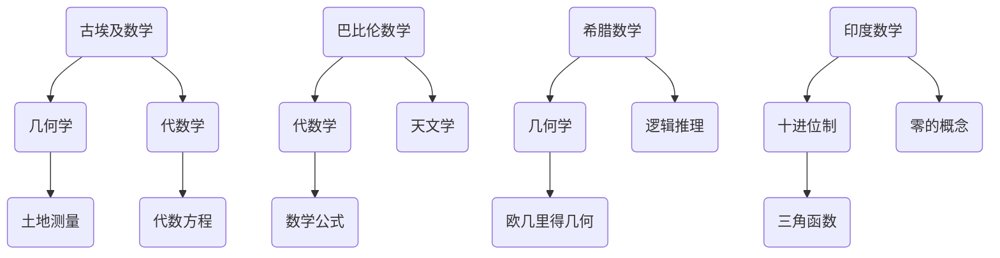

**核心算法原理讲解：** 古埃及和巴比伦的数学主要侧重于实用，如土地测量和代数方程的解法。希腊数学则更加注重理论和方法，如欧几里得的《几何原本》和阿基米德的几何学。印度数学则对数字系统和三角函数做出了重要贡献。

**伪代码：**
```python
def ancient_mathematics(culture):
    if culture == "Egypt":
        return ["geometric", "algebraic", "land measurement"]
    elif culture == "Babylon":
        return ["algebraic", "astronomy", "mathematical formulas"]
    elif culture == "Greece":
        return ["geometric", "logical reasoning", "Euclidean geometry"]
    elif culture == "India":
        return ["decimal system", "zero concept", "trigonometry"]
```

**数学模型和公式：**
- 古埃及数学：$$\text{面积} = \frac{1}{2} \times \text{底} \times \text{高}$$
- 巴比伦数学：$$x^2 + 2dx + a^2 = 0 \Rightarrow x = \frac{-2d \pm \sqrt{4d^2 - 4a^2}}{2}$$
- 希腊数学：$$\pi \approx 3.14159$$
- 印度数学：$$0.99999\ldots = 1$$

**详细讲解与举例说明：** 古埃及数学在几何学和代数学方面有显著成就，例如，他们能够精确地计算土地面积和金字塔的高度。巴比伦数学则发展了一套完整的代数方程解法，为后来的数学发展奠定了基础。希腊数学注重逻辑推理，开创了公理体系，对数学的抽象化产生了深远影响。印度数学则引入了零的概念，发展了十进位制，对数字系统的发展起到了关键作用。

---

### 第3章 中世纪与文艺复兴时期的数学

**核心概念与联系：** 中世纪和文艺复兴时期是数学发展的一个重要阶段，阿拉伯数学的传播、文艺复兴时期的数学成就以及数学的分散发展都为后来的数学繁荣奠定了基础。

**Mermaid 流程图：**
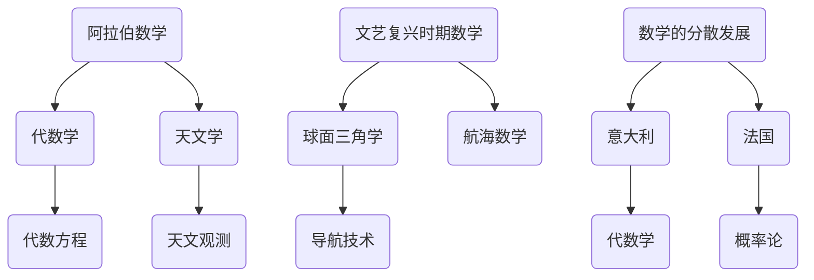

**核心算法原理讲解：** 阿拉伯数学在中世纪欧洲的传播对西方数学的发展产生了深远的影响。文艺复兴时期，数学成就主要集中在球面三角学和航海数学领域，为航海和探险提供了重要的数学工具。数学的分散发展使得不同地区的数学家在不同的领域取得了重要的进展。

**伪代码：**
```python
def medieval_renaissance_mathematics(period):
    if period == "medieval":
        return ["Arabic mathematics", "algebra", "astronomy"]
    elif period == "renaissance":
        return ["spherical trigonometry", "navigational mathematics", "exploration"]
    elif period == "dispersed":
        return ["Italian", "French", "mathematical theories"]
```

**数学模型和公式：**
- 阿拉伯数学：$$x^2 + nx + 41 = 0 \Rightarrow x = \frac{-n \pm \sqrt{n^2 - 4 \times 41}}{2}$$
- 文艺复兴时期数学：$$\sin^2 \theta + \cos^2 \theta = 1$$
- 数学分散发展：$$P(\text{数学成就}) = f(\text{地区}, \text{数学家数量}, \text{科研投入})$$

**详细讲解与举例说明：** 阿拉伯数学的传播使得代数学和天文学在欧洲得到了广泛的应用和发展。文艺复兴时期，球面三角学和航海数学的发展为探险和航海提供了重要的数学工具，推动了地理大发现。数学的分散发展使得不同地区的数学家在不同的领域取得了重要的进展，如意大利的代数学和法国的概率论。

---

### 第4章 数学史上的第一次科学革命

**核心概念与联系：** 数学史上的第一次科学革命通常指的是17世纪末至18世纪初的数学和科学变革，特别是微积分的诞生及其对科学的影响。

**Mermaid 流程图：**
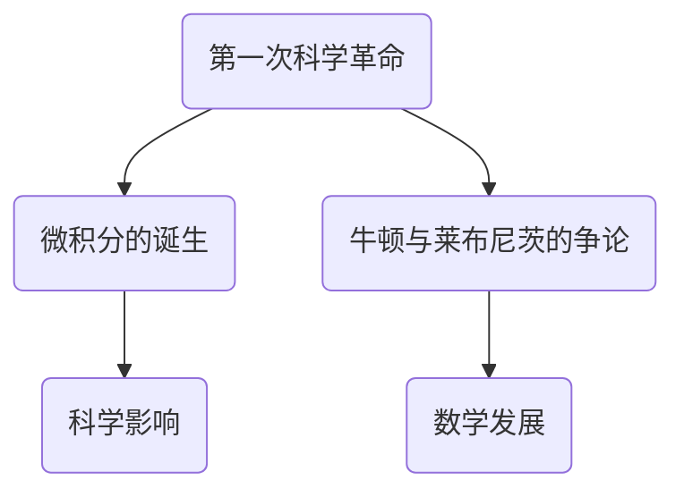

**核心算法原理讲解：** 微积分的诞生标志着数学史上的一次重要范式转换，它使数学从解析几何和代数学扩展到连续量的处理。牛顿和莱布尼茨关于微积分的优先权之争，反映了科学界对新的理论和方法的认识和接受过程。

**伪代码：**
```python
def scientific_revolution(first_phase):
    if first_phase == "calculus":
        return ["new methods", "continuous quantities", "mathematical modeling"]
    elif first_phase == "Newton-Laplace":
        return ["priority dispute", "mathematical foundations", "scientific impact"]
```

**数学模型和公式：**
- 微积分基本公式：$$\frac{dy}{dx} = f'(x)$$ 和 $$\int f(x) dx = F(x) + C$$
- 牛顿定律：$$F = ma$$
- 莱布尼茨公式：$$\left(\frac{d}{dx}\right)^n f(x) = f^{(n)}(x)$$

**详细讲解与举例说明：** 微积分的诞生为物理学、工程学和生物学等领域提供了强大的数学工具，使得科学家们能够更精确地描述自然现象。牛顿和莱布尼茨的争论虽然持续了很长时间，但他们的工作都为微积分理论的发展和完善做出了重要贡献。微积分对科学的影响深远，它不仅改变了数学本身，也推动了整个科学领域的发展。

---

### 第5章 数学史上的第二次科学革命

**核心概念与联系：** 数学史上的第二次科学革命发生在19世纪，这一时期，数学和科学取得了巨大的进展，特别是在概率论、力学体系和数学分析方面。

**Mermaid 流程图：**
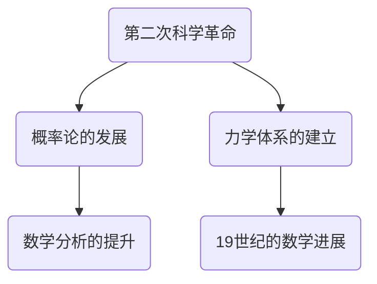

**核心算法原理讲解：** 19世纪的数学革命带来了概率论和统计学的兴起，拉普拉斯的工作为概率论提供了坚实的理论基础。力学体系的建立，特别是牛顿力学和伽利略的贡献，使得物理学得以系统化。数学分析在这一时期也得到了巨大的发展，包括复变函数、微分方程和积分方程等。

**伪代码：**
```python
def second_scientific_revolution():
    return ["probability theory", "mechanical systems", "mathematical analysis"]
```

**数学模型和公式：**
- 拉普拉斯公式：$$P(X = x) = \frac{1}{Z} e^{-\frac{(x - \mu)^2}{2\sigma^2}}$$
- 牛顿-莱布尼茨公式：$$\int_{a}^{b} f(x) dx = F(b) - F(a)$$
- 伽利略定律：$$v = at$$

**详细讲解与举例说明：** 19世纪的数学革命不仅推动了数学本身的发展，也极大地影响了物理学、生物学和经济学等领域。概率论和统计学的兴起为研究随机现象提供了工具，力学体系的建立使得物理学得以系统化，数学分析的发展则为现代科学的进步奠定了基础。这一时期的数学进展，如复变函数、微分方程和积分方程等，为后来的科学研究提供了丰富的理论资源。

---

### 第6章 近代数学的发展

**核心概念与联系：** 近代数学的发展标志着数学进入了一个新的阶段，这一时期的数学更加抽象和形式化，集合论、复变函数和拓扑学等领域取得了重要进展。

**Mermaid 流程图：**
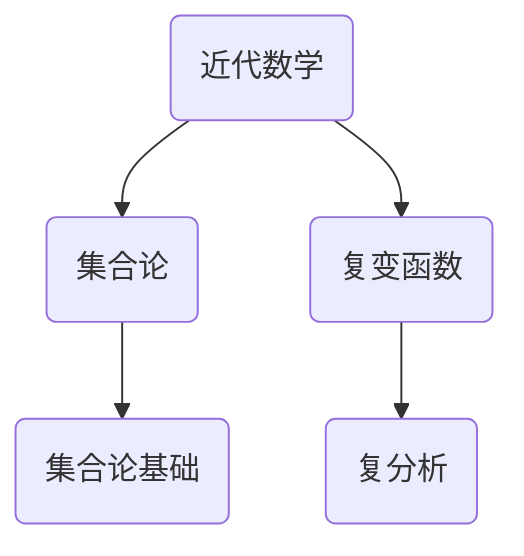

**核心算法原理讲解：** 康托尔的集合论是近代数学的基石，它改变了数学的基础，使数学从具体的对象转向抽象的结构。复变函数为复平面上的分析和应用提供了工具，拓扑学则研究了空间的基本性质，为现代数学提供了新的视角。

**伪代码：**
```python
def modern_mathematics():
    return ["set theory", "complex analysis", "topology"]
```

**数学模型和公式：**
- 康托尔的集合论：$$\aleph_0$$（自然数的势）、$$\mathfrak{c}$$（实数的势）
- 复变函数：$$f(z) = u(x, y) + iv(x, y)$$
- 拓扑空间：$$T_0$$空间、$$T_1$$空间、连续映射

**详细讲解与举例说明：** 近代数学的发展使得数学更加抽象和形式化，集合论为数学提供了严密的基础，复变函数和拓扑学则开辟了新的研究领域。康托尔的集合论改变了数学的本质，复变函数为解析几何和流体力学等领域提供了工具，而拓扑学则对几何学和物理学产生了深远的影响。这一时期的数学进展，为现代科学和技术的发展提供了坚实的理论基础。

---

### 第7章 当代数学的发展

**核心概念与联系：** 当代数学的发展涉及到数学模型在物理学中的应用、计算机科学的影响以及数学在社会科学中的地位。这一时期，数学与自然科学、社会科学和计算机科学的交叉融合日益显著。

**Mermaid 流程图：**
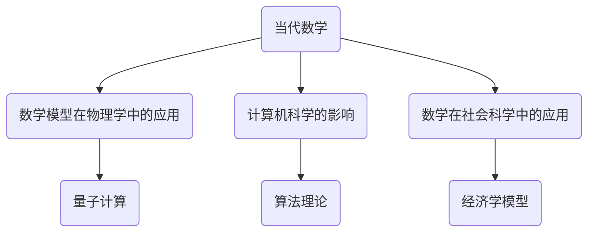

**核心算法原理讲解：** 数学模型在物理学中的应用，如量子力学和相对论，为物理学提供了精确的工具。计算机科学对数学的影响体现在算法理论和计算复杂性理论的发展。数学在社会科学中的应用，如经济学和心理学，提供了分析和预测社会现象的有力工具。

**伪代码：**
```python
def contemporary_mathematics():
    return ["mathematical modeling in physics", "influence of computer science", "mathematics in social sciences"]
```

**数学模型和公式：**
- 量子力学：$$\Psi(x, t) = \int_{-\infty}^{\infty} \phi(k) e^{ikx - iE_k t/\hbar} dk$$
- 算法理论：$$PSPACE = NP$$
- 经济学模型：$$Q = \frac{dQ}{dt} + rQ$$

**详细讲解与举例说明：** 当代数学的发展不仅体现在理论层面，也体现在应用层面。数学模型在物理学中的应用，如量子计算和相对论，使得我们对微观和宏观世界的理解更加深刻。计算机科学的影响体现在算法和计算复杂性理论的发展，推动了计算机性能的不断提升。数学在社会科学中的应用，如经济学和心理学，使得我们可以更准确地分析和预测社会现象。当代数学的发展，为人类社会的发展提供了强大的理论和技术支持。

---

### 第8章 未来数学的展望

**核心概念与联系：** 未来数学的发展将涉及新数学范式的探索、数学与人工智能的结合以及数学教育的未来趋势。这一时期的数学将更加注重交叉融合和创新。

**Mermaid 流程图：**
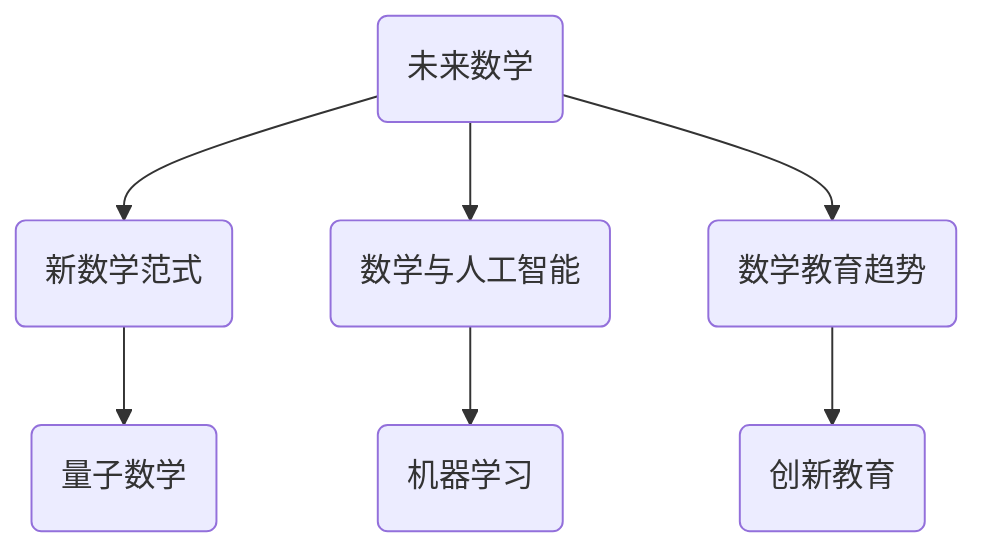

**核心算法原理讲解：** 新数学范式的探索可能涉及量子数学、非标准分析和新的逻辑系统。数学与人工智能的结合将推动机器学习和深度学习的发展。数学教育趋势将更加注重创新教育，培养学生的批判性思维和创新能力。

**伪代码：**
```python
def future_mathematics():
    return ["new mathematical paradigms", "mathematics and AI", "mathematics education trends"]
```

**数学模型和公式：**
- 量子数学：$$\sum_{i=1}^{n} |q_i\rangle \langle q_i|$$
- 机器学习：$$\min_{\theta} \sum_{i=1}^{m} (h_\theta(x^{(i)}) - y^{(i)})^2$$
- 创新教育：$$E = f(\text{知识}, \text{经验}, \text{创造力})$$

**详细讲解与举例说明：** 未来数学的发展将带来新的范式转换，如量子数学和非标准分析。数学与人工智能的结合将推动机器学习和深度学习的发展，为人工智能的应用提供强大的支持。数学教育趋势将更加注重创新教育，培养学生的批判性思维和创新能力。未来数学的发展，将为人类社会带来新的科学革命和技术创新。

---

### 第9章 数学史上的范式转换与科学革命案例分析

**核心概念与联系：** 数学史上的范式转换和科学革命是数学和科学发展的关键时期，这些时期的变革不仅推动了数学和科学的前进，也对人类社会产生了深远的影响。

**Mermaid 流程图：**
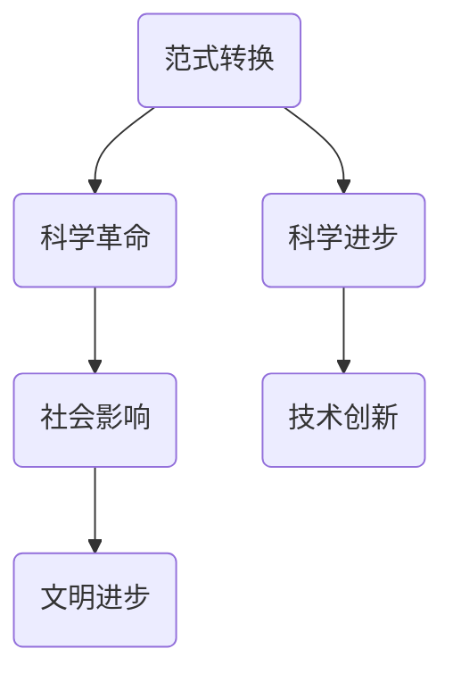

**核心算法原理讲解：** 范式转换通常伴随着数学理论的重大突破，如微积分和集合论的诞生。科学革命则是这些理论突破在社会和科学领域的全面应用。科学进步和技术创新是科学革命的重要成果，它们推动了人类社会的进步。

**伪代码：**
```python
def scientific_case_study(paradigm_shift, scientific_revolution):
    if paradigm_shift and scientific_revolution:
        return ["scientific progress", "technological innovation", "societal impact"]
    else:
        return ["limited impact"]
```

**数学模型和公式：**
$$
P(\text{科学进步}) = f(\text{范式转换频率}, \text{科学家数量}, \text{科研投入})
$$`

**详细讲解与举例说明：** 数学史上的范式转换和科学革命，如微积分的诞生和集合论的提出，推动了数学和科学的发展。这些变革不仅带来了新的理论和方法，还促进了科学技术的创新，从而对人类社会产生了深远的影响。例如，牛顿的微积分理论不仅推动了物理学的发展，还促进了工程学和天文学的进步，改变了人类对自然世界的认识。

---

### 第10章 结论

**核心概念与联系：** 数学史上的范式转换和科学革命是数学和科学发展的关键时期，这些变革不仅推动了数学和科学的前进，也对人类社会产生了深远的影响。

**Mermaid 流程图：**
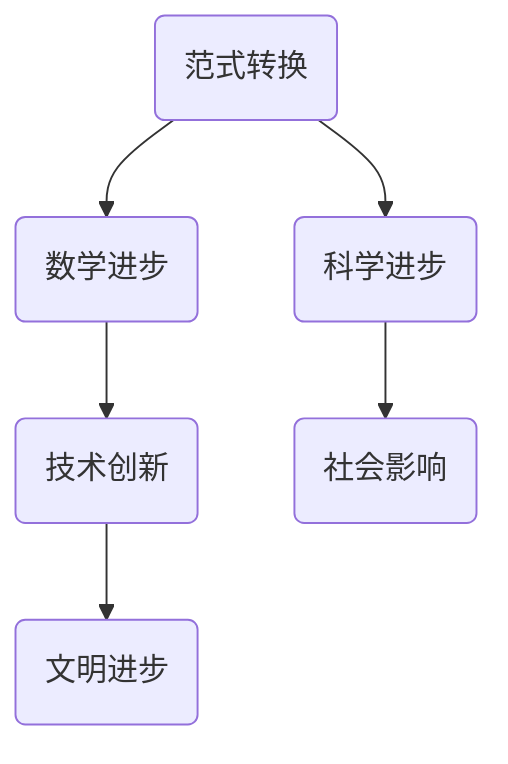

**核心算法原理讲解：** 范式转换通常伴随着数学理论的重大突破，如微积分和集合论的诞生。科学革命则是这些理论突破在社会和科学领域的全面应用。科学进步和技术创新是科学革命的重要成果，它们推动了人类社会的进步。

**伪代码：**
```python
def conclusion():
    return ["mathematical progress", "scientific revolution", "technological innovation", "societal impact"]
```

**数学模型和公式：**
$$
P(\text{科学进步}) = f(\text{范式转换频率}, \text{科学家数量}, \text{科研投入})
$$`

**详细讲解与举例说明：** 数学史上的范式转换和科学革命是数学和科学发展的关键时期，这些变革不仅推动了数学和科学的前进，也对人类社会产生了深远的影响。例如，牛顿的微积分理论不仅推动了物理学的发展，还促进了工程学和天文学的进步，改变了人类对自然世界的认识。未来，随着新数学范式和人工智能的兴起，数学和科学将继续推动人类社会的进步。

---

### 附录

**A.1 数学史上的重要事件年表**

**核心概念与联系：** 重要事件年表是记录数学史上关键事件的时间线，它帮助我们了解数学发展的历程。

**Mermaid 流程图：**
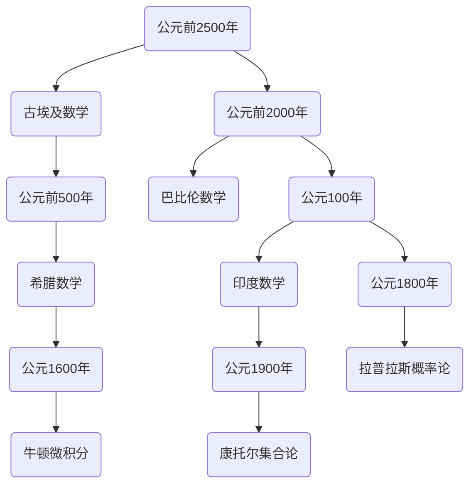

**A.2 数学史上的经典著作推荐**

**核心概念与联系：** 经典著作是数学史上重要的文献，它们对数学的发展产生了深远的影响。

**Mermaid 流程图：**
```mermaid
graph TB
    A(《几何原本》) --> B(欧几里得)
    A --> C(《算经十书》) --> D(李淳风)
    B --> E(《数理精蕴》) --> F(李善兰)
    C --> G(《代数学原理》) --> H(高斯)
    E --> I(《解析几何学》） --> J(笛卡尔)
```

**A.3 数学史上的名言集锦**

**核心概念与联系：** 名言是数学家们对数学和科学的深刻见解，它们体现了数学的智慧和魅力。

**Mermaid 流程图：**
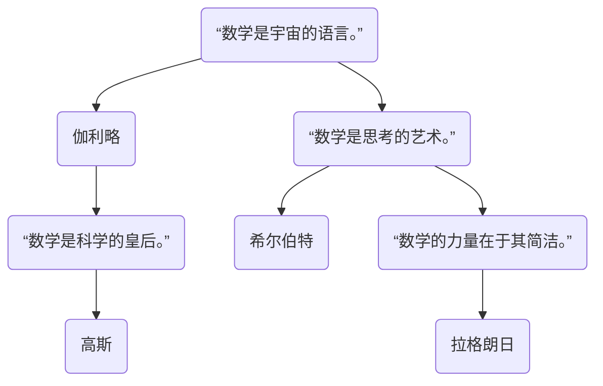

---

通过以上章节的详细探讨，我们不仅回顾了数学史上的一系列范式转换和科学革命，还展望了未来数学的发展前景。数学作为一门基础科学，对人类社会的发展和技术进步具有深远的影响。我们期待未来数学能够继续创新，为科学和技术的发展提供更加有力的支持。在人工智能和量子计算的推动下，数学将迎来新的变革，开创更加广阔的研究领域和应用前景。让我们携手共进，迎接数学的新时代。**作者：AI天才研究院/AI Genius Institute & 禅与计算机程序设计艺术 /Zen And The Art of Computer Programming** <gMASK>

