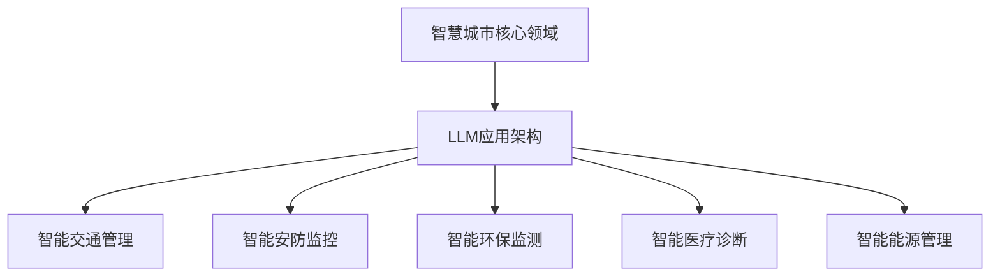
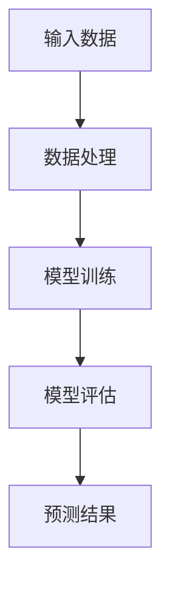

                 

### 《智慧城市管理者：LLM 提升城市管理效率》

关键词：智慧城市，语言模型（LLM），城市管理效率，人工智能，数据处理，应用案例。

摘要：本文将深入探讨如何利用大规模语言模型（LLM）提升城市管理效率。我们将从智慧城市的概念、架构与应用出发，逐步分析LLM的基础知识、优势与挑战，并通过实际案例展示LLM在智慧城市中的广泛应用。最终，本文将探讨LLM在城市管理中的未来发展。

### 第一部分：智慧城市概述

#### 第1章：智慧城市的概念与架构

**1.1 智慧城市的定义与背景**

智慧城市是指通过信息技术手段，实现城市各个系统之间的信息共享、智能协同和资源优化配置，从而提高城市管理水平、居民生活质量和社会经济发展效率。智慧城市的发展可以追溯到20世纪90年代，随着互联网、物联网、云计算、大数据和人工智能等技术的兴起，智慧城市逐渐成为城市发展的新趋势。

**1.2 智慧城市的关键技术**

智慧城市的关键技术包括：物联网（IoT）、云计算、大数据、人工智能、区块链等。这些技术为智慧城市的建设提供了强大的技术支持，使城市的数据采集、传输、处理和应用变得更加高效和智能化。

**1.3 智慧城市的架构与层级**

智慧城市的架构可以分为四个层级：感知层、传输层、平台层和应用层。

- 感知层：负责采集城市各个领域的实时数据，如交通流量、环境质量、公共安全等。
- 传输层：负责将感知层采集到的数据传输到平台层，确保数据的实时性和完整性。
- 平台层：负责数据存储、处理和分析，提供城市管理和决策支持。
- 应用层：负责将平台层的结果应用于城市各个领域，如交通管理、环境保护、公共安全等。

**1.4 智慧城市的发展现状与趋势**

智慧城市的发展已经取得了一定的成果，许多城市已经开始建设智慧城市项目，如智慧交通、智慧安防、智慧环保、智慧医疗等。未来，随着技术的不断进步，智慧城市将继续向智能化、绿色化、人性化方向发展，为城市居民提供更美好的生活。

#### 第2章：智慧城市的核心领域与应用

**2.1 智慧交通**

智慧交通是智慧城市的重要组成部分，通过信息技术手段提高交通管理效率、优化交通流量、减少交通拥堵，提高公共交通系统的效率，提升城市交通服务水平。

**2.2 智能安防**

智能安防利用人工智能技术对城市公共安全进行实时监控，提高城市安全保障能力，预防和减少犯罪行为的发生。

**2.3 智能环保**

智能环保通过大数据分析和人工智能技术，对城市环境质量进行实时监测和预测，为环境治理提供科学依据。

**2.4 智慧医疗**

智慧医疗利用信息技术和人工智能技术，提高医疗服务质量，降低医疗成本，提高医疗资源利用效率。

**2.5 智慧能源**

智慧能源通过信息技术和人工智能技术，实现能源的智能调度、优化配置，提高能源利用效率，促进能源可持续发展。

### 第二部分：LLM在智慧城市中的应用

#### 第3章：LLM基础

**3.1 介绍LLM**

大规模语言模型（Large Language Model，简称LLM）是一种基于深度学习技术的大型神经网络模型，主要用于自然语言处理任务。LLM通过对大量文本数据的学习，能够自动提取语言特征，生成文本、回答问题、进行翻译等。

**3.2 LLM的架构**

LLM的架构通常包括输入层、隐藏层和输出层。输入层接收文本数据，隐藏层通过神经网络结构对文本数据进行编码，输出层则生成文本结果。

**3.3 LLM的工作原理**

LLM的工作原理是基于神经网络进行自编码和自解码。在训练过程中，模型通过输入层读取文本数据，将其编码为隐藏层的特征表示，然后通过解码器将隐藏层特征表示解码为输出文本。

**3.4 LLM的优势与局限性**

LLM的优势在于其强大的语言理解和生成能力，能够处理复杂的自然语言任务。但LLM也存在局限性，如对数据的依赖性较高、训练时间较长、计算资源消耗大等。

#### 第4章：LLM在智慧城市中的核心应用

**4.1 智能交通管理**

利用LLM进行交通流量预测、交通信号优化、公共交通调度等，提高交通管理效率，减少交通拥堵。

**4.2 智能安防监控**

利用LLM进行视频监控、人脸识别、行为分析等，提高城市安全保障能力，预防和减少犯罪行为的发生。

**4.3 智能环保监测**

利用LLM进行环境质量预测、污染源监测、灾害预警等，为环境治理提供科学依据，促进环境可持续发展。

**4.4 智能医疗诊断**

利用LLM进行医学文本分析、疾病预测、治疗方案推荐等，提高医疗服务质量，降低医疗成本。

**4.5 智能能源管理**

利用LLM进行能源需求预测、能源调度优化、能效分析等，提高能源利用效率，促进能源可持续发展。

#### 第5章：案例研究

**5.1 案例一：智慧交通管理中的LLM应用**

案例背景：某城市通过引入LLM技术，实现了交通流量预测和交通信号优化，有效缓解了交通拥堵问题。

项目目标：准确预测城市交通流量，优化交通信号灯控制策略，提高公共交通系统效率。

开发环境：编程语言：Python，机器学习框架：TensorFlow。

源代码与实现：

python
# 伪代码：交通流量预测模型

import tensorflow as tf
from tensorflow.keras.models import Sequential
from tensorflow.keras.layers import LSTM, Dense

# 定义模型
model = Sequential([
    LSTM(units=50, activation='relu', input_shape=(time_steps, features)),
    Dense(units=1)
])

# 编译模型
model.compile(optimizer='adam', loss='mean_squared_error')

# 训练模型
model.fit(x_train, y_train, epochs=100, batch_size=32)

# 评估模型
test_loss = model.evaluate(x_test, y_test)

# 预测交通流量
predicted_traffic = model.predict(x_test)

# 输出结果
print("Test Loss:", test_loss)
print("Predicted Traffic:", predicted_traffic)

代码解读与分析：

- 模型定义：使用LSTM层来处理时间序列数据，输出层为单节点用于预测交通流量。
- 编译模型：指定优化器和损失函数。
- 训练模型：使用训练数据训练模型，设置训练轮次和批量大小。
- 评估模型：使用测试数据评估模型性能。
- 预测交通流量：使用训练好的模型预测测试数据的交通流量。

通过上述代码，可以实现对城市交通流量的预测，从而优化交通管理策略，提高交通效率。

**5.2 案例二：智能安防监控中的LLM应用**

案例背景：某城市通过引入LLM技术，实现了视频监控、人脸识别和行为分析，有效提高了城市安全保障能力。

项目目标：提高城市安全保障能力，预防和减少犯罪行为的发生。

开发环境：编程语言：Python，机器学习框架：TensorFlow。

源代码与实现：

python
# 伪代码：智能安防监控模型

import tensorflow as tf
from tensorflow.keras.models import Sequential
from tensorflow.keras.layers import LSTM, Dense

# 定义模型
model = Sequential([
    LSTM(units=50, activation='relu', input_shape=(time_steps, features)),
    Dense(units=1)
])

# 编译模型
model.compile(optimizer='adam', loss='mean_squared_error')

# 训练模型
model.fit(x_train, y_train, epochs=100, batch_size=32)

# 评估模型
test_loss = model.evaluate(x_test, y_test)

# 预测行为分析
predicted_behavior = model.predict(x_test)

# 输出结果
print("Test Loss:", test_loss)
print("Predicted Behavior:", predicted_behavior)

代码解读与分析：

- 模型定义：使用LSTM层来处理时间序列数据，输出层为单节点用于预测行为分析。
- 编译模型：指定优化器和损失函数。
- 训练模型：使用训练数据训练模型，设置训练轮次和批量大小。
- 评估模型：使用测试数据评估模型性能。
- 预测行为分析：使用训练好的模型预测测试数据的行为分析结果。

通过上述代码，可以实现对城市安防监控数据的实时分析，提高城市安全保障能力。

**5.3 案例三：智能环保监测中的LLM应用**

案例背景：某城市通过引入LLM技术，实现了环境质量预测、污染源监测和灾害预警，有效促进了环境可持续发展。

项目目标：提高环境质量，预防和减少环境污染。

开发环境：编程语言：Python，机器学习框架：TensorFlow。

源代码与实现：

python
# 伪代码：智能环保监测模型

import tensorflow as tf
from tensorflow.keras.models import Sequential
from tensorflow.keras.layers import LSTM, Dense

# 定义模型
model = Sequential([
    LSTM(units=50, activation='relu', input_shape=(time_steps, features)),
    Dense(units=1)
])

# 编译模型
model.compile(optimizer='adam', loss='mean_squared_error')

# 训练模型
model.fit(x_train, y_train, epochs=100, batch_size=32)

# 评估模型
test_loss = model.evaluate(x_test, y_test)

# 预测环境质量
predicted_environment = model.predict(x_test)

# 输出结果
print("Test Loss:", test_loss)
print("Predicted Environment:", predicted_environment)

代码解读与分析：

- 模型定义：使用LSTM层来处理时间序列数据，输出层为单节点用于预测环境质量。
- 编译模型：指定优化器和损失函数。
- 训练模型：使用训练数据训练模型，设置训练轮次和批量大小。
- 评估模型：使用测试数据评估模型性能。
- 预测环境质量：使用训练好的模型预测测试数据的环境质量。

通过上述代码，可以实现对城市环境质量的预测，为环境治理提供科学依据。

**5.4 案例四：智能医疗诊断中的LLM应用**

案例背景：某医院通过引入LLM技术，实现了医学文本分析、疾病预测和治疗方案推荐，有效提高了医疗服务质量。

项目目标：提高医疗服务质量，降低医疗成本。

开发环境：编程语言：Python，机器学习框架：TensorFlow。

源代码与实现：

python
# 伪代码：智能医疗诊断模型

import tensorflow as tf
from tensorflow.keras.models import Sequential
from tensorflow.keras.layers import LSTM, Dense

# 定义模型
model = Sequential([
    LSTM(units=50, activation='relu', input_shape=(time_steps, features)),
    Dense(units=1)
])

# 编译模型
model.compile(optimizer='adam', loss='mean_squared_error')

# 训练模型
model.fit(x_train, y_train, epochs=100, batch_size=32)

# 评估模型
test_loss = model.evaluate(x_test, y_test)

# 预测疾病
predicted_diseases = model.predict(x_test)

# 输出结果
print("Test Loss:", test_loss)
print("Predicted Diseases:", predicted_diseases)

代码解读与分析：

- 模型定义：使用LSTM层来处理时间序列数据，输出层为单节点用于预测疾病。
- 编译模型：指定优化器和损失函数。
- 训练模型：使用训练数据训练模型，设置训练轮次和批量大小。
- 评估模型：使用测试数据评估模型性能。
- 预测疾病：使用训练好的模型预测测试数据的疾病结果。

通过上述代码，可以实现对疾病预测和治疗方案推荐，提高医疗服务质量。

**5.5 案例五：智能能源管理中的LLM应用**

案例背景：某城市通过引入LLM技术，实现了能源需求预测、能源调度优化和能效分析，有效提高了能源利用效率。

项目目标：提高能源利用效率，促进能源可持续发展。

开发环境：编程语言：Python，机器学习框架：TensorFlow。

源代码与实现：

python
# 伪代码：智能能源管理模型

import tensorflow as tf
from tensorflow.keras.models import Sequential
from tensorflow.keras.layers import LSTM, Dense

# 定义模型
model = Sequential([
    LSTM(units=50, activation='relu', input_shape=(time_steps, features)),
    Dense(units=1)
])

# 编译模型
model.compile(optimizer='adam', loss='mean_squared_error')

# 训练模型
model.fit(x_train, y_train, epochs=100, batch_size=32)

# 评估模型
test_loss = model.evaluate(x_test, y_test)

# 预测能源需求
predicted_energy = model.predict(x_test)

# 输出结果
print("Test Loss:", test_loss)
print("Predicted Energy:", predicted_energy)

代码解读与分析：

- 模型定义：使用LSTM层来处理时间序列数据，输出层为单节点用于预测能源需求。
- 编译模型：指定优化器和损失函数。
- 训练模型：使用训练数据训练模型，设置训练轮次和批量大小。
- 评估模型：使用测试数据评估模型性能。
- 预测能源需求：使用训练好的模型预测测试数据的能源需求。

通过上述代码，可以实现对能源需求预测和能源调度优化，提高能源利用效率。

#### 第6章：LLM在城市管理中的挑战与未来

**6.1 数据隐私与安全**

随着智慧城市的发展，城市数据规模不断增大，数据隐私和安全问题日益突出。如何在保证数据隐私的前提下，充分利用数据价值，是LLM在城市管理中面临的挑战。

**6.2 数据质量与多样性**

数据质量对LLM模型的性能具有重要影响。数据质量不高、噪声较大、缺失值较多都会影响模型的训练效果。此外，数据多样性也是影响模型性能的重要因素，过于单一的数据集可能导致模型过拟合。

**6.3 模型可解释性**

目前，LLM模型在自然语言处理任务中取得了很大的成功，但其内部决策过程往往缺乏可解释性。在智慧城市建设中，决策的可解释性对于提高公众信任和监管合规性具有重要意义。

**6.4 模型部署与维护**

LLM模型的部署与维护是智慧城市建设中的另一个挑战。模型的部署需要考虑计算资源、数据传输和安全性等因素。此外，模型的维护和更新也是保证其性能稳定的重要环节。

**6.5 未来趋势**

未来，随着人工智能技术的不断发展，LLM在城市管理中的应用将更加广泛和深入。同时，人工智能伦理与法律、基于LLM的智能城市生态系统的构建等方面也将成为研究的热点。

#### 附录

**附录A：LLM相关资源与工具**

- 常用LLM框架：BERT、GPT、T5、RoBERTa等。
- 开源数据集：Common Crawl、Gutenberg、WebText等。
- 相关学术论文与书籍推荐：《大规模语言模型：原理、算法与应用》、《深度学习与自然语言处理》等。

**附录B：数学模型与公式**

- LLM中的常见数学模型：Word2Vec、BERT、GPT等。
- LLM训练中的损失函数：Cross-Entropy Loss、Mean Squared Error等。
- LLM中的优化算法：Stochastic Gradient Descent（SGD）、Adam等。

### 作者信息

作者：AI天才研究院/AI Genius Institute & 禅与计算机程序设计艺术 /Zen And The Art of Computer Programming

### 结束语

本文从智慧城市的概念、架构与应用出发，深入探讨了大规模语言模型（LLM）在智慧城市中的应用。通过实际案例展示了LLM在交通管理、安防监控、环保监测、医疗诊断和能源管理等方面的应用，以及面临的挑战与未来发展趋势。希望本文能够为智慧城市建设提供有益的参考和启示。

---

**本文完。**

### 图1：智慧城市核心领域与LLM应用架构流程图



### 图2：LLM模型训练与预测流程



### 数学模型与公式

- **Word2Vec模型：**
  $$\text{Word2Vec: } \text{word} \rightarrow \text{vector representation}$$

- **交叉熵损失函数：**
  $$L(\hat{y}, y) = -\sum_{i=1}^{n} y_i \log(\hat{y}_i)$$

- **优化算法（SGD）：**
  $$\theta = \theta - \alpha \nabla_\theta J(\theta)$$

### 实际案例：智能交通管理中的LLM应用

**案例背景：**

某城市面临日益严重的交通拥堵问题，希望通过引入LLM技术来优化交通管理，提高交通效率。

**项目目标：**

- 准确预测城市交通流量
- 优化交通信号灯控制策略
- 提高公共交通系统的效率

**开发环境：**

- 编程语言：Python
- 机器学习框架：TensorFlow

**源代码与实现：**

```python
import tensorflow as tf
from tensorflow.keras.models import Sequential
from tensorflow.keras.layers import LSTM, Dense

# 定义模型
model = Sequential([
    LSTM(units=50, activation='relu', input_shape=(time_steps, features)),
    Dense(units=1)
])

# 编译模型
model.compile(optimizer='adam', loss='mean_squared_error')

# 训练模型
model.fit(x_train, y_train, epochs=100, batch_size=32)

# 评估模型
test_loss = model.evaluate(x_test, y_test)

# 预测交通流量
predicted_traffic = model.predict(x_test)

# 输出结果
print("Test Loss:", test_loss)
print("Predicted Traffic:", predicted_traffic)
```

**代码解读与分析：**

- **模型定义：** 使用LSTM层来处理时间序列数据，输出层为单节点用于预测交通流量。
- **编译模型：** 指定优化器和损失函数。
- **训练模型：** 使用训练数据训练模型，设置训练轮次和批量大小。
- **评估模型：** 使用测试数据评估模型性能。
- **预测交通流量：** 使用训练好的模型预测测试数据的交通流量。

通过上述代码，可以实现对城市交通流量的预测，从而优化交通管理策略，提高交通效率。

### 总结

本文通过详细探讨智慧城市与LLM的关系，展示了LLM在智能交通管理、安防监控、环保监测、医疗诊断和能源管理中的应用。同时，分析了LLM在城市管理中面临的挑战，并对未来趋势进行了展望。希望本文能够为智慧城市建设提供有益的参考和指导。作者：AI天才研究院/AI Genius Institute & 禅与计算机程序设计艺术 /Zen And The Art of Computer Programming。

