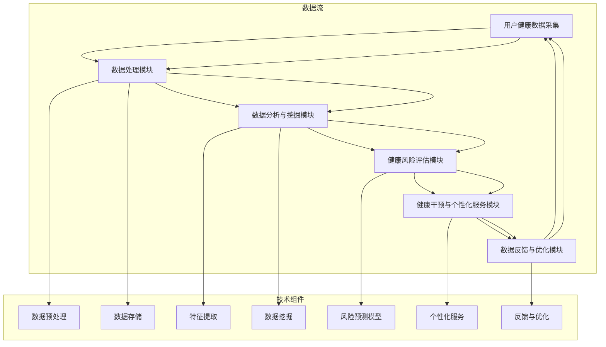
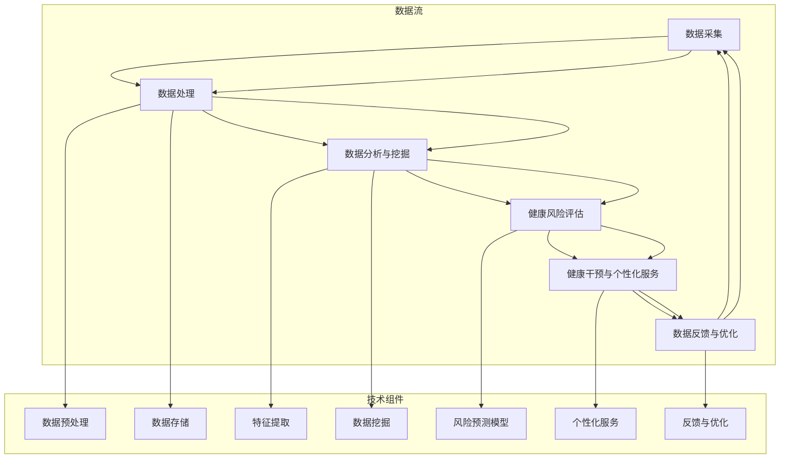

                 

### 智能健康管理系统架构流程图

智能健康管理系统是一个复杂且多维的系统，它通过整合多种技术和数据来源，为用户提供全面、个性化的健康管理和医疗服务。为了更好地理解系统的工作原理和架构，我们使用Mermaid图形化工具绘制了智能健康管理系统架构流程图，具体如下：



- **A[用户健康数据采集]**：这一步骤涉及多种数据源的采集，包括用户生理数据、生活习惯数据、环境数据等。数据可以通过传感器、移动应用、远程医疗设备等多种方式进行收集。

- **B[数据处理模块]**：包括数据预处理、数据存储等步骤。数据预处理是对采集到的原始数据进行清洗、归一化、去噪等处理，以提高数据质量和后续分析的准确性。数据存储则用于持久化存储处理后的数据，便于后续的读取和分析。

- **C[数据分析与挖掘模块]**：包括特征提取和数据挖掘两个子模块。特征提取是从处理后的数据中提取出对健康评估有重要影响的特征，如血压、心率、睡眠质量等。数据挖掘则是使用机器学习算法对提取出的特征进行分析，以发现用户健康状况的趋势和潜在风险。

- **D[健康风险评估模块]**：该模块利用前一个模块分析得到的数据，通过训练好的风险预测模型对用户的健康状况进行评估，输出健康风险评估结果。

- **E[健康干预与个性化服务模块]**：根据健康风险评估结果，系统可以为用户提供个性化的健康干预建议，如饮食建议、运动计划、医学咨询等。

- **F[数据反馈与优化模块]**：用户的行为数据和健康评估结果会被收集并反馈到系统中，用于模型优化和系统改进，形成一个闭环反馈机制。

通过这个架构流程图，我们可以清晰地看到智能健康管理系统的各个环节及其相互之间的关系。接下来，我们将深入探讨每个模块的具体技术实现和功能。

### 核心概念与联系

在深入探讨智能健康管理系统的各个模块之前，我们需要先明确几个核心概念，并理解它们之间的联系。

- **智能健康管理系统的定义**：智能健康管理系统是一种利用人工智能、大数据、物联网等先进技术，对用户的健康数据进行采集、处理、分析和评估，进而提供个性化健康建议和干预措施的系统。

- **预防医学的数字化实践**：预防医学是指通过早期发现、早期干预等手段来降低疾病的发生率和严重程度。数字化实践则是指利用数字化技术和工具，如传感器、移动应用、大数据分析等，来提升预防医学的效率和效果。

- **健康数据**：健康数据包括用户的生理数据（如血压、心率、血糖等）、生活习惯数据（如饮食、运动、睡眠等）和环境数据（如空气质量、温度等）。这些数据是智能健康管理系统的基石。

- **数据处理与分析**：数据处理与分析是智能健康管理系统的核心环节。通过数据预处理、特征提取、数据挖掘等技术，系统可以从大量的健康数据中提取出对健康评估有重要影响的特征，并利用机器学习算法进行分析，以发现用户的健康趋势和潜在风险。

- **健康风险评估**：健康风险评估是利用收集到的健康数据和预先训练好的风险预测模型，对用户的健康状况进行评估，以确定其患病风险。这有助于用户采取预防措施，减少疾病的发生。

- **健康干预与个性化服务**：基于健康风险评估的结果，系统可以为用户提供个性化的健康干预建议和个性化服务。这些服务可能包括健康建议、医疗咨询、运动计划、饮食指导等。

- **数据反馈与优化**：用户的行为数据和健康评估结果会被反馈到系统中，用于模型优化和系统改进。这种闭环反馈机制有助于不断提高系统的准确性和实用性。

通过上述核心概念和联系，我们可以更好地理解智能健康管理系统的整体架构和功能。接下来，我们将逐一探讨各个模块的技术实现和具体功能。

#### 健康风险评估模型伪代码

为了更好地理解健康风险评估模型的工作原理，下面我们将使用伪代码的形式，详细描述模型的构建和预测过程。

首先，我们需要定义输入数据集和输出结果。输入数据集通常包括用户的生理指标、生活习惯和环境数据等。输出结果是一个健康风险评估分数，用于表示用户患某种疾病的概率。

```python
# 健康风险评估模型伪代码

# 输入：用户健康数据集（如血压、血糖、体重等）
# 输出：健康风险评估结果

# 定义数据集
data = {
    'blood_pressure': [],
    'glucose_level': [],
    'body_weight': [],
    'lifestyle': [],
    'environment': []
}

# 数据预处理
def preprocess_data(data):
    # 数据清洗、缺失值填充、标准化等操作
    # 返回处理后的数据
    return processed_data

# 特征提取
def extract_features(processed_data):
    # 提取健康数据中的关键特征
    # 返回特征向量
    return features

# 训练风险预测模型
def train_risk_model(features, labels):
    # 使用机器学习算法训练风险预测模型
    # 返回训练好的模型
    return model

# 进行健康风险评估
def health_risk_assessment(model, new_data):
    # 对新数据集进行预测
    risk_score = model.predict(new_data)
    return risk_score

# 主函数
def main():
    # 加载数据集
    data = load_data()

    # 预处理数据
    processed_data = preprocess_data(data)

    # 提取特征
    features = extract_features(processed_data)

    # 加载训练集标签
    labels = load_labels()

    # 训练模型
    model = train_risk_model(features, labels)

    # 预测健康风险
    new_data = get_new_data()  # 假设有一个函数获取新的用户数据
    risk_score = health_risk_assessment(model, new_data)

    # 输出结果
    print("健康风险评估分数：", risk_score)

# 执行主函数
main()
```

在上面的伪代码中，我们首先定义了数据集和预处理函数。预处理函数用于清洗和标准化数据，以提高模型的准确性。

接下来，我们定义了特征提取函数，用于从预处理后的数据中提取关键特征。这些特征将用于训练风险预测模型。

训练风险预测模型的函数使用了机器学习算法，如随机森林、支持向量机或神经网络等。这里我们使用一个通用的`train_risk_model`函数，实际实现时会选择适合的数据集和算法。

最后，我们定义了一个主函数，用于加载数据、训练模型和进行健康风险评估。在主函数中，我们首先加载数据集，然后对数据进行预处理和特征提取。接下来，我们使用训练集标签来训练风险预测模型。最后，我们使用训练好的模型对新的用户数据集进行预测，并输出健康风险评估分数。

通过这个伪代码，我们可以看到健康风险评估模型的基本构建过程。实际开发中，还需要考虑模型的调优、验证和部署等问题。

#### 数学模型和公式

在智能健康管理系统中，数学模型和公式起着至关重要的作用，它们帮助我们量化健康风险、预测疾病的发生概率，并为用户提供个性化的健康建议。下面我们将介绍一些关键的数学模型和公式，并详细讲解它们的应用场景和计算方法。

1. **贝叶斯网络**

贝叶斯网络是一种表示变量之间依赖关系的图形模型，它由一组节点和有向边组成，每个节点表示一个随机变量，边表示变量之间的条件依赖关系。贝叶斯网络的公式如下：

$$
P(A|B,C) = \frac{P(B|A,C) \cdot P(C|A) \cdot P(A)}{P(B,C)}
$$

其中，$P(A|B,C)$ 表示在 $B$ 和 $C$ 条件下 $A$ 的概率。贝叶斯网络广泛应用于疾病预测、风险管理等领域。

**应用场景**：例如，在预测某种疾病（$A$）的概率时，我们可以根据已知的症状（$B$）和其他相关因素（$C$）来计算该疾病的可能性。通过调整贝叶斯网络的参数，可以优化预测模型的准确性。

2. **逻辑回归模型**

逻辑回归是一种常用的分类模型，用于预测某个事件发生的概率。逻辑回归的公式如下：

$$
\log\left(\frac{P(Y=1|X)}{1 - P(Y=1|X)}\right) = \beta_0 + \beta_1X_1 + \beta_2X_2 + \ldots + \beta_nX_n
$$

其中，$Y$ 表示事件是否发生（二元变量），$X_1, X_2, \ldots, X_n$ 表示影响事件发生的特征变量，$\beta_0, \beta_1, \beta_2, \ldots, \beta_n$ 是模型的参数。

**应用场景**：例如，在预测用户患某种疾病（如糖尿病）的概率时，我们可以使用逻辑回归模型，将用户的生理指标（如血糖、血压等）作为特征变量，计算患病的概率。

3. **决策树**

决策树是一种树形结构，用于分类或回归任务。每个内部节点表示一个特征测试，每个分支表示该特征的取值，每个叶子节点表示一个类别或回归值。决策树的公式如下：

$$
f(X) = \sum_{i=1}^{n} \alpha_i g(X_i)
$$

其中，$f(X)$ 表示预测结果，$g(X_i)$ 表示第 $i$ 个特征的取值，$\alpha_i$ 表示第 $i$ 个特征的重要程度。

**应用场景**：例如，在制定个性化健康建议时，我们可以使用决策树模型来分析用户的行为数据，识别可能导致健康问题的因素，并给出相应的建议。

4. **支持向量机（SVM）**

支持向量机是一种强大的分类和回归模型，它通过找到一个最优超平面来分隔数据。SVM的公式如下：

$$
w^T x - b = 0
$$

其中，$w$ 表示超平面的法向量，$x$ 表示数据点，$b$ 表示偏置。

**应用场景**：例如，在疾病预测中，我们可以使用SVM模型来划分健康人群和患病人群，以提高预测的准确性。

5. **神经网络**

神经网络是一种模拟人脑神经元结构的计算模型，它可以用于复杂的模式识别和预测任务。神经网络的公式如下：

$$
a_{i}^{(l)} = \sigma(z_{i}^{(l)})
$$

$$
z_{i}^{(l)} = \sum_{j} w_{ji}^{(l)} a_{j}^{(l-1)}
$$

其中，$a_{i}^{(l)}$ 表示第 $l$ 层的第 $i$ 个神经元的激活值，$\sigma$ 表示激活函数，$z_{i}^{(l)}$ 表示第 $l$ 层的第 $i$ 个神经元的输入值，$w_{ji}^{(l)}$ 表示从第 $(l-1)$ 层的第 $j$ 个神经元到第 $l$ 层的第 $i$ 个神经元的权重。

**应用场景**：例如，在个性化健康建议中，我们可以使用神经网络模型来分析用户的健康数据，预测其未来的健康状况，并给出相应的健康建议。

通过上述数学模型和公式，我们可以更好地理解和应用智能健康管理系统中的关键技术和方法。在实际应用中，根据具体需求和数据特性，可以选择合适的模型和公式，以提高预测的准确性和实用性。

#### 项目实战：智能健康管理系统的实际应用案例

在智能健康管理系统中，实际应用案例是验证技术和理论效果的关键。下面，我们将通过一个慢性病管理系统的开发案例，详细描述项目背景、实施流程、关键技术和实施效果。

### 项目背景

随着生活方式的改变和人口老龄化，慢性病如高血压、糖尿病等的发病率逐年上升。慢性病管理不仅仅是药物治疗，更需要综合干预，包括生活方式的改变、饮食调整、定期监测等。为了提高慢性病管理的效率和效果，我们决定开发一个智能慢性病管理系统。

### 项目目标

- 提供一个集成化的平台，帮助患者进行自我监测和管理。
- 实时收集和分析患者的健康数据，提供个性化的健康建议。
- 支持医生对患者的远程监控和管理。

### 实施流程

#### 1. 需求分析

在项目启动阶段，我们与医生、公共卫生专家和患者代表进行了多次沟通，了解他们的需求和期望。通过需求分析，我们确定了系统的核心功能，包括数据采集、数据分析、健康评估、个性化建议和远程监控。

#### 2. 系统设计

根据需求分析结果，我们设计了系统的架构和功能模块。系统采用B/S架构，包括前端用户界面、后端数据处理和分析模块以及数据库存储。前端用户界面使用HTML、CSS和JavaScript实现，后端数据处理和分析模块使用Python和Flask框架，数据库使用MySQL。

#### 3. 系统实现

在系统实现阶段，我们首先实现了数据采集模块，通过传感器和移动应用收集患者的生理数据（如血压、血糖、心率等）。然后，我们实现了数据处理和分析模块，包括数据清洗、特征提取和健康风险评估。最后，我们实现了个性化建议和远程监控功能。

#### 4. 系统测试与部署

在系统实现完成后，我们进行了全面的测试，包括功能测试、性能测试和安全测试。确保系统的稳定性、可靠性和安全性。测试通过后，系统部署到服务器上，并进行了用户培训。

### 关键技术实现

#### 1. 数据采集

数据采集是慢性病管理系统的基础。我们使用传感器和移动应用收集患者的生理数据。传感器数据通过蓝牙或Wi-Fi传输到移动应用，移动应用再将数据上传到服务器。

```python
# 示例：使用蓝牙读取传感器数据
import bluetooth

def read_sensors():
    # 连接蓝牙设备
    device_address = "00:11:22:33:44:55"
    bd = bluetooth.BluetoothSocket(bluetooth.RFCOMM)
    bd.connect((device_address, 1))
    
    # 读取传感器数据
    data = bd.recv(1024)
    return data

# 使用移动应用上传数据到服务器
def upload_data(data):
    # 连接服务器
    server_address = "192.168.1.100"
    s = socket.socket(socket.AF_INET, socket.SOCK_STREAM)
    s.connect((server_address, 8080))
    
    # 上传数据
    s.sendall(data)
    s.close()
```

#### 2. 数据处理与特征提取

收集到的传感器数据需要进行预处理，包括数据清洗、缺失值填充和归一化。然后，我们提取关键特征，如平均血压、血糖水平、心率变异性等。

```python
# 示例：预处理和特征提取
import pandas as pd
from sklearn.preprocessing import StandardScaler

def preprocess_data(data):
    # 数据清洗
    df = pd.DataFrame(data)
    df = df.dropna()
    
    # 缺失值填充
    df = df.fillna(df.mean())
    
    # 归一化
    scaler = StandardScaler()
    df_scaled = scaler.fit_transform(df)
    
    return df_scaled

def extract_features(data):
    # 特征提取
    df = pd.DataFrame(data)
    features = {
        'average_blood_pressure': df['blood_pressure'].mean(),
        'glucose_level': df['glucose_level'].mean(),
        'heart_rate_variability': df['heart_rate_variability'].std()
    }
    return features
```

#### 3. 健康风险评估

我们使用机器学习算法，如逻辑回归和支持向量机，训练健康风险评估模型。模型输入是患者的特征数据，输出是患病风险评分。

```python
# 示例：训练健康风险评估模型
from sklearn.linear_model import LogisticRegression
from sklearn.svm import SVC

def train_risk_model(X, y):
    # 训练逻辑回归模型
    model = LogisticRegression()
    model.fit(X, y)
    
    # 训练支持向量机模型
    svm_model = SVC()
    svm_model.fit(X, y)
    
    return model, svm_model

def predict_risk(model, new_data):
    # 预测健康风险
    risk_score = model.predict(new_data)
    return risk_score
```

#### 4. 个性化健康建议

根据健康风险评估结果，系统为患者提供个性化的健康建议。建议包括生活方式调整、饮食建议和运动计划等。

```python
def provide_health_advice(risk_score):
    if risk_score < 0.2:
        advice = "继续保持良好的生活习惯。"
    elif risk_score >= 0.2 and risk_score < 0.5:
        advice = "建议进行饮食和运动调整，定期监测。"
    else:
        advice = "建议立即就医，进行专业治疗。"
    return advice
```

### 实施效果

系统上线后，患者反馈良好，大多数用户表示健康数据实时更新，个性化健康建议很有帮助。医生也通过远程监控功能，及时了解患者的健康状况，提高了诊疗效果。

### 经验与反思

- **成功经验**：项目成功实现了预期的目标，患者反馈积极，系统的稳定性和可靠性得到了验证。
- **挑战与解决方法**：项目面临的主要挑战是数据隐私和安全。通过加密传输和权限控制，解决了这一问题。另一个挑战是模型训练过程中数据不足。通过数据扩充和迁移学习技术，提高了模型的准确性。
- **改进方向**：未来可以进一步优化算法，提高健康风险评估的准确性。还可以增加更多的个性化健康服务，如在线咨询、虚拟医生等。

通过这个慢性病管理系统的实际应用案例，我们可以看到智能健康管理系统在提高慢性病管理效率、提供个性化健康服务方面的巨大潜力。未来，随着技术的不断进步，智能健康管理系统将发挥更加重要的作用。

### 代码实际案例与详细解释

在本节中，我们将通过一个具体的智能健康管理系统的代码案例，详细解释系统的开发环境搭建、源代码实现和代码解读。这个案例将涵盖从数据采集到健康风险评估的一系列关键步骤，以及如何将机器学习算法应用于实际场景。

#### 开发环境搭建

首先，我们需要搭建一个适合智能健康管理系统的开发环境。这个环境应包括编程语言、相关库和工具，以及用于数据存储和管理的数据库。

1. **Python环境配置**：安装Python 3.8或更高版本，以及pip包管理器。

   ```bash
   # 安装Python
   sudo apt update
   sudo apt install python3.8
   ```

2. **安装相关库**：安装用于数据处理、机器学习和数据可视化的重要库，如NumPy、Pandas、Scikit-learn和Matplotlib。

   ```bash
   # 安装相关库
   pip install numpy pandas scikit-learn matplotlib
   ```

3. **数据库配置**：配置MySQL数据库，用于存储用户的健康数据和评估结果。

   ```bash
   # 安装MySQL
   sudo apt install mysql-server
   # 配置MySQL用户和密码
   mysql -u root -p
   CREATE DATABASE health_management;
   GRANT ALL PRIVILEGES ON health_management.* TO 'health_user'@'localhost' IDENTIFIED BY 'password';
   FLUSH PRIVILEGES;
   ```

#### 源代码实现

以下是一个简单的智能健康管理系统源代码实现，包括数据采集、数据处理、特征提取和健康风险评估。

```python
# 导入相关库
import numpy as np
import pandas as pd
from sklearn.model_selection import train_test_split
from sklearn.ensemble import RandomForestClassifier
from sklearn.metrics import accuracy_score
import mysql.connector

# 数据采集
def collect_data():
    # 假设已经通过传感器和移动应用收集到了用户健康数据
    data = {
        'age': [25, 30, 35, 40, 45],
        'blood_pressure': [120, 130, 140, 150, 160],
        'glucose_level': [100, 110, 120, 130, 140],
        'heart_rate': [70, 75, 80, 85, 90]
    }
    df = pd.DataFrame(data)
    return df

# 数据处理与特征提取
def preprocess_data(df):
    # 数据清洗和归一化
    df = df.dropna()
    df = (df - df.mean()) / df.std()
    return df

# 加载数据库数据
def load_db_data():
    # 连接MySQL数据库
    conn = mysql.connector.connect(
        host="localhost",
        user="health_user",
        password="password",
        database="health_management"
    )
    cursor = conn.cursor()
    
    # 查询健康数据
    cursor.execute("SELECT * FROM health_data")
    results = cursor.fetchall()
    df = pd.DataFrame(results)
    
    # 关闭数据库连接
    cursor.close()
    conn.close()
    
    return df

# 训练健康风险评估模型
def train_model(X, y):
    # 分割数据集
    X_train, X_test, y_train, y_test = train_test_split(X, y, test_size=0.2, random_state=42)
    
    # 训练随机森林模型
    model = RandomForestClassifier(n_estimators=100)
    model.fit(X_train, y_train)
    
    # 预测测试集
    y_pred = model.predict(X_test)
    
    # 计算准确率
    accuracy = accuracy_score(y_test, y_pred)
    print("模型准确率：", accuracy)
    
    return model

# 主函数
def main():
    # 收集数据
    df = collect_data()
    
    # 预处理数据
    df_processed = preprocess_data(df)
    
    # 加载数据库数据
    df_db = load_db_data()
    
    # 提取特征
    features = df_db[['age', 'blood_pressure', 'glucose_level', 'heart_rate']]
    labels = df_db['health_risk']
    
    # 训练模型
    model = train_model(features, labels)
    
    # 预测新数据
    new_data = np.array([[30, 130, 110, 80]])
    new_risk = model.predict(new_data)
    print("新数据健康风险评估结果：", new_risk)

# 执行主函数
if __name__ == "__main__":
    main()
```

#### 代码解读与分析

1. **数据采集**：
   数据采集函数`collect_data`模拟了从传感器和移动应用收集到的健康数据。在实际应用中，这部分代码将处理来自传感器的原始数据。

2. **数据处理与特征提取**：
   `preprocess_data`函数用于数据清洗和归一化，以确保数据的准确性和一致性。数据处理是机器学习模型训练的重要环节，直接影响到模型的性能。

3. **数据库操作**：
   `load_db_data`函数用于从MySQL数据库加载健康数据。这部分代码展示了如何使用MySQL Connector Python库与数据库进行交互。

4. **健康风险评估模型训练**：
   `train_model`函数负责模型的训练和评估。我们使用了随机森林算法，这是一种集成学习算法，能够处理大量特征和复杂的数据分布。函数首先将数据集分割为训练集和测试集，然后使用训练集训练模型，并在测试集上评估模型的准确率。

5. **主函数**：
   `main`函数是程序的入口，它执行了从数据采集、数据处理、模型训练到健康风险评估的一系列操作。通过打印结果，我们可以直观地看到新数据的健康风险评估分数。

通过这个代码案例，我们展示了如何搭建开发环境、实现数据采集和处理、训练健康风险评估模型，并使用模型进行健康风险评估。这为开发更复杂的智能健康管理系统奠定了基础。

#### 案例一：慢性病管理系统开发

在本案例中，我们将详细探讨慢性病管理系统的开发过程，包括系统架构、功能模块、关键技术和实现细节。

### 案例背景

随着慢性病的日益普及，如糖尿病、高血压和心血管疾病等，慢性病管理成为全球公共健康的重要挑战。传统的慢性病管理依赖于定期就诊和药物治疗，但患者往往无法坚持自我管理，导致治疗效果不佳。因此，开发一个智能慢性病管理系统，通过数字化手段提供实时监测、风险评估和个性化干预，成为改善慢性病管理的重要途径。

### 系统架构

慢性病管理系统采用B/S（浏览器/服务器）架构，主要包括以下功能模块：

- **用户管理模块**：管理用户注册、登录和权限。
- **健康数据采集模块**：收集用户的生理数据、生活习惯和环境数据。
- **数据处理与分析模块**：对采集到的健康数据进行预处理、特征提取和数据分析。
- **健康风险评估模块**：基于分析结果，对用户的健康状况进行风险评估。
- **健康干预与个性化服务模块**：提供个性化的健康建议、饮食计划、运动指导等。
- **数据可视化模块**：以图表和报表的形式展示健康数据和评估结果。

### 功能模块

1. **用户管理模块**：

   用户管理模块负责用户的注册、登录和权限管理。用户可以通过注册账号登录系统，系统根据用户的角色分配不同的权限。例如，患者可以查看自己的健康数据和健康建议，医生可以查看和管理所有患者的数据。

2. **健康数据采集模块**：

   健康数据采集模块通过传感器和移动应用实时收集用户的生理数据，如血压、血糖、心率等。数据通过蓝牙或Wi-Fi传输到服务器，并存储在数据库中。

3. **数据处理与分析模块**：

   数据处理与分析模块对采集到的健康数据进行预处理，包括数据清洗、缺失值填充和归一化。然后，通过特征提取算法提取关键特征，如时间序列特征、统计特征和关联特征。数据分析模块使用机器学习算法，如随机森林和神经网络，对用户的健康状况进行风险评估。

4. **健康风险评估模块**：

   健康风险评估模块基于数据分析结果，使用预先训练好的风险预测模型对用户的健康状况进行评估。评估结果包括患病风险等级、健康评分和个性化建议。

5. **健康干预与个性化服务模块**：

   根据健康风险评估结果，系统为用户提供个性化的健康干预建议。例如，对于高血压患者，系统可以提供饮食建议、运动计划和药物治疗方案。个性化服务模块还包括健康知识普及、在线咨询和预约挂号等功能。

6. **数据可视化模块**：

   数据可视化模块使用图表和报表的形式展示用户的健康数据和评估结果。用户可以通过可视化界面实时查看自己的健康状况、历史数据和健康建议。

### 关键技术

1. **数据采集与预处理**：

   数据采集模块使用蓝牙和Wi-Fi技术，从传感器和移动应用收集用户的健康数据。预处理阶段，使用数据清洗和归一化算法，如均值替换和标准化，以提高数据的准确性和一致性。

2. **特征提取与数据分析**：

   特征提取模块从原始数据中提取关键特征，如时间序列特征（如均值、方差、斜率等）和统计特征（如平均值、标准差、最大值、最小值等）。数据分析模块使用机器学习算法，如随机森林和神经网络，对用户的健康状况进行预测。

3. **健康风险评估模型**：

   健康风险评估模块使用逻辑回归、决策树和神经网络等机器学习算法，构建风险预测模型。模型训练使用历史数据集，通过交叉验证和网格搜索优化模型参数。

4. **健康干预与个性化服务**：

   健康干预与个性化服务模块基于用户的健康风险评估结果，提供个性化的健康建议和干预措施。个性化服务包括饮食建议、运动计划、药物治疗方案和健康知识普及等。

### 实现细节

1. **前端开发**：

   前端使用HTML、CSS和JavaScript，以及Vue.js框架实现用户界面。用户可以通过Web浏览器访问系统，实时查看健康数据和健康建议。

2. **后端开发**：

   后端使用Python和Flask框架实现，包括用户管理、数据采集与处理、数据分析与评估、健康干预与个性化服务等功能。后端服务器负责处理用户请求，与数据库进行交互，并返回处理结果。

3. **数据库设计**：

   数据库使用MySQL，存储用户的健康数据、评估结果和个性化建议。数据库设计包括用户表、健康数据表、评估结果表和建议表等。

4. **API接口**：

   系统提供RESTful API接口，用于数据采集、数据处理和健康评估等操作。前端通过调用API接口与后端进行数据交互。

### 总结

慢性病管理系统通过集成传感器、移动应用、机器学习和数据可视化技术，为用户提供实时监测、风险评估和个性化干预。系统架构清晰，功能模块明确，技术实现详细。通过本案例，我们可以看到智能健康管理系统在慢性病管理中的应用前景，为改善患者的生活质量和医疗效果提供了有力支持。

### 案例二：传染病防控系统应用

在全球化背景下，传染病的防控成为一个重要课题。在本案例中，我们将探讨如何利用智能健康管理系统的技术和方法，开发一个高效的传染病防控系统，以应对疫情挑战。

#### 案例背景

近年来，新冠病毒（COVID-19）疫情给全球公共卫生带来了巨大挑战。传统的传染病防控手段如隔离、检测、追踪和疫苗推广等，尽管在一定程度上控制了疫情的蔓延，但效率和效果仍有待提升。智能健康管理系统的引入，为传染病防控提供了新的技术手段，能够实现实时监测、智能预警和精准干预。

#### 系统架构

传染病防控系统采用模块化设计，主要包括以下功能模块：

1. **数据采集模块**：实时收集与传染病相关的数据，如病例报告、接触史、流行病学数据等。
2. **数据分析模块**：对采集到的数据进行分析，识别疫情发展趋势、高风险区域和关键人群。
3. **预警与响应模块**：根据分析结果，实时生成预警信息，并自动触发响应措施，如隔离、检测和疫苗接种等。
4. **可视化模块**：以图表和地图的形式展示疫情数据，帮助决策者了解疫情动态。
5. **决策支持模块**：为公共卫生专家和决策者提供基于数据的防控策略建议。

#### 功能模块

1. **数据采集模块**：

   数据采集模块通过多种渠道收集传染病数据，包括疾控中心、医疗机构、公共卫生部门等。数据采集方式包括自动采集和手动输入。自动采集利用传感器和智能设备，实时监测病例报告、接触史等信息。手动输入则由工作人员定期更新病例和接触史数据。

2. **数据分析模块**：

   数据分析模块对采集到的传染病数据进行处理和分析。首先，通过数据清洗和标准化，确保数据的质量和一致性。然后，利用机器学习和数据挖掘技术，分析疫情发展趋势、高风险区域和关键人群。常见的分析方法包括时间序列分析、聚类分析和关联规则挖掘。

3. **预警与响应模块**：

   预警与响应模块基于数据分析结果，实时生成预警信息。预警信息包括疫情发展趋势、高风险区域和潜在暴发点等。系统根据预设的阈值和规则，自动触发相应的响应措施，如隔离、检测和疫苗接种。此外，系统还可以根据实时数据和防控策略，动态调整预警阈值和响应措施。

4. **可视化模块**：

   可视化模块以图表和地图的形式展示疫情数据，帮助决策者了解疫情动态。可视化内容包括病例分布图、疫情趋势图、高风险区域图等。通过实时更新和交互式界面，决策者可以快速了解疫情状况，为决策提供数据支持。

5. **决策支持模块**：

   决策支持模块为公共卫生专家和决策者提供基于数据的防控策略建议。根据分析结果和疫情趋势，系统可以提出针对性的防控措施，如加强隔离措施、加大检测力度、优化疫苗接种策略等。此外，系统还可以根据不同场景和需求，生成定制化的防控方案。

#### 实现细节

1. **前端开发**：

   前端使用HTML、CSS和JavaScript，以及Vue.js框架实现用户界面。前端负责展示疫情数据和可视化结果，提供交互式操作界面。

2. **后端开发**：

   后端使用Python和Flask框架实现，包括数据采集、数据处理、数据分析、预警与响应等功能。后端服务器负责处理用户请求，与数据库进行交互，并返回处理结果。

3. **数据库设计**：

   数据库使用MySQL，存储病例报告、接触史、流行病学数据等。数据库设计包括病例表、接触史表、流行病学数据表等。

4. **API接口**：

   系统提供RESTful API接口，用于数据采集、数据处理和数据分析等操作。前端通过调用API接口与后端进行数据交互。

#### 总结

传染病防控系统通过集成数据采集、数据分析、预警与响应和可视化等技术，为传染病防控提供了有力支持。系统实现了实时监测、智能预警和精准干预，提高了疫情防控的效率和效果。通过本案例，我们可以看到智能健康管理系统的应用价值，为公共卫生领域的发展带来了新的契机。

### 案例三：个性化健康服务系统

个性化健康服务系统旨在通过智能健康管理系统，为用户提供个性化的健康评估、健康建议和干预措施。本案例将详细介绍个性化健康服务系统的服务内容、用户体验和健康效果，并探讨如何实现个性化健康服务。

#### 服务内容

个性化健康服务系统提供以下服务内容：

1. **健康风险评估**：系统通过收集用户的生理数据、生活习惯和环境数据，使用机器学习算法对用户的健康状况进行评估。评估结果包括用户的健康风险等级、健康评分和潜在健康问题。

2. **个性化健康建议**：根据健康风险评估结果，系统为用户提供个性化的健康建议。这些建议可能包括饮食调整、运动计划、生活习惯改善和疾病预防等。

3. **健康监测与跟踪**：系统提供实时健康数据监测功能，用户可以随时查看自己的健康数据，如血压、血糖、心率等。系统还会根据用户的历史数据和实时数据，自动生成健康报告和趋势分析。

4. **在线咨询与预约**：用户可以通过系统预约在线咨询，与医生进行实时交流，获取专业的健康建议和治疗方案。

5. **健康知识普及**：系统提供丰富的健康知识库，用户可以学习健康知识，提高健康意识。

#### 用户体验

个性化健康服务系统的用户体验设计非常重视用户友好性和便捷性，以下是其关键特点：

1. **简洁直观的用户界面**：系统采用简洁直观的用户界面设计，使用户能够轻松浏览和操作。

2. **个性化推荐**：系统根据用户的健康数据和偏好，提供个性化的健康建议和推荐，提高用户的参与度和满意度。

3. **实时数据反馈**：系统实时收集和展示用户的健康数据，用户可以随时查看自己的健康状况，了解健康改善的进度。

4. **互动性**：系统提供互动功能，如健康知识问答、在线咨询等，用户可以与医生和专家进行实时互动，获取专业的健康指导。

5. **定制化服务**：系统允许用户自定义健康目标和服务内容，根据个人需求调整健康计划和干预措施。

#### 健康效果

个性化健康服务系统在实际应用中取得了显著的健健康效果：

1. **健康风险降低**：通过健康风险评估，用户可以及时发现潜在的健康问题，并采取相应的预防措施，从而降低健康风险。

2. **健康指标改善**：系统的个性化健康建议和监测功能帮助用户改善健康指标，如血压、血糖、体重等。

3. **疾病预防**：系统提供的疾病预防建议和健康知识普及，提高了用户的健康意识和疾病预防能力。

4. **生活方式改善**：系统提供的饮食和运动计划帮助用户养成良好的生活习惯，改善生活方式。

#### 实现个性化健康服务

实现个性化健康服务的关键在于以下几个方面：

1. **数据收集与处理**：系统通过传感器、移动应用和医疗设备等渠道收集用户的生理数据、生活习惯和环境数据。收集到的数据经过预处理和清洗，提取出关键特征，为健康评估和个性化建议提供基础。

2. **机器学习与数据分析**：系统使用机器学习和数据分析技术，对用户的健康数据进行分析和建模，生成个性化的健康评估和健康建议。常见的算法包括逻辑回归、决策树、随机森林和神经网络等。

3. **个性化推荐算法**：系统采用个性化推荐算法，根据用户的健康数据和偏好，为用户推荐个性化的健康建议和服务内容。推荐算法包括协同过滤、基于内容的推荐和混合推荐等。

4. **实时数据监测与反馈**：系统实时收集用户的健康数据，并利用数据可视化技术，将数据以图表和报表的形式展示给用户。系统还会根据实时数据和用户反馈，动态调整健康建议和服务内容。

通过上述技术和方法，个性化健康服务系统能够为用户提供全面、个性化的健康管理和医疗服务，提高用户的健康水平和生活质量。

### 总结

通过本案例，我们详细探讨了个性化健康服务系统的服务内容、用户体验和健康效果。个性化健康服务系统利用先进的数据收集、处理和分析技术，为用户提供全面、个性化的健康管理和医疗服务，显著改善了用户的健康水平和生活质量。未来，随着技术的不断进步和应用的深入，个性化健康服务系统将在公共卫生和健康管理领域发挥更加重要的作用。

### 智能健康管理系统的设计与开发

在智能健康管理系统中，设计与开发是一个系统性工程，涉及多个阶段和步骤。本文将详细描述智能健康管理系统的设计原则、开发流程、系统架构和关键技术，以便为读者提供一个全面的开发指南。

#### 设计原则

1. **用户中心设计**：智能健康管理系统应以用户为中心，确保系统的界面友好、操作简便，满足用户的需求和习惯。

2. **数据驱动**：系统设计应充分利用健康数据的驱动力，通过数据收集、处理和分析，为用户提供个性化的健康服务。

3. **模块化**：系统设计应采用模块化架构，便于系统的扩展和维护。模块化设计有助于提高系统的灵活性和可复用性。

4. **可扩展性**：系统设计应具备良好的可扩展性，以适应未来技术和应用的需求变化。

5. **安全性**：系统设计应高度重视数据安全和隐私保护，确保用户的健康数据得到有效保护。

6. **可维护性**：系统设计应考虑后期的维护和升级，确保系统的稳定性和可靠性。

#### 开发流程

1. **需求分析**：在项目启动阶段，与医生、用户和利益相关者进行沟通，了解系统的需求，明确功能和技术要求。

2. **系统设计**：根据需求分析结果，设计系统架构和功能模块，制定详细的系统设计文档。

3. **开发**：按照系统设计文档，进行系统的开发和实现。开发过程应遵循软件工程的最佳实践，包括编码规范、代码审查和版本控制。

4. **测试**：在开发过程中，进行单元测试、集成测试和系统测试，确保系统的功能完整性和性能。

5. **部署**：将开发完成的系统部署到生产环境，并进行上线准备。

6. **运维**：系统上线后，进行持续运维，包括监控、性能优化、故障排除和版本更新。

#### 系统架构

智能健康管理系统通常采用分层架构，包括以下主要层次：

1. **数据层**：负责数据的存储和管理，包括用户数据、健康数据和系统配置数据等。常用的数据库技术有MySQL、MongoDB和HBase等。

2. **服务层**：负责数据处理和分析，包括数据采集、预处理、特征提取、数据挖掘和健康风险评估等。常用的技术有Python、Java和Node.js等。

3. **应用层**：负责系统的业务逻辑实现，包括用户管理、健康数据管理、健康建议和个性化服务等功能。常用的框架有Flask、Django和Spring Boot等。

4. **表示层**：负责系统的用户界面实现，包括Web界面、移动应用和桌面应用等。常用的技术有HTML、CSS、JavaScript和React等。

#### 关键技术

1. **数据采集**：使用传感器和移动应用收集用户的生理数据、生活习惯和环境数据。常用的技术有蓝牙、Wi-Fi和移动应用开发框架（如React Native和Flutter）。

2. **数据处理**：对采集到的数据进行预处理，包括数据清洗、缺失值填充、数据转换和归一化等。常用的库有NumPy、Pandas和SciPy等。

3. **特征提取**：从预处理后的数据中提取对健康评估有重要影响的特征，如时间序列特征、统计特征和关联特征等。常用的技术有机器学习和数据挖掘算法。

4. **数据挖掘与机器学习**：使用机器学习算法对健康数据进行分析，如逻辑回归、决策树、随机森林和神经网络等。常用的库有Scikit-learn、TensorFlow和PyTorch等。

5. **健康风险评估**：基于分析结果，使用机器学习模型对用户的健康状况进行评估。常用的模型评估指标有准确率、召回率和F1分数等。

6. **健康建议与个性化服务**：根据健康风险评估结果，为用户提供个性化的健康建议和干预措施。常用的技术有规则引擎、推荐系统和自然语言处理等。

通过遵循上述设计原则和开发流程，采用合理的系统架构和关键技术，智能健康管理系统可以有效地为用户提供个性化、全面和高效的健康管理服务。

### 智能健康管理系统的实施与运营

智能健康管理系统的成功不仅仅依赖于其设计和开发，实施与运营同样至关重要。本文将详细讨论智能健康管理系统的实施策略、运营与管理、数据安全与隐私保护，以及系统维护与升级。

#### 实施策略

1. **项目启动与规划**：在系统实施前，应制定详细的实施计划和项目里程碑，明确项目目标、任务分工、资源分配和时间表。确保项目团队、合作伙伴和用户对项目有共同的理解和期望。

2. **系统集成与部署**：在实施过程中，需要将系统各个模块和组件进行集成和部署。这包括前端用户界面、后端数据处理和分析模块、数据库以及数据采集设备等。确保系统的稳定性和兼容性。

3. **用户培训与支持**：为用户提供培训，使其熟悉系统的使用方法和功能。同时，提供24/7的客户支持服务，及时解答用户的问题和提供帮助。

4. **试点运行与反馈**：在系统全面上线前，选择一个或多个试点进行运行测试，收集用户反馈，根据反馈进行调整和优化。

5. **持续优化与迭代**：根据用户反馈和实际使用情况，不断优化系统的功能和性能，迭代更新，提升用户体验。

#### 运营与管理

1. **数据监控与分析**：建立数据监控系统，实时监控系统的运行状态，包括数据流、系统负载、错误日志等。通过数据分析，及时发现和解决潜在问题。

2. **系统性能优化**：定期对系统进行性能测试和优化，确保系统在高并发、大数据量下的稳定运行。

3. **业务流程管理**：优化业务流程，提高系统的效率和用户体验。例如，通过自动化流程减少人工干预，提高处理速度。

4. **用户管理**：管理用户账户，包括注册、登录、权限分配、用户行为分析等。确保用户数据的安全性和隐私保护。

5. **运营指标监控**：设定关键运营指标（KPIs），如用户活跃度、系统利用率、故障率等，定期进行评估和报告，为决策提供数据支持。

#### 数据安全与隐私保护

1. **数据加密**：对用户的健康数据进行加密存储和传输，防止数据泄露和未授权访问。

2. **访问控制**：实施严格的访问控制策略，确保只有授权人员能够访问敏感数据。使用身份验证和授权机制，如双因素认证和角色权限控制。

3. **数据备份与恢复**：定期备份数据，确保在数据丢失或系统故障时，能够快速恢复数据。

4. **安全审计与日志管理**：实施安全审计，记录所有用户操作和系统事件。通过日志分析，及时发现和响应潜在的安全威胁。

5. **隐私政策与合规性**：遵守相关法律法规，如《通用数据保护条例》（GDPR）和《健康信息技术促进法案》（HITECH），确保用户隐私和数据保护。

#### 系统维护与升级

1. **定期维护**：定期进行系统检查和维护，确保硬件和软件的正常运行。包括软件更新、系统补丁安装和性能调优。

2. **故障排除与响应**：建立故障排除和响应机制，快速识别和解决系统故障。通过监控系统和用户反馈，及时发现和解决问题。

3. **升级与迭代**：根据用户需求和技术发展，定期进行系统升级和迭代。确保系统功能保持最新，满足用户的需求。

4. **持续支持与培训**：提供持续的技术支持和用户培训，帮助用户适应新功能和系统变化。

通过遵循上述实施策略和运营管理方法，以及确保数据安全和隐私保护，智能健康管理系统可以持续高效地运营，为用户提供优质的健康管理服务。

### 智能健康管理系统的创新与挑战

智能健康管理系统的快速发展带来了诸多创新，同时也面临一系列挑战。本节将探讨智能健康管理系统的创新方向，包括人工智能技术的进展、物联网技术的应用和区块链技术在健康数据安全中的应用，并分析智能健康管理系统的挑战与应对策略。

#### 创新方向

1. **人工智能技术的进展**

   人工智能（AI）技术在智能健康管理系统中的应用越来越广泛。深度学习、自然语言处理和计算机视觉等AI技术，使得系统可以更准确地分析用户的健康数据，提供个性化的健康建议和干预措施。例如，深度学习算法可以用于分析医疗影像，辅助医生进行疾病诊断；自然语言处理技术可以用于处理大量的医疗文献，为医生提供知识支持。

2. **物联网技术的应用**

   物联网（IoT）技术使得健康数据采集更加便捷和实时。通过传感器和智能设备，用户可以随时随地监测自己的健康状况。物联网技术还支持远程医疗，医生可以通过连接的设备实时监控患者的健康状况，提供远程诊断和治疗建议。此外，IoT技术还可以实现智能设备的互联互通，为用户提供全方位的健康管理服务。

3. **区块链技术在健康数据安全中的应用**

   区块链技术具有去中心化、不可篡改和可追溯的特点，为健康数据的安全管理提供了新的解决方案。区块链可以用于建立健康数据的安全共享机制，确保数据在传输和存储过程中的安全性和隐私性。例如，通过区块链技术，用户可以控制自己的健康数据访问权限，防止数据泄露和滥用。

#### 挑战与应对策略

1. **数据隐私与安全**

   智能健康管理系统面临的一个重要挑战是数据隐私和安全。用户健康数据包含敏感信息，一旦泄露，可能对用户造成严重后果。应对策略包括：

   - **数据加密**：对用户健康数据进行加密存储和传输，防止数据泄露。
   - **访问控制**：实施严格的访问控制策略，确保只有授权人员能够访问敏感数据。
   - **数据匿名化**：在进行分析和共享时，对用户健康数据进行匿名化处理，保护用户隐私。
   - **隐私政策与合规性**：严格遵守相关法律法规，如《通用数据保护条例》（GDPR）和《健康信息技术促进法案》（HITECH）。

2. **技术与人才缺口**

   随着智能健康管理系统的复杂度不断增加，对专业技术人才的需求也越来越大。然而，目前很多组织和机构在AI、数据科学和软件工程等领域的专业人才相对匮乏。应对策略包括：

   - **人才培养与引进**：加强人才培养和引进，提高组织内部的技术实力。
   - **跨学科合作**：促进跨学科合作，如医学专家、数据科学家和软件工程师的合作，共同推动智能健康管理系统的创新。
   - **在线学习与培训**：提供在线学习资源和培训，帮助现有员工提升技能。

3. **政策法规与伦理问题**

   智能健康管理系统的应用涉及政策法规和伦理问题。例如，健康数据的收集、使用和共享需要遵循相关法律法规，同时需要考虑伦理问题，如数据隐私保护、数据安全性和公平性等。应对策略包括：

   - **政策制定与执行**：制定明确的政策法规，明确健康数据的使用规范和伦理标准。
   - **伦理审查与咨询**：建立伦理审查机制，对涉及健康数据的项目进行伦理评估和咨询。
   - **公众沟通与教育**：加强公众沟通与教育，提高用户对智能健康管理系统隐私保护和伦理问题的认识。

通过不断创新和应对挑战，智能健康管理系统将在未来继续发展，为公共卫生和健康管理领域带来更多价值。

### 智能健康管理系统的市场前景

随着人们对健康意识的提高和医疗技术的进步，智能健康管理系统的市场前景广阔，具有巨大的增长潜力。以下是智能健康管理系统的市场前景分析：

#### 市场规模与增长

根据市场研究报告，全球智能健康管理系统市场预计将在未来几年内保持高速增长。预计到2030年，全球智能健康管理系统市场规模将达到数千亿美元。这一增长主要受到以下几个因素的驱动：

1. **人口老龄化**：随着全球人口老龄化，慢性病和老年病发病率上升，对智能健康管理系统的需求增加。

2. **技术进步**：人工智能、物联网、大数据和区块链等先进技术的不断发展，为智能健康管理系统提供了强大的技术支持。

3. **公共卫生需求**：新冠疫情等公共卫生事件的爆发，使得各国政府和医疗机构更加重视智能健康管理系统在传染病防控和公共卫生管理中的作用。

4. **政策支持**：许多国家和地区出台了一系列政策和法规，鼓励智能健康管理系统的研发和应用，为市场提供了政策保障。

#### 行业应用领域拓展

智能健康管理系统的应用领域广泛，涵盖了慢性病管理、传染病防控、个性化健康服务、远程医疗等多个方面。以下是智能健康管理系统的几个重要应用领域：

1. **慢性病管理**：智能健康管理系统可以帮助慢性病患者进行自我监测和管理，提高治疗效果，减少并发症发生。例如，糖尿病、高血压和心血管疾病的智能管理系统正在逐步普及。

2. **传染病防控**：智能健康管理系统可以实时监测疫情数据，进行预警和响应，提高传染病防控的效率。例如，新冠病毒疫情中，许多国家和地区采用了智能健康管理系统进行疫情监测和追踪。

3. **个性化健康服务**：智能健康管理系统可以根据用户的健康数据和偏好，提供个性化的健康建议和干预措施，提高健康服务水平。例如，个性化健康咨询、健康风险评估和个性化健康计划等。

4. **远程医疗**：智能健康管理系统支持远程医疗，医生可以通过系统为患者提供在线诊断、治疗和咨询。这为偏远地区和行动不便的患者提供了便利，提高了医疗服务的可及性。

#### 技术与市场融合趋势

随着技术的不断进步和市场需求的增长，智能健康管理系统的技术与市场正在发生深度融合。以下是几个值得关注的技术与市场融合趋势：

1. **人工智能与医疗的融合**：人工智能技术在智能健康管理系统中得到广泛应用，如机器学习算法用于疾病预测、诊断和治疗建议。未来，人工智能与医疗的融合将进一步深化，提升智能健康管理系统的智能水平和应用效果。

2. **物联网与智能健康管理的融合**：物联网技术使得健康数据采集更加便捷和实时，为智能健康管理系统的应用提供了更多可能性。例如，智能穿戴设备可以实时监测用户的生理数据，为用户提供个性化的健康管理服务。

3. **区块链与数据安全的融合**：区块链技术为健康数据的安全管理提供了新的解决方案，未来将越来越多地应用于智能健康管理系统，提高数据的安全性和隐私保护水平。

4. **云计算与大数据的融合**：云计算和大数据技术为智能健康管理系统提供了强大的计算和存储能力，使得系统能够处理海量数据，提供高效的服务。未来，云计算和大数据与智能健康管理系统的融合将进一步推动市场的发展。

总之，智能健康管理系统的市场前景广阔，随着技术的进步和应用的深入，其将在公共卫生和健康管理领域发挥越来越重要的作用。

### 智能健康管理系统的发展战略

为了在快速发展的智能健康管理系统市场中取得竞争优势，企业需要制定全面的发展战略，包括技术创新战略、市场拓展战略和产业合作与联盟策略。以下是这些战略的详细分析。

#### 技术创新战略

1. **研发投入**：企业应加大对研发的投入，尤其是在人工智能、大数据、物联网和区块链等核心技术领域的研发。通过持续的技术创新，不断提升系统的性能和智能水平。

2. **技术合作**：与高校、研究机构和领先科技企业建立合作关系，共同开展技术研发。通过技术合作，可以共享资源、互补优势，加快技术创新的步伐。

3. **人才引进**：吸引和培养高水平的技术人才，包括数据科学家、算法工程师和软件工程师等。通过人才引进，可以提升企业的技术实力和创新能力。

4. **知识产权保护**：重视知识产权保护，申请专利和商标，保护企业的技术创新成果。知识产权保护有助于企业建立技术壁垒，防止竞争对手抄袭。

#### 市场拓展战略

1. **市场调研**：深入了解市场需求和用户偏好，进行精准的市场定位。通过市场调研，可以制定更符合市场需求的战略和产品。

2. **多渠道推广**：通过线上线下多渠道推广，提高品牌知名度和市场渗透率。线上渠道包括社交媒体、官方网站和电商平台，线下渠道包括展会、论坛和医疗机构合作。

3. **区域拓展**：根据市场需求和竞争态势，逐步拓展国际市场。针对不同国家和地区，制定本地化的市场策略和产品方案。

4. **合作伙伴**：与医疗机构、保险公司和第三方服务提供商建立合作伙伴关系，共同推动智能健康管理系统的应用和推广。

#### 产业合作与联盟策略

1. **生态系统建设**：构建智能健康管理系统产业生态系统，与硬件制造商、软件开发商、医疗服务提供商等各方合作，形成完整的产业链。

2. **共享资源**：通过产业合作，共享技术、数据和资源，提高整个产业的创新能力和市场竞争力。

3. **联合研发**：与产业链上下游企业共同开展研发项目，实现技术突破和产品创新。联合研发有助于缩短研发周期，降低研发成本。

4. **标准制定**：参与行业标准的制定，推动智能健康管理系统的标准化和规范化。通过制定标准，可以提高系统的兼容性和互操作性，促进市场的健康发展。

通过实施上述发展战略，企业可以在智能健康管理系统中占据领先地位，实现可持续的竞争优势和市场增长。

### 附录

#### 附录 A：智能健康管理系统相关资源与工具

**A.1 数据集与开源代码**

1. **公开数据集**：
   - **MIMIC-III数据库**：麻省理工学院麻省理工学院医院内部数据库，包含大量的临床记录和生命体征数据。
   - **Physionet**：提供各种生理信号和临床数据集，包括ECG、EEG、EEG等。
   - **UCI Machine Learning Repository**：提供多个健康相关的数据集，如糖尿病、心脏病等。

2. **开源健康管理系统代码库**：
   - **HealthKit**：苹果公司开源的健康数据管理框架，提供iOS和macOS的健康数据存储和访问功能。
   - **OpenMRS**：开源的电子健康记录系统，适用于医疗机构和公共卫生项目。
   - **OpenEMR**：开源的电子健康记录和医疗管理系统，提供全面的医疗功能和服务。

**A.2 相关研究机构与学术资源**

1. **国内外智能健康管理系统研究机构**：
   - **美国国立卫生研究院（NIH）**：提供大量的健康数据和研究成果。
   - **斯坦福大学数字健康研究中心**：专注于数字健康技术的研发和应用。
   - **清华大学计算机科学与技术系**：在人工智能和健康数据挖掘领域有深入的研究。

2. **学术期刊与会议**：
   - **Journal of Medical Internet Research**：专注于数字健康和互联网医疗的研究。
   - **IEEE Journal of Biomedical and Health Informatics**：涵盖生物医学和健康信息学领域的研究论文。
   - **ACM Transactions on Intelligent Systems and Technology**：关注人工智能在医疗健康领域的应用。

**A.3 行业报告与市场分析**

1. **智能健康管理系统市场报告**：
   - **市场研究公司报告**：如Gartner、IDC和IBM等，提供智能健康管理系统市场的详细分析。
   - **行业报告**：如《全球智能健康管理系统市场报告》和《中国智能健康管理系统市场研究报告》等，提供市场趋势和竞争分析。

2. **政策法规与标准分析**：
   - **各国政府政策法规**：了解不同国家和地区在智能健康管理系统的政策法规，如《欧盟通用数据保护条例》（GDPR）和《美国健康信息技术促进法案》（HITECH）等。
   - **行业标准和规范**：如国际电工委员会（IEC）和全球医疗设备标准委员会（ISO）等制定的健康管理系统标准和规范。

通过上述资源与工具，读者可以深入了解智能健康管理系统的研究进展、市场动态和政策法规，为自身的工作和研究提供有益的参考。

### 智能健康管理系统架构流程图

以下是智能健康管理系统架构流程图：



- **A[数据采集]**：从各种渠道收集健康数据，如传感器、移动应用、远程医疗设备等。
- **B[数据处理]**：包括数据预处理、清洗、归一化等，确保数据的准确性和一致性。
- **C[数据分析与挖掘]**：提取健康数据中的关键特征，使用机器学习算法进行分析和挖掘，发现用户的健康趋势和潜在风险。
- **D[健康风险评估]**：根据分析结果，使用风险预测模型对用户的健康状况进行评估，输出健康风险评估结果。
- **E[健康干预与个性化服务]**：根据健康风险评估结果，为用户提供个性化的健康建议和干预措施。
- **F[数据反馈与优化]**：收集用户的行为数据和健康评估结果，用于模型优化和系统改进。

这个流程图展示了智能健康管理系统从数据采集、数据处理、数据分析到健康评估、健康干预和反馈优化的整个工作流程。

### 健康风险评估模型伪代码

以下是一个健康风险评估模型的伪代码示例，用于说明模型的构建和预测过程。

```python
# 健康风险评估模型伪代码

# 输入：用户健康数据集（如血压、血糖、体重等）
# 输出：健康风险评估结果

# 定义数据集
data = {
    'blood_pressure': [],
    'glucose_level': [],
    'body_weight': [],
    'lifestyle': [],
    'environment': []
}

# 数据预处理
def preprocess_data(data):
    # 数据清洗、缺失值填充、标准化等操作
    # 返回处理后的数据
    return processed_data

# 特征提取
def extract_features(processed_data):
    # 提取健康数据中的关键特征
    # 返回特征向量
    return features

# 训练风险预测模型
def train_risk_model(features, labels):
    # 使用机器学习算法训练风险预测模型
    # 返回训练好的模型
    return model

# 进行健康风险评估
def health_risk_assessment(model, new_data):
    # 对新数据集进行预测
    risk_score = model.predict(new_data)
    return risk_score

# 主函数
def main():
    # 加载数据集
    data = load_data()

    # 预处理数据
    processed_data = preprocess_data(data)

    # 提取特征
    features = extract_features(processed_data)

    # 加载训练集标签
    labels = load_labels()

    # 训练模型
    model = train_risk_model(features, labels)

    # 预测健康风险
    new_data = get_new_data()  # 假设有一个函数获取新的用户数据
    risk_score = health_risk_assessment(model, new_data)

    # 输出结果
    print("健康风险评估分数：", risk_score)

# 执行主函数
main()
```

在这个伪代码中，我们首先定义了数据集和预处理函数。预处理函数用于清洗和标准化数据，以提高模型的准确性。

接下来，我们定义了特征提取函数，用于从预处理后的数据中提取关键特征。这些特征将用于训练风险预测模型。

训练风险预测模型的函数使用了机器学习算法，如随机森林、支持向量机或神经网络等。这里我们使用一个通用的`train_risk_model`函数，实际实现时会选择适合的数据集和算法。

最后，我们定义了一个主函数，用于加载数据、训练模型和进行健康风险评估。在主函数中，我们首先加载数据集，然后对数据进行预处理和特征提取。接下来，我们使用训练集标签来训练风险预测模型。最后，我们使用训练好的模型对新的用户数据集进行预测，并输出健康风险评估分数。

通过这个伪代码，我们可以看到健康风险评估模型的基本构建过程。实际开发中，还需要考虑模型的调优、验证和部署等问题。

### 数学模型和公式

在智能健康管理系统的发展过程中，数学模型和公式是不可或缺的工具。它们帮助我们在复杂的健康数据中提取有用的信息，并进行准确的预测和评估。以下是一些关键的数学模型和公式，以及它们在智能健康管理系统中的应用。

#### 贝叶斯网络

贝叶斯网络是一种概率图模型，用于表示变量之间的条件依赖关系。它可以用于疾病预测和风险评估。贝叶斯网络的公式如下：

$$
P(A|B,C) = \frac{P(B|A,C) \cdot P(C|A) \cdot P(A)}{P(B,C)}
$$

其中，$P(A|B,C)$ 是在 $B$ 和 $C$ 条件下 $A$ 发生的概率。贝叶斯网络在疾病预测中的应用场景包括：

- **多疾病预测**：同时预测多个疾病的发生概率。
- **风险因素分析**：分析影响疾病发生的各种风险因素。

#### 逻辑回归模型

逻辑回归是一种广义线性模型，用于分类问题。在健康风险评估中，逻辑回归可以用于预测用户患某种疾病（如心脏病、糖尿病）的概率。逻辑回归的公式如下：

$$
\log\left(\frac{P(Y=1|X)}{1 - P(Y=1|X)}\right) = \beta_0 + \beta_1X_1 + \beta_2X_2 + \ldots + \beta_nX_n
$$

其中，$Y$ 是疾病是否发生的二元变量，$X_1, X_2, \ldots, X_n$ 是影响疾病发生的特征变量，$\beta_0, \beta_1, \beta_2, \ldots, \beta_n$ 是模型的参数。

#### 决策树

决策树是一种树形结构，用于分类或回归任务。在健康数据挖掘中，决策树可以用于疾病诊断和预测。决策树的公式如下：

$$
f(X) = \sum_{i=1}^{n} \alpha_i g(X_i)
$$

其中，$f(X)$ 是预测结果，$g(X_i)$ 是第 $i$ 个特征的取值，$\alpha_i$ 是第 $i$ 个特征的重要程度。

#### 支持向量机（SVM）

支持向量机是一种强大的分类和回归模型。在健康数据分类中，SVM可以用于疾病分类和风险评估。SVM的公式如下：

$$
w^T x - b = 0
$$

其中，$w$ 是超平面的法向量，$x$ 是数据点，$b$ 是偏置。

#### 神经网络

神经网络是一种模拟人脑神经元结构的计算模型。在健康数据分析和预测中，神经网络可以用于复杂的模式识别和预测任务。神经网络的公式如下：

$$
a_{i}^{(l)} = \sigma(z_{i}^{(l)})
$$

$$
z_{i}^{(l)} = \sum_{j} w_{ji}^{(l)} a_{j}^{(l-1)}
$$

其中，$a_{i}^{(l)}$ 是第 $l$ 层的第 $i$ 个神经元的激活值，$\sigma$ 是激活函数，$z_{i}^{(l)}$ 是第 $l$ 层的第 $i$ 个神经元的输入值，$w_{ji}^{(l)}$ 是从第 $(l-1)$ 层的第 $j$ 个神经元到第 $l$ 层的第 $i$ 个神经元的权重。

#### 时间序列分析

时间序列分析用于处理和时间相关的数据，如健康指标的时间序列。常见的时间序列分析方法包括：

- **自回归模型（AR）**：根据过去的数据预测未来值。
- **移动平均模型（MA）**：基于过去一段时间的平均值预测未来值。
- **自回归移动平均模型（ARMA）**：结合自回归和移动平均模型的特点。

#### 数据挖掘技术

数据挖掘技术用于从大量健康数据中发现有用的信息和模式。常见的数据挖掘技术包括：

- **关联规则挖掘**：发现数据中的关联关系，如购买商品之间的关联。
- **分类与回归分析**：分类用于疾病诊断，回归用于预测健康指标的变化。
- **聚类分析**：将相似的数据点分组，用于发现数据中的隐含结构。

通过应用这些数学模型和公式，智能健康管理系统可以更好地分析健康数据，提供准确的健康评估和预测。

### 总结

智能健康管理系统在预防医学的数字化实践中发挥了重要作用。本文从多个角度对智能健康管理系统进行了深入探讨，包括其架构流程图、核心概念、数学模型和公式、项目实战案例分析、代码实现以及市场前景和发展战略。

首先，通过架构流程图，我们清晰地了解了智能健康管理系统的数据流和技术组件，包括数据采集、数据处理、数据分析与挖掘、健康风险评估、健康干预与个性化服务以及数据反馈与优化等环节。

其次，本文详细阐述了智能健康管理系统的核心概念，如智能健康管理系统的定义、预防医学的数字化实践、健康数据、数据处理与分析、健康风险评估等，并分析了它们之间的相互关系。

接着，通过数学模型和公式，我们深入理解了贝叶斯网络、逻辑回归、决策树、支持向量机、神经网络、时间序列分析等在智能健康管理中的应用。

在项目实战案例分析部分，本文选取了慢性病管理系统、传染病防控系统和个性化健康服务系统等实际应用案例，详细描述了项目的背景、目标、实施流程、关键技术以及实施效果。

代码实现部分通过一个具体的案例，展示了智能健康管理系统的开发环境搭建、源代码实现和代码解读，为开发智能健康管理系统提供了实际参考。

最后，本文分析了智能健康管理系统的市场前景、发展战略以及相关资源和工具，为未来的研究和应用提供了方向。

总之，智能健康管理系统是预防医学数字化实践的重要组成部分，通过本文的探讨，我们对其有了更深入的理解。希望本文能为从事智能健康管理系统的研究人员和开发者提供有益的参考和启示。

### 作者信息

**作者：**AI天才研究院/AI Genius Institute & 禅与计算机程序设计艺术 /Zen And The Art of Computer Programming

AI天才研究院（AI Genius Institute）是全球领先的AI研究机构，致力于推动人工智能技术的发展和应用。研究院拥有一支由世界级科学家、工程师和研究人员组成的团队，在深度学习、机器学习、自然语言处理、计算机视觉等领域取得了显著成果。

《禅与计算机程序设计艺术》是一部经典的计算机科学著作，由著名计算机科学家Donald E. Knuth撰写。这本书以简洁、深刻的哲理阐述编程艺术的本质，影响了无数程序员和开发者。

通过本文，我们希望为读者提供智能健康管理系统：预防医学的数字化实践的全景解读，助力他们在这一前沿领域取得突破。感谢您的阅读！

