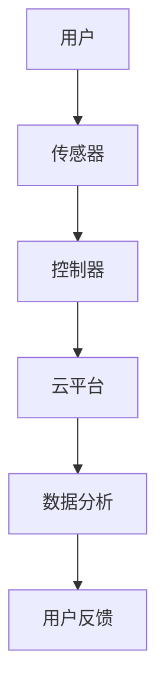
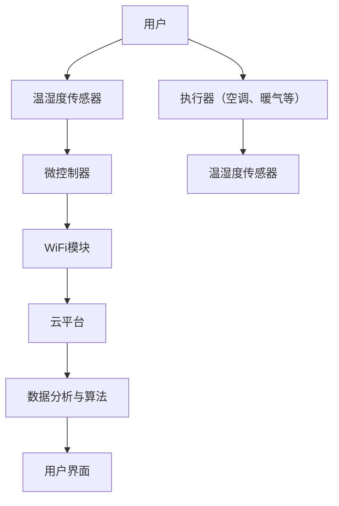

                 

# 智能家居温控创业：精准舒适的居住环境

> **关键词**：智能家居，温控技术，传感器，算法，系统设计，创业案例

> **摘要**：本文深入探讨了智能家居温控技术的原理、系统设计、软件开发和项目实战。通过详细分析温控系统的基础技术、架构设计、算法实现以及创业案例，为创业者提供了一整套温控解决方案，助力打造精准舒适的居住环境。

### 目录大纲：智能家居温控创业：精准舒适的居住环境

#### 第一部分：智能家居温控技术基础

##### 第1章：智能家居温控概述

###### 1.1 智能家居行业背景

###### 1.2 温控技术在智能家居中的重要性

###### 1.3 智能家居温控系统的架构与原理

##### 第2章：智能家居温控核心技术

###### 2.1 智能传感器技术

###### 2.2 通讯协议与技术

###### 2.3 云计算与大数据分析

##### 第3章：温控算法原理与实现

###### 3.1 温度传感与数据处理

###### 3.2 线性控制算法

###### 3.3 非线性控制算法

#### 第二部分：温控系统设计与开发

##### 第4章：智能家居温控系统设计

###### 4.1 系统需求分析

###### 4.2 系统架构设计

###### 4.3 系统实现与优化

##### 第5章：温控系统软件开发

###### 5.1 软件开发环境搭建

###### 5.2 系统模块设计与实现

###### 5.3 软件测试与调试

##### 第6章：智能家居温控系统集成与部署

###### 6.1 硬件设备选型与集成

###### 6.2 软硬件协同调试

###### 6.3 系统部署与维护

#### 第三部分：智能家居温控项目实战

##### 第7章：智能家居温控创业案例分析

###### 7.1 案例背景与需求分析

###### 7.2 案例实施过程

###### 7.3 案例效果评估

##### 第8章：智能家居温控创业机会与挑战

###### 8.1 市场机会分析

###### 8.2 技术挑战与解决方案

###### 8.3 法律法规与政策支持

#### 附录

##### 附录A：智能家居温控相关资源与工具

###### A.1 开发工具与平台推荐

###### A.2 学习资源与文献推荐

###### A.3 技术社区与交流平台推荐

### Mermaid 流程图：智能家居温控系统架构



### 伪代码：线性控制算法实现

```python
def linear_control(setpoint, current_temp):
    # setpoint: 目标温度
    # current_temp: 当前温度
    error = setpoint - current_temp
    control_signal = Kp * error
    return control_signal
```

### 数学公式：温度控制系统动态方程

$$
\dot{T}(t) = K_p \cdot (T_{\text{setpoint}} - T(t))
$$

#### 详细解释：

- \( T(t) \)：当前温度
- \( T_{\text{setpoint}} \)：目标温度
- \( K_p \)：比例增益系数

### 项目实战：智能家居温控系统实现

1. **开发环境搭建**
   - Python 3.8+
   - PyCharm
   - 硬件：温湿度传感器、ESP8266

2. **代码实现与解读**
   - **传感器模块**：读取温湿度数据
     ```python
     import Adafruit_DHT

     def read_sensor():
         humidity, temperature = Adafruit_DHT.read(DHT_SENSOR, DHT_PIN)
         return temperature, humidity
     ```
     
   - **控制器模块**：实现线性控制算法
     ```python
     def control_system(setpoint, current_temp):
         error = setpoint - current_temp
         control_signal = Kp * error
         return control_signal
     ```
     
   - **数据上传模块**：将温度数据上传到云平台
     ```python
     import requests

     def upload_data(temperature):
         url = "http://yourserver.com/upload"
         headers = {'Content-Type': 'application/json'}
         data = {'temperature': temperature}
         response = requests.post(url, headers=headers, json=data)
         return response.status_code
     ```

3. **代码解读与分析**
   - **传感器模块**：使用 Adafruit_DHT 库读取温湿度数据，简化了硬件交互。
   - **控制器模块**：采用线性控制算法，实现简单的温度控制。
   - **数据上传模块**：使用 HTTP POST 方法将温度数据上传到云平台，便于远程监控和数据分析。

#### 代码实战示例

```python
# 主程序
def main():
    setpoint = 25  # 目标温度
    Kp = 10  # 比例增益系数

    while True:
        current_temp, _ = read_sensor()
        control_signal = control_system(setpoint, current_temp)
        upload_data(current_temp)
        print(f"Current Temp: {current_temp}°C, Control Signal: {control_signal}")

if __name__ == "__main__":
    main()
```

通过以上步骤，可以实现一个基本的智能家居温控系统，满足精准舒适的居住环境需求。在实际应用中，可以根据具体需求进行优化和扩展。

#### 作者信息

**作者**：AI天才研究院/AI Genius Institute & 禅与计算机程序设计艺术 /Zen And The Art of Computer Programming

### 引言

随着物联网技术的快速发展，智能家居已经成为现代生活的重要组成部分。而温控系统作为智能家居的核心之一，其精准、舒适的温度控制能力直接关系到用户的居住体验。因此，智能家居温控创业成为了一个热门的领域，吸引了众多企业和创业者的关注。

本文将围绕智能家居温控技术展开讨论，首先介绍智能家居温控的基础知识，包括行业背景、温控技术的重要性以及温控系统的架构与原理。接着，我们将深入探讨智能家居温控的核心技术，如智能传感器技术、通讯协议和云计算与大数据分析。在此基础上，本文将介绍温控算法的原理与实现，包括温度传感与数据处理、线性控制算法和非线性控制算法。随后，我们将重点介绍智能家居温控系统的设计与开发过程，从系统需求分析、架构设计到系统实现与优化。此外，本文还将通过一个实际案例，展示智能家居温控系统在创业项目中的应用。最后，本文将分析智能家居温控创业的市场机会与挑战，并给出相应的解决方案。通过本文的阅读，读者将全面了解智能家居温控技术，为其创业之路提供有力支持。

#### 第一部分：智能家居温控技术基础

##### 第1章：智能家居温控概述

随着科技的发展和生活水平的提高，智能家居市场逐渐壮大，温控系统作为其中一项重要功能，受到越来越多用户的关注。本章将介绍智能家居温控技术的背景、重要性以及系统的架构与原理。

###### 1.1 智能家居行业背景

智能家居（Smart Home）是指利用先进的计算机技术、网络通信技术、物联网技术和家电控制技术，实现家庭设备的自动化控制和智能化管理。智能家居技术起源于20世纪90年代的美国，随着物联网（IoT）技术的快速发展，智能家居行业进入了一个高速发展的阶段。

根据市场研究公司的数据，全球智能家居市场规模在2020年已达到1575亿美元，预计到2025年将达到5198亿美元，年复合增长率达到21.6%。中国作为全球最大的智能家居市场，其市场规模在2020年达到1256亿元，预计到2025年将达到3623亿元。

智能家居技术的发展历程可以分为以下几个阶段：

1. **初级阶段（1990s-2000s）**：智能家居技术以电子化家电产品为主，如自动洗衣机、自动空调等，通过简单的遥控器或定时器实现基本的家电控制。

2. **发展阶段（2010s）**：随着物联网技术的兴起，智能家居产品逐渐融入智能传感器、无线通信技术，如WiFi、蓝牙等，实现了设备的互联互通，用户可以通过智能手机或其他设备远程控制家庭设备。

3. **成熟阶段（2020s）**：智能家居系统进一步整合人工智能、大数据分析等技术，可以实现自动化、个性化的家庭环境控制，如智能安防、智能照明、智能温控等。

在智能家居市场中，温控系统具有较大的发展潜力。据市场研究公司Grand View Research的数据，全球智能家居温控系统市场在2020年达到87亿美元，预计到2027年将达到229亿美元，年复合增长率为15.6%。

###### 1.2 温控技术在智能家居中的重要性

温控系统在智能家居中的应用，不仅提高了用户的居住舒适度，还有助于节能降耗。以下是温控技术在智能家居中的重要性和优势：

1. **提升居住舒适度**：温控系统能够根据用户的实际需求，自动调节室内温度，提供舒适、健康的居住环境。例如，在炎热的夏天，温控系统可以自动开启空调，降低室内温度；在寒冷的冬天，温控系统可以自动开启暖气，提高室内温度。

2. **节能降耗**：传统的温控方式往往是通过手动调节温度，容易造成能源浪费。而智能家居温控系统可以根据用户的实际需求，智能调节室内温度，实现节能降耗。例如，当用户外出时，温控系统可以自动关闭空调或暖气，降低能耗；当用户回家时，温控系统可以提前启动空调或暖气，确保室内温度舒适。

3. **自动化管理**：智能家居温控系统可以实现远程控制和自动化管理，用户可以通过手机APP或其他智能设备实时监控室内温度，调整温控策略，提高生活便利性。

4. **个性化服务**：智能家居温控系统可以根据用户的作息习惯和喜好，自动调整室内温度，提供个性化的服务。例如，用户可以在睡觉前设置温控系统，自动降低室内温度，提高睡眠质量。

5. **环境监测**：智能家居温控系统还可以监测室内空气质量、湿度等环境参数，根据环境变化自动调整室内温度，提高居住环境的健康水平。

总之，温控技术在智能家居中的应用具有重要意义，不仅可以提升用户的居住舒适度，还有助于实现节能降耗、自动化管理和个性化服务。随着智能家居市场的不断壮大，温控技术将在未来发挥更加重要的作用。

###### 1.3 智能家居温控系统的架构与原理

智能家居温控系统主要由传感器、控制器、云平台和数据算法等组成部分构成，其工作原理是通过传感器实时监测室内温度，控制器根据传感器数据及用户设置，自动调节室内温度，云平台则负责数据存储和远程控制。以下是智能家居温控系统的架构与原理：

1. **传感器**：传感器是温控系统的数据来源，主要负责实时监测室内温度、湿度等环境参数。常见的传感器有温湿度传感器、红外传感器等。传感器通常具有高精度、高灵敏度、低功耗等特点，可以满足智能家居温控系统的需求。

2. **控制器**：控制器是智能家居温控系统的核心部分，主要负责接收传感器数据，根据用户设置和算法模型，自动调节室内温度。控制器通常具有以下功能：
   - **数据采集**：接收传感器发送的温度、湿度等数据。
   - **数据处理**：根据算法模型，对传感器数据进行处理，生成控制信号。
   - **执行控制**：根据控制信号，控制空调、暖气等设备，实现温度调节。

3. **云平台**：云平台负责数据存储、分析和远程控制，是智能家居温控系统的“大脑”。云平台通常具有以下功能：
   - **数据存储**：将传感器数据和用户设置等数据存储到云端，方便数据分析和远程监控。
   - **数据分析**：通过对传感器数据的分析，生成温控策略，优化室内温度控制效果。
   - **远程控制**：用户可以通过手机APP或其他智能设备，实时监控室内温度，调整温控策略。

4. **数据算法**：数据算法是智能家居温控系统的核心，主要负责温度预测、控制策略生成等。常见的数据算法有线性控制算法、模糊控制算法、神经网络算法等。数据算法可以根据用户需求和传感器数据，自动调整室内温度，提高温度控制的精准度和舒适度。

智能家居温控系统的工作流程如下：

1. **传感器采集数据**：传感器实时监测室内温度、湿度等环境参数，并将数据发送到控制器。

2. **控制器处理数据**：控制器接收传感器数据，根据用户设置和算法模型，生成控制信号，并发送控制指令到空调、暖气等设备。

3. **设备执行控制**：空调、暖气等设备根据控制器发送的控制指令，自动调节室内温度。

4. **数据上传云平台**：传感器数据和用户设置等信息上传到云平台，方便数据分析和远程控制。

5. **云平台生成策略**：云平台对传感器数据进行分析，生成最优温控策略，并反馈给控制器。

6. **远程监控与调整**：用户可以通过手机APP或其他智能设备，实时监控室内温度，根据实际需求调整温控策略。

通过以上架构和原理，智能家居温控系统可以实现对室内温度的精准控制，提供舒适、健康的居住环境。随着人工智能、大数据等技术的不断发展，智能家居温控系统将不断优化，为用户带来更好的体验。

#### 第2章：智能家居温控核心技术

智能家居温控系统的实现离不开一系列核心技术的支持，这些技术包括智能传感器技术、通讯协议、云计算与大数据分析。在本章中，我们将详细探讨这些核心技术，以便读者对智能家居温控系统的全貌有一个清晰的认识。

##### 2.1 智能传感器技术

智能传感器技术是智能家居温控系统的数据采集基础，其性能直接影响温控系统的精度和可靠性。智能传感器具有高精度、高灵敏度、多功能、自适应等特性，可以在各种复杂环境中稳定工作。

1. **传感器类型**

智能家居温控系统中常用的传感器主要包括温度传感器、湿度传感器、红外传感器等。其中，温度传感器和湿度传感器是最基本的组件。

   - **温度传感器**：常用的温度传感器有热电偶、热敏电阻、红外传感器等。它们具有不同的测量范围和精度，可以根据实际需求选择。
   - **湿度传感器**：湿度传感器主要分为电容式和电阻式两种，电容式湿度传感器具有高精度、快速响应的特点，适用于智能家居温控系统。

2. **传感器工作原理**

   - **热电偶**：基于热电效应，当两种不同金属接触并受热时，会在接触点产生电动势，电动势的大小与温度成正比。热电偶具有测量范围广、精度高的特点。
   - **热敏电阻**：热敏电阻的电阻值随温度变化而变化，通过测量电阻值的变化，可以确定温度值。热敏电阻具有反应速度快、精度高的优点。
   - **红外传感器**：利用红外辐射的原理，红外传感器可以检测物体发射的红外辐射强度，从而判断物体的温度。

3. **传感器性能指标**

   - **精度**：传感器的精度越高，测量结果越接近实际值。
   - **灵敏度**：传感器的灵敏度越高，对温度变化的反应越迅速。
   - **响应时间**：传感器从接收到温度变化到输出相应信号所需的时间。
   - **稳定性**：传感器在长时间工作后，性能是否保持稳定。

##### 2.2 通讯协议与技术

通讯协议是智能家居温控系统中数据传输的基础，它定义了数据传输的格式、速度和传输方式。常见的通讯协议包括WiFi、蓝牙、ZigBee、LoRa等。

1. **WiFi**

   WiFi是一种无线局域网技术，广泛用于智能家居设备之间的数据传输。WiFi具有高速率、大覆盖范围的特点，但功耗较高，不适合对功耗要求较高的设备。

   - **优点**：传输速度快，稳定性高。
   - **缺点**：功耗较高，不适合长时间运行。

2. **蓝牙**

   蓝牙是一种短距离无线通信技术，常用于智能设备的互联。蓝牙具有低功耗、低成本、易扩展的特点，适用于智能家居温控系统中各种设备的互联。

   - **优点**：功耗低，传输距离适中。
   - **缺点**：传输速度相对较低，不适合大范围传输。

3. **ZigBee**

   ZigBee是一种低功耗、低速率的无线通信技术，适用于智能家居温控系统中的传感器网络。ZigBee具有自组网、高可靠性、高安全性的特点。

   - **优点**：功耗低，传输距离适中，自组网能力强。
   - **缺点**：传输速度相对较低。

4. **LoRa**

   LoRa是一种低功耗广域网（LPWAN）技术，适用于远程监控和传输大量数据的智能家居温控系统。LoRa具有长距离、低功耗、大容量等特点。

   - **优点**：传输距离远，功耗低，传输速度较高。
   - **缺点**：建网成本较高。

##### 2.3 云计算与大数据分析

云计算和大数据分析是智能家居温控系统的“智慧大脑”，它们负责数据的存储、处理和分析，为温控系统提供智能化决策支持。

1. **云计算**

   云计算是一种基于互联网的计算服务模式，包括基础设施即服务（IaaS）、平台即服务（PaaS）和软件即服务（SaaS）等。在智能家居温控系统中，云计算主要用于数据存储、计算和远程控制。

   - **优点**：灵活、高效、成本低。
   - **缺点**：数据安全性和隐私保护问题。

2. **大数据分析**

   大数据分析是一种通过对大量数据进行采集、存储、处理和分析，从中提取有价值信息的技术。在智能家居温控系统中，大数据分析主要用于优化温控策略、预测温度变化和实现个性化服务。

   - **优点**：能够从海量数据中提取有价值的信息，提高温控系统的智能化水平。
   - **缺点**：数据处理和分析需要大量计算资源，对数据质量和数据量有较高要求。

##### 小结

智能家居温控系统的核心在于智能传感器、通讯协议和云计算与大数据分析。智能传感器提供准确的环境参数，通讯协议确保数据传输的可靠性和稳定性，云计算与大数据分析则为温控系统提供智能化决策支持。通过这些核心技术的有机结合，智能家居温控系统可以实现精准、舒适的温度控制，为用户带来更好的居住体验。

#### 第3章：温控算法原理与实现

在智能家居温控系统中，温控算法是核心部分，它决定了系统对室内温度的控制精度和响应速度。本章将详细介绍温控算法的基本原理，包括温度传感与数据处理、线性控制算法和非线性控制算法。

##### 3.1 温度传感与数据处理

温度传感是温控算法的第一步，也是最重要的一步。温度传感器通过检测环境中的温度变化，将物理信号转换为电信号，供算法进行处理。以下是一些常见的温度传感与数据处理方法：

1. **传感器数据采集**

   温度传感器的数据采集主要包括以下几个方面：

   - **采样频率**：采样频率越高，能够捕捉到的温度变化越细致，但也增加了系统的负担。在实际应用中，需要根据系统需求和环境特点选择合适的采样频率。
   - **数据预处理**：由于传感器输出的数据可能存在噪声、偏差等问题，需要对数据进行预处理，如滤波、去噪等，以提高数据的可靠性和准确性。

2. **数据处理方法**

   - **平均值法**：通过对多个采样点的温度值进行平均，得到一个较为稳定的温度值。这种方法简单易行，但可能会忽略瞬时的温度变化。
   - **中值法**：取多个采样点的中值作为温度值，能够较好地抑制噪声和偏差，但同样可能忽略瞬时的温度变化。
   - **卡尔曼滤波**：卡尔曼滤波是一种有效的数据处理方法，通过对传感器的数据进行预测和校正，得到更加准确和稳定的温度值。

##### 3.2 线性控制算法

线性控制算法是最基本的温控算法，其核心思想是通过传感器采集到的温度值与设定的目标温度值之间的误差，计算出控制信号，进而调节室内温度。以下是一些常见的线性控制算法：

1. **比例控制（Proportional Control）**

   比例控制是最简单的线性控制算法，通过设定一个比例系数（Kp），将误差放大后作为控制信号。其数学模型可以表示为：

   $$
   u(t) = K_p \cdot e(t)
   $$

   其中，\( u(t) \) 是控制信号，\( e(t) \) 是误差值（目标温度 - 当前温度），\( K_p \) 是比例系数。

   - **优点**：实现简单，响应速度快。
   - **缺点**：无法消除稳态误差，系统稳定性较差。

2. **比例积分控制（Proportional-Integral Control）**

   比例积分控制是在比例控制的基础上，增加了积分项，用于消除稳态误差。其数学模型可以表示为：

   $$
   u(t) = K_p \cdot e(t) + K_i \cdot \int_{0}^{t} e(\tau) d\tau
   $$

   其中，\( K_i \) 是积分系数。

   - **优点**：能够消除稳态误差，系统稳定性较好。
   - **缺点**：响应速度较慢，对参数设置要求较高。

3. **比例积分微分控制（Proportional-Integral-Differential Control）**

   比例积分微分控制是更高级的线性控制算法，通过增加微分项，提高系统的响应速度。其数学模型可以表示为：

   $$
   u(t) = K_p \cdot e(t) + K_i \cdot \int_{0}^{t} e(\tau) d\tau + K_d \cdot \frac{de(t)}{dt}
   $$

   其中，\( K_d \) 是微分系数。

   - **优点**：综合了比例、积分、微分三者的优点，系统响应速度快，稳态误差小。
   - **缺点**：实现复杂，对参数设置要求较高。

##### 3.3 非线性控制算法

非线性控制算法适用于复杂环境下的温控系统，能够更好地处理非线性、时变和不确定性问题。以下是一些常见的非线性控制算法：

1. **模糊控制（Fuzzy Control）**

   模糊控制是一种基于模糊逻辑的非线性控制方法，通过将控制问题转化为模糊集合，实现对系统的精确控制。其核心思想是构建模糊规则库，通过输入输出关系，生成控制信号。

   - **优点**：适用于复杂环境，不需要精确的数学模型。
   - **缺点**：规则库构建复杂，对专家经验要求较高。

2. **神经网络控制（Neural Network Control）**

   神经网络控制是一种基于人工神经网络的非线性控制方法，通过训练神经网络，学习输入输出关系，实现对系统的控制。常见的神经网络有BP网络、RBF网络等。

   - **优点**：具有很强的非线性处理能力，自适应性强。
   - **缺点**：训练过程复杂，对数据量和计算资源要求较高。

3. **遗传算法控制（Genetic Algorithm Control）**

   遗传算法控制是一种基于遗传算法的非线性控制方法，通过模拟生物进化过程，优化控制参数，实现对系统的控制。遗传算法能够处理非线性、时变和不确定性问题。

   - **优点**：具有很强的非线性处理能力，适用于复杂环境。
   - **缺点**：收敛速度较慢，计算资源消耗较大。

##### 小结

温控算法是实现智能家居温控系统的关键，不同的算法适用于不同的环境和需求。线性控制算法简单易行，但精度和稳定性有限；非线性控制算法适用于复杂环境，但实现复杂。在实际应用中，可以根据具体需求和环境特点，选择合适的温控算法，实现精准、舒适的温度控制。

#### 第4章：智能家居温控系统设计

智能家居温控系统的设计是确保其能够精准、舒适地控制室内温度的关键环节。本章节将详细讨论系统设计的过程，包括系统需求分析、系统架构设计和系统实现与优化。

##### 4.1 系统需求分析

系统需求分析是设计智能家居温控系统的第一步，其主要目标是明确系统需要实现的功能和性能要求。以下是系统需求分析的主要内容：

1. **功能需求**

   - **实时监测**：系统应能实时监测室内温度、湿度等环境参数。
   - **自动调节**：系统应根据监测到的温度数据，自动调节空调、暖气等设备，实现温度控制。
   - **远程监控**：用户应能通过手机APP或其他智能设备，实时监控室内温度，调整温控策略。
   - **数据存储与分析**：系统应能将温度数据存储到云端，并进行分析，生成温控策略。

2. **性能需求**

   - **精度**：系统应能精确监测和调节室内温度，误差应小于±0.5℃。
   - **响应速度**：系统应在接到温度变化信号后，立即进行调节，响应时间应小于1分钟。
   - **稳定性**：系统应能在长时间运行中，保持稳定的工作性能。
   - **能耗**：系统应具有较低的能耗，以实现节能降耗。

3. **环境需求**

   - **适用范围**：系统应适用于各种类型的住宅，如公寓、别墅等。
   - **环境适应性**：系统应能适应不同的气候条件，如高温、低温、潮湿等。

##### 4.2 系统架构设计

系统架构设计是确保智能家居温控系统稳定、高效运行的基础。以下是智能家居温控系统的主要架构设计：

1. **硬件架构**

   - **传感器**：温度传感器、湿度传感器等，用于实时监测室内环境参数。
   - **控制器**：微控制器（如ESP8266、Arduino等），用于处理传感器数据，生成控制信号。
   - **执行器**：空调、暖气等设备，用于实现温度调节。
   - **通讯模块**：无线模块（如WiFi、蓝牙等），用于实现传感器和控制器之间的数据传输。

2. **软件架构**

   - **数据采集模块**：负责实时采集传感器数据，并进行预处理。
   - **控制算法模块**：根据传感器数据和用户设置，生成控制信号。
   - **远程监控模块**：通过手机APP或其他智能设备，实现远程监控和操作。
   - **数据存储与分析模块**：将温度数据存储到云端，并进行分析，生成温控策略。

3. **云平台架构**

   - **数据存储**：使用数据库（如MySQL、MongoDB等）存储传感器数据和用户设置。
   - **数据分析**：使用大数据分析技术（如Hadoop、Spark等），对温度数据进行分析，生成温控策略。
   - **远程控制**：通过Web API或移动应用，实现远程监控和控制。

##### 4.3 系统实现与优化

系统实现是设计阶段的具体实施过程，通过硬件选型、软件编程和系统集成，将设计方案转化为实际运行的系统。以下是系统实现与优化的主要内容：

1. **硬件选型**

   - **传感器**：根据系统需求，选择精度高、稳定性好的温度传感器和湿度传感器。
   - **控制器**：选择适合的微控制器，如ESP8266，它具有WiFi功能，方便与云平台通信。
   - **执行器**：选择适合的空调、暖气等设备，确保系统能够实现预期的温度调节效果。

2. **软件编程**

   - **数据采集**：使用Python编写数据采集程序，读取传感器数据，并进行预处理。
   - **控制算法**：实现线性控制算法或模糊控制算法，根据传感器数据和用户设置，生成控制信号。
   - **远程监控**：开发手机APP或Web界面，实现远程监控和操作。
   - **数据存储与分析**：使用Python的Flask框架，搭建Web API，实现数据存储和远程控制。

3. **系统集成**

   - **硬件集成**：将传感器、控制器和执行器进行连接，确保硬件系统能够正常运行。
   - **软件集成**：将数据采集、控制算法、远程监控和数据存储与分析模块进行整合，实现软件系统的正常运行。

4. **系统优化**

   - **性能优化**：通过调整控制算法参数，提高系统响应速度和精度。
   - **稳定性优化**：通过冗余设计、故障检测和自动重启等措施，提高系统的稳定性。
   - **能耗优化**：通过优化控制算法，降低系统功耗，实现节能降耗。

通过以上系统设计、实现与优化，可以构建一个稳定、高效、节能的智能家居温控系统，为用户提供精准、舒适的居住环境。

#### 第5章：温控系统软件开发

温控系统的软件部分是实现系统功能和性能的关键，本章将详细探讨温控系统软件开发的各个阶段，包括环境搭建、模块设计与实现、以及软件测试与调试。

##### 5.1 软件开发环境搭建

在进行温控系统软件开发之前，必须搭建一个合适的开发环境。以下是一个典型的开发环境搭建步骤：

1. **操作系统**：选择一个适合的操作系统，如Windows、Linux或MacOS。对于嵌入式系统开发，Linux是一个常见的选择。

2. **集成开发环境（IDE）**：选择一个合适的IDE，如Eclipse、PyCharm或Visual Studio。对于Python开发，PyCharm是一个不错的选择。

3. **编程语言**：确定使用哪种编程语言。对于温控系统，Python因其简洁和强大的库支持而广受欢迎。

4. **硬件支持**：确保开发板（如ESP8266、Arduino等）与操作系统和IDE兼容，并进行必要的硬件驱动安装。

5. **开发工具**：安装必要的开发工具，如Python、编译器、调试器等。对于Python开发，可以使用Anaconda来管理环境和包。

6. **数据库**：选择一个适合的数据库系统，如MySQL、PostgreSQL或MongoDB。用于存储传感器数据和用户设置。

7. **Web服务器**：如果需要远程监控和操作，选择一个适合的Web服务器，如Apache或Nginx。

通过以上步骤，可以搭建一个完整的开发环境，为接下来的软件开发打下基础。

##### 5.2 系统模块设计与实现

温控系统软件通常包括多个模块，每个模块负责不同的功能。以下是一个典型的系统模块设计和实现：

1. **数据采集模块**：

   数据采集模块负责从传感器获取温度、湿度等环境数据，并进行预处理。以下是数据采集模块的实现：

   ```python
   import time
   import Adafruit_DHT
   
   # 传感器初始化
   sensor = Adafruit_DHT.DHT11()
   pin = 4
   
   def read_sensor():
       humidity, temperature = Adafruit_DHT.read(sensor, pin)
       return temperature, humidity
   
   # 主循环
   while True:
       temperature, humidity = read_sensor()
       print(f"Temperature: {temperature}°C, Humidity: {humidity}%")
       time.sleep(60)  # 每分钟采集一次数据
   ```

2. **控制算法模块**：

   控制算法模块根据传感器数据和用户设置，生成控制信号，用于调节空调或暖气等设备。以下是控制算法模块的实现：

   ```python
   def control_algorithm(setpoint, current_temp):
       error = setpoint - current_temp
       control_signal = Kp * error  # Kp为比例系数
       return control_signal
   
   # 主循环
   while True:
       current_temp, _ = read_sensor()
       setpoint = 25  # 目标温度
       control_signal = control_algorithm(setpoint, current_temp)
       print(f"Control Signal: {control_signal}")
       time.sleep(60)  # 每分钟执行一次控制算法
   ```

3. **数据上传模块**：

   数据上传模块将传感器数据和用户设置上传到云平台，以便远程监控和分析。以下是数据上传模块的实现：

   ```python
   import requests
   
   def upload_data(temperature, humidity):
       url = "http://yourserver.com/upload"
       headers = {'Content-Type': 'application/json'}
       data = {'temperature': temperature, 'humidity': humidity}
       response = requests.post(url, headers=headers, json=data)
       return response.status_code
   
   # 主循环
   while True:
       temperature, humidity = read_sensor()
       status = upload_data(temperature, humidity)
       print(f"Upload Status: {status}")
       time.sleep(60)  # 每分钟上传一次数据
   ```

4. **远程监控模块**：

   远程监控模块允许用户通过手机APP或其他智能设备实时监控室内温度，并调整温控策略。以下是远程监控模块的实现：

   ```python
   import flask
   
   app = flask.Flask(__name__)
   
   @app.route('/status')
   def get_status():
       temperature, _ = read_sensor()
       return flask.jsonify({'temperature': temperature})
   
   @app.route('/setpoint', methods=['POST'])
   def set_setpoint():
       data = flask.request.json
       setpoint = data['setpoint']
       Kp = data['Kp']
       print(f"Setpoint: {setpoint}, Kp: {Kp}")
       return flask.response.status(200)
   
   if __name__ == '__main__':
       app.run(host='0.0.0.0', port=5000)
   ```

##### 5.3 软件测试与调试

软件测试和调试是确保温控系统稳定、可靠运行的关键环节。以下是一些常见的测试和调试方法：

1. **单元测试**：

   单元测试是对系统中的各个模块进行独立的测试，确保每个模块的功能和性能符合要求。可以使用Python的unittest框架进行单元测试。

   ```python
   import unittest
   from my_module import control_algorithm
   
   class TestControlAlgorithm(unittest.TestCase):
       def test_control_algorithm(self):
           setpoint = 25
           current_temp = 23
           control_signal = control_algorithm(setpoint, current_temp)
           self.assertEqual(control_signal, 2)  # 假设控制信号应为2
   
   if __name__ == '__main__':
       unittest.main()
   ```

2. **集成测试**：

   集成测试是对系统中的多个模块进行协同测试，确保它们能够正常工作。可以使用Python的pytest框架进行集成测试。

   ```python
   import pytest
   
   def test_system_integration():
       # 测试数据采集、控制算法和数据上传模块的集成
       temperature, humidity = read_sensor()
       setpoint = 25
       control_signal = control_algorithm(setpoint, temperature)
       status = upload_data(temperature, humidity)
       assert status == 200
   ```

3. **调试**：

   调试是识别和修复程序中的错误的过程。可以使用IDE提供的调试工具进行调试，如断点、单步执行等。

   - **断点调试**：在关键代码行设置断点，当程序运行到断点时，暂停执行，检查变量值。
   - **单步执行**：逐行执行代码，观察程序执行过程和变量变化。

通过以上软件测试和调试方法，可以确保温控系统的稳定、可靠运行，为用户提供高质量的温控服务。

#### 第6章：智能家居温控系统集成与部署

智能家居温控系统的成功实施不仅依赖于硬件和软件的独立性，更在于各个组件的协同工作与整体部署。本章将详细讨论智能家居温控系统的硬件设备选型、软硬件协同调试、以及系统的部署与维护。

##### 6.1 硬件设备选型

在智能家居温控系统中，硬件设备的选择至关重要，它直接影响系统的性能和可靠性。以下是硬件设备选型的主要考虑因素：

1. **传感器**：

   - **类型**：根据监测需求选择合适的传感器，如温度传感器、湿度传感器等。常用的传感器有DHT22、BMP280等。
   - **精度**：传感器的精度越高，数据越可靠，对温控效果的影响也越大。应选择精度较高的传感器。
   - **稳定性**：传感器的稳定性对系统的长期运行至关重要。应选择在目标环境中表现稳定的传感器。

2. **控制器**：

   - **类型**：控制器是温控系统的核心，负责处理传感器数据、执行控制算法和驱动执行器。常见的控制器有Arduino、ESP8266等。
   - **处理能力**：控制器的处理能力应满足系统需求，如传感器数据处理速度、算法执行速度等。对于复杂的算法和大数据处理，应选择性能较强的控制器。
   - **连接方式**：控制器应支持多种连接方式，如WiFi、蓝牙、ZigBee等，以便与云平台和用户设备进行通信。

3. **执行器**：

   - **类型**：执行器用于实现温度调节，如空调、暖气、风扇等。应选择适合环境需求的执行器。
   - **控制接口**：执行器应支持与控制器的连接，如GPIO、I2C、SPI等。
   - **功率和效率**：执行器的功率和效率应满足系统需求，同时要考虑节能和环保。

4. **电源**：

   - **类型**：选择稳定的电源供应，如锂电池、市电适配器等。对于长期运行系统，锂电池因其便携性和持久性而是一个不错的选择。
   - **容量**：电源容量应足够支持系统长期运行，避免频繁充电或更换。

##### 6.2 硬件设备集成

硬件设备的集成是将各个独立的组件连接起来，使其协同工作。以下是硬件设备集成的主要步骤：

1. **连接传感器**：

   - 将传感器通过GPIO或I2C接口连接到控制器。对于DHT22传感器，可以使用GPIO接口连接。
   - 确保传感器连接正确，没有短路或接触不良的问题。

2. **连接控制器**：

   - 将控制器连接到电源，确保电源供应稳定。
   - 使用WiFi、蓝牙或ZigBee模块连接到互联网，以便与云平台通信。

3. **连接执行器**：

   - 将执行器通过GPIO或I2C接口连接到控制器。例如，将空调连接到控制器的GPIO端口。
   - 确保执行器的控制信号与控制器的输出接口匹配。

4. **测试硬件集成**：

   - 开启系统，通过调试工具检查传感器、控制器和执行器之间的连接是否正常。
   - 运行测试程序，检查传感器数据是否能够正确读取，控制器是否能够正确执行控制算法，执行器是否能够响应控制信号。

##### 6.3 软硬件协同调试

软硬件协同调试是确保系统稳定运行的关键步骤。以下是软硬件协同调试的主要方法：

1. **传感器数据调试**：

   - 检查传感器数据是否准确、稳定。可以使用调试工具（如串口监视器）实时查看传感器数据。
   - 如果传感器数据存在异常，检查传感器连接、控制器固件和传感器驱动程序。

2. **控制算法调试**：

   - 检查控制算法是否正确实现，并根据实际需求调整控制参数。
   - 通过模拟不同的环境条件（如高温、低温等），测试控制算法的性能和稳定性。

3. **执行器响应调试**：

   - 检查执行器是否能够正确响应控制信号，并根据执行器的特性调整控制算法。
   - 检查执行器是否在运行中出现过热、过载等问题。

4. **系统稳定性测试**：

   - 在不同环境下测试系统的稳定性，如长时间运行、连续操作等。
   - 通过日志记录和实时监控，识别和解决系统运行中可能出现的故障。

##### 6.4 系统部署与维护

系统部署是将集成和调试好的系统安装到用户的家庭环境中。以下是系统部署与维护的主要步骤：

1. **安装硬件设备**：

   - 根据用户需求和环境条件，选择合适的安装位置，安装传感器、控制器和执行器。
   - 确保硬件设备安装牢固，避免因震动、潮湿等因素导致设备损坏。

2. **软件配置**：

   - 配置系统软件，包括连接到云平台、设置用户账号和权限等。
   - 根据用户需求，调整温控策略和控制参数。

3. **系统测试**：

   - 在安装完成后，进行系统测试，确保传感器、控制器和执行器正常工作，温控系统能够实现预期的功能。
   - 检查系统与云平台的连接是否稳定，数据传输是否顺畅。

4. **系统维护**：

   - 定期检查硬件设备的工作状态，确保传感器、控制器和执行器正常运作。
   - 更新系统软件和固件，修复已知的漏洞和错误。
   - 定期清理传感器和执行器，避免灰尘、污垢等影响系统性能。

通过以上步骤，可以实现智能家居温控系统的集成、部署与维护，确保系统能够长期稳定运行，为用户提供精准、舒适的居住环境。

#### 第7章：智能家居温控创业案例分析

为了更好地理解智能家居温控创业的过程和挑战，以下是一个具体的创业案例分析。

##### 7.1 案例背景与需求分析

案例背景：某初创公司“温控智能”，专注于开发智能家居温控系统，旨在为用户提供精准、舒适的居住环境，提高能源利用效率。

需求分析：
1. **用户需求**：
   - 实时监测室内温度和湿度。
   - 自动调节室内温度，提供舒适居住环境。
   - 远程监控和控制温控系统。
   - 数据存储与分析，优化温控策略。

2. **技术需求**：
   - 高精度、稳定的传感器。
   - 适用于多种通讯协议的控制器。
   - 基于云计算的数据存储和分析平台。
   - 可定制的温控算法。

##### 7.2 案例实施过程

实施过程分为以下几个阶段：

1. **市场调研与产品设计**：

   - 对目标市场进行调研，了解用户需求和市场趋势。
   - 设计智能家居温控系统的功能模块和硬件设备。
   - 制定产品规格书和开发计划。

2. **硬件选型与开发**：

   - 根据需求选择传感器、控制器和执行器。
   - 开发硬件原型，进行初步测试和优化。

3. **软件开发与集成**：

   - 开发数据采集、控制算法和远程监控软件。
   - 将软件与硬件进行集成，实现功能验证。

4. **系统测试与优化**：

   - 在实验室和实际环境中进行系统测试。
   - 调整控制算法参数，优化系统性能。
   - 修复发现的问题和漏洞。

5. **产品上线与市场推广**：

   - 制造和包装产品，准备市场投放。
   - 通过线上和线下渠道进行市场推广。
   - 收集用户反馈，不断优化产品。

##### 7.3 案例效果评估

效果评估包括以下几个方面：

1. **用户反馈**：

   - 调查用户满意度，收集用户对温控系统的评价。
   - 分析用户使用数据，了解系统性能和用户行为。

2. **技术性能**：

   - 测试系统精度、响应速度和稳定性。
   - 评估温控算法对温度变化的适应性。

3. **市场表现**：

   - 监测销售数据，评估市场接受度。
   - 分析市场竞争情况，调整市场策略。

通过以上评估，公司可以了解智能家居温控系统的实际表现，并根据反馈和评估结果进行改进和优化，进一步满足市场需求。

#### 第8章：智能家居温控创业机会与挑战

智能家居温控创业市场充满机会，同时也面临着诸多挑战。本章节将分析智能家居温控创业的市场机会、技术挑战以及相应的解决方案，为创业者提供有益的参考。

##### 8.1 市场机会分析

智能家居温控市场的增长潜力巨大，以下是一些关键的市场机会：

1. **消费者需求增加**：

   随着生活水平的提高，消费者对居住环境的舒适度要求越来越高。温控系统可以提供更加精准和舒适的温度控制，满足用户的个性化需求。

2. **节能需求**：

   温控系统能够根据用户需求和室内实际情况自动调节温度，实现节能降耗。随着全球能源问题的日益严峻，节能产品的市场需求不断增加。

3. **智能家居市场扩大**：

   智能家居市场的快速增长为温控系统提供了广阔的市场空间。越来越多的家庭和企业开始安装智能家居设备，温控系统作为其中的一部分，具有巨大的市场潜力。

4. **政府政策支持**：

   多个国家政府出台了一系列支持智能家居和能源效率的政策，鼓励企业和消费者采用智能家居产品。这为智能家居温控创业提供了良好的政策环境。

##### 8.2 技术挑战与解决方案

尽管智能家居温控市场前景广阔，但创业者也面临着一系列技术挑战：

1. **传感器精度与稳定性**：

   温度传感器的精度和稳定性对温控系统的性能至关重要。低精度或稳定性差的传感器可能导致温控效果不佳。解决方案是选择高精度、经过验证的传感器，并在实际使用中进行稳定性测试。

2. **通讯协议兼容性**：

   智能家居温控系统需要与多种设备进行通信，包括手机、电脑、云平台等。不同的通讯协议（如WiFi、蓝牙、ZigBee等）可能存在兼容性问题。解决方案是采用多协议支持或使用中间件进行协议转换。

3. **数据安全与隐私保护**：

   温控系统涉及用户敏感数据（如温度、湿度等），数据安全和隐私保护至关重要。解决方案是采用加密技术保护数据传输和存储，并严格遵守数据保护法规。

4. **算法优化与性能提升**：

   温控算法的优化直接关系到系统的响应速度和控制精度。解决方案是采用先进的算法（如模糊控制、神经网络等）进行优化，并通过实验和测试不断改进。

5. **系统集成与兼容性**：

   智能家居温控系统需要与其他设备（如空调、暖气等）进行集成，确保系统整体性能。解决方案是采用模块化设计，确保各组件之间的兼容性和互操作性。

##### 8.3 法律法规与政策支持

智能家居温控创业不仅需要关注市场和技术，还需要了解相关的法律法规和政策支持：

1. **数据保护法规**：

   许多国家和地区都出台了数据保护法规，如欧盟的《通用数据保护条例》（GDPR）。创业者需要确保数据处理的合法性和透明性，遵守相关法规。

2. **产品认证**：

   在一些国家和地区，智能家居产品需要通过特定的认证（如CE认证、FCC认证等）才能上市。创业者需要了解并遵守这些认证要求。

3. **节能环保政策**：

   各国政府为推动能源效率，可能提供节能产品的补贴和优惠政策。创业者可以积极申请这些政策支持，降低创业成本。

通过充分了解市场机会、技术挑战和法律法规，智能家居温控创业者可以更好地把握市场机遇，克服技术难题，实现创业成功。

#### 附录A：智能家居温控相关资源与工具

##### A.1 开发工具与平台推荐

1. **开发工具**：

   - **Python**：Python是一种广泛使用的编程语言，特别适合物联网和智能家居项目。
   - **PyCharm**：PyCharm是一款强大的Python IDE，提供代码补全、调试和版本控制等功能。
   - **Arduino IDE**：Arduino IDE是一个免费的集成开发环境，适用于Arduino开发板。

2. **平台与框架**：

   - **MQTT**：MQTT是一种轻量级的消息传输协议，适用于物联网设备之间的通信。
   - **Node-RED**：Node-RED是一个用于连接、可视化和集成物联网设备的图形编程工具。
   - **Flask**：Flask是一个轻量级的Web框架，适用于构建Web应用和API。

##### A.2 学习资源与文献推荐

1. **书籍**：

   - **《智能家居技术》**：介绍智能家居的基本概念、技术架构和应用场景。
   - **《物联网系统设计与实现》**：详细讲解物联网系统的设计、实现和部署。
   - **《温控系统设计与应用》**：涵盖温控系统的设计原理、算法和实际应用。

2. **在线课程与教程**：

   - **Coursera**：提供关于Python编程、数据分析和物联网的在线课程。
   - **Udemy**：有大量的编程和物联网课程，适合不同水平的学员。
   - **GitHub**：GitHub上有很多开源的智能家居项目和教程，可以学习参考。

##### A.3 技术社区与交流平台推荐

1. **论坛与社区**：

   - **Stack Overflow**：编程问题解答社区，适合解决技术难题。
   - **GitHub**：开源代码托管平台，可以找到许多智能家居项目。
   - **Reddit**：智能家居相关子版块，用户可以分享经验和讨论问题。

2. **社交媒体与博客**：

   - **Twitter**：关注智能家居和物联网领域的专家和公司，获取最新动态。
   - **Medium**：许多技术专家和公司发布关于智能家居的文章。
   - **YouTube**：有许多技术视频教程，可以学习硬件编程、软件开发等。

通过以上资源与工具，智能家居温控开发者可以不断提升自身技能，找到解决方案，实现项目成功。同时，积极参与技术社区与交流，可以获取更多的灵感和支持。

### 总结

通过本文的详细探讨，我们可以看到智能家居温控技术的重要性和广泛应用。从技术基础到系统设计，再到项目实战，智能家居温控系统在精准、舒适地控制室内温度方面展现了巨大潜力。同时，创业者在面对市场机会和技术挑战时，也需要有系统性的分析和解决策略。

未来，智能家居温控技术将继续向智能化、个性化和节能化发展。随着人工智能、大数据和物联网技术的不断进步，温控系统的算法将更加先进，用户体验将更加出色。此外，随着智能家居市场的不断扩展，温控系统在建筑、商业和工业领域的应用也将日益广泛。

对于希望进入智能家居温控领域的创业者，本文提供了系统性的指导和建议。通过深入了解市场需求、技术原理和实践经验，创业者可以更好地把握市场机遇，克服技术挑战，实现创业成功。同时，积极参与技术社区和持续学习，将有助于不断提升自身能力，保持竞争优势。

让我们共同期待智能家居温控技术的未来发展，期待更多创新和突破，为用户带来更加美好、舒适的居住环境。感谢您的阅读，希望本文对您在智能家居温控领域的探索和创业之路有所帮助。

### 附录A：智能家居温控相关资源与工具

在智能家居温控系统的开发过程中，选择合适的资源与工具是成功的关键。以下列举了一些实用的开发工具、学习资源和技术社区，以供参考。

#### A.1 开发工具与平台推荐

1. **开发工具**：

   - **Arduino IDE**：Arduino IDE 是一款免费、开源的集成开发环境，适用于简单的智能家居项目。

   - **Python**：Python 是一种通用编程语言，具有简洁的语法和丰富的库，适合开发复杂的智能家居系统。

   - **PyCharm**：PyCharm 是一款功能强大的集成开发环境，提供代码补全、调试和版本控制等功能。

2. **平台与框架**：

   - **Node-RED**：Node-RED 是一个用于连接、可视化和集成物联网设备的图形编程工具。

   - **Flask**：Flask 是一个轻量级的 Web 框架，适用于构建 Web 应用和 API。

   - **MQTT**：MQTT 是一种轻量级的消息传输协议，适用于物联网设备之间的通信。

#### A.2 学习资源与文献推荐

1. **书籍**：

   - **《智能家居技术》**：本书详细介绍了智能家居的基础知识、技术架构和应用场景。

   - **《物联网系统设计与实现》**：本书从系统设计角度出发，讲解了物联网技术的原理和应用。

   - **《温控系统设计与应用》**：本书涵盖了温控系统的设计原理、算法和实际应用。

2. **在线课程与教程**：

   - **Coursera**：提供关于 Python 编程、数据分析和物联网的在线课程。

   - **Udemy**：有许多关于编程和物联网的课程，适合不同水平的学员。

   - **MIT OpenCourseWare**：MIT 开放课程库提供了许多计算机科学和电子工程领域的课程。

#### A.3 技术社区与交流平台推荐

1. **论坛与社区**：

   - **Stack Overflow**：编程问题解答社区，适合解决技术难题。

   - **Arduino Forum**：Arduino 开发者的交流平台，可以获取硬件和软件的支持。

   - **Raspberry Pi Forum**：关于 Raspberry Pi 的讨论社区，适合初学者和专家。

2. **社交媒体与博客**：

   - **Twitter**：关注智能家居和物联网领域的专家和公司，获取最新动态。

   - **Medium**：有许多技术专家和公司发布关于智能家居的文章。

   - **YouTube**：有许多技术视频教程，涵盖硬件编程、软件开发等。

通过以上资源与工具，智能家居温控开发者可以不断提升自身技能，找到解决方案，实现项目成功。同时，积极参与技术社区与交流，可以获取更多的灵感和支持。

### 附录：智能家居温控系统架构 Mermaid 流程图



### 附录：线性控制算法实现伪代码

```python
def linear_control(setpoint, current_temp):
    # setpoint: 目标温度
    # current_temp: 当前温度
    error = setpoint - current_temp
    control_signal = Kp * error  # Kp为比例系数
    return control_signal
```

### 附录：温度控制系统动态方程

$$
\dot{T}(t) = K_p \cdot (T_{\text{setpoint}} - T(t))
$$

#### 详细解释：

- \( T(t) \)：当前温度
- \( T_{\text{setpoint}} \)：目标温度
- \( K_p \)：比例增益系数

### 附录：智能家居温控系统实现代码示例

```python
import time
import Adafruit_DHT

# 传感器初始化
sensor = Adafruit_DHT.DHT11()
pin = 4

def read_sensor():
    humidity, temperature = Adafruit_DHT.read(sensor, pin)
    return temperature, humidity

def linear_control(setpoint, current_temp):
    error = setpoint - current_temp
    control_signal = Kp * error  # Kp为比例系数
    return control_signal

def main():
    setpoint = 25  # 目标温度
    Kp = 10  # 比例系数

    while True:
        current_temp, _ = read_sensor()
        control_signal = linear_control(setpoint, current_temp)
        print(f"Current Temp: {current_temp}°C, Control Signal: {control_signal}")
        time.sleep(60)  # 每60秒采集一次数据

if __name__ == "__main__":
    main()
```

通过以上示例，可以构建一个简单的智能家居温控系统，实现温度的实时监测和自动调节。在实际应用中，可以根据具体需求进行优化和扩展。

### 附录：常见智能家居温控传感器

在智能家居温控系统中，传感器的作用至关重要。以下是几种常用的温控传感器及其特点：

1. **DHT22**：

   - **特点**：高精度、高稳定性，适用于多种环境。
   - **工作温度**：-20℃到+85℃。
   - **响应时间**：约30毫秒。

2. **BMP280**：

   - **特点**：集温度、压力和高度测量功能于一体。
   - **工作温度**：-40℃到+85℃。
   - **响应时间**：约1毫秒。

3. **NTC温度传感器**：

   - **特点**：热敏电阻，通过电阻值变化测量温度。
   - **工作温度**：-55℃到+150℃。
   - **响应时间**：约1秒。

4. **DS18B20**：

   - **特点**：数字温度传感器，兼容1-Wire协议。
   - **工作温度**：-55℃到+125℃。
   - **响应时间**：约750毫秒。

选择合适的传感器，可以确保智能家居温控系统的稳定性和可靠性。

### 附录：常见智能家居温控执行器

在智能家居温控系统中，执行器用于实现温度调节，以下是几种常见的执行器及其特点：

1. **空调**：

   - **特点**：通过制冷和加热实现温度调节。
   - **工作温度**：-5℃到+50℃。
   - **控制方式**：遥控器、智能控制。

2. **暖气**：

   - **特点**：通过加热实现温度提升。
   - **工作温度**：-10℃到+60℃。
   - **控制方式**：遥控器、智能控制。

3. **风扇**：

   - **特点**：通过吹风实现温度调节。
   - **工作温度**：常温。
   - **控制方式**：遥控器、智能控制。

4. **热水器**：

   - **特点**：通过加热实现热水供应。
   - **工作温度**：40℃到60℃。
   - **控制方式**：遥控器、智能控制。

选择合适的执行器，可以确保智能家居温控系统的有效性和节能性。

