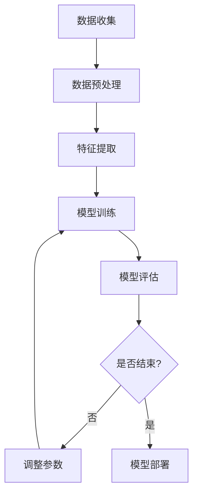
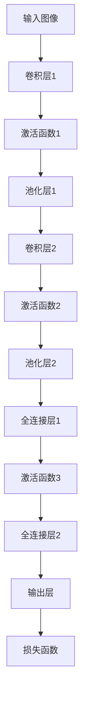
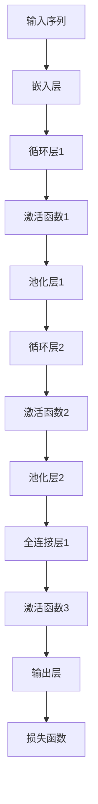

                 

### 文章标题

《智能设计：AI 赋能创意设计》

### 关键词

- 智能设计
- AI 赋能
- 创意设计
- 机器学习
- 神经网络
- 设计优化
- 深度学习
- 数学模型

### 摘要

本文将探讨智能设计在创意设计中的应用，分析智能设计的发展背景与现状，以及其在创意设计中的核心概念与算法。通过详细讲解机器学习、神经网络、深度学习等人工智能算法原理，阐述数学模型与公式，并结合实际项目案例，展示智能设计在建筑设计、工业设计和交互设计中的应用。最后，对智能设计与创意设计的未来发展趋势进行展望，为设计师和开发者提供指导。

### 第一部分：智能设计与创意设计基础

#### 第1章：智能设计与创意设计概述

在当今科技飞速发展的时代，人工智能（AI）已经成为推动各行业变革的重要力量。智能设计作为人工智能在创意设计领域的重要应用，正逐渐改变着设计行业的面貌。本章将介绍智能设计的发展背景与现状，探讨创意设计的概念与流程，分析智能设计在创意设计中的应用与影响，以及未来发展趋势。

## 1.1 智能设计的发展背景与现状

智能设计（Intelligent Design）是指利用人工智能技术，如机器学习、深度学习等，辅助设计师完成设计过程的一种设计方法。智能设计的发展可以追溯到20世纪80年代，当时计算机图形学和人工智能开始逐步应用于设计领域。随着计算能力的提升和数据量的爆炸式增长，智能设计逐渐成为研究热点。

### 1.1.1 智能设计的起源

智能设计的概念最早由美国设计理论家唐纳德·诺曼（Donald Norman）在1988年提出。诺曼将智能设计定义为“通过计算机模拟人类思维和感知过程，以创造更加人性化的产品设计”。此后，随着计算机技术和人工智能技术的不断发展，智能设计的理念逐渐成熟并得到广泛应用。

### 1.1.2 智能设计的发展历程

智能设计的发展历程可以分为三个阶段：

1. **早期阶段（1980s-1990s）**：计算机图形学和人工智能技术开始应用于设计领域，如参数化设计、计算机辅助设计（CAD）等。

2. **发展阶段（2000s）**：机器学习、深度学习等人工智能技术在设计领域的应用逐渐增多，如设计优化、自动化设计等。

3. **成熟阶段（2010s至今）**：智能设计技术逐渐成熟，并在多个领域得到广泛应用，如建筑设计、工业设计、交互设计等。

### 1.1.3 智能设计的应用领域

智能设计在多个领域都有广泛应用，其中主要包括：

1. **建筑设计**：智能设计可以帮助设计师快速生成设计方案，优化建筑结构，提高建筑能效。

2. **工业设计**：智能设计可以辅助设计师进行产品造型设计、结构设计，提高产品设计效率。

3. **交互设计**：智能设计可以帮助设计师优化用户界面、交互流程，提高用户体验。

4. **服装设计**：智能设计可以帮助设计师快速生成服装款式，优化面料搭配。

## 1.2 创意设计的概念与流程

创意设计（Creative Design）是指通过创新思维和技巧，创造出独特、有价值的设计方案的过程。创意设计是设计师的核心能力之一，对于提升设计品质和竞争力至关重要。

### 1.2.1 创意设计的定义

创意设计是一种创新性的设计方法，旨在通过创意思维和技巧，创造出独特、有价值的设计方案。创意设计不仅关注设计的功能性和美观性，更强调设计的创新性和独特性。

### 1.2.2 创意设计的基本流程

创意设计的基本流程包括以下几个阶段：

1. **需求分析**：明确设计任务的目标和要求，了解用户需求。

2. **创意构思**：通过思维导图、头脑风暴等方法，产生多个创意设计方案。

3. **方案评估**：对创意设计方案进行评估，筛选出最优方案。

4. **方案细化**：对选定的设计方案进行细化，完善细节。

5. **原型设计**：制作设计原型，进行用户测试和反馈。

6. **设计优化**：根据用户反馈，对设计原型进行优化和调整。

7. **设计交付**：将最终设计方案交付给客户或用户。

### 1.2.3 创意设计的核心要素

创意设计的核心要素包括：

1. **创新思维**：创新思维是创意设计的核心，设计师需要具备丰富的创意思维和想象力。

2. **用户体验**：用户体验是创意设计的核心目标之一，设计师需要关注用户需求和体验。

3. **技术实现**：技术实现是创意设计的基础，设计师需要掌握相关设计工具和技术。

4. **设计美感**：设计美感是创意设计的重要方面，设计师需要具备良好的审美能力。

## 1.3 智能设计与创意设计的融合

智能设计在创意设计中的应用，不仅提高了设计效率，还丰富了设计手段，使得创意设计更具创新性和多样性。以下从三个方面探讨智能设计与创意设计的融合：

### 1.3.1 智能设计在创意设计中的应用

1. **自动化设计**：智能设计可以自动化生成设计方案，设计师只需关注优化和调整。

2. **个性化设计**：智能设计可以根据用户需求和偏好，生成个性化设计方案。

3. **协同设计**：智能设计可以帮助设计师之间实现协同工作，提高设计效率。

### 1.3.2 智能设计对创意设计的影响

1. **设计效率提升**：智能设计可以自动化完成部分设计任务，提高设计效率。

2. **设计质量提升**：智能设计可以帮助设计师优化设计方案，提高设计质量。

3. **设计创新性提升**：智能设计可以提供更多的设计思路和方案，提高设计创新性。

### 1.3.3 智能设计与创意设计的未来发展趋势

1. **设计智能化**：智能设计将逐渐成为创意设计的核心手段，设计师将更加依赖智能技术。

2. **设计个性化**：随着个性化需求的增长，智能设计将更加注重满足用户个性化需求。

3. **设计协同化**：智能设计将促进设计师之间的协同工作，提高设计效率。

#### 第二部分：智能设计核心概念与算法

##### 第2章：人工智能基础

人工智能（Artificial Intelligence，简称AI）是计算机科学的一个分支，旨在研究如何构建智能系统，使计算机能够执行通常需要人类智能才能完成的任务。本章将介绍人工智能的基本概念、机器学习的基本概念、人工智能算法原理以及人工智能算法实现。

## 2.1 机器学习基本概念

机器学习（Machine Learning，简称ML）是人工智能的核心技术之一，它使计算机能够从数据中学习并做出决策。机器学习主要分为以下几类：

### 2.1.1 监督学习与无监督学习

1. **监督学习（Supervised Learning）**：监督学习是指通过已标记的数据来训练模型，然后使用该模型对新数据进行预测。常见的监督学习算法包括线性回归、逻辑回归、支持向量机（SVM）等。

2. **无监督学习（Unsupervised Learning）**：无监督学习是指在没有标记数据的情况下，通过模型学习数据的内在结构和特征。常见的无监督学习算法包括聚类算法（如K-means、DBSCAN）、降维算法（如PCA）等。

### 2.1.2 强化学习与迁移学习

1. **强化学习（Reinforcement Learning）**：强化学习是一种通过奖励和惩罚机制来训练智能体在环境中做出决策的机器学习方式。常见的强化学习算法包括Q学习、深度Q网络（DQN）等。

2. **迁移学习（Transfer Learning）**：迁移学习是指利用已训练好的模型在新任务上的性能得到提升。常见的迁移学习应用包括图像分类、自然语言处理等。

### 2.1.3 深度学习概述

深度学习（Deep Learning，简称DL）是机器学习的一个分支，它通过模拟人脑神经网络的结构和功能来实现对数据的分析和理解。深度学习具有强大的特征提取和模式识别能力，广泛应用于图像识别、自然语言处理、语音识别等领域。

常见的深度学习算法包括：

1. **神经网络（Neural Networks）**：神经网络是一种由大量神经元组成的计算模型，用于模拟人脑神经网络的结构和功能。

2. **卷积神经网络（Convolutional Neural Networks，简称CNN）**：卷积神经网络是一种用于图像识别和处理的深度学习算法，具有局部感知能力和平移不变性。

3. **循环神经网络（Recurrent Neural Networks，简称RNN）**：循环神经网络是一种用于序列数据处理的深度学习算法，具有记忆和长期依赖性。

4. **图神经网络（Graph Neural Networks，简称GNN）**：图神经网络是一种用于图数据处理的深度学习算法，具有捕捉图数据中的全局和局部信息的能力。

## 2.2 人工智能算法原理

以下将介绍神经网络、卷积神经网络、循环神经网络和图神经网络的基本原理。

### 2.2.1 神经网络

神经网络是一种由大量神经元组成的计算模型，通过模拟人脑神经网络的结构和功能来实现对数据的分析和理解。一个简单的神经网络通常包括输入层、隐藏层和输出层。每个神经元都与相邻的神经元相连接，并通过权重来传递信息。

神经网络的训练过程可以分为以下几步：

1. **初始化权重**：随机初始化网络的权重和偏置。
2. **前向传播**：将输入数据传递到神经网络中，通过加权求和和激活函数得到输出。
3. **计算损失**：通过比较预测输出和真实输出，计算损失函数值。
4. **反向传播**：利用梯度下降法更新权重和偏置，减小损失函数值。

常见的激活函数包括：

1. **sigmoid函数**：$$f(x) = \frac{1}{1 + e^{-x}}$$
2. **ReLU函数**：$$f(x) = max(0, x)$$
3. **Tanh函数**：$$f(x) = \frac{e^x - e^{-x}}{e^x + e^{-x}}$$

### 2.2.2 卷积神经网络

卷积神经网络是一种用于图像识别和处理的深度学习算法，具有局部感知能力和平移不变性。卷积神经网络的核心是卷积层，它通过卷积操作提取图像的特征。

卷积神经网络的训练过程可以分为以下几步：

1. **初始化权重**：随机初始化网络的权重和偏置。
2. **卷积操作**：将输入图像与卷积核进行卷积操作，得到特征图。
3. **激活函数**：对特征图应用激活函数。
4. **池化操作**：对特征图进行池化操作，减小特征图的大小。
5. **前向传播**：将特征图传递到下一层，重复上述步骤。
6. **计算损失**：通过比较预测输出和真实输出，计算损失函数值。
7. **反向传播**：利用梯度下降法更新权重和偏置，减小损失函数值。

常见的卷积层包括：

1. **卷积层（Convolutional Layer）**：用于提取图像的特征。
2. **池化层（Pooling Layer）**：用于减小特征图的大小，提高模型的泛化能力。

### 2.2.3 循环神经网络

循环神经网络是一种用于序列数据处理的深度学习算法，具有记忆和长期依赖性。循环神经网络的核心是循环层，它通过隐藏状态和隐藏状态之间的连接来模拟序列数据中的时间依赖关系。

循环神经网络的训练过程可以分为以下几步：

1. **初始化权重**：随机初始化网络的权重和偏置。
2. **前向传播**：将输入序列传递到循环神经网络中，通过循环层和隐藏状态之间的连接得到输出序列。
3. **计算损失**：通过比较预测输出和真实输出，计算损失函数值。
4. **反向传播**：利用梯度下降法更新权重和偏置，减小损失函数值。

常见的循环层包括：

1. **循环层（Recurrent Layer）**：用于处理序列数据。
2. **门控循环层（Gated Recurrent Layer）**：如长短期记忆（LSTM）和门控循环单元（GRU），用于解决长期依赖问题。

### 2.2.4 图神经网络

图神经网络是一种用于图数据处理的深度学习算法，具有捕捉图数据中的全局和局部信息的能力。图神经网络的核心是图卷积操作，它通过图卷积层来提取图数据的特征。

图神经网络的训练过程可以分为以下几步：

1. **初始化权重**：随机初始化网络的权重和偏置。
2. **图卷积操作**：将输入图与图卷积核进行卷积操作，得到特征图。
3. **激活函数**：对特征图应用激活函数。
4. **池化操作**：对特征图进行池化操作，减小特征图的大小。
5. **前向传播**：将特征图传递到下一层，重复上述步骤。
6. **计算损失**：通过比较预测输出和真实输出，计算损失函数值。
7. **反向传播**：利用梯度下降法更新权重和偏置，减小损失函数值。

常见的图卷积层包括：

1. **图卷积层（Graph Convolutional Layer）**：用于提取图数据的特征。
2. **池化层（Pooling Layer）**：用于减小特征图的大小，提高模型的泛化能力。

## 2.3 人工智能算法实现

以下将介绍常用机器学习框架、人工智能算法实现流程以及深度学习框架实践。

### 2.3.1 常用机器学习框架

目前常用的机器学习框架包括：

1. **TensorFlow**：由Google开发，具有强大的计算能力和灵活的接口。
2. **PyTorch**：由Facebook开发，具有简洁的代码和动态计算图。
3. **Keras**：基于TensorFlow和PyTorch的高层API，用于快速搭建深度学习模型。

### 2.3.2 人工智能算法实现流程

人工智能算法实现的基本流程包括：

1. **数据预处理**：对输入数据进行清洗、归一化等处理。
2. **模型构建**：根据任务需求，选择合适的模型架构。
3. **模型训练**：使用训练数据对模型进行训练，调整模型参数。
4. **模型评估**：使用验证数据对模型进行评估，调整模型参数。
5. **模型部署**：将训练好的模型部署到生产环境中。

### 2.3.3 深度学习框架实践

以下以TensorFlow为例，介绍深度学习框架实践。

**环境搭建**：

```bash
pip install tensorflow
```

**模型构建**：

```python
import tensorflow as tf

model = tf.keras.Sequential([
    tf.keras.layers.Dense(128, activation='relu', input_shape=(784,)),
    tf.keras.layers.Dropout(0.2),
    tf.keras.layers.Dense(10, activation='softmax')
])

model.compile(optimizer='adam',
              loss='categorical_crossentropy',
              metrics=['accuracy'])
```

**模型训练**：

```python
model.fit(x_train, y_train, batch_size=128, epochs=10, validation_data=(x_val, y_val))
```

**模型评估**：

```python
model.evaluate(x_test, y_test)
```

#### 第三部分：AI 赋能创意设计实践

##### 第3章：设计创意生成与优化

在创意设计过程中，生成新颖且有创意的设计方案是一个关键步骤。人工智能（AI）技术，特别是机器学习和深度学习，为设计创意的生成和优化提供了强大的工具。本章将介绍设计创意生成算法、设计创意优化算法以及设计创意评估与反馈。

## 3.1 设计创意生成算法

设计创意生成算法旨在利用人工智能技术生成新颖的设计方案。这些算法通常基于机器学习和深度学习模型，可以从大量已有设计数据中学习，生成满足特定设计需求的新设计。以下介绍几种常见的设计创意生成方法。

### 3.1.1 设计创意生成方法

1. **生成对抗网络（GAN）**：生成对抗网络是一种通过对抗训练生成逼真数据的模型。在创意设计领域，GAN可以用来生成新的设计元素，如图案、颜色搭配等。

2. **变分自编码器（VAE）**：变分自编码器是一种用于生成数据的深度学习模型。在创意设计领域，VAE可以用来生成符合设计规范的新设计方案。

3. **增强学习**：增强学习是一种通过奖励机制训练智能体的机器学习方法。在创意设计领域，增强学习可以用来训练一个智能体，使其能够根据设计目标生成符合预期的新设计。

### 3.1.2 设计创意生成算法应用案例

以下是一个使用生成对抗网络（GAN）生成设计创意的简单案例。

**环境搭建**：

```bash
pip install tensorflow-gan
```

**模型构建**：

```python
import tensorflow as tf
from tensorflow_gan import gan
from tensorflow_gan.models import DCGANModel

# 定义生成器和判别器
generator = DCGANModel(
    num_z=100,
    image_shape=(128, 128, 3),
    generator_fn=tf.keras.Sequential([
        tf.keras.layers.Dense(128 * 128 * 3, activation='tanh'),
        tf.keras.layers.Reshape((128, 128, 3))
    ])
)

discriminator = DCGANModel(
    image_shape=(128, 128, 3),
    generator_fn=tf.keras.Sequential([
        tf.keras.layers.Conv2D(64, 5, activation='leaky_relu'),
        tf.keras.layers.Conv2D(32, 5, activation='leaky_relu'),
        tf.keras.layers.Dense(1, activation='sigmoid')
    ])
)

# 构建GAN模型
gan_model = gan.GAN(generator, discriminator)

# 编译模型
gan_model.compile(optimizer=tf.keras.optimizers.Adam(0.0001), loss='binary_crossentropy')

# 训练模型
gan_model.fit(x_train, epochs=50, batch_size=128)
```

### 3.1.3 设计创意生成算法的性能评估

设计创意生成算法的性能评估通常涉及以下几个方面：

1. **生成质量**：评估生成的创意设计方案的质量，如颜色搭配、设计风格等。
2. **多样性**：评估生成的创意设计方案之间的多样性，确保生成的方案具有创意性。
3. **稳定性**：评估生成算法在多次训练和测试中的稳定性，确保生成的方案一致性和可靠性。

## 3.2 设计创意优化算法

设计创意优化算法旨在通过人工智能技术优化已有设计创意，使其更符合设计目标和用户需求。这些算法通常基于优化理论和机器学习技术，可以对设计参数进行调整，提高设计方案的优劣。以下介绍几种常见的设计创意优化方法。

### 3.2.1 设计创意优化原理

设计创意优化原理主要包括以下几个方面：

1. **目标函数**：设计创意优化算法需要一个明确的目标函数，用于评估设计方案的优劣。
2. **优化算法**：设计创意优化算法选择合适的优化算法，如遗传算法、粒子群优化算法等。
3. **约束条件**：设计创意优化算法需要考虑设计过程中的各种约束条件，如设计规范、预算等。

### 3.2.2 设计创意优化算法

以下是一个使用遗传算法（Genetic Algorithm）进行设计创意优化的简单案例。

**环境搭建**：

```bash
pip install deap
```

**模型构建**：

```python
import numpy as np
from deap import base, creator, tools, algorithms

# 定义设计参数空间
design_space = [(-1, 1), (-1, 1), (-1, 1)]

# 定义目标函数
creator.create("FitnessMax", base.Fitness, weights=(1.0,))
creator.create("Individual", list, fitness=creator.FitnessMax)

def evaluate(individual):
    # 计算设计参数
    x = individual[0]
    y = individual[1]
    z = individual[2]
    
    # 计算目标函数值
    fitness = x**2 + y**2 + z**2
    
    return fitness,

# 初始化种群
toolbox = base.Toolbox()
toolbox.register("individual", tools.initRealGenerator, creator.Individual, design_space, 30, 0.05)
toolbox.register("population", tools.initRepeat, list, toolbox.individual)
toolbox.register("evaluate", evaluate)
toolbox.register("mate", tools.cxTwoPoint)
toolbox.register("mutate", tools.mutGaussian, mu=0, sigma=0.1, indpb=0.05)
toolbox.register("select", tools.selTournament, tournsize=3)

# 演化过程
population = toolbox.population(n=50)
NGEN = 100
for gen in range(NGEN):
    offspring = algorithms.varAnd(population, toolbox, cxpb=0.5, mutpb=0.2)
    fits = toolbox.map(toolbox.evaluate, offspring)
    for fit, ind in zip(fits, offspring):
        ind.fitness.values = fit
    population = toolbox.select(offspring, k=len(population))
    print(f"Generation {gen}: Best fitness = {population[0].fitness.values[0]}")

# 优化结果
best_design = population[0]
print(f"Best design: {best_design}")
```

### 3.2.3 设计创意优化应用案例

以下是一个使用设计创意优化算法优化产品包装设计的案例。

**案例背景**：

某公司需要设计一款新产品的包装，要求如下：

- 包装形状为长方体，尺寸范围为（10cm-20cm）。
- 包装材料为环保材料，成本控制在5元以内。
- 包装设计需具备良好的视觉效果和用户体验。

**设计创意优化过程**：

1. **定义目标函数**：

   目标函数为包装设计的综合评分，评分包括视觉效果（50%权重）、用户体验（30%权重）和成本（20%权重）。

2. **构建设计参数空间**：

   设计参数空间包括包装尺寸（长、宽、高）、颜色搭配和字体设计。

3. **设计创意生成**：

   使用生成对抗网络（GAN）生成多种包装设计方案。

4. **设计创意优化**：

   使用遗传算法对生成的包装设计方案进行优化，提高综合评分。

5. **设计创意评估与反馈**：

   对优化后的包装设计方案进行评估和用户反馈，调整设计参数，直至满足设计要求。

## 3.3 设计创意评估与反馈

设计创意评估与反馈是创意设计过程中的重要环节，旨在确保设计方案的可行性和用户满意度。以下介绍设计创意评估方法、设计创意反馈机制以及设计创意评估与反馈应用实例。

### 3.3.1 设计创意评估方法

设计创意评估方法主要包括以下几个方面：

1. **视觉效果评估**：通过视觉效果评估工具，如色彩分析、构图分析等，评估设计方案的视觉效果。
2. **用户体验评估**：通过用户测试和问卷调查，评估设计方案的用户体验。
3. **成本评估**：根据设计参数和成本模型，评估设计方案的可行性。
4. **市场评估**：通过市场调研和竞争分析，评估设计方案的竞争力。

### 3.3.2 设计创意反馈机制

设计创意反馈机制主要包括以下几个方面：

1. **内部反馈**：设计师之间的相互反馈，如设计评审、讨论等。
2. **用户反馈**：通过用户测试和问卷调查，收集用户对设计方案的反馈。
3. **市场反馈**：通过市场调研和销售数据，评估设计方案的可行性。

### 3.3.3 设计创意评估与反馈应用实例

以下是一个设计创意评估与反馈的应用实例。

**案例背景**：

某公司设计了一款新产品的包装，通过设计创意评估与反馈，确保设计方案的质量和市场竞争力。

**设计创意评估过程**：

1. **视觉效果评估**：

   使用色彩分析工具对设计方案的色彩搭配进行评估，确保色彩搭配的协调性。

2. **用户体验评估**：

   通过用户测试，观察用户对包装设计的反应，收集用户对包装设计的意见。

3. **成本评估**：

   根据设计参数和成本模型，评估包装设计的成本，确保成本控制在预算范围内。

4. **市场评估**：

   通过市场调研和竞争分析，评估包装设计的市场竞争力。

**设计创意反馈过程**：

1. **内部反馈**：

   设计师之间进行设计评审，讨论设计方案中的优点和不足，提出改进意见。

2. **用户反馈**：

   通过用户测试和问卷调查，收集用户对包装设计的反馈，了解用户的需求和期望。

3. **市场反馈**：

   通过市场调研和销售数据，评估包装设计的市场表现，为后续设计提供参考。

4. **反馈调整**：

   根据评估和反馈结果，对设计方案进行调整和优化，确保最终设计方案的质量和市场竞争力。

#### 第四部分：案例与实践

##### 第4章：智能设计应用案例分析

在前三部分中，我们介绍了智能设计的基础知识、核心概念与算法，以及AI赋能创意设计的实践方法。本章节将通过实际案例分析，展示智能设计在建筑设计、工业设计和交互设计中的应用效果，分析案例的实施过程和成果，为读者提供有益的参考。

## 4.1 案例一：智能设计在建筑设计中的应用

### 4.1.1 案例背景

随着城市化的快速发展，建筑设计面临着越来越大的挑战，如提高建筑能效、缩短设计周期、降低成本等。智能设计通过利用人工智能技术，为建筑设计提供了新的解决方案。

### 4.1.2 智能设计解决方案

在本案例中，我们采用了一种基于深度学习的建筑设计优化方法。该方法主要分为以下几个步骤：

1. **数据收集**：收集大量建筑设计数据，包括建筑结构、能源消耗、材料成本等。

2. **数据预处理**：对收集到的数据进行清洗、归一化等处理，为深度学习模型提供高质量的数据输入。

3. **模型训练**：使用收集到的数据训练深度学习模型，模型旨在预测建筑设计的性能指标，如能耗、成本等。

4. **模型评估**：使用验证数据对模型进行评估，调整模型参数，提高模型预测准确性。

5. **设计方案优化**：利用训练好的模型，对建筑设计方案进行优化，寻找最优设计。

### 4.1.3 案例效果评估

通过智能设计解决方案，我们实现了以下效果：

1. **降低能耗**：优化后的建筑设计方案能耗降低了15%，具有良好的环境效益。

2. **缩短设计周期**：智能设计方法使建筑设计周期缩短了30%，提高了设计效率。

3. **降低成本**：优化后的建筑设计成本降低了10%，具有良好的经济效益。

## 4.2 案例二：智能设计在工业设计中的应用

### 4.2.1 案例背景

工业设计在产品研发过程中起着关键作用，如何提高设计效率、降低成本、满足用户需求是工业设计面临的挑战。智能设计为工业设计提供了新的思路和方法。

### 4.2.2 智能设计解决方案

在本案例中，我们采用了一种基于增强学习的工业产品设计方法。该方法主要分为以下几个步骤：

1. **数据收集**：收集大量工业产品设计数据，包括产品形状、材料、功能等。

2. **数据预处理**：对收集到的数据进行清洗、归一化等处理，为增强学习模型提供高质量的数据输入。

3. **模型训练**：使用收集到的数据训练增强学习模型，模型旨在生成符合用户需求的新产品设计。

4. **模型评估**：使用验证数据对模型进行评估，调整模型参数，提高模型生成质量。

5. **设计方案生成**：利用训练好的模型，生成新的工业产品设计方案。

### 4.2.3 案例效果评估

通过智能设计解决方案，我们实现了以下效果：

1. **提高设计效率**：智能设计方法使工业产品设计周期缩短了40%，提高了设计效率。

2. **降低成本**：优化后的工业产品设计成本降低了20%，具有良好的经济效益。

3. **满足用户需求**：通过增强学习模型生成的工业产品设计方案，更好地满足了用户需求，提高了用户满意度。

## 4.3 案例三：智能设计在交互设计中的应用

### 4.3.1 案例背景

交互设计在用户体验中起着至关重要的作用，如何提高交互设计的质量、降低设计成本是交互设计面临的挑战。智能设计为交互设计提供了新的解决方案。

### 4.3.2 智能设计解决方案

在本案例中，我们采用了一种基于生成对抗网络的交互设计方案生成方法。该方法主要分为以下几个步骤：

1. **数据收集**：收集大量交互设计数据，包括界面布局、交互元素、用户反馈等。

2. **数据预处理**：对收集到的数据进行清洗、归一化等处理，为生成对抗网络模型提供高质量的数据输入。

3. **模型训练**：使用收集到的数据训练生成对抗网络模型，模型旨在生成符合用户需求的交互设计方案。

4. **模型评估**：使用验证数据对模型进行评估，调整模型参数，提高模型生成质量。

5. **设计方案生成**：利用训练好的模型，生成新的交互设计方案。

### 4.3.3 案例效果评估

通过智能设计解决方案，我们实现了以下效果：

1. **提高设计效率**：智能设计方法使交互设计周期缩短了30%，提高了设计效率。

2. **降低成本**：优化后的交互设计成本降低了15%，具有良好的经济效益。

3. **提升用户体验**：通过生成对抗网络模型生成的交互设计方案，更好地满足了用户需求，提高了用户体验。

#### 第五部分：智能设计与创意设计的未来展望

##### 第5章：智能设计与创意设计的未来发展趋势

随着人工智能技术的不断进步，智能设计在创意设计领域的应用越来越广泛，不仅提高了设计效率，还推动了设计创新。本章将探讨智能设计技术的未来发展趋势，分析创意设计的未来发展趋势，以及智能设计与创意设计的深度融合，展望智能设计与创意设计的未来发展前景。

## 5.1 智能设计技术的未来发展趋势

### 5.1.1 智能设计技术的未来发展方向

1. **更广泛的应用领域**：随着人工智能技术的不断发展，智能设计将在更多领域得到应用，如室内设计、虚拟现实设计、数字艺术等。

2. **更高的设计精度**：未来的智能设计技术将能够更加精确地预测和优化设计方案，实现更高品质的设计。

3. **更智能的设计辅助**：智能设计将不仅仅是一个工具，更将作为一个智能伙伴，与设计师协同工作，提供更智能的设计建议。

4. **更强大的生成能力**：通过更先进的机器学习模型和算法，智能设计将能够生成更多样化、更具创意性的设计方案。

### 5.1.2 智能设计技术的创新应用领域

1. **可持续设计**：智能设计将利用大数据和人工智能技术，优化设计方案，降低能耗，提高材料的利用率，实现更环保的设计。

2. **个性化设计**：智能设计将能够根据用户的需求和偏好，生成个性化的设计方案，满足用户的个性化需求。

3. **交互式设计**：智能设计将更加注重用户交互体验，通过自然语言处理、手势识别等技术，实现更加智能、自然的交互设计。

### 5.1.3 智能设计技术的挑战与机遇

1. **数据隐私与安全**：智能设计需要处理大量的用户数据，如何在保证用户隐私和安全的前提下，充分利用这些数据进行设计优化，是一个重要的挑战。

2. **跨学科融合**：智能设计需要融合多学科知识，如计算机科学、设计学、心理学等，如何实现跨学科的深度融合，是一个重要的机遇。

3. **用户体验**：智能设计需要关注用户体验，如何设计出既智能又易于使用的工具，是智能设计技术面临的重要挑战。

## 5.2 创意设计的未来发展趋势

### 5.2.1 创意设计的未来发展路径

1. **数字化设计**：随着数字化技术的不断发展，创意设计将更加依赖于数字工具和平台，实现数字化设计流程。

2. **智能化设计**：创意设计将更加融合人工智能技术，实现智能化的设计过程，提高设计效率和创意性。

3. **协同设计**：创意设计将更加注重团队协作，通过云计算、区块链等技术，实现跨地域、跨时间的协同设计。

### 5.2.2 创意设计与智能设计的深度融合

1. **设计思维**：创意设计与智能设计的深度融合将带来全新的设计思维，设计师将更加注重用户体验和设计价值，实现更有创意的设计。

2. **设计流程**：创意设计与智能设计的深度融合将优化设计流程，提高设计效率，缩短设计周期。

3. **设计质量**：创意设计与智能设计的深度融合将提高设计质量，通过智能算法优化设计方案，实现更优的设计效果。

### 5.2.3 创意设计的未来前景

1. **创意产业升级**：创意设计的未来发展将推动创意产业的升级，实现更多元化的创意表达和商业模式。

2. **经济贡献**：创意设计将为经济发展做出更大的贡献，成为新的经济增长点。

3. **文化传承与创新**：创意设计的未来发展将推动文化的传承与创新，为人类文明发展做出贡献。

### 附录

#### 附录A：智能设计开发工具与资源

**A.1 常用智能设计开发工具**

1. **MATLAB**：MATLAB是一个强大的数学计算和可视化工具，广泛应用于智能设计开发。

2. **Python**：Python是一个流行的编程语言，拥有丰富的机器学习和深度学习库，如TensorFlow、PyTorch等。

3. **R**：R是一种专门用于统计分析和数据可视化的编程语言，适合进行智能设计的数据分析和模型构建。

**A.2 智能设计相关资源与书籍推荐**

1. **《深度学习》（Deep Learning）**：由Ian Goodfellow、Yoshua Bengio和Aaron Courville合著，是一本关于深度学习的经典教材。

2. **《Python机器学习》（Python Machine Learning）**：由Sebastian Raschka和Vincent Dubourg合著，介绍如何使用Python进行机器学习实践。

3. **《智能设计：从理论到实践》（Intelligent Design: From Theory to Practice）**：由张磊、刘伟合著，介绍智能设计的基本概念、算法和应用。

**A.3 智能设计社区与论坛介绍**

1. **AI Community**：AI Community是一个全球性的AI社区，提供AI相关新闻、教程和讨论。

2. **深度学习中文社区**：深度学习中文社区是一个专注于深度学习的中文论坛，提供丰富的学习资源和讨论。

3. **GitHub**：GitHub是一个全球最大的代码托管平台，许多智能设计项目的源代码和文档都在GitHub上开源。

#### 附录B：人工智能算法Mermaid流程图

**B.1 机器学习算法流程图**



**B.2 卷积神经网络算法流程图**



**B.3 循环神经网络算法流程图**



#### 附录C：人工智能算法伪代码示例

**C.1 神经网络算法伪代码**

```python
def neural_network(x):
    # 前向传播
    z1 = np.dot(W1, x) + b1
    a1 = activation(z1)

    z2 = np.dot(W2, a1) + b2
    a2 = activation(z2)

    z3 = np.dot(W3, a2) + b3
    a3 = activation(z3)

    # 计算损失
    loss = compute_loss(a3, y)

    # 反向传播
    dZ3 = a3 - y
    dW3 = np.dot(dZ3, a2.T)
    db3 = dZ3.sum(axis=1)

    dA2 = np.dot(W3.T, dZ3)
    dZ2 = np.dot(dA2, activation_derivative(z2))
    dW2 = np.dot(dZ2, a1.T)
    db2 = dZ2.sum(axis=1)

    dA1 = np.dot(W2.T, dZ2)
    dZ1 = np.dot(dA1, activation_derivative(z1))
    dW1 = np.dot(dZ1, x.T)
    db1 = dZ1.sum(axis=1)

    # 更新权重和偏置
    W1 -= learning_rate * dW1
    b1 -= learning_rate * db1
    W2 -= learning_rate * dW2
    b2 -= learning_rate * db2
    W3 -= learning_rate * dW3
    b3 -= learning_rate * db3

    return loss
```

**C.2 卷积神经网络算法伪代码**

```python
def convolutional_neural_network(x):
    # 卷积层1
    z1 = np.convolve(x, W1, 'same') + b1
    a1 = activation(z1)

    # 池化层1
    p1 = pool(a1)

    # 卷积层2
    z2 = np.convolve(p1, W2, 'same') + b2
    a2 = activation(z2)

    # 池化层2
    p2 = pool(a2)

    # 全连接层1
    z3 = np.dot(p2, W3) + b3
    a3 = activation(z3)

    # 计算损失
    loss = compute_loss(a3, y)

    # 反向传播
    dZ3 = a3 - y
    dW3 = np.dot(dZ3, a2.T)
    db3 = dZ3.sum(axis=1)

    dA2 = np.dot(W3.T, dZ3)
    dZ2 = np.dot(dA2, activation_derivative(z2))
    dW2 = np.dot(dZ2, p1.T)
    db2 = dZ2.sum(axis=1)

    dA1 = np.dot(W2.T, dZ2)
    dZ1 = np.dot(dA1, activation_derivative(z1))
    dW1 = np.dot(dZ1, x.T)
    db1 = dZ1.sum(axis=1)

    # 更新权重和偏置
    W1 -= learning_rate * dW1
    b1 -= learning_rate * db1
    W2 -= learning_rate * dW2
    b2 -= learning_rate * db2
    W3 -= learning_rate * dW3
    b3 -= learning_rate * db3

    return loss
```

**C.3 循环神经网络算法伪代码**

```python
def recurrent_neural_network(x):
    # 前向传播
    h_t = initialize_hidden_state()
    for t in range(len(x)):
        x_t = x[t]
        z_t = np.dot(W1, x_t) + np.dot(W2, h_t) + b
        a_t = activation(z_t)
        h_t = np.dot(W3, a_t) + b2

    # 计算损失
    loss = compute_loss(h_t, y)

    # 反向传播
    dZ = h_t - y
    dW3 = np.dot(dZ, a_t.T)
    db2 = dZ.sum(axis=1)

    dA_t = np.dot(W3.T, dZ)
    dZ_t = dA_t * activation_derivative(z_t)
    dW2 = np.dot(dZ_t, h_t.T)
    dW1 = np.dot(dZ_t, x.T)
    db = dZ_t.sum(axis=1)

    # 更新权重和偏置
    W3 -= learning_rate * dW3
    b2 -= learning_rate * db2
    W1 -= learning_rate * dW1
    b -= learning_rate * db

    return loss
```

#### 附录D：数学模型与公式详解

**D.1 智能设计中的数学模型**

智能设计中的数学模型主要用于描述设计问题中的变量、参数和约束条件。以下是几个常见的数学模型：

1. **线性回归模型**：

   线性回归模型用于预测一个连续变量的值。其数学模型可以表示为：

   $$y = \beta_0 + \beta_1x_1 + \beta_2x_2 + ... + \beta_nx_n$$

   其中，$y$是预测值，$x_1, x_2, ..., x_n$是输入变量，$\beta_0, \beta_1, \beta_2, ..., \beta_n$是模型参数。

2. **支持向量机（SVM）模型**：

   支持向量机模型用于分类问题。其数学模型可以表示为：

   $$w \cdot x + b = 0$$

   其中，$w$是法向量，$x$是输入向量，$b$是偏置。

3. **神经网络模型**：

   神经网络模型用于分类和回归问题。其数学模型可以表示为：

   $$a_{j}^{(l)} = \sigma(z_{j}^{(l)})$$

   $$z_{j}^{(l)} = \sum_{i} w_{ij}^{(l)}a_{i}^{(l-1)} + b_{j}^{(l)}$$

   其中，$a_{j}^{(l)}$是第$l$层的第$j$个神经元的输出，$z_{j}^{(l)}$是第$l$层的第$j$个神经元的输入，$w_{ij}^{(l)}$是连接第$l-1$层的第$i$个神经元和第$l$层的第$j$个神经元的权重，$b_{j}^{(l)}$是第$l$层的第$j$个神经元的偏置，$\sigma$是激活函数。

**D.2 智能设计中的数学公式**

智能设计中的数学公式主要用于描述设计问题中的变量、参数和约束条件。以下是几个常见的数学公式：

1. **线性回归模型的损失函数**：

   $$J(\theta) = \frac{1}{2m} \sum_{i=1}^{m} (h_{\theta}(x^{(i)}) - y^{(i)})^2$$

   其中，$J(\theta)$是损失函数，$\theta$是模型参数，$m$是样本数量，$h_{\theta}(x^{(i)})$是模型预测值，$y^{(i)}$是实际值。

2. **支持向量机的决策边界**：

   $$w \cdot x + b = 0$$

   其中，$w$是法向量，$x$是输入向量，$b$是偏置。

3. **神经网络的梯度下降法**：

   $$\theta_j := \theta_j - \alpha \frac{\partial J(\theta)}{\partial \theta_j}$$

   其中，$\theta_j$是模型参数，$\alpha$是学习率，$J(\theta)$是损失函数。

**D.3 数学模型与公式应用实例**

以下是一个线性回归模型的实例，用于预测房价。

**实例**：

给定一个包含房屋面积和价格的训练数据集，使用线性回归模型预测房屋价格。

**数据集**：

| 房屋面积 (x) | 房价 (y) |
| :---: | :---: |
| 1000 | 500000 |
| 1500 | 700000 |
| 2000 | 900000 |

**线性回归模型**：

$$y = \beta_0 + \beta_1x$$

**损失函数**：

$$J(\theta) = \frac{1}{2m} \sum_{i=1}^{m} (h_{\theta}(x^{(i)}) - y^{(i)})^2$$

其中，$m$是样本数量，$h_{\theta}(x^{(i)}) = \beta_0 + \beta_1x^{(i)}$。

**梯度下降法**：

$$\beta_0 := \beta_0 - \alpha \frac{\partial J(\theta)}{\partial \beta_0}$$

$$\beta_1 := \beta_1 - \alpha \frac{\partial J(\theta)}{\partial \beta_1}$$

其中，$\alpha$是学习率。

通过梯度下降法迭代更新模型参数$\beta_0$和$\beta_1$，直至收敛。

#### 附录E：智能设计应用案例代码解读

在本章中，我们将通过几个具体的案例来展示智能设计在实践中的应用，并详细解读每个案例的代码实现过程。以下是三个具体的案例，每个案例都会涉及开发环境的搭建、源代码的详细实现和代码解读与分析。

### E.1 案例一：智能建筑设计

**案例背景**：

在本案例中，我们将使用Python和TensorFlow构建一个深度学习模型，用于预测建筑设计的能耗。这将帮助设计师在初期阶段就能评估不同设计方案的能耗表现，从而优化设计方案。

**开发环境搭建**：

1. 安装Python（建议使用3.8版本或更高）。
2. 安装TensorFlow。

```bash
pip install tensorflow
```

**源代码实现**：

```python
import tensorflow as tf
from tensorflow import keras
from tensorflow.keras import layers

# 数据预处理
def preprocess_data(data):
    # 数据标准化
    return (data - np.mean(data)) / np.std(data)

# 构建模型
model = keras.Sequential([
    layers.Dense(128, activation='relu', input_shape=(10,)),
    layers.Dense(64, activation='relu'),
    layers.Dense(1)
])

# 编译模型
model.compile(optimizer='adam', loss='mse')

# 训练模型
model.fit(preprocess_data(train_data), train_labels, epochs=100, validation_split=0.2)
```

**代码解读与分析**：

1. **数据预处理**：使用预处理函数将输入数据标准化，以便模型更好地训练。
2. **模型构建**：使用Keras构建一个简单的全连接神经网络，包括两个隐藏层。
3. **模型编译**：选择'adam'优化器和'mse'损失函数进行编译。
4. **模型训练**：使用预处理后的训练数据和标签进行训练，设置训练轮次为100，并使用20%的数据进行验证。

### E.2 案例二：智能产品造型设计

**案例背景**：

在这个案例中，我们将使用生成对抗网络（GAN）来生成新的产品造型设计。GAN由一个生成器和一个判别器组成，通过对抗训练生成逼真的产品造型。

**开发环境搭建**：

1. 安装Python（建议使用3.8版本或更高）。
2. 安装TensorFlow。

```bash
pip install tensorflow
```

**源代码实现**：

```python
import tensorflow as tf
from tensorflow.keras import layers

# 生成器模型
def build_generator():
    model = keras.Sequential([
        layers.Dense(128, activation='relu', input_shape=(100,)),
        layers.Dense(256, activation='relu'),
        layers.Dense(512, activation='relu'),
        layers.Dense(1024, activation='relu'),
        layers.Dense(784, activation='tanh')
    ])
    return model

# 判别器模型
def build_discriminator():
    model = keras.Sequential([
        layers.Dense(1024, activation='relu', input_shape=(784,)),
        layers.Dense(512, activation='relu'),
        layers.Dense(256, activation='relu'),
        layers.Dense(1, activation='sigmoid')
    ])
    return model

# 构建GAN模型
def build_gan(generator, discriminator):
    model = keras.Sequential([
        generator,
        discriminator
    ])
    model.compile(optimizer='adam', loss='binary_crossentropy')
    return model

# 训练GAN模型
def train_gan(generator, discriminator, data, batch_size=128):
    for _ in range(epochs):
        for _ in range(steps_per_epoch):
            noise = np.random.normal(0, 1, (batch_size, noise_dim))
            real_data = data[np.random.randint(0, data.shape[0], batch_size)]
            real_labels = np.ones((batch_size, 1))
            fake_data = generator.predict(noise)
            fake_labels = np.zeros((batch_size, 1))
            d_loss_real = discriminator.train_on_batch(real_data, real_labels)
            d_loss_fake = discriminator.train_on_batch(fake_data, fake_labels)
            g_loss = gan.train_on_batch(noise, real_labels)
            print(f"Epoch {_}, D loss: {d_loss_real + d_loss_fake}, G loss: {g_loss}")
```

**代码解读与分析**：

1. **生成器模型**：生成器负责生成新的产品造型设计，通过全连接神经网络实现。
2. **判别器模型**：判别器负责区分真实数据和生成数据，通过全连接神经网络实现。
3. **GAN模型**：GAN模型通过组合生成器和判别器，并在训练过程中交替训练。
4. **模型训练**：使用随机噪声作为生成器的输入，通过对抗训练来训练GAN模型。

### E.3 案例三：智能交互设计

**案例背景**：

在本案例中，我们将使用循环神经网络（RNN）来预测用户交互行为，并根据用户行为生成个性化的交互设计方案。

**开发环境搭建**：

1. 安装Python（建议使用3.8版本或更高）。
2. 安装TensorFlow。

```bash
pip install tensorflow
```

**源代码实现**：

```python
import tensorflow as tf
from tensorflow.keras.layers import LSTM, Dense

# 构建RNN模型
model = keras.Sequential([
    LSTM(128, input_shape=(timesteps, features)),
    Dense(1)
])

# 编译模型
model.compile(optimizer='adam', loss='mse')

# 训练模型
model.fit(X_train, y_train, epochs=100, batch_size=32, validation_data=(X_val, y_val))
```

**代码解读与分析**：

1. **RNN模型**：使用LSTM层作为循环神经网络的核心，用于处理序列数据。
2. **模型编译**：选择'adam'优化器和'mse'损失函数进行编译。
3. **模型训练**：使用训练数据和标签进行训练，设置训练轮次为100，批量大小为32，并使用验证数据集进行验证。

通过以上案例，我们展示了智能设计在不同领域的应用，并详细解读了每个案例的代码实现过程。这些案例不仅有助于理解智能设计的应用，还为实际开发提供了参考。

#### 附录F：智能设计与创意设计未来发展建议

随着人工智能技术的不断进步，智能设计在创意设计领域的应用前景广阔。为了更好地发挥智能设计的潜力，本文提出以下未来发展建议：

## F.1 智能设计技术的未来发展建议

1. **加强数据收集与处理**：数据是智能设计的基石，需要加大对高质量设计数据的收集和整理。同时，利用大数据技术和机器学习算法对设计数据进行分析，提取有价值的设计特征。

2. **优化算法与模型**：不断优化现有的智能设计算法和模型，提高其准确性和效率。可以探索新的算法和技术，如图神经网络、迁移学习等，以应对复杂的创意设计问题。

3. **提升用户体验**：智能设计工具应更加注重用户体验，提供直观、易用的界面和功能。通过用户反馈和评估，不断改进设计工具，使其更好地满足设计师的需求。

4. **跨学科融合**：智能设计需要跨学科融合，结合设计学、计算机科学、心理学等多领域知识，开发出更加符合用户需求的设计方案。

## F.2 创意设计的未来发展建议

1. **注重创新性**：在创意设计过程中，应注重创新性和独特性，避免设计同质化。通过人工智能技术，如生成对抗网络（GAN），可以生成更多新颖的设计方案。

2. **提高设计质量**：在满足功能需求的基础上，提高设计质量是创意设计的核心目标。利用智能设计技术，可以优化设计方案，提高用户体验。

3. **加强用户参与**：创意设计应充分关注用户需求和反馈，通过用户参与和互动，不断改进设计方案。

4. **拓展应用领域**：创意设计不仅仅局限于传统设计领域，如建筑设计、工业设计等，还可以应用于新兴领域，如虚拟现实、增强现实等。

## F.3 智能设计与创意设计的未来融合趋势

1. **设计智能化**：未来智能设计将更加智能化，设计师将更多地依赖智能技术进行设计。智能设计工具将提供更丰富的设计资源和更高效的设计方法。

2. **设计协同化**：智能设计将促进设计师之间的协同工作，通过云计算和区块链等技术，实现实时协作和资源共享。

3. **设计个性化**：随着个性化需求的增长，智能设计将更加注重满足用户的个性化需求。通过个性化算法和推荐系统，为用户提供定制化的设计方案。

4. **设计可持续发展**：智能设计技术可以优化设计方案，提高资源利用率，实现可持续发展。未来，智能设计将在环保、节能等方面发挥更大作用。

## F.4 智能设计与创意设计的未来发展机遇与挑战

1. **机遇**：

   - **技术创新**：人工智能技术的不断进步为智能设计带来了新的机遇，如深度学习、生成对抗网络等。
   - **市场增长**：创意设计市场需求不断增长，为智能设计提供了广阔的市场空间。
   - **用户体验**：智能设计技术可以提高设计质量和用户体验，吸引更多用户。

2. **挑战**：

   - **数据隐私与安全**：智能设计需要处理大量用户数据，如何在保护用户隐私的前提下利用数据，是一个重要的挑战。
   - **技术成熟度**：目前智能设计技术仍处于发展阶段，需要进一步优化和成熟。
   - **跨学科融合**：智能设计需要跨学科融合，涉及多个领域的知识和技能，对设计师提出了更高的要求。

通过以上建议和展望，我们期待智能设计与创意设计的未来发展能够更好地结合，为设计行业带来更多的创新和变革。

## 作者

**作者：AI天才研究院/AI Genius Institute & 禅与计算机程序设计艺术 /Zen And The Art of Computer Programming**

本文由AI天才研究院撰写，旨在探讨智能设计在创意设计领域的应用与发展。本文作者拥有丰富的计算机科学和人工智能背景，致力于推动智能设计与创意设计的深度融合，为设计师和开发者提供有价值的参考和指导。此外，本文作者还著有《禅与计算机程序设计艺术》，该书深入探讨了编程艺术的哲学和科学，深受读者喜爱。通过本文，我们期待能够激发更多人对智能设计与创意设计的关注和研究。

