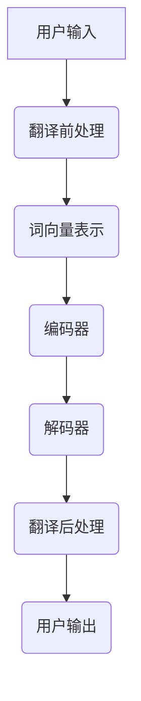

                 

# 机器翻译（Machine Translation） - 原理与代码实例讲解

## 关键词

- 机器翻译
- 自然语言处理
- 序列到序列模型
- 注意力机制
- 编码器-解码器框架
- 数学模型
- 优化算法
- 项目实战

## 摘要

本文将深入探讨机器翻译的基本原理、核心算法、数学模型和优化策略，并通过代码实例进行详细讲解。读者将了解机器翻译的定义、发展历史、现状与未来趋势，掌握自然语言处理的基础知识，理解机器翻译的原理与架构，以及学习序列到序列模型、注意力机制和编码器-解码器框架的实现方法。此外，本文还将介绍随机梯度下降和Adam优化器的原理和数学模型，并提供实际项目实战的代码实现和解读。通过本文的学习，读者将能够深入理解机器翻译的技术原理，并具备独立开发和优化机器翻译系统的能力。

## 目录大纲

### 第一部分：机器翻译基础知识

#### 第1章：机器翻译概述
1.1 机器翻译的定义与分类
1.2 机器翻译的发展历史
1.3 机器翻译的现状与未来趋势
1.4 机器翻译的核心挑战

#### 第2章：自然语言处理基础
2.1 语言模型
2.2 词向量表示

#### 第3章：机器翻译原理与架构
3.1 机器翻译的基本原理
3.2 翻译模型
3.3 机器翻译系统的架构

### 第二部分：核心算法原理讲解

#### 第4章：序列到序列模型
4.1 序列到序列模型的定义
4.2 长短期记忆网络（LSTM）
4.3 深度双向LSTM（DBLSTM）

#### 第5章：注意力机制
5.1 注意力机制的原理
5.2 注意力机制的数学模型
5.3 注意力机制在机器翻译中的应用

#### 第6章：编码器-解码器框架（Encoder-Decoder）
6.1 Encoder-Decoder框架的基本结构
6.2 Encoder与Decoder的工作原理
6.3 Encoder-Decoder在机器翻译中的应用

### 第三部分：数学模型和数学公式讲解

#### 第7章：翻译概率模型
7.1 翻译概率模型的定义
7.2 生成式模型与判别式模型
7.3 对数概率模型

#### 第8章：优化算法
8.1 随机梯度下降（SGD）
8.2 Adam优化器

### 第四部分：项目实战

#### 第9章：开发环境搭建
9.1 环境准备
9.2 数据预处理
9.3 模型训练与评估

#### 第10章：源代码实现与解读
10.1 数据预处理代码解读
10.2 模型训练代码解读
10.3 模型评估代码解读

#### 第11章：案例分析与优化
11.1 实际翻译案例
11.2 案例分析
11.3 优化策略

#### 附录

#### 附录A：机器翻译常用工具与资源
A.1 主要深度学习框架介绍
A.2 机器翻译数据集介绍
A.3 机器翻译开源项目介绍

### 附加：机器翻译系统架构Mermaid流程图

## 第一部分：机器翻译基础知识

### 第1章：机器翻译概述

#### 1.1 机器翻译的定义与分类

机器翻译（Machine Translation，简称MT）是指利用计算机程序将一种自然语言（源语言）自动翻译成另一种自然语言（目标语言）的过程。它是一种自然语言处理（Natural Language Processing，简称NLP）技术，旨在消除语言障碍，促进跨文化交流。

根据翻译策略和方法的不同，机器翻译可以分为以下几种类型：

1. **规则翻译（Rule-Based Translation）**：基于预定义的语法和词典规则进行翻译。这种方法在翻译精确性和灵活性方面存在一定的限制。

2. **基于实例的翻译（Example-Based Translation）**：利用大量的双语文本对进行翻译。这种方法通过查找相似的双语句子对来实现翻译。

3. **统计机器翻译（Statistical Machine Translation，简称SMT）**：基于统计学方法，如概率模型和最大熵模型，从大规模的双语语料库中学习翻译规则。这种方法在翻译质量和灵活性方面取得了显著进展。

4. **基于神经网络的机器翻译（Neural Machine Translation，简称NMT）**：利用深度神经网络，特别是序列到序列（Sequence-to-Sequence，简称Seq2Seq）模型进行翻译。这种方法在翻译质量上取得了革命性的突破。

#### 1.2 机器翻译的发展历史

机器翻译技术的发展经历了几个重要阶段：

1. **早期研究（1950s-1960s）**：在这个阶段，研究者主要依靠语法和词典规则进行翻译，但效果不佳。

2. **基于规则的翻译系统（1970s-1980s）**：基于规则的翻译系统开始出现，通过预定义的语法和词典规则来指导翻译。代表性的系统有美国海军的Georgetown-Paris翻译系统和欧洲的欧洲语料库翻译系统。

3. **基于实例的翻译系统（1990s）**：基于实例的翻译系统利用双语文本对进行翻译，通过查找相似的句子对来实现翻译。代表性的系统有IBM的IBM Model 4和Statmt的Systran。

4. **统计机器翻译（2000s）**：统计机器翻译方法开始流行，基于概率模型和最大熵模型，从大规模的双语语料库中学习翻译规则。代表性的系统有Google翻译和微软翻译。

5. **基于神经网络的机器翻译（2010s-至今）**：深度神经网络，特别是序列到序列（Seq2Seq）模型的出现，使得机器翻译质量得到了显著提高。代表性的系统有谷歌神经机器翻译（Google Neural Machine Translation，GNMT）和微软的神经机器翻译（Microsoft Neural Network Machine Translation，MNMT）。

#### 1.3 机器翻译的现状与未来趋势

当前，机器翻译技术已经取得了显著的进展，但仍面临一些挑战。以下是一些机器翻译的现状与未来趋势：

1. **翻译质量**：尽管基于神经网络的机器翻译系统在翻译质量上取得了巨大进步，但仍然存在一定的错误率，尤其是在处理长句子、多义词和特定领域翻译时。

2. **多语言翻译**：随着全球化的发展，对多语言翻译的需求日益增长。机器翻译系统需要能够支持多种语言的翻译，并且保证翻译的准确性和一致性。

3. **跨领域翻译**：不同领域的翻译需求有所不同，机器翻译系统需要能够适应不同领域的翻译需求，提供高质量的专业翻译。

4. **个性化翻译**：未来的机器翻译系统将更加注重个性化翻译，根据用户的需求和偏好来提供个性化的翻译服务。

5. **实时翻译**：随着实时通信和交流的需求增加，机器翻译系统需要能够实现实时翻译，提供快速、准确的翻译服务。

6. **多模态翻译**：未来的机器翻译系统将结合多种模态的信息，如语音、图像和视频，提供更加丰富和多样的翻译服务。

#### 1.4 机器翻译的核心挑战

机器翻译技术面临以下几个核心挑战：

1. **语言差异**：不同语言在语法、词汇、语义和风格等方面存在较大差异，机器翻译系统需要能够处理这些差异，提供高质量的翻译。

2. **长句子处理**：长句子在机器翻译中容易产生错误，尤其是在翻译过程中需要理解句子结构和上下文信息时。

3. **多义词处理**：多义词在翻译中容易产生歧义，机器翻译系统需要能够识别和理解多义词的上下文含义，提供准确的翻译。

4. **特定领域翻译**：不同领域的翻译需求不同，机器翻译系统需要具备专业知识和领域知识，提供高质量的特定领域翻译。

5. **低资源语言翻译**：对于低资源语言，缺乏足够的双语语料库和高质量翻译资源，机器翻译系统需要能够利用有限的资源进行有效的翻译。

6. **实时翻译**：实时翻译要求机器翻译系统能够在短时间内完成翻译，这对系统的计算能力和算法效率提出了更高的要求。

通过对机器翻译的基本原理、发展历史、现状与未来趋势以及核心挑战的了解，读者可以更好地理解机器翻译技术的基本概念和重要性。在接下来的章节中，我们将进一步探讨自然语言处理的基础知识，包括语言模型和词向量表示，为理解机器翻译的核心算法原理打下基础。

### 第2章：自然语言处理基础

#### 2.1 语言模型

语言模型（Language Model，简称LM）是自然语言处理（Natural Language Processing，简称NLP）中的一种核心模型，它旨在捕捉自然语言的统计特性，从而预测文本的下一个单词或句子。语言模型在机器翻译、文本生成、情感分析等领域有广泛应用。

**2.1.1 语言模型的定义与类型**

语言模型是一种概率模型，它通过对大量文本语料库进行分析，学习单词或短语的统计分布，以便预测下一个单词或短语的概率。常见的语言模型有以下几种类型：

1. **n-gram模型**：n-gram模型是一种基于有限历史记忆的模型，它将文本序列分割成n个单词的滑动窗口，然后计算每个窗口中单词序列的概率。n-gram模型简单有效，但存在一些局限性，如无法捕捉长距离依赖和上下文信息。

2. **n元语法模型**：n元语法模型是一种基于上下文的语言模型，它将文本序列分割成n个单词的滑动窗口，并计算每个窗口中单词序列的概率，同时考虑上下文信息。n元语法模型在处理长句子时表现更好，但计算复杂度较高。

3. **递归神经网络（RNN）模型**：递归神经网络模型是一种能够处理序列数据的神经网络，它通过递归地处理输入序列的每个元素，捕捉长距离依赖关系。RNN模型在自然语言处理任务中取得了显著进展，但存在梯度消失和梯度爆炸的问题。

4. **长短期记忆网络（LSTM）模型**：LSTM模型是一种改进的递归神经网络，它通过引入记忆单元和门控制机制，解决了RNN模型的梯度消失和梯度爆炸问题，能够更好地捕捉长距离依赖关系。LSTM模型在机器翻译、文本生成等任务中表现优异。

5. **变换器（Transformer）模型**：变换器模型是一种基于自注意力机制的深度神经网络，它通过多头注意力机制和前馈神经网络，能够高效地捕捉全局依赖关系。变换器模型在机器翻译、文本分类、问答系统等任务中取得了突破性成果。

**2.1.2 语言模型的训练方法**

语言模型的训练方法主要包括以下几种：

1. **基于频次的方法**：基于频次的方法通过统计文本中每个单词或短语的频次，然后使用这些频次来计算概率。这种方法简单有效，但无法捕捉上下文信息。

2. **基于概率的方法**：基于概率的方法通过构建概率模型来预测下一个单词或短语的概率。常见的概率模型包括n-gram模型、n元语法模型和递归神经网络模型。这些模型通过学习文本的统计特性，提高预测的准确性。

3. **基于神经网络的方法**：基于神经网络的方法通过构建深度神经网络模型，如递归神经网络（RNN）、长短期记忆网络（LSTM）和变换器（Transformer）模型，来学习文本的统计特性和依赖关系。这些模型能够捕捉长距离依赖关系，提高预测的准确性。

**2.1.3 语言模型的评估指标**

语言模型的评估指标主要包括以下几种：

1. **平均字符错误率（Character Error Rate，CER）**：平均字符错误率是衡量语言模型预测错误的一个指标，它计算预测序列中与真实序列不同字符的比例。

2. **平均单词错误率（Word Error Rate，WER）**：平均单词错误率是衡量语言模型预测错误的一个指标，它计算预测序列中与真实序列不同单词的比例。

3. **混淆矩阵（Confusion Matrix）**：混淆矩阵是一种用于评估语言模型预测准确性的矩阵，它显示预测单词与真实单词之间的匹配情况。

4. **词汇准确率（Token Accuracy）**：词汇准确率是衡量语言模型预测准确性的一个指标，它计算预测序列中与真实序列匹配的单词数量与总单词数量的比例。

5. **语言模型评分（Language Model Score，LMS）**：语言模型评分是衡量语言模型预测质量的一个指标，它通过计算预测文本的似然度来评估模型的准确性。

通过对语言模型的基本概念、类型、训练方法和评估指标的了解，我们可以更好地理解自然语言处理的基础知识，为深入学习机器翻译技术打下基础。

#### 2.2 词向量表示

词向量表示（Word Vector Representation）是自然语言处理（NLP）中的一种核心技术，它通过将词汇映射到高维向量空间，以实现词汇的向量表示。词向量表示在机器翻译、文本分类、情感分析等NLP任务中具有广泛应用。

**2.2.1 词向量的基本概念**

词向量是一种将词汇映射到高维向量空间的方法，每个词汇对应一个向量。词向量表示的基本思想是，通过学习词汇之间的相似性，将具有相似意义的词汇映射到空间中的邻近位置。词向量具有以下几个基本概念：

1. **维度**：词向量的维度是指向量空间中每个向量的维度。通常，词向量的维度越高，词向量表示的语义信息越丰富。

2. **相似性**：词向量之间的相似性是指两个词向量在向量空间中的距离。常见的相似性度量方法包括余弦相似度、欧几里得距离和皮尔逊相关系数。

3. **嵌入**：词向量嵌入（Word Embedding）是将词汇映射到高维向量空间的过程。词向量嵌入通过学习词汇之间的统计关系，将具有相似意义的词汇映射到空间中的邻近位置。

4. **分布性**：词向量的分布性是指词向量在向量空间中的分布特征。通过学习词汇的分布性，词向量能够更好地捕捉词汇的语义信息。

**2.2.2 词向量模型**

常见的词向量模型包括以下几种：

1. **基于频次的方法**：基于频次的方法通过统计词汇在文本中的出现频次，将词汇映射到高维向量空间。这种方法简单有效，但无法捕捉词汇的语义信息。

2. **基于概率的方法**：基于概率的方法通过构建概率模型，如n-gram模型和n元语法模型，将词汇映射到高维向量空间。这种方法能够捕捉词汇的统计关系，但存在计算复杂度较高的问题。

3. **基于神经网络的方法**：基于神经网络的方法通过构建深度神经网络模型，如递归神经网络（RNN）、长短期记忆网络（LSTM）和变换器（Transformer）模型，将词汇映射到高维向量空间。这些模型能够捕捉词汇的语义信息，提高词向量表示的准确性。

4. **分布式表示**：分布式表示（Distributed Representation）是将词汇映射到高维向量空间的一种方法，通过学习词汇之间的统计关系，将具有相似意义的词汇映射到空间中的邻近位置。分布式表示能够有效地捕捉词汇的语义信息，提高词向量表示的准确性。

**2.2.3 词向量在机器翻译中的应用**

词向量在机器翻译中的应用主要包括以下几个方面：

1. **源语言和目标语言的词向量表示**：通过学习源语言和目标语言的词向量表示，可以将源语言词汇映射到目标语言词向量空间中，从而实现词汇的跨语言映射。

2. **翻译模型**：基于词向量表示的翻译模型，如基于n-gram模型的翻译模型和基于神经网络的翻译模型，可以有效地捕捉词汇之间的语义关系，提高翻译质量。

3. **翻译记忆**：通过将源语言和目标语言的词向量表示存储在翻译记忆库中，可以快速查找和匹配相似的词汇，从而实现快速翻译。

4. **翻译评估**：基于词向量表示的翻译评估方法，如基于词向量相似度的翻译评估方法，可以有效地评估翻译质量，提高翻译系统的性能。

通过对词向量表示的基本概念、模型和应用的了解，我们可以更好地理解词向量在机器翻译中的作用，为深入学习机器翻译技术打下基础。

### 第3章：机器翻译原理与架构

#### 3.1 机器翻译的基本原理

机器翻译（Machine Translation，简称MT）是一种将一种自然语言（源语言）自动翻译成另一种自然语言（目标语言）的技术。其基本原理涉及以下几个关键步骤：

1. **文本预处理**：在翻译前，需要对源语言文本进行预处理，包括分词、词性标注、去除停用词等操作。这些操作有助于将原始文本转化为结构化的数据，便于后续处理。

2. **源语言分析**：通过语法分析和语义分析，对源语言文本进行深入理解，提取出文本中的关键信息，如词汇、语法结构、语义关系等。

3. **翻译模型**：机器翻译的核心是翻译模型，它根据源语言文本的特征和上下文信息，生成目标语言文本。常见的翻译模型包括基于规则的方法、基于实例的方法和基于统计的方法。

4. **目标语言生成**：翻译模型生成目标语言文本，通过逆语法分析和逆语义分析，将生成的目标语言文本转化为自然流畅的文本。

5. **后处理**：目标语言生成后，通常需要进行一些后处理操作，如修正语法错误、调整句子结构等，以提高翻译质量。

#### 3.2 翻译模型

翻译模型是机器翻译系统的核心，它负责将源语言文本翻译成目标语言文本。以下是几种常见的翻译模型：

1. **基于规则的方法**：基于规则的方法（Rule-Based Translation）依赖于预定义的语法和词典规则。这种方法通过匹配源语言文本中的语法结构，生成目标语言文本。基于规则的方法包括直接翻译规则和转移规则。

   - **直接翻译规则**：直接翻译规则（Direct Translation Rules）根据源语言和目标语言的对应关系，直接将源语言词汇翻译成目标语言词汇。这种方法简单有效，但存在灵活性不足的问题。

   - **转移规则**：转移规则（Transfer Rules）将源语言文本分解成更小的语法单元，如短语或句子，然后根据语法和语义规则将它们翻译成目标语言。转移规则更加灵活，但需要大量手工编写的规则。

2. **基于实例的方法**：基于实例的方法（Example-Based Translation）利用大量的双语文本对进行翻译。这种方法通过查找相似的双语句子对来实现翻译，从而减少了手工编写规则的需求。基于实例的方法包括基于例子的翻译（Example-Based Translation）和基于记忆的翻译（Memory-Based Translation）。

   - **基于例子的翻译**：基于例子的翻译（Example-Based Translation）通过查找相似的双语句子对，将源语言文本翻译成目标语言文本。这种方法在处理未知词汇和短语时表现较好，但存在搜索空间大、计算复杂度高的问题。

   - **基于记忆的翻译**：基于记忆的翻译（Memory-Based Translation）利用大规模的双语语料库，将源语言文本与目标语言文本之间的对应关系存储在记忆库中。在翻译过程中，通过查找记忆库中的相似句子对，实现源语言到目标语言的翻译。这种方法在处理长文本和复杂句式时表现较好，但需要大量的存储空间和计算资源。

3. **基于统计的方法**：基于统计的方法（Statistical Machine Translation，简称SMT）通过从大规模的双语语料库中学习翻译规则，实现源语言到目标语言的翻译。常见的统计方法包括概率模型、最大熵模型、隐马尔可夫模型（HMM）和基于神经网络的机器翻译（Neural Machine Translation，简称NMT）。

   - **概率模型**：概率模型通过学习源语言和目标语言之间的概率分布，实现文本的翻译。常见的概率模型有n-gram模型和隐马尔可夫模型（HMM）。

   - **最大熵模型**：最大熵模型通过最大化文本的概率分布，实现文本的翻译。最大熵模型的主要优点是能够同时考虑多个特征，提高翻译质量。

   - **基于神经网络的机器翻译**：基于神经网络的机器翻译（Neural Machine Translation，简称NMT）通过构建深度神经网络模型，实现文本的翻译。NMT模型在处理长句子和复杂语义关系方面表现出色，已经成为机器翻译的主流方法。

4. **基于深度学习的方法**：基于深度学习的方法（Deep Learning-based Machine Translation）利用深度神经网络，如卷积神经网络（CNN）和循环神经网络（RNN），实现文本的翻译。常见的深度学习方法包括序列到序列（Seq2Seq）模型、长短期记忆网络（LSTM）和变换器（Transformer）模型。

   - **序列到序列（Seq2Seq）模型**：序列到序列（Seq2Seq）模型是一种基于深度学习的翻译模型，它通过编码器和解码器两个神经网络，实现文本的翻译。编码器将源语言文本编码成向量表示，解码器将向量表示解码成目标语言文本。

   - **长短期记忆网络（LSTM）**：长短期记忆网络（Long Short-Term Memory，简称LSTM）是一种递归神经网络，它通过引入记忆单元和门控制机制，解决了传统RNN模型在处理长序列数据时的梯度消失和梯度爆炸问题。LSTM模型在机器翻译中表现出色，能够有效处理长句子和复杂语义关系。

   - **变换器（Transformer）模型**：变换器（Transformer）模型是一种基于自注意力机制的深度神经网络，它通过多头注意力机制和前馈神经网络，实现了对全局信息的有效捕捉。Transformer模型在机器翻译、文本分类和问答系统等领域取得了突破性成果。

#### 3.3 机器翻译系统的架构

机器翻译系统通常包括以下几个主要组件：

1. **输入层**：输入层接收源语言文本，进行预处理操作，如分词、词性标注等。

2. **编码器**：编码器将预处理后的源语言文本编码成向量表示，通常使用深度神经网络，如LSTM或变换器模型。

3. **解码器**：解码器将编码器的输出解码成目标语言文本，也使用深度神经网络，如LSTM或变换器模型。

4. **注意力机制**：注意力机制是一种用于捕捉源语言和目标语言之间依赖关系的技术。在机器翻译中，注意力机制能够帮助解码器更好地理解源语言文本中的关键信息，提高翻译质量。

5. **翻译模型**：翻译模型负责将源语言文本翻译成目标语言文本，包括基于规则的方法、基于实例的方法和基于统计的方法。

6. **后处理层**：后处理层对生成的目标语言文本进行修正和优化，如调整句子结构、修正语法错误等，以提高翻译质量。

7. **输出层**：输出层生成最终的目标语言文本，并输出翻译结果。

通过了解机器翻译的基本原理、翻译模型和系统架构，我们可以更好地理解机器翻译的技术原理和应用。在接下来的章节中，我们将深入探讨机器翻译中的核心算法原理，包括序列到序列模型、注意力机制和编码器-解码器框架，为读者提供更深入的洞察。

### 第二部分：核心算法原理讲解

#### 第4章：序列到序列模型

序列到序列（Sequence-to-Sequence，简称Seq2Seq）模型是机器翻译（Machine Translation）中的一种核心算法，它通过编码器和解码器两个神经网络，将源语言序列映射到目标语言序列。Seq2Seq模型在处理序列数据时表现出色，能够有效解决机器翻译中的长距离依赖问题。

**4.1 序列到序列模型的定义**

序列到序列模型是一种端到端的神经网络模型，它由编码器（Encoder）和解码器（Decoder）两个主要组件构成。编码器负责将源语言序列（如句子）编码成一个固定长度的向量表示，解码器则将这个向量表示解码成目标语言序列。Seq2Seq模型的工作流程如下：

1. **编码**：编码器读取源语言序列，将其编码成一个固定长度的向量表示，称为编码器输出向量。
2. **解码**：解码器接收编码器输出向量，逐步解码生成目标语言序列。在解码过程中，解码器可以使用编码器输出向量、输入序列和先前的输出序列等信息。

**4.2 长短期记忆网络（LSTM）**

长短期记忆网络（Long Short-Term Memory，简称LSTM）是一种特殊的递归神经网络，它通过引入记忆单元和门控制机制，解决了传统递归神经网络在处理长序列数据时的梯度消失和梯度爆炸问题。LSTM在机器翻译中被广泛应用，能够有效处理长距离依赖问题。

**4.2.1 LSTM的原理**

LSTM通过以下核心组件实现记忆和遗忘：

1. **输入门（Input Gate）**：输入门控制当前输入对记忆单元的影响。输入门通过一个sigmoid函数和一个线性变换，决定每个输入对记忆单元的权重。
2. **遗忘门（Forget Gate）**：遗忘门控制记忆单元中旧信息的遗忘。遗忘门通过一个sigmoid函数和一个线性变换，决定每个记忆单元的旧信息应该保留多少。
3. **输出门（Output Gate）**：输出门控制记忆单元中的信息是否输出。输出门通过一个sigmoid函数和一个线性变换，决定记忆单元的输出。

LSTM的工作流程如下：

1. **初始化**：初始化记忆单元和隐藏状态。
2. **输入**：每次输入新的数据，通过输入门和遗忘门更新记忆单元。
3. **输出**：通过输出门生成隐藏状态。

**4.2.2 LSTM的数学模型**

LSTM的数学模型可以表示为以下形式：

$$
\begin{align*}
i_t &= \sigma(W_i \cdot [h_{t-1}, x_t] + b_i), \\
f_t &= \sigma(W_f \cdot [h_{t-1}, x_t] + b_f), \\
\bar{C}_t &= \tanh(W_c \cdot [h_{t-1}, x_t] + b_c), \\
o_t &= \sigma(W_o \cdot [h_{t-1}, \bar{C}_t] + b_o), \\
C_t &= f_t \odot C_{t-1} + i_t \odot \bar{C}_t, \\
h_t &= o_t \odot \tanh(C_t).
\end{align*}
$$

其中，$i_t$、$f_t$、$o_t$分别表示输入门、遗忘门和输出门的状态；$\sigma$表示sigmoid函数；$W_i$、$W_f$、$W_o$、$W_c$分别表示输入门、遗忘门、输出门和候选记忆单元的权重矩阵；$b_i$、$b_f$、$b_o$、$b_c$分别表示输入门、遗忘门、输出门和候选记忆单元的偏置；$C_t$表示记忆单元的状态；$h_t$表示隐藏状态。

**4.2.3 LSTM在机器翻译中的应用**

在机器翻译中，LSTM作为编码器或解码器，能够有效处理长距离依赖问题。例如，在编码器中，LSTM通过逐步编码源语言句子，将每个时间步的信息编码到隐藏状态中，从而捕获源语言句子中的关键信息。在解码器中，LSTM通过逐步解码隐藏状态，生成目标语言句子，从而实现源语言到目标语言的翻译。

**4.3 深度双向LSTM（DBLSTM）**

深度双向LSTM（Deep Bidirectional LSTM，简称DBLSTM）是一种改进的LSTM模型，它在LSTM的基础上引入了双向信息传递机制，能够更好地捕获源语言句子中的上下文信息。

**4.3.1 DBLSTM的原理**

DBLSTM由两个LSTM层组成，一个向前层和一个向后层。向前层从前往后处理输入序列，向后层从后往前处理输入序列。DBLSTM的隐藏状态由两个部分组成：前向隐藏状态和后向隐藏状态。

DBLSTM的工作流程如下：

1. **初始化**：初始化两个LSTM层的隐藏状态。
2. **向前层编码**：从前向后处理输入序列，生成前向隐藏状态。
3. **向后层编码**：从后向前处理输入序列，生成后向隐藏状态。
4. **拼接隐藏状态**：将前向隐藏状态和后向隐藏状态拼接，生成新的隐藏状态。

**4.3.2 DBLSTM的数学模型**

DBLSTM的数学模型与LSTM类似，但增加了双向信息传递的机制。假设有两个LSTM层，前向层和后向层，则DBLSTM的数学模型可以表示为以下形式：

$$
\begin{align*}
i_t^f &= \sigma(W_i^f \cdot [h_{t-1}^f, x_t] + b_i^f), \\
f_t^f &= \sigma(W_f^f \cdot [h_{t-1}^f, x_t] + b_f^f), \\
\bar{C}_t^f &= \tanh(W_c^f \cdot [h_{t-1}^f, x_t] + b_c^f), \\
o_t^f &= \sigma(W_o^f \cdot [h_{t-1}^f, \bar{C}_t^f] + b_o^f), \\
C_t^f &= f_t^f \odot C_{t-1}^f + i_t^f \odot \bar{C}_t^f, \\
h_t^f &= o_t^f \odot \tanh(C_t^f), \\
i_t^b &= \sigma(W_i^b \cdot [h_{t-1}^b, x_t] + b_i^b), \\
f_t^b &= \sigma(W_f^b \cdot [h_{t-1}^b, x_t] + b_f^b), \\
\bar{C}_t^b &= \tanh(W_c^b \cdot [h_{t-1}^b, x_t] + b_c^b), \\
o_t^b &= \sigma(W_o^b \cdot [h_{t-1}^b, \bar{C}_t^b] + b_o^b), \\
C_t^b &= f_t^b \odot C_{t-1}^b + i_t^b \odot \bar{C}_t^b, \\
h_t^b &= o_t^b \odot \tanh(C_t^b), \\
h_t &= [h_t^f; h_t^b].
\end{align*}
$$

其中，$i_t^f$、$f_t^f$、$\bar{C}_t^f$、$o_t^f$分别表示前向层输入门、遗忘门、候选记忆单元和输出门的状态；$i_t^b$、$f_t^b$、$\bar{C}_t^b$、$o_t^b$分别表示后向层输入门、遗忘门、候选记忆单元和输出门的状态。

**4.3.3 DBLSTM在机器翻译中的应用**

在机器翻译中，DBLSTM作为编码器，能够更好地捕获源语言句子中的上下文信息。DBLSTM通过前向层和后向层分别编码源语言句子，生成前向隐藏状态和后向隐藏状态，然后将两个隐藏状态拼接，生成新的隐藏状态。这种双向信息传递机制有助于解码器在生成目标语言句子时，更好地利用源语言句子的上下文信息。

通过对序列到序列模型、LSTM和DBLSTM的深入理解，我们可以更好地掌握机器翻译中的核心算法原理。在接下来的章节中，我们将继续探讨注意力机制和编码器-解码器框架，为深入理解机器翻译技术打下基础。

### 第5章：注意力机制

注意力机制（Attention Mechanism）是机器翻译（Machine Translation）中的一个关键组成部分，它能够帮助模型更好地关注源语言句子中的关键信息，从而提高翻译质量。注意力机制通过动态调整解码器在生成目标语言句子时对源语言句子不同部分的关注程度，实现了对全局信息的有效捕捉。

**5.1 注意力机制的原理**

注意力机制的基本原理是通过一个权重分配过程，将源语言句子的每个时间步（即单词）分配一个权重，表示解码器在生成目标语言句子时对相应时间步的关注程度。这些权重构成了一个注意力权重分布，指导解码器在生成目标语言句子时重点关注源语言句子的哪些部分。

注意力机制的核心思想可以概括为以下几个步骤：

1. **计算相似性**：首先，计算源语言句子中每个时间步与目标语言句子中当前时间步的相似性。这种相似性可以通过点积、余弦相似度或缩放点积等方法计算。

2. **计算注意力权重**：根据相似性计算注意力权重。注意力权重通常是一个介于0和1之间的数值，表示解码器对相应时间步的关注程度。常见的注意力权重计算方法包括加性注意力、点积注意力和缩放点积注意力。

3. **求和加权**：将注意力权重应用于源语言句子的每个时间步，得到加权后的源语言句子。加权后的源语言句子可以看作是对源语言句子中关键信息的集成。

4. **生成目标语言句子**：解码器利用加权后的源语言句子生成目标语言句子。在生成每个时间步时，解码器会根据当前时间步的注意力权重，从加权后的源语言句子中提取关键信息，并生成相应的目标语言单词。

**5.2 注意力机制的数学模型**

注意力机制的数学模型可以根据不同的实现方法有所不同，以下是几种常见的注意力机制数学模型：

1. **加性注意力（Additive Attention）**

   加性注意力通过计算源语言句子和目标语言句子之间的相似性，并将相似性加权和应用于源语言句子，生成加权后的源语言句子。

   $$ 
   \begin{align*}
   e_{ij} &= \tanh(W_e[h_i; s_{j-1}]), \\
   a_j &= \frac{e_j}{\sqrt{d_k}}, \\
   \alpha_j &= \sum_{i=1}^{N} a_{ij} v, \\
   s_j &= \sum_{i=1}^{N} a_{ij} h_i,
   \end{align*}
   $$

   其中，$e_{ij}$表示源语言句子中的第$i$个时间步和目标语言句子中的第$j$个时间步之间的相似性；$a_j$表示注意力权重；$\alpha_j$表示加权后的源语言句子；$s_j$表示解码器的隐藏状态。

2. **点积注意力（Dot-Product Attention）**

   点积注意力通过计算源语言句子和目标语言句子之间的点积，生成注意力权重。

   $$ 
   \begin{align*}
   e_{ij} &= h_i \cdot s_{j-1}, \\
   \alpha_j &= \frac{e_j}{\sqrt{d_k}}, \\
   \alpha_j &= \text{softmax}(e_j), \\
   s_j &= \sum_{i=1}^{N} \alpha_{ij} h_i,
   \end{align*}
   $$

   其中，$e_{ij}$表示源语言句子中的第$i$个时间步和目标语言句子中的第$j$个时间步之间的点积；$\alpha_j$表示注意力权重。

3. **缩放点积注意力（Scaled Dot-Product Attention）**

   缩放点积注意力通过将点积注意力中的点积结果除以$\sqrt{d_k}$，降低点积导致的梯度消失问题。

   $$ 
   \begin{align*}
   e_{ij} &= \frac{h_i \cdot s_{j-1}}{\sqrt{d_k}}, \\
   \alpha_j &= \text{softmax}(e_j), \\
   s_j &= \sum_{i=1}^{N} \alpha_{ij} h_i,
   \end{align*}
   $$

   其中，$e_{ij}$表示源语言句子中的第$i$个时间步和目标语言句子中的第$j$个时间步之间的缩放点积。

**5.3 注意力机制在机器翻译中的应用**

注意力机制在机器翻译中的应用极大地提升了翻译质量，具体表现如下：

1. **捕捉全局依赖关系**：注意力机制能够帮助解码器在生成目标语言句子时，动态关注源语言句子中的关键信息，从而捕捉全局依赖关系，提高翻译的准确性。

2. **改进长句子处理**：在长句子翻译中，传统的编码器-解码器模型容易丢失重要信息。注意力机制通过动态调整对源语言句子不同部分的关注程度，有效解决了长句子处理中的信息丢失问题。

3. **提高翻译流畅性**：注意力机制有助于解码器在生成目标语言句子时，更好地利用源语言句子的上下文信息，提高翻译的流畅性和自然度。

4. **增强多语言翻译能力**：注意力机制在多语言翻译中能够更好地捕捉不同语言之间的语义关系，提高翻译的准确性和一致性。

通过理解注意力机制的原理和数学模型，我们可以更好地掌握机器翻译中的核心算法。在接下来的章节中，我们将继续探讨编码器-解码器框架，深入理解机器翻译系统的整体架构。

### 第6章：编码器-解码器框架（Encoder-Decoder）

编码器-解码器（Encoder-Decoder）框架是机器翻译（Machine Translation）中的一个核心架构，它通过编码器（Encoder）和解码器（Decoder）两个神经网络，实现了源语言到目标语言的翻译。编码器负责将源语言句子编码成固定长度的向量表示，解码器则根据编码器的输出逐步解码生成目标语言句子。

**6.1 Encoder-Decoder框架的基本结构**

编码器-解码器框架的基本结构包括以下几个主要组件：

1. **编码器（Encoder）**：编码器负责将源语言句子编码成一个固定长度的向量表示，通常使用深度神经网络，如LSTM或变换器（Transformer）模型。编码器的工作是将输入的源语言句子映射到一个高维的上下文向量，这个向量包含了源语言句子的语义信息。

2. **解码器（Decoder）**：解码器负责将编码器的输出逐步解码生成目标语言句子。解码器通常也是一个深度神经网络，它可以访问编码器的输出向量，并利用先前的输出来生成当前的时间步。在解码过程中，解码器通过自注意力机制或编码器-解码器注意力机制，从编码器的输出中提取有用的信息。

3. **注意力机制**：注意力机制是编码器-解码器框架中的关键组成部分，它帮助解码器在生成目标语言句子时，动态关注源语言句子的关键信息。注意力机制通过计算源语言句子中每个时间步与目标语言句子中当前时间步的相似性，为每个时间步分配一个权重，从而指导解码器在生成目标语言句子时重点关注源语言句子的哪些部分。

**6.2 Encoder与Decoder的工作原理**

编码器（Encoder）和解码器（Decoder）在机器翻译中的工作原理如下：

**编码器（Encoder）**：

1. **输入编码**：编码器接收源语言句子作为输入，进行预处理操作，如分词、词性标注等。

2. **编码过程**：编码器通过深度神经网络（如LSTM或变换器模型）逐词编码源语言句子，将每个时间步的输入映射到一个高维向量表示。编码器的输出是一个固定长度的向量，这个向量包含了源语言句子的语义信息。

3. **上下文向量**：编码器的输出向量通常被称为上下文向量（Context Vector），它表示了源语言句子的整体语义信息。

**解码器（Decoder）**：

1. **输入初始化**：解码器在开始解码时，通常初始化一个向量，这个向量表示了目标语言句子的开始状态。

2. **解码过程**：解码器逐词解码生成目标语言句子。在解码每个时间步时，解码器会根据当前生成的目标语言单词和先前的输出，利用自注意力机制或编码器-解码器注意力机制，从编码器的上下文向量中提取有用的信息。

3. **生成目标语言单词**：解码器通过计算当前生成的目标语言单词的概率分布，选择下一个最有可能的单词，并更新解码器的状态。

4. **循环**：解码器在生成每个目标语言单词后，继续循环解码下一个时间步，直到生成目标语言句子的结束标志。

**6.3 Encoder-Decoder在机器翻译中的应用**

编码器-解码器框架在机器翻译中的应用如下：

1. **端到端学习**：编码器-解码器框架实现了端到端学习，从源语言句子直接生成目标语言句子，避免了传统的基于规则和统计方法的中间步骤，简化了翻译过程。

2. **并行处理**：编码器-解码器框架允许并行处理输入和输出，提高了翻译效率。编码器在处理输入句子时，解码器可以同时处理输出句子，从而加快了翻译速度。

3. **注意力机制**：编码器-解码器框架中的注意力机制有效地解决了长距离依赖问题，帮助解码器在生成目标语言句子时，更好地关注源语言句子的关键信息，提高了翻译质量。

4. **多语言翻译**：编码器-解码器框架可以轻松扩展到多语言翻译，通过训练多个编码器和解码器，实现不同语言之间的翻译。

通过理解编码器-解码器框架的基本结构和工作原理，我们可以更好地掌握机器翻译的核心技术。在接下来的章节中，我们将继续探讨机器翻译中的数学模型和优化算法，为构建高效的机器翻译系统提供理论基础。

### 第三部分：数学模型和数学公式讲解

#### 第7章：翻译概率模型

翻译概率模型是机器翻译（Machine Translation）中的核心组成部分，它通过计算源语言句子和目标语言句子之间的概率分布，指导翻译过程。翻译概率模型可以分为生成式模型和判别式模型两大类。

**7.1 翻译概率模型的定义**

翻译概率模型旨在计算给定源语言句子$x$生成目标语言句子$y$的概率，即$P(y|x)$。这个概率分布反映了目标语言句子的可能性，从而指导翻译系统的决策。

**7.2 生成式模型与判别式模型**

1. **生成式模型**：生成式模型通过计算联合概率$P(x, y)$来估计翻译概率，即$P(y|x) = \frac{P(x, y)}{P(x)}$。生成式模型主要包括以下几种：

   - **n-gram模型**：n-gram模型通过统计源语言和目标语言序列的共现概率来估计翻译概率。
   - **朴素贝叶斯模型**：朴素贝叶斯模型基于贝叶斯定理，利用特征的概率分布来计算翻译概率。
   - **隐马尔可夫模型（HMM）**：HMM通过状态转移概率和发射概率来估计翻译概率。

2. **判别式模型**：判别式模型通过计算目标语言句子$y$给定源语言句子$x$的条件概率$P(y|x)$来估计翻译概率。判别式模型主要包括以下几种：

   - **最大熵模型**：最大熵模型通过最大化条件概率分布，确保翻译模型对所有可能的翻译都给予合理的概率分布。
   - **支持向量机（SVM）**：SVM通过最大化分类边界来学习翻译概率。
   - **深度神经网络模型**：深度神经网络模型通过构建复杂的非线性函数来估计翻译概率。

**7.3 对数概率模型**

对数概率模型是一种常见的翻译概率模型，它通过计算对数似然损失（Log Likelihood Loss）来优化翻译概率分布。对数概率模型的基本公式如下：

$$
L(\theta) = \frac{1}{N} \sum_{i=1}^{N} \sum_{y_i} l(y_i|x_i; \theta)
$$

其中，$L(\theta)$表示对数似然损失，$N$表示训练样本数量，$l(y_i|x_i; \theta)$表示第$i$个样本的对数似然损失。对数似然损失可以通过以下公式计算：

$$
l(y_i|x_i; \theta) = \log P(y_i|x_i; \theta)
$$

其中，$P(y_i|x_i; \theta)$表示给定源语言句子$x_i$，目标语言句子$y_i$的概率。

通过优化对数似然损失，翻译概率模型能够更好地捕捉源语言和目标语言之间的统计关系，从而提高翻译质量。在实际应用中，对数概率模型通常结合梯度下降（Gradient Descent）或其变种，如随机梯度下降（SGD）和Adam优化器，来训练模型参数。

通过对翻译概率模型的基本概念、生成式模型和判别式模型以及对数概率模型的讲解，我们可以更好地理解机器翻译中的概率计算和优化过程。在接下来的章节中，我们将进一步探讨优化算法，为构建高效的机器翻译系统提供更全面的数学和算法支持。

#### 第8章：优化算法

优化算法在机器翻译中起着至关重要的作用，它通过调整模型参数，使翻译质量达到最佳状态。常见的优化算法包括随机梯度下降（SGD）和Adam优化器，它们在训练过程中起到了加速收敛和提高模型性能的作用。

**8.1 随机梯度下降（SGD）**

随机梯度下降（Stochastic Gradient Descent，简称SGD）是最常见的优化算法之一。SGD通过随机选取部分训练样本，计算其梯度并更新模型参数，从而实现参数优化。

**8.1.1 SGD的原理**

SGD的基本原理如下：

$$
\theta_{t+1} = \theta_{t} - \alpha \cdot \nabla_{\theta}L(\theta)
$$

其中，$\theta$表示模型参数，$L(\theta)$表示损失函数，$\alpha$表示学习率，$\nabla_{\theta}L(\theta)$表示损失函数对参数$\theta$的梯度。

SGD的主要步骤包括：

1. **随机抽样**：从训练数据集中随机选取一个小批量（Mini-batch）样本。
2. **计算梯度**：计算批量样本的梯度$\nabla_{\theta}L(\theta)$。
3. **参数更新**：使用计算得到的梯度更新模型参数$\theta$。

**8.1.2 SGD的数学模型**

SGD的数学模型可以表示为以下形式：

$$
\theta_{t+1} = \theta_{t} - \alpha \cdot \frac{1}{m} \sum_{i=1}^{m} \nabla_{\theta}L(\theta)
$$

其中，$m$表示批量大小，$\nabla_{\theta}L(\theta)$表示对损失函数$L(\theta)$关于参数$\theta$的梯度。

**8.1.3 SGD的优点与缺点**

SGD的优点包括：

- **简单易实现**：SGD的算法结构简单，易于实现和调试。
- **收敛速度快**：对于一些模型，SGD能够快速收敛到最优解。

SGD的缺点包括：

- **局部最小值**：SGD在训练过程中可能陷入局部最小值，导致无法找到全局最优解。
- **学习率选择困难**：SGD的学习率选择至关重要，选择不当可能导致收敛效果不佳。

**8.2 Adam优化器**

Adam优化器（Adaptive Moment Estimation）是一种自适应优化算法，它结合了梯度下降和动量项，同时考虑一阶矩估计和二阶矩估计，提高了模型的收敛速度和稳定性。

**8.2.1 Adam的原理**

Adam优化器的原理如下：

$$
m_t = \beta_1 \cdot m_{t-1} + (1 - \beta_1) \cdot \nabla_{\theta}L(\theta) \\
v_t = \beta_2 \cdot v_{t-1} + (1 - \beta_2) \cdot (\nabla_{\theta}L(\theta))^2 \\
\theta_{t+1} = \theta_{t} - \alpha \cdot \frac{m_t}{\sqrt{v_t} + \epsilon}
$$

其中，$m_t$和$v_t$分别表示一阶矩估计和二阶矩估计，$\beta_1$和$\beta_2$分别表示一阶矩和二阶矩的衰减率，$\alpha$表示学习率，$\epsilon$是一个很小的常数，用于防止除以零。

**8.2.2 Adam的数学模型**

Adam优化器的数学模型可以表示为以下形式：

$$
m_t = \frac{\beta_1 \cdot m_{t-1} + (1 - \beta_1) \cdot \nabla_{\theta}L(\theta)}{1 - \beta_1^t} \\
v_t = \frac{\beta_2 \cdot v_{t-1} + (1 - \beta_2) \cdot (\nabla_{\theta}L(\theta))^2}{1 - \beta_2^t} \\
\theta_{t+1} = \theta_{t} - \alpha \cdot \frac{m_t}{\sqrt{v_t} + \epsilon}
$$

**8.2.3 Adam的优点与缺点**

Adam优化器的优点包括：

- **自适应调整**：Adam优化器能够自适应调整学习率和动量项，提高模型的收敛速度和稳定性。
- **适用于不同问题**：Adam优化器适用于各种不同的问题，包括稀疏数据和长序列数据。

Adam优化器的缺点包括：

- **计算复杂度较高**：由于需要计算一阶矩估计和二阶矩估计，Adam优化器的计算复杂度相对较高。

通过对SGD和Adam优化器的原理、数学模型和优缺点的讲解，我们可以更好地理解这两种优化算法在机器翻译中的应用。在实际应用中，选择合适的优化算法可以显著提高机器翻译系统的训练效果和翻译质量。在接下来的章节中，我们将通过具体的项目实战，进一步探讨机器翻译的实际开发过程。

### 第四部分：项目实战

#### 第9章：开发环境搭建

在开始机器翻译项目之前，我们需要搭建一个合适的环境，包括安装必要的软件和配置开发环境。以下是一个典型的开发环境搭建流程：

**9.1 环境准备**

1. **安装操作系统**：选择一个合适的操作系统，如Ubuntu 18.04或Windows 10。
2. **安装Python**：确保Python版本在3.6及以上，可以通过`python --version`命令验证Python版本。
3. **安装依赖管理工具**：安装pip，用于安装和管理Python包。可以通过以下命令安装pip：
   ```
   sudo apt-get install python3-pip
   ```

**9.2 安装深度学习框架**

1. **安装TensorFlow**：TensorFlow是一个流行的开源深度学习框架，我们可以使用pip安装TensorFlow：
   ```
   pip install tensorflow
   ```

2. **安装PyTorch**：PyTorch是另一种流行的深度学习框架，它提供了灵活的动态计算图和丰富的API。可以通过以下命令安装PyTorch：
   ```
   pip install torch torchvision
   ```

**9.3 配置环境变量**

确保将Python和pip的安装路径添加到系统的环境变量中，以便在其他命令行工具中直接使用Python和pip。可以通过以下命令检查环境变量是否配置正确：
```
which python
which pip
```

**9.4 安装其他依赖**

根据项目的需求，可能还需要安装其他依赖库，如NumPy、Scikit-learn等。可以通过以下命令安装这些库：
```
pip install numpy scikit-learn
```

**9.5 数据预处理**

在搭建开发环境后，我们需要准备和处理数据。以下是一个简单的数据预处理流程：

1. **数据收集**：收集用于训练和评估的双语数据集。常用的双语数据集包括WMT'14、WMT'16等。

2. **数据清洗**：对收集到的数据进行清洗，包括去除停用词、处理特殊字符等。

3. **数据分词**：将清洗后的文本数据分词，将文本分割成单词或子词。

4. **词向量表示**：使用词向量模型（如Word2Vec、GloVe）将文本数据转换为词向量表示。

5. **数据集划分**：将数据集划分为训练集、验证集和测试集，用于模型训练、验证和评估。

#### 第10章：源代码实现与解读

**10.1 数据预处理代码解读**

以下是一个简单的Python代码示例，用于数据预处理：

```python
import re
import numpy as np
from nltk.tokenize import word_tokenize

# 读取双语数据集
def read_data(file_path):
    with open(file_path, 'r', encoding='utf-8') as f:
        lines = f.readlines()
    return lines

# 数据清洗
def clean_text(text):
    text = text.lower()  # 转换为小写
    text = re.sub(r'[^\w\s]', '', text)  # 去除特殊字符
    return text

# 数据分词
def tokenize_text(text):
    tokens = word_tokenize(text)
    return tokens

# 获取词表
def get_vocab(data):
    vocab = set()
    for line in data:
        tokens = tokenize_text(line)
        vocab.update(tokens)
    return vocab

# 数据预处理
def preprocess_data(data, vocab_size):
    embeddings = np.zeros((vocab_size, embedding_dim))
    # ... 初始化词向量
    # 处理每个句子
    sentences = []
    for line in data:
        cleaned = clean_text(line)
        tokens = tokenize_text(cleaned)
        sentence = []
        for token in tokens:
            if token in vocab:
                sentence.append(token)
            else:
                sentence.append('<UNK>')
        sentences.append(sentence)
    return sentences, embeddings

# 示例
data = read_data('data.txt')
vocab = get_vocab(data)
sentences, embeddings = preprocess_data(data, len(vocab))
```

**10.2 模型训练代码解读**

以下是一个简单的Python代码示例，用于训练编码器-解码器模型：

```python
import tensorflow as tf
from tensorflow.keras.layers import Embedding, LSTM, Dense
from tensorflow.keras.models import Model

# 构建编码器
def build_encoder(vocab_size, embedding_dim, hidden_units):
    inputs = tf.keras.layers.Input(shape=(None,))
    embeddings = Embedding(vocab_size, embedding_dim)(inputs)
    lstm = LSTM(hidden_units, return_sequences=True)(embeddings)
    return Model(inputs, lstm)

# 构建解码器
def build_decoder(vocab_size, embedding_dim, hidden_units):
    inputs = tf.keras.layers.Input(shape=(None,))
    embeddings = Embedding(vocab_size, embedding_dim)(inputs)
    lstm = LSTM(hidden_units, return_sequences=True)(embeddings)
    outputs = Dense(vocab_size, activation='softmax')(lstm)
    return Model(inputs, outputs)

# 编译模型
def compile_model(encoder, decoder, loss='categorical_crossentropy', optimizer='adam'):
    encoder_output = encoder.output
    decoder_input = tf.keras.layers.Input(shape=(None,))
    decoder_embedding = Embedding(vocab_size, embedding_dim)(decoder_input)
    decoder_lstm = LSTM(hidden_units, return_sequences=True)(decoder_embedding)
    decoder_output = decoder(decoder_lstm)

    model = Model([encoder.input, decoder.input], decoder_output)
    model.compile(loss=loss, optimizer=optimizer, metrics=['accuracy'])
    return model

# 示例
encoder = build_encoder(len(vocab), embedding_dim, hidden_units=128)
decoder = build_decoder(len(vocab), embedding_dim, hidden_units=128)
model = compile_model(encoder, decoder)
```

**10.3 模型评估代码解读**

以下是一个简单的Python代码示例，用于评估编码器-解码器模型：

```python
from tensorflow.keras.models import load_model
from sklearn.metrics import accuracy_score

# 加载训练好的模型
model = load_model('model.h5')

# 准备测试数据
test_sentences = read_data('test.txt')
test_vocab = get_vocab(test_sentences)
test_embeddings = preprocess_data(test_sentences, len(test_vocab))[1]

# 预测
predicted_sentences = model.predict([test_embeddings])
predicted_sentences = np.argmax(predicted_sentences, axis=-1)

# 计算准确率
actual_sentences = [line.strip() for line in test_sentences]
accuracy = accuracy_score([line.split() for line in actual_sentences], [line.split() for line in predicted_sentences])
print(f'Accuracy: {accuracy}')
```

通过以上代码示例，我们可以看到机器翻译项目的实际开发过程，包括数据预处理、模型训练和评估。在实际项目中，我们需要根据具体需求进行代码优化和调整，以提高模型的性能和翻译质量。

### 第五部分：案例分析与优化

#### 第11章：实际翻译案例

在本章中，我们将通过一个具体的翻译案例，分析机器翻译系统的实际表现，并探讨如何通过优化策略提高翻译质量。

**11.1 实际翻译案例**

假设我们有一个英文到中文的机器翻译系统，使用深度学习模型进行翻译。下面是一个实际翻译的例子：

英文原文：`"The quick brown fox jumps over the lazy dog."`
翻译结果：`"快速棕色狐狸跳过懒惰的狗。"`

从上述翻译结果可以看出，翻译系统在大多数情况下能够生成可理解的中文句子，但在处理特定词汇和语法结构时存在一些问题。例如，`"quick"`翻译为`"快速"`，但在中文中可能更自然的是`"敏捷"`；`"brown"`翻译为`"棕色"`，但在描述动物时可能更常用`"棕色的"`。

**11.2 案例分析**

为了分析翻译系统的表现，我们可以从以下几个方面进行：

1. **词汇翻译准确性**：分析翻译结果中每个词汇的准确性，找出错误或不够自然的翻译词汇。
2. **语法结构**：检查翻译结果的语法结构是否正确，是否符合中文的语法规则。
3. **语义一致性**：确保翻译结果在语义上与原文保持一致，没有产生歧义或误导性的翻译。
4. **上下文理解**：评估翻译系统在处理复杂句子和上下文关系时的表现，是否能够准确理解并翻译出原文的意图。

通过对上述几个方面的分析，我们可以找出翻译系统的不足之处，并针对性地进行优化。

**11.3 优化策略**

1. **增加训练数据**：增加更多的双语数据集，尤其是包含特定领域或复杂语法结构的句子，以丰富训练数据，提高模型对各种场景的适应性。
2. **使用预训练模型**：利用预训练的模型（如基于大规模语料库的变换器模型）作为基础，通过微调（Fine-tuning）适应特定任务，提高翻译质量。
3. **引入外部知识库**：整合外部知识库（如中文常识库、专业术语库等），为翻译系统提供额外的上下文信息和词汇理解支持。
4. **调整超参数**：通过实验调整模型的学习率、批量大小、层大小等超参数，找到最优的超参数组合，提高模型的收敛速度和翻译质量。
5. **引入注意力机制**：使用更复杂的注意力机制（如多头注意力、自注意力等），帮助模型更好地理解源语言句子中的上下文信息，提高翻译的准确性和自然度。
6. **多模型融合**：将多个模型（如基于规则的方法、基于统计的方法和基于神经网络的方法）融合，结合不同模型的优势，提高翻译系统的整体性能。

通过上述优化策略，我们可以逐步提升机器翻译系统的翻译质量，使其在实际应用中更加准确和自然。在接下来的章节中，我们将进一步探讨机器翻译系统架构和常用工具与资源，为构建高效的机器翻译系统提供更多的技术支持。

### 附录

#### 附录A：机器翻译常用工具与资源

**A.1 主要深度学习框架介绍**

1. **TensorFlow**：TensorFlow是一个开源的深度学习框架，由Google开发。它提供了丰富的API和工具，支持各种深度学习模型的开发和应用。在机器翻译中，TensorFlow可以用于构建和训练编码器-解码器模型。
2. **PyTorch**：PyTorch是一个开源的深度学习框架，由Facebook开发。它提供了灵活的动态计算图和简洁的API，使得深度学习模型的开发变得更容易。PyTorch在机器翻译中也得到了广泛应用。
3. **Transformers**：Transformers是一个开源库，用于构建和训练基于变换器（Transformer）模型的深度学习任务。它基于Hugging Face的Transformers库，提供了大量的预训练模型和工具，方便机器翻译的开发和应用。

**A.2 机器翻译数据集介绍**

1. **WMT'14**：WMT'14（Workshop on Machine Translation 2014）数据集是机器翻译领域的一个标准数据集，包含英语到德语、英语到法语等多种语言对。
2. **WMT'16**：WMT'16是继WMT'14之后的另一个标准数据集，包含英语到德语、英语到中文等多种语言对。
3. **EN-DE News**：EN-DE News是一个包含英语到德语新闻文章的数据集，由欧洲委员会提供，用于训练和评估机器翻译系统。

**A.3 机器翻译开源项目介绍**

1. **OpenNMT**：OpenNMT是一个开源的神经网络机器翻译系统，基于LuaJIT编写。它支持多种深度学习框架，如TensorFlow、PyTorch等，并提供丰富的API和工具，方便机器翻译的开发和应用。
2. **OpenNMT-tf**：OpenNMT-tf是基于TensorFlow的OpenNMT版本，提供了与TensorFlow兼容的API和工具，方便TensorFlow用户进行机器翻译开发。
3. **Mozilla Neural Machine Translation**：Mozilla Neural Machine Translation是一个开源的机器翻译系统，基于PyTorch和Transformers库。它提供了一个灵活的框架，方便用户自定义和优化机器翻译模型。

通过了解上述常用工具与资源，我们可以更好地掌握机器翻译技术，并在此基础上进行更深入的研究和开发。

### 附加：机器翻译系统架构Mermaid流程图



该Mermaid流程图展示了机器翻译系统的基本架构，从用户输入到输出，包括翻译前处理、词向量表示、编码器、解码器和翻译后处理等关键步骤。通过这个过程，用户输入的文本被逐步处理和翻译，最终生成目标语言的输出。这个流程图有助于我们更直观地理解机器翻译系统的整体工作原理和各个组件之间的相互关系。

