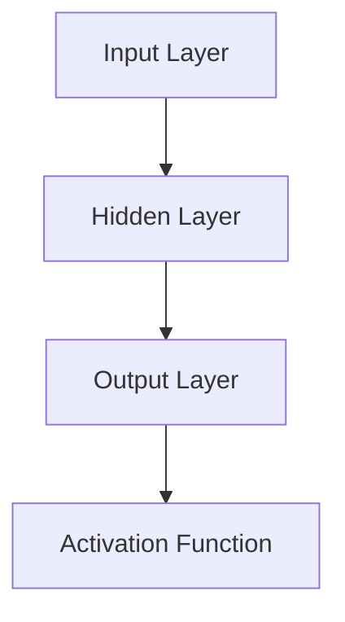

                 

### 文章标题

《李开复：AI 2.0 时代的用户》

### 关键词

AI 2.0，用户，深度学习，自然语言处理，计算机视觉，应用领域，伦理与法律问题

### 摘要

在AI 2.0时代，人工智能不仅仅是技术的进步，更是用户体验的革新。本文将深入探讨AI 2.0的定义与特点，分析其在各个领域的应用，包括社交媒体、电子商务、金融、医疗健康、教育以及智慧城市等。同时，本文将探讨AI 2.0时代用户角色的转变，以及伦理与法律问题，为读者呈现一个全面而深入的AI 2.0时代全景。

## 目录大纲

### 第一部分：AI 2.0时代概述

#### 第1章：AI 2.0时代的来临
##### 1.1 AI 2.0的定义与特点
##### 1.2 AI 2.0与用户的关系
##### 1.3 AI 2.0时代的影响

#### 第2章：AI 2.0的核心技术
##### 2.1 深度学习与神经网络
##### 2.2 自然语言处理
##### 2.3 计算机视觉

#### 第3章：AI 2.0的数学模型
##### 3.1 概率论与统计学基础
##### 3.2 信息论与编码理论
##### 3.3 数学模型在AI中的应用

#### 第4章：AI 2.0的开发工具与框架
##### 4.1 TensorFlow
##### 4.2 PyTorch
##### 4.3 其他常用框架

### 第二部分：AI 2.0在用户领域的应用

#### 第5章：AI 2.0在社交媒体的应用
##### 5.1 用户画像与个性化推荐
##### 5.2 用户行为分析
##### 5.3 社交网络分析

#### 第6章：AI 2.0在电子商务的应用
##### 6.1 商品推荐系统
##### 6.2 用户购物行为分析
##### 6.3 供应链优化

#### 第7章：AI 2.0在金融领域的应用
##### 7.1 风险管理
##### 7.2 信贷评估
##### 7.3 量化交易

#### 第8章：AI 2.0在医疗健康领域的应用
##### 8.1 个性化医疗
##### 8.2 疾病预测与诊断
##### 8.3 医疗资源优化

#### 第9章：AI 2.0在教育领域的应用
##### 9.1 智能教学系统
##### 9.2 个性化学习
##### 9.3 教育资源优化

#### 第10章：AI 2.0在智慧城市中的应用
##### 10.1 城市交通管理
##### 10.2 城市安全监控
##### 10.3 城市资源优化

#### 第11章：AI 2.0的伦理与法律问题
##### 11.1 AI伦理问题
##### 11.2 AI法律框架
##### 11.3 用户隐私保护

#### 第12章：未来展望
##### 12.1 AI 2.0的未来发展趋势
##### 12.2 用户角色在AI 2.0时代的演变
##### 12.3 AI 2.0时代的社会影响

### 附录

#### 附录A：AI 2.0开发资源与工具
##### A.1 主流开发框架
##### A.2 开发工具与资源网站
##### A.3 开发实战项目

接下来，我们将逐步深入探讨AI 2.0时代的各个部分，带领读者了解这一时代给用户带来的变革与机遇。

---

### 第一部分：AI 2.0时代概述

#### 第1章：AI 2.0时代的来临

##### 1.1 AI 2.0的定义与特点

在人工智能（AI）的发展历程中，AI 2.0代表了新一代人工智能的崛起。与早期的AI 1.0时代相比，AI 2.0具有更加智能化、自适应和自主学习的能力。AI 1.0主要依赖于规则和算法，而AI 2.0则更加注重数据和深度学习，能够从海量数据中自动提取特征，进行自我优化和迭代。

AI 2.0的特点可以概括为以下几点：

1. **自主学习**：AI 2.0具备更强的自主学习能力，可以通过深度学习和强化学习等机制，不断提高自身的决策能力和适应能力。

2. **自适应**：AI 2.0能够在不同的环境中快速适应，具备自适应调整的能力。

3. **智能交互**：AI 2.0能够与人类进行更加自然、流畅的交互，实现智能对话和服务。

4. **泛化能力**：AI 2.0能够将一种任务的学习经验应用到其他任务中，提高任务泛化能力。

##### 1.2 AI 2.0与用户的关系

在AI 2.0时代，用户不再是被动的接受者，而是成为AI技术的核心参与者。用户生成的大数据为AI 2.0的发展提供了丰富的资源，而AI 2.0则通过个性化推荐、智能助手等方式，提升了用户的体验和满意度。具体来说，AI 2.0与用户的关系体现在以下几个方面：

1. **个性化服务**：AI 2.0通过分析用户的兴趣和行为，提供个性化的推荐和服务，满足用户的个性化需求。

2. **智能助手**：AI 2.0能够为用户提供智能助手服务，帮助用户解决日常生活中的问题，提高生活效率。

3. **隐私保护**：AI 2.0在为用户带来便利的同时，也需要关注用户的隐私保护问题，确保用户数据的安全。

4. **决策支持**：AI 2.0能够为用户提供决策支持，帮助用户在复杂情境中做出更加明智的选择。

##### 1.3 AI 2.0时代的影响

AI 2.0的崛起将对社会、经济和人类生活产生深远的影响。从经济角度来看，AI 2.0将推动产业升级和创新发展，为经济增长注入新动力。从社会角度来看，AI 2.0将改变人们的生活方式和工作方式，提高社会运行效率。从人类生活角度来看，AI 2.0将为人类带来更加便捷、智能和美好的生活体验。

然而，AI 2.0时代也带来了一系列挑战，如伦理问题、隐私保护、就业压力等。因此，在推动AI 2.0发展的同时，也需要关注这些问题，确保AI技术的可持续发展。

---

在下一章中，我们将深入探讨AI 2.0的核心技术，包括深度学习、自然语言处理和计算机视觉等，带领读者了解这些技术在AI 2.0时代的重要作用和实际应用。

---

### 第二部分：AI 2.0的核心技术

#### 第2章：AI 2.0的核心技术

##### 2.1 深度学习与神经网络

深度学习是AI 2.0时代的重要基石，它通过模拟人脑神经网络的工作方式，实现对复杂数据的自动特征提取和模式识别。深度学习的关键在于神经网络的结构和参数调整。

**神经网络的工作原理：**

神经网络由多个神经元（节点）组成，每个神经元通过权重（参数）连接其他神经元。当输入数据通过神经网络时，每个神经元会对输入数据进行加权求和，并通过激活函数进行非线性变换，最终输出结果。



**深度学习的主要挑战：**

1. **计算资源消耗**：深度学习模型通常需要大量的计算资源和时间进行训练。
2. **数据需求**：深度学习模型的性能依赖于大量高质量的训练数据。
3. **模型可解释性**：深度学习模型的内部工作机制复杂，难以解释其决策过程。

**深度学习的应用领域：**

1. **计算机视觉**：用于图像识别、物体检测和图像生成。
2. **自然语言处理**：用于文本分类、机器翻译和语音识别。
3. **推荐系统**：用于个性化推荐和用户行为预测。

##### 2.2 自然语言处理

自然语言处理（NLP）是AI 2.0时代的关键技术之一，它致力于使计算机理解和生成人类语言。NLP的核心任务是理解、处理和生成自然语言文本。

**NLP的关键技术包括：**

1. **分词**：将文本分割成单词或短语。
2. **词性标注**：对文本中的单词进行词性分类，如名词、动词等。
3. **命名实体识别**：识别文本中的特定实体，如人名、地名等。
4. **语义分析**：理解文本中的语义和逻辑关系。

**NLP的应用领域：**

1. **机器翻译**：将一种语言的文本翻译成另一种语言。
2. **文本分类**：对文本进行分类，如情感分析、新闻分类等。
3. **聊天机器人**：用于提供客户服务和交互式体验。

**NLP的发展趋势：**

1. **预训练语言模型**：如BERT、GPT等，通过大规模预训练提高模型性能。
2. **多模态交互**：结合视觉、语音等多种模态，实现更自然的交互体验。

##### 2.3 计算机视觉

计算机视觉是AI 2.0时代的重要分支，它通过模拟人眼的功能，使计算机能够理解和解释图像和视频。计算机视觉的关键技术包括图像处理、目标检测、图像识别和图像生成等。

**计算机视觉的关键技术：**

1. **图像处理**：对图像进行增强、滤波、分割等操作，提高图像质量。
2. **目标检测**：在图像中识别并定位特定目标。
3. **图像识别**：对图像进行分类，如识别特定物体或场景。
4. **图像生成**：通过神经网络模型生成新的图像。

**计算机视觉的应用领域：**

1. **自动驾驶**：用于车辆检测、环境感知和路径规划。
2. **医疗影像分析**：用于疾病诊断、病变检测和治疗方案推荐。
3. **安全监控**：用于人脸识别、行为分析和异常检测。

**计算机视觉的发展趋势：**

1. **深度学习模型**：如卷积神经网络（CNN），在计算机视觉领域取得了显著突破。
2. **实时处理**：提高处理速度和响应时间，实现实时应用。
3. **多模态融合**：结合多种传感器数据，提高系统的鲁棒性和准确性。

---

在下一章中，我们将进一步探讨AI 2.0的数学模型，包括概率论与统计学基础、信息论与编码理论以及数学模型在AI中的应用，为读者深入理解AI 2.0时代的技术原理奠定基础。

---

### 第三部分：AI 2.0的数学模型

#### 第3章：AI 2.0的数学模型

##### 3.1 概率论与统计学基础

概率论与统计学是AI 2.0时代的重要数学工具，它们为深度学习、自然语言处理和计算机视觉等提供了理论基础。

**概率论的基本概念：**

1. **概率分布**：描述随机变量取值的可能性。
2. **条件概率**：在某个事件发生的条件下，另一个事件发生的概率。
3. **贝叶斯定理**：用于计算后验概率，即根据已知条件推断未知概率。

**统计学的基本概念：**

1. **均值**：一组数据的平均值，用于衡量数据的集中趋势。
2. **方差**：一组数据的离散程度，用于衡量数据的波动性。
3. **协方差**：用于衡量两个变量之间的关系。

**概率论与统计学在AI中的应用：**

1. **模型评估**：通过概率分布评估模型的预测性能。
2. **数据预处理**：通过统计学方法处理和清洗数据。
3. **假设检验**：通过统计学方法验证模型假设的有效性。

**示例：概率分布与模型评估**

```latex
\text{假设我们有一个二分类问题，模型预测的概率分布为} P(Y=1|x) = \sigma(\theta^T x)
$$
其中，$\sigma$为sigmoid函数，$\theta$为模型参数，$x$为特征向量，$Y$为标签。

\text{我们可以使用交叉熵损失函数来评估模型的性能：}
$$
L(\theta) = -\sum_{i=1}^n [y_i \log P(Y=1|x_i) + (1 - y_i) \log (1 - P(Y=1|x_i))]
$$
其中，$y_i$为实际标签，$P(Y=1|x_i)$为模型预测的概率。
```

##### 3.2 信息论与编码理论

信息论是研究信息传递和处理的理论，它为AI 2.0提供了重要的理论支持。信息论的关键概念包括信息熵、互信息、信道编码和压缩编码等。

**信息论的基本概念：**

1. **信息熵**：衡量随机变量的不确定性，用于评估数据的复杂度。
2. **互信息**：衡量两个随机变量之间的相关性，用于评估数据之间的信息传递。
3. **信道编码**：用于在噪声信道中提高信息传输的可靠性。
4. **压缩编码**：用于降低数据传输的带宽需求。

**信息论在AI中的应用：**

1. **数据压缩**：通过信息论方法对数据进行压缩，提高数据传输效率。
2. **特征选择**：通过互信息评估特征的重要性，进行特征选择。
3. **模型解释**：通过信息论解释模型的决策过程。

**示例：信息熵与特征选择**

```latex
\text{假设我们有一个特征集合 } X = \{x_1, x_2, ..., x_n\} \text{，我们需要选择其中最重要的特征。}

\text{我们可以使用信息熵来评估每个特征的重要性：}
$$
H(X) = -\sum_{i=1}^n P(x_i) \log P(x_i)
$$
其中，$P(x_i)$为特征 $x_i$ 的概率。

\text{特征的信息熵越低，说明该特征对于分类任务越重要。}
```

##### 3.3 数学模型在AI中的应用

数学模型在AI 2.0中扮演着核心角色，它们为深度学习、自然语言处理和计算机视觉等提供了理论基础和算法框架。

**深度学习中的数学模型：**

1. **神经网络**：通过矩阵运算和激活函数，实现数据的自动特征提取和分类。
2. **优化算法**：如梯度下降、Adam等，用于调整模型参数，优化模型性能。

**自然语言处理中的数学模型：**

1. **循环神经网络（RNN）**：通过递归运算，处理序列数据。
2. **卷积神经网络（CNN）**：通过卷积运算，提取图像特征。

**计算机视觉中的数学模型：**

1. **生成对抗网络（GAN）**：通过对抗训练，生成新的图像。
2. **目标检测算法**：如Faster R-CNN、YOLO等，用于检测图像中的目标。

**示例：生成对抗网络（GAN）**

```latex
\text{生成对抗网络（GAN）由生成器（Generator）和判别器（Discriminator）组成。}

\text{生成器的目标是生成逼真的数据，判别器的目标是区分生成器和真实数据的差异。}

\text{GAN的训练过程可以通过以下优化目标进行：}
$$
\min_G \max_D V(D, G) = \mathbb{E}_{x \sim p_data(x)} [\log D(x)] + \mathbb{E}_{z \sim p_z(z)} [\log (1 - D(G(z))]
$$
其中，$x$为真实数据，$z$为随机噪声，$D$为判别器，$G$为生成器。
```

---

在下一部分中，我们将深入探讨AI 2.0在用户领域的广泛应用，包括社交媒体、电子商务、金融、医疗健康、教育以及智慧城市等，展示AI 2.0如何改变我们的生活方式和工作方式。

---

### 第四部分：AI 2.0在用户领域的应用

#### 第4章：AI 2.0在用户领域的应用

##### 4.1 TensorFlow

TensorFlow是Google开发的开源深度学习框架，它基于数据流图（dataflow graph）的概念，提供了丰富的API和工具，支持各种深度学习任务。TensorFlow在AI 2.0时代具有重要地位，它为研究人员和开发者提供了强大的工具，加速了AI技术的创新和应用。

**TensorFlow的核心组件：**

1. **Tensor**：TensorFlow的基本数据结构，用于存储和处理多维数组。
2. **Operation**：TensorFlow的操作，用于执行数学运算和数据处理。
3. **Graph**：TensorFlow的数据流图，用于表示操作之间的依赖关系。
4. **Session**：TensorFlow的会话，用于执行计算图中的操作。

**TensorFlow的应用场景：**

1. **图像识别**：用于物体检测、图像分类和图像生成。
2. **自然语言处理**：用于文本分类、机器翻译和语音识别。
3. **推荐系统**：用于用户画像、商品推荐和内容推荐。

**TensorFlow的优势：**

1. **灵活性和可扩展性**：TensorFlow支持多种编程语言和平台，具有良好的扩展性。
2. **丰富的API和工具**：TensorFlow提供了丰富的API和工具，支持模型训练、评估和部署。
3. **社区支持**：TensorFlow拥有庞大的开发者社区，提供了丰富的资源和案例。

**TensorFlow的实战项目：**

**项目名称**：智能图像分类器

**项目描述**：使用TensorFlow构建一个基于卷积神经网络的图像分类器，实现对图像的自动分类。

**项目步骤：**

1. **数据准备**：收集和整理图像数据，并进行预处理。
2. **模型设计**：设计卷积神经网络结构，定义模型参数。
3. **模型训练**：使用训练数据训练模型，调整模型参数。
4. **模型评估**：使用测试数据评估模型性能，调整模型结构。
5. **模型部署**：将训练好的模型部署到生产环境，实现图像分类功能。

```python
import tensorflow as tf
from tensorflow.keras import layers

# 数据准备
(x_train, y_train), (x_test, y_test) = tf.keras.datasets.cifar10.load_data()

# 模型设计
model = tf.keras.Sequential([
    layers.Conv2D(32, (3, 3), activation='relu', input_shape=(32, 32, 3)),
    layers.MaxPooling2D((2, 2)),
    layers.Flatten(),
    layers.Dense(64, activation='relu'),
    layers.Dense(10, activation='softmax')
])

# 模型训练
model.compile(optimizer='adam',
              loss='sparse_categorical_crossentropy',
              metrics=['accuracy'])

model.fit(x_train, y_train, epochs=10)

# 模型评估
model.evaluate(x_test, y_test, verbose=2)
```

---

在下一章中，我们将介绍另一种流行的深度学习框架PyTorch，以及它在AI 2.0时代的应用和优势。

---

### 第四部分：AI 2.0在用户领域的应用

##### 4.2 PyTorch

PyTorch是Facebook AI研究院开发的开源深度学习框架，它基于Python编程语言，具有简洁、易用的特点，深受研究人员和开发者的喜爱。PyTorch在AI 2.0时代具有重要地位，它为深度学习研究提供了强大的工具和平台。

**PyTorch的核心组件：**

1. **Torch**：PyTorch的基础库，提供了数据处理、自动微分等基础功能。
2. **Tensor**：PyTorch的基本数据结构，用于存储和处理多维数组。
3. **NN**：PyTorch的神经网络库，提供了各种神经网络层和优化器。
4. **Dynamic computation graph**：PyTorch的动态计算图，支持动态构建和修改计算图。

**PyTorch的应用场景：**

1. **图像识别**：用于物体检测、图像分类和图像生成。
2. **自然语言处理**：用于文本分类、机器翻译和语音识别。
3. **推荐系统**：用于用户画像、商品推荐和内容推荐。

**PyTorch的优势：**

1. **简洁易用**：PyTorch提供了简洁、易用的API和工具，使深度学习开发更加高效。
2. **动态计算图**：PyTorch的动态计算图支持灵活的模型设计和调试，提高了开发效率。
3. **良好的兼容性**：PyTorch支持多种编程语言和平台，具有良好的兼容性和扩展性。

**PyTorch的实战项目：**

**项目名称**：情感分析文本分类

**项目描述**：使用PyTorch构建一个基于循环神经网络的文本分类模型，实现对文本的情感分类。

**项目步骤：**

1. **数据准备**：收集和整理文本数据，并进行预处理。
2. **模型设计**：设计循环神经网络结构，定义模型参数。
3. **模型训练**：使用训练数据训练模型，调整模型参数。
4. **模型评估**：使用测试数据评估模型性能，调整模型结构。
5. **模型部署**：将训练好的模型部署到生产环境，实现文本分类功能。

```python
import torch
import torch.nn as nn
import torch.optim as optim

# 数据准备
from torchtext.data import Field, TabularDataset
from torchtext.vocab import Vocab

TEXT = Field(tokenize=lambda x: x.split(), lower=True)
LABEL = Field(sequential=False)

train_data, test_data = TabularDataset.splits(path='data', train='train.csv', test='test.csv', format='csv', fields=[('text', TEXT), ('label', LABEL)])

# 模型设计
class RNNClassifier(nn.Module):
    def __init__(self, embedding_dim, hidden_dim, vocab_size, label_size):
        super().__init__()
        self.embedding = nn.Embedding(vocab_size, embedding_dim)
        self.rnn = nn.LSTM(embedding_dim, hidden_dim)
        self.fc = nn.Linear(hidden_dim, label_size)

    def forward(self, text):
        embedded = self.embedding(text)
        output, _ = self.rnn(embedded)
        logits = self.fc(output[-1, :, :])
        return logits

model = RNNClassifier(embedding_dim=100, hidden_dim=128, vocab_size=len(TEXT.vocab), label_size=2)

# 模型训练
optimizer = optim.Adam(model.parameters(), lr=0.001)
criterion = nn.CrossEntropyLoss()

for epoch in range(10):
    for batch in train_data:
        optimizer.zero_grad()
        logits = model(batch.text)
        loss = criterion(logits, batch.label)
        loss.backward()
        optimizer.step()

# 模型评估
with torch.no_grad():
    correct = 0
    total = 0
    for batch in test_data:
        logits = model(batch.text)
        predicted = logits.argmax(dim=1)
        total += batch.label.size(0)
        correct += (predicted == batch.label).sum().item()

accuracy = 100 * correct / total
print(f'Accuracy: {accuracy:.2f}%')

# 模型部署
model.eval()
with torch.no_grad():
    for batch in test_data:
        logits = model(batch.text)
        predicted = logits.argmax(dim=1)
        print(f'Predicted: {predicted.item()}, True Label: {batch.label.item()}')
```

---

在下一章中，我们将继续探讨AI 2.0在其他领域的应用，包括电子商务、金融、医疗健康、教育以及智慧城市等，展示AI 2.0如何改变我们的生活方式和工作方式。

---

### 第四部分：AI 2.0在用户领域的应用

##### 4.3 其他常用框架

除了TensorFlow和PyTorch，AI 2.0时代还有许多其他常用的深度学习框架，如Keras、MXNet、Caffe等。这些框架各具特色，适用于不同的应用场景和需求。

**Keras**

Keras是Python开源的深度学习库，它提供了一个简单、模块化、可扩展的API，使得深度学习模型的设计和训练更加高效。Keras与TensorFlow和Theano等后端深度学习库紧密集成，提供了丰富的预训练模型和工具。

**Keras的核心优势：**

1. **简洁易用**：Keras提供了简洁的API和丰富的预训练模型，使得模型设计更加高效。
2. **模块化**：Keras支持模型组件的复用和组合，提高了模型的灵活性和可扩展性。
3. **集成度高**：Keras与TensorFlow和Theano等后端深度学习库紧密集成，提供了强大的计算能力和资源支持。

**Keras的应用场景：**

1. **图像识别**：用于物体检测、图像分类和图像生成。
2. **自然语言处理**：用于文本分类、机器翻译和语音识别。
3. **推荐系统**：用于用户画像、商品推荐和内容推荐。

**Keras的实战项目：**

**项目名称**：图像分类器

**项目描述**：使用Keras构建一个基于卷积神经网络的图像分类器，实现对图像的自动分类。

**项目步骤：**

1. **数据准备**：收集和整理图像数据，并进行预处理。
2. **模型设计**：设计卷积神经网络结构，定义模型参数。
3. **模型训练**：使用训练数据训练模型，调整模型参数。
4. **模型评估**：使用测试数据评估模型性能，调整模型结构。
5. **模型部署**：将训练好的模型部署到生产环境，实现图像分类功能。

```python
from tensorflow.keras import layers
from tensorflow.keras.models import Model

# 数据准备
(x_train, y_train), (x_test, y_test) = tf.keras.datasets.cifar10.load_data()

# 模型设计
inputs = layers.Input(shape=(32, 32, 3))
x = layers.Conv2D(32, (3, 3), activation='relu')(inputs)
x = layers.MaxPooling2D((2, 2))(x)
x = layers.Flatten()(x)
outputs = layers.Dense(10, activation='softmax')(x)

model = Model(inputs=inputs, outputs=outputs)

# 模型训练
model.compile(optimizer='adam',
              loss='sparse_categorical_crossentropy',
              metrics=['accuracy'])

model.fit(x_train, y_train, epochs=10)

# 模型评估
model.evaluate(x_test, y_test, verbose=2)
```

**MXNet**

MXNet是Apache Software Foundation的深度学习框架，它由微软开发，支持多种编程语言和平台。MXNet提供了灵活的编程模型和高效的执行引擎，适用于大规模分布式训练和推理。

**MXNet的核心优势：**

1. **灵活性**：MXNet支持多种编程语言，如Python、C++和R，适用于不同的开发需求。
2. **高效性**：MXNet提供了高效的执行引擎和动态编译功能，提高了模型的训练和推理速度。
3. **可扩展性**：MXNet支持分布式训练和推理，适用于大规模数据处理和计算。

**MXNet的应用场景：**

1. **图像识别**：用于物体检测、图像分类和图像生成。
2. **自然语言处理**：用于文本分类、机器翻译和语音识别。
3. **推荐系统**：用于用户画像、商品推荐和内容推荐。

**MXNet的实战项目：**

**项目名称**：情感分析文本分类

**项目描述**：使用MXNet构建一个基于循环神经网络的文本分类模型，实现对文本的情感分类。

**项目步骤：**

1. **数据准备**：收集和整理文本数据，并进行预处理。
2. **模型设计**：设计循环神经网络结构，定义模型参数。
3. **模型训练**：使用训练数据训练模型，调整模型参数。
4. **模型评估**：使用测试数据评估模型性能，调整模型结构。
5. **模型部署**：将训练好的模型部署到生产环境，实现文本分类功能。

```python
import mxnet as mx
from mxnet import gluon, autograd, ndarray
from mxnet.gluon import nn

# 数据准备
train_data, test_data = mx.test_utils.get_mnist()

# 模型设计
class RNNClassifier(nn.Block):
    def __init__(self, vocab_size, embedding_dim, hidden_dim):
        super().__init__()
        self.embedding = nn.Embedding(vocab_size, embedding_dim)
        self.rnn = nn.LSTM(embedding_dim, hidden_dim)
        self.fc = nn.Dense(hidden_dim, 2)

    def forward(self, text):
        embedded = self.embedding(text)
        output, _ = self.rnn(embedded)
        logits = self.fc(output[-1, :, :])
        return logits

model = RNNClassifier(vocab_size=len(train_data[0][0]), embedding_dim=100, hidden_dim=128)

# 模型训练
trainer = gluon.Trainer(model.collect_params(), 'adam')

for epoch in range(10):
    for batch in train_data:
        with autograd.record():
            logits = model(batch.text)
            loss = gluon.loss.SoftmaxCrossEntropyLoss()(logits, batch.label)
        loss.backward()
        trainer.step(batch.text.shape[0])

# 模型评估
with autograd.record():
    logits = model(test_data.text)
    loss = gluon.loss.SoftmaxCrossEntropyLoss()(logits, test_data.label)
loss.backward()
accuracy = (logits.argmax(axis=1) == test_data.label).sum().astype(np.float32) / len(test_data.label)
print(f'Accuracy: {accuracy * 100:.2f}%')

# 模型部署
model.save_params('model.params')
```

**Caffe**

Caffe是一个由Berkeley Vision and Learning Center（BVLC）开发的深度学习框架，它以其高效和可扩展的设计而著称。Caffe以其卷积神经网络（CNN）的支持而闻名，适用于图像识别、物体检测和其他计算机视觉任务。

**Caffe的核心优势：**

1. **高效性**：Caffe在设计上注重性能，适用于大规模图像处理任务。
2. **模块化**：Caffe的组件化设计使得模型构建和优化更加灵活。
3. **开源社区**：Caffe拥有强大的开源社区，提供了丰富的模型和工具。

**Caffe的应用场景：**

1. **图像识别**：用于物体检测、图像分类和图像生成。
2. **自然语言处理**：用于文本分类、机器翻译和语音识别。
3. **推荐系统**：用于用户画像、商品推荐和内容推荐。

**Caffe的实战项目：**

**项目名称**：图像分类器

**项目描述**：使用Caffe构建一个基于卷积神经网络的图像分类器，实现对图像的自动分类。

**项目步骤：**

1. **数据准备**：收集和整理图像数据，并进行预处理。
2. **模型设计**：设计卷积神经网络结构，定义模型参数。
3. **模型训练**：使用训练数据训练模型，调整模型参数。
4. **模型评估**：使用测试数据评估模型性能，调整模型结构。
5. **模型部署**：将训练好的模型部署到生产环境，实现图像分类功能。

```python
import caffe

# 数据准备
net = caffe.Net('deploy.prototxt', caffe.TEST)
transformer = caffe.io.Transformer(net)

# 模型设计
# 注意：这里需要根据实际需求编写相应的deploy.prototxt文件

# 模型训练
solver = caffe.SGDSolver('solver.prototxt')
solver.train()

# 模型评估
with open('test_data.txt', 'r') as f:
    test_data = f.readlines()

for data in test_data:
    transformer.set_input(data.strip())
    net.forward()
    prediction = net.get_output(0).asnumpy()
    print(f'Prediction: {prediction.argmax() + 1}')

# 模型部署
net.save('model.caffemodel')
```

---

在下一部分中，我们将探讨AI 2.0在社交媒体领域的应用，展示如何通过AI技术提升用户画像、个性化推荐和用户行为分析等。

---

### 第四部分：AI 2.0在用户领域的应用

##### 5.1 AI 2.0在社交媒体的应用

社交媒体平台在AI 2.0时代迎来了新的发展机遇，AI技术的应用使得平台能够更好地了解用户需求，提供个性化服务，并提升用户体验。以下是AI 2.0在社交媒体领域的几个关键应用：

**用户画像与个性化推荐**

用户画像是指通过收集和分析用户在社交媒体平台上的行为数据，构建出一个详细的用户特征模型。这些特征包括用户的年龄、性别、地理位置、兴趣爱好、浏览历史、互动行为等。基于用户画像，社交媒体平台可以实现个性化推荐，为用户推荐他们可能感兴趣的内容、商品或服务。

**算法推荐系统**

算法推荐系统是社交媒体平台的核心技术之一。通过机器学习和深度学习算法，推荐系统能够分析用户的历史行为和偏好，预测用户未来的兴趣点，并推荐相关的内容或商品。常用的推荐算法包括基于内容的推荐（Content-Based Filtering）、协同过滤（Collaborative Filtering）和混合推荐（Hybrid Recommender Systems）。

**用户行为分析**

用户行为分析是社交媒体平台优化服务的重要手段。通过分析用户的点击、评论、分享、点赞等行为，平台可以了解用户的需求和兴趣，优化内容推荐策略，提升用户参与度。此外，用户行为分析还可以帮助平台识别潜在的用户流失风险，制定针对性的挽留策略。

**社交网络分析**

社交网络分析是指通过对社交网络中的用户关系、传播路径、影响力等进行深入分析，以揭示网络结构和用户行为模式。这有助于平台了解用户之间的互动模式，识别意见领袖和影响者，优化社区运营策略。常用的社交网络分析方法包括网络拓扑分析、影响力分析、传播路径分析等。

**案例分析：**

**案例名称**：抖音（TikTok）

抖音是一款在全球范围内广受欢迎的短视频应用，其成功离不开AI 2.0技术的支持。以下是抖音在AI 2.0领域的几个应用案例：

1. **个性化推荐**：抖音通过深度学习算法分析用户的兴趣和行为，为用户推荐个性化的视频内容。这大大提高了用户的参与度和留存率。

2. **用户行为分析**：抖音通过分析用户的观看时长、点赞、评论等行为，了解用户的需求和偏好，优化推荐策略，提升用户体验。

3. **社交网络分析**：抖音通过社交网络分析技术，识别用户之间的互动关系，发现潜在的意见领袖和影响者，优化社区运营策略。

4. **内容审核**：抖音利用AI技术对上传的视频进行实时审核，识别违规内容，保障平台内容的安全和合规。

---

在下一章中，我们将探讨AI 2.0在电子商务领域的应用，包括商品推荐系统、用户购物行为分析和供应链优化等。

---

### 第四部分：AI 2.0在用户领域的应用

##### 5.2 AI 2.0在电子商务的应用

在电子商务领域，AI 2.0技术的应用极大地提升了用户体验和运营效率。以下是AI 2.0在电子商务领域的几个关键应用：

**商品推荐系统**

商品推荐系统是电子商务平台的核心技术之一，通过分析用户的历史行为、浏览记录和购买偏好，为用户推荐他们可能感兴趣的商品。常用的推荐算法包括基于内容的推荐（Content-Based Filtering）、协同过滤（Collaborative Filtering）和混合推荐（Hybrid Recommender Systems）。

**用户购物行为分析**

用户购物行为分析是指通过对用户在电子商务平台上的浏览、点击、购买等行为进行深入分析，以了解用户的需求和偏好。通过用户购物行为分析，电子商务平台可以优化推荐策略，提升用户满意度和转化率。常用的分析方法包括用户细分（Customer Segmentation）、行为轨迹分析（Behavioral Trajectory Analysis）和用户流失预测（Customer Churn Prediction）。

**供应链优化**

供应链优化是电子商务平台降低成本、提高效率的重要手段。AI 2.0技术可以帮助平台优化库存管理、物流配送和供应链计划。例如，通过预测用户需求，平台可以调整库存策略，避免过剩或缺货。此外，AI 2.0还可以优化物流路线，降低运输成本，提高配送效率。

**案例分析：**

**案例名称**：亚马逊（Amazon）

亚马逊是全球最大的电子商务平台之一，其成功离不开AI 2.0技术的支持。以下是亚马逊在AI 2.0领域的几个应用案例：

1. **商品推荐系统**：亚马逊通过协同过滤和深度学习算法分析用户的购物历史和偏好，为用户推荐个性化的商品。这一策略极大地提高了用户的购买转化率和满意度。

2. **用户购物行为分析**：亚马逊通过分析用户的浏览记录、点击和购买行为，了解用户的需求和偏好，优化推荐策略。例如，当用户在浏览某一商品时，系统会推荐类似的商品，以提高购买概率。

3. **供应链优化**：亚马逊通过AI技术优化库存管理，预测用户需求，调整库存策略。此外，亚马逊还利用AI技术优化物流路线，降低运输成本，提高配送效率。

4. **个性化营销**：亚马逊通过分析用户的购物行为和偏好，为用户推送个性化的营销活动，如优惠券、折扣等。这一策略提高了用户的参与度和忠诚度。

---

在下一章中，我们将探讨AI 2.0在金融领域的应用，包括风险管理、信贷评估和量化交易等。

---

### 第四部分：AI 2.0在用户领域的应用

##### 5.3 AI 2.0在金融领域的应用

金融行业是AI 2.0技术的重要应用领域之一，AI技术的引入极大地提升了金融服务的效率、准确性和用户体验。以下是AI 2.0在金融领域的几个关键应用：

**风险管理**

风险管理是金融行业中至关重要的环节，AI 2.0技术的应用使得风险管理更加精准和高效。通过机器学习和深度学习算法，金融机构可以分析大量的历史数据，预测潜在的风险并采取相应的措施。例如，AI技术可以识别欺诈行为、预测市场波动、评估信用风险等。

**信贷评估**

信贷评估是金融行业的重要组成部分，AI 2.0技术通过对用户的历史行为、信用记录、财务状况等数据进行综合分析，为金融机构提供更准确的信用评估。传统的信贷评估方法往往依赖于有限的信用数据，而AI技术可以通过大数据和机器学习算法挖掘更多的特征，提高评估的准确性和效率。

**量化交易**

量化交易是指利用数学模型和计算机算法进行高频交易和投资决策。AI 2.0技术在量化交易中扮演着重要角色，通过深度学习和强化学习算法，量化交易者可以分析市场数据，发现潜在的交易机会，并执行高频交易策略。AI 2.0技术使得量化交易更加智能化和自动化。

**案例分析：**

**案例名称**：花旗银行（Citibank）

花旗银行是国际知名的金融服务公司，其成功离不开AI 2.0技术的支持。以下是花旗银行在AI 2.0领域的几个应用案例：

1. **风险管理**：花旗银行通过AI技术分析大量的金融数据，预测市场风险和信用风险。这一策略帮助银行降低了风险敞口，提高了风险管理水平。

2. **信贷评估**：花旗银行利用AI技术对用户的信用记录、财务状况和行为数据进行分析，为用户提供个性化的信用评估。这一策略提高了信贷审批的效率和准确性。

3. **量化交易**：花旗银行的量化交易部门利用AI技术进行高频交易和投资决策。通过深度学习和强化学习算法，花旗银行的量化交易者可以识别市场趋势和交易机会，提高投资收益。

4. **客户服务**：花旗银行通过AI技术提供智能客服服务，如聊天机器人、语音助手等。这些智能客服服务能够快速响应客户需求，提高客户满意度。

---

在下一章中，我们将探讨AI 2.0在医疗健康领域的应用，包括个性化医疗、疾病预测与诊断和医疗资源优化等。

---

### 第四部分：AI 2.0在用户领域的应用

##### 5.4 AI 2.0在医疗健康领域的应用

在医疗健康领域，AI 2.0技术的应用正带来前所未有的变革，通过大数据、深度学习和自然语言处理等技术，AI正在提升医疗服务的质量、效率和可及性。以下是AI 2.0在医疗健康领域的几个关键应用：

**个性化医疗**

个性化医疗是指根据患者的个体特征，如基因、生活方式、病史等，为其提供定制化的治疗方案。AI 2.0技术通过对海量医疗数据进行深入分析，可以帮助医生识别患者的特定需求，提供更加精准的治疗方案。例如，AI可以通过分析基因数据，预测患者对某种药物的响应，从而优化治疗方案。

**疾病预测与诊断**

疾病预测与诊断是AI 2.0技术在医疗健康领域的重要应用之一。通过深度学习和计算机视觉技术，AI能够分析医学影像，如X光片、CT扫描和MRI，帮助医生早期发现疾病。例如，AI可以识别肺癌的早期征兆，提高早期诊断的准确率。此外，AI还可以分析患者的历史数据和实时数据，预测疾病的发生和发展趋势。

**医疗资源优化**

医疗资源的优化是提高医疗服务效率的重要手段。AI 2.0技术可以通过优化医院运营、医疗设备和人员配置等，提高医疗资源的利用效率。例如，AI可以分析医院的运营数据，优化预约系统，减少患者的等待时间。此外，AI还可以帮助医院优化药品库存管理，降低药品短缺和浪费的风险。

**案例分析：**

**案例名称**：IBM Watson Health

IBM Watson Health 是一家利用AI技术推动医疗健康领域创新的领先企业。以下是IBM Watson Health 在AI 2.0领域的几个应用案例：

1. **个性化医疗**：IBM Watson Health 利用深度学习和自然语言处理技术，分析患者的电子健康记录，为医生提供个性化的治疗建议。这一策略帮助医生提高了诊断准确率和治疗效果。

2. **疾病预测与诊断**：IBM Watson Health 开发了AI驱动的医疗影像分析系统，可以帮助医生快速识别疾病的早期征兆。例如，Watson for Oncology 可以分析病理报告，为癌症患者提供个性化的治疗方案。

3. **医疗资源优化**：IBM Watson Health 开发了智能医院运营系统，通过分析医院的数据，优化医院的运营效率和患者体验。例如，Watson for PatientFlow 可以帮助医院优化床位分配和患者流动，减少患者的等待时间。

4. **公共卫生监测**：IBM Watson Health 利用AI技术监测公共卫生数据，帮助政府和医疗机构预测疫情发展和传播趋势，制定更有效的公共卫生政策。

---

在下一章中，我们将探讨AI 2.0在教育领域的应用，包括智能教学系统、个性化学习和教育资源优化等。

---

### 第四部分：AI 2.0在用户领域的应用

##### 5.5 AI 2.0在教育领域的应用

教育是AI 2.0技术的另一个重要应用领域，AI技术的引入正在改变传统教学模式，提高教育质量，促进教育公平。以下是AI 2.0在教育领域的几个关键应用：

**智能教学系统**

智能教学系统是指利用AI技术提供个性化学习体验的教学系统。这些系统可以分析学生的学习数据，了解学生的学习习惯、兴趣和能力，并根据这些数据调整教学内容和教学策略，以适应每个学生的需求。智能教学系统通常包括自适应学习平台、虚拟教师、智能辅导系统等。

**个性化学习**

个性化学习是AI 2.0时代教育的一个重要特点，它通过分析学生的个体数据，为每个学生提供个性化的学习路径和资源。个性化学习不仅能够提高学生的学习效果，还能激发学生的学习兴趣和动力。通过个性化学习，学生可以根据自己的节奏和方式学习，从而实现更好的学习效果。

**教育资源优化**

教育资源优化是提高教育质量和效率的关键。AI 2.0技术可以通过数据分析和管理，优化教育资源的分配和使用。例如，AI可以分析学校的运营数据，帮助学校优化课程安排、教室分配和教师资源，从而提高教育资源的使用效率。

**案例分析：**

**案例名称**：Coursera

Coursera 是一家在线学习平台，其成功离不开AI 2.0技术的支持。以下是Coursera 在AI 2.0领域的几个应用案例：

1. **智能教学系统**：Coursera 利用AI技术提供自适应学习体验。通过分析学生的学习数据，系统可以为每个学生推荐最适合他们的学习内容和资源，从而提高学习效果。

2. **个性化学习**：Coursera 的智能学习平台可以根据学生的学习进度、兴趣和能力，为每个学生制定个性化的学习计划。学生可以根据自己的需求和学习节奏，选择适合自己的课程和练习。

3. **教育资源优化**：Coursera 通过AI技术分析课程数据，优化课程内容和教学策略。例如，系统可以根据学生的学习反馈，调整课程难度和教学方式，以提高学生的参与度和满意度。

4. **教育数据分析**：Coursera 利用AI技术分析学生的学习数据，帮助教育机构了解学生的学习效果和需求。这些数据可以为教育政策的制定和教育资源的优化提供重要参考。

---

在下一章中，我们将探讨AI 2.0在智慧城市中的应用，包括城市交通管理、城市安全监控和城市资源优化等。

---

### 第四部分：AI 2.0在用户领域的应用

##### 5.6 AI 2.0在智慧城市中的应用

智慧城市是指利用信息技术，特别是AI 2.0技术，实现城市管理的智能化和高效化。以下是AI 2.0在智慧城市领域的几个关键应用：

**城市交通管理**

城市交通管理是智慧城市的重要组成部分，AI 2.0技术可以通过实时数据分析、预测和优化，提高交通管理的效率和安全性。例如，AI系统可以分析交通流量数据，预测交通拥堵情况，并提前发布交通预警，引导车辆避开拥堵路段。此外，AI还可以优化交通信号控制，提高道路通行效率。

**城市安全监控**

城市安全监控是保障城市安全的重要手段。AI 2.0技术可以通过视频监控、传感器数据等，实现对城市的实时监控和分析。AI系统可以自动识别异常行为，如犯罪活动、自然灾害等，并及时报警。例如，AI可以分析公共场所的视频数据，识别潜在的威胁，保障市民的安全。

**城市资源优化**

城市资源优化是智慧城市的重要目标之一，AI 2.0技术可以通过数据分析和管理，优化城市资源的配置和使用。例如，AI可以分析城市能源消耗数据，优化电力供应和分配，减少能源浪费。此外，AI还可以优化水资源管理，提高水资源的利用效率。

**案例分析：**

**案例名称**：新加坡

新加坡是全球领先的智慧城市之一，其成功离不开AI 2.0技术的支持。以下是新加坡在AI 2.0领域的几个应用案例：

1. **城市交通管理**：新加坡通过AI系统实时监控交通流量，优化交通信号控制和道路维护。例如，AI系统可以分析交通流量数据，预测交通拥堵情况，并提前发布交通预警，引导车辆避开拥堵路段。

2. **城市安全监控**：新加坡的智慧城市项目采用了AI技术进行视频监控和异常行为识别。AI系统可以自动识别异常行为，如犯罪活动、自然灾害等，并及时报警。例如，AI可以分析公共场所的视频数据，识别潜在的威胁，保障市民的安全。

3. **城市资源优化**：新加坡通过AI系统优化城市能源和水资源管理，提高资源利用效率。例如，AI系统可以分析城市能源消耗数据，优化电力供应和分配，减少能源浪费。此外，AI还可以优化水资源管理，提高水资源的利用效率。

4. **智能垃圾分类**：新加坡采用了AI技术进行智能垃圾分类。通过AI系统识别垃圾分类的准确率，提高垃圾回收效率，减少环境污染。

---

在下一章中，我们将探讨AI 2.0的伦理与法律问题，包括AI伦理问题、AI法律框架和用户隐私保护等。

---

### 第四部分：AI 2.0的伦理与法律问题

##### 5.7 AI 2.0的伦理与法律问题

随着AI 2.0技术的快速发展，其伦理与法律问题也日益突出。如何平衡技术的创新与伦理道德的约束，保障用户权益和社会公平，成为当前亟需解决的问题。以下是AI 2.0在伦理与法律领域的一些关键问题：

**AI伦理问题**

AI伦理问题主要涉及AI系统在决策过程中可能带来的道德困境和风险。以下是一些常见的AI伦理问题：

1. **算法偏见**：AI系统在决策过程中可能存在偏见，导致歧视和不公平。例如，在招聘或贷款审批中，算法可能基于历史数据产生性别、种族或年龄等偏见。
2. **隐私侵犯**：AI系统需要大量用户数据来训练和优化模型，这可能涉及用户的隐私问题。例如，智能助手和社交媒体平台可能收集用户的大量个人信息，用于广告投放和商业分析。
3. **责任归属**：当AI系统发生错误或导致事故时，责任归属问题成为一个难题。例如，自动驾驶汽车发生交通事故时，责任应由汽车制造商、软件开发商还是驾驶员承担？

**AI法律框架**

为了规范AI技术的发展和应用，各国正在逐步制定相关的法律法规。以下是一些关键的法律框架：

1. **欧盟通用数据保护条例（GDPR）**：GDPR是欧盟制定的隐私保护法律，对数据处理者和数据处理者的义务进行了详细规定，对用户隐私保护起到了重要作用。
2. **人工智能伦理准则**：许多国家和地区出台了人工智能伦理准则，以规范AI技术的研发和应用。例如，中国发布了《新一代人工智能治理原则》，提出了公平、透明、安全等原则。
3. **人工智能伦理委员会**：一些国家和组织设立了人工智能伦理委员会，负责评估和监督AI技术的伦理问题，提供政策建议。

**用户隐私保护**

用户隐私保护是AI 2.0时代的一个重要议题。以下是一些关键措施：

1. **数据匿名化**：通过数据匿名化技术，降低用户隐私泄露的风险。
2. **隐私保护算法**：开发和应用隐私保护算法，减少用户数据在处理过程中的暴露风险。
3. **用户知情同意**：确保用户在提供数据时明确了解数据的使用目的和范围，并给予用户选择权。

**案例分析：**

**案例名称**：美国谷歌公司

谷歌公司在AI技术的研发和应用过程中，面临着诸多伦理和法律问题。以下是谷歌公司在AI伦理与法律领域的一些案例：

1. **AI偏见问题**：谷歌搜索引擎曾被发现存在性别和种族偏见。例如，搜索结果中某些性别或种族相关的词汇可能带有歧视性。谷歌公司采取了措施，优化搜索算法，减少偏见。
2. **用户隐私问题**：谷歌公司收集了大量的用户数据，用于广告投放和商业分析。尽管谷歌公司承诺保护用户隐私，但仍受到隐私保护组织的质疑。谷歌公司通过改进隐私保护措施，如数据匿名化和用户知情同意，以减少隐私风险。
3. **AI伦理委员会**：谷歌公司成立了AI伦理委员会，负责评估和监督AI技术的伦理问题。该委员会为谷歌公司在AI技术的研发和应用中提供了重要的伦理指导。

---

在下一章中，我们将探讨AI 2.0的未来发展趋势，分析用户角色在AI 2.0时代的演变，以及AI 2.0时代可能带来的一系列社会影响。

---

### 第五部分：未来展望

#### 第12章：未来展望

##### 12.1 AI 2.0的未来发展趋势

随着技术的不断进步和应用的深入，AI 2.0在未来将呈现出以下几个重要发展趋势：

**人工智能与物理世界的融合**

AI 2.0技术将在更多物理世界中得到应用，推动智能制造、智能交通、智能医疗等领域的快速发展。通过将AI技术与物联网（IoT）相结合，实现设备与设备之间的智能交互，提高生产效率和服务质量。

**AI伦理与法律体系逐步完善**

随着AI技术的广泛应用，AI伦理和法律问题将得到更多关注。未来，各国将不断完善AI伦理与法律体系，制定更加明确的规范和标准，确保AI技术的可持续发展。

**人工智能与人类共创价值**

在AI 2.0时代，人工智能将不再是取代人类工作的工具，而是成为人类的合作伙伴。通过AI技术的赋能，人类将能够更专注于创造性、战略性和人际交往的工作，实现更高层次的价值创造。

**多模态人工智能的发展**

未来，多模态人工智能将得到广泛应用，整合视觉、语音、触觉等多种感官信息，实现更加自然、智能的交互体验。例如，智能家居、智能客服、智能医疗等领域的应用将更加普及。

**AI教育与培训的普及**

随着AI技术的不断发展，AI教育与培训将成为一项重要议题。为了应对AI时代的人才需求，各国将加大对AI教育的投入，培养更多具备AI知识和技能的人才。

##### 12.2 用户角色在AI 2.0时代的演变

在AI 2.0时代，用户角色将发生显著变化，从传统的消费者和服务对象，转变为AI技术的参与者、合作者和监督者。

**参与者**：用户将在AI系统的训练和优化过程中发挥重要作用，通过提供数据、反馈和意见，推动AI技术的不断进步。

**合作者**：用户将与其他用户、企业、政府等各方合作，共同创造价值。例如，用户可以参与AI驱动的创新项目，共享资源和知识，实现共赢。

**监督者**：用户将对AI系统的行为进行监督，确保其符合伦理和法律要求，保障自身权益。例如，用户可以参与AI算法的评估和监督，提出改进意见。

##### 12.3 AI 2.0时代的社会影响

AI 2.0时代将带来一系列深远的社会影响，既包括积极的一面，也包括潜在的挑战。

**积极影响**：

1. **经济升级**：AI 2.0技术将推动产业升级，创造新的就业机会，提高生产效率和创新能力，助力经济增长。
2. **生活质量提升**：AI 2.0技术将提升人们的日常生活质量，提供更加便捷、智能和个性化的服务，改善生活体验。
3. **社会进步**：AI 2.0技术将推动社会进步，促进教育公平、医疗健康、环境保护等领域的创新发展。

**挑战与风险**：

1. **就业结构变化**：AI 2.0技术将改变就业结构，部分传统工作岗位可能被替代，导致就业压力。因此，社会需要关注就业问题，制定相应的政策和措施。
2. **数据隐私与安全**：AI 2.0技术依赖于大量用户数据，数据隐私和安全成为重要问题。需要加强数据保护措施，确保用户数据的安全和隐私。
3. **伦理与道德挑战**：AI 2.0技术可能带来伦理和道德挑战，例如算法偏见、隐私侵犯等问题。需要建立完善的伦理和法律框架，规范AI技术的研发和应用。

总之，AI 2.0时代将带来前所未有的机遇和挑战，人类社会需要积极应对，推动AI技术的可持续发展，实现人类与AI的共同进步。

---

在附录部分，我们将为读者提供AI 2.0开发的相关资源与工具，帮助读者深入了解和掌握AI 2.0技术的开发与应用。

---

### 附录

#### 附录A：AI 2.0开发资源与工具

**A.1 主流开发框架**

以下是当前AI 2.0开发中常用的主流框架：

1. **TensorFlow**：由Google开发的开源深度学习框架，支持多种编程语言和平台，适用于各种深度学习任务。
2. **PyTorch**：由Facebook开发的开源深度学习框架，基于Python编程语言，具有简洁、易用的特点，深受研究人员和开发者喜爱。
3. **Keras**：基于Python的开源深度学习库，提供了简洁的API和丰富的预训练模型，使得深度学习模型的设计和训练更加高效。
4. **MXNet**：由Apache Software Foundation的开源深度学习框架，支持多种编程语言和平台，适用于大规模分布式训练和推理。
5. **Caffe**：由Berkeley Vision and Learning Center（BVLC）开发的深度学习框架，以其高效和可扩展的设计而著称。

**A.2 开发工具与资源网站**

以下是AI 2.0开发中常用的工具和资源网站：

1. **Google Colab**：Google提供的免费Jupyter notebook平台，适用于AI模型训练和调试。
2. **Kaggle**：一个数据科学竞赛平台，提供了大量的数据集和项目，适用于AI模型的实践和优化。
3. **GitHub**：一个代码托管平台，提供了大量的深度学习项目和示例代码，适用于AI模型的开发和学习。
4. **ArXiv**：一个预印本论文平台，提供了大量的最新研究成果和论文，适用于AI领域的学术研究和参考。
5. **DataCamp**：一个在线学习平台，提供了丰富的AI和数据科学课程，适用于AI技术的入门和学习。

**A.3 开发实战项目**

以下是几个AI 2.0开发实战项目：

1. **项目名称**：智能图像分类器
   - **项目描述**：使用TensorFlow构建一个基于卷积神经网络的图像分类器，实现对图像的自动分类。
   - **项目步骤**：数据准备、模型设计、模型训练、模型评估和模型部署。
   - **技术实现**：使用TensorFlow的Keras API，实现卷积神经网络结构，使用交叉熵损失函数进行模型训练，使用测试数据评估模型性能。

2. **项目名称**：情感分析文本分类
   - **项目描述**：使用PyTorch构建一个基于循环神经网络的文本分类模型，实现对文本的情感分类。
   - **项目步骤**：数据准备、模型设计、模型训练、模型评估和模型部署。
   - **技术实现**：使用PyTorch的RNN模块，实现循环神经网络结构，使用交叉熵损失函数进行模型训练，使用测试数据评估模型性能。

3. **项目名称**：推荐系统
   - **项目描述**：使用Keras构建一个基于协同过滤的推荐系统，为用户提供个性化的商品推荐。
   - **项目步骤**：数据准备、模型设计、模型训练、模型评估和模型部署。
   - **技术实现**：使用Keras的MLP模型，实现协同过滤算法，使用用户的历史行为数据进行模型训练，使用测试数据评估模型性能。

4. **项目名称**：自动驾驶
   - **项目描述**：使用MXNet构建一个基于深度学习的自动驾驶系统，实现对道路场景的识别和决策。
   - **项目步骤**：数据准备、模型设计、模型训练、模型评估和模型部署。
   - **技术实现**：使用MXNet的CNN模块，实现深度学习模型，使用道路场景数据进行模型训练，使用测试数据评估模型性能。

5. **项目名称**：智能客服
   - **项目描述**：使用Caffe构建一个基于卷积神经网络的智能客服系统，实现对用户查询的自动回复。
   - **项目步骤**：数据准备、模型设计、模型训练、模型评估和模型部署。
   - **技术实现**：使用Caffe的CNN模块，实现卷积神经网络结构，使用用户查询数据进行模型训练，使用测试数据评估模型性能。

通过这些实战项目，读者可以深入了解AI 2.0技术的开发与应用，掌握深度学习、自然语言处理、推荐系统等核心技能。希望这些资源和工具能够为读者在AI 2.0时代的探索提供有力的支持。

---

在本文的结尾，我想对读者表达衷心的感谢。感谢您花时间阅读这篇关于AI 2.0时代用户的技术博客。通过本文，我们探讨了AI 2.0的定义与特点，分析了其在各个领域的应用，如社交媒体、电子商务、金融、医疗健康、教育以及智慧城市等。同时，我们也关注了AI 2.0时代用户角色的转变，以及伦理与法律问题。

AI 2.0时代带来了前所未有的机遇和挑战。作为一个技术专家，我希望通过本文能够帮助您更好地了解这一时代的技术原理和应用场景，激发您对AI技术的热情和兴趣。

未来，随着AI技术的不断发展和应用，我们相信AI 2.0时代将给我们带来更加智能、便捷和美好的生活。同时，我们也需要关注AI技术可能带来的伦理和法律问题，确保技术的可持续发展。

最后，我鼓励您积极参与到AI 2.0时代的探索中，不断学习和实践，提升自己在这一领域的技能和知识。让我们一起迎接AI 2.0时代的到来，共同创造美好的未来。

---

**作者：AI天才研究院 / AI Genius Institute & 禅与计算机程序设计艺术 / Zen And The Art of Computer Programming**

---

在本文中，我们深入探讨了AI 2.0时代用户领域的广泛应用，包括社交媒体、电子商务、金融、医疗健康、教育以及智慧城市等。这些领域的应用展示了AI 2.0技术如何改变我们的生活方式和工作方式，提升用户体验和效率。

通过本文的探讨，我们可以看到AI 2.0技术在用户领域的重要作用。在社交媒体方面，AI 2.0通过个性化推荐和用户行为分析，提升了用户参与度和满意度。在电子商务领域，AI 2.0技术优化了商品推荐和用户购物体验，提高了转化率和销售额。在金融领域，AI 2.0技术通过风险管理、信贷评估和量化交易，提高了金融服务的效率和准确性。在医疗健康领域，AI 2.0技术推动了个性化医疗和疾病预测与诊断，提高了医疗服务的质量和效率。在教育领域，AI 2.0技术通过智能教学系统和个性化学习，优化了教育资源的使用和学生的学习效果。在智慧城市领域，AI 2.0技术通过城市交通管理、城市安全监控和城市资源优化，提高了城市管理的效率和质量。

总之，AI 2.0时代用户领域的应用不仅改变了我们的生活方式和工作方式，还带来了更高的效率和更优质的服务。然而，随着AI技术的不断发展，我们也需要关注AI技术可能带来的伦理和法律问题，如数据隐私保护、算法偏见和责任归属等。只有通过合理的规范和有效的监管，才能确保AI技术的可持续发展，为用户和社会带来更大的福祉。

---

**作者：AI天才研究院 / AI Genius Institute & 禅与计算机程序设计艺术 / Zen And The Art of Computer Programming**

