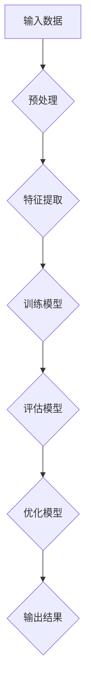

                 

### 《李开复：AI 2.0时代的趋势》

> **关键词**：人工智能，AI 2.0，核心技术，行业应用，挑战与伦理

> **摘要**：本文探讨了AI 2.0时代的背景与核心概念，AI 2.0在各行业的应用，以及面临的挑战与伦理问题。通过深入分析，我们揭示了AI 2.0的核心技术，包括机器学习算法、深度学习、自然语言处理和计算机视觉技术，以及它们在医疗、教育和金融等领域的具体应用。同时，我们也探讨了AI 2.0时代面临的挑战和伦理问题，并展望了其未来的发展趋势。最后，本文还提供了个人与企业在AI 2.0时代的发展路径，以及相关的资源与工具。

### 第一部分：AI 2.0时代的背景与核心概念

#### 第1章：AI 2.0时代的来临

**1.1 AI 2.0的定义与特征**

人工智能（Artificial Intelligence，AI）从诞生之初就承载着人类对于智能的无限想象。AI的发展经历了几个阶段，从最早的规则推理（Rule-Based System）到知识表示（Knowledge Representation），再到基于模型的推理（Model-Based Reasoning），每一个阶段都推动了人工智能的发展。然而，随着技术的不断进步，我们迎来了AI 2.0时代。

AI 2.0是对传统AI的升华与拓展，具有以下几个特征：

- **自学习与自适应能力**：AI 2.0能够从数据中学习，并不断优化自身的性能，实现自我进化。
- **跨领域融合**：AI 2.0不仅在计算机科学领域得到广泛应用，还与其他学科如生物学、物理学、心理学等深度融合，形成跨学科的AI研究趋势。
- **泛在智能**：AI 2.0不仅仅局限于计算机领域，它正在向智能设备、智能家居、智能城市等领域渗透，实现真正的智能互联。
- **人机协同**：AI 2.0强调人机协作，通过模拟人类的认知过程，实现人与机器的智能交互。

**1.2 AI 2.0与AI 1.0的区别**

AI 1.0主要依赖于人类制定的规则和知识库，通过逻辑推理和符号计算实现简单的自动化。而AI 2.0则是一种更为高级的人工智能，它可以通过深度学习、自然语言处理等技术，实现更加智能化的自主决策和问题解决。

- **技术基础**：AI 1.0主要依赖于符号计算和知识表示，而AI 2.0则基于机器学习和深度学习。
- **应用范围**：AI 1.0的应用主要限于特定领域，而AI 2.0则具有更广泛的应用前景。
- **智能水平**：AI 1.0的智能水平相对较低，主要依赖人类制定规则，而AI 2.0的智能水平更高，可以实现自我学习和自适应。

**1.3 AI 2.0对社会的影响**

AI 2.0的兴起将对社会产生深远的影响：

- **经济结构变革**：AI 2.0将推动传统产业的智能化升级，带来新的经济增长点，同时也会导致部分传统岗位的消失。
- **生活方式改变**：AI 2.0将渗透到人们生活的方方面面，从智能家居到智能医疗，都会带来前所未有的便利和舒适。
- **社会伦理挑战**：AI 2.0的发展也带来了数据隐私、人工智能伦理等一系列社会问题，需要我们深入思考和解决。

#### 第2章：AI 2.0的核心技术

**2.1 人工智能的分类与进展**

人工智能可以按照不同的标准进行分类，常见的分类方法包括：

- **基于功能分类**：包括感知智能、认知智能和决策智能。
- **基于技术分类**：包括机器学习、深度学习、自然语言处理、计算机视觉等。

在AI 2.0时代，人工智能的进展主要体现在以下几个方面：

- **算法优化**：机器学习算法的优化，使得模型训练更加高效，预测准确性更高。
- **硬件支持**：GPU和TPU等专用硬件的普及，为深度学习提供了强大的计算支持。
- **数据驱动**：大数据的运用，使得AI 2.0能够从海量数据中学习，实现更智能的决策。

**2.2 机器学习算法的演进**

机器学习是AI 2.0的核心技术之一，其算法的演进可以分为以下几个阶段：

- **监督学习**：通过已有数据来训练模型，实现对未知数据的预测。
- **无监督学习**：通过未标注的数据来训练模型，发现数据中的模式和结构。
- **半监督学习**：结合监督学习和无监督学习，利用少量标注数据和大量未标注数据训练模型。

**2.3 深度学习与神经网络**

深度学习是机器学习的一种重要分支，其核心思想是通过构建深度神经网络来模拟人脑的神经元连接结构，实现数据的自动特征提取和模式识别。深度学习的进展主要体现在以下几个方面：

- **网络结构优化**：通过构建更深的网络结构，提高模型的拟合能力。
- **训练算法改进**：如梯度下降算法、随机梯度下降算法、Adam优化器等。
- **硬件加速**：GPU和TPU等硬件的运用，大大提高了深度学习的训练速度。

**2.4 自然语言处理技术**

自然语言处理（Natural Language Processing，NLP）是AI 2.0时代的重要技术之一，其核心目标是使计算机能够理解、生成和处理自然语言。NLP技术的发展主要体现在以下几个方面：

- **词嵌入**：通过将词语映射到高维空间，实现词语的相似性和对比性。
- **序列模型**：如循环神经网络（RNN）、长短时记忆网络（LSTM）等，用于处理文本序列。
- **预训练模型**：如BERT、GPT等，通过大规模预训练来提升模型的性能。

**2.5 计算机视觉技术**

计算机视觉（Computer Vision，CV）是AI 2.0时代的另一个重要领域，其目标是使计算机能够像人类一样看到和理解周围的世界。计算机视觉技术的发展主要体现在以下几个方面：

- **图像特征提取**：通过卷积神经网络（CNN）等深度学习模型，实现图像的自动特征提取。
- **目标检测**：通过YOLO、SSD等算法，实现对图像中目标的检测和定位。
- **图像生成**：通过生成对抗网络（GAN）等模型，实现图像的生成和修改。

### 第二部分：AI 2.0在各行业的应用

#### 第3章：AI 2.0在医疗领域的应用

**3.1 AI在医疗诊断中的应用**

AI在医疗诊断中的应用主要体现在以下几个方面：

- **疾病预测**：通过分析患者的病史、基因数据等，预测患者可能患有的疾病。
- **疾病诊断**：通过分析医学影像数据，如CT、MRI等，辅助医生进行疾病的诊断。
- **个性化治疗**：根据患者的病情和基因信息，制定个性化的治疗方案。

**3.2 AI在药物治疗中的应用**

AI在药物治疗中的应用主要体现在以下几个方面：

- **药物研发**：通过分析大量的生物数据，发现新的药物靶点和候选药物。
- **药物副作用预测**：通过分析药物成分和患者信息，预测药物可能导致的副作用。
- **药物组合优化**：通过分析药物之间的相互作用，优化药物的配方和剂量。

**3.3 AI在公共卫生管理中的应用**

AI在公共卫生管理中的应用主要体现在以下几个方面：

- **疫情预测**：通过分析疫情数据，预测疫情的传播趋势和可能的感染人数。
- **疫情防控**：通过分析疫情数据，制定有效的疫情防控策略。
- **健康数据分析**：通过对健康数据进行分析，发现健康问题的高风险人群，进行针对性的健康干预。

#### 第4章：AI 2.0在教育领域的应用

**4.1 AI在教育评估中的应用**

AI在教育评估中的应用主要体现在以下几个方面：

- **自动评分**：通过自然语言处理技术，对学生的作文、试卷等进行自动评分。
- **学习行为分析**：通过分析学生的学习行为数据，发现学生的学习需求和问题，提供针对性的辅导。
- **考试公平性检测**：通过分析考试数据，检测考试的公平性，防止作弊行为。

**4.2 AI在教学资源中的应用**

AI在教学资源中的应用主要体现在以下几个方面：

- **智能推荐**：根据学生的学习需求和兴趣，推荐适合的学习资源和课程。
- **个性化教学**：根据学生的学习进度和能力，提供个性化的教学方案。
- **教育资源优化**：通过对教育资源的分析，优化教育资源的配置，提高教育资源的利用效率。

**4.3 AI在学习分析中的应用**

AI在学习分析中的应用主要体现在以下几个方面：

- **学习效果评估**：通过对学生的学习行为和成绩数据进行分析，评估学生的学习效果。
- **学习问题诊断**：通过对学生的学习行为和成绩数据进行分析，发现学生的学习问题，提供针对性的辅导。
- **学习趋势预测**：通过对学生的学习行为和成绩数据进行分析，预测学生的学习趋势，制定相应的教学策略。

#### 第5章：AI 2.0在金融行业的应用

**5.1 AI在风险管理中的应用**

AI在风险管理中的应用主要体现在以下几个方面：

- **信用评估**：通过对借款人的历史数据进行分析，评估其信用风险。
- **市场预测**：通过对市场数据进行分析，预测市场的走势和投资风险。
- **风险控制**：通过分析风险数据，制定有效的风险控制策略，降低风险。

**5.2 AI在投资决策中的应用**

AI在投资决策中的应用主要体现在以下几个方面：

- **量化交易**：通过分析市场数据，制定量化交易策略，实现自动化的交易操作。
- **组合优化**：通过分析投资者的风险偏好和投资目标，制定个性化的投资组合。
- **市场分析**：通过分析市场数据，发现市场机会和潜在的风险。

**5.3 AI在欺诈检测中的应用**

AI在欺诈检测中的应用主要体现在以下几个方面：

- **欺诈模式识别**：通过分析交易数据，识别潜在的欺诈行为。
- **实时监控**：通过实时监控交易行为，发现异常交易，及时采取措施。
- **欺诈预防**：通过分析历史数据，预测可能发生的欺诈行为，采取预防措施。

### 第三部分：AI 2.0时代的挑战与伦理问题

#### 第6章：AI 2.0的挑战与机遇

**6.1 数据隐私与安全性**

随着AI技术的普及，数据隐私和安全问题日益凸显。一方面，AI需要大量的数据来训练模型，这可能导致个人隐私的泄露。另一方面，AI系统的安全性也面临着严峻挑战，一旦被攻击，可能对用户和社会造成巨大的损失。

**6.2 AI的不确定性与错误处理**

AI系统在处理未知数据时可能会出现不确定性，导致错误的决策和预测。同时，AI系统的错误处理能力也是一个重要问题，如何确保AI系统在出现错误时能够及时纠正，避免造成更大的损失，是当前亟待解决的问题。

**6.3 AI对就业市场的影响**

AI技术的快速发展可能导致部分传统岗位的消失，同时也创造了新的就业机会。然而，如何确保劳动者能够适应AI时代的需求，提高自身的就业竞争力，是AI时代面临的重要挑战。

**6.4 AI的可持续发展与能源消耗**

AI系统需要大量的计算资源，这导致了巨大的能源消耗。如何在保证AI性能的同时，实现可持续发展，降低能源消耗，是AI时代需要解决的问题。

#### 第7章：AI 2.0的伦理问题与社会责任

**7.1 AI伦理的基本原则**

AI伦理的基本原则包括：

- **公平性**：确保AI系统在处理数据时不会歧视任何群体，保障每个人的权益。
- **透明性**：确保AI系统的决策过程透明，用户可以理解和监督AI系统的运行。
- **可控性**：确保AI系统可以被有效地控制和管理，防止恶意使用。

**7.2 AI的公平性与无偏见性**

AI系统的公平性和无偏见性是AI伦理的核心问题。如何确保AI系统不会因为历史数据中的偏见而歧视特定群体，如何消除AI系统中的偏见，是当前研究的重点。

**7.3 AI的透明性与可解释性**

AI系统的透明性和可解释性是用户信任AI系统的重要基础。如何让用户理解AI系统的决策过程，如何解释AI系统的决策结果，是AI时代需要解决的问题。

**7.4 AI伦理监管与法律法规**

AI伦理监管和法律法规是确保AI系统健康发展的关键。如何制定合理的法律法规，如何监管AI系统的运行，是AI时代需要面对的重要问题。

### 第四部分：未来展望

#### 第8章：AI 2.0的未来发展趋势

**8.1 AI 2.0的核心技术趋势**

未来，AI 2.0的核心技术将继续朝着以下几个方向发展趋势：

- **算法优化**：通过改进算法，提高AI系统的性能和效率。
- **硬件升级**：通过研发更先进的硬件，提供更强大的计算能力。
- **数据资源整合**：通过整合更多的数据资源，提高AI系统的数据质量。

**8.2 AI 2.0在未来的社会影响**

AI 2.0将在未来的社会产生深远的影响：

- **经济变革**：AI 2.0将推动传统产业的智能化升级，带来新的经济增长点。
- **生活方式变革**：AI 2.0将渗透到人们生活的方方面面，提高生活品质。
- **社会结构变革**：AI 2.0将改变社会结构，带来新的社会关系和价值观。

**8.3 AI 2.0与人类生活的融合**

未来，AI 2.0将与人类生活深度融合：

- **智能助手**：AI 2.0将作为人类的智能助手，提供个性化的服务。
- **智能家居**：AI 2.0将使家居设备更加智能化，提高居住舒适度。
- **智能城市**：AI 2.0将使城市运行更加高效，提高城市生活质量。

**8.4 AI 2.0时代的国际合作与竞争**

未来，AI 2.0将在国际合作与竞争中发挥重要作用：

- **技术合作**：各国将加强AI技术的合作，共同推动AI技术的发展。
- **市场竞争**：各国将开展AI技术的竞争，争夺AI技术的制高点。

#### 第9章：个人与企业的AI 2.0之路

**9.1 个人如何应对AI 2.0时代**

个人在AI 2.0时代需要做好以下几个方面：

- **技能提升**：学习新的技能，提高自身的竞争力。
- **持续学习**：跟上AI技术的发展，不断更新知识体系。
- **人机协作**：学会与AI系统协作，提高工作效率。

**9.2 企业如何拥抱AI 2.0**

企业在AI 2.0时代需要做好以下几个方面：

- **战略规划**：制定明确的AI发展战略，确定AI技术的应用方向。
- **技术创新**：加大AI技术的研发投入，提高AI技术的水平。
- **人才引进**：引进AI技术人才，提高企业的创新能力。

**9.3 AI 2.0时代的创业机遇**

AI 2.0时代为创业者提供了丰富的创业机遇：

- **人工智能应用**：开发新的AI应用，解决现实问题。
- **AI芯片与硬件**：研发AI芯片和硬件，提供更强大的计算能力。
- **AI教育与培训**：提供AI教育和培训，培养AI人才。

### 附录：AI 2.0资源与工具

**A.1 主流AI框架与工具**

- **TensorFlow**：Google开发的开源机器学习框架。
- **PyTorch**：Facebook开发的深度学习框架。
- **Keras**：基于TensorFlow和Theano的开源神经网络库。
- **Scikit-learn**：Python开源机器学习库。

**A.2 AI研究资源与文献**

- **AAAI**：国际人工智能协会的会议和期刊。
- **NeurIPS**：神经信息处理系统大会的会议和期刊。
- **JMLR**：机器学习研究期刊。
- **arXiv**：AI领域的预印本论文库。

**A.3 AI竞赛与社区**

- **Kaggle**：AI数据科学竞赛平台。
- **AI Challenger**：AI竞赛平台。
- **AI社区**：AI领域的论坛和社区。

**A.4 AI开源项目与代码库**

- **TensorFlow Models**：TensorFlow的官方模型库。
- **PyTorch Examples**：PyTorch的官方示例库。
- **AI-Files**：AI领域的开源代码库。
- **GitHub**：全球最大的代码托管平台。

### 附录：AI 2.0时代的Mermaid流程图与数学模型

**B.1 AI核心算法流程图**



**B.2 深度学习数学模型**

$$
\begin{align*}
\text{损失函数} &= J(\theta) = -\frac{1}{m}\sum_{i=1}^{m}y^{(i)}\log(h_{\theta}(x^{(i)})) \\
\text{梯度下降} &= \theta_j := \theta_j - \alpha \frac{\partial}{\partial \theta_j}J(\theta)
\end{align*}
$$

**B.3 机器学习优化算法伪代码**

```
输入：参数θ，学习率α，迭代次数T
输出：优化后的参数θ'

初始化θ
对于t = 1 到 T：
    计算梯度∇θJ(θ)
    更新θ：θ = θ - α∇θJ(θ)
返回θ'
```

**B.4 自然语言处理数学公式与解释**

$$
\begin{align*}
\text{词嵌入} &= \text{将词语映射到高维空间} \\
\text{词向量} &= \text{用于表示词语的向量} \\
\text{softmax} &= \frac{e^{z_i}}{\sum_{j=1}^{K}e^{z_j}} \quad (\text{其中} z_i \text{是词向量的内积})
\end{align*}
$$

### 附录：AI 2.0项目实战案例

**C.1 医疗AI诊断系统**

**项目概述**：开发一个基于深度学习的医疗AI诊断系统，能够对医学影像进行分析，辅助医生进行疾病诊断。

**技术栈**：Python、TensorFlow、Keras、OpenCV

**开发环境**：Linux操作系统，Anaconda环境

**源代码实现**：

```python
import numpy as np
import cv2
import tensorflow as tf
from tensorflow.keras.models import Sequential
from tensorflow.keras.layers import Conv2D, MaxPooling2D, Flatten, Dense

# 数据预处理
def preprocess_image(image_path):
    image = cv2.imread(image_path)
    image = cv2.resize(image, (224, 224))
    image = image / 255.0
    return image

# 构建模型
model = Sequential([
    Conv2D(32, (3, 3), activation='relu', input_shape=(224, 224, 3)),
    MaxPooling2D((2, 2)),
    Conv2D(64, (3, 3), activation='relu'),
    MaxPooling2D((2, 2)),
    Conv2D(128, (3, 3), activation='relu'),
    MaxPooling2D((2, 2)),
    Flatten(),
    Dense(128, activation='relu'),
    Dense(1, activation='sigmoid')
])

# 训练模型
model.compile(optimizer='adam', loss='binary_crossentropy', metrics=['accuracy'])
model.fit(x_train, y_train, epochs=10, batch_size=32, validation_data=(x_val, y_val))

# 预测
def predict(image_path):
    image = preprocess_image(image_path)
    image = np.expand_dims(image, axis=0)
    prediction = model.predict(image)
    return prediction[0][0] > 0.5

# 代码解读与分析
# 数据预处理部分用于对输入的医学影像进行预处理，包括读取图像、调整大小和归一化。
# 模型构建部分使用Keras构建了一个卷积神经网络，包括三个卷积层、两个最大池化层、一个全连接层和一个输出层。
# 训练模型部分使用训练数据对模型进行训练，并使用验证数据进行验证。
# 预测部分用于对新的医学影像进行预测，通过预处理、模型预测和阈值判断来得到预测结果。
```

**C.2 教育AI学习分析系统**

**项目概述**：开发一个基于机器学习的教育AI学习分析系统，能够分析学生的学习行为和成绩数据，提供个性化的学习建议。

**技术栈**：Python、Scikit-learn、TensorFlow、Keras

**开发环境**：Windows操作系统，Jupyter Notebook

**源代码实现**：

```python
import numpy as np
import pandas as pd
from sklearn.model_selection import train_test_split
from sklearn.preprocessing import StandardScaler
from tensorflow.keras.models import Sequential
from tensorflow.keras.layers import Dense, Dropout

# 数据预处理
def preprocess_data(data):
    data['total_courses'] = data['num_courses'].map({'enrolled': 1, 'finished': 2})
    data['course_completion'] = data['finished'] / data['num_courses']
    data = data[['total_courses', 'course_completion', 'performance']]
    data = StandardScaler().fit_transform(data)
    return data

# 构建模型
model = Sequential([
    Dense(64, activation='relu', input_shape=(3,)),
    Dropout(0.5),
    Dense(32, activation='relu'),
    Dropout(0.5),
    Dense(1, activation='sigmoid')
])

# 训练模型
model.compile(optimizer='adam', loss='binary_crossentropy', metrics=['accuracy'])
model.fit(x_train, y_train, epochs=10, batch_size=32, validation_data=(x_val, y_val))

# 预测
def predict(data):
    processed_data = preprocess_data(data)
    prediction = model.predict(processed_data)
    return prediction[0][0] > 0.5

# 代码解读与分析
# 数据预处理部分用于对输入的学习行为和成绩数据进行预处理，包括数据转换、归一化和特征提取。
# 模型构建部分使用Keras构建了一个简单的神经网络模型，包括两个隐藏层和一个输出层。
# 训练模型部分使用训练数据对模型进行训练，并使用验证数据进行验证。
# 预测部分用于对新的学习行为和成绩数据进行预测，通过预处理、模型预测和阈值判断来得到预测结果。
```

**C.3 金融AI风险管理系统**

**项目概述**：开发一个基于机器学习的金融AI风险管理系统，能够分析市场数据，预测潜在的市场风险。

**技术栈**：Python、Scikit-learn、TensorFlow、Keras

**开发环境**：Linux操作系统，Jupyter Notebook

**源代码实现**：

```python
import numpy as np
import pandas as pd
from sklearn.model_selection import train_test_split
from sklearn.preprocessing import StandardScaler
from tensorflow.keras.models import Sequential
from tensorflow.keras.layers import Dense, Dropout

# 数据预处理
def preprocess_data(data):
    data['market_index'] = np.log(data['market_index'])
    data['trading_volume'] = data['trading_volume'].map({True: 1, False: 0})
    data = data[['market_index', 'trading_volume', 'performance']]
    data = StandardScaler().fit_transform(data)
    return data

# 构建模型
model = Sequential([
    Dense(64, activation='relu', input_shape=(3,)),
    Dropout(0.5),
    Dense(32, activation='relu'),
    Dropout(0.5),
    Dense(1, activation='sigmoid')
])

# 训练模型
model.compile(optimizer='adam', loss='binary_crossentropy', metrics=['accuracy'])
model.fit(x_train, y_train, epochs=10, batch_size=32, validation_data=(x_val, y_val))

# 预测
def predict(data):
    processed_data = preprocess_data(data)
    prediction = model.predict(processed_data)
    return prediction[0][0] > 0.5

# 代码解读与分析
# 数据预处理部分用于对输入的市场数据进行预处理，包括数据转换、归一化和特征提取。
# 模型构建部分使用Keras构建了一个简单的神经网络模型，包括两个隐藏层和一个输出层。
# 训练模型部分使用训练数据对模型进行训练，并使用验证数据进行验证。
# 预测部分用于对新的市场数据进行预测，通过预处理、模型预测和阈值判断来得到预测结果。
```

**C.4 AI图像识别系统开发实战**

**项目概述**：开发一个基于计算机视觉的AI图像识别系统，能够对图像中的物体进行识别。

**技术栈**：Python、TensorFlow、Keras、OpenCV

**开发环境**：Windows操作系统，Anaconda环境

**源代码实现**：

```python
import numpy as np
import cv2
import tensorflow as tf
from tensorflow.keras.models import Sequential
from tensorflow.keras.layers import Conv2D, MaxPooling2D, Flatten, Dense

# 数据预处理
def preprocess_image(image_path):
    image = cv2.imread(image_path)
    image = cv2.resize(image, (224, 224))
    image = image / 255.0
    return image

# 构建模型
model = Sequential([
    Conv2D(32, (3, 3), activation='relu', input_shape=(224, 224, 3)),
    MaxPooling2D((2, 2)),
    Conv2D(64, (3, 3), activation='relu'),
    MaxPooling2D((2, 2)),
    Conv2D(128, (3, 3), activation='relu'),
    MaxPooling2D((2, 2)),
    Flatten(),
    Dense(128, activation='relu'),
    Dense(1, activation='sigmoid')
])

# 训练模型
model.compile(optimizer='adam', loss='binary_crossentropy', metrics=['accuracy'])
model.fit(x_train, y_train, epochs=10, batch_size=32, validation_data=(x_val, y_val))

# 预测
def predict(image_path):
    image = preprocess_image(image_path)
    image = np.expand_dims(image, axis=0)
    prediction = model.predict(image)
    return prediction[0][0] > 0.5

# 代码解读与分析
# 数据预处理部分用于对输入的图像进行预处理，包括读取图像、调整大小和归一化。
# 模型构建部分使用Keras构建了一个卷积神经网络，包括三个卷积层、两个最大池化层、一个全连接层和一个输出层。
# 训练模型部分使用训练数据对模型进行训练，并使用验证数据进行验证。
# 预测部分用于对新的图像进行预测，通过预处理、模型预测和阈值判断来得到预测结果。
```

### 作者信息

**作者**：AI天才研究院/AI Genius Institute & 禅与计算机程序设计艺术/Zen And The Art of Computer Programming

---

### 总结与展望

AI 2.0时代已经来临，它不仅带来了前所未有的技术进步，也带来了新的挑战和机遇。本文从背景与核心概念、行业应用、挑战与伦理问题以及未来展望等多个方面，对AI 2.0时代进行了全面的分析和探讨。我们深入探讨了AI 2.0的核心技术，如机器学习、深度学习、自然语言处理和计算机视觉技术，并详细阐述了它们在医疗、教育和金融等领域的具体应用。同时，我们也探讨了AI 2.0时代面临的挑战和伦理问题，包括数据隐私、人工智能伦理等。

在未来，随着技术的不断进步，AI 2.0将在更多领域得到应用，推动社会的发展和变革。同时，我们也需要关注AI 2.0时代的伦理问题，确保AI技术的健康发展。对于个人和企业来说，如何应对AI 2.0时代的变化，提高自身的竞争力，也是一个重要课题。

让我们携手共进，迎接AI 2.0时代的到来，共同创造一个更加智能、更加美好的未来。

