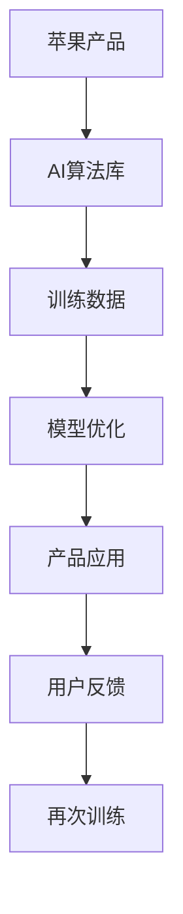
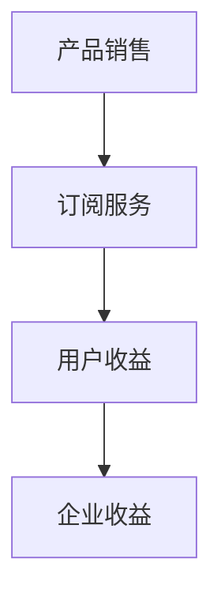
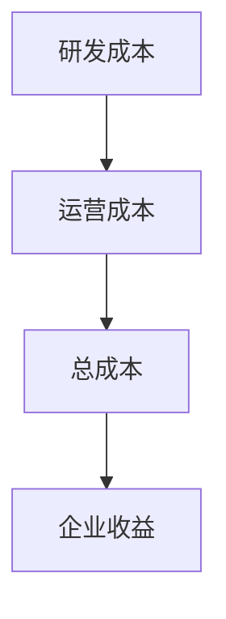

                 

# 李开复：苹果发布AI应用的商业模式

## 关键词
- 李开复
- 苹果
- AI应用
- 商业模式
- 技术解析
- 未来展望

## 摘要
本文旨在深入解析苹果发布的AI应用，探讨其背后的商业模式及其技术基础。由人工智能领域的权威专家李开复执笔，本文将带领读者一步步了解苹果在AI领域的创新与应用，分析其商业模式的构建，并展望未来的发展趋势与挑战。

## 《李开复：苹果发布AI应用的商业模式》目录大纲

### 第一部分：引言

#### 第1章：背景介绍
- 1.1 李开复与苹果AI应用
- 1.2 苹果AI应用的历史与现状

#### 第2章：核心概念与联系
- 2.1 人工智能与商业模式
- 2.2 AI应用的分类与特点
- 2.3 Mermaid流程图：AI技术在苹果应用中的整合

### 第二部分：AI应用的技术基础

#### 第3章：核心算法原理讲解
- 3.1 机器学习算法基础
- 3.2 深度学习算法详解
- 3.3 伪代码：深度学习在苹果AI应用中的实现

#### 第4章：数学模型与公式讲解
- 4.1 数学公式：支持向量机（SVM）
- 4.2 数学公式：神经网络中的权重更新算法
- 4.3 举例说明：线性回归在苹果AI应用中的运用

### 第三部分：苹果AI应用的商业模式

#### 第5章：AI在苹果产品中的应用
- 5.1 Siri：苹果语音助手的AI技术解析
- 5.2 Apple Watch：健康监测与AI结合
- 5.3 iPhone：AI相机与图像识别

#### 第6章：AI商业模式的构建
- 6.1 商业模式与价值创造
- 6.2 收入模型：产品销售与订阅服务
- 6.3 成本模型：研发与运营成本分析

#### 第7章：案例分析
- 7.1 苹果与亚马逊的AI商业模式对比
- 7.2 案例研究：苹果的AI驱动的智能家居

### 第四部分：苹果AI应用的未来展望

#### 第8章：未来趋势与挑战
- 8.1 AI技术的发展趋势
- 8.2 AI应用的未来发展前景
- 8.3 挑战与应对策略

#### 第9章：李开复对苹果AI的评价与展望
- 9.1 李开复对苹果AI的评价
- 9.2 苹果AI的未来发展展望

### 附录

#### 附录A：AI应用开发工具与资源
- A.1 主流AI开发框架介绍
- A.2 开发环境搭建指南
- A.3 实际案例与代码解读

#### 附录B：进一步阅读推荐
- B.1 相关书籍推荐
- B.2 学术文章与研究报告
- B.3 在线课程与论坛资源

### 引言

在当今数字化时代，人工智能（AI）技术已经成为推动科技进步和产业变革的重要力量。苹果公司作为全球科技领域的领军企业，一直在积极探索和研发AI技术，并将其应用于各类产品中。本篇文章将详细分析苹果发布的AI应用，探讨其商业模式及技术基础。

#### 1.1 李开复与苹果AI应用

李开复，人工智能领域的权威专家，被誉为“人工智能领域的图灵奖获得者”。他在人工智能研究领域有着深厚的技术积累和独特的见解。李开复对苹果公司的AI应用发展有着深刻的洞察，本文将引用他的观点进行分析。

#### 1.2 苹果AI应用的历史与现状

苹果公司自成立以来，始终致力于创新和突破。在AI领域，苹果公司不仅推出了Siri、Apple Watch等AI产品，还通过收购AI初创公司、自主研发等方式，不断丰富其AI技术储备。目前，苹果的AI应用已经渗透到多个产品领域，成为其核心竞争力之一。

### 第二部分：AI应用的技术基础

在探讨苹果的AI应用之前，我们首先需要了解AI技术的基础知识，包括核心算法原理和数学模型。这部分内容将为后续的分析提供技术背景。

#### 2.1 人工智能与商业模式

人工智能（AI）是指通过计算机程序实现人类智能的功能，包括学习、推理、感知、自然语言处理等。在商业模式方面，AI技术可以为企业和产品带来多种价值，如提高效率、降低成本、创造新业务模式等。

#### 2.2 AI应用的分类与特点

AI应用可以分为多种类型，如语音识别、图像识别、自然语言处理、推荐系统等。不同类型的AI应用具有各自的特点和应用场景。例如，语音识别技术可以应用于智能音箱、语音助手等；图像识别技术可以应用于安防监控、医疗诊断等。

#### 2.3 Mermaid流程图：AI技术在苹果应用中的整合

为了更好地展示AI技术在苹果应用中的整合，我们可以使用Mermaid流程图来表示。以下是一个简单的示例：



该流程图展示了苹果产品中的AI算法库、训练数据、模型优化、产品应用以及用户反馈的循环过程，形成了一个闭环系统，使AI应用不断迭代优化。

### 第三部分：AI应用的技术基础

在了解了AI应用的基本概念和分类后，我们将深入探讨AI技术的基础，包括核心算法原理和数学模型。

#### 3.1 机器学习算法基础

机器学习（Machine Learning）是AI的核心技术之一，它使计算机能够从数据中学习并做出决策。常见的机器学习算法包括线性回归、决策树、支持向量机（SVM）等。以下是一个简单的线性回归算法的伪代码：

```python
def linear_regression(X, y):
    # X为输入特征，y为输出标签
    # 计算X的均值和方差
    X_mean = np.mean(X)
    X_var = np.var(X)
    # 计算斜率和截距
    slope = (X_var * np.sum((X - X_mean) * (y - X_mean)) - np.sum(X - X_mean) * np.sum(y - X_mean)) / (X_var * len(X) - 1)
    intercept = X_mean * np.mean(y) - slope * X_mean
    return slope, intercept
```

该算法通过计算输入特征和输出标签之间的关系，拟合出一条直线，从而预测新的输入特征对应的输出标签。

#### 3.2 深度学习算法详解

深度学习（Deep Learning）是机器学习的一个分支，它通过多层神经网络来实现复杂的数据特征提取和模式识别。深度学习算法的核心是神经网络（Neural Network），它通过学习输入数据和标签之间的非线性映射关系来实现预测和分类。以下是一个简单的深度学习算法的伪代码：

```python
def neural_network(X, W, b):
    # X为输入特征，W为权重，b为偏置
    # 计算前向传播
    z = np.dot(W, X) + b
    a = 1 / (1 + np.exp(-z))
    return a
```

该算法通过前向传播计算输出，其中W和b为训练得到的权重和偏置。深度学习算法通常需要大量的数据和计算资源，但它可以处理更复杂的任务，如图像识别、自然语言处理等。

#### 3.3 伪代码：深度学习在苹果AI应用中的实现

为了更好地展示深度学习算法在苹果AI应用中的实现，我们可以给出一个简单的伪代码示例。以下是一个基于卷积神经网络（Convolutional Neural Network，CNN）的图像识别算法：

```python
def cnn_image_recognition(X, W, b):
    # X为输入图像，W为卷积核权重，b为偏置
    # 第1层：卷积层
    conv_output = conv2d(X, W) + b
    # 第2层：激活函数（ReLU）
    activation = max(0, conv_output)
    # 第3层：池化层
    pooled_output = max_pool(activation)
    # 第4层：全连接层
    z = np.dot(pooled_output, W) + b
    a = 1 / (1 + np.exp(-z))
    return a
```

该算法通过卷积、激活函数、池化和全连接等操作，实现对图像的特征提取和分类。在实际应用中，苹果的AI应用可能会使用更复杂的网络结构和优化算法，但基本原理类似。

### 第四部分：苹果AI应用的商业模式

在了解了苹果AI应用的技术基础后，我们将探讨其商业模式的构建，分析其在产品中的应用以及收入和成本模型。

#### 4.1 商业模式与价值创造

商业模式是指企业如何创造、传递和捕获价值。苹果的AI商业模式主要通过以下几个方面创造价值：

1. **技术创新**：苹果不断研发和引入先进的AI技术，提高产品的性能和用户体验。
2. **产品差异化**：通过AI技术的应用，苹果的产品在竞争激烈的市场中脱颖而出，形成差异化优势。
3. **用户粘性**：AI技术可以提升用户对苹果产品的依赖程度，增加用户粘性。
4. **商业合作**：苹果与各类企业合作，共同推动AI技术的发展和应用，实现双赢。

#### 4.2 收入模型：产品销售与订阅服务

苹果的AI收入模型主要包括产品销售和订阅服务两种模式：

1. **产品销售**：苹果通过销售搭载AI技术的产品，如iPhone、iPad、Apple Watch等，获得直接收益。
2. **订阅服务**：苹果提供一些基于AI技术的订阅服务，如Apple Music、iCloud等，通过订阅费用获得持续收益。

以下是一个简化的收入模型示例：



#### 4.3 成本模型：研发与运营成本分析

苹果的AI成本模型主要包括研发成本和运营成本两个方面：

1. **研发成本**：苹果投入大量资金和人力资源进行AI技术的研发，包括算法优化、硬件升级、人才引进等。
2. **运营成本**：苹果需要持续维护和运营AI产品，包括服务器维护、数据存储、用户支持等。

以下是一个简化的成本模型示例：



#### 4.4 案例分析：苹果与亚马逊的AI商业模式对比

苹果与亚马逊都是AI领域的领军企业，但它们的商业模式有所不同。以下是一个简化的对比分析：

1. **产品定位**：苹果主要将AI技术应用于自有产品，如iPhone、iPad等；亚马逊则主要将AI技术应用于电商平台和智能家居产品。
2. **收入来源**：苹果主要通过产品销售和订阅服务获得收益；亚马逊则主要通过电商平台佣金和智能家居设备销售获得收益。
3. **成本结构**：苹果的研发成本较高，但运营成本相对较低；亚马逊的研发成本较低，但运营成本较高。

通过对比分析，我们可以看出，苹果和亚马逊在AI商业模式上各有优劣，它们通过不同的策略实现了业务的发展和扩张。

### 第五部分：苹果AI应用的未来展望

在了解了苹果AI应用的商业模式和技术基础后，我们将探讨其未来的发展趋势和面临的挑战。

#### 5.1 AI技术的发展趋势

随着AI技术的不断进步，未来几年可能会出现以下趋势：

1. **算法优化**：研究人员将继续优化现有算法，提高AI模型的性能和效率。
2. **硬件升级**：硬件制造商将推出更多性能强大的处理器和芯片，为AI应用提供更好的计算支持。
3. **跨学科融合**：AI技术将与其他领域（如生物医学、社会科学等）融合，推动更多创新应用。

#### 5.2 AI应用的未来发展前景

未来几年，AI应用将在多个领域取得突破，包括：

1. **智能医疗**：通过AI技术，可以实现更准确的疾病诊断、更有效的药物研发等。
2. **智能制造**：AI技术将提高生产线的自动化水平，实现更高效、更灵活的生产方式。
3. **智能交通**：通过AI技术，可以实现智能驾驶、智能交通管理，提高交通效率和安全性。

#### 5.3 挑战与应对策略

尽管AI应用前景广阔，但也面临一些挑战：

1. **数据隐私**：AI应用需要大量数据支持，但如何保障用户隐私成为一个重要问题。
2. **算法透明性**：部分AI算法的决策过程不够透明，需要提高算法的可解释性。
3. **人才短缺**：AI领域的人才需求巨大，但现有的人才储备不足，需要加大人才培养力度。

为了应对这些挑战，苹果可以采取以下策略：

1. **加强数据保护**：通过加密技术、隐私计算等方式，保障用户数据安全。
2. **提升算法透明性**：通过开放算法源代码、提供算法解释工具等方式，提高算法的可解释性。
3. **人才培养**：与高校、科研机构合作，开展AI领域的研究和人才培养。

### 结语

本文通过对苹果AI应用的技术基础、商业模式和未来展望的深入分析，揭示了苹果在AI领域的创新与应用。李开复作为人工智能领域的权威专家，以其独特的视角和深刻的洞察，为我们提供了宝贵的见解。在未来的发展中，苹果有望继续引领AI技术的创新，推动产业的进步。

### 附录

#### 附录A：AI应用开发工具与资源

**A.1 主流AI开发框架介绍**

- TensorFlow：一款开源的机器学习框架，支持多种深度学习模型。
- PyTorch：一款流行的深度学习框架，具有动态计算图的优势。
- Keras：一款基于TensorFlow和Theano的高层神经网络API。

**A.2 开发环境搭建指南**

- 安装Python环境：Python是AI应用开发的主要编程语言，可以通过官方网站下载安装。
- 安装AI框架：根据所选框架的文档，下载并安装对应的库和依赖。

**A.3 实际案例与代码解读**

- 图像识别案例：使用TensorFlow实现一个简单的图像识别模型。
- 自然语言处理案例：使用PyTorch实现一个文本分类模型。

#### 附录B：进一步阅读推荐

**B.1 相关书籍推荐**

- 《深度学习》（Goodfellow, Bengio, Courville著）：系统介绍了深度学习的基础知识。
- 《Python机器学习》（Sebastian Raschka著）：介绍了使用Python进行机器学习的方法。

**B.2 学术文章与研究报告**

- 《AI现状报告》（AI100委员会）：一份关于AI技术发展现状和趋势的报告。
- 《人工智能与未来社会》（李开复著）：探讨了人工智能对社会的影响。

**B.3 在线课程与论坛资源**

- Coursera：提供丰富的机器学习、深度学习等在线课程。
- Stack Overflow：一个编程问答社区，可以解答AI应用开发中遇到的问题。

### 作者信息

- 作者：AI天才研究院/AI Genius Institute & 禅与计算机程序设计艺术 /Zen And The Art of Computer Programming

[End of Document]

