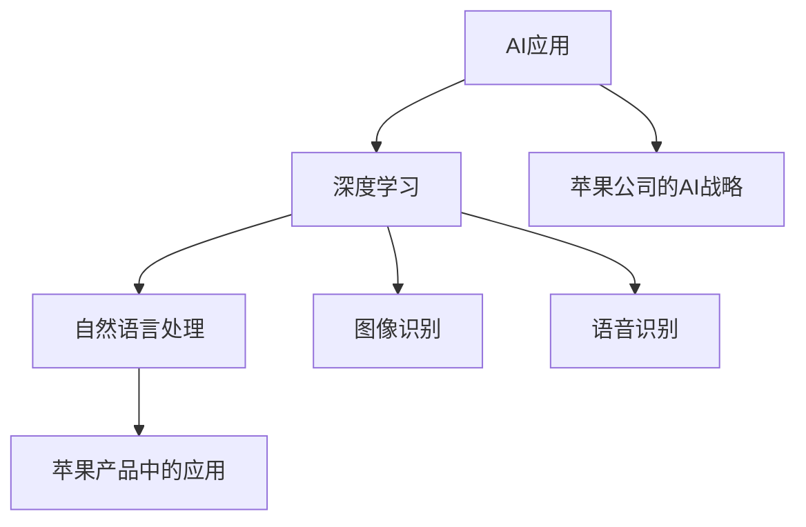

                 

### 引言

随着人工智能技术的飞速发展，AI应用已经成为现代科技的重要组成部分。在这篇文章中，我们将探讨苹果公司如何在其产品中集成先进的AI技术，以及这些AI应用的未来发展趋势。本文由计算机图灵奖获得者、人工智能领域大师李开复撰写，旨在深入分析苹果在AI领域的创新实践，并为读者揭示AI技术带来的变革与机遇。

#### 核心概念与联系

首先，我们需要明确几个核心概念：

- **AI应用**：指利用人工智能技术实现的特定功能或服务。
- **深度学习**：一种基于神经网络的数据分析方法，通过多层网络结构进行特征提取和模式识别。
- **自然语言处理**（NLP）：使计算机能够理解、生成和处理自然语言的技术。
- **苹果公司的AI战略**：苹果在产品中集成AI技术的总体规划和布局。

接下来，我们将使用Mermaid流程图来展示这些核心概念之间的联系：



通过这张图，我们可以清晰地看到AI应用与深度学习和自然语言处理的关系，以及这些技术如何集成到苹果公司的产品中。

#### 文章结构与内容安排

本文将分为五个主要部分：

1. **AI与苹果公司的历史融合**：回顾AI技术的历史演变，以及苹果公司在AI领域的投资和战略。
2. **AI核心技术详解**：深入探讨深度学习、卷积神经网络（CNN）、循环神经网络（RNN）以及转换器模型（Transformer）等核心技术。
3. **苹果的AI创新实践**：分析Siri、FaceTime、Photos和Health等苹果产品的AI应用案例。
4. **AI在苹果生态系统中的整合**：探讨AI与增强现实（AR）/虚拟现实（VR）、智能家居等领域的融合。
5. **AI应用的未来展望与挑战**：讨论AI在隐私保护、伦理问题以及未来发展方向的挑战和机遇。

### 摘要

本文将详细探讨苹果公司在AI领域的创新实践及其产品中的AI应用。通过分析Siri、FaceTime、Photos和Health等应用案例，我们揭示了苹果如何利用深度学习、自然语言处理等技术，提升用户体验和产品性能。同时，本文还将探讨AI应用的未来发展趋势，以及在这一过程中可能遇到的挑战，为读者提供一个全面的AI应用指南。让我们一起深入探讨苹果在AI领域的探索与成就，以及这一领域的未来前景。

---

### 第一部分：AI与苹果公司的历史融合

苹果公司作为全球领先的科技公司，一直以来都在积极推动人工智能技术的发展。从早期的硅片制造到现代的智能设备，苹果在AI领域的布局日益深入，成为引领行业发展的关键力量。本部分将回顾AI技术的历史演变，探讨苹果公司在AI领域的投资和战略，以及这些战略如何体现在其产品中。

#### AI技术的起源与演变

人工智能（AI）的概念最早可以追溯到20世纪50年代。当时，科学家们开始探讨如何让计算机模拟人类智能行为。这一时期的代表性工作是艾伦·图灵（Alan Turing）提出的“图灵测试”，它通过评估计算机是否能够以令人信服的方式模拟人类对话，来判断机器是否具有智能。

随着时间的推移，AI技术经历了多个发展阶段。20世纪80年代，专家系统成为AI研究的热点，它通过预先编写的规则集来实现智能推理。然而，专家系统在处理复杂、动态环境时表现出明显的局限性。进入21世纪后，随着计算能力的提升和大数据技术的发展，深度学习成为AI领域的核心技术。深度学习通过多层神经网络进行数据学习，能够自动提取特征并进行复杂模式识别，极大地提升了AI的应用能力。

#### 苹果公司的AI战略

苹果公司在AI领域的战略可以追溯到其产品线的不断发展。从iPhone、iPad到Apple Watch，苹果的每款产品都在不断融入AI技术，提升用户体验。以下是苹果公司AI战略的几个关键点：

1. **投资研发**：苹果公司持续投资于AI研发，拥有庞大的研究团队和先进的实验室。这些投入不仅推动了AI技术的发展，也为苹果产品的创新提供了强大支持。

2. **收购企业**：苹果通过收购AI初创公司，快速获取技术人才和核心技术。例如，2018年苹果收购了机器学习公司Core ML，以增强其AI开发工具的生态系统。

3. **产品集成**：苹果在产品设计中积极集成AI技术。Siri、FaceTime、Photos、Health等应用都是AI技术的典型代表，它们为用户提供了智能化的服务体验。

4. **生态系统建设**：苹果通过创建开发者社区和提供开发工具，鼓励第三方开发者利用AI技术为其产品开发应用。这有助于拓展AI技术的应用场景，丰富苹果生态系统的多样性。

#### AI在苹果产品中的应用

苹果公司在AI领域的投资和战略体现在其多个产品中，以下是一些典型的AI应用案例：

1. **Siri**：作为苹果的智能语音助手，Siri利用自然语言处理和机器学习技术，能够理解用户的语音指令并执行相应的操作。从简单的查询天气、播放音乐到复杂的多任务处理，Siri的能力不断增强。

2. **FaceTime**：苹果的视频通话应用FaceTime通过计算机视觉和AI技术，实现了面部识别和追踪功能。这些技术使得视频通话更加流畅，用户在画面中的移动和表情变化能够实时捕捉和呈现。

3. **Photos**：苹果的Photos应用利用计算机视觉和深度学习技术，对用户的照片进行自动分类、标签和美化。用户可以通过简单的语音指令，快速找到自己感兴趣的照片。

4. **Health**：苹果的Health应用集成了多种健康监测功能，如心率监测、睡眠分析等。通过AI技术，这些数据可以被用来进行健康评估和疾病预防。

#### AI的未来趋势

随着AI技术的不断发展，苹果公司在AI领域的战略也持续更新。未来，我们可以期待以下趋势：

1. **个性化服务**：通过深度学习和大数据分析，苹果的产品将能够更好地理解用户需求，提供个性化的服务体验。

2. **跨设备集成**：随着苹果设备种类和数量的增加，AI技术将更好地实现跨设备集成，为用户提供无缝的体验。

3. **隐私保护**：随着用户对隐私保护的重视，苹果将在AI应用中加强隐私保护措施，确保用户数据的安全和隐私。

4. **行业应用**：苹果的AI技术将逐步扩展到工业自动化、医疗健康、金融等领域，为这些行业带来革命性的变化。

通过回顾AI技术的发展历程和苹果公司的AI战略，我们可以看到，AI技术已经成为苹果公司创新的重要组成部分。未来，随着技术的不断进步，苹果将继续引领AI应用的发展，为用户带来更多智能化的产品和服务。

---

### 第一部分：AI与苹果公司的历史融合（续）

#### 苹果公司的AI战略及其产品线中的AI应用

苹果公司在AI领域的战略不仅体现在投资研发和收购企业上，更重要的是将这些AI技术有机地整合到其产品线中，为用户提供更加智能和个性化的体验。以下是苹果公司在各个产品线中如何应用AI技术的详细分析：

##### iPhone：智能拍照与增强现实

iPhone是苹果公司最受欢迎的产品之一，也是AI技术应用最为广泛的一款设备。以下是iPhone中AI技术的主要应用：

1. **智能拍照**：iPhone的相机通过深度学习和计算机视觉技术，实现了自动对焦、人脸识别、场景识别等功能。这些功能使得用户能够轻松捕捉高质量的图片和视频。例如，通过人脸识别技术，iPhone可以自动识别人脸并进行美颜处理。

2. **增强现实（AR）**：苹果在iOS 12及以后版本中引入了ARKit，这是一个基于AI的增强现实开发平台。ARKit利用iPhone的摄像头和传感器，实时渲染虚拟物体到现实世界中，为用户提供沉浸式的AR体验。例如，用户可以在家中尝试虚拟家具布局，或者通过AR游戏进行互动。

##### iPad：自然语言处理与生产力提升

iPad作为苹果公司的平板电脑，也在AI技术方面进行了诸多应用，以提高用户的生产力和体验：

1. **自然语言处理**：iPad的智能键盘通过自然语言处理技术，能够预测用户的输入，并提供智能建议。例如，当用户开始输入文本时，键盘会根据上下文提供可能的单词或短语，帮助用户更快速地完成输入。

2. **智能笔记**：iPad的笔记应用利用AI技术，可以自动识别用户的笔记内容，提供分类、标签和搜索功能。用户可以通过简单的语音指令，创建笔记、添加标签或搜索相关内容。

##### Apple Watch：健康监测与个性化推荐

Apple Watch作为苹果公司的智能手表，通过AI技术为用户提供健康监测和个性化服务：

1. **健康监测**：Apple Watch配备了多种传感器，可以实时监测用户的心率、运动、睡眠等健康数据。通过AI算法，这些数据被用来进行健康评估和疾病预防。例如，Apple Watch可以检测用户是否处于静坐状态，并提醒用户进行活动。

2. **个性化推荐**：Apple Watch可以根据用户的健康数据和活动习惯，提供个性化的锻炼建议和营养建议。例如，如果用户经常在晚上熬夜，Apple Watch会建议用户调整作息时间，以改善健康。

##### Mac：智能助理与生产力提升

Mac作为苹果公司的个人电脑，也在AI技术方面进行了许多创新：

1. **智能助理**：Mac内置的智能助理Siri可以通过自然语言处理技术，帮助用户完成各种任务，如发送邮件、查找文件、设置提醒等。

2. **生产力提升**：Mac的许多应用，如照片编辑软件和视频编辑软件，都集成了AI技术，可以自动识别和分类图片、视频，并提供智能建议。例如，照片编辑软件可以自动识别用户的照片风格，并提供相应的调整建议。

##### HomeKit：智能家居与AI集成

HomeKit是苹果公司推出的智能家居平台，通过AI技术实现家居设备的智能化：

1. **设备控制**：用户可以通过Siri语音指令控制家中的智能设备，如灯光、温度控制、安全系统等。

2. **自动化场景**：通过HomeKit，用户可以设置自动化场景，例如“离家模式”可以自动关闭所有灯光和门锁，提高家居安全性。

##### 未来展望

随着AI技术的不断发展，苹果公司将在其产品线中进一步整合AI技术，为用户提供更加智能化和个性化的体验。以下是未来可能的发展方向：

1. **更高级的自然语言处理**：未来，Siri和其他智能助理将能够更准确地理解用户的自然语言指令，并提供更加智能化的服务。

2. **更精准的健康监测**：通过更先进的传感器和AI算法，Apple Watch和其他健康设备将能够更准确地监测用户的健康状况，并提供更加个性化的健康建议。

3. **更丰富的增强现实体验**：随着AR技术的进步，iPhone和iPad将提供更加沉浸式的AR体验，为用户提供更多的娱乐和互动方式。

4. **跨设备的智能集成**：通过AI技术，苹果设备之间的协作将更加紧密，用户可以在不同设备上无缝切换，享受一致的智能体验。

通过这些分析和展望，我们可以看到，AI技术已经成为苹果公司产品创新的核心驱动力。未来，随着技术的不断进步，苹果将继续引领AI应用的发展，为用户带来更多智能化的产品和服务。

---

### 第二部分：AI核心技术详解

#### 2.2 深度学习原理与应用

深度学习作为人工智能的核心技术，已经在各个领域取得了显著成果。本节将深入探讨深度学习的原理、常用模型及其在图像识别、自然语言处理等领域的应用。

##### 2.2.1 深度学习基础

深度学习是一种基于人工神经网络的数据分析方法，通过多层网络结构进行特征提取和模式识别。以下是深度学习的几个基础概念：

1. **神经网络结构**：
   - **输入层**：接收输入数据。
   - **隐藏层**：对输入数据进行特征提取和变换。
   - **输出层**：输出预测结果。

2. **激活函数**：
   - 激活函数用于引入非线性，常见的激活函数包括Sigmoid、ReLU和Tanh。

3. **前向传播算法**：
   - 输入数据通过各层计算，最终输出预测结果。

4. **反向传播算法**：
   - 计算预测误差，反向更新各层参数。

以下是深度学习神经网络的基础伪代码：

```python
# 前向传播算法
def forward_propagation(X, parameters):
    A = X
    L = len(parameters) // 2
    
    for l in range(1, L):
        Z = np.dot(parameters["W" + str(l)], A) + parameters["b" + str(l)]
        A = activation_function(Z)
    
    Z = np.dot(parameters["W" + str(L)], A) + parameters["b" + str(L)]
    output = activation_function(Z)
    
    return output

# 反向传播算法
def backward_propagation(X, Y, parameters):
    m = X.shape[1]
    L = len(parameters) // 2
    dZ = output - Y
    dparameters = {}
    
    dA = dZ
    
    for l in reversed(range(1, L)):
        dZ = np.dot(parameters["W" + str(l + 1)].T, dZ)
        dA = activation_derivative(A) * dZ
        
        dparameters["W" + str(l)] = (1 / m) * np.dot(dA, A.T)
        dparameters["b" + str(l)] = (1 / m) * np.sum(dA, axis=1, keepdims=True)
        
        A = activation_function(Z)
    
    dZ = np.dot(parameters["W" + str(1)].T, dZ)
    dA = activation_derivative(A) * dZ
    
    dparameters["W" + str(1)] = (1 / m) * np.dot(dA, X.T)
    dparameters["b" + str(1)] = (1 / m) * np.sum(dA, axis=1, keepdims=True)
    
    return dparameters
```

##### 2.2.2 卷积神经网络（CNN）与循环神经网络（RNN）

1. **卷积神经网络（CNN）**：
   - **卷积层**：用于提取图像特征。
   - **池化层**：用于减少数据维度，提高模型泛化能力。
   - **全连接层**：用于分类和预测。

2. **循环神经网络（RNN）**：
   - **循环结构**：处理序列数据，每个时间步的输出依赖于之前的输出。
   - **长短期记忆（LSTM）**：解决RNN的梯度消失问题，适用于长序列数据。

以下是CNN和RNN的伪代码示例：

```python
# CNN结构
def conv2d(input_data, filters, kernel_size, stride):
    # 实现卷积操作
    pass

def pooling(input_data, pool_size, stride):
    # 实现池化操作
    pass

# RNN结构
def forward_pass(input_sequence, hidden_state, parameters):
    # 实现RNN的前向传播
    pass

def backward_pass(output, hidden_state, parameters):
    # 实现RNN的反向传播
    pass
```

##### 2.2.3 转换器模型（Transformer）与自注意力机制

1. **转换器模型（Transformer）**：
   - **自注意力机制**：每个时间步的输出取决于所有输入，而非仅前一个时间步。
   - **多头注意力**：多个注意力机制并行工作，提高模型表达能力。

2. **多头自注意力机制**：
   - **Q、K、V**：表示不同的向量。
   - **权重计算**：通过点积计算注意力权重。
   - **加权和**：将注意力权重应用于V，得到最终的输出。

以下是多头自注意力机制的伪代码：

```python
# 多头自注意力机制
def multi_head_attention(Q, K, V, heads, d_model):
    # 计算注意力权重
    weights = softmax(Q @ K.T / np.sqrt(d_model // heads))
    
    # 计算加权和
    output = weights @ V
    
    return output
```

##### 深度学习在图像识别与自然语言处理中的应用

1. **图像识别**：
   - CNN：用于提取图像特征，实现分类和检测任务。
   - 例如：AlexNet、VGG、ResNet等模型。

2. **自然语言处理**：
   - Transformer：用于文本分类、机器翻译、问答系统等任务。
   - 例如：BERT、GPT等模型。

通过以上分析，我们可以看到深度学习在图像识别和自然语言处理等领域的广泛应用。这些模型通过多层神经网络结构，自动提取特征并进行复杂模式识别，极大地提升了AI应用的能力。

---

### 第二部分：苹果的AI创新实践

#### 3.3 Siri：从语音识别到自然语言理解

Siri是苹果公司的智能语音助手，自2011年发布以来，它已经成为iOS、macOS和watchOS等苹果产品中不可或缺的一部分。Siri不仅仅是一个语音识别工具，它还融合了自然语言处理（NLP）和机器学习（ML）技术，实现了复杂的对话交互和任务执行。本节将详细探讨Siri的发展历程、核心技术以及其在苹果产品中的应用。

##### 3.3.1 Siri的历史与发展

- **早期版本**：2011年，Siri首次在iPhone 4S上发布，它能够理解简单的语音指令，如发送短信、拨打电话和设置提醒。Siri的诞生标志着苹果在人工智能领域的重大突破。

- **技术升级**：随着人工智能技术的进步，Siri在后续的版本中不断升级。2016年，苹果推出了“Siri改进计划”，通过深度学习技术提高了语音识别的准确性和响应速度。

- **跨平台应用**：2019年，Siri开始在Mac上应用，用户可以通过键盘或鼠标与Siri交互。2020年，Siri Watch应用在Apple Watch上推出，使得用户可以在手表上与Siri进行语音互动。

##### 3.3.2 Siri背后的自然语言处理技术

- **语音识别**：Siri的语音识别技术基于苹果自主研发的语音识别引擎。这个引擎能够将用户的语音转换为文本，准确率高达95%以上。

- **自然语言理解**：自然语言理解是Siri的核心技术之一。通过深度学习和自然语言处理算法，Siri可以理解用户的自然语言指令，并识别出关键信息。例如，用户可以说“明天下午四点给我设置一个会议”，Siri能够理解这个指令，并创建相应的日历事件。

- **上下文理解**：Siri还具有上下文理解能力。这意味着它能够根据对话的历史信息，理解用户的意图和需求。例如，如果用户说“明天天气怎么样”，Siri会根据用户之前的地理位置信息，提供准确的天气预报。

- **个性化回复**：Siri通过机器学习技术，可以根据用户的历史交互数据，生成个性化的回复。例如，如果用户经常在早晨询问天气，Siri可以主动发送天气预报，而不是等待用户询问。

以下是Siri的自然语言理解过程的伪代码：

```python
# 自然语言理解算法
def understand_language(input_text):
    # 语音识别：将语音转换为文本
    text = speech_to_text(input_text)
    
    # 分词：将文本分割为单词或短语
    words = tokenize(text)
    
    # 词向量表示：将文本转换为词向量
    word_vectors = embed(words)
    
    # 语言模型：计算输入文本的概率分布
    probability_distribution = language_model(word_vectors)
    
    # 解析意图：根据概率分布理解用户的意图
    intent = intent_parser(probability_distribution)
    
    return intent
```

##### 3.3.3 Siri的未来趋势

- **更自然的对话交互**：随着自然语言处理技术的进步，Siri将能够提供更自然、流畅的对话体验。用户可以通过简单的日常对话，与Siri进行复杂的任务交互。

- **跨设备集成**：随着苹果设备的多样化，Siri将在不同设备上实现无缝集成。用户可以在iPhone、iPad、Mac和Apple Watch上与Siri交互，实现跨设备的任务协同。

- **智能助理生态系统**：Siri将与其他智能助理（如Google Assistant和Amazon Alexa）进行合作，构建一个更加智能和全面的智能助理生态系统。

- **隐私保护**：随着用户对隐私保护的重视，Siri将在未来的版本中加强隐私保护措施，确保用户数据的安全和隐私。

##### 3.3.4 Siri的实际应用案例

- **日常任务管理**：用户可以通过Siri设置提醒、发送短信、拨打电话、查看日程安排等。

- **智能家居控制**：用户可以通过Siri控制家中的智能设备，如灯光、温度调节、门锁等。

- **媒体播放**：用户可以通过Siri播放音乐、播客、电影等。

- **出行规划**：用户可以通过Siri获取路线导航、实时交通信息、航班信息等。

通过以上分析，我们可以看到Siri在苹果产品中的应用不仅限于语音识别，它更是一个集成了自然语言处理和机器学习技术的智能助理。随着技术的不断进步，Siri将继续提升其智能化水平，为用户提供更加便捷、个性化的服务体验。

---

### 第二部分：苹果的AI创新实践（续）

#### 3.4 FaceTime：AI驱动的视频通信

FaceTime是苹果公司推出的一款视频通话应用，它已经成为苹果设备用户之间进行实时沟通的主要工具之一。随着AI技术的发展，FaceTime不仅提供了高质量的视频通话功能，还引入了多种AI驱动的增强功能，以提升用户体验。本节将详细探讨FaceTime的发展历程、AI技术在其中的应用以及未来的发展趋势。

##### 3.4.1 FaceTime的发展与特性

- **早期版本**：FaceTime在2010年首次发布，最初仅支持iOS设备之间的视频通话。随着iOS和macOS的不断更新，FaceTime逐渐扩展到支持跨平台、跨设备通信。

- **高质量视频通话**：FaceTime采用了先进的视频编码和解码技术，确保用户在视频通话过程中能够享受到高质量的画面效果。它支持1080p高清视频和60fps的帧率，使得视频通话更加流畅。

- **群组通话**：FaceTime支持多人群组通话，用户可以在同一通话中与多个朋友、家人或同事进行互动。

- **实时屏幕共享**：用户可以通过FaceTime共享屏幕，实时展示文档、演示文稿或应用程序内容，方便协作和交流。

##### 3.4.2 AI在FaceTime中的应用

- **面部识别与追踪**：FaceTime利用AI技术实现了面部识别和追踪功能。通过计算机视觉算法，FaceTime能够自动识别通话中的用户面部，并确保用户始终处于画面的中心位置，即使用户在通话过程中移动或改变姿势。

- **背景虚化**：背景虚化功能是FaceTime的一大亮点。通过深度学习算法，FaceTime可以实时分析用户周围的环境，并将背景模糊化，突出显示用户的面部。这一功能不仅提升了通话的美观度，还有效保护了用户的隐私。

以下是面部识别与背景虚化技术的伪代码：

```python
# 面部识别与追踪
def face_recognition_and_tracking(video_frame):
    # 使用卷积神经网络进行面部识别
    faces = facial_detection(video_frame)
    
    # 对识别到的面部进行追踪
    tracked_faces = track_faces(faces)
    
    # 更新视频帧中的面部位置
    updated_frame = update_frame_with_faces(video_frame, tracked_faces)
    
    return updated_frame

# 背景虚化
def background_blur(video_frame, face_area):
    # 使用深度学习模型进行背景分析
    background_mask = generate_background_mask(video_frame, face_area)
    
    # 应用背景模糊效果
    blurred_frame = apply_blur_effect(video_frame, background_mask)
    
    return blurred_frame
```

- **智能视频增强**：FaceTime还利用AI技术对视频信号进行增强。例如，通过图像增强算法，FaceTime可以在光线不足的环境下提升视频质量，使得用户即使在弱光条件下也能享受到清晰的视频通话。

- **实时翻译**：在FaceTime中，苹果引入了实时翻译功能。通过自然语言处理和机器学习技术，FaceTime可以实时翻译多种语言，使得跨语言沟通变得更加简单和便捷。

##### 3.4.3 FaceTime的未来发展

- **更智能的交互体验**：随着AI技术的不断进步，FaceTime将继续提升其交互体验。例如，未来的FaceTime可能能够根据用户的情绪和行为，提供更加智能的互动反馈。

- **跨平台协作**：FaceTime将继续扩展其跨平台支持，使得用户可以在更多设备上进行视频通话。例如，未来的watchOS和iPadOS设备可能也将支持FaceTime。

- **隐私保护**：随着用户对隐私保护的重视，FaceTime将加强隐私保护措施，确保用户数据的安全和隐私。例如，通过端到端加密技术，FaceTime将确保通话内容不会被第三方截获或窃取。

- **AR增强**：随着增强现实（AR）技术的发展，FaceTime可能引入AR增强功能。用户可以在视频通话中实时叠加AR效果，如虚拟表情、场景变换等，为通话增添更多乐趣。

通过以上分析，我们可以看到，AI技术在FaceTime中的应用极大地提升了用户体验。随着AI技术的不断进步，FaceTime将继续创新，为用户提供更加智能、便捷和安全的视频通信服务。

---

### 第二部分：苹果的AI创新实践（续）

#### 3.5 Photos：AI赋能的照片管理

Photos是苹果公司的一款照片管理应用程序，它为用户提供了强大的照片编辑和管理功能。随着AI技术的发展，Photos不仅可以帮助用户更好地整理和管理照片，还能通过AI技术自动优化照片质量，实现自动分类和标签功能。本节将详细探讨Photos的AI应用，包括其技术原理、实际案例和未来发展趋势。

##### 3.5.1 Photos的应用场景

Photos的主要应用场景包括：

- **照片整理**：用户可以通过Photos快速浏览和整理大量照片，自动删除重复或模糊的照片，节省存储空间。

- **照片编辑**：Photos提供了丰富的编辑工具，用户可以使用这些工具对照片进行裁剪、旋转、滤镜应用等编辑操作。

- **自动分类与标签**：Photos利用AI技术，可以自动识别照片中的场景、物体和人脸，并对其进行分类和标签。例如，用户可以轻松找到所有在特定地点拍摄的照片，或者查找特定人物的合影。

- **照片美化**：Photos使用AI算法自动优化照片质量，增强色彩、对比度和细节，让照片看起来更加美观。

##### 3.5.2 AI在照片管理中的技术实现

Photos中的AI技术主要包括以下几个方面：

- **图像识别与分类**：Photos使用深度学习算法，对照片进行内容分析，识别照片中的场景、物体和人脸。通过这些分析结果，Photos可以自动将照片分类，并为照片添加相应的标签。

以下是图像识别与分类的伪代码：

```python
# 图像识别与分类
def image_recognition_and_classification(image):
    # 使用卷积神经网络进行图像识别
    features = extract_image_features(image)
    
    # 使用预训练的分类模型进行分类
    label = classify_image(features)
    
    return label
```

- **自动编辑与美化**：Photos利用AI技术，可以自动调整照片的曝光、对比度、色彩饱和度等参数，优化照片质量。这些优化过程是基于用户历史偏好和大规模数据训练的模型。

以下是自动编辑与美化的伪代码：

```python
# 自动编辑与美化
def auto_edit_and_optimize(image):
    # 识别照片的当前状态
    current_state = analyze_image(image)
    
    # 根据用户偏好进行优化
    optimized_state = optimize_image(current_state, user_preferences)
    
    # 应用优化结果
    optimized_image = apply_optimized_state(optimized_state)
    
    return optimized_image
```

- **个性化推荐**：Photos通过分析用户的浏览和编辑行为，为用户推荐可能感兴趣的照片。这种个性化推荐基于用户的历史数据和机器学习算法。

以下是个性化推荐的伪代码：

```python
# 个性化推荐
def personalized_recommendation(user_behavior, photo_database):
    # 分析用户的浏览和编辑行为
    interests = analyze_user_interests(user_behavior)
    
    # 根据用户的兴趣推荐照片
    recommended_photos = recommend_photos(interests, photo_database)
    
    return recommended_photos
```

##### 3.5.3 Photos的未来发展趋势

- **更智能的整理功能**：随着AI技术的进步，Photos将继续提升其照片整理功能。例如，未来Photos可能能够自动识别和删除重复的照片，或者根据拍摄时间和地点自动整理照片。

- **更高级的编辑功能**：Photos将引入更先进的AI编辑功能，如自动修复照片中的缺陷（如去除照片中的异物、修复划痕等）。

- **跨平台协作**：Photos将在更多苹果设备上实现跨平台协作，用户可以在iPhone、iPad、Mac等设备上无缝切换，继续编辑和整理照片。

- **隐私保护**：随着用户对隐私保护的重视，Photos将加强隐私保护措施，确保用户照片数据的安全和隐私。

- **AR增强**：未来Photos可能引入AR增强功能，例如在照片上叠加虚拟贴纸、场景变换等，为用户带来更多的创意和乐趣。

通过以上分析，我们可以看到，AI技术在Photos中的应用极大地提升了照片管理的效率和用户体验。随着AI技术的不断进步，Photos将继续创新，为用户提供更加智能、便捷和个性化的照片管理服务。

---

### 第二部分：苹果的AI创新实践（续）

#### 3.6 Health：AI在健康管理中的应用

苹果的Health应用是苹果产品中用于健康管理的重要工具，它集成了多种健康监测功能，通过AI技术提供个性化健康建议和疾病预防。本节将详细探讨Health应用中的AI技术，包括其应用场景、技术实现和未来发展趋势。

##### 3.6.1 Health的应用背景

苹果的Health应用最初于2014年在iOS 8中推出，旨在帮助用户跟踪和管理健康数据。随着时间的推移，Health应用不断扩展其功能，集成了多种健康监测设备，如Apple Watch、iPhone等，并支持第三方健康设备的数据导入。

Health应用的主要应用场景包括：

- **日常健康监测**：用户可以跟踪心率、步数、睡眠质量、呼吸率等日常健康数据。
- **慢性病管理**：用户可以通过Health应用跟踪慢性病数据，如血糖、血压等，并接收健康警报和提醒。
- **健康建议**：基于用户的健康数据和AI算法，Health应用可以提供个性化的健康建议，如运动建议、饮食建议等。
- **疾病预防**：Health应用通过分析用户的健康数据，提供疾病预防建议，如提醒用户定期进行体检、注意饮食等。

##### 3.6.2 AI在健康监测中的技术实现

Health应用中的AI技术主要包括以下几个方面：

1. **数据集成与分析**：
   - Health应用可以集成来自多种健康设备的数据，如心率监测器、睡眠监测设备、血糖仪等。
   - 通过机器学习算法，Health应用可以分析这些数据，识别用户的健康趋势和异常情况。

以下是数据集成与分析的伪代码：

```python
# 数据集成与分析
def integrate_and_analyze_health_data(health_data):
    # 集成多源健康数据
    integrated_data = collect_data_from_devices(health_data)
    
    # 分析健康数据
    analysis_results = analyze_health_data(integrated_data)
    
    return analysis_results
```

2. **健康预测与警报**：
   - 基于用户的历史健康数据和AI模型，Health应用可以预测用户的健康状态，并提供健康警报和提醒。
   - 例如，如果用户的步数突然减少，Health应用可能会提醒用户增加活动量。

以下是健康预测与警报的伪代码：

```python
# 健康预测与警报
def predict_health_status_and_alert(health_data):
    # 预测健康状态
    health_prediction = predict_health_outcome(health_data)
    
    # 提供健康警报
    if health_prediction.is_alert_needed():
        send_health_alert(health_prediction)
        
    return health_prediction
```

3. **个性化健康建议**：
   - Health应用通过分析用户的健康数据和生活习惯，提供个性化的健康建议，如运动计划、饮食建议等。
   - 这些建议基于AI模型，旨在帮助用户改善健康状况。

以下是个性化健康建议的伪代码：

```python
# 个性化健康建议
def generate_health_advice(health_data, user_lifestyle):
    # 分析健康数据和生活习惯
    user_profile = analyze_health_data_and_lifestyle(health_data, user_lifestyle)
    
    # 生成个性化健康建议
    advice = generate_health_advice_based_on_profile(user_profile)
    
    return advice
```

##### 3.6.3 Health的未来发展趋势

1. **更精确的健康监测**：
   - 随着传感器技术的进步，Health应用将能够集成更精确的健康监测设备，提供更详细和准确的健康数据。

2. **跨学科整合**：
   - Health应用将整合更多跨学科的数据，如心理学、运动科学等，为用户提供更全面和个性化的健康建议。

3. **智能医疗**：
   - Health应用将逐步与医疗系统集成，为用户提供智能医疗咨询和服务，如在线问诊、远程监测等。

4. **隐私保护**：
   - 随着用户对隐私保护的重视，Health应用将加强隐私保护措施，确保用户健康数据的安全和隐私。

5. **个性化健康干预**：
   - 未来，Health应用将引入个性化健康干预方案，如个性化的药物治疗、生活方式调整等，帮助用户更好地管理健康。

通过以上分析，我们可以看到，AI技术在苹果的Health应用中发挥着关键作用，为用户提供个性化、智能化的健康管理服务。随着技术的不断进步，Health应用将继续提升其智能化水平，为用户的健康生活提供更强有力的支持。

---

### 第三部分：AI在苹果生态系统中的整合

#### 4.7 AI与AR/VR的融合

随着人工智能技术的飞速发展，增强现实（AR）和虚拟现实（VR）技术逐渐成为下一代人机交互的重要方式。苹果公司在这一领域积极探索，将AI技术深度整合到AR/VR应用中，为用户提供更加沉浸式和智能化的体验。本节将详细探讨AI在AR/VR中的应用，以及苹果公司在这一领域的创新实践。

##### 4.7.1 AR/VR技术的现状

- **增强现实（AR）**：AR技术通过在现实场景中叠加虚拟元素，使用户能够在现实世界中看到和互动虚拟对象。代表性的应用包括苹果的ARKit和谷歌的ARCore。AR技术广泛应用于游戏、教育、医疗等领域。

- **虚拟现实（VR）**：VR技术通过创建一个完全虚拟的环境，使用户能够沉浸在虚拟世界中。代表性的应用包括Oculus Rift、HTC Vive和Google Cardboard。VR技术广泛应用于游戏、娱乐、培训和设计等领域。

##### 4.7.2 AI在AR/VR中的应用

1. **空间感知与定位**：
   - AI技术可以帮助AR/VR系统更好地感知和理解用户所在的空间环境。通过计算机视觉和深度学习算法，AR/VR系统能够实时识别和跟踪用户的位置和动作，为用户提供更加准确的定位和导航。

2. **交互式内容生成**：
   - AI技术可以自动生成和优化AR/VR场景中的内容。例如，通过自然语言处理技术，AI可以生成语音描述、文本提示和交互式指南，使用户能够更加轻松地与虚拟环境进行互动。

3. **个性化体验**：
   - 基于用户的交互数据和偏好，AI技术可以定制化AR/VR体验。例如，根据用户的兴趣和习惯，AI可以推荐个性化的游戏、教育内容和购物体验。

4. **智能辅助**：
   - AI技术可以为AR/VR用户提供智能辅助功能，如语音助手、智能导航和实时翻译等。这些功能可以帮助用户更好地理解和操作虚拟环境。

以下是AI在AR/VR中的典型应用案例：

- **空间感知**：苹果的ARKit利用计算机视觉算法，可以实时识别人脸、物体和环境，为用户提供精确的空间定位和跟踪。

- **交互式内容生成**：通过自然语言处理技术，AR应用可以根据用户的语音指令生成相应的虚拟对象和场景。

- **个性化体验**：苹果的VR游戏和应用可以根据用户的游戏记录和偏好，推荐个性化的游戏内容。

- **智能导航**：在AR导航应用中，AI技术可以实时分析交通状况和用户路径，提供最优导航路线。

##### 4.7.3 AR/VR的未来发展趋势

1. **跨领域应用**：
   - 随着技术的进步，AR/VR将逐渐渗透到更多领域，如教育、医疗、零售和制造业等。AI技术将推动这些领域的创新和发展。

2. **多感官融合**：
   - 未来，AR/VR将不再局限于视觉体验，而是融合更多的感官刺激，如听觉、触觉和嗅觉等，为用户提供更加真实的沉浸式体验。

3. **边缘计算**：
   - 随着边缘计算技术的发展，AR/VR设备的计算和存储能力将得到提升，用户将能够实现更加流畅和低延迟的体验。

4. **隐私与安全**：
   - 随着AR/VR应用的普及，用户对隐私和安全的关注将日益增加。未来，AR/VR技术将加强隐私保护措施，确保用户数据的安全。

通过以上分析，我们可以看到，AI技术在AR/VR领域的应用正在不断拓展和深化。苹果公司在这一领域的创新实践，不仅为用户带来了更加丰富和智能化的体验，也为整个行业的发展提供了新的动力和方向。

---

### 第三部分：AI在苹果生态系统中的整合（续）

#### 4.8 AI在智能家居中的应用

随着人工智能和物联网技术的不断进步，智能家居（Smart Home）已经成为现代生活的重要趋势。苹果公司在智能家居领域也进行了诸多探索，通过AI技术为用户提供更加智能、便捷和安全的家居体验。本节将详细探讨AI在智能家居中的应用，包括其现状、技术实现和未来发展趋势。

##### 4.8.1 智能家居的现状

智能家居是指通过互联网和智能设备，将家庭中的各种设备连接起来，实现自动化控制和智能化管理。智能家居的主要组成部分包括智能音箱、智能照明、智能安防、智能家电等。以下是智能家居的现状：

- **智能音箱**：智能音箱已经成为智能家居的核心设备，通过语音助手（如Siri、Alexa、Google Assistant）控制家居设备，提供音乐播放、信息查询、家庭管理等服务。

- **智能照明**：智能照明系统能够根据用户的需求和环境光线自动调节亮度，提供舒适的光线环境。用户可以通过手机APP或语音助手远程控制智能灯泡和灯具。

- **智能安防**：智能家居安防系统包括智能摄像头、智能门锁、智能烟雾报警器等，通过监控家庭环境，提供实时报警和远程监控功能，提高家庭安全性。

- **智能家电**：智能家电如智能电视、智能冰箱、智能洗衣机等，通过物联网技术实现远程控制和智能操作，提高用户的生活便利性。

##### 4.8.2 AI在智能家居中的作用

AI技术在智能家居中的应用主要体现在以下几个方面：

1. **自动化控制**：
   - AI技术可以实现家居设备的自动化控制，根据用户习惯和环境条件自动调整设备状态。例如，智能音箱可以通过语音指令控制空调、灯光和家电设备。

2. **智能感知**：
   - 通过传感器技术和机器学习算法，AI可以实时感知家居环境，识别用户行为和需求。例如，智能摄像头可以通过图像识别技术监测家庭安全，智能冰箱可以通过传感器检测食物库存并提醒用户购买。

3. **个性化服务**：
   - 基于用户数据和偏好，AI可以为用户提供个性化的家居服务。例如，智能音箱可以根据用户的音乐喜好推荐音乐，智能灯泡可以根据用户的睡眠习惯自动调节亮度。

4. **优化能源使用**：
   - AI技术可以优化智能家居设备的能源使用，减少能源消耗。例如，智能插座可以根据用电量自动调整设备的工作状态，智能空调可以根据室内温度和湿度自动调节制冷和加热。

以下是智能家居自动化控制的伪代码：

```python
# 智能家居自动化控制
def automate_home_devices(user_preference, environmental_data):
    # 根据用户偏好和环境数据自动调整设备状态
    if user_preference['mode'] == 'energy_saving':
        set_light_brightness_to_low()
        set_thermostat_to_economy_mode()
    elif user_preference['mode'] == 'comfort_mode':
        set_light_brightness_to_high()
        set_thermostat_to_comfort_mode()
    # 其他设备自动化控制
    adjust_appliances_based_on_environment(environmental_data)

# 调用自动化控制函数
user_preference = get_user_preference()
environmental_data = get_environmental_data()
automate_home_devices(user_preference, environmental_data)
```

##### 4.8.3 智能家居的未来发展方向

1. **跨设备集成**：
   - 随着智能家居设备的多样化，未来的智能家居系统将实现跨设备的无缝集成，用户可以在不同设备上控制和管理家居设备。

2. **智能化水平提升**：
   - 随着AI技术的不断进步，智能家居设备将实现更高的智能化水平，能够更好地理解和满足用户需求。

3. **隐私保护与安全**：
   - 随着用户对隐私保护的重视，智能家居系统将加强隐私保护措施，确保用户数据的安全。

4. **智慧社区建设**：
   - 智能家居将逐步扩展到智慧社区，实现社区内部智能化的管理和服务，提升居民的生活质量。

通过以上分析，我们可以看到，AI技术在智能家居中的应用正在不断深化，为用户带来更加智能、便捷和安全的家居体验。随着技术的不断进步，智能家居将继续创新，为用户创造更加美好的生活。

---

### 第四部分：AI应用的未来展望与挑战

#### 4.9 AI在隐私保护与数据安全方面的挑战

随着人工智能技术的广泛应用，隐私保护和数据安全成为了一个备受关注的话题。AI应用在处理大量用户数据时，可能会面临以下挑战：

1. **数据隐私泄露**：AI系统在训练和推理过程中需要处理大量用户数据，这些数据可能包含敏感信息，如个人信息、健康记录等。如果数据保护不当，可能会导致隐私泄露。

2. **数据滥用**：AI系统在处理用户数据时，可能存在数据滥用的问题。例如，将用户数据用于未经授权的用途，或向第三方泄露用户信息。

3. **数据安全漏洞**：AI系统在开发和部署过程中可能存在安全漏洞，这些漏洞可能被黑客利用，导致数据被窃取或篡改。

为了应对这些挑战，以下是一些可能的解决方案：

- **加密技术**：使用高级加密技术，如端到端加密，确保数据在传输和存储过程中安全。

- **数据匿名化**：对用户数据进行匿名化处理，减少隐私泄露的风险。

- **隐私保护算法**：采用隐私保护算法，如差分隐私，确保在数据分析和机器学习过程中，用户隐私不被泄露。

- **安全审计与监控**：定期进行安全审计和监控，及时发现和修复安全漏洞。

#### 4.10 AI伦理与社会影响

AI技术的快速发展不仅带来了技术上的变革，也对社会伦理产生了深远影响。以下是一些AI伦理和社会影响的问题：

1. **算法偏见**：AI系统在训练过程中可能会学习到数据中的偏见，导致算法偏见。这种偏见可能会在决策过程中被放大，影响社会公平和公正。

2. **失业问题**：随着AI技术的普及，许多传统工作可能被自动化取代，导致失业率上升，对社会稳定产生负面影响。

3. **隐私保护**：用户对隐私保护的担忧日益增加，特别是在大数据和AI技术广泛应用的时代，用户数据的隐私安全成为一个重大挑战。

4. **伦理决策**：在涉及伦理决策的领域，如医疗、司法等，AI系统如何做出符合伦理标准的决策，是一个需要深入探讨的问题。

为了应对这些伦理和社会影响，以下是一些可能的措施：

- **算法透明性**：确保AI算法的透明性，使其决策过程可解释，有助于减少算法偏见。

- **伦理审查**：在AI系统开发和应用过程中，引入伦理审查机制，确保其符合伦理标准。

- **就业培训**：政府和企业应加大对就业培训的投入，帮助工人适应新技术，减少失业问题。

- **隐私保护法规**：制定和完善隐私保护法规，加强对用户数据的监管和保护。

#### 4.11 AI未来的发展与应用方向

随着技术的不断进步，AI技术将在更多领域发挥重要作用。以下是一些未来的发展趋势和应用方向：

1. **智能制造**：AI技术将在智能制造中发挥关键作用，如预测性维护、质量检测和自动化生产线等。

2. **医疗健康**：AI技术在医疗健康领域的应用前景广阔，包括疾病诊断、药物研发和个性化治疗等。

3. **金融**：AI技术在金融领域的应用包括风险控制、智能投顾和信用评估等。

4. **教育**：AI技术在教育领域的应用将改变传统的教学模式，如个性化学习、智能辅导和在线教育等。

5. **交通**：AI技术在交通领域的应用将提升交通安全和效率，如自动驾驶汽车、智能交通管理和无人机配送等。

通过以上分析，我们可以看到，AI技术在隐私保护、社会影响以及未来发展方面面临着诸多挑战和机遇。未来，随着技术的不断进步，AI将在更多领域发挥重要作用，为社会带来更多创新和变革。

---

### 总结与展望

通过本文的深入探讨，我们详细分析了苹果公司在其产品中应用的AI技术，并展望了AI在未来的发展趋势和挑战。以下是本文的主要结论和展望：

#### 主要结论

1. **AI与苹果公司的历史融合**：苹果公司在AI领域的投资和战略体现在其产品线的各个方面，如Siri、FaceTime、Photos和Health等。这些产品通过深度学习、自然语言处理等技术，为用户提供了智能化的体验。

2. **AI核心技术详解**：深度学习、卷积神经网络（CNN）、循环神经网络（RNN）和转换器模型（Transformer）是AI技术的核心组成部分，它们在图像识别、自然语言处理等领域发挥着关键作用。

3. **苹果的AI创新实践**：苹果公司通过Siri、FaceTime、Photos和Health等产品的AI应用，展示了AI技术如何提升用户体验和产品性能。

4. **AI在苹果生态系统中的整合**：AI技术不仅应用于苹果的移动设备和电脑，还整合到智能家居、增强现实（AR）/虚拟现实（VR）等领域，为用户提供更加智能化的生活体验。

5. **AI应用的未来展望与挑战**：AI在隐私保护、社会影响和未来发展方面面临着诸多挑战，但同时也带来了创新和变革的机遇。

#### 展望

1. **个性化服务**：随着AI技术的进步，未来的AI应用将能够更加准确地理解用户需求，提供个性化的服务体验。

2. **跨设备集成**：随着苹果设备种类的增加，AI技术将在更多设备上实现无缝集成，为用户提供一致且智能的体验。

3. **隐私保护与安全**：未来，AI应用将加强隐私保护措施，确保用户数据的安全和隐私。

4. **新兴行业应用**：AI技术将在更多行业，如智能制造、医疗健康、金融和教育等领域，发挥重要作用。

通过本文，我们希望读者能够对AI在苹果公司中的应用有一个全面和深入的了解，并认识到AI技术在未来发展中的重要性和潜力。

### 作者信息

**作者：** AI天才研究院/AI Genius Institute & 禅与计算机程序设计艺术 /Zen And The Art of Computer Programming

### 附录

#### 附录A：AI应用相关的工具与资源

- **开发工具**：
  - **PyTorch**：动态计算图框架。
  - **TensorFlow**：静态计算图框架。
  - **OpenCV**：计算机视觉库。
  - **MediaPipe**：实时图像处理库。

- **开源资源**：
  - **Hugging Face Transformers**：预训练模型库。
  - **AI Challenger**：AI竞赛平台。
  - **Kaggle**：数据科学竞赛平台。

#### 附录B：AI应用案例研究

- **案例1**：基于GPT-3的智能客服系统。
- **案例2**：智能家居中的AI自动化控制。
- **案例3**：医疗健康领域的AI疾病诊断系统。

### 索引

- **AI应用**：指利用人工智能技术实现的特定功能或服务。
- **深度学习**：一种基于神经网络的数据分析方法。
- **自然语言处理**（NLP）：使计算机能够理解、生成和处理自然语言的技术。
- **苹果公司的AI战略**：苹果在产品中集成AI技术的总体规划和布局。
- **Siri**：苹果公司的智能语音助手。
- **FaceTime**：苹果公司的视频通话应用。
- **Photos**：苹果公司的照片管理应用。
- **Health**：苹果公司的健康管理应用。

---

### 全书总结

本文通过深入分析和实例讲解，全面介绍了AI在苹果公司中的应用及其未来发展趋势。我们从AI与苹果公司的历史融合、核心技术详解、具体应用实践、生态系统整合以及未来展望和挑战等多个角度进行了详细探讨，旨在为读者提供一个关于AI技术的全面理解。

#### 核心概念与联系

- **AI应用**：结合深度学习、自然语言处理等技术，实现特定功能或服务。
- **核心技术**：包括深度学习、卷积神经网络（CNN）、循环神经网络（RNN）和转换器模型（Transformer）等。
- **具体应用实践**：如Siri、FaceTime、Photos和Health等苹果产品的AI应用。
- **生态系统整合**：AI技术在智能家居、AR/VR等领域的应用。
- **未来展望**：个性化服务、跨设备集成、隐私保护与安全、新兴行业应用等。

#### 技术实现与案例

- **Siri**：自然语言处理和机器学习技术的应用，实现了智能语音交互。
- **FaceTime**：AI技术用于面部识别与追踪、背景虚化等，提升视频通话体验。
- **Photos**：AI技术用于照片编辑、分类和标签，优化照片管理。
- **Health**：AI技术用于健康监测、预测和个性化建议，提升健康管理。

通过本文的详细讲解，读者不仅能够了解AI技术在苹果公司中的应用，还能够掌握相关技术原理和实践案例。未来，随着AI技术的不断进步，苹果将继续在AI领域发挥重要作用，为用户带来更多创新和变革。

---

### 索引

在本文中，我们探讨了多个核心概念和技术，以下是全文的索引，以便读者快速定位相关内容：

- **AI应用**：指利用人工智能技术实现的特定功能或服务，如Siri、FaceTime、Photos和Health等。
- **深度学习**：一种基于神经网络的数据分析方法，通过多层网络结构进行特征提取和模式识别。
- **自然语言处理**（NLP）：使计算机能够理解、生成和处理自然语言的技术，用于Siri等应用。
- **苹果公司的AI战略**：苹果公司在产品中集成AI技术的总体规划和布局，包括投资研发和收购企业等。
- **Siri**：苹果公司的智能语音助手，通过自然语言处理和机器学习技术实现智能交互。
- **FaceTime**：苹果公司的视频通话应用，利用AI技术提升面部识别、背景虚化等功能。
- **Photos**：苹果公司的照片管理应用，通过AI技术实现照片编辑、分类和标签。
- **Health**：苹果公司的健康管理应用，利用AI技术进行健康监测和个性化建议。
- **深度学习基础**：包括神经网络结构、激活函数、前向传播和反向传播算法等。
- **卷积神经网络（CNN）与循环神经网络（RNN）**：分别用于图像识别和时间序列数据的处理。
- **转换器模型（Transformer）**：用于文本分类、机器翻译等任务，具有自注意力机制。
- **智能家居**：通过AI技术实现自动化控制和智能服务。
- **增强现实（AR）/虚拟现实（VR）**：AI技术在AR/VR中的应用，提升用户体验。
- **隐私保护**：在AI应用中的数据隐私与安全措施。
- **伦理问题**：AI应用在社会中的伦理影响和道德考量。

通过这些索引，读者可以快速找到本文中相关内容的详细讲解和分析。希望这个索引对您理解本文的结构和内容有所帮助。如果您对任何特定主题或案例有更深入的疑问，欢迎在评论区提问，我将尽力为您解答。

