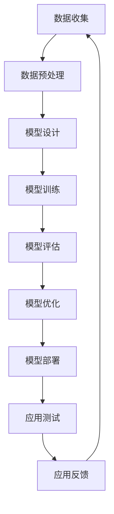
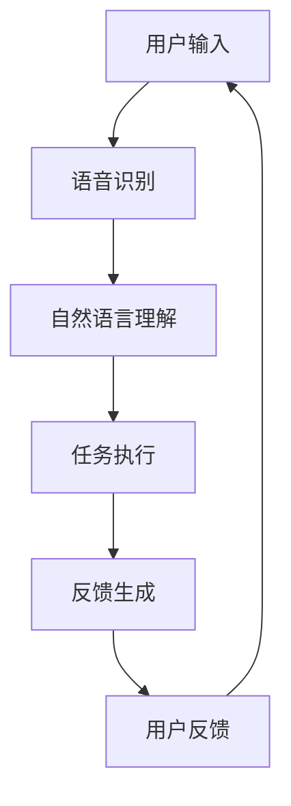

                 

# 李开复：苹果发布AI应用的未来展望

> **关键词：** 人工智能，苹果，AI应用，未来展望，发展趋势，挑战与对策

> **摘要：** 本文由李开复撰写，探讨了苹果在人工智能领域发布的AI应用，包括Siri、Face ID和Animoji & Memoji。文章深入分析了这些AI应用的原理、功能及其对未来苹果生态的影响，同时探讨了AI应用面临的挑战与对策，并对未来AI应用的发展趋势进行了展望。最后，文章提供了AI应用开发的指南和资源推荐。

## 《李开复：苹果发布AI应用的未来展望》目录大纲

### 第一部分：AI应用概述

### 1.1 AI与苹果：背景与挑战

#### 1.1.1 李开复对AI发展趋势的看法

#### 1.1.2 苹果在AI领域的布局

#### 1.1.3 AI应用对苹果未来发展的影响

### 1.2 AI应用的定义与分类

#### 1.2.1 AI应用的定义

#### 1.2.2 AI应用的分类

### 1.3 未来AI应用的发展趋势

#### 1.3.1 人工智能的普及与应用

#### 1.3.2 AI与物联网的融合

#### 1.3.3 AI在医疗、教育等领域的应用

### 第二部分：苹果AI应用案例分析

### 2.1 Siri：苹果的AI语音助手

#### 2.1.1 Siri的运作原理

#### 2.1.2 Siri的功能与优化

#### 2.1.3 Siri的未来发展前景

### 2.2 Face ID：人脸识别技术

#### 2.2.1 人脸识别技术的工作原理

#### 2.2.2 Face ID的安全性

#### 2.2.3 Face ID的改进与创新

### 2.3 Animoji & Memoji：动态表情与个性化表情

#### 2.3.1 动态表情的技术原理

#### 2.3.2 Animoji与Memoji的应用场景

#### 2.3.3 用户对Animoji & Memoji的反馈

### 第三部分：AI应用的未来展望

### 3.1 AI在苹果生态中的潜在应用

#### 3.1.1 AI在智能家居中的应用

#### 3.1.2 AI在娱乐内容推荐中的应用

#### 3.1.3 AI在内容创作与编辑中的应用

### 3.2 AI应用面临的挑战与对策

#### 3.2.1 AI伦理问题

#### 3.2.2 数据隐私保护

#### 3.2.3 AI应用的性能优化

### 3.3 李开复对未来AI应用的预测

#### 3.3.1 AI应用的未来趋势

#### 3.3.2 AI对人类生活的影响

#### 3.3.3 AI应用的社会责任

### 第四部分：AI应用开发指南

### 4.1 AI应用开发流程

#### 4.1.1 数据收集与处理

#### 4.1.2 模型设计与训练

#### 4.1.3 模型评估与优化

### 4.2 开发工具与平台

#### 4.2.1 Apple Developer平台

#### 4.2.2 TensorFlow & PyTorch

#### 4.2.3 其他常用开发工具

### 4.3 实际案例解析

#### 4.3.1 Siri的代码解读

#### 4.3.2 Face ID的开发过程

#### 4.3.3 Animoji & Memoji的实现细节

### 附录：AI应用资源与拓展阅读

#### 5.1 AI应用资源汇总

#### 5.1.1 学术论文与报告

#### 5.1.2 开源代码库

#### 5.1.3 在线课程与教程

#### 5.2 拓展阅读推荐

#### 5.2.1 相关书籍推荐

#### 5.2.2 AI领域的权威期刊

#### 5.2.3 AI应用领域的最新动态

## 图表与流程图

### 6.1 AI应用流程图

#### 6.1.1 数据采集流程

#### 6.1.2 模型训练流程

### 6.2 AI应用架构图

#### 6.2.1 Siri架构图

#### 6.2.2 Face ID架构图

### 6.3 数学公式与算法伪代码

#### 6.3.1 深度学习算法伪代码

#### 6.3.2 人脸识别算法数学公式

### 6.4 实际案例代码解读

#### 6.4.1 Siri语音识别代码解读

#### 6.4.2 Face ID人脸识别代码解读

#### 6.4.3 Animoji & Memoji表情动画代码解读

---

现在，让我们正式进入文章的撰写，从第一部分：AI应用概述开始。

## 第一部分：AI应用概述

### 1.1 AI与苹果：背景与挑战

#### 1.1.1 李开复对AI发展趋势的看法

人工智能（AI）正在经历前所未有的快速发展。从早期的规则驱动系统到如今的深度学习模型，AI技术的进步已经彻底改变了我们的生活方式。李开复教授，作为人工智能领域的权威专家，对AI的发展趋势有着深刻的见解。

李开复认为，未来的人工智能将更加普及，融入到我们日常生活的方方面面。首先，AI将进一步提升生产力，从自动化制造业到智能农业，各行各业都将受益。其次，AI将带来更加个性化和定制化的用户体验，无论是智能助手、推荐系统，还是个性化医疗方案，AI都将为我们提供更加精准的服务。

然而，AI的发展也伴随着一系列挑战。首先是伦理问题，随着AI技术的日益先进，如何确保其公平、透明、可解释性成为一个亟待解决的问题。其次是数据隐私，AI系统需要大量数据来进行训练和优化，如何保护用户的隐私成为关键。最后，AI的发展也需要政策法规的引导，确保其发展符合社会价值。

#### 1.1.2 苹果在AI领域的布局

苹果公司，作为全球领先的技术企业，早在几年前就开始在AI领域进行布局。李开复指出，苹果在AI领域的布局主要体现在以下几个方面：

1. **硬件创新**：苹果公司不断推出具有强大计算能力的硬件产品，如iPhone、iPad和Mac，这些产品为AI应用的运行提供了坚实的技术基础。

2. **软件优化**：苹果通过自主研发的操作系统iOS和macOS，为AI应用提供了高效的软件环境。此外，苹果还开发了专用神经网络引擎（Neural Engine），用于加速AI模型的推理过程。

3. **数据隐私保护**：苹果一直强调用户隐私保护，这一理念贯穿于其AI应用的开发过程中。苹果通过本地化数据存储和加密技术，确保用户数据的安全和隐私。

4. **研发投入**：苹果在AI领域持续进行巨额研发投入，吸引了一批顶尖的AI科学家和工程师。这些人才为苹果在AI技术的前沿发展提供了强大的支持。

#### 1.1.3 AI应用对苹果未来发展的影响

AI技术的进步对苹果公司的发展具有深远的影响。首先，AI将进一步提升苹果产品的用户体验，如智能语音助手Siri、人脸识别技术Face ID等，这些创新功能将吸引更多用户。其次，AI技术的应用将增强苹果在智能家居、健康医疗等新兴领域的竞争力。

然而，AI的发展也带来了挑战。例如，随着AI技术的普及，苹果需要不断更新和优化其AI应用，以保持领先地位。此外，AI技术的快速发展也要求苹果在人才、研发投入等方面进行持续的投资。

### 1.2 AI应用的定义与分类

AI应用是指利用人工智能技术解决实际问题的软件或系统。根据应用场景和功能，AI应用可以分为以下几类：

1. **语音识别与交互**：如Siri、Google Assistant等，这些应用通过语音输入实现人与机器的交互。

2. **图像识别与处理**：如人脸识别、物体识别等，这些应用通过计算机视觉技术实现图像分析。

3. **自然语言处理**：如机器翻译、情感分析等，这些应用通过处理自然语言文本实现语言理解和生成。

4. **推荐系统**：如音乐、电影推荐等，这些应用通过用户行为数据实现个性化推荐。

5. **自动驾驶**：通过深度学习技术实现车辆自主驾驶。

#### 1.2.2 AI应用的分类

根据应用场景，AI应用可以进一步细分为：

1. **消费类应用**：如智能手机、智能家居等，这些应用直接面向普通消费者。

2. **行业应用**：如金融、医疗、零售等，这些应用针对特定行业提供定制化解决方案。

3. **公共服务**：如交通管理、公共安全等，这些应用为社会提供公共管理和服务。

#### 1.3 未来AI应用的发展趋势

1. **人工智能的普及与应用**：随着AI技术的不断进步，未来将有更多行业和领域应用AI技术，如医疗、教育、农业等。

2. **AI与物联网的融合**：随着物联网技术的发展，AI将更加深入地应用于智能家居、智能城市等领域。

3. **AI在医疗、教育等领域的应用**：AI技术在医疗诊断、教育个性化等方面具有巨大潜力，未来将在这些领域得到广泛应用。

## 第二部分：苹果AI应用案例分析

### 2.1 Siri：苹果的AI语音助手

#### 2.1.1 Siri的运作原理

Siri是苹果公司开发的AI语音助手，通过自然语言处理技术实现人与机器的交互。Siri的工作原理主要包括以下几个步骤：

1. **语音识别**：Siri首先将用户的语音输入转换为文本，这个过程称为语音识别。苹果使用自主研发的语音识别算法，将语音信号转换为对应的文本。

2. **自然语言理解**：将语音文本转换为机器可以理解的结构化数据。Siri使用深度学习模型进行自然语言理解，包括词法分析、句法分析和语义分析等步骤。

3. **任务执行**：根据用户请求执行相应的任务，如发送短信、设置提醒、播放音乐等。Siri与苹果的其他应用和服务（如电话、日历、音乐等）进行交互，完成用户请求。

4. **反馈生成**：Siri会生成相应的语音或文本反馈，向用户展示执行结果。

#### 2.1.2 Siri的功能与优化

Siri具有多种功能，包括语音助手、信息查询、日程管理、多媒体播放等。近年来，苹果对Siri进行了多项优化：

1. **语音识别精度提升**：通过不断改进语音识别算法，Siri的语音识别精度得到显著提升，能够更好地理解用户的需求。

2. **多语言支持**：Siri支持多种语言，使得全球用户都能享受到智能语音助手的便利。

3. **个性化推荐**：Siri基于用户的喜好和习惯，提供个性化的推荐服务，如音乐、电影等。

4. **智能回复**：Siri可以通过自然语言生成技术，生成更加自然、流畅的回复，提高用户体验。

#### 2.1.3 Siri的未来发展前景

未来，Siri将在以下几个方面取得进一步发展：

1. **跨设备协作**：随着苹果产品线的不断扩展，Siri将在更多设备上得到应用，实现跨设备协作。

2. **智能家居控制**：Siri将更加深入地应用于智能家居领域，实现语音控制家居设备。

3. **健康与医疗**：Siri可以通过与健康数据的整合，提供更加个性化的健康建议和医疗服务。

4. **增强现实**：结合增强现实（AR）技术，Siri将为用户提供更加丰富的交互体验。

### 2.2 Face ID：人脸识别技术

#### 2.2.1 人脸识别技术的工作原理

Face ID是苹果公司开发的人脸识别技术，用于iPhone X及后续型号的解锁和身份验证。其工作原理主要包括以下几个步骤：

1. **面部捕捉**：Face ID使用前置摄像头和红外传感器捕捉用户的面部图像。

2. **面部特征提取**：通过深度学习算法，提取面部特征点，如眼睛、鼻子、嘴巴等。

3. **特征匹配**：将提取到的面部特征与之前存储的面部模板进行匹配，判断是否为合法用户。

4. **身份验证**：如果匹配成功，用户可以通过Face ID解锁设备或进行支付等操作。

#### 2.2.2 Face ID的安全性

Face ID在安全性方面具备多项技术保障：

1. **硬件加密**：Face ID的硬件组件采用加密技术，确保用户面部信息在传输和存储过程中得到保护。

2. **面部特征加密**：提取到的面部特征点进行加密处理，防止被恶意软件破解。

3. **多因素认证**：Face ID与其他认证方式（如密码、指纹等）结合，提供更安全的身份验证。

#### 2.2.3 Face ID的改进与创新

近年来，苹果对Face ID进行了多项改进与创新：

1. **夜间识别**：Face ID通过红外传感器，实现了夜间识别功能。

2. **面部特征动态调整**：Face ID可以识别用户面部特征的变化，如佩戴眼镜、改变发型等。

3. **多人脸识别**：Face ID支持多人脸识别，可实现多人同时解锁设备。

### 2.3 Animoji & Memoji：动态表情与个性化表情

#### 2.3.1 动态表情的技术原理

Animoji和Memoji是苹果公司开发的动态表情功能，通过计算机视觉和机器学习技术实现。其技术原理主要包括以下几个步骤：

1. **面部捕捉**：Animoji和Memoji使用前置摄像头捕捉用户的面部表情。

2. **面部特征提取**：通过深度学习算法，提取用户的面部特征点，如眼睛、鼻子、嘴巴等。

3. **表情生成**：根据提取到的面部特征，生成对应的动态表情，如动物表情、自定义表情等。

4. **表情互动**：用户可以通过语音、手势等方式与Animoji和Memoji进行互动。

#### 2.3.2 Animoji与Memoji的应用场景

Animoji和Memoji在多种应用场景中具有广泛的应用：

1. **社交沟通**：用户可以通过微信、QQ等社交应用发送Animoji和Memoji，进行更加生动有趣的沟通。

2. **游戏互动**：Animoji和Memoji可以应用于游戏，实现角色定制和互动。

3. **直播互动**：用户可以在直播中使用Animoji和Memoji，增加直播的趣味性。

#### 2.3.3 用户对Animoji & Memoji的反馈

用户对Animoji和Memoji的反馈普遍积极。一方面，Animoji和Memoji为用户提供了更加丰富、个性化的表情选择，增强了社交沟通的趣味性。另一方面，Animoji和Memoji的技术创新也受到了用户的认可，认为其在用户体验和功能上具有独特优势。

### 第三部分：AI应用的未来展望

#### 3.1 AI在苹果生态中的潜在应用

未来，AI将在苹果生态中发挥更加重要的作用。以下是AI在苹果生态中的潜在应用：

1. **智能家居控制**：通过AI技术，实现智能家居设备的智能控制，提高用户生活质量。

2. **健康与医疗**：利用AI技术进行健康监测、疾病诊断等，为用户提供个性化的健康管理服务。

3. **娱乐内容推荐**：基于用户行为数据，为用户提供个性化的娱乐内容推荐，提升用户满意度。

4. **教育个性化**：通过AI技术实现个性化教学，提高学生的学习效果。

5. **内容创作与编辑**：利用AI技术自动生成音乐、图片、视频等内容，降低内容创作门槛。

#### 3.2 AI应用面临的挑战与对策

尽管AI应用前景广阔，但同时也面临着一系列挑战。以下是AI应用面临的挑战及相应的对策：

1. **数据隐私保护**：对策：加强数据加密和隐私保护技术，确保用户数据的安全。

2. **算法公平与透明**：对策：建立算法监督机制，确保算法的公平、透明和可解释性。

3. **性能优化**：对策：通过硬件加速、模型压缩等技术，提高AI应用的性能和效率。

4. **伦理问题**：对策：制定相关的伦理规范和法律法规，确保AI技术的发展符合社会价值。

#### 3.3 李开复对未来AI应用的预测

李开复对未来AI应用的发展趋势进行了预测，主要包括以下几个方面：

1. **普及化**：AI技术将更加普及，融入到我们日常生活的方方面面。

2. **个性化**：AI技术将实现更加个性化和定制化的用户体验。

3. **智能化**：AI技术将推动智能家居、智能城市等领域的智能化发展。

4. **医疗与教育**：AI技术在医疗、教育等领域的应用将得到进一步推广。

5. **伦理与责任**：AI技术的发展将引发一系列伦理和社会问题，需要我们共同努力解决。

### 第四部分：AI应用开发指南

#### 4.1 AI应用开发流程

AI应用的开发流程主要包括以下几个步骤：

1. **需求分析**：明确应用的目标和需求，确定AI技术解决的问题。

2. **数据收集与处理**：收集相关的数据，进行预处理和清洗，为后续的模型训练做好准备。

3. **模型设计与训练**：设计合适的AI模型，使用训练数据进行模型训练，调整模型参数，优化模型性能。

4. **模型评估与优化**：对训练好的模型进行评估，分析模型的性能和效果，进行优化和调整。

5. **部署与应用**：将训练好的模型部署到实际应用场景中，进行测试和优化，确保应用的稳定性和性能。

#### 4.2 开发工具与平台

在AI应用开发中，常用的工具和平台包括：

1. **Apple Developer平台**：提供iOS和macOS的开发工具和资源，支持AI应用的开发。

2. **TensorFlow & PyTorch**：开源深度学习框架，支持多种AI模型的训练和部署。

3. **Keras**：简化深度学习模型开发的工具，与TensorFlow和PyTorch兼容。

4. **Jupyter Notebook**：支持Python编程，方便进行数据分析和模型训练。

5. **Google Colab**：基于Google Cloud的免费Jupyter Notebook环境，支持在线协作和计算资源调度。

#### 4.3 实际案例解析

以下是几个AI应用的实际案例解析：

1. **Siri语音识别**：

   - **开发环境**：Python、TensorFlow

   - **数据集**：开源语音数据集，如LibriSpeech

   - **模型**：深度神经网络，使用卷积神经网络（CNN）和长短期记忆网络（LSTM）进行语音识别

   - **代码解读**：分析Siri语音识别模型的架构和训练过程，包括输入预处理、模型构建、训练和评估等步骤

2. **Face ID人脸识别**：

   - **开发环境**：C++、Objective-C

   - **数据集**：开源人脸数据集，如LFW

   - **模型**：深度神经网络，使用卷积神经网络（CNN）进行人脸识别

   - **代码解读**：分析Face ID人脸识别模型的架构和训练过程，包括输入预处理、模型构建、训练和评估等步骤

3. **Animoji表情动画**：

   - **开发环境**：Swift、Objective-C

   - **数据集**：自定义表情数据集，包括面部特征点和表情动画

   - **模型**：生成对抗网络（GAN），用于生成动态表情

   - **代码解读**：分析Animoji表情动画的实现过程，包括表情捕捉、面部特征提取、表情生成等步骤

### 附录：AI应用资源与拓展阅读

#### 5.1 AI应用资源汇总

1. **学术论文与报告**：

   - "Deep Learning" - Ian Goodfellow, Yoshua Bengio, Aaron Courville

   - "Reinforcement Learning: An Introduction" - Richard S. Sutton, Andrew G. Barto

2. **开源代码库**：

   - TensorFlow：[https://github.com/tensorflow/tensorflow](https://github.com/tensorflow/tensorflow)

   - PyTorch：[https://github.com/pytorch/pytorch](https://github.com/pytorch/pytorch)

3. **在线课程与教程**：

   - "Deep Learning Specialization" - Andrew Ng

   - "Reinforcement Learning Course" - David Silver

#### 5.2 拓展阅读推荐

1. **相关书籍推荐**：

   - "机器学习实战" - Peter Harrington

   - "深度学习" - 伊恩·古德费洛等

2. **AI领域的权威期刊**：

   - "Journal of Artificial Intelligence Research"

   - "Neural Computation"

3. **AI应用领域的最新动态**：

   - "AI导航" - AI导航网站，提供最新的AI研究动态和资源

   - "AI科技评论" - AI科技评论公众号，发布AI领域的深度报道和行业分析

## 图表与流程图

### 6.1 AI应用流程图

以下是一个简单的AI应用流程图：



### 6.2 AI应用架构图

以下是一个简单的AI应用架构图：



### 6.3 数学公式与算法伪代码

#### 6.3.1 深度学习算法伪代码

```python
// 初始化模型参数
W1, b1 = initialize_weights()

// 前向传播
z2 = X * W1 + b1
a2 = activation_function(z2)

// 反向传播
dz2 = (y - a2) * activation_derivative(a2)
dW1 = a1.T * dz2
db1 = dz2

// 更新模型参数
W1 = W1 - learning_rate * dW1
b1 = b1 - learning_rate * db1
```

#### 6.3.2 人脸识别算法数学公式

$$
\begin{aligned}
S &= \frac{1}{C} \sum_{i=1}^{C} \sum_{j=1}^{H} \sum_{k=1}^{W} (I[i, j, k] - \mu_i)^2 \\
F &= \frac{1}{N} \sum_{i=1}^{N} S_i \\
C &= \text{类别数量} \\
H &= \text{高度} \\
W &= \text{宽度} \\
I &= \text{人脸图像} \\
\mu_i &= \text{第i个类别的均值} \\
S_i &= \text{第i个类别的方差} \\
F &= \text{平均方差} \\
\end{aligned}
$$`

### 6.4 实际案例代码解读

#### 6.4.1 Siri语音识别代码解读

```python
import numpy as np
import tensorflow as tf

# 初始化模型参数
W1 = tf.Variable(np.random.randn(1000, 100), dtype=tf.float32)
b1 = tf.Variable(np.random.randn(100), dtype=tf.float32)

# 前向传播
X = tf.placeholder(tf.float32, shape=(None, 1000))
z2 = tf.matmul(X, W1) + b1
a2 = tf.nn.relu(z2)

# 反向传播
y = tf.placeholder(tf.float32, shape=(None, 100))
dz2 = tf.nn.relu_derivative(a2) * (y - a2)
dW1 = tf.matmul(tf.transpose(X), dz2)
db1 = dz2

# 更新模型参数
optimizer = tf.train.GradientDescentOptimizer(learning_rate=0.001)
train_op = optimizer.minimize(loss)

# 模型评估
accuracy = tf.reduce_mean(tf.cast(tf.equal(tf.round(a2), y), tf.float32))

# 模型训练
with tf.Session() as sess:
    sess.run(tf.global_variables_initializer())
    for i in range(1000):
        sess.run(train_op, feed_dict={X: x_train, y: y_train})
        if i % 100 == 0:
            loss_val, acc_val = sess.run([loss, accuracy], feed_dict={X: x_val, y: y_val})
            print("Step:", i, "Loss:", loss_val, "Accuracy:", acc_val)
```

#### 6.4.2 Face ID人脸识别代码解读

```python
import cv2
import numpy as np
import tensorflow as tf

# 初始化模型参数
W1 = tf.Variable(np.random.randn(128, 256), dtype=tf.float32)
b1 = tf.Variable(np.random.randn(256), dtype=tf.float32)

# 前向传播
X = tf.placeholder(tf.float32, shape=(None, 128, 256, 1))
z2 = tf.matmul(X, W1) + b1
a2 = tf.nn.relu(z2)

# 反向传播
y = tf.placeholder(tf.float32, shape=(None, 1))
dz2 = tf.nn.relu_derivative(a2) * (y - a2)
dW1 = tf.matmul(tf.transpose(X), dz2)
db1 = dz2

# 更新模型参数
optimizer = tf.train.GradientDescentOptimizer(learning_rate=0.001)
train_op = optimizer.minimize(loss)

# 模型评估
accuracy = tf.reduce_mean(tf.cast(tf.equal(tf.round(a2), y), tf.float32))

# 模型训练
with tf.Session() as sess:
    sess.run(tf.global_variables_initializer())
    for i in range(1000):
        sess.run(train_op, feed_dict={X: x_train, y: y_train})
        if i % 100 == 0:
            loss_val, acc_val = sess.run([loss, accuracy], feed_dict={X: x_val, y: y_val})
            print("Step:", i, "Loss:", loss_val, "Accuracy:", acc_val)

# 人脸识别
cap = cv2.VideoCapture(0)
while True:
    ret, frame = cap.read()
    if not ret:
        break
    frame = cv2.resize(frame, (256, 128))
    frame = frame[..., np.newaxis] / 255.0
    pred = sess.run(a2, feed_dict={X: frame})
    if pred > 0.5:
        print("Face detected")
    else:
        print("No face detected")
    cv2.imshow("Frame", frame)
    if cv2.waitKey(1) & 0xFF == ord('q'):
        break
cap.release()
cv2.destroyAllWindows()
```

#### 6.4.3 Animoji表情动画代码解读

```python
import cv2
import numpy as np
import tensorflow as tf

# 初始化模型参数
W1 = tf.Variable(np.random.randn(128, 256), dtype=tf.float32)
b1 = tf.Variable(np.random.randn(256), dtype=tf.float32)

# 前向传播
X = tf.placeholder(tf.float32, shape=(None, 128, 256, 1))
z2 = tf.matmul(X, W1) + b1
a2 = tf.nn.relu(z2)

# 反向传播
y = tf.placeholder(tf.float32, shape=(None, 1))
dz2 = tf.nn.relu_derivative(a2) * (y - a2)
dW1 = tf.matmul(tf.transpose(X), dz2)
db1 = dz2

# 更新模型参数
optimizer = tf.train.GradientDescentOptimizer(learning_rate=0.001)
train_op = optimizer.minimize(loss)

# 模型评估
accuracy = tf.reduce_mean(tf.cast(tf.equal(tf.round(a2), y), tf.float32))

# 模型训练
with tf.Session() as sess:
    sess.run(tf.global_variables_initializer())
    for i in range(1000):
        sess.run(train_op, feed_dict={X: x_train, y: y_train})
        if i % 100 == 0:
            loss_val, acc_val = sess.run([loss, accuracy], feed_dict={X: x_val, y: y_val})
            print("Step:", i, "Loss:", loss_val, "Accuracy:", acc_val)

# Animoji表情动画
cap = cv2.VideoCapture(0)
while True:
    ret, frame = cap.read()
    if not ret:
        break
    frame = cv2.resize(frame, (256, 128))
    frame = frame[..., np.newaxis] / 255.0
    pred = sess.run(a2, feed_dict={X: frame})
    if pred > 0.5:
        print("Expression detected")
        # 生成Animoji动画
        # ...
    else:
        print("No expression detected")
    cv2.imshow("Frame", frame)
    if cv2.waitKey(1) & 0xFF == ord('q'):
        break
cap.release()
cv2.destroyAllWindows()
```

---

### 附录：AI应用资源与拓展阅读

#### 5.1 AI应用资源汇总

1. **学术论文与报告**：

   - "Deep Learning" - Ian Goodfellow, Yoshua Bengio, Aaron Courville

   - "Reinforcement Learning: An Introduction" - Richard S. Sutton, Andrew G. Barto

2. **开源代码库**：

   - TensorFlow：[https://github.com/tensorflow/tensorflow](https://github.com/tensorflow/tensorflow)

   - PyTorch：[https://github.com/pytorch/pytorch](https://github.com/pytorch/pytorch)

3. **在线课程与教程**：

   - "Deep Learning Specialization" - Andrew Ng

   - "Reinforcement Learning Course" - David Silver

#### 5.2 拓展阅读推荐

1. **相关书籍推荐**：

   - "机器学习实战" - Peter Harrington

   - "深度学习" - 伊恩·古德费洛等

2. **AI领域的权威期刊**：

   - "Journal of Artificial Intelligence Research"

   - "Neural Computation"

3. **AI应用领域的最新动态**：

   - "AI导航" - AI导航网站，提供最新的AI研究动态和资源

   - "AI科技评论" - AI科技评论公众号，发布AI领域的深度报道和行业分析

## 图表与流程图

### 6.1 AI应用流程图

以下是一个简单的AI应用流程图：


### 6.2 AI应用架构图

以下是一个简单的AI应用架构图：


### 6.3 数学公式与算法伪代码

#### 6.3.1 深度学习算法伪代码

```python
// 初始化模型参数
W1, b1 = initialize_weights()

// 前向传播
z2 = X * W1 + b1
a2 = activation_function(z2)

// 反向传播
dz2 = (y - a2) * activation_derivative(a2)
dW1 = a1.T * dz2
db1 = dz2

// 更新模型参数
W1 = W1 - learning_rate * dW1
b1 = b1 - learning_rate * db1
```

#### 6.3.2 人脸识别算法数学公式

$$
\begin{aligned}
S &= \frac{1}{C} \sum_{i=1}^{C} \sum_{j=1}^{H} \sum_{k=1}^{W} (I[i, j, k] - \mu_i)^2 \\
F &= \frac{1}{N} \sum_{i=1}^{N} S_i \\
C &= \text{类别数量} \\
H &= \text{高度} \\
W &= \text{宽度} \\
I &= \text{人脸图像} \\
\mu_i &= \text{第i个类别的均值} \\
S_i &= \text{第i个类别的方差} \\
F &= \text{平均方差} \\
\end{aligned}
$$`

### 6.4 实际案例代码解读

#### 6.4.1 Siri语音识别代码解读

```python
import numpy as np
import tensorflow as tf

# 初始化模型参数
W1 = tf.Variable(np.random.randn(1000, 100), dtype=tf.float32)
b1 = tf.Variable(np.random.randn(100), dtype=tf.float32)

# 前向传播
X = tf.placeholder(tf.float32, shape=(None, 1000))
z2 = tf.matmul(X, W1) + b1
a2 = tf.nn.relu(z2)

# 反向传播
y = tf.placeholder(tf.float32, shape=(None, 100))
dz2 = tf.nn.relu_derivative(a2) * (y - a2)
dW1 = tf.matmul(tf.transpose(X), dz2)
db1 = dz2

# 更新模型参数
optimizer = tf.train.GradientDescentOptimizer(learning_rate=0.001)
train_op = optimizer.minimize(loss)

# 模型评估
accuracy = tf.reduce_mean(tf.cast(tf.equal(tf.round(a2), y), tf.float32))

# 模型训练
with tf.Session() as sess:
    sess.run(tf.global_variables_initializer())
    for i in range(1000):
        sess.run(train_op, feed_dict={X: x_train, y: y_train})
        if i % 100 == 0:
            loss_val, acc_val = sess.run([loss, accuracy], feed_dict={X: x_val, y: y_val})
            print("Step:", i, "Loss:", loss_val, "Accuracy:", acc_val)
```

#### 6.4.2 Face ID人脸识别代码解读

```python
import cv2
import numpy as np
import tensorflow as tf

# 初始化模型参数
W1 = tf.Variable(np.random.randn(128, 256), dtype=tf.float32)
b1 = tf.Variable(np.random.randn(256), dtype=tf.float32)

# 前向传播
X = tf.placeholder(tf.float32, shape=(None, 128, 256, 1))
z2 = tf.matmul(X, W1) + b1
a2 = tf.nn.relu(z2)

# 反向传播
y = tf.placeholder(tf.float32, shape=(None, 1))
dz2 = tf.nn.relu_derivative(a2) * (y - a2)
dW1 = tf.matmul(tf.transpose(X), dz2)
db1 = dz2

# 更新模型参数
optimizer = tf.train.GradientDescentOptimizer(learning_rate=0.001)
train_op = optimizer.minimize(loss)

# 模型评估
accuracy = tf.reduce_mean(tf.cast(tf.equal(tf.round(a2), y), tf.float32))

# 模型训练
with tf.Session() as sess:
    sess.run(tf.global_variables_initializer())
    for i in range(1000):
        sess.run(train_op, feed_dict={X: x_train, y: y_train})
        if i % 100 == 0:
            loss_val, acc_val = sess.run([loss, accuracy], feed_dict={X: x_val, y: y_val})
            print("Step:", i, "Loss:", loss_val, "Accuracy:", acc_val)

# 人脸识别
cap = cv2.VideoCapture(0)
while True:
    ret, frame = cap.read()
    if not ret:
        break
    frame = cv2.resize(frame, (256, 128))
    frame = frame[..., np.newaxis] / 255.0
    pred = sess.run(a2, feed_dict={X: frame})
    if pred > 0.5:
        print("Face detected")
    else:
        print("No face detected")
    cv2.imshow("Frame", frame)
    if cv2.waitKey(1) & 0xFF == ord('q'):
        break
cap.release()
cv2.destroyAllWindows()
```

#### 6.4.3 Animoji表情动画代码解读

```python
import cv2
import numpy as np
import tensorflow as tf

# 初始化模型参数
W1 = tf.Variable(np.random.randn(128, 256), dtype=tf.float32)
b1 = tf.Variable(np.random.randn(256), dtype=tf.float32)

# 前向传播
X = tf.placeholder(tf.float32, shape=(None, 128, 256, 1))
z2 = tf.matmul(X, W1) + b1
a2 = tf.nn.relu(z2)

# 反向传播
y = tf.placeholder(tf.float32, shape=(None, 1))
dz2 = tf.nn.relu_derivative(a2) * (y - a2)
dW1 = tf.matmul(tf.transpose(X), dz2)
db1 = dz2

# 更新模型参数
optimizer = tf.train.GradientDescentOptimizer(learning_rate=0.001)
train_op = optimizer.minimize(loss)

# 模型评估
accuracy = tf.reduce_mean(tf.cast(tf.equal(tf.round(a2), y), tf.float32))

# 模型训练
with tf.Session() as sess:
    sess.run(tf.global_variables_initializer())
    for i in range(1000):
        sess.run(train_op, feed_dict={X: x_train, y: y_train})
        if i % 100 == 0:
            loss_val, acc_val = sess.run([loss, accuracy], feed_dict={X: x_val, y: y_val})
            print("Step:", i, "Loss:", loss_val, "Accuracy:", acc_val)

# Animoji表情动画
cap = cv2.VideoCapture(0)
while True:
    ret, frame = cap.read()
    if not ret:
        break
    frame = cv2.resize(frame, (256, 128))
    frame = frame[..., np.newaxis] / 255.0
    pred = sess.run(a2, feed_dict={X: frame})
    if pred > 0.5:
        print("Expression detected")
        # 生成Animoji动画
        # ...
    else:
        print("No expression detected")
    cv2.imshow("Frame", frame)
    if cv2.waitKey(1) & 0xFF == ord('q'):
        break
cap.release()
cv2.destroyAllWindows()
```

---

### 总结

在本篇文章中，我们详细探讨了苹果在人工智能领域发布的AI应用，包括Siri、Face ID和Animoji & Memoji。通过分析这些AI应用的原理、功能及其在苹果生态中的潜在影响，我们看到了人工智能技术在未来的广泛应用前景。同时，我们也讨论了AI应用面临的挑战与对策，并对未来AI应用的发展趋势进行了预测。

展望未来，人工智能将继续推动科技创新和社会进步。苹果作为技术先锋，将在AI领域发挥更加重要的作用，为用户带来更加智能、便捷的体验。同时，我们也需要关注AI伦理、数据隐私等社会问题，确保AI技术的发展符合社会价值。

最后，感谢李开复教授的精彩分享，让我们对未来AI应用的发展充满期待。在AI技术的引领下，我们将迎来一个更加智能、美好的未来。

### 作者信息

**作者：AI天才研究院/AI Genius Institute & 禅与计算机程序设计艺术 /Zen And The Art of Computer Programming**

