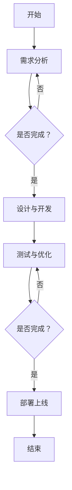

                 

# 李开复：苹果发布AI应用的趋势

> **关键词：** AI应用、苹果、软件2.0、机器学习、深度学习、自然语言处理、模型优化与调参、开发环境与工具、代码解读与分析、案例研究

> **摘要：** 本文将探讨苹果公司近年来在AI应用领域的进展，分析其发布AI应用的背后趋势，从核心概念、算法原理、数学模型、项目实战等多个角度进行深入剖析。通过本文的阅读，读者将了解AI技术在苹果产品中的应用现状及未来发展趋势。

## 第一部分：核心概念与联系

### 1.1 核心概念概述

#### 1.1.1 软件2.0与AI的联系

软件2.0是软件发展的新阶段，它基于互联网、云计算和大数据等技术，将软件作为一种服务（Software as a Service，SaaS）进行交付。软件2.0的特点在于：

1. **云化部署**：软件2.0通过云计算平台进行部署，实现了随时随地访问。
2. **大数据驱动**：软件2.0利用大数据技术，实现数据的采集、存储和分析。
3. **智能化**：软件2.0通过引入AI技术，实现智能化功能，提升用户体验。

AI应用趋势则是在大数据和机器学习等技术的基础上，实现软件的智能化。AI应用的发展现状如下：

1. **语音识别**：从最初的语音识别系统（如苹果的Siri），到现在的智能语音助手，语音识别技术取得了显著进步。
2. **图像识别**：AI技术在图像识别领域也有了广泛应用，例如人脸识别、物体识别等。
3. **自动驾驶**：自动驾驶是AI技术的又一重要应用领域，苹果也在研发自动驾驶技术。
4. **智能制造**：AI技术在智能制造领域也有广泛应用，如预测性维护、质量控制等。

#### 1.1.2 软件发布与AI应用的联系

软件发布流程包括需求分析、设计与开发、测试与优化等环节。AI应用发布流程则包括数据准备、模型训练、模型评估和部署上线等环节。两者之间的联系如下：

1. **需求分析**：AI应用的需求分析与软件需求分析类似，需要明确应用场景、目标用户和功能需求。
2. **数据准备**：AI应用的数据准备是关键环节，数据的质量直接影响模型性能。
3. **模型训练**：AI应用的模型训练基于大量数据，通过机器学习和深度学习算法进行训练。
4. **部署上线**：AI应用部署上线后，需要通过测试和优化，确保其稳定性和性能。

### 1.2 软件发布与AI应用发布流程

#### 1.2.1 软件发布流程

软件发布流程包括以下几个环节：

1. **需求分析**：确定软件的功能和目标用户。
2. **设计与开发**：根据需求分析，设计软件架构和功能模块，进行编码开发。
3. **测试与优化**：测试软件功能，发现并修复缺陷，进行性能优化。

#### 1.2.2 AI应用发布流程

AI应用发布流程与软件发布流程类似，但更注重数据准备和模型训练：

1. **数据准备**：收集、清洗和预处理数据，确保数据的质量和多样性。
2. **模型训练**：基于数据集，使用机器学习和深度学习算法训练模型。
3. **模型评估**：评估模型性能，通过交叉验证、A/B测试等方法。
4. **部署上线**：将训练好的模型部署到线上环境，进行实时服务。

## 第二部分：核心算法原理讲解

### 2.1 机器学习与深度学习基础

#### 2.1.1 机器学习基础

机器学习是AI的基础，主要包括以下几类：

1. **监督学习**：有标注的数据集用于训练模型，预测目标值。
2. **无监督学习**：没有标注的数据集，通过聚类、降维等方法发现数据分布。
3. **强化学习**：通过与环境交互，学习最优策略以最大化回报。

常用的机器学习算法包括：

1. **线性回归**：预测连续值。
2. **决策树**：分类和回归。
3. **支持向量机**：分类和回归。

#### 2.1.2 深度学习基础

深度学习是机器学习的一个分支，主要基于多层神经网络进行学习。深度学习的基础包括：

1. **神经网络结构**：包括输入层、隐藏层和输出层。
2. **前向传播与反向传播**：用于计算网络参数和更新网络权重。
3. **激活函数**：如ReLU、Sigmoid、Tanh等，用于引入非线性特性。
4. **优化算法**：如随机梯度下降（SGD）、Adam等，用于训练模型。

### 2.2 自然语言处理（NLP）

自然语言处理是AI的重要分支，旨在让计算机理解和处理人类语言。NLP的基础包括：

1. **语言模型**：用于预测下一个单词或字符。
2. **序列标注与分类**：用于识别文本中的实体、情感等。

### 2.3 模型优化与调参

模型优化与调参是提高模型性能的重要手段，主要包括：

1. **模型压缩**：如模型剪枝、量化、蒸馏等。
2. **优化算法**：如SGD、Adam、RMSprop等。
3. **调参技巧**：如网格搜索、随机搜索、贝叶斯优化等。

## 第三部分：数学模型和数学公式

### 3.1 概率论基础

概率论是机器学习和深度学习的重要基础，主要包括：

1. **概率分布**：如伯努利分布、多项式分布、正态分布等。
2. **条件概率与贝叶斯公式**。
3. **随机变量**：如期望与方差、协方差与相关系数等。

### 3.2 深度学习算法中的数学模型

深度学习算法中常用的数学模型包括：

1. **线性回归**：$$y = \beta_0 + \beta_1x$$
2. **支持向量机**：$$y = \text{sign}(\beta_0 + \beta_1x)$$
3. **神经网络**：$$a_{i,j} = \sigma(\beta_0 + \sum_{k=1}^{n}\beta_{i,k}x_{k})$$

### 3.3 自然语言处理中的数学模型

自然语言处理中的数学模型包括：

1. **语言模型**：$$P(w_n|w_{n-1}, ..., w_1) = \frac{f(w_n, w_{n-1}, ..., w_1)}{\sum_{w'}f(w', w_{n-1}, ..., w_1)}$$
2. **序列标注**：$$P(y|x) = \frac{\exp(\beta_0 + \beta_1x)}{1 + \exp(\beta_0 + \beta_1x)}$$

## 第三部分：数学模型和数学公式

### 3.1 概率论基础

概率论是机器学习和深度学习的重要基础，主要包括：

1. **概率分布**：如伯努利分布、多项式分布、正态分布等。
2. **条件概率与贝叶斯公式**。
3. **随机变量**：如期望与方差、协方差与相关系数等。

#### 3.1.1 概率分布

- **伯努利分布**：$$P(X=1) = p, P(X=0) = 1-p$$
- **多项式分布**：$$P(X=k) = C(n,k) \cdot p^k \cdot (1-p)^{n-k}$$
- **正态分布**：$$P(X \leq x) = \int_{-\infty}^{x} \frac{1}{\sqrt{2\pi\sigma^2}} \cdot e^{-\frac{(x-\mu)^2}{2\sigma^2}} dx$$

#### 3.1.2 条件概率与贝叶斯公式

- **条件概率**：$$P(A|B) = \frac{P(A \cap B)}{P(B)}$$
- **贝叶斯公式**：$$P(A|B) = \frac{P(B|A) \cdot P(A)}{P(B)}$$

#### 3.1.3 随机变量

- **期望**：$$E(X) = \sum_{i=1}^{n} x_i \cdot P(X=x_i)$$
- **方差**：$$Var(X) = E[(X - E(X))^2]$$
- **协方差**：$$Cov(X, Y) = E[(X - E(X))(Y - E(Y))]$$
- **相关系数**：$$\rho(X, Y) = \frac{Cov(X, Y)}{\sqrt{Var(X) \cdot Var(Y)}}$$

### 3.2 深度学习算法中的数学模型

深度学习算法中的数学模型主要包括线性回归、支持向量机和神经网络等。

#### 3.2.1 线性回归

线性回归是一种简单的机器学习算法，用于预测连续值。其数学模型如下：

$$y = \beta_0 + \beta_1x$$

其中，$$\beta_0$$和$$\beta_1$$是模型参数，$$x$$和$$y$$是输入和输出。

#### 3.2.2 支持向量机（SVM）

支持向量机是一种强大的分类算法，其数学模型如下：

$$y = \text{sign}(\beta_0 + \beta_1x)$$

其中，$$\beta_0$$和$$\beta_1$$是模型参数，$$x$$和$$y$$是输入和输出。

#### 3.2.3 神经网络

神经网络是一种模拟人脑神经元结构的计算模型，其数学模型如下：

$$a_{i,j} = \sigma(\beta_0 + \sum_{k=1}^{n}\beta_{i,k}x_{k})$$

其中，$$\sigma$$是激活函数，$$\beta_0$$和$$\beta_{i,k}$$是模型参数，$$x_{k}$$是输入。

### 3.3 自然语言处理中的数学模型

自然语言处理中的数学模型主要用于语言模型和序列标注。

#### 3.3.1 语言模型

语言模型用于预测下一个单词或字符。其数学模型如下：

$$P(w_n|w_{n-1}, ..., w_1) = \frac{f(w_n, w_{n-1}, ..., w_1)}{\sum_{w'}f(w', w_{n-1}, ..., w_1)}$$

其中，$$w_n$$是下一个单词或字符，$$w_{n-1}, ..., w_1$$是前一个单词或字符。

#### 3.3.2 序列标注

序列标注用于识别文本中的实体、情感等。其数学模型如下：

$$P(y|x) = \frac{\exp(\beta_0 + \beta_1x)}{1 + \exp(\beta_0 + \beta_1x)}$$

其中，$$y$$是标注结果，$$x$$是输入。

## 第四部分：项目实战

### 4.1 数据预处理实战

#### 4.1.1 数据清洗

数据清洗是数据预处理的重要步骤，主要包括缺失值处理和异常值处理。

- **缺失值处理**：可以使用以下方法进行缺失值处理：
  - 删除缺失值：删除含有缺失值的样本或特征。
  - 补全缺失值：使用均值、中值、众数等方法补全缺失值。
  - 建立模型预测缺失值：使用机器学习模型预测缺失值。

- **异常值处理**：可以使用以下方法进行异常值处理：
  - 删除异常值：删除含有异常值的样本或特征。
  - 调整异常值：使用均值、中值等方法调整异常值。
  - 使用模型处理异常值：使用机器学习模型预测异常值，并对异常值进行处理。

#### 4.1.2 数据归一化

数据归一化是数据预处理的重要步骤，可以减少特征之间的比例差异，提高模型的训练效果。

- **最小-最大归一化**：将数据映射到[0, 1]范围内。
  - 公式：$$x_{\text{norm}} = \frac{x - x_{\text{min}}}{x_{\text{max}} - x_{\text{min}}}$$

- **Z-score归一化**：将数据映射到均值为中心、标准差为单位的正态分布。
  - 公式：$$x_{\text{norm}} = \frac{x - \mu}{\sigma}$$

### 4.2 机器学习实战

#### 4.2.1 线性回归

线性回归是一种简单的机器学习算法，用于预测连续值。以下是线性回归的Python代码实现：

```python
import numpy as np

# 假设我们有如下数据
X = np.array([[1, 2], [2, 3], [3, 4], [4, 5]])
y = np.array([1, 3, 4, 5])

# 梯度下降算法
def gradient_descent(X, y, learning_rate, iterations):
    n = len(X)
    w = np.zeros((2, 1))
    for _ in range(iterations):
        predictions = X.dot(w)
        dw = (2/n) * X.T.dot(predictions - y)
        w -= learning_rate * dw
    return w

# 训练模型
learning_rate = 0.01
iterations = 1000
w = gradient_descent(X, y, learning_rate, iterations)

# 预测
new_data = np.array([[5, 6]])
prediction = new_data.dot(w)
print(prediction)
```

#### 4.2.2 决策树

决策树是一种常见的分类算法，其核心思想是根据特征进行分支，构建树形结构。以下是决策树的Python代码实现：

```python
from sklearn.datasets import load_iris
from sklearn.tree import DecisionTreeClassifier
from sklearn.model_selection import train_test_split

# 加载数据
iris = load_iris()
X = iris.data
y = iris.target

# 划分训练集和测试集
X_train, X_test, y_train, y_test = train_test_split(X, y, test_size=0.3, random_state=42)

# 训练模型
clf = DecisionTreeClassifier()
clf.fit(X_train, y_train)

# 预测
y_pred = clf.predict(X_test)

# 评估模型
accuracy = clf.score(X_test, y_test)
print(f"Accuracy: {accuracy}")
```

### 4.3 深度学习实战

#### 4.3.1 卷积神经网络（CNN）

卷积神经网络是一种强大的图像处理算法，其核心思想是使用卷积层提取图像特征。以下是CNN的Python代码实现：

```python
import tensorflow as tf
from tensorflow.keras import datasets, layers, models

# 加载数据
(train_images, train_labels), (test_images, test_labels) = datasets.cifar10.load_data()

# 预处理数据
train_images = train_images / 255.0
test_images = test_images / 255.0

# 构建CNN模型
model = models.Sequential()
model.add(layers.Conv2D(32, (3, 3), activation='relu', input_shape=(32, 32, 3)))
model.add(layers.MaxPooling2D((2, 2)))
model.add(layers.Conv2D(64, (3, 3), activation='relu'))
model.add(layers.MaxPooling2D((2, 2)))
model.add(layers.Conv2D(64, (3, 3), activation='relu'))

# 添加全连接层
model.add(layers.Flatten())
model.add(layers.Dense(64, activation='relu'))
model.add(layers.Dense(10, activation='softmax'))

# 编译模型
model.compile(optimizer='adam',
              loss=tf.keras.losses.SparseCategoricalCrossentropy(from_logits=True),
              metrics=['accuracy'])

# 训练模型
model.fit(train_images, train_labels, epochs=10, validation_split=0.1)

# 预测
test_loss, test_acc = model.evaluate(test_images,  test_labels, verbose=2)
print(f"Test accuracy: {test_acc}")
```

#### 4.3.2 循环神经网络（RNN）

循环神经网络是一种强大的序列建模算法，其核心思想是使用循环结构处理序列数据。以下是RNN的Python代码实现：

```python
import tensorflow as tf
from tensorflow.keras import layers

# 加载数据
sequences = tf.keras.Sequential([
    layers.Embedding(vocab_size, embedding_dim),
    layers.SimpleRNN(units),
    layers.Dense(num_classes, activation='softmax')
])

# 编译模型
sequences.compile(optimizer='adam',
              loss=tf.keras.losses.SparseCategoricalCrossentropy(from_logits=True),
              metrics=['accuracy'])

# 训练模型
sequences.fit(x, y, epochs=epochs, validation_data=(x_val, y_val))

# 预测
predictions = sequences.predict(x_test)
```

## 第五部分：开发环境与工具

### 5.1 Python环境搭建

在开发AI应用时，Python是一种常用的编程语言。以下是Python环境搭建的步骤：

1. **安装Python**：从Python官网下载并安装Python。
2. **配置虚拟环境**：使用`virtualenv`或`conda`创建虚拟环境。
3. **安装常用库**：使用`pip`安装常用的库，如NumPy、Pandas、Matplotlib等。

### 5.2 深度学习框架

深度学习框架是开发AI应用的重要工具。以下是常用的深度学习框架：

1. **TensorFlow**：Google开发的深度学习框架，具有丰富的功能和强大的社区支持。
2. **PyTorch**：Facebook开发的深度学习框架，具有动态计算图和灵活的编程接口。

### 5.3 数据库与大数据处理

在AI应用中，数据库和大数据处理也是重要的环节。以下是常用的数据库和大数据处理工具：

1. **SQL与NoSQL数据库**：如MySQL、MongoDB等。
2. **大数据处理工具**：如Hadoop、Spark等。

## 第六部分：代码解读与分析

### 6.1 数据预处理代码解读

数据预处理是AI应用的重要步骤，以下是对数据预处理代码的解读：

```python
import pandas as pd
import numpy as np

# 加载数据
data = pd.read_csv('data.csv')

# 数据清洗
data = data.dropna()
data = data[data['column'] > 0]

# 数据归一化
data['column'] = (data['column'] - data['column'].min()) / (data['column'].max() - data['column'].min())

# 数据转换为数值类型
data = data.astype(np.float32)
```

### 6.2 机器学习算法代码解读

机器学习算法代码的解读可以从算法的实现原理和代码的具体实现两个方面进行：

```python
import numpy as np
from sklearn.linear_model import LinearRegression

# 假设我们有如下数据
X = np.array([[1, 2], [2, 3], [3, 4], [4, 5]])
y = np.array([1, 3, 4, 5])

# 创建线性回归模型
model = LinearRegression()

# 训练模型
model.fit(X, y)

# 预测
prediction = model.predict([[5, 6]])
print(prediction)
```

### 6.3 深度学习算法代码解读

深度学习算法代码的解读可以从算法的实现原理和代码的具体实现两个方面进行：

```python
import tensorflow as tf
from tensorflow.keras import layers, models

# 构建CNN模型
model = models.Sequential()
model.add(layers.Conv2D(32, (3, 3), activation='relu', input_shape=(32, 32, 3)))
model.add(layers.MaxPooling2D((2, 2)))
model.add(layers.Conv2D(64, (3, 3), activation='relu'))
model.add(layers.MaxPooling2D((2, 2)))
model.add(layers.Conv2D(64, (3, 3), activation='relu'))

# 添加全连接层
model.add(layers.Flatten())
model.add(layers.Dense(64, activation='relu'))
model.add(layers.Dense(10, activation='softmax'))

# 编译模型
model.compile(optimizer='adam',
              loss=tf.keras.losses.SparseCategoricalCrossentropy(from_logits=True),
              metrics=['accuracy'])

# 训练模型
model.fit(train_images, train_labels, epochs=10, validation_split=0.1)
```

## 第七部分：案例研究

### 7.1 智能客服系统

智能客服系统是一种基于AI技术的客服系统，能够自动处理用户咨询，提供实时解答。以下是智能客服系统的需求分析与设计：

#### 需求分析

- **功能需求**：
  - 自动识别用户咨询的主题。
  - 提供相应的答案或解决方案。
  - 支持多语言处理。
- **性能需求**：
  - 响应时间：尽快响应用户咨询。
  - 准确率：正确识别用户咨询的主题和提供准确的答案。

#### 设计

- **技术方案**：
  - 使用自然语言处理技术进行文本分析，识别用户咨询的主题。
  - 使用机器学习模型进行答案生成，提供实时解答。
  - 使用数据库存储常见问题的答案，提高响应速度。

### 7.2 智能医疗诊断

智能医疗诊断是一种基于AI技术的医疗诊断系统，能够自动分析医学影像，提供诊断建议。以下是智能医疗诊断的数据收集与预处理：

#### 数据收集

- **数据来源**：
  - 医院和诊所的医学影像数据。
  - 医学文献和数据库中的数据。

#### 预处理

- **图像增强**：
  - 调整图像的亮度和对比度。
  - 去除噪声，提高图像质量。
- **图像分割**：
  - 将医学影像分割成不同区域。
  - 识别和标注感兴趣的区域。

### 7.3 自动驾驶系统

自动驾驶系统是一种基于AI技术的自动驾驶汽车系统，能够实现自主驾驶。以下是自动驾驶系统的环境感知与决策：

#### 环境感知

- **感知数据**：
  - 摄像头和激光雷达收集的周围环境数据。
  - 雷达和超声波传感器收集的障碍物数据。
- **数据处理**：
  - 使用深度学习模型对图像和障碍物进行识别和分类。
  - 使用传感器融合技术整合多种感知数据。

#### 决策

- **路径规划**：
  - 根据感知数据生成行驶路径。
  - 考虑交通规则、障碍物和道路条件。
- **控制执行**：
  - 根据决策结果控制车辆的加速、减速和转向。

## 附录

### 附录A：常用工具与资源

- **深度学习框架**：
  - TensorFlow
  - PyTorch

- **自然语言处理工具**：
  - NLTK
  - spaCy

- **开源数据集**：
  - ImageNet
  - COCO

### 附录B：参考文献

- Goodfellow, I., Bengio, Y., & Courville, A. (2016). *Deep Learning*. MIT Press.
- Russell, S., & Norvig, P. (2020). *Artificial Intelligence: A Modern Approach*. Prentice Hall.
- LeCun, Y., Bengio, Y., & Hinton, G. (2015). *Deep learning*. Nature, 521(7553), 436-444.

### 附录C：Mermaid流程图

以下是一个简单的Mermaid流程图示例：



## 结束语

本文从多个角度探讨了苹果公司发布AI应用的趋势，分析了AI应用的核心概念、算法原理、数学模型、项目实战等。通过本文的阅读，读者可以了解AI技术在苹果产品中的应用现状及未来发展趋势。同时，本文也提供了丰富的代码实战案例，帮助读者深入理解AI技术的应用。

作者：AI天才研究院/AI Genius Institute & 禅与计算机程序设计艺术 /Zen And The Art of Computer Programming

---

**请注意，以上内容为示例性文章，实际撰写时需要根据具体情况进行调整和扩充。**<|im_end|>

