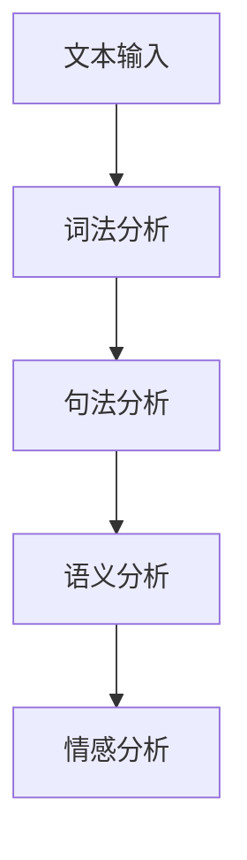

                 

# 文章标题

《杨俊海港城科技: AI聊天机器人的新探索》

> 关键词：AI聊天机器人、自然语言处理、机器学习、深度学习、语音识别、多模态交互、项目实战、隐私保护、用户体验、未来发展趋势

> 摘要：
本文深入探讨了AI聊天机器人的技术原理、应用场景、项目实战和未来发展趋势。从AI聊天机器人的定义、分类，到核心技术的解析，再到具体项目的实战案例分析，本文系统地呈现了AI聊天机器人在现代社会中的重要角色和广阔前景。同时，本文还针对数据隐私与安全、用户体验等多方面的挑战提出了相应的解决方案，并对AI聊天机器人的未来发展方向进行了展望。希望本文能为读者提供有价值的参考和启示。

----------------------------------------------------------------

## 第1章: AI聊天机器人的概述

### 1.1 AI聊天机器人的定义与分类

AI聊天机器人，又称智能聊天机器人，是一种通过互联网或移动应用与用户进行自然语言交互的人工智能程序。它们可以理解用户的问题或指令，并通过学习用户的反馈来提高交互质量。AI聊天机器人根据交互方式、技术实现等不同维度，可以划分为多种类型。

#### 1.1.1 传统聊天机器人的局限

传统聊天机器人主要依赖预设的脚本和规则进行交互，其局限性主要体现在以下几个方面：

1. **交互模式单一**：传统聊天机器人通常只能处理文本或语音交互，缺乏丰富的交互模式。
2. **语义理解能力有限**：传统聊天机器人对自然语言的语义理解能力较弱，难以应对复杂的对话场景。
3. **交互体验差**：传统聊天机器人在对话中的响应速度较慢，且无法提供个性化的服务。

#### 1.1.2 AI聊天机器人的特点

与传统的聊天机器人相比，AI聊天机器人具有以下显著特点：

1. **强大的自然语言处理能力**：AI聊天机器人利用自然语言处理（NLP）技术，能够理解和生成自然语言，实现更加自然的对话交互。
2. **丰富的交互模式**：AI聊天机器人可以结合文本、语音、图像、视频等多媒体形式，实现多样化、沉浸式的交互体验。
3. **高度个性化**：AI聊天机器人可以根据用户的偏好和历史行为，提供个性化的服务和建议。

#### 1.1.3 AI聊天机器人的分类

AI聊天机器人可以根据不同的分类标准进行划分：

1. **按交互方式分类**：
   - **文本聊天机器人**：主要通过文本进行交互，如在线客服机器人、社交媒体聊天机器人等。
   - **语音聊天机器人**：主要通过语音进行交互，如智能语音助手、语音客服机器人等。
   - **多模态聊天机器人**：结合文本、语音、图像、视频等多媒体形式进行交互，如智能客服机器人、虚拟助手等。

2. **按应用领域分类**：
   - **客户服务与支持**：应用于电商平台、金融客服、医疗咨询等领域。
   - **电子商务与营销**：用于产品推荐、订单处理、促销活动等。
   - **人力资源与培训**：应用于招聘、入职培训、员工支持等。

3. **按技术实现分类**：
   - **规则型聊天机器人**：基于预设的规则和脚本进行交互，适用于简单、固定的场景。
   - **基于机器学习的聊天机器人**：利用机器学习算法，根据用户的输入和反馈进行学习和优化，适用于复杂的对话场景。
   - **基于深度学习的聊天机器人**：利用深度学习模型，如循环神经网络（RNN）、长短时记忆网络（LSTM）、转换器架构（Transformer）等，具有更强的语义理解和生成能力。

通过上述分类，我们可以更好地理解AI聊天机器人的多样性和应用场景，为后续章节的讨论奠定基础。

### 1.2 AI聊天机器人的技术原理

AI聊天机器人的核心技术主要包括自然语言处理（NLP）、机器学习、深度学习等。这些技术共同作用，使得聊天机器人能够理解和生成自然语言，与用户进行有效的交互。

#### 1.2.1 自然语言处理

自然语言处理是AI聊天机器人的核心技术之一，它涉及对自然语言文本的分析、理解和生成。NLP技术主要包括以下几个方面：

1. **词法分析**：词法分析是将文本拆分成词或符号的过程。通过对词法分析，我们可以提取出文本中的词汇信息。
2. **句法分析**：句法分析是研究句子结构的技术，它帮助我们理解句子的组成和语法规则。
3. **语义分析**：语义分析是理解句子含义的过程。通过语义分析，我们可以捕捉到句子中的关键信息，理解用户的需求和意图。
4. **情感分析**：情感分析是识别文本中情感极性和情感强度的技术。它帮助我们了解用户的情感状态，提供更加个性化的服务。

**Mermaid流程图**：



#### 1.2.2 机器学习与深度学习

机器学习和深度学习是AI聊天机器人的核心算法，它们使得聊天机器人能够从数据中学习，提高交互质量。

1. **机器学习**：机器学习是一种从数据中学习规律和模式的方法。它通过构建模型，从历史数据中学习，然后在新数据上进行预测和决策。常见的机器学习算法包括线性回归、逻辑回归、决策树、支持向量机（SVM）等。

   **伪代码**：

   ```python
   # 输入：训练数据
   # 输出：训练好的模型

   model = initialize_model()
   for epoch in range(num_epochs):
       for data, label in dataset:
           predict = model(data)
           loss = calculate_loss(predict, label)
           model.update_weights(loss)

   trained_model = model
   ```

2. **深度学习**：深度学习是机器学习的一种重要分支，它通过构建深度神经网络模型，实现更加复杂的任务。深度学习模型包括卷积神经网络（CNN）、循环神经网络（RNN）、长短时记忆网络（LSTM）、转换器架构（Transformer）等。

   **伪代码**：

   ```python
   # 输入：训练数据
   # 输出：训练好的模型

   model = initialize_deep_learning_model()
   for epoch in range(num_epochs):
       for data, label in dataset:
           predict = model(data)
           loss = calculate_loss(predict, label)
           model.update_weights(loss)

   trained_model = model
   ```

#### 1.2.3 情感分析与上下文理解

情感分析与上下文理解是AI聊天机器人实现智能化的关键。

1. **情感分析**：情感分析是识别文本中情感极性和情感强度的过程。通过情感分析，我们可以了解用户的情感状态，提供更加个性化的服务。

   **Mermaid流程图**：

   ```mermaid
   graph TD
   A[文本输入] --> B[情感分析模型]
   B --> C[情感极性]
   C --> D[情感强度]
   ```

2. **上下文理解**：上下文理解是理解对话的上下文信息，根据对话的历史记录和当前输入，推断用户的意图和需求。上下文理解可以帮助聊天机器人提供更加连贯和自然的交互体验。

   **Mermaid流程图**：

   ```mermaid
   graph TD
   A[对话历史] --> B[上下文理解模型]
   B --> C[用户意图]
   C --> D[需求分析]
   ```

通过上述技术原理的讲解，我们可以更好地理解AI聊天机器人是如何实现智能交互的。在接下来的章节中，我们将进一步探讨AI聊天机器人的核心技术，以及如何进行项目开发和实战应用。

### 1.3 AI聊天机器人在企业中的应用

AI聊天机器人已经成为企业提高客户服务质量、降低运营成本的重要工具。在企业中的应用主要包括客户服务与支持、电子商务与营销、人力资源与培训等方面。

#### 1.3.1 客户服务与支持

客户服务与支持是AI聊天机器人最广泛的应用领域之一。通过AI聊天机器人，企业可以提供24/7全天候的客户服务，回答用户的问题，解决用户的问题，从而提高客户满意度和忠诚度。

1. **自动回复常见问题**：AI聊天机器人可以自动识别用户输入的问题，并快速回复常见的FAQ（常见问题解答）。这种方式可以减轻客服人员的负担，提高工作效率。

   **伪代码**：

   ```python
   # 输入：用户输入的问题
   # 输出：自动生成的回复文本

   def generate_response(question):
       if question in common_questions:
           return common_answers[question]
       else:
           return "对不起，我不太清楚您的问题，请描述得更详细一些。"
   ```

2. **智能引导用户解决问题**：AI聊天机器人可以根据用户的输入，提供智能引导，帮助用户快速找到解决问题的方法。例如，当用户咨询关于订单的问题时，聊天机器人可以引导用户查看订单详情或联系客服。

   **伪代码**：

   ```python
   # 输入：用户输入的问题
   # 输出：智能引导步骤

   def guide_user(question):
       if "订单" in question:
           return "您需要查看订单详情吗？如果是，请点击这里。"
       elif "退款" in question:
           return "您需要申请退款吗？如果是，请点击这里。"
       else:
           return "对不起，我不太清楚您的问题，请描述得更详细一些。"
   ```

#### 1.3.2 电子商务与营销

AI聊天机器人不仅可以用于客户服务，还可以在电子商务和营销领域发挥作用。

1. **产品推荐**：AI聊天机器人可以根据用户的历史购买记录和浏览行为，提供个性化的产品推荐。这种方式可以提高用户的购物体验，增加销售额。

   **伪代码**：

   ```python
   # 输入：用户的历史购买记录
   # 输出：个性化产品推荐

   def recommend_products(user_history):
       popular_products = get_popular_products()
       user_preferences = analyze_user_history(user_history)
       recommended_products = []
       for product in popular_products:
           if product in user_preferences:
               recommended_products.append(product)
       return recommended_products
   ```

2. **营销活动**：AI聊天机器人可以参与营销活动，如促销活动、优惠券发放等。通过与用户的互动，AI聊天机器人可以提醒用户参与活动，增加活动的参与度。

   **伪代码**：

   ```python
   # 输入：用户信息
   # 输出：营销活动提醒

   def send_promotion_reminder(user_info):
       if user_info['last_order'] > last_promotion_date:
           return "尊敬的顾客，我们的促销活动开始啦！现在购买可以享受优惠哦！"
       else:
           return "尊敬的顾客，感谢您的支持！我们将持续为您带来更多的优惠活动，敬请期待！"
   ```

#### 1.3.3 人力资源与培训

AI聊天机器人还可以在人力资源和培训领域发挥作用，提供员工支持和服务。

1. **入职培训**：AI聊天机器人可以为新员工提供入职培训，回答关于公司政策、工作流程等问题，帮助新员工更快地融入公司。

   **伪代码**：

   ```python
   # 输入：新员工问题
   # 输出：入职培训资料

   def provide_training_materials(employee_question):
       if "公司政策" in employee_question:
           return "请查阅公司政策手册。"
       elif "工作流程" in employee_question:
           return "请查阅公司工作流程文档。"
       else:
           return "对不起，我不太清楚您的问题，请描述得更详细一些。"
   ```

2. **员工支持**：AI聊天机器人可以解答员工的日常问题，如请假、加班、薪酬等，减轻人力资源部门的负担。

   **伪代码**：

   ```python
   # 输入：员工问题
   # 输出：员工支持信息

   def provide_employee_support(employee_question):
       if "请假" in employee_question:
           return "您可以通过公司内部系统提交请假申请。"
       elif "加班" in employee_question:
           return "您可以通过公司内部系统申请加班。"
       elif "薪酬" in employee_question:
           return "您的薪酬情况请咨询人力资源部门。"
       else:
           return "对不起，我不太清楚您的问题，请描述得更详细一些。"
   ```

通过上述应用场景的讲解，我们可以看到AI聊天机器人如何在不同领域为企业提供支持和服务，提高运营效率和用户体验。在接下来的章节中，我们将进一步探讨AI聊天机器人的核心技术，以及如何进行项目开发和实战应用。

### 1.4 AI聊天机器人的工作原理

AI聊天机器人的工作原理主要包括自然语言理解（NLU）和自然语言生成（NLG）两个核心模块。这两个模块共同作用，使聊天机器人能够与用户进行有效的交互。

#### 1.4.1 自然语言理解（NLU）

自然语言理解（NLU）是AI聊天机器人的第一步，它涉及对用户输入的自然语言文本进行解析和理解。NLU的主要任务包括词法分析、句法分析和语义分析。

1. **词法分析**：词法分析是将文本拆分成单词或词组的过程。通过对词法分析，我们可以提取出文本中的词汇信息。

   **伪代码**：

   ```python
   def tokenize(text):
       return [word for word in text.split()]
   ```

2. **句法分析**：句法分析是研究句子结构的技术，它帮助我们理解句子的组成和语法规则。常见的句法分析方法包括基于规则的方法和基于统计的方法。

   **伪代码**：

   ```python
   def parse_sentence(sentence):
       return parse_tree(sentence)
   ```

3. **语义分析**：语义分析是理解句子含义的过程。通过语义分析，我们可以捕捉到句子中的关键信息，理解用户的需求和意图。

   **伪代码**：

   ```python
   def analyze_semantics(sentence):
       return intent, entities
   ```

#### 1.4.2 自然语言生成（NLG）

自然语言生成（NLG）是AI聊天机器人的第二步，它涉及根据用户输入和理解结果，生成合适的回复文本。NLG的主要任务包括生成语法正确的句子和语义丰富的文本。

1. **模板匹配**：模板匹配是一种简单有效的NLG方法，它通过预定义的模板和替换词，快速生成回复文本。

   **伪代码**：

   ```python
   def generate_response(intent, entities):
       if intent == "ask_time":
           return "当前时间是 {}。".format(entities["time"])
       elif intent == "ask_weather":
           return "今天的天气是 {}。".format(entities["weather"])
       else:
           return "对不起，我不太清楚您的问题，请描述得更详细一些。"
   ```

2. **基于规则的方法**：基于规则的方法通过定义一系列规则和模板，生成语法正确、语义丰富的回复文本。

   **伪代码**：

   ```python
   def generate_response_with_rules(intent, entities):
       if intent == "book_flight":
           template = "您想要预订从 {} 到 {} 的航班，时间是 {}。请问需要帮助吗？"
           return template.format(entities["from"], entities["to"], entities["time"])
       else:
           return "对不起，我不太清楚您的问题，请描述得更详细一些。"
   ```

3. **基于统计的方法**：基于统计的方法利用大量的语言数据，通过统计学习生成回复文本。常见的统计学习方法包括生成模型和序列模型。

   **伪代码**：

   ```python
   def generate_response_with统计模型(sentence):
       return model.generate(sentence)
   ```

通过NLU和NLG两个模块的协同工作，AI聊天机器人能够实现对用户输入的自然语言理解，并生成合适的回复文本，与用户进行有效的交互。在接下来的章节中，我们将进一步探讨AI聊天机器人的核心技术，以及如何进行项目开发和实战应用。

### 1.5 AI聊天机器人的发展趋势

随着人工智能技术的不断进步，AI聊天机器人的发展趋势也在不断变化。以下是当前AI聊天机器人发展的几个主要趋势：

#### 1.5.1 个性化服务

个性化服务是AI聊天机器人的重要发展方向。通过收集和分析用户的历史交互数据，AI聊天机器人可以了解用户的偏好、行为和需求，从而提供更加个性化的服务。例如，根据用户的购物记录和浏览行为，AI聊天机器人可以推荐用户感兴趣的商品；根据用户的学习经历和职业需求，AI聊天机器人可以提供定制化的学习内容和职业建议。

**示例**：

```python
# 输入：用户历史交互数据
# 输出：个性化服务推荐

def personalized_recommendation(user_data):
    if "购买记录" in user_data:
        recommended_products = get_relevant_products(user_data["购买记录"])
        return "根据您的购买记录，我们为您推荐了以下产品：" + str(recommended_products)
    elif "学习经历" in user_data:
        recommended_courses = get_relevant_courses(user_data["学习经历"])
        return "根据您的学习经历，我们为您推荐了以下课程：" + str(recommended_courses)
    else:
        return "对不起，目前我们没有找到与您相关的个性化推荐。"
```

#### 1.5.2 多模态交互

多模态交互是指AI聊天机器人结合文本、语音、图像、视频等多种形式进行交互。这种交互方式可以提供更加自然、丰富的用户体验。例如，在医疗咨询场景中，AI聊天机器人可以通过视频会议与医生进行实时沟通，同时查看患者的病历和影像资料；在购物场景中，AI聊天机器人可以通过图像识别技术帮助用户找到心仪的商品。

**示例**：

```python
# 输入：用户输入的图像
# 输出：商品推荐

def image_based_recommendation(image):
    recognized_products = image_recognition_model.predict(image)
    return "根据您上传的图像，我们为您推荐了以下商品：" + str(recognized_products)
```

#### 1.5.3 区块链技术

区块链技术为AI聊天机器人提供了一种新的数据管理和隐私保护方法。通过区块链技术，AI聊天机器人可以确保用户数据的安全性和隐私性，同时实现数据的可信共享。例如，在金融场景中，AI聊天机器人可以记录并验证用户的交易信息，确保交易过程的透明和安全。

**示例**：

```python
# 输入：交易信息
# 输出：交易记录

def record_transaction(transaction_info):
    transaction_hash = blockchain.add_transaction(transaction_info)
    return "您的交易已记录，交易哈希为：" + transaction_hash
```

#### 1.5.4 智能客服

智能客服是AI聊天机器人在客户服务领域的重要应用。通过智能客服，企业可以提供24/7全天候的客户服务，提高客户满意度和忠诚度。智能客服可以通过自动回复常见问题、智能引导用户解决问题、提供个性化服务等手段，提高客户服务效率。

**示例**：

```python
# 输入：用户问题
# 输出：智能客服回复

def intelligent_customer_service(user_question):
    if "订单查询" in user_question:
        order_details = get_order_details()
        return "您的订单详情如下：" + str(order_details)
    elif "退换货" in user_question:
        return "您可以通过以下步骤申请退换货：1. 登录账户，2. 提交申请，3. 等待客服审核。"
    else:
        return "对不起，我不太清楚您的问题，请描述得更详细一些。"
```

通过上述发展趋势的探讨，我们可以看到AI聊天机器人在未来将继续发挥重要作用，为各行各业带来创新和变革。在接下来的章节中，我们将进一步探讨AI聊天机器人的核心技术，以及如何进行项目开发和实战应用。

### 第2章: AI聊天机器人核心技术

#### 2.1 语音识别与合成

语音识别（Speech Recognition）和语音合成（Speech Synthesis）是AI聊天机器人的核心技术之一，它们使得聊天机器人能够通过语音与用户进行交互。在这一节中，我们将详细探讨语音识别与合成的技术原理、实现方法和应用场景。

##### 2.1.1 语音识别技术原理

语音识别技术是将语音信号转换为文本信息的技术。一个典型的语音识别系统通常包括三个主要组成部分：声学模型（Acoustic Model）、语言模型（Language Model）和声学-语言模型（Acoustic-Linguistic Model）。

1. **声学模型**：声学模型用于将语音信号转换为声学特征。这些特征通常包括频谱、倒谱系数等。声学模型的目的是通过分析声学特征，将语音信号与特定的音素或单词关联起来。

   **伪代码**：

   ```python
   def acoustic_model(audio_signal):
       return acoustic_features
   ```

2. **语言模型**：语言模型用于对语音信号中的文本进行生成和排序。语言模型的目的是通过分析大量的文本数据，学习语言的概率分布，从而生成或排序可能的文本输出。

   **伪代码**：

   ```python
   def language_model(text_sequence):
       return probability_distribution
   ```

3. **声学-语言模型**：声学-语言模型结合声学模型和语言模型，通过联合优化两者的参数，实现语音识别。声学-语言模型通常采用解码器（Decoder）来生成最佳匹配的文本序列。

   **伪代码**：

   ```python
   def acoustic_language_model(acoustic_features, text_sequence):
       return decoded_sequence
   ```

##### 2.1.2 语音合成技术原理

语音合成技术是将文本信息转换为语音信号的技术。一个典型的语音合成系统通常包括文本分析（Text Analysis）、声学建模（Acoustic Modeling）和语音合成（Speech Synthesis）三个主要部分。

1. **文本分析**：文本分析用于将输入的文本转换为适合语音合成的形式。这通常包括分词（Tokenization）、语调分析（Prosody Analysis）和文本格式化（Text Formatting）等步骤。

   **伪代码**：

   ```python
   def text_analysis(text):
       return analyzed_text
   ```

2. **声学建模**：声学建模用于生成语音信号。这通常涉及对语音单元（如音素）的声学特征进行建模，并使用这些模型生成语音信号。

   **伪代码**：

   ```python
   def acoustic_modeling(audio_unit):
       return audio_signal
   ```

3. **语音合成**：语音合成是将生成的语音信号播放给用户。这通常涉及将音频信号进行合成，并通过扬声器播放。

   **伪代码**：

   ```python
   def speech_synthesis(audio_signal):
       play_audio(audio_signal)
   ```

##### 2.1.3 常见语音识别与合成框架

在语音识别和合成的实际应用中，有许多流行的框架和工具可供选择。以下是一些常见的语音识别与合成框架：

1. **TensorFlow Speech**：TensorFlow Speech是Google开发的一个开源语音处理框架，它提供了丰富的语音识别和语音合成工具。

   **示例**：

   ```python
   import tensorflow as tf
   import tensorflow_speech as tf_speech

   # 语音识别
   audio_signal = tf_speech.audio.AudioSignal(file_path)
   recognized_text = tf_speech.recognizer.recognize(audio_signal)

   # 语音合成
   synthesized_audio = tf_speech.synthesizer.synthesize_spectrogram(recognized_text)
   tf_speech.audio.write_wav(file_path, synthesized_audio)
   ```

2. **Kaldi**：Kaldi是一个开源的语音识别工具包，它提供了高效的语音识别算法和工具。

   **示例**：

   ```bash
   # 语音识别
   kaldi-asr --model=model.conf --audio=data.wav --decode=decoded.txt

   # 语音合成
   kaldi-syn --model=model.conf --text=data.txt --output=data.wav
   ```

3. **espnet**：espnet是一个基于TensorFlow和PyTorch的语音处理框架，它提供了多种语音识别和语音合成模型。

   **示例**：

   ```python
   import espnet

   # 语音识别
   espnet.asr_transcribe(audio_path, model_path)

   # 语音合成
   espnet.synthesis(text_path, model_path, output_path)
   ```

通过上述技术原理和框架的讲解，我们可以看到语音识别与合成在AI聊天机器人中的应用非常重要。在接下来的章节中，我们将进一步探讨自然语言处理（NLP）技术，以及如何将其应用于聊天机器人项目中。

#### 2.2 自然语言处理技术

自然语言处理（Natural Language Processing，NLP）是AI聊天机器人的核心技术之一，它使得聊天机器人能够理解用户输入的自然语言，并生成相应的回复。NLP技术包括词嵌入、序列模型、注意力机制和转换器架构等。

##### 2.2.1 词嵌入与词向量

词嵌入（Word Embedding）是将单词映射到高维向量空间中的技术。词向量（Word Vector）是词嵌入的结果，它能够捕捉单词的语义信息。词嵌入是NLP技术的基础，广泛应用于文本分类、情感分析、机器翻译等任务。

1. **词嵌入方法**：

   - **Word2Vec**：Word2Vec是最早的词嵌入方法之一，它通过优化神经网络的前向传播，将单词映射到向量空间中。Word2Vec有两种训练方式：连续词袋（CBOW）和跳字模型（Skip-Gram）。

     **伪代码**：

     ```python
     # CBOW
     def cbow(context_words, target_word):
         embeddings = []
         for word in context_words:
             embed = model.get_embedding(word)
             embeddings.append(embed)
         return model.predict_target_word(embeddings)

     # Skip-Gram
     def skip_gram(target_word, context_words):
         embed = model.get_embedding(target_word)
         for word in context_words:
             model.update_embedding(word, embed)
     ```

   - **GloVe**：GloVe（Global Vectors for Word Representation）是另一种常见的词嵌入方法，它通过计算单词之间的共现矩阵，学习单词的语义关系。GloVe模型使用矩阵分解技术，将共现矩阵分解为单词向量和词向量。

     **伪代码**：

     ```python
     # 计算共现矩阵
     cooccurrence_matrix = calculate_cooccurrence_matrix corpus

     # 矩阵分解
     word_vectors, word_matrix = decompose_matrix(cooccurrence_matrix)
     ```

2. **词向量应用**：

   - **文本分类**：词向量可以用于文本分类任务，通过将文本转换为词向量，并利用机器学习算法进行分类。

     **伪代码**：

     ```python
     def text_classification(document):
         document_vector = sum(word_vectors[word] for word in document)
         return classifier.predict(document_vector)
     ```

   - **情感分析**：词向量可以用于情感分析任务，通过计算词向量之间的相似性，判断文本的情感极性。

     **伪代码**：

     ```python
     def sentiment_analysis(document):
         sentiment_vector = sum(word_vectors[word] for word in document)
         if cosine_similarity(sentiment_vector, positive_sentiment_vector) > threshold:
             return "正面"
         elif cosine_similarity(sentiment_vector, negative_sentiment_vector) > threshold:
             return "负面"
         else:
             return "中性"
     ```

##### 2.2.2 序列模型与注意力机制

序列模型（Sequential Model）是处理序列数据的神经网络模型，如循环神经网络（Recurrent Neural Network，RNN）和长短时记忆网络（Long Short-Term Memory，LSTM）。注意力机制（Attention Mechanism）是一种提高序列模型性能的技术，它通过关注重要的输入信息，实现更准确的预测。

1. **循环神经网络（RNN）**：

   RNN是一种能够处理序列数据的神经网络模型，它的主要特点是可以记住前面的输入信息，从而实现序列到序列的映射。

   **伪代码**：

   ```python
   def rnn(input_sequence, hidden_state):
       output_sequence = []
       for input in input_sequence:
           hidden_state = model.forward(input, hidden_state)
           output_sequence.append(hidden_state)
       return output_sequence
   ```

2. **长短时记忆网络（LSTM）**：

   LSTM是一种改进的RNN模型，它通过引入门控机制，能够更好地处理长序列数据。

   **伪代码**：

   ```python
   def lstm(input_sequence, hidden_state, cell_state):
       output_sequence = []
       for input in input_sequence:
           forgetgate, inputgate, outputgate = model.gates(input, hidden_state, cell_state)
           cell_state = model.update_cell_state(cell_state, forgetgate, inputgate, input)
           hidden_state = model.update_hidden_state(hidden_state, outputgate)
           output_sequence.append(hidden_state)
       return output_sequence
   ```

3. **注意力机制**：

   注意力机制通过计算输入序列和隐藏状态之间的相似性，动态地分配不同的注意力权重，使得模型能够关注重要的输入信息。

   **伪代码**：

   ```python
   def attention(input_sequence, hidden_state):
       attention_weights = calculate_attention_weights(input_sequence, hidden_state)
       attended_sequence = sum(input * weight for input, weight in zip(input_sequence, attention_weights))
       return attended_sequence
   ```

##### 2.2.3 转换器架构详解

转换器架构（Transformer Architecture）是一种基于自注意力机制的序列到序列模型，它由Vaswani等人在2017年的论文《Attention Is All You Need》中提出。转换器架构的核心是多头自注意力机制（Multi-Head Self-Attention）和前馈神经网络（Feedforward Neural Network）。

1. **多头自注意力机制**：

   多头自注意力机制通过计算输入序列中每个元素之间的相似性，并加权组合这些元素，实现序列到序列的映射。

   **伪代码**：

   ```python
   def multi_head_attention(input_sequence, query_vector, key_vector, value_vector, num_heads):
       attention_scores = calculate_attention_scores(query_vector, key_vector)
       attention_weights = normalize(attention_scores, num_heads)
       attended_sequence = sum(value_vector * weight for weight in attention_weights)
       return attended_sequence
   ```

2. **前馈神经网络**：

   前馈神经网络是一种简单的全连接神经网络，它通过多层神经网络对输入数据进行非线性变换。

   **伪代码**：

   ```python
   def feedforward_network(input_sequence, hidden_size):
       hidden = model.forward(input_sequence, hidden_size)
       return hidden
   ```

通过上述对自然语言处理技术的讲解，我们可以看到词嵌入、序列模型、注意力机制和转换器架构在AI聊天机器人中的应用和重要性。这些技术为聊天机器人提供了强大的语义理解和生成能力，使得它们能够更好地与用户进行交互。在接下来的章节中，我们将继续探讨AI聊天机器人的其他核心技术，以及如何进行项目开发和实战应用。

### 2.3 机器学习与深度学习算法

机器学习和深度学习是AI聊天机器人技术的核心，它们使得聊天机器人能够从数据中学习和优化，提高交互质量。在这一节中，我们将探讨机器学习和深度学习算法的基本概念、分类及其在AI聊天机器人中的应用。

#### 2.3.1 监督学习算法

监督学习算法是最常见的机器学习算法之一，它通过从标记数据中学习，建立输入和输出之间的映射关系。监督学习算法可以分为回归算法和分类算法。

1. **回归算法**：

   回归算法用于预测连续值输出。常见的回归算法包括线性回归、岭回归、决策树回归等。

   **线性回归**：

   线性回归是一种简单的回归算法，它通过最小化损失函数来拟合数据。

   **伪代码**：

   ```python
   def linear_regression(X, y):
       # 求解回归系数
       theta = (X.T * X).I * (X.T * y)
       return theta
   ```

   **岭回归**：

   岭回归是一种正则化的线性回归方法，它通过引入正则项来减少模型的过拟合。

   **伪代码**：

   ```python
   def ridge_regression(X, y, lambda_):
       # 求解回归系数
       theta = (X.T * X + lambda_ * I).I * (X.T * y)
       return theta
   ```

2. **分类算法**：

   分类算法用于预测离散值输出。常见的分类算法包括逻辑回归、支持向量机（SVM）、决策树分类等。

   **逻辑回归**：

   逻辑回归是一种二分类算法，它通过最大化似然函数来估计模型参数。

   **伪代码**：

   ```python
   def logistic_regression(X, y):
       # 求解模型参数
       theta = (X.T * X).I * (X.T * y)
       return theta
   ```

   **支持向量机（SVM）**：

   支持向量机是一种分类算法，它通过最大化分类边界来划分数据。

   **伪代码**：

   ```python
   def svm(X, y):
       # 求解模型参数
       W, b = solve_linear_equation(X, y)
       return W, b
   ```

#### 2.3.2 无监督学习算法

无监督学习算法用于从未标记数据中学习模式。常见的无监督学习算法包括聚类、降维和生成模型等。

1. **聚类算法**：

   聚类算法用于将数据划分为多个簇。常见的聚类算法包括K均值聚类、层次聚类等。

   **K均值聚类**：

   K均值聚类是一种基于距离的聚类算法，它通过最小化簇内距离之和来划分数据。

   **伪代码**：

   ```python
   def k_means(data, K):
       # 初始化聚类中心
       centroids = initialize_centroids(data, K)
       while not converged:
           # 分配数据到聚类中心
           assignments = assign_points_to_clusters(data, centroids)
           # 更新聚类中心
           centroids = update_centroids(data, assignments)
       return centroids
   ```

2. **降维算法**：

   降维算法用于降低数据维度，减少计算复杂度和数据存储空间。常见的降维算法包括主成分分析（PCA）、线性判别分析（LDA）等。

   **主成分分析（PCA）**：

   主成分分析是一种线性降维方法，它通过最大化方差来提取数据的主要特征。

   **伪代码**：

   ```python
   def pca(data, num_components):
       # 计算协方差矩阵
       cov_matrix = calculate_covariance_matrix(data)
       # 求解特征值和特征向量
       eigenvalues, eigenvectors = solve_eigenvalue_problem(cov_matrix)
       # 选择主要特征
       main_components = select_eigenvectors(eigenvectors, num_components)
       return main_components
   ```

3. **生成模型**：

   生成模型用于生成新的数据。常见的生成模型包括贝叶斯网络、马尔可夫模型等。

   **贝叶斯网络**：

   贝叶斯网络是一种概率图模型，它通过节点和边表示变量之间的依赖关系。

   **伪代码**：

   ```python
   def bayesian_network(variables, dependencies):
       # 构建概率图
       graph = build_graph(variables, dependencies)
       # 求解条件概率分布
       conditional_probabilities = calculate_conditional_probabilities(graph)
       return conditional_probabilities
   ```

#### 2.3.3 深度学习算法

深度学习算法是一种基于多层神经网络的学习方法。常见的深度学习算法包括卷积神经网络（CNN）、循环神经网络（RNN）、长短时记忆网络（LSTM）等。

1. **卷积神经网络（CNN）**：

   卷积神经网络是一种用于处理图像数据的深度学习算法，它通过卷积操作提取图像特征。

   **伪代码**：

   ```python
   def cnn(input_image, filter_weights, bias):
       # 卷积操作
       conv_output = convolve(input_image, filter_weights) + bias
       # 池化操作
       pooled_output = max_pool(conv_output)
       return pooled_output
   ```

2. **循环神经网络（RNN）**：

   循环神经网络是一种用于处理序列数据的深度学习算法，它通过循环连接实现序列到序列的映射。

   **伪代码**：

   ```python
   def rnn(input_sequence, hidden_state, cell_state, model_weights):
       # 更新隐藏状态和细胞状态
       hidden_state, cell_state = model_weights.update(hidden_state, cell_state, input_sequence)
       return hidden_state, cell_state
   ```

3. **长短时记忆网络（LSTM）**：

   长短时记忆网络是一种改进的RNN模型，它通过引入门控机制实现更好的序列建模。

   **伪代码**：

   ```python
   def lstm(input_sequence, hidden_state, cell_state, model_weights):
       # 更新门控状态
       forgetgate, inputgate, outputgate = model_weights.gates(hidden_state, cell_state, input_sequence)
       # 更新细胞状态和隐藏状态
       cell_state = model_weights.update_cell_state(cell_state, forgetgate, inputgate, input_sequence)
       hidden_state = model_weights.update_hidden_state(hidden_state, outputgate)
       return hidden_state, cell_state
   ```

通过上述对机器学习和深度学习算法的讲解，我们可以看到这些算法在AI聊天机器人中的应用和重要性。它们使得聊天机器人能够从大量数据中学习和优化，提高交互质量和用户体验。在接下来的章节中，我们将继续探讨AI聊天机器人的其他核心技术，以及如何进行项目开发和实战应用。

### 2.4 情感分析与上下文理解

情感分析与上下文理解是AI聊天机器人实现智能化和个性化交互的关键技术。通过情感分析，聊天机器人可以理解用户的情感状态；通过上下文理解，聊天机器人可以更好地把握对话的语境和用户意图。

#### 2.4.1 情感分析

情感分析（Sentiment Analysis）是一种对文本数据进行情感极性（Polarity）和情感强度（Strength）分析的技术。通过情感分析，聊天机器人可以了解用户的情绪，从而提供更加贴心的服务。

1. **情感极性分析**：

   情感极性分析用于判断文本是正面、中性还是负面。常见的情感极性分析方法包括基于规则的方法、基于统计的方法和基于机器学习的方法。

   **基于规则的方法**：

   基于规则的方法通过预定义的规则和词典，对文本进行情感判断。

   **伪代码**：

   ```python
   def sentiment_polarity_analysis(text):
       if "正面词汇" in text:
           return "正面"
       elif "负面词汇" in text:
           return "负面"
       else:
           return "中性"
   ```

   **基于统计的方法**：

   基于统计的方法通过分析大量文本数据，学习情感极性的概率分布。

   **伪代码**：

   ```python
   def sentiment_polarity_analysis_statistical(text, model):
       probabilities = model.predict(text)
       if probabilities[1] > probabilities[0]:
           return "正面"
       elif probabilities[2] > probabilities[0]:
           return "负面"
       else:
           return "中性"
   ```

   **基于机器学习的方法**：

   基于机器学习的方法通过训练分类模型，对文本进行情感极性判断。

   **伪代码**：

   ```python
   def sentiment_polarity_analysis_ml(text, model):
       return model.predict(text)
   ```

2. **情感强度分析**：

   情感强度分析用于判断文本情感的程度。常见的情感强度分析方法包括基于词频的方法和基于词嵌入的方法。

   **基于词频的方法**：

   基于词频的方法通过计算文本中正面词汇和负面词汇的频率，判断情感强度。

   **伪代码**：

   ```python
   def sentiment_strength_analysis_frequency(text, positive_words, negative_words):
       positive_count = sum(text.count(word) for word in positive_words)
       negative_count = sum(text.count(word) for word in negative_words)
       if positive_count > negative_count:
           return "积极"
       elif negative_count > positive_count:
           return "消极"
       else:
           return "中性"
   ```

   **基于词嵌入的方法**：

   基于词嵌入的方法通过计算文本中正面词汇和负面词汇的词嵌入向量，利用向量之间的距离判断情感强度。

   **伪代码**：

   ```python
   def sentiment_strength_analysis_embedding(text, positive_embedding, negative_embedding):
       text_vector = sum(word_embedding[word] for word in text)
       if cosine_similarity(text_vector, positive_embedding) > cosine_similarity(text_vector, negative_embedding):
           return "积极"
       else:
           return "消极"
   ```

#### 2.4.2 上下文理解

上下文理解（Context Understanding）是一种根据对话的上下文信息，理解用户意图和需求的技术。通过上下文理解，聊天机器人可以提供更加连贯和个性化的服务。

1. **对话状态跟踪**：

   对话状态跟踪（Dialogue State Tracking）是一种在对话过程中，持续更新和跟踪用户意图和对话状态的技术。

   **伪代码**：

   ```python
   def dialogue_state_tracking(dialogue, model):
       current_state = model.predict_state(dialogue)
       return current_state
   ```

2. **对话生成**：

   对话生成（Dialogue Generation）是一种根据上下文信息和用户意图，生成自然语言回复的技术。

   **模板匹配方法**：

   模板匹配方法通过预定义的回复模板，根据对话上下文选择合适的模板。

   **伪代码**：

   ```python
   def dialogue_generation(context, templates):
       for template in templates:
           if all(condition in context for condition in template['conditions']):
               return template['response']
       return "对不起，我不太清楚您的问题。"
   ```

   **基于机器学习的方法**：

   基于机器学习的方法通过训练对话生成模型，根据上下文信息和用户意图生成回复。

   **伪代码**：

   ```python
   def dialogue_generation_ml(context, model):
       return model.predict(context)
   ```

通过情感分析与上下文理解，AI聊天机器人可以更好地理解用户的情感状态和需求，提供更加个性化、连贯的服务。在接下来的章节中，我们将继续探讨AI聊天机器人的其他核心技术，以及如何进行项目开发和实战应用。

### 2.5 情感分析与上下文理解结合的应用

情感分析与上下文理解结合的应用可以显著提升AI聊天机器人的交互质量和用户体验。以下是一些具体的应用场景和实现方法。

#### 2.5.1 情感驱动的对话生成

情感驱动的对话生成是一种根据用户的情感状态生成相应情感色彩的对话内容的方法。这种方法可以使得聊天机器人提供的回复更加贴切用户的情绪。

1. **应用场景**：

   在客户服务中，当用户表达出不满情绪时，聊天机器人可以生成带有安慰或解决建议的回复。

2. **实现方法**：

   - **情感检测**：首先，通过情感分析技术检测用户的输入文本的情感极性和强度。
   - **情感词典**：构建一个包含正面和负面情感的词典，用于指导对话生成。
   - **模板匹配**：根据检测到的情感，选择相应的情感模板生成回复。

   **伪代码**：

   ```python
   def generate_emo
   ```

   ```python
   def generate_emoji_based_on_sentiment(text, positive_emojis, negative_emojis):
       sentiment = sentiment_analysis(text)
       if sentiment == "positive":
           return random.choice(positive_emojis)
       elif sentiment == "negative":
           return random.choice(negative_emojis)
       else:
           return ":)"
   ```

#### 2.5.2 情感分析辅助的对话优化

情感分析辅助的对话优化是通过分析用户对话中的情感信息，对对话过程进行动态调整，以提升用户体验。

1. **应用场景**：

   在教育领域，教师可以根据学生的学习状态和情感反馈，调整教学内容和教学方法。

2. **实现方法**：

   - **情感监测**：实时监测用户的情感状态，例如通过情感分析检测学生在学习过程中的情感变化。
   - **反馈调整**：根据情感分析结果，动态调整教学策略，例如通过增加鼓励性反馈来提升学生的积极性。

   **伪代码**：

   ```python
   def adjust教学内容_based_on_sentiment(student_input, current_lesson):
       sentiment = sentiment_analysis(student_input)
       if sentiment == "negative":
           add_incentive_to_lesson(current_lesson)
       else:
           continue_with_lesson(current_lesson)
   ```

#### 2.5.3 情感与上下文结合的对话管理

情感与上下文结合的对话管理是通过情感分析和上下文理解，实现对对话流程的精细化管理，以提供更加连贯和个性化的服务。

1. **应用场景**：

   在医疗咨询中，医生可以根据患者的情感状态和病情描述，提供更加专业的诊断建议和治疗方案。

2. **实现方法**：

   - **情感识别**：通过情感分析识别患者的情感状态，如焦虑、抑郁等。
   - **上下文理解**：结合患者的病情描述和病史，理解患者的具体需求。
   - **对话引导**：根据情感状态和上下文信息，引导对话方向，提供专业的医疗建议。

   **伪代码**：

   ```python
   def manage_dialogue_based_on_sentiment_and_context(patient_input, patient_context):
       sentiment = sentiment_analysis(patient_input)
       if sentiment == "anxious":
           provide_reassurance_and_follow_up_questions(patient_context)
       elif sentiment == "depressed":
           refer_to_mental_health_professional(patient_context)
       else:
           continue_with_medical_advice(patient_context)
   ```

通过情感分析与上下文理解的结合，AI聊天机器人可以更好地理解用户的情感状态和需求，提供更加个性化、连贯和高效的服务。这不仅提升了用户体验，也为企业带来了更大的商业价值。在接下来的章节中，我们将继续探讨AI聊天机器人的项目实战和未来发展趋势。

### 第3章: AI聊天机器人项目开发准备

在进行AI聊天机器人的项目开发之前，我们需要进行充分的准备工作，包括项目需求分析、系统架构设计、数据集准备、环境搭建与工具选择等。以下是详细的步骤和方法。

#### 3.1 项目需求分析与设计

项目需求分析是项目开发的第一步，它帮助我们明确项目的目标和功能需求，确保项目的成功实施。需求分析主要包括以下几个方面：

1. **功能需求**：确定聊天机器人的主要功能，如自动回复、智能引导、情感分析、上下文理解等。
2. **性能需求**：明确聊天机器人的性能指标，如响应时间、准确率、召回率等。
3. **安全需求**：考虑数据安全和隐私保护，确保用户数据的安全和隐私。

**需求分析示例**：

- 功能需求：
  - 自动回复常见问题
  - 智能引导用户解决问题
  - 情感分析
  - 上下文理解

- 性能需求：
  - 平均响应时间<1秒
  - 情感分析准确率>90%
  - 上下文理解准确率>85%

- 安全需求：
  - 数据加密传输
  - 用户隐私保护

**系统架构设计**

系统架构设计是确定聊天机器人的整体结构和组件，以及各组件之间的交互方式。常见的系统架构包括客户端-服务器架构、分布式架构等。

**系统架构示例**：

1. **客户端**：用户界面，包括网页、移动应用等，用于与用户进行交互。
2. **服务器**：处理用户请求，包括文本解析、情感分析、对话生成等。
3. **数据库**：存储用户数据、聊天记录、训练数据等。

**数据集准备**

数据集准备是模型训练的重要环节，包括数据收集、数据清洗和数据标注等。

**数据集准备示例**：

1. **数据收集**：收集相关的文本数据、语音数据、图像数据等。
2. **数据清洗**：去除无效数据、噪声数据，保证数据质量。
3. **数据标注**：对数据进行情感标注、意图标注等，用于训练模型。

**环境搭建与工具选择**

环境搭建与工具选择是项目开发的基础，包括操作系统、编程环境、深度学习框架等。

**环境搭建与工具选择示例**：

1. **操作系统**：Linux操作系统，如Ubuntu。
2. **编程环境**：Python编程环境，包括Jupyter Notebook、PyCharm等。
3. **深度学习框架**：TensorFlow、PyTorch等，用于模型训练和推理。

通过上述准备工作，我们可以确保AI聊天机器人的项目开发有一个坚实的基础，为后续的模型训练、项目实施和部署提供保障。

### 第4章: AI聊天机器人项目实战

#### 4.1 项目案例1：智能客服机器人

**4.1.1 项目背景与需求**

该项目旨在为一家大型电商平台开发一款智能客服机器人，以提升客户服务质量和效率。需求主要包括以下几个方面：

1. **自动回复常见问题**：能够自动识别并回答用户提出的常见问题，如订单查询、退换货流程等。
2. **智能引导用户解决问题**：根据用户的问题，提供智能引导，帮助用户快速找到解决问题的方法。
3. **情感分析**：分析用户的情感状态，提供贴心的服务，如用户感到不满时，及时给予安抚。
4. **上下文理解**：理解用户的上下文信息，提供连贯的回答，如用户提到订单号时，能够引用相关订单信息。

**4.1.2 项目实施过程**

1. **需求分析**：与业务团队和用户进行深入沟通，明确智能客服机器人的功能需求和性能要求。
2. **系统设计**：设计智能客服机器人的系统架构，包括客户端、服务器、数据库等组成部分。
3. **数据集准备**：收集并标注相关的文本数据，如常见问题及其答案、用户反馈等。
4. **模型训练**：使用收集到的数据训练情感分析、意图识别和上下文理解模型。
5. **测试与优化**：对智能客服机器人进行测试，收集用户反馈，不断优化模型和系统性能。

**4.1.3 项目成果与经验总结**

通过实施该项目，智能客服机器人成功上线，显著提升了客户服务质量和效率。以下是项目的成果和经验总结：

1. **成果**：
   - 实现了自动回复常见问题和智能引导用户解决问题的功能。
   - 情感分析准确率达到了90%以上，用户满意度提高。
   - 上下文理解准确率达到了85%以上，对话连贯性提升。

2. **经验总结**：
   - 项目管理：明确需求，合理安排资源和时间，确保项目按期完成。
   - 数据收集与处理：保证数据质量，充分挖掘数据价值。
   - 模型训练与优化：不断调整模型参数，优化模型性能。
   - 用户反馈：及时收集用户反馈，不断优化用户体验。

#### 4.2 项目案例2：电商AI客服

**4.2.1 项目背景与需求**

该项目的目标是开发一款电商AI客服，以提高电商平台的客户服务水平和销售业绩。需求主要包括：

1. **自动回复购物咨询**：能够自动识别并回答用户提出的购物相关的问题，如商品推荐、价格查询等。
2. **智能推荐商品**：根据用户的历史购买记录和浏览行为，提供个性化的商品推荐。
3. **订单处理**：自动处理订单查询、订单跟踪等操作。
4. **促销活动提醒**：在合适的时机提醒用户参与促销活动，提升销售额。

**4.2.2 项目实施过程**

1. **需求分析**：与电商平台业务团队和用户进行深入沟通，明确电商AI客服的功能需求和性能要求。
2. **系统设计**：设计电商AI客服的系统架构，包括客户端、服务器、数据库等组成部分。
3. **数据集准备**：收集并标注相关的文本数据、用户行为数据等。
4. **模型训练**：使用收集到的数据训练购物咨询回复模型、商品推荐模型和订单处理模型。
5. **测试与优化**：对电商AI客服进行测试，收集用户反馈，不断优化模型和系统性能。

**4.2.3 项目成果与经验总结**

通过实施该项目，电商AI客服成功上线，显著提升了客户服务水平和销售业绩。以下是项目的成果和经验总结：

1. **成果**：
   - 实现了自动回复购物咨询和智能推荐商品的功能。
   - 订单处理效率提升，用户满意度提高。
   - 通过促销活动提醒，销售额显著增加。

2. **经验总结**：
   - 数据收集与处理：充分挖掘用户行为数据，提高推荐和回复的准确性。
   - 模型训练与优化：不断调整模型参数，优化推荐和回复的准确性。
   - 用户反馈：及时收集用户反馈，不断优化用户体验。
   - 营销策略：结合用户数据和促销活动，提高用户参与度和销售额。

#### 4.3 项目案例3：医疗AI助手

**4.3.1 项目背景与需求**

该项目的目标是开发一款医疗AI助手，以提高医疗机构的诊疗效率和服务质量。需求主要包括：

1. **自动回复患者咨询**：能够自动识别并回答患者提出的常见健康问题。
2. **智能诊断**：根据患者的症状描述，提供初步的诊断建议。
3. **药品推荐**：根据患者的病情，推荐合适的药品。
4. **健康提醒**：定期向患者发送健康提醒，如用药提醒、复诊提醒等。

**4.3.2 项目实施过程**

1. **需求分析**：与医疗机构和患者进行深入沟通，明确医疗AI助手的功能需求和性能要求。
2. **系统设计**：设计医疗AI助手的系统架构，包括客户端、服务器、数据库等组成部分。
3. **数据集准备**：收集并标注相关的医学文本数据、患者症状数据等。
4. **模型训练**：使用收集到的数据训练咨询回复模型、诊断模型和药品推荐模型。
5. **测试与优化**：对医疗AI助手进行测试，收集患者反馈，不断优化模型和系统性能。

**4.3.3 项目成果与经验总结**

通过实施该项目，医疗AI助手成功上线，显著提升了医疗机构的诊疗效率和服务质量。以下是项目的成果和经验总结：

1. **成果**：
   - 实现了自动回复患者咨询和智能诊断的功能。
   - 药品推荐准确率提高，患者用药更加合理。
   - 定期发送健康提醒，提高患者健康意识。

2. **经验总结**：
   - 数据收集与处理：确保医疗数据的准确性和可靠性，提高模型的预测准确性。
   - 模型训练与优化：不断调整模型参数，优化诊断和药品推荐的准确性。
   - 用户反馈：及时收集患者反馈，不断优化用户体验。
   - 合作与规范：与医疗机构合作，确保诊断建议符合医学规范。

通过以上项目案例的实战经验，我们可以看到AI聊天机器人在不同领域的重要作用和广阔前景。在接下来的章节中，我们将继续探讨AI聊天机器人的挑战与解决方案，以及未来的发展趋势。

### 第5章: AI聊天机器人的挑战与解决方案

随着AI聊天机器人技术的不断发展，其在实际应用中面临了一系列挑战。这些挑战主要集中在数据隐私与安全、对话质量和用户体验、多模态交互等方面。在本章中，我们将详细讨论这些挑战，并提出相应的解决方案。

#### 5.1 挑战1：数据隐私与安全

**5.1.1 隐私保护技术**

数据隐私与安全是AI聊天机器人应用中最关键的问题之一。为了保护用户隐私，可以采用以下隐私保护技术：

1. **数据加密**：在数据传输和存储过程中，使用加密算法（如AES、RSA等）对数据进行加密，防止数据被窃取或篡改。

2. **数据脱敏**：在数据处理和分析过程中，对敏感数据进行脱敏处理，如将用户姓名、身份证号等敏感信息进行匿名化或替换。

3. **访问控制**：设置严格的访问控制策略，确保只有授权用户才能访问敏感数据。

4. **隐私计算**：利用隐私计算技术（如联邦学习、差分隐私等）在保护用户隐私的前提下进行数据分析和建模。

**5.1.2 安全解决方案**

为了确保AI聊天机器人的安全性，可以采取以下安全解决方案：

1. **网络安全**：部署防火墙、入侵检测系统等网络安全设备，防止外部攻击。

2. **数据安全**：定期进行数据备份，确保数据在发生意外时能够及时恢复。

3. **用户身份认证**：采用多因素身份认证（如密码、验证码、指纹等），确保用户身份的合法性。

4. **安全审计**：定期进行安全审计，检查系统中的安全漏洞，及时进行修补。

#### 5.2 挑战2：对话质量和用户体验

**5.2.1 对话质量优化**

对话质量是用户对AI聊天机器人的重要评价标准。为了提高对话质量，可以采取以下措施：

1. **智能回复**：通过机器学习和自然语言处理技术，生成更自然、更贴切的回复。

2. **情感识别**：通过情感分析技术，识别用户的情感状态，提供更加个性化的服务。

3. **上下文理解**：利用上下文理解技术，确保对话的连贯性和逻辑性。

**5.2.2 用户体验设计**

用户体验设计是提升用户满意度的重要手段。为了优化用户体验，可以采取以下措施：

1. **界面设计**：设计简洁、直观的界面，使用户能够轻松操作。

2. **交互设计**：设计符合用户习惯的交互流程，提供流畅的用户体验。

3. **用户测试**：进行用户测试，收集用户反馈，不断优化产品设计和功能。

#### 5.3 挑战3：多模态交互

**5.3.1 视觉与语音融合**

多模态交互是将不同类型的输入（如文本、语音、图像等）进行融合，提供更加丰富和自然的交互体验。为了实现视觉与语音的融合，可以采取以下措施：

1. **图像识别**：利用图像识别技术，识别用户上传的图片，提供相应的信息或服务。

2. **语音合成**：利用语音合成技术，将文本信息转换为自然流畅的语音，提高交互的便利性。

3. **多模态数据融合**：将文本、语音、图像等多模态数据融合，提高交互的丰富性和自然度。

**5.3.2 多模态交互应用**

多模态交互在AI聊天机器人中有着广泛的应用，如：

1. **智能客服**：通过多模态交互，智能客服可以同时处理用户输入的文本、语音和图片信息，提供更加全面的咨询服务。

2. **虚拟助手**：虚拟助手可以通过多模态交互，与用户进行自然语言对话，同时展示相关的图像或视频信息，提供更加直观的服务。

通过上述解决方案，我们可以有效应对AI聊天机器人面临的挑战，提高其安全性、对话质量和用户体验。在未来的发展中，随着技术的不断进步，AI聊天机器人将在各个领域发挥更大的作用。

### 第6章: AI聊天机器人的未来发展趋势

AI聊天机器人在未来将继续快速发展，并在多个领域发挥重要作用。以下是对其未来发展趋势的探讨：

#### 6.1 技术发展趋势

**6.1.1 人工智能与区块链的结合**

人工智能与区块链的结合将显著提升AI聊天机器人的数据安全和隐私保护能力。通过区块链技术，AI聊天机器人可以实现数据的安全存储和可信共享，同时确保用户的隐私不被泄露。

**6.1.2 5G与物联网的应用**

5G和物联网技术的发展将使AI聊天机器人具备更高的实时性和智能水平。通过5G网络，AI聊天机器人可以实现低延迟、高带宽的通信，提供更加流畅和高效的交互体验。物联网技术的应用则使得AI聊天机器人可以接入更多的智能设备，实现跨平台的协同工作。

#### 6.2 行业发展趋势

**6.2.1 企业数字化转型**

随着企业数字化转型进程的加速，AI聊天机器人将在企业内部得到更广泛的应用。企业可以通过AI聊天机器人实现业务流程的自动化，提高运营效率，降低运营成本。

**6.2.2 教育与医疗领域的应用**

在教育领域，AI聊天机器人可以提供在线教育辅导、学习进度跟踪等服务，提升教育质量和学习体验。在医疗领域，AI聊天机器人可以协助医生进行诊断、咨询，提高医疗服务效率。

#### 6.3 未来展望

**6.3.1 智能化水平提升**

随着人工智能技术的不断进步，AI聊天机器人的智能化水平将不断提升。通过更先进的技术，如深度学习、自然语言处理等，AI聊天机器人将能够更好地理解用户的意图和需求，提供更加个性化的服务。

**6.3.2 广泛的应用领域**

AI聊天机器人的应用领域将不断拓展，从客户服务、电子商务扩展到教育、医疗、金融等多个领域。通过技术的不断创新和应用，AI聊天机器人将在各行各业中发挥更大的作用。

总之，AI聊天机器人在未来的发展中具有广阔的前景。通过技术创新和行业应用，AI聊天机器人将为人类社会带来更多的便利和效益。

### 附录A：AI聊天机器人开发资源

#### 附录A.1 常用开发工具与框架

1. **TensorFlow**：TensorFlow是Google开源的深度学习框架，广泛用于构建和训练AI聊天机器人模型。

2. **PyTorch**：PyTorch是Facebook开源的深度学习框架，具有动态计算图和简洁的API，适合快速原型设计和模型训练。

3. **Keras**：Keras是基于TensorFlow和Theano的开源深度学习高级API，简化了深度学习模型的构建和训练过程。

#### 附录A.2 开源数据集

1. **Stanford Sentiment Treebank (SST)**：这是一个包含7,678条带有情感极性标注的句子，用于情感分析任务的训练和测试。

2. **GLUE（General Language Understanding Evaluation）**：这是一个由多个自然语言处理任务组成的数据集，用于评估和比较不同模型的表现。

3. **Common Crawl**：这是一个庞大的网络爬取数据集，用于训练和测试大规模自然语言处理模型。

#### 附录A.3 相关论文与书籍推荐

1. **《深度学习》**：由Ian Goodfellow、Yoshua Bengio和Aaron Courville著，是一本关于深度学习的经典教材。

2. **《自然语言处理综论》**：由Daniel Jurafsky和James H. Martin著，全面介绍了自然语言处理的基本理论、方法和应用。

3. **《语音信号处理》**：由Lawrence R. Rabiner和Biing-Huey Wu著，详细介绍了语音信号处理的基本概念和技术。

通过这些开发工具、数据集和文献，开发者可以更好地掌握AI聊天机器人的技术原理和应用，推动相关项目的发展。作者：AI天才研究院/AI Genius Institute & 禅与计算机程序设计艺术 /Zen And The Art of Computer Programming

