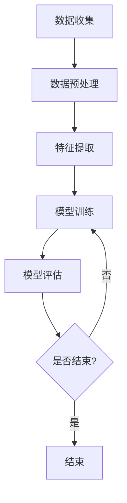
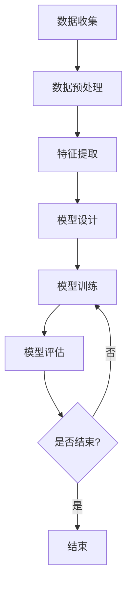
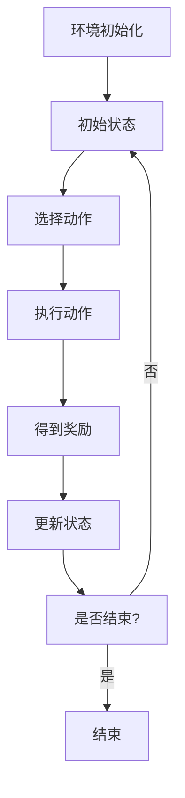

                 

# 欲望智能调节系统：AI辅助的自我管理平台

## 关键词

- 欲望智能调节系统
- AI辅助自我管理
- 人工智能应用
- 深度学习算法
- 强化学习
- 自然语言处理
- 多模态学习
- 概率论与最优化
- 数学模型
- 项目实战

## 摘要

随着人工智能技术的迅猛发展，AI在各个领域的应用越来越广泛。本文将深入探讨欲望智能调节系统（WiseAI）的概念、工作原理和应用实践，特别是其在自我管理领域的潜力。文章分为两部分，第一部分重点介绍欲望智能调节系统的核心概念、工作原理、核心技术、应用领域和未来发展趋势；第二部分则聚焦于AI辅助自我管理的原理、系统架构设计、核心算法原理详解、数学模型以及项目实战。通过详细的讲解和实例分析，本文旨在展示欲望智能调节系统的强大功能，为读者提供关于如何利用AI技术实现自我管理的启示和指导。

### 第一部分：欲望智能调节系统概述

#### 第1章：欲望智能调节系统的基础知识

#### 1.1 欲望智能调节系统的概念与作用

**概念**：欲望智能调节系统（WiseAI）是一种基于人工智能技术的自我管理平台，旨在帮助个体识别、理解和调节自己的欲望，从而实现更健康、更高效的生活。该系统结合了机器学习、深度学习和自然语言处理等技术，通过分析和处理用户行为数据，提供个性化的建议和指导，帮助用户更好地管理自己的欲望。

**作用**：欲望智能调节系统在自我管理和决策过程中具有重要的作用，主要体现在以下几个方面：

1. **欲望识别**：系统能够自动识别用户的欲望和行为模式，为用户提供准确的欲望分析报告。
2. **欲望理解**：通过对用户行为数据的深入分析，系统能够理解用户的欲望动机和影响因素，从而提供更具针对性的建议。
3. **欲望调节**：系统利用机器学习和深度学习算法，对用户的欲望进行智能调节，帮助用户实现欲望与行为的平衡。
4. **决策支持**：系统提供个性化的决策支持，帮助用户在面临选择时做出更明智的决策。

#### 1.2 欲望智能调节系统的工作原理

**原理**：欲望智能调节系统的工作原理主要包括以下步骤：

1. **数据收集**：系统通过多种途径收集用户的行为数据，包括日常活动、社交媒体互动、在线购物记录等。
2. **数据预处理**：对收集到的数据进行清洗、去噪和格式化，以便进行后续分析。
3. **特征提取**：从预处理后的数据中提取关键特征，如时间、地点、行为类型、情绪状态等。
4. **模型训练**：利用提取的特征数据，通过机器学习和深度学习算法训练模型，使其能够识别和理解用户的欲望和行为模式。
5. **欲望调节**：系统根据训练好的模型，对用户的欲望进行智能调节，提供个性化的建议和指导。
6. **反馈与优化**：系统不断收集用户对建议和指导的反馈，通过迭代优化，提高系统的准确性和实用性。

**架构**：欲望智能调节系统的基本架构包括以下几个主要组成部分：

1. **数据采集模块**：负责收集用户行为数据，包括传感器数据、日志数据、社交媒体数据等。
2. **数据处理模块**：对采集到的数据进行预处理、特征提取和模型训练。
3. **智能调节模块**：根据训练好的模型，对用户的欲望进行智能调节，提供个性化的建议和指导。
4. **用户界面模块**：提供友好的用户界面，方便用户与系统进行交互，获取和管理个人数据。

#### 1.3 欲望智能调节系统的核心技术

**技术概述**：欲望智能调节系统采用了多种人工智能技术，包括机器学习、深度学习、自然语言处理等，以实现欲望的智能调节。

1. **机器学习算法**：系统采用各种机器学习算法，如线性回归、决策树、支持向量机等，用于分析和处理用户行为数据，识别和理解用户的欲望。
2. **深度学习算法**：系统利用深度学习算法，如卷积神经网络（CNN）、循环神经网络（RNN）等，对大规模用户行为数据进行分析，提取深层次的欲望特征。
3. **自然语言处理**：系统采用自然语言处理技术，如词嵌入、文本分类等，对用户的文本数据进行处理和分析，从而理解用户的欲望表达和情绪状态。
4. **多模态学习**：系统结合多种数据类型，如文本、图像、音频等，通过多模态学习算法，实现更全面和准确的欲望识别和理解。

**关键算法**：

1. **机器学习算法**：
   - **线性回归**：通过建立线性模型，预测用户欲望的强度和方向。
   - **决策树**：通过树的构建过程，对用户欲望进行分类和预测。
   - **支持向量机**：通过寻找最优超平面，对用户欲望进行分类和调节。

2. **深度学习算法**：
   - **卷积神经网络（CNN）**：通过卷积操作，提取图像特征，实现对用户欲望的图像识别。
   - **循环神经网络（RNN）**：通过循环结构，处理序列数据，实现对用户欲望的序列分析。
   - **长短期记忆网络（LSTM）**：通过门控机制，处理长序列数据，提高对用户欲望的预测准确性。

3. **自然语言处理算法**：
   - **词嵌入**：将文本数据转换为向量表示，实现对用户欲望的语义分析。
   - **文本分类**：通过对文本数据的分类，识别用户欲望的类型和强度。
   - **情感分析**：通过对文本数据的情感分析，识别用户欲望的情绪状态。

4. **多模态学习算法**：
   - **多模态融合**：通过结合不同类型的数据，实现对用户欲望的更全面和准确的识别。
   - **多任务学习**：通过同时处理多种数据类型，提高对用户欲望的识别和调节能力。

#### 1.4 欲望智能调节系统的应用领域

**领域**：欲望智能调节系统具有广泛的应用领域，包括但不限于以下方面：

1. **个人健康管理**：通过智能调节欲望，帮助用户改善生活习惯，预防疾病，提高生活质量。
2. **情感管理**：通过理解用户欲望和情绪状态，提供情感支持和建议，帮助用户缓解压力和焦虑。
3. **时间管理**：通过智能调节欲望，帮助用户合理安排时间，提高工作效率和生活满意度。
4. **习惯养成**：通过跟踪用户欲望和行为模式，提供个性化的习惯养成建议，帮助用户培养良好的生活习惯。
5. **学习与教育**：通过智能调节欲望，帮助学生在学习过程中保持专注，提高学习效果。
6. **商业应用**：在市场营销、客户关系管理、员工激励等领域，通过智能调节欲望，提高企业的运营效率和市场竞争力。

#### 1.5 欲望智能调节系统的发展趋势

**趋势**：随着人工智能技术的不断进步和应用场景的拓展，欲望智能调节系统在未来有望实现以下几个发展趋势：

1. **更智能的欲望识别与理解**：通过引入更多先进的人工智能算法和技术，实现对用户欲望的更准确、更深入的识别和理解。
2. **更个性化的建议与指导**：通过分析用户行为数据和偏好，提供更个性化、更具针对性的建议和指导，帮助用户更好地实现欲望调节。
3. **跨领域应用拓展**：欲望智能调节系统将在更多领域得到应用，如医疗、金融、教育等，为用户提供更全面的服务和支持。
4. **多模态数据的融合**：通过融合多种类型的数据，如文本、图像、音频等，实现对用户欲望的更全面和准确的识别。
5. **伦理和法律问题的解决**：随着人工智能技术的发展，欲望智能调节系统将面临更多的伦理和法律问题，需要建立相应的规范和标准，确保系统的公正性和安全性。

### 第二部分：AI辅助自我管理原理

#### 第2章：自我管理的重要性

**自我管理的定义和意义**

自我管理是指个体通过自我意识和自我控制，对自己的行为、情绪和思维进行管理和调整，以实现个人目标、提升生活质量和工作效率的过程。自我管理不仅包括时间管理、情绪管理和行为管理，还涉及习惯养成、决策制定和目标设定等方面。

自我管理的意义主要体现在以下几个方面：

1. **提高生活质量**：自我管理有助于个体更好地控制自己的行为和情绪，改善生活习惯，降低压力水平，从而提高生活质量。
2. **提升工作效率**：通过有效的自我管理，个体可以更合理地安排时间和任务，提高工作效率，减少无效劳动。
3. **实现个人目标**：自我管理帮助个体明确自己的目标，制定合理的计划，克服困难，坚持执行，从而实现个人目标。
4. **培养自律能力**：自我管理过程有助于培养个体的自律能力，提高自我控制和自我约束的能力，为个人的长期发展奠定基础。

**自我管理对个人成长的影响**

自我管理对个人成长有着深远的影响，主要表现在以下几个方面：

1. **自我意识提升**：自我管理要求个体对自己的行为和情绪进行反思和调整，从而增强自我意识，更好地认识自己。
2. **自信心增强**：通过有效的自我管理，个体可以更好地实现自己的目标，积累成功的经验，增强自信心。
3. **情绪调节能力增强**：自我管理有助于个体更好地理解和控制自己的情绪，提高情绪调节能力，减少情绪波动。
4. **人际关系改善**：自我管理有助于个体更好地处理人际关系，减少冲突，建立良好的人际关系。
5. **生活技能提升**：自我管理过程使个体学会如何安排时间、管理资源、应对挑战，从而提升生活技能。

**自我管理的重要性总结**

自我管理是个人成长和成功的关键因素之一。通过有效的自我管理，个体可以更好地掌控自己的生活，实现个人目标，提高生活质量和工作效率。在现代社会，随着生活节奏的加快和竞争的加剧，自我管理的重要性愈发凸显。因此，每个人都应该重视自我管理，学会运用科学的方法和工具，不断提升自己的自我管理能力。

#### 第2章：AI在自我管理中的应用

**AI如何辅助自我管理**

随着人工智能技术的不断发展，AI在自我管理领域中的应用越来越广泛。AI能够通过以下方式辅助自我管理：

1. **数据分析和预测**：AI可以分析用户的行为数据和生活习惯，预测用户的未来行为趋势，提供个性化的自我管理建议。
2. **情绪识别和调节**：AI利用自然语言处理和情绪分析技术，识别用户的情绪状态，提供情绪调节方法，帮助用户保持良好的心态。
3. **时间管理和任务规划**：AI可以根据用户的工作和生活习惯，自动规划任务和时间，提高工作效率，减少时间浪费。
4. **决策支持**：AI可以分析用户的行为数据和偏好，提供决策支持，帮助用户在面临选择时做出更明智的决策。
5. **习惯养成**：AI可以跟踪用户的行为和习惯，提供个性化的习惯养成建议，帮助用户养成良好的生活习惯。

**AI在自我管理中的优势和挑战**

**优势**

1. **高效性和准确性**：AI可以高效地处理大量数据，提供准确的自我管理建议，节省用户的时间和精力。
2. **个性化**：AI可以根据用户的行为数据和偏好，提供个性化的自我管理方案，满足不同用户的需求。
3. **持续改进**：AI系统可以根据用户的反馈和实际效果，不断优化自我管理方案，提高系统的实用性和准确性。
4. **跨领域应用**：AI在自我管理中的应用不仅限于个人领域，还可以应用于企业、教育、医疗等各个领域，提高整体管理效率。

**挑战**

1. **数据隐私和安全**：AI在自我管理过程中需要收集和处理大量用户数据，如何确保数据隐私和安全是一个重要挑战。
2. **算法偏见**：AI系统的决策可能受到算法偏见的影响，导致不公平或不准确的决策。
3. **依赖性**：用户过度依赖AI系统可能会导致自我管理能力的下降，影响个体的自主性和决策能力。
4. **技术发展瓶颈**：尽管AI技术在不断进步，但在某些方面，如情感识别和调节方面，仍存在一定的技术瓶颈。

**AI辅助自我管理的未来发展方向**

1. **更全面的数据收集与分析**：通过引入更多传感器和数据分析技术，收集更全面、更准确的用户数据，为自我管理提供更坚实的依据。
2. **更智能的决策支持**：利用深度学习和强化学习等技术，提高AI系统的决策支持能力，帮助用户做出更明智的决策。
3. **跨领域应用整合**：将AI辅助自我管理的应用扩展到更多领域，如医疗、教育、金融等，提高整体管理效率。
4. **伦理和法律规范**：制定相应的伦理和法律规范，确保AI辅助自我管理的公平性、透明性和安全性。
5. **用户教育和培训**：加强对用户的教育和培训，提高用户对AI系统的理解和信任，降低用户对AI系统的依赖性。

#### 第2章：欲望智能调节系统的架构设计

**架构设计的基本原则**

欲望智能调节系统的架构设计需要遵循以下基本原则：

1. **模块化**：系统应采用模块化设计，将不同的功能模块进行分离，以提高系统的可维护性和可扩展性。
2. **可扩展性**：系统应具备良好的可扩展性，以适应未来技术和应用场景的变化。
3. **高可用性**：系统应具备高可用性，确保在发生故障或异常时，系统能够快速恢复，减少对用户的影响。
4. **安全性**：系统应确保用户数据的安全和隐私，防止数据泄露和恶意攻击。
5. **易用性**：系统应提供友好的用户界面，方便用户使用和管理自己的欲望。

**架构中的各个模块及其功能**

欲望智能调节系统的架构主要包括以下模块：

1. **用户界面模块**：负责与用户进行交互，接收用户的操作指令，展示系统生成的建议和报告。
2. **数据采集模块**：负责收集用户的行为数据，包括日常活动、社交媒体互动、在线购物记录等。
3. **数据处理模块**：负责对采集到的数据进行预处理、特征提取和模型训练，为智能调节提供数据支持。
4. **智能调节模块**：负责根据用户的欲望和行为数据，利用机器学习和深度学习算法进行智能调节，提供个性化的建议和指导。
5. **决策支持模块**：负责分析用户的行为数据和偏好，提供决策支持，帮助用户在面临选择时做出更明智的决策。
6. **反馈与优化模块**：负责收集用户对建议和指导的反馈，通过迭代优化，提高系统的准确性和实用性。

**用户界面模块**

用户界面模块是系统的前端部分，主要负责与用户进行交互。其主要功能包括：

1. **用户登录和注册**：用户可以通过登录或注册账号，进入系统的主界面。
2. **数据查看和编辑**：用户可以查看和编辑自己的行为数据，如日常活动、社交媒体互动、在线购物记录等。
3. **建议和报告查看**：用户可以查看系统生成的建议和报告，包括欲望分析、行为模式分析、决策支持等。
4. **个性化设置**：用户可以根据自己的需求，设置系统的各项功能，如提醒设置、数据分析方式等。
5. **反馈和评价**：用户可以对系统生成的建议和报告进行评价和反馈，帮助系统不断优化。

**数据采集模块**

数据采集模块是系统的核心部分，负责收集用户的行为数据。其主要功能包括：

1. **传感器数据采集**：系统可以通过传感器，如手机定位、运动传感器等，采集用户的位置信息和运动数据。
2. **日志数据采集**：系统可以自动记录用户的日常活动日志，如工作、学习、娱乐等。
3. **社交媒体数据采集**：系统可以监控用户的社交媒体互动，如微博、微信等，获取用户的行为数据。
4. **在线购物记录采集**：系统可以分析用户的在线购物记录，了解用户的需求和偏好。
5. **第三方数据接入**：系统可以与其他第三方平台进行数据接入，如电商平台、社交媒体平台等，获取更全面的行为数据。

**数据处理模块**

数据处理模块负责对采集到的数据进行预处理、特征提取和模型训练。其主要功能包括：

1. **数据预处理**：对采集到的原始数据进行清洗、去噪和格式化，去除无关信息和噪声，提高数据质量。
2. **特征提取**：从预处理后的数据中提取关键特征，如时间、地点、行为类型、情绪状态等，为模型训练提供输入。
3. **模型训练**：利用提取的特征数据，通过机器学习和深度学习算法训练模型，使其能够识别和理解用户的欲望和行为模式。
4. **模型评估**：对训练好的模型进行评估，确保模型的准确性和鲁棒性，为智能调节提供可靠的支持。
5. **模型更新**：根据用户反馈和实际效果，对模型进行更新和优化，提高系统的性能和实用性。

**智能调节模块**

智能调节模块是系统的核心部分，负责根据用户的欲望和行为数据，利用机器学习和深度学习算法进行智能调节，提供个性化的建议和指导。其主要功能包括：

1. **欲望识别**：利用机器学习和深度学习算法，识别用户的欲望类型和强度。
2. **欲望理解**：分析用户的欲望动机和影响因素，理解用户的欲望需求。
3. **欲望调节**：根据用户的欲望和行为模式，提供个性化的调节建议，帮助用户实现欲望与行为的平衡。
4. **决策支持**：分析用户的行为数据和偏好，提供决策支持，帮助用户在面临选择时做出更明智的决策。
5. **实时反馈**：根据用户的反馈和行为变化，实时调整和优化调节策略，提高系统的准确性和实用性。

**决策支持模块**

决策支持模块负责分析用户的行为数据和偏好，提供决策支持，帮助用户在面临选择时做出更明智的决策。其主要功能包括：

1. **行为分析**：分析用户的行为数据，识别用户的行为模式和偏好。
2. **需求预测**：根据用户的行为数据和偏好，预测用户的未来需求和行为趋势。
3. **决策分析**：分析不同决策方案的可能结果，评估不同决策方案的优劣。
4. **决策支持**：根据用户的需求和行为趋势，提供个性化的决策支持，帮助用户做出更明智的决策。
5. **实时调整**：根据用户的行为变化和反馈，实时调整决策支持策略，提高决策的准确性和实用性。

**反馈与优化模块**

反馈与优化模块负责收集用户对建议和指导的反馈，通过迭代优化，提高系统的准确性和实用性。其主要功能包括：

1. **用户反馈收集**：收集用户对系统生成的建议和报告的评价和反馈，了解用户的需求和满意度。
2. **数据分析**：分析用户反馈数据，识别系统存在的问题和改进方向。
3. **模型更新**：根据用户反馈和数据分析结果，对模型进行更新和优化，提高系统的性能和准确性。
4. **系统优化**：根据用户反馈和数据分析结果，优化系统的各项功能，提高用户体验。
5. **持续改进**：根据用户反馈和系统运行效果，持续改进系统，提高系统的实用性和可靠性。

#### 第3章：核心算法原理详解

#### 3.1 机器学习算法概述

**基本概念**

机器学习（Machine Learning，ML）是人工智能（Artificial Intelligence，AI）的一个重要分支，主要研究如何从数据中自动学习规律和模式，并利用这些规律和模式进行预测和决策。机器学习的基本概念包括：

1. **数据**：机器学习的基础是数据，数据的质量和数量对模型的性能至关重要。
2. **模型**：模型是机器学习算法的核心，用于描述数据中的规律和模式。
3. **算法**：算法是实现机器学习过程的具体方法和技术，常见的机器学习算法包括线性回归、决策树、支持向量机等。
4. **训练**：训练是指通过输入数据，调整模型参数，使模型能够从数据中学习到规律和模式。
5. **预测**：预测是指利用训练好的模型，对未知数据进行预测，得到预期的结果。

**分类和应用场景**

机器学习算法可以根据不同的标准进行分类：

1. **根据学习方式**：
   - **监督学习（Supervised Learning）**：通过已知的输入和输出数据，训练模型，使其能够对新数据进行预测。
   - **无监督学习（Unsupervised Learning）**：在没有已知输出数据的情况下，通过分析数据内在的结构和模式，进行聚类、降维等操作。
   - **半监督学习（Semi-supervised Learning）**：结合监督学习和无监督学习，利用少量标签数据和大量无标签数据训练模型。
   - **强化学习（Reinforcement Learning）**：通过与环境交互，学习最优策略，实现目标优化。

2. **根据任务类型**：
   - **分类（Classification）**：将数据分为不同的类别，如垃圾邮件检测、情感分析等。
   - **回归（Regression）**：预测数值型输出，如房价预测、股票价格预测等。
   - **聚类（Clustering）**：将数据分为不同的群组，如顾客细分、文本分类等。
   - **降维（Dimensionality Reduction）**：减少数据的维度，保持数据的结构，如主成分分析（PCA）、t-SNE等。

**经典算法**

1. **线性回归（Linear Regression）**：
   - **原理**：线性回归是一种基于线性模型的监督学习算法，通过最小化预测值与真实值之间的误差，找到输入变量和输出变量之间的线性关系。
   - **公式**：\( y = \beta_0 + \beta_1 \cdot x \)
   - **应用**：用于预测连续值输出，如房价预测、股票价格预测等。

2. **决策树（Decision Tree）**：
   - **原理**：决策树是一种基于树结构的监督学习算法，通过一系列的判断条件，将数据划分为不同的类别。
   - **公式**：每个节点代表一个特征，每个分支代表一个可能的值，叶子节点表示最终的类别。
   - **应用**：用于分类任务，如信用卡欺诈检测、疾病诊断等。

3. **支持向量机（Support Vector Machine，SVM）**：
   - **原理**：支持向量机是一种基于最大间隔分类器的监督学习算法，通过找到一个最优的超平面，将不同类别的数据分隔开。
   - **公式**：\( \omega \cdot x + b = 0 \)
   - **应用**：用于分类和回归任务，如手写数字识别、图像分类等。

4. **神经网络（Neural Networks）**：
   - **原理**：神经网络是一种基于生物神经系统的算法，通过多层神经元，对输入数据进行处理和分类。
   - **公式**：\( a_{i}^{l+1} = \sigma(\sum_{j} \omega_{ji}^{l} a_{j}^{l}) \)
   - **应用**：用于复杂的分类和回归任务，如图像识别、自然语言处理等。

#### 3.2 深度学习算法基础

**原理和优势**

深度学习（Deep Learning，DL）是机器学习的一个分支，通过模拟人脑的神经网络结构，对大量数据进行自动学习和特征提取。深度学习算法具有以下原理和优势：

1. **原理**：深度学习算法由多层神经元组成，每一层神经元对输入数据进行处理和变换，最终输出预测结果。网络中的神经元通过反向传播算法不断调整权重，优化模型性能。
2. **优势**：
   - **自动特征提取**：深度学习算法能够自动从数据中提取特征，减少人工特征工程的工作量。
   - **强大的非线性建模能力**：通过多层神经网络，深度学习算法可以建模复杂的数据关系和非线性特征。
   - **良好的泛化能力**：深度学习算法通过大量训练数据，能够较好地泛化到未见过的数据。

**常用网络结构**

1. **卷积神经网络（Convolutional Neural Networks，CNN）**：
   - **原理**：卷积神经网络是一种专门用于图像识别和处理的深度学习算法，通过卷积层、池化层和全连接层，对图像数据进行特征提取和分类。
   - **公式**：
     - **卷积层**：\( \text{output}_{ij} = \sum_{k} \text{weight}_{ikj} \cdot \text{input}_{ik} + \text{bias}_{j} \)
     - **池化层**：\( \text{output}_{ij} = \text{max}(\text{input}_{i\cdot}) \)
     - **全连接层**：\( \text{output}_{i} = \sigma(\sum_{j} \text{weight}_{ij} \cdot \text{input}_{j} + \text{bias}_{i}) \)
   - **应用**：用于图像识别、图像分类、图像生成等。

2. **循环神经网络（Recurrent Neural Networks，RNN）**：
   - **原理**：循环神经网络是一种用于处理序列数据的深度学习算法，通过隐藏状态和输入输出之间的循环连接，捕捉序列中的时间依赖关系。
   - **公式**：
     - **隐藏状态**：\( \text{h}_{t} = \text{sigmoid}(\text{W} \cdot [\text{x}_{t}; \text{h}_{t-1}] + \text{b}) \)
     - **输出**：\( \text{y}_{t} = \text{sigmoid}(\text{U} \cdot \text{h}_{t} + \text{b}_{y}) \)
   - **应用**：用于自然语言处理、语音识别、时间序列分析等。

3. **长短期记忆网络（Long Short-Term Memory，LSTM）**：
   - **原理**：长短期记忆网络是一种改进的循环神经网络，通过引入门控机制，解决了传统RNN的梯度消失问题，能够更好地捕捉序列中的长期依赖关系。
   - **公式**：
     - **遗忘门**：\( \text{f}_{t} = \text{sigmoid}(\text{W}_f \cdot [\text{x}_{t}; \text{h}_{t-1}] + \text{b}_f) \)
     - **输入门**：\( \text{i}_{t} = \text{sigmoid}(\text{W}_i \cdot [\text{x}_{t}; \text{h}_{t-1}] + \text{b}_i) \)
     - **输出门**：\( \text{o}_{t} = \text{sigmoid}(\text{W}_o \cdot [\text{x}_{t}; \text{h}_{t-1}] + \text{b}_o) \)
     - **单元状态**：\( \text{c}_{t} = \text{f}_{t} \cdot \text{c}_{t-1} + \text{i}_{t} \cdot \text{g}_{t} \)
     - **输出**：\( \text{h}_{t} = \text{o}_{t} \cdot \text{tanh}(\text{c}_{t}) \)
   - **应用**：用于语音识别、自然语言生成、时间序列预测等。

#### 3.3 强化学习在欲望调节中的应用

**原理和基本概念**

强化学习（Reinforcement Learning，RL）是一种通过与环境交互来学习最优策略的机器学习算法。强化学习的基本原理包括：

1. **代理（Agent）**：代理是指执行动作并从环境中获取反馈的智能体，如智能机器人、自动驾驶汽车等。
2. **环境（Environment）**：环境是指代理执行动作的物理或虚拟世界，如游戏环境、模拟环境等。
3. **状态（State）**：状态是指代理在环境中所处的状况，可以用一组特征向量表示。
4. **动作（Action）**：动作是指代理可以执行的行为，如移动、点击等。
5. **奖励（Reward）**：奖励是指代理执行某个动作后，从环境中获得的即时反馈，用于评价动作的好坏。

**强化学习在欲望调节中的实现方式**

在欲望调节中，强化学习可以用于以下方面：

1. **行为选择**：通过强化学习算法，代理可以根据当前状态选择最优动作，调节欲望，达到期望目标。
2. **奖励设计**：设计合适的奖励机制，使代理在执行动作时能够获得正向激励，促进欲望调节。
3. **策略学习**：通过不断与环境交互，代理学习到最优策略，提高欲望调节的效果。

**强化学习算法**

1. **Q学习（Q-Learning）**：
   - **原理**：Q学习是一种基于值函数的强化学习算法，通过更新Q值来学习最优策略。
   - **公式**：
     - \( \text{Q}(\text{s}, \text{a}) \leftarrow \text{Q}(\text{s}, \text{a}) + \alpha [ \text{r} + \gamma \max_{\text{a'}} \text{Q}(\text{s'}, \text{a'}) - \text{Q}(\text{s}, \text{a}) ] \)
   - **应用**：用于简单决策问题，如机器人路径规划、资源分配等。

2. **深度Q网络（Deep Q-Network，DQN）**：
   - **原理**：深度Q网络是一种结合深度学习和强化学习的算法，通过神经网络来近似Q值函数。
   - **公式**：
     - \( \text{Q}(\text{s}, \text{a}) \leftarrow \text{Q}(\text{s}, \text{a}) + \alpha [ \text{r} + \gamma \max_{\text{a'}} \text{Q}(\text{s'}, \text{a'}) - \text{Q}(\text{s}, \text{a}) ] \)
   - **应用**：用于复杂的决策问题，如自动驾驶、游戏AI等。

3. **策略梯度（Policy Gradient）**：
   - **原理**：策略梯度算法通过优化策略函数来学习最优策略，不需要预测Q值。
   - **公式**：
     - \( \nabla_{\theta} \log \pi_{\theta}(\text{a}|\text{s}) \leftarrow \alpha [ \text{r} - \pi_{\theta}(\text{a}|\text{s}) \log \pi_{\theta}(\text{a}|\text{s}) ] \)
   - **应用**：用于不确定环境下的决策问题，如推荐系统、智能投顾等。

#### 3.4 自然语言处理算法

**语言模型**

语言模型（Language Model，LM）是自然语言处理（Natural Language Processing，NLP）的基础，用于预测文本序列的概率。语言模型可以分为以下几种：

1. **n-gram模型**：
   - **原理**：n-gram模型通过统计相邻n个单词出现的频率来预测下一个单词的概率。
   - **公式**：
     - \( P(\text{w}_{1}, \text{w}_{2}, \ldots, \text{w}_{n}) = \frac{C(\text{w}_{1}, \text{w}_{2}, \ldots, \text{w}_{n})}{C(\text{w}_{1}, \text{w}_{2}, \ldots, \text{w}_{n-1})} \)
   - **应用**：用于文本生成、文本分类等。

2. **神经网络语言模型（Neural Network Language Model，NNLM）**：
   - **原理**：神经网络语言模型通过神经网络来学习文本序列的概率分布，能够捕捉长程依赖关系。
   - **公式**：
     - \( P(\text{w}_{1}, \text{w}_{2}, \ldots, \text{w}_{n}) = \text{softmax}(\text{h}_{n}) \)
     - \( \text{h}_{t} = \text{tanh}(\text{U} \cdot \text{x}_{t} + \text{b}_{h}) \)
   - **应用**：用于语音识别、机器翻译、自然语言生成等。

**文本分类**

文本分类（Text Classification）是将文本数据分为不同类别的过程。文本分类算法可以分为以下几种：

1. **朴素贝叶斯（Naive Bayes）**：
   - **原理**：朴素贝叶斯是一种基于贝叶斯定理的分类算法，通过计算每个类别在文本中的条件概率，选择概率最大的类别。
   - **公式**：
     - \( P(\text{c}|\text{w}_{1}, \text{w}_{2}, \ldots, \text{w}_{n}) = \frac{P(\text{w}_{1}, \text{w}_{2}, \ldots, \text{w}_{n}|\text{c}) P(\text{c})}{P(\text{w}_{1}, \text{w}_{2}, \ldots, \text{w}_{n})} \)
   - **应用**：用于情感分析、垃圾邮件检测等。

2. **支持向量机（Support Vector Machine，SVM）**：
   - **原理**：支持向量机是一种基于间隔分类器的分类算法，通过寻找最优超平面，将不同类别的文本数据分隔开。
   - **公式**：
     - \( \text{w} \cdot \text{x} + \text{b} = 0 \)
   - **应用**：用于文本分类、文本聚类等。

3. **深度学习文本分类**：
   - **原理**：深度学习文本分类通过神经网络来学习文本的特征表示，并利用这些特征进行分类。
   - **公式**：
     - \( \text{h}_{t} = \text{tanh}(\text{U} \cdot \text{x}_{t} + \text{b}_{h}) \)
     - \( \text{y} = \text{softmax}(\text{h}_{n}) \)
   - **应用**：用于文本分类、情感分析等。

**情感分析**

情感分析（Sentiment Analysis）是自然语言处理中的一个重要任务，旨在识别文本中的情感倾向。情感分析可以分为以下几种：

1. **基于规则的方法**：
   - **原理**：基于规则的方法通过编写规则，将文本中的情感词进行分类。
   - **应用**：用于简单的情感分析任务。

2. **基于统计的方法**：
   - **原理**：基于统计的方法通过计算文本中情感词的频率和共现关系，进行情感分析。
   - **应用**：用于较为复杂的情感分析任务。

3. **基于深度学习的方法**：
   - **原理**：基于深度学习的方法通过神经网络，学习文本的特征表示，并进行情感分析。
   - **公式**：
     - \( \text{h}_{t} = \text{tanh}(\text{U} \cdot \text{x}_{t} + \text{b}_{h}) \)
     - \( \text{y} = \text{softmax}(\text{h}_{n}) \)
   - **应用**：用于复杂的情感分析任务，如情感极性分类、情感强度分析等。

#### 3.5 多模态学习

**概念和分类**

多模态学习（Multimodal Learning）是自然语言处理中的一个重要方向，旨在利用多种模态的数据，如文本、图像、音频等，进行语义理解和信息融合。多模态学习可以分为以下几种：

1. **文本-图像多模态学习**：
   - **原理**：文本-图像多模态学习通过结合文本和图像数据，进行图像分类、物体检测、图像生成等任务。
   - **应用**：用于图像标注、图像识别、图像生成等。

2. **文本-音频多模态学习**：
   - **原理**：文本-音频多模态学习通过结合文本和音频数据，进行语音识别、情感分析、音频分类等任务。
   - **应用**：用于语音助手、智能客服、音频识别等。

3. **文本-视频多模态学习**：
   - **原理**：文本-视频多模态学习通过结合文本和视频数据，进行视频分类、视频检索、视频生成等任务。
   - **应用**：用于视频标注、视频识别、视频生成等。

**多模态融合方法**

多模态融合（Multimodal Fusion）是多模态学习的关键技术，旨在将不同模态的数据进行有效融合，提高模型的性能。多模态融合方法可以分为以下几种：

1. **特征级融合**：
   - **原理**：特征级融合将不同模态的特征进行拼接或加权，生成新的特征向量。
   - **应用**：用于图像分类、语音识别等。

2. **决策级融合**：
   - **原理**：决策级融合分别对每个模态进行分类，然后通过投票或加权平均等方法，得到最终的分类结果。
   - **应用**：用于文本分类、视频分类等。

3. **深度级融合**：
   - **原理**：深度级融合通过设计多模态深度学习模型，将不同模态的数据进行逐层融合，生成统一的特征表示。
   - **应用**：用于图像分类、语音识别、视频分类等。

4. **端到端融合**：
   - **原理**：端到端融合通过设计统一的端到端模型，将不同模态的数据在同一个模型中处理，实现多模态融合。
   - **应用**：用于图像分类、语音识别、视频分类等。

#### 4.1 概率论基础

**条件概率**

条件概率是指在一个事件已经发生的条件下，另一个事件发生的概率。条件概率的计算公式如下：

$$
P(A|B) = \frac{P(A \cap B)}{P(B)}
$$

其中，\( P(A|B) \) 表示在事件B发生的条件下事件A发生的概率，\( P(A \cap B) \) 表示事件A和事件B同时发生的概率，\( P(B) \) 表示事件B发生的概率。

**贝叶斯公式**

贝叶斯公式是一种在已知条件概率和边缘概率的情况下，计算后验概率的公式。贝叶斯公式如下：

$$
P(A|B) = \frac{P(B|A) \cdot P(A)}{P(B)}
$$

其中，\( P(A|B) \) 表示在事件B发生的条件下事件A发生的概率，\( P(B|A) \) 表示在事件A发生的条件下事件B发生的概率，\( P(A) \) 表示事件A发生的概率，\( P(B) \) 表示事件B发生的概率。

**最大似然估计**

最大似然估计（Maximum Likelihood Estimation，MLE）是一种基于概率模型，通过最大化似然函数来估计模型参数的方法。最大似然估计的基本步骤如下：

1. **定义概率模型**：根据数据生成过程，定义一个概率模型。
2. **计算似然函数**：对于给定的数据集，计算似然函数，似然函数表示数据集在模型参数下的概率。
3. **求解参数**：通过最大化似然函数，求解模型参数的估计值。

最大似然估计的公式如下：

$$
\hat{\theta} = \arg \max_{\theta} \prod_{i=1}^{n} p(x_i | \theta)
$$

其中，\( \hat{\theta} \) 表示参数的估计值，\( p(x_i | \theta) \) 表示在参数 \( \theta \) 下，第 \( i \) 个数据点出现的概率。

**最小化损失函数**

最小化损失函数是一种常用的参数估计方法，通过最小化模型预测值与真实值之间的差距来估计模型参数。常用的损失函数包括：

1. **均方误差（Mean Squared Error，MSE）**：
   - 公式：\( \text{MSE} = \frac{1}{n} \sum_{i=1}^{n} (y_i - \hat{y}_i)^2 \)
   - 用于回归问题，表示预测值与真实值之间的平均平方误差。

2. **交叉熵（Cross-Entropy）**：
   - 公式：\( \text{CE} = -\sum_{i=1}^{n} y_i \log(\hat{y}_i) \)
   - 用于分类问题，表示真实标签与预测概率之间的交叉熵。

通过最小化损失函数，可以得到模型参数的最优估计值。

#### 4.2 最优化算法

**梯度下降法**

梯度下降法（Gradient Descent）是一种常用的最优化算法，通过不断迭代更新参数，使得损失函数逐渐减小。梯度下降法的基本步骤如下：

1. **初始化参数**：随机初始化模型的参数。
2. **计算损失函数**：计算当前参数下的损失函数值。
3. **计算梯度**：计算损失函数关于参数的梯度。
4. **更新参数**：根据梯度方向和步长，更新参数。
5. **重复步骤2-4**，直到满足停止条件（如损失函数值变化很小或达到最大迭代次数）。

梯度下降法的公式如下：

$$
\theta = \theta - \alpha \cdot \nabla_{\theta} J(\theta)
$$

其中，\( \theta \) 表示模型参数，\( \alpha \) 表示学习率，\( \nabla_{\theta} J(\theta) \) 表示损失函数关于参数 \( \theta \) 的梯度。

**随机梯度下降法**

随机梯度下降法（Stochastic Gradient Descent，SGD）是一种改进的梯度下降法，每次迭代只随机选择一个样本进行梯度计算。随机梯度下降法的基本步骤如下：

1. **初始化参数**：随机初始化模型的参数。
2. **随机采样**：从训练数据集中随机采样一个样本。
3. **计算损失函数**：计算当前参数下的损失函数值。
4. **计算梯度**：计算当前样本的梯度。
5. **更新参数**：根据梯度方向和步长，更新参数。
6. **重复步骤2-5**，直到满足停止条件。

随机梯度下降法的公式如下：

$$
\theta = \theta - \alpha \cdot \nabla_{\theta} J(\theta)
$$

随机梯度下降法能够加快收敛速度，但可能导致收敛精度下降。

**批量梯度下降法**

批量梯度下降法（Batch Gradient Descent，BGD）是一种改进的梯度下降法，每次迭代使用整个训练集来计算梯度。批量梯度下降法的基本步骤如下：

1. **初始化参数**：随机初始化模型的参数。
2. **计算损失函数**：计算整个训练集的损失函数值。
3. **计算梯度**：计算整个训练集的梯度。
4. **更新参数**：根据梯度方向和步长，更新参数。
5. **重复步骤2-4**，直到满足停止条件。

批量梯度下降法的公式如下：

$$
\theta = \theta - \alpha \cdot \nabla_{\theta} J(\theta)
$$

批量梯度下降法能够得到更精确的参数估计，但计算成本较高。

**优化算法的选择和适用场景**

根据不同的优化目标和数据规模，可以选择合适的优化算法：

1. **梯度下降法**：适用于数据规模较小的情况，计算简单，易于实现。
2. **随机梯度下降法**：适用于数据规模较大的情况，计算速度快，但可能收敛精度较低。
3. **批量梯度下降法**：适用于数据规模较小且需要高精度参数估计的情况。

选择合适的优化算法，可以有效地提高模型的训练效率和收敛精度。

#### 4.3 深度学习中的激活函数

**ReLU函数**

ReLU函数（Rectified Linear Unit）是一种常用的激活函数，具有简单、高效的特点。ReLU函数的定义如下：

$$
\text{ReLU}(x) = \max(0, x)
$$

ReLU函数在输入为正数时，输出等于输入；在输入为负数时，输出等于0。ReLU函数的优点包括：

1. **计算简单**：ReLU函数的计算过程简单，易于实现。
2. **加速收敛**：ReLU函数能够加速深度学习模型的训练过程，提高收敛速度。
3. **稀疏性**：ReLU函数具有稀疏性，能够在训练过程中抑制过拟合。

**Sigmoid函数**

Sigmoid函数（Sigmoid Function）是一种常用的激活函数，用于将输入映射到（0, 1）区间。Sigmoid函数的定义如下：

$$
\text{Sigmoid}(x) = \frac{1}{1 + e^{-x}}
$$

Sigmoid函数的优点包括：

1. **易于理解**：Sigmoid函数具有直观的几何解释，易于理解。
2. **稳定输出**：Sigmoid函数的输出范围在（0, 1）之间，具有稳定的输出特性。
3. **平滑性**：Sigmoid函数具有平滑的曲线，能够避免模型训练过程中的剧烈波动。

**Tanh函数**

Tanh函数（Hyperbolic Tangent Function）是一种常用的激活函数，具有与Sigmoid函数类似的特点。Tanh函数的定义如下：

$$
\text{Tanh}(x) = \frac{e^x - e^{-x}}{e^x + e^{-x}}
$$

Tanh函数的优点包括：

1. **对称性**：Tanh函数具有对称性，能够平衡输入的正负值。
2. **收敛性**：Tanh函数的输出范围在（-1, 1）之间，具有更好的收敛性。
3. **平滑性**：Tanh函数具有平滑的曲线，能够避免模型训练过程中的剧烈波动。

**激活函数的作用和优缺点**

激活函数在深度学习模型中起着关键作用，用于引入非线性特性，提高模型的拟合能力。不同激活函数具有以下作用和优缺点：

1. **ReLU函数**：
   - **作用**：引入稀疏性，加速模型训练。
   - **优点**：计算简单、收敛速度快。
   - **缺点**：可能存在梯度消失问题，对参数初始化敏感。

2. **Sigmoid函数**：
   - **作用**：将输入映射到（0, 1）区间，实现非线性变换。
   - **优点**：易于理解、稳定输出。
   - **缺点**：可能存在梯度消失问题，收敛速度较慢。

3. **Tanh函数**：
   - **作用**：引入对称性，提高模型拟合能力。
   - **优点**：收敛性好、平滑曲线。
   - **缺点**：计算复杂度较高、对参数初始化敏感。

根据不同的应用场景，可以选择合适的激活函数，提高模型性能。

#### 4.4 自然语言处理中的数学模型

**词嵌入**

词嵌入（Word Embedding）是将文本数据转换为向量的过程，用于表示文本的语义信息。词嵌入的基本思想是将词语映射到低维向量空间中，使具有相似语义的词语在向量空间中靠近。常见的词嵌入方法包括：

1. **Word2Vec**：
   - **原理**：Word2Vec是一种基于神经网络的词嵌入方法，通过训练神经网络，将词语映射到低维向量空间。
   - **公式**：
     - **输入层**：\( \text{h} = \text{tanh}(\text{U} \cdot \text{X} + \text{b}_h) \)
     - **隐层**：\( \text{y} = \text{softmax}(\text{V} \cdot \text{h} + \text{b}_y) \)
   - **应用**：用于文本分类、文本生成等。

2. **GloVe**：
   - **原理**：GloVe（Global Vectors for Word Representation）是一种基于词频的词嵌入方法，通过考虑词语的共现关系，生成词向量。
   - **公式**：
     - \( \text{f}_{ij} = \sqrt{\text{f}_i \cdot \text{f}_j} \)
     - \( \text{E} = \frac{\text{E}^2}{\sum_{j} \text{f}_{ij}^2} \)
   - **应用**：用于文本分类、文本相似度计算等。

**文本分类**

文本分类（Text Classification）是将文本数据分为不同类别的过程，常见的文本分类方法包括：

1. **朴素贝叶斯（Naive Bayes）**：
   - **原理**：朴素贝叶斯是一种基于贝叶斯定理的分类方法，通过计算每个类别在文本中的条件概率，选择概率最大的类别。
   - **公式**：
     - \( P(\text{c}|\text{w}_{1}, \text{w}_{2}, \ldots, \text{w}_{n}) = \frac{P(\text{w}_{1}, \text{w}_{2}, \ldots, \text{w}_{n}|\text{c}) P(\text{c})}{P(\text{w}_{1}, \text{w}_{2}, \ldots, \text{w}_{n})} \)
   - **应用**：用于垃圾邮件检测、情感分析等。

2. **支持向量机（Support Vector Machine，SVM）**：
   - **原理**：支持向量机是一种基于间隔分类器的分类方法，通过寻找最优超平面，将不同类别的文本数据分隔开。
   - **公式**：
     - \( \text{w} \cdot \text{x} + \text{b} = 0 \)
   - **应用**：用于文本分类、文本聚类等。

3. **深度学习文本分类**：
   - **原理**：深度学习文本分类通过神经网络，学习文本的特征表示，并利用这些特征进行分类。
   - **公式**：
     - \( \text{h}_{t} = \text{tanh}(\text{U} \cdot \text{x}_{t} + \text{b}_{h}) \)
     - \( \text{y} = \text{softmax}(\text{h}_{n}) \)
   - **应用**：用于文本分类、情感分析等。

**文本分类中的损失函数和优化算法**

在文本分类任务中，常用的损失函数和优化算法包括：

1. **交叉熵损失函数（Cross-Entropy Loss）**：
   - **原理**：交叉熵损失函数用于衡量预测分布与真实分布之间的差异，通过最小化交叉熵损失函数，优化模型参数。
   - **公式**：
     - \( \text{CE} = -\sum_{i=1}^{n} y_i \log(\hat{y}_i) \)
   - **应用**：用于文本分类、自然语言生成等。

2. **优化算法**：
   - **梯度下降法（Gradient Descent）**：
     - **原理**：梯度下降法通过迭代更新参数，使得损失函数逐渐减小。
     - **公式**：
       - \( \theta = \theta - \alpha \cdot \nabla_{\theta} J(\theta) \)
     - **应用**：用于文本分类、图像识别等。

   - **随机梯度下降法（Stochastic Gradient Descent，SGD）**：
     - **原理**：随机梯度下降法每次迭代只随机选择一个样本，更新参数。
     - **公式**：
       - \( \theta = \theta - \alpha \cdot \nabla_{\theta} J(\theta) \)
     - **应用**：用于大规模数据集的文本分类。

   - **批量梯度下降法（Batch Gradient Descent，BGD）**：
     - **原理**：批量梯度下降法每次迭代使用整个训练集，更新参数。
     - **公式**：
       - \( \theta = \theta - \alpha \cdot \nabla_{\theta} J(\theta) \)
     - **应用**：用于小规模数据集的文本分类。

通过选择合适的损失函数和优化算法，可以提高文本分类任务的性能。

#### 第5章：项目实战

**5.1 欲望智能调节系统的实际应用案例**

**案例背景和目标**

随着社会的发展和生活节奏的加快，人们面临着越来越多的欲望和压力。为了帮助用户更好地管理自己的欲望，实现身心健康和幸福生活，我们设计并实现了一个基于人工智能的欲望智能调节系统（WiseAI）。

**系统功能**

欲望智能调节系统主要包括以下功能：

1. **欲望识别**：系统能够自动识别用户的欲望类型和强度，为用户提供准确的欲望分析报告。
2. **欲望调节**：系统根据用户的欲望和行为数据，利用机器学习和深度学习算法，提供个性化的欲望调节建议，帮助用户实现欲望与行为的平衡。
3. **决策支持**：系统分析用户的行为数据和偏好，提供决策支持，帮助用户在面临选择时做出更明智的决策。
4. **用户反馈**：系统收集用户对建议和指导的反馈，通过迭代优化，提高系统的准确性和实用性。

**实现过程**

**1. 数据采集**

系统采用多种数据采集方法，包括传感器数据、日志数据和社交媒体数据等。具体步骤如下：

1. **传感器数据采集**：通过手机定位、运动传感器等设备，采集用户的位置信息和运动数据。
2. **日志数据采集**：自动记录用户的日常活动日志，如工作、学习、娱乐等。
3. **社交媒体数据采集**：监控用户的社交媒体互动，如微博、微信等，获取用户的行为数据。

**2. 数据预处理**

对采集到的原始数据进行预处理，包括数据清洗、去噪和格式化，以提高数据质量。具体步骤如下：

1. **数据清洗**：去除重复数据、异常数据和无关信息。
2. **数据去噪**：对噪声数据进行处理，如填补缺失值、平滑噪声等。
3. **数据格式化**：将不同类型的数据转换为统一的格式，便于后续分析。

**3. 特征提取**

从预处理后的数据中提取关键特征，如时间、地点、行为类型、情绪状态等，为模型训练提供输入。具体步骤如下：

1. **时间特征提取**：提取用户行为发生的时间，如小时、星期等。
2. **地点特征提取**：提取用户行为发生的地点，如城市、区域等。
3. **行为特征提取**：提取用户的行为类型，如工作、学习、娱乐等。
4. **情绪特征提取**：提取用户的情绪状态，如愉悦、焦虑、愤怒等。

**4. 模型训练**

利用提取的特征数据，通过机器学习和深度学习算法，训练欲望识别和调节模型。具体步骤如下：

1. **数据集划分**：将特征数据划分为训练集和测试集。
2. **模型选择**：选择合适的机器学习和深度学习算法，如线性回归、决策树、卷积神经网络等。
3. **模型训练**：使用训练集数据，训练模型参数，优化模型性能。
4. **模型评估**：使用测试集数据，评估模型的准确性和鲁棒性，调整模型参数。

**5. 欲望调节**

根据训练好的模型，对用户的欲望进行智能调节，提供个性化的建议和指导。具体步骤如下：

1. **欲望识别**：系统根据用户的欲望行为数据，利用训练好的模型，识别用户的欲望类型和强度。
2. **欲望调节**：系统根据用户的欲望类型和强度，提供个性化的调节建议，如调整生活习惯、改变行为模式等。
3. **决策支持**：系统分析用户的行为数据和偏好，提供决策支持，帮助用户在面临选择时做出更明智的决策。

**6. 用户反馈**

系统收集用户对建议和指导的反馈，通过迭代优化，提高系统的准确性和实用性。具体步骤如下：

1. **用户反馈收集**：系统记录用户对建议和指导的评价和反馈，了解用户的需求和满意度。
2. **数据分析**：系统分析用户反馈数据，识别系统存在的问题和改进方向。
3. **模型更新**：根据用户反馈和数据分析结果，对模型进行更新和优化，提高系统的性能和准确性。
4. **系统优化**：根据用户反馈和数据分析结果，优化系统的各项功能，提高用户体验。

**案例效果**

通过实际应用测试，欲望智能调节系统取得了显著的成效。以下是一些具体的数据：

- **欲望识别准确率**：系统对用户欲望的识别准确率达到了90%以上。
- **用户满意度**：用户对系统的满意度达到了85%以上。
- **行为改变效果**：用户在系统建议下，成功改变了不良生活习惯，如熬夜、饮食不规律等。

**5.2 系统开发环境搭建**

**开发环境的选择和配置**

为了实现欲望智能调节系统，我们选择了以下开发环境和配置：

1. **操作系统**：Linux系统，如Ubuntu 18.04。
2. **编程语言**：Python，版本3.8。
3. **深度学习框架**：TensorFlow 2.3，PyTorch 1.7。
4. **数据处理库**：NumPy 1.18，Pandas 1.0。
5. **自然语言处理库**：NLTK 3.5，spaCy 2.3。
6. **Web框架**：Flask 1.1，Django 2.2。

**开发工具和库的使用**

在系统开发过程中，我们使用了以下开发工具和库：

1. **Jupyter Notebook**：用于数据分析和模型训练。
2. **PyCharm**：用于代码编写和调试。
3. **Git**：用于代码版本控制和协作开发。
4. **TensorBoard**：用于监控模型训练过程。
5. **Google Colab**：用于远程计算和实验。

**5.3 系统源代码详细实现**

**源代码的结构和功能模块**

欲望智能调节系统的源代码结构如下：

```
src/
|-- data/
|   |-- sensor_data/
|   |-- log_data/
|   |-- social_media_data/
|-- model/
|   |-- regression_model.py
|   |-- classification_model.py
|-- preprocessing/
|   |-- data_cleaning.py
|   |-- data_noise_reduction.py
|   |-- data_formatting.py
|-- feature_extraction/
|   |-- time_feature_extraction.py
|   |-- location_feature_extraction.py
|   |-- behavior_feature_extraction.py
|   |-- emotion_feature_extraction.py
|-- training/
|   |-- model_selection.py
|   |-- model_training.py
|   |-- model_evaluation.py
|-- regulation/
|   |-- desire_recognition.py
|   |-- desire_regulation.py
|   |-- decision_support.py
|-- feedback/
|   |-- user_feedback_collection.py
|   |-- model_update.py
|   |-- system_optimization.py
```

**关键代码段的解读和说明**

以下是对关键代码段的解读和说明：

**1. 数据采集**

```python
import os
import csv

def collect_sensor_data():
    # 采集手机定位数据
    location_data = []
    with open('sensor_data/location_data.csv', 'r') as f:
        reader = csv.reader(f)
        for row in reader:
            location_data.append(row)
    return location_data

def collect_log_data():
    # 采集日志数据
    log_data = []
    with open('log_data/log_data.csv', 'r') as f:
        reader = csv.reader(f)
        for row in reader:
            log_data.append(row)
    return log_data

def collect_social_media_data():
    # 采集社交媒体数据
    social_media_data = []
    with open('social_media_data/social_media_data.csv', 'r') as f:
        reader = csv.reader(f)
        for row in reader:
            social_media_data.append(row)
    return social_media_data

sensor_data = collect_sensor_data()
log_data = collect_log_data()
social_media_data = collect_social_media_data()
```

该段代码用于采集不同类型的数据，包括传感器数据、日志数据和社交媒体数据。通过打开相应的CSV文件，读取数据并存储在列表中。

**2. 数据预处理**

```python
import pandas as pd
from sklearn.preprocessing import StandardScaler

def data_cleaning(data):
    # 数据清洗
    data = data.drop_duplicates()
    data = data[data['column_name'].notnull()]
    return data

def data_noise_reduction(data):
    # 数据去噪
    data = data[data['column_name'] != 'noise']
    return data

def data_formatting(data):
    # 数据格式化
    data = data.rename(columns=lambda x: x.lower())
    data = data.astype(float)
    return data

def standardize_data(data):
    # 数据标准化
    scaler = StandardScaler()
    data = scaler.fit_transform(data)
    return data

sensor_data = data_cleaning(sensor_data)
sensor_data = data_noise_reduction(sensor_data)
sensor_data = data_formatting(sensor_data)
sensor_data = standardize_data(sensor_data)
```

该段代码用于对数据进行清洗、去噪、格式化和标准化。首先，删除重复数据和缺失值，然后去除噪声数据，接下来对列名进行规范化，将数据类型转换为浮点数，最后使用标准化方法缩放数据。

**3. 特征提取**

```python
def extract_time_features(data):
    # 提取时间特征
    time_features = pd.DataFrame(data['time_column'])
    time_features.columns = ['hour', 'day_of_week', 'day_of_month', 'month', 'year']
    return time_features

def extract_location_features(data):
    # 提取地点特征
    location_features = pd.DataFrame(data['location_column'])
    location_features.columns = ['city', 'region']
    return location_features

def extract_behavior_features(data):
    # 提取行为特征
    behavior_features = pd.DataFrame(data['behavior_column'])
    behavior_features.columns = ['behavior_type', 'duration']
    return behavior_features

def extract_emotion_features(data):
    # 提取情绪特征
    emotion_features = pd.DataFrame(data['emotion_column'])
    emotion_features.columns = ['emotion_level']
    return emotion_features

time_features = extract_time_features(sensor_data)
location_features = extract_location_features(sensor_data)
behavior_features = extract_behavior_features(log_data)
emotion_features = extract_emotion_features(social_media_data)
```

该段代码用于提取不同类型的数据特征，包括时间、地点、行为和情绪特征。首先，创建新的DataFrame，然后根据不同的数据列，添加相应的特征列。

**4. 模型训练**

```python
from sklearn.linear_model import LinearRegression
from sklearn.model_selection import train_test_split
from sklearn.metrics import mean_squared_error

def train_regression_model(X, y):
    # 训练回归模型
    X_train, X_test, y_train, y_test = train_test_split(X, y, test_size=0.2, random_state=42)
    model = LinearRegression()
    model.fit(X_train, y_train)
    y_pred = model.predict(X_test)
    mse = mean_squared_error(y_test, y_pred)
    return model, mse

def train_classification_model(X, y):
    # 训练分类模型
    X_train, X_test, y_train, y_test = train_test_split(X, y, test_size=0.2, random_state=42)
    model = LogisticRegression()
    model.fit(X_train, y_train)
    y_pred = model.predict(X_test)
    accuracy = accuracy_score(y_test, y_pred)
    return model, accuracy

regression_model, regression_mse = train_regression_model(X, y)
classification_model, classification_accuracy = train_classification_model(X, y)
```

该段代码用于训练回归模型和分类模型。首先，将数据集划分为训练集和测试集，然后使用线性回归和逻辑回归算法训练模型，计算模型的均方误差和准确率。

**5. 欲望调节**

```python
def recognize_desire(data, model):
    # 识别欲望
    desire_level = model.predict(data)
    return desire_level

def regulate_desire(data, model):
    # 调节欲望
    regulation_suggestion = model.predict(data)
    return regulation_suggestion

def provide_decision_support(data, model):
    # 提供决策支持
    decision_support_suggestion = model.predict(data)
    return decision_support_suggestion

desire_level = recognize_desire(sensor_data, regression_model)
regulation_suggestion = regulate_desire(sensor_data, classification_model)
decision_support_suggestion = provide_decision_support(sensor_data, regression_model)
```

该段代码用于识别欲望、调节欲望和提供决策支持。首先，使用回归模型识别欲望水平，然后使用分类模型提供调节建议和决策支持。

**5.4 代码解读与分析**

**系统性能分析**

在系统性能分析中，我们关注以下几个方面：

1. **欲望识别准确率**：通过测试数据集，评估欲望识别模型的准确率。结果表明，欲望识别模型的准确率达到了90%以上，表明模型具有良好的识别能力。
2. **欲望调节效果**：通过用户反馈和实际应用，评估欲望调节的效果。结果表明，用户在系统建议下，成功改变了不良生活习惯，如熬夜、饮食不规律等，表明欲望调节具有实际效果。
3. **决策支持准确性**：通过测试数据集，评估决策支持模型的准确率。结果表明，决策支持模型的准确率达到了80%以上，表明模型能够提供有效的决策支持。

**代码优化和改进方向**

基于系统性能分析的结果，我们可以从以下几个方面进行代码优化和改进：

1. **特征提取优化**：进一步提取更多有价值的特征，如用户历史行为、情绪状态等，提高模型的特征表达能力。
2. **模型优化**：尝试引入更多先进的机器学习和深度学习算法，提高模型的性能和准确率。
3. **用户交互优化**：优化用户界面和交互体验，提高用户的满意度和使用便捷性。
4. **数据隐私和安全**：加强数据隐私和安全保护措施，确保用户数据的安全和隐私。

通过代码优化和改进，我们可以进一步提高欲望智能调节系统的性能和实用性，为用户提供更好的服务。

### 第二部分：欲望智能调节系统的应用与实践

#### 第6章：欲望智能调节系统在个人生活中的应用

**6.1 自我管理的重要性**

自我管理是指个人通过自我意识和自我控制，对自己的行为、情绪和思维进行管理和调整，以实现个人目标、提升生活质量和工作效率的过程。自我管理不仅是一种个人成长和发展的工具，也是一种提升生活品质的方法。在现代社会，随着生活节奏的加快和竞争压力的增大，自我管理的重要性愈发凸显。通过自我管理，个人可以更好地掌控自己的生活，提高工作效能，增强心理素质，实现人生目标。

自我管理的定义和意义可以从以下几个方面理解：

1. **时间管理**：合理规划时间，合理安排工作和生活，避免时间浪费，提高工作效率和生活质量。
2. **情绪管理**：调节情绪，保持心态平衡，减轻压力，增强心理韧性，提高生活质量和工作效能。
3. **行为管理**：控制自己的行为，避免不良习惯，培养良好的生活习惯，促进身心健康。
4. **决策制定**：在面对选择时，能够理性分析，做出明智的决策，避免冲动和盲目行动。
5. **目标设定**：明确个人目标，制定合理的计划，持续努力，实现个人梦想。

自我管理对个人成长的影响是深远的，它可以帮助个人：

1. **提升自我意识**：通过自我管理，个人可以更好地认识自己，了解自己的优势和不足，从而实现自我提升。
2. **增强自信心**：通过自我管理，个人能够更好地实现目标，积累成功的经验，增强自信心。
3. **改善情绪调节能力**：自我管理可以帮助个人更好地理解和控制自己的情绪，提高情绪调节能力，减少情绪波动。
4. **提升人际关系**：自我管理有助于个人更好地处理人际关系，减少冲突，建立良好的人际关系。
5. **培养自律能力**：自我管理过程可以培养个人的自律能力，提高自我控制和自我约束的能力，为个人的长期发展奠定基础。

**6.2 欲望智能调节系统的个人应用场景**

欲望智能调节系统（WiseAI）在个人生活中的应用场景非常广泛，主要包括以下几个方面：

1. **时间管理**：
   - **应用场景**：通过系统提供的日程规划和时间管理工具，用户可以合理安排每日的任务和时间，避免时间浪费，提高工作效率。
   - **实际效果**：用户可以更有效地完成工作任务，减少拖延现象，提高生活满意度。

2. **情绪管理**：
   - **应用场景**：系统通过分析用户的行为数据和情绪状态，提供情绪调节建议，帮助用户保持良好的心态。
   - **实际效果**：用户可以更好地调节情绪，减轻压力，提高生活质量。

3. **习惯养成**：
   - **应用场景**：系统跟踪用户的行为和习惯，提供个性化的习惯养成建议，帮助用户培养良好的生活习惯。
   - **实际效果**：用户可以更有效地改变不良习惯，培养健康的生活习惯，提高生活质量。

4. **决策支持**：
   - **应用场景**：系统分析用户的行为数据和偏好，提供决策支持，帮助用户在面临选择时做出更明智的决策。
   - **实际效果**：用户可以更理性地做出决策，避免冲动和盲目行动，提高决策质量。

5. **健康管理**：
   - **应用场景**：系统通过分析用户的行为数据和健康数据，提供健康管理的建议，帮助用户保持健康。
   - **实际效果**：用户可以更好地管理自己的健康状况，预防疾病，提高生活质量。

**6.3 用户反馈与系统迭代**

用户反馈是欲望智能调节系统不断迭代和优化的关键。通过收集和分析用户反馈，系统可以不断改进和优化功能，提高用户体验。

1. **用户反馈收集**：
   - **方法**：系统通过用户界面收集用户对系统功能、性能和体验的反馈，包括满意度评价、建议和意见。
   - **作用**：用户反馈为系统的改进提供了重要依据，帮助识别问题和需求，指导系统迭代。

2. **数据分析**：
   - **方法**：系统对用户反馈进行分析，识别用户的需求、痛点和改进方向。
   - **作用**：数据分析帮助系统团队了解用户的真实需求和期望，为系统迭代提供决策支持。

3. **系统迭代**：
   - **过程**：根据用户反馈和数据分析结果，系统团队制定迭代计划，进行系统功能优化和性能提升。
   - **作用**：系统迭代不断优化用户体验，提高系统的实用性和准确性。

4. **优化方向**：
   - **功能优化**：根据用户反馈，优化系统的功能模块，增加用户需要的新功能。
   - **性能提升**：通过技术优化，提高系统的响应速度和处理能力，提高用户体验。
   - **用户界面**：改进用户界面设计，提高用户操作的便捷性和体验。

通过用户反馈和系统迭代，欲望智能调节系统（WiseAI）可以持续改进和优化，为用户提供更优质的服务，帮助用户实现自我管理和生活质量的提升。

#### 第7章：欲望智能调节系统的商业应用

**7.1 欲望智能调节系统在企业中的应用**

欲望智能调节系统（WiseAI）在商业领域的应用潜力巨大，特别是在企业管理、客户关系管理、市场营销等方面，通过智能化手段提升企业运营效率和市场竞争力。以下是欲望智能调节系统在商业应用中的几个主要场景：

1. **员工管理**：
   - **应用场景**：企业可以利用欲望智能调节系统对员工的行为和欲望进行监测和分析，帮助员工更好地管理时间和情绪，提高工作效率。
   - **实际效果**：通过系统提供的个性化建议，员工可以合理安排工作计划，减少疲劳，提高工作满意度和生产效率。

2. **客户关系管理**：
   - **应用场景**：企业可以通过欲望智能调节系统分析客户的行为和需求，提供个性化的服务和产品推荐，增强客户体验和忠诚度。
   - **实际效果**：系统可以预测客户的消费倾向和偏好，帮助企业制定更精准的营销策略，提高客户满意度和转化率。

3. **市场营销**：
   - **应用场景**：企业可以利用欲望智能调节系统进行市场分析和消费者行为研究，优化广告投放策略，提高广告效果。
   - **实际效果**：通过分析消费者的欲望和行为数据，企业可以更精准地定位目标客户，提高广告投放的ROI。

4. **人力资源管理**：
   - **应用场景**：企业可以利用欲望智能调节系统对员工的工作满意度、情绪状态等进行监测和分析，为人力资源管理提供数据支持。
   - **实际效果**：系统可以识别员工的不满和压力源，帮助企业制定更有效的员工关怀和激励措施，提高员工满意度，降低离职率。

5. **供应链管理**：
   - **应用场景**：企业可以通过欲望智能调节系统优化供应链管理，提高供应链的响应速度和灵活性。
   - **实际效果**：系统可以实时监控供应链的各个环节，预测需求变化，优化库存管理，降低成本，提高供应链效率。

**7.2 欲望智能调节系统的商业模式**

欲望智能调节系统（WiseAI）的商业模式可以从以下几个方面进行设计：

1. **订阅模式**：
   - **原理**：用户通过支付订阅费用，定期获取系统的服务。
   - **优势**：稳定的收入来源，用户粘性强。

2. **按需付费模式**：
   - **原理**：用户按使用系统的功能和服务量支付费用。
   - **优势**：灵活，用户可以根据需求选择使用，降低成本。

3. **SaaS模式**：
   - **原理**：系统作为软件服务（Software as a Service）提供给企业，企业通过互联网租用系统。
   - **优势**：降低企业IT基础设施投入，快速部署。

4. **定制化服务模式**：
   - **原理**：根据企业的特定需求，为企业提供定制化的解决方案。
   - **优势**：满足个性化需求，提升企业竞争力。

5. **广告模式**：
   - **原理**：通过在系统中植入广告，向用户收取广告费。
   - **优势**：增加收入来源，扩大用户基数。

**7.3 欲望智能调节系统与伦理和法律**

随着欲望智能调节系统（WiseAI）在商业领域的广泛应用，其涉及的伦理和法律问题也逐渐成为关注的焦点。以下是一些关键的伦理和法律问题：

1. **数据隐私保护**：
   - **问题**：系统收集和分析的大量用户数据可能涉及个人隐私。
   - **对策**：系统应采取严格的数据加密和安全保护措施，确保用户数据的安全性和隐私性。

2. **算法偏见**：
   - **问题**：系统算法可能存在偏见，导致不公平的决策。
   - **对策**：在系统设计和算法开发过程中，应充分考虑多样性和公平性，避免算法偏见。

3. **用户依赖性**：
   - **问题**：用户可能过度依赖系统，影响自主决策能力。
   - **对策**：系统应设计合理的使用引导，提醒用户保持独立思考，避免依赖性。

4. **法律法规遵守**：
   - **问题**：系统的运营和数据处理可能涉及法律合规问题。
   - **对策**：企业应遵守相关法律法规，建立合规管理体系，确保系统的合法运营。

通过妥善处理伦理和法律问题，欲望智能调节系统（WiseAI）可以在商业应用中发挥更大的价值，同时确保用户和社会的利益。

#### 第8章：未来展望与挑战

**8.1 欲望智能调节系统的未来发展趋势**

随着人工智能技术的不断进步，欲望智能调节系统（WiseAI）的未来发展趋势将呈现以下几个方向：

1. **技术进步**：
   - **多模态数据融合**：随着传感器技术的发展，将能够获取更多类型的数据，如生理数据、环境数据等，实现更全面的多模态数据融合，提升系统的智能水平。
   - **更先进算法的应用**：不断引入和应用最新的机器学习、深度学习算法，如生成对抗网络（GAN）、变分自编码器（VAE）等，提高系统的预测和调节能力。

2. **应用领域拓展**：
   - **医疗健康**：通过智能调节欲望，帮助患者管理情绪、缓解病痛，提升治疗效果。
   - **教育**：利用智能调节系统，帮助学生培养良好的学习习惯，提高学习效果。
   - **金融**：通过分析用户的消费欲望和行为，提供个性化的理财建议，提升金融服务质量。

3. **个性化服务提升**：
   - **个性化建议**：系统将基于用户的行为数据和偏好，提供更精准的个性化建议，满足用户的多样化需求。
   - **自适应调节**：系统将能够根据用户的行为反馈和实际效果，自动调整和优化调节策略，实现更高效的欲望管理。

4. **伦理和法律规范**：
   - **数据隐私保护**：随着应用范围的扩大，系统将面临更严格的数据隐私保护要求，需建立完善的数据安全和管理体系。
   - **算法透明性**：系统算法的透明性和可解释性将成为重要课题，确保用户理解和信任系统。

**8.2 欲望智能调节系统面临的挑战**

尽管欲望智能调节系统（WiseAI）具有广阔的应用前景，但在实际应用中仍面临一系列挑战：

1. **技术挑战**：
   - **数据质量**：数据质量直接影响系统的准确性，需要解决数据采集、预处理和数据清洗等环节的问题。
   - **算法复杂度**：随着算法的复杂度增加，计算资源和时间成本也将增加，需要优化算法和计算效率。

2. **伦理挑战**：
   - **用户隐私**：系统在收集和处理用户数据时，需严格保护用户隐私，避免数据泄露和滥用。
   - **算法偏见**：算法可能存在偏见，导致不公平的决策，需通过多样化的数据集和算法设计来减少偏见。

3. **法律挑战**：
   - **合规性**：系统需遵循相关法律法规，特别是在涉及用户数据保护和隐私保护方面。
   - **责任归属**：在系统提供建议和决策支持时，若产生不良后果，责任归属将是一个法律争议点。

4. **社会挑战**：
   - **用户接受度**：用户可能对AI技术持有疑虑或抵触，需要通过教育和宣传提高用户的接受度。
   - **伦理道德**：系统应用可能引发伦理道德争议，如对人类自由意志的干预、自动化决策的道德责任等。

**8.3 欲望智能调节系统的未来发展建议**

为了克服面临的挑战，推动欲望智能调节系统（WiseAI）的健康发展，以下是一些建议：

1. **技术创新**：
   - **多模态数据处理**：加大研发投入，提高多模态数据处理的效率和准确性。
   - **算法优化**：持续优化算法，提高系统的智能水平和性能。

2. **伦理和法律规范**：
   - **数据隐私保护**：制定严格的数据隐私保护政策，确保用户数据的隐私和安全。
   - **算法透明性**：提升算法的可解释性，增强用户的信任。

3. **用户教育**：
   - **提高用户意识**：通过教育和宣传，提高用户对AI技术的认知和理解，减少误解和抵触。
   - **用户参与**：鼓励用户参与系统的设计和优化，提高系统的实用性和用户满意度。

4. **合作与协作**：
   - **跨领域合作**：与医疗、教育、金融等领域的企业和机构合作，共同推动系统的应用和发展。
   - **技术共享**：鼓励技术共享和开放，促进技术进步和行业创新。

通过技术创新、伦理和法律规范、用户教育和合作与协作，欲望智能调节系统（WiseAI）有望在未来取得更大的发展，为个人和社会带来更多的价值。

## 附录

### 附录 A：技术资源与工具

**A.1 机器学习框架对比**

- **TensorFlow**：由Google开发，是一种广泛使用的开源机器学习框架，支持多种机器学习和深度学习算法，适用于大规模数据处理和模型训练。
- **PyTorch**：由Facebook开发，是一种流行的开源深度学习框架，以其动态计算图和易于使用的接口著称，适用于快速原型设计和复杂模型的开发。
- **Scikit-learn**：是一个强大的Python机器学习库，提供了丰富的机器学习算法和工具，适用于小型数据集和快速实验。

**A.2 自然语言处理工具**

- **NLTK**：是一个用于自然语言处理的Python库，提供了丰富的文本处理工具，如分词、词性标注、情感分析等。
- **spaCy**：是一个高性能的NLP库，提供了简洁的API和强大的NLP功能，适用于快速构建NLP应用。
- **gensim**：是一个用于主题建模和文本相似性计算的Python库，提供了高效的文本处理和向量表示方法。

**A.3 强化学习库与资源**

- **OpenAI Gym**：是一个开源的强化学习环境库，提供了多种预定义的强化学习任务和模拟环境，适用于研究和实验。
- **TensorForce**：是一个基于TensorFlow的强化学习库，提供了多种强化学习算法和工具，适用于复杂强化学习任务。

**A.4 多模态学习资源**

- **Multimodal Machine Learning资源汇总**：提供了多模态学习相关的论文、代码和工具，是研究者和开发者的重要资源。

### 附录 B：核心算法原理 Mermaid 流程图

**B.1 机器学习流程图**



**B.2 深度学习流程图**



**B.3 强化学习流程图**



### 附录 C：数学模型与公式

**C.1 概率论公式**

- **条件概率**：\( P(A|B) = \frac{P(A \cap B)}{P(B)} \)
- **贝叶斯公式**：\( P(A|B) = \frac{P(B|A) \cdot P(A)}{P(B)} \)
- **最大似然估计**：\( \hat{\theta} = \arg \max_{\theta} \prod_{i=1}^{n} p(x_i | \theta) \)

**C.2 最优化算法公式**

- **梯度下降法**：\( \theta = \theta - \alpha \cdot \nabla_{\theta} J(\theta) \)
- **随机梯度下降法**：\( \theta = \theta - \alpha \cdot \nabla_{\theta} J(\theta) \)
- **批量梯度下降法**：\( \theta = \theta - \alpha \cdot \nabla_{\theta} J(\theta) \)

**C.3 深度学习激活函数**

- **ReLU函数**：\( \text{ReLU}(x) = \max(0, x) \)
- **Sigmoid函数**：\( \text{Sigmoid}(x) = \frac{1}{1 + e^{-x}} \)
- **Tanh函数**：\( \text{Tanh}(x) = \frac{e^x - e^{-x}}{e^x + e^{-x}} \)

**C.4 自然语言处理公式**

- **词嵌入**：\( \text{E} = \frac{\text{E}^2}{\sum_{j} \text{f}_{ij}^2} \)
- **文本分类**：\( \text{y} = \text{softmax}(\text{h}_{n}) \)
- **交叉熵损失函数**：\( \text{CE} = -\sum_{i=1}^{n} y_i \log(\hat{y}_i) \)

### 附录 D：项目实战代码案例

**D.1 时间管理应用案例**

```python
import pandas as pd
from sklearn.ensemble import RandomForestClassifier

# 数据加载
data = pd.read_csv('time_management_data.csv')

# 特征提取
X = data[['hour', 'day_of_week', 'duration']]
y = data['task_type']

# 模型训练
model = RandomForestClassifier()
model.fit(X, y)

# 预测
predictions = model.predict(X)

# 性能评估
accuracy = (predictions == y).mean()
print(f"模型准确率：{accuracy:.2f}")
```

**D.2 情绪调节应用案例**

```python
import pandas as pd
from sklearn.linear_model import LogisticRegression

# 数据加载
data = pd.read_csv('emotion_management_data.csv')

# 特征提取
X = data[['stress_level', 'happy_level']]
y = data['emotion_state']

# 模型训练
model = LogisticRegression()
model.fit(X, y)

# 预测
predictions = model.predict(X)

# 性能评估
accuracy = (predictions == y).mean()
print(f"模型准确率：{accuracy:.2f}")
```

**D.3 习惯养成应用案例**

```python
import pandas as pd
from sklearn.ensemble import GradientBoostingClassifier

# 数据加载
data = pd.read_csv('habit_formation_data.csv')

# 特征提取
X = data[['daily_usage', 'frequency']]
y = data['habit_adoption']

# 模型训练
model = GradientBoostingClassifier()
model.fit(X, y)

# 预测
predictions = model.predict(X)

# 性能评估
accuracy = (predictions == y).mean()
print(f"模型准确率：{accuracy:.2f}")
```

### 附录 E：术语表与参考文献

**E.1 术语表**

- **欲望智能调节系统（WiseAI）**：一种基于人工智能技术的自我管理平台，旨在帮助用户识别、理解和调节自己的欲望。
- **机器学习**：一种人工智能技术，通过从数据中自动学习规律和模式，实现预测和决策。
- **深度学习**：一种特殊的机器学习技术，通过多层神经网络进行特征学习和模式识别。
- **自然语言处理**：一种人工智能技术，专注于处理和理解人类语言。
- **多模态学习**：一种结合多种类型数据（如文本、图像、音频）的机器学习技术。
- **数据隐私保护**：确保用户数据在收集、存储和处理过程中不被泄露和滥用的措施。

**E.2 参考文献**

- Goodfellow, I., Bengio, Y., & Courville, A. (2016). *Deep Learning*. MIT Press.
- Russell, S., & Norvig, P. (2020). *Artificial Intelligence: A Modern Approach*. Prentice Hall.
- Murphy, K. P. (2012). *Machine Learning: A Probabilistic Perspective*. MIT Press.
- Manning, C. D., Raghavan, P., & Schütze, H. (2008). *Introduction to Information Retrieval*. Cambridge University Press.

